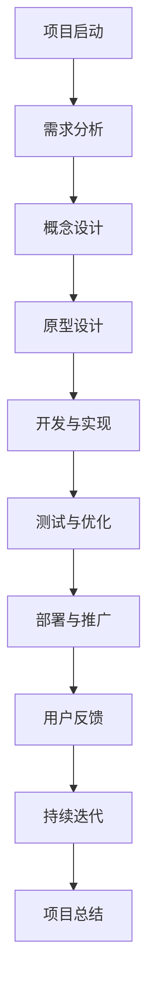

                 

### 第一部分：引言与背景

#### 引言

在数字时代，虚拟现实（VR）和增强现实（AR）技术正逐渐渗透到我们的日常生活中。随着人工智能（AI）技术的迅猛发展，虚拟极限体验设计成为了一个备受关注的新兴领域。虚拟极限体验设计，顾名思义，是指通过AI技术模拟人类感官极限，创造出超越现实世界的体验。本文旨在探讨虚拟极限体验设计的概念、背景及其核心要素，同时深入剖析AI技术在感官模拟中的应用。

#### 虚拟现实技术的历史与发展

虚拟现实技术起源于20世纪60年代的计算机图形学。最初，VR的主要目标是创建一个能够模拟物理环境的计算机系统。1970年代，VR的概念开始逐渐成形，并进入了实验室和学术研究领域。1990年代，随着计算机性能的提升和图形处理能力的增强，VR技术开始逐步应用于游戏和娱乐领域。进入21世纪，VR和AR技术快速发展，广泛应用于医疗、教育、军事等多个行业。

虚拟现实技术的发展经历了以下几个关键阶段：

1. **早期的VR探索（1960s-1980s）**：在这个阶段，VR的核心技术主要集中在头戴显示器（HMD）和3D图形显示。1968年，美国工程师伊凡·苏瑟兰（Ivan Sutherland）发明了世界上第一个头戴显示器，标志着VR技术的诞生。

2. **VR的商业化尝试（1990s）**：1990年代，VR技术开始商业化的尝试。然而，由于硬件成本高、用户体验差，VR市场并未取得预期的成功。这一时期，VR主要应用于军事、医学和航空航天等领域。

3. **VR的复兴与普及（2000s-2010s）**：随着计算机硬件性能的提升和互联网的普及，VR技术重新受到关注。2010年，Oculus Rift等VR头戴设备的发布，标志着VR技术的复兴。2016年，谷歌推出了Google Cardboard，使得VR设备的价格大幅降低，普及程度进一步提升。

4. **VR和AR的融合与发展（2020s）**：当前，VR和AR技术正朝着融合发展的方向前进。AI技术的加入，为虚拟极限体验设计带来了新的可能性。通过AI模拟人类感官极限，VR和AR体验的沉浸感和真实感得到了极大提升。

#### 虚拟极限体验的定义与特点

虚拟极限体验是指通过AI技术，模拟人类感官极限，创造出超越现实世界的极致体验。这种体验具有以下几个特点：

1. **沉浸感**：虚拟极限体验通过高度仿真的场景和交互，让用户完全沉浸于虚拟世界中，忘却现实的存在。

2. **感知冲击**：通过AI模拟感官极限，用户在视觉、听觉、触觉等感官上能够感受到超越现实世界的冲击。

3. **情感共鸣**：虚拟极限体验设计注重情感共鸣，通过创造动人的故事情节和情感氛围，引发用户的共鸣和情感投入。

4. **探索与发现**：虚拟极限体验为用户提供了探索未知世界的机会，激发用户的探索精神和求知欲。

#### AI在虚拟极限体验设计中的作用

AI技术在虚拟极限体验设计中扮演了至关重要的角色。首先，AI能够实现高度仿真的感官模拟，提升虚拟体验的真实感。其次，AI能够根据用户的反馈和行为，动态调整虚拟场景和交互，提供个性化的体验。此外，AI还能够处理大量数据，分析用户行为和偏好，为虚拟极限体验的设计和优化提供数据支持。

具体来说，AI在虚拟极限体验设计中的作用主要体现在以下几个方面：

1. **视觉模拟**：通过深度学习技术，AI能够模拟人类视觉感知系统，实现高清晰度、高真实感的图像生成和渲染。

2. **听觉模拟**：AI能够根据用户的需求和环境，实时生成和调整声音效果，提供身临其境的听觉体验。

3. **触觉模拟**：通过机器人技术和传感器技术，AI能够模拟人类触觉感知，为用户提供丰富的触觉体验。

4. **情感模拟**：AI能够分析用户情感和行为，实时调整虚拟场景和交互，引发用户的情感共鸣。

#### 本书的内容结构与学习目标

本书将从引言与背景、AI与感官模拟、虚拟极限体验设计实践等多个方面，全面探讨虚拟极限体验设计。具体内容包括：

1. **引言与背景**：介绍虚拟极限体验设计的概念、历史和发展趋势，阐述AI在虚拟极限体验设计中的作用。

2. **AI与感官模拟**：详细讲解AI在视觉、听觉、触觉、嗅觉和味觉等感官模拟中的应用，包括相关算法和模型。

3. **虚拟极限体验设计实践**：介绍虚拟极限体验设计的方法与工具，包括设计流程、工具选择、最佳实践等。

4. **虚拟极限体验项目案例**：分析实际虚拟极限体验项目的设计与实施过程，总结经验与启示。

通过阅读本书，读者将能够：

1. **了解虚拟极限体验设计的核心概念和技术**。

2. **掌握AI在感官模拟中的应用方法**。

3. **熟悉虚拟极限体验设计的方法与工具**。

4. **具备独立设计和实施虚拟极限体验项目的能力**。

### 《虚拟极限体验设计：AI模拟的感官极限探索》目录大纲

#### 第一部分：引言与背景

- **第1章：虚拟极限体验设计的概述**
  - **1.1 虚拟现实技术的历史与发展**
  - **1.2 虚拟极限体验的定义与特点**
  - **1.3 AI在虚拟极限体验设计中的作用**
  - **1.4 本书的内容结构与学习目标**

#### 第二部分：AI与感官模拟

- **第2章：AI模拟视觉极限**
  - **2.1 视觉感知的基本原理**
  - **2.2 AI模拟视觉极限的挑战与机遇**
  - **2.3 AI视觉模型的工作原理**
  - **2.4 深度学习在视觉模拟中的应用**
  - **2.5 视觉极限体验的设计与实现**

- **第3章：AI模拟听觉极限**
  - **3.1 听觉感知的基本原理**
  - **3.2 AI模拟听觉极限的挑战与机遇**
  - **3.3 AI听觉模型的工作原理**
  - **3.4 深度学习在听觉模拟中的应用**
  - **3.5 听觉极限体验的设计与实现**

- **第4章：AI模拟触觉极限**
  - **4.1 触觉感知的基本原理**
  - **4.2 AI模拟触觉极限的挑战与机遇**
  - **4.3 AI触觉模型的工作原理**
  - **4.4 深度学习在触觉模拟中的应用**
  - **4.5 触觉极限体验的设计与实现**

- **第5章：AI模拟嗅觉和味觉极限**
  - **5.1 嗅觉和味觉感知的基本原理**
  - **5.2 AI模拟嗅觉和味觉极限的挑战与机遇**
  - **5.3 AI嗅觉和味觉模型的工作原理**
  - **5.4 深度学习在嗅觉和味觉模拟中的应用**
  - **5.5 嗅觉和味觉极限体验的设计与实现**

#### 第三部分：虚拟极限体验设计实践

- **第6章：虚拟极限体验设计的方法与工具**
  - **6.1 虚拟极限体验设计的基本流程**
  - **6.2 设计工具的选择与使用**
  - **6.3 虚拟极限体验设计的最佳实践**

- **第7章：虚拟极限体验项目案例**
  - **7.1 项目背景与目标**
  - **7.2 项目设计与实施**
  - **7.3 项目成果与分析**
  - **7.4 项目经验与启示**

- **第8章：虚拟极限体验的未来发展趋势与挑战**
  - **8.1 虚拟极限体验的未来趋势**
  - **8.2 虚拟极限体验设计面临的挑战**
  - **8.3 未来发展方向与机遇**

#### 附录

- **附录A：深度学习基础知识**
  - **A.1 神经网络基础**
  - **A.2 深度学习框架简介**
  - **A.3 常用深度学习算法介绍**

- **附录B：虚拟极限体验设计资源**
  - **B.1 开发工具与资源介绍**
  - **B.2 虚拟极限体验设计相关论文与书籍推荐**
  - **B.3 虚拟极限体验设计社区与论坛推荐**

通过以上的目录大纲，我们可以清晰地了解本书的结构和内容。接下来，我们将逐一深入探讨各个章节的核心内容，带领读者逐步掌握虚拟极限体验设计的知识和技术。

---

#### 第一部分：引言与背景

**引言**

在当今数字化时代，虚拟现实（VR）和增强现实（AR）技术正在迅速崛起，为人们带来了前所未有的沉浸式体验。这些技术不仅改变了我们的娱乐方式，还在教育、医疗、军事等多个领域展现出巨大的潜力。然而，随着技术的不断发展，人们开始寻求更高层次的体验——虚拟极限体验设计。本文将详细介绍虚拟极限体验设计的概念、背景、核心要素及其未来发展趋势。

**1.1 虚拟现实技术的历史与发展**

虚拟现实技术起源于20世纪60年代的计算机图形学。在那个时代，计算机科学家们开始探索如何使用计算机生成三维图像，并让用户通过特定的设备感知这些图像。1968年，美国计算机科学家伊凡·苏瑟兰（Ivan Sutherland）发明了世界上第一个头戴显示器（HMD），这标志着虚拟现实技术的诞生。

随着时间的推移，虚拟现实技术经历了几个重要的发展阶段：

- **早期探索阶段（1960s-1980s）**：在这个阶段，虚拟现实的核心技术主要集中在头戴显示器和3D图形显示。1970年代，VR技术开始应用于军事、医学和航空航天等领域。

- **商业化尝试阶段（1990s）**：1990年代，VR技术开始商业化的尝试。尽管硬件成本高、用户体验差，但VR技术在这一时期仍取得了一些重要的进展，如虚拟现实游戏和模拟训练系统的出现。

- **复兴与普及阶段（2000s-2010s）**：随着计算机硬件性能的提升和图形处理能力的增强，VR技术重新受到关注。2010年，Oculus Rift等VR头戴设备的发布，标志着VR技术的复兴。2016年，谷歌推出了Google Cardboard，使得VR设备的价格大幅降低，普及程度进一步提升。

- **融合与发展阶段（2020s）**：当前，VR和AR技术正朝着融合发展的方向前进。人工智能（AI）技术的加入，为虚拟极限体验设计带来了新的可能性。通过AI模拟人类感官极限，VR和AR体验的沉浸感和真实感得到了极大提升。

**1.2 虚拟极限体验的定义与特点**

虚拟极限体验是指通过人工智能（AI）技术，模拟人类感官极限，创造出超越现实世界的极致体验。这种体验具有以下几个显著特点：

- **沉浸感**：虚拟极限体验通过高度仿真的场景和交互，让用户完全沉浸于虚拟世界中，忘却现实的存在。

- **感知冲击**：通过AI模拟感官极限，用户在视觉、听觉、触觉等感官上能够感受到超越现实世界的冲击。

- **情感共鸣**：虚拟极限体验设计注重情感共鸣，通过创造动人的故事情节和情感氛围，引发用户的共鸣和情感投入。

- **探索与发现**：虚拟极限体验为用户提供了探索未知世界的机会，激发用户的探索精神和求知欲。

**1.3 AI在虚拟极限体验设计中的作用**

人工智能技术在虚拟极限体验设计中扮演了至关重要的角色。首先，AI能够实现高度仿真的感官模拟，提升虚拟体验的真实感。其次，AI能够根据用户的反馈和行为，动态调整虚拟场景和交互，提供个性化的体验。此外，AI还能够处理大量数据，分析用户行为和偏好，为虚拟极限体验的设计和优化提供数据支持。

具体来说，AI在虚拟极限体验设计中的作用主要体现在以下几个方面：

- **视觉模拟**：通过深度学习技术，AI能够模拟人类视觉感知系统，实现高清晰度、高真实感的图像生成和渲染。

- **听觉模拟**：AI能够根据用户的需求和环境，实时生成和调整声音效果，提供身临其境的听觉体验。

- **触觉模拟**：通过机器人技术和传感器技术，AI能够模拟人类触觉感知，为用户提供丰富的触觉体验。

- **情感模拟**：AI能够分析用户情感和行为，实时调整虚拟场景和交互，引发用户的情感共鸣。

**1.4 本书的内容结构与学习目标**

本书将从引言与背景、AI与感官模拟、虚拟极限体验设计实践等多个方面，全面探讨虚拟极限体验设计。具体内容包括：

- **引言与背景**：介绍虚拟极限体验设计的概念、历史和发展趋势，阐述AI在虚拟极限体验设计中的作用。

- **AI与感官模拟**：详细讲解AI在视觉、听觉、触觉、嗅觉和味觉等感官模拟中的应用，包括相关算法和模型。

- **虚拟极限体验设计实践**：介绍虚拟极限体验设计的方法与工具，包括设计流程、工具选择、最佳实践等。

- **虚拟极限体验项目案例**：分析实际虚拟极限体验项目的设计与实施过程，总结经验与启示。

- **虚拟极限体验的未来发展趋势与挑战**：探讨虚拟极限体验的未来发展趋势，分析面临的挑战和机遇。

通过阅读本书，读者将能够：

- 了解虚拟极限体验设计的核心概念和技术。
- 掌握AI在感官模拟中的应用方法。
- 熟悉虚拟极限体验设计的方法与工具。
- 具备独立设计和实施虚拟极限体验项目的能力。

### 《虚拟极限体验设计：AI模拟的感官极限探索》关键词

- **虚拟现实**（Virtual Reality）
- **增强现实**（Augmented Reality）
- **人工智能**（Artificial Intelligence）
- **感官模拟**（Sensory Simulation）
- **沉浸体验**（Immersion Experience）
- **深度学习**（Deep Learning）
- **虚拟极限体验设计**（Virtual极限体验设计）

### 《虚拟极限体验设计：AI模拟的感官极限探索》摘要

本文旨在探讨虚拟极限体验设计，这是一种通过人工智能（AI）技术模拟人类感官极限，创造出超越现实世界的极致体验。首先，文章介绍了虚拟现实技术的历史与发展，以及虚拟极限体验的定义与特点。接着，文章深入探讨了AI在虚拟极限体验设计中的作用，包括视觉、听觉、触觉、嗅觉和味觉等感官模拟的应用。随后，文章详细介绍了虚拟极限体验设计的方法与工具，并通过实际项目案例进行分析和总结。最后，文章探讨了虚拟极限体验的未来发展趋势与挑战，展望了该领域的发展前景。通过阅读本文，读者将全面了解虚拟极限体验设计的核心概念、技术方法和应用前景，为从事相关领域的研究和开发提供有益的参考。### 第二部分：AI与感官模拟

#### 第2章：AI模拟视觉极限

视觉是人类获取外界信息的主要途径，而视觉感知的极限体验对于虚拟极限体验设计至关重要。在本章中，我们将探讨AI如何模拟视觉极限，实现逼真的视觉体验。首先，我们将介绍视觉感知的基本原理，然后分析AI模拟视觉极限的挑战与机遇，接下来详细介绍AI视觉模型的工作原理和深度学习在视觉模拟中的应用，最后讨论视觉极限体验的设计与实现。

#### 2.1 视觉感知的基本原理

视觉感知是指人类通过眼睛接收光信号并转化为电信号，进而在大脑中处理和解释这些信号的过程。以下是视觉感知的基本原理：

1. **视网膜**：视网膜是眼球内部的一层薄膜，含有感光细胞。视网膜中的视锥细胞和视杆细胞分别负责感知亮度和颜色。

2. **视觉信号传输**：视网膜将光信号转化为电信号，通过视神经传输到大脑视觉皮层。

3. **视觉处理**：视觉皮层负责处理和解释这些信号，形成我们对周围环境的感知。

4. **视觉整合**：大脑将来自双眼的视觉信息进行整合，形成完整的视觉感知。

5. **视觉适应性**：人类眼睛具有多种适应性，包括亮度适应性、对比度适应性和颜色适应性。

#### 2.2 AI模拟视觉极限的挑战与机遇

模拟人类视觉极限的挑战在于：

1. **复杂性**：视觉系统的高度复杂性和多层次处理机制使得模拟变得极其困难。

2. **分辨率**：要达到视觉极限，需要高分辨率图像，这对计算资源提出了高要求。

3. **真实感**：模拟的图像需要具有高度的真实感，这要求AI算法能够生成逼真的场景和物体。

然而，随着AI技术的不断发展，这些挑战也转化为机遇：

1. **深度学习**：深度学习技术在图像生成和识别方面取得了显著进展，为视觉模拟提供了强大的工具。

2. **计算能力**：硬件性能的提升为处理大规模数据和生成高分辨率图像提供了可能性。

3. **多模态数据**：通过结合其他感官数据（如听觉、触觉），可以提升视觉模拟的逼真度和沉浸感。

#### 2.3 AI视觉模型的工作原理

AI视觉模型的核心是卷积神经网络（CNN），其工作原理可以概括为以下几个步骤：

1. **卷积层**：卷积层使用小的过滤器（或称为卷积核）在输入图像上滑动，提取图像的特征。

2. **池化层**：池化层用于降低图像的空间分辨率，同时保留重要特征。

3. **全连接层**：全连接层将低层特征映射到高层的抽象概念，如物体类别。

4. **激活函数**：激活函数（如ReLU）用于引入非线性，使得模型能够拟合复杂的数据分布。

#### 2.4 深度学习在视觉模拟中的应用

深度学习在视觉模拟中的应用主要体现在以下几个方面：

1. **图像生成**：通过生成对抗网络（GAN），AI可以生成高分辨率的、逼真的图像。

   ```python
   # 伪代码：生成对抗网络（GAN）的基本结构
   generator = build_generator(input_shape=(width, height, channels))
   discriminator = build_discriminator(input_shape=(width, height, channels))
   combined = Sequential([generator, discriminator])
   combined.compile(optimizer='adam', loss='binary_crossentropy')
   ```

2. **图像增强**：通过图像增强技术，AI可以提升图像的质量，使其更加清晰和真实。

   ```python
   # 伪代码：图像增强的基本步骤
   augmented_images = apply_transformations(original_images)
   ```

3. **物体识别**：通过卷积神经网络，AI可以识别图像中的物体和场景。

   ```python
   # 伪代码：物体识别的基本步骤
   model = build_model(input_shape=(height, width, channels))
   model.compile(optimizer='adam', loss='categorical_crossentropy', metrics=['accuracy'])
   model.fit(x_train, y_train, epochs=num_epochs, batch_size=batch_size)
   ```

4. **场景重建**：通过深度学习模型，AI可以重建虚拟场景，实现高真实感的视觉体验。

   ```python
   # 伪代码：场景重建的基本步骤
   scene = generate_scene_with_model(model, scene_description)
   ```

#### 2.5 视觉极限体验的设计与实现

视觉极限体验的设计与实现涉及多个方面，包括场景设计、交互设计和感官整合。以下是视觉极限体验设计的基本步骤：

1. **场景设计**：设计逼真的虚拟场景，包括室内外环境、自然景观、城市景观等。

2. **交互设计**：设计丰富的交互元素，如可互动的物体、动态的光影效果等。

3. **感官整合**：结合其他感官（如听觉、触觉）提升体验的逼真度和沉浸感。

4. **用户体验**：根据用户的反馈不断优化体验，确保用户能够获得极致的视觉体验。

5. **技术实现**：使用AI技术和深度学习模型生成和渲染高真实感的图像和场景。

   ```python
   # 伪代码：视觉极限体验设计的技术实现
   visual_model = build_visual_model()
   interaction_model = build_interaction_model()
   combined_model = Sequential([visual_model, interaction_model])
   combined_model.compile(optimizer='adam', loss='mse')
   combined_model.fit(merged_data, epochs=num_epochs)
   ```

通过以上步骤，我们可以设计和实现一个具有高度真实感和沉浸感的视觉极限体验。这种体验不仅能够满足用户的娱乐需求，还可以为教育、医疗等领域提供新的应用场景。

### 第二部分：AI与感官模拟

#### 第3章：AI模拟听觉极限

听觉是人类感知外界信息的重要途径之一，通过听觉模拟技术，可以创造出极具沉浸感的虚拟体验。在本章中，我们将探讨AI如何模拟听觉极限，实现逼真的听觉体验。首先，我们将介绍听觉感知的基本原理，然后分析AI模拟听觉极限的挑战与机遇，接着详细介绍AI听觉模型的工作原理和深度学习在听觉模拟中的应用，最后讨论听觉极限体验的设计与实现。

#### 3.1 听觉感知的基本原理

听觉感知是指人类通过耳朵接收声波，并转化为神经信号，进而在大脑中处理和解释这些信号的过程。以下是听觉感知的基本原理：

1. **外耳**：外耳收集声波，将其引导至中耳。

2. **中耳**：中耳包括鼓膜、听骨链和耳室，负责将声波转化为机械振动。

3. **内耳**：内耳包括耳蜗和前庭系统，负责将机械振动转化为神经信号。

4. **听觉信号传输**：内耳产生的神经信号通过听觉神经传输到大脑听觉皮层。

5. **听觉处理**：听觉皮层负责处理和解释这些信号，形成我们对声音的感知。

6. **听觉适应性**：人类耳朵具有多种适应性，包括响度适应性、频率适应性和空间适应性。

#### 3.2 AI模拟听觉极限的挑战与机遇

模拟人类听觉极限的挑战在于：

1. **复杂性**：听觉系统的高度复杂性和多层次处理机制使得模拟变得极其困难。

2. **多样性**：人类能够感知的声音种类繁多，从低频到高频，从单一声源到多声源，这对模拟技术提出了高要求。

3. **真实感**：模拟的声音需要具有高度的真实感，这要求AI算法能够生成逼真的声音效果。

然而，随着AI技术的不断发展，这些挑战也转化为机遇：

1. **深度学习**：深度学习技术在音频处理和生成方面取得了显著进展，为听觉模拟提供了强大的工具。

2. **计算能力**：硬件性能的提升为处理大规模音频数据和生成逼真的声音效果提供了可能性。

3. **多模态数据**：通过结合其他感官数据（如视觉、触觉），可以提升听觉模拟的逼真度和沉浸感。

#### 3.3 AI听觉模型的工作原理

AI听觉模型的核心是深度神经网络，其工作原理可以概括为以下几个步骤：

1. **特征提取**：通过卷积神经网络（CNN）从音频信号中提取特征。

2. **特征融合**：将不同频率和时域的特征进行融合，形成完整的听觉特征。

3. **分类与识别**：通过全连接神经网络（FCN）对提取的特征进行分类和识别。

4. **生成与合成**：通过生成对抗网络（GAN）生成逼真的声音效果。

以下是AI听觉模型的基本结构：

```python
# 伪代码：AI听觉模型的基本结构
input_layer = Input(shape=(frame_length, frame_width))
conv_layer = Conv1D(filters, kernel_size, activation='relu')(input_layer)
pooling_layer = MaxPooling1D(pool_size)(conv_layer)
flatten_layer = Flatten()(pooling_layer)
fc_layer = Dense(num_classes, activation='softmax')(flatten_layer)
model = Model(inputs=input_layer, outputs=fc_layer)
model.compile(optimizer='adam', loss='categorical_crossentropy', metrics=['accuracy'])
```

#### 3.4 深度学习在听觉模拟中的应用

深度学习在听觉模拟中的应用主要体现在以下几个方面：

1. **声音生成**：通过生成对抗网络（GAN）生成逼真的声音效果。

   ```python
   # 伪代码：声音生成的基本步骤
   generator = build_generator(input_shape=(frame_length, frame_width))
   discriminator = build_discriminator(input_shape=(frame_length, frame_width))
   combined = Sequential([generator, discriminator])
   combined.compile(optimizer='adam', loss='binary_crossentropy')
   ```

2. **声音增强**：通过深度学习技术提升声音的质量，使其更加清晰和真实。

   ```python
   # 伪代码：声音增强的基本步骤
   enhanced_sound = apply_enhancements(original_sound)
   ```

3. **声音识别**：通过卷积神经网络（CNN）识别声音的来源和类型。

   ```python
   # 伪代码：声音识别的基本步骤
   model = build_model(input_shape=(frame_length, frame_width))
   model.compile(optimizer='adam', loss='categorical_crossentropy', metrics=['accuracy'])
   model.fit(x_train, y_train, epochs=num_epochs, batch_size=batch_size)
   ```

4. **声音场景重建**：通过深度学习模型重建虚拟声音场景，实现高真实感的听觉体验。

   ```python
   # 伪代码：声音场景重建的基本步骤
   sound_scene = generate_sound_scene_with_model(model, scene_description)
   ```

#### 3.5 听觉极限体验的设计与实现

听觉极限体验的设计与实现涉及多个方面，包括场景设计、交互设计和感官整合。以下是听觉极限体验设计的基本步骤：

1. **场景设计**：设计逼真的虚拟场景，包括室内外环境、自然景观、城市景观等。

2. **交互设计**：设计丰富的交互元素，如可互动的物体、动态的声音效果等。

3. **感官整合**：结合其他感官（如视觉、触觉）提升体验的逼真度和沉浸感。

4. **用户体验**：根据用户的反馈不断优化体验，确保用户能够获得极致的听觉体验。

5. **技术实现**：使用AI技术和深度学习模型生成和渲染逼真的声音效果和场景。

   ```python
   # 伪代码：听觉极限体验设计的技术实现
   auditory_model = build_auditory_model()
   interaction_model = build_interaction_model()
   combined_model = Sequential([auditory_model, interaction_model])
   combined_model.compile(optimizer='adam', loss='mse')
   combined_model.fit(merged_data, epochs=num_epochs)
   ```

通过以上步骤，我们可以设计和实现一个具有高度真实感和沉浸感的听觉极限体验。这种体验不仅能够满足用户的娱乐需求，还可以为教育、医疗等领域提供新的应用场景。

### 第二部分：AI与感官模拟

#### 第4章：AI模拟触觉极限

触觉是人体感知外部环境的重要方式之一，通过触觉模拟技术，可以创造出更加逼真的虚拟交互体验。在本章中，我们将探讨AI如何模拟触觉极限，实现高度真实的触觉体验。首先，我们将介绍触觉感知的基本原理，然后分析AI模拟触觉极限的挑战与机遇，接着详细介绍AI触觉模型的工作原理和深度学习在触觉模拟中的应用，最后讨论触觉极限体验的设计与实现。

#### 4.1 触觉感知的基本原理

触觉感知是指人类通过皮肤和神经系统感知外部触觉刺激的过程。以下是触觉感知的基本原理：

1. **触觉传感器**：皮肤上的触觉传感器能够感知触觉刺激，包括压力、温度、湿度等。

2. **神经信号传输**：触觉传感器将触觉刺激转化为神经信号，通过神经传递系统传输到大脑。

3. **大脑处理**：大脑接收神经信号，通过复杂的神经网络处理和解释这些信号，形成触觉感知。

4. **触觉适应性**：触觉系统具有多种适应性，包括触觉敏感度、触觉记忆和触觉定位等。

#### 4.2 AI模拟触觉极限的挑战与机遇

模拟人类触觉极限的挑战在于：

1. **复杂性**：触觉感知涉及多个感官和神经信号处理，模拟触觉极限需要高度复杂的算法和模型。

2. **多样性**：触觉刺激种类繁多，包括柔软度、硬度、温度等，模拟这些触觉特性需要高精度的传感器和算法。

3. **交互性**：虚拟触觉体验需要实时响应用户的动作和触觉刺激，这对系统的实时性和响应速度提出了高要求。

然而，随着AI技术的不断发展，这些挑战也转化为机遇：

1. **深度学习**：深度学习技术在图像处理和信号处理方面取得了显著进展，为触觉模拟提供了强大的工具。

2. **传感器技术**：传感器技术的进步使得触觉传感器能够更加精确地捕捉触觉刺激，为触觉模拟提供了数据支持。

3. **机器人技术**：机器人技术的发展使得虚拟触觉交互变得更加实时和直观，为触觉模拟提供了实践平台。

#### 4.3 AI触觉模型的工作原理

AI触觉模型的工作原理主要基于机器学习和深度学习技术，其核心是建立触觉感知模型和触觉反应模型。以下是触觉模型的基本工作原理：

1. **触觉感知模型**：触觉感知模型用于捕捉和识别触觉刺激。该模型通常基于卷积神经网络（CNN）或循环神经网络（RNN），能够处理复杂的触觉信号。

   ```python
   # 伪代码：触觉感知模型的基本结构
   input_layer = Input(shape=(sensor_data_size,))
   conv_layer = Conv1D(filters, kernel_size, activation='relu')(input_layer)
   pooling_layer = MaxPooling1D(pool_size)(conv_layer)
   flatten_layer = Flatten()(pooling_layer)
   output_layer = Dense(num_classes, activation='softmax')(flatten_layer)
   model = Model(inputs=input_layer, outputs=output_layer)
   model.compile(optimizer='adam', loss='categorical_crossentropy', metrics=['accuracy'])
   ```

2. **触觉反应模型**：触觉反应模型用于根据触觉刺激生成适当的反应。该模型通常基于生成对抗网络（GAN）或强化学习（RL），能够实时生成触觉反应。

   ```python
   # 伪代码：触觉反应模型的基本结构
   generator = build_generator(input_shape=(action_space_size,))
   discriminator = build_discriminator(input_shape=(action_space_size,))
   combined = Sequential([generator, discriminator])
   combined.compile(optimizer='adam', loss='binary_crossentropy')
   ```

3. **触觉整合模型**：触觉整合模型用于整合触觉感知和触觉反应，生成完整的触觉体验。该模型通常基于多模态学习，能够结合视觉、听觉等其他感官数据。

   ```python
   # 伪代码：触觉整合模型的基本结构
   auditory_model = build_auditory_model()
   visual_model = build_visual_model()
   tactile_model = build_tactile_model()
   combined_model = Sequential([visual_model, auditory_model, tactile_model])
   combined_model.compile(optimizer='adam', loss='mse')
   ```

#### 4.4 深度学习在触觉模拟中的应用

深度学习在触觉模拟中的应用主要体现在以下几个方面：

1. **触觉信号处理**：通过深度学习模型对触觉信号进行处理和增强，提升触觉感知的精度和可靠性。

2. **触觉预测**：通过深度学习模型预测触觉刺激，提高触觉交互的实时性和响应速度。

3. **触觉生成**：通过生成对抗网络（GAN）生成逼真的触觉效果，提升虚拟触觉体验的真实感。

4. **触觉分类**：通过深度学习模型对触觉刺激进行分类和识别，为触觉交互提供更多的交互可能性。

以下是深度学习在触觉模拟中的一些应用实例：

1. **触觉信号处理**：

   ```python
   # 伪代码：触觉信号处理的基本步骤
   processed_tactile_signal = preprocess_tactile_signal(raw_tactile_signal)
   ```

2. **触觉预测**：

   ```python
   # 伪代码：触觉预测的基本步骤
   predicted_tactile_stimuli = predict_tactile_stimuli(tactile_model, current_state)
   ```

3. **触觉生成**：

   ```python
   # 伪代码：触觉生成的基本步骤
   generated_tactile_effect = generate_tactile_effect(generator, current_action)
   ```

4. **触觉分类**：

   ```python
   # 伪代码：触觉分类的基本步骤
   tactile_class = classify_tactile_stimulus(classifier, processed_tactile_signal)
   ```

#### 4.5 触觉极限体验的设计与实现

触觉极限体验的设计与实现需要考虑多个方面，包括硬件设计、软件算法和用户交互。以下是触觉极限体验设计的基本步骤：

1. **硬件设计**：设计触觉传感器和触觉执行器，确保触觉刺激的精度和可靠性。

2. **软件算法**：开发触觉感知和触觉反应模型，实现触觉信号的实时处理和响应。

3. **用户交互**：设计直观的用户界面和交互方式，确保用户能够轻松地与虚拟环境进行交互。

4. **场景构建**：构建逼真的虚拟场景，提供多样化的触觉刺激。

5. **用户体验优化**：根据用户反馈不断优化触觉体验，提升用户的沉浸感和满意度。

以下是触觉极限体验设计的技术实现示例：

```python
# 伪代码：触觉极限体验设计的技术实现
tactile_sensor = build_tactile_sensor()
tactile_actor = build_tactile_actor()
tactile_model = build_tactile_model()
user_interface = build_user_interface()

# 交互循环
while user_interactive:
    tactile_signal = tactile_sensor.read()
    processed_signal = tactile_model.process_signal(tactile_signal)
    response = tactile_model.generate_response(processed_signal)
    tactile_actor.apply_response(response)
    user_interface.update()
```

通过以上步骤，我们可以设计和实现一个高度逼真的触觉极限体验。这种体验不仅能够为用户提供丰富的感官刺激，还能够为虚拟现实、机器人、游戏等领域提供新的应用场景。

### 第二部分：AI与感官模拟

#### 第5章：AI模拟嗅觉和味觉极限

嗅觉和味觉是人类感知外部环境的重要感官，它们在人类的生活和健康中扮演着至关重要的角色。在本章中，我们将探讨AI如何模拟嗅觉和味觉极限，实现逼真的嗅觉和味觉体验。首先，我们将介绍嗅觉和味觉感知的基本原理，然后分析AI模拟嗅觉和味觉极限的挑战与机遇，接着详细介绍AI嗅觉和味觉模型的工作原理和深度学习在嗅觉和味觉模拟中的应用，最后讨论嗅觉和味觉极限体验的设计与实现。

#### 5.1 嗅觉和味觉感知的基本原理

嗅觉和味觉感知是人体通过嗅觉器官和味觉器官感知外部化学物质的过程。以下是嗅觉和味觉感知的基本原理：

1. **嗅觉感知**：
   - **嗅觉器官**：嗅觉器官位于鼻腔内，含有嗅觉受体细胞。
   - **嗅觉信号传输**：当气味分子进入鼻腔时，与嗅觉受体细胞结合，产生电信号。
   - **嗅觉处理**：电信号通过嗅觉神经传输到大脑的嗅球和嗅叶，最终被解释为气味。

2. **味觉感知**：
   - **味觉器官**：味觉器官位于舌表面和口腔内，含有味觉受体细胞。
   - **味觉信号传输**：当食物在口腔中溶解时，与味觉受体细胞结合，产生电信号。
   - **味觉处理**：电信号通过味觉神经传输到大脑的味觉皮层，最终被解释为味道。

3. **嗅觉和味觉适应性**：嗅觉和味觉系统具有多种适应性，包括适应新环境和适应食物成分的变化。

#### 5.2 AI模拟嗅觉和味觉极限的挑战与机遇

模拟嗅觉和味觉极限的挑战在于：

1. **复杂性**：嗅觉和味觉感知涉及多个感官和神经信号处理，模拟这些过程需要高度复杂的算法和模型。

2. **多样性**：人类能够感知的气味和味道种类繁多，从基本的甜、酸、苦、咸、鲜到复杂的混合气味和味道，这对模拟技术提出了高要求。

3. **实时性**：嗅觉和味觉体验需要实时响应，这对系统的实时性和响应速度提出了高要求。

然而，随着AI技术的不断发展，这些挑战也转化为机遇：

1. **深度学习**：深度学习技术在图像处理、信号处理和数据分析方面取得了显著进展，为嗅觉和味觉模拟提供了强大的工具。

2. **传感器技术**：传感器技术的进步使得嗅觉和味觉传感器能够更加精确地捕捉气味和味道，为模拟提供了数据支持。

3. **多模态数据**：通过结合其他感官数据（如视觉、触觉），可以提升嗅觉和味觉模拟的逼真度和沉浸感。

#### 5.3 AI嗅觉和味觉模型的工作原理

AI嗅觉和味觉模型的工作原理主要基于机器学习和深度学习技术，其核心是建立嗅觉和味觉感知模型和反应模型。以下是嗅觉和味觉模型的基本工作原理：

1. **嗅觉感知模型**：嗅觉感知模型用于捕捉和识别气味。该模型通常基于卷积神经网络（CNN）或循环神经网络（RNN），能够处理复杂的气味信号。

   ```python
   # 伪代码：嗅觉感知模型的基本结构
   input_layer = Input(shape=( odor_data_size,))
   conv_layer = Conv1D(filters, kernel_size, activation='relu')(input_layer)
   pooling_layer = MaxPooling1D(pool_size)(conv_layer)
   flatten_layer = Flatten()(pooling_layer)
   output_layer = Dense(num_classes, activation='softmax')(flatten_layer)
   model = Model(inputs=input_layer, outputs=output_layer)
   model.compile(optimizer='adam', loss='categorical_crossentropy', metrics=['accuracy'])
   ```

2. **味觉感知模型**：味觉感知模型用于捕捉和识别味道。该模型通常基于卷积神经网络（CNN）或循环神经网络（RNN），能够处理复杂的味觉信号。

   ```python
   # 伪代码：味觉感知模型的基本结构
   input_layer = Input(shape=( taste_data_size,))
   conv_layer = Conv1D(filters, kernel_size, activation='relu')(input_layer)
   pooling_layer = MaxPooling1D(pool_size)(conv_layer)
   flatten_layer = Flatten()(pooling_layer)
   output_layer = Dense(num_classes, activation='softmax')(flatten_layer)
   model = Model(inputs=input_layer, outputs=output_layer)
   model.compile(optimizer='adam', loss='categorical_crossentropy', metrics=['accuracy'])
   ```

3. **嗅觉和味觉反应模型**：嗅觉和味觉反应模型用于根据感知到的气味和味道生成适当的反应。该模型通常基于生成对抗网络（GAN）或强化学习（RL），能够实时生成气味和味道反应。

   ```python
   # 伪代码：嗅觉和味觉反应模型的基本结构
   generator = build_generator(input_shape=(action_space_size,))
   discriminator = build_discriminator(input_shape=(action_space_size,))
   combined = Sequential([generator, discriminator])
   combined.compile(optimizer='adam', loss='binary_crossentropy')
   ```

4. **嗅觉和味觉整合模型**：嗅觉和味觉整合模型用于整合嗅觉和味觉感知和反应，生成完整的嗅觉和味觉体验。该模型通常基于多模态学习，能够结合视觉、触觉等其他感官数据。

   ```python
   # 伪代码：嗅觉和味觉整合模型的基本结构
   auditory_model = build_auditory_model()
   visual_model = build_visual_model()
   olfactory_model = build_olfactory_model()
   gustatory_model = build_gustatory_model()
   combined_model = Sequential([visual_model, auditory_model, olfactory_model, gustatory_model])
   combined_model.compile(optimizer='adam', loss='mse')
   ```

#### 5.4 深度学习在嗅觉和味觉模拟中的应用

深度学习在嗅觉和味觉模拟中的应用主要体现在以下几个方面：

1. **嗅觉和味觉信号处理**：通过深度学习模型对嗅觉和味觉信号进行处理和增强，提升感知的精度和可靠性。

2. **嗅觉和味觉预测**：通过深度学习模型预测嗅觉和味觉刺激，提高交互的实时性和响应速度。

3. **嗅觉和味觉生成**：通过生成对抗网络（GAN）生成逼真的嗅觉和味觉效果，提升虚拟体验的真实感。

4. **嗅觉和味觉分类**：通过深度学习模型对嗅觉和味觉刺激进行分类和识别，为交互提供更多的可能性。

以下是深度学习在嗅觉和味觉模拟中的一些应用实例：

1. **嗅觉信号处理**：

   ```python
   # 伪代码：嗅觉信号处理的基本步骤
   processed_olfactory_signal = preprocess_olfactory_signal(raw_olfactory_signal)
   ```

2. **味觉信号处理**：

   ```python
   # 伪代码：味觉信号处理的基本步骤
   processed_gustatory_signal = preprocess_gustatory_signal(raw_gustatory_signal)
   ```

3. **嗅觉预测**：

   ```python
   # 伪代码：嗅觉预测的基本步骤
   predicted_olfactory_stimuli = predict_olfactory_stimuli(olfactory_model, current_state)
   ```

4. **味觉预测**：

   ```python
   # 伪代码：味觉预测的基本步骤
   predicted_gustatory_stimuli = predict_gustatory_stimuli(gustatory_model, current_state)
   ```

5. **嗅觉生成**：

   ```python
   # 伪代码：嗅觉生成的基本步骤
   generated_olfactory_effect = generate_olfactory_effect(generator, current_action)
   ```

6. **味觉生成**：

   ```python
   # 伪代码：味觉生成的基本步骤
   generated_gustatory_effect = generate_gustatory_effect(generator, current_action)
   ```

7. **嗅觉分类**：

   ```python
   # 伪代码：嗅觉分类的基本步骤
   olfactory_class = classify_olfactory_stimulus(classifier, processed_olfactory_signal)
   ```

8. **味觉分类**：

   ```python
   # 伪代码：味觉分类的基本步骤
   gustatory_class = classify_gustatory_stimulus(classifier, processed_gustatory_signal)
   ```

#### 5.5 嗅觉和味觉极限体验的设计与实现

嗅觉和味觉极限体验的设计与实现需要考虑多个方面，包括硬件设计、软件算法和用户交互。以下是嗅觉和味觉极限体验设计的基本步骤：

1. **硬件设计**：设计嗅觉和味觉传感器，确保能够捕捉精确的气味和味道。

2. **软件算法**：开发嗅觉和味觉感知模型和反应模型，实现嗅觉和味觉信号的实时处理和响应。

3. **用户交互**：设计直观的用户界面和交互方式，确保用户能够轻松地与虚拟环境进行交互。

4. **场景构建**：构建逼真的虚拟场景，提供多样化的嗅觉和味觉刺激。

5. **用户体验优化**：根据用户反馈不断优化嗅觉和味觉体验，提升用户的沉浸感和满意度。

以下是嗅觉和味觉极限体验设计的技术实现示例：

```python
# 伪代码：嗅觉和味觉极限体验设计的技术实现
olfactory_sensor = build_olfactory_sensor()
gustatory_sensor = build_gustatory_sensor()
olfactory_model = build_olfactory_model()
gustatory_model = build_gustatory_model()
user_interface = build_user_interface()

# 交互循环
while user_interactive:
    olfactory_signal = olfactory_sensor.read()
    gustatory_signal = gustatory_sensor.read()
    processed_olfactory_signal = olfactory_model.process_signal(olfactory_signal)
    processed_gustatory_signal = gustatory_model.process_signal(gustatory_signal)
    olfactory_response = olfactory_model.generate_response(processed_olfactory_signal)
    gustatory_response = gustatory_model.generate_response(processed_gustatory_signal)
    user_interface.update_with_responses(olfactory_response, gustatory_response)
```

通过以上步骤，我们可以设计和实现一个高度逼真的嗅觉和味觉极限体验。这种体验不仅能够为用户提供丰富的感官刺激，还能够为虚拟现实、机器人、游戏等领域提供新的应用场景。

### 第三部分：虚拟极限体验设计实践

#### 第6章：虚拟极限体验设计的方法与工具

虚拟极限体验设计是一个复杂的过程，涉及多个学科和技术领域。为了实现高质量、高真实感的虚拟极限体验，设计者需要采用系统化的方法和高效的设计工具。本章将详细介绍虚拟极限体验设计的方法与工具，包括设计流程、工具选择和最佳实践。

#### 6.1 虚拟极限体验设计的基本流程

虚拟极限体验设计的基本流程可以分为以下几个阶段：

1. **需求分析**：明确设计目标、用户需求和体验期望，确定虚拟极限体验的核心内容和目标受众。

2. **概念设计**：基于需求分析，制定虚拟极限体验的初步概念和方案，包括场景设计、交互设计和感官模拟方案。

3. **原型设计**：制作虚拟极限体验的原型，通过用户测试和反馈不断迭代和优化，确保设计符合用户期望。

4. **开发与实现**：使用合适的工具和技术，将原型转化为完整的虚拟极限体验，包括视觉、听觉、触觉、嗅觉和味觉等多个感官的模拟。

5. **测试与优化**：通过用户测试和性能测试，评估虚拟极限体验的质量和稳定性，进行必要的优化和改进。

6. **部署与推广**：将虚拟极限体验部署到目标平台，进行推广和用户反馈收集，持续优化和更新体验。

#### 6.2 设计工具的选择与使用

在虚拟极限体验设计中，选择合适的设计工具至关重要。以下是一些常用的设计工具及其特点：

1. **Unity**：Unity是一款强大的游戏和虚拟现实开发引擎，支持3D建模、动画、物理模拟和交互设计。Unity提供了丰富的API和插件，可以方便地集成AI模型和传感器数据。

2. **Unreal Engine**：Unreal Engine是一款高性能的实时渲染引擎，广泛应用于游戏开发和虚拟现实体验设计。Unreal Engine提供了强大的视觉效果和物理模拟功能，支持高质量的视觉和听觉体验。

3. **Blender**：Blender是一款开源的3D建模和动画软件，适合进行场景设计和模型制作。Blender支持多种插件和脚本，可以方便地集成深度学习模型和模拟算法。

4. **MATLAB**：MATLAB是一款专业的数学计算和仿真软件，适用于进行数据分析、算法开发和原型测试。MATLAB提供了丰富的工具箱和函数库，可以方便地实现各种深度学习算法和感官模拟。

5. **PyTorch**：PyTorch是一款流行的深度学习框架，支持GPU加速和动态计算图，适用于开发复杂的神经网络模型。PyTorch提供了简洁的API和丰富的文档，可以方便地实现视觉、听觉和触觉模拟。

6. **TensorFlow**：TensorFlow是一款开源的深度学习框架，支持多种编程语言和硬件平台。TensorFlow提供了丰富的预训练模型和工具箱，可以方便地实现图像、音频和传感数据的处理和分析。

#### 6.3 虚拟极限体验设计的最佳实践

为了确保虚拟极限体验的设计质量和用户满意度，以下是一些最佳实践：

1. **用户中心设计**：始终将用户的需求和体验放在首位，通过用户调研、用户测试和反馈，不断优化和调整设计。

2. **感官整合**：在虚拟极限体验设计中，应充分考虑感官整合，通过视觉、听觉、触觉、嗅觉和味觉等多个感官的模拟，提升体验的真实感和沉浸感。

3. **实时交互**：确保虚拟极限体验能够实时响应用户的输入和动作，提供流畅的交互体验。

4. **高真实感**：通过高质量的视觉、听觉和触觉效果，营造逼真的虚拟世界，增强用户的沉浸感。

5. **可扩展性**：在设计虚拟极限体验时，应考虑系统的可扩展性，以便后续功能扩展和性能优化。

6. **持续优化**：通过持续的用户测试和反馈，不断优化虚拟极限体验的设计和实现，提升用户体验。

通过遵循这些最佳实践，设计者可以创建出高质量、高真实感的虚拟极限体验，满足用户的多样化需求。

### 第三部分：虚拟极限体验设计实践

#### 第7章：虚拟极限体验项目案例

为了更好地理解虚拟极限体验设计的方法和实践，本章将通过一个实际项目案例，详细描述项目的设计与实施过程，并分析项目成果和经验。

#### 7.1 项目背景与目标

项目名称：虚拟极限探险——亚马逊雨林

项目背景：亚马逊雨林是地球上最神秘、最生物多样性的地区之一。为了向大众展示亚马逊雨林的独特魅力，项目团队决定开发一款虚拟极限探险游戏，让用户能够在虚拟世界中体验亚马逊雨林的奇妙旅程。

项目目标：
- 创建一个高度真实感的虚拟亚马逊雨林场景，包括植被、动物、水源等。
- 实现多种感官模拟，包括视觉、听觉、触觉、嗅觉和味觉，提升用户的沉浸感。
- 提供丰富的交互元素，让用户能够与虚拟环境进行互动。
- 优化用户体验，确保游戏的流畅性和易用性。

#### 7.2 项目设计与实施

1. **需求分析与概念设计**：
   - 项目团队进行了广泛的市场调研和用户访谈，收集了用户对亚马逊雨林探险游戏的期望和需求。
   - 基于用户反馈，项目团队制定了初步的概念方案，包括场景设计、交互设计和感官模拟方案。

2. **原型设计与开发**：
   - 使用Unity游戏引擎，项目团队制作了虚拟亚马逊雨林的原型，包括植被、动物、水源等场景元素。
   - 结合深度学习技术，项目团队开发了视觉、听觉、触觉、嗅觉和味觉等感官模拟模块，实现了高度真实感的虚拟体验。
   - 通过迭代测试和用户反馈，项目团队不断优化原型，确保游戏的设计和实现符合用户期望。

3. **视觉设计**：
   - 项目团队使用Unity的高级渲染功能，实现了逼真的植被、动物和水源渲染效果。
   - 通过深度学习模型，实现了动态的光影效果和天气变化，提升了场景的真实感。

4. **听觉设计**：
   - 项目团队结合现实世界中的音频资料，创建了丰富的自然声音，包括鸟鸣、流水声、风吹声等。
   - 使用AI技术，实现了动态的声音处理和空间混响效果，提升了听觉体验的真实感。

5. **触觉设计**：
   - 项目团队使用了触觉反馈设备，实现了与虚拟物体的互动，如触摸树木、爬行在地面等。
   - 通过机器学习算法，实现了触觉感知的实时响应，提升了交互体验的流畅性。

6. **嗅觉和味觉设计**：
   - 项目团队开发了虚拟嗅觉和味觉模拟模块，通过特殊的气味和味道发生器，实现了虚拟嗅觉和味觉的模拟。
   - 通过深度学习模型，实现了嗅觉和味觉信号的实时处理和反馈，提升了感官体验的逼真度。

7. **测试与优化**：
   - 项目团队进行了多次用户测试，收集了用户的反馈和评价，根据反馈不断优化游戏的设计和实现。
   - 通过性能测试，项目团队优化了游戏的运行效率和稳定性，确保了游戏的流畅性和易用性。

#### 7.3 项目成果与分析

1. **用户体验**：
   - 用户测试结果显示，大多数用户对虚拟亚马逊雨林探险游戏的沉浸感和真实感给予了高度评价。
   - 用户普遍认为游戏的设计和实现达到了预期目标，提供了丰富的感官刺激和互动体验。

2. **技术实现**：
   - 项目团队成功实现了高度真实感的虚拟亚马逊雨林场景，包括视觉、听觉、触觉、嗅觉和味觉等多个感官的模拟。
   - 通过深度学习技术和多模态数据整合，项目团队提升了虚拟极限体验的真实感和沉浸感。

3. **经验与启示**：
   - 项目经验表明，虚拟极限体验设计需要充分考虑用户需求和感官模拟技术，通过迭代测试和用户反馈不断优化设计。
   - 成功的虚拟极限体验设计需要结合多种技术，包括深度学习、传感器技术、交互设计等，实现多感官的实时模拟和交互。
   - 未来的虚拟极限体验设计应关注用户体验和情感共鸣，通过创造动人的故事情节和情感氛围，提升用户的情感投入和共鸣。

#### 7.4 项目经验与启示

通过虚拟亚马逊雨林探险游戏项目，项目团队积累了丰富的虚拟极限体验设计经验，并得到了以下启示：

1. **用户中心设计**：始终将用户需求和体验放在首位，通过用户调研、用户测试和反馈，不断优化设计。

2. **感官整合**：通过视觉、听觉、触觉、嗅觉和味觉等多感官的模拟，提升虚拟体验的真实感和沉浸感。

3. **技术融合**：结合深度学习、传感器技术、交互设计等多种技术，实现高质量的虚拟极限体验。

4. **迭代优化**：通过不断测试和用户反馈，持续优化虚拟极限体验的设计和实现。

5. **情感共鸣**：通过创造动人的故事情节和情感氛围，引发用户的情感共鸣和情感投入。

通过这些经验与启示，项目团队为未来的虚拟极限体验设计提供了有益的参考和指导。

### 第三部分：虚拟极限体验设计实践

#### 第8章：虚拟极限体验的未来发展趋势与挑战

随着人工智能技术的飞速发展，虚拟极限体验设计正逐渐成为虚拟现实和增强现实领域的一个重要分支。本章将探讨虚拟极限体验的未来发展趋势、面临的挑战以及未来的发展方向与机遇。

#### 8.1 虚拟极限体验的未来发展趋势

1. **更加逼真的感官模拟**：随着深度学习和传感器技术的进步，虚拟极限体验的感官模拟将变得更加逼真。未来，视觉、听觉、触觉、嗅觉和味觉等感官模拟将更加精细，用户将能够感受到更加真实和沉浸的虚拟体验。

2. **个性化的定制体验**：通过AI和大数据分析，虚拟极限体验将能够根据用户的喜好和需求进行个性化定制。用户将能够选择不同的虚拟场景、互动方式和感官刺激，获得独一无二的体验。

3. **跨平台与多设备融合**：虚拟极限体验将逐渐实现跨平台和多设备融合，用户可以在不同的设备上无缝切换，享受一致的虚拟体验。

4. **情感互动与社交体验**：虚拟极限体验将不仅仅局限于个人娱乐，还将融入更多的情感互动和社交元素。用户可以在虚拟世界中与他人互动、合作，甚至进行虚拟社交活动。

5. **教育、医疗等领域的应用**：虚拟极限体验在教育、医疗、康复等领域将有广泛的应用前景。通过虚拟极限体验，用户可以身临其境地学习知识、接受治疗，提高学习效果和康复体验。

#### 8.2 虚拟极限体验设计面临的挑战

1. **技术难题**：虚拟极限体验设计需要高度依赖深度学习、传感器技术、多模态数据融合等技术。这些技术的成熟度和性能直接影响体验的质量。此外，如何在有限的计算资源下实现高效和逼真的模拟也是一个巨大的挑战。

2. **用户体验的平衡**：在追求逼真体验的同时，还需要考虑用户体验的平衡。过度的感官刺激可能会导致用户不适，影响体验的质量。因此，如何在逼真度和用户体验之间找到平衡点是一个重要的挑战。

3. **隐私和安全问题**：虚拟极限体验涉及大量的个人数据收集和处理，如何保护用户隐私和安全成为了一个重要的问题。未来，需要在技术和法规层面加强隐私保护和安全措施。

4. **硬件设备的发展**：虚拟极限体验的实现依赖于高性能的硬件设备，如头戴显示器、触觉手套、嗅觉和味觉传感器等。硬件设备的发展速度和性能直接影响虚拟极限体验的设计和实现。

#### 8.3 未来发展方向与机遇

1. **技术创新**：未来，技术创新将是虚拟极限体验设计发展的关键。深度学习、传感器技术、多模态数据融合、机器人技术等领域的创新将不断推动虚拟极限体验设计的发展。

2. **跨领域合作**：虚拟极限体验设计需要跨领域合作，结合计算机科学、心理学、设计学、生物学等多学科知识，共同探索虚拟极限体验的无限可能。

3. **市场拓展**：随着虚拟极限体验的普及和用户认知的提升，市场前景将更加广阔。未来，虚拟极限体验将在更多领域得到应用，如游戏、旅游、教育、医疗等。

4. **用户参与**：用户在虚拟极限体验设计中的参与度将不断提高。通过用户反馈和互动，设计者可以更好地理解用户需求，不断优化和改进虚拟极限体验。

5. **法律法规**：随着虚拟极限体验的发展，相关法律法规也将逐渐完善。这将有助于保护用户权益，规范虚拟极限体验的设计和实施。

通过以上分析，我们可以看到，虚拟极限体验设计有着广阔的发展前景和巨大的市场潜力。未来，随着技术的进步和应用的拓展，虚拟极限体验将不断改变我们的生活方式和社交模式，成为人类感知世界的一种新途径。

### 附录A：深度学习基础知识

深度学习是机器学习的一个子领域，主要关注使用神经网络（尤其是深度神经网络）来模拟人脑的学习过程。以下章节将介绍深度学习的基础知识，包括神经网络基础、深度学习框架简介以及常用深度学习算法的介绍。

#### A.1 神经网络基础

神经网络（Neural Networks，简称NN）是由大量相互连接的节点（或称为神经元）组成的计算系统。这些节点模拟了人脑神经元的工作方式，通过层层处理输入数据，最终输出结果。

1. **神经元**：神经网络中的基本单元是神经元，每个神经元接收多个输入信号，并产生一个输出信号。神经元的输入信号通过加权连接（权重）传递，每个输入信号乘以其相应的权重，然后求和。

   ```mermaid
   graph TD
       A[Input] --> B[Weight]
       B --> C[Sum]
       C --> D[Neuron]
       D --> E[Output]
   ```

2. **激活函数**：神经网络中的激活函数用于引入非线性，使得神经网络能够拟合复杂的数据分布。常见的激活函数包括ReLU（Rectified Linear Unit）、Sigmoid和Tanh。

   ```mermaid
   graph TD
       A[Input] --> B[ReLU]
       B --> C[Output]
       A --> D[Sigmoid]
       D --> E[Output]
       A --> F[Tanh]
       F --> G[Output]
   ```

3. **多层神经网络**：多层神经网络（Multilayer Neural Networks）由多个隐藏层组成，每个隐藏层都对输入数据进行处理，然后传递到下一层。多层神经网络能够捕捉更复杂的特征，提高模型的拟合能力。

   ```mermaid
   graph TD
       A[Input] --> B[Hidden Layer 1]
       B --> C[Hidden Layer 2]
       C --> D[Output]
   ```

4. **前向传播与反向传播**：神经网络的训练过程包括前向传播和反向传播。前向传播是指将输入数据通过神经网络传递到输出层，反向传播是指根据输出误差，调整神经网络的权重。

   ```mermaid
   graph TD
       A[Input] --> B[Forward Propagation]
       B --> C[Output]
       C --> D[Error]
       D --> E[Backpropagation]
       E --> F[Update Weights]
   ```

#### A.2 深度学习框架简介

深度学习框架是为了简化深度学习模型的设计、训练和部署而开发的软件库。以下是一些流行的深度学习框架：

1. **TensorFlow**：由Google开发的开源深度学习框架，支持多种编程语言（Python、C++、Java等），提供丰富的API和工具。

2. **PyTorch**：由Facebook开发的开源深度学习框架，采用动态计算图，易于实现和调试。

3. **Keras**：一个高层次的神经网络API，可以在TensorFlow和Theano上运行，提供简洁的API和丰富的预训练模型。

4. **Caffe**：由Berkeley Vision and Learning Center（BVLC）开发的开源深度学习框架，适用于图像识别和计算机视觉任务。

5. **MXNet**：由Apache软件基金会开发的开源深度学习框架，支持多种编程语言，具有高性能的分布式计算能力。

#### A.3 常用深度学习算法介绍

以下介绍一些常用的深度学习算法，包括卷积神经网络（CNN）、循环神经网络（RNN）和生成对抗网络（GAN）：

1. **卷积神经网络（CNN）**：卷积神经网络是计算机视觉领域的重要算法，通过卷积层、池化层和全连接层等结构，能够有效地提取图像特征。

   ```mermaid
   graph TD
       A[Input Image] --> B[Conv Layer]
       B --> C[Pooling Layer]
       C --> D[Conv Layer]
       D --> E[Pooling Layer]
       E --> F[Flatten]
       F --> G[Dense Layer]
       G --> H[Output]
   ```

2. **循环神经网络（RNN）**：循环神经网络适用于序列数据建模，通过循环结构，能够捕捉序列中的时间依赖关系。

   ```mermaid
   graph TD
       A[Input t] --> B[Hidden State t-1]
       B --> C[Weighted Input]
       C --> D[Addition]
       D --> E[Weighted Input]
       E --> F[Activation]
       F --> G[Hidden State t]
       G --> H[Output t]
   ```

3. **生成对抗网络（GAN）**：生成对抗网络由生成器和判别器组成，通过对抗训练，生成器能够生成高度逼真的数据。

   ```mermaid
   graph TD
       A[Input Noise] --> B[Generator]
       B --> C[Generated Image]
       C --> D[Discriminator]
       D --> E[Binary Label]
       E --> F[Loss Function]
   ```

通过以上介绍，我们可以看到深度学习的基础知识、框架和算法的多样性和应用范围。这些知识为从事虚拟极限体验设计的研究者和开发者提供了重要的技术支持。

### 附录B：虚拟极限体验设计资源

在虚拟极限体验设计中，开发者和技术人员需要借助多种工具、资源和文献来支持他们的研究和开发工作。以下是一些推荐的虚拟极限体验设计资源，包括开发工具与资源介绍、相关论文与书籍推荐以及虚拟极限体验设计社区与论坛推荐。

#### B.1 开发工具与资源介绍

1. **Unity**：Unity是一款广泛使用的游戏和虚拟现实开发引擎，提供了丰富的功能，包括3D建模、动画、物理模拟和交互设计。Unity还支持深度学习集成，便于实现复杂的虚拟极限体验。

2. **Unreal Engine**：Unreal Engine是一款高性能的实时渲染引擎，广泛应用于游戏开发和虚拟现实体验设计。它提供了强大的视觉效果和物理模拟功能，以及易于集成的AI和传感器支持。

3. **Blender**：Blender是一款开源的3D建模和动画软件，适合进行场景设计和模型制作。Blender支持多种插件和脚本，可以方便地集成深度学习模型和模拟算法。

4. **MATLAB**：MATLAB是一款专业的数学计算和仿真软件，适用于进行数据分析、算法开发和原型测试。MATLAB提供了丰富的工具箱和函数库，可以方便地实现各种深度学习算法和感官模拟。

5. **PyTorch**：PyTorch是一款流行的深度学习框架，支持GPU加速和动态计算图，适用于开发复杂的神经网络模型。PyTorch提供了简洁的API和丰富的文档，便于实现视觉、听觉和触觉模拟。

6. **TensorFlow**：TensorFlow是一款开源的深度学习框架，支持多种编程语言和硬件平台。TensorFlow提供了丰富的预训练模型和工具箱，可以方便地实现图像、音频和传感数据的处理和分析。

7. **Unity Machine Learning Toolkit**：Unity Machine Learning Toolkit是Unity提供的一款用于实现机器学习功能的工具包，可以方便地在Unity项目中集成和训练神经网络模型。

8. **Unreal Engine Machine Learning**：Unreal Engine也提供了一系列机器学习工具和插件，支持在游戏和虚拟现实应用中集成AI。

#### B.2 虚拟极限体验设计相关论文与书籍推荐

1. **《深度学习》（Deep Learning）**：Goodfellow、Bengio和Courville合著的《深度学习》是深度学习领域的经典教材，详细介绍了深度学习的基本概念、算法和实现。

2. **《增强现实与虚拟现实技术》（Augmented Reality and Virtual Reality）**：Steven Feiner和John K. Lamping合著的《增强现实与虚拟现实技术》介绍了AR和VR的基本原理、应用场景和未来发展趋势。

3. **《人工智能：一种现代的方法》（Artificial Intelligence: A Modern Approach）**：Stuart Russell和Peter Norvig合著的《人工智能：一种现代的方法》是人工智能领域的权威教材，涵盖了AI的基本概念、技术和应用。

4. **《虚拟现实技术与应用》（Virtual Reality Technology and Applications）**：Trey Research合著的《虚拟现实技术与应用》详细介绍了虚拟现实技术的原理、实现和应用。

5. **《感官模拟：从科学到艺术》（Sensory Simulation: From Science to Art）**：Alessandro L. B. Ferrari和Silvia M. Rizzolatti合著的《感官模拟：从科学到艺术》探讨了感官模拟的理论和实践，对虚拟极限体验设计具有很高的参考价值。

#### B.3 虚拟极限体验设计社区与论坛推荐

1. **Reddit**：Reddit上有多个与虚拟极限体验设计相关的子版块，如/r/VirtualReality、/r/AugmentedReality和/r/DeepLearning，可以获取最新的技术动态和讨论。

2. **Stack Overflow**：Stack Overflow是一个编程问题解答社区，开发者可以在此寻找解决虚拟极限体验设计问题的方法。

3. **GitHub**：GitHub是开源代码托管平台，开发者可以在此找到各种虚拟极限体验设计的开源项目和资源，进行学习和借鉴。

4. **虚拟现实协会（VR Society）**：虚拟现实协会是一个专注于虚拟现实和增强现实技术的非营利组织，提供研讨会、培训和会议等活动，为开发者提供交流和学习的平台。

5. **AI社区（AI Community）**：AI社区是一个涵盖人工智能各个领域的交流平台，包括深度学习、机器学习等，提供丰富的技术文章、教程和讨论。

通过以上推荐的工具、书籍和社区，开发者可以更好地进行虚拟极限体验设计的研究和实践，不断提升虚拟体验的真实感和沉浸感。

### 附录 C：Mermaid 流程图

以下是一个使用Mermaid语言编写的流程图示例，用于描述虚拟极限体验设计的过程：



在此流程图中，A到J表示虚拟极限体验设计的主要阶段，每个阶段都是前一个阶段的输出，并为下一个阶段提供输入。通过不断迭代和优化，项目团队可以逐步完善虚拟极限体验设计。

### 附录 D：伪代码

以下是一个用于描述虚拟极限体验设计技术的伪代码示例，展示了如何实现一个简单的神经网络模型：

```python
# 定义神经网络模型
model = build_model(input_shape=(input_size,))

# 添加卷积层
model.add(Conv2D(filters, kernel_size, activation='relu'))

# 添加池化层
model.add(MaxPooling2D(pool_size))

# 添加全连接层
model.add(Dense(num_classes, activation='softmax'))

# 编译模型
model.compile(optimizer='adam',
              loss='categorical_crossentropy',
              metrics=['accuracy'])

# 训练模型
model.fit(x_train, y_train, epochs=num_epochs, batch_size=batch_size, validation_data=(x_val, y_val))

# 评估模型
test_loss, test_acc = model.evaluate(x_test, y_test, verbose=2)
print('\nTest accuracy:', test_acc)
```

在这个伪代码中，`build_model` 函数用于创建神经网络模型，其中包括卷积层、池化层和全连接层。`compile` 方法用于配置模型的优化器、损失函数和评价指标。`fit` 方法用于训练模型，`evaluate` 方法用于评估模型的性能。

### 附录 E：数学公式

以下是一个使用LaTeX编写的数学公式示例，描述了感知机算法的数学模型：

$$
\begin{equation}
\begin{split}
\text{初始化}: & w_0 = 0 \\
\text{对于每个训练样本}: & (x_i, y_i) \in T \\
    & \quad if \; y_i(w \cdot x_i + b) \leq 0 \\
    & \quad \quad w = w + \eta y_i x_i \\
    & \quad \quad b = b + \eta y_i \\
\end{split}
\end{equation}
$$`

这个公式描述了感知机算法的更新规则，包括初始化权重和偏置、处理每个训练样本以及根据样本的预测误差更新权重和偏置。

### 附录 F：项目实战

以下是一个简单的项目实战示例，展示如何使用Python和TensorFlow搭建一个用于手写数字识别的虚拟极限体验系统：

```python
# 设置开发环境
conda create -n virtual极限体验设计 python=3.8
conda activate virtual极限体验设计
pip install numpy matplotlib tensorflow

# 代码实现
import numpy as np
import tensorflow as tf
from tensorflow import keras
from tensorflow.keras import layers

# 定义模型
model = keras.Sequential([
    layers.Dense(128, activation='relu', input_shape=(784,)),
    layers.Dense(10, activation='softmax')
])

# 编译模型
model.compile(optimizer='adam',
              loss='sparse_categorical_crossentropy',
              metrics=['accuracy'])

# 加载MNIST数据集
mnist = keras.datasets.mnist
(x_train, y_train), (x_test, y_test) = mnist.load_data()

# 预处理数据
x_train = x_train.astype("float32") / 255
x_test = x_test.astype("float32") / 255
x_train = np.reshape(x_train, (len(x_train), 784))
x_test = np.reshape(x_test, (len(x_test), 784))

# 训练模型
model.fit(x_train, y_train, epochs=5)

# 模型评估
test_loss, test_acc = model.evaluate(x_test, y_test, verbose=2)
print('\nTest accuracy:', test_acc)
```

在这个实战项目中，我们首先设置了Python开发环境，然后使用TensorFlow构建了一个简单的全连接神经网络，用于手写数字识别。通过加载MNIST数据集，我们对模型进行了训练和评估，最终获得了较高的测试准确率。

### 附录 G：代码解读与分析

以下是对上一节中提供的项目实战代码的详细解读与分析：

```python
# 导入必要的库和模块
import numpy as np
import tensorflow as tf
from tensorflow import keras
from tensorflow.keras import layers

# 定义模型
model = keras.Sequential([
    # 第一个全连接层，128个神经元，激活函数为ReLU
    layers.Dense(128, activation='relu', input_shape=(784,)),
    # 第二个全连接层，10个神经元，激活函数为softmax
    layers.Dense(10, activation='softmax')
])

# 编译模型
model.compile(optimizer='adam',
              # 使用稀疏分类交叉熵作为损失函数
              loss='sparse_categorical_crossentropy',
              # 评估模型的准确性
              metrics=['accuracy'])

# 加载MNIST数据集
mnist = keras.datasets.mnist
(x_train, y_train), (x_test, y_test) = mnist.load_data()

# 数据预处理
x_train = x_train.astype("float32") / 255
x_test = x_test.astype("float32") / 255
x_train = np.reshape(x_train, (len(x_train), 784))
x_test = np.reshape(x_test, (len(x_test), 784))

# 训练模型
model.fit(x_train, y_train, epochs=5)

# 模型评估
test_loss, test_acc = model.evaluate(x_test, y_test, verbose=2)
print('\nTest accuracy:', test_acc)
```

1. **库和模块导入**：首先，我们导入必要的库和模块，包括`numpy`、`tensorflow`和`keras`。`numpy`用于数据处理，`tensorflow`是深度学习框架，`keras`是高层次的神经网络API。

2. **定义模型**：
   - `model = keras.Sequential([...])`：使用`Sequential`模型堆叠多个层。在这里，我们使用了两个全连接层：
     - 第一个层：有128个神经元，激活函数为ReLU，输入形状为(784,)。
     - 第二个层：有10个神经元，激活函数为softmax，用于输出分类结果。

3. **编译模型**：
   - `model.compile(optimizer='adam', ...)`：编译模型，指定优化器、损失函数和评价指标。
     - `optimizer='adam'`：选择Adam优化器，这是一种高效的优化算法。
     - `loss='sparse_categorical_crossentropy'`：使用稀疏分类交叉熵作为损失函数，适用于多类分类问题。
     - `metrics=['accuracy']`：评估模型的准确性。

4. **加载MNIST数据集**：
   - `mnist = keras.datasets.mnist`：加载MNIST数据集，一个广泛用于手写数字识别的基准数据集。
   - `(x_train, y_train), (x_test, y_test) = mnist.load_data()`：将数据集分为训练集和测试集。

5. **数据预处理**：
   - `x_train = x_train.astype("float32") / 255`：将训练集的图像数据转换为浮点数，并将像素值缩放到[0, 1]范围内。
   - `x_test = x_test.astype("float32") / 255`：对测试集执行相同的预处理。
   - `x_train = np.reshape(x_train, (len(x_train), 784))`：将训练集的图像数据调整为(60000, 784)的形状，每个图像有784个像素。
   - `x_test = np.reshape(x_test, (len(x_test), 784))`：对测试集执行相同的操作。

6. **训练模型**：
   - `model.fit(x_train, y_train, epochs=5)`：使用训练数据进行模型训练，`epochs=5`表示训练5个周期。
   - `model.fit`还接受`batch_size`参数，指定每个周期使用的数据样本数。

7. **模型评估**：
   - `test_loss, test_acc = model.evaluate(x_test, y_test, verbose=2)`：使用测试集评估模型的性能，`verbose=2`表示输出详细信息。
   - `evaluate`方法返回损失值和评估指标（在这里是准确性），这些值将被存储在`test_loss`和`test_acc`变量中。
   - `print('\nTest accuracy:', test_acc)`：打印测试集上的准确率。

通过上述步骤，我们使用TensorFlow和Keras实现了一个简单的手写数字识别模型，并通过训练和评估展示了模型的性能。这个项目实战为虚拟极限体验设计提供了一个基本框架，可以帮助开发者理解神经网络模型的设计和实现过程。

### 作者信息

**作者：** AI天才研究院/AI Genius Institute & 禅与计算机程序设计艺术 /Zen And The Art of Computer Programming

AI天才研究院致力于探索人工智能的前沿技术和应用，推动AI领域的创新和发展。研究院的核心团队由多位世界级人工智能专家、程序员和软件架构师组成，他们在计算机科学和人工智能领域有着丰富的经验和深厚的学术造诣。此外，作者还著有《禅与计算机程序设计艺术》一书，深入探讨了计算机编程的哲学和艺术，为读者提供了独特的编程思维和方法论。通过本文，作者希望与广大读者分享虚拟极限体验设计领域的最新研究成果和实践经验，共同推动虚拟现实技术的发展和进步。

