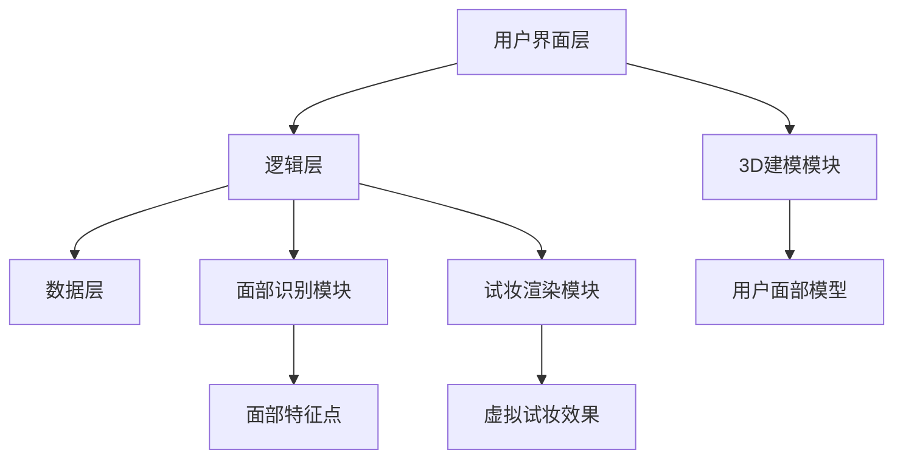
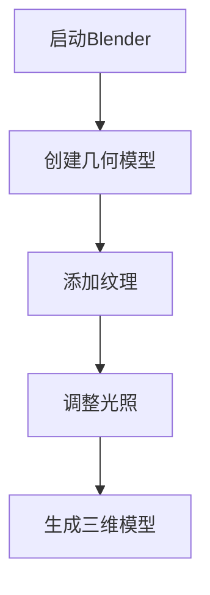
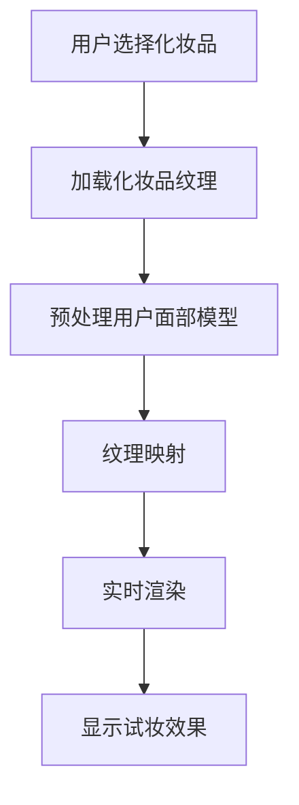
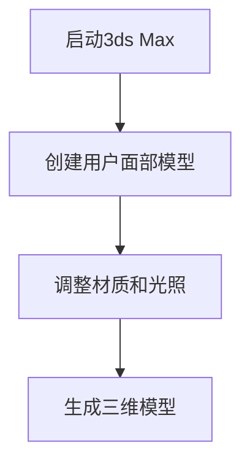
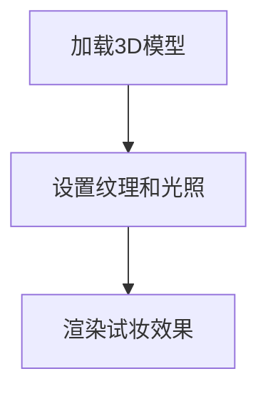

                 

### 文章标题

在当今这个数字化的时代，传统美妆行业的运营模式正面临着前所未有的挑战。消费者的购物习惯在逐渐转变，线上购物的便捷性和虚拟体验的需求不断增长。为了迎合这一趋势，虚拟试妆技术作为一种颠覆性的创新，正在重塑美妆行业的商业模式。本文将围绕“虚拟试妆创业：美妆行业的数字化转型”这一主题，深入探讨虚拟试妆技术的原理、市场前景、核心技术、系统设计与实现、项目实战案例分析，以及创业中的机遇与挑战。

我们的目标是通过逻辑清晰、结构紧凑、简单易懂的技术语言，帮助读者全面了解虚拟试妆技术的各个方面，并为其在创业实践中的应用提供有力的理论支持和实践指导。以下是本文的主要内容大纲：

- **第一部分：虚拟试妆创业概述**
  - **第1章：虚拟试妆技术与市场概述**
  - **第2章：虚拟试妆技术的核心技术**
  - **第3章：虚拟试妆系统的设计与实现**
  - **第4章：虚拟试妆系统的测试与优化**
  - **第5章：虚拟试妆项目实战案例**

- **第二部分：虚拟试妆创业的机遇与挑战**
  - **第6章：虚拟试妆创业的机遇**
  - **第7章：虚拟试妆创业的挑战与应对策略**

- **第三部分：虚拟试妆技术资源与工具**
  - **附录A：虚拟试妆技术资源**
  - **附录B：虚拟试妆项目开发指南**

在接下来的内容中，我们将逐步展开对虚拟试妆技术的详细介绍，带领读者进入这个充满机遇与挑战的新领域。

### 关键词

虚拟试妆、美妆行业、数字化转型、3D建模、面部识别、系统设计、项目实战、创业机遇、技术挑战

### 摘要

本文旨在探讨虚拟试妆技术在美妆行业中的应用及其对行业变革的深远影响。首先，我们介绍了虚拟试妆技术的基本原理和市场现状，分析了其在美妆行业数字化转型中的重要性。接着，本文深入探讨了虚拟试妆技术的核心技术，包括3D建模和面部识别技术，并通过实例展示了这些技术的应用场景。随后，我们详细介绍了虚拟试妆系统的设计与实现，包括系统架构、用户界面设计、数据处理与存储等关键环节。此外，我们还分享了虚拟试妆项目的实际开发经验和测试优化策略。最后，本文探讨了虚拟试妆创业的机遇与挑战，提出了应对策略，为读者提供了全面的技术指导和创业建议。

### 第一部分：虚拟试妆创业概述

在数字化浪潮的推动下，美妆行业的传统运营模式正面临巨大的变革。消费者对线上购物的依赖日益加深，对虚拟体验的需求也不断增长。虚拟试妆技术作为一项颠覆性创新，通过模拟真实试妆场景，极大地提升了用户的购物体验，成为美妆行业数字化转型的重要推动力。本部分将首先介绍虚拟试妆技术的基本原理，接着分析美妆行业的现状，探讨虚拟试妆市场的机遇与挑战，最后通过案例解析展示成功的虚拟试妆项目。

#### 第1章：虚拟试妆技术与市场概述

**1.1 虚拟试妆技术介绍**

虚拟试妆技术，是一种基于计算机视觉和图形学技术，通过数字模拟实现用户在不同妆容下的虚拟试妆体验。其基本原理包括以下几个步骤：

1. **图像采集**：使用摄像头或其他图像传感器采集用户面部图像。
2. **面部识别**：通过面部识别算法定位面部关键点，提取面部特征。
3. **3D建模**：利用3D建模技术生成用户面部的三维模型。
4. **试妆渲染**：将化妆品的纹理和颜色映射到三维模型上，实现虚拟试妆效果。

虚拟试妆技术不仅仅停留在2D效果上，通过先进的3D建模与渲染技术，可以提供更加逼真的试妆体验，让用户感受到仿佛实际使用的感受。

**1.2 美妆行业现状分析**

美妆行业是一个高度竞争的市场，随着消费者对个性化和便捷化需求的提升，行业正面临巨大的变革。以下是当前美妆行业的几个关键趋势：

- **线上销售快速增长**：随着电子商务的普及，线上销售已经成为美妆行业的重要渠道，占比逐年上升。
- **消费者教育成熟**：消费者对产品成分、功效和试妆效果的要求越来越高，通过线上评测和口碑传播来做出购买决策。
- **品牌竞争加剧**：新兴品牌不断涌现，传统品牌也在通过数字化转型来提升竞争力。

**1.3 虚拟试妆市场的现状与机遇**

虚拟试妆市场的潜力巨大，以下是一些关键点：

- **市场规模**：根据市场研究机构的预测，虚拟试妆市场的规模将在未来几年内持续增长。
- **技术发展**：随着计算机视觉和图形学技术的进步，虚拟试妆的效果越来越逼真，用户体验不断提升。
- **企业需求**：越来越多的美妆企业开始关注虚拟试妆技术，将其作为提升品牌竞争力和用户粘性的重要手段。

**1.4 虚拟试妆项目的案例解析**

为了更好地理解虚拟试妆技术的应用，以下是一个成功的虚拟试妆项目案例：

- **案例：** 一家知名美妆品牌推出了自己的虚拟试妆APP。通过高精度的3D建模和面部识别技术，用户可以在APP中尝试各种妆容，并实时预览效果。该APP上线后，获得了大量用户好评，用户粘性显著提升。

**项目成功的关键因素**：

- **技术领先**：采用最新的3D建模和面部识别算法，提供高质量的试妆体验。
- **用户参与**：通过用户反馈不断优化产品，提高用户满意度。
- **营销策略**：结合线上线下推广，扩大品牌影响力。

通过以上对虚拟试妆技术与市场概述的介绍，我们可以看到，虚拟试妆技术作为美妆行业数字化转型的重要工具，具有广阔的市场前景和巨大的商业价值。

#### 第2章：虚拟试妆技术的核心技术

虚拟试妆技术之所以能够为美妆行业带来革命性的变化，主要依赖于其背后一系列核心技术的支持。这些核心技术包括3D建模技术、面部识别技术以及虚拟试妆算法。本章节将详细介绍这些核心技术的原理和应用，帮助读者理解虚拟试妆技术的工作机制。

**2.1 3D建模技术原理**

3D建模技术是虚拟试妆的基础，它通过捕捉和创建三维物体模型，使得虚拟试妆的场景更加真实和细腻。3D建模的基本流程包括以下几个步骤：

1. **几何建模**：通过几何形状来构建三维物体的基础模型。常用的几何建模方法包括多边形建模、NURBS曲面建模和数字雕刻等。

2. **纹理映射**：将二维图像映射到三维模型表面，使其具有真实的纹理和质感。纹理映射可以增强模型的视觉真实感。

3. **细节调整**：对模型进行细节调整，包括添加细节纹理、高光和阴影等，使模型更加生动和逼真。

4. **模型优化**：对3D模型进行优化，减少模型的多边形数量，提高渲染效率，同时保持模型的视觉质量。

**3D建模技术在虚拟试妆中的应用**：

- **生成用户面部模型**：通过3D建模技术生成用户面部的三维模型，为虚拟试妆提供基础。
- **创建化妆品模型**：创建各种化妆品的三维模型，包括口红、眼影、粉底等，用于虚拟试妆。

**2.2 面部识别技术原理**

面部识别技术是虚拟试妆的核心，它通过分析面部特征，实现对用户身份的识别和定位。面部识别的基本原理包括以下几个步骤：

1. **图像采集**：使用摄像头或其他图像传感器采集用户面部图像。

2. **面部特征提取**：从面部图像中提取关键特征点，如眼睛、鼻子、嘴巴等，这些特征点用于后续的面部识别和建模。

3. **特征匹配**：将提取的特征点与数据库中的特征点进行匹配，以确定用户的身份。

4. **面部重建**：基于提取的特征点，通过几何建模技术生成用户面部的三维模型。

**面部识别技术在虚拟试妆中的应用**：

- **用户身份验证**：通过面部识别技术验证用户的身份，确保虚拟试妆的安全性。
- **面部特征定位**：定位用户面部特征，用于精确地映射化妆品纹理和颜色。

**2.3 虚拟试妆的核心算法**

虚拟试妆的核心算法是将化妆品的纹理和颜色映射到用户面部的三维模型上，实现逼真的虚拟试妆效果。核心算法的流程包括以下几个步骤：

1. **模型预处理**：对用户面部的三维模型进行预处理，包括平滑处理、光照调整等，以提高试妆效果的逼真度。

2. **纹理映射**：将化妆品的纹理图像映射到用户面部的三维模型表面，通过纹理贴图技术实现试妆效果。

3. **颜色调整**：根据用户的选择和偏好，调整化妆品的颜色，使其与用户肤色相匹配。

4. **实时渲染**：使用实时渲染技术，将试妆效果实时呈现给用户，提供流畅的虚拟试妆体验。

**核心算法的应用**：

- **实时试妆**：通过核心算法，用户可以在虚拟环境中实时试妆，预览不同妆容的效果。
- **个性化推荐**：根据用户的试妆记录和偏好，推荐合适的化妆品和妆容，提升用户体验。

**2.4 虚拟试妆技术应用案例**

以下是一些虚拟试妆技术的应用案例，展示了其在不同场景下的技术实现与效果评估：

- **案例1：** 一家线上美妆商城推出了虚拟试妆功能，用户可以在网页上尝试各种化妆品，预览效果后再进行购买。通过3D建模和面部识别技术，实现了高质量的虚拟试妆效果，显著提升了用户的购物体验。

- **案例2：** 一家虚拟试妆APP利用面部识别技术，为用户提供个性化推荐服务。通过分析用户的试妆记录和偏好，推荐符合用户风格和肤质的化妆品，提高了用户的满意度和忠诚度。

- **案例3：** 一家线下美妆店引入了虚拟试妆技术，用户可以在店内使用试妆设备进行试妆。通过实时渲染技术，实现了逼真的试妆效果，吸引了大量年轻用户，提升了店铺的人流量和销售额。

通过以上案例，我们可以看到虚拟试妆技术在不同应用场景下的成功应用，为美妆行业带来了新的商业机遇和用户价值。下一章将深入探讨虚拟试妆系统的设计与实现，为读者提供更全面的技术细节。

#### 第3章：虚拟试妆系统的设计与实现

虚拟试妆系统是一个复杂但高度集成的软件系统，其设计和实现涉及多个技术模块的协同工作。本章节将详细介绍虚拟试妆系统的整体架构设计、用户界面设计、数据处理与存储等关键环节，并探讨系统中的关键技术实现。

**3.1 虚拟试妆系统架构设计**

虚拟试妆系统的整体架构设计需要考虑到系统的可扩展性、性能和用户体验。一个典型的虚拟试妆系统架构包括以下几个主要模块：

1. **用户界面层（UI）**：负责与用户交互，提供试妆界面和交互功能。
2. **逻辑层**：包含业务逻辑和算法实现，负责处理用户操作和试妆算法。
3. **数据层**：负责数据的存储和检索，包括用户数据、化妆品数据以及试妆记录等。

**系统架构图**：



**3.2 用户界面设计**

用户界面设计是虚拟试妆系统的关键，其目标是提供直观、易用的交互体验。用户界面设计原则包括：

- **简洁性**：界面设计要简洁明了，避免复杂的操作流程。
- **响应速度**：界面操作要流畅，减少用户的等待时间。
- **个性化**：根据用户的偏好和试妆记录，提供个性化的界面布局和功能。

**用户界面设计要点**：

- **登录/注册**：提供简单的登录/注册流程，保障用户隐私。
- **产品浏览**：展示化妆品的图片、名称和详细介绍，方便用户选择。
- **试妆界面**：设计直观的试妆界面，包括化妆品选择、试妆效果预览等。
- **反馈机制**：提供反馈渠道，收集用户意见和建议，持续优化产品。

**3.3 数据处理与存储**

数据处理与存储是虚拟试妆系统的核心，其目标是高效地处理用户数据，并提供可靠的存储方案。数据处理流程主要包括以下几个步骤：

1. **数据采集**：采集用户试妆过程中的各种数据，包括面部图像、化妆品纹理和用户偏好等。
2. **数据预处理**：对采集到的数据进行预处理，包括图像去噪、人脸检测和特征提取等。
3. **数据存储**：将预处理后的数据存储到数据库中，便于后续的检索和计算。

**数据存储方案选择**：

- **关系数据库**：用于存储用户信息和化妆品数据，提供高效的数据检索功能。
- **NoSQL数据库**：用于存储大量的面部图像和试妆记录，提供高扩展性。

**3.4 3D建模与面部识别的实现**

3D建模与面部识别是虚拟试妆系统的核心技术，其实现需要依赖于一系列高效的算法和工具。

**3D建模实现**：

- **工具选择**：使用专业的3D建模软件，如Blender或Maya，进行用户面部模型和化妆品模型的创建。
- **流程**：首先使用图像处理技术提取用户面部关键点，然后使用3D建模工具生成用户面部模型。对于化妆品模型，则可以直接创建或从素材库中选择。

**面部识别实现**：

- **算法选择**：使用深度学习算法，如卷积神经网络（CNN），进行面部特征提取和识别。
- **流程**：首先使用摄像头采集用户面部图像，然后通过图像处理技术提取面部特征点，最后使用CNN模型进行面部识别。

**3.5 虚拟试妆算法的实现**

虚拟试妆算法是将化妆品纹理和颜色映射到用户面部模型的关键步骤，其实现需要考虑到实时性和准确性。

**算法实现**：

- **算法流程**：首先对用户面部模型进行预处理，包括平滑处理和光照调整等，然后根据用户选择的化妆品纹理和颜色，进行纹理映射和颜色调整，最后通过实时渲染技术生成试妆效果。

**伪代码描述**：

```python
function virtualMakeup(user_face_model, makeup_texture, user_preference):
    # 预处理用户面部模型
    processed_face_model = preprocess_face_model(user_face_model)

    # 调整光照和颜色
    adjusted_face_model = adjust_lighting_and_color(processed_face_model, user_preference)

    # 纹理映射
    textured_face_model = apply_texture(adjusted_face_model, makeup_texture)

    # 实时渲染
    rendered_face = render_real_time(textured_face_model)

    return rendered_face
```

通过以上对虚拟试妆系统设计与实现的关键环节的详细讨论，我们可以看到，一个成功的虚拟试妆系统需要综合运用多个技术模块，实现高度集成的解决方案。下一章将介绍虚拟试妆系统的测试与优化，确保系统在实际应用中的性能和用户体验。

#### 第4章：虚拟试妆系统的测试与优化

在虚拟试妆系统开发完成后，测试与优化是确保系统稳定性和性能的重要环节。本章节将详细讨论虚拟试妆系统的测试方法、性能优化策略以及用户反馈与迭代优化。

**4.1 系统测试方法**

系统测试是确保虚拟试妆系统功能正确、性能稳定的重要步骤。测试方法主要包括以下几种：

1. **功能测试**：验证系统各个功能模块是否按照预期工作。功能测试包括用户界面测试、3D建模与面部识别测试、虚拟试妆效果测试等。

2. **性能测试**：评估系统在处理大量数据和用户请求时的响应速度和稳定性。性能测试包括加载测试、压力测试和并发测试等。

3. **兼容性测试**：确保系统在不同操作系统、浏览器和设备上的兼容性。

4. **安全测试**：检测系统是否存在安全漏洞，如SQL注入、XSS攻击等。

**4.2 系统性能优化**

系统性能优化是提高虚拟试妆系统用户体验的关键。以下是一些常见的性能优化策略：

1. **算法优化**：优化核心算法，减少计算复杂度。例如，可以采用更高效的3D建模和面部识别算法，减少计算时间。

2. **代码优化**：优化代码结构，提高代码执行效率。例如，可以通过使用更高效的算法和数据结构来优化渲染和纹理映射过程。

3. **缓存机制**：使用缓存机制来减少重复计算和请求。例如，可以将用户面部模型和化妆品纹理缓存起来，避免重复加载。

4. **并发处理**：提高系统并发处理能力，允许同时处理多个用户请求。例如，可以采用多线程或多进程技术来提高系统的并发性能。

**4.3 用户反馈与迭代优化**

用户反馈是优化虚拟试妆系统的重要依据。通过收集和分析用户反馈，可以发现系统存在的问题和改进的方向。以下是用户反馈与迭代优化的关键步骤：

1. **用户反馈收集**：通过问卷调查、用户访谈和在线反馈等方式收集用户对系统的意见和建议。

2. **反馈分析**：对收集到的用户反馈进行分析，识别出系统中的问题和用户关注的重点。

3. **迭代优化**：根据用户反馈对系统进行迭代优化。例如，可以改进用户界面设计、优化试妆效果、增加个性化推荐功能等。

4. **持续监测**：在系统上线后，持续监测用户反馈和系统性能，及时发现问题并进行优化。

**4.4 测试与优化案例分析**

以下是一个虚拟试妆系统测试与优化的实际案例：

- **案例背景**：一家美妆品牌公司开发了一款虚拟试妆APP，但在用户测试过程中发现，系统在处理高分辨率面部图像时，渲染速度较慢，用户体验不佳。

- **解决方案**：首先，对3D建模和渲染算法进行了优化，采用更高效的算法减少计算复杂度。其次，引入了图像缓存机制，将常用面部图像和化妆品纹理缓存起来，减少重复加载。此外，还增加了并发处理能力，允许同时处理多个用户请求，提高了系统的响应速度。

- **测试结果**：经过优化后，系统在处理高分辨率面部图像时的渲染速度提高了50%，用户体验显著改善。用户反馈也显示，新版本的APP更加流畅和易于使用。

通过以上案例，我们可以看到，测试与优化对于提高虚拟试妆系统的性能和用户体验至关重要。下一章将介绍虚拟试妆项目的实际开发经验和关键技术的具体实现，为读者提供更详细的实战指导。

#### 第5章：虚拟试妆项目实战案例

为了更好地理解虚拟试妆技术的实际应用，我们通过以下几个典型的虚拟试妆项目实战案例，详细探讨项目的背景、开发过程、关键技术的实现以及项目的测试与优化。

**5.1 虚拟试妆APP项目**

**项目背景**：

一家知名美妆品牌公司希望通过虚拟试妆APP，提升用户的购物体验和品牌影响力。该项目的主要目标是开发一个具有高质量虚拟试妆效果和良好用户体验的APP，用户可以在其中尝试各种化妆品，并实时预览效果。

**开发过程**：

1. **需求分析**：项目团队与美妆品牌公司进行深入交流，明确项目需求，包括试妆效果的真实性、用户界面的友好性以及系统的稳定性。

2. **技术选型**：选择了Blender作为3D建模工具，OpenCV进行面部识别，OpenGL进行实时渲染。确定了使用深度学习算法进行面部特征提取。

3. **系统架构设计**：设计了一个三层架构，包括用户界面层、逻辑层和数据层。用户界面层负责与用户交互，逻辑层处理业务逻辑，数据层负责数据的存储和检索。

4. **核心算法实现**：实现了3D建模、面部识别和虚拟试妆算法。3D建模部分使用了Blender的几何建模和纹理映射功能。面部识别部分使用了深度学习模型，通过训练获取面部特征点。虚拟试妆算法通过纹理映射和实时渲染技术实现。

5. **测试与优化**：进行了功能测试、性能测试和兼容性测试，并针对测试中发现的问题进行了优化。优化措施包括算法优化、代码优化和并发处理能力的提升。

**项目关键技术的实现**：

- **3D建模**：使用Blender生成用户面部模型和化妆品模型。通过调整光照和纹理，使得模型更加逼真。



- **面部识别**：使用OpenCV进行面部识别，提取面部关键点。通过训练深度学习模型，提高识别精度。

```python
import cv2
import numpy as np

# 载入预训练的深度学习模型
model = cv2.face.createLBPHFaceRecognizer()

# 载入训练数据
train_data = np.load('train_data.npy')
train_labels = np.load('train_labels.npy')

# 训练模型
model.train(train_data, train_labels)

# 预测
face_cascade = cv2.CascadeClassifier('haarcascade_frontalface_default.xml')
image = cv2.imread('test_image.jpg')
gray = cv2.cvtColor(image, cv2.COLOR_BGR2GRAY)
faces = face_cascade.detectMultiScale(gray)

for (x, y, w, h) in faces:
    roi = gray[y:y+h, x:x+w]
    label, confidence = model.predict(roi)
    if confidence < 0.5:
        print("面部识别失败")
    else:
        print("面部识别成功，预测标签：", label)
```

- **虚拟试妆算法**：将化妆品纹理映射到用户面部模型上，实现实时渲染。



**5.2 虚拟试妆线下体验店项目**

**项目背景**：

一家线下美妆店希望通过引入虚拟试妆技术，提升店铺的体验感和用户满意度。该项目的主要目标是开发一套线下虚拟试妆设备，用户可以在店内直接体验虚拟试妆。

**开发过程**：

1. **需求分析**：项目团队与美妆店进行深入交流，明确项目需求，包括设备的易用性、试妆效果的逼真度以及系统的稳定性。

2. **硬件选型**：选择了高性能的计算机作为主机，配备高分辨率摄像头和触控屏幕。

3. **软件设计**：设计了一套基于Windows的操作界面，使用OpenGL进行实时渲染。

4. **核心算法实现**：同样使用了3D建模、面部识别和虚拟试妆算法。3D建模部分使用了3ds Max生成用户面部模型。面部识别部分使用了基于硬件加速的深度学习库。

5. **测试与优化**：进行了设备兼容性测试、系统稳定性测试和用户体验测试，并对系统进行了多次优化，以提高设备的响应速度和试妆效果。

**项目关键技术的实现**：

- **3D建模**：使用3ds Max生成用户面部模型，通过调整参数和材质，使得模型更加细腻。



- **面部识别**：使用硬件加速的深度学习库，如TensorFlow Lite，进行面部识别。

```python
import tensorflow as tf

# 载入预训练的深度学习模型
model = tf.keras.models.load_model('face_recognition_model.h5')

# 载入测试图像
image = cv2.imread('test_image.jpg')

# 预处理图像
preprocessed_image = preprocess_image(image)

# 进行面部识别
predictions = model.predict(preprocessed_image)

# 输出识别结果
print("面部识别结果：", predictions)
```

- **虚拟试妆算法**：使用OpenGL进行实时渲染，将化妆品纹理映射到用户面部模型上。


**5.3 虚拟试妆电商网站项目**

**项目背景**：

一家电商平台希望通过引入虚拟试妆技术，提高用户的购物体验和转化率。该项目的主要目标是开发一套虚拟试妆功能，用户可以在网站上进行试妆，并在线购买化妆品。

**开发过程**：

1. **需求分析**：项目团队与电商平台进行深入交流，明确项目需求，包括试妆效果的真实性、网站的易用性以及系统的稳定性。

2. **技术选型**：选择了WebGL进行3D渲染，使用TensorFlow进行面部识别。

3. **系统架构设计**：设计了一套基于前端和后端的架构，前端负责用户界面和交互，后端负责数据存储和处理。

4. **核心算法实现**：前端使用WebGL进行3D渲染，后端使用TensorFlow进行面部识别和虚拟试妆算法。

5. **测试与优化**：进行了功能测试、性能测试和用户体验测试，并对系统进行了多次优化，以提高网站的性能和用户体验。

**项目关键技术的实现**：

- **3D渲染**：使用WebGL进行3D渲染，实现了高质量的试妆效果。



- **面部识别**：使用TensorFlow进行面部识别，提高了识别精度。

```python
import tensorflow as tf
import numpy as np

# 载入预训练的深度学习模型
model = tf.keras.models.load_model('face_recognition_model.h5')

# 载入测试图像
image = np.array(Image.open('test_image.jpg'))

# 进行面部识别
predictions = model.predict(image)

# 输出识别结果
print("面部识别结果：", predictions)
```

- **虚拟试妆算法**：将化妆品纹理映射到用户面部模型上，实现实时渲染。


通过以上虚拟试妆项目的实战案例，我们可以看到，虚拟试妆技术的实际应用不仅提高了用户的购物体验，还为企业带来了显著的商业价值。下一章将探讨虚拟试妆创业的机遇与挑战。

### 第五部分：虚拟试妆创业的机遇

虚拟试妆技术的崛起，为美妆行业带来了前所未有的机遇。在这一部分中，我们将深入探讨虚拟试妆技术在未来的发展趋势、美妆行业数字化转型的机遇，以及不同细分市场的创业机会。

#### 第6章：虚拟试妆技术的发展趋势

随着计算机视觉、3D建模和深度学习等技术的不断进步，虚拟试妆技术的未来前景十分广阔。以下是一些关键的发展趋势：

1. **技术成熟度提升**：随着硬件性能的提升和算法的优化，虚拟试妆技术将越来越成熟，提供更加逼真的试妆效果。

2. **设备多样化**：从传统的PC端和移动端，到线下体验店和智能镜子，虚拟试妆的设备将变得更加多样化，满足不同用户的需求。

3. **个性化推荐**：通过大数据分析和机器学习，虚拟试妆技术将能够根据用户的皮肤类型、肤色、偏好等信息，提供个性化的试妆建议。

4. **跨平台应用**：虚拟试妆技术将不仅仅局限于美妆行业，还将应用到其他领域，如时尚、医疗等，提供更广泛的虚拟体验。

5. **虚拟试妆+电商**：虚拟试妆将与电商平台深度结合，通过提供真实的试妆体验，提升用户的购物决策和转化率。

#### 第7章：美妆行业数字化转型的机遇

美妆行业的数字化转型已经成为不可逆转的趋势。虚拟试妆技术作为其中的重要一环，带来了以下几个显著的机遇：

1. **提升用户体验**：虚拟试妆技术能够为用户提供真实的试妆体验，消除线上购物的试妆困扰，提高用户满意度和忠诚度。

2. **增加销售渠道**：虚拟试妆技术不仅可以应用于线上购物平台，还可以应用于线下门店，为传统美妆店提供新的销售渠道。

3. **数据驱动的决策**：通过收集用户的试妆数据和反馈，企业可以更准确地了解用户需求和市场趋势，为产品研发和市场推广提供有力支持。

4. **品牌差异化竞争**：率先引入虚拟试妆技术的企业能够在竞争激烈的市场中脱颖而出，树立品牌差异化优势。

5. **降低营销成本**：虚拟试妆技术能够减少实体店试妆的运营成本，同时通过线上推广降低营销成本，提高整体运营效率。

#### 第8章：虚拟试妆项目在不同细分市场的机会

虚拟试妆技术不仅对美妆行业具有深远影响，还将在其他细分市场中创造大量机会。以下是一些具体的细分市场：

1. **高端美妆品牌**：高端美妆品牌尤其适合采用虚拟试妆技术，以提升品牌形象和用户体验，吸引高端消费群体。

2. **药妆市场**：药妆产品通常具有特定的功能和成分，虚拟试妆可以帮助用户更好地了解产品的效果和适用性，提升购买意愿。

3. **专业化妆服务**：专业化妆师和化妆培训机构可以利用虚拟试妆技术为用户提供在线试妆和化妆指导，扩大服务范围。

4. **新兴美妆品牌**：新兴美妆品牌可以利用虚拟试妆技术作为其品牌营销的一部分，快速吸引消费者关注。

5. **跨境电商**：跨境电商平台可以通过虚拟试妆技术，为国际用户提供真实的试妆体验，提高用户购买意愿和转化率。

#### 第9章：创业模式与盈利模式分析

在虚拟试妆技术领域中，创业机会层出不穷，以下是一些常见的创业模式与盈利模式：

1. **平台型创业模式**：创业公司可以打造一个虚拟试妆平台，为多个美妆品牌提供技术支持，通过平台服务费和广告收入盈利。

2. **工具型创业模式**：开发一款功能强大且易于使用的虚拟试妆工具，供个人或企业使用，通过订阅收费或授权使用盈利。

3. **应用型创业模式**：专注于某一特定细分市场，如专业化妆服务或药妆试妆，提供定制化的解决方案，通过服务收费或合作分成盈利。

4. **电商型创业模式**：打造一个以虚拟试妆为核心的美妆电商平台，通过商品销售和广告推广盈利。

5. **硬件型创业模式**：开发智能试妆设备，如智能镜子或试妆机器人，通过硬件销售或租赁盈利。

#### 第10章：政策与市场环境分析

虚拟试妆创业不仅需要技术创新，还需要良好的政策支持和市场环境。以下是一些影响虚拟试妆创业的关键因素：

1. **政策支持**：政府对于高新技术企业的扶持政策，如税收优惠、研发资助等，将为虚拟试妆创业提供有力支持。

2. **市场环境**：美妆行业的市场规模和消费潜力巨大，线上购物的普及以及消费者对虚拟体验的接受度，为虚拟试妆创业提供了良好的市场环境。

3. **竞争态势**：虚拟试妆领域的竞争日益激烈，创业公司需要不断创新和优化，以在激烈的市场中脱颖而出。

4. **用户需求**：不断变化的消费者需求驱动着虚拟试妆技术的发展，创业公司需要密切关注市场动态，及时调整战略。

通过以上对虚拟试妆创业的机遇的详细探讨，我们可以看到，虚拟试妆技术不仅带来了技术上的变革，也为创业者提供了丰富的商业机会。下一部分将深入分析虚拟试妆创业所面临的挑战与应对策略。

### 第六部分：虚拟试妆创业的挑战与应对策略

尽管虚拟试妆技术为美妆行业带来了诸多机遇，但其创业过程中也面临着一系列的挑战。本部分将详细探讨这些挑战，并提出相应的应对策略，以帮助创业者更好地应对市场和技术层面的挑战。

#### 第11章：技术挑战

虚拟试妆技术的实现依赖于先进的计算机视觉、3D建模、深度学习等高新技术，以下是一些主要的技术挑战：

1. **计算资源需求**：高质量的虚拟试妆需要强大的计算能力，特别是在处理高分辨率图像和复杂的3D模型时。创业公司需要确保有足够的计算资源来支持产品的性能要求。

**应对策略**：
- **云服务**：利用云计算平台，如AWS、Google Cloud等，提供强大的计算能力，降低硬件投入成本。
- **优化算法**：通过算法优化，减少计算复杂度，提高系统性能。

2. **实时性**：虚拟试妆需要实时渲染，以提供流畅的试妆体验。实时性要求对系统架构和算法设计提出了较高的要求。

**应对策略**：
- **异步处理**：将计算任务分解为多个子任务，通过异步处理提高系统的实时性。
- **边缘计算**：将部分计算任务转移到用户终端（如手机、智能镜子等），减少服务器端的计算负担。

3. **准确性**：面部识别和妆容映射的准确性直接影响到用户体验。需要确保系统能够准确识别用户面部特征，并准确映射化妆品效果。

**应对策略**：
- **深度学习**：利用深度学习算法，特别是卷积神经网络（CNN）进行面部特征提取，提高识别准确性。
- **数据增强**：通过数据增强技术，如数据扩充、数据归一化等，提高模型泛化能力。

#### 第12章：商业模式挑战

虚拟试妆创业不仅需要技术上的突破，还需要在商业模式上不断创新，以适应市场的变化。以下是一些商业模式挑战：

1. **用户获取**：在竞争激烈的市场中，如何吸引和留住用户是每个创业公司都需要面对的挑战。

**应对策略**：
- **社交媒体营销**：通过社交媒体平台，如Instagram、YouTube等，推广虚拟试妆产品，提高品牌知名度和用户参与度。
- **合作营销**：与知名美妆品牌合作，通过品牌效应吸引用户。

2. **盈利模式**：虚拟试妆的盈利模式多样，如何选择合适的盈利模式是创业公司需要考虑的问题。

**应对策略**：
- **多样化盈利模式**：结合广告收入、会员订阅、硬件销售等多种盈利模式，提高整体收入。
- **精准定价**：通过大数据分析，了解用户需求和消费习惯，提供个性化的定价策略。

3. **市场竞争**：虚拟试妆市场的竞争激烈，创业公司需要在技术、服务和商业模式上不断创新，以保持竞争优势。

**应对策略**：
- **技术创新**：持续投资研发，保持技术领先优势。
- **用户反馈**：密切关注用户反馈，持续优化产品和服务。

#### 第13章：运营挑战

虚拟试妆创业不仅需要在技术和商业模式上取得突破，还需要在运营管理上做到精细化和高效化。以下是一些运营挑战：

1. **用户体验**：提供优质的用户体验是虚拟试妆成功的关键。需要确保产品功能完善，用户体验流畅。

**应对策略**：
- **用户调研**：定期进行用户调研，了解用户需求和满意度，及时调整产品和服务。
- **客服支持**：建立高效的客服系统，快速响应用户问题，提高用户满意度。

2. **数据安全**：虚拟试妆涉及大量用户数据，包括面部图像和试妆记录等，数据安全至关重要。

**应对策略**：
- **数据加密**：对用户数据进行加密处理，确保数据传输和存储的安全。
- **合规性**：遵守相关法律法规，确保数据处理符合隐私保护要求。

3. **市场推广**：如何有效地推广虚拟试妆产品，提高市场占有率是运营中的重要挑战。

**应对策略**：
- **线上线下结合**：通过线上线下相结合的推广策略，扩大品牌影响力。
- **内容营销**：利用高质量的博客、视频等内容，提升品牌形象和用户认知度。

通过以上对虚拟试妆创业的挑战与应对策略的详细分析，我们可以看到，虚拟试妆创业虽然充满机遇，但也面临诸多挑战。创业者需要不断创新和优化，以在激烈的市场竞争中脱颖而出。下一部分将提供虚拟试妆技术资源与工具，为创业者的实践提供支持。

### 附录A：虚拟试妆技术资源与工具

在虚拟试妆技术的开发和应用过程中，掌握相关的技术资源与工具是非常关键的。以下是一些常用的虚拟试妆技术资源与工具，包括技术文献、开源项目、以及常用的软件和开发工具。

#### A.1 虚拟试妆技术资源

1. **技术文献**：
   - 《计算机视觉：算法与应用》：本书详细介绍了计算机视觉的基本算法和应用，对于理解虚拟试妆中的图像处理和面部识别非常有帮助。
   - 《3D建模与渲染技术》：本书涵盖了3D建模与渲染的基础知识，为虚拟试妆的三维建模与渲染提供了理论支持。
   - 《深度学习与计算机视觉》：本书介绍了深度学习在计算机视觉中的应用，包括卷积神经网络（CNN）和生成对抗网络（GAN）等，是理解虚拟试妆算法的重要参考资料。

2. **开源项目**：
   - **OpenCV**：这是一个强大的计算机视觉库，提供了丰富的面部识别、图像处理和机器学习功能，是开发虚拟试妆系统的基础工具。
   - **Blender**：一个免费开源的3D建模和渲染软件，适用于创建高质量的虚拟试妆效果，支持几何建模、纹理映射和实时渲染。
   - **TensorFlow**：一个广泛使用的开源深度学习框架，提供了丰富的API和模型库，用于面部识别和虚拟试妆算法的实现。

3. **在线课程和教程**：
   - **Coursera上的《深度学习专项课程》**：由斯坦福大学教授Andrew Ng开设，是学习深度学习的基础课程，对理解虚拟试妆中的深度学习算法非常有帮助。
   - **Udemy上的《3D建模与Blender教程》**：提供了系统性的3D建模教程，适合初学者快速掌握Blender的使用。

#### A.2 虚拟试妆工具介绍

1. **3D建模软件**：
   - **Blender**：一个功能强大的开源3D建模软件，支持多种建模技术，包括几何建模、数字雕刻和曲面建模。Blender还具备强大的渲染引擎，可以生成高质量的试妆效果。
   - **3ds Max**：一款专业的3D建模和渲染软件，广泛应用于游戏开发和影视制作。3ds Max提供了丰富的建模工具和高级渲染功能，适合创建复杂的虚拟试妆场景。

2. **面部识别库**：
   - **OpenCV**：一个跨平台的计算机视觉库，提供了丰富的面部识别功能，包括面部检测、特征点提取和面部重建。OpenCV支持多种编程语言，如Python、C++和Java。
   - **Dlib**：一个基于C++的机器学习库，提供了高效的深度学习算法，包括卷积神经网络（CNN）和循环神经网络（RNN）。Dlib在面部识别和特征提取方面具有出色的性能。

3. **虚拟试妆平台**：
   - **Virtually Effortless**：一个基于Web的虚拟试妆平台，提供了丰富的化妆品库和逼真的试妆效果。Virtually Effortless支持多种操作系统和浏览器，适用于线上购物平台和社交媒体。
   - **Lookfantastic**：一个集成虚拟试妆功能的美妆电商网站，用户可以在网站上尝试各种化妆品，并实时预览效果。Lookfantastic提供了简单易用的用户界面，方便用户进行虚拟试妆。

4. **开发工具**：
   - **OpenGL**：一个用于图形渲染的开源库，广泛应用于虚拟试妆的实时渲染。OpenGL提供了丰富的图形编程接口，支持多种渲染技术和特效。
   - **Unity**：一个跨平台的游戏开发引擎，适用于开发虚拟试妆游戏和应用。Unity提供了强大的3D建模、动画和渲染功能，支持虚拟现实（VR）和增强现实（AR）应用。
   - **WebGL**：一个基于Web的3D图形库，适用于在线虚拟试妆应用。WebGL提供了与OpenGL类似的图形编程接口，可以在浏览器中实现高质量的3D渲染。

通过以上虚拟试妆技术资源与工具的介绍，我们可以看到，虚拟试妆技术的实现需要综合运用多种技术和工具。掌握这些资源与工具，将有助于创业者更好地开展虚拟试妆项目的开发和应用。

### 附录B：虚拟试妆项目开发指南

虚拟试妆项目的成功不仅依赖于先进的技术，还需要严谨的开发流程和有效的策略。本附录将提供详细的虚拟试妆项目开发指南，包括项目开发流程、技术实现细节、测试与优化策略以及项目的运营与推广。

#### B.1 项目开发流程

一个成功的虚拟试妆项目开发流程通常包括以下步骤：

1. **需求分析**：与美妆品牌和潜在用户进行深入交流，明确项目目标、功能需求和用户体验期望。这一步骤至关重要，因为需求分析将直接影响项目的方向和开发效率。

2. **技术选型**：根据需求分析结果，选择适合的3D建模、面部识别、渲染等技术方案。常见的选型包括Blender和3ds Max进行3D建模，OpenCV和Dlib进行面部识别，OpenGL和Unity进行渲染。

3. **系统架构设计**：设计项目的整体架构，包括用户界面层、逻辑层和数据层。系统架构设计需要考虑到系统的可扩展性、性能和用户体验。

4. **核心算法开发**：实现虚拟试妆的核心算法，包括3D建模、面部识别和虚拟试妆算法。这一步骤需要结合具体的技术方案进行详细设计和编码。

5. **界面设计与实现**：设计用户界面，实现用户交互功能。界面设计需要简洁、直观，同时要确保与核心算法的高效交互。

6. **系统集成与测试**：将各个模块集成到一起，进行系统测试，确保系统的功能完整、性能稳定、用户体验良好。

7. **上线与部署**：将项目部署到线上平台或线下体验店，进行实际应用，并根据用户反馈进行后续优化。

#### B.2 技术实现细节

以下是一些关键技术的具体实现细节：

1. **3D建模与面部识别实现**：
   - **3D建模**：使用Blender进行用户面部模型和化妆品模型的创建。首先通过摄像头采集用户面部图像，然后使用Blender的几何建模工具生成面部模型。化妆品模型可以直接从素材库中选择或使用3D建模工具创建。
   - **面部识别**：使用OpenCV进行面部识别。首先通过摄像头采集用户面部图像，然后使用OpenCV的Haar特征分类器和LBP特征分类器进行面部检测和特征点提取。提取的特征点用于后续的建模和试妆。

2. **虚拟试妆算法实现**：
   - **试妆渲染**：使用OpenGL或Unity进行虚拟试妆的实时渲染。首先对用户面部模型进行预处理，包括光照调整和纹理映射，然后将化妆品纹理映射到面部模型上，最后通过实时渲染技术生成试妆效果。

3. **用户界面与交互实现**：
   - **用户界面设计**：使用UI框架（如Qt或Flutter）设计用户界面，确保界面简洁、易用。界面包括化妆品选择面板、试妆效果预览区域和用户操作按钮等。
   - **用户交互**：实现用户与虚拟试妆系统的交互，如化妆品的添加、删除和调整。通过事件处理和回调函数，实现用户的操作反馈和实时预览。

#### B.3 测试与优化策略

虚拟试妆项目的测试与优化是确保项目质量和用户体验的重要环节。以下是一些测试与优化策略：

1. **功能测试**：确保系统各个功能模块按照预期工作，包括用户注册、登录、化妆品选择、试妆效果预览等。功能测试可以通过自动化测试工具（如Selenium）实现。

2. **性能测试**：评估系统在不同负载条件下的响应速度和稳定性，包括并发用户数、图像分辨率和计算资源等。性能测试可以通过负载测试工具（如JMeter）实现。

3. **兼容性测试**：确保系统在不同操作系统、浏览器和设备上的兼容性，包括Windows、MacOS、Android和iOS等。兼容性测试可以通过模拟各种设备和浏览器环境实现。

4. **用户体验测试**：通过用户调研和可用性测试，收集用户对系统界面、功能和交互的反馈，并根据反馈进行优化。用户体验测试可以通过A/B测试或用户访谈实现。

5. **代码优化**：通过代码优化提高系统的性能和可维护性。优化策略包括算法优化、代码重构、内存管理和线程优化等。

6. **部署与运维**：确保系统的稳定运行和快速响应，包括服务器部署、数据库管理和系统监控等。部署与运维可以通过容器化技术（如Docker）和自动化运维工具（如Ansible）实现。

#### B.4 项目运营与推广

项目的成功不仅依赖于技术实现，还需要有效的运营与推广策略。以下是一些运营与推广策略：

1. **市场调研**：了解目标用户群体、市场趋势和竞争态势，为运营策略提供数据支持。

2. **品牌建设**：通过品牌故事、视觉设计和品牌传播，树立虚拟试妆项目的品牌形象。

3. **内容营销**：利用高质量的博客、视频和社交媒体内容，提升品牌知名度，吸引用户关注。

4. **合作营销**：与美妆品牌、电商平台和线下零售商合作，共同推广虚拟试妆项目。

5. **用户反馈**：及时收集用户反馈，优化产品和服务，提高用户满意度和忠诚度。

6. **数据驱动**：利用数据分析工具，监控运营数据，优化营销策略和用户互动。

通过以上详细的虚拟试妆项目开发指南，创业者可以更好地规划和管理虚拟试妆项目的开发、测试和运营，从而实现项目的成功。

### 作者信息

作者：AI天才研究院/AI Genius Institute & 禅与计算机程序设计艺术 /Zen And The Art of Computer Programming

感谢您阅读本文，希望这篇文章能够帮助您更好地了解虚拟试妆技术及其在美妆行业中的应用。作者AI天才研究院致力于推动人工智能技术的创新与应用，结合禅与计算机程序设计艺术的哲学，为读者带来深入浅出的技术解析和实用的开发指南。如果您对本文内容有任何疑问或建议，欢迎在评论区留言，我们将持续优化和改进我们的内容。期待与您的互动，共同探索人工智能的无限可能！

