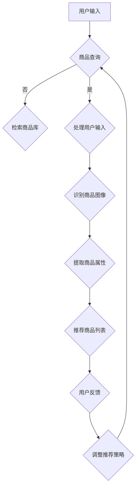

                 

### 视觉推荐系统概述

视觉推荐系统是一种利用人工智能技术，尤其是图像识别技术，对用户上传的图片进行解析，进而推荐相关商品或内容的系统。这种系统在现代电子商务和社交媒体中扮演着越来越重要的角色，因为它能够为用户提供更加直观和个性化的推荐体验。

#### **1.1 视觉推荐的定义与原理**

视觉推荐系统的核心在于“视觉”二字，即通过图像来传递信息和进行交互。具体来说，用户通过上传或选择一张图片，系统利用图像识别算法分析图片中的内容，将其与商品数据库中的商品进行匹配，最终生成一个个性化的商品推荐列表。

视觉推荐系统的工作流程通常包括以下几个步骤：

1. **图像输入**：用户上传或输入一张图片。
2. **图像预处理**：对图像进行增强、去噪等处理，以提高后续识别的准确性。
3. **图像识别**：利用图像识别算法（如卷积神经网络CNN）对图像内容进行分析，提取关键特征。
4. **商品匹配**：将提取的特征与商品数据库进行匹配，找到相关商品。
5. **推荐生成**：根据匹配结果和用户行为，生成推荐列表。
6. **用户反馈**：用户对推荐内容进行反馈，用于优化推荐算法。

#### **1.2 图像识别技术的发展**

图像识别技术是视觉推荐系统的关键技术之一，其发展历程可以追溯到20世纪50年代。最初，图像识别主要依靠规则和特征匹配方法，如边缘检测和角点检测等。随着计算机性能的提升和算法的创新，20世纪90年代，出现了基于机器学习的方法，如支持向量机（SVM）和决策树等。

真正推动图像识别技术飞跃发展的，是深度学习特别是卷积神经网络（CNN）的出现。CNN通过多层神经网络结构，能够自动提取图像中的高层次特征，显著提高了图像识别的准确率。近年来，基于GAN（生成对抗网络）的图像生成技术，也在视觉推荐系统中得到了广泛应用，用于增强图像质量和生成新的视觉内容。

#### **1.3 视觉推荐系统在电商中的应用**

在电商领域，视觉推荐系统有着广泛的应用。例如，用户可以通过上传一张喜欢的衣服图片，系统会推荐类似的商品；或者用户浏览某件商品，系统会根据商品的视觉特征，推荐其他相似的商品。这种推荐方式不仅提高了用户的购物体验，也极大地提升了电商平台的销售额。

视觉推荐系统还可以用于商品库存管理。通过分析用户上传的图片和浏览记录，电商平台可以了解哪些商品最受欢迎，哪些商品需要补充库存，从而优化库存管理，减少库存成本。

#### **1.4 视觉推荐系统的发展趋势**

随着技术的不断进步，视觉推荐系统的发展前景非常广阔。以下是几个可能的发展趋势：

1. **多模态融合**：结合图像、文本、音频等多模态数据，提供更精准的推荐。
2. **模型压缩与优化**：为移动设备和边缘计算提供高效、轻量级的推荐模型。
3. **隐私保护**：在推荐系统中加强用户隐私保护，遵守数据保护法规。
4. **实时性提升**：通过优化算法和计算资源，提高系统的实时响应能力。
5. **个性化增强**：利用更多的用户数据和算法优化，提供更加个性化的推荐。

总的来说，视觉推荐系统正朝着更加智能化、实时化和个性化的方向发展，未来将在电商、社交媒体等多个领域发挥更加重要的作用。

### 图像识别技术基础

图像识别技术是视觉推荐系统的核心组成部分，它涉及到从图像中提取信息、分析和识别图像内容。本章节将详细介绍图像识别技术的基础，包括基本概念、图像处理技术、特征提取与降维、以及分类与识别算法。

#### **2.1 图像识别基本概念**

图像识别（Image Recognition）是指利用计算机技术从图像中自动识别和提取信息的过程。图像识别技术广泛应用于多个领域，包括人脸识别、车牌识别、医疗影像分析、自动驾驶等。

图像识别的基本任务可以概括为：

- **目标检测**：识别图像中的目标物体及其位置。
- **物体识别**：识别图像中的物体类别。
- **物体定位**：确定图像中物体的具体位置。

图像识别系统的基本流程包括：

1. **图像预处理**：对原始图像进行增强、去噪、缩放等处理，以提高识别的准确性。
2. **特征提取**：从预处理后的图像中提取具有区分性的特征。
3. **特征匹配**：将提取的特征与预定义的特征库进行匹配，以确定图像内容。
4. **决策与输出**：根据匹配结果，做出最终的识别决策，并输出识别结果。

#### **2.2 图像处理技术**

图像处理技术是图像识别的基础，它包括一系列对图像进行操作的方法，以改善图像质量或提取有用的信息。常见的图像处理技术有：

1. **图像增强**：通过调整图像的亮度、对比度、色彩平衡等参数，改善图像的视觉效果，使其更适合进一步处理。
2. **图像去噪**：去除图像中的噪声，提高图像的清晰度和识别准确性。
3. **图像分割**：将图像分割成多个区域或对象，以便进一步分析和识别。
4. **边缘检测**：检测图像中的边缘，提取图像的轮廓信息。
5. **特征提取**：从图像中提取具有区分性的特征，如颜色、纹理、形状等，为后续的识别任务提供支持。

#### **2.3 特征提取与降维**

特征提取是从图像中提取具有区分性的特征，用于后续的识别任务。特征提取的关键在于如何从大量的像素数据中提取出有用的信息。常见的特征提取方法包括：

1. **颜色特征**：通过计算图像的颜色直方图、颜色矩等来描述图像的颜色特征。
2. **纹理特征**：通过分析图像的纹理结构，如纹理的均匀性、方向性等来提取纹理特征。
3. **形状特征**：通过分析图像的几何形状，如边缘点、角点、边长等来提取形状特征。

降维技术则是为了减少特征数据的维度，降低计算复杂度，同时保留主要信息。常见的降维技术有：

1. **主成分分析（PCA）**：通过计算数据的主成分，将高维数据投影到主成分空间，降低数据维度。
2. **线性判别分析（LDA）**：通过最大化类内方差和最小化类间方差，将数据投影到最优的特征空间。
3. **线性回归与非线性回归**：通过建立特征与目标之间的回归模型，进行特征降维。

#### **2.4 分类与识别算法**

分类与识别算法是图像识别系统的核心，它们通过训练数据来学习特征与类别之间的关系，并在测试数据上做出分类决策。常见的分类与识别算法包括：

1. **传统机器学习算法**：
   - **支持向量机（SVM）**：通过最大化分类边界来识别图像。
   - **决策树**：通过一系列条件判断来分类图像。
   - **朴素贝叶斯分类器**：基于概率模型进行分类。

2. **深度学习算法**：
   - **卷积神经网络（CNN）**：通过多层卷积和池化操作，自动提取图像的高层次特征。
   - **循环神经网络（RNN）**：通过处理序列数据，识别图像中的时间序列特征。
   - **生成对抗网络（GAN）**：通过生成和判别器的对抗训练，生成高质量图像。

#### **2.5 视觉推荐系统中的图像识别技术**

在视觉推荐系统中，图像识别技术的应用主要体现在以下几个方面：

1. **商品图像识别**：通过识别用户上传的商品图片，提取商品的关键特征，并与数据库中的商品进行匹配，生成推荐列表。
2. **用户行为分析**：通过分析用户的浏览、搜索、购买记录等行为数据，了解用户的偏好和需求，从而提供更精准的推荐。
3. **图像生成**：通过生成对抗网络（GAN）等技术，生成高质量的商品图像，丰富推荐系统的内容。

总之，图像识别技术在视觉推荐系统中扮演着至关重要的角色，它不仅提高了推荐的准确性，也增强了用户的购物体验。

### 机器学习与深度学习基础

在视觉推荐系统中，机器学习和深度学习技术起到了核心作用。本章节将详细介绍机器学习基础、深度学习基础、神经网络与卷积神经网络，以及优化算法与损失函数，为读者搭建起理解视觉推荐系统的理论基础。

#### **3.1 机器学习基础**

机器学习（Machine Learning，ML）是一种使计算机系统能够从数据中学习，并对新数据进行预测或决策的技术。它通过算法来解析数据，从中发现规律，并利用这些规律进行预测或决策。机器学习可以分为监督学习、无监督学习和半监督学习。

1. **监督学习（Supervised Learning）**：
   监督学习是最常见的机器学习方法，其目标是通过训练数据来学习一个函数，该函数能够对新的数据进行预测。监督学习可分为回归（Regression）和分类（Classification）两大类。
   - **回归**：预测数值型目标，如预测房价。
   - **分类**：预测离散型目标，如分类邮件是否为垃圾邮件。

2. **无监督学习（Unsupervised Learning）**：
   无监督学习没有明确的标签信息，其目标是从未标记的数据中发现结构或模式。常见的无监督学习方法包括聚类（Clustering）和降维（Dimensionality Reduction）。
   - **聚类**：将数据点分为多个组，使得组内的数据点相似，组间数据点差异较大。
   - **降维**：将高维数据映射到低维空间，减少数据复杂度，同时保留主要信息。

3. **半监督学习（Semi-Supervised Learning）**：
   半监督学习结合了监督学习和无监督学习，使用少量标记数据和大量未标记数据来训练模型，以提高学习效果。

#### **3.2 深度学习基础**

深度学习（Deep Learning，DL）是机器学习的一个分支，其核心是构建具有多个隐藏层的神经网络，通过这些多层网络自动提取数据的特征。深度学习在图像识别、语音识别、自然语言处理等领域取得了显著的成果。

1. **神经网络（Neural Networks）**：
   神经网络是由大量人工神经元（或节点）组成的计算模型，每个神经元接收多个输入，通过加权求和后加上偏置，通过激活函数转换为输出。
   - **神经元模型**：一个简单的神经元模型可以表示为：
     $$ z = \sum_{i=1}^{n} w_i x_i + b $$
     $$ a = \sigma(z) $$
     其中，\( x_i \) 是输入，\( w_i \) 是权重，\( b \) 是偏置，\( \sigma \) 是激活函数，如 sigmoid 函数或 ReLU 函数。

2. **深度神经网络（Deep Neural Networks）**：
   深度神经网络是具有多个隐藏层的神经网络，其优点是可以自动提取数据的非线性特征。深度神经网络的学习过程包括以下几个步骤：
   - **前向传播（Forward Propagation）**：计算网络的输入、隐藏层输出和输出层输出。
   - **反向传播（Back Propagation）**：计算损失函数，并更新网络参数。
   - **优化算法**：用于更新网络参数的算法，如梯度下降（Gradient Descent）。

3. **卷积神经网络（Convolutional Neural Networks，CNN）**：
   卷积神经网络是一种特殊的深度神经网络，专门用于处理图像数据。CNN 的核心是卷积层（Convolutional Layer），它通过局部感知野（Local Receptive Fields）和卷积运算，提取图像的空间特征。
   - **卷积层（Convolutional Layer）**：通过卷积运算提取图像的局部特征。
   - **池化层（Pooling Layer）**：通过最大池化或平均池化减小特征图的大小，减少参数数量。
   - **全连接层（Fully Connected Layer）**：将卷积层提取的特征映射到分类或回归任务。

#### **3.3 神经网络与卷积神经网络**

神经网络和卷积神经网络的关系如下：

- **神经网络**：是一个通用的计算模型，可以用于各种任务，包括图像识别、文本分类等。
- **卷积神经网络**：是神经网络的一个特殊类型，专门用于处理图像数据，其结构更适合图像处理任务。

卷积神经网络在图像识别中的优势在于：

1. **参数共享**：卷积核在图像的不同位置进行卷积运算，共享权重，减少了模型参数数量，提高了训练效率。
2. **局部连接**：卷积层通过局部感知野提取图像的局部特征，减少了冗余信息，提高了特征提取的效率。
3. **平移不变性**：卷积神经网络能够对图像进行平移，使其对图像的旋转、缩放等变换具有不变性。

#### **3.4 优化算法与损失函数**

优化算法是用于更新网络参数的算法，其目标是使网络损失函数最小化。常见的优化算法包括：

1. **梯度下降（Gradient Descent）**：
   梯度下降是一种最基本的优化算法，其核心思想是沿着损失函数的负梯度方向更新参数，以最小化损失函数。
   - **随机梯度下降（Stochastic Gradient Descent，SGD）**：在每个训练样本上计算梯度，更新参数。
   - **批量梯度下降（Batch Gradient Descent）**：在所有训练样本上计算梯度，更新参数。

2. **Adam优化器（Adam Optimizer）**：
   Adam优化器结合了随机梯度下降和Adam算法，能够自适应调整学习率，在训练过程中具有更好的收敛性。

损失函数是用于评估模型预测值与实际值之间差异的函数，其目的是最小化损失函数。常见的损失函数包括：

1. **均方误差（Mean Squared Error，MSE）**：
   均方误差用于回归任务，计算预测值与实际值之间差异的平方和的平均值。
   - **公式**：\( L = \frac{1}{n} \sum_{i=1}^{n} (y_i - \hat{y}_i)^2 \)
   
2. **交叉熵（Cross Entropy）**：
   交叉熵用于分类任务，计算预测概率分布与真实分布之间的差异。
   - **公式**：\( L = - \sum_{i=1}^{n} y_i \log(\hat{y}_i) \)
   其中，\( y_i \) 是实际标签，\( \hat{y}_i \) 是预测概率。

通过理解机器学习和深度学习的基础知识，我们可以更好地设计和实现视觉推荐系统，从而提供更准确、更个性化的推荐服务。

### 核心算法原理讲解

在视觉推荐系统中，核心算法的原理至关重要。本章节将深入讲解基于CNN的图像识别算法、基于GAN的图像生成算法，以及基于协同过滤的推荐算法。通过伪代码的形式，我们将展示这些算法的基本工作流程，帮助读者更好地理解其原理。

#### **4.1 基于CNN的图像识别算法**

卷积神经网络（CNN）是图像识别任务中最常用的深度学习模型之一。其核心思想是通过多层卷积和池化操作，自动提取图像中的特征，并最终实现分类。以下是基于CNN的图像识别算法的伪代码：

```python
# 初始化 CNN 模型
model = initialize_CNN_model()

# 训练模型
for epoch in range(num_epochs):
    for image, label in dataset:
        # 前向传播
        predictions = model.forward(image)
        # 计算损失
        loss = compute_loss(predictions, label)
        # 反向传播
        model.backward(loss)
        # 更新模型参数
        model.update_parameters()

# 测试模型
for test_image, test_label in test_dataset:
    predictions = model.forward(test_image)
    # 计算准确率
    accuracy = compute_accuracy(predictions, test_label)
    print(f"Test accuracy: {accuracy}")
```

在这个伪代码中，`initialize_CNN_model()` 函数用于初始化 CNN 模型，包括卷积层、池化层和全连接层。`model.forward(image)` 函数实现前向传播，计算图像的预测结果。`compute_loss(predictions, label)` 函数用于计算损失函数，如交叉熵损失。`model.backward(loss)` 函数实现反向传播，更新模型参数。`model.update_parameters()` 函数用于更新模型参数。

#### **4.2 基于GAN的图像生成算法**

生成对抗网络（GAN）是一种通过生成器和判别器的对抗训练生成高质量图像的模型。以下是基于GAN的图像生成算法的伪代码：

```python
# 初始化 GAN 模型
model = initialize_GAN_model()

# 训练 GAN 模型
for epoch in range(num_epochs):
    for real_image in real_dataset:
        # 训练判别器
        D_loss_real = train_discriminator(real_image, model.D)
        
        # 生成假图像
        fake_image = model.G.generate_noise()
        # 训练生成器
        G_loss_fake = train_generator(fake_image, model.D)
        
        # 计算总损失
        total_loss = G_loss_fake + D_loss_real
        # 更新 GAN 参数
        model.update_parameters(total_loss)

# 生成图像
generated_images = model.G.generate_images()
```

在这个伪代码中，`initialize_GAN_model()` 函数用于初始化 GAN 模型，包括生成器（G）和判别器（D）。`train_discriminator(real_image, model.D)` 函数用于训练判别器，通过比较真实图像和生成图像来更新判别器参数。`train_generator(fake_image, model.D)` 函数用于训练生成器，通过生成高质量的假图像来欺骗判别器。`model.G.generate_images()` 函数用于生成高质量图像。

#### **4.3 基于协同过滤的推荐算法**

协同过滤（Collaborative Filtering）是一种通过分析用户的历史行为和相似用户的行为来生成推荐列表的算法。以下是基于协同过滤的推荐算法的伪代码：

```python
# 初始化协同过滤模型
model = initialize协同过滤_model()

# 训练模型
for epoch in range(num_epochs):
    for user, item in training_data:
        # 计算相似度
        similarity_matrix = compute_similarity(user, item)
        # 更新用户和项目的评分
        user_rating = update_user_rating(user, item, similarity_matrix)
        # 计算推荐列表
        recommendation_list = generate_recommendation_list(user_rating)

# 测试模型
for user in test_data:
    test_recommendation_list = generate_recommendation_list(user)
    # 计算准确率
    accuracy = compute_accuracy(test_recommendation_list, true_recommendation_list)
    print(f"Test accuracy: {accuracy}")
```

在这个伪代码中，`initialize协同过滤_model()` 函数用于初始化协同过滤模型。`compute_similarity(user, item)` 函数用于计算用户和项目的相似度。`update_user_rating(user, item, similarity_matrix)` 函数用于更新用户和项目的评分。`generate_recommendation_list(user_rating)` 函数用于生成推荐列表。`compute_accuracy(test_recommendation_list, true_recommendation_list)` 函数用于计算推荐准确率。

通过这些伪代码，我们可以清楚地看到这些核心算法的基本工作流程和原理。在实际应用中，这些算法需要通过大量数据和参数调优来实现最佳效果。

### 商品图像数据处理

商品图像数据处理是视觉推荐系统的关键环节，它直接影响推荐系统的准确性和用户体验。本章节将详细介绍商品图像的采集与预处理、标注与数据增强，以及属性提取与融合的方法。

#### **5.1 商品图像的采集与预处理**

商品图像的采集是视觉推荐系统的第一步，采集到的图像质量直接决定了后续处理的难度和效果。以下是一些常见的商品图像采集方法：

1. **自动化采集**：利用爬虫技术从电商网站、社交媒体等平台自动化抓取商品图片。
2. **用户上传**：用户直接上传商品图片，常见于用户生成内容（UGC）平台。
3. **专业拍摄**：对于高质量要求的商品，采用专业设备进行拍摄，确保图像清晰、细节丰富。

采集到商品图像后，需要进行预处理，以提高图像质量和后续处理的准确性。常见的预处理方法包括：

1. **图像增强**：通过调整亮度、对比度、色彩平衡等参数，改善图像视觉效果。
2. **图像去噪**：去除图像中的噪声，如随机噪声、运动噪声等，提高图像清晰度。
3. **图像裁剪与缩放**：根据需求对图像进行裁剪和缩放，确保图像尺寸满足后续处理要求。
4. **图像格式转换**：将不同格式的图像转换为统一的格式，如将JPEG转换为PNG。

#### **5.2 商品图像的标注与数据增强**

商品图像的标注是视觉推荐系统训练模型的重要步骤，标注的质量直接影响模型的性能。标注方法包括：

1. **手动标注**：由人类标注者对图像中的商品进行标注，常见于小规模数据集。
2. **自动标注**：利用现有算法自动标注图像，如基于深度学习的图像分割算法。
3. **半监督标注**：利用少量标注数据和大量未标注数据，通过模型预测进行标注。

数据增强是提高模型泛化能力和鲁棒性的重要手段，通过增加训练数据量和多样性。常见的数据增强方法包括：

1. **图像旋转**：将图像按一定角度旋转，增加数据的多样性。
2. **图像翻转**：将图像沿水平或垂直方向翻转，增加数据的多样性。
3. **图像缩放**：将图像按一定比例缩放，增加数据的多样性。
4. **图像裁剪**：随机裁剪图像的一部分，增加数据的多样性。
5. **图像噪声**：在图像上添加噪声，如高斯噪声、椒盐噪声等，增加数据的复杂性。

#### **5.3 商品图像的属性提取与融合**

商品图像的属性提取是指从图像中提取出与商品相关的特征，如颜色、纹理、形状等。这些特征是后续推荐系统进行商品匹配和推荐的关键。常见的方法包括：

1. **颜色特征**：通过计算图像的颜色直方图、颜色矩等来提取颜色特征。
2. **纹理特征**：通过分析图像的纹理结构，如纹理的均匀性、方向性等来提取纹理特征。
3. **形状特征**：通过分析图像的几何形状，如边缘点、角点、边长等来提取形状特征。

属性提取后，需要将不同类型的属性进行融合，形成统一的属性表示。常见的属性融合方法包括：

1. **向量拼接**：将不同类型的属性特征向量拼接在一起，形成新的特征向量。
2. **加权融合**：根据不同属性的贡献度，对属性特征进行加权融合。
3. **神经网络融合**：使用神经网络模型，如卷积神经网络（CNN），对多模态数据进行融合。

通过上述商品图像数据处理方法，我们可以有效提高视觉推荐系统的性能，为用户提供更准确、个性化的商品推荐。

### 视觉推荐系统架构设计与实现

视觉推荐系统的设计目标是利用图像识别技术，为用户提供直观、个性化的商品推荐。本章节将详细描述视觉推荐系统的整体架构，包括推荐算法的选择与优化、用户行为分析与模型优化，以及实时推荐系统的部署与维护。

#### **6.1 视觉推荐系统的整体架构**

视觉推荐系统的整体架构可以分为以下几个模块：

1. **数据输入模块**：负责接收用户上传的商品图像和用户行为数据，包括浏览、搜索、购买记录等。
2. **图像处理模块**：对用户上传的商品图像进行预处理，包括图像增强、去噪、裁剪和缩放等操作，以提高图像识别的准确性。
3. **图像识别模块**：利用图像识别算法（如卷积神经网络CNN）对预处理后的图像进行分析，提取关键特征。
4. **特征提取模块**：从图像识别模块提取的特征中提取商品属性，如颜色、纹理、形状等。
5. **推荐算法模块**：根据用户行为数据和商品属性，选择并优化推荐算法（如协同过滤、基于内容的推荐等），生成推荐列表。
6. **用户反馈模块**：收集用户对推荐商品的反馈，用于优化推荐策略。
7. **后端服务模块**：提供系统的数据存储、处理和接口服务，支持实时推荐和离线分析。

#### **6.2 推荐算法的选择与优化**

推荐算法是视觉推荐系统的核心，其性能直接影响到推荐的质量和用户体验。以下是一些常见的推荐算法及其选择原则：

1. **基于内容的推荐（Content-based Recommendation）**：
   基于内容的推荐通过分析商品的内容特征，如文本描述、标签等，推荐与用户历史偏好相似的商品。这种方法适用于商品信息丰富、文本描述准确的情况。
   - **优点**：推荐结果与用户历史偏好高度相关，个性化程度较高。
   - **缺点**：无法处理冷启动问题，即新用户或新商品无法根据历史数据进行推荐。

2. **协同过滤（Collaborative Filtering）**：
   协同过滤通过分析用户之间的行为模式，推荐与用户相似的其他用户喜欢的商品。这种方法适用于用户行为数据丰富的情况。
   - **优点**：能够处理冷启动问题，适用于大规模用户群体。
   - **缺点**：推荐结果可能过于相似，缺乏个性化。

3. **混合推荐（Hybrid Recommendation）**：
   混合推荐结合基于内容和协同过滤的方法，通过融合多模态数据（如文本、图像等）进行推荐。这种方法能够综合各种方法的优点，提高推荐质量。
   - **优点**：提高推荐准确性，增强个性化。
   - **缺点**：算法复杂度较高，计算资源需求大。

在选择推荐算法时，需要考虑以下因素：

- **数据质量**：数据质量直接影响到推荐算法的性能，需要确保用户行为数据和商品特征数据准确、完整。
- **用户偏好**：了解用户的历史行为和偏好，选择适合用户的推荐算法。
- **系统性能**：考虑算法的计算复杂度和实时性要求，确保系统高效运行。

#### **6.3 用户行为分析与模型优化**

用户行为分析是优化推荐算法的重要手段，通过对用户行为数据的挖掘和分析，可以了解用户的需求和偏好，从而优化推荐策略。以下是一些常见的方法：

1. **用户行为分类**：将用户行为数据按照类型分类，如浏览、搜索、购买等，分析不同类型行为对推荐结果的影响。
2. **用户行为时间序列分析**：分析用户行为的时间序列特征，如用户行为的时间间隔、频率等，识别用户的行为模式。
3. **用户行为轨迹分析**：通过用户行为轨迹，分析用户的浏览路径和购买决策过程，了解用户在购物过程中的需求变化。
4. **用户偏好挖掘**：通过聚类、关联规则挖掘等方法，挖掘用户的偏好和兴趣点，为个性化推荐提供支持。

模型优化是提高推荐系统性能的关键，以下是一些常用的优化方法：

1. **在线学习**：利用在线学习算法，实时更新模型参数，根据用户反馈进行调整，提高推荐准确性。
2. **模型融合**：结合多种推荐算法，通过模型融合方法（如加权融合、投票融合等），提高推荐系统的整体性能。
3. **特征工程**：通过对用户行为数据、商品特征数据进行预处理和特征提取，优化模型输入，提高模型性能。
4. **超参数调优**：通过网格搜索、贝叶斯优化等方法，对模型超参数进行调整，寻找最优配置。

#### **6.4 实时推荐系统部署与维护**

实时推荐系统需要满足低延迟和高可用性的要求，以下是一些常见的部署和维护策略：

1. **分布式部署**：通过分布式计算架构，如Hadoop、Spark等，实现大规模数据处理和实时推荐。
2. **缓存机制**：利用缓存技术（如Redis、Memcached等），减少数据访问延迟，提高系统性能。
3. **负载均衡**：通过负载均衡器（如Nginx、HAProxy等），均衡系统负载，确保系统稳定运行。
4. **容灾备份**：建立容灾备份机制，确保系统在故障情况下能够快速恢复，减少服务中断时间。
5. **监控系统**：建立监控系统，实时监控系统性能和运行状态，及时发现和解决问题。

通过上述架构设计与实现方法，我们可以构建一个高效、实时、个性化的视觉推荐系统，为用户提供优质的购物体验。

### 数学模型与数学公式详细讲解

在视觉推荐系统中，数学模型和公式起着至关重要的作用。这些模型和公式不仅帮助我们理解和设计算法，还能评估和优化系统性能。本章节将详细讲解图像识别中的数学模型、推荐系统中的数学模型，以及数据分析与可视化方法。

#### **7.1 图像识别中的数学模型**

在图像识别任务中，数学模型主要用于描述图像处理、特征提取和分类等步骤。以下是一些关键模型和公式的详细讲解：

1. **卷积操作（Convolution Operation）**

   卷积操作是CNN的基础，用于提取图像的特征。其数学公式为：

   $$ (f * g)(x) = \int_{-\infty}^{\infty} f(\tau)g(x-\tau) d\tau $$

   其中，\( f \) 和 \( g \) 分别代表卷积核和图像，\( x \) 和 \( \tau \) 是图像上的坐标。

2. **池化操作（Pooling Operation）**

   池化操作用于减少特征图的尺寸，同时保留主要特征。最常见的池化方式是最大池化（Max Pooling），其公式为：

   $$ P(x) = \max_{k \in K} g_k(x) $$

   其中，\( K \) 是池化窗口的大小，\( g_k(x) \) 是窗口内每个位置的值。

3. **Sigmoid函数**

   Sigmoid函数是一种常用的激活函数，用于将输入映射到 \( (0, 1) \) 区间，其公式为：

   $$ \sigma(x) = \frac{1}{1 + e^{-x}} $$

   Sigmoid函数常用于多层感知机（MLP）和卷积神经网络（CNN）中的激活函数。

4. **交叉熵（Cross Entropy）**

   交叉熵是用于分类任务的损失函数，用于衡量预测概率分布和真实分布之间的差异。其公式为：

   $$ H(p, q) = -\sum_{i=1}^{n} p_i \log(q_i) $$

   其中，\( p \) 是真实分布，\( q \) 是预测分布。

5. **卷积神经网络中的前向传播**

   在卷积神经网络中，前向传播的数学公式描述了从输入层到输出层的计算过程。对于一层卷积层，其输出可以表示为：

   $$ \text{output} = \sigma(\text{weight} \cdot \text{input} + \text{bias}) $$

   其中，\( \text{weight} \) 是卷积核权重，\( \text{input} \) 是输入特征图，\( \text{bias} \) 是偏置项，\( \sigma \) 是激活函数。

#### **7.2 推荐系统中的数学模型**

推荐系统中的数学模型主要用于描述用户行为数据、商品特征数据和推荐算法之间的关系。以下是一些常见模型和公式的详细讲解：

1. **协同过滤（Collaborative Filtering）**

   协同过滤是一种基于用户行为数据的推荐算法，其核心思想是通过用户之间的相似度来推荐商品。其公式为：

   $$ R(u, i) = \sum_{j \in N(u)} \frac{1}{\|N(u)\|} R(u, j) R(j, i) $$

   其中，\( R(u, i) \) 表示用户 \( u \) 对商品 \( i \) 的评分，\( N(u) \) 是用户 \( u \) 的邻居集合，\( \|N(u)\| \) 是邻居的数量。

2. **基于内容的推荐（Content-based Recommendation）**

   基于内容的推荐通过分析商品的内容特征和用户的历史偏好来推荐商品。其公式为：

   $$ \text{similarity}(i, j) = \frac{\text{dot\_product}(c_i, c_j)}{\|\text{c_i}\|\|\text{c_j}\|} $$

   其中，\( c_i \) 和 \( c_j \) 分别是商品 \( i \) 和 \( j \) 的特征向量，\( \text{dot\_product} \) 是点积操作。

3. **矩阵分解（Matrix Factorization）**

   矩阵分解是一种将用户-商品评分矩阵分解为两个低秩矩阵的方法，以预测未知的用户-商品评分。其公式为：

   $$ R_{ui} = \hat{u}_i \cdot \hat{i}_j $$

   其中，\( R_{ui} \) 是用户 \( u \) 对商品 \( i \) 的评分，\( \hat{u}_i \) 和 \( \hat{i}_j \) 分别是用户 \( u \) 和商品 \( i \) 的低秩表示。

4. **岭回归（Ridge Regression）**

   岭回归是一种用于推荐系统的线性回归方法，通过引入正则项来减少模型的过拟合。其公式为：

   $$ y = \beta_0 + \sum_{i=1}^{n} \beta_i x_i + \epsilon $$

   $$ \hat{y} = \text{sign}(\beta_0 + \sum_{i=1}^{n} \beta_i x_i) $$

   其中，\( y \) 是实际评分，\( x_i \) 是特征值，\( \beta_0 \) 和 \( \beta_i \) 是模型参数，\( \epsilon \) 是误差。

#### **7.3 数据分析与可视化方法**

数据分析和可视化是理解和解释推荐系统结果的重要手段。以下是一些常见的数据分析和可视化方法：

1. **主成分分析（Principal Component Analysis, PCA）**

   主成分分析是一种降维技术，通过将数据投影到主成分空间，减少数据维度。其公式为：

   $$ \mathbf{w} = \arg\min_{\mathbf{w}} \sum_{i=1}^{n} (\mathbf{w}^T \mathbf{x}_i - \mu)^2 $$

   其中，\( \mathbf{w} \) 是特征向量，\( \mu \) 是均值向量。

2. **散点图（Scatter Plot）**

   散点图用于展示两个变量之间的关系，通过点的分布来观察数据的变化。其公式为：

   $$ (x_i, y_i) $$

   其中，\( x_i \) 和 \( y_i \) 是两个变量的值。

3. **箱线图（Box Plot）**

   箱线图用于展示数据的分布情况，包括最小值、第一四分位数、中位数、第三四分位数和最大值。其公式为：

   $$ \text{box\_plot} = (\min, \text{Q1}, \text{med}, \text{Q3}, \max) $$

4. **热力图（Heat Map）**

   热力图用于展示数据矩阵的分布情况，通过颜色深浅来表示数值大小。其公式为：

   $$ \text{value}_{ij} = \text{sum}(\text{matrix}_{ij}) $$

   其中，\( \text{value}_{ij} \) 是矩阵中 \( i \) 行 \( j \) 列的值。

通过理解和应用这些数学模型和公式，我们可以更好地设计、实现和优化视觉推荐系统，为用户提供高质量、个性化的推荐服务。

### 项目实战与案例分析

#### **8.1 项目实战一：基于深度学习的图像识别系统**

**开发环境搭建**

为了实现基于深度学习的图像识别系统，我们需要搭建合适的开发环境。以下是所需步骤：

1. **安装 Python**：确保 Python 版本在 3.6 以上。
2. **安装深度学习框架**：TensorFlow 或 PyTorch。这里我们选择 TensorFlow。
   ```bash
   pip install tensorflow
   ```
3. **安装图像处理库**：OpenCV、Pandas、NumPy。
   ```bash
   pip install opencv-python pandas numpy
   ```
4. **下载数据集**：选择一个常用的图像识别数据集，如 CIFAR-10 或 ImageNet。可以从官方网站或数据集镜像站点下载。

**源代码实现与解读**

以下是基于 TensorFlow 实现的简单卷积神经网络（CNN）的源代码示例：

```python
import tensorflow as tf
from tensorflow.keras import layers

# 初始化模型
model = tf.keras.Sequential([
    layers.Conv2D(32, (3, 3), activation='relu', input_shape=(32, 32, 3)),
    layers.MaxPooling2D((2, 2)),
    layers.Conv2D(64, (3, 3), activation='relu'),
    layers.MaxPooling2D((2, 2)),
    layers.Conv2D(64, (3, 3), activation='relu'),
    layers.Flatten(),
    layers.Dense(64, activation='relu'),
    layers.Dense(10, activation='softmax')
])

# 编写训练和测试代码
model.compile(optimizer='adam',
              loss='sparse_categorical_crossentropy',
              metrics=['accuracy'])

# 加载数据集
(x_train, y_train), (x_test, y_test) = tf.keras.datasets.cifar10.load_data()

# 数据预处理
x_train, x_test = x_train / 255.0, x_test / 255.0

# 训练模型
model.fit(x_train, y_train, epochs=10, validation_data=(x_test, y_test))

# 测试模型
test_loss, test_acc = model.evaluate(x_test, y_test, verbose=2)
print(f"Test accuracy: {test_acc}")
```

这段代码首先定义了一个简单的 CNN 模型，包括卷积层、池化层和全连接层。然后使用 CIFAR-10 数据集进行训练和测试。在训练过程中，模型使用均方误差（MSE）作为损失函数，并使用 Adam 优化器进行参数更新。最后，通过评估测试集的准确率来衡量模型的性能。

**性能分析与优化**

在训练完成后，我们可以通过以下步骤来分析和优化模型性能：

1. **评估指标**：除了准确率，还可以使用其他指标如召回率（Recall）、精确率（Precision）等来评估模型性能。
2. **超参数调优**：通过调整学习率、批量大小、层数、神经元数量等超参数，找到最优配置。
3. **正则化**：引入正则化技术（如 L1、L2 正则化）来减少过拟合。
4. **数据增强**：通过旋转、翻转、裁剪、缩放等数据增强方法，增加数据的多样性，提高模型的泛化能力。

#### **8.2 项目实战二：基于协同过滤的电商推荐系统**

**需求分析**

我们需要构建一个基于协同过滤的电商推荐系统，其主要需求包括：

- 根据用户的历史浏览和购买行为推荐商品。
- 支持多种推荐算法，如基于用户的协同过滤（User-based CF）和基于项目的协同过滤（Item-based CF）。
- 提供实时推荐和离线分析功能。

**系统设计**

系统设计包括以下关键模块：

1. **用户模块**：管理用户信息，包括用户注册、登录、个人信息等。
2. **商品模块**：管理商品信息，包括商品分类、商品属性、商品评价等。
3. **推荐模块**：实现协同过滤算法，生成用户商品推荐列表。
4. **后台服务**：提供 RESTful API，支持前端调用，包括用户行为记录、推荐列表生成等。
5. **数据存储**：使用数据库存储用户行为数据、商品数据和推荐结果。

**系统实现与优化**

以下是基于协同过滤算法的系统实现步骤：

1. **数据收集与预处理**：收集用户行为数据（如浏览、购买记录）和商品数据，并进行预处理，如去重、格式化等。
2. **相似度计算**：计算用户之间的相似度或商品之间的相似度。对于用户基于的协同过滤，公式为：
   $$ \text{similarity}(u_i, u_j) = \frac{\text{cosine\_similarity}(\text{user\_profile}[u_i], \text{user\_profile}[u_j])}{1 + \text{distance}(u_i, u_j)} $$
   对于项目基于的协同过滤，公式为：
   $$ \text{similarity}(i, j) = \frac{\text{cosine\_similarity}(\text{item\_profile}[i], \text{item\_profile}[j])}{1 + \text{distance}(i, j)} $$
3. **推荐生成**：根据相似度计算结果，生成用户商品推荐列表。公式为：
   $$ \text{recommendation}(u) = \sum_{i \in \text{item\_set}} \text{similarity}(u, i) \cdot r_i $$
   其中，\( r_i \) 为商品 \( i \) 的评分。
4. **系统优化**：通过用户反馈不断优化推荐算法，如引入冷启动处理、实时更新用户和商品属性等。

**效果评估**

评估推荐系统的效果可以通过以下方法进行：

1. **准确率（Accuracy）**：评估推荐列表中用户实际喜欢商品的比例。
2. **召回率（Recall）**：评估推荐列表中包含用户实际喜欢商品的比例。
3. **覆盖度（Coverage）**：评估推荐列表中商品种类的多样性。
4. **新颖度（Novelty）**：评估推荐列表中用户未浏览过的商品比例。

通过上述项目实战与案例分析，我们可以看到如何将视觉推荐系统的理论与实际应用相结合，实现一个高效、实用的推荐系统。

### 视觉推荐系统的挑战与未来发展

视觉推荐系统在提供个性化、直观的商品推荐方面展现了巨大潜力，然而，它也面临着诸多挑战和未来发展的机会。以下是一些关键挑战和趋势。

#### **9.1 挑战**

1. **数据标注难题**：高质量、大规模的图像数据标注是视觉推荐系统的基石。然而，标注过程繁琐且成本高昂，特别是在涉及复杂的商品细节和多种视角的情况下。自动化标注方法（如半监督学习和迁移学习）虽然有所进展，但仍有很大的提升空间。

2. **模型解释性不足**：深度学习模型，尤其是卷积神经网络（CNN）和生成对抗网络（GAN），在图像识别和生成任务上表现出色，但其内部工作机制复杂，难以解释。这限制了模型在实际应用中的可解释性和透明度，特别是在需要满足法规和合规要求的环境中。

3. **实时性要求**：视觉推荐系统需要在极短时间内处理大量用户请求，提供实时推荐。这要求算法和系统设计具备高效性和可扩展性，同时保证低延迟和高吞吐量。

4. **计算资源消耗**：深度学习模型对计算资源有较高要求，特别是在训练和推理阶段。这增加了系统的成本，特别是在移动设备和边缘计算环境中。

5. **隐私保护**：图像数据包含用户隐私信息，如面部识别数据。因此，如何在提供个性化推荐的同时保护用户隐私是一个重大挑战。需要开发隐私友好的算法和机制来确保数据安全。

#### **9.2 发展趋势**

1. **多模态融合**：结合图像、文本、音频等多模态数据，可以提供更加丰富和精确的推荐。例如，结合商品图像和用户评论，可以生成更全面的商品描述，提高推荐质量。

2. **模型压缩与优化**：为满足移动设备和边缘计算的需求，需要开发更高效、更轻量级的模型。模型压缩技术（如剪枝、量化、知识蒸馏）和硬件加速（如GPU、TPU）将在这方面发挥重要作用。

3. **增强学习**：通过增强学习，可以训练模型自动优化推荐策略，使其根据用户反馈不断改进。这有助于提高推荐系统的适应性和动态响应能力。

4. **隐私保护**：随着隐私保护法规（如GDPR）的实施，开发隐私友好的算法和机制变得尤为重要。差分隐私、联邦学习和同态加密等技术将在保护用户隐私的同时，仍能提供高质量的推荐服务。

5. **人工智能伦理**：随着人工智能技术的应用越来越广泛，其伦理和道德问题也日益突出。需要制定相关标准和规范，确保人工智能系统在提供个性化推荐的同时，不损害用户权益和社会公共利益。

6. **行业应用与市场前景**：视觉推荐系统在电商、广告、社交媒体等多个领域具有广泛的应用前景。随着技术的不断进步，市场对高效、个性化推荐服务的需求将持续增长，推动视觉推荐系统的进一步发展。

总的来说，视觉推荐系统面临着诸多挑战，但同时也拥有广阔的发展空间。通过不断创新和优化，视觉推荐系统有望在未来实现更高水平的技术突破，为用户和企业带来更多价值。

### 附录

在视觉推荐系统的开发与实现过程中，使用到多种工具与资源。以下列举了一些常用的工具、库、框架以及开源项目，以供读者参考。

#### **10.1 图像识别工具与库**

1. **OpenCV**：OpenCV 是一个开源的计算机视觉库，支持多种图像处理算法，如滤波、边缘检测、图像识别等。

   - 官网：[OpenCV 官网](https://opencv.org/)

2. **TensorFlow Object Detection API**：TensorFlow Object Detection API 是一个基于 TensorFlow 的图像识别工具，支持实时物体检测。

   - 官网：[TensorFlow Object Detection API](https://github.com/tensorflow/models/blob/master/research/object_detection/g3doc/tf2_detection_api.md)

3. **PyTorch Object Detection**：PyTorch Object Detection 是一个基于 PyTorch 的物体检测库。

   - 官网：[PyTorch Object Detection](https://pytorch.org/tutorials/intermediate/torchvision_object_detection_tutorial.html)

#### **10.2 推荐系统工具与库**

1. **LightFM**：LightFM 是一个基于协同过滤的推荐系统框架，支持矩阵分解和图神经网络。

   - 官网：[LightFM GitHub](https://github.com/lyst/lightfm)

2. **Surusu**：Surusu 是一个用于构建个性化推荐系统的 Python 库，支持多种推荐算法。

   - 官网：[Surusu GitHub](https://github.com/locosx/surusu)

3. **Scikit-learn**：Scikit-learn 是一个开源的机器学习库，包含多种经典推荐算法，如基于用户的协同过滤、基于项目的协同过滤等。

   - 官网：[Scikit-learn 官网](https://scikit-learn.org/)

#### **10.3 深度学习框架与平台**

1. **TensorFlow**：TensorFlow 是一个开源的深度学习框架，由 Google 开发，广泛应用于图像识别、语音识别、自然语言处理等领域。

   - 官网：[TensorFlow 官网](https://www.tensorflow.org/)

2. **PyTorch**：PyTorch 是一个开源的深度学习框架，由 Facebook 开发，以其灵活的动态计算图和强大的社区支持而著称。

   - 官网：[PyTorch 官网](https://pytorch.org/)

3. **Keras**：Keras 是一个高级神经网络 API，能够以 Python 语言为接口，运行在 TensorFlow 或 Theano 之后，为深度学习项目提供简化和高效的工具。

   - 官网：[Keras 官网](https://keras.io/)

#### **10.4 推荐系统开源项目**

1. **MovieLens**：MovieLens 是一个基于协同过滤的推荐系统开源项目，由 GroupLens Research Group 开发，包含多个数据集。

   - 官网：[MovieLens 官网](http://movielens.umn.edu/)

2. **BookCrossing**：BookCrossing 是一个基于协同过滤的图书推荐系统开源项目，包含用户对书籍的评价和评论数据。

   - 官网：[BookCrossing GitHub](https://github.com/bookcrossing/bookcrossing)

通过这些工具和资源的支持，开发者可以更加高效地构建和优化视觉推荐系统，为用户提供优质的个性化服务。

### Mermaid 流程图：视觉推荐系统核心流程



### 核心算法原理讲解：基于CNN的图像识别算法伪代码

```python
# 输入：商品图像 dataset
# 输出：分类结果

# 初始化 CNN 模型
model = initialize_CNN_model()

# 训练模型
for epoch in range(num_epochs):
    for image, label in dataset:
        # 前向传播
        predictions = model.forward(image)
        # 计算损失
        loss = compute_loss(predictions, label)
        # 反向传播
        model.backward(loss)
        # 更新模型参数
        model.update_parameters()

# 测试模型
for test_image, test_label in test_dataset:
    predictions = model.forward(test_image)
    # 计算准确率
    accuracy = compute_accuracy(predictions, test_label)
    print(f"Test accuracy: {accuracy}")
```

### 数学模型与数学公式详细讲解

1. **图像识别中的数学模型**
   - **卷积操作（Convolution Operation）**
     $$ (f * g)(x) = \int_{-\infty}^{\infty} f(\tau)g(x-\tau) d\tau $$
   - **池化操作（Pooling Operation）**
     $$ P(x) = \max_{k \in K} g_k(x) $$
     其中，\( K \) 是池化窗口的大小。
   - **Sigmoid函数**
     $$ \sigma(x) = \frac{1}{1 + e^{-x}} $$
   - **交叉熵（Cross Entropy）**
     $$ H(p, q) = -\sum_{i=1}^{n} p_i \log(q_i) $$
   - **卷积神经网络中的前向传播**
     $$ \text{output} = \sigma(\text{weight} \cdot \text{input} + \text{bias}) $$

2. **推荐系统中的数学模型**
   - **协同过滤（Collaborative Filtering）**
     $$ R(u, i) = \sum_{j \in N(u)} \frac{1}{\|N(u)\|} R(u, j) R(j, i) $$
   - **基于内容的推荐（Content-based Recommendation）**
     $$ \text{similarity}(i, j) = \frac{\text{dot\_product}(c_i, c_j)}{\|\text{c_i}\|\|\text{c_j}\|} $$
   - **矩阵分解（Matrix Factorization）**
     $$ R_{ui} = \hat{u}_i \cdot \hat{i}_j $$

3. **数据分析与可视化方法**
   - **主成分分析（Principal Component Analysis, PCA）**
     $$ \mathbf{w} = \arg\min_{\mathbf{w}} \sum_{i=1}^{n} (\mathbf{w}^T \mathbf{x}_i - \mu)^2 $$
   - **散点图（Scatter Plot）**
     $$ (x_i, y_i) $$
   - **箱线图（Box Plot）**
     $$ \text{box\_plot} = (\min, \text{Q1}, \text{med}, \text{Q3}, \max) $$
   - **热力图（Heat Map）**
     $$ \text{value}_{ij} = \text{sum}(\text{matrix}_{ij}) $$

通过这些数学模型和公式，我们可以更好地理解和设计视觉推荐系统，从而实现高效的商品推荐。

