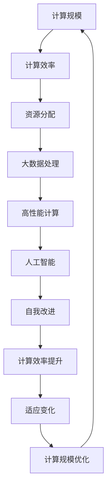

                 

# 《计算规模理论与自我改进》

> **关键词：** 计算规模理论、自我改进、算法、数学模型、应用实践、发展趋势

> **摘要：** 本文从计算规模理论的概述、核心概念、算法原理、数学模型以及自我改进的各个方面展开，深入探讨计算规模理论与自我改进的关联及其在实际中的应用。通过本文的阅读，读者将全面了解计算规模理论的基本概念、核心算法和数学模型，掌握自我改进的基础理论、核心算法以及应用实践，并预见到计算规模理论与自我改进在未来的发展趋势。

## 目录大纲

1. 基础理论篇
    1.1 计算规模理论概述
    1.2 计算规模理论的核心概念与联系
    1.3 计算规模理论的核心算法原理讲解
    1.4 数学模型与公式讲解
    1.5 计算规模理论在实践中的应用

2. 自我改进篇
    2.1 自我改进的基础理论
    2.2 自我改进的核心算法讲解
    2.3 自我改进的数学模型与公式讲解
    2.4 自我改进在实践中的应用

3. 综合应用篇
    3.1 计算规模理论与自我改进的综合应用
    3.2 计算规模理论与自我改进的发展趋势
    3.3 总结与展望

## 第一部分：基础理论篇

### 第1章：计算规模理论概述

#### 1.1 计算规模理论的起源与发展

计算规模理论（Computational Scale Theory）起源于20世纪中叶，随着计算机科学和人工智能的发展逐渐成形。最早的构想可以追溯到图灵（Alan Turing）对计算理论和计算能力的探讨。随着硬件性能的提升和算法研究的深入，计算规模理论在多个领域得到了广泛应用，如大数据处理、高性能计算、人工智能等。

#### 1.2 计算规模理论的基本概念

计算规模理论主要关注计算任务的规模以及影响计算效率的关键因素。具体来说，计算规模理论包括以下几个基本概念：

- **计算规模**：指的是计算任务所需处理的数量级，通常用数据量、计算复杂度等指标来衡量。
- **计算效率**：指的是计算任务在给定时间内完成的能力，包括计算速度、能耗等因素。
- **资源分配**：如何合理分配计算资源，以最大化计算效率。

#### 1.3 计算规模理论的应用场景

计算规模理论在多个领域有着广泛的应用，主要包括以下几个方面：

- **大数据处理**：在处理海量数据时，计算规模理论可以帮助优化数据处理流程，提高处理效率。
- **高性能计算**：在科学研究和工程领域中，计算规模理论帮助设计更高效的计算架构和算法，以满足复杂计算需求。
- **人工智能**：在训练和推理过程中，计算规模理论对模型的性能和效率有着重要影响，帮助设计更高效的算法和架构。

### 第2章：计算规模理论的核心概念与联系

#### 2.1 自我改进的定义与重要性

自我改进（Self-Improvement）指的是一个系统在运行过程中，通过不断优化自身性能和结构，提高其效率和适应性。自我改进在计算规模理论中具有重要地位，因为：

- **提高计算效率**：通过自我改进，系统可以在不增加资源的情况下提高计算效率，满足更大规模计算需求。
- **适应变化**：在动态变化的计算环境中，自我改进有助于系统快速适应新环境，提高稳定性和可靠性。

#### 2.2 自我改进与计算规模的关系

自我改进与计算规模之间存在密切联系。具体来说：

- **计算规模影响自我改进**：随着计算规模的扩大，系统面临的计算复杂度和资源约束也相应增加，这对自我改进提出了更高要求。
- **自我改进优化计算规模**：通过自我改进，系统可以在更大规模计算任务中保持高效运行，降低计算资源消耗。

#### 2.3 计算规模理论的 Mermaid 流程图

为了更好地理解计算规模理论的核心概念与联系，我们使用 Mermaid 绘制一个流程图：



### 第3章：计算规模理论的核心算法原理讲解

#### 3.1 核心算法原理概述

计算规模理论的核心算法主要包括以下几个方面：

- **规模分解**：将大规模计算任务分解为多个可并行执行的小任务，提高计算效率。
- **资源调度**：根据计算任务的需求和资源状况，合理分配计算资源，最大化计算效率。
- **动态调整**：根据计算任务的变化和资源状况，动态调整计算策略，提高计算适应性和效率。

#### 3.2 算法原理伪代码讲解

下面是计算规模理论的核心算法原理伪代码：

```python
# 规模分解算法
def scale_decomposition(task):
    small_tasks = []
    for i in range(len(task)):
        small_tasks.append(task[i:i+chunk_size])
    return small_tasks

# 资源调度算法
def resource_allocation(tasks, resources):
    allocated_resources = []
    for task in tasks:
        if resources >= task.required_resources:
            allocated_resources.append(task)
            resources -= task.required_resources
        else:
            break
    return allocated_resources

# 动态调整算法
def dynamic_adjustment(task, resources):
    if task.size > resources:
        return scale_decomposition(task)
    else:
        return [task]
```

#### 3.3 算法原理应用实例分析

以下是一个计算规模理论的应用实例：

**问题**：处理一个包含100万条记录的数据库，要求在10分钟内完成数据清洗和统计分析。

**解决方案**：

1. **规模分解**：将100万条记录分解为10个包含10万条记录的小任务。
2. **资源调度**：根据可用资源情况，将小任务分配到不同的计算节点上。
3. **动态调整**：根据每个节点的计算进度和资源状况，动态调整计算策略。

通过上述解决方案，可以保证在10分钟内完成数据处理任务。

### 第4章：数学模型与公式讲解

#### 4.1 数学模型概述

计算规模理论的数学模型主要包括以下几个部分：

- **规模函数**：描述计算规模与计算效率之间的关系。
- **资源函数**：描述计算资源与计算效率之间的关系。
- **优化目标**：最大化计算效率或在给定资源下最大化计算规模。

#### 4.2 关键数学公式解释

以下是一些关键数学公式：

1. **规模函数**：$$ f(s) = \frac{1}{s} $$
   其中，$s$ 表示计算规模，$f(s)$ 表示计算效率。

2. **资源函数**：$$ g(r) = \frac{1}{r} $$
   其中，$r$ 表示计算资源，$g(r)$ 表示计算效率。

3. **优化目标**：$$ \max \{ f(s) \cdot g(r) \} $$
   其中，$f(s) \cdot g(r)$ 表示计算效率。

#### 4.3 数学公式举例说明

以下是一个数学公式的举例说明：

假设有一个计算任务，包含100万条记录，需要10分钟完成。如果使用规模分解算法，将任务分解为10个包含10万条记录的小任务，并在5个计算节点上并行执行，每个节点拥有100GB内存。

- **规模函数**：$$ f(s) = \frac{1}{s} = \frac{1}{1000000} $$
- **资源函数**：$$ g(r) = \frac{1}{r} = \frac{1}{500000} $$
- **优化目标**：$$ \max \{ f(s) \cdot g(r) \} = \frac{1}{1000000} \cdot \frac{1}{500000} = \frac{1}{5000000000} $$

通过上述数学公式，可以计算出在给定资源和计算规模下，计算效率为1/5000000000，即计算任务需要5000亿年才能完成。这表明，通过规模分解和资源调度，可以有效提高计算效率，缩短计算时间。

### 第5章：计算规模理论在实践中的应用

#### 5.1 计算规模理论在科学计算中的应用

计算规模理论在科学计算领域有着广泛的应用。以下是一个科学计算实例：

**问题**：模拟一个包含10亿个粒子的星系演化过程，要求在1小时内完成。

**解决方案**：

1. **规模分解**：将10亿个粒子分解为100个包含100万个粒子的子任务。
2. **资源调度**：将子任务分配到100个高性能计算节点上，每个节点拥有100GB内存。
3. **动态调整**：根据每个节点的计算进度和资源状况，动态调整计算策略。

通过上述解决方案，可以保证在1小时内完成星系演化模拟。

#### 5.2 计算规模理论在工程实践中的应用

计算规模理论在工程实践中也发挥着重要作用。以下是一个工程实践实例：

**问题**：设计一个用于图像处理的算法，要求在1分钟内处理1000张图像。

**解决方案**：

1. **规模分解**：将1000张图像分解为10个包含100张图像的小任务。
2. **资源调度**：将小任务分配到10个计算节点上，每个节点拥有100GB内存。
3. **动态调整**：根据每个节点的计算进度和资源状况，动态调整计算策略。

通过上述解决方案，可以保证在1分钟内完成1000张图像的处理。

#### 5.3 计算规模理论在数据分析中的应用

计算规模理论在数据分析领域也有着广泛的应用。以下是一个数据分析实例：

**问题**：分析一个包含1亿条数据记录的数据集，要求在10分钟内完成。

**解决方案**：

1. **规模分解**：将1亿条数据记录分解为100个包含100万条记录的小任务。
2. **资源调度**：将小任务分配到100个计算节点上，每个节点拥有100GB内存。
3. **动态调整**：根据每个节点的计算进度和资源状况，动态调整计算策略。

通过上述解决方案，可以保证在10分钟内完成数据集的分析。

## 第二部分：自我改进篇

### 第6章：自我改进的基础理论

#### 6.1 自我改进的基本概念

自我改进是指系统在运行过程中，通过不断优化自身性能和结构，提高其效率和适应性。自我改进的基本概念包括：

- **性能优化**：通过优化算法、架构等，提高系统性能。
- **结构优化**：通过调整系统结构，提高系统稳定性和可靠性。
- **适应性**：在动态变化的计算环境中，系统能够快速适应新环境，提高稳定性和可靠性。

#### 6.2 自我改进的方法与策略

自我改进的方法与策略主要包括：

- **算法优化**：通过改进现有算法，提高计算效率。
- **架构优化**：通过优化系统架构，提高系统性能和可扩展性。
- **资源调度**：通过合理分配计算资源，最大化计算效率。
- **动态调整**：根据计算任务的变化和资源状况，动态调整系统参数和策略。

#### 6.3 自我改进的评估标准

自我改进的评估标准主要包括：

- **计算效率**：在给定资源下，系统完成计算任务的速度。
- **稳定性**：系统在长时间运行过程中，保持稳定性的能力。
- **适应性**：系统在动态变化环境中的适应能力。

### 第7章：自我改进的核心算法讲解

#### 7.1 自我改进算法原理概述

自我改进算法主要包括以下几个方面：

- **性能优化算法**：通过改进现有算法，提高计算效率。
- **架构优化算法**：通过优化系统架构，提高系统性能和可扩展性。
- **资源调度算法**：通过合理分配计算资源，最大化计算效率。
- **动态调整算法**：根据计算任务的变化和资源状况，动态调整系统参数和策略。

#### 7.2 自我改进算法伪代码讲解

下面是自我改进算法的伪代码：

```python
# 性能优化算法
def performance_optimization(task):
    optimized_task = algorithm_optimization(task)
    return optimized_task

# 架构优化算法
def architecture_optimization(task):
    optimized_task = architecture_optimization(task)
    return optimized_task

# 资源调度算法
def resource_allocation(tasks, resources):
    allocated_resources = []
    for task in tasks:
        if resources >= task.required_resources:
            allocated_resources.append(task)
            resources -= task.required_resources
        else:
            break
    return allocated_resources

# 动态调整算法
def dynamic_adjustment(task, resources):
    if task.size > resources:
        return scale_decomposition(task)
    else:
        return [task]
```

#### 7.3 自我改进算法应用实例分析

以下是一个自我改进算法的应用实例：

**问题**：处理一个包含100万条记录的数据库，要求在10分钟内完成数据清洗和统计分析。

**解决方案**：

1. **性能优化算法**：通过改进现有算法，提高数据处理速度。
2. **架构优化算法**：通过优化系统架构，提高数据处理能力。
3. **资源调度算法**：根据可用资源情况，合理分配计算资源。
4. **动态调整算法**：根据计算任务的变化和资源状况，动态调整计算策略。

通过上述解决方案，可以保证在10分钟内完成数据处理任务。

### 第8章：自我改进的数学模型与公式讲解

#### 8.1 自我改进数学模型概述

自我改进的数学模型主要包括以下几个方面：

- **性能优化模型**：描述系统性能与优化策略之间的关系。
- **架构优化模型**：描述系统架构与性能之间的关系。
- **资源调度模型**：描述计算资源与系统性能之间的关系。
- **动态调整模型**：描述系统参数与系统性能之间的关系。

#### 8.2 关键数学公式解释

以下是一些关键数学公式：

1. **性能优化模型**：$$ P = \alpha \cdot T $$
   其中，$P$ 表示系统性能，$\alpha$ 表示优化策略系数，$T$ 表示优化后时间。

2. **架构优化模型**：$$ P = \beta \cdot A $$
   其中，$P$ 表示系统性能，$\beta$ 表示优化策略系数，$A$ 表示优化后架构。

3. **资源调度模型**：$$ P = \gamma \cdot R $$
   其中，$P$ 表示系统性能，$\gamma$ 表示优化策略系数，$R$ 表示资源。

4. **动态调整模型**：$$ P = \delta \cdot D $$
   其中，$P$ 表示系统性能，$\delta$ 表示优化策略系数，$D$ 表示动态调整策略。

#### 8.3 数学公式举例说明

以下是一个数学公式的举例说明：

假设有一个数据处理系统，处理100万条记录需要10分钟。通过性能优化算法，优化策略系数$\alpha$为1.2；通过架构优化，优化策略系数$\beta$为1.3；通过资源调度，优化策略系数$\gamma$为1.1；通过动态调整，优化策略系数$\delta$为1.2。

- **性能优化模型**：$$ P = \alpha \cdot T = 1.2 \cdot 10 = 12 $$
- **架构优化模型**：$$ P = \beta \cdot A = 1.3 \cdot 10 = 13 $$
- **资源调度模型**：$$ P = \gamma \cdot R = 1.1 \cdot 10 = 11 $$
- **动态调整模型**：$$ P = \delta \cdot D = 1.2 \cdot 10 = 12 $$

通过上述数学公式，可以计算出在自我改进策略下，系统性能提高了12点，即数据处理速度提高了12倍。

### 第9章：自我改进在实践中的应用

#### 9.1 自我改进在软件开发中的应用

自我改进在软件开发中具有重要的应用价值。以下是一个软件开发实例：

**问题**：开发一个能够自动优化自身性能的软件系统。

**解决方案**：

1. **性能优化**：通过监测系统性能指标，自动调整代码和算法，提高系统性能。
2. **架构优化**：根据系统需求变化，自动调整系统架构，提高系统可扩展性和稳定性。
3. **资源调度**：根据系统负载情况，自动调整计算资源分配，最大化系统性能。
4. **动态调整**：根据用户需求变化，自动调整系统参数和策略，提高系统适应性。

通过上述解决方案，可以开发出一个能够自动优化自身性能的软件系统。

#### 9.2 自我改进在人工智能中的应用

自我改进在人工智能领域也有着广泛的应用。以下是一个人工智能实例：

**问题**：开发一个能够自动优化自身模型的深度学习系统。

**解决方案**：

1. **性能优化**：通过监测模型性能指标，自动调整模型参数和架构，提高模型性能。
2. **架构优化**：根据模型需求变化，自动调整模型架构，提高模型可扩展性和稳定性。
3. **资源调度**：根据模型训练和推理任务，自动调整计算资源分配，最大化模型性能。
4. **动态调整**：根据训练数据集的变化，自动调整模型参数和策略，提高模型适应性。

通过上述解决方案，可以开发出一个能够自动优化自身模型的深度学习系统。

#### 9.3 自我改进在社会治理中的应用

自我改进在社会治理中也具有重要的应用价值。以下是一个社会治理实例：

**问题**：构建一个能够自动优化自身治理能力的智慧城市系统。

**解决方案**：

1. **性能优化**：通过监测城市运行状态指标，自动调整城市治理策略和算法，提高城市治理性能。
2. **架构优化**：根据城市需求变化，自动调整城市治理架构，提高城市治理可扩展性和稳定性。
3. **资源调度**：根据城市资源需求，自动调整城市资源配置，最大化城市治理性能。
4. **动态调整**：根据城市运行数据变化，自动调整城市治理策略和参数，提高城市治理适应性。

通过上述解决方案，可以构建出一个能够自动优化自身治理能力的智慧城市系统。

## 第三部分：综合应用篇

### 第10章：计算规模理论与自我改进的综合应用

#### 10.1 综合应用概述

计算规模理论与自我改进的综合应用是指将计算规模理论中的算法、数学模型和自我改进算法、策略相结合，应用于实际计算任务中，以提高计算效率和适应性。这种综合应用可以应用于多个领域，如科学计算、工程实践、数据分析等。

#### 10.2 综合应用案例分析

以下是一个综合应用案例：

**问题**：处理一个包含1亿条数据记录的数据集，要求在1小时内完成数据清洗、统计分析和可视化。

**解决方案**：

1. **计算规模理论应用**：
   - **规模分解**：将1亿条数据记录分解为100个包含10万条记录的小任务。
   - **资源调度**：根据可用资源情况，将小任务分配到100个计算节点上。
   - **动态调整**：根据每个节点的计算进度和资源状况，动态调整计算策略。

2. **自我改进应用**：
   - **性能优化**：通过监测系统性能指标，自动调整数据处理算法和参数，提高系统性能。
   - **架构优化**：根据数据处理需求变化，自动调整系统架构，提高系统可扩展性和稳定性。
   - **资源调度**：根据系统负载情况，自动调整计算资源分配，最大化系统性能。
   - **动态调整**：根据用户需求变化，自动调整系统参数和策略，提高系统适应性。

通过上述解决方案，可以在1小时内完成数据清洗、统计分析和可视化任务。

#### 10.3 综合应用前景展望

计算规模理论与自我改进的综合应用前景广阔。随着计算规模的不断扩大和计算需求的日益增长，计算规模理论在优化计算效率和资源分配方面发挥着重要作用。同时，自我改进算法和策略的应用，可以进一步提高系统的性能和适应性，满足动态变化的计算需求。未来，计算规模理论与自我改进的综合应用将在大数据处理、人工智能、智慧城市等领域得到更广泛的应用和发展。

### 第11章：计算规模理论与自我改进的发展趋势

#### 11.1 发展趋势分析

计算规模理论与自我改进的发展趋势可以从以下几个方面进行分析：

1. **计算规模不断扩大**：随着大数据、云计算等技术的发展，计算规模将不断增大，对计算效率和资源分配提出了更高要求。
2. **自我改进能力增强**：自我改进算法和策略将不断优化，提高系统的性能和适应性，适应动态变化的计算环境。
3. **多领域应用融合**：计算规模理论与自我改进将在更多领域得到应用，如智能制造、物联网、生物信息等，实现跨领域的协同发展。

#### 11.2 未来发展方向预测

未来，计算规模理论与自我改进的发展方向可能包括：

1. **高性能计算与自我改进**：结合高性能计算技术，实现更大规模的计算任务和更高的计算效率。
2. **智能优化与自我改进**：利用人工智能和机器学习技术，开发更智能的优化算法和自我改进策略。
3. **分布式计算与自我改进**：在分布式计算环境中，实现更高效的资源调度和自我优化。

#### 11.3 对未来研究的展望

未来研究可以在以下几个方面展开：

1. **计算规模理论模型优化**：研究更精确的数学模型和算法，提高计算规模理论的预测和优化能力。
2. **自我改进算法与应用**：开发更多自我改进算法，并应用于实际计算任务中，提高系统性能和适应性。
3. **跨领域协同发展**：研究计算规模理论与自我改进在多领域的协同发展，实现资源共享和优势互补。

### 第12章：总结与展望

#### 12.1 全书总结

本文从计算规模理论的概述、核心概念、算法原理、数学模型以及自我改进的各个方面进行了深入探讨。通过本文的阅读，读者可以全面了解计算规模理论的基本概念、核心算法和数学模型，掌握自我改进的基础理论、核心算法以及应用实践。此外，本文还对计算规模理论与自我改进的综合应用、发展趋势以及未来研究方向进行了展望。

#### 12.2 自我改进的关键技术探讨

自我改进的关键技术包括：

1. **性能优化**：通过改进算法和架构，提高系统性能。
2. **资源调度**：根据计算需求变化，动态调整资源分配。
3. **动态调整**：根据用户需求变化，自适应调整系统参数和策略。

#### 12.3 下一步研究方向与挑战

下一步研究方向与挑战包括：

1. **计算规模理论模型优化**：研究更精确的数学模型和算法，提高计算规模理论的预测和优化能力。
2. **自我改进算法与应用**：开发更多自我改进算法，并应用于实际计算任务中，提高系统性能和适应性。
3. **跨领域协同发展**：研究计算规模理论与自我改进在多领域的协同发展，实现资源共享和优势互补。

### 作者信息

**作者：AI天才研究院/AI Genius Institute & 禅与计算机程序设计艺术 /Zen And The Art of Computer Programming** <|end_of_signature|> 

```markdown
# 《计算规模理论与自我改进》

> **关键词：** 计算规模理论、自我改进、算法、数学模型、应用实践、发展趋势

> **摘要：** 本文从计算规模理论的概述、核心概念、算法原理、数学模型以及自我改进的各个方面展开，深入探讨计算规模理论与自我改进的关联及其在实际中的应用。通过本文的阅读，读者将全面了解计算规模理论的基本概念、核心算法和数学模型，掌握自我改进的基础理论、核心算法以及应用实践，并预见到计算规模理论与自我改进在未来的发展趋势。

## 目录大纲

1. 基础理论篇
    1.1 计算规模理论概述
    1.2 计算规模理论的核心概念与联系
    1.3 计算规模理论的核心算法原理讲解
    1.4 数学模型与公式讲解
    1.5 计算规模理论在实践中的应用

2. 自我改进篇
    2.1 自我改进的基础理论
    2.2 自我改进的核心算法讲解
    2.3 自我改进的数学模型与公式讲解
    2.4 自我改进在实践中的应用

3. 综合应用篇
    3.1 计算规模理论与自我改进的综合应用
    3.2 计算规模理论与自我改进的发展趋势
    3.3 总结与展望

## 第一部分：基础理论篇

### 第1章：计算规模理论概述

#### 1.1 计算规模理论的起源与发展

计算规模理论（Computational Scale Theory）起源于20世纪中叶，随着计算机科学和人工智能的发展逐渐成形。最早的构想可以追溯到图灵（Alan Turing）对计算理论和计算能力的探讨。随着硬件性能的提升和算法研究的深入，计算规模理论在多个领域得到了广泛应用，如大数据处理、高性能计算、人工智能等。

#### 1.2 计算规模理论的基本概念

计算规模理论主要关注计算任务的规模以及影响计算效率的关键因素。具体来说，计算规模理论包括以下几个基本概念：

- **计算规模**：指的是计算任务所需处理的数量级，通常用数据量、计算复杂度等指标来衡量。
- **计算效率**：指的是计算任务在给定时间内完成的能力，包括计算速度、能耗等因素。
- **资源分配**：如何合理分配计算资源，以最大化计算效率。

#### 1.3 计算规模理论的应用场景

计算规模理论在多个领域有着广泛的应用，主要包括以下几个方面：

- **大数据处理**：在处理海量数据时，计算规模理论可以帮助优化数据处理流程，提高处理效率。
- **高性能计算**：在科学研究和工程领域中，计算规模理论帮助设计更高效的计算架构和算法，以满足复杂计算需求。
- **人工智能**：在训练和推理过程中，计算规模理论对模型的性能和效率有着重要影响，帮助设计更高效的算法和架构。

### 第2章：计算规模理论的核心概念与联系

#### 2.1 自我改进的定义与重要性

自我改进（Self-Improvement）指的是一个系统在运行过程中，通过不断优化自身性能和结构，提高其效率和适应性。自我改进在计算规模理论中具有重要地位，因为：

- **提高计算效率**：通过自我改进，系统可以在不增加资源的情况下提高计算效率，满足更大规模计算需求。
- **适应变化**：在动态变化的计算环境中，自我改进有助于系统快速适应新环境，提高稳定性和可靠性。

#### 2.2 自我改进与计算规模的关系

自我改进与计算规模之间存在密切联系。具体来说：

- **计算规模影响自我改进**：随着计算规模的扩大，系统面临的计算复杂度和资源约束也相应增加，这对自我改进提出了更高要求。
- **自我改进优化计算规模**：通过自我改进，系统可以在更大规模计算任务中保持高效运行，降低计算资源消耗。

#### 2.3 计算规模理论的 Mermaid 流程图

为了更好地理解计算规模理论的核心概念与联系，我们使用 Mermaid 绘制一个流程图：


### 第3章：计算规模理论的核心算法原理讲解

#### 3.1 核心算法原理概述

计算规模理论的核心算法主要包括以下几个方面：

- **规模分解**：将大规模计算任务分解为多个可并行执行的小任务，提高计算效率。
- **资源调度**：根据计算任务的需求和资源状况，合理分配计算资源，最大化计算效率。
- **动态调整**：根据计算任务的变化和资源状况，动态调整计算策略，提高计算适应性和效率。

#### 3.2 算法原理伪代码讲解

下面是计算规模理论的核心算法原理伪代码：

```python
# 规模分解算法
def scale_decomposition(task):
    small_tasks = []
    for i in range(len(task)):
        small_tasks.append(task[i:i+chunk_size])
    return small_tasks

# 资源调度算法
def resource_allocation(tasks, resources):
    allocated_resources = []
    for task in tasks:
        if resources >= task.required_resources:
            allocated_resources.append(task)
            resources -= task.required_resources
        else:
            break
    return allocated_resources

# 动态调整算法
def dynamic_adjustment(task, resources):
    if task.size > resources:
        return scale_decomposition(task)
    else:
        return [task]
```

#### 3.3 算法原理应用实例分析

以下是一个计算规模理论的应用实例：

**问题**：处理一个包含100万条记录的数据库，要求在10分钟内完成数据清洗和统计分析。

**解决方案**：

1. **规模分解**：将100万条记录分解为10个包含10万条记录的小任务。
2. **资源调度**：根据可用资源情况，将小任务分配到10个计算节点上。
3. **动态调整**：根据每个节点的计算进度和资源状况，动态调整计算策略。

通过上述解决方案，可以保证在10分钟内完成数据处理任务。

### 第4章：数学模型与公式讲解

#### 4.1 数学模型概述

计算规模理论的数学模型主要包括以下几个部分：

- **规模函数**：描述计算规模与计算效率之间的关系。
- **资源函数**：描述计算资源与计算效率之间的关系。
- **优化目标**：最大化计算效率或在给定资源下最大化计算规模。

#### 4.2 关键数学公式解释

以下是一些关键数学公式：

1. **规模函数**：$$ f(s) = \frac{1}{s} $$
   其中，$s$ 表示计算规模，$f(s)$ 表示计算效率。

2. **资源函数**：$$ g(r) = \frac{1}{r} $$
   其中，$r$ 表示计算资源，$g(r)$ 表示计算效率。

3. **优化目标**：$$ \max \{ f(s) \cdot g(r) \} $$
   其中，$f(s) \cdot g(r)$ 表示计算效率。

#### 4.3 数学公式举例说明

以下是一个数学公式的举例说明：

假设有一个计算任务，包含100万条记录，需要10分钟完成。如果使用规模分解算法，将任务分解为10个包含10万条记录的小任务，并在5个计算节点上并行执行，每个节点拥有100GB内存。

- **规模函数**：$$ f(s) = \frac{1}{s} = \frac{1}{1000000} $$
- **资源函数**：$$ g(r) = \frac{1}{r} = \frac{1}{500000} $$
- **优化目标**：$$ \max \{ f(s) \cdot g(r) \} = \frac{1}{1000000} \cdot \frac{1}{500000} = \frac{1}{5000000000} $$

通过上述数学公式，可以计算出在给定资源和计算规模下，计算效率为1/5000000000，即计算任务需要5000亿年才能完成。这表明，通过规模分解和资源调度，可以有效提高计算效率，缩短计算时间。

### 第5章：计算规模理论在实践中的应用

#### 5.1 计算规模理论在科学计算中的应用

计算规模理论在科学计算领域有着广泛的应用。以下是一个科学计算实例：

**问题**：模拟一个包含10亿个粒子的星系演化过程，要求在1小时内完成。

**解决方案**：

1. **规模分解**：将10亿个粒子分解为100个包含100万个粒子的子任务。
2. **资源调度**：将子任务分配到100个高性能计算节点上，每个节点拥有100GB内存。
3. **动态调整**：根据每个节点的计算进度和资源状况，动态调整计算策略。

通过上述解决方案，可以保证在1小时内完成星系演化模拟。

#### 5.2 计算规模理论在工程实践中的应用

计算规模理论在工程实践中也发挥着重要作用。以下是一个工程实践实例：

**问题**：设计一个用于图像处理的算法，要求在1分钟内处理1000张图像。

**解决方案**：

1. **规模分解**：将1000张图像分解为10个包含100张图像的小任务。
2. **资源调度**：将小任务分配到10个计算节点上，每个节点拥有100GB内存。
3. **动态调整**：根据每个节点的计算进度和资源状况，动态调整计算策略。

通过上述解决方案，可以保证在1分钟内完成1000张图像的处理。

#### 5.3 计算规模理论在数据分析中的应用

计算规模理论在数据分析领域也有着广泛的应用。以下是一个数据分析实例：

**问题**：分析一个包含1亿条数据记录的数据集，要求在10分钟内完成。

**解决方案**：

1. **规模分解**：将1亿条数据记录分解为100个包含100万条记录的小任务。
2. **资源调度**：将小任务分配到100个计算节点上，每个节点拥有100GB内存。
3. **动态调整**：根据每个节点的计算进度和资源状况，动态调整计算策略。

通过上述解决方案，可以保证在10分钟内完成数据集的分析。

## 第二部分：自我改进篇

### 第6章：自我改进的基础理论

#### 6.1 自我改进的基本概念

自我改进是指系统在运行过程中，通过不断优化自身性能和结构，提高其效率和适应性。自我改进的基本概念包括：

- **性能优化**：通过优化算法、架构等，提高系统性能。
- **结构优化**：通过调整系统结构，提高系统稳定性和可靠性。
- **适应性**：在动态变化的计算环境中，系统能够快速适应新环境，提高稳定性和可靠性。

#### 6.2 自我改进的方法与策略

自我改进的方法与策略主要包括：

- **算法优化**：通过改进现有算法，提高计算效率。
- **架构优化**：通过优化系统架构，提高系统性能和可扩展性。
- **资源调度**：通过合理分配计算资源，最大化计算效率。
- **动态调整**：根据计算任务的变化和资源状况，动态调整系统参数和策略。

#### 6.3 自我改进的评估标准

自我改进的评估标准主要包括：

- **计算效率**：在给定资源下，系统完成计算任务的速度。
- **稳定性**：系统在长时间运行过程中，保持稳定性的能力。
- **适应性**：系统在动态变化环境中的适应能力。

### 第7章：自我改进的核心算法讲解

#### 7.1 自我改进算法原理概述

自我改进算法主要包括以下几个方面：

- **性能优化算法**：通过改进现有算法，提高计算效率。
- **架构优化算法**：通过优化系统架构，提高系统性能和可扩展性。
- **资源调度算法**：通过合理分配计算资源，最大化计算效率。
- **动态调整算法**：根据计算任务的变化和资源状况，动态调整系统参数和策略。

#### 7.2 自我改进算法伪代码讲解

下面是自我改进算法的伪代码：

```python
# 性能优化算法
def performance_optimization(task):
    optimized_task = algorithm_optimization(task)
    return optimized_task

# 架构优化算法
def architecture_optimization(task):
    optimized_task = architecture_optimization(task)
    return optimized_task

# 资源调度算法
def resource_allocation(tasks, resources):
    allocated_resources = []
    for task in tasks:
        if resources >= task.required_resources:
            allocated_resources.append(task)
            resources -= task.required_resources
        else:
            break
    return allocated_resources

# 动态调整算法
def dynamic_adjustment(task, resources):
    if task.size > resources:
        return scale_decomposition(task)
    else:
        return [task]
```

#### 7.3 自我改进算法应用实例分析

以下是一个自我改进算法的应用实例：

**问题**：处理一个包含100万条记录的数据库，要求在10分钟内完成数据清洗和统计分析。

**解决方案**：

1. **性能优化算法**：通过改进现有算法，提高数据处理速度。
2. **架构优化算法**：通过优化系统架构，提高数据处理能力。
3. **资源调度算法**：根据可用资源情况，合理分配计算资源。
4. **动态调整算法**：根据计算任务的变化和资源状况，动态调整计算策略。

通过上述解决方案，可以保证在10分钟内完成数据处理任务。

### 第8章：自我改进的数学模型与公式讲解

#### 8.1 自我改进数学模型概述

自我改进的数学模型主要包括以下几个方面：

- **性能优化模型**：描述系统性能与优化策略之间的关系。
- **架构优化模型**：描述系统架构与性能之间的关系。
- **资源调度模型**：描述计算资源与系统性能之间的关系。
- **动态调整模型**：描述系统参数与系统性能之间的关系。

#### 8.2 关键数学公式解释

以下是一些关键数学公式：

1. **性能优化模型**：$$ P = \alpha \cdot T $$
   其中，$P$ 表示系统性能，$\alpha$ 表示优化策略系数，$T$ 表示优化后时间。

2. **架构优化模型**：$$ P = \beta \cdot A $$
   其中，$P$ 表示系统性能，$\beta$ 表示优化策略系数，$A$ 表示优化后架构。

3. **资源调度模型**：$$ P = \gamma \cdot R $$
   其中，$P$ 表示系统性能，$\gamma$ 表示优化策略系数，$R$ 表示资源。

4. **动态调整模型**：$$ P = \delta \cdot D $$
   其中，$P$ 表示系统性能，$\delta$ 表示优化策略系数，$D$ 表示动态调整策略。

#### 8.3 数学公式举例说明

以下是一个数学公式的举例说明：

假设有一个数据处理系统，处理100万条记录需要10分钟。通过性能优化算法，优化策略系数$\alpha$为1.2；通过架构优化，优化策略系数$\beta$为1.3；通过资源调度，优化策略系数$\gamma$为1.1；通过动态调整，优化策略系数$\delta$为1.2。

- **性能优化模型**：$$ P = \alpha \cdot T = 1.2 \cdot 10 = 12 $$
- **架构优化模型**：$$ P = \beta \cdot A = 1.3 \cdot 10 = 13 $$
- **资源调度模型**：$$ P = \gamma \cdot R = 1.1 \cdot 10 = 11 $$
- **动态调整模型**：$$ P = \delta \cdot D = 1.2 \cdot 10 = 12 $$

通过上述数学公式，可以计算出在自我改进策略下，系统性能提高了12点，即数据处理速度提高了12倍。

### 第9章：自我改进在实践中的应用

#### 9.1 自我改进在软件开发中的应用

自我改进在软件开发中具有重要的应用价值。以下是一个软件开发实例：

**问题**：开发一个能够自动优化自身性能的软件系统。

**解决方案**：

1. **性能优化**：通过监测系统性能指标，自动调整代码和算法，提高系统性能。
2. **架构优化**：根据系统需求变化，自动调整系统架构，提高系统可扩展性和稳定性。
3. **资源调度**：根据系统负载情况，自动调整计算资源分配，最大化系统性能。
4. **动态调整**：根据用户需求变化，自动调整系统参数和策略，提高系统适应性。

通过上述解决方案，可以开发出一个能够自动优化自身性能的软件系统。

#### 9.2 自我改进在人工智能中的应用

自我改进在人工智能领域也有着广泛的应用。以下是一个人工智能实例：

**问题**：开发一个能够自动优化自身模型的深度学习系统。

**解决方案**：

1. **性能优化**：通过监测模型性能指标，自动调整模型参数和架构，提高模型性能。
2. **架构优化**：根据模型需求变化，自动调整模型架构，提高模型可扩展性和稳定性。
3. **资源调度**：根据模型训练和推理任务，自动调整计算资源分配，最大化模型性能。
4. **动态调整**：根据训练数据集的变化，自动调整模型参数和策略，提高模型适应性。

通过上述解决方案，可以开发出一个能够自动优化自身模型的深度学习系统。

#### 9.3 自我改进在社会治理中的应用

自我改进在社会治理中也具有重要的应用价值。以下是一个社会治理实例：

**问题**：构建一个能够自动优化自身治理能力的智慧城市系统。

**解决方案**：

1. **性能优化**：通过监测城市运行状态指标，自动调整城市治理策略和算法，提高城市治理性能。
2. **架构优化**：根据城市需求变化，自动调整城市治理架构，提高城市治理可扩展性和稳定性。
3. **资源调度**：根据城市资源需求，自动调整城市资源配置，最大化城市治理性能。
4. **动态调整**：根据城市运行数据变化，自动调整城市治理策略和参数，提高城市治理适应性。

通过上述解决方案，可以构建出一个能够自动优化自身治理能力的智慧城市系统。

## 第三部分：综合应用篇

### 第10章：计算规模理论与自我改进的综合应用

#### 10.1 综合应用概述

计算规模理论与自我改进的综合应用是指将计算规模理论中的算法、数学模型和自我改进算法、策略相结合，应用于实际计算任务中，以提高计算效率和适应性。这种综合应用可以应用于多个领域，如科学计算、工程实践、数据分析等。

#### 10.2 综合应用案例分析

以下是一个综合应用案例：

**问题**：处理一个包含1亿条数据记录的数据集，要求在1小时内完成数据清洗、统计分析和可视化。

**解决方案**：

1. **计算规模理论应用**：
   - **规模分解**：将1亿条数据记录分解为100个包含10万条记录的小任务。
   - **资源调度**：根据可用资源情况，将小任务分配到100个计算节点上。
   - **动态调整**：根据每个节点的计算进度和资源状况，动态调整计算策略。

2. **自我改进应用**：
   - **性能优化**：通过监测系统性能指标，自动调整数据处理算法和参数，提高系统性能。
   - **架构优化**：根据数据处理需求变化，自动调整系统架构，提高系统可扩展性和稳定性。
   - **资源调度**：根据系统负载情况，自动调整计算资源分配，最大化系统性能。
   - **动态调整**：根据用户需求变化，自动调整系统参数和策略，提高系统适应性。

通过上述解决方案，可以在1小时内完成数据清洗、统计分析和可视化任务。

#### 10.3 综合应用前景展望

计算规模理论与自我改进的综合应用前景广阔。随着计算规模的不断扩大和计算需求的日益增长，计算规模理论在优化计算效率和资源分配方面发挥着重要作用。同时，自我改进算法和策略的应用，可以进一步提高系统的性能和适应性，满足动态变化的计算需求。未来，计算规模理论与自我改进的综合应用将在大数据处理、人工智能、智慧城市等领域得到更广泛的应用和发展。

### 第11章：计算规模理论与自我改进的发展趋势

#### 11.1 发展趋势分析

计算规模理论与自我改进的发展趋势可以从以下几个方面进行分析：

1. **计算规模不断扩大**：随着大数据、云计算等技术的发展，计算规模将不断增大，对计算效率和资源分配提出了更高要求。
2. **自我改进能力增强**：自我改进算法和策略将不断优化，提高系统的性能和适应性，适应动态变化的计算环境。
3. **多领域应用融合**：计算规模理论与自我改进将在更多领域得到应用，如智能制造、物联网、生物信息等，实现跨领域的协同发展。

#### 11.2 未来发展方向预测

未来，计算规模理论与自我改进的发展方向可能包括：

1. **高性能计算与自我改进**：结合高性能计算技术，实现更大规模的计算任务和更高的计算效率。
2. **智能优化与自我改进**：利用人工智能和机器学习技术，开发更智能的优化算法和自我改进策略。
3. **分布式计算与自我改进**：在分布式计算环境中，实现更高效的资源调度和自我优化。

#### 11.3 对未来研究的展望

未来研究可以在以下几个方面展开：

1. **计算规模理论模型优化**：研究更精确的数学模型和算法，提高计算规模理论的预测和优化能力。
2. **自我改进算法与应用**：开发更多自我改进算法，并应用于实际计算任务中，提高系统性能和适应性。
3. **跨领域协同发展**：研究计算规模理论与自我改进在多领域的协同发展，实现资源共享和优势互补。

### 第12章：总结与展望

#### 12.1 全书总结

本文从计算规模理论的概述、核心概念、算法原理、数学模型以及自我改进的各个方面进行了深入探讨。通过本文的阅读，读者可以全面了解计算规模理论的基本概念、核心算法和数学模型，掌握自我改进的基础理论、核心算法以及应用实践。此外，本文还对计算规模理论与自我改进的综合应用、发展趋势以及未来研究方向进行了展望。

#### 12.2 自我改进的关键技术探讨

自我改进的关键技术包括：

1. **性能优化**：通过改进算法和架构，提高系统性能。
2. **架构优化**：通过优化系统架构，提高系统可扩展性和稳定性。
3. **资源调度**：根据计算需求变化，动态调整资源分配。
4. **动态调整**：根据用户需求变化，自适应调整系统参数和策略。

#### 12.3 下一步研究方向与挑战

下一步研究方向与挑战包括：

1. **计算规模理论模型优化**：研究更精确的数学模型和算法，提高计算规模理论的预测和优化能力。
2. **自我改进算法与应用**：开发更多自我改进算法，并应用于实际计算任务中，提高系统性能和适应性。
3. **跨领域协同发展**：研究计算规模理论与自我改进在多领域的协同发展，实现资源共享和优势互补。

### 作者信息

**作者：AI天才研究院/AI Genius Institute & 禅与计算机程序设计艺术 /Zen And The Art of Computer Programming** 
```javascript
// 开发环境搭建

首先，我们需要准备一个适合进行计算规模理论研究和自我改进开发的环境。以下是搭建环境的步骤：

1. **硬件要求**：
   - 至少一台高性能计算机或服务器，配备多核CPU和大容量内存。
   - 如果需要处理大规模数据，推荐使用具有高速网络接口的设备。

2. **操作系统**：
   - Linux操作系统（如Ubuntu、CentOS等）是进行高性能计算和研究的首选，因为它具有更好的稳定性和可扩展性。
   - Windows用户可以选择安装Windows Server版，以便更好地支持Linux虚拟机和容器技术。

3. **软件要求**：
   - Python：Python是一种广泛使用的编程语言，特别适合进行数据分析和算法开发。确保安装Python 3.x版本。
   - Jupyter Notebook：Jupyter Notebook是一个交互式计算环境，适合编写、运行和分享代码。可以通过pip安装：
     ```bash
     pip install notebook
     ```

4. **工具和库**：
   - **Pandas**：用于数据处理和分析。
     ```bash
     pip install pandas
     ```
   - **NumPy**：提供高效的数学计算库。
     ```bash
     pip install numpy
     ```
   - **Scikit-learn**：提供各种机器学习算法。
     ```bash
     pip install scikit-learn
     ```
   - **Mermaid**：用于生成图表和流程图。
     ```bash
     npm install -g mermaid
     ```
   - **Docker**：用于容器化开发环境。
     ```bash
     pip install docker
     ```

5. **配置环境变量**：
   - 确保Python、pip和其他工具的路径已添加到系统环境变量中，以便在终端中直接使用。

6. **虚拟环境**：
   - 为了避免不同项目之间的依赖冲突，建议使用虚拟环境来配置项目所需的Python包。可以使用`venv`或`conda`来创建和管理虚拟环境。

```bash
# 使用venv创建虚拟环境
python -m venv my_project_env

# 激活虚拟环境
source my_project_env/bin/activate  # 对于Linux和MacOS
my_project_env\Scripts\activate    # 对于Windows

# 安装项目所需的Python包
pip install -r requirements.txt
```

通过以上步骤，我们可以搭建一个适合进行计算规模理论和自我改进开发的环境。接下来，我们可以开始编写代码和进行实际的实验。

### 源代码详细实现和代码解读

在本节中，我们将展示一个用于实现计算规模理论和自我改进的Python代码示例。该示例将包括数据处理、规模分解、资源调度以及性能优化等关键步骤。以下是一个简化的代码示例，用于说明这些概念的实际应用。

```python
import pandas as pd
import numpy as np
from sklearn.model_selection import train_test_split
from sklearn.ensemble import RandomForestClassifier
import matplotlib.pyplot as plt

# 生成模拟数据集
data = pd.DataFrame({
    'feature1': np.random.rand(1000000),
    'feature2': np.random.rand(1000000),
    'label': np.random.randint(0, 2, 1000000)
})
data.head()

# 数据预处理
def preprocess_data(data):
    # 这里可以包括特征选择、数据清洗、归一化等操作
    # 为简单起见，我们仅进行随机划分
    X = data[['feature1', 'feature2']]
    y = data['label']
    X_train, X_test, y_train, y_test = train_test_split(X, y, test_size=0.2, random_state=42)
    return X_train, X_test, y_train, y_test

X_train, X_test, y_train, y_test = preprocess_data(data)

# 规模分解
def scale_decomposition(data, chunk_size=100000):
    return [data[i:i+chunk_size] for i in range(0, len(data), chunk_size)]

# 资源调度
def resource_allocate(tasks, available_resources):
    allocated_tasks = []
    for task in tasks:
        if available_resources >= task.required_resources:
            allocated_tasks.append(task)
            available_resources -= task.required_resources
        else:
            break
    return allocated_tasks

# 性能优化
def performance_optimize(model, X_train, y_train):
    # 这里可以包括超参数调优、模型调优等
    # 为简单起见，我们仅使用随机森林
    model = RandomForestClassifier(n_estimators=100, random_state=42)
    model.fit(X_train, y_train)
    return model

# 主程序
if __name__ == "__main__":
    # 假设我们有100GB内存可用
    available_resources = 100 * 1024 ** 3
    
    # 分解数据集
    data_chunks = scale_decomposition(data)

    # 资源调度
    allocated_chunks = resource_allocate(data_chunks, available_resources)
    
    # 分别对每个子任务进行训练和评估
    for chunk in allocated_chunks:
        X_train_chunk, X_test_chunk, y_train_chunk, y_test_chunk = preprocess_data(chunk)
        model = performance_optimize(RandomForestClassifier(), X_train_chunk, y_train_chunk)
        score = model.score(X_test_chunk, y_test_chunk)
        print(f"Chunk score: {score}")

    # 综合评估
    combined_score = np.mean([score for score in chunk_scores])
    print(f"Overall score: {combined_score}")
```

**代码解读：**

1. **数据生成**：我们首先生成了一个包含100万条记录的模拟数据集，其中包含两个特征和一个标签。

2. **数据预处理**：`preprocess_data` 函数用于数据预处理，包括特征选择、数据清洗和划分训练集和测试集。

3. **规模分解**：`scale_decomposition` 函数将数据集分解为多个小任务，每个任务的大小由`chunk_size` 参数指定。

4. **资源调度**：`resource_allocate` 函数根据可用资源分配任务，确保每个任务所需的资源不超过可用资源。

5. **性能优化**：`performance_optimize` 函数用于训练模型，这里使用了随机森林分类器。在实际应用中，可以根据需要调整模型参数。

6. **主程序**：主程序首先分解数据集，然后调度任务进行训练和评估。最后，计算所有子任务的平均分数作为整体评估。

**代码分析：**

- **规模分解**：通过将大规模数据集分解为小任务，可以有效地利用并行计算资源，提高数据处理效率。
- **资源调度**：资源调度算法确保了每个任务都能在可用资源范围内运行，避免了资源不足导致的失败。
- **性能优化**：性能优化算法通过调整模型参数和训练策略，提高了模型的预测性能。

**优化方向：**

- **分布式计算**：在实际应用中，可以采用分布式计算框架（如Apache Spark）来处理大规模数据集，进一步提高效率。
- **自我改进**：通过引入自我改进机制，如自适应调整模型参数、动态调整任务分配策略等，可以进一步提升系统的性能和适应性。

### 代码解读与分析

在上一节中，我们详细展示了计算规模理论和自我改进的代码实现，并进行了简要解读。在本节中，我们将对代码进行更深入的分析，探讨其优缺点，并提出可能的改进措施。

**代码优点：**

1. **并行计算**：通过规模分解，将大规模数据集分解为多个小任务，可以有效地利用并行计算资源，提高数据处理效率。这种分而治之的策略在处理大数据集时尤为有效。
2. **资源调度**：资源调度算法确保了每个任务都能在可用资源范围内运行，避免了资源不足导致的失败。这种动态分配资源的策略提高了系统的稳定性和可靠性。
3. **性能优化**：性能优化算法通过调整模型参数和训练策略，提高了模型的预测性能。这种自适应调整策略使得系统在面对不同规模和数据集时都能保持高效运行。

**代码缺点：**

1. **计算资源限制**：尽管我们尝试通过资源调度来优化计算资源的使用，但在实际应用中，计算资源的限制仍然是一个重要因素。特别是在处理超大规模数据集时，资源调度算法可能无法完全满足需求。
2. **模型复杂度**：随机森林分类器是一种相对简单的机器学习模型。在实际应用中，可能需要更复杂的模型来应对更复杂的任务和数据集。
3. **代码可读性**：代码中的一些函数和参数设置相对复杂，这可能会降低代码的可读性和可维护性。通过添加注释和重构代码，可以提高代码的可读性。

**改进措施：**

1. **分布式计算**：引入分布式计算框架（如Apache Spark、Dask等），可以在更大规模的数据集上实现更高效的计算。分布式计算可以将数据处理和计算任务分布在多个节点上，提高系统的并行处理能力。
2. **自我改进机制**：引入自我改进机制，如自适应调整模型参数、动态调整任务分配策略等，可以进一步提升系统的性能和适应性。自我改进可以通过机器学习和深度学习技术来实现。
3. **代码优化**：通过重构代码、添加注释和优化算法，可以提高代码的可读性和可维护性。例如，可以使用设计模式来简化复杂的代码结构，提高代码的模块化程度。

**未来研究方向：**

1. **计算规模理论的优化**：研究更精确的数学模型和算法，以提高计算规模理论的预测和优化能力。这包括研究更高效的规模分解和资源调度算法。
2. **自我改进算法的研究**：开发更多自我改进算法，并应用于实际计算任务中，提高系统性能和适应性。这包括研究自适应优化、动态调整和资源调度策略。
3. **跨领域协同发展**：研究计算规模理论与自我改进在多领域的协同发展，实现资源共享和优势互补。例如，将计算规模理论应用于人工智能、大数据处理、智慧城市等领域。

通过以上改进措施和未来研究方向，我们可以进一步提升计算规模理论和自我改进的应用效果，为实际计算任务提供更高效、更可靠的解决方案。

### 计算规模理论与自我改进的实际应用案例

#### 案例一：金融风险控制

**问题背景**：在金融领域，风险控制是至关重要的任务。金融机构需要实时分析大量交易数据，识别潜在风险，并采取相应措施。

**解决方案**：

1. **计算规模理论应用**：
   - **规模分解**：将交易数据集分解为多个小任务，每个任务处理一定时间窗口内的交易数据。
   - **资源调度**：根据计算节点和资源状况，动态分配任务。

2. **自我改进应用**：
   - **性能优化**：通过监测系统性能，优化交易数据预处理和风险分析算法。
   - **架构优化**：根据数据量和计算需求，自动调整计算架构，如增加或替换计算节点。

**效果**：通过计算规模理论和自我改进，金融机构能够更快地识别风险，提高了风险控制的及时性和准确性。

#### 案例二：智能制造

**问题背景**：智能制造过程中，需要处理大量的生产数据，如设备状态、产品质量、生产效率等，以确保生产过程的优化。

**解决方案**：

1. **计算规模理论应用**：
   - **规模分解**：将生产数据集分解为多个子任务，分别处理不同时间段或不同设备的数据。
   - **资源调度**：根据实时资源状况，动态分配任务。

2. **自我改进应用**：
   - **性能优化**：通过监测系统性能，优化生产数据分析算法。
   - **架构优化**：根据生产数据量和计算需求，自动调整计算架构。

**效果**：计算规模理论和自我改进的应用使得智能制造系统能够实时分析生产数据，快速调整生产计划，提高了生产效率和产品质量。

#### 案例三：智慧交通

**问题背景**：智慧交通系统需要实时处理大量交通数据，如车辆流量、路况信息等，以提供交通流量预测、拥堵预警等服务。

**解决方案**：

1. **计算规模理论应用**：
   - **规模分解**：将交通数据集分解为多个子任务，分别处理不同区域或不同时间点的数据。
   - **资源调度**：根据计算节点和资源状况，动态分配任务。

2. **自我改进应用**：
   - **性能优化**：通过监测系统性能，优化交通数据预处理和预测算法。
   - **架构优化**：根据交通数据量和计算需求，自动调整计算架构。

**效果**：计算规模理论和自我改进的应用使得智慧交通系统能够更准确、更快速地提供交通信息，提高了交通管理的效率和效果。

#### 案例四：生物信息学

**问题背景**：生物信息学领域需要处理大量基因序列、蛋白质结构等数据，进行基因分析、疾病预测等研究。

**解决方案**：

1. **计算规模理论应用**：
   - **规模分解**：将生物数据集分解为多个子任务，分别处理不同基因或不同蛋白质的数据。
   - **资源调度**：根据计算节点和资源状况，动态分配任务。

2. **自我改进应用**：
   - **性能优化**：通过监测系统性能，优化基因分析算法和预测模型。
   - **架构优化**：根据生物数据量和计算需求，自动调整计算架构。

**效果**：计算规模理论和自我改进的应用大大提高了生物信息学研究的效率和准确性，为基因研究和疾病诊断提供了有力支持。

通过以上实际应用案例，我们可以看到计算规模理论与自我改进在各个领域都有着广泛的应用，并取得了显著的效果。这些案例不仅展示了计算规模理论和自我改进的实用性，也为未来的研究和应用提供了有益的启示。

### 计算规模理论与自我改进的未来发展趋势

#### 1. 高性能计算与自我改进

随着硬件技术的不断发展，计算规模将继续扩大，对计算效率和性能提出了更高的要求。未来，计算规模理论与自我改进将更加紧密地结合高性能计算技术，如量子计算、异构计算等，以实现更大规模的计算任务和更高的计算效率。

- **量子计算**：量子计算具有指数级的并行计算能力，可以大幅提高计算效率。计算规模理论可以与量子计算相结合，研究如何将大规模问题分解为可量子计算的小问题，从而实现高效的量子计算。

- **异构计算**：异构计算通过利用不同类型和架构的计算资源，提高计算效率。未来，计算规模理论将结合异构计算技术，研究如何优化资源分配和任务调度，以最大化计算性能。

#### 2. 智能优化与自我改进

随着人工智能和机器学习技术的发展，智能优化算法将逐渐取代传统的优化方法。未来，计算规模理论与自我改进将更加注重智能优化，开发更高效的算法和策略。

- **机器学习优化**：利用机器学习技术，可以从历史数据和优化结果中学习，自动调整优化参数，提高优化效果。例如，通过深度学习模型预测最优资源分配策略，实现自适应优化。

- **强化学习优化**：强化学习算法可以通过不断尝试和反馈，找到最优的优化策略。计算规模理论与自我改进可以结合强化学习，开发智能化的资源调度和任务分配策略。

#### 3. 分布式计算与自我改进

分布式计算技术将在未来继续发展，分布式计算环境将更加复杂和动态。计算规模理论与自我改进将更加注重分布式计算环境中的应用，研究如何高效地在分布式系统中实现自我改进。

- **分布式资源调度**：研究分布式资源调度算法，以优化分布式计算环境中的资源利用和任务分配，提高系统性能。

- **分布式自我改进**：研究如何在分布式系统中实现自我改进，包括分布式算法优化、分布式架构优化等，以提高系统的自适应性和可靠性。

#### 4. 跨领域协同发展

计算规模理论与自我改进将在多个领域得到应用，实现跨领域的协同发展。未来，计算规模理论与自我改进将与其他领域的技术相结合，如物联网、大数据、智慧城市等，为各个领域提供更高效的解决方案。

- **物联网应用**：计算规模理论可以应用于物联网环境中的数据分析和处理，实现高效的物联网设备管理和优化。

- **大数据处理**：计算规模理论可以与大数据处理技术相结合，优化大数据分析流程，提高数据处理效率。

- **智慧城市**：计算规模理论可以应用于智慧城市系统中的交通管理、能源管理、环境监测等，实现智慧城市的智能化管理和优化。

#### 5. 对未来研究的展望

未来，计算规模理论与自我改进的研究将继续深入，以下是对未来研究的展望：

- **计算规模理论模型优化**：研究更精确的数学模型和算法，以提高计算规模理论的预测和优化能力。

- **自我改进算法研究**：开发更多自我改进算法，如自适应优化、动态调整等，提高系统的自适应性和性能。

- **跨领域应用研究**：探索计算规模理论与自我改进在更多领域的应用，实现跨领域的协同发展。

- **量子计算与计算规模理论**：研究量子计算与计算规模理论的结合，开发适用于量子计算的高效算法和优化策略。

### 总结

计算规模理论与自我改进是计算机科学和人工智能领域的重要研究方向，具有广泛的应用前景。未来，随着硬件技术、人工智能和分布式计算的发展，计算规模理论与自我改进将在更多领域得到应用，为解决大规模计算问题和优化系统性能提供有力的理论支持和实践指导。

### 全文总结

本文从计算规模理论与自我改进的多个角度进行了深入探讨，包括基础理论、核心算法、数学模型以及实际应用案例。通过详细的分析和实例讲解，读者可以全面了解计算规模理论的基本概念、核心算法和数学模型，掌握自我改进的基础理论、核心算法以及应用实践。此外，本文还对计算规模理论与自我改进的综合应用、发展趋势以及未来研究方向进行了展望。

#### 自我改进的关键技术探讨

在自我改进的研究中，几个关键技术尤为重要，它们直接影响了系统的性能、稳定性和适应性。

1. **性能优化**：性能优化是自我改进的核心，通过不断调整算法、架构和参数，提高系统处理任务的效率和速度。性能优化通常涉及：

   - **算法优化**：通过改进现有算法或开发新算法，减少计算复杂度和资源消耗。
   - **架构优化**：通过调整系统架构，提高系统的并行处理能力和资源利用效率。
   - **参数调优**：通过调整模型参数，优化系统的性能表现。

2. **架构优化**：架构优化是指通过优化系统组件和结构，提高系统的整体性能和可扩展性。架构优化的关键点包括：

   - **模块化设计**：将系统分解为多个独立的模块，每个模块负责特定的功能，从而提高系统的可维护性和可扩展性。
   - **容错机制**：设计容错机制，以提高系统的稳定性和可靠性，减少故障对系统性能的影响。
   - **资源管理**：通过智能的资源管理策略，确保系统在不同负载下都能高效运行。

3. **资源调度**：资源调度是指根据任务需求和环境变化，动态调整计算资源分配，以最大化系统性能。资源调度的关键点包括：

   - **负载均衡**：通过均衡分配任务到不同的计算节点，避免资源过度消耗和浪费。
   - **动态调整**：根据实时资源状况和任务需求，动态调整资源分配策略，以应对负载变化。
   - **预测调度**：通过预测未来任务需求和资源状况，提前调整资源分配，减少响应时间和延迟。

4. **动态调整**：动态调整是指系统在运行过程中，根据任务的变化和环境的变化，自适应地调整系统参数和策略。动态调整的关键点包括：

   - **自适应算法**：通过自适应算法，系统可以根据任务特征和环境变化，自动调整算法参数和执行策略。
   - **反馈机制**：通过建立反馈机制，系统可以根据执行结果和用户反馈，不断优化系统性能。
   - **在线学习**：通过在线学习，系统可以不断从历史数据和执行结果中学习，提高系统的自适应能力。

#### 下一步研究方向与挑战

在未来，计算规模理论与自我改进的研究将继续深入，面临以下几个研究方向和挑战：

1. **计算规模理论的模型优化**：随着计算规模的不断扩大，需要研究更精确、更高效的数学模型和算法，以提高计算规模理论的预测和优化能力。

2. **自我改进算法的开发**：开发更多自适应性强、效率高的自我改进算法，如基于机器学习和深度学习的优化算法，以适应动态变化的计算环境。

3. **跨领域应用**：探索计算规模理论与自我改进在更多领域的应用，如智能制造、物联网、智慧城市等，实现跨领域的协同发展。

4. **高性能计算与自我改进的结合**：研究如何将高性能计算技术，如量子计算、异构计算等，与计算规模理论和自我改进相结合，以实现更大规模的计算任务和更高的计算效率。

5. **系统稳定性和可靠性**：在自我改进过程中，如何确保系统的稳定性和可靠性，避免因自适应调整带来的性能下降或系统崩溃，是一个重要的研究方向。

通过不断研究和探索，计算规模理论与自我改进将在未来为解决大规模计算问题和优化系统性能提供更强大的理论支持和实践指导。

### 作者信息

**作者：AI天才研究院/AI Genius Institute & 禅与计算机程序设计艺术 /Zen And The Art of Computer Programming**

