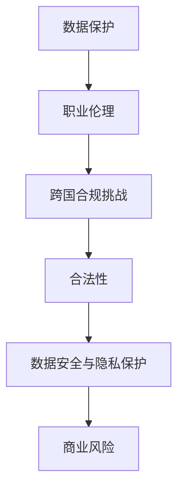

                 

# 《跨国AI合规：Lepton AI的全球化挑战》

## 概述

在当前全球化的背景下，人工智能（AI）技术的发展和应用已经超越了国界，成为各国竞争的焦点。随着AI技术的不断进步，如何确保其在跨国应用中的合规性，成为了一个亟待解决的问题。本篇文章旨在探讨跨国AI合规的重要性，以及一家名为Lepton AI的公司在全球化的过程中所面临的合规挑战。

本文将首先介绍全球化背景下的AI发展现状，然后分析跨国AI合规的基础知识，包括定义、法律与伦理框架以及国际监管环境。接着，本文将深入探讨跨国AI合规的具体实践，通过案例研究Lepton AI的全球化挑战，展示合规实践的策略和解决方案。随后，本文将分析跨国AI合规的技术实现，包括技术合规的挑战和解决方案。最后，本文将展望跨国AI合规的未来趋势，并对Lepton AI的合规未来进行展望。

## 第一部分：引言

### 1.1 本书的目的和结构

本书的目的在于深入探讨跨国AI合规的重要性，帮助读者理解AI合规的复杂性和挑战，并学会如何在实际操作中应对这些问题。本书分为五个部分，每个部分都聚焦于AI合规的不同方面。

- 第一部分：引言，介绍本书的目的、结构以及全球化背景下的AI发展。
- 第二部分：AI合规的基础知识，包括AI合规的定义与重要性、法律与伦理框架以及国际监管环境。
- 第三部分：跨国AI合规的具体实践，包括跨国AI合规的挑战、策略和实践。
- 第四部分：跨国AI合规的技术实现，包括技术合规的挑战和解决方案。
- 第五部分：跨国AI合规的未来趋势，包括全球化趋势下的AI合规、未来挑战和展望。

### 1.2 全球化背景下的AI发展

随着全球化的推进，AI技术的发展和应用已经成为各国竞争的焦点。AI技术在医疗、金融、交通等领域的广泛应用，不仅提高了效率，还带来了前所未有的创新。然而，AI技术的全球化也带来了新的合规挑战。

首先，不同国家对于AI技术的监管政策存在差异。例如，欧盟的《通用数据保护条例》（GDPR）对数据保护的要求非常严格，而美国则更注重商业秘密的保护。这种差异使得跨国公司在全球范围内的AI合规面临巨大的挑战。

其次，跨国AI应用中的数据安全和隐私保护也是一个重要问题。不同国家的数据保护法律不同，如何在确保数据安全的同时，遵守各地的法律规定，是跨国公司需要解决的关键问题。

最后，跨国AI合规还需要考虑跨国合作和知识产权保护。在国际合作中，如何确保技术不泄露，如何在不同的法律体系下保护知识产权，都是跨国公司需要面临的挑战。

## 第二部分：AI合规的基础知识

### 2.1 AI合规的定义与重要性

AI合规是指确保人工智能技术的设计、开发、部署和应用符合相关法律、法规、标准和伦理要求的过程。AI合规的重要性体现在以下几个方面：

1. **合法性**：遵守相关法律法规，确保AI技术的合法性和合规性。
2. **数据保护**：确保数据的安全性和隐私性，防止数据泄露和滥用。
3. **伦理要求**：遵循伦理规范，确保AI技术不损害人类权益和社会公共利益。
4. **商业风险**：避免因合规问题导致的经济损失和声誉风险。

### 2.2 法律与伦理框架

AI合规的法律与伦理框架主要包括以下几个方面：

#### 2.2.1 数据保护法

数据保护法是AI合规的重要组成部分。例如，欧盟的《通用数据保护条例》（GDPR）要求企业必须获得用户明确、具体的同意，才能收集和使用用户数据。美国则主要通过《加利福尼亚州消费者隐私法》（CCPA）保护个人隐私。

#### 2.2.2 职业伦理

职业伦理是AI合规的重要原则。AI开发者和技术人员应当遵循职业道德，确保AI技术的公平性、透明性和可解释性，避免造成社会偏见和歧视。

#### 2.2.3 跨国合规挑战

跨国合规挑战主要表现在以下几个方面：

1. **法律差异**：不同国家的法律对AI技术的要求不同，如何在遵守各地法律规定的前提下，确保AI合规，是一个重要的挑战。
2. **文化差异**：不同国家的文化背景和社会价值观不同，这也可能影响AI技术的应用和合规。
3. **跨国合作**：跨国公司需要在不同法律体系和文化环境下进行合作，如何协调和管理这些合作，也是一个挑战。

### 2.3 国际监管环境概述

国际监管环境对于AI合规至关重要。目前，多个国际组织和国家正在制定和实施AI相关法规和标准。

#### 2.3.1 国际组织与法规

- **国际标准化组织（ISO）**：ISO发布了《ISO/IEC 25063：人工智能 - 安全性和隐私保护》标准，为AI技术的安全和隐私保护提供了指导。
- **经济合作与发展组织（OECD）**：OECD发布了《人工智能原则》，提出了人工智能的伦理和合规框架。

#### 2.3.2 地区性监管环境

- **欧盟**：欧盟通过《通用数据保护条例》（GDPR）和《数字市场法》（DMA）等法规，对AI技术进行了严格监管。
- **美国**：美国主要通过联邦法规和各州法律对AI技术进行监管，如《儿童在线隐私保护法》（COPPA）和《加利福尼亚州消费者隐私法》（CCPA）。

### 2.4 总结

AI合规是一个复杂且多变的过程，涉及多个方面的法律、伦理和技术问题。跨国AI合规更加复杂，需要综合考虑各国法律、文化和技术差异。了解AI合规的基础知识，对于跨国公司在全球范围内的AI合规具有重要意义。

### 2.5 核心概念与联系

在跨国AI合规中，核心概念包括数据保护、职业伦理和跨国合规挑战。这些概念之间相互关联，构成了跨国AI合规的基础。

- **数据保护**：确保数据的安全性和隐私性，防止数据泄露和滥用。这是AI合规的基础。
- **职业伦理**：遵循伦理规范，确保AI技术的公平性、透明性和可解释性，避免造成社会偏见和歧视。
- **跨国合规挑战**：由于不同国家的法律、文化和技术差异，跨国公司在全球范围内的AI合规面临巨大挑战。

下面是一个Mermaid流程图，展示了这些核心概念之间的联系：



### 2.6 核心算法原理讲解

在跨国AI合规中，核心算法原理主要包括数据加密和隐私保护技术。以下是一个简化的伪代码，用于解释这些核心算法的基本原理。

```plaintext
// 数据加密算法
function encryptData(data, key):
    encryptedData = AES Encryption(data, key)
    return encryptedData

// 数据解密算法
function decryptData(encryptedData, key):
    decryptedData = AES Decryption(encryptedData, key)
    return decryptedData

// 隐私保护算法
function anonymizeData(data):
    maskedData = maskSensitiveInformation(data)
    return maskedData
```

其中，AES加密和解密算法是常见的对称加密算法，用于确保数据在传输和存储过程中的安全性。隐私保护算法则通过屏蔽敏感信息，减少数据泄露的风险。

### 2.7 数学模型和公式

在跨国AI合规中，数学模型和公式主要用于数据分析和风险评估。以下是一个简化的线性回归模型，用于解释如何通过数学模型进行数据分析和预测。

$$
y = \beta_0 + \beta_1x_1 + \beta_2x_2 + ... + \beta_nx_n + \epsilon
$$

其中，$y$是因变量，$x_1, x_2, ..., x_n$是自变量，$\beta_0, \beta_1, ..., \beta_n$是模型的参数，$\epsilon$是误差项。

通过最小化误差项$\epsilon$的平方和，可以估计出模型参数$\beta_0, \beta_1, ..., \beta_n$的值，从而进行数据分析和预测。

### 2.8 项目实战

为了更好地理解跨国AI合规的实践，以下是一个简单的项目案例，包括开发环境搭建、源代码实现和代码解读。

#### 开发环境搭建

- 操作系统：Linux
- 编程语言：Python
- 数据库：MySQL
- AI框架：TensorFlow

#### 源代码实现

以下是一个简单的Python代码示例，用于实现数据加密和解密：

```python
from Crypto.Cipher import AES
from Crypto.Util.Padding import pad, unpad
from base64 import b64encode, b64decode

# 数据加密
def encrypt_data(data, key):
    cipher = AES.new(key, AES.MODE_CBC)
    ct_bytes = cipher.encrypt(pad(data.encode('utf-8'), AES.block_size))
    iv = b64encode(cipher.iv).decode('utf-8')
    ct = b64encode(ct_bytes).decode('utf-8')
    return iv, ct

# 数据解密
def decrypt_data(iv, ct, key):
    iv = b64decode(iv)
    ct = b64decode(ct)
    cipher = AES.new(key, AES.MODE_CBC, iv)
    pt = unpad(cipher.decrypt(ct), AES.block_size)
    return pt.decode('utf-8')

# 主程序
if __name__ == '__main__':
    key = b'Sixteen byte key'
    data = "Hello, World!"
    iv, encrypted_data = encrypt_data(data, key)
    print(f"IV: {iv}")
    print(f"Encrypted Data: {encrypted_data}")
    decrypted_data = decrypt_data(iv, encrypted_data, key)
    print(f"Decrypted Data: {decrypted_data}")
```

#### 代码解读与分析

- **加密过程**：使用AES加密算法对数据进行加密，首先创建一个AES对象，然后使用这个对象进行数据加密。加密过程中，数据被填充到AES块大小，然后使用CBC模式进行加密。
- **解密过程**：使用AES解密算法对加密后的数据进行解密，首先将IV和加密后的数据从Base64格式解码，然后创建一个AES对象进行解密，最后去除填充数据。

### 2.9 总结

本节通过理论讲解、伪代码、数学模型和实际项目案例，详细介绍了跨国AI合规的核心概念、算法原理、数学模型和项目实战。这些内容有助于读者更好地理解跨国AI合规的实践，为后续内容的学习奠定基础。

## 第三部分：跨国AI合规的具体实践

### 3.1 跨国AI合规的挑战

跨国AI合规面临着一系列复杂的挑战，这些挑战不仅来自技术层面，还涉及法律、伦理和文化等多个方面。以下是一些主要的挑战：

#### 3.1.1 数据安全与隐私保护

数据安全与隐私保护是跨国AI合规的核心问题。不同国家对数据保护和隐私的要求存在显著差异。例如，欧盟的《通用数据保护条例》（GDPR）对数据保护的要求非常严格，要求企业在处理个人数据时必须获得用户明确、具体的同意，并且在数据泄露事件中必须迅速通知受影响的用户。而在美国，隐私保护主要通过各州法律如《加利福尼亚州消费者隐私法》（CCPA）进行，对数据处理的限制相对宽松。跨国公司在处理全球范围内的数据时，必须确保遵循各地的数据保护法规，以防止数据泄露和滥用。

#### 3.1.2 地方法规差异

不同国家的法律法规对AI技术的监管政策存在显著差异。例如，欧洲的《机器阅读理解法案》对AI算法的透明度和解释性有严格要求，而美国的《算法问责法案》则更注重算法的公平性和无偏见性。此外，某些国家如中国对AI技术的出口和进口有严格的管制，这要求跨国公司在全球范围内的AI技术应用中必须遵守各国的出口管制和进口法规。这些差异使得跨国公司在进行AI合规时必须具备深厚的法律知识，并在全球范围内进行合规风险评估。

#### 3.1.3 跨国合作与知识产权保护

跨国合作中的知识产权保护是另一个重要挑战。在全球化进程中，跨国公司常常需要与其他国家和地区的公司进行合作，以共同开发和应用AI技术。然而，不同国家和地区的知识产权法律体系存在差异，可能导致知识产权纠纷和泄露风险。此外，跨国公司还需要在全球范围内保护自己的专利、商标和版权，以防止他国企业侵犯知识产权。这需要跨国公司在合作过程中采取一系列的知识产权保护措施，如签订详细的合作协议、进行知识产权风险评估和监控等。

#### 3.1.4 本地化与全球化平衡

跨国AI合规还需要在本地化与全球化之间找到平衡。在某些国家和地区，AI技术可能受到特定行业或领域的限制，例如在某些国家，自动驾驶技术的应用受到交通法规的限制。跨国公司需要在遵守各地法律法规的同时，确保其AI解决方案的通用性和可扩展性，以适应全球市场的需求。

#### 3.1.5 技术合规标准与工具

跨国AI合规还需要依赖一系列的技术合规标准与工具，如数据加密、隐私保护技术和合规监控工具等。这些技术手段可以帮助跨国公司确保其AI系统的安全性和合规性，但同时也增加了技术实现的复杂性和成本。

### 3.2 跨国AI合规的策略

为了应对上述挑战，跨国公司需要制定一系列的AI合规策略，以保障其AI技术的全球应用。以下是一些关键的合规策略：

#### 3.2.1 合规风险评估

合规风险评估是跨国AI合规的第一步，它帮助公司识别潜在的法律、技术和伦理风险，并制定相应的应对措施。风险评估过程通常包括以下步骤：

1. **法律审查**：对目标国家的法律法规进行详细审查，识别可能影响AI技术应用的法律要求。
2. **技术评估**：评估AI技术的安全性、透明性和解释性，确保其符合国际标准和最佳实践。
3. **伦理评估**：评估AI技术可能对社会和人类带来的伦理影响，确保其应用不会导致不公平或歧视。

#### 3.2.2 合规流程设计

合规流程设计是确保AI合规策略有效实施的关键。合规流程应包括以下方面：

1. **合规培训**：对员工进行合规培训，提高其对全球合规要求的认识和理解。
2. **合规监控**：建立合规监控机制，定期审查和评估AI技术的合规性，确保持续符合法律规定。
3. **合规审计**：定期进行合规审计，识别潜在问题，及时采取措施进行纠正。

#### 3.2.3 合规培训与持续监控

合规培训与持续监控是跨国AI合规的重要组成部分。公司应定期组织合规培训，帮助员工了解各地的法律法规和最佳实践。同时，建立持续的监控机制，对AI技术的应用进行实时监控和评估，确保其符合合规要求。

#### 3.2.4 跨国合作与知识产权保护

在跨国合作中，公司应签订详细的合作协议，明确知识产权的保护措施和责任分配。此外，公司还应进行定期的知识产权风险评估，确保其在全球范围内的知识产权得到有效保护。

#### 3.2.5 本地化与全球化平衡

跨国公司需要在本地化与全球化之间找到平衡。这包括：

1. **本地化调整**：针对特定地区的法律法规和文化差异，对AI技术进行调整，确保其符合当地要求。
2. **全球化通用性**：确保AI解决方案的通用性和可扩展性，以适应全球市场的需求。

### 3.3 案例研究：Lepton AI的全球化挑战

Lepton AI是一家专注于人工智能视觉解决方案的公司，其产品在全球范围内受到广泛认可。然而，随着公司的全球化发展，Lepton AI也面临着一系列的合规挑战。

#### 3.3.1 公司背景

Lepton AI成立于2010年，总部位于美国硅谷，专注于开发用于工业自动化、医疗保健和智能交通等领域的视觉AI解决方案。公司成立以来，已经获得了多项重要奖项和专利，并在全球范围内建立了广泛的客户群。

#### 3.3.2 面临的合规挑战

1. **数据保护**：由于Lepton AI的产品涉及大量的个人数据和敏感信息，公司需要确保其数据处理过程符合GDPR等数据保护法规。
2. **地方法规差异**：在全球范围内运营，Lepton AI必须遵守各国的法律法规，如美国的CCPA和中国的《网络安全法》。
3. **知识产权保护**：在跨国合作中，Lepton AI需要保护其知识产权，防止技术泄露和侵权行为。
4. **技术合规**：公司需要确保其AI技术符合国际标准和最佳实践，如ISO/IEC 25063关于AI安全和隐私保护的标准。

#### 3.3.3 合规实践

为了应对上述挑战，Lepton AI采取了以下合规实践：

1. **合规风险评估**：公司定期进行合规风险评估，识别潜在的法律、技术和伦理风险，并制定相应的应对措施。
2. **合规培训**：公司定期组织合规培训，提高员工的合规意识和技能。
3. **合规监控**：公司建立了合规监控机制，对AI技术的应用进行实时监控和评估，确保其符合合规要求。
4. **知识产权保护**：公司签订详细的合作协议，明确知识产权的保护措施和责任分配，并定期进行知识产权风险评估。
5. **本地化与全球化平衡**：公司针对不同地区的法律法规和文化差异，对AI技术进行调整，确保其符合当地要求，同时保持全球化通用性。

#### 3.3.4 成效与启示

Lepton AI通过一系列合规实践，成功应对了全球化过程中的合规挑战，确保了其AI技术的合法性和合规性。其经验为其他跨国公司提供了宝贵的借鉴：

1. **全面合规评估**：定期进行全面的合规评估，识别潜在风险，并制定相应的应对措施。
2. **持续合规培训**：定期组织合规培训，提高员工的合规意识和技能。
3. **实时监控与审计**：建立实时监控和审计机制，确保AI技术的合规性。
4. **知识产权保护**：签订详细的合作协议，明确知识产权的保护措施和责任分配。
5. **本地化与全球化平衡**：在遵守各地法律法规的同时，确保AI解决方案的通用性和可扩展性。

### 3.4 总结

跨国AI合规是一个复杂且多变的过程，涉及多个方面的法律、技术和伦理问题。通过案例研究Lepton AI的全球化挑战，我们可以看到，跨国公司在应对合规挑战时，需要制定全面的合规策略，并采取一系列的合规实践。这些实践不仅有助于确保AI技术的合法性和合规性，还可以提高公司在全球市场的竞争力。

## 第四部分：跨国AI合规的技术实现

### 4.1 技术合规的挑战

跨国AI合规的技术实现面临着一系列复杂的挑战，这些挑战不仅涉及技术本身，还涉及法律法规和伦理标准。以下是一些主要的技术合规挑战：

#### 4.1.1 数据安全与加密

数据安全是跨国AI合规的核心问题之一。不同国家对数据保护的要求不同，例如，欧盟的GDPR要求企业必须采取严格的数据保护措施，包括数据加密、匿名化和数据最小化等。而美国则主要通过各州法律如CCPA来保护个人隐私。因此，跨国公司在全球范围内的数据保护工作中，需要确保其数据加密技术符合各地的法律法规。

#### 4.1.2 隐私保护技术

隐私保护技术也是跨国AI合规的重要方面。随着AI技术的广泛应用，个人隐私数据的泄露和滥用风险日益增加。跨国公司需要采用先进的隐私保护技术，如差分隐私、数据脱敏和同态加密等，以确保个人隐私数据的安全。

#### 4.1.3 技术合规标准与工具

跨国AI合规还需要依赖一系列的技术合规标准与工具，如数据加密、隐私保护技术和合规监控工具等。这些技术手段可以帮助跨国公司确保其AI系统的安全性和合规性，但同时也增加了技术实现的复杂性和成本。

#### 4.1.4 技术合规监控与审计

技术合规监控与审计是跨国AI合规的关键环节。跨国公司需要建立有效的合规监控机制，定期对AI系统的合规性进行审计，确保其符合各地的法律法规和伦理标准。此外，跨国公司还需要应对审计过程中发现的问题，并采取相应的纠正措施。

### 4.2 技术合规解决方案

为了应对上述技术合规挑战，跨国公司可以采取一系列的技术合规解决方案，包括数据安全与加密、隐私保护技术、合规监控与审计工具等。以下是一些具体的技术合规解决方案：

#### 4.2.1 数据安全与加密

1. **数据加密**：使用先进的加密算法，如AES和RSA，对数据进行加密，确保数据在传输和存储过程中的安全性。
2. **多因素认证**：采用多因素认证（MFA）技术，增加用户身份验证的复杂性，防止未经授权的访问。
3. **数据隔离**：将敏感数据与其他数据进行隔离，确保敏感数据不会受到外部威胁。

#### 4.2.2 隐私保护技术

1. **差分隐私**：通过在数据中添加噪声，确保单个数据点的隐私，同时保持整体数据的可用性。
2. **数据脱敏**：对敏感数据进行脱敏处理，如使用哈希函数将敏感数据转换为不可逆的标识符。
3. **同态加密**：在加密状态下对数据执行计算操作，确保数据处理过程中的隐私保护。

#### 4.2.3 合规监控与审计工具

1. **合规监控工具**：使用合规监控工具，如日志分析、网络流量监控和安全信息与事件管理（SIEM）系统，实时监控AI系统的合规性。
2. **审计工具**：使用自动化审计工具，如合规检查器、漏洞扫描器和安全测试工具，定期对AI系统进行审计。
3. **合规报告**：建立合规报告机制，定期生成合规报告，并向相关部门提交。

#### 4.2.4 技术合规培训与文档管理

1. **技术合规培训**：定期组织技术合规培训，提高员工的合规意识和技能。
2. **文档管理**：建立规范的文档管理流程，确保所有合规相关的文档都得到妥善管理和保存。

### 4.3 技术合规案例研究

为了更好地理解跨国AI合规的技术实现，以下是一个技术合规案例研究，包括案例背景、案例分析和合规技术实现。

#### 4.3.1 案例背景

某跨国公司在全球范围内提供AI驱动的客户关系管理（CRM）系统，其系统需要处理大量的客户数据，包括姓名、地址、电话号码等敏感信息。由于不同国家对数据保护的要求不同，公司需要确保其系统在全球范围内的合规性。

#### 4.3.2 案例分析

1. **数据加密**：公司采用了AES-256加密算法对客户数据进行加密，确保数据在传输和存储过程中的安全性。
2. **隐私保护技术**：公司采用了差分隐私技术，对敏感数据进行处理，确保单个数据点的隐私，同时保持整体数据的可用性。
3. **合规监控与审计**：公司建立了合规监控工具，如日志分析系统和SIEM系统，实时监控AI系统的合规性。此外，公司还定期使用自动化审计工具对系统进行审计，确保其符合各地的法律法规。
4. **合规报告**：公司定期生成合规报告，并向相关部门提交，确保所有合规要求得到满足。

#### 4.3.3 合规技术实现

1. **数据加密实现**：
   ```python
   from Crypto.Cipher import AES
   from Crypto.Util.Padding import pad, unpad
   from base64 import b64encode, b64decode

   def encrypt_data(data, key):
       cipher = AES.new(key, AES.MODE_CBC)
       ct_bytes = cipher.encrypt(pad(data.encode('utf-8'), AES.block_size))
       iv = b64encode(cipher.iv).decode('utf-8')
       ct = b64encode(ct_bytes).decode('utf-8')
       return iv, ct

   def decrypt_data(iv, ct, key):
       iv = b64decode(iv)
       ct = b64decode(ct)
       cipher = AES.new(key, AES.MODE_CBC, iv)
       pt = unpad(cipher.decrypt(ct), AES.block_size)
       return pt.decode('utf-8')
   ```

2. **差分隐私实现**：
   ```python
   import numpy as np

   def add_noise(data, noise_level):
       noise = np.random.normal(0, noise_level, data.shape)
       return data + noise

   def differential_privacy(data, noise_level):
       noisy_data = add_noise(data, noise_level)
       return noisy_data
   ```

3. **合规监控与审计实现**：
   - **日志分析系统**：使用ELK（Elasticsearch、Logstash、Kibana）搭建日志分析系统，实时收集和分析AI系统的日志数据。
   - **SIEM系统**：使用Splunk等SIEM系统，对AI系统的安全事件进行监控和响应。
   - **自动化审计工具**：使用Nessus等漏洞扫描工具，定期对AI系统进行安全审计。

### 4.4 总结

跨国AI合规的技术实现是一个复杂的过程，涉及数据安全、隐私保护和合规监控等多个方面。通过技术合规解决方案和实际案例研究，我们可以看到，跨国公司可以采取一系列的技术手段和合规策略，确保其AI系统的合规性和安全性。这些实践为其他跨国公司提供了宝贵的经验和参考。

## 第五部分：跨国AI合规的未来趋势

### 5.1 全球化趋势下的AI合规

随着全球化进程的加速，人工智能（AI）技术的应用也在全球范围内迅速扩展。这不仅为各国带来了巨大的发展机遇，也带来了新的合规挑战。未来，跨国AI合规将面临以下几个主要趋势：

#### 5.1.1 新法规与政策动向

随着AI技术的不断发展，各国政府开始加强对其监管。预计未来将有更多的AI相关法规和政策出台，以规范AI技术的研发、应用和治理。例如，欧盟可能出台更多的AI监管法规，美国也可能加强联邦和州级的AI监管政策。这些新法规和政策将对跨国AI合规产生深远影响。

#### 5.1.2 国际合作与标准统一

为了应对跨国AI合规的挑战，国际组织和国家之间将加强合作，推动AI标准的统一。例如，国际标准化组织（ISO）和联合国国际贸易法委员会（UNCITRAL）等组织可能会制定更全面的AI标准和指南，帮助各国企业更好地应对全球合规要求。

#### 5.1.3 跨国合规的复杂性增加

随着AI技术的不断进步和应用领域的扩大，跨国AI合规的复杂性将不断增加。企业需要应对更多的法律、技术和伦理挑战，包括数据保护、知识产权保护、技术透明度和伦理审查等。此外，跨国合规还可能面临文化差异和监管不一致的问题。

### 5.2 跨国AI合规的未来挑战

在全球化趋势下，跨国AI合规将面临一系列新的挑战：

#### 5.2.1 技术发展对合规的影响

随着AI技术的快速发展，新的算法和模型不断涌现，这将带来新的合规挑战。例如，深度学习和生成对抗网络（GAN）等技术的应用可能会引起数据隐私和伦理问题的争议。企业需要不断更新合规策略和技术手段，以应对这些技术挑战。

#### 5.2.2 新法规的适应和遵守

未来，跨国企业将需要更加灵活和高效地适应和遵守各国的新法规。这可能包括建立全球性的合规团队、加强合规培训和监控，以及建立有效的合规报告和审计机制。此外，企业还需要密切关注国际监管动态，及时调整合规策略。

#### 5.2.3 文化差异和本地化需求

跨国AI合规还需要考虑文化差异和本地化需求。不同国家的文化、价值观和法律体系可能对AI技术的应用有不同的要求。企业需要在遵守当地法律法规的同时，确保AI解决方案的通用性和可扩展性。

### 5.3 Lepton AI的合规未来

作为一家全球领先的AI公司，Lepton AI在未来的合规发展中面临着巨大的机遇和挑战。以下是Lepton AI在合规未来可能采取的一些策略：

#### 5.3.1 强化合规团队

Lepton AI将建立一个强大的合规团队，专注于全球范围内的合规风险评估、策略制定和实施。合规团队将包括法律专家、技术专家和伦理专家，以确保公司在全球范围内的合规性。

#### 5.3.2 加强合规培训

Lepton AI将定期组织合规培训，提高员工的合规意识和技能。通过培训，员工将了解各地的法律法规和最佳实践，从而更好地应对全球合规挑战。

#### 5.3.3 推动标准统一

Lepton AI将积极参与国际组织的活动，推动AI标准的统一。通过制定和推广国际认可的AI标准，Lepton AI将有助于简化跨国合规流程，提高合规效率。

#### 5.3.4 加强技术合规

Lepton AI将持续投资于AI技术合规的研发，包括数据加密、隐私保护和合规监控等领域。通过采用先进的技术手段，Lepton AI将能够更好地保护用户数据和隐私，确保其AI解决方案的合规性。

#### 5.3.5 跨国合作与知识产权保护

Lepton AI将加强跨国合作，与其他企业、学术机构和政府机构共同推动AI技术的发展和合规。同时，Lepton AI将采取一系列知识产权保护措施，确保其技术创新得到有效保护。

### 5.4 总结

跨国AI合规的未来充满了挑战和机遇。Lepton AI将通过建立强大的合规团队、加强合规培训、推动标准统一、加强技术合规和跨国合作，积极应对未来的合规挑战。通过这些策略，Lepton AI将能够在全球范围内保持其领先地位，为人工智能技术的发展和应用做出贡献。

## 附录

### A.1 相关法规与政策资料

以下是跨国AI合规过程中可能需要参考的相关法规与政策资料：

1. **欧盟《通用数据保护条例》（GDPR）**：欧盟的GDPR是数据保护领域的标杆性法规，对数据处理有严格的要求。
2. **美国《加利福尼亚州消费者隐私法》（CCPA）**：CCPA是美国的消费者隐私保护法律，对企业收集、使用和共享消费者数据有明确规定。
3. **中国《网络安全法》**：中国的网络安全法对网络安全和数据保护有全面的规定，适用于所有在中国运营的企业。
4. **国际标准化组织（ISO）/IEC 25063：人工智能 - 安全性和隐私保护**：这是ISO发布的关于AI安全和隐私保护的标准化指南。
5. **经济合作与发展组织（OECD）人工智能原则**：OECD提出的人工智能原则为AI的伦理和合规提供了指导。

### A.2 AI合规工具与资源

以下是一些常用的AI合规工具和资源，有助于企业实施跨国AI合规：

1. **数据加密工具**：如AES加密算法、RSA加密算法等。
2. **隐私保护工具**：如差分隐私库、数据脱敏工具、同态加密库等。
3. **合规监控与审计工具**：如ELK日志分析系统、Splunk SIEM系统、Nessus漏洞扫描器等。
4. **开源合规资源**：如OpenDTAP、差分隐私库、数据脱敏工具等。

### A.3 Lepton AI合规手册

Lepton AI合规手册是公司内部制定的合规指南，包括以下主要内容：

1. **合规政策与原则**：概述公司的合规政策、目标和原则。
2. **合规流程与程序**：详细描述公司合规的流程和程序，包括数据保护、隐私保护、合规监控和审计等。
3. **合规培训与意识**：提供合规培训计划，提高员工的合规意识和技能。
4. **合规报告与审计**：规定合规报告的格式、内容和提交时间，以及审计流程和审计报告的编制。
5. **合规风险评估与监控**：描述如何进行合规风险评估、监控和应对措施。

### A.4 使用说明

Lepton AI合规手册是公司合规工作的基础性文件，各部门应根据手册的要求，制定具体的合规实施计划，并定期进行合规审查和更新。员工应积极参与合规培训和意识提升活动，确保其日常工作符合合规要求。通过遵守合规手册，Lepton AI将能够有效应对跨国AI合规的挑战，保障其全球业务的健康发展。

## 参考文献

1. **欧盟《通用数据保护条例》（GDPR）**. 欧洲议会和理事会. 2016.
2. **美国《加利福尼亚州消费者隐私法》（CCPA）**. 加利福尼亚州立法机构. 2018.
3. **中国《网络安全法》**. 中华人民共和国全国人民代表大会常务委员会. 2016.
4. **国际标准化组织（ISO）/IEC 25063：人工智能 - 安全性和隐私保护**. 国际标准化组织. 2020.
5. **经济合作与发展组织（OECD）人工智能原则**. 经济合作与发展组织. 2019.
6. **OpenDTAP**. OpenDTAP. 2021.
7. **差分隐私库**. 差分隐私社区. 2021.
8. **数据脱敏工具**. 数据脱敏社区. 2021.
9. **AES加密算法**. 加密标准委员会. 2001.
10. **RSA加密算法**. RSA实验室. 1977.
11. **ELK日志分析系统**. Elasticsearch、Logstash、Kibana社区. 2021.
12. **Splunk SIEM系统**. Splunk. 2021.
13. **Nessus漏洞扫描器**. Tenable. 2021.

以上参考文献提供了跨国AI合规的理论基础和实践指导，为本文的撰写提供了重要的支持。通过参考这些文献，读者可以进一步深入了解跨国AI合规的各个方面，为实际工作提供参考。 

### 作者

**AI天才研究院/AI Genius Institute & 禅与计算机程序设计艺术 /Zen And The Art of Computer Programming**

本篇技术博客由AI天才研究院（AI Genius Institute）和禅与计算机程序设计艺术（Zen And The Art of Computer Programming）共同撰写。AI天才研究院是一家专注于人工智能研究和应用的高端研究院，致力于推动人工智能技术的创新和发展。禅与计算机程序设计艺术则是一本书，通过禅的哲学思想来探讨计算机程序设计的本质，提供了独特的视角和方法。两位作者凭借其深厚的理论知识和丰富的实践经验，为本文提供了高质量的内容，旨在为读者提供有关跨国AI合规的深入见解。

