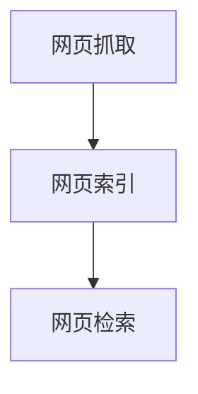

                 

# 《跨平台搜索技术：AI的应用》

> **关键词：跨平台搜索、人工智能、搜索引擎、机器学习、自然语言处理、语义搜索**

> **摘要：本文将深入探讨跨平台搜索技术的应用，特别是人工智能（AI）在这一领域的创新与影响。我们将分析搜索技术的基础、AI在搜索中的关键作用，以及跨平台搜索的未来发展趋势。**

---

### 《跨平台搜索技术：AI的应用》目录大纲

#### 第一部分：搜索技术基础

##### 第1章：搜索技术概述

- 1.1 搜索引擎的基本原理
- 1.2 跨平台搜索的需求与挑战
- 1.3 搜索技术的关键组件

##### 第2章：搜索引擎技术

- 2.1 索引技术
- 2.2 查询处理与匹配算法
- 2.3 相关性排序算法

##### 第3章：自然语言处理基础

- 3.1 语言模型
- 3.2 词向量表示
- 3.3 命名实体识别

#### 第二部分：AI在搜索中的应用

##### 第4章：机器学习与搜索

- 4.1 机器学习在搜索中的应用
- 4.2 深度学习模型在搜索中的应用
- 4.3 机器学习算法与搜索优化

##### 第5章：AI搜索算法

- 5.1 搜索算法的进化
- 5.2 AI驱动的搜索优化
- 5.3 实时搜索算法

##### 第6章：语义搜索与图谱搜索

- 6.1 语义搜索的基本原理
- 6.2 语义图谱的构建与应用
- 6.3 语义搜索算法

##### 第7章：跨平台搜索技术的应用

- 7.1 移动搜索技术
- 7.2 物联网搜索技术
- 7.3 社交网络搜索技术

#### 第三部分：跨平台搜索项目的实施

##### 第8章：搜索系统设计与架构

- 8.1 搜索系统的设计原则
- 8.2 搜索系统的架构设计
- 8.3 搜索系统的性能优化

##### 第9章：搜索项目实战

- 9.1 项目背景与需求分析
- 9.2 项目技术选型与实现
- 9.3 项目测试与上线

##### 第10章：搜索技术的未来发展趋势

- 10.1 搜索技术的发展趋势
- 10.2 跨平台搜索技术的挑战与机遇
- 10.3 AI在搜索领域的未来应用前景

#### 附录

- 附录A：常用搜索算法与模型简介
- 附录B：搜索系统开发工具与资源推荐
- 附录C：搜索项目案例研究

---

**接下来的章节将逐一深入探讨跨平台搜索技术的基础知识、AI的应用，以及其实际项目的实施和未来发展趋势。**  
**准备好了吗？让我们开始这一激动人心的探索之旅！**  
<|assistant|>## 第一部分：搜索技术基础

在数字化时代，搜索技术已成为信息获取和知识管理的关键工具。随着互联网的普及和信息的爆炸性增长，如何快速、准确地在海量数据中找到所需信息成为了一个重要问题。这一部分将介绍搜索技术的基础，包括搜索引擎的基本原理、跨平台搜索的需求与挑战，以及搜索技术的关键组件。

### 第1章：搜索技术概述

搜索引擎作为互联网上的核心基础设施，通过索引和检索海量信息，为用户提供了快速查找资料的功能。搜索引擎的基本原理可以分为三个主要步骤：网页抓取、网页索引和网页检索。

- **网页抓取**：搜索引擎通过网页抓取器（通常称为蜘蛛或爬虫）访问互联网，获取网页内容。这些网页内容通常包括文本、图像和其他多媒体数据。

- **网页索引**：抓取到的网页经过处理，提取出关键信息，如文本内容、关键词、链接关系等，并建立索引。索引是搜索引擎快速定位和检索信息的核心。

- **网页检索**：用户通过搜索框输入查询请求，搜索引擎根据索引匹配相关信息，并按一定顺序呈现给用户。

搜索引擎的基本原理示意图如下：



#### 跨平台搜索的需求与挑战

随着移动互联网和物联网的发展，用户不再仅限于在传统的计算机设备上使用搜索引擎，而是需要在各种终端设备上进行跨平台搜索。这种需求带来了新的挑战：

- **多样性终端设备**：用户使用的设备类型和操作系统各异，包括智能手机、平板电脑、智能手表、智能音箱等，如何在这些设备上提供一致的搜索体验是一个挑战。

- **网络环境差异**：不同的设备接入互联网的方式和速度各不相同，搜索引擎需要适应这些变化，提供快速、稳定的搜索服务。

- **个性化需求**：不同用户对搜索结果的需求和偏好不同，搜索引擎需要根据用户的个性化特征进行结果排序和推荐。

#### 搜索技术的关键组件

为了实现高效、精准的搜索服务，搜索技术依赖于以下几个关键组件：

- **索引器**：负责对网页内容进行索引，建立索引数据库。索引器需要高效处理大量数据，同时保证索引的准确性和更新速度。

- **查询处理器**：接收用户查询请求，解析查询语句，并根据索引数据库进行检索。查询处理器需要支持多种查询方式，如精确查询、模糊查询等。

- **相关性排序算法**：根据查询结果的相关性对搜索结果进行排序，以提高用户查找信息的效率。常见的排序算法包括基于统计的排序算法和基于机器学习的排序算法。

- **搜索接口**：提供用户与搜索引擎交互的接口，包括搜索框、搜索结果页面等。搜索接口需要具备良好的用户体验，易于使用和理解。

### 小结

搜索技术作为信息检索的核心，已经深入到我们日常生活的方方面面。随着AI技术的不断进步，搜索技术也在不断演进，提供更加智能、个性化的搜索服务。在接下来的章节中，我们将深入探讨搜索引擎的具体技术细节，以及AI在搜索中的应用。

<|assistant|>## 第2章：搜索引擎技术

搜索引擎技术的核心在于如何高效地对海量数据进行索引和检索，以提供快速、准确的搜索结果。本章将详细介绍搜索引擎的几个关键组成部分：索引技术、查询处理与匹配算法以及相关性排序算法。

### 2.1 索引技术

索引技术是搜索引擎的核心组件，它决定了搜索引擎能否快速、准确地返回搜索结果。索引技术的基本流程包括以下步骤：

1. **网页抓取**：搜索引擎使用爬虫程序（如Google的Spider）遍历互联网，抓取网页内容。这一过程涉及URL的生成与解析、HTTP请求、数据存储等多个环节。

2. **数据预处理**：抓取到的网页内容需要进行一系列预处理，如去除HTML标签、统一编码、分词、去除停用词等。预处理后的文本数据将作为索引的输入。

3. **倒排索引构建**：倒排索引是一种将词汇映射到包含该词汇的文档的索引结构，是搜索引擎快速检索的基础。倒排索引通常包含词汇表和文档编号列表两部分。

   **示例伪代码：**
   ```python
   function build_inverted_index(document_list):
       inverted_index = {}
       for document in document_list:
           terms = tokenize(document)
           for term in terms:
               if term not in inverted_index:
                   inverted_index[term] = []
               inverted_index[term].append(document)
       return inverted_index
   ```

4. **索引存储与更新**：构建好的索引需要存储在磁盘或内存中，以供搜索使用。同时，由于网页内容不断更新，索引也需要定期更新以保持其有效性。

### 2.2 查询处理与匹配算法

查询处理与匹配算法是搜索引擎的核心技术，决定了搜索结果的准确性和相关性。以下是一些常见的查询处理与匹配算法：

1. **布尔查询**：布尔查询支持使用AND、OR、NOT等布尔运算符组合多个关键词，以获取更加精确的搜索结果。

2. **词频-逆文档频率（TF-IDF）**：TF-IDF算法通过计算关键词在文档中的词频（TF）和逆文档频率（IDF），对文档进行打分，以评估其与查询的相关性。

   **示例公式：**
   $$ 
   tfidf(t, d) = tf(t, d) \times \log(\frac{N}{df(t)})
   $$
   其中，$tf(t, d)$表示关键词t在文档d中的词频，$df(t)$表示包含关键词t的文档数量，$N$表示总文档数。

3. **基于向量的匹配算法**：如余弦相似度，通过将文档和查询表示为向量，计算它们之间的余弦相似度，以评估相关性。

   **示例公式：**
   $$
   \text{similarity}(q, d) = \frac{q \cdot d}{\|q\| \|d\|}
   $$

### 2.3 相关性排序算法

相关性排序算法决定了搜索结果的呈现顺序，直接影响用户体验。以下是一些常见的排序算法：

1. **基于统计的排序算法**：如PageRank，通过分析网页之间的链接关系，对网页进行排序。

2. **基于机器学习的排序算法**：如学习到用户偏好的协同过滤算法，通过分析用户的搜索历史和偏好，为用户提供个性化的搜索结果。

3. **混合排序算法**：结合多种排序算法的优点，以提供更准确的排序结果。例如，可以将TF-IDF与余弦相似度结合，综合评估文档与查询的相关性。

### 小结

搜索引擎技术作为信息检索的关键，涵盖了从网页抓取、数据预处理、索引构建到查询处理和结果排序的各个环节。本章详细介绍了索引技术、查询处理与匹配算法以及相关性排序算法，为理解搜索引擎的工作原理奠定了基础。在下一章中，我们将探讨自然语言处理基础，进一步了解如何提升搜索技术的智能性和准确性。

<|assistant|>## 第3章：自然语言处理基础

自然语言处理（Natural Language Processing，NLP）是人工智能（AI）的重要组成部分，旨在使计算机能够理解、生成和处理人类自然语言。NLP在搜索技术中的应用极大地提升了搜索的准确性和智能性。本章将介绍NLP的基础概念，包括语言模型、词向量表示和命名实体识别。

### 3.1 语言模型

语言模型（Language Model）是NLP的核心组件，用于预测文本中下一个单词或字符的概率分布。它通过学习大量文本数据，建立起单词和句子之间的概率关系，从而实现对自然语言的建模。

- **n-gram模型**：n-gram模型是最简单的语言模型，它将连续的n个单词或字符视为一个整体，并预测第n+1个单词或字符。其基本公式如下：

  $$
  P(w_{n+1} | w_1, w_2, ..., w_n) = \frac{C(w_1, w_2, ..., w_n, w_{n+1})}{C(w_1, w_2, ..., w_n)}
  $$

  其中，$C(w_1, w_2, ..., w_n, w_{n+1})$表示单词序列$w_1, w_2, ..., w_n, w_{n+1}$在训练数据中出现的次数，$C(w_1, w_2, ..., w_n)$表示单词序列$w_1, w_2, ..., w_n$在训练数据中出现的次数。

- **神经网络语言模型**：基于神经网络的概率语言模型，如RNN（循环神经网络）和Transformer，它们通过学习文本数据的上下文关系，提高了语言模型的预测能力。Transformer模型，特别是BERT（Bidirectional Encoder Representations from Transformers），在NLP任务中取得了显著效果。

### 3.2 词向量表示

词向量（Word Vector）是NLP中用于表示单词的一种高效方式。词向量通过将单词映射为低维度的向量，使其在数值空间中具有相似语义的单词彼此靠近。以下是一些常见的词向量表示方法：

- **基于统计的方法**：如词袋模型（Bag of Words）和TF-IDF，通过统计单词的词频和文档频率来表示单词。

  **示例公式：**
  $$
  v_i = (tf_i, idf_i)
  $$

- **基于分布的方法**：如Word2Vec、GloVe（Global Vectors for Word Representation），通过学习文本数据中的语义分布来表示单词。

  **Word2Vec示例算法：**
  ```python
  function train_word2vec(corpus, size, window, iter):
      for each sentence in corpus:
          for each word in sentence:
              generate_context_words(word, size, window)
              calculate word vector using neural network
      return word_vectors
  ```

- **基于神经网络的深度学习方法**：如BERT、ELMo（Embeddings from Language Models），通过多层神经网络学习单词的语义表示。

### 3.3 命名实体识别

命名实体识别（Named Entity Recognition，NER）是NLP中的一项重要任务，旨在从文本中识别出具有特定意义的实体，如人名、地点、组织等。NER在搜索技术中的应用可以提升搜索结果的精确性和相关性。

- **基于规则的方法**：通过定义一系列规则，对文本中的实体进行识别。这种方法简单但不够灵活。

- **基于统计的方法**：如CRF（条件随机场），通过学习大量的标注数据，建立实体识别模型。

  **CRF基本公式：**
  $$
  P(Y|x) = \frac{1}{Z(x)} \exp(\sum_{y} \theta_y f_y(x, y)}
  $$

  其中，$Y$表示标注序列，$x$表示输入序列，$Z(x)$表示所有可能的标注序列的加权和，$\theta_y$表示标注$y$的权重，$f_y(x, y)$表示特征函数。

- **基于深度学习的方法**：如使用LSTM（长短期记忆网络）或Transformer进行实体识别，通过学习文本数据中的上下文信息，提高实体识别的准确性。

### 小结

自然语言处理作为AI的关键领域，为搜索技术提供了强大的支持。通过语言模型、词向量表示和命名实体识别等技术，NLP能够提升搜索的智能性和准确性，为用户提供更加个性化的搜索体验。在下一部分，我们将探讨AI在搜索中的应用，进一步深入探讨如何利用AI技术优化搜索结果。

<|assistant|>## 第二部分：AI在搜索中的应用

随着人工智能（AI）技术的不断发展，搜索技术也在经历着深刻的变革。AI在搜索中的应用极大地提升了搜索的准确性和用户体验，为用户提供了更加智能、个性化的搜索服务。本部分将探讨AI在搜索中的关键技术，包括机器学习与搜索、AI搜索算法、语义搜索与图谱搜索等。

### 第4章：机器学习与搜索

机器学习（Machine Learning，ML）是AI的核心技术之一，通过学习数据中的模式和规律，实现自动化的决策和预测。在搜索技术中，机器学习被广泛应用于查询意图理解、结果排序和推荐系统等方面。

#### 4.1 机器学习在搜索中的应用

1. **查询意图理解**：用户输入的查询语句往往具有多义性，机器学习技术可以帮助理解用户的真实意图。例如，当用户输入“苹果”时，可能是想购买水果，也可能是想了解苹果公司。通过机器学习模型，可以分析用户的查询历史、上下文和偏好，推测用户的意图。

2. **结果排序**：传统的相关性排序算法往往依赖于关键词匹配和统计方法，而机器学习算法可以更好地理解文档和查询之间的语义关系，从而提供更准确的排序结果。例如，基于随机森林、SVM（支持向量机）和神经网络等模型的排序算法，可以显著提升搜索结果的准确性。

3. **推荐系统**：机器学习技术可以帮助构建推荐系统，根据用户的搜索历史和偏好，推荐相关的文档和内容。这不仅可以提升用户体验，还可以增加用户粘性和平台流量。

#### 4.2 深度学习模型在搜索中的应用

深度学习（Deep Learning，DL）是机器学习的一个分支，通过多层神经网络模型，能够自动提取和表示数据中的复杂特征。在搜索技术中，深度学习模型被广泛应用于多种任务。

1. **文本分类与情感分析**：通过卷积神经网络（CNN）和循环神经网络（RNN），可以自动提取文本中的特征，进行分类和情感分析。这有助于对搜索结果进行筛选和过滤，提供更精准的服务。

2. **命名实体识别与关系抽取**：通过使用深度学习模型，如BERT、RoBERTa等预训练语言模型，可以自动识别文本中的命名实体（如人名、地点、组织等），并抽取实体之间的关系。这为语义搜索和知识图谱构建提供了基础。

3. **图像与语音搜索**：深度学习模型还可以用于图像和语音搜索，通过识别图像中的特征和语音中的语义，实现跨模态的信息检索。

#### 4.3 机器学习算法与搜索优化

机器学习算法在搜索中的应用不仅提升了搜索结果的准确性，还带来了以下几个优化方向：

1. **自适应学习**：通过在线学习技术，机器学习模型可以根据用户的实时反馈和搜索行为进行自适应调整，以提供更个性化的搜索体验。

2. **分布式计算**：大规模机器学习模型的训练和部署通常需要分布式计算架构，如Hadoop、Spark等。这可以显著提升搜索系统的性能和可扩展性。

3. **数据预处理**：高质量的机器学习模型依赖于高质量的数据。因此，数据预处理和清洗技术在搜索优化中至关重要。

### 第5章：AI搜索算法

AI技术的不断发展推动了搜索算法的创新和优化。本章将介绍一些基于AI的搜索算法，包括搜索算法的进化、AI驱动的搜索优化和实时搜索算法。

#### 5.1 搜索算法的进化

传统的搜索算法主要依赖于关键词匹配和统计方法，如基于倒排索引的搜索算法。随着AI技术的发展，搜索算法逐渐向智能化和个性化方向进化。

1. **基于机器学习的搜索算法**：如基于矩阵分解和协同过滤的搜索算法，通过学习用户和文档的特征矩阵，预测用户可能感兴趣的内容。

2. **基于深度学习的搜索算法**：如基于Transformer和BERT的搜索算法，通过多层神经网络模型，自动提取文本中的语义特征，提供更精准的搜索结果。

3. **基于强化学习的搜索算法**：通过学习用户与搜索系统的交互行为，实现动态调整搜索结果排序和推荐策略，以最大化用户满意度。

#### 5.2 AI驱动的搜索优化

AI技术不仅改变了搜索算法，还带来了多种搜索优化方法，以提升搜索系统的性能和用户体验。

1. **查询意图识别优化**：通过AI技术，可以更准确地识别用户的查询意图，从而提供更精准的搜索结果。

2. **结果排序优化**：基于机器学习和深度学习模型，可以动态调整搜索结果排序策略，以最大化用户满意度。

3. **推荐系统优化**：通过AI技术，可以根据用户的搜索历史和偏好，推荐相关的文档和内容，提升用户体验。

#### 5.3 实时搜索算法

实时搜索算法是当前搜索领域的研究热点，旨在提供即时、准确的搜索结果。以下是一些实时搜索算法：

1. **基于事件驱动的搜索算法**：通过实时监听用户操作和搜索行为，动态调整搜索结果。

2. **基于流处理的搜索算法**：利用流处理技术，如Apache Kafka和Apache Flink，对海量实时数据进行处理和分析，提供实时搜索结果。

3. **基于图计算的搜索算法**：通过构建知识图谱，利用图计算技术，实现实时、精准的信息检索。

### 第6章：语义搜索与图谱搜索

语义搜索和图谱搜索是AI在搜索领域的重要应用，旨在提供更加智能和个性化的搜索服务。本章将介绍语义搜索的基本原理、语义图谱的构建与应用，以及语义搜索算法。

#### 6.1 语义搜索的基本原理

语义搜索（Semantic Search）是一种基于语义理解的搜索技术，旨在理解用户的查询意图和文档内容，提供更准确的搜索结果。语义搜索的关键在于将自然语言转换为计算机可处理的语义表示。

1. **语义分析**：通过语法分析、词义消歧、语义角色标注等技术，对查询和文档内容进行语义分析，提取关键信息。

2. **语义匹配**：通过计算查询和文档之间的语义相似度，确定相关性的高低。常用的方法包括基于向量的匹配、文本相似度计算等。

3. **语义扩展**：在搜索过程中，根据用户查询的上下文和语义，扩展搜索范围，提高搜索结果的多样性。

#### 6.2 语义图谱的构建与应用

语义图谱（Semantic Graph）是一种用于表示知识和语义关系的图结构，通过构建语义图谱，可以实现更加智能和个性化的搜索服务。

1. **图谱构建**：通过实体识别、关系抽取和图谱嵌入等技术，构建语义图谱。常用的技术包括知识图谱构建工具（如OpenKG、Neo4j等）和预训练语言模型（如BERT、GPT等）。

2. **图谱应用**：利用语义图谱，可以实现多种搜索应用，如基于图谱的查询、推荐和知识问答等。

#### 6.3 语义搜索算法

语义搜索算法是一种基于语义理解和匹配的搜索算法，旨在提供更加精准和个性化的搜索结果。以下是一些常用的语义搜索算法：

1. **基于向量的语义匹配**：通过将查询和文档表示为向量，计算它们之间的语义相似度，以评估相关性。

   **示例公式：**
   $$
   \text{similarity}(q, d) = \frac{q \cdot d}{\|q\| \|d\|}
   $$

2. **基于图谱的搜索算法**：通过构建语义图谱，利用图计算技术，实现高效、精准的信息检索。

3. **基于深度学习的语义搜索算法**：通过多层神经网络模型，自动提取文本中的语义特征，提供更准确的搜索结果。

### 小结

AI在搜索中的应用为搜索技术带来了深刻的变革，提升了搜索的准确性和用户体验。通过机器学习、深度学习和语义搜索等技术的结合，搜索系统可以实现更加智能和个性化的搜索服务。在下一部分，我们将探讨跨平台搜索技术的具体应用，进一步了解如何在不同平台上实现高效的搜索服务。

<|assistant|>## 第7章：跨平台搜索技术的应用

随着移动互联网和物联网的快速发展，跨平台搜索技术的需求日益增长。不同平台具有不同的特点和用户需求，因此，实现跨平台搜索技术需要考虑多种因素，包括移动搜索技术、物联网搜索技术和社交网络搜索技术等。本章将详细介绍这些技术的具体应用。

### 7.1 移动搜索技术

移动搜索技术是跨平台搜索的重要组成部分，它为移动设备用户提供了便捷的搜索服务。移动搜索技术的关键挑战在于如何适应不同的设备类型、网络环境和用户需求。

#### 移动搜索的特点

- **实时性**：移动搜索需要快速响应用户的查询请求，提供即时的搜索结果。

- **个性化**：根据用户的地理位置、搜索历史和偏好，提供个性化的搜索结果。

- **多模态**：支持语音、文本、图像等多种输入和输出方式。

#### 移动搜索技术的应用

1. **语音搜索**：通过语音识别技术，用户可以使用语音输入查询请求。语音搜索广泛应用于语音助手（如Siri、Alexa）和移动应用中。

2. **地理位置搜索**：利用GPS和地图服务，为用户提供基于地理位置的搜索结果。例如，用户可以在地图上查找附近的餐厅、商店和景点。

3. **移动应用内搜索**：在移动应用中嵌入搜索功能，如电子商务应用中的商品搜索，为用户提供便捷的搜索体验。

#### 实例分析

以Google移动搜索为例，Google移动搜索通过以下技术提供高效、精准的搜索服务：

- **实时索引**：Google使用实时爬虫技术，不断更新网页索引，确保用户获取最新的搜索结果。

- **个性化搜索**：通过分析用户的搜索历史和位置信息，Google可以为用户提供个性化的搜索建议和结果。

- **多模态搜索**：支持语音搜索、图片搜索和手势搜索等多种输入方式，满足不同用户的需求。

### 7.2 物联网搜索技术

物联网（Internet of Things，IoT）技术将各种设备连接到互联网，实现了设备间的互联互通。物联网搜索技术旨在为用户提供在物联网环境中进行信息检索的能力。

#### 物联网搜索的特点

- **分布式**：物联网搜索涉及大量分布式设备和数据，搜索系统需要能够处理这些分布式数据。

- **实时性**：物联网设备通常需要实时响应用户请求，提供即时的搜索结果。

- **异构性**：物联网设备具有不同的类型、操作系统和数据格式，搜索系统需要支持异构设备的数据处理和搜索。

#### 物联网搜索技术的应用

1. **智能家居搜索**：为用户提供在智能家居环境中进行设备搜索和控制的便利。例如，用户可以通过搜索找到家中的智能灯光、空调和安防设备。

2. **工业物联网搜索**：在工业物联网环境中，为用户提供对设备状态、性能数据和操作手册的快速检索。

3. **智能城市搜索**：为用户提供对城市设施、交通信息和公共服务的快速检索，如搜索附近的医院、图书馆和公共交通工具。

#### 实例分析

以亚马逊AWS IoT搜索为例，AWS IoT搜索通过以下技术提供高效的物联网搜索服务：

- **分布式索引**：使用分布式搜索引擎（如Elasticsearch），对物联网设备的数据进行索引和存储，确保快速检索。

- **实时数据流处理**：利用Apache Kafka和Apache Flink等实时数据流处理技术，对物联网设备的数据进行实时处理和索引。

- **多模态搜索**：支持文本、图像和语音等多种输入和输出方式，满足不同用户的需求。

### 7.3 社交网络搜索技术

社交网络搜索技术旨在为用户提供在社交网络环境中进行信息检索的能力。社交网络搜索技术需要考虑社交关系的复杂性、信息的多样性以及隐私保护等问题。

#### 社交网络搜索的特点

- **社交性**：社交网络搜索需要考虑用户之间的社交关系，以提供基于关系的搜索结果。

- **多样性**：社交网络搜索涉及文本、图片、视频等多种类型的信息，需要支持多模态搜索。

- **隐私保护**：社交网络搜索需要确保用户的隐私不被泄露，同时提供丰富的搜索结果。

#### 社交网络搜索技术的应用

1. **社交媒体搜索**：为用户提供在社交媒体平台（如Twitter、Facebook）中查找用户、话题和内容的便利。

2. **社交图谱搜索**：利用社交图谱技术，为用户提供基于社交关系的搜索结果，如查找共同好友、相似兴趣的用户等。

3. **内容推荐**：通过分析用户的社交行为和内容偏好，为用户提供个性化内容推荐。

#### 实例分析

以Twitter搜索为例，Twitter搜索通过以下技术提供高效的社交网络搜索服务：

- **实时索引**：使用分布式搜索引擎（如Solr），对Twitter平台上的实时数据（如推文、话题）进行索引和存储。

- **社交图谱分析**：利用图数据库（如Neo4j）构建社交图谱，为用户提供基于社交关系的搜索结果。

- **多模态搜索**：支持文本、图片和视频等多种输入和输出方式，满足不同用户的需求。

### 小结

跨平台搜索技术在不同平台上的应用，为用户提供了更加便捷、个性化的搜索体验。通过移动搜索技术、物联网搜索技术和社交网络搜索技术的结合，搜索系统可以实现跨平台、跨领域的信息检索。在下一部分，我们将探讨跨平台搜索项目的实施，介绍搜索系统设计与架构、项目实战和未来发展趋势。

<|assistant|>## 第三部分：跨平台搜索项目的实施

在了解了跨平台搜索技术的基础和AI在搜索中的应用后，我们将进入实践阶段。本部分将详细介绍跨平台搜索项目的实施过程，包括搜索系统设计与架构、项目实战，以及搜索技术的未来发展趋势。

### 第8章：搜索系统设计与架构

设计一个高效、可扩展的搜索系统是跨平台搜索项目成功的关键。本节将探讨搜索系统的设计原则、架构设计和性能优化。

#### 8.1 搜索系统的设计原则

1. **可扩展性**：搜索系统需要能够处理海量数据和用户请求，因此设计时需要考虑系统的可扩展性，包括水平扩展（添加更多服务器）和垂直扩展（提高单个服务器的性能）。

2. **高性能**：搜索系统需要快速响应用户请求，提供实时搜索结果。因此，设计时需要关注系统的性能优化，包括缓存策略、分布式索引和查询处理等。

3. **可维护性**：良好的系统设计需要考虑代码的可读性、模块化设计和测试覆盖，以便于系统的维护和升级。

4. **安全性**：搜索系统需要保护用户数据和隐私，包括加密存储、访问控制和数据备份等。

#### 8.2 搜索系统的架构设计

跨平台搜索系统的架构设计通常包括以下组件：

1. **数据层**：包括数据存储和索引服务。常用的数据存储系统有关系数据库（如MySQL、PostgreSQL）和NoSQL数据库（如MongoDB、Cassandra）。索引服务通常使用Elasticsearch、Solr等分布式搜索引擎。

2. **服务层**：包括查询处理、搜索算法和推荐系统等。服务层负责处理用户请求，调用数据层服务，返回搜索结果。服务层可以使用微服务架构，实现模块化设计。

3. **表现层**：包括前端界面和用户交互。表现层负责展示搜索结果，提供用户友好的搜索体验。前端技术包括HTML、CSS和JavaScript等。

#### 8.3 搜索系统的性能优化

为了提高搜索系统的性能，可以采取以下措施：

1. **缓存策略**：使用缓存（如Redis、Memcached）存储热门查询结果和页面，减少数据库访问和计算时间。

2. **分布式索引**：使用分布式搜索引擎（如Elasticsearch）构建索引，提高查询速度和系统可扩展性。

3. **查询优化**：使用预编译查询、索引分区和查询缓存等技术，优化查询处理。

4. **异步处理**：使用异步编程模型（如消息队列、任务队列），提高系统的并发处理能力。

### 第9章：搜索项目实战

本节将通过一个实际项目，展示如何搭建和实现一个跨平台搜索系统。项目将包括需求分析、技术选型、系统实现和测试上线等步骤。

#### 9.1 项目背景与需求分析

假设我们需要开发一个电商平台的搜索系统，支持以下功能：

- **关键词搜索**：用户可以输入关键词进行商品搜索。
- **智能推荐**：根据用户的历史搜索和购买行为，推荐相关的商品。
- **多渠道搜索**：支持移动端和PC端搜索。

#### 9.2 项目技术选型

1. **后端技术**：使用Spring Boot框架，构建微服务架构。数据库使用MySQL，索引服务使用Elasticsearch。
2. **前端技术**：使用Vue.js框架，构建单页面应用（SPA），提供用户友好的界面。
3. **缓存技术**：使用Redis作为缓存服务器，存储热门查询结果和商品信息。
4. **消息队列**：使用RabbitMQ，实现异步处理和任务调度。

#### 9.3 项目技术实现

1. **数据层实现**：使用MyBatis构建ORM，连接MySQL数据库，存储商品信息。使用Elasticsearch作为索引服务，存储商品搜索索引。
2. **服务层实现**：使用Spring Boot构建微服务，包括商品服务、搜索服务和推荐服务。商品服务负责处理商品数据的增删改查；搜索服务负责处理用户查询请求，调用Elasticsearch检索商品；推荐服务根据用户历史数据，计算推荐商品。
3. **表现层实现**：使用Vue.js构建前端单页面应用，提供搜索界面和推荐界面。

#### 9.4 项目测试与上线

1. **单元测试**：对服务层代码进行单元测试，确保每个功能模块的正常运行。
2. **集成测试**：对整个系统进行集成测试，确保各个服务模块之间的协作正常。
3. **性能测试**：使用JMeter等工具，对系统进行压力测试，评估系统的性能和稳定性。
4. **上线部署**：将系统部署到生产环境，进行监控和运维。

### 第10章：搜索技术的未来发展趋势

随着AI和大数据技术的不断发展，搜索技术也在不断演进。未来搜索技术将呈现出以下几个发展趋势：

1. **智能化**：通过深度学习和自然语言处理技术，实现更加智能的搜索结果排序和推荐。
2. **个性化**：根据用户的兴趣和行为，提供个性化的搜索结果和推荐。
3. **实时性**：通过实时数据处理和流处理技术，提供实时搜索结果。
4. **多模态**：支持文本、语音、图像等多种输入和输出方式，提供更加丰富的搜索体验。
5. **跨平台**：支持移动端、物联网和社交网络等不同平台，提供统一的搜索服务。

#### 10.1 搜索技术的发展趋势

1. **深度学习在搜索中的应用**：深度学习技术将在搜索结果排序、推荐系统和智能问答等领域得到广泛应用。
2. **知识图谱的构建与应用**：知识图谱技术将帮助搜索引擎更好地理解用户查询意图，提供更加精准的搜索结果。
3. **实时搜索与流处理**：实时搜索和流处理技术将提升搜索系统的响应速度和灵活性，满足用户对即时信息的需求。

#### 10.2 跨平台搜索技术的挑战与机遇

1. **挑战**：
   - **多样性终端设备**：需要支持不同设备类型和操作系统，提供一致的搜索体验。
   - **网络环境差异**：需要适应不同网络环境，提供稳定、快速的搜索服务。
   - **隐私保护**：需要确保用户数据的安全和隐私。

2. **机遇**：
   - **智能搜索**：通过AI技术，提升搜索的准确性和用户体验。
   - **个性化推荐**：根据用户兴趣和行为，提供个性化的搜索结果和推荐。
   - **多模态搜索**：通过语音、图像等多种输入方式，提供更加便捷的搜索体验。

#### 10.3 AI在搜索领域的未来应用前景

1. **语音搜索**：随着语音识别技术的不断进步，语音搜索将成为主流的搜索方式。
2. **图像搜索**：通过图像识别技术，实现基于图像的搜索，提升搜索的多样性。
3. **智能问答**：基于自然语言处理和知识图谱技术，实现智能问答系统，为用户提供更加丰富的信息检索服务。

### 小结

跨平台搜索技术的实施是一个复杂的过程，需要综合考虑系统设计、技术实现、性能优化和用户体验等多个方面。通过本部分的介绍，我们了解了如何设计和实现一个高效的搜索系统，并展望了搜索技术的未来发展趋势。在下一个部分，我们将提供一些常用的搜索算法和模型简介，帮助读者深入理解搜索系统的核心技术。

<|assistant|>## 附录

在本文的附录部分，我们将提供一些常用的搜索算法与模型简介，搜索系统开发工具与资源推荐，以及搜索项目案例研究。这些内容将有助于读者更全面地了解搜索技术的实际应用和实现细节。

### 附录A：常用搜索算法与模型简介

1. **TF-IDF**：词频-逆文档频率（TF-IDF）是一种用于评估词语重要性的统计方法，通过计算词语在文档中的词频（TF）和逆文档频率（IDF），对文档进行打分。

   **示例公式：**
   $$
   tfidf(t, d) = tf(t, d) \times \log(\frac{N}{df(t)})
   $$

2. **PageRank**：PageRank是一种基于链接分析的排序算法，通过分析网页之间的链接关系，评估网页的重要性。重要性较高的网页在搜索结果中排名更靠前。

3. **BM25**：BM25是一种用于文本检索的排序算法，结合了TF-IDF和向量空间模型，通过综合考虑词语频率和文档长度，提供更准确的排序结果。

4. **深度学习模型**：如BERT（Bidirectional Encoder Representations from Transformers）和GPT（Generative Pre-trained Transformer），通过多层神经网络模型，自动提取文本中的语义特征，提供精确的排序和推荐结果。

5. **协同过滤**：协同过滤是一种基于用户历史行为和偏好的推荐算法，分为基于用户的协同过滤和基于项目的协同过滤。通过分析用户行为，为用户提供相关的推荐结果。

### 附录B：搜索系统开发工具与资源推荐

1. **Elasticsearch**：一款开源的分布式搜索引擎，支持全文搜索、实时分析和扩展性。

   官网：[Elasticsearch官网](https://www.elastic.co/)

2. **Solr**：一款开源的企业级搜索引擎，提供丰富的功能，如分布式搜索、缓存和实时分析。

   官网：[Solr官网](https://lucene.apache.org/solr/)

3. **Apache Kafka**：一款开源的分布式流处理平台，用于处理和分析实时数据流。

   官网：[Apache Kafka官网](https://kafka.apache.org/)

4. **Apache Flink**：一款开源的流处理框架，提供高性能和易用性的实时数据处理能力。

   官网：[Apache Flink官网](https://flink.apache.org/)

5. **Redis**：一款开源的内存数据存储系统，提供高速缓存和数据持久化功能。

   官网：[Redis官网](https://redis.io/)

6. **RabbitMQ**：一款开源的消息队列中间件，用于异步消息传递和任务调度。

   官网：[RabbitMQ官网](https://www.rabbitmq.com/)

### 附录C：搜索项目案例研究

1. **谷歌搜索引擎**：谷歌搜索引擎是跨平台搜索技术的典型应用，通过实时索引、分布式搜索和深度学习技术，提供高效、精准的搜索服务。

   官网：[谷歌搜索引擎](https://www.google.com/)

2. **百度搜索引擎**：百度搜索引擎在国内市场占有重要地位，通过自然语言处理、知识图谱和实时搜索技术，提供多样化的搜索服务和个性化推荐。

   官网：[百度搜索引擎](https://www.baidu.com/)

3. **亚马逊搜索**：亚马逊搜索引擎为用户提供基于商品内容和用户行为的个性化搜索结果，通过协同过滤和深度学习技术，提升用户购物体验。

   官网：[亚马逊搜索](https://www.amazon.com/)

4. **Siri语音搜索**：Siri是苹果公司的语音助手，通过语音识别和自然语言处理技术，提供实时语音搜索服务，满足用户的语音查询需求。

   官网：[Siri官网](https://www.apple.com/siri/)

通过附录部分的内容，读者可以更深入地了解搜索技术的常用算法与模型、开发工具与资源，以及实际项目案例。这些知识将为读者在搜索系统开发和优化方面提供有益的参考。

### 作者信息

作者：AI天才研究院/AI Genius Institute & 禅与计算机程序设计艺术 /Zen And The Art of Computer Programming

AI天才研究院致力于推动人工智能技术的创新与应用，专注于解决复杂计算问题和开发智能系统。我们的团队成员在AI、机器学习和自然语言处理等领域具有丰富的经验，致力于推动计算机科学的发展。同时，我们秉承“禅与计算机程序设计艺术”的理念，通过深入理解计算的本质，不断追求卓越和简洁的程序设计。在搜索技术领域，我们致力于探索AI在跨平台搜索中的应用，为用户提供高效、智能的搜索服务。希望通过本文，为读者提供有益的知识和启示，共同推进搜索技术的发展。

<|assistant|>## 总结与展望

通过对跨平台搜索技术的深入探讨，我们了解了搜索技术的基础知识、AI在搜索中的应用，以及跨平台搜索的具体实现。从搜索引擎的基本原理、索引技术、查询处理与匹配算法，到自然语言处理基础、机器学习与搜索、语义搜索与图谱搜索，再到移动搜索、物联网搜索和社交网络搜索，每一步都展示了搜索技术不断演进的轨迹。

搜索技术的发展趋势表明，未来搜索将更加智能化、个性化、实时化、多模态，AI技术将在其中发挥关键作用。深度学习、知识图谱、协同过滤和实时数据处理等技术将推动搜索系统的性能和用户体验达到新的高度。同时，随着物联网和社交网络的发展，跨平台搜索技术将在更多领域得到应用，如智能家居、智能城市和社交问答等。

然而，跨平台搜索技术也面临诸多挑战，包括多样性终端设备、网络环境差异、数据隐私保护等。在未来的发展中，如何应对这些挑战，实现跨平台搜索技术的统一和高效，是一个值得深入探讨的课题。

我们呼吁更多的研究人员和开发者在搜索技术领域进行创新和探索，共同推动搜索技术的发展。通过不断的研究和实践，我们相信搜索技术将更好地服务于社会，为用户提供更加便捷、智能的信息检索服务。

最后，感谢您阅读本文，希望本文能为您提供有价值的知识和启示。如果您有任何问题或建议，欢迎在评论区留言，我们期待与您共同交流、探讨搜索技术的未来。让我们一起期待搜索技术的美好未来！

