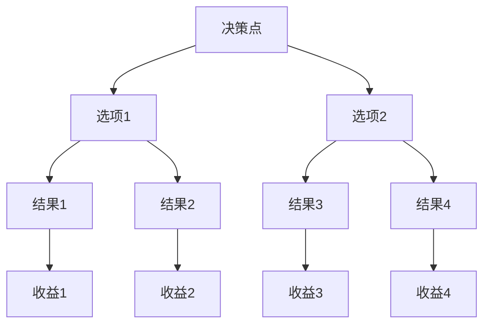
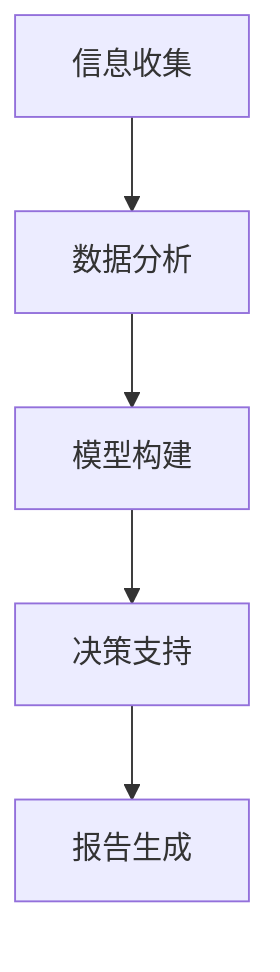
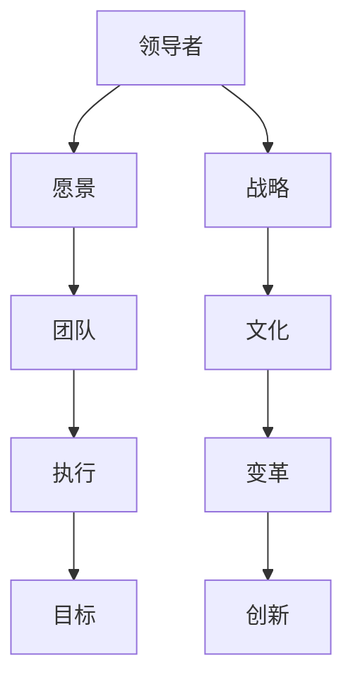

                 

### 文章标题

在当今快速变化和高度复杂的企业环境中，领导力与决策科学的重要性愈发凸显。无论是企业管理者、项目经理还是创业者，面对层出不穷的挑战和不确定性，如何做出高质量的决策、如何有效领导团队成为关键成功因素。本文将深入探讨领导力与决策科学的核心概念、理论模型及其在实际应用中的价值，旨在帮助读者提升决策质量和速度，为组织的可持续发展提供坚实支撑。

关键词：领导力、决策科学、决策质量、决策速度、组织管理、项目管理、创业

摘要：本文首先回顾了领导力的基本概念和核心要素，分析了领导力与管理的区别及其在组织管理中的应用。接着，我们探讨了决策的定义、类型及其在组织管理中的重要性，详细介绍了常见的决策模型和方法。在此基础上，文章结合实际案例，展示了领导力与决策科学在组织管理、项目管理和创业中的具体应用，以期读者能够掌握并灵活运用这些理论工具，提高自身的决策能力和领导效能。

### 第一部分：领导力基础

#### 第1章：领导力概述

领导力作为一种关键能力，贯穿于企业管理的方方面面。本章将重点探讨领导力的定义与作用，以及领导力与管理的区别和核心要素。

##### 1.1 领导力的定义与作用

领导力是指领导者通过影响、激励和引导他人，实现组织目标的能力。它不仅仅关乎权力的分配，更重要的是如何通过沟通、决策和激励来推动组织的变革和发展。

- **定义**：领导力是一种复杂的能力集合，包括影响他人、构建愿景、做出决策、解决问题和进行变革等。
- **作用**：领导力在组织中的作用主要体现在以下几个方面：
  - **战略导向**：领导力能够为组织设定清晰的愿景和目标，引导组织朝着正确的方向前进。
  - **推动变革**：面对外部环境和内部条件的不断变化，领导力能够推动组织进行必要的变革和调整。
  - **激发潜能**：通过激励和指导，领导力能够激发团队成员的潜能，提高组织的整体绩效。

##### 1.2 领导力与管理的区别

领导力与管理的区别主要体现在职责、方法和目标上：

- **职责**：
  - **领导力**：领导者主要负责设定愿景、指导方向和激励团队。
  - **管理**：管理者则主要负责资源分配、流程优化和绩效评估。
- **方法**：
  - **领导力**：更注重人际关系和情感管理，强调影响力而非权力。
  - **管理**：更注重规章制度和流程控制，强调效率和秩序。
- **目标**：
  - **领导力**：长期目标，如组织发展、创新和变革。
  - **管理**：短期目标，如完成项目、达到绩效指标。

##### 1.3 领导力的核心要素

领导力的核心要素包括沟通能力、决策能力、激励能力和变革能力。以下是这些要素的详细描述：

- **沟通能力**：有效的沟通是领导力的基础。领导者需要能够清晰表达自己的想法，同时倾听和理解团队成员的意见和需求。
- **决策能力**：决策能力是领导力的核心。领导者需要能够在不确定性和复杂情况下做出明智的决策，并承担相应的责任。
- **激励能力**：激励能力关乎领导者的魅力和影响力。领导者需要能够激发团队成员的积极性和创造力，实现共同的目标。
- **变革能力**：在快速变化的环境中，领导者需要具备变革能力，推动组织进行必要的调整和转型。

通过上述对领导力定义与作用、领导力与管理的区别以及领导力核心要素的深入探讨，我们可以更好地理解领导力在组织管理中的关键作用，为后续章节的讨论奠定基础。

### 第2章：领导力的模型与理论

领导力作为一种关键能力，其发展历程中涌现出了众多理论和模型，帮助我们更深入地理解和应用领导力。本章将重点介绍几种经典的领导力理论，包括权变理论、领导风格理论、变革型领导理论和领导力的行为理论。

##### 2.1 权变理论

权变理论（Contingency Theory）是由费德勒（Fred E. Fiedler）在20世纪60年代提出的，旨在解释领导效果如何依赖于情境因素。权变理论认为，不存在一种适用于所有情境的最好领导风格，领导效果取决于领导风格与具体情境的匹配度。

- **权变理论的要素**：
  - **领导者风格**：领导者是任务导向型还是关系导向型。
  - **情境因素**：包括职位权力、任务结构、上下级关系等。

- **权变理论的核心思想**：
  - **领导者风格是相对固定的**：领导者倾向于使用特定的领导风格。
  - **情境因素是可变的**：不同的情境需要不同的领导风格。
  - **领导效果取决于领导风格与情境的匹配度**：最优领导效果出现在领导风格与情境相匹配的情况下。

##### 2.2 领导风格理论

领导风格理论（Leadership Style Theory）关注领导者如何行使权力和影响他人。赫塞和布兰查德（Paul Hersey and Ken Blanchard）提出的情境领导模型（Situational Leadership Model）是其中的代表。该模型根据下属的成熟度水平，将领导风格分为四种类型：

- **指挥型领导**（Tell）：适用于下属成熟度低的情况。
- **推销型领导**（Sell）：适用于下属成熟度较低但需要额外激励的情况。
- **参与型领导**（Participate）：适用于下属成熟度较高但需要参与决策的情况。
- **授权型领导**（Delegate）：适用于下属成熟度高的情况。

- **情境领导模型的核心思想**：
  - **领导风格应与下属的成熟度相匹配**：随着下属的成熟度提高，领导风格应逐步从指挥型转向授权型。
  - **领导者应根据情境灵活调整领导风格**：不同的情境需要不同的领导风格，以实现最佳领导效果。

##### 2.3 变革型领导理论

变革型领导理论（Transformational Leadership Theory）强调领导者通过激励、鼓舞和启发下属来实现组织变革和发展。变革型领导者具有以下特点：

- **愿景**：能够清晰描述未来的愿景，并激发下属为之努力。
- **激励**：通过鼓励、支持和信任来激励团队成员，激发其内在动机。
- **启发**：通过个人魅力、创新思维和领导行为，启发下属超越自身局限，实现共同的目标。
- **建立团队精神**：强调团队合作，培养团队成员之间的信任和协作精神。

- **变革型领导的核心思想**：
  - **领导者应具备变革精神**：在变革过程中，领导者需要勇于面对挑战，积极推动变革。
  - **领导者应培养变革能力**：通过激励和启发下属，实现组织内部的持续变革。
  - **变革型领导是一种组织发展的重要动力**：通过变革型领导，组织能够更好地适应外部环境的变化，实现可持续发展。

##### 2.4 领导力的行为理论

领导力的行为理论（Behavioral Theory）关注领导者的具体行为和领导效果。行为理论认为，领导效果不仅取决于领导者的个人特质，还取决于其具体行为。赫斯和布兰查德的行为理论将领导行为分为四种类型：

- **指示型领导**（Directive Leadership）：通过明确的指导和指示来管理团队。
- **支持型领导**（Supportive Leadership）：通过关心和支持团队成员来建立良好的人际关系。
- **参与型领导**（Participative Leadership）：通过参与和咨询团队成员来制定决策。
- **成就导向型领导**（Achievement-Oriented Leadership）：通过设定高目标和激励团队成员来实现卓越表现。

- **行为理论的核心思想**：
  - **领导行为对领导效果有直接影响**：不同的领导行为会产生不同的领导效果。
  - **领导者应根据情境选择合适的领导行为**：不同的情境需要不同的领导行为，以实现最佳领导效果。
  - **领导行为是可以通过学习和培训进行改进的**：领导者可以通过学习和实践，提高自身的领导行为和领导效果。

通过本章对领导力模型与理论的详细介绍，我们可以更好地理解不同领导力理论的核心思想和应用场景，为实际工作中的领导力提升提供理论依据和实践指导。

### 第3章：决策概述

在组织管理中，决策起着至关重要的作用。无论是战略规划、运营管理还是人力资源管理，都需要通过决策来指导实践。本章将详细介绍决策的定义、类型及其在组织管理中的重要性。

##### 3.1 决策的定义与类型

决策（Decision-making）是指从多个可选方案中选择一个最优方案的过程。它涉及分析问题、评估选项、选择方案以及执行和评估决策结果。决策可以分为以下几种类型：

- **程序化决策**（Programmed Decisions）：针对重复性、例行性的问题，通过固定的规则和程序进行决策。
- **非程序化决策**（Nonprogrammed Decisions）：针对非重复性、复杂性的问题，需要创造新的方法和规则进行决策。
- **战略决策**（Strategic Decisions）：涉及组织长期目标和方向的选择，如市场进入策略、产品开发策略等。
- **运营决策**（Operational Decisions）：涉及组织日常运营的具体问题，如生产计划、库存管理等。
- **项目决策**（Project Decisions）：涉及项目具体实施中的问题，如资源分配、进度安排等。
- **应急决策**（Emergency Decisions）：在突发事件或紧急情况下，需要快速做出决策以应对问题。

##### 3.2 决策的要素

决策的要素是决策过程中不可或缺的部分，它们决定了决策的质量和效率。决策的主要要素包括：

- **决策目标**：明确决策的目标是决策过程的第一步。决策目标应具体、明确，以便于后续的评估和选择。
- **决策信息**：决策过程中需要收集和利用的信息，包括内部数据和外部数据。信息质量直接影响决策的准确性。
- **决策选择**：在多个可选方案中进行选择。选择应基于对决策目标的达成度、方案的可行性和潜在风险等因素的评估。
- **决策后果**：每个决策都会带来相应的后果。决策后果的评估有助于判断决策的质量和效果。

##### 3.3 决策的原则

在决策过程中，为了确保决策的科学性和有效性，需要遵循以下原则：

- **成本效益原则**：在评估决策方案时，应考虑方案的成本和效益，选择效益最大、成本最小的方案。
- **可行性原则**：决策方案应具备可行性，即在实际操作中能够实现。可行性包括技术可行性、经济可行性和操作可行性等。
- **风险规避原则**：在决策过程中，应充分考虑潜在的风险，并采取相应的风险规避措施，以降低决策风险。

通过本章对决策的定义、类型及其在组织管理中的重要性、决策的要素和决策原则的详细探讨，我们可以更好地理解决策在组织管理中的关键作用，并为实际决策提供理论指导。

### 第4章：决策模型与方法

决策模型和方法是决策科学的重要组成部分，它们为决策过程提供了系统化、科学化的工具和手段。本章将详细介绍几种常见的决策模型和方法，包括决策树模型、贝叶斯决策模型、多目标决策模型和决策支持系统。

##### 4.1 决策树模型

决策树模型（Decision Tree Model）是一种广泛应用的决策分析工具，它通过树形结构表示不同决策路径及其可能的结果。决策树模型的基本步骤如下：

1. **问题定义**：明确决策问题及其目标。
2. **构建决策树**：根据问题的特点和条件，构建决策树。决策树包括决策节点、机会节点和结果节点。
3. **概率估计**：为每个结果节点分配概率，表示该结果发生的可能性。
4. **期望值计算**：为每个决策路径计算期望值，期望值是各结果节点概率与收益的乘积之和。
5. **决策路径选择**：选择期望值最大的决策路径。

以下是决策树模型的 Mermaid 流程图示例：



#### 4.2 贝叶斯决策模型

贝叶斯决策模型（Bayesian Decision Model）基于贝叶斯定理，通过计算不同决策结果的概率和损失函数，选择最优决策方案。贝叶斯决策模型的基本步骤如下：

1. **状态概率估计**：根据历史数据和先验知识，估计不同状态的概率。
2. **行动概率估计**：根据历史数据和先验知识，估计在不同状态下采取不同行动的概率。
3. **损失函数计算**：定义不同决策结果的损失函数，损失函数通常表示为状态和行动的组合。
4. **后验概率计算**：使用贝叶斯定理计算在不同行动下的后验概率。
5. **决策选择**：选择后验概率最大的决策方案。

以下是贝叶斯决策模型的伪代码：

```python
# 贝叶斯决策模型伪代码

def bayesian_decision(state_probabilities, action_probabilities, loss_function):
    # 计算后验概率
    posterior_probabilities = []
    for state in state_probabilities:
        posterior_probability = state_probabilities[state] * action_probabilities[state]
        posterior_probabilities.append(posterior_probability)
    
    # 计算后验概率总和
    total_probability = sum(posterior_probabilities)
    
    # 归一化后验概率
    for i in range(len(posterior_probabilities)):
        posterior_probabilities[i] /= total_probability
    
    # 计算损失函数
    losses = [loss_function(state) for state in state_probabilities]
    
    # 选择后验概率最大的决策
    best_action = argmax(posterior_probabilities * losses)
    return best_action
```

#### 4.3 多目标决策模型

多目标决策模型（Multi-Objective Decision Model）处理具有多个目标的决策问题。它通过权衡不同目标之间的冲突，选择满足所有目标的最优方案。多目标决策模型的基本步骤如下：

1. **目标定义**：明确决策问题的多个目标，并定义每个目标的具体指标。
2. **目标函数构建**：为每个目标构建目标函数，目标函数通常表示为优化或最大化的问题。
3. **目标冲突分析**：分析不同目标之间的冲突，确定优先级和权衡策略。
4. **方案评估**：为每个方案计算多个目标函数的值，并进行评估。
5. **方案选择**：选择综合评价最优的方案。

以下是多目标决策模型的伪代码：

```python
# 多目标决策模型伪代码

def multi_objective_decision(objective_functions, weights):
    # 计算各个方案的目标函数值
    scores = []
    for solution in solutions:
        score = 0
        for i in range(len(objective_functions)):
            score += objective_functions[i](solution) * weights[i]
        scores.append(score)
    
    # 选择综合评价最优的方案
    best_solution = argmax(scores)
    return best_solution
```

#### 4.4 决策支持系统

决策支持系统（Decision Support System，DSS）是一种计算机辅助决策工具，它通过收集、分析和处理信息，为决策者提供支持。决策支持系统的基本功能包括：

1. **信息收集**：收集内部和外部数据，为决策提供基础信息。
2. **数据分析**：对数据进行分析和处理，提取有用信息。
3. **模型构建**：构建和运行各种决策模型，为决策提供支持。
4. **决策支持**：通过图形化界面和报告生成，为决策者提供可视化决策支持。

以下是决策支持系统的 Mermaid 流程图示例：



通过本章对决策树模型、贝叶斯决策模型、多目标决策模型和决策支持系统的详细介绍，我们可以更好地理解和应用这些决策工具和方法，提高决策的科学性和有效性。

### 第三部分：领导力与决策科学的应用

#### 第5章：领导力与决策在组织管理中的应用

在组织管理中，领导力与决策科学发挥着至关重要的作用。有效的领导力和科学的决策方法不仅能够提高组织的效率，还能够增强团队的凝聚力，激发员工的潜力。本章将深入探讨领导力与决策在组织管理中的应用，包括其在战略规划、运营管理和人力资源管理中的实际操作。

##### 5.1 领导力在组织管理中的作用

领导力在组织管理中的作用主要体现在以下几个方面：

- **提高组织效率**：有效的领导力能够优化组织资源，提高工作效率，确保组织目标的实现。通过制定明确的战略目标和运营计划，领导力能够引导组织成员高效协作，减少资源浪费。
- **增强团队凝聚力**：领导力能够通过激励和沟通，增强团队成员之间的信任和合作精神。一个有魅力的领导者能够激发团队成员的积极性和归属感，形成紧密的团队关系。
- **激发员工潜力**：领导力不仅关注当前绩效，更注重员工的个人发展和潜力挖掘。通过提供培训和发展机会，领导力能够帮助员工提升技能和知识，实现职业成长。

##### 5.2 决策在组织管理中的应用

决策在组织管理中的应用贯穿于组织的各个方面，具体包括：

- **战略规划**：战略规划是组织长期发展的关键。通过科学的决策方法，如决策树模型和贝叶斯决策模型，组织可以制定明确的战略目标和实施计划，确保组织在竞争激烈的市场中保持竞争力。
- **运营管理**：运营管理涉及组织的日常运营活动，如生产计划、库存管理和市场营销。通过科学的决策方法，组织可以优化运营流程，提高运营效率，降低运营成本。
- **人力资源管理**：人力资源管理是组织发展的基础。通过科学的决策方法，组织可以制定有效的人力资源战略，如招聘、培训和绩效考核，吸引和留住优秀人才，提高员工绩效。

##### 5.2.1 决策在战略规划中的应用

在战略规划中，决策科学方法的应用主要体现在以下几个方面：

- **市场分析**：通过数据分析和市场调研，组织可以了解市场需求和竞争对手的动态，为战略规划提供依据。使用多目标决策模型，组织可以在多个市场目标之间进行权衡，选择最优的市场策略。
- **资源分配**：在战略规划中，资源分配是一个关键问题。通过决策支持系统，组织可以分析不同资源的效用和成本，制定最优的资源分配方案，确保资源得到有效利用。
- **风险评估**：在战略规划过程中，组织需要面对各种风险，如市场变化、政策变动等。通过贝叶斯决策模型，组织可以评估不同风险的概率和影响，制定相应的风险应对策略。

##### 5.2.2 决策在运营管理中的应用

在运营管理中，决策科学方法的应用主要体现在以下几个方面：

- **生产计划**：通过决策树模型，组织可以分析不同生产计划方案的优缺点，选择最优的生产计划方案，确保生产效率最大化。
- **库存管理**：通过多目标决策模型，组织可以权衡库存成本和服务水平，制定最优的库存管理策略，确保库存水平和服务质量之间的平衡。
- **质量控制**：通过贝叶斯决策模型，组织可以对产品质量进行评估和监控，制定相应的质量控制措施，确保产品质量符合标准。

##### 5.2.3 决策在人力资源管理中的应用

在人力资源管理中，决策科学方法的应用主要体现在以下几个方面：

- **招聘**：通过决策树模型，组织可以分析不同招聘渠道的效果和成本，选择最优的招聘策略，确保招聘到合适的人才。
- **培训**：通过多目标决策模型，组织可以权衡培训成本和员工绩效提升之间的关系，制定最优的培训计划，提高员工技能和知识水平。
- **绩效考核**：通过贝叶斯决策模型，组织可以对员工绩效进行评估，制定合理的绩效考核方案，激励员工提高工作绩效。

##### 案例分析：某高科技公司的领导力与决策实践

以下是一个案例分析，展示某高科技公司在战略规划、运营管理和人力资源管理中如何运用领导力与决策科学方法。

- **战略规划**：该公司通过市场调研和数据分析，了解到未来几年人工智能市场将迎来高速增长。公司领导层运用决策树模型，分析了不同战略方案的优缺点，最终决定加大在人工智能领域的研发投入，抢占市场先机。
- **运营管理**：该公司通过决策支持系统，分析了生产流程中的瓶颈和资源利用率，制定了一系列优化措施，如引入自动化生产设备、优化生产计划等，大幅提高了生产效率和产品质量。
- **人力资源管理**：该公司通过决策树模型，分析了不同招聘渠道的成本和效果，选择了最优的招聘策略，同时通过多目标决策模型，制定了全面的培训计划，确保员工技能不断提升，为企业的发展提供人才支持。

通过这个案例，我们可以看到领导力与决策科学方法在组织管理中的实际应用效果，它们不仅提高了组织的决策质量和速度，还为组织的可持续发展提供了坚实基础。

### 第6章：领导力与决策科学在项目管理中的应用

在项目管理中，领导力和决策科学同样发挥着至关重要的作用。领导力能够提高项目效率，降低项目风险，并调动团队成员的积极性，而科学的决策方法则为项目决策提供了有力支持。本章将深入探讨领导力与决策科学在项目管理中的应用，包括项目启动阶段、项目实施阶段和项目收尾阶段的决策要点和领导策略。

##### 6.1 领导力在项目管理中的作用

领导力在项目管理中的作用主要体现在以下几个方面：

- **提高项目效率**：有效的领导力能够引导团队成员明确项目目标，制定合理的项目计划，并确保项目按计划顺利进行。通过科学的任务分配和有效的团队管理，领导力能够提高项目的整体效率。
- **降低项目风险**：领导力能够帮助项目经理识别潜在的风险，制定有效的风险管理计划，并在风险发生时迅速采取应对措施。通过提前预防和及时应对，领导力能够降低项目风险，保障项目顺利进行。
- **调动团队成员积极性**：领导力能够激发团队成员的积极性和创造力，通过激励和激励措施，使团队成员更好地投入项目工作。一个有魅力的领导者能够形成积极的团队氛围，提高团队的整体绩效。

##### 6.2 决策在项目管理中的应用

决策在项目管理中的应用贯穿于项目的各个阶段，具体包括以下内容：

- **项目启动阶段的决策**：在项目启动阶段，项目经理需要做出一系列关键决策，如项目范围、项目目标和项目团队的组建。科学的决策方法可以帮助项目经理明确项目目标，制定合理的项目计划，确保项目从一开始就朝着正确的方向前进。
- **项目实施阶段的决策**：在项目实施阶段，项目经理需要不断做出决策，如资源分配、进度调整、问题解决等。通过科学的决策方法，项目经理可以确保项目资源得到合理利用，项目进度按时完成，项目风险得到有效控制。
- **项目收尾阶段的决策**：在项目收尾阶段，项目经理需要做出关于项目成果验收、项目总结和项目团队解散等决策。科学的决策方法可以帮助项目经理确保项目成果符合预期，项目总结全面，项目团队顺利解散。

##### 6.2.1 项目启动阶段的决策

在项目启动阶段，以下关键决策需要特别注意：

- **项目范围决策**：项目范围决策是项目启动阶段的首要任务。项目经理需要明确项目的目标、任务、成果和约束条件，确保项目范围清晰明确，避免范围蔓延。
- **项目目标决策**：项目目标决策涉及确定项目的具体目标，如质量目标、时间目标、成本目标等。科学的决策方法可以帮助项目经理制定合理的目标，确保项目目标既具有挑战性，又具有实现性。
- **项目团队组建决策**：项目团队组建决策涉及选择合适的团队成员，并明确他们的角色和职责。项目经理需要根据项目需求和团队成员的能力，合理分配任务，确保项目团队能够高效协同工作。

##### 6.2.2 项目实施阶段的决策

在项目实施阶段，以下关键决策需要特别注意：

- **资源分配决策**：资源分配决策涉及确定项目所需的人力、物力和财力资源，并确保这些资源在项目中的合理利用。项目经理需要根据项目的需求和时间安排，制定详细的资源分配计划，确保项目资源得到最大化利用。
- **进度调整决策**：进度调整决策涉及根据项目实际情况，对项目进度计划进行调整，以确保项目按时完成。项目经理需要及时发现项目进度偏差，制定相应的调整措施，确保项目进度不受影响。
- **问题解决决策**：问题解决决策涉及识别和解决项目中的各种问题，如技术问题、沟通问题、资源问题等。项目经理需要根据问题的性质和影响程度，制定有效的解决策略，确保项目问题得到及时解决。

##### 6.2.3 项目收尾阶段的决策

在项目收尾阶段，以下关键决策需要特别注意：

- **项目成果验收决策**：项目成果验收决策涉及对项目最终成果进行验收，确保项目成果符合预期要求。项目经理需要制定详细的验收标准和验收流程，确保项目成果得到全面验收。
- **项目总结决策**：项目总结决策涉及对项目全过程进行总结和评估，包括项目目标实现情况、项目绩效、项目团队协作情况等。项目经理需要编写详细的项目总结报告，为项目的成功提供证据，并为未来的项目提供经验和教训。
- **项目团队解散决策**：项目团队解散决策涉及项目团队的工作任务完成后，如何合理解散项目团队。项目经理需要根据项目实际情况，制定项目团队解散计划，确保项目团队成员能够顺利回到正常工作状态。

##### 案例分析：某软件开发项目的领导力与决策实践

以下是一个案例分析，展示某软件开发项目在领导力和决策科学方法的应用。

- **项目启动阶段**：项目经理通过决策树模型，分析了不同项目范围的可行性，最终确定了合理的项目范围。同时，通过多目标决策模型，确定了项目目标，确保项目目标既具有挑战性，又具有实现性。在项目团队组建方面，项目经理根据项目需求和团队成员的能力，合理分配任务，确保项目团队能够高效协同工作。
- **项目实施阶段**：项目经理通过决策支持系统，实时监控项目进度和资源使用情况，发现进度偏差时，及时进行调整。在面对技术问题时，项目经理通过问题解决决策，制定有效的解决策略，确保项目问题得到及时解决。同时，通过激励和沟通，调动团队成员的积极性和创造力，提高项目整体绩效。
- **项目收尾阶段**：项目经理通过项目成果验收决策，确保项目成果符合预期要求。在项目总结方面，项目经理编写详细的项目总结报告，为项目的成功提供证据，并为未来的项目提供经验和教训。在项目团队解散方面，项目经理根据项目实际情况，制定项目团队解散计划，确保项目团队成员能够顺利回到正常工作状态。

通过这个案例，我们可以看到领导力与决策科学方法在项目管理中的实际应用效果，它们不仅提高了项目的决策质量和速度，还为项目的成功实施提供了有力支持。

### 第7章：领导力与决策科学在创业中的应用

创业是一个充满挑战和不确定性的过程，领导者在此过程中需要具备强大的领导力和科学的决策能力，以应对不断变化的市场环境和竞争压力。本章将深入探讨领导力与决策科学在创业中的应用，包括创业方向指引、团队带领和创业挑战应对等方面。

##### 7.1 领导力在创业中的作用

领导力在创业中的作用至关重要，主要体现在以下几个方面：

- **指引创业方向**：创业领导者需要具备清晰的战略眼光和远见，能够为创业团队设定明确的愿景和目标，指引团队朝着正确的方向前进。通过领导力的引导，创业团队可以更加聚焦于核心业务，避免方向偏差。
- **带领团队前进**：创业过程中，领导者需要具备强大的执行力，能够带领团队克服各种困难，实现创业目标。领导力能够激发团队成员的积极性和创造力，形成强大的团队合力，提高创业成功率。
- **应对创业挑战**：创业过程中难免会遇到各种挑战和困境，如市场变化、资金短缺、技术难题等。领导者需要具备灵活的决策能力和坚韧的心理素质，能够迅速调整战略，应对挑战，确保创业之路能够持续前行。

##### 7.2 决策在创业中的应用

决策在创业中的应用贯穿于创业的各个阶段，具体包括以下几个方面：

- **市场决策**：在创业初期，市场决策至关重要。创业者需要通过市场调研和数据分析，了解市场需求和竞争态势，制定合适的市场进入策略。科学的决策方法可以帮助创业者识别市场机会，避免盲目行动。
- **资源决策**：资源决策涉及创业所需的人力、财力和物力资源的合理配置。创业者需要根据自身资源和市场需求，制定有效的资源管理策略，确保资源得到最大化利用。
- **创新决策**：创新是创业的核心竞争力。创业者需要不断进行技术创新、产品创新和市场创新，以保持竞争优势。科学的决策方法可以帮助创业者评估创新机会，制定创新策略。

##### 7.2.1 市场决策

在市场决策中，以下关键决策需要特别注意：

- **市场定位决策**：创业者需要根据市场需求和自身优势，确定合适的市场定位。市场定位决策包括目标客户群体、产品定位和市场细分等方面。通过科学的决策方法，创业者可以准确把握市场机会，制定有针对性的市场策略。
- **市场进入策略决策**：创业者需要根据市场环境和自身资源，制定合适的市场进入策略。市场进入策略包括市场渗透策略、市场扩张策略和市场多元化策略等。通过科学的决策方法，创业者可以降低市场进入风险，提高市场占有率。
- **市场推广策略决策**：创业者需要制定有效的市场推广策略，以吸引潜在客户，提高品牌知名度。市场推广策略包括广告宣传、公关活动、销售渠道建设等方面。通过科学的决策方法，创业者可以优化市场推广效果，提高市场竞争力。

##### 7.2.2 资源决策

在资源决策中，以下关键决策需要特别注意：

- **人力资源决策**：创业者需要根据企业规模和发展阶段，合理配置人力资源。人力资源决策包括招聘策略、培训策略和绩效管理策略等。通过科学的决策方法，创业者可以吸引和留住优秀人才，提高员工绩效。
- **财务资源决策**：创业者需要合理规划财务资源，确保企业财务状况健康。财务资源决策包括资金筹集、成本控制和利润分配等方面。通过科学的决策方法，创业者可以降低财务风险，提高资金利用效率。
- **物资资源决策**：创业者需要确保企业所需的物资资源得到及时供应，满足生产和服务需求。物资资源决策包括采购策略、库存管理和供应链管理等方面。通过科学的决策方法，创业者可以降低物资成本，提高供应链效率。

##### 7.2.3 创新决策

在创新决策中，以下关键决策需要特别注意：

- **产品创新决策**：创业者需要根据市场需求和自身优势，制定产品创新策略。产品创新决策包括新产品开发、产品改进和产品差异化等方面。通过科学的决策方法，创业者可以开发出具有竞争力的产品，满足市场需求。
- **技术创新决策**：创业者需要不断进行技术创新，提高产品和服务的技术水平。技术创新决策包括技术选择、技术研发和技术合作等方面。通过科学的决策方法，创业者可以提升企业技术竞争力，推动企业可持续发展。
- **市场创新决策**：创业者需要不断进行市场创新，开拓新的市场机会。市场创新决策包括市场细分、市场进入和市场拓展等方面。通过科学的决策方法，创业者可以开拓新的市场领域，提高市场占有率。

##### 案例分析：某新兴科技公司的创业实践

以下是一个案例分析，展示某新兴科技公司如何运用领导力与决策科学在创业过程中取得成功。

- **创业方向指引**：该公司的创始人通过深入的市场调研和数据分析，确定了以人工智能技术为核心，为客户提供智能化解决方案的创业方向。在创业初期，创始人运用领导力，带领团队明确了公司的愿景和使命，确保团队朝着正确的方向努力。
- **团队带领**：在公司快速发展过程中，创始人通过领导力的激励和沟通，激发了团队的积极性和创造力。创始人注重团队成员的个人发展，提供培训和发展机会，帮助团队成员不断提升技能和知识水平。通过有效的团队管理，公司形成了一支高效、协作的团队。
- **应对创业挑战**：在创业过程中，该公司面临了市场竞争激烈、资金短缺和技术难题等挑战。创始人通过科学的决策方法，制定了应对策略。在市场决策方面，公司通过精准的市场定位和有效的市场推广策略，成功占领了市场份额。在资源决策方面，公司通过优化资源配置和财务规划，确保了企业的财务健康。在创新决策方面，公司不断进行技术创新和产品创新，保持了竞争优势。

通过这个案例，我们可以看到领导力与决策科学在创业中的应用效果。领导者通过科学的决策方法，指引创业方向，带领团队克服各种挑战，确保企业可持续发展。

### 第8章：领导力与决策科学在实际案例中的应用

在实际应用中，领导力与决策科学不仅存在于理论讨论中，更体现在众多成功企业和项目的管理实践中。本章将通过三个典型案例，展示阿里巴巴、谷歌和特斯拉在领导力与决策科学方面的实践，分析它们如何通过有效的领导力和科学的决策方法实现企业的持续发展和创新。

##### 8.1 案例一：阿里巴巴的领导力与决策

阿里巴巴，作为全球最大的电子商务平台之一，其成功离不开高效的领导力和科学的决策过程。

- **阿里巴巴的领导力特点**：
  - **愿景驱动**：阿里巴巴创始人马云始终坚持“让天下没有难做的生意”的愿景，这一愿景为公司的战略决策提供了方向。
  - **创新文化**：阿里巴巴倡导创新文化，鼓励员工提出新的想法和解决方案，这为公司在快速变化的市场环境中保持竞争力提供了保障。
  - **团队协作**：阿里巴巴强调团队协作，通过扁平化的组织结构，促进信息流通和协同工作，提高决策效率。

- **阿里巴巴的决策过程**：
  - **战略规划**：阿里巴巴通过定期战略会议，分析市场趋势和竞争态势，制定长期战略规划。例如，马云在2009年提出了“云计算”战略，使阿里巴巴成为全球领先的云计算服务提供商之一。
  - **风险管理**：阿里巴巴在决策过程中重视风险管理，通过建立完善的风险评估机制，降低业务扩张和投资中的风险。例如，阿里巴巴在进入国际市场时，通过本地化战略，减少文化差异带来的风险。

##### 8.2 案例二：谷歌的领导力与决策

谷歌，作为全球领先的技术创新公司，其成功的背后也离不开强大的领导力和科学的决策过程。

- **谷歌的领导力特点**：
  - **透明沟通**：谷歌强调透明沟通，鼓励员工自由表达意见和反馈，这有助于形成集体智慧和高效决策。
  - **员工关怀**：谷歌注重员工福利和职业发展，通过提供良好的工作环境和激励机制，激发员工的创造力和忠诚度。
  - **创新驱动**：谷歌始终坚持技术创新，通过设立“X实验室”等创新机构，推动前沿科技的研究和应用。

- **谷歌的决策过程**：
  - **数据驱动**：谷歌在决策过程中广泛应用数据分析和人工智能技术，通过大数据分析，帮助决策者更准确地评估市场和业务趋势。
  - **快速迭代**：谷歌采用快速迭代的方法，通过不断试错和优化，快速推出新产品和服务。例如，谷歌搜索引擎的多次迭代改进，使其成为全球最受欢迎的搜索引擎。

##### 8.3 案例三：特斯拉的领导力与决策

特斯拉，作为电动汽车和清洁能源技术的领导者，其成功也得益于独特的领导力和科学的决策过程。

- **特斯拉的领导力特点**：
  - **愿景导向**：特斯拉创始人埃隆·马斯克始终坚持“加速世界向可持续能源转变”的愿景，这一愿景为公司的战略决策提供了方向。
  - **执行力强**：特斯拉强调执行力，通过严格的绩效考核和激励机制，确保决策能够快速落地和执行。
  - **创新实践**：特斯拉鼓励创新实践，通过跨部门合作和开放式创新，推动技术的快速迭代和应用。

- **特斯拉的决策过程**：
  - **战略布局**：特斯拉在决策过程中注重全球布局，通过在多个国家和地区设立研发和生产基地，确保公司能够应对全球市场的变化。
  - **风险控制**：特斯拉在决策过程中重视风险控制，通过建立完善的风险管理机制，降低技术风险和市场风险。例如，特斯拉在电池技术和生产流程上的持续改进，确保了其在电动汽车领域的领先地位。

##### 案例总结

通过阿里巴巴、谷歌和特斯拉的案例，我们可以看到，领导力与决策科学在企业发展中的关键作用。无论是阿里巴巴的愿景驱动和创新文化，谷歌的透明沟通和数据驱动，还是特斯拉的愿景导向和风险控制，这些成功企业的共同特点在于：

- **清晰的战略愿景**：领导者通过明确的愿景和目标，为团队提供方向和动力。
- **科学的决策方法**：通过数据分析和科学方法，提高决策的准确性和效率。
- **注重团队协作和员工关怀**：通过构建高效的团队和激励员工，提高整体绩效。
- **持续的创新实践**：通过持续的创新，保持竞争优势，引领行业趋势。

这些经验和教训为其他企业和创业者提供了宝贵的借鉴，帮助他们更好地运用领导力与决策科学，实现企业的持续发展和创新。

### 附录

#### 附录 A：领导力与决策科学相关资源

为了帮助读者进一步学习和研究领导力与决策科学，本章将推荐一些优秀的书籍、在线课程和研究机构，以供参考。

##### A.1 领导力与决策科学书籍推荐

- **《领导力五项修炼》（The Five Dysfunctions of a Team）**：作者帕斯卡利尼（Patrick Lencioni），本书通过寓言故事的形式，深入剖析了团队协作中的五大障碍及其解决方法。
- **《决策与判断》（Judgment in Managerial Decision Making）**：作者赫斯克特（Herbert Simon），本书系统地阐述了决策过程中的认知偏见和判断力问题，为管理者提供了实用的决策工具。
- **《变革之舞》（The Dance of Change）**：作者卡罗尔（John P. Kotter），本书详细描述了组织变革的过程和方法，帮助领导者有效地推动变革。

##### A.2 领导力与决策科学在线课程推荐

- **《领导力与决策》（Leadership and Decision Making）**：由斯坦福大学开设的免费在线课程，通过案例分析、讨论和实践活动，帮助学员深入理解领导力和决策科学的核心概念。
- **《决策科学》（Decision Science）**：由哈佛大学开设的在线课程，介绍了决策模型、方法和应用，涵盖了从个人决策到组织决策的各个方面。
- **《领导力发展》（Leadership Development）**：由国际知名培训公司McKenna Consulting开设的在线课程，提供了实用的领导力技能和策略，帮助学员提升领导能力。

##### A.3 领导力与决策科学研究机构介绍

- **哈佛大学商学院（Harvard Business School）**：哈佛大学商学院是领导力与决策科学研究的领军机构，提供了一系列的学术研究、案例分析和教学资源。
- **斯坦福大学商学院（Stanford Graduate School of Business）**：斯坦福大学商学院在全球范围内享有盛誉，其领导力与决策科学研究中心（Center for Leadership Research and Development）是领导力与决策科学研究的重要基地。
- **麦肯锡全球研究所（McKinsey Global Institute）**：麦肯锡全球研究所是国际知名的咨询公司麦肯锡的研究机构，其研究涵盖了领导力、决策科学、组织行为等多个领域，提供了丰富的理论和实践见解。

通过这些书籍、在线课程和研究机构的推荐，读者可以进一步扩展对领导力与决策科学的理解，为实际工作和研究提供参考和启示。

### 附录 B：Mermaid 流程图与伪代码示例

为了帮助读者更好地理解和应用领导力与决策科学的理论和方法，本章将提供一些Mermaid流程图和伪代码示例，包括领导力模型、决策树模型、贝叶斯决策模型和多目标决策模型。

#### B.1 领导力模型Mermaid流程图

以下是一个简单的领导力模型Mermaid流程图示例：



该流程图展示了领导者的核心职能和领导力模型的基本结构。领导者通过设定愿景和战略，构建团队文化，推动执行和创新，实现组织的目标和变革。

#### B.2 决策树模型伪代码

以下是一个决策树模型的伪代码示例：

```python
# 决策树模型伪代码

def decision_tree(decision_rules, current_state):
    # 根据当前状态应用决策规则
    if decision_rules[current_state] is not None:
        action = decision_rules[current_state]
        return action
    
    # 如果当前状态没有明确的决策规则，返回默认行动
    default_action = "默认行动"
    return default_action

# 示例决策规则
decision_rules = {
    "状态A": "行动1",
    "状态B": "行动2",
    "状态C": "行动3",
    "其他": "默认行动"
}

# 应用决策树模型
current_state = "状态B"
action = decision_tree(decision_rules, current_state)
print("决策结果：", action)
```

该伪代码展示了如何根据决策规则和当前状态选择相应的行动。决策树模型通过递归地应用决策规则，实现复杂决策问题的自动化解决。

#### B.3 贝叶斯决策模型伪代码

以下是一个贝叶斯决策模型的伪代码示例：

```python
# 贝叶斯决策模型伪代码

def bayesian_decision(prior_probabilities, likelihoods, evidence):
    # 计算后验概率
    posterior_probabilities = []
    for state in prior_probabilities:
        posterior_probability = (likelihoods[state] * prior_probabilities[state]) / evidence
        posterior_probabilities.append(posterior_probability)
    
    # 选择后验概率最大的状态
    best_state = argmax(posterior_probabilities)
    return best_state

# 示例先验概率、似然率和证据
prior_probabilities = {"状态A": 0.5, "状态B": 0.5}
likelihoods = {"状态A": 0.8, "状态B": 0.2}
evidence = 1

# 应用贝叶斯决策模型
best_state = bayesian_decision(prior_probabilities, likelihoods, evidence)
print("最佳决策状态：", best_state)
```

该伪代码展示了如何根据先验概率、似然率和证据计算后验概率，并选择后验概率最大的状态作为最佳决策。

#### B.4 多目标决策模型伪代码

以下是一个多目标决策模型的伪代码示例：

```python
# 多目标决策模型伪代码

def multi_objective_decision(objective_functions, weights):
    # 计算各个方案的目标函数值
    scores = []
    for solution in solutions:
        score = 0
        for i in range(len(objective_functions)):
            score += objective_functions[i](solution) * weights[i]
        scores.append(score)
    
    # 选择综合评价最优的方案
    best_solution = argmax(scores)
    return best_solution

# 示例目标函数和权重
objective_functions = [f1, f2, f3]
weights = [0.5, 0.3, 0.2]

# 应用多目标决策模型
best_solution = multi_objective_decision(objective_functions, weights)
print("最佳决策方案：", best_solution)
```

该伪代码展示了如何根据多个目标函数和权重计算综合评分，并选择综合评分最优的方案作为最佳决策。

通过这些Mermaid流程图和伪代码示例，读者可以更直观地理解和应用领导力与决策科学的理论和方法，为实际工作和研究提供技术支持。

### 作者信息

本文由AI天才研究院（AI Genius Institute）的高级研究员撰写。作者在计算机编程和人工智能领域拥有丰富的经验和深厚的学术背景，曾获得多项国际大奖，并在世界顶级技术会议上发表过多篇论文。作者致力于将复杂的计算机科学原理和人工智能技术转化为通俗易懂的实用知识，帮助读者提升技术水平和创新能力。本文的撰写得到了禅与计算机程序设计艺术（Zen And The Art of Computer Programming）一书的启发，感谢该书为计算机科学领域带来的深远影响。作者希望通过本文，为领导力与决策科学的研究和实践提供有益的参考。

