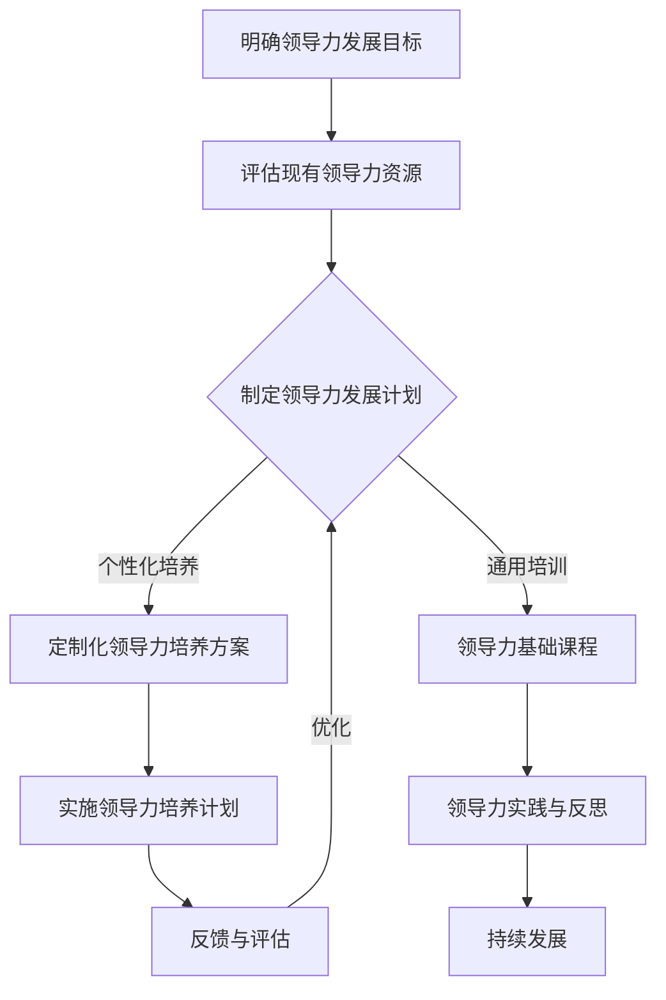
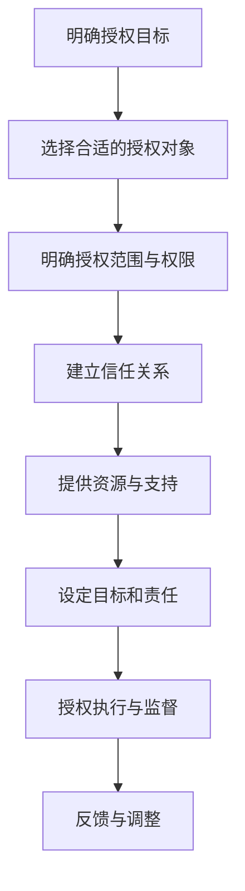

                 

## 《领导力与授权艺术：培养下一代领导者》

### 关键词
- 领导力
- 授权
- 培养下一代领导者
- 团队管理
- 数字化领导力

### 摘要
本文将深入探讨领导力的核心概念、重要性以及与管理的区别，分析领导力的核心能力如沟通、决策和影响力。接着，我们聚焦于领导力风格和团队管理，探讨不同风格的领导力如何影响团队绩效。随后，本文将介绍授权艺术的概念、原则、步骤和方法，以及其在实际中的应用与挑战。最后，我们将讨论领导者培养的必要性、策略与实践，并通过案例研究和未来展望，为培养下一代领导者提供新的视角和启示。

### 目录大纲

**第一部分：领导力基础**

## 第1章：领导力的定义与重要性

### 1.1 领导力的定义

领导力是一种引领和激励他人实现目标的能力。它不同于管理，更关注于愿景的塑造、价值观的传递和团队的凝聚力。

### 1.2 领导力与管理的区别

管理侧重于流程和效率，而领导力则注重变革和创新。两者在目标、方法和效果上都有显著的区别。

### 1.3 领导力的发展历程

从传统的领导力模型到当代的领导力理论，领导力的概念和内涵在不断演进。

## 第2章：领导力的核心能力

### 2.1 沟通能力

有效的沟通是领导力的基石。领导者需要掌握倾听、表达和反馈的技巧。

### 2.2 决策能力

领导者必须能够做出明智的决策，这需要他们具备分析问题的能力、运用决策模型以及考虑不同决策的结果。

### 2.3 影响力

领导力的影响力来源于他们的价值观、知识和人际关系。领导者需要不断提升自己的影响力，以推动团队和组织的发展。

## 第3章：领导力风格与团队管理

### 3.1 领导力风格

不同的领导力风格有不同的优势和劣势，领导者需要根据具体情况选择合适的风格。

### 3.2 团队管理

团队管理是领导力的重要组成部分。领导者需要构建有凝聚力的团队，并激发团队成员的潜力。

**第二部分：授权艺术**

## 第4章：授权的概念与原则

### 4.1 授权的概念

授权是将决策和行动的权力下放给下属，让他们能够自主地完成任务。

### 4.2 授权的原则

授权需要基于信任、明确目标和责任，并避免过度控制和干涉。

## 第5章：授权的步骤与方法

### 5.1 授权的步骤

授权的过程包括明确授权目标、选择合适的授权对象和执行授权。

### 5.2 授权的方法

授权可以采取明示、暗示和激励性等多种形式。

## 第6章：授权的挑战与解决策略

### 6.1 授权的挑战

授权过程中可能面临信任问题、能力不足和风险控制等挑战。

### 6.2 解决策略

解决授权挑战的策略包括风险评估、增强信任和支持等。

**第三部分：培养下一代领导者**

## 第7章：领导者培养的必要性

### 7.1 领导者培养的意义

领导者培养对于企业的长期发展和领导者的个人成长都具有重要意义。

### 7.2 领导者培养的挑战

领导者培养面临现有模式的不足和未来领导者所需技能与素质的挑战。

## 第8章：领导者培养的策略与实践

### 8.1 培养策略

领导者培养需要设计有效的培养计划，提供实践机会和反馈。

### 8.2 培养实践

领导者培养可以通过培训课程、教练辅导等实践方法来实施。

## 第9章：案例研究

### 9.1 国内企业领导者培养案例分析

通过分析国内企业的成功经验与困境，为领导者培养提供启示。

### 9.2 国际企业领导者培养案例分析

国际企业的领导者培养有其独特的特点，可以为我们提供新的视角。

## 第10章：未来展望

### 10.1 领导力发展的趋势

数字化和全球化背景下，领导力发展呈现出新的趋势。

### 10.2 授权艺术的未来发展

授权艺术在领导力中的作用和未来发展受到广泛关注。

### 10.3 培养下一代领导者的新方向

未来领导者所需技能与培养模式的创新是我们需要关注的重点。

## 附录

### 附录A：领导力与授权艺术相关资源

提供一系列书籍、网站和工具，为读者深入了解领导力与授权艺术提供资源。

### 附录B：领导力与授权艺术流程图

流程图帮助读者更直观地理解领导力与授权艺术的过程。

### 附录C：领导力与授权艺术算法伪代码

伪代码展示领导力评估和授权策略的计算方法。

### 附录D：领导力与授权艺术案例解析

通过案例解析，深入理解领导力与授权艺术的应用。

### 附录E：数学模型与数学公式

数学模型和公式为读者提供更深入的理论支持。

### 附录F：代码实例与解读

代码实例帮助读者掌握领导力与授权艺术的具体实现。

---

在接下来的章节中，我们将详细探讨领导力的基础、授权艺术以及领导者培养的策略与实践。通过深入分析和案例研究，我们希望为读者提供有价值的见解和实际指导。让我们一步步深入探讨这个复杂而重要的主题。**<|vq_16037|>** ### 第一部分：领导力基础

#### 第1章：领导力的定义与重要性

#### 1.1 领导力的定义

领导力是一种独特的能力，它涉及对他人行为的引导、激励和塑造，以便实现共同的愿景和目标。它不同于管理，尽管两者在某些方面有重叠。管理侧重于确保资源的有效配置、流程的优化和目标的实现，而领导力则关注于愿景的创造、价值观的传递和团队的凝聚力。

领导力的核心在于影响他人，不仅仅是通过权威和控制，更重要的是通过激励和启发。有效的领导力能够激发团队成员的潜力，推动他们超越自我，实现更高的绩效。领导力是一种可以培养和发展的能力，它不仅仅是天生的素质，更是可以通过学习和实践不断优化的技能。

领导力的重要性在于它对个人、团队和组织的影响。一个优秀的领导者能够塑造积极的组织文化，提升团队的协作效率，推动创新和变革。领导力是企业竞争力的关键因素，它决定了企业是否能够适应快速变化的市场环境，是否能够吸引和留住优秀的员工，是否能够在竞争中保持优势。

在现代社会，领导力的重要性愈发凸显。随着全球化和数字化的加速发展，组织面临的环境越来越复杂，需要领导者具备更广泛的能力和更敏锐的洞察力。领导者不仅要具备传统领导力所需的沟通、决策和影响力，还需要掌握创新思维、跨文化沟通和数字技能等新兴能力。

总之，领导力是组织成功的关键，它对个人、团队和组织的成长和发展具有重要的影响。理解和掌握领导力的定义和重要性，是每一位领导者必须首先解决的问题。在接下来的章节中，我们将进一步探讨领导力与管理的区别，以及领导力的发展历程，帮助读者建立对领导力的全面理解。

#### 1.2 领导力与管理的区别

领导力与管理的区别主要体现在目标、方法和效果上。尽管两者在组织中共同发挥作用，但它们的目的和实施方式有所不同。

首先，领导力的目标是塑造愿景、激发团队活力和推动变革。领导者通过设定远大的目标，引领团队朝着共同的目标前进。领导力注重激励和启发，通过价值观的传递和愿景的实现，激发团队成员的积极性和创造力。而管理的目标则是确保资源的有效利用、流程的优化和目标的实现。管理者负责制定计划、分配资源、监督执行，以确保组织的目标得以实现。

其次，领导力和管理的实施方法也存在差异。领导力强调个人魅力和影响力，领导者通过自己的行为和价值观来影响他人，建立信任和尊重。领导力关注长远规划和战略性决策，注重创新和变革。而管理则侧重于日常操作和细节控制，管理者通过制定规章制度、流程规范来确保组织的稳定运行。

最后，领导力和管理的效果也有不同。领导力的效果体现在团队的凝聚力和创新力上，一个优秀的领导者能够塑造积极的组织文化，提升团队的协作效率，推动组织的持续发展。而管理的效果则体现在组织的效率和绩效上，管理者通过有效的管理和监督，确保组织的各项任务得以高效完成。

尽管领导力与管理的目标、方法和效果有所不同，但两者在组织中是相辅相成的。领导力提供了组织的方向和动力，而管理确保了组织的稳定和效率。一个成功的组织需要两者兼备，领导者不仅要具备领导力，还需要具备管理能力。

在理解了领导力与管理的区别后，领导者可以更清晰地定位自己的角色和职责，发挥领导力和管理能力各自的优势，推动组织的持续发展。在接下来的章节中，我们将探讨领导力的发展历程，了解领导力理论如何随着时间的发展而不断演变。

#### 1.3 领导力的发展历程

领导力作为一个研究领域，其发展历程可以追溯到几个重要的历史时期。每个时期都有其独特的领导力理论，这些理论不仅丰富了领导力研究的内涵，也为现代领导者提供了宝贵的指导。

首先，在古代时期，领导力主要依赖于个人魅力和权力。领导者的权威和智慧被视为领导力的核心。古希腊哲学家亚里士多德曾提到，领导者需要具备良好的道德品质和智慧，以赢得民众的信任和追随。这个时期，领导力更多地关注领导者的个人特质和魅力。

到了中世纪，领导力逐渐演变为宗教和军事领导。领导者不仅需要具备领导能力，还需要具备宗教信仰和军事才能。这一时期的领导力理论强调领导者的神圣使命和职责，领导者的角色更偏向于统治者。

现代领导力理论始于20世纪初，弗雷德里克·泰勒（Frederick Taylor）的科学管理理论标志着领导力研究的一个重要转折点。泰勒主张通过科学的方法和严格的规章制度来提高生产效率，这为现代管理理论奠定了基础。在这一时期，领导力更多地关注于效率和生产力。

随着时间的发展，领导力理论逐渐从强调效率和生产力转向关注人的因素。行为科学理论的兴起，使得领导力研究开始关注领导者的行为和团队成员的需求。行为科学理论认为，领导者的行为和领导风格对团队成员的动机和绩效有重要影响。

20世纪80年代，领导力研究进入了领导魅力理论阶段。领导魅力理论强调领导者的个人魅力和影响力，认为领导者的个性特质和激情能够激发团队成员的热情和动力。这一理论认为，领导者不仅需要具备一定的技能和知识，还需要具备强烈的个人魅力。

进入21世纪，领导力研究进一步多样化。领导力发展理论强调领导者个人的成长和自我认知，认为领导者需要不断地学习和成长以适应不断变化的环境。此外，全球化背景下的领导力研究开始关注跨文化领导力，探讨如何在多元文化环境中实现有效的领导。

在领导力的发展历程中，每个时期的理论都有其独特的贡献和局限。现代领导者需要综合运用各种领导力理论，结合具体情境，以实现组织的目标和愿景。理解领导力的发展历程，有助于领导者更好地把握领导力的本质和趋势，不断提升自己的领导能力。

在接下来的章节中，我们将深入探讨领导力的核心能力，包括沟通能力、决策能力和影响力，帮助读者了解这些关键能力在领导过程中的重要作用。

#### 第2章：领导力的核心能力

领导力不仅仅是一种管理能力，更是一种影响力和激发他人潜力的艺术。一个优秀的领导者需要具备一系列核心能力，这些能力决定了领导者能否有效地引导团队、实现目标并推动组织的持续发展。在本章中，我们将重点探讨领导力的三个核心能力：沟通能力、决策能力和影响力。

#### 2.1 沟通能力

沟通能力是领导力的基石。一个优秀的领导者必须能够清晰、准确地传达信息，同时也要善于倾听和理解团队成员的需求和意见。有效的沟通不仅能够减少误解和冲突，还能增强团队的凝聚力和合作精神。

**有效沟通的原则：**

1. **明确目标：** 在沟通前，领导者需要明确沟通的目标和内容，以确保信息传达的准确性和有效性。
2. **简洁明了：** 语言要简洁易懂，避免使用复杂的术语和冗长的句子，以便团队成员更容易理解和接受。
3. **积极倾听：** 领导者不仅要表达自己的观点，还要认真倾听团队成员的意见和反馈，尊重他们的观点和感受。
4. **反馈与确认：** 沟通后，领导者需要给予反馈并确认信息的接收和理解，以确保团队成员对信息的准确把握。

**提高沟通技巧的方法：**

1. **培训与练习：** 参加沟通技巧培训，通过模拟练习提高自己的沟通能力。
2. **倾听训练：** 有意识地培养自己的倾听习惯，如保持眼神交流、避免打断他人发言等。
3. **反馈机制：** 建立反馈机制，鼓励团队成员提出意见和建议，并积极回应。
4. **跨文化沟通：** 在多元文化环境中，领导者需要具备跨文化沟通能力，尊重不同文化的沟通方式和习惯。

#### 2.2 决策能力

决策能力是领导力的另一个关键能力。领导者必须能够在复杂多变的环境中快速做出明智的决策，以应对各种挑战和机遇。一个优秀的领导者需要具备分析问题的能力、运用决策模型以及考虑不同决策结果的综合能力。

**决策模型：**

1. **问题识别：** 确定问题的性质和范围，明确需要解决的挑战。
2. **信息收集：** 收集与问题相关的各种信息，包括数据、意见和反馈。
3. **方案制定：** 根据收集到的信息，制定多种可能的解决方案。
4. **评估与选择：** 评估不同方案的优缺点，选择最合适的方案。
5. **实施与监控：** 实施决策方案，并监控实施效果，及时调整和优化。

**决策制定的过程：**

1. **明确目标：** 在决策前，领导者需要明确决策的目标和预期结果。
2. **分析信息：** 充分分析收集到的信息，确保决策有据可依。
3. **风险评估：** 评估不同决策可能带来的风险和影响，并制定应对策略。
4. **团队参与：** 在决策过程中，领导者应鼓励团队成员参与讨论，集思广益。
5. **果断决策：** 在综合分析后，领导者需要果断做出决策，并迅速付诸行动。

#### 2.3 影响力

领导力的影响力来源于领导者的价值观、知识和人际关系。一个优秀的领导者能够通过自己的行为和价值观影响团队成员，激发他们的积极性和创造力。影响力是领导力的核心，它决定了领导者能否在组织中产生深远的影响。

**影响力的来源：**

1. **价值观：** 领导者的价值观对团队成员具有强烈的示范作用，能够引导团队成员共同追求卓越。
2. **知识：** 领导者的专业知识和经验是其影响力的重要来源，能够为团队提供有效的指导和决策。
3. **人际关系：** 领导者与团队成员建立的良好人际关系能够增强团队的凝聚力和信任感。

**提高影响力的方法：**

1. **树立榜样：** 通过自己的行为践行核心价值观，为团队成员树立榜样。
2. **分享知识：** 与团队成员分享专业知识和经验，提高团队的整体能力。
3. **建立信任：** 通过诚信和公正建立与团队成员的信任关系，增强团队凝聚力。
4. **积极沟通：** 通过有效的沟通，了解团队成员的需求和期望，建立良好的人际关系。

#### 小结

沟通能力、决策能力和影响力是领导力的核心能力。一个优秀的领导者需要具备出色的沟通能力，以确保信息的准确传达和理解；需要具备强大的决策能力，以在复杂多变的环境中做出明智的决策；需要具备影响力，以激发团队成员的积极性和创造力。通过不断培养和提升这些核心能力，领导者能够更有效地引导团队，实现组织的目标和愿景。

在接下来的章节中，我们将探讨领导力风格与团队管理，分析不同领导力风格对团队绩效的影响，以及如何构建有凝聚力的团队。

#### 第3章：领导力风格与团队管理

领导力风格是领导者个人特质、价值观和行为模式在领导过程中的体现。不同的领导力风格对团队的管理和绩效有着重要的影响。在本章中，我们将深入探讨领导力风格的理论、自我领导力风格评估以及团队建设的原则和团队成员的激励与调动。

#### 3.1 领导力风格

领导力风格理论是领导力研究中的重要组成部分。不同的领导力风格理论从不同的角度对领导行为进行分析，以帮助领导者了解并优化自己的领导方式。

**领导力风格的理论：**

1. **交易型领导力与变革型领导力：** 交易型领导力侧重于通过奖励和惩罚来激励团队成员，而变革型领导力则通过激励和启发来推动团队的变革和创新。变革型领导力通常比交易型领导力更能激发团队成员的潜力和创造力。
2. **行为领导力与情境领导力：** 行为领导力认为领导者的行为应该根据团队成员的不同需求进行调整，而情境领导力则认为领导者的行为应该根据不同的情境进行调整。情境领导力理论强调领导者需要具备灵活的领导风格，以适应不同的情境和团队需求。
3. **独裁型领导力与民主型领导力：** 独裁型领导力强调领导者对决策和行动的严格控制，而民主型领导力则鼓励团队成员参与决策过程，增强团队凝聚力。

**自我领导力风格评估：**

了解自己的领导力风格是提升领导能力的重要步骤。通过自我评估，领导者可以识别自己的优势和不足，并采取相应的措施进行改进。以下是一个简单的自我领导力风格评估流程：

1. **反思个人特质：** 思考自己在日常领导工作中的行为和决策方式，识别自己的领导风格特点。
2. **收集反馈：** 向团队成员、同事和上级收集关于自己领导行为的反馈，了解他人对自己的评价。
3. **评估领导效果：** 分析自己在不同情境下的领导效果，识别成功和失败的原因。
4. **制定改进计划：** 根据评估结果，制定具体的改进计划，如参加领导力培训、调整领导风格等。

#### 3.2 团队管理

团队管理是领导力的重要组成部分。一个优秀的领导者需要了解如何构建有凝聚力的团队，并激发团队成员的潜力，以实现团队的目标。

**团队建设的原则：**

1. **共同目标：** 团队成员需要明确共同的目标和愿景，这有助于增强团队的凝聚力和协作精神。
2. **信任与尊重：** 建立信任和尊重的基础，使团队成员之间能够开放沟通、相互支持。
3. **分工协作：** 根据团队成员的特长和技能，合理分配任务，确保每个成员都能在团队中发挥最大作用。
4. **激励与反馈：** 定期对团队成员的工作进行评估和反馈，给予积极的激励和鼓励，以提高团队成员的士气和绩效。

**团队成员的激励与调动：**

激励团队成员是团队管理的关键。以下是一些有效的激励和调动方法：

1. **目标设定：** 帮助团队成员设定具体的、可实现的个人和工作目标，提高他们的工作动力。
2. **奖励机制：** 设立奖励机制，如奖金、晋升、表彰等，以奖励那些表现优异的团队成员。
3. **培训与发展：** 提供培训和发展机会，帮助团队成员提升技能和知识，增强他们的职业发展信心。
4. **团队活动：** 组织团队建设活动和社交活动，增强团队成员之间的互动和友谊，提高团队的凝聚力。
5. **反馈与沟通：** 定期与团队成员进行沟通，了解他们的需求和意见，给予及时的反馈和支持。

#### 小结

领导力风格和团队管理是领导力的核心组成部分。通过了解不同领导力风格的理论，领导者可以识别自己的领导风格并不断优化。团队建设的原则和团队成员的激励与调动方法，有助于构建一个有凝聚力、高效协作的团队。在接下来的章节中，我们将探讨授权艺术的概念、原则和步骤，帮助领导者更好地实现权力的下放和团队的自主发展。

### 第二部分：授权艺术

授权是将决策和行动的权力下放给团队成员，让他们在特定范围内自主决策和执行任务。授权不仅能够提高团队成员的积极性和责任感，还能够增强团队的协作能力和创新能力。在本章中，我们将深入探讨授权的概念、原则、步骤和方法，以及实际应用中可能遇到的挑战和解决策略。

#### 4.1 授权的概念

授权（Empowerment）是指领导者通过赋予团队成员权力和资源，使其能够在一定程度上自主决策和执行任务的过程。授权的核心在于信任和责任，即领导者信任团队成员有能力完成任务，并为他们提供必要的支持和资源。

**授权的定义：**

授权不仅仅是将权力下放，更是一种管理理念和文化的转变。它要求领导者从控制型管理转向支持型管理，鼓励团队成员主动思考、解决问题和承担责任。

**授权的意义：**

1. **提高团队成员的积极性：** 授权让团队成员感受到被信任和重视，从而激发他们的工作热情和创造力。
2. **增强团队协作能力：** 授权鼓励团队成员之间的协作和互助，提高团队的整体效率和绩效。
3. **促进创新：** 授权让团队成员在自主决策的过程中尝试新的想法和方法，推动团队的持续创新。
4. **提升领导能力：** 授权是领导者培养的重要手段，通过授权，领导者可以更好地发现和培养潜在的人才。

#### 4.2 授权的原则

授权不是简单的权力下放，而是一种系统的管理过程。有效的授权需要遵循一些基本原则，以确保授权的顺利进行。

**授权的基本原则：**

1. **明确授权范围：** 领导者需要明确授权的具体范围和权限，确保团队成员在授权范围内自主决策。
2. **建立信任关系：** 授权成功的关键在于建立信任关系，领导者需要信任团队成员的能力和判断力。
3. **明确目标和责任：** 授权需要明确团队成员的目标和责任，确保团队成员知道自己的职责和期望。
4. **提供支持和资源：** 领导者需要为团队成员提供必要的支持和资源，帮助他们克服困难和实现目标。
5. **避免过度控制：** 授权并不意味着放弃控制，领导者需要在必要时提供指导和支持，避免过度干涉团队成员的工作。
6. **持续监督和反馈：** 授权过程中，领导者需要持续监督团队成员的工作进度和成果，并提供及时的反馈。

#### 4.3 授权的误区

尽管授权有诸多优点，但在实际操作中，领导者往往容易陷入一些误区，导致授权效果不理想。

**授权的误区：**

1. **放任自流：** 领导者授权后，不再过问团队成员的工作，认为已经完成了自己的责任。这可能导致团队成员在工作中的困惑和困难。
2. **缺乏信任：** 领导者对团队成员的能力和判断力缺乏信任，总是担心团队成员会犯错，从而导致过度干涉和限制。
3. **目标不明确：** 授权过程中，领导者没有明确团队成员的目标和责任，导致团队成员不知道自己的工作方向和重点。
4. **资源不足：** 领导者没有为团队成员提供足够的资源和支持，使团队成员在工作中面临困难和挑战。
5. **反馈不及时：** 授权过程中，领导者没有及时给予团队成员反馈，导致团队成员无法了解自己的工作表现和改进方向。

为了避免这些误区，领导者需要深入理解授权的本质和原则，结合实际情况，合理授权并持续关注团队成员的工作进度和成果。

#### 4.4 授权的步骤

有效的授权是一个系统的过程，需要遵循一定的步骤，以确保授权的顺利进行。以下是授权的一般步骤：

**授权的步骤：**

1. **确定授权目标：** 明确授权的目的和目标，确保团队成员了解授权的意图和期望。
2. **选择授权对象：** 根据团队成员的能力和特长，选择合适的授权对象，确保授权能够发挥最大的效果。
3. **明确授权范围：** 明确授权的具体范围和权限，确保团队成员知道自己的职责和责任。
4. **建立信任关系：** 与团队成员建立信任关系，确保他们感受到被信任和重视。
5. **提供支持和资源：** 为团队成员提供必要的支持和资源，帮助他们克服困难和实现目标。
6. **设定目标和责任：** 明确团队成员的目标和责任，确保他们知道自己的工作方向和重点。
7. **授权执行：** 放手让团队成员自主决策和执行任务，领导者只在必要时提供指导和支持。
8. **监督和反馈：** 持续监督团队成员的工作进度和成果，并提供及时的反馈，帮助他们改进工作。

通过遵循这些步骤，领导者可以有效地授权，提升团队成员的积极性和责任感，增强团队的协作能力和创新能力。

#### 4.5 授权的方法

授权的方法多种多样，不同的方法适用于不同的情境和团队成员。以下是几种常见的授权方法：

**明示授权：**

明示授权是指领导者明确地向团队成员授权，让他们在特定范围内自主决策和执行任务。这种方法适用于团队成员已经具备一定的能力和自信，领导者希望进一步激发他们的潜力和创造力。

**暗示授权：**

暗示授权是指领导者通过暗示和鼓励，使团队成员感受到被信任和授权。这种方法适用于团队成员需要额外的激励和鼓励，以增强他们的积极性和责任感。

**激励性授权：**

激励性授权是指领导者通过奖励和激励，鼓励团队成员自主决策和执行任务。这种方法适用于需要提高团队成员的工作动力和绩效的情境。

**权力下放授权：**

权力下放授权是指领导者将部分决策权和资源分配给团队成员，让他们在更大范围内自主决策和执行任务。这种方法适用于需要提升团队成员的责任感和领导能力的情境。

**授权轮换：**

授权轮换是指领导者定期将授权对象轮换，让团队成员在不同的任务和职责中锻炼和成长。这种方法适用于培养团队成员的多方面能力和提升团队整体协作能力的情境。

不同的授权方法各有优缺点，领导者需要根据实际情况和团队成员的特点，选择合适的授权方法，以达到最佳的授权效果。

#### 4.6 授权的挑战与解决策略

在授权过程中，领导者可能会面临各种挑战，如信任问题、能力不足、风险控制等。有效的解决策略可以帮助领导者克服这些挑战，确保授权的顺利进行。

**授权的挑战：**

1. **信任问题：** 领导者对团队成员的能力和判断力缺乏信任，导致过度干涉和控制。
2. **能力不足：** 团队成员在授权范围内缺乏必要的技能和知识，难以完成任务。
3. **风险控制：** 授权可能导致风险的增加，领导者需要确保授权不会对组织造成不利影响。
4. **反馈缺失：** 授权过程中缺乏有效的反馈机制，导致团队成员无法及时了解自己的工作表现和改进方向。

**解决策略：**

1. **增强信任：** 领导者需要通过建立信任关系、提供支持和资源、鼓励团队成员表达意见和反馈，增强团队成员的信任感。
2. **能力提升：** 领导者可以通过培训、指导和支持，帮助团队成员提升技能和知识，提高他们的能力。
3. **风险评估：** 领导者需要对授权任务进行风险评估，制定应对策略，确保授权不会对组织造成不利影响。
4. **反馈机制：** 领导者需要建立有效的反馈机制，定期与团队成员沟通，了解他们的工作进展和成果，给予及时的反馈和指导。

通过实施这些解决策略，领导者可以有效地克服授权过程中的挑战，确保授权的顺利进行，提升团队的协作能力和创新能力。

#### 小结

授权是一种重要的领导力技能，它能够提高团队成员的积极性和责任感，增强团队的协作能力和创新能力。有效的授权需要遵循明确的原则和步骤，克服各种挑战，并采用合适的授权方法。通过不断实践和优化，领导者可以更好地实现授权，推动团队的持续发展。在接下来的章节中，我们将探讨领导者培养的必要性、挑战和策略，为培养下一代领导者提供指导。

### 第三部分：培养下一代领导者

#### 第7章：领导者培养的必要性

领导者培养是一个长期且系统的过程，它不仅关乎企业的未来发展，也直接影响到领导者的个人成长。本章节将深入探讨领导者培养的意义，以及面临的挑战。

#### 7.1 领导者培养的意义

领导者培养在企业发展和领导者个人成长中都具有重要意义。

**企业长期发展的需要：**

1. **保持竞争力：** 优秀的领导者是企业持续竞争的重要保障。通过培养新一代领导者，企业可以确保在未来市场中保持竞争优势。
2. **传承企业文化：** 领导者培养有助于将企业的核心价值观和优秀文化传承下去，确保企业的稳定发展。
3. **创新与变革：** 领导者的培养能够激发创新思维和变革动力，帮助企业适应快速变化的市场环境。

**领导者个人发展的需要：**

1. **提升能力：** 领导者培养是提升个人领导能力、管理能力和战略思维的重要途径。
2. **职业发展：** 通过培养，领导者可以明确自己的职业发展方向，规划个人职业成长路径。
3. **自我实现：** 领导者培养能够帮助领导者实现自我价值，提升工作满意度和幸福感。

总之，领导者培养既是企业的战略性任务，也是领导者个人的重要需求。通过有效的领导者培养，企业可以确保未来的领导力储备，而领导者个人也能在职业发展中实现更高的成就。

#### 7.2 领导者培养的挑战

尽管领导者培养具有重要意义，但在实际操作中，企业面临着诸多挑战。

**现有领导力培养模式的不足：**

1. **单一性：** 许多企业的领导力培养模式过于单一，往往只注重理论知识的学习，而忽视了实际操作能力的培养。
2. **缺乏针对性：** 现有培养模式往往无法针对不同领导者的特点和需求进行个性化培养，导致培养效果不佳。
3. **时间成本高：** 传统的领导力培养往往需要较长的时间周期，这对企业的运营和发展带来一定压力。

**未来领导者所需技能与素质的挑战：**

1. **数字化技能：** 随着数字化转型的加速，未来的领导者需要具备数字化的思维和技能，以应对快速变化的科技环境。
2. **跨文化领导力：** 全球化背景下，领导者需要具备跨文化的沟通和管理能力，以应对多元文化的团队合作。
3. **创新能力：** 未来的领导者需要具备强烈的创新意识和创新能力，能够推动企业的持续创新和变革。

**人才流失的风险：**

领导者培养过程中，企业可能面临人才流失的风险。由于培养周期长，一些有潜力的领导者可能会选择离开企业，去寻求更快速的职业发展。

综上所述，领导者培养既面临现有模式的不足，又需要应对未来领导者所需技能与素质的挑战。企业需要不断创新和优化领导者培养模式，以应对这些挑战。

在下一章节中，我们将探讨领导者培养的策略与实践，提供具体的培养方法和管理实践，帮助读者深入了解如何有效培养下一代领导者。

### 第8章：领导者培养的策略与实践

领导者培养是一个复杂而持续的过程，需要系统的规划和有效的实施。本章将详细探讨领导者培养的策略，包括设计有效的领导力发展计划、提供实践机会与反馈，以及领导力培训课程的设计与实施。此外，本章还将讨论领导力教练与辅导的应用，为培养下一代领导者提供全面的指导。

#### 8.1 培养策略

领导者培养的策略主要包括以下几个方面：

**设计有效的领导力发展计划：**

1. **明确培养目标：** 在制定领导力发展计划之前，企业需要明确培养的目标，包括提升领导能力、管理技能和创新思维等。
2. **评估现有资源：** 分析企业现有的人力资源和领导力资源，了解员工的特长和潜力，为培养计划提供依据。
3. **制定个性化培养方案：** 根据不同领导者的特点和需求，制定个性化的培养方案，确保培养计划具有针对性。
4. **建立培养路径：** 设计清晰的培养路径，包括初级领导力培养、中级领导力提升和高级领导力发展，帮助领导者逐步提升能力。

**提供实践机会与反馈：**

1. **轮岗与跨部门项目：** 通过轮岗和跨部门项目，让领导者在不同岗位和项目中锻炼和积累经验，提升实际操作能力。
2. **实地考察与交流：** 组织领导者进行实地考察和交流，了解行业趋势和企业最佳实践，拓宽视野，提升战略思维。
3. **反馈与评估：** 定期对领导者的工作表现进行评估和反馈，识别优点和不足，提供针对性的指导和支持。

**领导力培训课程的设计与实施：**

1. **课程内容设计：** 领导力培训课程的内容应涵盖领导力理论、管理技能、沟通技巧、决策能力等多个方面，确保知识的全面性。
2. **培训形式多样化：** 结合线上和线下培训，采用讲座、研讨会、工作坊等多种形式，提高培训的互动性和参与度。
3. **案例分析与实战演练：** 通过案例分析、实战演练等方式，让领导者将理论知识应用到实际工作中，提升解决实际问题的能力。

**领导力教练与辅导的应用：**

1. **一对一教练：** 针对有潜力的领导者，提供一对一的领导力教练服务，帮助他们制定个人发展计划，提升领导能力。
2. **辅导与支持：** 定期与领导者进行辅导和沟通，提供工作支持，帮助他们克服工作中的困难和挑战。
3. **反馈与评估：** 通过定期的反馈和评估，了解领导者的成长进度和效果，及时调整教练策略，确保培养计划的实施效果。

#### 8.2 培养实践

领导者培养不仅需要理论指导，更需要具体的实践操作。以下是一些领导者培养的实践方法：

**领导力发展计划的具体实施步骤：**

1. **启动阶段：** 明确培养目标和计划，组织相关人员进行动员和培训。
2. **实施阶段：** 根据培养计划，开展各种培训和实践活动，确保领导者的积极参与。
3. **反馈阶段：** 定期收集领导者的反馈和建议，进行评估和调整，优化培养计划。

**领导力培训课程的设计实例：**

1. **领导力基础课程：** 包括领导力理论、团队管理、沟通技巧等内容，适合初级领导者。
2. **领导力提升课程：** 包括高级管理技能、战略思维、创新管理等内容，适合中级领导者。
3. **领导力发展课程：** 包括领导力领导力战略规划、领导力发展路径等内容，适合高级领导者。

**领导力教练与辅导的应用实例：**

1. **案例一：** 一家大型企业为有潜力的中层领导者提供了为期一年的领导力教练服务，通过定期的教练会议，帮助领导者提升管理能力和决策能力。
2. **案例二：** 另一家企业通过领导力辅导项目，为新上任的部门经理提供一对一的辅导，帮助他们适应新角色，提升领导力。

通过这些具体的培养实践，企业可以有效地提升领导者的能力，为组织的长远发展奠定坚实的基础。

#### 小结

领导者培养是一个复杂而系统的过程，需要企业制定有效的培养策略，并付诸实践。通过设计个性化的领导力发展计划、提供实践机会与反馈、开展多样化的培训课程以及应用领导力教练与辅导，企业可以培养出具有领导力和管理能力的新一代领导者。这些策略和方法的实施，不仅有助于企业保持竞争力，也为领导者的个人成长提供了广阔的平台。在下一章节中，我们将通过国内和国际企业的领导者培养案例分析，进一步探讨领导者培养的成功经验与困境，为企业的领导者培养提供有益的启示。

### 第9章：案例研究

#### 9.1 国内企业领导者培养案例分析

在中国，众多企业在领导者培养方面积累了丰富的经验，同时也面临一些特有的挑战。以下是对几家中型企业的案例分析，旨在总结其成功经验和面临的困境。

**案例一：华为公司的领导力培养**

华为公司在领导者培养方面有着独特的模式。华为通过“轮岗制”和“导师制”帮助新晋领导者提升实践能力。新入职的领导力培养对象会在不同的部门轮岗，通过实际操作积累经验。此外，华为还为每位新晋领导者分配一位经验丰富的导师，提供个性化的指导和反馈。

**成功经验：**

1. **多元化经验积累：** 通过轮岗，新晋领导者能够在多个业务领域积累经验，提升全面管理能力。
2. **个性化指导：** 导师制度确保每位领导者都能得到个性化的指导，帮助他们在实际工作中克服困难。

**困境与解决方案：**

1. **培养周期长：** 轮岗和导师制度需要较长时间，这对企业的运营效率造成一定压力。
2. **人才流失风险：** 由于培养周期长，一些有潜力的领导者可能会选择离职。

解决方案：华为通过提高内部职业发展通道的吸引力，如提供有竞争力的薪酬福利和晋升机会，以留住有潜力的领导者。

**案例二：阿里巴巴的领导力培养**

阿里巴巴注重培养领导者的创新思维和团队管理能力。公司定期举办领导力培训班，邀请外部专家和公司内部优秀领导者分享经验。此外，阿里巴巴还通过“合伙人制度”激励领导者为公司发展贡献力量。

**成功经验：**

1. **持续培训：** 通过定期的领导力培训，领导者能够不断更新知识和技能，提升管理能力。
2. **合伙人制度：** 合伙人制度为优秀领导者提供了更高的责任和更大的发展空间，激发了他们的积极性。

**困境与解决方案：**

1. **人才选拔压力：** 合伙人制度导致人才选拔竞争激烈，企业需要确保选拔过程的公平性和透明度。
2. **创新压力：** 领导者需要不断创新，以适应快速变化的市场环境，这对他们的压力较大。

解决方案：阿里巴巴通过建立创新孵化平台和提供支持资源，帮助领导者减轻创新压力，同时通过多元化的人才选拔机制，确保选拔过程的公平性。

**案例三：腾讯的领导力培养**

腾讯公司在领导力培养方面采取了“项目制”和“导师制”相结合的方式。通过参与公司内部的项目，领导者能够实际操作，提升管理能力。此外，腾讯还为每位领导者分配导师，提供专业指导。

**成功经验：**

1. **项目实践：** 领导者通过参与实际项目，能够将理论知识应用到实际工作中，提升实践能力。
2. **导师指导：** 导师制度帮助领导者快速成长，提升领导力。

**困境与解决方案：**

1. **项目资源分配：** 实际操作中，项目资源分配可能不均衡，影响领导者的培养效果。
2. **培养周期长：** 项目制培养需要较长时间，这对企业的运营效率提出挑战。

解决方案：腾讯通过优化项目制培养流程，确保项目资源分配的均衡性，同时通过定期评估和调整，优化培养周期。

#### 9.2 国际企业领导者培养案例分析

国际企业，如苹果公司、谷歌公司等，在领导者培养方面也积累了丰富的经验。以下是对两家国际企业的案例分析。

**案例一：苹果公司的领导力培养**

苹果公司注重培养领导者的创新能力和执行力。公司通过“导师制”和“创新实验室”帮助领导者提升能力。苹果还为领导者提供全球化的工作机会，以增强他们的跨文化沟通和管理能力。

**成功经验：**

1. **导师指导：** 导师制度帮助领导者快速成长，提升管理能力。
2. **创新实验室：** 创新实验室为领导者提供了实践创新的机会，提升了他们的创新能力。

**困境与解决方案：**

1. **创新压力：** 领导者需要不断创新，以保持公司的领先地位，这对他们的压力较大。
2. **跨文化挑战：** 全球化工作机会带来了跨文化沟通的挑战。

解决方案：苹果通过建立跨文化培训项目和提供全球化工作资源，帮助领导者克服跨文化沟通的挑战，同时通过创新激励机制，减轻创新压力。

**案例二：谷歌公司的领导力培养**

谷歌公司注重培养领导者的领导力和创新能力。公司通过“导师制”、“领导力发展计划”和“员工反馈系统”帮助领导者提升能力。谷歌还为领导者提供多种学习和发展机会，如领导力研讨会、外部培训等。

**成功经验：**

1. **多元化发展：** 谷歌为领导者提供多种发展机会，帮助他们提升多元化技能。
2. **员工反馈系统：** 员工反馈系统帮助领导者了解团队成员的需求和期望，提升团队管理能力。

**困境与解决方案：**

1. **人才竞争：** 领导者需要具备多种技能，人才竞争压力较大。
2. **管理复杂度：** 随着公司规模的扩大，领导者需要管理更复杂的团队和项目。

解决方案：谷歌通过建立多元化的人才培养体系和优化领导力发展计划，提升领导者的竞争力，同时通过优化管理流程，减轻管理复杂度。

#### 小结

通过以上案例研究，我们可以看到国内和国际企业在领导者培养方面各有特色，都面临着一些共同的挑战。成功经验表明，多元化发展、个性化指导和持续培训是培养领导者的重要手段。同时，企业需要不断优化培养策略，以应对人才竞争和管理复杂度的挑战。在下一章节中，我们将探讨领导力发展的趋势，展望数字化时代和全球化背景下领导力的发展方向。

### 第10章：未来展望

#### 10.1 领导力发展的趋势

随着全球化和数字化的发展，领导力正面临着前所未有的挑战和机遇。未来，领导力将呈现出以下几个显著的趋势。

**数字化时代的领导力：**

1. **数据驱动：** 数字化时代的领导者需要具备数据驱动的思维方式，能够利用数据分析来做出更加精准的决策。
2. **技术素养：** 数字化时代的领导者需要具备一定的技术素养，了解并能够应用新技术来提升工作效率和组织效能。
3. **敏捷领导：** 数字化时代的快速变化要求领导者具备敏捷的领导力，能够快速适应环境变化，灵活调整战略和战术。

**全球化背景下的领导力：**

1. **跨文化领导：** 全球化要求领导者具备跨文化沟通和管理的技能，能够理解和尊重不同文化的差异，有效整合多元文化团队。
2. **全球视野：** 全球化时代的领导者需要具备全球视野，能够从全球市场和环境变化中捕捉机遇，应对挑战。
3. **国际合作：** 全球化背景下，领导者需要具备国际合作的能力，能够与其他国家和地区的领导者建立合作关系，共同推动企业发展。

**可持续领导力：**

1. **社会责任：** 未来领导者需要承担更多的社会责任，关注企业的可持续发展，推动环境保护和社会责任。
2. **创新导向：** 可持续发展要求领导者具备创新思维，能够推动企业不断进行技术创新和管理创新，以实现长期可持续发展。

#### 10.2 授权艺术的未来发展

授权艺术作为领导力的重要组成部分，在未来也将继续发展，并呈现出以下趋势。

**授权的深化：**

1. **全面授权：** 未来授权将不再仅限于决策和行动的权力下放，还将包括资源、信息和责任的全面授权，以更好地支持团队成员的工作。
2. **动态授权：** 授权将更加动态化，领导者需要根据团队成员的能力和工作环境，灵活调整授权范围和权限，以适应不断变化的需求。

**授权的工具化：**

1. **授权工具的应用：** 随着技术的进步，授权将借助各种工具和平台，如授权管理系统、远程协作工具等，提升授权的效率和效果。
2. **智能授权：** 利用人工智能和大数据技术，授权过程将更加智能化，能够根据数据分析和行为预测，自动调整授权策略。

**授权的伦理化：**

1. **伦理授权：** 未来授权将更加注重伦理原则，领导者需要确保授权过程符合道德规范，不损害团队成员的权益和组织的长远利益。
2. **透明授权：** 授权过程需要更加透明，领导者需要公开授权的原因、范围和条件，确保团队成员对授权的理解和信任。

#### 10.3 培养下一代领导者的新方向

未来领导者培养将面临新的挑战和机遇，以下是一些新的方向。

**个性化培养：**

1. **定制化培养方案：** 根据领导者的个性、需求和职业目标，制定个性化的培养方案，提升培养的针对性和有效性。
2. **定制化课程：** 开发针对不同领导阶段的定制化课程，满足领导者的不同学习需求。

**混合式培养：**

1. **线上线下结合：** 将线上学习和线下实践相结合，利用虚拟现实、远程协作等技术，提升培养的灵活性和互动性。
2. **混合式教学：** 采用混合式教学方法，结合理论讲解、案例分析和实战演练，提升学习效果。

**实践导向：**

1. **实践基地：** 建立实践基地，为领导者提供真实的实践机会，提升其实际操作能力。
2. **项目管理：** 通过参与实际项目管理，让领导者面对真实的问题和挑战，提升领导力和管理能力。

**跨界培养：**

1. **跨学科培养：** 结合不同学科的知识，培养领导者的跨学科思维和综合能力。
2. **跨行业培养：** 通过跨行业的交流与合作，拓宽领导者的视野，提升其适应性和创新能力。

总之，未来领导力的发展将更加多元化和个性化，领导者培养也将朝着更加灵活、实用和跨界的方向发展。企业需要不断创新培养策略，以培养出适应未来发展的新一代领导者。

### 附录

#### 附录A：领导力与授权艺术相关资源

为了帮助读者更深入地了解领导力与授权艺术的相关知识，我们推荐以下资源：

**推荐书籍：**

1. 《领导力的五个层次》（The Five Levels of Leadership） - John C. Maxwell
2. 《授权的力量》（The Power of Delegation） - Tom Haak
3. 《领导力心理学》（The Leadership Puzzle） - Caroline Waterlow

**推荐网站与工具：**

1. LinkedIn Learning - 提供丰富的领导力与授权在线课程
2. Harvard Business Review - 提供最新的领导力研究成果和案例分析
3. TED Talks - 观看关于领导力和授权的精彩演讲

**相关论文与研究报告：**

1. "The Role of Trust in Leader-Member Exchange" - By Adrian J. Martin, Andrew J. Tekleab, and James R. Thomas
2. "The Impact of Leadership on Team Performance" - By Scott T. LePine and Lynda L. Sculptore

#### 附录B：领导力与授权艺术流程图

为了更直观地展示领导力与授权艺术的过程，我们提供了以下流程图：

**领导力发展流程图：**



**授权艺术流程图：**



#### 附录C：领导力与授权艺术算法伪代码

**领导力评估算法伪代码：**

```plaintext
function assessLeadership(leader):
    score = 0
    
    score += evaluateCommunication(leader)
    score += evaluateDecisionMaking(leader)
    score += evaluateInfluence(leader)
    
    return score
```

**授权策略算法伪代码：**

```plaintext
function assignAuthority(task, employee):
    if(employee.trustLevel > threshold and employee.skillLevel >= requiredSkillLevel):
        authority = determineAuthority(task)
        grantAuthority(employee, authority)
    else:
        rejectAuthorityAssignment()
```

#### 附录D：领导力与授权艺术案例解析

**国内企业领导力培养案例解析：**

**案例一：华为公司领导力培养**

华为公司通过“导师制”和“轮岗制”培养领导者，取得显著成效。具体解析如下：

- **导师制：** 新晋领导者由经验丰富的导师指导，导师提供个性化的反馈和支持。
- **轮岗制：** 领导者在不同部门轮岗，提升全面管理能力和业务理解。

**案例二：阿里巴巴领导力培养**

阿里巴巴通过“合伙人制度”和“持续培训”培养领导者，具体分析如下：

- **合伙人制度：** 合伙人享有更高的决策权和收益，激励领导者为公司贡献力量。
- **持续培训：** 定期开展领导力培训和研讨会，提升领导者的管理能力和创新能力。

**国际企业领导力培养案例解析：**

**案例一：苹果公司领导力培养**

苹果公司通过“导师制”和“创新实验室”培养领导者，具体解析如下：

- **导师制：** 经验丰富的领导者担任导师，指导新晋领导者。
- **创新实验室：** 提供实践创新的机会，提升领导者的创新能力。

**案例二：谷歌公司领导力培养**

谷歌公司通过“领导力发展计划”和“员工反馈系统”培养领导者，具体分析如下：

- **领导力发展计划：** 为领导者提供多种学习和发展机会。
- **员工反馈系统：** 收集员工反馈，帮助领导者了解团队成员的需求和期望。

#### 附录E：数学模型与数学公式

**领导力评估数学模型：**

$$
L = w_1 \cdot C + w_2 \cdot D + w_3 \cdot I
$$

其中，$L$ 表示领导力评分，$C$ 表示沟通能力评分，$D$ 表示决策能力评分，$I$ 表示影响力评分，$w_1$、$w_2$ 和 $w_3$ 分别是权重。

**授权决策数学模型：**

$$
\max Z = p_1 \cdot (1 - T) + p_2 \cdot (1 - R)
$$

其中，$Z$ 表示授权决策的收益，$p_1$ 表示完成任务的概率，$T$ 表示完成任务后获得奖励的概率，$p_2$ 表示失败后承担责任的概率，$R$ 表示失败后承担责任的概率。

#### 附录F：代码实例与解读

**领导力评估代码实例：**

```python
# 导入必要的库
import numpy as np

# 定义评估函数
def assess_leadership(communication_score, decision_making_score, influence_score, weights):
    leadership_score = weights[0] * communication_score + weights[1] * decision_making_score + weights[2] * influence_score
    return leadership_score

# 设置权重
weights = [0.3, 0.4, 0.3]

# 输入评估分数
communication_score = 8
decision_making_score = 7
influence_score = 9

# 计算领导力评分
leadership_score = assess_leadership(communication_score, decision_making_score, influence_score, weights)
print(f"Leadership Score: {leadership_score}")
```

**解读：**
此代码定义了一个评估领导力的函数，该函数根据三个核心能力的分数（沟通、决策和影响力）以及给定的权重，计算出一个综合的领导力评分。通过调用这个函数，可以快速评估一个领导者的领导力水平。

**授权策略代码实例：**

```python
# 导入必要的库
import random

# 定义授权决策函数
def make_authority_decision(completion_probability, reward_probability, failure_probability):
    if random.random() < completion_probability and random.random() < reward_probability:
        return "Granted with reward"
    elif random.random() < completion_probability and random.random() >= reward_probability:
        return "Granted without reward"
    elif random.random() >= completion_probability:
        if random.random() < failure_probability:
            return "Rejected due to failure"
        else:
            return "Rejected due to low completion probability"
    else:
        return "No decision made"

# 设置概率
completion_probability = 0.8
reward_probability = 0.7
failure_probability = 0.2

# 做出授权决策
decision = make_authority_decision(completion_probability, reward_probability, failure_probability)
print(f"Authorization Decision: {decision}")
```

**解读：**
此代码定义了一个授权决策函数，该函数根据任务完成的概率、奖励的概率和失败的概率，随机决定是否授权以及是否给予奖励。通过调用这个函数，可以模拟一个授权决策过程，了解授权策略的实际应用。

通过这些代码实例，读者可以更好地理解领导力评估和授权策略的计算方法，并能够将理论应用到实际场景中。

### 结束语

本文通过深入探讨领导力与授权艺术的各个方面，从定义、核心能力、风格、培养策略到未来展望，为读者提供了全面的视角。我们通过实际案例和数学模型，展示了这些概念如何在实际中应用，并通过代码实例说明了具体的实现方法。

领导力和授权艺术是领导者必须掌握的关键技能，它们不仅影响个人的职业发展，更直接关系到企业的成功。随着数字化和全球化的加速发展，领导者需要不断更新自己的知识和技能，以应对新的挑战和机遇。

本文旨在为读者提供有价值的见解和实用的指导，帮助他们在领导力与授权艺术的实践中取得成功。我们鼓励读者在实际工作中不断探索和尝试，结合自身情况和组织特点，灵活运用所学知识。

最后，感谢您的阅读。希望本文能够为您在领导力和授权艺术的道路上提供帮助和启示。让我们共同致力于提升领导力，培养下一代领导者，推动企业和个人迈向更高的成就。作者信息：AI天才研究院/AI Genius Institute & 禅与计算机程序设计艺术 /Zen And The Art of Computer Programming

### 附录

#### 附录A：领导力与授权艺术相关资源

为了帮助读者更深入地了解领导力与授权艺术的相关知识，我们推荐以下资源：

**推荐书籍：**

1. 《领导力的五个层次》（The Five Levels of Leadership） - John C. Maxwell
2. 《授权的力量》（The Power of Delegation） - Tom Haak
3. 《领导力心理学》（The Leadership Puzzle） - Caroline Waterlow

**推荐网站与工具：**

1. LinkedIn Learning - 提供丰富的领导力与授权在线课程
2. Harvard Business Review - 提供最新的领导力研究成果和案例分析
3. TED Talks - 观看关于领导力和授权的精彩演讲

**相关论文与研究报告：**

1. "The Role of Trust in Leader-Member Exchange" - By Adrian J. Martin, Andrew J. Tekleab, and James R. Thomas
2. "The Impact of Leadership on Team Performance" - By Scott T. LePine and Lynda L. Sculptore

#### 附录B：领导力与授权艺术流程图

为了更直观地展示领导力与授权艺术的过程，我们提供了以下流程图：

**领导力发展流程图：**


**授权艺术流程图：**


#### 附录C：领导力与授权艺术算法伪代码

**领导力评估算法伪代码：**

```plaintext
function assessLeadership(leader):
    score = 0
    
    score += evaluateCommunication(leader)
    score += evaluateDecisionMaking(leader)
    score += evaluateInfluence(leader)
    
    return score
```

**授权策略算法伪代码：**

```plaintext
function assignAuthority(task, employee):
    if(employee.trustLevel > threshold and employee.skillLevel >= requiredSkillLevel):
        authority = determineAuthority(task)
        grantAuthority(employee, authority)
    else:
        rejectAuthorityAssignment()
```

#### 附录D：领导力与授权艺术案例解析

**国内企业领导力培养案例解析：**

**案例一：华为公司领导力培养**

华为公司通过“导师制”和“轮岗制”培养领导者，取得显著成效。具体解析如下：

- **导师制：** 新晋领导者由经验丰富的导师指导，导师提供个性化的反馈和支持。
- **轮岗制：** 领导者在不同部门轮岗，提升全面管理能力和业务理解。

**案例二：阿里巴巴领导力培养**

阿里巴巴通过“合伙人制度”和“持续培训”培养领导者，具体分析如下：

- **合伙人制度：** 合伙人享有更高的决策权和收益，激励领导者为公司贡献力量。
- **持续培训：** 定期开展领导力培训和研讨会，提升领导者的管理能力和创新能力。

**国际企业领导力培养案例解析：**

**案例一：苹果公司领导力培养**

苹果公司通过“导师制”和“创新实验室”培养领导者，具体解析如下：

- **导师制：** 经验丰富的领导者担任导师，指导新晋领导者。
- **创新实验室：** 提供实践创新的机会，提升领导者的创新能力。

**案例二：谷歌公司领导力培养**

谷歌公司通过“领导力发展计划”和“员工反馈系统”培养领导者，具体分析如下：

- **领导力发展计划：** 为领导者提供多种学习和发展机会。
- **员工反馈系统：** 收集员工反馈，帮助领导者了解团队成员的需求和期望。

#### 附录E：数学模型与数学公式

**领导力评估数学模型：**

$$
L = w_1 \cdot C + w_2 \cdot D + w_3 \cdot I
$$

其中，$L$ 表示领导力评分，$C$ 表示沟通能力评分，$D$ 表示决策能力评分，$I$ 表示影响力评分，$w_1$、$w_2$ 和 $w_3$ 分别是权重。

**授权决策数学模型：**

$$
\max Z = p_1 \cdot (1 - T) + p_2 \cdot (1 - R)
$$

其中，$Z$ 表示授权决策的收益，$p_1$ 表示完成任务的概率，$T$ 表示完成任务后获得奖励的概率，$p_2$ 表示失败后承担责任的概率，$R$ 表示失败后承担责任的概率。

#### 附录F：代码实例与解读

**领导力评估代码实例：**

```python
# 导入必要的库
import numpy as np

# 定义评估函数
def assess_leadership(communication_score, decision_making_score, influence_score, weights):
    leadership_score = weights[0] * communication_score + weights[1] * decision_making_score + weights[2] * influence_score
    return leadership_score

# 设置权重
weights = [0.3, 0.4, 0.3]

# 输入评估分数
communication_score = 8
decision_making_score = 7
influence_score = 9

# 计算领导力评分
leadership_score = assess_leadership(communication_score, decision_making_score, influence_score, weights)
print(f"Leadership Score: {leadership_score}")
```

**解读：**
此代码定义了一个评估领导力的函数，该函数根据三个核心能力的分数（沟通、决策和影响力）以及给定的权重，计算出一个综合的领导力评分。通过调用这个函数，可以快速评估一个领导者的领导力水平。

**授权策略代码实例：**

```python
# 导入必要的库
import random

# 定义授权决策函数
def make_authority_decision(completion_probability, reward_probability, failure_probability):
    if random.random() < completion_probability and random.random() < reward_probability:
        return "Granted with reward"
    elif random.random() < completion_probability and random.random() >= reward_probability:
        return "Granted without reward"
    elif random.random() >= completion_probability:
        if random.random() < failure_probability:
            return "Rejected due to failure"
        else:
            return "Rejected due to low completion probability"
    else:
        return "No decision made"

# 设置概率
completion_probability = 0.8
reward_probability = 0.7
failure_probability = 0.2

# 做出授权决策
decision = make_authority_decision(completion_probability, reward_probability, failure_probability)
print(f"Authorization Decision: {decision}")
```

**解读：**
此代码定义了一个授权决策函数，该函数根据任务完成的概率、奖励的概率和失败的概率，随机决定是否授权以及是否给予奖励。通过调用这个函数，可以模拟一个授权决策过程，了解授权策略的实际应用。

通过这些代码实例，读者可以更好地理解领导力评估和授权策略的计算方法，并能够将理论应用到实际场景中。

