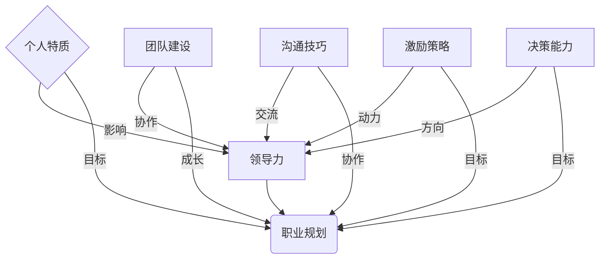

                 

# 领导力与职业规划：帮助团队成员成长

## 关键词
领导力、职业规划、团队成长、个人发展、实践案例

## 摘要
本文旨在探讨领导力与职业规划在IT领域的重要性，以及如何通过有效的领导力和职业规划来帮助团队成员实现个人成长和职业发展。文章从核心概念出发，详细分析了领导力和职业规划的关系，提出了相关的实践策略，并通过实际案例进行了深入解读，为读者提供了宝贵的参考。

### 第一部分：领导力与职业规划概述

#### 第1章：领导力与职业规划核心概念

##### 1.1 领导力的定义与重要性

领导力是指影响和激励他人一起实现目标的能力。在IT领域，领导力不仅仅是一种管理技能，更是一种激励团队成员共同进步的动力。有效的领导力能够提升团队绩效，促进组织目标的实现，并增强员工满意度和忠诚度。

**领导力定义**：
领导力是一种复杂的能力集合，包括个人特质、行为和策略。这些特质和行为可以归纳为以下几个方面：

- **个人特质**：自信、正直、开放性、责任感和灵活性。
- **行为**：沟通、决策、激励、团队建设、冲突管理和变革领导。
- **策略**：制定愿景、设定目标、资源分配、绩效评估和领导风格选择。

**领导力的重要性**：
1. **提高团队绩效**：有效的领导力可以激发团队成员的潜力，提高工作效率和质量。
2. **实现组织目标**：领导力确保团队朝着正确的方向努力，从而实现组织的目标和战略。
3. **增强员工满意度和忠诚度**：领导力通过激励和关注员工的成长，提升员工的职业满意度和忠诚度。

##### 1.2 职业规划的概念与目标

职业规划是指为实现职业生涯目标而制定的一系列行动策略。在IT领域，职业规划对于个人发展至关重要。它不仅帮助员工明确职业目标，还提供了一条清晰的发展路径。

**职业规划定义**：
职业规划是一个持续的过程，涉及以下几个方面：

- **职业目标**：明确个人在职业生涯中的长期和短期目标。
- **能力提升**：通过学习、培训和实践来提升自身的职业技能和素质。
- **职业机会评估**：评估不同职业机会的潜在价值和风险。
- **职业路径规划**：制定一个具体的职业发展路径，以实现职业目标。

**职业规划的目标**：
1. **明确个人职业发展方向**：通过职业规划，员工可以明确自己在职业生涯中的方向，避免盲目发展。
2. **提升个人职业素养和技能**：职业规划鼓励员工不断提升自身的能力，以适应不断变化的职场需求。
3. **实现个人价值和职业成就**：通过职业规划，员工可以更好地实现个人价值和职业目标，获得成就感。

##### 1.3 领导力与职业规划的内在联系

领导力和职业规划之间存在紧密的内在联系，它们相互促进，共同推动个人和团队的发展。

**相互促进**：
1. **领导力促进职业规划**：领导力通过激励、指导和支持，帮助员工更好地执行职业规划，实现职业目标。
2. **职业规划增强领导力**：职业规划为员工提供了清晰的发展路径和目标，使领导者在团队管理中更加有的放矢。

**核心概念与联系**：

下面是一个Mermaid流程图，展示领导力与职业规划的核心概念及其联系：



##### 1.4 领导力与职业规划的核心算法原理

**领导力模型**：

领导力可以通过以下公式来建模：

$$
领导力 = 影响力 \times 沟通力 \times 激励力 \times 决策力
$$

其中，每个因素都可以通过不同的策略和方法来提升。

**职业规划模型**：

职业规划可以表示为以下模型：

$$
职业规划 = 目标设定 + 能力提升 + 职业机会评估 + 职业路径规划
$$

这个模型强调目标设定、能力提升、职业机会评估和职业路径规划四个方面的综合作用。

##### 1.5 数学模型与公式

**目标函数**：

$$
目标函数 = \max\left(\frac{职业成就}{时间}\right)
$$

这个公式表示在给定的时间内，追求最大化的职业成就。

**能力提升模型**：

$$
能力提升 = 职业经验 \times 学习效率
$$

这个公式表示职业经验和学习效率对能力提升的影响。

##### 1.6 项目实战

**案例1：领导力提升项目**

**项目目标**：提升团队领导力。

**实施步骤**：
1. **领导力培训课程**：组织领导力培训课程，提升团队成员的领导能力。
2. **设定领导力提升目标**：为每个团队成员设定具体的领导力提升目标。
3. **定期评估领导力水平**：通过定期的评估和反馈，监测团队成员的领导力提升进度。
4. **提供个性化辅导和反馈**：根据评估结果，为团队成员提供个性化的辅导和反馈，帮助他们进一步改进。

**案例2：职业规划咨询**

**项目目标**：帮助员工制定个人职业规划。

**实施步骤**：
1. **职业兴趣和性格测试**：通过测试了解员工的职业兴趣和性格特点。
2. **分析职业市场趋势**：研究行业趋势和职业需求，为员工提供职业发展建议。
3. **设定职业目标**：与员工共同制定明确的职业目标。
4. **制定职业发展路径**：根据职业目标，制定具体的职业发展路径和计划。

##### 1.7 代码解读与分析

**Python代码示例：领导力评估**

```python
def evaluate_leadership(impact, communication, motivation, decision):
    leadership_score = impact * communication * motivation * decision
    return leadership_score
```

**代码解读**：
- `evaluate_leadership` 函数用于计算领导力评分。
- `impact`、`communication`、`motivation` 和 `decision` 分别代表影响力、沟通力、激励力和决策力。
- 返回值 `leadership_score` 是一个综合评分，反映了团队成员的领导力水平。

### 第二部分：领导力与职业规划实践

#### 第2章：领导力实践

##### 2.1 领导力发展与提升

**2.1.1 自我认知与发展**

自我认知是领导力发展的基础。领导者需要通过自我反思和评估来了解自己的领导力现状，并设定个人领导力发展目标。

**实施步骤**：
1. **自我反思**：定期进行自我反思，分析自己在领导力方面的优势和不足。
2. **领导力评估**：使用领导力评估工具和方法，如360度反馈，了解自己的领导力水平。
3. **设定发展目标**：根据评估结果，设定具体的领导力发展目标，如提高沟通能力或增强决策能力。

**2.1.2 团队建设与沟通**

团队建设是领导力的重要方面。领导者需要建立高效的团队沟通机制，促进团队成员之间的合作与信任。

**实施步骤**：
1. **建立沟通机制**：制定并实施定期会议、团队讨论和反馈机制，确保团队成员之间的有效沟通。
2. **培养信任**：通过共享信息、公开透明和公平对待，建立团队成员之间的信任。
3. **促进合作**：鼓励团队成员共同解决问题，分享资源和知识，增强团队合作精神。

##### 2.2 领导风格与影响力

**2.2.1 领导风格**

领导风格是指领导者在与团队成员互动时所采用的方式和策略。了解不同的领导风格，并选择适合团队和情境的领导风格，是提升领导力的重要一环。

**实施步骤**：
1. **了解不同领导风格**：研究不同的领导风格，如民主式、权威式、参与式等，并了解它们的特点和应用场景。
2. **选择适合的领导风格**：根据团队需求和情境，选择最适合的领导风格。例如，在团队面临紧急任务时，可能需要采取更加权威的领导风格。

**2.2.2 影响力策略**

领导者的影响力在于其能够激励和影响团队成员的行为和决策。提升影响力需要领导者具备个人魅力、专业知识和人际网络。

**实施步骤**：
1. **展现个人魅力**：通过自信、正直和热情，展现个人魅力，赢得团队成员的尊重和信任。
2. **提升专业知识**：不断学习和提升自己的专业能力，成为团队中的专家和权威。
3. **建立人际网络**：积极参与社交活动，建立和维护广泛的人际网络，以增强自己的影响力。

##### 2.3 决策能力与执行力

**2.3.1 决策模型**

决策能力是领导力的关键要素。领导者需要学习和应用不同的决策模型和方法，以提高决策质量和效率。

**实施步骤**：
1. **学习决策模型**：研究并了解常见的决策模型，如理性决策模型、群体决策模型等。
2. **应用决策方法**：在实际工作中，运用不同的决策方法，如SWOT分析、成本效益分析等，以提高决策质量。

**2.3.2 执行力提升**

执行力是指领导者将决策转化为行动的能力。提升执行力需要领导者设定明确的执行计划和目标，并提供必要的资源和支持。

**实施步骤**：
1. **设定执行计划**：明确决策的执行步骤、责任人和时间表。
2. **提供资源和支持**：为执行计划提供必要的资源，如人力、物力和财力。
3. **监督执行过程**：定期检查执行进度，及时调整和优化执行计划。

#### 第3章：职业规划实践

##### 3.1 职业规划方法论

**3.1.1 SWOT分析**

SWOT分析是一种常用的职业规划方法，用于分析个人的优势、劣势、机会和威胁。

**实施步骤**：
1. **分析优势**：识别个人的专业技能、知识和经验等方面的优势。
2. **分析劣势**：识别个人在职业发展中的不足和挑战。
3. **分析机会**：研究行业趋势和职业市场，识别可能的机会。
4. **分析威胁**：识别可能影响职业发展的外部威胁。

**3.1.2 职业路径规划**

职业路径规划是根据个人兴趣、能力和市场需求，制定具体的职业发展路径。

**实施步骤**：
1. **确定职业目标**：明确个人在职业生涯中的长期和短期目标。
2. **评估能力**：评估个人当前的能力水平，识别需要提升的技能。
3. **研究市场需求**：分析行业趋势和职业需求，了解不同职业的发展前景。
4. **制定职业路径**：根据目标和能力，制定具体的职业发展路径和计划。

##### 3.2 职业发展策略

**3.2.1 能力提升**

能力提升是职业规划的核心内容之一。通过学习、实践和反思，不断提升个人职业能力。

**实施步骤**：
1. **制定学习计划**：根据职业目标和需求，制定详细的学习计划。
2. **参加培训课程**：参加相关的培训课程，学习新知识和技能。
3. **实践经验**：通过实际工作或项目，将所学知识和技能应用到实践中。
4. **反思与总结**：定期进行反思和总结，评估学习效果，调整学习计划。

**3.2.2 职业网络建设**

职业网络是职业发展的重要资源。通过建立和维护职业关系网络，可以获取更多的职业机会和资源。

**实施步骤**：
1. **参加行业活动**：积极参加行业会议、研讨会等活动，拓展职业网络。
2. **建立联系**：主动与行业内的专业人士建立联系，保持沟通和互动。
3. **分享经验**：在职业网络中分享自己的经验和知识，建立良好的声誉。
4. **求助与帮助**：在需要时，向职业网络中的成员求助，并在可能时提供帮助。

##### 3.3 职业机会评估与选择

**3.3.1 市场趋势分析**

职业机会的选择需要考虑市场趋势和行业需求。通过分析市场趋势，可以更好地评估不同职业机会的潜在价值和风险。

**实施步骤**：
1. **研究行业趋势**：关注行业动态，了解新兴技术和市场需求。
2. **分析职业前景**：评估不同职业的发展前景和就业机会。
3. **评估个人匹配度**：分析个人技能和兴趣，评估与职业机会的匹配度。
4. **制定决策**：根据分析结果，做出合理的职业机会选择。

**3.3.2 职业机会选择**

选择合适的职业机会是职业规划的关键。通过综合考虑个人优势、市场需求和职业目标，做出明智的选择。

**实施步骤**：
1. **确定职业目标**：明确个人在职业生涯中的目标和期望。
2. **评估自身能力**：评估个人的技能和经验，确定适合自己的职业方向。
3. **研究职业市场**：了解不同职业的市场需求和就业前景。
4. **做出决策**：根据个人目标、能力和市场情况，做出明智的职业机会选择。

#### 第4章：团队管理与职业发展

##### 4.1 团队管理

**4.1.1 团队成员角色分配**

有效的团队管理需要明确团队成员的角色和职责，确保每个成员都了解自己的任务和期望。

**实施步骤**：
1. **识别团队成员的角色**：根据团队成员的技能和兴趣，确定他们在团队中的角色。
2. **分配任务和职责**：明确每个团队成员的任务和职责，确保他们了解自己的工作范围和目标。
3. **制定工作计划**：根据团队成员的角色和职责，制定详细的工作计划，确保任务的顺利执行。

**4.1.2 团队冲突管理**

团队冲突是团队管理中常见的问题。有效的冲突管理可以帮助团队保持和谐，提高工作效率。

**实施步骤**：
1. **识别冲突来源**：分析冲突的原因，如沟通不畅、任务分配不公或目标不一致。
2. **开展沟通**：通过开放和诚实的沟通，解决冲突，并确保所有团队成员都理解并接受解决方案。
3. **建立共识**：通过讨论和协商，达成共识，确保团队成员都能接受并遵守解决方案。

##### 4.2 职业发展支持

**4.2.1 培训与发展**

提供员工培训和发展机会是提升员工职业素养和技能的重要手段。

**实施步骤**：
1. **制定培训计划**：根据员工的职业目标和需求，制定详细的培训计划。
2. **提供培训资源**：为员工提供培训资源，如课程、教材和在线学习平台。
3. **监督培训效果**：定期评估培训效果，确保员工能够将所学知识和技能应用到实际工作中。

**4.2.2 职业发展指导**

提供个性化的职业发展指导和支持，可以帮助员工更好地实现职业目标。

**实施步骤**：
1. **评估员工需求**：了解员工的职业发展需求和目标。
2. **制定发展计划**：根据员工的需求和目标，制定个性化的职业发展计划。
3. **提供指导和支持**：为员工提供职业发展指导和支持，帮助他们克服职业发展中的困难和挑战。

#### 第5章：领导力与职业规划的实践案例分析

##### 5.1 提升领导力促进团队成长

**案例1**：某企业通过领导力培训提升团队领导力，从而实现团队绩效的提升。

**案例描述**：
- **背景**：该企业的团队在项目管理方面存在效率低下、沟通不畅和执行力不足的问题。
- **措施**：企业决定对团队进行领导力培训，包括沟通技巧、决策能力和团队建设等方面的培训。
- **结果**：经过一系列的领导力培训，团队的沟通效率显著提高，项目进度和质量得到明显改善，团队士气也有所提升。

**案例分析**：
- **领导力提升对团队绩效的影响**：领导力提升有助于提高团队的整体绩效，通过增强团队成员的沟通和协作能力，实现项目目标的顺利完成。
- **关键因素**：领导力提升的成功依赖于系统的培训计划、定期的评估和反馈，以及团队成员的积极参与和自我提升。

##### 5.2 职业规划助力职业发展

**案例2**：某员工通过制定详细的职业规划，实现了职业目标和职业成长。

**案例描述**：
- **背景**：该员工在职业生涯早期缺乏明确的职业规划，导致发展缓慢和职业满意度低。
- **措施**：员工决定制定详细的职业规划，包括设定职业目标、评估自身能力、学习新技能和拓展职业网络。
- **结果**：通过实施职业规划，员工不仅实现了职业目标的提升，还在短时间内获得了晋升和更高的薪酬。

**案例分析**：
- **职业规划对个人职业发展的影响**：职业规划为个人提供了清晰的发展路径和目标，有助于提升职业素养和技能，增加职业满意度和忠诚度。
- **关键因素**：职业规划的成功依赖于对自身能力的准确评估、持续的学习和反思，以及积极寻求职业机会和拓展职业网络。

#### 第6章：领导力与职业规划的个人反思与成长

##### 6.1 个人领导力反思

个人领导力的反思是提升领导力的重要步骤。通过反思自身的领导力实践，可以发现成功和不足，并制定改进计划。

**实施步骤**：
1. **记录领导力实践**：详细记录自己在领导力实践中的行为和决策。
2. **反思成功与不足**：分析自己在领导力实践中的成功经验和不足之处，思考原因和改进方法。
3. **制定改进计划**：根据反思结果，制定具体的改进计划，如提高沟通技巧、增强决策能力等。

##### 6.2 职业规划的个人成长

职业规划的个人成长记录可以帮助员工了解自己的发展过程，反思成果和不足，并持续改进。

**实施步骤**：
1. **记录职业规划实施过程**：详细记录职业规划实施过程中的关键事件和行动。
2. **反思职业规划成果**：分析职业规划实施的结果，包括职业目标的实现情况和自身能力的提升。
3. **总结经验与教训**：总结职业规划实施过程中的成功经验和教训，为未来的职业发展提供指导。

#### 第7章：领导力与职业规划的未来趋势与展望

##### 7.1 领导力的未来趋势

随着科技的不断进步和职场环境的变化，领导力也在不断演变。未来领导力的趋势包括：

- **数字化领导力**：领导者需要具备数字时代的领导能力，如数据驱动决策、数字化转型和管理。
- **多元化领导力**：领导者需要理解并尊重多元文化的差异，提升团队多样性和包容性。
- **可持续发展领导力**：领导者需要关注环境保护和社会责任，推动可持续发展和企业社会责任。

##### 7.2 职业规划的未来趋势

职业规划的未来趋势将受到终身学习、职业灵活性和技术变革的影响。未来职业规划的趋势包括：

- **终身学习**：职业规划将更加注重终身学习，以适应快速变化的职场需求。
- **职业灵活性**：职业规划将更加注重职业灵活性，包括多职业选择、灵活的工作时间和远程工作。
- **个性化职业规划**：职业规划将更加注重个性化，根据个人的兴趣、价值观和能力制定定制化的职业发展路径。

### 附录

#### 附录A：领导力与职业规划工具与资源

- **A.1 领导力评估工具**
  - **360度反馈**：通过团队成员、上级和同事的反馈，全面评估领导力水平。
  - **领导力量表**：如MLQ（Multifactor Leadership Questionnaire），用于评估领导力的多个维度。

- **A.2 职业规划资源**
  - **职业规划书籍**：《职业规划：成功路径的指南》、《职业发展：成功策略与技巧》。
  - **在线职业规划工具**：如LinkedIn Learning、Coursera等在线教育平台，提供职业规划和技能提升课程。

## 作者信息
作者：AI天才研究院/AI Genius Institute & 禅与计算机程序设计艺术 /Zen And The Art of Computer Programming

