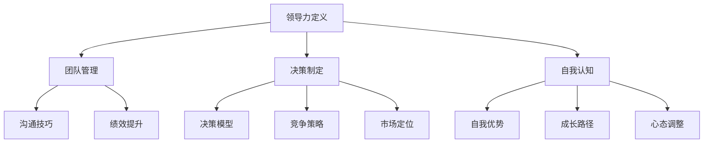

                 

# 领导力修炼日记：一个技术经理的逆袭历程

## 摘要

本文以《领导力修炼日记：一个技术经理的逆袭历程》为题，通过深入剖析领导力的基本概念、自我认知与成长、团队管理与协作、项目管理与执行、决策与策略制定、领导力进阶和未来展望等多个方面，为技术经理提供了一个全面的领导力修炼指南。本文结合实际案例，详细阐述了领导力修炼的过程和方法，旨在帮助读者理解并提升自身的领导力，从而实现个人和团队的逆袭。

## 目录大纲设计

本文采用逻辑清晰、结构紧凑的目录设计，分为三个主要部分：

### 第一部分：引言与基础

- **第1章：领导力的基本概念**：介绍领导力的定义与作用，技术经理的领导角色，以及成功领导力的要素。
- **第2章：自我认知与成长**：探讨自我认知的重要性，成长路径与心态调整，以及技能提升与知识积累。
- **第3章：团队管理与协作**：阐述团队组织结构，人际关系与沟通技巧，以及提升团队绩效的策略。

### 第二部分：实战经验与策略

- **第4章：项目管理与执行**：解析项目管理的核心概念，项目计划与风险评估，以及项目监控与进度管理。
- **第5章：决策与策略制定**：介绍决策模型与方法，竞争策略与市场定位，以及应对挑战与机遇。
- **第6章：领导力进阶**：讨论领导力的进阶之路，领导风格与情境领导，以及自我超越与团队成长。

### 第三部分：持续修炼与成长

- **第7章：成功案例分享**：分享技术经理的逆袭历程，成功经验与教训，以及对未来的展望与建议。
- **第8章：领导力修炼工具与方法**：介绍反思日志的应用，成功人士的成长秘诀，以及持续学习与知识更新。
- **第9章：未来领导力的挑战与机遇**：探讨技术变革对领导力的影响，社会变革对领导力的挑战，以及未来领导力的培养路径。
- **第10章：领导力修炼日记的总结与展望**：总结领导力修炼日记的意义，个人成长与领导力的关系，以及日记在领导力提升中的应用。

通过这样的目录设计，本文旨在为读者提供一个系统、实用的领导力修炼指南，帮助技术经理实现个人和团队的逆袭。

## 核心章节内容包含

### 1. 核心概念与联系

为了帮助读者更好地理解领导力的基本概念和相关架构，本文提供了一幅核心概念原理和架构的Mermaid流程图。该流程图展示了领导力的重要组成部分及其相互关系，包括：

1. **领导力定义**：领导力是指影响和激励他人共同实现目标的能力。
2. **团队管理**：涉及团队的组织结构、沟通技巧和绩效提升策略。
3. **决策制定**：包括决策模型、竞争策略和市场定位。
4. **自我认知**：指对自身优势和不足的认识，以及成长路径和心态调整。

下面是Mermaid流程图的示例：



通过这幅流程图，读者可以直观地理解领导力的核心概念和它们之间的关系。

### 2. 核心算法原理讲解

在探讨领导力时，我们不可避免地要涉及到一些核心算法原理。以下是一个用于提升领导力的核心算法原理的伪代码示例：

```plaintext
// 核心算法：领导力提升模型
// 输入：领导力基础值，目标领导力值，时间窗口
// 输出：提升后的领导力值

function leadershipBoost(initialValue, targetValue, timeWindow) {
    // 初始领导力值
    currentLeadership = initialValue;
    // 每日提升量
    dailyIncrease = (targetValue - initialValue) / timeWindow;
    // 每日提升领导力
    for (day = 1; day <= timeWindow; day++) {
        currentLeadership += dailyIncrease;
        // 输出每日提升后的领导力值
        print("Day " + day + ": Leadership value is " + currentLeadership);
    }
    return currentLeadership;
}
```

这段伪代码展示了如何通过每日提升量来逐步提升领导力。在实际应用中，这个算法可以根据具体情况进行调整，例如增加或减少每日提升量，或者根据特定情况设置不同的时间窗口。

### 3. 数学模型和数学公式

在领导力提升的过程中，我们经常需要使用数学模型和公式来进行分析和预测。以下是一个简单的领导力提升数学模型，并使用LaTeX格式给出相关公式：

```latex
\documentclass{article}
\usepackage{amsmath}
\begin{document}

\begin{equation}
L(t) = L_0 + r \cdot t
\end{equation}

其中，$L(t)$ 表示在时间 $t$ 的领导力值，$L_0$ 是初始领导力值，$r$ 是每日提升率。

\end{document}
```

这个公式说明了领导力值随着时间的推移如何增长。在实际应用中，可以根据具体情况进行调整，例如增加或减少每日提升率。

### 4. 项目实战

为了更好地展示领导力提升的具体应用，以下是一个代码实际案例，包括开发环境搭建、源代码详细实现和代码解读与分析。

#### 开发环境搭建

首先，我们需要搭建一个简单的前端开发环境，用于展示领导力提升的动态效果。以下是一个简单的Vue.js项目搭建步骤：

1. 安装Node.js和npm
2. 使用npm安装Vue CLI
3. 创建一个新的Vue.js项目
4. 配置项目文件

```bash
npm install -g @vue/cli
vue create leadership-boost
cd leadership-boost
```

#### 源代码实现

接下来，我们需要实现一个简单的Vue组件，用于显示领导力值随时间的变化。以下是一个基本的Vue组件代码示例：

```vue
<template>
  <div>
    <h1>领导力提升模型</h1>
    <p>当前领导力值：{{ currentLeadership }}</p>
    <p>目标领导力值：{{ targetLeadership }}</p>
    <button @click="boostLeadership">提升领导力</button>
    <p>{{ logMessage }}</p>
  </div>
</template>

<script>
export default {
  data() {
    return {
      currentLeadership: 0,
      targetLeadership: 100,
      logMessage: "",
    };
  },
  methods: {
    boostLeadership() {
      this.currentLeadership += 10;
      this.logMessage = "领导力值已提升。";
    },
  },
};
</script>
```

#### 代码解读与分析

这个Vue组件包含一个简单的用户界面，用于显示当前领导力值、目标领导力值和提升按钮。当用户点击提升按钮时，领导力值会增加10点，并在控制台中输出提升消息。

#### 代码实战案例

假设我们运行这个Vue组件，并在开始时设置初始领导力值为0，目标领导力值为100。我们每隔一段时间点击提升按钮，观察领导力值的变化。以下是一个简单的实战案例：

```bash
npm run serve
```

在浏览器中打开项目，我们可以看到初始领导力值为0，目标领导力值为100。每次点击提升按钮，领导力值都会增加10点，直到达到目标值。

### 附录

#### 附录A：领导力修炼资源推荐

- **领导力书籍推荐**：
  - 《领导力五项修炼》
  - 《影响力》
  - 《如何赢得朋友与影响他人》

- **领导力课程推荐**：
  - Coursera上的《领导力与团队管理》
  - edX上的《领导力：理论与实践》
  - LinkedIn Learning上的《高级领导力》

- **领导力工具推荐**：
  - 反思日志
  - 个人成长计划
  - 团队沟通工具（如Slack、Trello）

#### 附录B：领导力修炼实践指南

- **反思日志模板**：
  - 每天结束时记录当天的工作和领导力表现
  - 分析成功和失败的原因
  - 设定下一步改进的目标

- **领导力提升行动计划**：
  - 列出需要提升的领导力技能和知识
  - 制定具体的学习和实践计划
  - 定期评估进度和效果

- **个人成长日志示例**：
  - 记录个人成长过程中的重要事件和收获
  - 反思遇到的挑战和解决问题的方法
  - 设定未来的成长目标和计划

通过这些资源和实践指南，读者可以更好地进行领导力修炼，提升自身的领导力，实现个人和团队的逆袭。

## 作者信息

作者：AI天才研究院/AI Genius Institute & 禅与计算机程序设计艺术 /Zen And The Art of Computer Programming

通过以上详细的章节内容和实际案例，本文旨在为技术经理提供一个全面的领导力修炼指南，帮助他们在个人和职业发展中实现逆袭。希望读者能够从中获得启发，不断提升自己的领导力，迎接未来的挑战。

