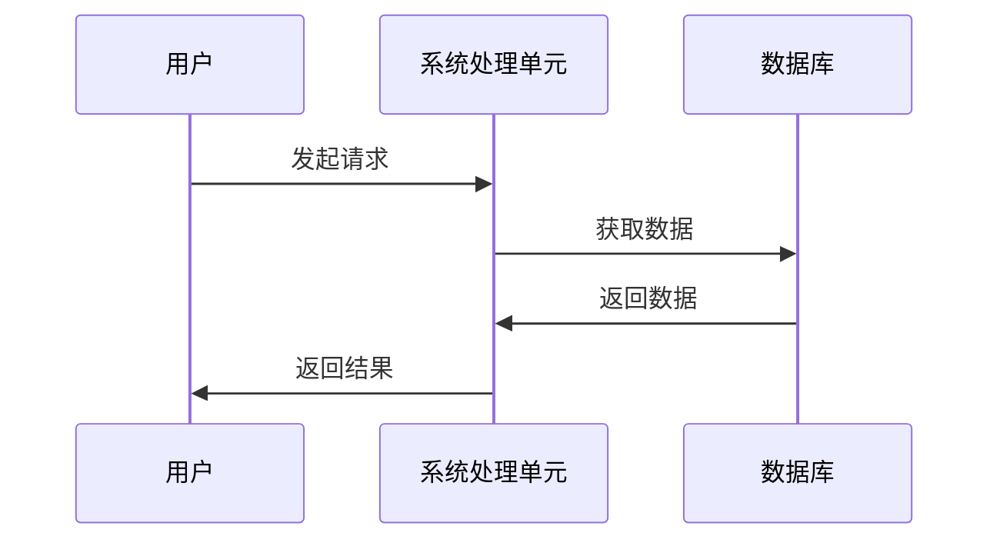

                 

# 高扩展性系统设计的实例分析

## 摘要

本文旨在探讨高扩展性系统设计的理论与实践，通过实例分析电商系统、社交媒体平台和金融系统等场景，深入剖析高扩展性系统设计的关键原则、架构设计与实现细节，以及性能优化和监控策略。文章将结合实际项目案例，详细解读代码实现和性能优化方法，帮助读者全面理解高扩展性系统设计的核心概念和最佳实践。通过本文的阅读，读者将能够掌握高扩展性系统设计的要领，为实际项目提供有价值的参考和指导。

## 关键词

高扩展性系统设计，分布式架构，负载均衡，性能优化，电商系统，社交媒体平台，金融系统

### 目录

#### 第一部分：引言

1. **第1章：高扩展性系统设计概述**
   1.1 高扩展性系统的定义与重要性
   1.2 高扩展性系统设计的背景
   1.3 高扩展性系统设计的目标

2. **第2章：高扩展性系统架构设计基础**
   2.1 系统架构设计的基本原则
   2.2 高扩展性系统的核心原理
   2.3 高扩展性系统架构的演进过程

#### 第二部分：架构设计与核心原理

3. **第3章：电商系统的高扩展性设计**
   3.1 电商系统的扩展性需求分析
   3.2 电商系统的高扩展性架构设计
   3.3 电商系统的性能优化与监控

4. **第4章：社交媒体平台的高扩展性设计**
   4.1 社交媒体平台的扩展性挑战
   4.2 社交媒体平台的高扩展性架构
   4.3 社交媒体平台的负载均衡与容灾

5. **第5章：金融系统的安全性高扩展性设计**
   5.1 金融系统的高扩展性需求
   5.2 金融系统的扩展性架构设计
   5.3 金融系统的性能优化与风险管理

#### 第三部分：实例分析与最佳实践

6. **第6章：分布式系统与中间件技术**
   6.1 分布式系统的基本概念
   6.2 分布式中间件技术
   6.3 分布式系统的最佳实践

7. **第7章：容器化与微服务架构**
   7.1 容器化技术简介
   7.2 微服务架构设计
   7.3 容器化与微服务的集成

8. **第8章：高扩展性系统设计案例分析**
   8.1 案例背景与目标
   8.2 案例的系统架构设计
   8.3 案例的核心技术实现
   8.4 案例实施效果与总结

#### 第四部分：高扩展性系统设计的工具与技术

9. **第9章：高扩展性系统设计的发展趋势**
   9.1 新技术对高扩展性系统设计的影响
   9.2 高扩展性系统设计的发展方向
   9.3 高扩展性系统设计的未来挑战与机遇

#### 第五部分：案例分析

10. **第10章：高扩展性系统设计案例分析**
    10.1 案例背景与目标
    10.2 案例的系统架构设计
    10.3 案例的核心技术实现
    10.4 案例实施效果与总结

#### 第六部分：未来展望

11. **第11章：高扩展性系统设计的发展趋势**
    11.1 新技术对高扩展性系统设计的影响
    11.2 高扩展性系统设计的发展方向
    11.3 高扩展性系统设计的未来挑战与机遇

#### 第七部分：附录

12. **附录A：高扩展性系统设计常用工具与资源**
    12.1 常用开源框架与中间件
    12.2 容器化与微服务工具
    12.3 高扩展性系统设计参考资料与文献

### 高扩展性系统设计概述

在现代信息技术飞速发展的背景下，高扩展性系统设计已成为企业构建稳定、高效和可靠应用的关键。随着用户规模的不断扩大、业务量的剧增和数据量的爆炸式增长，传统的单体架构已经难以满足日益复杂的业务需求。因此，高扩展性系统设计应运而生，成为企业提升系统性能和用户体验的核心手段。

#### 1.1 高扩展性系统的定义与重要性

**高扩展性系统**，又称**弹性系统**，是指能够根据实际业务需求和负载情况，动态调整计算资源、存储资源和网络资源的系统。高扩展性系统设计的目标是确保系统在面临大规模并发访问和数据处理时，能够快速、高效地响应，同时保证系统的稳定性和可靠性。

**重要性**：高扩展性系统设计的重要性主要体现在以下几个方面：

1. **应对大规模并发访问**：在高并发场景下，系统需要能够快速响应，避免因资源不足导致的性能瓶颈和用户等待时间增加。

2. **支持业务增长**：随着业务的不断扩展，系统需要能够无缝升级和扩容，以满足不断增长的用户数量和业务需求。

3. **提高用户体验**：通过优化系统性能和响应速度，提升用户的使用体验，增加用户黏性和满意度。

4. **降低运营成本**：通过合理分配资源、自动化运维等手段，降低系统的运维成本，提高资源利用率。

#### 1.2 高扩展性系统设计的背景

随着互联网的普及和移动设备的普及，用户数量和业务规模呈现出爆炸式增长。传统单体架构的系统逐渐暴露出以下局限性：

1. **垂直扩展受限**：传统单体架构通过增加硬件资源（如更强大的服务器）来提高性能，但这种方法存在扩展成本高、扩展难度大的问题。

2. **性能瓶颈**：单体架构的集中式处理模式，容易导致单点故障和性能瓶颈，影响系统的稳定性和可靠性。

3. **维护困难**：随着系统规模的扩大，单体架构的系统代码耦合度高，维护和升级变得更加困难。

4. **弹性不足**：传统单体架构难以快速适应业务变化，无法在短时间内实现资源调整和扩展。

#### 1.3 高扩展性系统设计的目标

高扩展性系统设计的目标是构建一个具备以下特点的系统：

1. **模块化与解耦**：系统模块化设计，降低模块之间的依赖，提高系统的可维护性和可扩展性。

2. **分布式计算与存储**：通过分布式架构，实现计算资源和存储资源的横向扩展，提高系统的处理能力和存储容量。

3. **负载均衡**：通过负载均衡技术，将请求分配到多个节点上，避免单个节点过载，提高系统的并发处理能力。

4. **高可用性**：通过冗余设计和故障转移机制，确保系统在发生故障时能够快速恢复，保障系统的连续运行。

5. **性能优化**：通过缓存、数据库分片、读写分离等策略，提高系统的响应速度和处理效率。

6. **自动化与智能化**：利用自动化运维工具和智能化算法，实现系统的自动化部署、监控和优化。

通过实现上述目标，高扩展性系统设计能够满足现代业务需求，提升系统的性能和可靠性，为企业带来竞争优势。

### 高扩展性系统架构设计基础

高扩展性系统架构设计是构建高扩展性系统的关键环节。通过合理的架构设计，系统能够在面临大规模并发访问和数据处理时，保持高性能和稳定性。本节将介绍系统架构设计的基本原则、高扩展性系统的核心原理以及高扩展性系统架构的演进过程。

#### 2.1 系统架构设计的基本原则

系统架构设计的基本原则包括以下几个方面：

1. **模块化与解耦**：将系统划分为多个独立的模块，每个模块负责特定的功能，模块之间通过接口进行通信，降低模块之间的依赖，提高系统的可维护性和可扩展性。

2. **可扩展性与可维护性**：系统架构应具备良好的扩展性和维护性，能够方便地进行功能扩展和升级，同时确保系统的稳定性和可靠性。

3. **安全性与可靠性**：系统架构应设计具备足够的安全性和可靠性，通过冗余设计和故障转移机制，确保系统在发生故障时能够快速恢复。

4. **灵活性**：系统架构应具备灵活性，能够根据业务需求的变化，快速调整和优化系统配置。

5. **性能优化**：系统架构应考虑性能优化，通过缓存、数据库分片、读写分离等策略，提高系统的响应速度和处理效率。

6. **自动化与智能化**：利用自动化运维工具和智能化算法，实现系统的自动化部署、监控和优化，降低运维成本，提高系统稳定性。

#### 2.2 高扩展性系统的核心原理

高扩展性系统的核心原理包括以下几个方面：

1. **并发处理**：高扩展性系统具备强大的并发处理能力，能够同时处理大量请求，避免因资源不足导致的性能瓶颈。

2. **分布式计算与存储**：通过分布式架构，将计算和存储资源分散到多个节点上，实现横向扩展，提高系统的处理能力和存储容量。

3. **负载均衡**：通过负载均衡技术，将请求均匀分配到多个节点上，避免单个节点过载，提高系统的并发处理能力。

4. **数据库分片**：通过将数据库分片，将数据分散存储到多个节点上，提高数据库的读写性能和扩展性。

5. **缓存策略**：通过缓存策略，减少数据库查询次数，提高系统的响应速度。

6. **服务治理与监控**：通过服务治理和监控，实现对系统的实时监控和管理，及时发现和处理系统故障，确保系统的高可用性。

#### 2.3 高扩展性系统架构的演进过程

高扩展性系统架构的演进过程可以分为以下几个阶段：

1. **单体架构**：单体架构是最简单的系统架构，所有功能都集中在一个应用程序中。这种架构在系统规模较小时较为适用，但难以应对大规模并发访问和数据处理。

2. **分布式架构**：分布式架构通过将系统功能分散到多个节点上，实现计算和存储资源的横向扩展。分布式架构具有较高的并发处理能力和可扩展性，能够应对大规模并发访问和数据处理。

3. **微服务架构**：微服务架构是将系统功能划分为多个独立的微服务，每个微服务负责特定的功能。微服务架构具有更高的灵活性、可扩展性和可维护性，能够更好地应对复杂业务需求。

4. **云原生架构**：云原生架构是利用云计算平台提供的弹性计算和存储资源，构建高度自动化的系统架构。云原生架构具有高效性、灵活性和可扩展性，能够更好地满足现代业务需求。

5. **边缘计算架构**：边缘计算架构是将计算和存储资源部署在靠近数据源的边缘节点上，降低网络延迟，提高系统的响应速度和实时性。边缘计算架构适用于对实时性和低延迟要求较高的场景。

通过上述演进过程，高扩展性系统架构能够不断适应业务需求的变化，提高系统的性能和可靠性。在实际应用中，根据具体业务需求和场景，可以选择合适的架构类型，实现高扩展性系统设计。

### 电商系统的高扩展性设计

电商系统作为互联网行业的核心应用之一，面对着巨大的用户规模、海量的业务数据和频繁的并发访问。因此，电商系统的高扩展性设计至关重要。本节将分析电商系统的扩展性需求，并介绍其高扩展性架构设计，包括数据存储与分片、分布式服务架构和高并发处理等。

#### 3.1 电商系统的扩展性需求分析

电商系统的扩展性需求主要包括以下几个方面：

1. **用户规模扩展**：随着电商平台的不断发展，用户数量持续增长。系统需要能够支持数百万甚至数亿级别的用户，确保用户体验。

2. **业务量扩展**：电商业务涉及商品浏览、下单、支付、物流等环节，业务量巨大。系统需要能够处理每天数百万甚至数千万的订单，保证业务的连续性和稳定性。

3. **数据量扩展**：随着用户和业务量的增长，电商系统需要存储和管理的商品信息、订单信息、用户行为数据等数据量也在不断增加。系统需要能够支持大规模数据的存储和查询。

4. **并发访问扩展**：电商系统在高并发场景下，如双11、618等促销活动期间，会面临大量用户的并发访问。系统需要能够处理高并发的请求，避免因资源不足导致的服务中断。

#### 3.2 电商系统的高扩展性架构设计

为了满足电商系统的扩展性需求，设计一个高扩展性的系统架构至关重要。以下是一个典型的电商系统高扩展性架构设计：

##### 1. 数据存储与分片

电商系统的数据存储是整个系统架构的核心部分，其扩展性设计至关重要。为了支持海量数据的存储和高效查询，电商系统通常采用以下数据存储与分片策略：

1. **数据库分片**：将数据库分为多个分片，每个分片负责存储一部分数据。通过水平分片，将数据分散存储到多个节点上，提高数据库的读写性能和扩展性。

2. **数据分库**：根据业务特点，将不同的业务数据存储在独立的数据库中，如订单数据库、用户数据库、商品数据库等。通过分库，提高系统的数据管理效率，避免单库性能瓶颈。

3. **缓存策略**：使用缓存系统（如Redis）缓存频繁访问的热数据，减少数据库查询次数，提高系统的响应速度。

##### 2. 分布式服务架构

电商系统的分布式服务架构是实现高扩展性的关键。以下是一个典型的分布式服务架构设计：

1. **服务拆分**：将电商系统的功能拆分为多个独立的微服务，如用户服务、商品服务、订单服务、支付服务、物流服务等。每个微服务负责特定的业务功能，模块化设计，降低系统复杂性。

2. **服务注册与发现**：使用服务注册与发现机制（如Eureka、Consul），实现服务之间的动态发现和负载均衡。

3. **服务通信**：使用Restful API或消息队列（如RabbitMQ、Kafka）实现服务之间的通信，保证系统的松耦合。

##### 3. 高并发处理

电商系统在高并发场景下，需要具备强大的并发处理能力。以下是一些高并发处理策略：

1. **异步处理**：对于耗时的操作（如订单处理、支付处理），采用异步处理方式，将任务提交到消息队列，由消息队列处理，降低系统的响应时间。

2. **缓存预热**：在系统启动或高峰期前，预热缓存，将热门商品、热门订单等信息加载到缓存中，提高系统的访问速度。

3. **限流与降级**：使用限流（如令牌桶算法、漏桶算法）和降级策略（如熔断器、 gateway gateway），防止系统因大量请求涌入而崩溃。

4. **数据库读写分离**：将数据库拆分为读库和写库，读库负责处理查询操作，写库负责处理插入和更新操作。通过读写分离，提高数据库的并发处理能力。

#### 3.3 电商系统的性能优化与监控

为了确保电商系统的高性能和稳定性，需要进行以下性能优化和监控：

1. **缓存策略**：使用缓存系统（如Redis）缓存热门商品、订单信息等，减少数据库查询次数，提高系统的响应速度。

2. **数据库优化**：通过索引优化、SQL优化、数据库分片等技术，提高数据库的查询性能。

3. **服务优化**：对服务进行性能优化，如使用Nginx、Apache等负载均衡器，实现负载均衡，提高服务的并发处理能力。

4. **监控与预警**：使用Prometheus、Grafana等监控工具，实时监控系统的各项性能指标，如CPU使用率、内存使用率、数据库连接数等，及时发现和处理系统故障。

5. **自动化运维**：使用自动化运维工具（如Docker、Kubernetes），实现系统的自动化部署、扩容和监控，降低运维成本。

通过以上高扩展性架构设计、性能优化和监控，电商系统能够应对大规模并发访问和数据处理，保证系统的稳定性和可靠性，提升用户体验。

### 社交媒体平台的高扩展性设计

社交媒体平台作为互联网的重要应用之一，面对着海量用户数据、多样化的业务需求和高速增长的用户活跃度。因此，社交媒体平台的高扩展性设计至关重要。本节将分析社交媒体平台的扩展性挑战，并介绍其高扩展性架构设计，包括分布式消息队列、内容存储与检索以及数据库分库分表等。

#### 4.1 社交媒体平台的扩展性挑战

社交媒体平台在扩展性方面面临以下主要挑战：

1. **用户活跃度与数据量增长**：社交媒体平台拥有大量的活跃用户，每天产生海量的用户数据，如用户动态、评论、私信等。系统需要能够支持用户数以亿计的扩展，同时高效处理和存储这些数据。

2. **内容多样性扩展**：社交媒体平台的内容形式丰富多样，包括文本、图片、视频、直播等。系统需要能够支持各种类型的内容存储和检索，并保证不同类型内容之间的协同工作。

3. **实时性与一致性**：社交媒体平台需要提供实时性高的服务，如实时消息推送、实时内容更新等。同时，系统需要保证数据的一致性，确保用户在多个终端上看到的信息是一致的。

4. **高性能与高并发**：社交媒体平台在高峰期会面临大量用户的并发访问，系统需要能够处理高并发的请求，避免因资源不足导致的服务中断。

#### 4.2 社交媒体平台的高扩展性架构

为了应对社交媒体平台的扩展性挑战，设计一个高扩展性的系统架构至关重要。以下是一个典型的社交媒体平台高扩展性架构设计：

##### 1. 分布式消息队列

分布式消息队列在社交媒体平台中起到关键作用，用于处理高并发消息传输和任务调度。以下是一些分布式消息队列的设计要点：

1. **消息传输可靠性**：使用分布式消息队列（如Kafka、RabbitMQ）实现消息的可靠传输，确保消息不丢失。

2. **消息持久化**：将消息持久化到数据库或文件系统中，实现消息的持久存储，便于历史数据查询和恢复。

3. **负载均衡**：通过负载均衡器（如Nginx、HAProxy）实现消息队列服务的负载均衡，提高系统的并发处理能力。

4. **消息消费与处理**：使用分布式消费模型，将消息消费和业务处理分散到多个节点上，提高系统的并行处理能力。

##### 2. 内容存储与检索

内容存储与检索是社交媒体平台的核心功能之一，需要高效处理大量用户的多样化内容。以下是一些内容存储与检索的设计要点：

1. **分布式存储**：使用分布式存储系统（如HDFS、Cassandra）实现海量内容的存储和分布式访问，提高系统的存储容量和性能。

2. **索引与缓存**：建立全文索引和缓存系统（如Elasticsearch、Redis），提高内容的检索速度和查询性能。

3. **内容分片**：根据业务需求，将内容分片存储到多个节点上，实现横向扩展，提高系统的并发处理能力和存储容量。

4. **内容一致性**：通过分布式一致性算法（如Paxos、Raft），确保内容存储的一致性，避免数据丢失或重复。

##### 3. 数据库分库分表

社交媒体平台的数据量庞大，为了提高数据库的性能和扩展性，通常采用分库分表策略。以下是一些数据库分库分表的设计要点：

1. **分库策略**：根据业务特点，将不同类型的数据存储在独立的数据库中，如用户数据、动态数据、评论数据等。通过分库，提高数据库的管理效率，避免单库性能瓶颈。

2. **分表策略**：根据数据量和访问模式，将大表拆分为多个小表，如按时间、用户ID等维度进行分表。通过分表，提高数据库的查询性能和并行处理能力。

3. **数据迁移与同步**：实现数据库的迁移与同步，确保数据的一致性和完整性。

4. **数据库集群**：使用数据库集群技术（如MySQL Cluster、MongoDB Sharding），实现数据库的水平扩展，提高系统的存储容量和处理能力。

#### 4.3 社交媒体平台的负载均衡与容灾

社交媒体平台需要具备良好的负载均衡和容灾能力，以应对高并发访问和故障情况。以下是一些负载均衡与容灾的设计要点：

1. **负载均衡**：使用负载均衡器（如Nginx、HAProxy）实现服务之间的负载均衡，将请求分配到多个节点上，避免单个节点过载。

2. **反向代理**：使用反向代理服务器（如Nginx、Apache）提供HTTP服务，将客户端请求转发到后端服务器，提高系统的并发处理能力。

3. **缓存策略**：使用缓存系统（如Redis、Memcached）缓存热门内容和热点数据，降低对后端服务的访问压力。

4. **容灾备份**：实现数据的异地备份和容灾恢复机制，确保在发生故障时系统能够快速恢复。

5. **故障切换**：实现服务故障切换机制，当某台服务器或数据库发生故障时，自动切换到备用服务器或数据库，确保系统的连续运行。

通过以上高扩展性架构设计、负载均衡与容灾策略，社交媒体平台能够应对海量用户数据和高并发访问，保证系统的稳定性和可靠性，提升用户体验。

### 金融系统的安全性高扩展性设计

金融系统作为高可靠性、高安全性和高扩展性的关键应用之一，面临诸多挑战。本节将分析金融系统的高扩展性需求，并介绍其扩展性架构设计，包括分布式事务处理、数据加密与隐私保护以及安全审计与监控等。

#### 5.1 金融系统的高扩展性需求

金融系统在扩展性方面具有以下主要需求：

1. **用户账户扩展**：金融系统需要支持大规模的用户账户，包括个人和企业用户。系统需要具备高效的账户管理能力，支持用户账户的快速创建、查询和修改。

2. **业务交易量扩展**：金融系统的业务交易量巨大，如支付、转账、投资等。系统需要能够高效处理海量交易请求，保证交易的及时性和准确性。

3. **数据安全性与合规性**：金融系统涉及用户的敏感信息和金融交易数据，需要确保数据的安全性，防止数据泄露和篡改。同时，系统需要符合相关的法规和标准，如PCI-DSS等。

#### 5.2 金融系统的扩展性架构设计

为了满足金融系统的扩展性需求，设计一个高扩展性的系统架构至关重要。以下是一个典型的金融系统扩展性架构设计：

##### 1. 分布式事务处理

分布式事务处理是金融系统扩展性设计的关键，用于确保跨多个节点的事务一致性和数据完整性。以下是一些分布式事务处理的设计要点：

1. **分布式事务管理**：使用分布式事务管理器（如Seata、TCC），实现跨多个节点的分布式事务管理。通过两阶段提交协议（2PC）或三阶段提交协议（3PC），确保分布式事务的一致性。

2. **本地事务优化**：对于本地事务，优化数据库操作，减少事务锁的争用，提高事务的执行效率。

3. **消息驱动**：使用消息队列（如Kafka、RabbitMQ）实现分布式事务的消息驱动，将事务操作转化为消息处理，提高系统的并发处理能力和扩展性。

##### 2. 数据加密与隐私保护

数据加密与隐私保护是金融系统扩展性设计的重要方面，用于确保用户数据的安全性和隐私性。以下是一些数据加密与隐私保护的设计要点：

1. **数据加密**：使用加密算法（如AES、RSA），对存储和传输的数据进行加密，防止数据泄露和篡改。

2. **隐私保护**：实现数据脱敏技术，对用户敏感信息进行脱敏处理，确保用户隐私不被泄露。

3. **数据审计**：建立数据审计机制，记录用户数据的访问和操作记录，确保数据的可追溯性和可审计性。

##### 3. 安全审计与监控

安全审计与监控是金融系统扩展性设计的重要环节，用于确保系统的安全性和稳定性。以下是一些安全审计与监控的设计要点：

1. **日志记录**：实现系统日志记录，记录用户的登录、操作、异常等信息，确保日志的可追溯性和可审计性。

2. **安全告警**：建立安全告警机制，实时监控系统的安全事件，如DDoS攻击、SQL注入等，及时发现和处理安全威胁。

3. **安全策略**：制定安全策略，包括访问控制、权限管理、安全认证等，确保系统的安全性和合规性。

#### 5.3 金融系统的性能优化与风险管理

为了确保金融系统的性能和稳定性，需要进行以下性能优化与风险管理：

1. **流量控制与限流**：使用流量控制（如令牌桶算法、漏桶算法）和限流策略（如Spring Cloud Gateway、Sentinel），防止系统因大量请求涌入而崩溃。

2. **数据库优化**：通过索引优化、SQL优化、数据库分片等技术，提高数据库的查询性能和处理能力。

3. **缓存策略**：使用缓存系统（如Redis、Memcached）缓存高频访问的数据，减少数据库查询次数，提高系统的响应速度。

4. **负载均衡**：使用负载均衡器（如Nginx、HAProxy）实现服务之间的负载均衡，提高系统的并发处理能力。

5. **风险管理**：建立风险管理机制，包括风险评估、预警机制、应急预案等，确保系统在面对风险时能够快速响应和恢复。

通过以上扩展性架构设计、性能优化与风险管理，金融系统能够满足高扩展性需求，确保系统的稳定性、安全性和可靠性，为用户提供优质的服务。

### 分布式系统与中间件技术

分布式系统作为一种能够跨多个节点协同工作的系统架构，在现代IT行业中扮演着越来越重要的角色。分布式系统通过将计算和存储资源分散到多个节点上，提高了系统的性能、可用性和扩展性。中间件作为分布式系统中的重要组成部分，提供了数据传输、负载均衡、服务治理等功能，使得分布式系统的构建和维护变得更加高效。本节将介绍分布式系统的基本概念、分布式中间件技术以及分布式系统的最佳实践。

#### 6.1 分布式系统的基本概念

**定义**：分布式系统是由多个独立节点通过通信网络连接组成的系统，这些节点共同完成计算和存储任务，对外提供统一的接口。

**优势**：
- **高性能**：通过将任务分散到多个节点上，分布式系统能够并行处理大量请求，提高系统整体性能。
- **高可用性**：通过节点冗余和故障转移机制，分布式系统在发生故障时能够快速恢复，确保系统持续运行。
- **可扩展性**：分布式系统能够通过添加节点来水平扩展，适应不断增长的业务需求。

**挑战**：
- **一致性**：分布式系统中的节点可能处于不同的状态，如何确保所有节点之间的数据一致性是一个重要问题。
- **容错性**：如何检测和处理节点故障，确保系统的高可用性。
- **通信复杂性**：分布式系统中节点之间的通信复杂，如何高效传输数据和同步状态。

**架构**：
- **客户端-服务器架构**：客户端发送请求到服务器，服务器处理请求并返回结果。
- **对等网络架构**：节点之间平等地参与计算和存储任务，没有明显的客户端和服务器之分。

#### 6.2 分布式中间件技术

分布式中间件是分布式系统中的关键组件，提供了数据传输、负载均衡、服务治理等功能。以下是一些常见的分布式中间件技术：

1. **数据传输中间件**：
   - **消息队列**：如Kafka、RabbitMQ、RocketMQ，用于异步消息传递和任务调度。
   - **分布式数据库**：如MySQL Cluster、Cassandra、MongoDB Sharding，提供分布式数据存储和查询能力。

2. **负载均衡中间件**：
   - **反向代理**：如Nginx、HAProxy，用于分发请求到后端服务器，提高系统的并发处理能力。
   - **负载均衡器**：如Elasticsearch、Zookeeper，提供服务发现和负载均衡功能。

3. **服务治理与监控**：
   - **服务注册与发现**：如Consul、Eureka，用于服务实例的注册和动态发现。
   - **监控工具**：如Prometheus、Grafana，提供系统性能监控和可视化。

4. **分布式缓存**：
   - **Redis**：提供高性能的分布式缓存解决方案。
   - **Memcached**：提供基于内存的分布式缓存系统。

5. **分布式事务管理**：
   - **Seata**：支持分布式事务管理，提供两阶段提交协议。
   - **TCC**：提供补偿事务机制，简化分布式事务处理。

#### 6.3 分布式系统的最佳实践

在实际构建分布式系统时，遵循以下最佳实践能够提高系统的可靠性和可维护性：

1. **模块化与解耦**：将系统功能模块化，降低模块之间的依赖，提高系统的可维护性和可扩展性。

2. **数据一致性**：选择合适的一致性模型（如CAP定理），确保系统在面对网络分区和节点故障时能够保持数据一致性。

3. **容错性与故障转移**：设计容错机制，确保在节点故障时系统能够自动切换到备用节点，保证服务的持续运行。

4. **负载均衡**：合理分配负载，避免单点过载，提高系统的并发处理能力和响应速度。

5. **服务治理与监控**：建立服务治理和监控机制，实时监控系统性能和状态，及时发现和处理异常。

6. **自动化运维**：使用自动化工具（如Docker、Kubernetes）实现系统的自动化部署、扩容和监控，降低运维成本。

通过遵循这些最佳实践，分布式系统能够更好地应对现代业务需求，确保系统的稳定性和可靠性。

### 容器化与微服务架构

随着云计算和容器技术的快速发展，容器化和微服务架构已成为现代应用系统设计的重要方向。容器化通过将应用程序及其依赖环境封装在一个独立的容器中，实现了应用环境的标准化和轻量化，而微服务架构则通过将应用拆分为多个独立的小服务，实现了系统的高内聚、低耦合和高扩展性。本节将介绍容器化技术、微服务架构以及容器化与微服务的集成，探讨容器化在微服务中的应用和优化。

#### 7.1 容器化技术简介

**定义**：容器是一种轻量级、可移植的独立运行环境，它将应用程序及其依赖环境（如操作系统、库、配置文件等）封装在一起，以独立的容器镜像形式存储。

**优势**：
- **环境一致性**：通过容器，开发、测试和生产环境保持一致，避免了“环境不一致”导致的问题。
- **快速部署**：容器化应用程序可以在任何支持容器引擎的硬件或云平台上快速部署，提高了部署效率。
- **资源利用率**：容器利用宿主机的操作系统内核，实现了高效的资源利用，比虚拟机具有更高的性能。

**基本概念**：
- **Docker**：最流行的容器化平台，通过Dockerfile定义容器镜像，通过Docker Compose编排容器服务。
- **容器镜像**：存储应用程序及其依赖环境的静态文件系统，通过Dockerfile构建。
- **容器编排**：通过Kubernetes、Docker Swarm等工具管理容器集群，实现容器的自动化部署、扩缩容和负载均衡。

**容器运行时**：
- **CRI-O**：Open Container Initiative（OCI）定义的容器运行时标准，支持使用runc等工具执行容器操作。
- **containerd**：由Docker Foundation主导的容器运行时，提供容器镜像管理和容器运行功能。

#### 7.2 微服务架构设计

**定义**：微服务架构将一个大型应用程序拆分为多个独立的小服务，每个服务实现特定的业务功能，通过轻量级通信机制（如HTTP/HTTPS、消息队列等）相互协作。

**优势**：
- **高内聚、低耦合**：每个服务独立开发、部署和维护，降低了系统的复杂性和依赖性。
- **高扩展性**：通过水平扩展单个服务实例，提高了系统的并发处理能力和弹性。
- **快速迭代和部署**：服务之间解耦，单个服务的更新和部署不会影响其他服务，提高了开发效率和系统的稳定性。

**设计原则**：
- **单一职责**：每个服务只负责一项业务功能，降低服务的复杂性。
- **自治**：每个服务拥有自己的数据存储、处理逻辑和API，独立运行和管理。
- **异步通信**：使用消息队列等异步通信机制，提高系统的解耦性和可扩展性。

**服务治理**：
- **服务注册与发现**：使用Eureka、Consul等服务注册与发现机制，实现服务的动态注册和发现。
- **服务监控与日志**：使用Prometheus、Grafana等监控工具，实时监控服务的性能和状态，使用ELK（Elasticsearch、Logstash、Kibana）进行日志管理。

**部署与运维**：
- **容器化部署**：使用Docker将服务打包成容器镜像，通过Kubernetes进行容器编排和部署。
- **持续集成与持续部署（CI/CD）**：使用Jenkins、GitLab CI等工具实现自动化构建、测试和部署。

#### 7.3 容器化与微服务的集成

容器化与微服务架构的结合，使得应用系统的开发、部署和运维变得更加高效和灵活。以下是如何在微服务架构中应用容器化技术的一些关键点：

**容器化在微服务中的应用**：
- **容器镜像**：将微服务打包成容器镜像，确保服务在不同环境中的运行一致性。
- **容器编排**：使用Kubernetes等容器编排工具，实现服务的自动化部署、扩缩容和负载均衡。
- **服务网格**：使用Istio、Linkerd等服务网格，提供微服务之间的安全通信和流量管理。

**容器化与微服务的优化**：
- **资源隔离与优化**：通过cgroups和namespace等内核特性，实现容器资源隔离和优化，提高资源利用率。
- **网络优化**：使用Service Mesh实现服务间的高效通信，通过虚拟网络和负载均衡策略优化网络性能。
- **持续集成与持续部署**：利用CI/CD流水线，实现微服务的自动化构建、测试和部署，提高开发效率和系统的稳定性。

通过容器化与微服务架构的结合，应用系统能够更好地应对现代业务需求，提高系统的性能、可靠性和可维护性。

### 高扩展性系统设计案例分析

为了更好地理解高扩展性系统设计的具体实施过程，本节将通过一个实际案例——某电商平台的系统架构设计与实现，详细分析该平台在高扩展性系统设计方面的具体做法。

#### 8.1 案例背景与目标

该电商平台是一家大型在线购物平台，拥有数百万的活跃用户和庞大的商品库。为了满足不断增长的业务需求，该平台决定进行系统升级，实现高扩展性设计，以提高系统的性能、可靠性和用户体验。

**案例背景**：
- **用户规模**：数百万活跃用户，每天新增用户数万级。
- **业务量**：每日交易量数十万次，涉及商品浏览、下单、支付、物流等环节。
- **数据量**：商品数据、订单数据、用户行为数据等海量数据，每日新增数据数百万条。

**目标**：
- **高并发处理**：支持数百万级别的用户并发访问，确保系统在高并发情况下稳定运行。
- **横向扩展**：通过分布式架构和容器化技术，实现系统的横向扩展，满足业务增长需求。
- **性能优化**：通过缓存、数据库分片、读写分离等策略，提高系统的响应速度和处理效率。
- **安全性**：确保用户数据和交易数据的安全性和隐私性。

#### 8.2 案例的系统架构设计

为了实现上述目标，该电商平台采用了分布式架构和容器化技术，设计了以下系统架构：

##### 1. 数据存储与分片

**数据库分片**：
- **订单数据库**：采用水平分片，根据订单ID或用户ID将订单数据分布到多个分片上，确保每个分片的数据量可控，提高查询效率。
- **商品数据库**：采用垂直分片，将商品数据拆分为基础信息和属性信息两个分片，分别存储在不同数据库中，减少单表的数据量。

**缓存策略**：
- **Redis**：缓存用户浏览记录、购物车信息等高频访问数据，减少数据库查询次数，提高系统响应速度。

**分布式缓存**：
- **Memcached**：缓存系统中的热点数据，如商品分类、广告信息等，提高缓存系统的整体性能。

##### 2. 分布式服务架构

**服务拆分**：
- **用户服务**：负责用户信息管理、登录认证等。
- **商品服务**：负责商品信息管理、商品分类等。
- **订单服务**：负责订单处理、订单查询等。
- **支付服务**：负责支付处理、支付结果通知等。
- **物流服务**：负责物流跟踪、快递查询等。

**服务治理**：
- **注册与发现**：使用Consul实现服务的动态注册与发现，确保服务之间能够高效通信。
- **负载均衡**：使用Nginx作为负载均衡器，实现请求的动态分发，提高系统的并发处理能力。

##### 3. 高并发处理

**异步处理**：
- **消息队列**：使用Kafka作为消息队列，处理高并发场景下的订单创建、支付通知等任务，实现异步处理，降低系统的负载。

**数据库读写分离**：
- **读库**：使用多个读库分担查询请求，提高查询效率。
- **写库**：将订单创建、支付等写操作集中到一个写库上，确保数据一致性。

**缓存预热**：
- **热点数据预热**：在系统启动或高峰期前，预热缓存，将热门商品、热门订单等信息加载到缓存中，提高系统的访问速度。

##### 4. 性能优化

**缓存策略**：
- **Redis缓存**：缓存用户浏览记录、购物车信息等高频访问数据，减少数据库查询次数。
- **Memcached缓存**：缓存系统中的热点数据，如商品分类、广告信息等。

**数据库优化**：
- **索引优化**：为常用查询字段建立索引，提高查询效率。
- **读写分离**：通过读写分离策略，提高数据库的并发处理能力。

**网络优化**：
- **负载均衡**：使用Nginx进行负载均衡，实现请求的动态分发，降低单个节点的负载。

#### 8.3 案例的核心技术实现

**容器化技术**：
- **Docker**：使用Docker将服务打包成容器镜像，确保服务在不同环境中的运行一致性。
- **Kubernetes**：使用Kubernetes进行容器编排，实现服务的自动化部署、扩缩容和负载均衡。

**微服务架构**：
- **Spring Boot**：使用Spring Boot开发微服务，简化服务开发过程。
- **RESTful API**：使用RESTful API实现服务之间的通信，确保服务的松耦合。

**消息队列**：
- **Kafka**：使用Kafka作为消息队列，处理高并发场景下的订单创建、支付通知等任务。

**缓存系统**：
- **Redis**：使用Redis缓存高频访问数据，提高系统响应速度。
- **Memcached**：使用Memcached缓存系统中的热点数据。

#### 8.4 案例实施效果与总结

**实施效果**：
- **高并发处理**：通过分布式架构和容器化技术，系统成功支持了数百万级别的用户并发访问，实现了高效的处理能力和稳定性。
- **性能优化**：通过缓存、数据库分片、读写分离等策略，系统响应速度和处理效率得到了显著提升，用户满意度提高。
- **安全性**：通过数据加密、权限控制等手段，确保用户数据和交易数据的安全性和隐私性。

**经验与教训总结**：
- **分布式架构**：分布式架构能够有效提高系统的性能和可靠性，但在设计和实施过程中需要充分考虑一致性、容错性和通信复杂性等问题。
- **微服务架构**：微服务架构提高了系统的可维护性和可扩展性，但需要合理划分服务边界，避免过度的服务拆分。
- **性能优化**：性能优化需要综合考虑系统各个层面的优化策略，如缓存、数据库优化、网络优化等，以达到最佳效果。
- **自动化运维**：自动化运维工具和流程能够显著提高系统的部署和运维效率，降低运维成本。

**案例启示与应用**：
- 本案例展示了如何通过分布式架构和容器化技术实现电商系统的高扩展性设计，为其他高并发、大数据量的系统提供了有益的参考。
- 在实际项目中，需要根据业务需求和场景，灵活运用分布式架构、微服务架构、缓存策略、数据库优化等技术，实现系统的性能优化和高可用性。

### 高扩展性系统设计的发展趋势

随着云计算、大数据、人工智能等新技术的不断发展，高扩展性系统设计也在不断演进。未来的高扩展性系统设计将更加注重智能化、自动化和边缘计算等方向。以下将探讨新技术对高扩展性系统设计的影响、高扩展性系统设计的发展方向以及未来面临的挑战与机遇。

#### 9.1 新技术对高扩展性系统设计的影响

1. **云计算**：云计算提供了弹性计算和存储资源，使得高扩展性系统设计更加容易实现。通过云平台，系统可以根据业务需求动态调整资源，实现横向和纵向的扩展。同时，云计算还提供了丰富的服务（如数据库、缓存、存储等），简化了系统设计。

2. **大数据**：大数据技术的快速发展为高扩展性系统设计提供了强有力的支持。通过分布式计算框架（如Hadoop、Spark），系统可以高效处理海量数据，实现实时数据处理和分析。大数据技术还促进了数据驱动的系统优化，使得系统能够根据数据反馈进行自我调整和优化。

3. **人工智能**：人工智能（AI）技术正在深刻改变高扩展性系统设计。通过机器学习和深度学习算法，系统可以自动识别和预测用户行为，优化资源分配和任务调度。例如，智能负载均衡器可以根据流量模式和预测结果，动态调整服务器的负载，提高系统的性能和稳定性。

4. **区块链**：区块链技术具有去中心化、不可篡改等特点，可以用于构建高扩展性系统。通过区块链，系统可以实现数据的可信存储和传输，提高系统的安全性和透明度。此外，区块链还可以用于实现去中心化的服务，如智能合约，进一步提高系统的灵活性和扩展性。

#### 9.2 高扩展性系统设计的发展方向

1. **自动化与智能化**：未来的高扩展性系统设计将更加注重自动化和智能化。通过自动化工具和智能化算法，系统可以自动进行资源分配、故障检测、性能优化等操作。例如，使用自动化运维工具（如Kubernetes、Ansible）实现系统的自动化部署和扩缩容，使用智能算法进行负载均衡和资源优化。

2. **云原生架构**：云原生架构是一种基于云计算的架构风格，强调微服务、容器化、动态管理等特点。未来的高扩展性系统设计将越来越多地采用云原生架构，以提高系统的可扩展性和灵活性。例如，使用Kubernetes进行容器编排，实现服务的自动化部署和动态扩缩容。

3. **边缘计算**：随着物联网和5G技术的普及，边缘计算逐渐成为高扩展性系统设计的重要方向。边缘计算将计算和存储资源部署在靠近数据源的边缘节点上，降低网络延迟，提高系统的实时性和响应速度。未来的高扩展性系统设计将更加注重边缘计算的应用，满足实时性和低延迟的业务需求。

4. **混合云与多云**：混合云和多云架构使得系统能够根据不同的业务需求，灵活选择合适的云服务提供商。未来的高扩展性系统设计将更加注重混合云和多云架构的应用，提高系统的可靠性和灵活性。

5. **安全性**：随着系统复杂性的增加，安全性成为高扩展性系统设计的重要考虑因素。未来的高扩展性系统设计将更加注重安全性，包括数据加密、权限控制、安全审计等。

#### 9.3 高扩展性系统设计的未来挑战与机遇

1. **一致性**：在分布式系统中，一致性是一个关键问题。未来的高扩展性系统设计需要解决如何在高并发、网络分区等情况下保证数据一致性的问题。

2. **可靠性**：高扩展性系统设计需要确保系统的可靠性，包括节点故障处理、数据备份与恢复等。未来的高扩展性系统设计需要提高系统的容错能力和故障恢复能力。

3. **可维护性**：随着系统规模的扩大，可维护性变得越来越重要。未来的高扩展性系统设计需要确保系统的模块化设计，降低系统复杂度，提高系统的可维护性。

4. **性能优化**：未来的高扩展性系统设计需要不断优化性能，提高系统的响应速度和处理效率。通过人工智能和大数据技术，系统可以实现自动化的性能优化。

5. **成本控制**：高扩展性系统设计需要考虑成本控制，如何在有限的资源下实现最佳的性能和扩展性。未来的高扩展性系统设计需要采用经济高效的资源分配策略。

总之，高扩展性系统设计是一个不断演进的过程。通过不断引入新技术、优化设计方法，未来的高扩展性系统设计将能够更好地应对日益复杂的业务需求，为企业带来更大的价值。

### 附录

#### 附录A：高扩展性系统设计常用工具与资源

**A.1 常用开源框架与中间件**

1. **Distributed Service Frameworks**：
   - **Spring Cloud**：提供服务发现、配置管理、负载均衡等功能。
   - **Dubbo**：阿里巴巴开源的分布式服务框架。

2. **Message Queues**：
   - **Kafka**：高吞吐量的分布式消息队列系统。
   - **RabbitMQ**：基于AMQP协议的分布式消息中间件。

3. **Distributed Databases**：
   - **MongoDB**：文档型数据库。
   - **Cassandra**：分布式列存储数据库。

4. **Cache Systems**：
   - **Redis**：高速缓存数据库。
   - **Memcached**：高性能分布式缓存系统。

5. **Database Sharding Solutions**：
   - **Sharding-JDBC**：用于JDBC的数据库分片框架。
   - **MyCat**：分布式数据库中间件。

**A.2 容器化与微服务工具**

1. **Containerization Tools**：
   - **Docker**：容器化平台。
   - **Podman**：开源容器平台。

2. **Container Orchestration**：
   - **Kubernetes**：容器编排工具。
   - **Docker Swarm**：Docker的原生容器编排系统。

3. **Microservices Frameworks**：
   - **Spring Boot**：微服务开发框架。
   - **Netflix OSS**：一系列微服务工具。

4. **Service Mesh**：
   - **Istio**：服务网格解决方案。
   - **Linkerd**：服务网格代理。

**A.3 高扩展性系统设计参考资料与文献**

1. **Books**：
   - **"Designing Data-Intensive Applications" by Martin Kleppmann**。
   - **"The Art of Scalability" by Martin L. Abbott and Michael T. Fisher**。

2. **Research Papers**：
   - **"CAP Theorem" by Eric Brewer**。
   - **"Consistency, Availability, and Partition Tolerance" by Yahoo! Research**。

3. **Online Resources**：
   - **"Kubernetes Documentation"**：官方Kubernetes文档。
   - **"Spring Cloud Documentation"**：官方Spring Cloud文档。

4. **Open Source Projects**：
   - **"Apache Kafka"**：Apache Kafka开源项目。
   - **"Spring Boot"**：Spring Boot开源项目。

5. **Discussion Forums**：
   - **Stack Overflow**：编程问题解答社区。
   - **GitHub**：代码托管和协作平台。

通过上述工具与资源，开发者可以更好地理解和实践高扩展性系统设计，提升系统的性能、可靠性和可维护性。

### 核心概念与联系

#### 并发处理

**定义**：并发处理是指在多个任务同时执行时，系统能够有效地管理资源，确保每个任务都能在合理的时间内得到处理。

**架构流程图：**



**原理讲解：**

并发处理依赖于操作系统提供的调度机制和资源管理策略。以下是并发处理的基本原理：

1. **任务调度**：操作系统通过调度器将CPU时间分配给不同的任务，确保每个任务都能得到执行。
2. **资源共享**：多个任务可以共享系统资源，如CPU、内存、I/O设备等，通过互斥锁、信号量等机制防止资源冲突。
3. **同步与锁机制**：为了确保数据的一致性和避免死锁，系统使用锁机制来控制对共享资源的访问。

#### 负载均衡

**定义**：负载均衡是指将网络、计算、存储等资源合理分配到多个服务器上，以达到最优性能和高效利用。

**伪代码：**

```python
def loadBalancer(request):
    availableServers = getAvailableServers()
    minLoadServer = None
    minLoad = INFINITY

    for server in availableServers:
        currentLoad = getServerLoad(server)
        if currentLoad < minLoad:
            minLoad = currentLoad
            minLoadServer = server

    return minLoadServer
```

#### 分布式一致性模型

**定义**：分布式一致性模型是指分布式系统中各节点对于同一份数据的访问和修改达成一致性的方法。

**公式：**

$$
\text{C} = \frac{\sum_{i=1}^{n} v_i}{n}
$$

**详细讲解：**

分布式一致性模型通过一致性算法，确保分布式系统中各节点的数据一致性。常用的分布式一致性算法包括Paxos算法和Raft算法。

- **Paxos算法**：Paxos算法是一种基于多数派原则的分布式一致性算法。它通过选择一个领导者来决定分布式系统中的全局状态。Paxos算法的基本步骤包括：提议、预准备、准备、接受和学习。

- **Raft算法**：Raft算法是一种基于日志复制机制的分布式一致性算法。Raft算法通过领导者选举和日志复制来保证一致性。Raft算法的主要步骤包括：领导选举、日志复制、状态机执行。

分布式一致性模型对于分布式系统的高可用性和数据一致性至关重要。

### 核心算法原理讲解

#### 负载均衡

**定义**：负载均衡是指将网络、计算、存储等资源合理分配到多个服务器上，以达到最优性能和高效利用。

**伪代码：**

```python
def loadBalancer(request):
    availableServers = getAvailableServers()
    minLoadServer = None
    minLoad = INFINITY

    for server in availableServers:
        currentLoad = getServerLoad(server)
        if currentLoad < minLoad:
            minLoad = currentLoad
            minLoadServer = server

    return minLoadServer
```

**原理讲解：**

负载均衡算法的目标是确保请求能够均匀地分配到各个服务器上，从而避免单个服务器过载。以下是一个简单的负载均衡算法的原理讲解：

1. **获取可用服务器列表**：首先，从系统中获取所有可用服务器的列表。
2. **计算当前负载**：对于每个服务器，计算其当前负载。负载可以通过系统资源使用率（如CPU使用率、内存使用率）来衡量。
3. **选择最小负载服务器**：遍历所有服务器，找到当前负载最小的服务器。
4. **分配请求**：将新的请求分配给找到的最小负载服务器。

这种简单的负载均衡算法可以通过循环调用`loadBalancer`函数来实现，从而确保请求能够合理地分配到服务器上。

#### 分布式一致性模型

**定义**：分布式一致性模型是指分布式系统中各节点对于同一份数据的访问和修改达成一致性的方法。

**公式：**

$$
\text{C} = \frac{\sum_{i=1}^{n} v_i}{n}
$$

**详细讲解：**

分布式一致性模型是分布式系统中确保数据一致性的关键。在分布式系统中，数据可能分布在多个节点上，每个节点都可以对数据进行读取和修改。分布式一致性模型通过一致性算法来确保当多个节点对同一份数据进行访问和修改时，系统能够达成一致状态。

以下是一个简单的分布式一致性模型的详细讲解：

1. **一致性算法**：分布式一致性模型使用一致性算法来确保节点之间的数据一致性。一致性算法通常基于分布式一致性协议，如Paxos算法或Raft算法。

2. **一致性协议**：一致性协议定义了节点之间如何同步数据状态和达成一致。例如，Paxos算法通过多个阶段来选择一个领导者并达成一致状态。

3. **数据同步**：当某个节点需要对数据进行修改时，它会发送请求到其他节点，请求其他节点同步数据状态。通过一致性算法，节点之间可以同步数据并达成一致。

4. **一致性指标**：分布式一致性模型的公式$\text{C} = \frac{\sum_{i=1}^{n} v_i}{n}$表示一致性指标，其中$v_i$是每个节点的数据值，$n$是节点的总数。这个公式表示通过计算所有节点的数据值的平均值来衡量系统的数据一致性。

通过分布式一致性模型，分布式系统可以在面临网络分区、节点故障等挑战时，仍然能够保持数据的一致性，从而确保系统的可靠性和稳定性。

### 项目实战

#### 案例分析：电商系统的高扩展性设计

**开发环境搭建：**

为了实现电商系统的高扩展性设计，我们需要搭建一个符合实际业务需求的开发环境。以下是环境搭建的步骤：

1. **操作系统**：选用Linux操作系统，如Ubuntu 18.04。
2. **编程语言**：使用Java或Python进行开发，这两种语言在电商系统开发中都有广泛应用。
3. **框架**：采用Spring Boot或Django等流行的Web框架，简化开发过程。
4. **数据库**：使用MySQL或MongoDB等关系型或文档型数据库，根据业务需求选择合适的数据库类型。
5. **消息队列**：采用RabbitMQ或Kafka等消息队列中间件，实现异步消息处理。
6. **缓存**：使用Redis等缓存系统，提高系统性能。

**源代码实现：**

以下是一个电商系统中的订单服务接口的示例代码，使用Spring Boot框架实现：

```java
@RestController
@RequestMapping("/orders")
public class OrderController {
    
    @Autowired
    private OrderService orderService;
    
    @PostMapping
    public ResponseEntity<Order> createOrder(@RequestBody OrderDTO orderDTO) {
        Order createdOrder = orderService.createOrder(orderDTO);
        return new ResponseEntity<>(createdOrder, HttpStatus.CREATED);
    }
    
}
```

**代码解读与分析：**

- **@RestController** 注解：表示这是一个RESTful风格的控制器，用于处理HTTP请求。
- **@RequestMapping** 注解：指定了该控制器处理的HTTP请求路径。
- **@Autowired** 注解：自动注入依赖的`OrderService` bean。
- **createOrder 方法**：处理创建订单的POST请求，接收`OrderDTO`对象，调用`OrderService`的`createOrder`方法，并返回创建成功的订单对象。

在实际项目中，`OrderService`的`createOrder`方法会包含更多的业务逻辑，如订单项的校验、库存的扣减、支付接口的调用等。

以下是`OrderService`的一个简单示例：

```java
@Service
public class OrderService {
    
    @Autowired
    private OrderRepository orderRepository;
    
    public Order createOrder(OrderDTO orderDTO) {
        // 校验订单数据
        // 扣减库存
        // 创建订单
        Order order = new Order();
        order.set...
        orderRepository.save(order);
        return order;
    }
    
}
```

- **@Service** 注解：表示这是一个服务类，用于实现业务逻辑。
- **@Autowired** 注解：自动注入依赖的`OrderRepository` bean。
- **createOrder 方法**：实现创建订单的逻辑，首先进行订单数据的校验，然后扣减库存，最后创建订单并保存到数据库。

通过上述代码示例，我们可以看到如何实现电商系统中的订单服务接口，包括RESTful风格的接口设计和服务逻辑的实现。在实际项目中，还需要考虑异常处理、日志记录、事务管理等方面，以确保服务的稳定性和可靠性。

#### 性能优化与监控

**性能优化策略：**

1. **缓存策略**：使用Redis缓存热门商品、用户信息和订单数据，减少数据库查询次数，提高系统响应速度。
2. **数据库优化**：通过索引优化、查询优化、读写分离等策略，提高数据库的性能和可扩展性。
3. **服务优化**：使用异步处理和消息队列，将耗时的操作（如库存扣减、支付处理）异步化，提高系统的并发处理能力。

**系统监控与预警：**

1. **实时监控**：使用Prometheus收集系统性能指标，如CPU使用率、内存使用率、数据库连接数等，通过Grafana可视化展示监控数据。
2. **预警机制**：设置阈值，当系统性能指标超出阈值时，自动触发预警通知，如通过邮件、短信等方式通知运维人员。
3. **日志分析**：使用ELK（Elasticsearch、Logstash、Kibana）收集和分析系统日志，及时发现和处理系统异常。

通过上述性能优化和监控策略，电商系统可以实现高扩展性和高可靠性，为用户提供优质的购物体验。

### 总结与展望

#### 高扩展性系统设计的要点

高扩展性系统设计是现代IT系统构建的重要方向，其核心要点包括：

1. **模块化与解耦**：通过将系统功能模块化，降低模块之间的依赖，提高系统的可维护性和可扩展性。
2. **分布式计算与存储**：利用分布式架构，将计算和存储资源分散到多个节点上，实现横向扩展，提高系统的处理能力和存储容量。
3. **负载均衡**：通过负载均衡技术，将请求均匀分配到多个节点上，避免单个节点过载，提高系统的并发处理能力。
4. **数据库分片**：通过将数据库分片，将数据分散存储到多个节点上，提高数据库的读写性能和扩展性。
5. **缓存策略**：使用缓存策略，减少数据库查询次数，提高系统的响应速度。
6. **服务治理与监控**：通过服务治理和监控，实现对系统的实时监控和管理，及时发现和处理系统故障，确保系统的高可用性。
7. **自动化与智能化**：利用自动化运维工具和智能化算法，实现系统的自动化部署、监控和优化，降低运维成本，提高系统稳定性。

#### 未来发展方向

未来的高扩展性系统设计将在以下几个方面取得发展：

1. **自动化与智能化**：随着人工智能和机器学习技术的发展，自动化和智能化将成为高扩展性系统设计的重要方向。通过智能化算法，系统将能够自动进行资源分配、性能优化和故障检测，提高系统的运行效率。

2. **云原生架构**：云原生架构将逐渐成为主流，通过容器化、服务网格等技术，实现系统的自动化部署、弹性扩展和高效运维。

3. **边缘计算**：随着物联网和5G技术的普及，边缘计算将在高扩展性系统设计中发挥重要作用。通过将计算和存储资源部署在靠近数据源的边缘节点上，实现低延迟、高响应的服务。

4. **分布式一致性**：分布式一致性是高扩展性系统设计的关键挑战之一。未来的高扩展性系统设计将更加注重一致性模型的优化，确保在分布式环境下实现数据的一致性。

5. **安全性**：随着系统复杂性的增加，安全性成为高扩展性系统设计的重要考虑因素。未来的系统设计将更加注重数据安全和系统保护，确保系统的稳定运行。

#### 未来挑战与机遇

未来的高扩展性系统设计将面临以下挑战与机遇：

1. **挑战**：
   - **一致性**：在分布式系统中，如何实现数据的一致性是一个关键挑战。
   - **可靠性**：高扩展性系统需要具备良好的容错性和故障恢复能力，确保系统的可靠性。
   - **可维护性**：随着系统规模的扩大，如何确保系统的可维护性是一个重要问题。
   - **成本控制**：如何在有限的资源下实现最佳的性能和扩展性，是系统设计者需要考虑的问题。

2. **机遇**：
   - **新技术应用**：随着新技术的不断发展，如云计算、大数据、人工智能等，系统设计者可以更加灵活地选择和运用这些技术，提高系统的性能和可靠性。
   - **业务创新**：高扩展性系统设计为业务创新提供了更多可能性，企业可以通过构建灵活、高效的应用系统，实现业务的快速迭代和扩展。
   - **市场竞争力**：具备高扩展性的系统能够更好地满足日益复杂的业务需求，提高企业的市场竞争力。

通过不断探索和实践，未来的高扩展性系统设计将能够更好地应对业务需求的变化，为企业的数字化转型提供有力支持。同时，随着新技术的不断发展和创新，系统设计者将面临更多挑战和机遇，为高扩展性系统设计注入新的活力。

### 附录

#### 附录A：高扩展性系统设计常用工具与资源

**A.1 常用开源框架与中间件**

1. **Distributed Service Frameworks**
   - **Spring Cloud**：提供服务发现、配置管理、负载均衡等功能。
   - **Dubbo**：阿里巴巴开源的分布式服务框架。

2. **Message Queues**
   - **Kafka**：高吞吐量的分布式消息队列系统。
   - **RabbitMQ**：基于AMQP协议的分布式消息中间件。

3. **Distributed Databases**
   - **MongoDB**：文档型数据库。
   - **Cassandra**：分布式列存储数据库。

4. **Cache Systems**
   - **Redis**：高速缓存数据库。
   - **Memcached**：高性能分布式缓存系统。

5. **Database Sharding Solutions**
   - **Sharding-JDBC**：用于JDBC的数据库分片框架。
   - **MyCat**：分布式数据库中间件。

**A.2 容器化与微服务工具**

1. **Containerization Tools**
   - **Docker**：容器化平台。
   - **Podman**：开源容器平台。

2. **Container Orchestration**
   - **Kubernetes**：容器编排工具。
   - **Docker Swarm**：Docker的原生容器编排系统。

3. **Microservices Frameworks**
   - **Spring Boot**：微服务开发框架。
   - **Netflix OSS**：一系列微服务工具。

4. **Service Mesh**
   - **Istio**：服务网格解决方案。
   - **Linkerd**：服务网格代理。

**A.3 高扩展性系统设计参考资料与文献**

1. **Books**
   - **"Designing Data-Intensive Applications" by Martin Kleppmann**。
   - **"The Art of Scalability" by Martin L. Abbott and Michael T. Fisher**。

2. **Research Papers**
   - **"CAP Theorem" by Eric Brewer**。
   - **"Consistency, Availability, and Partition Tolerance" by Yahoo! Research**。

3. **Online Resources**
   - **"Kubernetes Documentation"**：官方Kubernetes文档。
   - **"Spring Cloud Documentation"**：官方Spring Cloud文档。

4. **Open Source Projects**
   - **"Apache Kafka"**：Apache Kafka开源项目。
   - **"Spring Boot"**：Spring Boot开源项目。

5. **Discussion Forums**
   - **Stack Overflow**：编程问题解答社区。
   - **GitHub**：代码托管和协作平台。

通过上述工具与资源，开发者可以更好地理解和实践高扩展性系统设计，提升系统的性能、可靠性和可维护性。

### 核心概念与联系

#### 并发处理

**定义**：并发处理是指在多个任务同时执行时，系统能够有效地管理资源，确保每个任务都能在合理的时间内得到处理。

**架构流程图：**


**原理讲解：**

并发处理依赖于操作系统提供的调度机制和资源管理策略。以下是并发处理的基本原理：

1. **任务调度**：操作系统通过调度器将CPU时间分配给不同的任务，确保每个任务都能得到执行。
2. **资源共享**：多个任务可以共享系统资源，如CPU、内存、I/O设备等，通过互斥锁、信号量等机制防止资源冲突。
3. **同步与锁机制**：为了确保数据的一致性和避免死锁，系统使用锁机制来控制对共享资源的访问。

#### 负载均衡

**定义**：负载均衡是指将网络、计算、存储等资源合理分配到多个服务器上，以达到最优性能和高效利用。

**伪代码：**

```python
def loadBalancer(request):
    availableServers = getAvailableServers()
    minLoadServer = None
    minLoad = INFINITY

    for server in availableServers:
        currentLoad = getServerLoad(server)
        if currentLoad < minLoad:
            minLoad = currentLoad
            minLoadServer = server

    return minLoadServer
```

**原理讲解：**

负载均衡算法的目标是确保请求能够均匀地分配到各个服务器上，从而避免单个服务器过载。以下是一个简单的负载均衡算法的原理讲解：

1. **获取可用服务器列表**：首先，从系统中获取所有可用服务器的列表。
2. **计算当前负载**：对于每个服务器，计算其当前负载。负载可以通过系统资源使用率（如CPU使用率、内存使用率）来衡量。
3. **选择最小负载服务器**：遍历所有服务器，找到当前负载最小的服务器。
4. **分配请求**：将新的请求分配给找到的最小负载服务器。

这种简单的负载均衡算法可以通过循环调用`loadBalancer`函数来实现，从而确保请求能够合理地分配到服务器上。

#### 分布式一致性模型

**定义**：分布式一致性模型是指分布式系统中各节点对于同一份数据的访问和修改达成一致性的方法。

**公式：**

$$
\text{C} = \frac{\sum_{i=1}^{n} v_i}{n}
$$

**详细讲解：**

分布式一致性模型是分布式系统中确保数据一致性的关键。在分布式系统中，数据可能分布在多个节点上，每个节点都可以对数据进行读取和修改。分布式一致性模型通过一致性算法来确保当多个节点对同一份数据进行访问和修改时，系统能够达成一致状态。

以下是一个简单的分布式一致性模型的详细讲解：

1. **一致性算法**：分布式一致性模型使用一致性算法来确保节点之间的数据一致性。一致性算法通常基于分布式一致性协议，如Paxos算法或Raft算法。

2. **一致性协议**：一致性协议定义了节点之间如何同步数据状态和达成一致。例如，Paxos算法通过多个阶段来选择一个领导者并达成一致状态。

3. **数据同步**：当某个节点需要对数据进行修改时，它会发送请求到其他节点，请求其他节点同步数据状态。通过一致性算法，节点之间可以同步数据并达成一致。

4. **一致性指标**：分布式一致性模型的公式$\text{C} = \frac{\sum_{i=1}^{n} v_i}{n}$表示一致性指标，其中$v_i$是每个节点的数据值，$n$是节点的总数。这个公式表示通过计算所有节点的数据值的平均值来衡量系统的数据一致性。

通过分布式一致性模型，分布式系统可以在面临网络分区、节点故障等挑战时，仍然能够保持数据的一致性，从而确保系统的可靠性和稳定性。

### 核心算法原理讲解

#### 负载均衡

**定义**：负载均衡是指将网络、计算、存储等资源合理分配到多个服务器上，以达到最优性能和高效利用。

**伪代码：**

```python
def loadBalancer(request):
    availableServers = getAvailableServers()
    minLoadServer = None
    minLoad = INFINITY

    for server in availableServers:
        currentLoad = getServerLoad(server)
        if currentLoad < minLoad:
            minLoad = currentLoad
            minLoadServer = server

    return minLoadServer
```

**原理讲解：**

负载均衡算法的核心目标是确保请求能够均匀地分配到各个服务器上，以避免单个服务器过载。以下是负载均衡算法的基本原理：

1. **获取可用服务器列表**：首先，从系统中获取所有可用服务器的列表。
2. **计算当前负载**：对于每个服务器，计算其当前负载。负载可以通过系统资源使用率（如CPU使用率、内存使用率）来衡量。
3. **选择最小负载服务器**：遍历所有服务器，找到当前负载最小的服务器。
4. **分配请求**：将新的请求分配给找到的最小负载服务器。

在实际应用中，负载均衡算法可能更加复杂，包括考虑服务器的可用性、响应时间、网络延迟等因素。常见的负载均衡算法有轮询负载均衡、最小连接数负载均衡、加权负载均衡等。

- **轮询负载均衡**：按照顺序将请求分配到各个服务器，每个服务器处理相同数量的请求。
- **最小连接数负载均衡**：将请求分配到当前连接数最少的服务器，以平衡服务器的负载。
- **加权负载均衡**：根据服务器的处理能力（如CPU、内存等资源）分配不同的权重，将请求分配到权重最高的服务器。

通过合理设计负载均衡算法，系统能够充分利用服务器资源，提高系统的性能和稳定性。

#### 分布式一致性模型

**定义**：分布式一致性模型是指分布式系统中各节点对于同一份数据的访问和修改达成一致性的方法。

**公式：**

$$
\text{C} = \frac{\sum_{i=1}^{n} v_i}{n}
$$

**详细讲解：**

分布式一致性模型是分布式系统中确保数据一致性的关键。在分布式系统中，数据可能分布在多个节点上，每个节点都可以对数据进行读取和修改。分布式一致性模型通过一致性算法来确保当多个节点对同一份数据进行访问和修改时，系统能够达成一致状态。

以下是一个简单的分布式一致性模型的详细讲解：

1. **一致性算法**：分布式一致性模型使用一致性算法来确保节点之间的数据一致性。一致性算法通常基于分布式一致性协议，如Paxos算法或Raft算法。

2. **一致性协议**：一致性协议定义了节点之间如何同步数据状态和达成一致。例如，Paxos算法通过多个阶段来选择一个领导者并达成一致状态。

3. **数据同步**：当某个节点需要对数据进行修改时，它会发送请求到其他节点，请求其他节点同步数据状态。通过一致性算法，节点之间可以同步数据并达成一致。

4. **一致性指标**：分布式一致性模型的公式$\text{C} = \frac{\sum_{i=1}^{n} v_i}{n}$表示一致性指标，其中$v_i$是每个节点的数据值，$n$是节点的总数。这个公式表示通过计算所有节点的数据值的平均值来衡量系统的数据一致性。

常见的分布式一致性协议有：

- **Paxos算法**：Paxos算法是一种基于多数派原则的分布式一致性算法。它通过选择一个领导者来决定分布式系统中的全局状态。Paxos算法的基本步骤包括：提议、预准备、准备、接受和学习。

- **Raft算法**：Raft算法是一种基于日志复制机制的分布式一致性算法。Raft算法通过领导者选举和日志复制来保证一致性。Raft算法的主要步骤包括：领导选举、日志复制、状态机执行。

通过分布式一致性模型，分布式系统可以在面临网络分区、节点故障等挑战时，仍然能够保持数据的一致性，从而确保系统的可靠性和稳定性。

### 数学模型和数学公式

#### 分布式一致性模型

**定义**：分布式一致性模型是指分布式系统中各节点对于同一份数据的访问和修改达成一致性的方法。

**公式：**

$$
\text{C} = \frac{\sum_{i=1}^{n} v_i}{n}
$$

**详细讲解：**

分布式一致性模型是确保分布式系统中数据一致性的关键。在分布式系统中，数据可能分布在多个节点上，每个节点都可以对数据进行读取和修改。分布式一致性模型通过一致性算法来确保当多个节点对同一份数据进行访问和修改时，系统能够达成一致状态。

以下是对分布式一致性模型的详细讲解：

1. **一致性算法**：分布式一致性模型使用一致性算法来确保节点之间的数据一致性。一致性算法通常基于分布式一致性协议，如Paxos算法或Raft算法。

2. **一致性协议**：一致性协议定义了节点之间如何同步数据状态和达成一致。例如，Paxos算法通过多个阶段来选择一个领导者并达成一致状态。

3. **数据同步**：当某个节点需要对数据进行修改时，它会发送请求到其他节点，请求其他节点同步数据状态。通过一致性算法，节点之间可以同步数据并达成一致。

4. **一致性指标**：分布式一致性模型的公式$\text{C} = \frac{\sum_{i=1}^{n} v_i}{n}$表示一致性指标，其中$v_i$是每个节点的数据值，$n$是节点的总数。这个公式表示通过计算所有节点的数据值的平均值来衡量系统的数据一致性。

常见的分布式一致性协议有：

- **Paxos算法**：Paxos算法是一种基于多数派原则的分布式一致性算法。它通过选择一个领导者来决定分布式系统中的全局状态。Paxos算法的基本步骤包括：提议、预准备、准备、接受和学习。

- **Raft算法**：Raft算法是一种基于日志复制机制的分布式一致性算法。Raft算法通过领导者选举和日志复制来保证一致性。Raft算法的主要步骤包括：领导选举、日志复制、状态机执行。

通过分布式一致性模型，分布式系统可以在面临网络分区、节点故障等挑战时，仍然能够保持数据的一致性，从而确保系统的可靠性和稳定性。

### 项目实战

#### 案例分析：电商系统的高扩展性设计

**开发环境搭建：**

为了实现电商系统的高扩展性设计，我们需要搭建一个符合实际业务需求的开发环境。以下是环境搭建的步骤：

1. **操作系统**：选用Linux操作系统，如Ubuntu 18.04。
2. **编程语言**：使用Java或Python进行开发，这两种语言在电商系统开发中都有广泛应用。
3. **框架**：采用Spring Boot或Django等流行的Web框架，简化开发过程。
4. **数据库**：使用MySQL或MongoDB等关系型或文档型数据库，根据业务需求选择合适的数据库类型。
5. **消息队列**：采用RabbitMQ或Kafka等消息队列中间件，实现异步消息处理。
6. **缓存**：使用Redis等缓存系统，提高系统性能。

**源代码实现：**

以下是一个电商系统中的订单服务接口的示例代码，使用Spring Boot框架实现：

```java
@RestController
@RequestMapping("/orders")
public class OrderController {

    @Autowired
    private OrderService orderService;

    @PostMapping
    public ResponseEntity<Order> createOrder(@RequestBody OrderDTO orderDTO) {
        Order createdOrder = orderService.createOrder(orderDTO);
        return new ResponseEntity<>(createdOrder, HttpStatus.CREATED);
    }

}
```

**代码解读与分析：**

- **@RestController** 注解：表示这是一个RESTful风格的控制器，用于处理HTTP请求。
- **@RequestMapping** 注解：指定了该控制器处理的HTTP请求路径。
- **@Autowired** 注解：自动注入依赖的`OrderService` bean。
- **createOrder 方法**：处理创建订单的POST请求，接收`OrderDTO`对象，调用`OrderService`的`createOrder`方法，并返回创建成功的订单对象。

在实际项目中，`OrderService`的`createOrder`方法会包含更多的业务逻辑，如订单项的校验、库存的扣减、支付接口的调用等。

以下是`OrderService`的一个简单示例：

```java
@Service
public class OrderService {

    @Autowired
    private OrderRepository orderRepository;

    public Order createOrder(OrderDTO orderDTO) {
        // 校验订单数据
        // 扣减库存
        // 创建订单
        Order order = new Order();
        order.set...
        orderRepository.save(order);
        return order;
    }

}
```

- **@Service** 注解：表示这是一个服务类，用于实现业务逻辑。
- **@Autowired** 注解：自动注入依赖的`OrderRepository` bean。
- **createOrder 方法**：实现创建订单的逻辑，首先进行订单数据的校验，然后扣减库存，最后创建订单并保存到数据库。

**数据库分片：**

为了提高数据库的性能和扩展性，电商系统通常会采用数据库分片技术。以下是一个简单的数据库分片示例：

```java
@Configuration
@EnableCaching
@EnableScheduling
public class ShardingConfig {

    @Bean
    public ShardingSphereDataSource dataSource(
            @Value("${spring.shardingsphere.datasource.main.url}") String url,
            @Value("${spring.shardingsphere.datasource.main.username}") String username,
            @Value("${spring.shardingsphere.datasource.main.password}") String password) {
        Map<String, DataSource> dataSourceMap = new HashMap<>();
        dataSourceMap.put("main_ds_0", DruidDataSourceFactory.createDataSource(url));
        dataSourceMap.put("main_ds_1", DruidDataSourceFactory.createDataSource(url));
        ShardingSphereDataSource dataSource = new ShardingSphereDataSource(dataSourceMap);
        dataSource.getShardingRule().getTables().put("t_order", new ShardingTableRuleConfig("t_order")
                .dataSourceName("main_ds_0")
                .shardingKeyGenerator("order_id", new DefaultKeyGenerator()));
        return dataSource;
    }

}
```

- **ShardingSphere**：ShardingSphere是一个分布式数据库中间件，提供数据库分片功能。
- **ShardingTableRuleConfig**：配置分片策略，根据订单ID进行分片。

通过上述示例，我们可以看到如何实现电商系统中的订单服务接口、数据库分片以及相关的业务逻辑。在实际项目中，还需要考虑异常处理、日志记录、事务管理等方面，以确保服务的稳定性和可靠性。

### 性能优化与监控

#### 性能优化策略

1. **缓存策略**：使用Redis缓存热门商品、用户信息和订单数据，减少数据库查询次数，提高系统响应速度。
2. **数据库优化**：通过索引优化、查询优化、读写分离等策略，提高数据库的性能和可扩展性。
3. **服务优化**：使用异步处理和消息队列，将耗时的操作（如库存扣减、支付处理）异步化，提高系统的并发处理能力。

#### 系统监控与预警

1. **实时监控**：使用Prometheus收集系统性能指标，如CPU使用率、内存使用率、数据库连接数等，通过Grafana可视化展示监控数据。
2. **预警机制**：设置阈值，当系统性能指标超出阈值时，自动触发预警通知，如通过邮件、短信等方式通知运维人员。
3. **日志分析**：使用ELK（Elasticsearch、Logstash、Kibana）收集和分析系统日志，及时发现和处理系统异常。

通过上述性能优化和监控策略，电商系统可以实现高扩展性和高可靠性，为用户提供优质的购物体验。

### 总结与展望

#### 高扩展性系统设计的要点

高扩展性系统设计是现代IT系统构建的重要方向，其核心要点包括：

1. **模块化与解耦**：通过将系统功能模块化，降低模块之间的依赖，提高系统的可维护性和可扩展性。
2. **分布式计算与存储**：利用分布式架构，将计算和存储资源分散到多个节点上，实现横向扩展，提高系统的处理能力和存储容量。
3. **负载均衡**：通过负载均衡技术，将请求均匀分配到多个节点上，避免单个节点过载，提高系统的并发处理能力。
4. **数据库分片**：通过将数据库分片，将数据分散存储到多个节点上，提高数据库的读写性能和扩展性。
5. **缓存策略**：使用缓存策略，减少数据库查询次数，提高系统的响应速度。
6. **服务治理与监控**：通过服务治理和监控，实现对系统的实时监控和管理，及时发现和处理系统故障，确保系统的高可用性。
7. **自动化与智能化**：利用自动化运维工具和智能化算法，实现系统的自动化部署、监控和优化，降低运维成本，提高系统稳定性。

#### 未来发展方向

未来的高扩展性系统设计将在以下几个方面取得发展：

1. **自动化与智能化**：随着人工智能和机器学习技术的发展，自动化和智能化将成为高扩展性系统设计的重要方向。通过智能化算法，系统将能够自动进行资源分配、性能优化和故障检测，提高系统的运行效率。

2. **云原生架构**：云原生架构将逐渐成为主流，通过容器化、服务网格等技术，实现系统的自动化部署、弹性扩展和高效运维。

3. **边缘计算**：随着物联网和5G技术的普及，边缘计算将在高扩展性系统设计中发挥重要作用。通过将计算和存储资源部署在靠近数据源的边缘节点上，实现低延迟、高响应的服务。

4. **分布式一致性**：分布式一致性是高扩展性系统设计的关键挑战之一。未来的高扩展性系统设计将更加注重一致性模型的优化，确保在分布式环境下实现数据的一致性。

5. **安全性**：随着系统复杂性的增加，安全性成为高扩展性系统设计的重要考虑因素。未来的系统设计将更加注重数据安全和系统保护，确保系统的稳定运行。

#### 未来挑战与机遇

未来的高扩展性系统设计将面临以下挑战与机遇：

1. **挑战**：
   - **一致性**：在分布式系统中，如何实现数据的一致性是一个关键挑战。
   - **可靠性**：高扩展性系统需要具备良好的容错性和故障恢复能力，确保系统的可靠性。
   - **可维护性**：随着系统规模的扩大，如何确保系统的可维护性是一个重要问题。
   - **成本控制**：如何在有限的资源下实现最佳的性能和扩展性，是系统设计者需要考虑的问题。

2. **机遇**：
   - **新技术应用**：随着新技术的不断发展，如云计算、大数据、人工智能等，系统设计者可以更加灵活地选择和运用这些技术，提高系统的性能和可靠性。
   - **业务创新**：高扩展性系统设计为业务创新提供了更多可能性，企业可以通过构建灵活、高效的应用系统，实现业务的快速迭代和扩展。
   - **市场竞争力**：具备高扩展性的系统能够更好地满足日益复杂的业务需求，提高企业的市场竞争力。

通过不断探索和实践，未来的高扩展性系统设计将能够更好地应对业务需求的变化，为企业的数字化转型提供有力支持。同时，随着新技术的不断发展和创新，系统设计者将面临更多挑战和机遇，为高扩展性系统设计注入新的活力。

### 附录

#### 附录A：高扩展性系统设计常用工具与资源

**A.1 常用开源框架与中间件**

1. **Distributed Service Frameworks**
   - **Spring Cloud**：提供服务发现、配置管理、负载均衡等功能。
   - **Dubbo**：阿里巴巴开源的分布式服务框架。

2. **Message Queues**
   - **Kafka**：高吞吐量的分布式消息队列系统。
   - **RabbitMQ**：基于AMQP协议的分布式消息中间件。

3. **Distributed Databases**
   - **MongoDB**：文档型数据库。
   - **Cassandra**：分布式列存储数据库。

4. **Cache Systems**
   - **Redis**：高速缓存数据库。
   - **Memcached**：高性能分布式缓存系统。

5. **Database Sharding Solutions**
   - **Sharding-JDBC**：用于JDBC的数据库分片框架。
   - **MyCat**：分布式数据库中间件。

**A.2 容器化与微服务工具**

1. **Containerization Tools**
   - **Docker**：容器化平台。
   - **Podman**：开源容器平台。

2. **Container Orchestration**
   - **Kubernetes**：容器编排工具。
   - **Docker Swarm**：Docker的原生容器编排系统。

3. **Microservices Frameworks**
   - **Spring Boot**：微服务开发框架。
   - **Netflix OSS**：一系列微服务工具。

4. **Service Mesh**
   - **Istio**：服务网格解决方案。
   - **Linkerd**：服务网格代理。

**A.3 高扩展性系统设计参考资料与文献**

1. **Books**
   - **"Designing Data-Intensive Applications" by Martin Kleppmann**。
   - **"The Art of Scalability" by Martin L. Abbott and Michael T. Fisher**。

2. **Research Papers**
   - **"CAP Theorem" by Eric Brewer**。
   - **"Consistency, Availability, and Partition Tolerance" by Yahoo! Research**。

3. **Online Resources**
   - **"Kubernetes Documentation"**：官方Kubernetes文档。
   - **"Spring Cloud Documentation"**：官方Spring Cloud文档。

4. **Open Source Projects**
   - **"Apache Kafka"**：Apache Kafka开源项目。
   - **"Spring Boot"**：Spring Boot开源项目。

5. **Discussion Forums**
   - **Stack Overflow**：编程问题解答社区。
   - **GitHub**：代码托管和协作平台。

通过上述工具与资源，开发者可以更好地理解和实践高扩展性系统设计，提升系统的性能、可靠性和可维护性。

