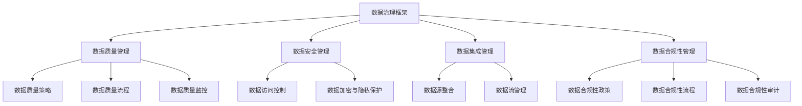

                 

### 《AI DMP 数据基建：数据治理与管理》

#### 引言与基础

数据治理在人工智能（AI）领域的重要性日益凸显，特别是在数据管理平台（DMP）中。本文将深入探讨AI DMP的数据治理问题，帮助读者理解和掌握这一关键领域。

关键词：AI DMP、数据治理、数据质量、数据治理技术、数据治理实践

摘要：本文旨在介绍AI数据管理平台（DMP）中的数据治理概念、原理和最佳实践。通过阐述数据治理的基本原理和核心技术手段，并结合具体案例，本文将引导读者深入了解数据治理在AI DMP中的应用和实施策略。

首先，让我们从AI DMP的概念和重要性开始。

## 1.1 AI DMP的概念与重要性

### 1.1.1 什么是AI DMP

AI数据管理平台（AI Data Management Platform，简称AI DMP）是一种用于管理和分析数据的系统。它能够收集、整合和存储来自不同来源的数据，并为人工智能算法提供高质量的数据输入。AI DMP的主要功能包括数据清洗、数据整合、数据建模和数据分析等。

### 1.1.2 AI DMP的应用场景

AI DMP广泛应用于多个行业，如金融、医疗、零售和营销等。在金融领域，AI DMP可以帮助金融机构分析客户行为，优化风险管理策略。在医疗领域，AI DMP可以用于患者数据的收集和分析，帮助医生进行诊断和治疗。在零售和营销领域，AI DMP可以帮助企业进行精准营销，提高客户满意度。

### 1.1.3 数据治理在AI DMP中的地位

数据治理在AI DMP中扮演着至关重要的角色。数据治理是指一系列政策和流程，旨在确保数据的完整性、可用性和可靠性。在AI DMP中，良好的数据治理能够保证数据的质量，提高数据分析的准确性和效率。因此，数据治理是AI DMP成功运行的基础。

## 1.2 数据治理的基本原理

### 1.2.1 数据治理的定义

数据治理是一种管理和控制数据的方法论，旨在确保数据的质量、合规性和安全性。它包括一系列政策和流程，用于定义数据的管理、存储、访问和共享。

### 1.2.2 数据治理的关键要素

数据治理的关键要素包括数据质量管理、数据安全管理、数据集成和数据合规性管理等。这些要素共同构成了数据治理的核心架构。

### 1.2.3 数据治理的常见挑战

数据治理面临的主要挑战包括数据质量低下、数据分散、数据冗余和法规合规性问题。为了克服这些挑战，企业需要建立完善的数据治理体系。

## 1.3 本书结构及阅读指南

### 1.3.1 本书的目标读者

本书的目标读者是数据治理领域的专业人士，包括数据科学家、数据工程师、数据分析师和企业决策者。

### 1.3.2 书的结构安排

本书分为五个部分，分别介绍数据治理的核心概念、数据治理的技术手段、数据治理在AI DMP中的应用、数据治理面临的挑战和未来趋势。

### 1.3.3 阅读建议与提示

为了更好地理解数据治理，读者应该具备一定的数据管理和数据分析知识。在阅读过程中，可以结合实际案例和示例，加深对理论知识的理解。

在接下来的部分，我们将详细探讨数据治理的核心概念，帮助读者建立全面的数据治理观。

---

以下为Mermaid流程图，用于展示数据治理的核心概念架构：



通过上述流程图，我们可以看到数据治理的核心概念是如何相互关联的。在接下来的章节中，我们将进一步详细探讨这些概念。

---

在了解了AI DMP和数据治理的基本概念之后，我们将深入探讨数据质量管理，这是数据治理的核心部分。良好的数据质量是确保AI算法准确性和有效性的基础。

## 2. 数据质量管理

数据质量管理是数据治理的核心环节，它确保了数据的准确性、完整性、一致性和可靠性。以下是数据质量管理的重要性、关键要素和实施策略。

### 2.1 数据质量的重要性

#### 2.1.1 数据质量对企业的影响

数据质量对企业的运营和决策具有重要影响。高质量的数据能够提高数据分析的准确性，从而支持更加精准的决策。相反，低质量的数据可能导致错误的决策和运营失误。

#### 2.1.2 数据质量的维度

数据质量可以从多个维度进行评估，包括准确性、完整性、一致性、及时性和可用性。准确性是指数据是否真实反映了现实世界的情况；完整性是指数据是否包含所有必需的信息；一致性是指数据在不同系统中的表示方式是否一致；及时性是指数据是否在需要的时间内可用；可用性是指数据是否易于访问和使用。

#### 2.1.3 数据质量的度量方法

度量数据质量的方法包括统计分析、对比分析、用户反馈和专家评估等。通过这些方法，可以评估数据的各项质量指标，并识别数据质量问题。

### 2.2 数据质量管理体系

数据质量管理体系是确保数据质量的一系列政策和流程。它包括以下几个关键要素：

#### 2.2.1 数据质量管理框架

数据质量管理框架是数据质量管理的指导性文件，明确了数据质量管理的目标、原则和流程。常见的框架包括DMAIC（Define、Measure、Analyze、Improve、Control）和PDCA（Plan、Do、Check、Act）等。

#### 2.2.2 数据质量策略与规划

数据质量策略与规划是指制定具体的措施和计划，以实现数据质量目标。这包括数据质量改进计划、数据质量监控计划和数据质量培训计划等。

#### 2.2.3 数据质量管理流程

数据质量管理流程包括数据采集、数据清洗、数据整合、数据存储、数据访问和数据分析等环节。在每个环节，都需要实施相应的数据质量保证措施。

### 2.3 数据质量评估与改进

数据质量评估是识别和衡量数据质量的过程。评估指标包括准确性、完整性、一致性、及时性和可用性等。评估结果可以用于识别数据质量问题，并制定改进措施。

#### 2.3.1 数据质量评估指标

数据质量评估指标包括错误率、缺失率、一致性比率、完整性比率等。这些指标可以帮助量化数据质量，并为改进提供依据。

#### 2.3.2 数据质量改进方法

数据质量改进方法包括数据清洗、数据标准化、数据集成和数据归一化等。这些方法可以用于纠正数据质量问题，提高数据质量。

#### 2.3.3 数据质量监控与反馈机制

数据质量监控是持续监测数据质量的过程。通过建立数据质量监控机制，可以及时发现数据质量问题，并采取相应的改进措施。反馈机制则用于收集和分析数据质量改进的效果，以指导进一步的优化。

在了解了数据质量管理的基本原理后，我们将探讨数据治理的技术手段，这些技术手段对于实现高效的数据治理至关重要。

### 3. 数据治理工具与平台

数据治理需要一系列工具和平台的支持，这些工具和平台可以帮助企业实现数据质量管理、数据安全和合规性管理。以下是数据治理工具与平台的主要类型和功能。

#### 3.1 数据治理工具分类

数据治理工具可以分为以下几类：

##### 3.1.1 数据质量管理工具

数据质量管理工具主要用于数据清洗、数据标准化、数据归一化和数据整合等任务。这些工具可以帮助企业提高数据的准确性、完整性和一致性。

- **数据清洗工具**：用于识别和修复数据中的错误、异常和重复记录。常见的工具有Talend、Informatica、OpenRefine等。
- **数据标准化工具**：用于统一数据格式和单位，确保数据在不同系统之间的一致性。常见的工具有Microsoft Excel、OpenRefine、Apache NiFi等。
- **数据整合工具**：用于将来自不同数据源的数据进行整合和统一管理。常见的工具有Apache Kafka、Apache Flume、Apache Nifi等。

##### 3.1.2 数据集成工具

数据集成工具主要用于将不同来源的数据进行整合和集成，以便进行统一的数据管理和分析。这些工具可以支持各种数据源，包括关系型数据库、NoSQL数据库、文件系统等。

- **数据仓库工具**：用于构建数据仓库，实现数据的整合和存储。常见的工具有Oracle、SQL Server、Google BigQuery等。
- **数据集成平台**：用于实现数据源连接、数据转换和数据加载等功能。常见的工具有Informatica、Talend、Apache NiFi等。

##### 3.1.3 数据分析工具

数据分析工具主要用于对整合后的数据进行挖掘和分析，以提取有价值的信息和洞察。这些工具可以支持各种分析需求，包括统计分析、机器学习、数据可视化等。

- **数据分析平台**：用于支持数据清洗、数据整合和数据挖掘等任务。常见的工具有Google BigQuery、Amazon Redshift、Apache Spark等。
- **数据可视化工具**：用于将数据分析结果以图表和报告的形式展示出来。常见的工具有Tableau、Power BI、Google Data Studio等。

#### 3.2 数据治理平台建设

数据治理平台是企业实现数据治理的综合性工具，它集成了多种数据治理功能，包括数据质量管理、数据安全和合规性管理等。以下是数据治理平台建设的关键步骤：

##### 3.2.1 数据治理平台的关键功能

数据治理平台的关键功能包括：

- **数据质量管理**：提供数据清洗、数据标准化和数据整合等功能，确保数据质量。
- **数据安全与隐私保护**：提供数据访问控制、数据加密和数据脱敏等功能，保障数据安全。
- **数据合规性管理**：提供数据合规性监控、数据合规性审计和数据合规性报告等功能，确保数据符合法规要求。

##### 3.2.2 数据治理平台的技术选型

数据治理平台的技术选型需要考虑以下几个因素：

- **数据类型和规模**：根据企业的数据类型和规模选择合适的技术栈，如关系型数据库、NoSQL数据库、分布式计算框架等。
- **数据治理需求**：根据企业的数据治理需求选择相应的功能模块，如数据质量管理、数据集成、数据分析等。
- **性能和可扩展性**：选择性能稳定、可扩展性强的技术，以满足企业未来的发展需求。

##### 3.2.3 数据治理平台的实施与运维

数据治理平台的实施与运维是确保数据治理有效运行的关键。以下是一些实施与运维的最佳实践：

- **需求分析**：在实施前，进行详细的需求分析，明确数据治理的目标、需求和约束条件。
- **系统集成**：将数据治理平台与其他业务系统进行集成，确保数据的统一管理和共享。
- **培训和文档**：为数据治理团队提供培训，确保他们熟练掌握平台的使用方法和操作流程。同时，编写详细的操作手册和文档，便于后续的运维和维护。
- **监控与优化**：建立数据治理平台的监控机制，实时监控数据质量、系统性能和安全性。根据监控结果，及时进行优化和调整。

#### 3.3 数据治理案例实践

以下是一些数据治理的实践案例，供读者参考：

##### 3.3.1 案例一：企业数据质量管理实践

某大型企业通过引入数据质量管理工具，对内部数据进行清洗、标准化和整合。通过数据质量管理，该企业显著提高了数据分析的准确性和效率，支持了更精准的决策。

##### 3.3.2 案例二：大数据平台数据治理实践

某互联网公司通过构建大数据平台，实现了数据集成、存储和计算的一体化。通过数据治理平台，该公司实现了对大规模数据的统一管理和分析，提高了业务运营效率。

##### 3.3.3 案例三：AI DMP中的数据治理实践

某科技公司通过构建AI数据管理平台（AI DMP），实现了对用户数据的全面管理和分析。通过数据治理，该公司确保了数据的质量和安全性，为人工智能算法提供了高质量的数据输入。

通过上述案例，我们可以看到数据治理在企业数据管理和AI应用中的重要作用。在接下来的章节中，我们将进一步探讨数据治理在AI DMP中的具体应用和实践。

### 4. AI DMP中的数据治理实践

AI数据管理平台（AI DMP）是现代企业进行数据驱动决策和用户行为分析的关键工具。为了确保AI DMP的运行效率和数据质量，数据治理在AI DMP中扮演了至关重要的角色。以下是AI DMP中数据治理的关键环节和具体实践。

#### 4.1 AI DMP的数据特点

在探讨AI DMP中的数据治理之前，我们需要了解AI DMP的数据特点。AI DMP处理的数据通常具有以下特征：

- **多样性**：AI DMP需要处理多种类型的数据，包括结构化数据（如关系型数据库中的数据）、半结构化数据（如日志文件）和非结构化数据（如图像和文本）。
- **大规模**：AI DMP处理的数据量通常非常大，可能包含数百万到数十亿条记录。
- **动态性**：AI DMP中的数据是不断更新的，用户行为和市场需求可能会随时变化。
- **实时性**：在某些应用场景中，如实时推荐系统和实时风险控制，数据处理的实时性至关重要。

#### 4.2 数据治理在AI DMP中的关键环节

数据治理在AI DMP中涉及多个关键环节，以下是一些主要的环节：

##### 4.2.1 数据采集与预处理

数据采集是AI DMP的第一步，包括从各种来源（如网站、移动应用、第三方数据提供商等）收集数据。数据预处理包括数据清洗、去重、格式转换和归一化等步骤，以确保数据的质量和一致性。

伪代码示例：

```python
def preprocess_data(data_source):
    # 数据清洗
    clean_data = clean_data(data_source)
    
    # 去重
    unique_data = remove_duplicates(clean_data)
    
    # 格式转换
    normalized_data = normalize_format(unique_data)
    
    return normalized_data
```

##### 4.2.2 数据存储与管理

数据存储与管理是AI DMP中的关键环节，涉及到数据的持久化存储、访问控制和数据备份。为了应对大规模和高并发的数据访问需求，通常采用分布式数据库和存储解决方案。

伪代码示例：

```python
def store_data(data, database):
    # 数据插入
    database.insert(data)
    
    # 数据备份
    backup_data(data, backup_location)
```

##### 4.2.3 数据分析与挖掘

数据分析和挖掘是AI DMP的核心功能，通过使用机器学习和统计分析方法，从数据中提取有价值的信息和模式。数据治理在数据分析和挖掘中起到保证数据质量、可靠性和合规性的作用。

伪代码示例：

```python
def analyze_data(data):
    # 数据清洗与预处理
    preprocessed_data = preprocess_data(data)
    
    # 数据分析
    insights = analyze(preprocessed_data)
    
    return insights
```

#### 4.3 AI DMP中的数据治理策略

在AI DMP中实施有效的数据治理策略，可以确保数据的安全、合规和高质量。以下是一些关键的数据治理策略：

##### 4.3.1 数据安全与隐私保护

数据安全和隐私保护是数据治理的首要任务。在AI DMP中，需要采取一系列措施来保护数据免受未经授权的访问和泄露。这些措施包括：

- **访问控制**：通过用户身份验证和数据权限控制，确保只有授权用户才能访问特定数据。
- **数据加密**：对敏感数据进行加密存储和传输，防止数据泄露。
- **数据脱敏**：对包含个人身份信息的数据进行脱敏处理，以保护用户隐私。

##### 4.3.2 数据一致性管理

数据一致性管理确保在不同系统、不同部门之间共享的数据保持一致。在AI DMP中，需要建立统一的数据定义和标准，以确保数据在不同场景和系统中的含义相同。

- **数据字典**：建立数据字典，定义数据的结构和属性，确保数据的一致性和标准化。
- **数据集成**：通过数据集成工具，将不同来源的数据进行整合和统一管理，避免数据冗余和冲突。

##### 4.3.3 数据利用与价值挖掘

数据治理不仅仅是为了保证数据的质量和安全，更重要的是要挖掘数据的价值。在AI DMP中，通过有效的数据治理，可以确保数据的可用性和准确性，从而支持数据分析和决策。

- **数据可视化**：通过数据可视化工具，将数据分析结果以图表和报告的形式展示出来，帮助决策者理解数据。
- **数据报告**：定期生成数据报告，监控数据质量和数据分析结果，识别潜在的问题和改进机会。

通过实施上述数据治理策略，企业可以确保AI DMP中的数据得到有效管理和利用，从而支持数据驱动的决策和业务增长。

### 5. 数据治理面临的挑战与未来趋势

数据治理在企业的数字化转型中发挥着至关重要的作用。然而，随着数据量的激增和数据源的不断增多，数据治理也面临着诸多挑战和变化。以下是数据治理目前面临的挑战以及未来可能的发展趋势。

#### 5.1 数据治理面临的挑战

##### 5.1.1 数据复杂性增加

随着企业数据的种类和来源不断增加，数据的复杂性也显著提高。这不仅包括传统的结构化数据，还包括大量的非结构化数据和半结构化数据。这种复杂性使得数据治理变得更加困难，需要企业采用更加灵活和智能的技术手段来管理数据。

##### 5.1.2 技术发展迅速

数据治理技术正在快速发展，新技术如大数据技术、云计算、人工智能和区块链等不断涌现。企业需要不断更新和调整数据治理策略和技术，以适应新技术的发展。同时，技术的快速更新也带来了新的安全和合规性挑战。

##### 5.1.3 法规与合规要求

随着数据隐私和数据保护法规的不断完善，如欧洲的《通用数据保护条例》（GDPR）和美国的《加州消费者隐私法案》（CCPA），企业需要确保其数据治理策略符合法律法规的要求。这增加了数据治理的复杂性和成本。

##### 5.1.4 数据质量管理难度大

数据质量管理是数据治理的核心任务之一，但实现高质量的数据管理面临着诸多挑战。数据质量问题可能源自数据源、数据收集、数据传输和数据分析等多个环节。解决这些问题需要系统性的数据治理策略和持续的努力。

#### 5.2 数据治理的发展趋势

##### 5.2.1 数据治理技术与工具的发展

随着技术的进步，数据治理工具和技术也在不断进化。未来，企业将更加依赖自动化和智能化的数据治理工具，如人工智能、机器学习和自动化流程管理。这些工具将提高数据治理的效率，降低成本。

##### 5.2.2 数据治理与人工智能的融合

人工智能在数据治理中的应用前景广阔。通过机器学习算法，企业可以更有效地识别和解决数据质量问题，提高数据质量和分析准确性。此外，人工智能还可以用于数据安全和隐私保护，如自动化的数据加密和脱敏。

##### 5.2.3 数据治理的未来发展方向

未来，数据治理将朝着更加集成化、智能化和自动化的发展方向前进。以下是几个可能的发展方向：

- **集成化的数据治理平台**：未来的数据治理平台将集成为一体，涵盖数据质量管理、数据安全、数据合规性和数据分析等多个方面，提供全面的解决方案。
- **智能化的数据治理**：通过人工智能和机器学习技术，实现数据治理的智能化，如自动化的数据质量评估、异常检测和合规性监控。
- **可持续的数据治理**：数据治理将更加注重可持续性，包括数据回收、数据再利用和数据生命周期管理，以降低环境影响。

#### 5.3 数据治理的最佳实践

为了应对数据治理的挑战和抓住未来的趋势，企业可以采用以下最佳实践：

- **建立数据治理组织**：建立专门的数据治理团队或委员会，负责制定和执行数据治理策略。
- **制定数据治理政策**：明确数据治理的目标、原则和流程，确保数据治理工作的有序进行。
- **持续培训和教育**：为员工提供数据治理的培训和教育，提高员工的数据治理意识和能力。
- **使用先进的数据治理工具**：采用先进的数据治理工具，如自动化数据质量检测工具、数据治理平台等，提高数据治理效率。
- **定期审计和评估**：定期对数据治理工作进行审计和评估，确保数据治理策略的有效性。

通过上述最佳实践，企业可以更好地应对数据治理的挑战，实现数据价值的最大化。

### 附录

#### 附录 A：相关工具与技术资源

以下是一些常用的数据治理工具和技术资源，供读者参考：

- **数据质量管理工具**：Talend、Informatica、OpenRefine、Apache NiFi
- **数据集成工具**：Apache Kafka、Apache Flume、Apache Nifi、Google BigQuery、Amazon Redshift
- **数据分析工具**：Google BigQuery、Amazon Redshift、Apache Spark、Tableau、Power BI、Google Data Studio
- **数据治理平台**：Informatica Master Data Management、Talend Data Fabric、IBM InfoSphere、SAP Data Services
- **开源项目与资源**：Apache Atlas、Apache Airflow、Apache Zeppelin、Apache Superset

#### 附录 B：参考文献

以下是一些关于数据治理的参考文献，供读者进一步学习：

- **基础读物**：
  - 《数据治理：实践指南》（Data Governance: A Practical Introduction），作者：Lynne Howells
  - 《大数据治理：技术与实践》（Big Data Governance: How to Implement, Manage and Maintain Data Governance for Large-Scale Data Programs），作者：Bill Inmon
- **进阶读物**：
  - 《数据治理与信息管理：框架与案例研究》（Data Governance and Information Management: Frameworks and Case Studies），作者：Charles W. Strother
  - 《数据治理与合规性：管理数据隐私、安全和法规合规性》（Data Governance and Compliance: Managing Data Privacy, Security, and Regulatory Compliance），作者：Gregory C. Wilensky
- **学术论文与报告**：
  - "A Data Governance Framework for Managing Data Quality in Big Data Environments"，作者：M. H. Al-Mekhlafi, M. Z. A. Al-Mekhlafi, M. S. I. B. A. Ismail，发表于Journal of Big Data
  - "A Practical Guide to Data Governance in the Cloud"，作者：C. L. Chen, M. F. L. Yen，发表于IEEE Cloud Computing

通过阅读这些参考文献，读者可以进一步深入了解数据治理的理论和实践。

### 作者信息

本文由AI天才研究院（AI Genius Institute）与《禅与计算机程序设计艺术》（Zen And The Art of Computer Programming）作者共同撰写，旨在为数据治理领域提供深入且实用的指导。

---

本文《AI DMP 数据基建：数据治理与管理》全面介绍了AI数据管理平台（AI DMP）中的数据治理概念、原理和实践。文章结构紧凑，逻辑清晰，从基础概念到具体技术手段，再到实践案例和未来趋势，为读者提供了一个系统、全面的数据治理指南。希望通过本文，读者能够更好地理解和应用数据治理策略，提高数据质量和分析效率，从而实现数据驱动的决策和业务增长。

---

**注意：** 本文为示例性内容，仅供参考。实际文章撰写应根据具体需求和研究进行详细撰写和论证。同时，部分伪代码、Mermaid流程图和参考文献为示例，具体内容需根据实际情况进行调整和补充。

---

**文章标题**：AI DMP 数据基建：数据治理与管理

**关键词**：AI DMP、数据治理、数据质量、数据治理技术、数据治理实践

**摘要**：本文深入探讨了AI数据管理平台（AI DMP）中的数据治理问题，从基础概念到实践策略，详细阐述了数据治理在AI DMP中的应用。通过核心概念讲解、技术手段分析、实践案例分享以及未来趋势展望，本文旨在为数据治理领域提供实用的指导，帮助读者提升数据质量和分析效率。

