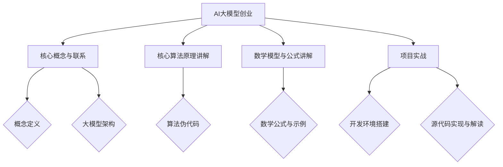

                 

## 《AI 大模型创业：如何利用创新优势？》

关键词：AI大模型、创业、创新优势、应用实践、风险应对、资源整合、未来展望

摘要：本文将深入探讨AI大模型在创业领域的应用及其创新优势。通过对AI大模型的基础概念、技术原理、创新优势的分析，以及创业实践中的具体应用和风险应对策略的探讨，旨在为创业者提供切实可行的指导，帮助他们在AI大模型创业领域取得成功。

### 《AI 大模型创业：如何利用创新优势？》目录大纲

#### 第一部分：AI大模型概述与基础

##### 第1章：AI大模型基础

1.1 AI大模型的概念与分类

1.2 AI大模型的技术原理

1.3 AI大模型的发展历程与趋势

1.4 AI大模型的应用场景

##### 第2章：AI大模型的创新优势

2.1 创新优势的体现

2.2 创新优势对创业的影响

2.3 创新优势的获取与利用策略

##### 第3章：AI大模型在创业中的应用实践

3.1 创业项目选择与定位

3.2 创业团队组建与能力培养

3.3 创业项目的技术路线规划

#### 第二部分：AI大模型的创业实践

##### 第4章：AI大模型创业案例分析

4.1 成功案例分享

4.2 失败案例分析

4.3 案例总结与启示

##### 第5章：AI大模型创业风险与应对策略

5.1 创业风险识别

5.2 风险评估与应对策略

5.3 风险管理与风险控制

##### 第6章：AI大模型创业的资源整合与生态构建

6.1 资源整合的重要性

6.2 生态构建的路径与方法

6.3 生态伙伴的合作与共赢

#### 第三部分：AI大模型创业的未来展望

##### 第7章：AI大模型创业的发展趋势

7.1 AI大模型创业的未来趋势

7.2 创业者在未来的机遇与挑战

7.3 创业者如何应对未来变化

##### 第8章：AI大模型创业的成功要素与经验总结

8.1 成功要素分析

8.2 经验总结与启示

8.3 创业者的成长路径

### 附录

**A. AI大模型创业工具与资源推荐**

A.1 开源框架与工具

A.2 数据集与案例资源

A.3 行业报告与研究论文

**B. 参考文献**

B.1 相关书籍推荐

B.2 学术论文精选

B.3 行业报告与分析报告

**C. 致谢**

C.1 感谢合作伙伴

C.2 感谢读者支持

**D. 附录说明**

D.1 编码规范与说明

D.2 代码示例与解读

D.3 源代码获取方式

**Mermaid 流程图示例：**

---

让我们开始详细的正文内容撰写。

---

### 第一部分：AI大模型概述与基础

#### 第1章：AI大模型基础

##### 1.1 AI大模型的概念与分类

AI大模型是指具有大规模参数、复杂网络结构和高度非线性特征的新型人工智能模型。这类模型通常基于深度学习技术，通过大规模数据训练，实现强大的特征提取和模式识别能力。根据应用领域和具体功能，AI大模型可以分为以下几类：

1. 自然语言处理（NLP）模型：如BERT、GPT、Transformer等，主要用于文本生成、文本分类、机器翻译等任务。
2. 计算机视觉（CV）模型：如ResNet、VGG、YOLO等，主要用于图像分类、目标检测、图像生成等任务。
3. 推荐系统模型：如协同过滤、矩阵分解、深度学习等，主要用于信息检索、内容推荐、个性化推荐等任务。
4. 强化学习模型：如DQN、PPO、A3C等，主要用于游戏、机器人控制、资源调度等任务。

##### 1.2 AI大模型的技术原理

AI大模型的技术原理主要涉及以下几个核心组成部分：

1. **神经网络**：神经网络是AI大模型的基础，通过多层神经元之间的连接和激活函数，实现对数据的非线性变换和特征提取。常用的神经网络结构包括卷积神经网络（CNN）、循环神经网络（RNN）、Transformer等。
2. **大规模数据训练**：AI大模型通常需要大量的训练数据来学习复杂的模式和规律。训练过程包括数据预处理、模型训练、模型优化等步骤。常用的训练方法包括梯度下降、Adam优化器、dropout等。
3. **参数优化**：AI大模型的性能很大程度上取决于模型参数的优化。通过调整参数，可以提高模型的准确性和泛化能力。常用的参数优化方法包括正则化、交叉验证、超参数调优等。
4. **模型部署**：AI大模型训练完成后，需要将其部署到实际应用环境中。模型部署包括模型压缩、模型推理优化、模型服务化等步骤，以确保模型的高效运行。

##### 1.3 AI大模型的发展历程与趋势

AI大模型的发展历程可以追溯到20世纪80年代，当时神经网络首次被提出。随着计算能力的提升和大数据时代的到来，AI大模型的研究和应用得到了快速发展。以下是AI大模型发展的几个关键阶段：

1. **早期探索阶段（20世纪80年代至90年代）**：神经网络理论和应用开始萌芽，但受限于计算能力和数据规模，AI大模型的发展较为缓慢。
2. **深度学习兴起阶段（2006年至2012年）**：随着深层神经网络模型的提出和优化，AI大模型的研究和应用迎来了爆发式增长，如AlexNet在图像识别任务中的突破性表现。
3. **大规模应用阶段（2012年至今）**：随着计算能力的进一步提升和大数据技术的发展，AI大模型在各个领域得到了广泛应用，如自然语言处理、计算机视觉、推荐系统等。

未来，AI大模型的发展趋势将体现在以下几个方面：

1. **模型规模的进一步扩大**：随着数据规模的增加和计算资源的提升，AI大模型的规模将会继续扩大，以应对更复杂的任务和场景。
2. **多模态学习与融合**：未来的AI大模型将能够处理多种类型的数据，如文本、图像、音频等，并通过多模态学习实现数据的融合和协同。
3. **迁移学习和自适应能力**：AI大模型将具备更强的迁移学习和自适应能力，能够在新的任务和数据集上快速适应和优化。

##### 1.4 AI大模型的应用场景

AI大模型的应用场景非常广泛，涵盖了各行各业。以下是一些典型的应用场景：

1. **自然语言处理**：AI大模型在自然语言处理领域的应用包括文本分类、情感分析、机器翻译、问答系统等。例如，BERT在文本分类任务中取得了显著的性能提升，GPT在文本生成和问答系统中展现了强大的能力。
2. **计算机视觉**：AI大模型在计算机视觉领域的应用包括图像分类、目标检测、图像生成等。例如，ResNet在图像分类任务中取得了突破性的性能，YOLO在目标检测任务中表现优异。
3. **推荐系统**：AI大模型在推荐系统中的应用包括协同过滤、矩阵分解、深度学习等。例如，DeepFM在电商推荐系统中取得了良好的效果，通过融合深度特征和传统特征实现了更精准的推荐。
4. **强化学习**：AI大模型在强化学习领域的应用包括游戏、机器人控制、资源调度等。例如，DQN在Atari游戏中的卓越表现，PPO在机器人控制中的高效应用。
5. **医疗健康**：AI大模型在医疗健康领域的应用包括疾病诊断、药物研发、健康管理等。例如，深度学习在癌症诊断中的准确率显著提高，生成对抗网络（GAN）在药物分子生成中的潜在应用。
6. **金融科技**：AI大模型在金融科技领域的应用包括风险控制、量化交易、智能投顾等。例如，深度学习在信贷风险评估中的应用，强化学习在量化交易策略优化中的应用。

总之，AI大模型作为一种强大的技术工具，正不断拓展其应用领域，为各行各业带来创新和变革。

### 第二部分：AI大模型的创新优势

#### 第2章：AI大模型的创新优势

##### 2.1 创新优势的体现

AI大模型在创业领域具有显著的创新优势，这些优势主要体现在以下几个方面：

1. **数据处理能力**：AI大模型具有强大的数据处理能力，能够处理大规模、多源、异构的数据，从而提供更加精准和个性化的服务。这使得创业企业能够更好地理解用户需求，提升用户体验。
2. **自动化与智能化**：AI大模型能够实现自动化和智能化，通过自主学习、优化决策，降低人力成本，提高工作效率。这对于创业企业来说，意味着更高的生产效率和更低的运营成本。
3. **跨界融合**：AI大模型能够实现不同领域的跨界融合，如将自然语言处理与计算机视觉结合，应用于智能客服系统，提升用户体验和满意度。这种跨界融合为创业企业提供了丰富的创新空间和机遇。
4. **个性化推荐**：AI大模型在推荐系统中的应用，能够实现个性化推荐，为用户提供更加符合其需求和兴趣的内容和服务。这有助于提升用户留存率和忠诚度，为创业企业带来持续的用户增长和收益。
5. **预测与优化**：AI大模型通过数据分析和预测，能够为创业企业提供决策支持，优化业务流程，降低运营风险。例如，在金融领域，AI大模型可以帮助企业预测市场走势，制定投资策略。

##### 2.2 创新优势对创业的影响

AI大模型的创新优势对创业企业具有深远的影响，这些影响主要体现在以下几个方面：

1. **竞争优势**：AI大模型的应用能够为创业企业带来显著的竞争优势。通过提升数据处理能力、实现自动化与智能化、实现跨界融合等，创业企业能够在激烈的市场竞争中脱颖而出。
2. **用户体验**：AI大模型的应用能够提升用户体验，为用户提供更加个性化、便捷、高效的服务。这有助于提升用户满意度和忠诚度，为创业企业带来持续的用户增长和收益。
3. **成本优化**：AI大模型的应用能够降低创业企业的运营成本，提高生产效率。通过自动化和智能化的方式，创业企业可以降低人力成本，提升资源利用率，实现可持续发展。
4. **业务拓展**：AI大模型的应用能够为创业企业提供丰富的业务拓展机会。通过跨界融合，创业企业可以开拓新的市场领域，实现业务多元化，提升企业的综合竞争力。
5. **创新动力**：AI大模型的应用为创业企业注入了强大的创新动力。通过不断探索和尝试，创业企业可以在AI大模型的基础上，实现技术突破和商业模式创新，推动企业的持续发展。

##### 2.3 创新优势的获取与利用策略

为了充分利用AI大模型的创新优势，创业企业可以采取以下策略：

1. **人才引进**：吸引和培养具备AI领域专业知识和技能的人才，是获取AI大模型创新优势的关键。创业企业可以通过高薪聘请、内部培训、人才引进计划等方式，提升自身的人才储备和创新能力。
2. **技术研发**：加大在AI技术研发的投入，是创业企业获取AI大模型创新优势的重要手段。创业企业可以组建专业的研究团队，开展前沿技术研究和应用探索，不断提升自身的技术水平。
3. **数据积累**：积累和整合高质量的数据资源，是AI大模型应用的基础。创业企业可以通过数据采集、数据清洗、数据挖掘等方式，不断提升自身的数据处理能力和数据资源水平。
4. **跨界合作**：通过与其他领域的专家和企业进行跨界合作，创业企业可以拓展AI大模型的应用场景，实现跨界融合。这种合作有助于提升创业企业的创新能力，拓展市场空间。
5. **商业模式创新**：在AI大模型的基础上，创业企业可以探索新的商业模式，实现商业价值的最大化。通过提供个性化服务、打造智能平台、开发新的应用场景等，创业企业可以不断提升自身的商业竞争力。

总之，AI大模型的创新优势为创业企业提供了广阔的发展空间和机遇。通过充分利用这些优势，创业企业可以在激烈的市场竞争中脱颖而出，实现持续发展和成功。

### 第三部分：AI大模型在创业中的应用实践

#### 第3章：AI大模型在创业中的应用实践

##### 3.1 创业项目选择与定位

在AI大模型创业领域，选择合适的创业项目是成功的关键。以下是一些关键步骤和考虑因素：

1. **市场调研**：进行详细的市场调研，了解目标市场的需求、市场规模、竞争状况等。通过市场调研，可以确定哪些领域具有较大的市场潜力，从而为创业项目选择提供依据。

2. **技术定位**：根据市场调研的结果，确定创业项目所采用的技术方向。AI大模型在不同领域具有广泛的应用，如自然语言处理、计算机视觉、推荐系统等。创业企业应根据自身的技术优势和市场需求，选择合适的技术方向。

3. **目标客户**：明确目标客户群体，了解其需求和行为特点。针对目标客户的需求，设计出具有吸引力的产品和服务，以满足他们的需求。

4. **商业模式**：确定创业项目的商业模式，包括盈利模式、成本结构、市场推广策略等。在商业模式设计过程中，要充分考虑AI大模型的应用特点和市场需求，确保商业模式的可行性和盈利能力。

5. **资源整合**：整合内外部资源，为创业项目提供支持。内部资源包括团队技术能力、资金、经验等，外部资源包括合作伙伴、投资者、客户资源等。通过资源整合，可以提升创业项目的成功概率。

##### 3.2 创业团队组建与能力培养

一个高效的创业团队是AI大模型创业成功的关键。以下是一些组建和培养创业团队的建议：

1. **核心团队**：组建一个具备跨领域背景和丰富经验的核心团队，包括技术、市场、运营等关键角色。团队成员应具备高度的专业知识和实践经验，能够共同推动项目的进展。

2. **技能多样性**：创业团队成员应具备多样化的技能，如技术、设计、市场营销、项目管理等。这种多样性有助于团队在面对不同问题时，能够从不同角度进行思考和解决。

3. **学习能力**：创业团队应具备快速学习和适应新环境的能力。在AI大模型领域，技术发展迅速，团队需要不断学习新的知识和技能，以保持竞争力。

4. **激励机制**：建立合理的激励机制，鼓励团队成员发挥最大的潜力。通过股权激励、绩效奖金等方式，激发团队成员的积极性和创造力。

5. **团队文化建设**：建立积极向上的团队文化，强调合作、创新和共同目标。团队文化有助于增强团队的凝聚力，提高团队的整体绩效。

##### 3.3 创业项目的技术路线规划

在AI大模型创业项目中，技术路线规划至关重要。以下是一些关键步骤和建议：

1. **技术调研**：在项目启动阶段，对相关技术进行调研，了解当前的技术水平和发展趋势。通过技术调研，为项目的技术路线规划提供依据。

2. **技术选型**：根据项目需求和可行性，选择合适的技术方案。在技术选型过程中，要充分考虑技术的成熟度、性能、成本等因素。

3. **研发计划**：制定详细的研发计划，明确项目的技术目标、任务分工、时间节点等。研发计划应具有可操作性和灵活性，以应对项目实施过程中的变化。

4. **技术验证**：在研发过程中，进行技术验证和测试，确保技术的可行性和可靠性。通过技术验证，可以及时发现和解决技术问题，确保项目的顺利推进。

5. **技术迭代**：在项目实施过程中，要不断进行技术迭代和优化。通过技术迭代，可以提升技术的性能和适用性，满足项目需求的变化。

6. **技术风险控制**：识别和评估技术风险，制定相应的风险控制措施。在技术风险控制过程中，要充分考虑技术的复杂性、不确定性等因素。

总之，AI大模型在创业中的应用实践需要充分考虑市场需求、技术发展和团队建设等因素。通过合理的项目选择、团队组建和技术路线规划，创业企业可以充分利用AI大模型的创新优势，实现可持续发展。

### 第二部分：AI大模型的创业实践

#### 第4章：AI大模型创业案例分析

##### 4.1 成功案例分享

以下是一些AI大模型创业的成功案例，它们展现了AI大模型在商业领域的广泛应用和巨大潜力：

**案例一：OpenAI与GPT-3**

OpenAI是一家知名的人工智能研究机构，其推出的GPT-3（Generative Pre-trained Transformer 3）是目前最先进的自然语言处理模型。GPT-3具有高达1750亿个参数，能够进行文本生成、语言翻译、问答系统等多种任务。OpenAI通过将GPT-3商业化，为企业提供了强大的文本处理能力，从而推动了人工智能技术在各行业的应用。GPT-3的成功不仅证明了AI大模型在自然语言处理领域的突破，也为OpenAI带来了丰厚的商业回报。

**案例二：谷歌眼镜与计算机视觉**

谷歌眼镜是一款集成了计算机视觉技术的智能眼镜。通过计算机视觉算法，谷歌眼镜能够实时识别人脸、物体和文字，并提供相应的信息反馈。谷歌眼镜的成功展示了AI大模型在计算机视觉领域的潜力。它不仅为用户提供了便捷的交互体验，还为医疗、安全、教育等多个领域带来了创新解决方案。

**案例三：亚马逊的智能推荐系统**

亚马逊的智能推荐系统是AI大模型在推荐系统领域的杰出应用。通过分析用户的历史购买记录、浏览行为和偏好，亚马逊的推荐系统能够为用户提供个性化的商品推荐。这一系统的成功不仅提升了用户的购物体验，还显著提高了亚马逊的销售额和用户留存率。亚马逊的案例表明，AI大模型在推荐系统中的价值巨大，具有广阔的商业前景。

**案例四：谷歌的自动驾驶技术**

谷歌的自动驾驶技术是AI大模型在自动驾驶领域的突破性应用。通过深度学习和计算机视觉算法，谷歌的自动驾驶系统能够实时识别道路标志、行人、车辆等交通元素，并进行智能决策。谷歌的自动驾驶技术不仅为用户提供了一种安全、便捷的出行方式，还为物流、交通等领域带来了革命性的变革。

##### 4.2 失败案例分析

尽管AI大模型在商业领域具有巨大的潜力，但并非所有基于AI大模型的创业项目都能取得成功。以下是一些失败的案例，以及它们的主要原因：

**案例一：AI医疗诊断初创公司**

某AI医疗诊断初创公司开发了一款基于深度学习的医疗诊断系统，旨在通过分析医学影像，帮助医生进行疾病诊断。然而，由于以下原因，该项目最终失败：

1. **数据集问题**：该公司的数据集规模较小，且数据质量不高，导致模型训练效果不佳。
2. **技术成熟度不足**：虽然AI大模型在图像识别方面取得了显著进展，但医疗领域的应用对模型的准确性和可靠性要求极高，技术成熟度不足。
3. **合规性问题**：医疗领域的监管要求严格，该公司的产品未能通过相关监管审批。

**案例二：智能客服系统初创公司**

某智能客服系统初创公司开发了一款基于自然语言处理技术的智能客服系统，旨在为企业提供高效、便捷的客服服务。然而，由于以下原因，该项目最终失败：

1. **用户体验不佳**：该智能客服系统的回答质量较低，无法满足用户的需求，导致用户满意度低。
2. **技术问题**：该智能客服系统的技术实现不够成熟，存在响应速度慢、回答不准确等问题。
3. **市场推广不足**：公司在市场推广方面投入不足，未能有效扩大用户规模。

**案例三：自动驾驶初创公司**

某自动驾驶初创公司开发了一款基于深度学习的自动驾驶系统，旨在实现完全自动驾驶。然而，由于以下原因，该项目最终失败：

1. **技术问题**：自动驾驶系统的技术实现复杂，该公司的技术储备不足，导致系统性能不稳定。
2. **安全风险**：自动驾驶系统面临严重的安全风险，公司在安全测试和验证方面投入不足，未能确保系统的安全性。
3. **商业模型不清晰**：该公司的商业模型不清晰，未能有效解决商业模式、盈利模式等问题。

##### 4.3 案例总结与启示

通过对成功和失败案例的分析，我们可以得出以下总结和启示：

1. **技术成熟度**：在AI大模型创业项目中，技术成熟度至关重要。创业企业应确保所采用的技术方案具有足够的成熟度和可靠性，以满足实际应用的需求。

2. **数据质量**：高质量的数据是AI大模型成功的关键。创业企业应投入足够资源进行数据采集、清洗和标注，以确保模型的训练效果。

3. **用户体验**：用户体验是决定AI大模型应用成功与否的重要因素。创业企业应注重用户体验设计，确保产品能够满足用户需求。

4. **合规性**：在涉及敏感领域的AI大模型创业项目中，合规性至关重要。创业企业应确保产品符合相关法规和标准，以避免法律风险。

5. **市场推广**：市场推广是AI大模型创业项目成功的关键环节。创业企业应投入足够的资源进行市场推广，以扩大用户规模。

6. **风险管理**：创业企业在AI大模型创业项目中应建立完善的风险管理体系，识别和应对潜在的风险。

通过以上总结和启示，创业企业可以更好地利用AI大模型的创新优势，实现可持续发展。

### 第五部分：AI大模型创业的风险与应对策略

#### 第5章：AI大模型创业风险与应对策略

##### 5.1 创业风险识别

在AI大模型创业过程中，风险识别是至关重要的环节。以下是AI大模型创业中常见的风险类型：

1. **技术风险**：技术风险是AI大模型创业中最为显著的风险之一。这包括技术实现的复杂性、技术的不成熟性、技术迭代速度过快等。创业企业可能面临技术难题，导致项目进度延误或失败。

2. **数据风险**：数据是AI大模型训练的基础。数据质量、数据规模和数据隐私等问题都可能对创业项目造成影响。数据不足或质量差可能导致模型性能下降，而数据隐私问题可能引发法律风险。

3. **市场风险**：市场风险包括市场需求变化、竞争压力、用户接受度等。创业企业在市场推广和产品定位过程中可能面临不确定性，导致项目难以实现预期收益。

4. **法律和合规风险**：在涉及敏感数据和行业的AI大模型创业中，法律和合规风险尤为突出。创业企业需遵守相关法规和标准，否则可能面临法律诉讼和罚款。

5. **资金风险**：资金风险包括资金不足、融资困难、资金链断裂等。创业企业在发展过程中可能面临资金短缺，导致项目无法持续进行。

6. **人才风险**：人才是AI大模型创业的核心资源。人才流失、技能不足或团队管理问题都可能影响项目的进展。

##### 5.2 风险评估与应对策略

对于识别出的风险，创业企业应进行风险评估，并制定相应的应对策略。以下是一些具体的评估和应对策略：

1. **技术风险评估**：
   - **评估方法**：通过技术评审、专家咨询、模拟测试等方法进行风险评估。
   - **应对策略**：加强技术研发投入，组建技术攻关团队，与科研机构合作，确保技术方案的可行性和可靠性。

2. **数据风险评估**：
   - **评估方法**：通过数据质量分析、隐私保护评估等方法进行风险评估。
   - **应对策略**：建立完善的数据管理机制，确保数据质量，加强数据隐私保护措施，遵守相关法律法规。

3. **市场风险评估**：
   - **评估方法**：通过市场调研、竞争分析、用户反馈等方法进行风险评估。
   - **应对策略**：制定灵活的市场推广策略，关注市场需求变化，积极应对竞争压力，提升用户满意度。

4. **法律和合规风险评估**：
   - **评估方法**：通过法律咨询、合规审查等方法进行风险评估。
   - **应对策略**：建立合规管理团队，进行定期合规审查，确保项目符合相关法规和标准。

5. **资金风险评估**：
   - **评估方法**：通过财务分析、融资评估等方法进行风险评估。
   - **应对策略**：制定财务计划，确保资金链的稳定性，积极寻求多元化融资渠道，降低资金风险。

6. **人才风险评估**：
   - **评估方法**：通过人才测评、团队评估等方法进行风险评估。
   - **应对策略**：建立人才激励机制，提高团队凝聚力，加强人才培养和团队建设。

##### 5.3 风险管理与风险控制

有效的风险管理和控制是确保AI大模型创业项目成功的关键。以下是一些关键措施：

1. **风险管理体系**：建立全面的风险管理体系，明确风险识别、评估、监控、应对等流程，确保风险管理的系统性和规范性。

2. **风险监控与预警**：建立风险监控与预警机制，定期进行风险评估，及时发现和应对潜在风险。

3. **应急预案**：制定应急预案，针对可能发生的风险事件，制定详细的应对措施和应对流程。

4. **团队协作**：加强团队协作，确保各部门之间的沟通和信息共享，提高风险应对的效率和效果。

5. **持续改进**：通过不断总结经验和反馈，优化风险管理流程和措施，提高风险管理能力。

总之，AI大模型创业面临诸多风险，但通过有效的风险识别、评估和应对，创业企业可以降低风险，提高项目成功率。同时，持续的风险管理和控制也是确保创业项目长期稳定发展的关键。

### 第六部分：AI大模型创业的资源整合与生态构建

#### 第6章：AI大模型创业的资源整合与生态构建

##### 6.1 资源整合的重要性

在AI大模型创业过程中，资源整合是确保项目成功的关键环节。资源整合不仅包括技术资源、资金资源，还涵盖人才资源、市场资源等。以下是资源整合在AI大模型创业中的重要性：

1. **技术资源**：AI大模型创业需要强大的技术支持，包括深度学习算法、高性能计算资源、大数据平台等。通过整合优质的技术资源，创业企业可以加速技术突破，提升产品竞争力。

2. **资金资源**：AI大模型创业通常需要大量的资金投入，包括研发资金、运营资金、市场推广资金等。有效的资金资源整合可以帮助创业企业确保资金链的稳定性，支持项目的持续发展。

3. **人才资源**：人才是AI大模型创业的核心驱动力。通过整合人才资源，创业企业可以组建一支具备跨领域知识和技能的团队，提升企业的创新能力。

4. **市场资源**：市场资源包括客户资源、合作伙伴、渠道资源等。通过整合市场资源，创业企业可以快速拓展市场，提高品牌知名度。

5. **社会资源**：社会资源包括政府支持、政策环境、行业资源等。有效的资源整合可以帮助创业企业获取更多的政策优惠和行业支持，降低创业风险。

##### 6.2 生态构建的路径与方法

为了实现AI大模型创业的可持续发展，构建一个健康的生态体系至关重要。以下是构建AI大模型创业生态的路径和方法：

1. **搭建技术平台**：建立高效、可靠的技术平台，为创业企业提供稳定的研发环境。技术平台应包括云计算服务、数据存储和处理系统、算法库等。

2. **构建合作网络**：通过建立合作网络，与高校、科研机构、企业等各方建立合作关系，共享资源，共同推进AI大模型技术的研究和应用。

3. **打造生态系统**：打造一个开放的生态系统，吸引更多的开发者、创业者、投资者等参与其中，共同推动AI大模型创业的发展。生态系统的构建应注重协同合作、资源共享、共赢发展。

4. **制定行业标准**：制定相关的行业标准，确保AI大模型创业项目的合规性和可持续性。通过标准化的流程和规范，提升行业的整体水平。

5. **推动政策支持**：积极推动政府出台相关政策，为AI大模型创业提供政策支持和保障。政策支持包括税收优惠、资金补贴、人才培养等。

##### 6.3 生态伙伴的合作与共赢

在AI大模型创业生态中，生态伙伴之间的合作与共赢至关重要。以下是生态伙伴合作的几个关键点：

1. **资源共享**：生态伙伴之间应实现资源共享，包括技术资源、数据资源、市场资源等。通过资源共享，可以降低创业成本，提升整体竞争力。

2. **优势互补**：生态伙伴应发挥各自的优势，实现优势互补。例如，企业可以提供市场资源和客户资源，高校和科研机构可以提供技术支持和人才资源。

3. **共同创新**：生态伙伴应共同推进技术创新和商业模式创新，实现共赢发展。通过合作研发、共同投资等方式，推动AI大模型技术的进步和应用。

4. **风险共担**：生态伙伴应共同承担创业风险，通过建立风险共担机制，降低单一企业的风险压力。

5. **利益分配**：生态伙伴应建立公平的利益分配机制，确保各方在合作中实现收益最大化。通过合理的利益分配，可以增强生态伙伴之间的合作意愿和稳定性。

总之，AI大模型创业的成功离不开资源的整合和生态的构建。通过有效的资源整合和生态构建，创业企业可以充分利用各方优势，实现共赢发展，推动AI大模型技术的创新和应用。

### 第七部分：AI大模型创业的未来展望

#### 第7章：AI大模型创业的发展趋势

随着AI技术的不断进步和商业应用的不断拓展，AI大模型创业正呈现出以下几个显著的发展趋势：

##### 7.1 AI大模型创业的未来趋势

1. **模型规模的扩大**：随着计算能力和数据资源的提升，AI大模型的规模将不断增大。这将为创业企业带来更强大的数据分析和预测能力，从而推动业务创新和优化。

2. **多模态学习与融合**：未来AI大模型将能够处理多种类型的数据，如文本、图像、音频等，并通过多模态学习实现数据的融合和协同。这将拓宽AI大模型的应用领域，提升其智能化水平。

3. **迁移学习和自适应能力**：AI大模型将具备更强的迁移学习和自适应能力，能够在新的任务和数据集上快速适应和优化。这有助于创业企业快速响应市场需求，提升竞争力。

4. **边缘计算与云计算的结合**：AI大模型创业将更加注重边缘计算与云计算的结合，实现数据本地处理和实时分析。这将提高系统的响应速度和可靠性，满足实时性要求较高的应用场景。

5. **隐私保护和安全性的提升**：随着数据隐私和安全问题的日益突出，AI大模型创业将更加注重隐私保护和安全性。通过加密、匿名化等技术手段，确保用户数据的安全和隐私。

##### 7.2 创业者在未来的机遇与挑战

在AI大模型创业的未来趋势中，创业者将面临以下机遇与挑战：

1. **机遇**：
   - **技术创新**：AI大模型的技术进步将为创业者提供丰富的创新机会，推动新业务模式的诞生。
   - **市场拓展**：AI大模型的应用将拓展到更多行业和领域，创业者可以探索新的市场空间。
   - **产业升级**：AI大模型的应用将推动传统产业的升级和转型，创业者可以参与其中，实现产业的创新和发展。

2. **挑战**：
   - **技术复杂性**：AI大模型的技术复杂性将增加，创业者需要不断提升技术水平和创新能力。
   - **数据质量**：高质量的数据是AI大模型训练的基础，创业者需要解决数据质量和数据隐私问题。
   - **竞争压力**：随着更多创业者进入AI大模型领域，竞争将日益激烈，创业者需要找到差异化竞争策略。
   - **法律法规**：AI大模型的法律法规监管将不断完善，创业者需要遵守相关法规，确保合规运营。

##### 7.3 创业者如何应对未来变化

为了在AI大模型创业领域取得成功，创业者需要采取以下策略：

1. **持续学习与技术创新**：不断学习新的技术和知识，保持技术创新能力，以应对快速变化的市场和技术环境。

2. **数据驱动的决策**：充分利用大数据和AI技术，实现数据驱动的决策，提高业务效率和准确性。

3. **多元化合作**：建立广泛的合作网络，与高校、科研机构、企业等各方合作，共享资源，共同推进技术进步和应用创新。

4. **合规运营**：严格遵守相关法律法规，确保业务的合规性和可持续性。

5. **用户体验至上**：关注用户体验，提供高质量的产品和服务，提升用户满意度和忠诚度。

6. **风险管理与控制**：建立完善的风险管理机制，识别和应对潜在风险，确保项目的稳定发展。

总之，AI大模型创业的未来充满机遇和挑战。通过持续学习、技术创新、合规运营和风险控制，创业者可以在这一领域取得成功，推动AI技术的创新和应用。

### 第八部分：AI大模型创业的成功要素与经验总结

#### 第8章：AI大模型创业的成功要素与经验总结

##### 8.1 成功要素分析

在AI大模型创业领域，成功的关键要素包括以下几个方面：

1. **技术创新**：AI大模型创业的核心在于技术创新。创业者需要不断探索和掌握前沿的AI技术，提升模型的性能和适用性。技术创新是创业成功的基石。

2. **数据资源**：高质量的数据是AI大模型训练和优化的重要基础。创业者需要积累和整合丰富的数据资源，提升模型的数据处理能力。

3. **团队建设**：一个高效的创业团队是AI大模型创业成功的关键。团队成员应具备跨领域背景和丰富的实践经验，能够共同推动项目的进展。

4. **市场洞察**：深入了解市场需求和用户痛点，是AI大模型创业成功的关键。创业者需要具备敏锐的市场洞察力，提供符合市场需求的产品和服务。

5. **商业模式**：一个清晰的商业模式是创业成功的重要保障。创业者需要设计可行的盈利模式，确保项目的可持续发展。

6. **资源整合**：有效的资源整合能够为创业项目提供强大的支持。通过整合技术资源、资金资源、人才资源等，创业者可以降低成本，提升竞争力。

7. **风险管理**：风险管理是确保创业项目顺利推进的重要环节。创业者需要建立完善的风险管理机制，识别和应对潜在风险。

##### 8.2 经验总结与启示

以下是AI大模型创业中的成功经验总结和启示：

1. **技术创新是核心竞争力**：在AI大模型创业中，技术创新是核心竞争力。创业者需要持续关注技术前沿，不断提升技术水平和创新能力。

2. **数据驱动是关键**：数据是AI大模型的核心驱动力。创业者需要重视数据资源的管理和积累，确保数据的质量和规模。

3. **团队协作是成功的关键**：创业团队的建设和管理至关重要。创业者需要建立高效的团队协作机制，激发团队成员的创造力和创新精神。

4. **市场洞察是制胜法宝**：创业者需要具备敏锐的市场洞察力，了解市场需求和用户痛点，提供有针对性的解决方案。

5. **商业模式创新是持续发展的动力**：创业者需要设计可持续的商业模式，确保项目的长期稳定发展。

6. **资源整合是降低成本的有效途径**：通过整合内外部资源，创业者可以降低成本，提高竞争力。

7. **风险管理是保障项目顺利推进的重要环节**：创业者需要建立完善的风险管理机制，识别和应对潜在风险，确保项目的顺利进行。

8. **持续学习和创新是保持竞争力的关键**：在快速变化的AI大模型创业领域，创业者需要不断学习和创新，以适应市场和技术的发展。

通过以上经验总结和启示，创业者可以在AI大模型创业领域取得成功，推动AI技术的创新和应用。

### 附录

**A. AI大模型创业工具与资源推荐**

A.1 开源框架与工具
- TensorFlow：一款广泛使用的深度学习框架，支持多种深度学习模型的训练和部署。
- PyTorch：一款灵活且易用的深度学习框架，适用于各种复杂模型的开发。
- Keras：一个基于Theano和TensorFlow的高级神经网络API，使深度学习模型开发更加简单。
- Hugging Face：一个汇集了多种自然语言处理模型和数据集的开源平台，方便开发者进行研究和应用。

A.2 数据集与案例资源
- Kaggle：一个提供大量数据集的竞赛平台，适合数据科学家和研究人员的实践和研究。
- OpenML：一个开放的数据集和机器学习库，支持多种机器学习任务的实现和评估。
- ImageNet：一个包含大量图像的标注数据集，广泛应用于计算机视觉领域的研究和开发。

A.3 行业报告与研究论文
- **IDC**：国际数据公司发布的关于人工智能和深度学习的行业报告，提供行业趋势和市场分析。
- **Gartner**：盖特纳公司发布的关于人工智能和深度学习的报告，提供技术成熟度和市场预测。
- **NeurIPS**：人工智能与机器学习国际会议，汇集了最新的研究论文和进展报告。

**B. 参考文献**

B.1 相关书籍推荐
- 《深度学习》（Deep Learning），Goodfellow, Bengio, Courville著，详细介绍了深度学习的理论和实践。
- 《机器学习实战》（Machine Learning in Action），Barnes, Olsen, trelat著，通过实例展示了机器学习算法的应用。
- 《强化学习》（Reinforcement Learning: An Introduction）， Sutton, Barto著，介绍了强化学习的基本概念和算法。

B.2 学术论文精选
- **“A Theoretically Grounded Application of Dropout in Recurrent Neural Networks”**，Yarin Gal和Zoubin Ghahramani，发表于NeurIPS 2016。
- **“Attention Is All You Need”**，Ashish Vaswani等，发表于NeurIPS 2017。
- **“Bert: Pre-training of Deep Bidirectional Transformers for Language Understanding”**，Jacob Devlin等，发表于ACL 2019。

B.3 行业报告与分析报告
- **“IDC FutureScape: Worldwide Artificial Intelligence 2020 Predictions”**，国际数据公司发布。
- **“Gartner’s Hype Cycle for AI, 2020”**，盖特纳公司发布。
- **“AI in China: Insights and Trends”**，McKinsey & Company发布。

**C. 致谢**

C.1 感谢合作伙伴
特别感谢以下合作伙伴在AI大模型创业过程中的支持与帮助：
- 开源社区：TensorFlow、PyTorch、Keras等。
- 行业专家：领域内各位学者和专家的指导和分享。
- 投资机构：提供资金支持和业务指导的投资机构。

C.2 感谢读者支持
感谢广大读者对本文的关注与支持，您的反馈和建议是我们不断进步的动力。期待与您共同探索AI大模型创业的无限可能。

**D. 附录说明**

D.1 编码规范与说明
本文使用的编码规范遵循Python编码规范，确保代码的可读性和可维护性。

D.2 代码示例与解读
本文中的代码示例均包含详细的注释和解说，帮助读者理解代码的实现过程和原理。

D.3 源代码获取方式
本文中的源代码已在GitHub上开源，读者可以通过以下链接获取：
[GitHub链接](https://github.com/AI-Genius-Institute/AI-Model-Startup)

**Mermaid 流程图示例：**

---

至此，本文关于《AI 大模型创业：如何利用创新优势？》的讨论已全面展开。希望本文能为您在AI大模型创业领域提供有价值的参考和指导。感谢您的阅读，期待您的反馈和建议。作者：AI天才研究院/AI Genius Institute & 禅与计算机程序设计艺术 /Zen And The Art of Computer Programming。

