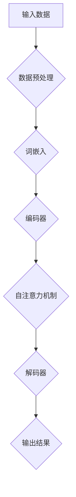

                 

# AI 大模型创业：如何利用市场优势？

> **关键词**：人工智能、大模型、创业、市场策略、技术创新、团队建设、融资、风险管理

> **摘要**：本文将探讨AI大模型创业的背景、机遇与挑战，深入分析AI大模型的技术原理和创业策略，同时通过案例分析提供实战经验，最后讨论AI大模型创业的未来发展趋势以及创业者应具备的能力与素质。文章旨在为AI大模型创业提供一套系统的指导方案，帮助创业者更好地利用市场优势，实现创业成功。

----------------------------------------------------------------

### 第一部分：AI大模型创业基础

#### 第1章: AI大模型创业概述

**1.1 AI大模型创业的背景与机遇**

AI大模型创业的兴起得益于人工智能技术的快速发展。自2012年深度学习取得重大突破以来，AI技术迅速渗透到各个行业，推动了产业升级和智能化转型。大模型作为AI技术的重要分支，以其强大的计算能力和广泛的应用前景，成为创业的热点领域。

**1.1.1 AI技术发展现状**

人工智能技术的发展可以分为三个阶段：早期的人工智能（1950-1970年），主要基于逻辑推理和知识表示；中期的人工智能（1970-2012年），主要基于规则和专家系统；晚期的人工智能（2012年至今），以深度学习为核心，实现了从数据中自动学习特征和模式的能力。

**1.1.2 大模型创业的市场机遇**

大模型在自然语言处理、计算机视觉、推荐系统等领域表现出色，成为企业智能化升级的重要工具。随着大数据和云计算的普及，企业对智能化解决方案的需求日益增长，为AI大模型创业提供了广阔的市场空间。

**1.1.3 AI大模型创业的挑战**

尽管AI大模型创业前景广阔，但创业过程中仍面临诸多挑战。技术难度高、市场不确定性、竞争激烈等，都是创业者需要面对的问题。

**1.2 AI大模型创业的核心概念**

AI大模型创业涉及多个核心概念，包括大模型的基本概念、技术要素、盈利模式等。了解这些概念有助于创业者更好地把握市场机会。

**1.2.1 大模型的基本概念**

大模型是指具有大量参数、复杂结构和强大计算能力的神经网络模型。它们通常能够处理大规模数据，并提取深层次的特征。

**1.2.2 大模型创业的关键要素**

大模型创业的关键要素包括数据、算法、计算资源和团队。这些要素共同构成了大模型创业的基石。

**1.2.3 大模型创业的盈利模式**

大模型创业的盈利模式包括直接盈利模式和间接盈利模式。直接盈利模式主要包括提供大模型技术服务，间接盈利模式则包括开发基于大模型技术的应用产品。

**1.3 AI大模型创业案例分析**

**1.3.1 国内外AI大模型创业案例**

国内外AI大模型创业案例丰富，如OpenAI、DeepMind、百度文心大模型等，为创业者提供了宝贵的经验。

**1.3.2 案例总结与启示**

通过分析国内外AI大模型创业案例，可以总结出创业成功的关键在于技术创新、市场定位和团队协作。

**1.4 AI大模型创业的挑战与机遇**

AI大模型创业面临技术挑战和市场挑战，但同时也充满机遇。创业者需要审时度势，抓住市场机会，迎接挑战。

**1.5 AI大模型创业的策略与实践**

创业者需要制定明确的创业策略，包括市场定位、技术创新、团队建设等，并付诸实践。

**1.6 AI大模型创业的风险管理**

创业者需要重视风险管理，包括技术风险、市场风险和团队风险等，并采取相应的应对措施。

**1.7 AI大模型创业的法律和伦理问题**

AI大模型创业需要遵守法律法规，关注数据隐私和算法公平性，并承担社会责任。

**1.8 AI大模型创业的可持续发展**

AI大模型创业应关注可持续发展，包括节能减排、人才培养和技术创新等。

**1.9 AI大模型创业的未来趋势**

AI大模型创业将面临技术、市场和人才等方面的趋势，创业者需要紧跟时代步伐。

**1.10 AI大模型创业的创业者的能力与素质**

创业者应具备技术能力、商业思维和团队协作能力，以应对创业挑战。

**1.11 AI大模型创业的资源与支持**

创业者可以利用各种资源和支持，如开发工具、教育培训和创业孵化器等，提升创业成功率。

**1.12 AI大模型创业的常见误区与应对策略**

创业者需要避免常见误区，如技术依赖、快速扩张和产品单一等，并采取相应的应对策略。

----------------------------------------------------------------

### 第一部分：AI大模型创业基础

#### 第1章: AI大模型创业概述

**1.1 AI大模型创业的背景与机遇**

人工智能（AI）作为当前科技领域的重要发展方向，已经成为推动社会进步和经济发展的关键力量。特别是在深度学习和大数据技术的推动下，人工智能取得了飞速发展，大模型技术应运而生。大模型技术通过学习海量数据，提取出复杂的特征和模式，从而在自然语言处理、计算机视觉、推荐系统等领域取得了显著的成果。这一系列的技术进步，为大模型创业提供了丰富的机遇。

**1.1.1 AI技术发展现状**

人工智能技术起源于20世纪50年代，经历了数十年的发展。在早期，人工智能主要依赖于符号主义和基于规则的系统。然而，这些方法在面对复杂任务时表现不佳。直到2012年，深度学习技术在ImageNet图像识别挑战赛中取得了突破性成果，使得人工智能进入了一个新的时代。深度学习通过模拟人脑的结构和功能，利用多层神经网络进行数据学习，从而实现了对复杂任务的自动化处理。

近年来，随着计算能力和数据量的增加，深度学习技术得到了进一步的发展。特别是大模型技术的出现，使得人工智能的应用范围更加广泛。大模型通常具有数十亿甚至数千亿个参数，能够处理大规模的数据集，并从中提取出深层次的特征。这些大模型在自然语言处理（NLP）、计算机视觉（CV）、推荐系统等领域表现出了强大的能力。

**1.1.2 大模型创业的市场机遇**

大模型技术的高效和强大，使得其在各行各业中都得到了广泛的应用。特别是在金融、医疗、零售、制造等高价值领域，大模型技术为企业提供了强大的智能化解决方案。以下是大模型创业的几个市场机遇：

1. **金融行业**：大模型技术可以用于风险管理、信用评估、欺诈检测等方面。通过分析大量的交易数据和用户行为数据，大模型可以识别出潜在的风险和欺诈行为，从而提高金融服务的安全性。

2. **医疗行业**：大模型技术在医学影像分析、疾病预测、药物研发等方面有着巨大的潜力。通过训练大型神经网络模型，医生可以更准确地诊断疾病，提高治疗效果。

3. **零售行业**：大模型技术可以帮助零售企业实现精准营销和个性化推荐。通过分析用户的行为和偏好数据，大模型可以为企业提供个性化的购物推荐，提高销售额。

4. **制造业**：大模型技术可以用于生产过程的优化、设备维护和故障预测。通过监测设备的工作状态和运行数据，大模型可以预测设备的故障，从而提前进行维护，减少停机时间。

5. **交通行业**：大模型技术可以用于自动驾驶、智能交通管理等方面。通过分析交通数据和车辆运行数据，大模型可以优化交通流量，提高道路通行效率。

**1.1.3 AI大模型创业的挑战**

尽管AI大模型创业市场机遇巨大，但创业者也面临着诸多挑战。以下是几个主要的挑战：

1. **技术难度**：大模型技术涉及多个学科领域，包括计算机科学、数学、统计学等。创业者需要具备深厚的专业知识和丰富的实践经验，才能够成功地开发和应用大模型技术。

2. **计算资源需求**：大模型训练和推理需要大量的计算资源，包括CPU、GPU、TPU等硬件设备。这些设备的成本较高，而且需要专业的运维团队进行管理。对于初创企业来说，这是一个巨大的挑战。

3. **数据质量和数量**：大模型训练需要大量的高质量数据。然而，数据的获取和清洗过程往往非常复杂和耗时。此外，数据的安全和隐私保护也是一个重要的问题。

4. **市场竞争**：AI大模型领域竞争激烈，市场上已经有许多知名企业和初创公司。创业者需要具备独特的竞争优势，如技术创新、市场定位、团队实力等，才能在竞争中脱颖而出。

5. **商业模式**：大模型创业项目需要解决商业可行性问题，包括产品定位、市场细分、盈利模式等。创业者需要找到合适的商业模式，确保项目的可持续发展。

**1.2 AI大模型创业的核心概念**

AI大模型创业涉及多个核心概念，包括大模型的基本概念、技术要素、盈利模式等。了解这些概念对于创业者来说至关重要。

**1.2.1 大模型的基本概念**

大模型是指具有大量参数、复杂结构和强大计算能力的神经网络模型。它们通常能够处理大规模数据，并提取出深层次的特征。大模型可以分为以下几类：

1. **通用大模型**：这类模型具有广泛的适用性，可以应用于多种任务和应用场景。如GPT（Generative Pre-trained Transformer）系列模型，它们在自然语言处理领域表现出色。

2. **专用大模型**：这类模型专门用于解决特定问题或应用场景。如用于医学影像分析的大型卷积神经网络模型，用于自动驾驶的深度学习模型等。

3. **迁移大模型**：这类模型通过在特定任务上预训练，然后迁移到其他任务上。迁移学习可以节省训练时间和计算资源，提高模型的泛化能力。

**1.2.2 大模型创业的关键要素**

大模型创业的关键要素包括数据、算法、计算资源和团队。这些要素共同构成了大模型创业的基石。

1. **数据**：数据是训练大模型的基础。创业者需要获取大量的高质量数据，并进行有效的预处理和清洗。数据的质量直接影响模型的性能和效果。

2. **算法**：算法是大模型的核心。创业者需要掌握先进的算法和技术，包括深度学习、神经网络架构、训练优化方法等。算法的创新和优化是提高模型效果和降低计算成本的关键。

3. **计算资源**：计算资源是大模型训练和推理的必要条件。创业者需要具备足够的计算资源，包括CPU、GPU、TPU等硬件设备。此外，还需要对计算资源进行有效的管理和调度，以确保计算效率。

4. **团队**：团队是大模型创业的核心。创业者需要建立一个专业、高效的团队，包括算法工程师、数据科学家、产品经理等。团队成员的协作和创新能力对创业项目的成功至关重要。

**1.2.3 大模型创业的盈利模式**

大模型创业的盈利模式主要包括以下几种：

1. **技术服务**：提供大模型技术服务，如模型训练、模型部署、模型优化等，直接向企业客户收取费用。这种模式适用于技术实力强、市场竞争力强的创业项目。

2. **应用产品**：开发基于大模型技术的应用产品，如智能客服、智能推荐、智能语音助手等，通过产品销售或广告收入实现盈利。这种模式适用于产品化能力强、市场推广能力强的创业项目。

3. **生态合作**：建立大模型技术生态，与其他企业合作，共同推动大模型技术在各个领域的应用。这种模式适用于资源整合能力强、合作意识强的创业项目。

**1.3 AI大模型创业案例分析**

**1.3.1 国内外AI大模型创业案例**

国内外AI大模型创业案例丰富多样，以下是一些具有代表性的案例：

1. **国外案例**：

   - **OpenAI**：成立于2015年，是一家总部位于美国的人工智能研究公司。OpenAI致力于推动人工智能的发展，通过开放源代码和共享研究资源，推动人工智能技术的进步。OpenAI的GPT系列模型，如GPT-3，是自然语言处理领域的里程碑。

   - **DeepMind**：成立于2010年，是一家英国的人工智能公司，专注于人工智能的基础研究和应用开发。DeepMind的AlphaGo项目在围棋领域取得了重大突破，展示了人工智能的强大能力。

2. **国内案例**：

   - **百度文心大模型**：百度文心大模型是百度推出的一套大模型技术平台，包括ERNIE系列模型，广泛应用于自然语言处理、知识图谱等领域。百度文心大模型在智能搜索、智能问答、智能推荐等方面取得了显著成果。

   - **智谱AI**：成立于2019年，是一家专注于人工智能技术研究和应用的公司。智谱AI开发了具有自主知识产权的大模型，应用于智能问答、文本生成等领域。智谱AI的技术实力和创新能力得到了市场的认可。

**1.3.2 案例总结与启示**

通过分析国内外AI大模型创业案例，可以总结出以下几点启示：

1. **技术创新**：大模型创业成功的关键在于技术创新。创业者需要不断探索新的算法和技术，提高模型的性能和效率。

2. **市场定位**：明确市场定位，找到市场需求与自身技术的结合点，是企业成功的关键。创业者需要深入了解目标市场的需求和趋势，提供有针对性的解决方案。

3. **团队协作**：团队协作和创新能力是企业持续发展的重要保障。创业者需要建立一个专业、高效的团队，发挥团队的协作和创新能力。

4. **资本运作**：获得足够的资本支持，确保企业能够持续投入研发和市场推广，是企业成功的重要条件。创业者需要制定合理的融资策略，吸引风险投资和政府支持。

**1.4 AI大模型创业的挑战与机遇**

AI大模型创业既面临挑战，也充满机遇。创业者需要审时度势，抓住机遇，应对挑战。

**1.4.1 创业的挑战**

1. **技术挑战**：大模型技术的研发和优化需要大量的计算资源和专业知识。创业者需要具备深厚的专业知识和实践经验，才能够成功地开发和应用大模型技术。

2. **市场挑战**：AI大模型市场竞争激烈，创业者需要具备独特的竞争优势，如技术创新、市场定位、团队实力等，才能在竞争中脱颖而出。

3. **团队建设**：创业者需要建立一个专业、高效的团队，吸引并留住优秀人才。团队建设是一个长期的过程，需要创业者投入大量时间和精力。

**1.4.2 创业的机遇**

1. **技术进步**：随着计算能力和数据量的增加，大模型技术将不断进步。创业者可以抓住技术进步的机遇，推出更高效、更强大的大模型产品。

2. **市场需求**：随着人工智能技术的普及，企业对智能化解决方案的需求不断增加。创业者可以抓住市场需求增长的机遇，为企业提供定制化的AI大模型解决方案。

3. **政策支持**：全球各国纷纷出台政策，支持人工智能技术的发展和创业创新。创业者可以借助政策支持，降低创业风险，提高创业成功率。

**1.5 AI大模型创业的策略与实践**

创业者需要制定明确的创业策略，包括市场定位、技术创新、团队建设等，并付诸实践。

**1.5.1 市场定位**

创业者需要明确目标市场，找到市场需求与自身技术的结合点。以下是一些市场定位的建议：

1. **行业细分**：针对特定行业，如金融、医疗、零售等，提供定制化的AI大模型解决方案。

2. **技术应用**：根据不同的技术应用场景，如自然语言处理、计算机视觉、推荐系统等，进行市场细分。

3. **客户群体**：明确目标客户群体，如大型企业、中小企业、初创企业等，提供针对性的解决方案。

**1.5.2 技术创新**

技术创新是AI大模型创业的核心。以下是一些技术创新的建议：

1. **算法优化**：不断优化算法，提高模型的性能和效率。

2. **模型定制**：根据不同的应用场景，定制化开发模型，满足特定需求。

3. **技术融合**：结合多种技术，如深度学习、强化学习、迁移学习等，提高模型的智能化水平。

**1.5.3 团队建设**

团队建设是企业成功的关键。以下是一些团队建设的建议：

1. **人才引进**：吸引和留住优秀人才，建立专业、高效的团队。

2. **内部培训**：定期进行内部培训，提高团队成员的技术能力和业务素养。

3. **团队协作**：建立良好的团队协作机制，提高团队执行力。

**1.6 AI大模型创业的风险管理**

创业者需要重视风险管理，包括技术风险、市场风险和团队风险等，并采取相应的应对措施。

**1.6.1 风险识别**

1. **技术风险**：包括算法不稳定、模型性能不佳、计算资源不足等。

2. **市场风险**：包括市场需求不足、竞争激烈、商业模式不成熟等。

3. **团队风险**：包括团队成员流失、团队协作不畅、管理能力不足等。

**1.6.2 风险评估**

1. **技术风险评估**：评估算法的稳定性、模型的性能和计算资源的充足性。

2. **市场风险评估**：分析市场需求、竞争环境、商业模式的有效性。

3. **团队风险评估**：评估团队成员的技术能力、团队协作和管理水平。

**1.6.3 风险应对措施**

1. **技术风险应对措施**：进行充分的技术研究和验证，确保技术的可行性和稳定性。建立技术储备和快速响应机制，应对技术挑战。

2. **市场风险应对措施**：进行详细的市场调研和分析，明确市场需求和竞争环境。制定灵活的市场推广策略，提高产品的市场竞争力。

3. **团队风险应对措施**：建立稳定的团队，提高团队成员的稳定性和协作能力。加强团队成员的技术培训，提高团队的整体技术水平。

**1.7 AI大模型创业的法律和伦理问题**

AI大模型创业不仅需要关注技术层面，还需要遵守法律法规，关注数据隐私和算法公平性，并承担社会责任。

**1.7.1 法律问题**

1. **知识产权**：保护自己的知识产权，如专利、商标和著作权等，防止侵权和知识产权纠纷。

2. **数据隐私**：遵守数据隐私保护法规，如《通用数据保护条例》（GDPR）和《加州消费者隐私法案》（CCPA）等，确保用户数据的合法性和安全性。

3. **合规性**：遵守相关行业的法律法规，如金融行业的反洗钱法规、医疗行业的隐私保护法规等。

**1.7.2 伦理问题**

1. **算法公平性**：确保大模型算法的公平性，避免算法偏见和歧视。进行算法伦理评估，确保算法符合社会道德标准。

2. **透明度**：提高大模型算法的透明度，使算法决策过程可解释、可追踪。增强用户对大模型技术的信任，提高社会接受度。

3. **数据安全**：加强大模型数据的安全防护，防止数据泄露和滥用。遵守数据保护法规，确保用户数据的隐私和安全。

**1.8 AI大模型创业的可持续发展**

AI大模型创业不仅要追求商业成功，还要关注可持续发展，包括环境保护、社会责任和技术创新。

**1.8.1 可持续发展的重要性**

1. **环境责任**：减少能源消耗和碳排放，采用绿色技术和可持续的发展策略。

2. **社会责任**：关注社会问题，如就业、教育、医疗等，积极参与社会公益事业。

3. **技术创新**：持续关注技术创新，推动大模型技术在各个领域的应用。

**1.8.2 可持续发展的策略**

1. **节能减排**：优化算法和数据结构，降低大模型训练和推理的能耗。

2. **人才培养**：投资于人才培训和发展，提高员工的技能和创新能力。

3. **技术创新**：持续关注技术创新，推动大模型技术在各个领域的应用。

**1.9 AI大模型创业的未来趋势**

AI大模型创业的未来趋势将受到技术、市场和人才等多方面的影响。以下是一些主要趋势：

**1.9.1 技术发展趋势**

1. **大模型规模增加**：随着计算能力和数据量的提升，大模型的规模将不断增加。

2. **模型压缩与优化**：模型压缩和优化技术将得到广泛应用，以降低大模型训练和推理的能耗。

3. **多模态学习**：多模态学习技术将得到发展，实现跨模态的信息融合和交互。

**1.9.2 市场发展趋势**

1. **行业应用深化**：AI大模型将在各个行业得到更深入的应用，如金融、医疗、制造等。

2. **市场竞争加剧**：市场上的竞争将更加激烈，企业需要具备技术创新和差异化优势。

3. **生态合作加强**：企业将加强生态合作，共同推动大模型技术的发展和应用。

**1.9.3 创业机遇与挑战**

1. **创业机遇**：AI大模型创业将面临巨大的市场机遇，包括技术创新、应用拓展和商业模式创新等。

2. **创业挑战**：AI大模型创业将面临技术难度、市场风险、团队建设等挑战。

**1.10 AI大模型创业的创业者的能力与素质**

AI大模型创业需要创业者具备多方面的能力和素质。以下是一些关键的能力和素质：

**1.10.1 技术能力**

1. **算法知识**：掌握深度学习、神经网络等算法的基本原理和优化技巧。

2. **数据科学能力**：熟悉数据处理和分析工具，能够进行数据清洗、特征提取和数据分析。

**1.10.2 商业思维**

1. **市场洞察**：能够准确把握市场需求和趋势。

2. **商业模式**：能够构建可持续的盈利模式。

**1.10.3 团队协作与领导力**

1. **团队建设**：能够建立专业、高效的团队。

2. **领导力**：具备领导力和决策能力。

**1.11 AI大模型创业的资源与支持**

创业者可以利用各种资源和支持，提升创业成功率。以下是一些常见的资源与支持：

**1.11.1 开发工具与框架**

1. **深度学习框架**：如TensorFlow、PyTorch、Keras等。

2. **数据工具**：如Pandas、NumPy、Scikit-learn等。

**1.11.2 教育与培训**

1. **在线课程**：如Coursera、Udacity、edX等。

2. **研讨会与论坛**：了解最新研究动态和应用案例。

**1.11.3 创业支持政策**

1. **政府支持**：如税收优惠、资金支持、知识产权保护等。

2. **创业孵化器**：提供办公场所、导师辅导、融资对接等支持。

**1.12 AI大模型创业的常见误区与应对策略**

创业者需要避免以下常见误区，并采取相应的应对策略：

**1.12.1 常见误区**

1. **技术依赖**：过分依赖技术，忽视市场需求和商业价值。

2. **快速扩张**：过快扩张，忽视团队建设和管理能力。

3. **产品单一**：产品单一，缺乏多样化的商业模式和盈利模式。

**1.12.2 应对策略**

1. **市场需求导向**：以市场需求为导向，进行产品研发和推广。

2. **稳健扩张**：稳健扩张，确保团队和管理能力跟上业务发展。

3. **多元化产品**：开发多样化产品，构建多元化的商业模式和盈利模式。

----------------------------------------------------------------

### 第二部分：AI大模型技术原理

#### 第2章: AI大模型技术原理

AI大模型技术是当前人工智能领域的重要研究方向，其基于深度学习和神经网络，能够处理海量数据并提取深层次特征，为各个行业提供了强大的智能化解决方案。本章将详细介绍AI大模型技术的核心概念、基本原理和应用，帮助读者更好地理解这一技术。

**2.1 AI大模型技术概述**

AI大模型技术，通常指的是具有数百万甚至数十亿参数的神经网络模型，这些模型在训练过程中可以自动调整参数，以最小化预测误差。大模型技术起源于深度学习的兴起，随着计算能力和数据资源的提升，大模型在自然语言处理、计算机视觉、推荐系统等领域取得了显著的进展。

**2.1.1 AI大模型的定义与分类**

AI大模型是一种特殊的神经网络模型，具有以下几个特点：

1. **参数量巨大**：大模型通常包含数百万至数十亿个参数，这使得它们能够捕获数据中的复杂模式和关联。

2. **多层神经网络结构**：大模型通常包含多个隐藏层，能够处理复杂的输入数据并提取深层次的特征。

3. **强大的学习能力和泛化能力**：大模型能够从海量数据中学习，并在不同的任务和应用场景中表现出色。

根据应用领域的不同，AI大模型可以分为以下几类：

1. **自然语言处理大模型**：如GPT-3、BERT等，用于文本生成、机器翻译、问答系统等任务。

2. **计算机视觉大模型**：如ResNet、Inception等，用于图像分类、目标检测、图像生成等任务。

3. **推荐系统大模型**：如Wide & Deep、AutoInt等，用于商品推荐、用户偏好预测等任务。

**2.1.2 AI大模型的核心算法**

AI大模型的核心算法是深度学习，深度学习是一种基于多层神经网络的机器学习方法。深度学习的核心思想是通过训练神经网络模型，使其能够从数据中自动学习特征，并进行预测或分类。

深度学习的基本流程包括以下几个步骤：

1. **数据预处理**：对输入数据进行预处理，包括数据清洗、归一化、编码等，以便于模型训练。

2. **模型初始化**：初始化神经网络模型的参数，通常使用随机初始化或预训练模型。

3. **前向传播**：将输入数据通过神经网络模型进行前向传播，计算输出结果。

4. **损失函数计算**：计算输出结果与真实标签之间的差距，通常使用损失函数来衡量。

5. **反向传播**：根据损失函数，通过反向传播算法更新模型参数，以最小化损失。

6. **迭代训练**：重复上述步骤，进行多次迭代训练，直到模型收敛。

常见的深度学习优化算法包括：

1. **随机梯度下降（SGD）**：每次迭代使用全部数据集的平均梯度进行参数更新。

2. **Adam优化器**：结合了SGD和动量优化器的优点，具有较好的收敛速度和稳定性。

**2.1.3 大模型的训练与优化**

大模型的训练与优化是AI大模型技术的重要环节。以下是几个关键的训练与优化策略：

1. **数据增强**：通过对数据进行随机裁剪、旋转、缩放等操作，增加数据的多样性，提高模型的泛化能力。

2. **批量大小**：控制每次迭代中使用的数据样本数量，较大的批量大小可以提供更好的估计，但可能增加计算时间；较小的批量大小可以提高训练速度，但可能降低估计精度。

3. **学习率调整**：学习率是深度学习模型训练中的一个关键参数，需要根据模型性能动态调整，以避免过拟合或欠拟合。

4. **正则化**：为了防止模型过拟合，可以采用正则化技术，如L1正则化、L2正则化、Dropout等。

5. **迁移学习**：利用预训练模型，迁移到新的任务上，可以减少训练时间，提高模型性能。

6. **分布式训练**：通过分布式计算，利用多个GPU或TPU进行并行计算，可以加速大模型的训练过程。

**2.2 深度学习基础**

深度学习是AI大模型技术的基石，了解深度学习的基础对于理解大模型技术至关重要。

**2.2.1 神经网络原理**

神经网络是由多个神经元组成的计算模型，每个神经元类似于一个简单的计算单元，能够接收输入、产生输出。神经网络通过层层叠加，将输入数据逐步转化为高层次的抽象特征。

神经网络的基本组成部分包括：

1. **输入层**：接收外部输入数据。

2. **隐藏层**：对输入数据进行特征提取和变换。

3. **输出层**：产生最终的输出结果。

神经元的计算过程通常包括以下几个步骤：

1. **激活函数**：对输入信号进行非线性变换，常用的激活函数有Sigmoid、ReLU、Tanh等。

2. **权重和偏置**：神经元之间的连接由权重和偏置决定，通过学习调整这些参数，使神经网络能够适应不同的数据分布。

3. **前向传播**：将输入数据通过神经网络进行前向传播，计算每个神经元的输出。

4. **反向传播**：计算输出结果与真实标签之间的差距，通过反向传播算法更新权重和偏置。

**2.2.2 深度学习优化算法**

深度学习的优化算法是调整神经网络参数的过程，目的是最小化损失函数。以下是几种常用的优化算法：

1. **随机梯度下降（SGD）**：每次迭代使用整个数据集的平均梯度进行参数更新。

2. **动量（Momentum）**：结合历史梯度信息，提高收敛速度和稳定性。

3. **自适应优化器**：如Adam、RMSprop等，自动调整学习率。

**2.2.3 深度学习工具与框架**

深度学习的工具和框架是开发深度学习模型的基石，以下是一些流行的深度学习工具和框架：

1. **TensorFlow**：由Google开发，支持Python和C++接口，提供丰富的API和工具。

2. **PyTorch**：由Facebook开发，支持Python接口，提供动态计算图和自动微分功能。

3. **Keras**：基于TensorFlow和Theano，提供简单的接口和丰富的预训练模型。

**2.3 自然语言处理技术**

自然语言处理（NLP）是AI大模型技术的重要应用领域，以下介绍NLP中的关键技术。

**2.3.1 词嵌入技术**

词嵌入是将词汇映射到高维向量空间的技术，用于表示词汇的语义信息。常见的词嵌入方法包括：

1. **Word2Vec**：通过训练神经网络，将词汇映射到低维连续向量。

2. **GloVe**：通过矩阵分解技术，从大规模语料库中学习词汇的共现信息。

**2.3.2 序列模型与注意力机制**

序列模型是处理序列数据（如文本、语音等）的重要工具，以下介绍几种常见的序列模型：

1. **循环神经网络（RNN）**：通过递归结构处理序列数据，但存在梯度消失和梯度爆炸问题。

2. **长短时记忆网络（LSTM）**：通过引入门控机制，解决RNN的梯度消失问题。

3. **门控循环单元（GRU）**：简化LSTM结构，提高计算效率。

注意力机制是提升序列模型性能的关键技术，通过动态调整不同位置的权重，使模型能够关注到重要的信息。常见的注意力机制包括：

1. **点积注意力**：通过点积计算注意力权重。

2. **多头注意力**：同时计算多个注意力的组合，提高模型的表示能力。

**2.3.3 转换器架构详解**

转换器（Transformer）架构是NLP领域的一项革命性创新，其核心思想是自注意力机制。转换器架构的主要组成部分包括：

1. **编码器（Encoder）**：对输入序列进行编码，生成序列表示。

2. **解码器（Decoder）**：根据编码器的输出，生成输出序列。

转换器架构的主要优点包括：

1. **并行计算**：转换器支持并行计算，提高训练速度。

2. **长距离依赖**：通过自注意力机制，模型能够捕捉到长距离的依赖关系。

3. **灵活的架构**：转换器架构具有模块化的设计，易于扩展和改进。

常见的转换器架构包括：

1. **标准转换器**：包含编码器和解码器，广泛应用于各种NLP任务。

2. **BERT**：基于转换器架构，通过双向编码器，学习上下文信息。

3. **GPT**：基于转换器架构，通过单向解码器，生成自然语言文本。

**2.4 AI大模型技术原理的Mermaid流程图**

为了更好地理解AI大模型技术原理，我们可以使用Mermaid流程图进行描述。以下是一个简化的Mermaid流程图，展示AI大模型的核心组件和流程：

在这个流程图中，输入数据经过预处理后，通过词嵌入转换为向量表示，然后进入编码器进行编码，通过自注意力机制提取重要特征，最后通过解码器生成输出结果。

通过本章的介绍，读者应该对AI大模型技术原理有了更深入的理解。在下一章中，我们将继续探讨AI大模型创业的策略，帮助创业者更好地利用市场优势，实现创业成功。

----------------------------------------------------------------

### 第三部分：AI大模型创业策略

#### 第3章: AI大模型创业策略

**3.1 市场研究与定位**

市场研究是AI大模型创业成功的基础。创业者需要深入了解市场环境、竞争对手和目标客户，从而制定有效的市场策略。

**3.1.1 市场调研方法**

市场调研可以通过以下方法进行：

1. **问卷调查**：通过在线或离线方式，收集客户对产品或服务的看法和需求。

2. **访谈**：与潜在客户或行业专家进行一对一访谈，深入了解市场需求和痛点。

3. **竞争对手分析**：分析竞争对手的产品、市场策略和用户反馈，找出自身的竞争优势。

4. **行业报告**：查阅行业报告和统计数据，了解市场趋势和发展前景。

**3.1.2 定位分析**

市场定位是创业成功的关键。以下是一些建议：

1. **目标市场**：明确目标市场，如金融、医疗、零售等。

2. **目标客户**：识别目标客户群体，如大型企业、中小企业、初创公司等。

3. **独特卖点（USP）**：找出产品或服务的独特卖点，如技术优势、服务质量、价格优势等。

4. **品牌形象**：塑造积极的品牌形象，增强市场竞争力。

**3.2 产品设计与开发**

产品设计与开发是AI大模型创业的核心。创业者需要关注以下环节：

**3.2.1 产品设计流程**

1. **需求分析**：收集和分析用户需求，明确产品功能。

2. **原型设计**：制作产品原型，进行用户反馈和迭代。

3. **功能实现**：根据产品原型，进行详细设计和功能实现。

4. **测试与优化**：进行功能测试和性能优化，确保产品质量。

**3.2.2 开发策略**

1. **敏捷开发**：采用敏捷开发方法，快速迭代和优化产品。

2. **持续集成**：采用持续集成和持续部署（CI/CD）方法，提高开发效率和产品质量。

3. **模块化设计**：采用模块化设计，提高代码的可维护性和扩展性。

**3.2.3 持续迭代与优化**

1. **用户反馈**：定期收集用户反馈，了解产品使用情况和用户需求。

2. **数据分析**：利用数据分析，优化产品功能和性能。

3. **持续更新**：根据用户反馈和市场需求，持续更新产品。

**3.3 营销与推广**

营销与推广是让产品被市场接受的重要手段。以下是一些建议：

**3.3.1 营销策略**

1. **内容营销**：通过博客、社交媒体、电子邮件等渠道，传播产品知识和价值。

2. **搜索引擎优化（SEO）**：优化网站内容和结构，提高在搜索引擎中的排名。

3. **社交媒体营销**：利用社交媒体平台，扩大产品知名度和用户群体。

4. **广告投放**：在合适的时间和地点，投放有针对性的广告，吸引潜在客户。

**3.3.2 推广渠道**

1. **线上渠道**：包括网站、博客、社交媒体等。

2. **线下渠道**：包括展会、研讨会、行业会议等。

3. **合作伙伴**：与行业合作伙伴合作，共同推广产品。

**3.3.3 用户运营策略**

1. **用户社群**：建立用户社群，提高用户粘性和满意度。

2. **用户反馈**：定期收集用户反馈，优化产品和服务。

3. **用户教育**：通过教程、案例、直播等形式，提高用户对产品的认知和使用能力。

**3.4 融资与团队管理**

融资和团队管理是AI大模型创业的重要环节。

**3.4.1 融资策略**

1. **天使融资**：寻找个人投资者，为创业初期提供资金支持。

2. **风险投资**：寻求风险投资，为创业企业提供长期资金支持。

3. **政府资金**：申请政府资金支持，降低融资成本。

**3.4.2 团队建设**

1. **人才引进**：吸引和留住优秀人才，建立专业团队。

2. **团队协作**：建立有效的团队协作机制，提高团队执行力。

3. **员工激励**：制定合理的激励机制，提高员工的工作积极性和满意度。

**3.4.3 项目管理与风险控制**

1. **项目管理**：制定详细的项目计划，确保项目按期完成。

2. **风险识别**：定期评估项目风险，制定风险应对措施。

3. **风险控制**：通过风险管理措施，降低项目风险。

**3.5 AI大模型创业案例分析**

**3.5.1 案例一：某初创公司AI客服系统开发**

**背景**：某初创公司致力于利用AI大模型技术开发智能客服系统，以提升客户服务质量和效率。

**策略**：公司通过市场调研，确定目标市场为金融、电商、电信等行业，制定针对性的营销策略。

**实践**：公司开发了基于转换器（Transformer）架构的AI客服系统，通过不断迭代和优化，提高了系统的响应速度和准确性。

**成果**：系统上线后，客户满意度显著提升，企业客户数量稳步增长。

**3.5.2 案例二：某创业公司AI医疗影像分析产品开发**

**背景**：某创业公司专注于AI医疗影像分析产品开发，旨在提高诊断准确率和效率。

**策略**：公司聚焦于医学影像领域，通过合作医院和医疗机构，获取高质量的医疗数据。

**实践**：公司利用深度学习技术，开发了医疗影像分析产品，通过不断的模型优化和算法改进，提高了诊断准确率。

**成果**：产品在多家医院试点应用后，得到了医生和患者的认可，市场份额逐步扩大。

**3.5.3 案例三：某初创公司AI自动驾驶技术研发**

**背景**：某初创公司专注于AI自动驾驶技术研发，旨在为汽车行业提供智能驾驶解决方案。

**策略**：公司通过与汽车制造商和自动驾驶技术公司合作，共同推进产品的研发和商业化。

**实践**：公司利用AI大模型技术，开发了自动驾驶系统，通过实车测试和不断优化，提高了系统的稳定性和安全性。

**成果**：产品在多个场景下进行测试，取得了良好的效果，吸引了一批合作伙伴。

**3.6 案例总结与启示**

**3.6.1 案例总结**

通过以上案例，可以总结出以下几点：

1. **技术创新**：不断进行技术研究和创新，提高产品竞争力。

2. **市场定位**：明确市场定位，找到目标客户和市场需求。

3. **团队合作**：建立专业、高效的团队，发挥团队协作和创新能力。

4. **资本运作**：合理规划资金使用，寻求合适的融资渠道。

**3.6.2 启示**

创业者可以从以下方面得到启示：

1. **市场需求导向**：以市场需求为导向，提供有针对性的解决方案。

2. **持续迭代**：不断优化产品，提高用户体验和满意度。

3. **合作共赢**：与行业合作伙伴建立合作关系，共同推动产业发展。

4. **风险管理**：重视风险管理，制定应对措施，降低创业风险。

**3.7 AI大模型创业的策略与实践**

**3.7.1 创业策略**

1. **市场调研**：深入了解市场环境和目标客户。

2. **技术创新**：持续进行技术研究和创新。

3. **团队建设**：建立专业、高效的团队。

4. **资本运作**：合理规划资金使用，寻求融资渠道。

**3.7.2 创业实践**

1. **案例一：某初创公司AI客服系统开发**

   **实践流程**：

   - **市场调研**：确定目标市场为金融、电商、电信等行业。

   - **产品设计**：开发基于转换器（Transformer）架构的AI客服系统。

   - **测试与优化**：通过用户反馈，不断优化系统性能。

   - **推广与运营**：通过内容营销、社交媒体等渠道推广产品，建立用户社群。

2. **案例二：某创业公司AI医疗影像分析产品开发**

   **实践流程**：

   - **市场调研**：聚焦于医学影像领域，与医院和医疗机构合作。

   - **产品设计**：利用深度学习技术，开发医疗影像分析产品。

   - **测试与优化**：通过合作医院的实际应用，不断优化产品。

   - **推广与运营**：通过行业展会、学术会议等渠道推广产品，建立合作伙伴关系。

3. **案例三：某初创公司AI自动驾驶技术研发**

   **实践流程**：

   - **市场调研**：确定目标市场为汽车行业，与汽车制造商合作。

   - **产品设计**：利用AI大模型技术，开发自动驾驶系统。

   - **测试与优化**：通过实车测试和不断优化，提高系统性能。

   - **推广与运营**：通过行业论坛、技术交流等渠道推广产品，吸引合作伙伴。

**3.8 AI大模型创业的挑战与应对**

**3.8.1 挑战**

1. **技术挑战**：AI大模型技术复杂，需要持续进行技术研究和优化。

2. **市场挑战**：市场竞争激烈，需要找到目标市场和差异化优势。

3. **团队建设**：需要建立专业、高效的团队，吸引和留住优秀人才。

**3.8.2 应对**

1. **技术挑战**：

   - **持续学习**：跟踪最新的技术动态，持续进行技术研究和创新。

   - **合作与共享**：与行业合作伙伴建立合作关系，共享技术资源和经验。

2. **市场挑战**：

   - **市场定位**：明确目标市场，提供有针对性的解决方案。

   - **差异化优势**：通过技术创新和优质服务，打造差异化竞争优势。

3. **团队建设**：

   - **人才引进**：制定人才引进政策，吸引和留住优秀人才。

   - **团队协作**：建立有效的团队协作机制，提高团队执行力。

**3.9 AI大模型创业的法律和伦理问题**

**3.9.1 法律问题**

1. **知识产权保护**：确保自身技术成果的知识产权得到保护，避免侵权纠纷。

2. **数据隐私保护**：遵守相关法律法规，保护用户数据的隐私和安全。

3. **合规性问题**：确保企业运营符合相关法律法规，如反垄断法、消费者权益保护法等。

**3.9.2 伦理问题**

1. **算法公平性**：确保算法的公平性和透明度，避免算法偏见和歧视。

2. **数据安全**：加强数据安全防护，防止数据泄露和滥用。

3. **社会责任**：关注社会问题，积极参与公益事业，履行社会责任。

**3.10 AI大模型创业的可持续发展**

**3.10.1 可持续发展的重要性**

1. **环境保护**：减少能源消耗和碳排放，采用绿色技术和可持续的发展策略。

2. **社会责任**：关注社会问题，积极参与公益事业，提升企业形象。

3. **技术创新**：持续进行技术创新，推动AI大模型技术在各个领域的应用。

**3.10.2 可持续发展的策略**

1. **节能减排**：优化算法和数据结构，降低AI大模型训练和推理的能耗。

2. **人才培养**：投资于人才培训和发展，提高员工的技能和创新能力。

3. **技术创新**：持续进行技术创新，推动AI大模型技术在各个领域的应用。

**3.11 AI大模型创业的未来趋势**

**3.11.1 技术发展趋势**

1. **大模型规模增加**：随着计算能力和数据量的提升，大模型的规模将不断增加。

2. **模型压缩与优化**：模型压缩和优化技术将得到广泛应用，以降低大模型训练和推理的能耗。

3. **多模态学习**：多模态学习技术将得到发展，实现跨模态的信息融合和交互。

**3.11.2 市场发展趋势**

1. **行业应用深化**：AI大模型将在各个行业得到更深入的应用，如金融、医疗、制造等。

2. **市场竞争加剧**：市场上的竞争将更加激烈，企业需要具备技术创新和差异化优势。

3. **生态合作加强**：企业将加强生态合作，共同推动大模型技术的发展和应用。

**3.11.3 创业机遇与挑战**

1. **创业机遇**：AI大模型创业将面临巨大的市场机遇，包括技术创新、应用拓展和商业模式创新等。

2. **创业挑战**：AI大模型创业将面临技术难度、市场风险、团队建设等挑战。

**3.12 AI大模型创业的创业者的能力与素质**

**3.12.1 技术能力**

1. **算法知识**：掌握深度学习、神经网络等算法的基本原理和优化技巧。

2. **数据科学能力**：熟悉数据处理和分析工具，能够进行数据清洗、特征提取和数据分析。

**3.12.2 商业思维**

1. **市场洞察**：能够准确把握市场需求和趋势。

2. **商业模式**：能够构建可持续的盈利模式。

**3.12.3 团队协作与领导力**

1. **团队建设**：能够吸引和留住优秀人才。

2. **领导力**：具备领导力和决策能力。

**3.13 AI大模型创业的资源与支持**

**3.13.1 开发工具与框架**

1. **深度学习框架**：如TensorFlow、PyTorch、Keras等。

2. **数据工具**：如Pandas、NumPy、Scikit-learn等。

**3.13.2 教育与培训**

1. **在线课程**：如Coursera、Udacity、edX等。

2. **研讨会与论坛**：了解最新研究动态和应用案例。

**3.13.3 创业支持政策**

1. **政府支持**：如税收优惠、资金支持、知识产权保护等。

2. **创业孵化器**：提供办公场所、导师辅导、融资对接等支持。

**3.14 AI大模型创业的常见误区与应对策略**

**3.14.1 常见误区**

1. **技术依赖**：过分依赖技术，忽视市场需求和商业价值。

2. **快速扩张**：过快扩张，忽视团队建设和管理能力。

3. **产品单一**：产品单一，缺乏多样化的商业模式和盈利模式。

**3.14.2 应对策略**

1. **市场需求导向**：以市场需求为导向，进行产品研发和推广。

2. **稳健扩张**：稳健扩张，确保团队和管理能力跟上业务发展。

3. **多元化产品**：开发多样化产品，构建多元化的商业模式和盈利模式。

----------------------------------------------------------------

### 第四部分：AI大模型创业案例分析

#### 第4章: AI大模型创业案例解析

AI大模型创业在近年来引起了广泛关注，不仅因为其技术的前沿性，还因为其在各个行业的潜在应用和价值。本章节将通过分析国内外一些成功的AI大模型创业案例，探讨这些案例背后的成功因素，以及创业者可以从中获得的启示。

#### 第5章: 国内外AI大模型创业案例分析

##### 5.1 国外案例

**案例一：OpenAI**

**背景**：OpenAI成立于2015年，是一家美国的人工智能研究公司，其宗旨是推动人工智能的发展，以安全和有益的方式实现人工智能的普及。OpenAI以其开放的源代码和共享的研究成果，吸引了全球众多研究者和开发者。

**成功因素**：

1. **技术创新**：OpenAI在自然语言处理领域取得了重大突破，其GPT系列模型如GPT-3，具有强大的文本生成和理解能力。

2. **开源策略**：OpenAI的开放源代码策略，吸引了全球开发者参与，形成了强大的社区支持。

3. **社会责任**：OpenAI注重人工智能的伦理和社会责任，致力于确保人工智能的安全和公平。

**启示**：技术创新是AI大模型创业的核心，开源策略可以吸引更多的开发者参与，而关注社会责任可以提升企业的品牌形象。

**案例二：DeepMind**

**背景**：DeepMind成立于2010年，是英国的一家AI研究公司，以其在深度学习和强化学习领域的突破性成果而闻名。DeepMind的AlphaGo项目在围棋领域取得了世界冠军的成就，展示了人工智能的强大潜力。

**成功因素**：

1. **强大的研究团队**：DeepMind拥有一支世界级的AI研究团队，具备深厚的专业知识和创新能力。

2. **研发投入**：DeepMind在技术研发上的投入巨大，确保了其技术领先地位。

3. **商业化应用**：DeepMind将研究成果转化为实际应用，如医疗影像分析、智能搜索等，实现了商业价值。

**启示**：强大的研发团队和持续的研发投入是成功的关键，将研究成果转化为商业化应用可以提高企业的市场竞争力。

##### 5.2 国内案例

**案例一：百度文心大模型**

**背景**：百度文心大模型是百度推出的一套AI大模型技术平台，包括ERNIE系列模型，广泛应用于自然语言处理、知识图谱等领域。百度文心大模型在智能搜索、智能问答、智能推荐等方面取得了显著成果。

**成功因素**：

1. **技术积累**：百度在AI领域有多年积累，具备强大的技术实力。

2. **生态合作**：百度与众多企业和研究机构建立了合作关系，共同推动AI技术的发展。

3. **商业化应用**：百度文心大模型在多个行业实现了商业化应用，如金融、零售、医疗等。

**启示**：技术积累和生态合作是AI大模型创业成功的关键，将技术应用于实际行业可以提高企业的市场竞争力。

**案例二：智谱AI**

**背景**：智谱AI成立于2019年，是一家专注于人工智能技术研究和应用的公司。智谱AI开发了具有自主知识产权的大模型，应用于智能问答、文本生成等领域。智谱AI的技术实力和创新能力得到了市场的认可。

**成功因素**：

1. **技术创新**：智谱AI不断进行技术研究和创新，开发了具有自主知识产权的大模型。

2. **市场定位**：智谱AI明确市场定位，聚焦于智能问答和文本生成等应用领域。

3. **商业化路径**：智谱AI通过提供技术服务和开发应用产品，实现了商业化的路径。

**启示**：明确的市场定位和有效的商业化路径是AI大模型创业成功的重要保障。

##### 5.3 案例总结与启示

通过对国内外AI大模型创业案例的分析，可以总结出以下几点启示：

1. **技术创新**：持续进行技术研究和创新，提高模型的性能和效率。

2. **市场定位**：明确市场定位，聚焦于具有明确需求和广阔前景的领域。

3. **生态合作**：建立广泛的生态合作，共同推动AI技术的发展和应用。

4. **商业化路径**：将技术应用于实际行业，实现商业价值。

#### 第6章: AI大模型创业实战

##### 6.1 创业实战概述

AI大模型创业是一项复杂而富有挑战的任务，涉及到技术、市场、团队等多个方面。本章节将通过介绍创业实战的流程、经验和教训，为创业者提供实用的参考。

##### 6.2 创业实战案例

**案例一：某企业AI客服系统开发**

**背景**：某企业致力于利用AI大模型技术开发智能客服系统，以提高客服效率和客户满意度。

**实战流程**：

1. **市场调研**：了解目标市场的需求和竞争状况，明确产品定位。

2. **技术选型**：选择合适的深度学习框架和算法，进行技术可行性研究。

3. **团队建设**：组建专业的技术团队，包括算法工程师、数据科学家、产品经理等。

4. **产品开发**：开发基于AI大模型的智能客服系统，进行功能实现和测试。

5. **市场推广**：通过线上线下渠道进行市场推广，吸引潜在客户。

6. **用户反馈**：收集用户反馈，不断优化产品功能和用户体验。

**实战经验**：

1. **明确市场需求**：在产品开发过程中，始终关注市场需求，确保产品满足用户需求。

2. **技术迭代**：不断进行技术迭代和优化，提高产品的性能和可靠性。

3. **团队协作**：建立有效的团队协作机制，提高团队执行力和创新能力。

**实战教训**：

1. **风险控制**：在创业初期，要重视风险控制，避免因技术或市场不确定性而导致项目失败。

2. **持续学习**：在快速发展的AI领域，创业者需要持续学习，紧跟技术趋势。

**案例二：某创业公司AI医疗影像分析产品开发**

**背景**：某创业公司专注于AI医疗影像分析产品的开发，旨在提高医疗影像诊断的准确性和效率。

**实战流程**：

1. **市场调研**：了解医疗影像分析市场的需求和发展趋势，明确产品定位。

2. **技术储备**：研究现有的AI医疗影像分析技术，进行技术储备和优化。

3. **团队建设**：组建包括医学专家、AI算法工程师、产品经理等在内的专业团队。

4. **数据收集与处理**：收集大量高质量的医疗影像数据，进行数据清洗、预处理和标注。

5. **模型训练与优化**：利用深度学习技术，训练和优化AI医疗影像分析模型。

6. **产品测试与上线**：在医疗机构进行产品测试，根据用户反馈进行迭代优化，最终上线推广。

**实战经验**：

1. **跨学科合作**：在医疗影像分析领域，跨学科合作是提高产品性能的关键。

2. **数据质量**：高质量的数据是训练优秀模型的基础，创业者需要重视数据收集和处理。

3. **持续优化**：在产品上线后，持续进行优化和迭代，以提升用户体验和满意度。

**实战教训**：

1. **合规性**：在医疗领域，产品需要符合相关法律法规和标准，创业者要重视合规性问题。

2. **市场反馈**：及时收集市场反馈，根据用户需求调整产品方向。

**案例三：某初创公司AI自动驾驶技术研发**

**背景**：某初创公司专注于AI自动驾驶技术的研发，旨在为汽车行业提供智能驾驶解决方案。

**实战流程**：

1. **市场调研**：了解自动驾驶市场的需求和竞争状况，明确产品定位。

2. **技术选型**：选择合适的深度学习和强化学习算法，进行技术可行性研究。

3. **团队建设**：组建包括AI算法工程师、自动驾驶专家、产品经理等在内的专业团队。

4. **数据收集与处理**：收集大量的自动驾驶测试数据，进行数据清洗、预处理和标注。

5. **模型训练与优化**：利用深度学习和强化学习技术，训练和优化自动驾驶模型。

6. **实车测试与迭代**：在真实车辆上进行自动驾驶测试，根据测试结果进行模型优化。

7. **市场推广**：与汽车制造商和自动驾驶技术公司合作，共同推广产品。

**实战经验**：

1. **技术积累**：在自动驾驶领域，技术积累是成功的关键，创业者需要持续进行技术研究和创新。

2. **合作共赢**：与行业合作伙伴建立合作关系，共同推动自动驾驶技术的发展和应用。

3. **实车测试**：实车测试是验证自动驾驶技术的重要环节，创业者需要重视实车测试和迭代。

**实战教训**：

1. **技术风险**：自动驾驶技术复杂，创业者需要重视技术风险，制定相应的风险应对措施。

2. **市场变化**：自动驾驶市场变化迅速，创业者需要及时调整产品方向，适应市场变化。

##### 6.3 创业实战总结

通过以上案例，创业者可以得出以下几点总结：

1. **技术创新**：持续进行技术研究和创新，提高产品的竞争力。

2. **市场定位**：明确市场定位，聚焦于具有明确需求和广阔前景的领域。

3. **团队协作**：建立专业、高效的团队，发挥团队协作和创新能力。

4. **风险控制**：重视风险控制，制定相应的风险应对措施，确保项目顺利进行。

5. **市场反馈**：及时收集市场反馈，根据用户需求调整产品方向。

6. **合作共赢**：与行业合作伙伴建立合作关系，共同推动产业发展。

#### 第7章: AI大模型创业的未来发展趋势

##### 7.1 AI大模型创业的发展趋势

AI大模型创业在未来将继续保持快速发展，以下是一些主要的发展趋势：

1. **技术进步**：随着计算能力和算法的进步，大模型的技术将更加成熟，能够处理更复杂的数据和任务。

2. **规模增加**：大模型的规模将不断增加，越来越多的参数和多层神经网络结构将得到应用，以提升模型的性能和泛化能力。

3. **多模态学习**：多模态学习技术将得到进一步发展，大模型将能够处理多种类型的数据，如文本、图像、音频等，实现跨模态的信息融合。

4. **迁移学习**：迁移学习技术将得到广泛应用，通过在特定任务上预训练，然后迁移到其他任务上，可以节省训练时间和计算资源。

5. **绿色AI**：随着对环境保护的重视，绿色AI将成为一个重要趋势，通过优化算法和数据结构，降低大模型训练和推理的能耗。

##### 7.2 市场发展趋势

AI大模型创业的市场也将呈现以下趋势：

1. **行业应用深化**：AI大模型将在金融、医疗、制造、零售等各个行业得到更深入的应用，提供更加智能化和个性化的解决方案。

2. **市场竞争加剧**：随着AI大模型技术的普及，市场上的竞争将更加激烈，创业者需要具备技术创新和差异化优势。

3. **生态合作加强**：企业将加强生态合作，共同推动大模型技术的发展和应用，形成产业生态。

##### 7.3 未来创业机遇与挑战

未来，AI大模型创业将面临以下机遇与挑战：

1. **机遇**：

   - **技术创新**：随着技术进步，创业者可以探索新的算法和应用场景。

   - **市场需求**：企业对智能化解决方案的需求持续增长，为创业提供了广阔的市场空间。

   - **政策支持**：各国政府对AI技术的支持，为创业提供了良好的环境。

2. **挑战**：

   - **技术难度**：AI大模型技术的复杂性和计算需求，对创业者的技术能力提出了高要求。

   - **市场竞争**：市场上的竞争将更加激烈，创业者需要具备独特的竞争优势。

   - **团队建设**：建立专业、高效的团队，是创业成功的关键。

##### 7.4 创业者应具备的能力与素质

为了在AI大模型创业中取得成功，创业者应具备以下能力与素质：

1. **技术能力**：掌握深度学习、神经网络等AI技术，具备算法创新和优化能力。

2. **商业思维**：具备敏锐的市场洞察力和商业策划能力，能够构建可持续的商业模式。

3. **团队协作与领导力**：具备团队协作和领导能力，能够吸引和留住优秀人才，带领团队实现共同目标。

4. **风险管理**：具备风险管理能力，能够识别和应对创业过程中的各种风险。

#### 第8章: AI大模型创业的挑战与应对

##### 8.1 创业的挑战

AI大模型创业面临着诸多挑战，主要包括以下几个方面：

1. **技术挑战**：AI大模型技术复杂，涉及到多个学科领域，创业者需要具备深厚的专业知识。

2. **计算资源需求**：大模型训练和推理需要大量的计算资源，对硬件设备的要求较高，这对初创企业来说是一个巨大的挑战。

3. **数据质量和数量**：大模型训练需要大量的高质量数据，数据的获取和清洗过程复杂，且数据的安全和隐私保护也是一个重要问题。

4. **市场竞争**：AI大模型领域竞争激烈，创业者需要具备技术创新和差异化优势，才能在市场中脱颖而出。

5. **商业模式**：大模型创业项目需要解决商业可行性问题，包括产品定位、市场细分、盈利模式等。

##### 8.2 应对策略

为了应对上述挑战，创业者可以采取以下策略：

1. **技术储备**：创业者需要持续进行技术研究和创新，掌握最新的AI技术，提高自身的技术实力。

2. **生态合作**：创业者可以与行业合作伙伴建立合作关系，共同推动技术的发展和应用。

3. **市场调研**：创业者需要进行详细的市场调研，了解市场需求和竞争状况，明确产品定位。

4. **商业模式创新**：创业者需要探索新的商业模式，如订阅模式、技术服务模式等，以提高商业可行性。

5. **团队建设**：创业者需要建立一个专业、高效的团队，发挥团队的协作和创新能力。

6. **风险管理**：创业者需要重视风险管理，制定相应的风险应对措施，确保项目的稳定运行。

##### 8.3 持续学习与进步

在AI大模型创业的道路上，持续学习与进步是创业者必须具备的能力。以下是一些持续学习与进步的策略：

1. **技术学习**：创业者需要不断学习最新的AI技术和研究成果，参加行业会议和研讨会，保持技术领先。

2. **经验交流**：创业者可以参加创业者社群和论坛，与其他创业者交流经验，共同学习进步。

3. **实践探索**：通过实际项目和实践，不断积累经验，提升自身的实践能力。

4. **人才培养**：创业者需要重视人才培养，投资于团队成员的培训和发展，提高团队的整体能力。

5. **知识共享**：建立知识共享机制，鼓励团队成员分享知识和经验，共同提升团队的能力。

##### 8.4 AI大模型创业的常见误区与规避

在AI大模型创业过程中，创业者常常会陷入一些误区，以下是一些常见的误区及规避策略：

1. **技术依赖**：过分依赖技术，忽视市场需求和商业价值。规避策略：以市场需求为导向，确保技术能够解决实际问题。

2. **快速扩张**：过快扩张，忽视团队建设和管理能力。规避策略：稳健扩张，确保团队和管理能力跟上业务发展。

3. **产品单一**：产品单一，缺乏多样化的商业模式和盈利模式。规避策略：开发多样化产品，构建多元化的商业模式。

4. **数据质量忽视**：忽视数据质量和数量，导致模型效果不佳。规避策略：重视数据质量，确保数据来源可靠，进行数据清洗和预处理。

5. **风险管理不足**：忽视风险管理，导致项目风险增加。规避策略：制定详细的风险管理计划，定期评估和调整。

通过以上策略和规避措施，创业者可以更好地应对AI大模型创业中的挑战，实现创业成功。

### 附录

##### 附录A：AI大模型创业资源推荐

对于AI大模型创业来说，获取合适的资源是成功的关键。以下是一些推荐的资源，涵盖开发工具、学术论文、行业报告和创业论坛等。

**A.1 开发工具与框架**

1. **TensorFlow**：由Google开发的开源深度学习框架，支持多种编程语言，广泛应用于各种AI项目。
2. **PyTorch**：由Facebook开发的开源深度学习框架，以动态计算图和自动微分著称，适合快速原型开发。
3. **Keras**：基于TensorFlow和Theano的开源深度学习库，提供简洁的接口，易于使用。

**A.2 学术论文与资料**

1. **NeurIPS**：年度神经信息处理系统会议，汇集了深度学习领域的最新研究成果。
2. **ICML**：国际机器学习会议，涵盖了机器学习领域的广泛研究。
3. **JMLR**：机器学习研究期刊，发布高质量的机器学习论文。

**A.3 行业报告与趋势分析**

1. **Gartner**：全球领先的研究和咨询公司，发布关于AI技术市场趋势的详细报告。
2. **IDC**：国际数据公司，提供关于AI技术在全球和特定地区市场的分析。
3. **CBInsights**：创业洞察平台，提供关于AI创业公司的市场动态和趋势分析。

**A.4 创业论坛与社群**

1. **TechCrunch**：科技新闻网站，报道全球科技创业公司的最新动态。
2. **AI Hub**：AI领域的社群，提供AI相关的新闻、研究和讨论。
3. **Reddit**：AI相关子版块，如/r/AI、/r/DeepLearning等，是AI爱好者和专业人士的交流平台。

通过利用这些资源，创业者可以更好地进行技术学习和市场分析，为AI大模型创业提供有力支持。

### 总结

AI大模型创业是一项充满机遇和挑战的任务。通过深入分析技术原理、市场策略、实战案例以及未来趋势，我们可以看到，技术创新、市场定位和团队协作是成功的关键。创业者需要不断学习、积累经验，并采取有效的风险管理措施，才能在激烈的市场竞争中脱颖而出。希望本文能为AI大模型创业者提供有益的参考和启示。作者：AI天才研究院/AI Genius Institute & 禅与计算机程序设计艺术 /Zen And The Art of Computer Programming。

----------------------------------------------------------------

### 总结

AI大模型创业正处于快速发展阶段，其广阔的应用前景和强大的市场吸引力吸引了众多创业者。通过对AI大模型创业的背景、技术原理、创业策略以及案例分析，我们可以得出以下结论：

1. **技术创新**：AI大模型创业的核心在于技术创新。掌握深度学习、神经网络等先进技术，是创业者成功的关键。持续进行技术研究和创新，能够提高模型的性能和效率，满足市场需求。

2. **市场定位**：明确市场定位，找到具有明确需求和广阔前景的领域，是创业成功的前提。通过深入的市场调研，了解目标客户的需求和痛点，制定针对性的市场策略，可以提升产品的市场竞争力。

3. **团队协作**：团队协作和创新能力是AI大模型创业的重要保障。创业者需要建立一个专业、高效的团队，发挥团队的协作和创新能力，共同推动项目的进展。

4. **风险管理**：创业过程中，创业者需要重视风险管理。识别和评估项目风险，制定相应的风险应对措施，确保项目的稳定运行。

5. **商业化路径**：将技术创新转化为商业价值，是AI大模型创业的重要目标。创业者需要探索多元化的商业模式，如技术服务、应用产品等，实现商业化的路径。

6. **持续学习**：在快速发展的AI领域，创业者需要持续学习，紧跟技术趋势，提升自身的专业能力和商业思维。

通过本文的探讨，我们希望为AI大模型创业者提供一套系统的指导方案，帮助他们在激烈的市场竞争中找到突破口，实现创业成功。希望本文能为AI大模型创业者提供有益的参考和启示。作者：AI天才研究院/AI Genius Institute & 禅与计算机程序设计艺术 /Zen And The Art of Computer Programming。

