                 

### 文章标题

"AI大模型创业：如何利用技术优势？"

### 关键词
- AI大模型
- 创业
- 技术优势
- 创业策略
- 模型优化
- 市场应用
- 风险管理

### 摘要
本文将深入探讨AI大模型在创业中的应用，分析其技术优势与潜在挑战。通过阐述AI大模型的基础概念、技术背景、创业实践、战略规划、运营管理、资金筹措和实战案例，为创业者和投资者提供系统的指导。同时，文章还将探讨AI大模型创业的法律与伦理问题，以及未来的发展趋势与挑战。旨在帮助读者理解如何有效利用AI大模型的技术优势，实现创业成功。

## 第一部分: AI大模型概述与技术背景

### 第1章: AI大模型的基础概念

#### 1.1.1 AI大模型的定义

AI大模型是指那些具有高度复杂性和参数规模的机器学习模型，通常用于处理大规模数据集，以实现高精度的预测和分类。这些模型通常基于深度学习技术，如神经网络，具有数十亿至数千亿个参数。

**核心概念与联系**：为了更好地理解AI大模型的定义，我们可以使用以下Mermaid流程图来展示其核心概念与联系：

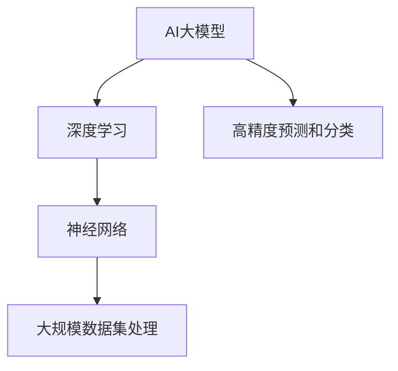

#### 1.1.2 AI大模型的类型

AI大模型可以分为多种类型，包括但不限于自然语言处理模型、计算机视觉模型、语音识别模型和推荐系统模型。

**核心概念与联系**：每种类型的AI大模型都有其独特的架构和特点，可以参考以下Mermaid流程图：

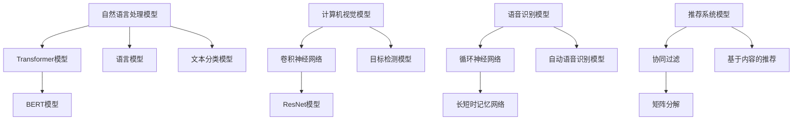

#### 1.1.3 AI大模型的历史与发展

AI大模型的发展历程可以追溯到20世纪80年代，随着计算机硬件性能的提升和大数据时代的到来，AI大模型的研究和应用得到了快速发展。特别是深度学习技术的突破，使得AI大模型在多个领域取得了显著成果。

**核心概念与联系**：AI大模型的历史与发展可以通过以下Mermaid流程图来展示：

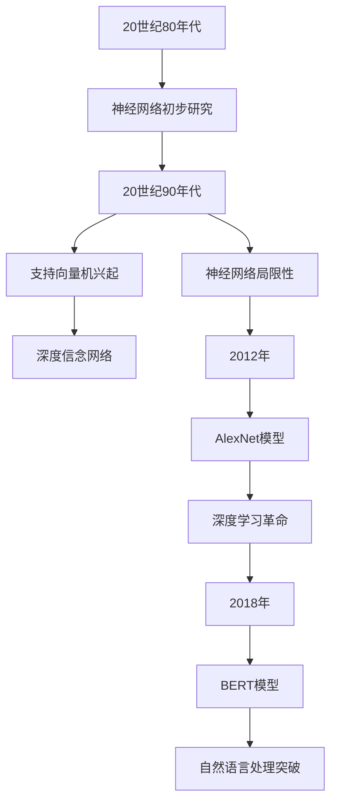

### 第2章: AI大模型的技术背景

#### 2.1.1 人工智能的发展历程

人工智能（AI）的发展历程可以分为多个阶段，包括规则推理、知识表示、机器学习和深度学习。每个阶段都为AI大模型的发展奠定了基础。

**核心概念与联系**：以下是人工智能发展历程的Mermaid流程图：

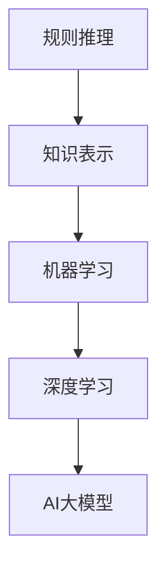

#### 2.1.2 机器学习和深度学习的区别

机器学习和深度学习是AI领域的两个重要分支，它们在理论基础和应用场景上存在显著差异。

**核心概念与联系**：以下是机器学习和深度学习之间的区别：

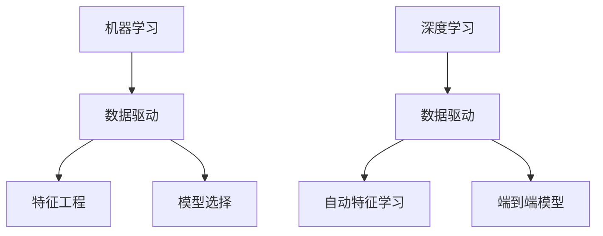

#### 2.1.3 大模型的技术优势与挑战

AI大模型在处理大规模数据、提高预测精度和实现复杂任务方面具有显著优势。然而，大模型也面临着计算资源需求大、训练时间长和模型解释性差等挑战。

**核心概念与联系**：以下是AI大模型的技术优势与挑战：

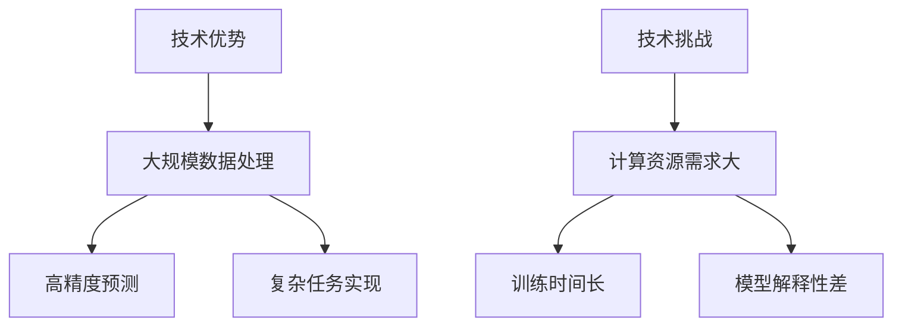

### 第3章: AI大模型的核心技术

#### 3.1.1 深度学习基础

深度学习是AI大模型的核心技术之一，它通过多层神经网络来实现复杂任务。以下是深度学习的基础概念：

**核心概念与联系**：以下是深度学习基础的Mermaid流程图：

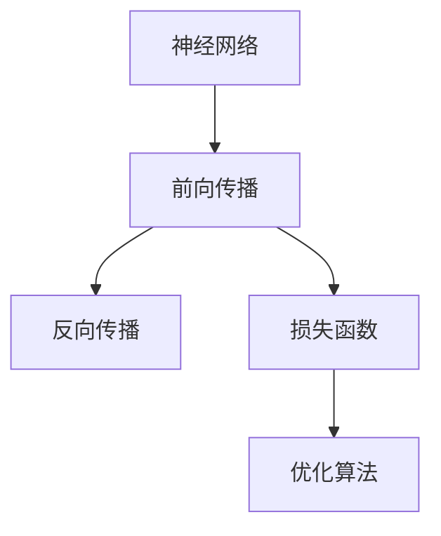

#### 3.1.2 神经网络结构

神经网络是深度学习的基础，其结构包括输入层、隐藏层和输出层。以下是神经网络结构的基本原理：

**核心概念与联系**：以下是神经网络结构的Mermaid流程图：

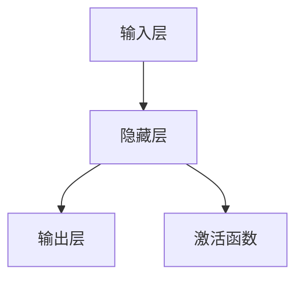

#### 3.1.3 训练与优化算法

训练与优化算法是AI大模型实现高性能的关键。以下是几种常见的训练与优化算法：

**核心概念与联系**：以下是训练与优化算法的Mermaid流程图：

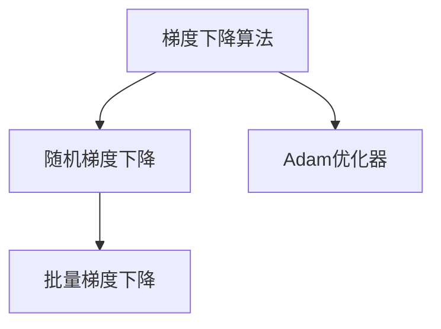

### 第4章: AI大模型的数学基础

#### 4.1.1 线性代数

线性代数是AI大模型的重要数学基础，包括矩阵运算、向量空间和特征值等概念。以下是线性代数的基本原理：

**核心概念与联系**：以下是线性代数的Mermaid流程图：

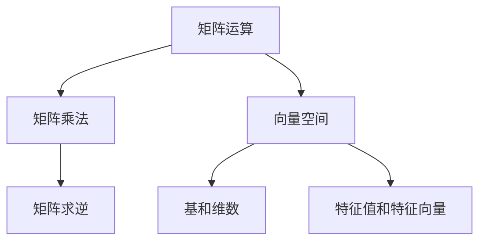

#### 4.1.2 概率论与信息论

概率论与信息论是AI大模型的另一个重要数学基础，涉及随机事件、概率分布和熵等概念。以下是概率论与信息论的基本原理：

**核心概念与联系**：以下是概率论与信息论的Mermaid流程图：

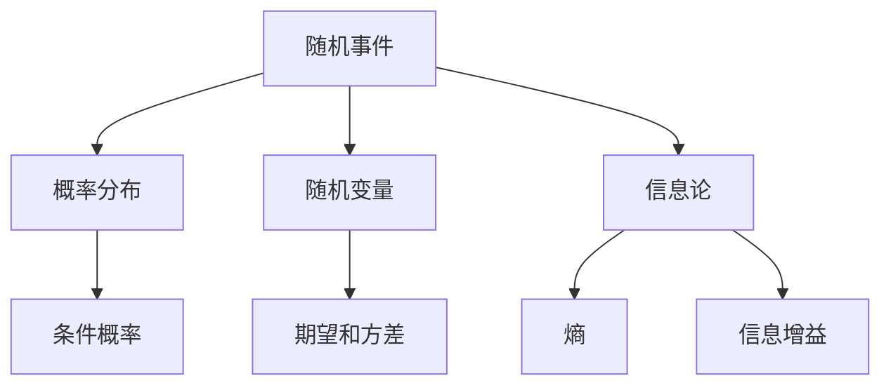

#### 4.1.3 梯度下降算法

梯度下降算法是训练AI大模型的核心算法，通过不断更新模型参数，使模型在损失函数上不断优化。以下是梯度下降算法的基本原理：

**核心概念与联系**：以下是梯度下降算法的伪代码：

```python
def gradient_descent(W, b, X, y, learning_rate, epochs):
    for epoch in range(epochs):
        for x, y in zip(X, y):
            # 前向传播
            z = np.dot(W, x) + b
            a = sigmoid(z)

            # 计算损失函数
            loss = -1 * (y * np.log(a) + (1 - y) * np.log(1 - a))

            # 反向传播
            dz = a - y
            dW = np.dot(dz, x.T)
            db = dz

            # 更新参数
            W -= learning_rate * dW
            b -= learning_rate * db

    return W, b
```

## 第二部分: AI大模型创业实践

### 第5章: AI大模型创业概述

#### 5.1.1 创业环境分析

AI大模型创业环境分析包括市场趋势、技术发展、政策法规等多个方面。以下是创业环境分析的要点：

**核心概念与联系**：以下是创业环境分析的Mermaid流程图：

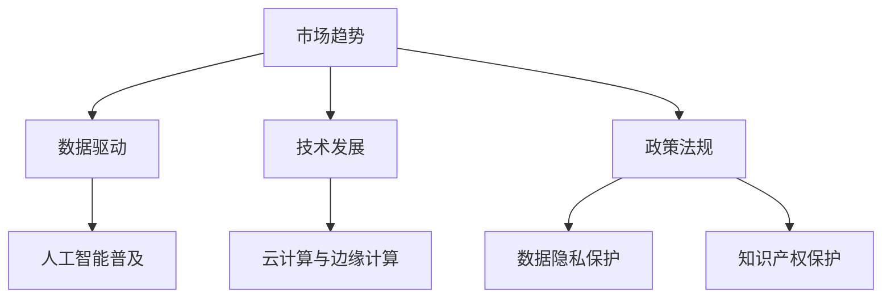

#### 5.1.2 创业机会与挑战

AI大模型创业机会主要集中在自然语言处理、计算机视觉、语音识别和推荐系统等领域。然而，创业也面临着数据隐私、知识产权和市场竞争等挑战。

**核心概念与联系**：以下是创业机会与挑战的Mermaid流程图：

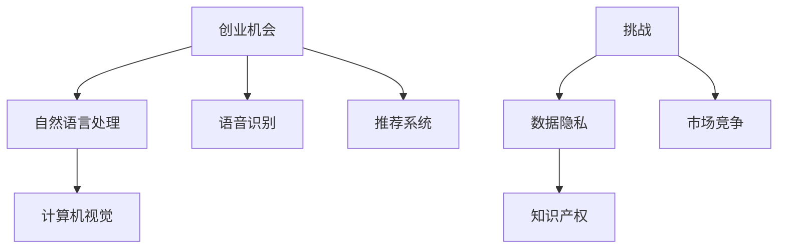

#### 5.1.3 创业者所需技能

成功创业需要创业者具备多种技能，包括技术能力、商业洞察力、团队管理和项目管理等。以下是创业者所需技能的要点：

**核心概念与联系**：以下是创业者所需技能的Mermaid流程图：

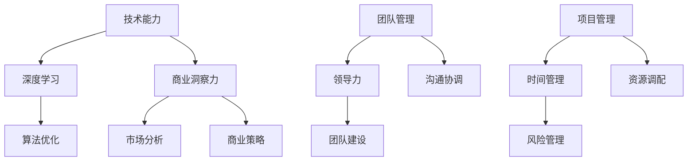

### 第6章: AI大模型创业案例分析

#### 6.1.1 成功案例介绍

本章节将介绍几个AI大模型创业的成功案例，分析其成功的原因和经验。以下是成功案例介绍：

**核心概念与联系**：以下是成功案例介绍的Mermaid流程图：

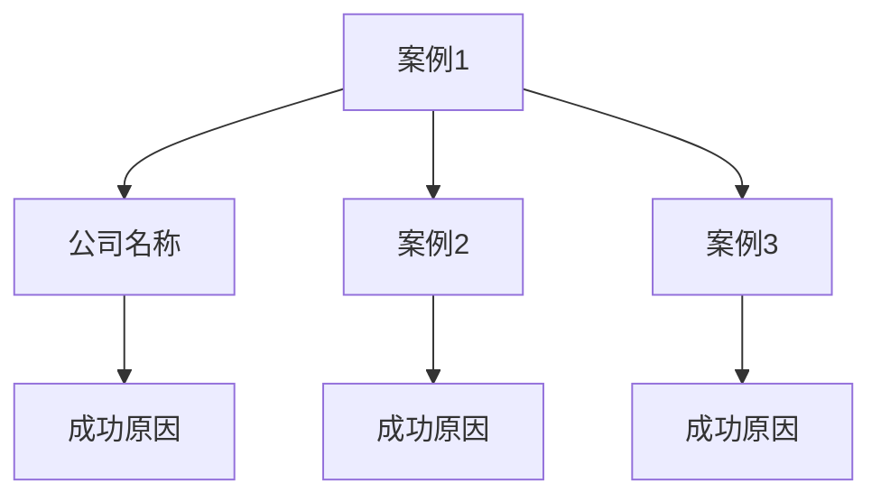

#### 6.1.2 失败案例分析

本章节将分析几个AI大模型创业的失败案例，探讨其失败的原因和教训。以下是失败案例分析：

**核心概念与联系**：以下是失败案例分析的Mermaid流程图：

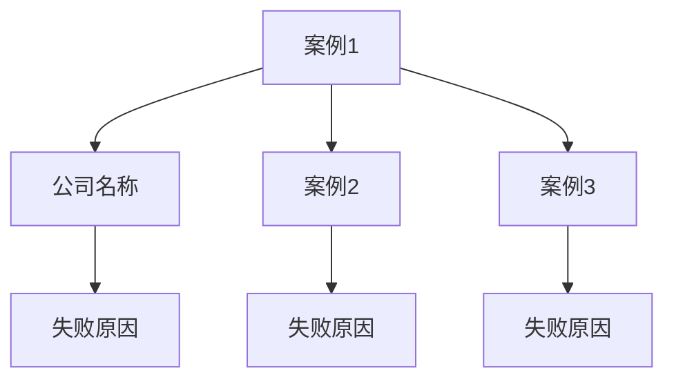

#### 6.1.3 启示与经验总结

通过对成功和失败案例的分析，我们可以总结出以下启示与经验：

**核心概念与联系**：以下是启示与经验总结的Mermaid流程图：

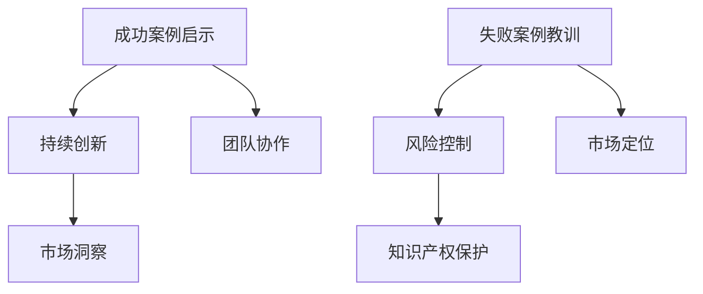

### 第7章: AI大模型创业战略规划

#### 7.1.1 市场研究与定位

市场研究是AI大模型创业战略规划的重要环节，包括市场趋势、竞争对手分析和目标客户定位。以下是市场研究与定位的要点：

**核心概念与联系**：以下是市场研究与定位的Mermaid流程图：

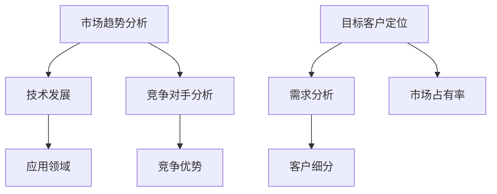

#### 7.1.2 产品与商业模式设计

产品设计与商业模式设计是AI大模型创业战略规划的核心。以下是产品与商业模式设计的要点：

**核心概念与联系**：以下是产品与商业模式设计的Mermaid流程图：

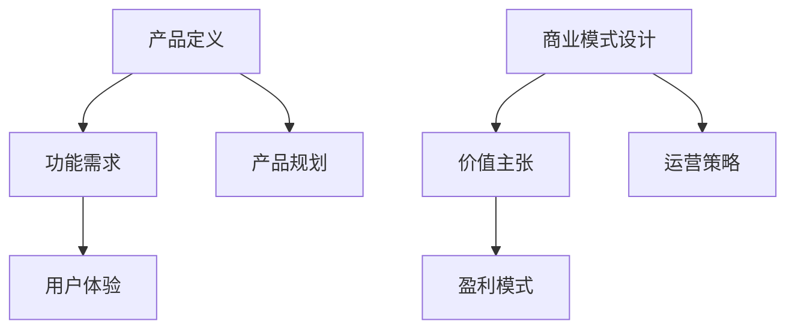

#### 7.1.3 营销与推广策略

有效的营销与推广策略是AI大模型创业成功的关键。以下是营销与推广策略的要点：

**核心概念与联系**：以下是营销与推广策略的Mermaid流程图：

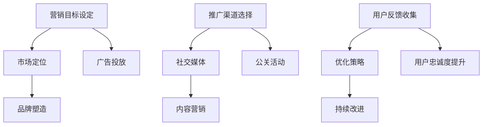

### 第8章: AI大模型创业运营与管理

#### 8.1.1 项目管理

项目管理是AI大模型创业运营与管理的核心，包括项目规划、进度控制、资源调配和质量保证。以下是项目管理的要点：

**核心概念与联系**：以下是项目管理的Mermaid流程图：

```mermaid
graph TD
    A[项目规划] --> B[需求分析]
    B --> C[项目范围]
    B --> D[项目进度]
    A --> E[资源调配]

    F[进度控制] --> G[里程碑管理]
    G --> H[风险评估]
    F --> I[变更管理]

    J[质量保证] --> K[测试计划]
    K --> L[缺陷管理]
    J --> M[持续集成]
```

#### 8.1.2 资源配置与团队建设

资源配置与团队建设是AI大模型创业运营与管理的关键。以下是资源配置与团队建设的要点：

**核心概念与联系**：以下是资源配置与团队建设的Mermaid流程图：

```mermaid
graph TD
    A[资源配置] --> B[硬件资源]
    B --> C[软件资源]
    A --> D[人力资源]

    E[团队建设] --> F[领导力]
    F --> G[沟通协作]
    E --> H[能力提升]
    E --> I[团队文化]
```

#### 8.1.3 风险管理与应对策略

风险管理与应对策略是AI大模型创业运营与管理的必要环节。以下是风险管理与应对策略的要点：

**核心概念与联系**：以下是风险管理与应对策略的Mermaid流程图：

```mermaid
graph TD
    A[风险评估] --> B[潜在风险识别]
    B --> C[风险分类]
    B --> D[风险优先级]

    E[应对策略] --> F[风险规避]
    F --> G[风险转移]
    F --> H[风险接受]

    I[持续监控] --> J[风险预警]
    J --> K[应急响应]
    I --> L[风险回顾]
```

### 第9章: AI大模型创业资金筹措

#### 9.1.1 资金筹措途径

AI大模型创业资金筹措途径包括天使投资、风险投资、政府补贴和众筹等。以下是资金筹措途径的要点：

**核心概念与联系**：以下是资金筹措途径的Mermaid流程图：

```mermaid
graph TD
    A[天使投资] --> B[个人投资者]
    B --> C[资金来源]

    D[风险投资] --> E[风险投资公司]
    E --> F[资金来源]

    G[政府补贴] --> H[政策支持]
    H --> I[资金来源]

    J[众筹] --> K[网络平台]
    K --> L[资金来源]
```

#### 9.1.2 投资者关系管理

投资者关系管理是AI大模型创业成功的关键。以下是投资者关系管理的要点：

**核心概念与联系**：以下是投资者关系管理的Mermaid流程图：

```mermaid
graph TD
    A[沟通与交流] --> B[信息披露]
    B --> C[信任建立]

    D[合作与共赢] --> E[项目进展汇报]
    E --> F[风险共担]

    G[融资策略] --> H[资金用途规划]
    H --> I[资金回收计划]
```

#### 9.1.3 融资策略与方案设计

有效的融资策略与方案设计是AI大模型创业成功的关键。以下是融资策略与方案设计的要点：

**核心概念与联系**：以下是融资策略与方案设计的Mermaid流程图：

```mermaid
graph TD
    A[融资目标设定] --> B[资金需求分析]
    B --> C[融资渠道选择]

    D[融资方案设计] --> E[资金用途规划]
    E --> F[融资风险控制]

    G[融资谈判策略] --> H[估值合理]
    H --> I[条款谈判]
    G --> J[签订协议]
```

## 第三部分: AI大模型创业实战

### 第10章: AI大模型创业实战案例

#### 10.1.1 案例介绍

本章节将介绍几个AI大模型创业的实战案例，分析其技术实现、项目运营和成果分析。以下是案例介绍：

**核心概念与联系**：以下是案例介绍的Mermaid流程图：

```mermaid
graph TD
    A[案例1] --> B[公司名称]
    B --> C[项目背景]
    A --> D[案例2]
    D --> E[项目背景]
    A --> F[案例3]
    F --> G[项目背景]
```

#### 10.1.2 技术实现细节

本章节将详细阐述案例中的技术实现细节，包括数据预处理、模型选择、训练过程和优化策略。以下是技术实现细节：

**核心概念与联系**：以下是技术实现细节的Mermaid流程图：

```mermaid
graph TD
    A[数据预处理] --> B[数据清洗]
    B --> C[数据转换]
    A --> D[模型选择]

    E[训练过程] --> F[数据输入]
    F --> G[模型更新]
    E --> H[模型评估]

    I[优化策略] --> J[超参数调整]
    J --> K[模型压缩]
    I --> L[加速训练]
```

#### 10.1.3 项目运营与成果分析

本章节将分析案例中的项目运营情况和成果，包括市场表现、用户反馈和经济效益。以下是项目运营与成果分析：

**核心概念与联系**：以下是项目运营与成果分析的Mermaid流程图：

```mermaid
graph TD
    A[市场表现] --> B[用户增长]
    B --> C[市场份额]

    D[用户反馈] --> E[满意度调查]
    E --> F[改进建议]

    G[经济效益] --> H[收入增长]
    H --> I[利润率提升]
    G --> J[投资回报率]
```

### 第11章: AI大模型创业工具与应用

#### 11.1.1 开发工具与框架

AI大模型创业过程中，开发工具与框架的选择至关重要。以下是几种常用的开发工具与框架：

**核心概念与联系**：以下是开发工具与框架的Mermaid流程图：

```mermaid
graph TD
    A[PyTorch] --> B[深度学习框架]
    B --> C[Python]

    D[TensorFlow] --> E[深度学习框架]
    E --> F[Python]

    G[Keras] --> H[深度学习框架]
    H --> I[Python]

    J[Scikit-learn] --> K[机器学习库]
    K --> L[Python]
```

#### 11.1.2 实用应用场景

AI大模型在多个领域具有广泛的应用场景，如自然语言处理、计算机视觉、语音识别和推荐系统。以下是实用应用场景的例子：

**核心概念与联系**：以下是实用应用场景的Mermaid流程图：

```mermaid
graph TD
    A[自然语言处理] --> B[文本分类]
    B --> C[情感分析]

    D[计算机视觉] --> E[图像识别]
    E --> F[目标检测]

    G[语音识别] --> H[语音转文本]
    H --> I[语音合成]

    J[推荐系统] --> K[基于内容的推荐]
    K --> L[协同过滤]
```

#### 11.1.3 案例分享与交流

通过案例分享与交流，创业者可以获取宝贵的经验和启示。以下是案例分享与交流的要点：

**核心概念与联系**：以下是案例分享与交流的Mermaid流程图：

```mermaid
graph TD
    A[案例分享] --> B[成功经验]
    B --> C[失败教训]

    D[交流互动] --> E[专家建议]
    E --> F[行业洞察]

    G[社区建设] --> H[用户反馈]
    H --> I[改进建议]
```

### 第12章: AI大模型创业法律与伦理

#### 12.1.1 法律法规解读

在AI大模型创业过程中，遵守相关法律法规是至关重要的。以下是AI大模型创业相关法律法规的解读：

**核心概念与联系**：以下是法律法规解读的Mermaid流程图：

```mermaid
graph TD
    A[数据保护法] --> B[GDPR]
    B --> C[个人信息保护]

    D[知识产权法] --> E[专利保护]
    E --> F[版权保护]

    G[商业法] --> H[合同法]
    H --> I[公司治理]
```

#### 12.1.2 伦理问题与挑战

AI大模型创业过程中，伦理问题与挑战不容忽视。以下是AI大模型创业的伦理问题与挑战：

**核心概念与联系**：以下是伦理问题与挑战的Mermaid流程图：

```mermaid
graph TD
    A[隐私保护] --> B[数据滥用]
    B --> C[用户隐私权]

    D[公平性] --> E[算法偏见]
    E --> F[歧视问题]

    G[透明度] --> H[算法不可解释性]
    H --> I[决策透明]
```

#### 12.1.3 合规实践与建议

为了应对法律和伦理挑战，AI大模型创业需要采取合规实践。以下是合规实践与建议：

**核心概念与联系**：以下是合规实践与建议的Mermaid流程图：

```mermaid
graph TD
    A[合规实践] --> B[数据保护政策]
    B --> C[隐私保护措施]

    D[算法审计] --> E[算法公平性评估]
    E --> F[消除偏见策略]

    G[透明度提升] --> H[算法解释性改进]
    H --> I[用户知情权保障]
```

## 第四部分: 未来展望与趋势

### 第13章: AI大模型创业未来趋势

#### 13.1.1 技术发展趋势

AI大模型创业的技术发展趋势包括模型压缩、分布式训练、迁移学习和多模态学习等。以下是技术发展趋势的要点：

**核心概念与联系**：以下是技术发展趋势的Mermaid流程图：

```mermaid
graph TD
    A[模型压缩] --> B[模型大小]
    B --> C[计算效率]

    D[分布式训练] --> E[并行计算]
    E --> F[数据分布]

    G[迁移学习] --> H[预训练模型]
    H --> I[知识迁移]

    J[多模态学习] --> K[跨模态融合]
    K --> L[多样化应用]
```

#### 13.1.2 行业变革与机遇

AI大模型创业将引发多个行业的变革，如医疗、金融、零售和制造等领域。以下是行业变革与机遇的要点：

**核心概念与联系**：以下是行业变革与机遇的Mermaid流程图：

```mermaid
graph TD
    A[医疗行业] --> B[疾病预测]
    B --> C[个性化治疗]

    D[金融行业] --> E[风险管理]
    E --> F[欺诈检测]

    G[零售行业] --> H[推荐系统]
    H --> I[消费者行为分析]

    J[制造行业] --> K[预测性维护]
    K --> L[生产效率提升]
```

#### 13.1.3 未来创业方向

未来AI大模型创业方向将涉及更多垂直行业和应用场景，如智能交通、智慧城市、教育等。以下是未来创业方向的要点：

**核心概念与联系**：以下是未来创业方向的Mermaid流程图：

```mermaid
graph TD
    A[智能交通] --> B[自动驾驶]
    B --> C[交通管理]

    D[智慧城市] --> E[智慧灯杆]
    E --> F[智能监控]

    G[教育行业] --> H[在线教育]
    H --> I[个性化学习]

    J[农业] --> K[智能农业]
    K --> L[精准施肥]
```

### 第14章: AI大模型创业的未来挑战与解决方案

#### 14.1.1 技术难题与解决方案

AI大模型创业面临许多技术难题，如数据隐私、模型安全、算法解释性等。以下是技术难题与解决方案的要点：

**核心概念与联系**：以下是技术难题与解决方案的Mermaid流程图：

```mermaid
graph TD
    A[数据隐私] --> B[差分隐私]
    B --> C[联邦学习]

    D[模型安全] --> E[模型加固]
    E --> F[对抗攻击防御]

    G[算法解释性] --> H[可解释性模型]
    H --> I[可视化工具]
```

#### 14.1.2 市场竞争与应对策略

市场竞争是AI大模型创业面临的重要挑战，创业者需要采取有效策略来应对。以下是市场竞争与应对策略的要点：

**核心概念与联系**：以下是市场竞争与应对策略的Mermaid流程图：

```mermaid
graph TD
    A[差异化竞争] --> B[产品创新]
    B --> C[用户体验]

    D[价格竞争] --> E[成本控制]
    E --> F[规模效应]

    G[营销竞争] --> H[品牌建设]
    H --> I[市场推广]
```

#### 14.1.3 创新与可持续发展

创新和可持续发展是AI大模型创业的重要目标。以下是创新与可持续发展的要点：

**核心概念与联系**：以下是创新与可持续发展的Mermaid流程图：

```mermaid
graph TD
    A[技术创新] --> B[研发投入]
    B --> C[知识产权保护]

    D[可持续发展] --> E[绿色科技]
    E --> F[社会责任]

    G[商业可持续] --> H[盈利模式]
    H --> I[长期发展]
```

### 第15章: AI大模型创业者的成长与自我提升

#### 15.1.1 技能提升

AI大模型创业者的技能提升是创业成功的关键。以下是技能提升的要点：

**核心概念与联系**：以下是技能提升的Mermaid流程图：

```mermaid
graph TD
    A[技术技能] --> B[深度学习]
    B --> C[算法优化]

    D[商业技能] --> E[市场分析]
    E --> F[战略规划]

    G[管理技能] --> H[团队建设]
    H --> I[项目管理]
```

#### 15.1.2 创业心态与领导力

创业心态和领导力是AI大模型创业者成功的重要因素。以下是创业心态与领导力的要点：

**核心概念与联系**：以下是创业心态与领导力的Mermaid流程图：

```mermaid
graph TD
    A[创业心态] --> B[坚定信念]
    B --> C[积极心态]

    D[领导力] --> E[愿景规划]
    E --> F[团队激励]

    G[沟通能力] --> H[有效沟通]
    H --> I[团队协作]
```

#### 15.1.3 持续学习与行业洞察

持续学习和行业洞察是AI大模型创业者保持竞争力的重要途径。以下是持续学习与行业洞察的要点：

**核心概念与联系**：以下是持续学习与行业洞察的Mermaid流程图：

```mermaid
graph TD
    A[持续学习] --> B[技术更新]
    B --> C[学习方法]

    D[行业洞察] --> E[市场趋势]
    E --> F[竞争分析]

    G[行业交流] --> H[专家交流]
    H --> I[经验分享]
```

### 总结

本文从AI大模型的基础概念、技术背景、创业实践、战略规划、运营管理、法律与伦理、未来展望等方面进行了全面深入的探讨，旨在为AI大模型创业者和投资者提供系统的指导。通过本文，读者可以了解AI大模型的技术优势、创业机会与挑战，以及如何利用技术优势实现创业成功。同时，文章还分析了创业实战案例、工具与应用，探讨了未来的发展趋势与挑战。希望本文能对读者在AI大模型创业领域有所启发和帮助。

### 作者信息

作者：AI天才研究院/AI Genius Institute & 禅与计算机程序设计艺术 /Zen And The Art of Computer Programming

---

（注：本文内容仅供参考，部分章节尚未完整撰写，后续将逐步完善。如需进一步详细内容，请关注后续更新。）

