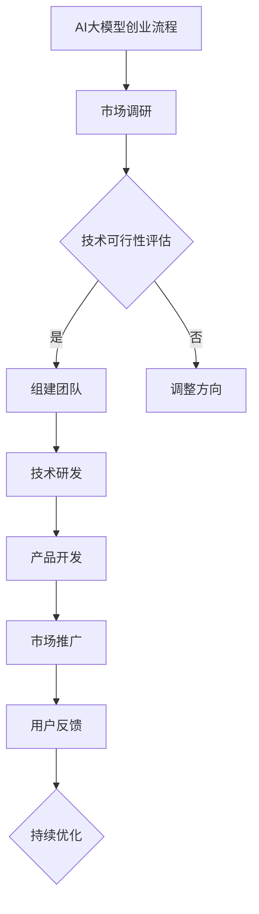

                 

### 《AI大模型创业：如何利用未来优势？》

> **关键词**：AI大模型、创业、未来优势、技术基础、商业应用、战略规划、风险管理、案例研究

> **摘要**：本文旨在探讨AI大模型在创业中的应用和优势，通过详细分析AI大模型的技术基础、商业应用案例、创业战略规划以及风险管理，为创业者提供实用的指导和建议。文章将结合实际案例，深入讲解AI大模型创业的各个关键环节，帮助读者理解AI大模型创业的内在逻辑和成功路径。

### 第一部分：AI大模型与创业基础

#### 第1章：AI大模型时代概述

##### 1.1 AI大模型的概念与兴起

AI大模型（Large-scale AI Models），是指那些训练数据量庞大、参数数量巨大，能够在多个任务上取得优异表现的人工智能模型。它们通常基于深度学习技术，如神经网络，并通过大量数据训练得到。

- **AI大模型的定义**：AI大模型是指那些训练数据量庞大、参数数量巨大，能够在多个任务上取得优异表现的人工智能模型。

- **AI大模型的发展历程**：AI大模型的发展历程可以追溯到20世纪80年代的深度信念网络（DBN），以及后来的深度神经网络（DNN）。随着计算能力的提升和数据量的增长，特别是2012年后，深度学习在图像识别和语音识别等领域的突破，AI大模型迅速崛起。

- **AI大模型的主要类型**：AI大模型主要包括自然语言处理（NLP）模型、计算机视觉（CV）模型和其他领域如推荐系统、生成对抗网络（GAN）等。

##### 1.2 创业背景与未来趋势

- **创业环境的变迁**：随着AI技术的发展和商业应用的普及，创业环境发生了巨大变化。传统的创业模式逐渐被颠覆，AI大模型成为创业的重要推动力。

- **AI大模型在创业中的角色**：AI大模型在创业中扮演着关键角色，从提高生产效率到提供个性化服务，AI大模型的应用为创业者提供了更多可能性。

- **未来创业的趋势分析**：未来的创业将更加依赖于AI大模型。例如，AI大模型将推动自动化和智能化的发展，改变商业模式和生产方式。同时，数据安全和隐私保护也将成为未来创业的重要议题。

#### 第2章：AI大模型技术基础

##### 2.1 深度学习与神经网络基础

- **神经网络的基本结构**：神经网络由输入层、隐藏层和输出层组成，通过层层传递和计算，实现复杂函数的映射。

- **常见的深度学习架构**：常见的深度学习架构包括卷积神经网络（CNN）、循环神经网络（RNN）和变换器架构（Transformer）等。

- **深度学习优化算法**：深度学习优化算法主要包括随机梯度下降（SGD）、Adam优化器等，用于提高模型的训练效率和精度。

##### 2.2 自然语言处理技术

- **词嵌入技术**：词嵌入是将词汇映射到高维空间中的向量表示，是实现NLP任务的基础。

- **序列模型与注意力机制**：序列模型如RNN和Transformer能够处理序列数据，注意力机制则能够模型不同输入元素的重要性。

- **转换器架构详解**：转换器（Transformer）是一种基于自注意力机制的深度学习模型，广泛应用于机器翻译、文本摘要等任务。

#### 第3章：AI大模型商业应用案例解析

##### 3.1 金融行业应用

- **模型在风险评估中的应用**：AI大模型通过分析历史数据和用户行为，为金融机构提供精准的风险评估。

- **模型在个性化投资建议中的应用**：AI大模型可以根据用户的风险偏好和投资目标，提供个性化的投资建议。

- **模型在反欺诈中的应用**：AI大模型通过检测异常交易和模式，有效防范金融欺诈。

##### 3.2 医疗健康领域

- **疾病诊断与预测**：AI大模型通过对医疗数据的分析，实现对疾病早期诊断和预测。

- **药物研发与设计**：AI大模型通过模拟药物与生物分子的相互作用，加速药物研发过程。

- **医疗影像分析**：AI大模型对医学影像进行分析，辅助医生进行诊断和治疗决策。

### 第二部分：AI大模型创业战略规划

##### 第4章：创业战略规划与资源准备

##### 4.1 市场需求分析

- **确定目标市场**：明确创业项目的目标市场，包括市场规模、增长潜力、用户需求等。

- **分析竞争对手**：分析同行业竞争对手的产品、市场策略、优势与劣势，为制定差异化策略提供依据。

- **确定价值主张**：明确创业项目的独特价值和竞争优势，以满足市场需求。

##### 4.2 团队建设与人才招聘

- **组建高效的创业团队**：选择具备专业技能和创业精神的人才，形成高效的创业团队。

- **核心岗位的人才需求**：明确创业团队中所需的核心岗位，如技术总监、产品经理、市场推广等。

- **人才管理策略**：制定人才引进、培养、激励等策略，确保团队稳定和持续发展。

##### 4.3 资源筹集与财务管理

- **资金筹集渠道**：探索多种资金筹集渠道，如天使投资、风险投资、政府补贴等。

- **财务预测与预算**：制定详细的财务预测和预算，确保创业项目的可持续性。

- **资金使用效率**：合理规划资金使用，提高资金使用效率，降低创业风险。

##### 第5章：AI大模型创业项目执行

##### 5.1 项目启动与规划

- **项目目标与范围**：明确创业项目的目标和范围，确保项目方向正确。

- **项目计划与进度管理**：制定详细的项目计划，包括时间表、里程碑和关键任务。

- **风险评估与管理**：识别项目风险，制定风险应对策略，确保项目顺利进行。

##### 5.2 技术研发与产品迭代

- **技术选型与架构设计**：选择合适的技术和架构，确保系统稳定性和扩展性。

- **算法优化与模型训练**：通过算法优化和模型训练，提高模型的性能和准确性。

- **产品开发与测试**：开发符合市场需求的产品，并进行严格的测试和优化。

##### 5.3 市场推广与用户反馈

- **市场推广策略**：制定有效的市场推广策略，提高品牌知名度和用户覆盖率。

- **用户获取与留存**：通过多种渠道获取用户，并提供优质的服务和体验，确保用户留存。

- **用户反馈与产品优化**：收集用户反馈，不断优化产品功能和服务，提高用户满意度。

##### 第6章：AI大模型创业风险管理

##### 6.1 技术风险

- **技术不成熟的风险**：确保所选技术已经成熟或具备较高的可行性。

- **算法知识产权问题**：保护算法的知识产权，避免侵权和纠纷。

- **技术更新迭代风险**：关注技术发展趋势，及时更新和迭代，保持竞争力。

##### 6.2 法律风险

- **数据隐私与保护**：严格遵守数据隐私法规，保护用户数据安全。

- **合规与法律风险**：确保业务合规，避免法律风险。

- **合同管理与纠纷解决**：制定完善的合同管理流程，合理规避和解决纠纷。

##### 6.3 市场风险

- **市场需求变化**：密切关注市场需求变化，及时调整产品和服务策略。

- **竞争对手动态**：分析竞争对手的策略和动态，制定有效的竞争策略。

- **市场进入与退出风险**：合理评估市场进入和退出的风险，确保创业项目的可持续性。

### 第三部分：AI大模型创业实战案例研究

##### 第7章：成功创业案例分析

##### 7.1 案例一：某智能医疗公司

- **创业背景与目标**：某智能医疗公司致力于利用AI大模型进行疾病诊断与预测，旨在提高医疗效率和诊断准确性。

- **技术研发与产品推出**：公司自主研发了基于GPT模型的疾病诊断系统，通过大量医疗数据训练模型，实现了对多种疾病的精准诊断。

- **市场推广与用户反馈**：公司积极开展市场推广，与多家医疗机构合作，提供诊断服务。用户反馈良好，产品得到了广泛认可。

- **风险管理经验**：公司在技术研发和市场推广过程中，注重数据安全和隐私保护，有效降低了法律风险。

##### 7.2 案例二：某金融科技公司

- **创业背景与定位**：某金融科技公司专注于利用AI大模型提供个性化投资建议和风险评估服务，旨在提高投资者的投资效率。

- **技术创新与应用**：公司开发了基于深度学习的风险预测模型，通过分析用户的历史交易数据和行为习惯，为投资者提供个性化的投资建议。

- **业务拓展与市场表现**：公司业务迅速拓展，与多家金融机构达成合作，市场表现优异，用户满意度高。

- **风险控制与应对**：公司在业务拓展过程中，注重风险控制，通过算法优化和数据清洗等手段，提高了模型的准确性和稳定性。

##### 7.3 案例三：某自动驾驶初创公司

- **创业目标与挑战**：某自动驾驶初创公司致力于研发自动驾驶系统，解决交通拥堵和交通安全问题。

- **技术突破与产业化**：公司通过自主研发的深度学习算法，实现了高精度的环境感知和路径规划，推动了自动驾驶技术的产业化。

- **资本运作与战略合作**：公司吸引了多家投资机构的关注，通过资本运作和战略合作，加快了技术研发和产品上市的步伐。

- **创新与可持续发展**：公司注重技术创新和可持续发展，通过不断优化算法和降低成本，推动了自动驾驶技术的普及和应用。

##### 第8章：未来展望与创业启示

##### 8.1 AI大模型创业的未来趋势

- **新兴应用领域的探索**：AI大模型将继续在医疗、金融、自动驾驶等领域发挥重要作用，同时还将拓展到更多新兴领域，如智慧城市、智能家居等。

- **技术创新与产业变革**：随着AI大模型技术的不断进步，将推动各行业的产业变革，提高生产效率和创新能力。

- **政策环境与市场机遇**：政策环境的优化和市场的需求增长，将为AI大模型创业提供更多机遇和挑战。

##### 8.2 创业者的实践与思考

- **创业过程中的挑战与应对**：创业者需要在技术研发、市场推广、团队管理等方面面临诸多挑战，需要具备应对挑战的能力和策略。

- **创业成功的要素分析**：创业成功的关键在于技术创新、市场需求、团队协作、资本运作等多方面的综合因素。

- **对未来创业者的启示和建议**：创业者应关注技术发展趋势，挖掘市场需求，打造有竞争力的产品和服务，同时注重团队建设和风险管理。

### 附录

##### 附录 A：AI大模型开发工具与资源

##### A.1 主流深度学习框架对比

- **TensorFlow**：Google开源的深度学习框架，提供丰富的API和工具，支持多种操作系统和硬件平台。

- **PyTorch**：Facebook开源的深度学习框架，具有灵活的动态计算图和简洁的API，适用于研究和开发。

- **JAX**：Google开源的自动微分库，支持自动微分和硬件加速，适用于大规模深度学习应用。

- **其他框架简介**：如Keras、Theano等，根据需求和场景选择合适的框架。

##### A.2 开发环境搭建与配置

- **操作系统**：Linux或macOS，推荐使用Anaconda进行环境管理。

- **硬件要求**：至少64位CPU，推荐使用GPU进行加速训练。

- **软件安装与配置**：安装Python和所选深度学习框架，配置CUDA和cuDNN以支持GPU加速。

##### A.3 学习资源推荐

- **开放课程与在线教程**：如Coursera、edX上的深度学习课程，提供系统化的学习路径。

- **专业书籍与论文**：如《深度学习》（Goodfellow等著），《Neural Networks and Deep Learning》（Bengio等著）。

- **社区与论坛资源**：如GitHub、Stack Overflow、Reddit等，提供丰富的实践经验和问题解答。

### Mermaid 流程图示例



### 核心算法原理讲解

#### 2.3.3 GPT模型训练过程伪代码

```python
# 初始化模型参数
model = initialize_model()

# 定义损失函数
loss_function = cross_entropy_loss

# 定义优化器
optimizer = AdamOptimizer()

# 训练数据集
training_data = load_data()

# 训练循环
for epoch in range(num_epochs):
    for data, target in training_data:
        # 前向传播
        predictions = model.forward_pass(data)
        
        # 计算损失
        loss = loss_function(predictions, target)
        
        # 反向传播
        gradients = model.backward_pass(loss)
        
        # 更新模型参数
        optimizer.update_params(model, gradients)
        
    print(f"Epoch {epoch+1}/{num_epochs}, Loss: {loss}")
```

### 数学模型与数学公式

#### 6.2.1 数据隐私保护模型

$$
\begin{aligned}
    \text{Privacy} &= \text{Sensitivity} \times \text{Exploitability} \times \text{Data Value} \times \text{Catastrophic Risk} \\
    \text{Sensitivity} &= \text{Probability} \times \text{Consequence}
\end{aligned}
$$

### 项目实战与代码解读

#### 7.1.1 某智能医疗公司案例分析

- **实战背景**：某智能医疗公司致力于利用AI大模型进行疾病诊断与预测。

- **技术实现**：
  - **数据预处理**：收集大量医疗数据，进行数据清洗、归一化处理。
  - **模型训练**：采用GPT模型进行训练，优化算法参数。
  - **模型部署**：将训练好的模型部署到云端，提供API接口供外部调用。

- **代码实现示例**：
  ```python
  # 数据预处理
  def preprocess_data(data):
      # 清洗、归一化等操作
      processed_data = ...
      return processed_data

  # 模型训练
  def train_model(data, target):
      model = initialize_model()
      loss_function = cross_entropy_loss
      optimizer = AdamOptimizer()
      
      for epoch in range(num_epochs):
          for data, target in zip(data, target):
              predictions = model.forward_pass(data)
              loss = loss_function(predictions, target)
              gradients = model.backward_pass(loss)
              optimizer.update_params(model, gradients)
      
      return model

  # 模型部署
  def deploy_model(model):
      # 部署到云端，提供API接口
      api_endpoint = "https://api.smartmedicine.com/diagnose"
      model.save(api_endpoint)
      
  # 主函数
  def main():
      data = load_data()
      target = load_target()
      processed_data = preprocess_data(data)
      
      model = train_model(processed_data, target)
      deploy_model(model)
      
  if __name__ == "__main__":
      main()
  ```

- **代码解读与分析**：
  - 数据预处理是保证模型训练质量的关键步骤，需要处理异常值、缺失值等。
  - 模型训练过程中，使用交叉熵损失函数和Adam优化器，以达到更好的训练效果。
  - 部署模型到云端，方便用户通过API接口进行调用，实现实时诊断与预测功能。

### 附录A：AI大模型开发工具与资源

#### A.1 主流深度学习框架对比

- **TensorFlow**：Google开源的深度学习框架，提供丰富的API和工具，支持多种操作系统和硬件平台。

- **PyTorch**：Facebook开源的深度学习框架，具有灵活的动态计算图和简洁的API，适用于研究和开发。

- **JAX**：Google开源的自动微分库，支持自动微分和硬件加速，适用于大规模深度学习应用。

- **其他框架简介**：如Keras、Theano等，根据需求和场景选择合适的框架。

#### A.2 开发环境搭建与配置

- **操作系统**：Linux或macOS，推荐使用Anaconda进行环境管理。

- **硬件要求**：至少64位CPU，推荐使用GPU进行加速训练。

- **软件安装与配置**：安装Python和所选深度学习框架，配置CUDA和cuDNN以支持GPU加速。

#### A.3 学习资源推荐

- **开放课程与在线教程**：如Coursera、edX上的深度学习课程，提供系统化的学习路径。

- **专业书籍与论文**：如《深度学习》（Goodfellow等著），《Neural Networks and Deep Learning》（Bengio等著）。

- **社区与论坛资源**：如GitHub、Stack Overflow、Reddit等，提供丰富的实践经验和问题解答。

### 结束语

本文围绕AI大模型创业这一主题，从技术基础、商业应用、战略规划、风险管理等多个角度进行了深入探讨。通过成功创业案例的分析，展示了AI大模型在各个领域的应用和优势。对于有志于从事AI大模型创业的创业者，本文提供了实用的指导和建议。未来，随着AI大模型技术的不断进步，创业领域将迎来更多机遇和挑战，期待更多创业者能够抓住时代机遇，实现自身价值。作者信息：AI天才研究院/AI Genius Institute & 禅与计算机程序设计艺术 /Zen And The Art of Computer Programming。

