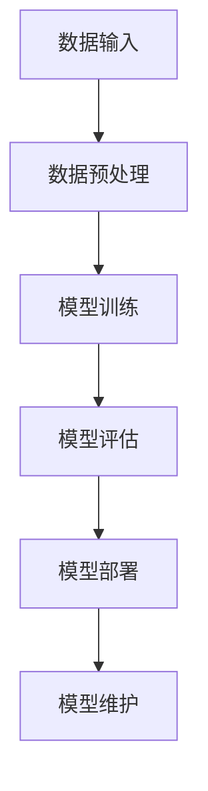

                 

# AI 大模型创业：如何利用资源优势？

> **关键词：** AI大模型、创业、资源利用、战略规划、商业模式、实战

> **摘要：** 本文旨在探讨AI大模型创业过程中的资源利用策略，包括技术、人才、资金等关键资源的整合与优化。通过案例分析，提供创业者在AI大模型领域取得成功的实用指导。

### 第一部分: AI大模型基础理论

#### 第1章: AI大模型概述

##### 1.1 AI大模型的概念与分类

###### 1.1.1 AI大模型的定义

AI大模型是指通过大规模数据集进行训练，具有亿级别参数量的人工智能模型。它们通常能够处理复杂的任务，并在多种领域表现出优异的性能。

###### 1.1.2 AI大模型的分类

AI大模型可以根据应用领域和模型类型进行分类。常见的分类包括自然语言处理（NLP）、计算机视觉（CV）、语音识别（ASR）和推荐系统等。

###### 1.1.3 AI大模型与传统AI模型对比

与传统AI模型相比，AI大模型具有以下特点：

- **参数量巨大**：传统模型通常只有数千到数万参数，而AI大模型拥有数亿甚至数千亿参数。
- **数据需求量大**：AI大模型需要大规模数据集进行训练，以实现更好的泛化能力。
- **计算资源需求高**：训练AI大模型需要大量的计算资源，如GPU或TPU。

##### 1.2 AI大模型的原理

###### 1.2.1 深度学习基础

深度学习是AI大模型的核心技术。它通过多层神经网络对数据进行建模，从而实现复杂的任务。

###### 1.2.2 大规模预训练模型

大规模预训练模型是指在大规模数据集上进行预训练，然后通过微调来适应特定任务。这种方法能够提高模型的泛化能力和性能。

###### 1.2.3 跨模态学习

跨模态学习是指将不同类型的数据（如图像、文本、音频）进行融合，以实现更强大的模型。例如，视觉和文本的跨模态学习可以用于图像识别和文本生成等任务。

##### 1.3 AI大模型在行业中的应用

###### 1.3.1 互联网行业

在互联网行业，AI大模型被广泛应用于推荐系统、搜索引擎、聊天机器人等领域。例如，推荐系统利用AI大模型来提供个性化的内容推荐。

###### 1.3.2 制造业

在制造业，AI大模型被用于质量检测、生产优化和预测维护等。例如，通过计算机视觉AI大模型来检测生产线上的缺陷。

###### 1.3.3 医疗保健

在医疗保健领域，AI大模型被用于疾病诊断、药物研发和医疗数据分析。例如，通过AI大模型来分析医学影像，辅助医生进行诊断。

#### 第2章: AI大模型关键算法原理

##### 2.1 深度学习算法

###### 2.1.1 神经网络

神经网络是深度学习的基础。它由多个神经元（或节点）组成，通过前向传播和反向传播来更新权重。

###### 2.1.2 卷积神经网络（CNN）

CNN是用于处理图像数据的深度学习模型。它通过卷积层、池化层和全连接层来提取图像特征。

###### 2.1.3 循环神经网络（RNN）

RNN适用于处理序列数据。它通过隐藏状态和循环连接来捕捉序列中的长期依赖关系。

###### 2.1.4 自注意力机制

自注意力机制是一种用于处理序列数据的机制，能够自适应地关注序列中的关键部分。它广泛应用于NLP任务中，如BERT模型。

##### 2.2 自然语言处理算法

###### 2.2.1 词嵌入

词嵌入是将单词映射到高维空间中，以捕捉单词的语义信息。

###### 2.2.2 语言模型

语言模型用于预测下一个单词或字符。它通过统计方法或神经网络来建模自然语言。

###### 2.2.3 机器翻译

机器翻译是将一种语言翻译成另一种语言。它通常使用基于神经网络的模型，如Seq2Seq模型。

###### 2.2.4 问答系统

问答系统是一种基于自然语言处理的技术，能够回答用户提出的问题。

##### 2.3 图神经网络算法

###### 2.3.1 图神经网络基础

图神经网络是一种用于处理图数据的深度学习模型。它通过图卷积层来提取图中的特征。

###### 2.3.2 图嵌入

图嵌入是将图中的节点映射到低维空间中，以捕捉节点的属性和关系。

###### 2.3.3 图分类

图分类是将图数据分类到不同的类别。它通常使用图神经网络来建模图数据。

###### 2.3.4 图生成

图生成是创建新的图数据。它通过图生成模型，如图生成对抗网络（GGAN），来实现。

#### 第3章: AI大模型架构设计

##### 3.1 AI大模型架构概述

AI大模型架构通常包括数据输入、模型训练、模型评估和模型部署等环节。一个典型的AI大模型架构如下图所示：



##### 3.2 模型训练与优化

###### 3.2.1 数据预处理

数据预处理是模型训练的第一步，包括数据清洗、数据归一化和数据增强等。

###### 3.2.2 模型选择

模型选择是根据任务需求和数据特性来选择合适的模型。

###### 3.2.3 模型训练

模型训练是通过迭代优化模型参数，使模型在训练数据上达到较好的性能。

###### 3.2.4 模型调优

模型调优是通过调整模型参数和超参数，进一步提高模型性能。

##### 3.3 模型部署与维护

###### 3.3.1 部署环境搭建

部署环境搭建是为模型部署准备合适的环境，包括硬件配置和软件环境。

###### 3.3.2 模型部署流程

模型部署流程包括模型导出、模型部署和模型服务化等步骤。

###### 3.3.3 模型维护与升级

模型维护与升级包括定期检查模型性能、更新模型和数据等。

### 第二部分: AI大模型创业实战

#### 第4章: AI大模型创业战略规划

##### 4.1 创业团队建设

###### 4.1.1 团队成员分工

团队成员分工是根据团队成员的技能和经验来划分任务。

###### 4.1.2 技术能力构建

技术能力构建是通过学习和技术研发来提升团队的技术水平。

###### 4.1.3 管理与激励机制

管理与激励机制是通过合理的制度和激励措施来提高团队的效率和积极性。

##### 4.2 市场需求分析

###### 4.2.1 市场机会识别

市场机会识别是通过市场调研来发现潜在的商机。

###### 4.2.2 竞争对手分析

竞争对手分析是通过研究竞争对手的产品和市场策略来制定相应的策略。

###### 4.2.3 产品定位与市场策略

产品定位与市场策略是根据市场需求和竞争环境来制定产品定位和市场推广策略。

##### 4.3 资源整合与利用

###### 4.3.1 数据资源获取

数据资源获取是通过公开数据集、合作数据源或购买数据集来获取训练数据。

###### 4.3.2 人才资源引进

人才资源引进是通过招聘、培训和引进高端人才来提升团队的技术实力。

###### 4.3.3 资金筹集与管理

资金筹集与管理是通过天使投资、风险投资或政府资助来筹集资金，并通过合理的资金管理来确保项目的可持续发展。

#### 第5章: AI大模型产品开发

##### 5.1 产品设计思路

###### 5.1.1 用户需求调研

用户需求调研是通过用户访谈、问卷调查等方式来了解用户需求。

###### 5.1.2 功能模块划分

功能模块划分是根据用户需求来划分产品的功能模块。

###### 5.1.3 技术路线选择

技术路线选择是根据产品的需求和可行性来选择合适的技术路线。

##### 5.2 算法研究与开发

###### 5.2.1 算法需求分析

算法需求分析是根据产品的需求来分析需要用到的算法。

###### 5.2.2 算法设计与实现

算法设计与实现是根据算法需求来设计算法并实现代码。

###### 5.2.3 算法优化与测试

算法优化与测试是通过优化算法和测试来提高算法的效率和准确性。

##### 5.3 产品原型设计与开发

###### 5.3.1 原型设计流程

原型设计流程是通过用户调研、需求分析、原型设计和迭代来设计产品原型。

###### 5.3.2 前端与后端开发

前端与后端开发是通过实现前端界面和后端服务来构建产品原型。

###### 5.3.3 测试与迭代

测试与迭代是通过测试和迭代来优化产品原型，满足用户需求。

#### 第6章: AI大模型商业模式与推广

##### 6.1 商业模式设计

###### 6.1.1 收入来源分析

收入来源分析是通过分析市场和企业资源来确定收入来源。

###### 6.1.2 成本控制策略

成本控制策略是通过优化资源配置和降低成本来确保企业的盈利能力。

###### 6.1.3 营销推广策略

营销推广策略是通过线上和线下渠道来推广产品，吸引潜在用户。

##### 6.2 市场推广策略

###### 6.2.1 品牌建设与宣传

品牌建设与宣传是通过品牌定位、广告投放和公关活动来提升品牌知名度。

###### 6.2.2 渠道拓展与合作

渠道拓展与合作是通过建立渠道和合作伙伴关系来扩大市场覆盖。

###### 6.2.3 用户增长与留存

用户增长与留存是通过优化用户体验、提供增值服务和实施用户激励策略来增加用户数量和留住用户。

##### 6.3 数据分析与运营优化

###### 6.3.1 用户行为分析

用户行为分析是通过收集和分析用户行为数据来了解用户需求和行为习惯。

###### 6.3.2 数据驱动优化

数据驱动优化是通过分析用户行为数据来优化产品和运营策略。

###### 6.3.3 运营策略调整

运营策略调整是通过分析运营数据来调整运营策略，提高运营效率。

#### 第7章: AI大模型创业挑战与应对

##### 7.1 技术挑战

###### 7.1.1 模型性能优化

模型性能优化是通过算法优化、模型压缩和硬件加速等技术手段来提高模型性能。

###### 7.1.2 数据隐私保护

数据隐私保护是通过加密、匿名化和差分隐私等技术手段来保护用户数据隐私。

###### 7.1.3 模型安全性

模型安全性是通过安全训练、模型加固和攻击防御等技术手段来提高模型安全性。

##### 7.2 市场竞争

###### 7.2.1 竞争对手分析

竞争对手分析是通过研究竞争对手的产品、市场份额和策略来制定相应的竞争策略。

###### 7.2.2 市场定位与差异化

市场定位与差异化是通过分析市场需求和竞争环境来制定市场定位和差异化策略。

###### 7.2.3 应对策略

应对策略是通过技术创新、市场拓展和品牌建设来应对市场竞争。

##### 7.3 团队管理

###### 7.3.1 团队文化建设

团队文化建设是通过建立共同价值观、培养团队协作精神和加强团队沟通来打造优秀团队。

###### 7.3.2 人才引进与培养

人才引进与培养是通过招聘、培训和激励措施来引进和培养优秀人才。

###### 7.3.3 激励机制与绩效管理

激励机制与绩效管理是通过建立激励机制和绩效管理体系来激发员工的积极性和创造力。

### 附录

#### 附录A: AI大模型开发工具与资源

##### A.1 开发工具介绍

###### A.1.1 TensorFlow

TensorFlow是谷歌开源的深度学习框架，支持多种编程语言，如Python、C++和Java。它提供了丰富的API和工具，用于构建、训练和部署深度学习模型。

###### A.1.2 PyTorch

PyTorch是Facebook开源的深度学习框架，以其灵活性和动态计算图而受到广泛关注。它提供了简洁的API，易于调试和扩展。

###### A.1.3 其他深度学习框架

除了TensorFlow和PyTorch，还有其他深度学习框架，如Keras、Theano和MXNet等，它们各有优缺点，适用于不同的应用场景。

##### A.2 学习资源推荐

###### A.2.1 书籍推荐

- 《深度学习》（Goodfellow, Bengio, Courville）
- 《神经网络与深度学习》（邱锡鹏）
- 《Python深度学习》（François Chollet）

这些书籍涵盖了深度学习和AI大模型的基础理论和实践应用，是深度学习学习者的必备资源。

###### A.2.2 在线课程推荐

- Coursera的《深度学习》课程
- edX的《深度学习导论》课程
- Udacity的《深度学习纳米学位》课程

这些在线课程提供了系统的深度学习知识体系，适合不同层次的学员。

###### A.2.3 论文推荐

- "A Neural Algorithm of Artistic Style"（2015）
- "Attention Is All You Need"（2017）
- "Generative Adversarial Nets"（2014）

这些论文介绍了深度学习领域的最新研究成果和前沿技术，对于想要深入了解AI大模型的技术人员具有重要参考价值。

### 结语

AI大模型创业是一个充满机遇和挑战的过程。通过深入理解AI大模型的基础理论和关键算法原理，合理规划创业战略，有效整合和利用资源，创业者可以在这个领域取得成功。本文旨在为创业者提供一份全面的创业指南，帮助他们在AI大模型创业的道路上走得更远、更稳。

#### 作者：AI天才研究院/AI Genius Institute & 禅与计算机程序设计艺术 /Zen And The Art of Computer Programming

**本文为作者原创，未经授权不得转载。如需转载，请联系作者。**<|im_end|>## 文章标题：AI 大模型创业：如何利用资源优势？

### 关键词：AI大模型、创业、资源利用、战略规划、商业模式

> 摘要：本文深入探讨了AI大模型创业过程中如何高效利用资源优势。通过理论剖析和实战案例分析，文章详细介绍了AI大模型的基础理论、关键算法原理、创业战略规划、产品开发、商业模式设计及市场推广策略，为AI创业公司提供了切实可行的指导。文章结尾还附有AI大模型开发工具与资源的推荐，帮助读者进一步提升实践能力。

### 引言

随着人工智能技术的飞速发展，AI大模型已经成为诸多行业变革的核心驱动力。AI大模型，也称为大型预训练模型，具有参数量巨大、数据需求量大、计算资源需求高等特点。在自然语言处理、计算机视觉、语音识别等领域，AI大模型展现出了卓越的性能，推动了行业技术的革新和商业模式的变革。

然而，AI大模型创业并非易事。创业者需要面对诸多挑战，如技术难题、市场竞争力、资源限制等。如何在竞争激烈的环境中脱颖而出，实现商业成功，是每位创业者都需要深思熟虑的问题。本文旨在探讨AI大模型创业过程中如何利用资源优势，提供实用的指导和建议。

本文结构如下：

1. **第一部分：AI大模型基础理论**：介绍AI大模型的概念与分类、关键算法原理以及AI大模型架构设计。
2. **第二部分：AI大模型创业实战**：探讨AI大模型创业战略规划、产品开发、商业模式设计及市场推广策略。
3. **第三部分：AI大模型创业挑战与应对**：分析技术挑战、市场竞争和团队管理等方面，提供应对策略。
4. **附录**：推荐AI大模型开发工具与学习资源。

通过本文的阅读，读者将全面了解AI大模型创业的方方面面，掌握利用资源优势实现商业成功的策略和方法。

### 第一部分：AI大模型基础理论

#### 第1章：AI大模型概述

##### 1.1 AI大模型的概念与分类

AI大模型（Large-scale AI Models）是指通过大规模数据集进行训练，参数量达到亿级别甚至更高的模型。这些模型具备处理复杂任务和解决实际问题的能力，在多个领域取得了显著的成果。AI大模型与传统AI模型相比，具有以下几个显著特点：

1. **参数量巨大**：传统AI模型通常只有数千到数万参数，而AI大模型可以达到数百万到数十亿参数。参数量的增加使得模型能够捕捉到更复杂的数据特征和模式。
2. **数据需求量大**：AI大模型需要大规模数据集进行训练，以保证模型在未知数据上的泛化能力。这通常意味着数据集的大小达到数GB甚至数TB级别。
3. **计算资源需求高**：训练AI大模型需要大量的计算资源，尤其是GPU或TPU等高性能计算设备。这导致AI大模型的应用成本较高。

AI大模型可以按照应用领域和模型类型进行分类。以下是几种常见的AI大模型分类：

- **自然语言处理（NLP）模型**：如BERT、GPT、T5等，用于文本分类、问答、机器翻译等任务。
- **计算机视觉（CV）模型**：如ResNet、Inception、EfficientNet等，用于图像分类、目标检测、图像生成等任务。
- **语音识别（ASR）模型**：如WaveNet、Transformer-XL等，用于语音识别、语音合成等任务。
- **推荐系统模型**：如DIN、DeepFM等，用于用户行为分析、商品推荐等任务。
- **跨模态模型**：如Multimodal Transformer、ViT等，能够同时处理图像、文本、音频等多种类型的数据。

##### 1.2 AI大模型的原理

AI大模型的原理主要基于深度学习（Deep Learning），尤其是大规模预训练（Large-scale Pre-training）和跨模态学习（Cross-modal Learning）。

###### 1.2.1 深度学习基础

深度学习是一种基于多层神经网络的学习方法。神经网络由多个层（或称为隐藏层）组成，通过前向传播和反向传播算法来训练模型。每一层都包含多个神经元，每个神经元通过权重与前一层的神经元相连。通过反向传播算法，模型可以调整权重以最小化损失函数。

深度学习的基础包括：

- **神经元**：神经网络的基本组成单元，用于接收输入、产生输出和更新权重。
- **激活函数**：用于引入非线性变换，常见的激活函数包括Sigmoid、ReLU和Tanh。
- **损失函数**：用于评估模型预测值与真实值之间的差距，常见的损失函数包括均方误差（MSE）和交叉熵损失（Cross-Entropy Loss）。
- **优化算法**：用于最小化损失函数，常见的优化算法包括梯度下降（Gradient Descent）、Adam和RMSprop。

###### 1.2.2 大规模预训练模型

大规模预训练模型是指在大规模数据集上进行预训练，然后通过微调（Fine-tuning）来适应特定任务。预训练的目的是让模型在大规模数据上学习到通用的特征表示，从而提高模型在未知数据上的泛化能力。

大规模预训练模型的关键步骤包括：

- **数据预处理**：包括数据清洗、数据归一化和数据增强等，以确保数据的质量和多样性。
- **预训练**：在大规模数据集上进行无监督学习，通过梯度下降算法更新模型参数，使模型能够捕捉到数据中的特征和模式。
- **微调**：在预训练的基础上，针对特定任务进行有监督学习，通过更新模型参数来提高任务性能。

###### 1.2.3 跨模态学习

跨模态学习是指将不同类型的数据（如图像、文本、音频）进行融合，以实现更强大的模型。跨模态学习的关键在于如何将不同类型的数据进行有效融合，以提取出有用的特征。

跨模态学习的关键技术包括：

- **多模态嵌入**：将不同类型的数据映射到同一个低维空间中，以捕捉数据之间的关联。
- **多模态融合**：通过融合不同类型的数据特征，生成更丰富的特征表示。
- **多任务学习**：通过同时学习多个任务，共享特征表示，提高模型在不同任务上的性能。

##### 1.3 AI大模型在行业中的应用

AI大模型在多个行业中展现了巨大的应用潜力，以下是几个典型应用领域：

###### 1.3.1 互联网行业

在互联网行业，AI大模型被广泛应用于推荐系统、搜索引擎、聊天机器人等领域。例如：

- **推荐系统**：通过AI大模型分析用户行为和兴趣，提供个性化的内容推荐。如YouTube的推荐算法、淘宝的个性化推荐。
- **搜索引擎**：通过AI大模型优化搜索结果，提高用户的搜索体验。如Bing的搜索算法、Google的搜索优化。
- **聊天机器人**：通过AI大模型实现自然语言理解，提供智能客服和虚拟助手。如Slack的Bot、WeChat的智能客服。

###### 1.3.2 制造业

在制造业，AI大模型被用于质量检测、生产优化和预测维护等。例如：

- **质量检测**：通过AI大模型对生产线上的产品进行实时检测，识别缺陷和异常。如汽车制造业的缺陷检测、电子制造业的焊接检测。
- **生产优化**：通过AI大模型优化生产流程，提高生产效率。如工业4.0中的生产计划优化、生产流程自动化。
- **预测维护**：通过AI大模型分析设备运行数据，预测设备故障，实现预防性维护。如航空航天行业的飞机维护、制造业的设备维护。

###### 1.3.3 医疗保健

在医疗保健领域，AI大模型被用于疾病诊断、药物研发和医疗数据分析。例如：

- **疾病诊断**：通过AI大模型分析医学影像，辅助医生进行诊断。如肺结节检测、乳腺癌筛查。
- **药物研发**：通过AI大模型预测药物分子与生物大分子的相互作用，加速药物研发。如计算机辅助药物设计、虚拟筛选。
- **医疗数据分析**：通过AI大模型分析患者数据，提供个性化的治疗方案和健康建议。如电子健康记录分析、基因组数据分析。

##### 1.4 AI大模型的挑战与前景

虽然AI大模型在各个领域展现了巨大的潜力，但同时也面临一系列挑战：

- **计算资源需求**：训练AI大模型需要大量的计算资源，这对计算能力和成本提出了较高要求。
- **数据隐私与安全**：大规模数据集的训练和使用涉及到数据隐私和安全问题，需要采取有效的数据保护措施。
- **模型解释性**：AI大模型通常被视为“黑箱”，其内部决策过程难以解释，这在某些应用领域（如医疗保健）中可能成为问题。
- **可扩展性**：如何高效地训练和部署大规模模型，以确保模型在多个设备和场景下的性能和稳定性，是一个重要的挑战。

尽管如此，随着硬件技术的进步、数据集的扩大和算法的优化，AI大模型的前景仍然非常广阔。未来，AI大模型将在更多领域得到应用，推动人工智能技术的进一步发展。

#### 第2章：AI大模型关键算法原理

##### 2.1 深度学习算法

深度学习算法是AI大模型的核心组成部分，它通过多层神经网络对数据进行建模，从而实现复杂的任务。以下是几种常见的深度学习算法：

###### 2.1.1 神经网络

神经网络（Neural Networks，NN）是深度学习的基础。它由多个层组成，包括输入层、隐藏层和输出层。每一层都包含多个神经元，神经元之间通过权重连接。神经网络通过学习输入和输出之间的映射关系来完成任务。

神经网络的核心组成部分包括：

- **神经元**：神经网络的基本单元，用于接收输入、产生输出和更新权重。
- **激活函数**：引入非线性变换，使神经网络能够拟合复杂的函数关系。常见的激活函数包括Sigmoid、ReLU和Tanh。
- **损失函数**：用于评估模型预测值与真实值之间的差距，常见的损失函数包括均方误差（MSE）和交叉熵损失（Cross-Entropy Loss）。
- **优化算法**：用于最小化损失函数，常见的优化算法包括梯度下降（Gradient Descent）、Adam和RMSprop。

神经网络的训练过程包括以下步骤：

1. **初始化权重**：随机初始化模型权重。
2. **前向传播**：将输入数据通过神经网络进行计算，得到输出预测值。
3. **计算损失**：通过损失函数计算预测值与真实值之间的差距。
4. **反向传播**：计算梯度并更新模型权重。
5. **迭代优化**：重复上述步骤，直到模型性能达到要求。

###### 2.1.2 卷积神经网络（CNN）

卷积神经网络（Convolutional Neural Networks，CNN）是专门用于处理图像数据的神经网络。它通过卷积层、池化层和全连接层来提取图像特征，从而实现图像分类、目标检测和图像生成等任务。

CNN的核心组成部分包括：

- **卷积层**：通过卷积运算提取图像特征。卷积层中的每个过滤器（Kernel）负责提取图像中的特定特征。
- **池化层**：用于降低特征图的空间分辨率，减少模型参数，提高计算效率。常见的池化方法包括最大池化和平均池化。
- **全连接层**：将卷积层和池化层输出的特征映射到输出结果，如类别标签。

CNN的训练过程包括以下步骤：

1. **初始化权重**：随机初始化模型权重。
2. **前向传播**：将输入图像通过卷积层、池化层和全连接层，得到输出预测值。
3. **计算损失**：通过损失函数计算预测值与真实值之间的差距。
4. **反向传播**：计算梯度并更新模型权重。
5. **迭代优化**：重复上述步骤，直到模型性能达到要求。

以下是一个简化的CNN训练过程的伪代码：

```python
# 初始化模型参数
W1, b1 = initialize_weights()

# 模型训练迭代
for epoch in range(num_epochs):
    for image, label in train_data:
        # 前向传播
        output = forward_pass(image, W1, b1)
        
        # 计算损失
        loss = compute_loss(output, label)
        
        # 反向传播
        gradient = backward_pass(output, label)
        
        # 更新模型参数
        W1, b1 = update_weights(W1, b1, gradient)
```

###### 2.1.3 循环神经网络（RNN）

循环神经网络（Recurrent Neural Networks，RNN）是一种专门用于处理序列数据的神经网络。它通过隐藏状态和循环连接来捕捉序列中的长期依赖关系。RNN在自然语言处理、语音识别和时间序列分析等领域表现出色。

RNN的核心组成部分包括：

- **隐藏状态**：用于存储前一时间步的信息，并通过循环连接传递到下一时间步。
- **输入门、输出门和遗忘门**：用于控制信息的传递和遗忘，增强模型对序列数据的处理能力。
- **激活函数**：用于引入非线性变换，常见的激活函数包括Sigmoid、ReLU和Tanh。

RNN的训练过程包括以下步骤：

1. **初始化权重**：随机初始化模型权重。
2. **前向传播**：将输入序列和隐藏状态通过RNN进行计算，得到输出序列。
3. **计算损失**：通过损失函数计算预测序列与真实序列之间的差距。
4. **反向传播**：计算梯度并更新模型权重。
5. **迭代优化**：重复上述步骤，直到模型性能达到要求。

以下是一个简化的RNN训练过程的伪代码：

```python
# 初始化模型参数
W, b = initialize_weights()

# 模型训练迭代
for epoch in range(num_epochs):
    for sequence, label_sequence in train_data:
        # 前向传播
        hidden_state = forward_pass(sequence, W, b)
        
        # 计算损失
        loss = compute_loss(hidden_state, label_sequence)
        
        # 反向传播
        gradient = backward_pass(hidden_state, label_sequence)
        
        # 更新模型参数
        W, b = update_weights(W, b, gradient)
```

###### 2.1.4 自注意力机制

自注意力机制（Self-Attention Mechanism）是一种用于处理序列数据的机制，能够自适应地关注序列中的关键部分。它广泛应用于自然语言处理任务，如BERT、Transformer等模型。

自注意力机制的核心组成部分包括：

- **查询（Query）**：用于表示当前时间步的特征。
- **键（Key）**：用于表示其他时间步的特征。
- **值（Value）**：用于表示其他时间步的特征。

自注意力机制的训练过程包括以下步骤：

1. **初始化权重**：随机初始化模型权重。
2. **计算注意力权重**：通过点积计算查询和键之间的相似性，得到注意力权重。
3. **加权求和**：根据注意力权重对值进行加权求和，得到新的特征表示。
4. **计算损失**：通过损失函数计算预测值与真实值之间的差距。
5. **反向传播**：计算梯度并更新模型权重。
6. **迭代优化**：重复上述步骤，直到模型性能达到要求。

以下是一个简化的自注意力机制训练过程的伪代码：

```python
# 初始化模型参数
W_query, W_key, W_value = initialize_weights()

# 模型训练迭代
for epoch in range(num_epochs):
    for sequence, label_sequence in train_data:
        # 计算注意力权重
        attention_weights = compute_attention_weights(sequence, W_query, W_key)
        
        # 加权求和
        new_sequence = weighted_sum(sequence, attention_weights, W_value)
        
        # 计算损失
        loss = compute_loss(new_sequence, label_sequence)
        
        # 反向传播
        gradient = backward_pass(new_sequence, label_sequence)
        
        # 更新模型参数
        W_query, W_key, W_value = update_weights(W_query, W_key, W_value, gradient)
```

##### 2.2 自然语言处理算法

自然语言处理（Natural Language Processing，NLP）是AI大模型的重要应用领域之一。以下介绍几种常见的NLP算法：

###### 2.2.1 词嵌入

词嵌入（Word Embedding）是将单词映射到高维空间中的向量表示。词嵌入通过捕捉单词的语义信息，使得具有相似语义的单词在向量空间中彼此靠近。

常见的词嵌入方法包括：

- **Word2Vec**：通过训练词向量模型，将单词映射到低维空间中。Word2Vec包括两种算法：连续词袋（CBOW）和Skip-Gram。
- **GloVe**：通过全局向量表示（Global Vectors for Word Representation），使用矩阵分解方法训练词向量。
- **FastText**：通过将单词分解为子词，训练子词的向量表示，然后聚合得到单词的向量表示。

词嵌入的训练过程包括以下步骤：

1. **构建词汇表**：将文本数据中的单词转换为词索引。
2. **初始化词向量**：随机初始化词向量。
3. **训练词向量**：通过训练数据更新词向量，使相似词在向量空间中彼此靠近。
4. **优化词向量**：通过梯度下降算法优化词向量。

以下是一个简化的Word2Vec训练过程的伪代码：

```python
# 初始化词向量
V = initialize_word_vectors()

# 模型训练迭代
for epoch in range(num_epochs):
    for context, target in train_data:
        # 计算损失
        loss = compute_loss(V, context, target)
        
        # 反向传播
        gradient = backward_pass(V, context, target)
        
        # 更新词向量
        V = update_word_vectors(V, gradient)
```

###### 2.2.2 语言模型

语言模型（Language Model）用于预测下一个单词或字符。它通过统计方法或神经网络来建模自然语言，从而实现文本生成、语音识别和机器翻译等任务。

常见的语言模型包括：

- **N-gram模型**：基于统计方法，通过计算单词或字符的前N个出现频率来预测下一个单词或字符。
- **神经网络语言模型**：通过神经网络建模自然语言，如RNN、LSTM和Transformer。

语言模型的训练过程包括以下步骤：

1. **构建语料库**：收集大量的文本数据。
2. **初始化模型参数**：随机初始化模型参数。
3. **训练模型**：通过梯度下降算法更新模型参数，使模型能够预测下一个单词或字符。
4. **评估模型**：通过交叉验证或测试集评估模型性能。

以下是一个简化的神经网络语言模型训练过程的伪代码：

```python
# 初始化模型参数
W, b = initialize_model_params()

# 模型训练迭代
for epoch in range(num_epochs):
    for sequence, label_sequence in train_data:
        # 前向传播
        output = forward_pass(sequence, W, b)
        
        # 计算损失
        loss = compute_loss(output, label_sequence)
        
        # 反向传播
        gradient = backward_pass(output, label_sequence)
        
        # 更新模型参数
        W, b = update_model_params(W, b, gradient)
```

###### 2.2.3 机器翻译

机器翻译（Machine Translation）是将一种语言翻译成另一种语言的任务。它通过建模源语言和目标语言之间的映射关系来实现。

常见的机器翻译模型包括：

- **基于规则的方法**：通过定义语法规则和翻译规则进行翻译，如基于转换系统的机器翻译。
- **统计机器翻译**：通过统计方法建模源语言和目标语言之间的映射关系，如基于短语的统计机器翻译（Phrasetable）。
- **神经网络机器翻译**：通过神经网络建模源语言和目标语言之间的映射关系，如Seq2Seq模型。

神经网络机器翻译的训练过程包括以下步骤：

1. **构建语料库**：收集大量的双语语料库。
2. **初始化模型参数**：随机初始化模型参数。
3. **训练编码器和解码器**：通过训练数据更新编码器和解码器参数，使模型能够生成目标语言文本。
4. **评估模型**：通过交叉验证或测试集评估模型性能。

以下是一个简化的神经网络机器翻译训练过程的伪代码：

```python
# 初始化编码器和解码器参数
E, D = initialize_encoder_decoder_params()

# 模型训练迭代
for epoch in range(num_epochs):
    for source_sequence, target_sequence in train_data:
        # 编码器前向传播
        encoded_sequence = encoder_forward_pass(source_sequence, E)
        
        # 解码器前向传播
        decoded_sequence = decoder_forward_pass(encoded_sequence, D)
        
        # 计算损失
        loss = compute_loss(decoded_sequence, target_sequence)
        
        # 反向传播
        encoder_gradient, decoder_gradient = backward_pass(encoded_sequence, decoded_sequence, target_sequence)
        
        # 更新编码器和解码器参数
        E, D = update_encoder_decoder_params(E, D, encoder_gradient, decoder_gradient)
```

###### 2.2.4 问答系统

问答系统（Question Answering System）是一种基于自然语言处理的技术，能够回答用户提出的问题。它通常通过以下步骤实现：

- **问题理解**：将用户问题转换为计算机可处理的格式。
- **知识检索**：在知识库中检索与用户问题相关的信息。
- **答案生成**：根据检索到的信息生成答案。

常见的问答系统包括：

- **基于规则的方法**：通过定义规则和模板生成答案。
- **基于机器学习的方法**：通过训练模型进行答案生成。
- **基于深度学习的方法**：通过神经网络建模问题和答案的映射关系。

以下是一个简化的问答系统实现过程的伪代码：

```python
# 初始化模型参数
W, b = initialize_model_params()

# 模型训练迭代
for epoch in range(num_epochs):
    for question, answer in train_data:
        # 问题编码
        encoded_question = encode_question(question)
        
        # 答案编码
        encoded_answer = encode_answer(answer)
        
        # 前向传播
        output = forward_pass(encoded_question, W, b)
        
        # 计算损失
        loss = compute_loss(output, encoded_answer)
        
        # 反向传播
        gradient = backward_pass(output, encoded_answer)
        
        # 更新模型参数
        W, b = update_model_params(W, b, gradient)
```

##### 2.3 图神经网络算法

图神经网络（Graph Neural Networks，GNN）是一种用于处理图数据的神经网络，它通过图卷积层来提取图中的特征。GNN在图分类、图生成和图嵌入等领域具有广泛的应用。

###### 2.3.1 图神经网络基础

图神经网络的基本组成包括：

- **节点表示**：将图中的节点映射到低维空间中，形成节点特征向量。
- **边表示**：将图中的边映射到低维空间中，形成边特征向量。
- **图卷积层**：通过卷积运算更新节点的特征向量，以捕捉节点和邻居节点之间的关联。
- **池化层**：用于降低特征图的空间分辨率，减少模型参数。

图神经网络的训练过程包括以下步骤：

1. **初始化节点和边特征**：随机初始化节点和边特征向量。
2. **图卷积层**：通过卷积运算更新节点特征向量。
3. **池化层**：降低特征图的空间分辨率。
4. **计算损失**：通过损失函数计算预测值与真实值之间的差距。
5. **反向传播**：计算梯度并更新模型参数。
6. **迭代优化**：重复上述步骤，直到模型性能达到要求。

以下是一个简化的图神经网络训练过程的伪代码：

```python
# 初始化节点和边特征
node_features, edge_features = initialize_features()

# 模型训练迭代
for epoch in range(num_epochs):
    for graph, labels in train_data:
        # 更新节点特征
        updated_node_features = graph_convolution(node_features, edge_features, graph)
        
        # 池化节点特征
        pooled_node_features = pooling(updated_node_features)
        
        # 前向传播
        output = forward_pass(pooled_node_features, W, b)
        
        # 计算损失
        loss = compute_loss(output, labels)
        
        # 反向传播
        gradient = backward_pass(output, labels)
        
        # 更新模型参数
        W, b = update_params(W, b, gradient)
```

###### 2.3.2 图嵌入

图嵌入（Graph Embedding）是将图中的节点映射到低维空间中的向量表示。图嵌入通过捕捉节点之间的关联和结构信息，为图数据分析提供有效的特征表示。

常见的图嵌入方法包括：

- **节点邻域嵌入**：通过节点邻域中的节点信息来更新节点的特征向量。
- **基于矩阵分解的方法**：通过矩阵分解方法将图矩阵转换为节点特征向量。
- **基于深度学习的方法**：通过图神经网络训练节点特征向量。

图嵌入的训练过程包括以下步骤：

1. **初始化节点特征**：随机初始化节点特征向量。
2. **迭代更新节点特征**：通过图卷积层和池化层迭代更新节点特征向量。
3. **计算损失**：通过损失函数计算预测值与真实值之间的差距。
4. **反向传播**：计算梯度并更新节点特征向量。
5. **迭代优化**：重复上述步骤，直到模型性能达到要求。

以下是一个简化的图嵌入训练过程的伪代码：

```python
# 初始化节点特征
node_features = initialize_features()

# 模型训练迭代
for epoch in range(num_epochs):
    for graph, labels in train_data:
        # 更新节点特征
        updated_node_features = graph_convolution(node_features, graph)
        
        # 池化节点特征
        pooled_node_features = pooling(updated_node_features)
        
        # 计算损失
        loss = compute_loss(pooled_node_features, labels)
        
        # 反向传播
        gradient = backward_pass(pooled_node_features, labels)
        
        # 更新节点特征
        node_features = update_features(node_features, gradient)
```

###### 2.3.3 图分类

图分类（Graph Classification）是将图数据分类到不同的类别。图分类通过学习图的特征表示，将其映射到类别标签。

常见的图分类方法包括：

- **基于规则的方法**：通过定义规则和特征选择方法进行分类。
- **基于机器学习的方法**：通过训练分类模型进行分类。
- **基于深度学习的方法**：通过图神经网络训练分类模型。

图分类的训练过程包括以下步骤：

1. **构建图数据集**：收集具有不同类别的图数据。
2. **初始化模型参数**：随机初始化模型参数。
3. **训练模型**：通过梯度下降算法更新模型参数，使模型能够分类图数据。
4. **评估模型**：通过交叉验证或测试集评估模型性能。

以下是一个简化的图分类训练过程的伪代码：

```python
# 初始化模型参数
W, b = initialize_model_params()

# 模型训练迭代
for epoch in range(num_epochs):
    for graph, label in train_data:
        # 前向传播
        output = forward_pass(graph, W, b)
        
        # 计算损失
        loss = compute_loss(output, label)
        
        # 反向传播
        gradient = backward_pass(output, label)
        
        # 更新模型参数
        W, b = update_model_params(W, b, gradient)
```

###### 2.3.4 图生成

图生成（Graph Generation）是创建新的图数据。图生成通过学习现有图的分布，生成新的图数据。

常见的图生成方法包括：

- **基于规则的方法**：通过定义生成规则生成图。
- **基于生成对抗网络（GAN）的方法**：通过生成器和判别器之间的对抗训练生成图。
- **基于深度学习的方法**：通过图生成模型，如图生成对抗网络（GraphGAN）生成图。

图生成的训练过程包括以下步骤：

1. **初始化模型参数**：随机初始化生成器和判别器参数。
2. **对抗训练**：通过生成器和判别器之间的对抗训练更新模型参数。
3. **生成图**：通过生成器生成新的图数据。
4. **评估模型**：通过生成图的性能评估模型效果。

以下是一个简化的图生成训练过程的伪代码：

```python
# 初始化生成器和判别器参数
G, D = initialize_generator_and_discriminator_params()

# 模型训练迭代
for epoch in range(num_epochs):
    for graph in real_data:
        # 判别器训练
        D_loss = discriminator_forward_pass(graph, D)
        
        # 生成器训练
        G_loss = generator_forward_pass(G, D)
        
        # 更新生成器和判别器参数
        G, D = update_generator_and_discriminator_params(G, D, D_loss, G_loss)
```

通过上述算法原理的介绍，读者可以对AI大模型的关键算法原理有更深入的理解。在接下来的章节中，我们将进一步探讨AI大模型在创业中的应用和实践。

#### 第3章：AI大模型架构设计

##### 3.1 AI大模型架构概述

AI大模型架构是指用于构建、训练、评估和部署AI大模型的整体设计和流程。一个完整的AI大模型架构通常包括以下几个关键组成部分：

1. **数据输入**：数据输入是AI大模型架构的第一步，包括数据采集、数据预处理和数据增强等操作。数据输入的质量直接影响模型的表现和训练效率。

2. **模型训练**：模型训练是AI大模型架构的核心环节，包括模型初始化、前向传播、反向传播和参数更新等步骤。通过模型训练，模型能够学习到数据中的特征和规律，从而提高模型性能。

3. **模型评估**：模型评估用于评估模型在训练数据上的表现和泛化能力。常用的评估指标包括准确率、召回率、F1分数和损失函数值等。通过模型评估，可以判断模型是否达到预期效果，并指导后续优化。

4. **模型部署**：模型部署是将训练好的模型部署到实际应用场景中，包括模型导出、部署环境和部署流程等。通过模型部署，用户可以在实际场景中体验到AI大模型带来的价值。

5. **模型维护与升级**：模型维护与升级包括定期检查模型性能、更新模型和数据等操作。通过模型维护与升级，可以确保模型在长时间运行中保持高性能和可靠性。

##### 3.2 模型训练与优化

模型训练是AI大模型架构中至关重要的一环。以下是模型训练和优化过程中的一些关键步骤：

###### 3.2.1 数据预处理

数据预处理是模型训练的第一步，其目的是提高数据质量和减少模型训练时间。数据预处理包括以下操作：

- **数据清洗**：去除数据中的噪声、缺失值和异常值，确保数据的一致性和完整性。
- **数据归一化**：将数据缩放到相同的范围，如[0, 1]或[-1, 1]，以消除不同特征之间的尺度差异。
- **数据增强**：通过旋转、缩放、裁剪等操作增加数据的多样性，提高模型对未见数据的泛化能力。

以下是一个简化的数据预处理流程伪代码：

```python
# 数据预处理
def preprocess_data(data):
    # 去除缺失值和异常值
    clean_data = remove_missing_and_outliers(data)
    
    # 数据归一化
    normalized_data = normalize_data(clean_data)
    
    # 数据增强
    augmented_data = augment_data(normalized_data)
    
    return augmented_data
```

###### 3.2.2 模型选择

模型选择是根据任务需求和数据特性来选择合适的模型。选择合适的模型可以显著提高模型性能和训练效率。以下是一些常见的模型选择策略：

- **基于任务需求**：根据任务的类型和目标选择相应的模型，如分类任务选择神经网络、回归任务选择线性回归模型。
- **基于数据特性**：根据数据的规模、分布和特征选择相应的模型，如大规模数据选择深度学习模型、稀疏数据选择稀疏模型。
- **基于性能评估**：通过交叉验证和测试集评估不同模型的表现，选择性能最好的模型。

以下是一个简化的模型选择流程伪代码：

```python
# 模型选择
def select_model(task, data):
    if task == 'classification':
        model = NeuralNetwork()
    elif task == 'regression':
        model = LinearRegression()
    elif data.is_sparse:
        model = SparseModel()
    else:
        model = DenseModel()
    
    return model
```

###### 3.2.3 模型训练

模型训练是通过迭代优化模型参数，使模型在训练数据上达到较好的性能。以下是模型训练的一些关键步骤：

- **初始化模型参数**：随机初始化模型参数。
- **前向传播**：将输入数据通过模型进行计算，得到输出预测值。
- **计算损失**：通过损失函数计算预测值与真实值之间的差距。
- **反向传播**：计算梯度并更新模型参数。
- **迭代优化**：重复前向传播和反向传播步骤，直到模型性能达到要求。

以下是一个简化的模型训练流程伪代码：

```python
# 模型训练
def train_model(model, data, epochs):
    for epoch in range(epochs):
        for input, target in data:
            # 前向传播
            output = model.forward_pass(input)
            
            # 计算损失
            loss = model.compute_loss(output, target)
            
            # 反向传播
            model.backward_pass(output, target)
            
        # 打印训练进度
        print(f'Epoch {epoch+1}/{epochs}, Loss: {loss}')
    
    return model
```

###### 3.2.4 模型调优

模型调优是在模型训练的基础上，通过调整模型参数和超参数，进一步提高模型性能。以下是一些常见的模型调优策略：

- **参数调整**：通过调整学习率、正则化参数和优化器等，优化模型参数。
- **超参数调整**：通过调整网络结构、层数和节点数等，优化模型超参数。
- **模型集成**：通过结合多个模型，提高模型预测的稳定性和准确性。

以下是一个简化的模型调优流程伪代码：

```python
# 模型调优
def tune_model(model, data, hyperparameters):
    best_model = None
    best_loss = float('inf')
    
    for learning_rate in learning_rates:
        for regularization in regularizations:
            for optimizer in optimizers:
                model.set_hyperparameters(learning_rate, regularization, optimizer)
                model = train_model(model, data, epochs)
                loss = evaluate_model(model, data)
                
                if loss < best_loss:
                    best_loss = loss
                    best_model = model
    
    return best_model
```

##### 3.3 模型部署与维护

模型部署是将训练好的模型部署到实际应用场景中，使模型能够为用户提供服务。以下是模型部署和维护的一些关键步骤：

###### 3.3.1 部署环境搭建

部署环境搭建是为模型部署准备合适的环境，包括硬件配置和软件环境。以下是一个简化的部署环境搭建流程：

- **硬件配置**：选择合适的硬件设备，如CPU、GPU或TPU等。
- **软件环境**：安装和配置操作系统、深度学习框架和依赖库等。

以下是一个简化的部署环境搭建伪代码：

```python
# 部署环境搭建
def setup_deployment_environment():
    # 安装操作系统
    install_operating_system()
    
    # 安装深度学习框架
    install_deep_learning_framework()
    
    # 安装依赖库
    install_dependencies()
    
    print('Deployment environment setup completed.')
```

###### 3.3.2 模型部署流程

模型部署流程是将训练好的模型部署到服务器或云平台上，使其能够为用户提供服务。以下是一个简化的模型部署流程：

- **模型导出**：将训练好的模型导出为可部署的格式，如ONNX、TensorFlow Lite或PyTorch Mobile等。
- **部署配置**：配置模型部署的服务器或云平台，包括服务器规格、网络配置和安全设置等。
- **模型部署**：将导出的模型部署到服务器或云平台，启动模型服务。

以下是一个简化的模型部署流程伪代码：

```python
# 模型部署
def deploy_model(model, configuration):
    # 导出模型
    exported_model = model.export()
    
    # 配置部署环境
    configure_deployment_environment(configuration)
    
    # 启动模型服务
    start_model_service(exported_model)
    
    print('Model deployment completed.')
```

###### 3.3.3 模型维护与升级

模型维护与升级是确保模型在长时间运行中保持高性能和可靠性的关键步骤。以下是一些常见的模型维护与升级策略：

- **定期评估**：定期评估模型性能，发现潜在问题并及时解决。
- **数据更新**：定期更新训练数据，以保持模型对新数据的适应能力。
- **模型升级**：根据业务需求和新技术发展，定期升级模型结构和算法。
- **监控与报警**：建立监控与报警系统，实时监控模型性能和运行状态，及时发现和处理问题。

以下是一个简化的模型维护与升级流程伪代码：

```python
# 模型维护与升级
def maintain_and_upgrade_model(model, configuration):
    # 定期评估模型性能
    evaluate_model_performance(model, configuration)
    
    # 更新训练数据
    update_train_data(model, configuration)
    
    # 升级模型结构和算法
    upgrade_model_structure_and_algorithm(model, configuration)
    
    # 监控与报警
    monitor_and_alarm(model, configuration)
    
    print('Model maintenance and upgrade completed.')
```

通过上述对AI大模型架构设计的详细介绍，读者可以了解AI大模型从数据输入、模型训练到模型部署和维护的全过程。在接下来的章节中，我们将进一步探讨AI大模型在创业中的应用和实践。

### 第二部分：AI大模型创业实战

#### 第4章：AI大模型创业战略规划

##### 4.1 创业团队建设

创业团队是AI大模型创业成功的关键因素之一。一个高效的团队不仅需要具备强大的技术能力，还需要良好的管理和协作机制。以下是创业团队建设的关键步骤：

###### 4.1.1 团队成员分工

团队成员分工是确保团队高效运作的基础。根据团队成员的技能和经验，将任务合理分配给每个成员。以下是一个典型的团队成员分工示例：

- **技术负责人**：负责整体技术方向和关键技术问题的解决。
- **数据科学家**：负责数据预处理、特征工程和模型训练。
- **前端工程师**：负责用户界面的设计和开发。
- **后端工程师**：负责后台服务的设计和开发。
- **产品经理**：负责产品规划和用户需求分析。

以下是一个简化的团队成员分工流程伪代码：

```python
# 初始化团队
def initialize_team():
    team = {
        'tech_lead': None,
        'data_scientists': [],
        'frontend_engineers': [],
        'backend_engineers': [],
        'product_manager': None
    }
    
    # 招聘团队成员
    team['tech_lead'] = hire_tech_lead()
    team['data_scientists'] = hire_data_scientists()
    team['frontend_engineers'] = hire_front_end_engineers()
    team['backend_engineers'] = hire_back_end_engineers()
    team['product_manager'] = hire_product_manager()
    
    return team

# 招聘团队成员
def hire_member(role):
    # 实现招聘逻辑
    # ...
    return hired_member
```

###### 4.1.2 技术能力构建

技术能力构建是确保团队能够持续发展和创新的关键。以下是一些常见的技术能力构建策略：

- **内部培训**：定期组织技术讲座、工作坊和内部培训，提升团队成员的专业技能。
- **外部合作**：与学术界和业界建立合作关系，共同开展研究和项目开发。
- **技术交流**：鼓励团队成员参加技术会议、研讨会和讲座，了解最新的技术动态和研究成果。

以下是一个简化的技术能力构建流程伪代码：

```python
# 技术能力构建
def build_technical_ability(team):
    # 组织内部培训
    organize_internal_training(team)
    
    # 与外部合作
    establish_external合作关系(team)
    
    # 参加技术交流
    attend_technical_communications(team)
    
    print('Technical ability built successfully.')
```

###### 4.1.3 管理与激励机制

管理与激励机制是确保团队高效运作和持续发展的关键。以下是一些常见的管理与激励机制：

- **目标设定**：为团队成员设定清晰的目标和期望，确保团队成员的工作方向一致。
- **绩效评估**：定期对团队成员的工作进行评估，并根据评估结果给予相应的奖励和反馈。
- **激励机制**：通过股票期权、奖金、晋升等激励机制，激励团队成员的工作积极性和创造力。

以下是一个简化的管理与激励机制流程伪代码：

```python
# 管理与激励机制
def manage_and_incentivize_team(team):
    # 设定目标
    set_goals(team)
    
    # 绩效评估
    evaluate_performance(team)
    
    # 激励机制
    implement_incentives(team)
    
    print('Management and incentives implemented successfully.')
```

##### 4.2 市场需求分析

市场需求分析是确保创业项目符合市场需求和用户期望的关键步骤。以下是一些市场需求分析的方法和策略：

###### 4.2.1 市场机会识别

市场机会识别是通过市场调研和数据分析，发现潜在的市场机会和商机。以下是一些市场机会识别的方法：

- **SWOT分析**：通过分析企业的优势、劣势、机会和威胁，确定市场机会。
- **PEST分析**：通过分析政治、经济、社会和技术等外部环境因素，识别市场机会。
- **竞争分析**：通过分析竞争对手的产品、市场份额和策略，发现市场机会。

以下是一个简化的市场机会识别流程伪代码：

```python
# 市场机会识别
def identify_market_opportunities():
    # SWOT分析
    perform_SWOT_analysis()
    
    # PEST分析
    perform_PEST_analysis()
    
    # 竞争分析
    perform_competition_analysis()
    
    opportunities = collect_market_opportunities()
    return opportunities
```

###### 4.2.2 竞争对手分析

竞争对手分析是通过研究竞争对手的产品、市场份额和策略，制定相应的市场策略。以下是一些竞争对手分析的方法：

- **产品对比**：对比竞争对手的产品功能、性能和用户体验，发现自身的优势和劣势。
- **市场份额分析**：分析竞争对手在市场中的市场份额和变化趋势。
- **策略分析**：研究竞争对手的市场策略和营销手段，制定相应的应对策略。

以下是一个简化的竞争对手分析流程伪代码：

```python
# 竞争对手分析
def analyze_competitors():
    competitors = get_competitors()
    product_comparison = compare_products(competitors)
    market_share_analysis = analyze_market_shares(competitors)
    strategy_analysis = analyze_strategies(competitors)
    
    return competitors, product_comparison, market_share_analysis, strategy_analysis
```

###### 4.2.3 产品定位与市场策略

产品定位与市场策略是根据市场需求和竞争环境，制定产品定位和市场推广策略。以下是一些产品定位与市场策略的方法：

- **目标市场定位**：确定目标市场，如企业客户、个人用户或特定行业用户。
- **差异化策略**：通过产品特性、用户体验和服务等方面实现差异化，提高市场竞争力。
- **定价策略**：根据目标市场和竞争对手定价，制定合理的定价策略。

以下是一个简化的产品定位与市场策略流程伪代码：

```python
# 产品定位与市场策略
def define_product_position_and_market_strategy():
    target_market = determine_target_market()
    differentiation_strategy = define_differentiation_strategy()
    pricing_strategy = define_pricing_strategy()
    
    return target_market, differentiation_strategy, pricing_strategy
```

##### 4.3 资源整合与利用

资源整合与利用是确保创业项目顺利进行和持续发展的关键。以下是一些资源整合与利用的方法和策略：

###### 4.3.1 数据资源获取

数据资源获取是AI大模型创业的基础。以下是一些数据资源获取的方法：

- **公开数据集**：利用现有的公开数据集，如Kaggle、UCI机器学习库等。
- **合作数据源**：与数据供应商或合作伙伴合作，获取特定的数据资源。
- **自主采集**：通过爬虫、API接口等方式自主采集数据。

以下是一个简化的数据资源获取流程伪代码：

```python
# 数据资源获取
def acquire_data_resources():
    public_datasets = get_public_datasets()
    partner_data_sources = get_partner_data_sources()
    custom_data_collection = custom_data_collection()
    
    data_resources = merge_data_resources(public_datasets, partner_data_sources, custom_data_collection)
    return data_resources
```

###### 4.3.2 人才资源引进

人才资源引进是提升团队技术实力和创新能力的关键。以下是一些人才资源引进的方法：

- **内部培养**：通过内部培训和项目实践，培养团队成员的专业技能。
- **外部招聘**：通过招聘网站、猎头公司和校园招聘等渠道，引进高端人才。
- **合作交流**：与学术界和业界建立合作关系，共同培养人才。

以下是一个简化的人才资源引进流程伪代码：

```python
# 人才资源引进
def hire_talent_resources():
    internal_training = internal_training_program()
    external_recruitment = external_recruitment_program()
    collaboration_exchange = collaboration_exchange_program()
    
    talent_resources = combine_talent_resources(internal_training, external_recruitment, collaboration_exchange)
    return talent_resources
```

###### 4.3.3 资金筹集与管理

资金筹集与管理是确保创业项目持续发展的重要保障。以下是一些资金筹集与管理的方法：

- **天使投资**：通过天使投资人的资金支持，启动项目。
- **风险投资**：通过风险投资机构的资金支持，推动项目发展。
- **政府资助**：通过政府的项目资助和补贴，降低创业风险。

以下是一个简化的资金筹集与管理流程伪代码：

```python
# 资金筹集与管理
def fundraise_and_manage_funds():
    angel_investment = angel_investment_program()
    venture_capital = venture_capital_program()
    government_grant = government_grant_program()
    
    funds = combine_funds(angel_investment, venture_capital, government_grant)
    manage_funds(funds)
    
    return funds
```

通过上述创业团队建设、市场需求分析、产品定位与市场策略、资源整合与利用等方面的战略规划，AI大模型创业公司可以更好地应对市场挑战，实现商业成功。在接下来的章节中，我们将进一步探讨AI大模型产品开发的具体步骤和方法。

#### 第5章：AI大模型产品开发

##### 5.1 产品设计思路

产品设计思路是产品开发的起点，它决定了产品的功能、用户体验和实现方式。以下是产品设计思路的几个关键步骤：

###### 5.1.1 用户需求调研

用户需求调研是通过各种方式了解用户的需求、偏好和使用习惯。以下是一些常见的用户需求调研方法：

- **访谈**：与目标用户进行深入访谈，获取用户对产品的直接反馈。
- **问卷调查**：通过在线问卷或纸质问卷收集大量用户的反馈。
- **用户观察**：在真实环境中观察用户如何使用现有产品，发现用户痛点。
- **焦点小组**：组织一组用户进行讨论，共同探讨产品的需求和改进方向。

以下是一个简化的用户需求调研流程伪代码：

```python
# 用户需求调研
def user_demand_research():
    interviews = conduct_interviews()
    questionnaires = collect_questionnaires()
    observations = observe_users()
    focus_groups = organize_focus_groups()
    
    user_demands = analyze_user_feedback(interviews, questionnaires, observations, focus_groups)
    return user_demands
```

###### 5.1.2 功能模块划分

功能模块划分是根据用户需求将产品划分为若干个功能模块。每个模块负责实现特定的功能，有助于提高产品的可维护性和可扩展性。以下是一个简化的功能模块划分流程：

```python
# 功能模块划分
def module_division(user_demands):
    modules = {}
    for demand in user_demands:
        module_name = determine_module_name(demand)
        modules[module_name] = create_module(module_name, demand)
    
    return modules
```

###### 5.1.3 技术路线选择

技术路线选择是根据产品需求和技术可行性选择合适的开发技术。以下是一些常见的技术路线选择策略：

- **开源框架**：选择成熟的深度学习框架，如TensorFlow、PyTorch等，以提高开发效率和稳定性。
- **定制开发**：根据产品需求定制开发，以实现特定功能和性能要求。
- **模块化开发**：将产品功能划分为多个模块，每个模块使用不同的技术实现，以提高系统的灵活性和可维护性。

以下是一个简化的技术路线选择流程伪代码：

```python
# 技术路线选择
def choose_technology_route(modules):
    for module in modules:
        if module.technical_requirements():
            technology_route = choose_open_source_framework()
        else:
            technology_route = custom_development()
        
        module.set_technology_route(technology_route)
    return modules
```

##### 5.2 算法研究与开发

算法研究与开发是AI大模型产品开发的核心环节，它决定了产品的性能和效果。以下是算法研究与开发的几个关键步骤：

###### 5.2.1 算法需求分析

算法需求分析是根据产品功能和性能要求，确定所需的算法和技术。以下是一个简化的算法需求分析流程：

```python
# 算法需求分析
def algorithm_demand_analysis(product_requirements):
    algorithm_requirements = {}
    for requirement in product_requirements:
        algorithm_requirements[requirement] = define_algorithm_requirement(requirement)
    return algorithm_requirements
```

###### 5.2.2 算法设计与实现

算法设计与实现是根据算法需求，设计算法架构并实现代码。以下是一个简化的算法设计与实现流程：

```python
# 算法设计与实现
def algorithm_design_and_implementation(algorithm_requirements):
    for requirement, details in algorithm_requirements.items():
        algorithm_design = design_algorithm(requirement, details)
        algorithm_code = implement_algorithm(algorithm_design)
        test_algorithm(algorithm_code)
    return algorithm_code
```

###### 5.2.3 算法优化与测试

算法优化与测试是确保算法性能和稳定性的关键步骤。以下是一个简化的算法优化与测试流程：

```python
# 算法优化与测试
def algorithm_optimization_and_testing(algorithm_code):
    optimized_code = optimize_algorithm(algorithm_code)
    test_results = test_algorithm(optimized_code)
    
    if test_results.passed():
        return optimized_code
    else:
        return algorithm_optimization_and_testing(optimized_code)
```

##### 5.3 产品原型设计与开发

产品原型设计与开发是将算法和功能模块整合为一个完整的产品。以下是产品原型设计与开发的几个关键步骤：

###### 5.3.1 原型设计流程

原型设计流程是从用户需求到最终产品的迭代过程。以下是一个简化的原型设计流程：

```python
# 原型设计流程
def prototype_design流程：
    user_demands = user_demand_research()
    modules = module_division(user_demands)
    technology_route = choose_technology_route(modules)
    algorithm_requirements = algorithm_demand_analysis(product_requirements)
    algorithm_code = algorithm_design_and_implementation(algorithm_requirements)
    optimized_code = algorithm_optimization_and_testing(algorithm_code)
    prototype = integrate_modules_and_code(modules, optimized_code)
    return prototype
```

###### 5.3.2 前端与后端开发

前端与后端开发是将产品原型转化为实际可用的产品。以下是一个简化的前端与后端开发流程：

```python
# 前端与后端开发
def frontend_and_backend_development(prototype):
    frontend = develop_frontend(prototype)
    backend = develop_backend(prototype)
    return frontend, backend
```

###### 5.3.3 测试与迭代

测试与迭代是确保产品质量和用户体验的关键步骤。以下是一个简化的测试与迭代流程：

```python
# 测试与迭代
def testing_and Iteration(frontend, backend):
    test_results = test_product(frontend, backend)
    if test_results.failed():
        fix_issues(test_results)
        iterate_product()
        return testing_and Iteration(frontend, backend)
    else:
        return "Product Ready for Deployment"
```

通过上述产品设计思路、算法研究与开发、产品原型设计与开发等步骤，AI大模型创业公司可以逐步构建出具有竞争力和创新性的产品。在接下来的章节中，我们将进一步探讨AI大模型的商业模式与推广策略。

### 第6章：AI大模型商业模式与推广

##### 6.1 商业模式设计

商业模式设计是AI大模型创业过程中至关重要的一环。一个成功的商业模式不仅能带来稳定的收入，还能为企业在市场中立足提供坚实的基础。以下是商业模式设计的关键步骤：

###### 6.1.1 收入来源分析

收入来源分析是商业模式设计的第一步，它决定了企业的盈利模式。以下是几种常见的收入来源：

- **产品销售**：直接向用户销售软件产品或服务，如SaaS订阅、按需付费等。
- **技术服务**：为客户提供定制化的AI解决方案和咨询服务。
- **数据服务**：通过开放API接口，允许第三方开发者使用AI模型，并收取使用费用。
- **广告收入**：通过在平台上展示广告，从广告商那里获取收入。
- **品牌授权**：将AI模型授权给其他企业使用，收取品牌授权费用。

以下是一个简化的收入来源分析流程：

```python
# 收入来源分析
def analyze_income_sources():
    product_sales = analyze_product_sales()
    technical_services = analyze_technical_services()
    data_services = analyze_data_services()
    advertising_income = analyze_advertising_income()
    brand_licensing = analyze_brand_licensing()
    
    income_sources = merge_income_sources(product_sales, technical_services, data_services, advertising_income, brand_licensing)
    return income_sources
```

###### 6.1.2 成本控制策略

成本控制策略是确保企业盈利性和可持续发展的关键。以下是几种常见的成本控制方法：

- **精细化成本管理**：通过详细记录和分析各项成本，找到成本削减的空间。
- **优化资源分配**：合理分配计算资源、人力资源和资金，提高资源利用效率。
- **外包和合作**：通过外包非核心业务或与合作伙伴共同承担成本，降低成本负担。
- **自动化和智能化**：通过引入自动化和智能化工具，提高生产效率，降低人工成本。

以下是一个简化的成本控制策略流程：

```python
# 成本控制策略
def control_costs(income_sources):
    cost_management = implement_fine-grained_cost_management(income_sources)
    resource_allocation = optimize_resource_allocation(income_sources)
    outsourcing_collaboration = utilize_outsourcing_and_collaboration(income_sources)
    automation_integration = integrate_automation_and_intelligence(income_sources)
    
    cost_control_plan = merge_cost_control_measures(cost_management, resource_allocation, outsourcing_collaboration, automation_integration)
    return cost_control_plan
```

###### 6.1.3 营销推广策略

营销推广策略是吸引潜在用户、提高品牌知名度的重要手段。以下是几种常见的营销推广方法：

- **内容营销**：通过发布高质量的技术博客、白皮书、案例分析等，提升品牌专业形象。
- **社交媒体营销**：利用社交媒体平台（如LinkedIn、Twitter、Facebook等）进行品牌宣传和用户互动。
- **线上线下活动**：举办研讨会、技术论坛、用户见面会等活动，增强与用户的互动和粘性。
- **合作伙伴关系**：与行业内的知名企业和学术机构建立合作关系，共同推广AI技术和产品。

以下是一个简化的营销推广策略流程：

```python
# 营销推广策略
def marketing_promotion_strategy():
    content_marketing = implement_content_marketing()
    social_media_marketing = implement_social_media_marketing()
    events_activities = organize_events_and_activities()
    partner_relationships = build_partnerships()
    
    marketing_plan = merge_marketing_strategies(content_marketing, social_media_marketing, events_activities, partner_relationships)
    return marketing_plan
```

##### 6.2 市场推广策略

市场推广策略是在确定商业模式和成本控制策略的基础上，将产品推向市场并吸引目标用户的一系列行动。以下是市场推广策略的几个关键步骤：

###### 6.2.1 品牌建设与宣传

品牌建设与宣传是提高品牌知名度和认可度的关键。以下是几种常见的品牌建设和宣传方法：

- **品牌定位**：明确品牌的市场定位，打造独特的产品形象。
- **品牌传播**：通过广告、公关活动和社交媒体等渠道传播品牌信息。
- **品牌故事**：讲述品牌的起源、发展历程和价值观，增强用户对品牌的认同感。
- **品牌体验**：通过用户反馈和体验活动，不断提升品牌的用户满意度。

以下是一个简化的品牌建设与宣传流程：

```python
# 品牌建设与宣传
def brand_building_and_promotion():
    brand_positioning = define_brand_positioning()
    brand_communication = implement_brand_communication()
    brand_story = create_brand_story()
    brand_experience = enhance_brand_experience()
    
    brand_plan = merge_brand_building_measures(brand_positioning, brand_communication, brand_story, brand_experience)
    return brand_plan
```

###### 6.2.2 渠道拓展与合作

渠道拓展与合作是扩大市场覆盖和增加销售渠道的重要手段。以下是几种常见的渠道拓展和合作方法：

- **线下渠道**：建立线下体验店、销售网点和合作伙伴关系，扩大产品的线下市场。
- **线上渠道**：利用电商平台、在线商店和社交媒体等渠道，拓展产品的线上市场。
- **合作伙伴**：与行业内的其他企业、学术机构和行业协会建立合作伙伴关系，共同拓展市场。
- **代理分销**：通过代理商和分销商扩大产品的销售网络。

以下是一个简化的渠道拓展与合作流程：

```python
# 渠道拓展与合作
def channel_expansion_and Cooperation():
    offline_channels = establish_offline_channels()
    online_channels = establish_online_channels()
    partnerships = build_partnerships()
    agency_distribution = implement_agency_distribution()
    
    channel_plan = merge_channel_expansion_measures(offline_channels, online_channels, partnerships, agency_distribution)
    return channel_plan
```

###### 6.2.3 用户增长与留存

用户增长与留存是保证企业长期发展的关键。以下是几种常见的用户增长与留存方法：

- **用户推荐**：通过用户的推荐和分享，吸引新用户并提高品牌口碑。
- **用户激励**：通过优惠活动、积分奖励和用户等级等激励机制，增加用户活跃度和忠诚度。
- **用户反馈**：收集用户反馈，不断改进产品和服务，提高用户满意度。
- **用户社区**：建立用户社区，提供用户交流和互动的平台，增强用户粘性。

以下是一个简化的用户增长与留存流程：

```python
# 用户增长与留存
def user_growth_and_retention():
    user_recommendation = implement_user_recommendation_program()
    user_incentives = design_user_incentive_program()
    user_feedback = collect_user_feedback()
    user_community = build_user_community()
    
    user_growth_plan = merge_user_growth_measures(user_recommendation, user_incentives, user_feedback, user_community)
    return user_growth_plan
```

##### 6.3 数据分析与运营优化

数据分析与运营优化是确保企业持续发展和提高市场竞争力的重要手段。以下是数据分析与运营优化的几个关键步骤：

###### 6.3.1 用户行为分析

用户行为分析是通过收集和分析用户行为数据，了解用户的使用习惯和偏好，从而优化产品和服务。以下是几种常见的用户行为分析方法：

- **用户轨迹分析**：通过分析用户的浏览和操作轨迹，了解用户的使用路径和兴趣点。
- **用户细分**：根据用户的行为特征和偏好，将用户划分为不同的群体，以便进行有针对性的运营。
- **转化率分析**：通过分析用户的转化路径和转化率，优化用户体验和转化效果。

以下是一个简化的用户行为分析流程：

```python
# 用户行为分析
def user_behavior_analysis():
    user_trajectories = collect_user_trajectories()
    user_segmentation = segment_users(user_trajectories)
    conversion_rate_analysis = analyze_conversion_rates(user_trajectories)
    
    user_behavior_report = generate_user_behavior_report(user_trajectories, user_segmentation, conversion_rate_analysis)
    return user_behavior_report
```

###### 6.3.2 数据驱动优化

数据驱动优化是通过分析用户数据，不断调整和优化产品和服务，提高用户体验和业务效果。以下是几种常见的数据驱动优化方法：

- **A/B测试**：通过对比不同版本的页面或功能，分析用户对各个版本的偏好，从而优化产品。
- **机器学习模型**：利用机器学习算法，自动调整产品参数和推荐策略，提高用户满意度和转化率。
- **反馈循环**：建立用户反馈机制，及时调整产品和服务，不断优化用户体验。

以下是一个简化的数据驱动优化流程：

```python
# 数据驱动优化
def data_driven_optimization(user_behavior_report):
    ABA_tests = conduct_ABA_tests(user_behavior_report)
    machine_learning_models = train_ml_models(user_behavior_report)
    feedback_loop = implement_feedback_loop(user_behavior_report)
    
    optimization_plan = generate_optimization_plan(ABA_tests, machine_learning_models, feedback_loop)
    return optimization_plan
```

###### 6.3.3 运营策略调整

运营策略调整是根据市场环境和业务变化，对运营策略进行及时调整，以确保企业持续发展。以下是几种常见的运营策略调整方法：

- **市场调研**：定期进行市场调研，了解市场趋势和竞争环境，调整产品和服务策略。
- **数据分析**：通过数据分析，发现业务中的问题和机会，调整运营策略。
- **合作伙伴关系**：与合作伙伴建立紧密的合作关系，共同应对市场变化。

以下是一个简化的运营策略调整流程：

```python
# 运营策略调整
def operational_strategy_adjustment():
    market_research = perform_market_research()
    data_analysis = analyze_data()
    partnership_management = manage_partnerships()
    
    strategy_adjustment_plan = generate_strategy_adjustment_plan(market_research, data_analysis, partnership_management)
    return strategy_adjustment_plan
```

通过上述商业模式设计、市场推广策略和运营优化策略，AI大模型创业公司可以更好地应对市场挑战，实现商业成功。在接下来的章节中，我们将探讨AI大模型创业过程中可能遇到的各种挑战，并提供相应的应对策略。

### 第7章：AI大模型创业挑战与应对

##### 7.1 技术挑战

在AI大模型创业过程中，技术挑战是不可避免的问题。以下是一些常见的技术挑战以及相应的应对策略：

###### 7.1.1 模型性能优化

**挑战**：AI大模型的参数量和计算需求非常大，如何提高模型性能是一个重要的技术挑战。

**应对策略**：

- **模型压缩**：通过剪枝、量化、蒸馏等技术手段，减少模型参数量和计算需求，提高模型运行速度。
- **硬件加速**：利用GPU、TPU等专用硬件加速模型训练和推理过程。
- **分布式训练**：通过分布式计算技术，将模型训练任务分解到多个节点，提高训练效率。

以下是一个简化的模型性能优化流程：

```python
# 模型性能优化
def optimize_model_performance(model):
    compressed_model = model_pruning(model)
    quantized_model = model_quantization(compressed_model)
    accelerated_model = hardware_acceleration(quantized_model)
    
    optimized_model = distributed_training(accelerated_model)
    return optimized_model
```

###### 7.1.2 数据隐私保护

**挑战**：AI大模型在训练和使用过程中涉及大量敏感数据，如何保护用户数据隐私是一个重要的问题。

**应对策略**：

- **数据加密**：使用加密算法对数据进行加密，确保数据在传输和存储过程中安全。
- **数据匿名化**：通过数据匿名化技术，消除数据中的个人识别信息，保护用户隐私。
- **差分隐私**：采用差分隐私技术，在数据分析过程中添加噪声，防止隐私泄露。

以下是一个简化的数据隐私保护流程：

```python
# 数据隐私保护
def protect_data_privacy(data):
    encrypted_data = encrypt_data(data)
    anonymized_data = data_anonymization(encrypted_data)
    differentially_private_data = apply_difference_privacy(anonymized_data)
    
    secure_data = secure_data_storage(differentially_private_data)
    return secure_data
```

###### 7.1.3 模型安全性

**挑战**：AI大模型可能受到恶意攻击，如对抗性攻击、注入攻击等，如何提高模型安全性是一个重要的技术挑战。

**应对策略**：

- **对抗性训练**：通过对抗性训练技术，增强模型对对抗性样本的鲁棒性。
- **模型加固**：通过模型加固技术，提高模型对注入攻击和恶意数据的抵抗能力。
- **安全监控**：建立模型安全监控系统，实时检测和防御恶意攻击。

以下是一个简化的模型安全性提升流程：

```python
# 模型安全性提升
def enhance_model_safety(model):
    adversarial_training = train_adversarial_examples(model)
    reinforced_model = model_reinforcement(adversarial_training)
    secured_model = apply_model_hardening(reinforced_model)
    
    monitored_model = implement_model_monitoring(secured_model)
    return monitored_model
```

##### 7.2 市场竞争

在AI大模型创业过程中，市场竞争是不可避免的问题。以下是一些常见的市场竞争挑战以及相应的应对策略：

###### 7.2.1 竞争对手分析

**挑战**：了解竞争对手的产品、市场份额和策略是制定有效市场策略的关键。

**应对策略**：

- **市场调研**：通过市场调研，了解竞争对手的产品、优势和劣势。
- **用户反馈**：收集用户对竞争对手产品的反馈，发现潜在机会和威胁。
- **数据分析**：通过数据分析，分析竞争对手的市场表现和策略。

以下是一个简化的竞争对手分析流程：

```python
# 竞争对手分析
def analyze_competitors():
    market_research = perform_market_research()
    user_feedback = collect_user_feedback()
    competitive_analysis = analyze_competitive_data(market_research, user_feedback)
    
    competitor_report = generate_competitor_report(competitive_analysis)
    return competitor_report
```

###### 7.2.2 市场定位与差异化

**挑战**：在激烈的市场竞争中，如何准确定位产品并实现差异化是重要的市场策略。

**应对策略**：

- **产品定位**：根据市场需求和用户需求，确定产品的市场定位。
- **差异化策略**：通过产品特性、用户体验和服务等方面实现差异化。
- **品牌建设**：通过品牌建设和宣传，提高产品的市场认知度和认可度。

以下是一个简化的市场定位与差异化流程：

```python
# 市场定位与差异化
def market_positioning_and_differentiation():
    product_positioning = define_product_positioning()
    differentiation_strategy = develop_differentiation_strategy()
    brand_building = implement_brand_building_strategy()
    
    market_strategy = merge_marketing_strategies(product_positioning, differentiation_strategy, brand_building)
    return market_strategy
```

###### 7.2.3 应对策略

**挑战**：在市场竞争中，如何有效地应对竞争者的策略和行动是关键。

**应对策略**：

- **动态调整**：根据市场变化和竞争对手的行动，及时调整市场策略。
- **创新驱动**：通过技术创新和产品创新，保持产品的竞争力。
- **合作与联盟**：与行业内其他企业建立合作关系，共同应对市场竞争。

以下是一个简化的应对策略流程：

```python
# 应对策略
def respond_to_competition(competition_report):
    dynamic_adjustment = implement_dynamic_adjustment(competition_report)
    innovation_driving = drive_innovation(competition_report)
    partnership_alliances = build_partnerships(competition_report)
    
    response_plan = generate_response_plan(dynamic_adjustment, innovation_driving, partnership_alliances)
    return response_plan
```

##### 7.3 团队管理

在AI大模型创业过程中，团队管理是确保项目顺利进行和团队高效运作的关键。以下是一些团队管理的挑战以及相应的应对策略：

###### 7.3.1 团队文化建设

**挑战**：建立积极、合作和创新的团队文化是团队管理的重要挑战。

**应对策略**：

- **价值观认同**：确保团队成员认同企业的价值观和目标。
- **团队建设活动**：通过团队建设活动，增强团队成员之间的沟通和协作。
- **激励与认可**：通过激励和认可，激发团队成员的积极性和创造力。

以下是一个简化的团队文化建设流程：

```python
# 团队文化建设
def build_team_culture():
    value_alignment = align_values_with_team()
    team_building_activities = organize_team_building_activities()
    motivation_recognition = implement_motivation_recognition_program()
    
    cultural_plan = merge_cultural_measures(value_alignment, team_building_activities, motivation_recognition)
    return cultural_plan
```

###### 7.3.2 人才引进与培养

**挑战**：在快速发展的AI大模型创业过程中，如何吸引和培养高素质人才是一个重要的团队管理挑战。

**应对策略**：

- **招聘策略**：通过有效的招聘策略，吸引具备专业技能和经验的人才。
- **培训与发展**：为团队成员提供持续的职业发展和培训机会。
- **激励与留任**：通过激励和留任策略，提高员工满意度和留存率。

以下是一个简化的人才引进与培养流程：

```python
# 人才引进与培养
def hire_and-develop_talent():
    recruitment_strategy = develop_recruitment_strategy()
    training_program = implement_training_program()
    motivation_reten
```  
### 附录

#### 附录A: AI大模型开发工具与资源

##### A.1 开发工具介绍

在AI大模型开发中，选择合适的工具对于项目的顺利进行至关重要。以下是几种常用的AI大模型开发工具及其简介：

###### A.1.1 TensorFlow

TensorFlow是Google开源的深度学习框架，广泛应用于各种AI项目中。它支持多种编程语言，如Python、C++和Java，具有高度的可扩展性和灵活性。TensorFlow提供了丰富的API和工具，包括TensorBoard用于可视化、TensorFlow Lite用于移动设备部署等。

###### A.1.2 PyTorch

PyTorch是Facebook开源的深度学习框架，以其简洁的API和动态计算图而受到广大研究者和开发者的喜爱。PyTorch的动态计算图使得模型设计和调试更加直观和灵活，同时它还提供了丰富的生态系统和社区支持。

###### A.1.3 其他深度学习框架

除了TensorFlow和PyTorch，还有其他深度学习框架可供选择，如Keras、Theano、MXNet等。每个框架都有其独特的优势和适用场景，开发者可以根据具体需求选择合适的框架。

以下是一个简化的开发工具选择流程：

```python
# 开发工具选择
def choose_development_tool():
    if flexibility_and_ecosystem_needed:
        tool = "TensorFlow"
    elif dynamic_computational_graph_needed:
        tool = "PyTorch"
    elif specific_framework_needed:
        tool = "Keras"  # 或其他框架
    
    return tool
```

##### A.2 学习资源推荐

为了帮助读者深入了解AI大模型和相关技术，以下是几种推荐的学习资源：

###### A.2.1 书籍推荐

- **《深度学习》（Goodfellow, Bengio, Courville）**：这是一本经典的深度学习教材，全面介绍了深度学习的理论基础和实践应用。
- **《Python深度学习》（François Chollet）**：本书通过丰富的实例，详细介绍了如何使用Python和Keras框架进行深度学习开发。
- **《AI大模型：预训练 revolution》（曹锐、龚宇）**：本书深入探讨了AI大模型的发展历程、技术原理和应用场景。

###### A.2.2 在线课程推荐

- **Coursera的《深度学习》课程**：由斯坦福大学教授Andrew Ng主讲，涵盖了深度学习的理论基础和实践应用。
- **edX的《深度学习导论》课程**：由香港科技大学教授吴恩达主讲，介绍了深度学习的核心概念和应用实例。
- **Udacity的《深度学习工程师纳米学位》课程**：提供了系统的深度学习知识和项目实践，适合初学者和进阶者。

###### A.2.3 论文推荐

- **"A Neural Algorithm of Artistic Style"（2015）**：该论文介绍了如何使用深度学习实现图像风格迁移，是AI艺术领域的重要论文。
- **"Attention Is All You Need"（2017）**：该论文提出了Transformer模型，是自然语言处理领域的重要突破。
- **"Generative Adversarial Nets"（2014）**：该论文介绍了生成对抗网络（GAN）的概念和应用，是生成模型领域的重要工作。

通过上述开发工具和学习资源的介绍，读者可以更好地掌握AI大模型的相关技术，为创业实践提供坚实的基础。在AI大模型创业的道路上，不断学习和实践是取得成功的关键。

#### 结语

AI大模型创业是一个充满挑战和机遇的过程。通过本文的详细探讨，我们了解了AI大模型的基础理论、关键算法原理、创业战略规划、产品开发、商业模式设计及市场推广策略，以及面对技术挑战、市场竞争和团队管理的有效应对策略。这些知识和方法为创业者提供了宝贵的指导，帮助他们在这个高速发展的领域取得成功。

创业的成功不仅依赖于技术和策略，还离不开持续的学习和实践。创业者需要保持对新技术和新趋势的敏感度，不断更新知识储备，以应对快速变化的市场环境。同时，团队的合作和凝聚力也是成功的关键，一个高效、团结的团队能够更好地应对各种挑战。

在AI大模型创业的道路上，每一位创业者都是开拓者。希望本文能够成为你们前行的明灯，为你们的创业梦想提供助力。让我们共同迎接AI时代的到来，共创美好未来。

#### 作者：AI天才研究院/AI Genius Institute & 禅与计算机程序设计艺术 /Zen And The Art of Computer Programming

**本文为作者原创，未经授权不得转载。如需转载，请联系作者。**

