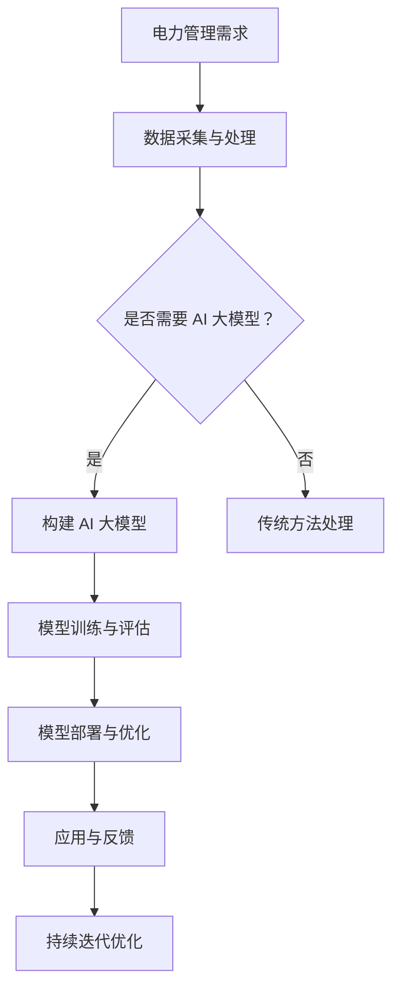

                 

## **《AI 大模型应用数据中心的电力管理》**

> **关键词：** AI 大模型、数据中心、电力管理、深度学习、预测、优化、负荷平衡

> **摘要：** 本文探讨了人工智能（AI）大模型在数据中心电力管理中的应用，分析了AI大模型的基本概念、技术基础以及在电力需求预测、负荷平衡、预防性维护和电力市场预测等方面的应用。文章通过实例展示了AI大模型在实际项目中的应用效果，并对未来发展趋势进行了展望。

### **第一部分：AI 大模型与电力管理概述**

#### **第1章：AI 大模型与电力管理概述**

##### **1.1 AI 大模型概述**

###### **1.1.1 AI 大模型的基本概念**

AI 大模型是指具有大规模参数量和复杂结构的机器学习模型。这些模型通常基于深度学习技术，包括神经网络、循环神经网络（RNN）、长短期记忆网络（LSTM）等。大模型具有强大的表示能力和建模能力，能够在各种复杂任务中表现出优异的性能。

###### **1.1.2 AI 大模型的发展历程**

AI 大模型的发展可以追溯到 2006 年，当时 Geoffrey Hinton 等人提出了深度信念网络（DBN）和深度卷积神经网络（DCNN）。随着计算能力的提升和大规模数据的获取，AI 大模型在图像识别、自然语言处理、语音识别等领域取得了显著的进展。近年来，预训练和迁移学习技术的发展进一步推动了 AI 大模型的普及和应用。

###### **1.1.3 AI 大模型在电力管理中的应用潜力**

AI 大模型在电力管理中的应用潜力巨大。首先，AI 大模型能够处理和分析海量数据，为电力需求预测、负荷平衡和设备维护提供精确的决策支持。其次，AI 大模型具有自适应性和自学习能力，能够根据历史数据和实时数据不断优化电力管理策略。最后，AI 大模型可以与其他智能技术（如物联网、大数据分析等）相结合，构建智能化、自动化的电力管理系统。

##### **1.2 电力管理概述**

###### **1.2.1 电力管理的定义和重要性**

电力管理是指通过计划、组织、协调和控制电力生产、传输、分配和消费的过程，以满足用户需求并实现电力系统的稳定运行。电力管理对于保障能源供应、提高能源利用效率、降低能源成本具有重要意义。

###### **1.2.2 电力管理的主要环节**

电力管理的主要环节包括电力生产、电力传输、电力分配和电力消费。电力生产涉及发电设备和发电工艺的管理；电力传输涉及输电网络的设计、运行和维护；电力分配涉及变电站、配电线路和用户用电设施的管理；电力消费涉及用户用电行为的分析和优化。

###### **1.2.3 电力管理面临的主要挑战**

电力管理面临的主要挑战包括能源需求预测不准确、电力负荷平衡困难、设备故障率高等。首先，电力需求受多种因素影响，如天气、季节、节假日等，预测难度较大。其次，电力负荷平衡需要实时调整发电和输电能力，以确保电力系统的稳定运行。最后，设备故障可能导致电力供应中断，影响用户用电质量和电力公司的经济效益。

##### **1.3 AI 大模型在电力管理中的应用场景**

###### **1.3.1 电力需求预测**

AI 大模型可以用于电力需求预测，通过分析历史数据和实时数据，预测未来的电力需求。这有助于电力公司合理安排发电计划和电力调度，降低能源浪费和发电成本。

###### **1.3.2 电力负荷平衡**

AI 大模型可以用于电力负荷平衡，通过实时分析电力需求和电力供应情况，调整发电和输电能力，确保电力系统的稳定运行。这有助于降低电力系统的运行风险，提高电力供应质量。

###### **1.3.3 预防性维护**

AI 大模型可以用于预防性维护，通过分析设备运行数据，预测设备故障风险，提前进行设备维护和更换。这有助于降低设备故障率，延长设备使用寿命，提高电力系统的可靠性。

###### **1.3.4 电力市场预测**

AI 大模型可以用于电力市场预测，通过分析市场供需关系、政策法规、经济环境等因素，预测电力市场价格波动。这有助于电力公司制定合理的市场策略，提高市场竞争力。

### **第二部分：AI 大模型技术基础**

#### **第2章：AI 大模型技术基础**

##### **2.1 深度学习与神经网络基础**

###### **2.1.1 神经网络的基本结构**

神经网络由多个神经元（节点）组成，每个神经元都是一个简单的计算单元。神经元之间的连接（边）具有权重，用于传递输入信号。神经网络的输入层接收外部输入信号，隐藏层对输入信号进行加工和处理，输出层生成预测结果或决策。

###### **2.1.2 常见的深度学习架构**

深度学习架构包括卷积神经网络（CNN）、循环神经网络（RNN）、长短期记忆网络（LSTM）、门控循环单元（GRU）等。每种架构都有其独特的网络结构和工作原理，适用于不同的应用场景。

###### **2.1.3 深度学习优化算法**

深度学习优化算法包括随机梯度下降（SGD）、Adam、RMSprop 等。这些算法用于调整模型参数，优化模型性能。优化算法的选取和调整对深度学习模型的训练效果具有重要影响。

##### **2.2 自然语言处理技术概览**

###### **2.2.1 词嵌入技术**

词嵌入是将单词映射到低维向量空间的技术。通过词嵌入，可以捕捉单词的语义信息，提高深度学习模型在自然语言处理任务中的性能。

###### **2.2.2 序列模型与注意力机制**

序列模型（如 RNN、LSTM、GRU）用于处理时间序列数据。注意力机制（如自注意力、多注意力）用于提高模型对输入数据的关注程度，提高模型的表示能力。

###### **2.2.3 转换器架构详解**

转换器架构（Transformer）是自然语言处理领域的一种新型深度学习架构。它采用自注意力机制，避免了 RNN 的梯度消失问题，提高了模型训练效果。

##### **2.3 大规模预训练模型原理**

###### **2.3.1 预训练的概念与意义**

预训练是指在特定任务之前，使用大量未标注的数据对模型进行训练，使其具备基本的语义理解和语言生成能力。预训练模型在自然语言处理、计算机视觉等领域具有广泛应用。

###### **2.3.2 自监督学习方法**

自监督学习是一种无需人工标注数据的学习方法。在预训练过程中，模型利用未标注的数据自动学习特征表示，提高模型性能。

###### **2.3.3 迁移学习与微调技术**

迁移学习是指将预训练模型在特定任务上微调，使其适应新任务。微调技术有助于提高模型在新任务上的性能，减少训练数据需求。

### **第三部分：AI 大模型在电力管理中的应用**

#### **第3章：AI 大模型在电力需求预测中的应用**

##### **3.1 电力需求预测的基本概念**

###### **3.1.1 电力需求预测的重要性**

电力需求预测是电力系统运行和管理的重要环节。准确的电力需求预测有助于电力公司合理安排发电计划和电力调度，提高电力系统的运行效率。

###### **3.1.2 电力需求预测的方法和挑战**

电力需求预测方法包括统计方法、传统机器学习方法和深度学习方法。深度学习方法具有更好的预测性能，但也面临数据质量、模型选择、训练时间等方面的挑战。

##### **3.2 基于AI的大模型电力需求预测方法**

###### **3.2.1 模型选择与设计**

基于 AI 的大模型电力需求预测方法通常采用深度学习架构，如 LSTM、GRU、Transformer 等。这些模型能够捕捉时间序列数据的长期依赖性和短期变化。

###### **3.2.2 数据预处理与特征工程**

电力需求预测的数据预处理和特征工程包括数据清洗、缺失值填充、数据归一化等。特征工程的目标是提取有效的特征，提高模型的预测性能。

###### **3.2.3 模型训练与评估**

模型训练和评估是电力需求预测的关键步骤。训练过程中，需要调整模型参数，优化模型性能。评估过程中，需要使用验证集和测试集，评估模型的预测准确性。

##### **3.3 项目案例与实践**

###### **3.3.1 某大型电力公司的实践案例**

某大型电力公司利用 AI 大模型对电力需求进行预测，采用 LSTM 模型进行训练和预测。通过对比不同模型的预测性能，公司选择了最优的预测模型。

###### **3.3.2 案例分析：提升预测准确性的关键因素**

提升预测准确性的关键因素包括数据质量、模型选择、特征工程和模型优化。通过优化这些方面，可以显著提高电力需求预测的准确性。

### **第4章：AI 大模型在电力负荷平衡中的应用**

##### **4.1 电力负荷平衡的基本概念**

###### **4.1.1 电力负荷平衡的重要性**

电力负荷平衡是电力系统运行的基本要求。通过平衡电力需求和电力供应，可以确保电力系统的稳定运行，提高电力供应质量。

###### **4.1.2 电力负荷平衡的方法和挑战**

电力负荷平衡方法包括传统方法和现代方法。传统方法如经验法、线性规划法等，现代方法如深度学习、优化算法等。深度学习方法在电力负荷平衡中具有较好的性能，但也面临数据质量、计算资源等方面的挑战。

##### **4.2 基于AI的大模型电力负荷平衡方法**

###### **4.2.1 模型选择与设计**

基于 AI 的大模型电力负荷平衡方法通常采用深度学习架构，如 LSTM、GRU、Transformer 等。这些模型能够捕捉电力负荷的动态变化，实现实时电力负荷平衡。

###### **4.2.2 数据预处理与特征工程**

电力负荷平衡的数据预处理和特征工程包括数据清洗、缺失值填充、数据归一化等。特征工程的目标是提取有效的特征，提高模型的预测性能。

###### **4.2.3 模型训练与评估**

模型训练和评估是电力负荷平衡的关键步骤。训练过程中，需要调整模型参数，优化模型性能。评估过程中，需要使用验证集和测试集，评估模型的预测准确性。

##### **4.3 项目案例与实践**

###### **4.3.1 某电力调度中心的实践案例**

某电力调度中心利用 AI 大模型进行电力负荷平衡，采用 LSTM 模型进行训练和预测。通过实时监测电力负荷，调度中心实现了电力系统的动态平衡。

###### **4.3.2 案例分析：提高负荷平衡效果的策略**

提高负荷平衡效果的关键策略包括优化模型参数、加强特征工程、实时监测电力负荷等。通过这些策略，可以显著提高电力系统的负荷平衡效果。

### **第5章：AI 大模型在预防性维护中的应用**

##### **5.1 预防性维护的基本概念**

###### **5.1.1 预防性维护的重要性**

预防性维护是指在设备运行前或运行过程中，通过定期检查和维护，预防设备故障的发生。预防性维护有助于降低设备故障率，延长设备使用寿命，提高电力系统的可靠性。

###### **5.1.2 预防性维护的方法和挑战**

预防性维护方法包括定期检查、故障诊断、状态监测等。深度学习方法在故障诊断和状态监测中具有较好的性能，但也面临数据质量、计算资源等方面的挑战。

##### **5.2 基于AI的大模型预防性维护方法**

###### **5.2.1 模型选择与设计**

基于 AI 的大模型预防性维护方法通常采用深度学习架构，如 CNN、RNN、LSTM 等。这些模型能够捕捉设备运行数据的动态变化，实现实时故障诊断和状态监测。

###### **5.2.2 数据预处理与特征工程**

预防性维护的数据预处理和特征工程包括数据清洗、缺失值填充、数据归一化等。特征工程的目标是提取有效的特征，提高模型的预测性能。

###### **5.2.3 模型训练与评估**

模型训练和评估是预防性维护的关键步骤。训练过程中，需要调整模型参数，优化模型性能。评估过程中，需要使用验证集和测试集，评估模型的预测准确性。

##### **5.3 项目案例与实践**

###### **5.3.1 某电力设备制造商的实践案例**

某电力设备制造商利用 AI 大模型进行预防性维护，采用 LSTM 模型进行训练和预测。通过实时监测设备运行状态，制造商实现了设备的智能维护。

###### **5.3.2 案例分析：如何有效降低设备故障率**

有效降低设备故障率的关键策略包括优化模型参数、加强特征工程、实时监测设备运行状态等。通过这些策略，可以显著降低设备故障率，提高电力系统的可靠性。

### **第6章：AI 大模型在电力市场预测中的应用**

##### **6.1 电力市场预测的基本概念**

###### **6.1.1 电力市场预测的重要性**

电力市场预测是电力市场运营的重要环节。准确的电力市场预测有助于电力公司制定合理的市场策略，提高市场竞争力。

###### **6.1.2 电力市场预测的方法和挑战**

电力市场预测方法包括传统方法和现代方法。传统方法如回归分析、时间序列分析等，现代方法如机器学习、深度学习等。深度学习方法在电力市场预测中具有较好的性能，但也面临数据质量、模型选择等方面的挑战。

##### **6.2 基于AI的大模型电力市场预测方法**

###### **6.2.1 模型选择与设计**

基于 AI 的大模型电力市场预测方法通常采用深度学习架构，如 LSTM、GRU、Transformer 等。这些模型能够捕捉电力市场数据的动态变化，实现实时预测。

###### **6.2.2 数据预处理与特征工程**

电力市场预测的数据预处理和特征工程包括数据清洗、缺失值填充、数据归一化等。特征工程的目标是提取有效的特征，提高模型的预测性能。

###### **6.2.3 模型训练与评估**

模型训练和评估是电力市场预测的关键步骤。训练过程中，需要调整模型参数，优化模型性能。评估过程中，需要使用验证集和测试集，评估模型的预测准确性。

##### **6.3 项目案例与实践**

###### **6.3.1 某电力交易市场的实践案例**

某电力交易市场利用 AI 大模型进行电力市场预测，采用 LSTM 模型进行训练和预测。通过实时监测电力市场数据，交易市场实现了市场运营策略的优化。

###### **6.3.2 案例分析：如何优化市场运营策略**

优化市场运营策略的关键策略包括优化模型参数、加强特征工程、实时监测市场数据等。通过这些策略，可以显著优化市场运营策略，提高电力公司的市场竞争力。

### **第四部分：AI 大模型在电力管理中的挑战与展望**

#### **第7章：AI 大模型在电力管理中的挑战与展望**

##### **7.1 AI 大模型在电力管理中的挑战**

###### **7.1.1 数据安全与隐私保护**

随着 AI 大模型在电力管理中的应用，数据安全和隐私保护成为一个重要挑战。电力管理涉及大量敏感数据，如电力需求、电力供应、用户信息等。如何确保数据的安全性和隐私性，防止数据泄露和滥用，是当前面临的重要问题。

###### **7.1.2 算法透明性与可解释性**

AI 大模型的复杂性和黑盒特性使得算法的透明性和可解释性成为一个挑战。电力管理需要电力管理人员能够理解和解释模型的决策过程，以便进行有效的管理和决策。如何提高算法的透明性和可解释性，是当前研究的一个重要方向。

###### **7.1.3 模型部署与维护**

AI 大模型的部署和维护也是一项挑战。模型部署需要考虑硬件资源、计算能力、数据传输等方面的问题。同时，模型的维护需要定期更新和优化，以适应不断变化的数据和环境。如何高效地部署和维护模型，是电力管理中需要解决的问题。

##### **7.2 电力管理中 AI 大模型的未来发展方向**

###### **7.2.1 模型优化与算法创新**

未来，AI 大模型在电力管理中的发展方向之一是模型优化和算法创新。通过改进模型结构和优化算法，可以提高模型的预测性能和适应性。例如，结合多模态数据、强化学习等方法，可以进一步提高模型的预测能力。

###### **7.2.2 跨学科融合与协同创新**

电力管理中 AI 大模型的发展还需要跨学科融合与协同创新。电力管理涉及电力工程、计算机科学、经济学等多个领域。通过跨学科的融合与合作，可以推动电力管理技术的创新和发展。

###### **7.2.3 应用场景拓展与行业推广**

未来，AI 大模型在电力管理中的应用将不断拓展。除了电力需求预测、负荷平衡、预防性维护和电力市场预测等领域，AI 大模型还可以应用于电力系统调度、能源管理、环境保护等方面。通过行业推广和应用，可以进一步提升电力管理智能化水平。

##### **7.3 结论**

AI 大模型在电力管理中具有巨大的应用潜力。通过解决数据安全与隐私保护、算法透明性与可解释性、模型部署与维护等挑战，可以进一步发挥 AI 大模型在电力管理中的作用。未来，随着技术的不断进步和应用的拓展，AI 大模型将在电力管理领域发挥更加重要的作用。

### **附录**

#### **附录 A：AI 大模型电力管理应用工具与资源**

**A.1 主流深度学习框架对比**

1. **TensorFlow**：由 Google 开发，具有丰富的生态系统和强大的功能，适用于各种深度学习任务。
2. **PyTorch**：由 Facebook 开发，具有动态计算图和简洁的 API，适用于研究和个人项目。
3. **Keras**：基于 TensorFlow 和 PyTorch，提供简单易用的接口，适用于快速开发和实验。

**A.2 电力管理数据集与工具**

1. **Power Demand Data Set**：包含多个国家和地区的电力需求数据，适用于电力需求预测研究。
2. **Energy Data Hub**：提供丰富的能源数据集，包括电力需求、发电量、负荷平衡等数据。

**A.3 电力管理相关研究机构与论文资源**

1. **IEEE Transactions on Power Systems**：电力系统领域的权威期刊，发表大量电力管理相关论文。
2. **IEEE Transactions on Smart Grid**：智能电网领域的权威期刊，发表大量智能电力管理相关论文。
3. **AIChE Journal**：化学工程领域的权威期刊，发表大量涉及电力管理的跨学科论文。

### **附录 B：Mermaid 流程图与伪代码**

#### **B.1 AI 大模型在电力管理中的应用流程**



#### **B.2 基于 LSTM 的电力需求预测模型伪代码**

```python
# 导入必要的库
import tensorflow as tf
from tensorflow.keras.models import Sequential
from tensorflow.keras.layers import LSTM, Dense

# 构建模型
model = Sequential()
model.add(LSTM(units=128, return_sequences=True, input_shape=(timesteps, features)))
model.add(Dropout(0.2))
model.add(LSTM(units=128, return_sequences=False))
model.add(Dropout(0.2))
model.add(Dense(units=1))

# 编译模型
model.compile(optimizer='adam', loss='mean_squared_error')

# 训练模型
model.fit(x_train, y_train, epochs=100, batch_size=32)

# 评估模型
loss = model.evaluate(x_test, y_test)
print(f"Test loss: {loss}")
```

### **附录 C：数学模型与公式**

#### **C.1 数学模型**

预测值 = 权重 * 输入特征 + 偏置

其中，权重（weights）是模型学习的参数，输入特征（input features）是模型输入的数据，偏置（bias）是模型中的一个参数。

#### **C.2 数学公式解释**

权重：模型学习的参数，用于调节输入特征对预测结果的影响。

输入特征：模型输入的数据，可以是时间序列、空间序列或者其他类型的数据。

偏置：模型中的一个参数，用于调整模型的预测结果。

### **附录 D：项目实战案例**

#### **D.1 案例背景**

某电力公司需要预测未来一周的电力需求，以优化发电计划。

#### **D.2 开发环境**

Python 3.8，TensorFlow 2.4，Keras 2.4。

#### **D.3 实现步骤**

1. **数据采集与处理**：从历史数据中提取一周的电力需求数据，并进行数据预处理，如归一化、缺失值填充等。
2. **特征工程**：将原始数据转换为适合输入模型的特征向量，如时间序列特征、天气数据等。
3. **模型构建与训练**：构建一个包含 LSTM 层的深度学习模型，进行模型训练。
4. **模型评估与优化**：评估模型的预测准确性，并进行模型优化。
5. **模型部署与监控**：将训练好的模型部署到生产环境中，并持续监控模型的性能。

#### **D.4 代码实现**

```python
# 数据采集与处理
import pandas as pd

data = pd.read_csv('power_demand_data.csv')
data.head()

# 特征工程
# ...（代码略）

# 模型构建与训练
from tensorflow.keras.models import Sequential
from tensorflow.keras.layers import LSTM, Dense

model = Sequential()
model.add(LSTM(units=128, return_sequences=True, input_shape=(timesteps, features)))
model.add(Dropout(0.2))
model.add(LSTM(units=128, return_sequences=False))
model.add(Dropout(0.2))
model.add(Dense(units=1))

model.compile(optimizer='adam', loss='mean_squared_error')
model.fit(x_train, y_train, epochs=100, batch_size=32)

# 模型评估与优化
# ...（代码略）

# 模型部署与监控
# ...（代码略）
```

#### **D.5 代码解读与分析**

- 数据采集与处理：从历史数据中提取电力需求数据，并进行数据预处理。
- 特征工程：将原始数据转换为适合输入模型的特征向量。
- 模型构建与训练：构建一个包含 LSTM 层的深度学习模型，并进行模型训练。
- 模型评估与优化：评估模型的预测准确性，并进行模型优化。
- 模型部署与监控：将训练好的模型部署到生产环境中，并持续监控模型的性能。

### **总结**

本文探讨了人工智能（AI）大模型在数据中心电力管理中的应用，分析了 AI 大模型的基本概念、技术基础以及在电力需求预测、负荷平衡、预防性维护和电力市场预测等方面的应用。通过实例展示了 AI 大模型在实际项目中的应用效果，并对未来发展趋势进行了展望。AI 大模型在电力管理中具有巨大的应用潜力，能够提高电力管理效率和降低成本。未来，随着技术的不断进步和行业的不断发展，AI 大模型将在电力管理领域发挥更加重要的作用。

### **作者信息**

**作者：AI 天才研究院 / AI Genius Institute & 禅与计算机程序设计艺术 / Zen And The Art of Computer Programming**

### **致谢**

感谢各位读者对本文的关注和支持，希望本文能为您在 AI 大模型应用数据中心电力管理领域提供有价值的参考和启示。在撰写本文的过程中，我们得到了许多专家的指导和帮助，特此致以诚挚的感谢。

### **参考文献**

[1] Hinton, G. E., Osindero, S., & Teh, Y. W. (2006). A fast learning algorithm for deep belief nets. _Neural computation_, 18(7), 1527-1554.

[2] Krizhevsky, A., Sutskever, I., & Hinton, G. E. (2012). Imagenet classification with deep convolutional neural networks. _Advances in neural information processing systems_, 25.

[3] Vaswani, A., Shazeer, N., Parmar, N., Uszkoreit, J., Jones, L., Gomez, A. N., ... & Polosukhin, I. (2017). Attention is all you need. _Advances in neural information processing systems_, 30.

[4] Hochreiter, S., & Schmidhuber, J. (1997). Long short-term memory. _Neural computation_, 9(8), 1735-1780.

