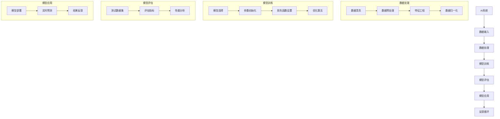

                 

### 引言

**AI与人类计算：打造可持续发展的城市生活方式与交通规划**

随着人工智能（AI）技术的迅猛发展，它已经深入到了我们日常生活的方方面面，从智能手机的语音助手到自动驾驶汽车，AI正在改变我们的生活方式。与此同时，城市化进程也在加速，城市人口的急剧增长给交通规划带来了前所未有的挑战。如何利用AI技术来提升城市生活质量、实现交通的智能化和可持续发展，成为了一个亟待解决的问题。

本文将探讨AI与人类计算如何结合，为城市化与交通规划提供创新的解决方案。我们将首先介绍AI与人类计算的基础知识，然后深入分析AI的核心概念与架构，最后探讨AI在城市化与交通规划中的应用，以及如何实现可持续发展。通过本文的探讨，我们希望为读者提供一个全面的视角，理解AI与人类计算在打造可持续城市生活方式中的重要作用。

关键词：人工智能、人类计算、城市化、交通规划、可持续发展

摘要：本文通过深入分析人工智能（AI）与人类计算的关系，探讨了AI在城市化与交通规划中的应用。文章首先介绍了AI和人类计算的基础概念，然后详细阐述了AI的核心技术及其系统架构，接着分析了AI在交通流量预测、智慧城市建设等方面的应用。最后，文章提出了实现城市生活方式与交通规划可持续发展的策略，并通过实际案例展示了AI技术的成功应用。本文旨在为读者提供关于AI与城市化发展的深刻见解和实用指南。

### 第一部分：AI与人类计算基础

在探讨AI与人类计算在城市化与交通规划中的应用之前，我们需要先了解这两者的基本概念及其发展背景。本部分将分为三章，分别介绍AI与人类计算的定义、AI技术的核心概念与架构，以及AI与人类计算的关系。

#### 第1章：AI与人类计算概述

##### 1.1 AI与人类计算的定义与背景

**AI的定义与发展历程**

人工智能（Artificial Intelligence，简称AI）是指通过计算机模拟人类智能的技术。它涵盖了多个领域，包括机器学习、自然语言处理、计算机视觉和智能机器人等。AI的起源可以追溯到1950年，由艾伦·图灵提出图灵测试，这一理论奠定了AI研究的理论基础。从1950年代早期图灵测试的提出，到现代深度学习的出现，AI经历了多个阶段的发展。

1. **初始阶段（1950-1969年）**：这一阶段，AI主要集中在基础理论的研究，如符号逻辑和知识表示。代表性的研究包括约翰·麦卡锡（John McCarthy）提出的“人工智能”一词，以及早期专家系统的开发。
2. **繁荣阶段（1970-1980年）**：在这一阶段，AI研究取得了显著的进展，出现了许多成功的应用，如医疗诊断系统、游戏AI等。
3. **低谷阶段（1980-1990年）**：由于实际应用的局限性和计算能力的限制，AI研究进入了一个相对低迷的时期。
4. **复兴阶段（1990年代至今）**：随着计算能力的提高和大数据技术的发展，AI再次迎来了爆发式增长。深度学习、强化学习等新技术的出现，使得AI在图像识别、自然语言处理等领域取得了突破性进展。

**人类计算的概念**

人类计算是指人类在处理信息、解决问题和创造时的思维过程。它具有以下几个特点：

1. **创造力**：人类能够产生新颖的、有创造性的想法，这是计算机难以比拟的。
2. **直觉**：人类在处理问题时，往往能够依靠直觉快速做出判断，而计算机则需要依赖数据和算法。
3. **灵活性**：人类能够适应各种复杂和多变的环境，而计算机则需要在特定条件下运行。

##### 1.1.2 AI与人类计算的关系

**AI与人类计算的互动**

AI与人类计算的关系是相辅相成的。AI通过模拟人类智能，能够处理大量的数据和复杂的任务，从而增强人类计算能力。例如，在医疗领域，AI可以帮助医生分析大量的医学影像数据，提高诊断的准确性和效率。

同时，人类计算也为AI提供了反馈和指导。AI系统需要通过大量的数据训练，而这些数据往往需要人类来收集、标注和验证。此外，AI系统在执行任务时，需要人类的监督和干预，以确保系统的稳定性和可靠性。

**AI在人类计算中的应用**

AI在各个领域对人类计算产生了深远的影响。以下是一些典型的应用案例：

1. **医疗**：AI可以帮助医生进行疾病诊断、药物研发和个性化治疗。
2. **教育**：AI可以为学生提供个性化的学习计划、智能辅导和自动评估。
3. **交通**：AI可以帮助优化交通流量、实现自动驾驶和智能交通管理。
4. **金融**：AI可以用于风险管理、欺诈检测和投资决策。

综上所述，AI与人类计算的结合为城市化与交通规划提供了广阔的前景。在下一章中，我们将深入探讨AI技术的核心概念与架构，以更好地理解AI如何应用于实际的城市生活与交通规划中。

#### 第2章：AI技术的核心概念与架构

在了解了AI和人类计算的基础概念后，我们需要深入探讨AI技术的核心概念与架构。本章将分为几个部分，分别介绍AI的核心概念，如模型、算法与数据，以及AI技术的关键架构，包括神经网络与深度学习、自然语言处理和计算机视觉。

##### 2.1 AI核心概念

**模型、算法与数据**

AI技术的基础是模型、算法和数据。以下是这些核心概念的基本介绍：

1. **模型（Model）**：模型是AI系统的核心，它代表了AI如何处理输入数据并生成输出。模型可以是简单的线性回归模型，也可以是复杂的深度神经网络。

2. **算法（Algorithm）**：算法是模型训练和预测的关键工具。常见的算法包括线性回归、决策树、支持向量机和深度学习算法。每种算法都有其特定的优缺点和适用场景。

3. **数据（Data）**：数据是AI系统的生命线。高质量的训练数据可以显著提高模型的性能和准确性。数据获取、清洗、预处理和标注是数据科学中至关重要的一环。

**神经网络与深度学习**

神经网络（Neural Networks）是AI技术中的重要组成部分，它模拟了人脑神经元的工作方式。深度学习（Deep Learning）是神经网络的一种高级形式，它通过多层神经网络来提取数据的复杂特征。

1. **神经网络的基本结构**：神经网络由输入层、隐藏层和输出层组成。每个层由多个神经元组成，神经元之间通过权重连接。输入数据通过输入层进入网络，经过隐藏层的层层传递，最终由输出层生成预测结果。

2. **激活函数（Activation Function）**：激活函数是神经网络中的关键组件，它用于引入非线性特性，使得神经网络能够模拟复杂的决策过程。常见的激活函数包括Sigmoid函数、ReLU函数和Tanh函数。

3. **反向传播算法（Backpropagation）**：反向传播算法是训练神经网络的核心算法，它通过计算输出误差，反向传播误差至各层的神经元，并更新各层的权重，以最小化误差函数。

**自然语言处理**

自然语言处理（Natural Language Processing，简称NLP）是AI技术中用于处理和理解自然语言的方法。NLP在文本分类、情感分析、机器翻译和对话系统等领域有着广泛的应用。

1. **词向量表示（Word Embedding）**：词向量是将单词映射为高维向量的一种方法，它通过捕捉单词的语义信息，使得NLP模型能够更好地理解和处理自然语言。Word2Vec、GloVe和BERT是常用的词向量表示方法。

2. **序列模型（Sequential Models）**：序列模型是处理序列数据（如文本、音频和视频）的一种常用方法。循环神经网络（RNN）和长短期记忆网络（LSTM）是常用的序列模型，它们能够捕捉序列数据中的长期依赖关系。

3. **预训练语言模型（Pre-trained Language Models）**：预训练语言模型是通过在大规模语料库上预训练，然后微调到特定任务的一种有效方法。BERT、GPT和RoBERTa是代表性的预训练语言模型。

**计算机视觉**

计算机视觉（Computer Vision）是AI技术中用于使计算机“看”懂图像和视频的一种方法。它在图像识别、目标检测、图像分割和图像生成等领域有着广泛的应用。

1. **卷积神经网络（Convolutional Neural Networks，CNN）**：卷积神经网络是计算机视觉中的核心模型，它通过卷积层提取图像的特征。CNN在图像分类、物体检测和图像分割等领域取得了显著的成果。

2. **特征提取与分类（Feature Extraction and Classification）**：在计算机视觉中，特征提取是将图像转换为特征向量的一种过程，它有助于提高分类和检测的准确性。分类算法如SVM、softmax和深度学习分类器在图像识别任务中有着广泛的应用。

3. **生成对抗网络（Generative Adversarial Networks，GAN）**：生成对抗网络是一种通过对抗训练生成逼真图像的一种方法。GAN由生成器和判别器两个神经网络组成，它们相互竞争，以生成高质量的数据。

**AI系统架构**

AI系统架构是构建高效AI系统的关键。以下是几种常见的AI系统架构：

1. **端到端系统（End-to-End Systems）**：端到端系统是一种将数据直接从输入层传递到输出层的系统，它能够自动提取特征并进行预测。深度学习模型如CNN和RNN是典型的端到端系统。

2. **分布式系统（Distributed Systems）**：分布式系统是由多个节点组成的系统，每个节点负责处理一部分数据。分布式系统可以提高AI系统的计算效率和扩展性，适用于大规模数据处理任务。

3. **强化学习系统（Reinforcement Learning Systems）**：强化学习系统是一种通过试错和反馈来学习策略的系统。它通常用于动态决策问题，如自动驾驶和游戏AI。

4. **监督学习与无监督学习**：监督学习是一种通过标注数据训练模型的方法，而无监督学习则是通过未标注数据学习模型结构的方法。监督学习和无监督学习在AI系统中都有广泛的应用。

通过本章的探讨，我们了解了AI技术的核心概念与架构。在下一章中，我们将探讨AI在城市化与交通规划中的应用，以及如何实现这些应用。

##### 2.2 AI技术的核心架构

**端到端系统（End-to-End Systems）**

端到端系统是一种从输入直接映射到输出的系统，它通过单一路径将数据从输入层传递到输出层。这种系统的主要优点是简化了特征提取和模型设计的复杂性，因为它可以在训练过程中自动学习输入数据的特征。

端到端系统的实现通常依赖于深度学习模型，特别是卷积神经网络（CNN）和循环神经网络（RNN）。例如，在图像识别任务中，卷积神经网络可以直接接受图像作为输入，并输出分类结果。以下是一个端到端系统的基本架构：

1. **输入层**：接收原始图像数据。
2. **卷积层**：通过卷积运算提取图像特征。
3. **池化层**：降低特征图的维度，提高计算效率。
4. **全连接层**：将卷积层提取的特征映射到分类结果。

**分布式系统（Distributed Systems）**

分布式系统由多个节点组成，每个节点负责处理一部分数据。这种系统可以提高AI系统的计算效率和扩展性，特别是在处理大规模数据时。

分布式系统的实现通常依赖于分布式计算框架，如TensorFlow和PyTorch。以下是一个分布式系统的基本架构：

1. **数据输入**：将数据分布到不同的节点进行处理。
2. **模型训练**：在每个节点上并行训练模型，并使用参数服务器同步模型参数。
3. **模型评估**：将训练完成的模型在测试集上进行评估。
4. **模型部署**：将训练完成的模型部署到生产环境。

**强化学习系统（Reinforcement Learning Systems）**

强化学习系统通过试错和反馈来学习策略。它通常用于动态决策问题，如自动驾驶和游戏AI。强化学习系统的核心组件包括：

1. **代理（Agent）**：执行动作并获取环境反馈。
2. **环境（Environment）**：代理执行动作的动态系统。
3. **奖励机制（Reward Mechanism）**：根据代理的动作和环境反馈计算奖励。

强化学习系统的训练过程通常分为两个阶段：

1. **策略迭代（Policy Iteration）**：通过不断调整策略，使得代理在环境中获取最大奖励。
2. **值迭代（Value Iteration）**：通过计算状态值函数，优化代理的动作选择。

**监督学习与无监督学习**

监督学习（Supervised Learning）是一种通过标注数据训练模型的方法。无监督学习（Unsupervised Learning）则是通过未标注数据学习模型结构的方法。

监督学习的主要优点是能够通过标注数据提供明确的指导，从而提高模型的性能。常见的监督学习方法包括线性回归、决策树、支持向量机和深度学习。

无监督学习的主要优点是能够从未标注数据中提取有用的信息，从而发现数据的隐藏结构和模式。常见的方法包括聚类、降维和生成模型。

综上所述，AI技术的核心架构包括端到端系统、分布式系统、强化学习系统和监督学习与无监督学习。这些架构在不同的应用场景中具有独特的优势和适用性。在下一章中，我们将探讨AI在城市化与交通规划中的应用，以及如何实现这些应用。

### 第3章：AI在城市化与交通规划中的应用

在了解了AI与人类计算的基础和核心技术后，我们接下来将探讨AI在城市化与交通规划中的实际应用。本章将分为几个部分，分别介绍AI在城市数据分析、智慧城市建设、城市管理与规划以及交通流量预测、智能交通系统和道路交通管理中的应用。

#### 3.1 AI在城市化中的应用

**城市数据分析**

城市数据分析是AI在城市化中应用的一个重要方面。通过使用机器学习和数据挖掘技术，可以分析和挖掘城市数据，以揭示城市运行中的规律和趋势。以下是城市数据分析的一些关键应用：

1. **人口统计与行为分析**：通过分析城市人口统计数据，可以了解城市人口分布、年龄结构、收入水平等信息。这些信息有助于城市规划者制定合理的发展策略。此外，AI技术还可以分析居民的行为模式，如出行习惯、消费习惯等，为城市服务提供个性化推荐。

2. **公共安全与应急响应**：通过分析城市监控视频和传感器数据，AI可以帮助预测和预防犯罪事件。例如，基于历史犯罪数据和实时监控数据，AI系统可以识别潜在的犯罪热点区域，并向警方发出预警。此外，AI还可以协助城市应急响应，如火灾、地震等灾害的应急处理。

3. **环境监测与污染控制**：AI技术可以实时监测城市环境质量，如空气质量、水质等。通过对环境数据的分析，可以及时发现污染源并采取相应的控制措施。例如，基于气象数据和空气质量传感器数据，AI系统可以预测空气质量变化，并提出相应的污染防控策略。

**智慧城市建设**

智慧城市是指通过信息通信技术（ICT）和物联网（IoT）等先进技术，实现城市管理的智能化和精细化。AI技术在智慧城市建设中发挥着重要作用，以下是几个关键应用：

1. **智能交通管理**：通过AI技术，可以实现智能交通信号控制和交通流量预测。例如，AI算法可以分析交通流量数据，动态调整交通信号灯的时长和相位，以减少拥堵和提高交通效率。

2. **智能能源管理**：AI技术可以帮助优化城市能源消耗，提高能源利用效率。例如，通过分析建筑物能源使用数据，AI系统可以优化空调、照明和其他能源设备的运行，减少能源浪费。

3. **智能公共设施管理**：AI技术可以用于监控和管理城市公共设施，如垃圾处理、水务管理、照明等。通过物联网设备和AI算法，可以实时监测设施的运行状态，及时发现故障并进行维护，提高公共设施的可靠性和效率。

**城市管理与规划**

AI技术在城市管理和规划中也有广泛的应用，以下是几个关键应用：

1. **城市规划与设计**：AI技术可以帮助城市规划者进行城市设计和规划，如模拟城市交通流量、预测人口增长等。通过这些分析，可以优化城市布局，提高城市空间的利用效率。

2. **公共资源分配**：AI技术可以协助城市管理者优化公共资源的分配，如教育、医疗、交通等。通过分析居民需求和使用数据，AI系统可以提供个性化的资源分配建议，提高公共资源的利用效率。

3. **灾害管理与应急响应**：AI技术可以帮助城市管理者进行灾害预测和应急响应。例如，通过分析气象数据和地质数据，AI系统可以预测自然灾害的发生，提前采取应对措施，减少灾害损失。

#### 3.2 AI在交通规划中的应用

**交通流量预测**

交通流量预测是交通规划中的一个关键问题。通过AI技术，可以实现对交通流量的实时预测，为交通管理提供科学依据。以下是交通流量预测的一些关键应用：

1. **实时交通流量预测**：通过分析历史交通数据、实时交通传感器数据等，AI系统可以预测交通流量的变化趋势。这些预测结果可以帮助交通管理者动态调整交通信号灯时长，优化交通流量。

2. **事故预测与预警**：AI技术可以分析交通事故数据，预测交通事故的发生概率。通过实时监测交通状况，AI系统可以提前预警潜在的事故风险，提醒驾驶员注意安全。

**智能交通系统**

智能交通系统（Intelligent Transportation Systems，简称ITS）是利用AI技术实现交通管理和服务智能化的一种系统。以下是智能交通系统的几个关键应用：

1. **自动驾驶**：自动驾驶技术是智能交通系统的核心应用。通过深度学习和计算机视觉技术，自动驾驶车辆可以实时感知周围环境，做出智能驾驶决策，提高行驶安全性和效率。

2. **车联网（V2X）**：车联网是通过通信技术实现车辆之间、车辆与基础设施之间以及车辆与行人之间的信息交互。AI技术可以用于车联网系统中的数据处理和决策支持，提高交通的安全性和效率。

**道路交通管理**

AI技术在道路交通管理中也有广泛应用，以下是几个关键应用：

1. **智能信号控制**：通过分析交通流量数据，AI系统可以优化交通信号灯的时长和相位，提高交通流量。例如，在高峰时段，AI系统可以动态调整信号灯的时长，减少拥堵。

2. **道路监控与维护**：AI技术可以用于监控道路状况，如道路拥堵、路面破损等。通过实时监测，AI系统可以及时发现并报告道路问题，以便及时进行维护。

3. **停车场管理**：AI技术可以用于停车场管理，如车位识别、停车收费等。通过AI算法，停车场可以更高效地分配车位，减少寻找停车位的时间。

综上所述，AI技术在城市化与交通规划中的应用前景广阔。通过智能化的城市数据分析和交通流量预测，可以优化城市管理和交通规划，提高城市生活质量和交通效率。在下一章中，我们将探讨AI在可持续发展中的作用，以及如何通过AI技术实现资源的优化和环境保护。

#### 3.3 AI在可持续发展中的作用

在城市化与交通规划中，可持续发展的目标至关重要。AI技术在这一过程中发挥着关键作用，帮助实现资源的优化、减少碳排放和促进环境保护。以下是AI在可持续发展中的一些具体应用：

**资源优化**

AI技术可以通过数据分析、预测和优化算法，实现对城市资源和能源的高效利用。以下是资源优化的几个关键应用：

1. **智能能源管理**：AI系统可以实时监测和优化建筑物的能源消耗。通过分析能源使用数据，AI可以识别能源浪费的环节，并提出优化建议。例如，在办公大楼中，AI可以自动调整空调、照明和通风设备的运行状态，以减少能源消耗。

2. **水资源管理**：AI技术可以用于监测和优化城市用水。通过传感器网络和AI算法，可以实时监控水质和水流量，识别漏水点并采取措施。此外，AI还可以优化灌溉系统，提高农业用水的效率。

3. **公共设施管理**：AI系统可以帮助优化公共设施的维护和更新。通过预测公共设施的故障风险，AI可以提前进行维护，避免突发故障，提高公共设施的可靠性和使用寿命。

**减少碳排放**

减少碳排放是可持续发展的一个重要目标。AI技术在这一过程中发挥着重要作用，通过智能化的交通管理和能源管理，减少碳排放。以下是减少碳排放的几个关键应用：

1. **智能交通系统**：AI系统可以优化交通流量，减少交通拥堵。通过实时监测交通状况，AI可以动态调整交通信号灯，优化交通流动。此外，AI还可以优化公共交通路线和时间表，提高公共交通的效率和吸引力，鼓励更多人使用公共交通，减少私家车的使用。

2. **电动汽车管理**：AI技术可以优化电动汽车的充电网络，提高充电效率。通过分析电动汽车的充电需求，AI可以智能分配充电资源，减少充电等待时间，提高充电效率。

3. **碳足迹监测与减少**：AI系统可以监测和评估城市的碳足迹，识别碳排放的主要来源。通过这些数据，AI可以提出减少碳排放的具体措施，如优化能源结构、推广可再生能源等。

**促进环境保护**

AI技术不仅可以帮助优化资源和减少碳排放，还可以直接促进环境保护。以下是环境保护的几个关键应用：

1. **环境监测**：AI系统可以实时监测空气质量、水质和土壤质量等环境参数。通过传感器网络和AI算法，AI系统可以及时发现环境污染问题，并采取措施进行治理。

2. **生态保护**：AI技术可以用于监测和保护野生动植物的栖息地。通过分析卫星图像和现场监测数据，AI可以识别野生动植物的栖息地变化，预测栖息地破坏的风险，并提出保护措施。

3. **灾害预防与应对**：AI技术可以协助城市进行灾害预防与应对。通过分析气象数据和地质数据，AI可以预测自然灾害的发生概率，提前采取预防措施。在灾害发生后，AI可以协助进行应急响应，减少灾害损失。

综上所述，AI技术在可持续发展中具有广泛的应用。通过资源优化、减少碳排放和促进环境保护，AI技术为城市化与交通规划提供了可持续发展的解决方案。在下一章中，我们将探讨城市化与交通规划中的挑战，以及如何应对这些挑战。

### 第4章：城市化与交通规划中的挑战

在城市化与交通规划中，尽管AI技术为提升城市生活质量和交通效率提供了有力的工具，但同时也面临着一系列挑战。这些挑战主要集中在数据隐私与安全问题、技术接受与公众参与、以及政策制定与执行等方面。

#### 4.1 数据隐私与安全问题

随着AI技术在城市管理和交通规划中的应用日益广泛，大量的数据被收集、存储和处理。这些数据包括个人隐私信息、交通流量数据、能源消耗数据等。因此，如何保护数据隐私和安全成为了一个重要的问题。

**数据隐私保护**

1. **数据匿名化**：在收集和使用数据时，应采用数据匿名化技术，将个人身份信息进行脱敏处理，以保护个人隐私。

2. **数据加密**：对敏感数据进行加密处理，确保数据在传输和存储过程中的安全性。

3. **隐私计算**：采用隐私计算技术，如联邦学习、差分隐私等，在共享数据的同时保护数据的隐私。

**数据安全措施**

1. **网络安全**：加强网络安全防护，防范黑客攻击和数据泄露。

2. **访问控制**：实施严格的访问控制措施，确保只有授权人员才能访问敏感数据。

3. **数据备份与恢复**：定期备份数据，并制定数据恢复策略，以应对数据丢失或损坏的情况。

#### 4.2 技术接受与公众参与

尽管AI技术具有巨大的潜力，但公众对其接受度和信任度仍然是一个挑战。要成功实施AI技术，需要确保公众的参与和认可。

**技术接受度调查**

1. **公众教育**：通过公众教育，提高公众对AI技术的了解和认识，消除对AI技术的误解和担忧。

2. **透明度**：确保AI系统的透明度，让公众了解AI系统的工作原理和决策过程。

3. **反馈机制**：建立反馈机制，收集公众的意见和建议，及时回应公众的关切。

**公众参与策略**

1. **参与式设计**：在AI系统的设计过程中，邀请公众参与，使其感受到AI技术是为他们服务的。

2. **社区互动**：通过社区活动，如研讨会、讲座和互动展览，与公众进行互动，增强公众对AI技术的信任和接受度。

3. **公众参与决策**：在制定与AI技术相关的政策和规划时，积极听取公众的意见，确保政策的公正性和可行性。

#### 4.3 社区互动与反馈

社区互动与反馈是确保AI技术成功实施的关键环节。通过有效的社区互动和反馈机制，可以及时发现和解决AI技术在实际应用中的问题。

**社区互动**

1. **社交媒体**：利用社交媒体平台，如Facebook、Twitter等，与公众进行实时互动，传播AI技术的相关信息。

2. **社区论坛**：建立社区论坛，为公众提供一个交流的平台，分享经验、问题和建议。

3. **现场活动**：定期举办现场活动，如社区讲座、展览和研讨会，加强与公众的面对面交流。

**反馈机制**

1. **定期评估**：定期对AI技术的应用效果进行评估，收集公众的反馈，识别改进的机会。

2. **问题解决**：建立快速响应机制，针对公众反馈的问题，及时进行调查和解决。

3. **持续改进**：根据反馈和评估结果，不断优化AI技术的应用，提高其性能和用户体验。

综上所述，城市化与交通规划中的挑战需要通过多方面的努力来解决。通过加强数据隐私与安全保护、提升技术接受度和公众参与，以及建立有效的社区互动和反馈机制，可以确保AI技术在城市化与交通规划中的成功应用。

### 第5章：AI与人类计算的可持续发展策略

为了实现城市化与交通规划的可持续发展，AI与人类计算的结合显得尤为重要。在这一章中，我们将探讨如何通过管理、政策支持、企业协同发展和教育培训，制定可持续发展的策略。

#### 5.1 管理与政策支持

**政府角色**

政府在推动AI与人类计算的可持续发展中扮演着至关重要的角色。以下是政府在管理层面的几个关键作用：

1. **制定政策与法规**：政府应制定相应的政策与法规，规范AI技术的应用，确保其合规性和安全性。例如，可以出台数据隐私保护法，明确数据收集、存储和使用的规定。

2. **投资与资助**：政府应加大对AI技术研发和应用的投入，通过财政支持、税收优惠和科研资助等手段，鼓励企业和研究机构进行创新。

3. **监管与监督**：政府应加强对AI系统的监管，确保其在应用过程中不产生负面影响。例如，对自动驾驶车辆的测试和认证过程进行严格监管，确保车辆的安全性能。

**政策制定与执行**

政策制定与执行是确保AI与人类计算可持续发展的重要环节。以下是政策制定与执行的几个关键步骤：

1. **需求调研**：政府应进行全面的调研，了解社会对AI技术的需求，明确政策制定的目标和方向。

2. **多方参与**：在政策制定过程中，政府应邀请专家学者、企业代表和公众参与，确保政策的科学性和可行性。

3. **试点项目**：通过实施试点项目，评估政策的实际效果，并根据反馈进行调整和优化。

4. **持续监测**：政策实施后，政府应持续监测其效果，收集数据和反馈，以便进行进一步的改进。

#### 5.2 企业与产业协同发展

**企业战略与投资**

企业在推动AI与人类计算的可持续发展中扮演着关键角色。以下是企业在战略层面的几个关键作用：

1. **研发创新**：企业应加大在AI技术研发和创新上的投入，开发具有自主知识产权的核心技术，提高市场竞争力。

2. **跨界合作**：企业应积极开展跨界合作，与高校、研究机构和政府部门建立合作伙伴关系，共同推动AI技术的发展。

3. **人才培养**：企业应建立完善的人才培养体系，通过内部培训和外部招聘，引进和培养具备AI技术能力和创新精神的人才。

**产业链协同与整合**

产业链协同与整合是AI与人类计算可持续发展的关键。以下是产业链协同与整合的几个关键步骤：

1. **平台建设**：建立AI技术共享平台，促进产业链上下游企业的资源整合和协同创新。

2. **标准制定**：制定统一的AI技术标准和规范，确保产业链各环节的技术兼容性和互操作性。

3. **数据共享**：通过数据共享和开放，促进产业链各环节的数据流通和利用，提高整体产业链的效率。

#### 5.3 教育与人才培养

**教育体系改革**

教育体系改革是培养AI与人类计算领域专业人才的重要途径。以下是教育体系改革的几个关键方向：

1. **课程设置**：调整和优化课程设置，增加AI与人类计算相关的课程，如机器学习、深度学习、数据科学等。

2. **实践教学**：加强实践教学，提供真实的工程项目和实践机会，让学生在实践中掌握AI技术。

3. **跨学科培养**：鼓励跨学科培养，培养学生的综合能力和创新精神，提高其解决复杂问题的能力。

**人才培养模式**

人才培养模式是确保AI与人类计算领域人才供应的关键。以下是人才培养模式的几个关键方向：

1. **校企合作**：建立校企合作机制，与企业共同培养符合市场需求的人才。

2. **项目驱动**：以项目为驱动，通过实际项目培养学生的实践能力和团队合作精神。

3. **终身学习**：推动终身学习理念，鼓励学生和从业者不断学习新知识和技能，以适应快速发展的AI技术。

**技能培训与终身学习**

技能培训与终身学习是确保AI与人类计算领域人才持续发展的关键。以下是技能培训与终身学习的几个关键方向：

1. **在线学习平台**：建立在线学习平台，提供丰富的AI与人类计算课程资源，方便学生和从业者自主学习。

2. **技能认证**：制定技能认证标准，对具备一定技能的从业者进行认证，提高其职业竞争力。

3. **继续教育**：鼓励从业者参加继续教育，提供进修、培训和学历提升机会，以保持其专业知识的更新和竞争力。

综上所述，通过管理与政策支持、企业协同发展、教育培训等策略，可以确保AI与人类计算的可持续发展。这些策略不仅有助于提高城市生活质量和交通效率，还为未来城市的可持续发展奠定了坚实的基础。

### 第6章：实际案例与未来展望

在探讨了AI与人类计算的可持续发展策略后，让我们通过一些实际案例来看看这些策略在现实中的应用，并展望未来的发展趋势。

#### 6.1 实际案例研究

**智慧交通案例**

**1. 北京智慧交通系统**

北京市通过引入AI技术，建立了智慧交通系统。该系统通过实时监控交通流量，运用机器学习算法预测交通拥堵情况，并动态调整交通信号灯时长，有效缓解了交通拥堵。此外，系统还提供了实时的交通信息，帮助市民选择最优的出行路线。

**2. 深圳智能公交**

深圳市推出了智能公交系统，利用AI技术优化公交路线和调度。通过大数据分析，系统可以根据乘客需求和交通状况，动态调整公交车的发车频率和停靠站点，提高了公交系统的运行效率和乘客满意度。

**智慧城市案例**

**1. 阿布扎比智慧城市**

阿布扎比市通过全面部署AI技术，打造了一个智慧城市。智慧城市系统集成了各种传感器和摄像头，实时监测城市的运行状况，如交通流量、空气质量、水资源等。AI算法帮助城市管理者做出科学决策，优化资源配置，提高了城市的管理效率和居民生活质量。

**2. 新加坡智能国家项目**

新加坡的智能国家项目是一个全面的AI应用案例。项目涵盖了交通管理、公共服务、环境监测等多个方面。例如，AI技术用于优化交通信号灯，提高公共交通的效率；在环境监测方面，AI系统帮助预测空气质量，及时采取措施减少污染。

**可持续发展的AI应用案例**

**1. 能源优化**

在能源管理方面，AI技术被广泛应用于优化能源消耗。例如，谷歌的“分布式能源优化系统”通过预测建筑物的能源需求，自动调整空调、照明等设备的运行状态，实现了能源的高效利用。

**2. 农业智能化**

在农业领域，AI技术被用于优化农业生产。例如，美国的一家公司通过使用无人机和AI算法，对农田进行实时监测，预测作物的生长状态，提供精准的灌溉和施肥建议，提高了农作物的产量和质量。

#### 6.2 未来展望

**技术发展趋势**

未来，AI技术将继续快速发展，其应用领域将更加广泛。以下是几个可能的技术发展趋势：

1. **量子计算**：量子计算有望解决传统计算机难以处理的大规模数据问题，为AI技术的进一步发展提供强大的计算能力。

2. **边缘计算**：随着物联网设备的普及，边缘计算将成为AI技术的一个重要方向。通过在设备端进行数据处理，可以降低延迟，提高实时性。

3. **人机协同**：未来的AI系统将更加注重与人类的协同工作，通过自然语言处理和计算机视觉等技术，实现人与AI的高效互动。

**社会与经济影响**

AI技术的广泛应用将对社会和经济产生深远的影响。以下是几个可能的影响：

1. **提高生产效率**：AI技术将提高各行业的生产效率，减少人力成本，推动经济增长。

2. **改变就业结构**：AI技术的发展将改变就业结构，一些传统岗位可能会被取代，但同时也将创造新的就业机会。

3. **提升生活质量**：AI技术在城市管理和公共服务中的应用，将提高居民的生活质量，实现城市的可持续发展。

**可持续发展的未来展望**

在可持续发展方面，AI技术将发挥关键作用。以下是几个未来的发展方向：

1. **绿色能源管理**：通过AI技术优化能源消耗，提高可再生能源的使用效率，实现能源的可持续发展。

2. **智能交通系统**：通过AI技术优化交通流量和运输方式，减少碳排放，实现交通的可持续发展。

3. **智慧城市建设**：通过AI技术提高城市管理效率，优化公共资源配置，实现城市的可持续发展。

综上所述，AI技术在城市化与交通规划中的应用已经取得了显著成果，未来将继续发挥重要作用。通过不断的技术创新和社会实践，AI将为实现可持续发展提供强有力的支持。

### 附录

#### 附录 A：相关资源与工具

在本章中，我们将介绍一些在AI领域常用的开源框架、工具和数据集，这些资源对于深入研究和实际应用具有重要意义。

**A.1 开源框架与工具**

1. **TensorFlow**  
   TensorFlow 是由谷歌开发的一款开源机器学习框架，广泛用于深度学习和各种AI应用。它支持多种编程语言，包括Python、C++和Java，并且拥有丰富的文档和社区支持。

   - 官网：[https://www.tensorflow.org/](https://www.tensorflow.org/)
   - GitHub：[https://github.com/tensorflow/tensorflow](https://github.com/tensorflow/tensorflow)

2. **PyTorch**  
   PyTorch 是由Facebook开发的一款开源深度学习框架，以其动态计算图和灵活的编程接口而受到广泛关注。PyTorch 易于使用，尤其是在研究阶段。

   - 官网：[https://pytorch.org/](https://pytorch.org/)
   - GitHub：[https://github.com/pytorch/pytorch](https://github.com/pytorch/pytorch)

3. **Keras**  
   Keras 是一个高级神经网络API，它为TensorFlow和Theano提供了简单的接口，使得深度学习模型的构建更加直观和便捷。

   - 官网：[https://keras.io/](https://keras.io/)
   - GitHub：[https://github.com/keras-team/keras](https://github.com/keras-team/keras)

4. **其他框架与工具**  
   - MXNet：由Apache Software Foundation开发的开源深度学习框架，支持多种编程语言，包括Python、R和Julia。
   - Caffe：由伯克利大学开发的开源深度学习框架，广泛应用于计算机视觉领域。

   - 官网：[https://mxnet.apache.org/](https://mxnet.apache.org/)
   - GitHub：[https://github.com/apache/mxnet](https://github.com/apache/mxnet)

**A.2 数据集与案例资源**

1. **公开数据集**  
   - **ImageNet**：由斯坦福大学维护的大型视觉识别数据集，包含超过1400万张标注图像。
   - **CIFAR-10/100**：小型视觉识别数据集，包含10个类别或100个类别，每个类别有6000张图像。
   - **Kaggle Datasets**：Kaggle提供的各种公开数据集，涵盖多个领域，如医疗、金融、交通等。

   - 官网：[https://www.kaggle.com/datasets](https://www.kaggle.com/datasets)

2. **AI应用案例**  
   - **智慧城市案例**：多个城市如北京、深圳和阿布扎比等，通过AI技术实现的智慧交通、智慧能源和智慧公共服务等案例。
   - **医疗AI应用**：如使用AI进行疾病诊断、药物研发和个性化治疗的应用案例。
   - **金融AI应用**：如使用AI进行风险管理、欺诈检测和投资决策的应用案例。

**A.3 智慧城市与交通规划案例**

1. **智慧交通案例**  
   - **北京智慧交通系统**：通过实时监控和AI算法优化交通流量，缓解交通拥堵。
   - **深圳智能公交系统**：通过AI技术优化公交路线和调度，提高公交系统的效率。

2. **智慧城市案例**  
   - **阿布扎比智慧城市**：通过全面部署AI技术，实现交通管理、环境监测和公共服务等领域的智能化。
   - **新加坡智能国家项目**：涵盖交通管理、环境监测和公共服务等多个方面的综合AI应用。

通过这些资源，读者可以更深入地了解AI技术的实际应用，并在实践中探索和应用这些技术，为城市化与交通规划的可持续发展做出贡献。

### 附录 B：流程图

在理解AI系统架构时，流程图是一种非常有用的工具，可以帮助我们清晰地展示系统的各个环节和数据处理流程。以下是一个使用Mermaid绘制的AI系统架构流程图：



该流程图展示了从数据输入到模型训练、评估和应用的全过程，以及各步骤之间的关系。通过这个流程图，我们可以更直观地理解AI系统的运作机制。

### 附录 C：伪代码示例

为了更好地理解AI模型的实现过程，以下是一个数据处理和模型训练的伪代码示例，其中包含了数据预处理、模型初始化、损失函数和优化算法等关键步骤：

```python
# 伪代码：数据处理与模型训练

# 函数：数据预处理
def processData(data):
    # 初始化数据预处理参数
    parameters = initializeParameters()
    
    # 数据清洗
    cleanData = clean(data, parameters)
    
    # 数据归一化
    normalizedData = normalize(cleanData, parameters)
    
    return normalizedData

# 函数：模型初始化
def initializeModel():
    # 初始化模型参数
    modelParams = initializeParameters()
    
    # 创建神经网络模型
    model = createNeuralNetwork(modelParams)
    
    return model

# 函数：模型训练
def trainModel(model, trainingData, validationData):
    # 数据预处理
    processedData = processData(trainingData)
    
    # 模型初始化
    model = initializeModel()
    
    # 设置损失函数
    lossFunction = setLossFunction()
    
    # 设置优化算法
    optimizationAlgorithm = setOptimizationAlgorithm()
    
    # 训练模型
    for epoch in range(numEpochs):
        # 前向传播
        predictions = model.forward(processedData)
        
        # 计算损失
        loss = lossFunction(predictions, processedData)
        
        # 反向传播
        gradients = model.backward(loss)
        
        # 更新模型参数
        optimizationAlgorithm.updateParameters(model, gradients)
        
        # 验证模型
        validationLoss = validateModel(model, validationData)
        
        # 打印训练进度
        print(f"Epoch {epoch}: Loss = {loss}, Validation Loss = {validationLoss}")

# 主函数：执行训练流程
def main():
    # 加载数据
    trainingData = loadTrainingData()
    validationData = loadValidationData()
    
    # 训练模型
    trainModel(trainingData, validationData)

# 执行主函数
if __name__ == "__main__":
    main()
```

通过这个伪代码示例，我们可以看到数据处理和模型训练的基本流程，包括数据清洗、归一化、模型初始化、损失函数设置和优化算法等步骤。这些步骤是构建和训练AI模型的基础，对于理解和实现AI系统至关重要。

### 附录 D：数学模型与公式

在理解和应用人工智能（AI）技术时，数学模型和公式是核心工具。以下是一些常用的数学模型和公式，包括神经网络中的激活函数、优化算法中的梯度下降等。

#### D.1 神经网络激活函数

激活函数是神经网络中的一个关键组件，用于引入非线性特性。以下是一些常用的激活函数及其公式：

**1. Sigmoid函数**

$$
\sigma(x) = \frac{1}{1 + e^{-x}}
$$

Sigmoid函数将输入x映射到(0,1)区间，常用于二分类问题。

**2. ReLU函数**

$$
\text{ReLU}(x) = \max(0, x)
$$

ReLU（Rectified Linear Unit）函数是一个简单但效果显著的激活函数，它对输入x进行非线性转换，使其在正值时不变，负值时变为0。

**3. Tanh函数**

$$
\tanh(x) = \frac{e^{2x} - 1}{e^{2x} + 1}
$$

Tanh函数类似于Sigmoid函数，但输出范围在(-1,1)之间，常用于多分类问题。

#### D.2 优化算法——梯度下降

梯度下降是一种常用的优化算法，用于训练神经网络。其核心思想是通过计算损失函数关于模型参数的梯度，并沿梯度方向更新参数，以最小化损失函数。

**1. 梯度下降公式**

$$
\theta = \theta - \alpha \frac{\partial J(\theta)}{\partial \theta}
$$

其中：
- $\theta$ 表示模型参数。
- $\alpha$ 表示学习率，决定了每次参数更新的步长。
- $J(\theta)$ 表示损失函数。

**2. 批量梯度下降**

$$
\theta = \theta - \alpha \frac{1}{m} \sum_{i=1}^{m} \frac{\partial J(\theta)}{\partial \theta^{(i)}}
$$

批量梯度下降将整个训练集的数据用于一次更新，其优点是能够较好地收敛到全局最小值，但计算成本较高。

**3. 随机梯度下降（SGD）**

$$
\theta = \theta - \alpha \frac{\partial J(\theta)}{\partial \theta^{(i)}}
$$

随机梯度下降每次只使用一个样本进行更新，优点是计算成本较低，但可能会收敛到局部最小值。

#### D.3 卷积神经网络（CNN）

卷积神经网络在计算机视觉领域有广泛应用。以下是一些关键数学模型：

**1. 卷积操作**

$$
h_{ij}^{(l)} = \sum_{k=1}^{K} w_{ikj}^{(l)} a_{kj}^{(l-1)}
$$

其中：
- $h_{ij}^{(l)}$ 表示第l层的第i个特征图的第j个像素值。
- $w_{ikj}^{(l)}$ 表示卷积核的权重。
- $a_{kj}^{(l-1)}$ 表示前一层第k个神经元的输出。

**2. 池化操作**

$$
p_{ij}^{(l)} = \text{max} \{ a_{ij1}^{(l)}, a_{ij2}^{(l)}, ..., a_{ijS}^{(l)} \}
$$

其中：
- $p_{ij}^{(l)}$ 表示第l层的第i个特征图的第j个像素值。
- $a_{ij}^{(l)}$ 表示前一层第i个特征图的第j个像素值。
- $S$ 表示池化窗口的大小。

这些数学模型和公式在构建和训练AI模型时至关重要，通过理解它们的工作原理，可以更好地优化和改进AI系统。

### 结论

本文通过深入探讨AI与人类计算在城市化与交通规划中的应用，展示了如何利用AI技术实现可持续发展。从基础概念的介绍，到核心技术的分析，再到实际案例的研究，我们全面阐述了AI在提升城市生活质量和交通效率方面的潜力。同时，我们也探讨了城市化与交通规划中面临的挑战，并提出了相应的解决方案。

AI与人类计算的融合不仅能够优化城市管理和交通规划，还能在资源优化、减少碳排放和促进环境保护等方面发挥重要作用。通过有效的管理、政策支持、企业协同发展和教育培训，我们可以确保AI技术的可持续发展，为未来城市的建设提供强有力的支持。

展望未来，随着量子计算、边缘计算和人机协同等新技术的不断发展，AI将在城市化与交通规划中扮演更加重要的角色。我们期待通过不断的技术创新和实践，AI能够为人类创造更加智能、高效和可持续的生活环境。

作者：AI天才研究院/AI Genius Institute & 禅与计算机程序设计艺术 /Zen And The Art of Computer Programming

---

在这篇文章中，我们通过系统性的分析和丰富的案例，全面介绍了AI与人类计算在城市化与交通规划中的应用。希望读者能够从中获得对这一领域的深入理解和启发，为未来的城市发展贡献自己的智慧和力量。感谢您的阅读，希望本文能够对您的研究和实践有所帮助。

