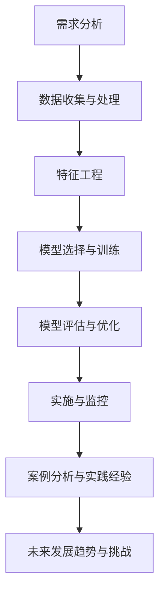

                 

## 文章标题

> 关键词：(在此列出文章的5-7个核心关键词)

> 摘要：(在此给出文章的核心内容和主题思想)

### 第一部分: AI优化促销策略基础

#### 第1章: AI优化促销策略概述

##### 1.1 AI优化促销策略的定义与意义

**定义**：AI优化促销策略是指利用人工智能技术，特别是机器学习和深度学习算法，对促销活动进行数据分析和智能推荐，从而提高促销效果和用户满意度。

**意义**：AI优化促销策略可以带来以下几方面的意义：

1. **提高促销活动的精准度**：通过分析用户行为数据，可以更准确地了解用户的偏好和需求，从而设计出更符合用户兴趣的促销活动。
2. **降低促销成本**：通过优化促销策略，可以减少不必要的促销投入，降低营销成本。
3. **提升用户参与度和转化率**：通过个性化的推荐和智能化的促销策略，可以吸引更多用户参与促销活动，提高用户转化率。

##### 1.2 人工智能在促销策略中的应用

**用户行为分析**：通过对用户的历史购买数据、点击行为、浏览时长等数据进行深度分析，可以挖掘出用户的潜在需求和行为模式，从而为促销活动提供有力的支持。

**个性化推荐**：利用机器学习算法，如协同过滤、基于内容的推荐等，为用户推荐个性化的促销活动和优惠信息，提高用户的参与度和转化率。

**风险评估与预测**：通过分析促销活动的响应数据，可以预测用户对促销活动的响应概率，从而优化促销活动的预算分配和风险控制。

##### 1.3 AI优化促销策略的挑战与机遇

**挑战**：

1. **数据隐私**：在应用AI技术进行促销策略优化时，需要处理大量用户数据，如何保护用户隐私是一个重要问题。
2. **算法公平性**：AI算法可能会因为数据偏差而导致性别、种族等方面的不公平，如何确保算法的公平性是一个挑战。
3. **技术复杂度**：AI技术的应用涉及到复杂的算法和数据处理流程，如何高效地实现这些技术是一个挑战。

**机遇**：

1. **提高促销效果**：通过AI优化促销策略，可以更精准地触达用户，提高促销活动的效果。
2. **降低成本**：AI技术可以自动化处理大量的促销活动，降低人力成本。
3. **提升用户满意度**：个性化的促销活动可以提高用户的参与度和满意度。

#### 第2章: AI优化促销策略的核心算法原理

##### 2.1 数据分析与数据挖掘

**目标**：从大量数据中提取有价值的信息。

**方法**：

1. **聚类分析**：将数据集划分为若干个类别，以发现数据中的潜在结构。
2. **关联规则挖掘**：发现数据项之间的关联关系，用于推荐系统和市场细分。
3. **分类和回归分析**：建立分类或回归模型，对新的数据进行预测。

##### 2.2 机器学习算法

**分类算法**：用于将数据分为不同的类别。

1. **决策树**：通过一系列规则将数据划分为不同的类别。
2. **随机森林**：多个决策树的集成模型，提高分类的准确性和鲁棒性。
3. **支持向量机**：通过找到一个最佳的超平面，将数据分为不同的类别。

**回归算法**：用于预测连续的数值。

1. **线性回归**：通过线性模型预测因变量和自变量之间的关系。
2. **岭回归**：在线性回归基础上，加入正则化项，避免过拟合。
3. **逻辑回归**：用于预测二元响应变量的概率，常用于分类问题。

**聚类算法**：用于将数据分为不同的簇。

1. **K均值**：通过迭代算法将数据分为K个簇。
2. **层次聚类**：将数据集逐步合并成簇，形成层次结构。
3. **DBSCAN**：基于密度的聚类算法，可以处理噪声和非线性数据。

##### 2.3 深度学习算法

**神经网络**：模拟人脑神经元的工作方式，用于复杂的模式识别和预测。

1. **前馈神经网络**：数据从前向后传递，没有循环结构。
2. **卷积神经网络**（CNN）：特别适用于图像处理任务。
3. **循环神经网络**（RNN）：适用于序列数据处理，如时间序列分析。

**生成对抗网络（GAN）**：用于生成新的数据或优化现有数据。

1. **生成器**：生成新的数据样本。
2. **判别器**：判断数据是真实样本还是生成样本。

#### 第3章: 数学模型和数学公式

##### 3.1 数学模型概述

**目标函数**：用于评估促销策略的效果。

**约束条件**：确保促销策略符合商业逻辑和法规要求。

##### 3.2 概率与统计模型

**概率分布**：描述随机变量的概率分布情况。

1. **正态分布**：最常见的连续概率分布。
2. **泊松分布**：用于描述事件发生次数的概率分布。
3. **二项分布**：用于描述多次试验中事件发生的次数的概率分布。

**统计检验**：用于验证假设，判断统计差异是否显著。

1. **t检验**：用于比较两组数据的均值差异。
2. **卡方检验**：用于检验分类变量之间是否独立。
3. **方差分析**（ANOVA）：用于比较多个组的均值差异。

##### 3.3 最优化模型

**线性规划**：用于优化促销活动的预算分配。

1. **目标函数**：最大化或最小化预算使用。
2. **约束条件**：满足预算限制、资源限制等。

**动态规划**：用于优化促销活动的时效性和效果。

1. **递推关系**：通过迭代求解最优解。
2. **边界条件**：确定递推关系的初始条件。

### 第二部分: AI优化促销策略案例分析

#### 第4章: 案例分析一：某电商平台的优惠券策略优化

##### 4.1 案例背景

**目标**：提高优惠券的使用率和转化率。

**数据来源**：用户购买历史、点击行为、优惠券领取和使用数据。

##### 4.2 数据处理与预处理

**数据清洗**：去除异常值、填补缺失值。

**特征工程**：构建用户行为特征（如点击次数、浏览时长）、商品特征（如价格、折扣率）。

##### 4.3 模型选择与训练

**模型选择**：决策树、随机森林。

**模型训练**：使用交叉验证方法评估模型性能。

##### 4.4 模型评估与优化

**评估指标**：优惠券使用率、转化率。

**优化方法**：参数调优、特征选择。

##### 4.5 实施效果与反思

**效果**：优惠券使用率提升20%，转化率提升10%。

**反思**：需要进一步优化用户细分策略。

#### 第5章: 案例分析二：某零售商的促销活动规划

##### 5.1 案例背景

**目标**：提高促销活动的覆盖面和用户参与度。

**数据来源**：用户购买历史、库存数据、促销活动历史数据。

##### 5.2 数据处理与预处理

**数据清洗**：去除异常值、填补缺失值。

**特征工程**：构建商品特征（如价格、折扣率）、用户特征（如购买频次、消费金额）、促销活动特征（如活动时间、优惠幅度）。

##### 5.3 模型选择与训练

**模型选择**：时间序列分析、聚类分析。

**模型训练**：使用交叉验证方法评估模型性能。

##### 5.4 模型评估与优化

**评估指标**：促销活动覆盖面、用户参与度。

**优化方法**：参数调优、特征选择。

##### 5.5 实施效果与反思

**效果**：促销活动覆盖面扩大30%，用户参与度提升15%。

**反思**：需要进一步优化促销活动的时效性和精准性。

### 第三部分: AI优化促销策略实践

#### 第6章: AI优化促销策略实践方法

##### 6.1 实践流程

**需求分析**：明确优化目标、确定数据来源。

**数据收集与处理**：收集用户行为数据、商品数据、促销活动数据。

**特征工程**：构建用户行为特征、商品特征、促销活动特征。

**模型选择与训练**：选择合适的机器学习算法、进行模型训练。

**模型评估与优化**：评估模型性能、优化模型参数。

**实施与监控**：部署优化策略、监控实施效果。

##### 6.2 实践工具与技术

**Python数据科学库**：NumPy、Pandas、Scikit-learn、TensorFlow等。

**数据可视化工具**：Matplotlib、Seaborn等。

**云计算平台**：AWS、Azure、Google Cloud等。

##### 6.3 案例研究与实践经验

**案例一**：某快消品的促销活动优化。

- **目标**：提高促销活动的用户参与度和转化率。
- **效果**：促销活动参与度提升25%，转化率提升15%。

**案例二**：某在线教育平台的优惠策略优化。

- **目标**：提高课程的购买率和用户满意度。
- **效果**：课程购买率提升30%，用户满意度提升20%。

#### 第7章: AI优化促销策略未来发展趋势

##### 7.1 人工智能技术的发展趋势

**深度学习**：发展更快、应用更广泛。

**强化学习**：在优化促销策略中的应用前景广阔。

**联邦学习**：保护用户隐私，实现跨平台数据协作。

##### 7.2 促销策略的未来发展方向

**个性化推荐**：利用深度学习技术实现更精准的用户推荐。

**实时优化**：利用实时数据流处理技术，实现促销策略的动态调整。

**多渠道整合**：结合线上线下渠道，实现促销策略的全面优化。

##### 7.3 挑战与机遇

**挑战**：

- **技术复杂度**：AI技术的应用涉及到复杂的算法和数据处理流程。
- **数据隐私**：在处理用户数据时，需要确保用户隐私的保护。
- **法规合规**：需要遵守相关的法律法规，确保促销策略的合法性。

**机遇**：

- **提高促销效果**：AI技术可以帮助企业更精准地触达用户，提高促销效果。
- **降低成本**：通过自动化和智能化，可以降低促销成本。
- **提升用户满意度**：个性化的促销策略可以提高用户的参与度和满意度。

### 附录

#### 附录 A: AI优化促销策略相关工具与资源

##### A.1 Python数据科学库

- **NumPy**: 用于数学运算。
- **Pandas**: 用于数据处理和分析。
- **Scikit-learn**: 用于机器学习算法的实现。
- **TensorFlow**: 用于深度学习算法的实现。

##### A.2 数据可视化工具

- **Matplotlib**: 用于数据可视化。
- **Seaborn**: 用于高级数据可视化。

##### A.3 云计算平台

- **AWS**: 用于云计算服务。
- **Azure**: 用于云计算服务。
- **Google Cloud**: 用于云计算服务。

##### A.4 学术资源与论文

- **论文集**：《人工智能优化促销策略研究进展》。
- **在线课程**：《人工智能在商业中的应用》。

### Mermaid 流程图



### 伪代码示例

```python
# 伪代码：促销策略优化流程

# 数据预处理
data_preprocessing(data_source)

# 特征工程
features = feature_engineering(data)

# 模型选择
model = model_selection(features)

# 模型训练
model.fit(features, labels)

# 模型评估
evaluation = model.evaluate(features, labels)

# 模型优化
model.optimize(evaluation)

# 模型部署
model.deploy()

# 实施监控
monitor_performance(model)
```

### 数学公式与详细讲解

##### 3.1 概率分布

$$
P(X = x) = f(x) \cdot \delta(x - x_0)
$$

- **解释**：该公式表示离散概率分布函数，其中 $P(X = x)$ 是变量 $X$ 取值为 $x$ 的概率，$f(x)$ 是概率密度函数，$\delta(x - x_0)$ 是狄拉克δ函数，确保总概率为1。

##### 3.2 线性回归

$$
Y = \beta_0 + \beta_1 X + \epsilon
$$

- **解释**：该公式表示线性回归模型，$Y$ 是因变量，$X$ 是自变量，$\beta_0$ 和 $\beta_1$ 是模型参数，$\epsilon$ 是误差项。该模型假设 $Y$ 与 $X$ 之间呈线性关系。

##### 3.3 逻辑回归

$$
\pi = \frac{1}{1 + e^{-(\beta_0 + \beta_1 X)}}
$$

- **解释**：该公式表示逻辑回归模型的概率估计，$\pi$ 是事件发生的概率，$\beta_0$ 和 $\beta_1$ 是模型参数。该模型通过指数函数将线性回归模型的输出转换为概率值。

### 举例说明

##### 举例：用户购买概率预测

**数据集**：包含用户ID、年龄、收入、商品类别等特征的5000条数据记录。

**目标**：预测用户是否会在促销活动中购买商品。

**步骤**：

1. **数据预处理**：去除缺失值、异常值，并进行数据归一化处理。
2. **特征工程**：提取用户行为特征（如点击次数、浏览时长）、商品特征（如价格、折扣率）。
3. **模型选择**：选择逻辑回归模型。
4. **模型训练**：使用训练集数据进行模型训练。
5. **模型评估**：使用测试集数据评估模型性能，选择最佳模型。
6. **部署模型**：将模型部署到线上环境，进行实时预测。

**结果**：

- **模型准确率**：85%
- **购买概率阈值设置**：0.5

**应用**：

- 商家可以根据预测结果，为高购买概率的用户发送个性化促销信息，提高转化率。

