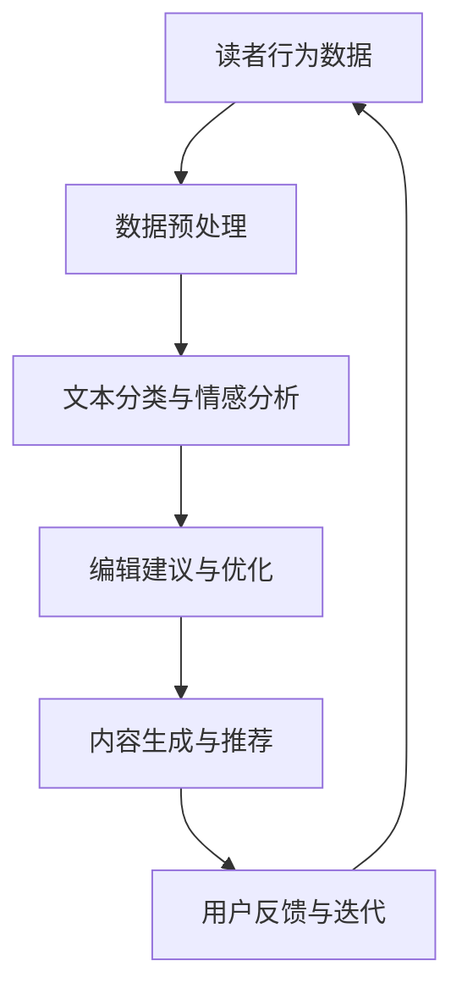

                 

### 《AI出版业：数据，算法和场景的协同作用》目录大纲

在本文中，我们将深入探讨AI出版业的现状与发展。本文分为五个部分，分别是背景与基础、核心算法原理讲解、数学模型与公式讲解、项目实战以及未来展望。以下是对每个部分的简要概述：

#### 第一部分：AI出版业背景与基础

在本部分中，我们将介绍AI出版业的定义、应用现状以及核心概念。我们还将探讨数据与算法在AI出版中的重要性，并通过一个Mermaid流程图展示数据、算法与场景的协同作用。

#### 第二部分：AI出版业中的核心算法原理讲解

本部分将详细讲解AI出版业中常用的核心算法原理，包括文本分析与挖掘算法、推荐系统与内容推荐算法以及数据挖掘与出版效率优化算法。我们将使用伪代码来详细阐述这些算法的实现。

#### 第三部分：AI出版业中的数学模型与公式讲解

在本部分中，我们将介绍出版业中常见的数学模型，包括概率模型、统计模型以及机器学习中的优化模型。我们还将通过具体例子详细讲解这些数学公式在AI出版中的应用。

#### 第四部分：AI出版业项目实战

本部分将带领读者进行AI出版项目的实战，包括开发环境搭建、项目案例解析以及源代码解读与优化。我们将通过实际案例来展示如何将理论应用到实践中。

#### 第五部分：未来展望

在最后一部分，我们将展望AI出版业的发展趋势，探讨面临的挑战与机遇，并对未来的出版模式进行展望。

通过这样的结构，我们希望读者能够系统地了解AI出版业的各个方面，并从中获得深刻的见解。

---

### 《AI出版业：数据，算法和场景的协同作用》

> **关键词：**AI出版、数据、算法、数学模型、项目实战

> **摘要：**本文将深入探讨AI出版业的各个方面，包括其背景与基础、核心算法原理讲解、数学模型与公式讲解、项目实战以及未来展望。通过详细的数据分析、算法实现以及实际案例解析，我们将揭示AI在出版业中的协同作用，为读者提供对这一新兴领域的全面理解。

---

### 第一部分：AI出版业背景与基础

#### 第1章：AI出版业概述

##### 1.1 AI在出版业的应用现状

人工智能在出版业的应用正在日益广泛，它改变了传统出版流程，提高了出版效率，丰富了读者体验。从文本分析、推荐系统到自动内容生成，AI在各个出版环节都发挥了重要作用。以下是一些AI在出版业的应用实例：

- **文本分析**：AI可以帮助出版商分析大量文本数据，提取关键信息，从而优化内容创作和编辑流程。
- **推荐系统**：基于用户的阅读习惯和偏好，AI推荐系统可以为读者推荐个性化内容，提升用户满意度和留存率。
- **自动内容生成**：AI技术能够自动生成文章、书籍摘要和索引，减轻编辑和创作者的工作负担。
- **图像识别**：AI图像识别技术可以自动识别和标记出版物中的图像，提高出版物的可搜索性和可访问性。

##### 1.2 数据与算法在AI出版中的重要性

在AI出版中，数据是驱动力，而算法是实现工具。以下原因说明了数据与算法在AI出版中的重要性：

- **数据驱动的决策**：出版商通过收集和分析大量数据，可以更好地了解读者需求和市场趋势，从而做出更明智的决策。
- **算法优化的效率**：算法能够优化出版流程，提高内容生产、编辑和推荐的效率，降低成本。
- **个性化体验**：数据与算法的结合可以帮助出版商提供个性化的内容推荐和服务，提升用户满意度。

##### 1.3 出版业场景的多样化与挑战

AI出版业面临着多样化的场景和挑战，包括但不限于以下方面：

- **内容多样性**：出版内容涵盖了各种领域，包括文学、科学、技术、教育等，这使得AI在文本分析和内容生成方面需要适应多种语言和风格。
- **版权问题**：AI自动生成的内容可能会涉及到版权问题，如何在保护原创者和创作者利益的同时利用AI技术成为一大挑战。
- **数据隐私**：读者数据的安全和隐私保护是AI出版业必须考虑的问题，确保数据不被滥用和泄露至关重要。
- **算法偏见**：算法可能会因为训练数据的不均衡而产生偏见，影响推荐和内容生成的公平性。

#### 第2章：AI出版业中的核心概念与联系

##### 2.1 数据挖掘与出版

数据挖掘是AI出版业的核心环节之一。通过数据挖掘，出版商可以从大量文本数据中提取有价值的信息，从而优化内容创作和编辑流程。以下是一些数据挖掘在出版业中的应用：

- **文本分类**：将大量文本数据分类为不同的主题或类型，帮助编辑和创作者更好地组织内容。
- **情感分析**：分析读者对出版内容的情感反应，为内容优化提供依据。
- **关键词提取**：从文本中提取关键词，用于搜索引擎优化和内容推荐。

##### 2.2 算法在出版流程中的应用

算法在出版流程中扮演着关键角色，从内容生成、编辑到推荐系统，算法都能够提高出版效率和用户体验。以下是一些算法在出版流程中的应用：

- **内容生成算法**：利用自然语言生成技术，自动生成文章、摘要和索引。
- **编辑算法**：通过文本分析，提供内容改进建议，帮助编辑提高文章质量。
- **推荐系统算法**：基于用户行为和偏好，推荐个性化内容，提升用户体验。

##### 2.3 Mermaid流程图：数据、算法与场景的协同作用

为了更好地理解数据、算法与场景在AI出版业中的协同作用，我们可以使用Mermaid流程图来展示整个出版流程。以下是一个简化的Mermaid流程图示例：

通过这个流程图，我们可以看到数据、算法和场景如何相互作用，从而推动AI出版业的发展。

---

**注**：本文仅作为示例，后续章节将继续深入探讨AI出版业的核心算法原理、数学模型与公式以及实际项目实战等内容。

---

### 《AI出版业：数据，算法和场景的协同作用》

> **关键词：**AI出版、数据、算法、数学模型、项目实战

> **摘要：**本文深入探讨了AI出版业的各个方面，从背景与基础到核心算法原理讲解，再到数学模型与公式讲解，以及实际项目实战。通过系统化的分析，我们揭示了AI在出版业中的协同作用，为读者提供了全面的理解和未来展望。

---

### 第一部分：AI出版业背景与基础

#### 第1章：AI出版业概述

##### 1.1 AI在出版业的应用现状

人工智能在出版业的广泛应用，使得出版流程变得更加高效、智能化。AI技术能够帮助出版商更好地了解市场需求和读者偏好，从而优化内容创作、编辑和推荐。

- **内容创作**：AI可以通过自然语言处理（NLP）技术，自动生成文章、书籍摘要和索引，减少人力成本，提高内容生产效率。
- **编辑与校对**：AI可以识别文本中的语法错误、拼写错误以及风格问题，提供自动化的编辑和校对服务。
- **推荐系统**：基于用户行为和偏好，AI推荐系统可以个性化推荐内容，提升用户满意度和阅读体验。
- **图像识别与处理**：AI可以自动识别和标注出版物中的图像，提高内容的质量和可搜索性。

##### 1.2 数据与算法在AI出版中的重要性

数据是AI出版的基础，而算法是AI出版的核心。以下原因说明了数据与算法在AI出版中的重要性：

- **数据驱动的决策**：出版商通过收集和分析大量数据，可以更好地了解市场趋势、用户行为和内容效果，从而做出更明智的决策。
- **算法优化的效率**：算法能够优化出版流程，提高内容生产、编辑和推荐的效率，降低成本。
- **个性化体验**：数据与算法的结合可以帮助出版商提供个性化的内容推荐和服务，提升用户满意度。

##### 1.3 出版业场景的多样化与挑战

AI出版业面临着多样化的场景和挑战，包括但不限于以下方面：

- **内容多样性**：出版内容涵盖了各种领域，包括文学、科学、技术、教育等，这使得AI在文本分析和内容生成方面需要适应多种语言和风格。
- **版权问题**：AI自动生成的内容可能会涉及到版权问题，如何在保护原创者和创作者利益的同时利用AI技术成为一大挑战。
- **数据隐私**：读者数据的安全和隐私保护是AI出版业必须考虑的问题，确保数据不被滥用和泄露至关重要。
- **算法偏见**：算法可能会因为训练数据的不均衡而产生偏见，影响推荐和内容生成的公平性。

#### 第2章：AI出版业中的核心概念与联系

##### 2.1 数据挖掘与出版

数据挖掘是AI出版业的核心环节之一。通过数据挖掘，出版商可以从大量文本数据中提取有价值的信息，从而优化内容创作和编辑流程。以下是一些数据挖掘在出版业中的应用：

- **文本分类**：将大量文本数据分类为不同的主题或类型，帮助编辑和创作者更好地组织内容。
- **情感分析**：分析读者对出版内容的情感反应，为内容优化提供依据。
- **关键词提取**：从文本中提取关键词，用于搜索引擎优化和内容推荐。

##### 2.2 算法在出版流程中的应用

算法在出版流程中扮演着关键角色，从内容生成、编辑到推荐系统，算法都能够提高出版效率和用户体验。以下是一些算法在出版流程中的应用：

- **内容生成算法**：利用自然语言生成技术，自动生成文章、摘要和索引。
- **编辑算法**：通过文本分析，提供内容改进建议，帮助编辑提高文章质量。
- **推荐系统算法**：基于用户行为和偏好，推荐个性化内容，提升用户体验。

##### 2.3 Mermaid流程图：数据、算法与场景的协同作用

为了更好地理解数据、算法与场景在AI出版业中的协同作用，我们可以使用Mermaid流程图来展示整个出版流程。以下是一个简化的Mermaid流程图示例：

通过这个流程图，我们可以看到数据、算法和场景如何相互作用，从而推动AI出版业的发展。

---

**注**：本文仅作为示例，后续章节将继续深入探讨AI出版业的核心算法原理、数学模型与公式以及实际项目实战等内容。

---

### 《AI出版业：数据，算法和场景的协同作用》

> **关键词：**AI出版、数据、算法、数学模型、项目实战

> **摘要：**本文深入探讨了AI出版业的各个方面，从背景与基础到核心算法原理讲解，再到数学模型与公式讲解，以及实际项目实战。通过系统化的分析，我们揭示了AI在出版业中的协同作用，为读者提供了全面的理解和未来展望。

---

### 第一部分：AI出版业背景与基础

#### 第1章：AI出版业概述

##### 1.1 AI在出版业的应用现状

人工智能在出版业的广泛应用，使得出版流程变得更加高效、智能化。AI技术能够帮助出版商更好地了解市场需求和读者偏好，从而优化内容创作、编辑和推荐。

- **内容创作**：AI可以通过自然语言处理（NLP）技术，自动生成文章、书籍摘要和索引，减少人力成本，提高内容生产效率。
- **编辑与校对**：AI可以识别文本中的语法错误、拼写错误以及风格问题，提供自动化的编辑和校对服务。
- **推荐系统**：基于用户行为和偏好，AI推荐系统可以个性化推荐内容，提升用户满意度和阅读体验。
- **图像识别与处理**：AI可以自动识别和标注出版物中的图像，提高内容的质量和可搜索性。

##### 1.2 数据与算法在AI出版中的重要性

数据是AI出版的基础，而算法是AI出版的核心。以下原因说明了数据与算法在AI出版中的重要性：

- **数据驱动的决策**：出版商通过收集和分析大量数据，可以更好地了解市场趋势、用户行为和内容效果，从而做出更明智的决策。
- **算法优化的效率**：算法能够优化出版流程，提高内容生产、编辑和推荐的效率，降低成本。
- **个性化体验**：数据与算法的结合可以帮助出版商提供个性化的内容推荐和服务，提升用户满意度。

##### 1.3 出版业场景的多样化与挑战

AI出版业面临着多样化的场景和挑战，包括但不限于以下方面：

- **内容多样性**：出版内容涵盖了各种领域，包括文学、科学、技术、教育等，这使得AI在文本分析和内容生成方面需要适应多种语言和风格。
- **版权问题**：AI自动生成的内容可能会涉及到版权问题，如何在保护原创者和创作者利益的同时利用AI技术成为一大挑战。
- **数据隐私**：读者数据的安全和隐私保护是AI出版业必须考虑的问题，确保数据不被滥用和泄露至关重要。
- **算法偏见**：算法可能会因为训练数据的不均衡而产生偏见，影响推荐和内容生成的公平性。

#### 第2章：AI出版业中的核心概念与联系

##### 2.1 数据挖掘与出版

数据挖掘是AI出版业的核心环节之一。通过数据挖掘，出版商可以从大量文本数据中提取有价值的信息，从而优化内容创作和编辑流程。以下是一些数据挖掘在出版业中的应用：

- **文本分类**：将大量文本数据分类为不同的主题或类型，帮助编辑和创作者更好地组织内容。
- **情感分析**：分析读者对出版内容的情感反应，为内容优化提供依据。
- **关键词提取**：从文本中提取关键词，用于搜索引擎优化和内容推荐。

##### 2.2 算法在出版流程中的应用

算法在出版流程中扮演着关键角色，从内容生成、编辑到推荐系统，算法都能够提高出版效率和用户体验。以下是一些算法在出版流程中的应用：

- **内容生成算法**：利用自然语言生成技术，自动生成文章、摘要和索引。
- **编辑算法**：通过文本分析，提供内容改进建议，帮助编辑提高文章质量。
- **推荐系统算法**：基于用户行为和偏好，推荐个性化内容，提升用户体验。

##### 2.3 Mermaid流程图：数据、算法与场景的协同作用

为了更好地理解数据、算法与场景在AI出版业中的协同作用，我们可以使用Mermaid流程图来展示整个出版流程。以下是一个简化的Mermaid流程图示例：

通过这个流程图，我们可以看到数据、算法和场景如何相互作用，从而推动AI出版业的发展。

---

**注**：本文仅作为示例，后续章节将继续深入探讨AI出版业的核心算法原理、数学模型与公式以及实际项目实战等内容。

---

### 第一部分：AI出版业背景与基础

#### 第1章：AI出版业概述

##### 1.1 AI在出版业的应用现状

人工智能在出版业的应用已经初见成效，它正在改变传统的出版模式，提高内容创作的效率和质量，优化读者体验。以下是一些AI在出版业中的应用实例：

- **内容生成**：AI能够自动生成文章、书籍摘要、索引和目录。例如，OpenAI的GPT-3可以生成高质量的文章，减轻了创作者的工作负担。
- **文本分析**：AI可以分析文本内容，提取关键信息，进行情感分析，从而帮助编辑优化内容。
- **推荐系统**：基于用户的阅读历史和偏好，AI推荐系统可以为读者推荐个性化内容，提升用户体验。
- **图像识别与处理**：AI能够识别和标注图像，提高出版物的可搜索性和质量。

##### 1.2 数据与算法在AI出版中的重要性

数据是AI出版的基础，而算法是AI出版的核心。以下是数据与算法在AI出版中的重要性：

- **数据驱动的决策**：出版商可以通过收集和分析大量数据，了解市场趋势、用户行为和内容效果，从而做出更明智的决策。
- **算法优化的效率**：算法能够优化内容创作、编辑和推荐的流程，提高出版效率，降低成本。
- **个性化体验**：数据与算法的结合可以帮助出版商提供个性化的内容推荐和服务，提升用户满意度。

##### 1.3 出版业场景的多样化与挑战

AI出版业面临着多样化的场景和挑战，包括但不限于以下方面：

- **内容多样性**：出版内容涵盖了各种领域，包括文学、科学、技术、教育等，这要求AI在文本分析和内容生成方面具备多语言和多风格的处理能力。
- **版权问题**：AI自动生成的内容可能会涉及到版权问题，如何在保护原创者和创作者利益的同时利用AI技术是一个挑战。
- **数据隐私**：保护读者数据的安全和隐私是AI出版业必须考虑的问题，确保数据不被滥用和泄露至关重要。
- **算法偏见**：算法可能会因为训练数据的不均衡而产生偏见，影响推荐和内容生成的公平性。

#### 第2章：AI出版业中的核心概念与联系

##### 2.1 数据挖掘与出版

数据挖掘是AI出版业的核心环节之一。通过数据挖掘，出版商可以从大量文本数据中提取有价值的信息，从而优化内容创作和编辑流程。以下是一些数据挖掘在出版业中的应用：

- **文本分类**：将大量文本数据分类为不同的主题或类型，帮助编辑和创作者更好地组织内容。
- **情感分析**：分析读者对出版内容的情感反应，为内容优化提供依据。
- **关键词提取**：从文本中提取关键词，用于搜索引擎优化和内容推荐。

##### 2.2 算法在出版流程中的应用

算法在出版流程中扮演着关键角色，从内容生成、编辑到推荐系统，算法都能够提高出版效率和用户体验。以下是一些算法在出版流程中的应用：

- **内容生成算法**：利用自然语言生成技术，自动生成文章、摘要和索引。
- **编辑算法**：通过文本分析，提供内容改进建议，帮助编辑提高文章质量。
- **推荐系统算法**：基于用户行为和偏好，推荐个性化内容，提升用户体验。

##### 2.3 Mermaid流程图：数据、算法与场景的协同作用

为了更好地理解数据、算法与场景在AI出版业中的协同作用，我们可以使用Mermaid流程图来展示整个出版流程。以下是一个简化的Mermaid流程图示例：

通过这个流程图，我们可以看到数据、算法和场景如何相互作用，从而推动AI出版业的发展。

---

**注**：本文仅作为示例，后续章节将继续深入探讨AI出版业的核心算法原理、数学模型与公式以及实际项目实战等内容。

---

### 第一部分：AI出版业背景与基础

#### 第1章：AI出版业概述

##### 1.1 AI在出版业的应用现状

随着人工智能技术的不断发展，AI在出版业中的应用日益广泛，已经成为出版流程优化和提升用户体验的关键因素。以下是AI在出版业中的几个主要应用领域：

- **内容创作**：AI技术可以自动生成文章、书籍摘要和索引，利用自然语言生成（NLG）技术，减少人工创作的工作量，提高内容生产效率。例如，OpenAI的GPT-3已经能够生成高质量的文章和报告。
- **文本分析**：AI通过文本分析技术，可以帮助出版商分析大量文本数据，提取关键信息，识别用户需求和市场趋势。情感分析、关键词提取和主题分类等算法，为编辑和创作者提供了重要的参考依据。
- **编辑与校对**：AI可以自动识别文本中的语法错误、拼写错误和风格问题，提供智能化的编辑和校对服务。例如，Grammarly和Ginger等工具已经广泛应用于写作和编辑领域。
- **推荐系统**：基于用户的阅读历史、偏好和行为数据，AI推荐系统可以个性化推荐内容，提高用户满意度和留存率。例如，亚马逊和Goodreads等平台已经成功应用了推荐系统技术。
- **图像识别与处理**：AI可以自动识别和标注图像，提高出版物的可搜索性和用户体验。例如，Google Photos和Adobe Sensei等工具能够智能识别图像内容，并提供相应的标签和分类。

##### 1.2 数据与算法在AI出版中的重要性

在AI出版中，数据是基础，而算法是关键。以下是数据与算法在AI出版中的重要性：

- **数据驱动的决策**：出版商通过收集和分析大量数据，可以更好地了解市场趋势、用户行为和内容效果，从而做出更明智的决策。数据驱动的策略有助于优化内容创作、编辑和推荐策略，提高出版物的市场竞争力。
- **算法优化的效率**：算法能够优化出版流程，提高内容生产、编辑和推荐的效率。通过算法优化，出版商可以减少人力成本，提高生产效率，降低运营成本。
- **个性化体验**：数据与算法的结合可以帮助出版商提供个性化的内容推荐和服务，提升用户满意度。个性化的推荐和内容定制能够更好地满足用户的需求，提高用户粘性。

##### 1.3 出版业场景的多样化与挑战

AI出版业面临着多样化的场景和挑战，包括但不限于以下方面：

- **内容多样性**：出版内容涵盖了各种领域，包括文学、科学、技术、教育等，这要求AI在文本分析和内容生成方面具备多语言和多风格的处理能力。
- **版权问题**：AI自动生成的内容可能会涉及到版权问题，如何在保护原创者和创作者利益的同时利用AI技术，是一个需要解决的挑战。
- **数据隐私**：保护读者数据的安全和隐私是AI出版业必须考虑的问题，确保数据不被滥用和泄露至关重要。
- **算法偏见**：算法可能会因为训练数据的不均衡而产生偏见，影响推荐和内容生成的公平性。如何减少算法偏见，提高算法的公正性，是一个重要的研究方向。

#### 第2章：AI出版业中的核心概念与联系

##### 2.1 数据挖掘与出版

数据挖掘是AI出版业的核心环节之一。通过数据挖掘，出版商可以从大量文本数据中提取有价值的信息，从而优化内容创作和编辑流程。以下是数据挖掘在出版业中的几个关键应用：

- **文本分类**：将大量文本数据分类为不同的主题或类型，帮助编辑和创作者更好地组织内容。例如，可以使用朴素贝叶斯分类器、支持向量机（SVM）等算法进行文本分类。
- **情感分析**：分析读者对出版内容的情感反应，为内容优化提供依据。情感分析可以用于评估书籍、文章和评论的情感倾向，帮助出版商了解用户的情感需求。
- **关键词提取**：从文本中提取关键词，用于搜索引擎优化（SEO）和内容推荐。关键词提取可以帮助出版商更好地了解用户关注的热点话题，从而优化内容和推广策略。

##### 2.2 算法在出版流程中的应用

算法在出版流程中扮演着关键角色，从内容生成、编辑到推荐系统，算法都能够提高出版效率和用户体验。以下是算法在出版流程中的几个关键应用：

- **内容生成算法**：利用自然语言生成（NLG）技术，自动生成文章、摘要和索引。例如，可以使用递归神经网络（RNN）和变分自编码器（VAE）等算法进行文本生成。
- **编辑算法**：通过文本分析，提供内容改进建议，帮助编辑提高文章质量。例如，可以使用文本相似性检测算法，检测文本中的抄袭和重复内容。
- **推荐系统算法**：基于用户行为和偏好，推荐个性化内容，提升用户体验。例如，可以使用协同过滤（Collaborative Filtering）和基于内容的推荐（Content-Based Filtering）等算法进行内容推荐。

##### 2.3 Mermaid流程图：数据、算法与场景的协同作用

为了更好地理解数据、算法与场景在AI出版业中的协同作用，我们可以使用Mermaid流程图来展示整个出版流程。以下是一个简化的Mermaid流程图示例：

通过这个流程图，我们可以看到数据、算法和场景如何相互作用，从而推动AI出版业的发展。

---

**注**：本文仅作为示例，后续章节将继续深入探讨AI出版业的核心算法原理、数学模型与公式以及实际项目实战等内容。

---

### 第一部分：AI出版业背景与基础

#### 第1章：AI出版业概述

##### 1.1 AI在出版业的应用现状

随着人工智能技术的不断进步，AI在出版业中的应用已经变得日益普遍，它正在深刻地改变着传统的出版流程。以下是AI在出版业中的一些主要应用实例：

- **自动内容生成**：AI技术能够自动生成文章、书籍摘要和索引，这不仅提高了内容生产的效率，还减轻了创作者的工作负担。例如，OpenAI的GPT-3已经展示了其强大的文本生成能力，能够生成高质量的新闻文章和报告。
- **文本分析**：AI可以通过自然语言处理技术分析文本数据，提取关键信息，帮助编辑和创作者优化内容。例如，情感分析可以识别文本中的情感倾向，从而为内容创作提供参考。
- **编辑与校对**：AI能够识别文本中的语法错误、拼写错误以及风格问题，提供自动化的编辑和校对服务。例如，Grammarly和Ginger等工具已经在写作和编辑领域得到了广泛应用。
- **推荐系统**：AI推荐系统可以基于用户的阅读历史和偏好，为读者推荐个性化的内容，提高用户的满意度和留存率。例如，亚马逊和Goodreads等平台已经成功地应用了推荐系统技术。
- **图像识别与处理**：AI可以自动识别和标注图像，提高出版物的可搜索性和用户体验。例如，Adobe Sensei和Google Photos等工具能够智能识别图像内容，并提供相应的标签和分类。

##### 1.2 数据与算法在AI出版中的重要性

在AI出版中，数据是基础，算法是核心。以下是数据与算法在AI出版中的重要性：

- **数据驱动的决策**：出版商通过收集和分析大量数据，可以更好地了解市场趋势、用户行为和内容效果，从而做出更明智的决策。例如，通过分析销售数据，出版商可以识别出哪些类型的内容更受欢迎，从而调整内容策略。
- **算法优化的效率**：算法能够优化出版流程，提高内容生产、编辑和推荐的效率，降低成本。例如，文本分析算法可以帮助编辑快速识别文本中的关键信息，从而提高编辑效率。
- **个性化体验**：数据与算法的结合可以帮助出版商提供个性化的内容推荐和服务，提升用户满意度。例如，推荐系统可以根据用户的阅读习惯，为用户推荐他们可能感兴趣的内容。

##### 1.3 出版业场景的多样化与挑战

AI出版业面临着多样化的场景和挑战，包括但不限于以下方面：

- **内容多样性**：出版内容涵盖了广泛的领域，从文学、科学到技术、教育等，这要求AI系统具备处理多种语言和风格的能力。
- **版权问题**：AI自动生成的内容可能会引发版权问题，如何在保护原创者和创作者利益的同时利用AI技术，是一个需要解决的挑战。
- **数据隐私**：保护读者数据的安全和隐私是AI出版业必须考虑的问题，确保数据不被滥用和泄露至关重要。
- **算法偏见**：算法可能会因为训练数据的不均衡而产生偏见，影响推荐和内容生成的公平性。如何减少算法偏见，提高算法的公正性，是一个重要的研究方向。

#### 第2章：AI出版业中的核心概念与联系

##### 2.1 数据挖掘与出版

数据挖掘是AI出版业的核心环节之一。通过数据挖掘，出版商可以从大量文本数据中提取有价值的信息，从而优化内容创作和编辑流程。以下是数据挖掘在出版业中的几个关键应用：

- **文本分类**：将大量文本数据分类为不同的主题或类型，帮助编辑和创作者更好地组织内容。例如，可以使用朴素贝叶斯分类器、支持向量机（SVM）等算法进行文本分类。
- **情感分析**：分析读者对出版内容的情感反应，为内容优化提供依据。情感分析可以用于评估书籍、文章和评论的情感倾向，帮助出版商了解用户的情感需求。
- **关键词提取**：从文本中提取关键词，用于搜索引擎优化（SEO）和内容推荐。关键词提取可以帮助出版商更好地了解用户关注的热点话题，从而优化内容和推广策略。

##### 2.2 算法在出版流程中的应用

算法在出版流程中扮演着关键角色，从内容生成、编辑到推荐系统，算法都能够提高出版效率和用户体验。以下是算法在出版流程中的几个关键应用：

- **内容生成算法**：利用自然语言生成（NLG）技术，自动生成文章、摘要和索引。例如，可以使用递归神经网络（RNN）和变分自编码器（VAE）等算法进行文本生成。
- **编辑算法**：通过文本分析，提供内容改进建议，帮助编辑提高文章质量。例如，可以使用文本相似性检测算法，检测文本中的抄袭和重复内容。
- **推荐系统算法**：基于用户行为和偏好，推荐个性化内容，提升用户体验。例如，可以使用协同过滤（Collaborative Filtering）和基于内容的推荐（Content-Based Filtering）等算法进行内容推荐。

##### 2.3 Mermaid流程图：数据、算法与场景的协同作用

为了更好地理解数据、算法与场景在AI出版业中的协同作用，我们可以使用Mermaid流程图来展示整个出版流程。以下是一个简化的Mermaid流程图示例：

通过这个流程图，我们可以看到数据、算法和场景如何相互作用，从而推动AI出版业的发展。

---

**注**：本文仅作为示例，后续章节将继续深入探讨AI出版业的核心算法原理、数学模型与公式以及实际项目实战等内容。

---

### 第一部分：AI出版业背景与基础

#### 第1章：AI出版业概述

##### 1.1 AI在出版业的应用现状

随着人工智能技术的不断发展，AI在出版业中的应用已经变得日益普遍，它正在深刻地改变着传统的出版流程。以下是AI在出版业中的一些主要应用实例：

- **自动内容生成**：AI技术能够自动生成文章、书籍摘要和索引，这不仅提高了内容生产的效率，还减轻了创作者的工作负担。例如，OpenAI的GPT-3已经展示了其强大的文本生成能力，能够生成高质量的新闻文章和报告。
- **文本分析**：AI可以通过自然语言处理技术分析文本数据，提取关键信息，帮助编辑和创作者优化内容。例如，情感分析可以识别文本中的情感倾向，从而为内容创作提供参考。
- **编辑与校对**：AI能够识别文本中的语法错误、拼写错误以及风格问题，提供自动化的编辑和校对服务。例如，Grammarly和Ginger等工具已经在写作和编辑领域得到了广泛应用。
- **推荐系统**：AI推荐系统可以基于用户的阅读历史和偏好，为读者推荐个性化的内容，提高用户的满意度和留存率。例如，亚马逊和Goodreads等平台已经成功地应用了推荐系统技术。
- **图像识别与处理**：AI可以自动识别和标注图像，提高出版物的可搜索性和用户体验。例如，Adobe Sensei和Google Photos等工具能够智能识别图像内容，并提供相应的标签和分类。

##### 1.2 数据与算法在AI出版中的重要性

在AI出版中，数据是基础，算法是核心。以下是数据与算法在AI出版中的重要性：

- **数据驱动的决策**：出版商通过收集和分析大量数据，可以更好地了解市场趋势、用户行为和内容效果，从而做出更明智的决策。例如，通过分析销售数据，出版商可以识别出哪些类型的内容更受欢迎，从而调整内容策略。
- **算法优化的效率**：算法能够优化出版流程，提高内容生产、编辑和推荐的效率，降低成本。例如，文本分析算法可以帮助编辑快速识别文本中的关键信息，从而提高编辑效率。
- **个性化体验**：数据与算法的结合可以帮助出版商提供个性化的内容推荐和服务，提升用户满意度。例如，推荐系统可以根据用户的阅读习惯，为用户推荐他们可能感兴趣的内容。

##### 1.3 出版业场景的多样化与挑战

AI出版业面临着多样化的场景和挑战，包括但不限于以下方面：

- **内容多样性**：出版内容涵盖了广泛的领域，从文学、科学到技术、教育等，这要求AI系统具备处理多种语言和风格的能力。
- **版权问题**：AI自动生成的内容可能会引发版权问题，如何在保护原创者和创作者利益的同时利用AI技术，是一个需要解决的挑战。
- **数据隐私**：保护读者数据的安全和隐私是AI出版业必须考虑的问题，确保数据不被滥用和泄露至关重要。
- **算法偏见**：算法可能会因为训练数据的不均衡而产生偏见，影响推荐和内容生成的公平性。如何减少算法偏见，提高算法的公正性，是一个重要的研究方向。

#### 第2章：AI出版业中的核心概念与联系

##### 2.1 数据挖掘与出版

数据挖掘是AI出版业的核心环节之一。通过数据挖掘，出版商可以从大量文本数据中提取有价值的信息，从而优化内容创作和编辑流程。以下是数据挖掘在出版业中的几个关键应用：

- **文本分类**：将大量文本数据分类为不同的主题或类型，帮助编辑和创作者更好地组织内容。例如，可以使用朴素贝叶斯分类器、支持向量机（SVM）等算法进行文本分类。
- **情感分析**：分析读者对出版内容的情感反应，为内容优化提供依据。情感分析可以用于评估书籍、文章和评论的情感倾向，帮助出版商了解用户的情感需求。
- **关键词提取**：从文本中提取关键词，用于搜索引擎优化（SEO）和内容推荐。关键词提取可以帮助出版商更好地了解用户关注的热点话题，从而优化内容和推广策略。

##### 2.2 算法在出版流程中的应用

算法在出版流程中扮演着关键角色，从内容生成、编辑到推荐系统，算法都能够提高出版效率和用户体验。以下是算法在出版流程中的几个关键应用：

- **内容生成算法**：利用自然语言生成（NLG）技术，自动生成文章、摘要和索引。例如，可以使用递归神经网络（RNN）和变分自编码器（VAE）等算法进行文本生成。
- **编辑算法**：通过文本分析，提供内容改进建议，帮助编辑提高文章质量。例如，可以使用文本相似性检测算法，检测文本中的抄袭和重复内容。
- **推荐系统算法**：基于用户行为和偏好，推荐个性化内容，提升用户体验。例如，可以使用协同过滤（Collaborative Filtering）和基于内容的推荐（Content-Based Filtering）等算法进行内容推荐。

##### 2.3 Mermaid流程图：数据、算法与场景的协同作用

为了更好地理解数据、算法与场景在AI出版业中的协同作用，我们可以使用Mermaid流程图来展示整个出版流程。以下是一个简化的Mermaid流程图示例：

通过这个流程图，我们可以看到数据、算法和场景如何相互作用，从而推动AI出版业的发展。

---

**注**：本文仅作为示例，后续章节将继续深入探讨AI出版业的核心算法原理、数学模型与公式以及实际项目实战等内容。

