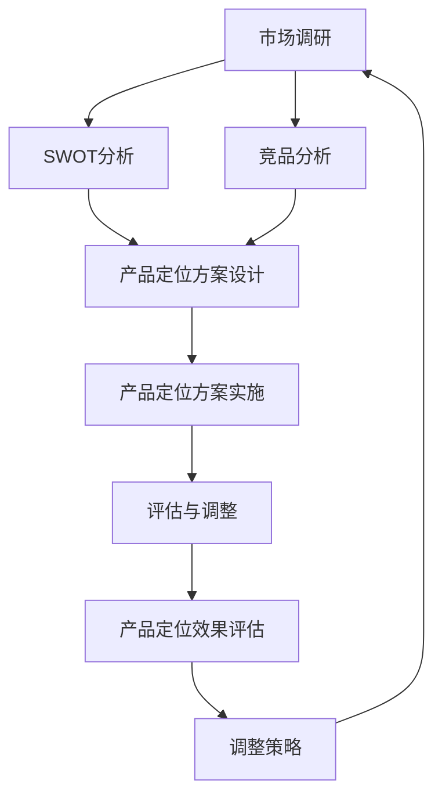

                 

### AI创业公司的产品定位策略

> **关键词：** AI创业公司、产品定位、市场调研、竞争对手分析、差异化策略

**摘要：** 本篇文章将深入探讨AI创业公司的产品定位策略，包括AI技术的快速发展和创业机会、AI创业公司的市场定位分析、产品定位原则与策略、差异化策略以及市场推广与品牌建设。文章还将通过具体案例和代码实战，为创业公司提供实用的产品定位方法和技巧。

### 目录大纲

1. **AI创业公司概述**
    1.1 AI技术的快速发展与创业机会
    1.2 AI创业公司的市场规模分析
    1.3 创业公司的竞争格局
2. **AI创业公司的核心概念与架构**
    2.1 AI基础技术概述
    2.2 AI模型与算法的应用
    2.3 AI创业公司的架构设计
3. **AI创业公司的市场定位分析**
    3.1 市场细分与定位策略
    3.2 目标客户分析
    3.3 竞争对手分析
4. **产品定位策略**
    4.1 产品定位原则与框架
    4.2 产品定位策略的制定
    4.3 产品差异化策略
    4.4 市场推广与品牌建设
5. **产品定位案例研究**
    5.1 某自然语言处理创业公司的产品定位
    5.2 某智能推荐系统的产品定位
    5.3 某无人驾驶创业公司的产品定位
6. **AI创业公司的产品定位挑战与应对**
    6.1 挑战与风险分析
    6.2 应对策略与解决方案
    6.3 成功经验与教训总结
7. **产品定位策略的未来发展趋势**
    7.1 AI技术的未来发展趋势
    7.2 产品定位策略的新趋势
    7.3 创业公司应如何应对未来挑战
8. **附录**
    8.1 市场调研方法
    8.2 竞品分析方法
    8.3 用户访谈技巧
    8.4 数据分析工具介绍
    8.5 创业公司的产品定位流程
    8.6 产品定位策略实施案例
    8.7 产品定位策略评估与调整
    8.8 AI创业公司产品定位相关资源

### AI创业公司的行业背景

#### AI技术的快速发展与创业机会

人工智能（AI）作为21世纪最具变革性的技术之一，正以惊人的速度推动着各行各业的变革。随着深度学习、神经网络等先进算法的不断发展，AI技术的应用范围和深度不断拓展。从自动驾驶、智能语音识别到医疗诊断、金融风控，AI技术正在改变我们的生活和工作方式。

这种技术的快速发展带来了大量的创业机会。许多创业者看到了AI技术所带来的巨大潜力，纷纷投身于AI创业浪潮中。AI创业公司的出现，不仅推动了技术进步，也带来了新的商业模型和市场机会。例如，自然语言处理（NLP）技术的进步使得智能客服、智能写作等应用成为可能；计算机视觉技术的发展则催生了自动驾驶、安防监控等领域的创新。

#### AI创业公司的市场规模分析

随着AI技术的不断成熟和普及，全球AI市场规模呈现出快速增长的趋势。根据市场研究报告，全球AI市场规模预计将在未来几年内达到数千亿美元。具体来说，AI技术在医疗、金融、零售、制造等领域的应用将带来巨大的市场机会。

在医疗领域，AI技术已经被广泛应用于医学影像分析、疾病预测、药物研发等方面，市场规模巨大。根据报告，全球医疗AI市场预计将在2025年达到数百亿美元。在金融领域，AI技术被广泛应用于风险管理、欺诈检测、智能投顾等方面，也为金融行业带来了全新的商业模式。零售行业通过AI技术实现个性化推荐、智能库存管理等，提高了运营效率和用户体验。在制造领域，AI技术的应用包括智能制造、设备故障预测等，提升了生产效率和质量。

#### 创业公司的竞争格局

尽管AI市场前景广阔，但同时也面临着激烈的竞争。在AI创业领域，主要竞争格局包括技术优势、市场优势和资金优势。

**技术优势：** 拥有先进技术和创新能力的公司更容易在市场中脱颖而出。例如，谷歌、微软、IBM等科技巨头在AI技术方面具有显著的优势，吸引了大量的投资和人才。

**市场优势：** 在特定领域拥有领先市场地位的公司更具竞争力。例如，亚马逊在电商领域拥有庞大的用户基础和先进的技术能力，使其在智能推荐系统等领域具有显著的市场优势。

**资金优势：** 资金充足的创业公司可以更好地进行技术研发和市场推广，从而在竞争中占据有利地位。例如，特斯拉在自动驾驶领域的成功，部分得益于其强大的资金支持和技术积累。

总之，AI创业公司的竞争格局呈现出多元化、复杂化的趋势。在这种背景下，创业公司需要明确自身的定位，发挥自身优势，制定有效的产品定位策略，才能在激烈的市场竞争中脱颖而出。

### AI创业公司的核心概念与架构

AI创业公司的成功离不开其核心概念和架构的设计。在这个部分，我们将深入探讨AI创业公司的核心概念与架构，包括AI基础技术、AI模型与算法的应用以及AI创业公司的架构设计。

#### AI基础技术概述

AI基础技术是AI创业公司构建产品的基础。以下是一些关键的AI基础技术：

1. **机器学习（Machine Learning）**：机器学习是一种让计算机从数据中自动学习和改进的技术。它包括监督学习、无监督学习和强化学习等不同类型。监督学习通过已有的输入输出数据进行模型训练，无监督学习通过未标记的数据进行学习，而强化学习则通过与环境交互来优化决策过程。

2. **深度学习（Deep Learning）**：深度学习是一种基于多层神经网络的机器学习技术。通过多层非线性变换，深度学习能够从大量数据中自动提取特征并实现复杂的模式识别。常见的深度学习模型包括卷积神经网络（CNN）、循环神经网络（RNN）和生成对抗网络（GAN）等。

3. **自然语言处理（Natural Language Processing, NLP）**：NLP是AI领域中研究如何让计算机理解和生成自然语言的技术。NLP技术包括文本分类、情感分析、机器翻译、问答系统等。

4. **计算机视觉（Computer Vision）**：计算机视觉是AI领域中研究如何让计算机理解和解析视觉信息的技术。计算机视觉的应用包括图像分类、目标检测、图像识别等。

5. **知识图谱（Knowledge Graph）**：知识图谱是一种通过图形化方式表示实体及其关系的语义网络。知识图谱可以用于信息检索、推荐系统、智能问答等领域。

#### AI模型与算法的应用

AI模型与算法的应用是AI创业公司的核心。以下是一些关键的AI模型与算法及其应用：

1. **神经网络（Neural Networks）**：神经网络是深度学习的基础，它通过模拟人脑神经元的工作原理来实现数据建模。神经网络的应用包括图像识别、语音识别、自然语言处理等。

2. **卷积神经网络（CNN）**：CNN是一种专门用于图像处理和物体识别的神经网络。通过卷积、池化等操作，CNN能够从图像中自动提取特征并实现高精度的分类和识别。

3. **循环神经网络（RNN）**：RNN是一种专门用于序列数据建模的神经网络。通过记忆过去的信息，RNN能够处理变长的输入序列，并实现序列到序列的映射。

4. **生成对抗网络（GAN）**：GAN是一种由生成器和判别器组成的模型，通过相互竞争实现数据的生成。GAN被广泛应用于图像生成、图像修复、视频合成等场景。

5. **强化学习（Reinforcement Learning）**：强化学习是一种通过与环境交互来学习最优策略的机器学习技术。强化学习被广泛应用于游戏、自动驾驶、机器人控制等领域。

#### AI创业公司的架构设计

AI创业公司的架构设计是确保产品性能和可扩展性的关键。以下是一些常见的AI创业公司架构设计：

1. **基于微服务的架构**：微服务架构将应用程序拆分为多个独立的服务，每个服务负责特定的功能。这种架构设计可以提高系统的可扩展性和可维护性。

2. **容器化与云计算**：通过使用容器（如Docker）和云计算平台（如AWS、Azure），AI创业公司可以快速部署和扩展应用程序，同时降低成本。

3. **数据存储与处理**：AI创业公司需要高效的数据存储与处理系统。常用的数据存储技术包括关系型数据库、NoSQL数据库和大数据处理平台（如Hadoop、Spark）。

4. **模型训练与部署**：模型训练和部署是AI创业公司的核心环节。通过使用深度学习框架（如TensorFlow、PyTorch），创业公司可以快速训练和部署高效的AI模型。

总之，AI创业公司的核心概念与架构设计决定了其产品的性能、可扩展性和竞争力。创业公司需要深入理解AI基础技术、模型与算法，并设计合理的架构，以实现其商业目标。

### AI创业公司的市场定位分析

在了解了AI创业公司的核心概念与架构后，接下来我们将深入探讨AI创业公司的市场定位分析，包括市场细分与定位策略、目标客户分析和竞争对手分析。这些分析将帮助创业公司明确市场定位，制定有效的发展策略。

#### 市场细分与定位策略

市场细分是AI创业公司进行市场定位的第一步。通过市场细分，创业公司可以将整个市场划分为不同的子市场，从而找到最具潜力的客户群体。以下是一些常见的市场细分方法：

1. **地理细分**：根据不同地理位置进行市场细分。例如，城市地区、乡村地区、国际市场等。地理细分有助于公司根据不同地区的消费习惯和需求进行产品定制。

2. **人口细分**：根据人口特征进行市场细分，如年龄、性别、收入、教育水平等。人口细分有助于公司针对不同人群设计差异化的产品和服务。

3. **心理细分**：根据消费者的心理特征进行市场细分，如价值观、生活方式、兴趣等。心理细分有助于公司了解消费者的深层次需求，从而提供更有针对性的产品。

4. **行为细分**：根据消费者的行为特征进行市场细分，如购买习惯、使用习惯、忠诚度等。行为细分有助于公司识别最具价值的客户群体，并制定相应的营销策略。

在市场细分的基础上，AI创业公司需要制定明确的市场定位策略。市场定位策略包括以下几个方面：

1. **目标市场选择**：根据市场细分结果，选择最具潜力和竞争力的目标市场。目标市场选择应考虑市场规模、增长潜力、竞争态势等因素。

2. **差异化定位**：通过差异化定位，使公司的产品在市场中具有独特的竞争优势。差异化定位可以基于技术、功能、品牌、服务等方面。

3. **市场定位宣传**：通过有效的市场宣传，将公司的市场定位策略传达给目标市场。市场定位宣传应注重品牌形象、产品特点、竞争优势等方面。

#### 目标客户分析

明确目标客户是制定市场定位策略的关键。以下是一些目标客户分析的方法：

1. **客户画像**：通过绘制客户画像，对目标客户的特征进行详细描述。客户画像可以包括年龄、性别、职业、收入、教育水平、兴趣爱好等方面的信息。

2. **需求分析**：通过市场调研和用户反馈，了解目标客户的需求和痛点。需求分析可以帮助公司设计更符合市场需求的产品。

3. **客户价值分析**：分析目标客户对公司产品或服务的价值，如购买频率、购买金额、忠诚度等。客户价值分析有助于公司识别最具价值的客户群体，并制定相应的营销策略。

4. **竞争分析**：通过分析竞争对手的目标客户，了解竞争对手的市场定位和产品特点。竞争分析可以帮助公司找到市场定位的独特点，并制定差异化策略。

#### 竞争对手分析

在竞争激烈的市场环境中，了解竞争对手是制定市场定位策略的重要步骤。以下是一些竞争对手分析的方法：

1. **竞争对手识别**：通过市场调研和用户反馈，识别出公司的主要竞争对手。

2. **竞争对手定位**：分析竞争对手的市场定位和产品特点，了解其在市场中的地位和优势。

3. **竞争对手分析**：对竞争对手的产品、市场策略、营销手段等进行详细分析，找出其成功和不足之处。

4. **竞争策略制定**：根据竞争对手分析的结果，制定相应的竞争策略。例如，通过技术优势、差异化定位、市场细分等方式，提升公司的市场竞争力。

总之，AI创业公司的市场定位分析是制定有效市场策略的关键。通过市场细分、目标客户分析和竞争对手分析，创业公司可以明确市场定位，制定差异化策略，提升市场竞争力，实现可持续发展。

### 产品定位原则与框架

产品定位是AI创业公司成功的关键之一，它决定了产品在市场中的地位和影响力。一个清晰、有效的产品定位能够帮助公司吸引目标客户，建立品牌形象，并形成独特的竞争优势。在这个部分，我们将讨论产品定位的定义、重要性以及产品定位的三个关键要素，并借助SWOT分析来探讨产品定位的策略。

#### 产品定位的定义与重要性

**产品定位**是指企业通过产品特性、品牌形象和市场策略，在目标客户心中确立一个独特的市场地位。具体来说，产品定位需要明确以下几个方面的内容：

1. **目标市场**：确定产品的目标客户群体，包括其年龄、性别、收入、职业等特征。
2. **产品特性**：明确产品所具备的独特功能、技术优势、质量特点等，使其在市场中脱颖而出。
3. **品牌形象**：通过品牌传播和营销活动，建立产品的品牌形象和声誉，提高品牌知名度。
4. **市场策略**：制定合适的市场推广和销售策略，包括定价策略、渠道策略、促销策略等。

产品定位的重要性体现在以下几个方面：

1. **明确目标客户**：产品定位有助于企业明确目标客户群体，从而进行有针对性的市场推广和销售，提高转化率。
2. **形成竞争优势**：通过产品定位，企业可以找到市场中的独特卖点，形成与其他竞争对手不同的竞争优势。
3. **提升品牌知名度**：清晰的产品定位有助于建立品牌形象，提高品牌知名度，增强客户忠诚度。
4. **优化资源配置**：产品定位有助于企业优化资源配置，集中精力在最具潜力的市场和产品上，提高资源利用效率。

#### 产品定位的三个关键要素

**1. 产品特性定位**

产品特性定位是指通过产品功能、技术特点、质量等方面来确立产品的市场地位。产品特性定位的关键在于找到产品的核心卖点和独特优势。

**示例：** 对于一家提供智能语音识别技术的创业公司，其产品特性定位可以是“全球领先的智能语音识别解决方案，支持多语言、多场景应用，提供高度准确的语音识别结果。”

**2. 市场细分定位**

市场细分定位是指根据市场的不同细分领域，对产品进行定位。市场细分定位有助于企业找到市场中的潜在机会，并为不同细分市场提供定制化的产品和服务。

**示例：** 对于一家提供企业级AI解决方案的创业公司，其市场细分定位可以是“专注于中大型企业的智能数据分析和决策支持，提供个性化的AI解决方案。”

**3. 品牌形象定位**

品牌形象定位是指通过品牌传播和营销活动，在目标客户心中建立独特的品牌形象。品牌形象定位需要考虑品牌的核心价值观、使命和愿景，以及品牌传播策略。

**示例：** 对于一家提供智能家居产品的创业公司，其品牌形象定位可以是“科技引领生活，智能创造未来，打造安全、舒适、便捷的智能家居生活。”

#### SWOT分析

SWOT分析是一种常用的产品定位策略工具，通过分析产品的优势（Strengths）、劣势（Weaknesses）、机会（Opportunities）和威胁（Threats），帮助企业制定合适的产品定位策略。

**1. 优势（Strengths）**

分析产品的优势有助于企业明确其在市场中的竞争优势。优势可能包括技术领先、品牌知名度高、产品质量优异等。

**示例：** 对于一家提供AI医疗诊断解决方案的创业公司，其优势可能包括“拥有全球领先的AI算法，与顶级医疗机构合作，提供精准、高效的医疗诊断服务。”

**2. 劣势（Weaknesses）**

分析产品的劣势有助于企业发现自身存在的问题和不足，从而制定改进措施。劣势可能包括技术不成熟、市场份额小、品牌知名度低等。

**示例：** 对于一家提供智能教育解决方案的创业公司，其劣势可能包括“产品功能尚不完善，用户反馈机制不健全，市场推广力度不足。”

**3. 机会（Opportunities）**

分析市场机会有助于企业找到潜在的商业机会，并制定相应的产品定位策略。机会可能包括新兴市场的崛起、消费者需求的增加、技术创新等。

**示例：** 对于一家提供无人驾驶解决方案的创业公司，其机会可能包括“自动驾驶技术逐渐成熟，政府政策支持，无人驾驶市场需求不断增长。”

**4. 威胁（Threats）**

分析市场威胁有助于企业识别潜在的风险和挑战，并制定应对措施。威胁可能包括竞争对手的竞争、市场环境的变化、技术进步等。

**示例：** 对于一家提供金融科技解决方案的创业公司，其威胁可能包括“市场竞争激烈，监管政策变化，金融风险增加。”

通过SWOT分析，AI创业公司可以全面了解自身的优势、劣势、机会和威胁，从而制定合理的产品定位策略，提升市场竞争力和可持续发展能力。

### 产品定位策略的制定

产品定位策略的制定是AI创业公司成功的关键步骤。在这一部分，我们将详细探讨市场调研、竞品分析和产品定位方案设计，帮助创业公司制定出科学、有效的产品定位策略。

#### 市场调研与数据分析

**市场调研**是产品定位策略制定的基础。通过市场调研，创业公司可以了解市场需求、市场趋势和消费者行为，从而为产品定位提供可靠的数据支持。

1. **消费者需求分析**：
   - **问卷调查**：通过设计有针对性的问卷，收集消费者的需求、偏好和购买行为等信息。问卷调查可以采用在线和线下两种方式，以提高数据收集的全面性和准确性。
   - **深度访谈**：对目标消费者进行深度访谈，深入了解他们的需求和痛点。深度访谈可以获取更多细节信息和洞察，有助于发现潜在的市场机会。

2. **市场趋势分析**：
   - **行业报告**：阅读和分析行业报告，了解市场的发展趋势和潜在机会。行业报告通常由市场研究机构发布，涵盖了行业规模、增长速度、市场份额、技术趋势等方面的信息。
   - **竞争对手分析**：通过竞品分析，了解竞争对手的市场策略、产品特点和市场表现，从而把握市场动态。

3. **数据分析**：
   - **数据收集**：收集相关市场数据，包括消费者需求数据、市场趋势数据、竞争对手数据等。数据收集可以通过问卷调查、深度访谈、公开数据源等多种渠道进行。
   - **数据分析**：使用数据分析工具（如Excel、Python等），对收集到的数据进行分析，提取有用的信息和洞察。数据分析可以帮助创业公司发现市场需求、趋势和消费者行为模式，为产品定位提供依据。

#### 竞品分析

**竞品分析**是制定产品定位策略的重要环节。通过竞品分析，创业公司可以了解竞争对手的产品特点、市场策略和优势，从而找到自身的市场定位点。

1. **竞品识别**：
   - **直接竞争对手**：识别出与自己产品类似、直接竞争的其他公司。直接竞争对手通常在相同的市场领域，提供类似的产品或服务。
   - **间接竞争对手**：识别出与自己产品具有替代关系、间接竞争的其他公司。间接竞争对手可能在不同的市场领域，但提供类似的功能或服务。

2. **竞品分析**：
   - **产品特点分析**：分析竞争对手的产品特点，包括功能、技术、质量、价格等。了解竞争对手的产品优势和创新点，有助于发现自身的市场定位点。
   - **市场策略分析**：分析竞争对手的市场策略，包括定价策略、渠道策略、营销策略等。了解竞争对手的市场策略，有助于发现自身的市场定位策略。
   - **用户评价分析**：收集和分析用户对竞争对手产品的评价，了解竞争对手的优缺点。用户评价可以作为制定产品定位策略的重要参考。

3. **竞品定位**：
   - **优势定位**：根据竞品分析结果，确定自身产品的优势和市场定位点。优势定位可以通过技术领先、功能创新、品牌形象等手段实现。
   - **差异化定位**：通过差异化定位，使自身产品在市场中具有独特的竞争优势。差异化定位可以通过独特的产品特性、品牌形象、市场策略等手段实现。

#### 产品定位方案设计

**产品定位方案设计**是制定产品定位策略的关键步骤。通过产品定位方案设计，创业公司可以明确产品的市场定位、目标客户、产品特性、品牌形象等，从而为产品开发、营销和市场推广提供指导。

1. **明确产品定位**：
   - **市场定位**：根据市场调研和竞品分析结果，确定产品的市场定位，包括目标市场、市场细分和差异化定位。
   - **目标客户**：明确产品的目标客户群体，包括其特征、需求和痛点。目标客户应具有明确的定位，以便于产品开发和市场推广。
   - **产品特性**：明确产品的独特卖点和优势，包括功能、技术、质量、价格等。产品特性应与目标客户的特征和需求相匹配。

2. **设计品牌形象**：
   - **品牌理念**：确定品牌的核心价值观、使命和愿景，为品牌形象奠定基础。
   - **品牌传播**：制定品牌传播策略，包括品牌宣传、品牌公关、品牌活动等，提高品牌知名度和美誉度。
   - **品牌符号**：设计独特的品牌符号（如logo、标识等），使品牌形象具有视觉识别度。

3. **制定市场推广策略**：
   - **定价策略**：根据产品定位和市场情况，制定合适的定价策略，包括成本定价、竞争定价、价值定价等。
   - **渠道策略**：选择合适的销售渠道，包括线上渠道、线下渠道、渠道合作等，以提高产品覆盖率和销售效率。
   - **促销策略**：制定促销策略，包括广告宣传、促销活动、会员制度等，吸引消费者购买产品。

通过市场调研、竞品分析和产品定位方案设计，AI创业公司可以制定出科学、有效的产品定位策略，从而在市场中脱颖而出，赢得竞争优势。

### 产品差异化策略

在激烈的市场竞争中，产品差异化策略是AI创业公司提升市场竞争力、吸引目标客户的重要手段。产品差异化不仅能够帮助企业建立独特的品牌形象，还能增强客户的忠诚度和满意度。以下我们将详细探讨产品差异化策略的定义、意义以及创新与成本与价格差异化策略。

#### 差异化策略的定义

**产品差异化策略**是指通过在产品特性、功能、质量、服务等方面进行独特的设计和创新，使公司的产品在市场上具有独特的竞争优势。差异化策略的核心在于找到与其他竞争对手不同的独特卖点，从而满足客户的不同需求和期望。

1. **产品特性差异化**：通过在产品的功能、技术、设计等方面进行创新，使产品具有独特性。例如，苹果公司通过独特的用户体验和产品设计，使得其智能手机在市场上具有很高的竞争力。
2. **服务质量差异化**：通过提供卓越的客户服务、售后服务等，增强客户的满意度和忠诚度。例如，星巴克通过提供温馨的咖啡文化和优质的客户服务，赢得了大量忠实顾客。
3. **品牌形象差异化**：通过品牌传播、品牌文化等手段，建立独特的品牌形象。例如，耐克通过强调运动精神和创新科技，树立了其作为运动品牌的领先地位。

#### 差异化策略的意义

1. **提升市场竞争力**：通过差异化策略，企业可以在市场中找到独特的竞争优势，从而在竞争中脱颖而出。差异化策略能够使企业的产品具有更高的附加值，提高市场竞争力。
2. **增加客户忠诚度**：差异化策略能够满足客户的不同需求和期望，提高客户的满意度和忠诚度。忠诚的客户是企业稳定的收入来源，有助于企业的长期发展。
3. **提升品牌价值**：差异化策略能够帮助企业建立独特的品牌形象，提高品牌知名度和美誉度。品牌价值的提升有助于企业吸引更多客户和合作伙伴，促进企业的快速发展。

#### 创新差异化策略

**创新差异化策略**是通过在产品研发、技术突破、服务创新等方面进行创新，使产品具有独特性。以下是一些常见的创新差异化策略：

1. **技术领先**：通过研发先进的技术和算法，使产品在技术层面具有独特性。例如，谷歌通过开发先进的搜索引擎算法，使其搜索引擎在市场上具有很高的竞争力。
2. **功能创新**：通过在产品功能上进行创新，满足客户未被满足的需求。例如，特斯拉通过开发自动驾驶技术，使电动汽车在功能上具有独特性，吸引了大量消费者。
3. **设计创新**：通过独特的产品设计和用户体验，提高产品的竞争力。例如，小米通过简洁、美观的产品设计，赢得了大量年轻消费者的喜爱。

#### 成本与价格差异化策略

**成本与价格差异化策略**是通过优化生产成本、提供多样化的产品组合等手段，实现成本和价格的差异化。以下是一些常见的成本与价格差异化策略：

1. **低成本策略**：通过优化生产流程、降低原材料成本等手段，实现低成本生产，从而在价格上具有竞争优势。例如，亚马逊通过大规模采购和优化物流，实现了低成本、低价格的电商模式。
2. **高价值策略**：通过提供高品质、高附加值的产品，满足客户对品质和服务的需求，从而实现高价销售。例如，苹果公司通过提供高品质的产品和卓越的客户服务，实现了高价销售的商业模式。
3. **多样化产品策略**：通过提供多样化的产品组合，满足不同客户的需求，从而实现价格差异。例如，麦当劳通过提供不同口味、不同规格的汉堡，满足了不同消费者的需求。

通过创新和成本与价格差异化策略，AI创业公司可以在市场中找到独特的竞争优势，提升市场竞争力，实现可持续发展。

### 市场推广与品牌建设

在成功制定产品定位策略后，AI创业公司需要通过市场推广和品牌建设来提升产品知名度和市场份额。以下我们将详细探讨市场推广策略、品牌建设策略以及用户反馈与持续改进，帮助公司实现市场推广和品牌建设的目标。

#### 市场推广策略

**市场推广策略**是帮助企业将产品信息传达给目标客户，提高产品知名度和销售量的关键。以下是一些常见的市场推广策略：

1. **广告投放**：通过在线广告、电视广告、户外广告等多种广告形式，将产品信息传达给目标客户。广告投放应选择适合目标客户群体的渠道，以提高广告效果。
2. **内容营销**：通过创作有价值、有吸引力的内容，如博客文章、视频、白皮书等，吸引目标客户的关注。内容营销有助于提高品牌知名度和权威性，增强客户对产品的信任。
3. **社交媒体营销**：利用社交媒体平台（如微信、微博、抖音等）进行品牌宣传和互动。社交媒体营销可以快速传播信息，提高品牌知名度和用户参与度。
4. **公关活动**：通过举办新闻发布会、产品发布会、行业论坛等活动，提高品牌知名度和影响力。公关活动有助于树立企业专业、有影响力的形象。
5. **口碑营销**：通过客户推荐、用户评价等方式，鼓励用户分享使用体验，提高产品口碑和品牌信誉。口碑营销可以降低获客成本，提高客户忠诚度。

#### 品牌建设策略

**品牌建设策略**是企业在市场中建立独特、有价值的品牌形象的过程。以下是一些常见的品牌建设策略：

1. **品牌定位**：明确品牌的核心价值和市场定位，使品牌在目标客户心中具有独特的形象。品牌定位应结合产品特点和目标客户需求，形成差异化优势。
2. **品牌视觉设计**：设计独特的品牌视觉元素，如标志、字体、色彩等，使品牌在视觉上具有辨识度。品牌视觉设计应符合品牌定位和价值观，提升品牌形象。
3. **品牌传播**：通过广告、公关活动、社交媒体等多种渠道，传播品牌理念和价值，提高品牌知名度和美誉度。品牌传播应注重一致性，使品牌形象深入人心。
4. **品牌文化**：建立积极、有吸引力的品牌文化，如价值观、使命、愿景等，使员工和客户对品牌产生认同感和归属感。品牌文化有助于提升品牌凝聚力和影响力。
5. **品牌延伸**：通过品牌延伸策略，将品牌应用于其他产品或服务，扩大品牌影响力和市场份额。品牌延伸应结合品牌定位和市场需求，确保品牌形象的一致性。

#### 用户反馈与持续改进

**用户反馈与持续改进**是产品开发和市场推广的重要组成部分。以下是一些用户反馈与持续改进的策略：

1. **用户调研**：通过问卷调查、访谈、用户反馈表等方式，收集用户对产品的意见和建议。用户调研有助于了解用户需求和痛点，为产品改进提供依据。
2. **用户反馈机制**：建立用户反馈机制，及时回应用户的意见和建议。用户反馈机制可以包括在线客服、社交媒体互动、邮件反馈等，确保用户问题得到及时解决。
3. **产品迭代**：根据用户反馈，对产品进行持续迭代和改进。产品迭代应结合用户需求和市场需求，确保产品功能的完善和用户体验的提升。
4. **用户参与**：鼓励用户参与产品设计和开发过程，提高用户满意度和忠诚度。用户参与可以通过用户测试、用户评审等方式实现。
5. **数据分析**：通过数据分析，了解用户行为和产品表现，发现潜在问题和改进机会。数据分析可以帮助公司优化产品功能和用户体验。

通过市场推广策略、品牌建设策略和用户反馈与持续改进，AI创业公司可以提升产品知名度和市场份额，建立强大的品牌影响力，实现可持续发展。

### 产品定位成功案例分析

在AI创业领域，有许多公司通过有效的产品定位策略取得了成功。以下我们通过三个具体案例，探讨这些公司如何成功地进行产品定位，并从它们的经验中总结出一些有用的启示。

#### 案例一：某自然语言处理创业公司的产品定位

**公司背景**：这是一家专注于自然语言处理（NLP）技术的创业公司，其核心技术包括文本分类、情感分析和机器翻译。公司成立于2018年，迅速在NLP领域崭露头角，并获得了多家投资机构的支持。

**产品定位**：
- **目标市场**：企业客户，特别是那些需要处理大量文本数据的公司，如金融机构、政府机构和大型企业。
- **产品特性**：提供高性能、高准确度的NLP服务，支持多种语言和场景。
- **品牌形象**：强调技术创新和客户服务，树立专业、可靠的行业形象。

**成功因素**：
1. **技术领先**：公司专注于NLP领域，通过持续的技术创新，提供业界领先的NLP解决方案。
2. **市场细分**：针对特定行业和场景进行市场细分，提供定制化的NLP服务，满足客户的不同需求。
3. **品牌传播**：通过参加行业展会、发表学术论文和举办技术研讨会，提高品牌知名度和影响力。

**启示**：技术领先和精准市场细分是AI创业公司成功的关键。同时，积极的市场传播有助于树立良好的品牌形象。

#### 案例二：某智能推荐系统创业公司的产品定位

**公司背景**：这家公司成立于2015年，专注于提供智能推荐系统解决方案。公司通过大数据分析和机器学习技术，为客户提供个性化的推荐服务，广泛应用于电商、新闻媒体和在线教育等领域。

**产品定位**：
- **目标市场**：电商、新闻媒体和在线教育等需要个性化推荐服务的公司。
- **产品特性**：基于大数据和机器学习技术，提供精准、高效的推荐服务。
- **品牌形象**：强调数据驱动和用户至上，致力于提升用户体验。

**成功因素**：
1. **数据驱动**：公司利用海量数据进行分析和建模，确保推荐服务的准确性和有效性。
2. **用户至上**：公司重视用户反馈和体验，不断优化推荐算法，提高用户满意度。
3. **合作网络**：通过与各大电商平台、新闻媒体和在线教育平台的合作，扩大市场份额。

**启示**：数据驱动和用户至上是智能推荐系统创业公司成功的关键。同时，广泛的合作网络有助于快速扩展市场份额。

#### 案例三：某无人驾驶创业公司的产品定位

**公司背景**：这家无人驾驶创业公司成立于2016年，专注于研发自动驾驶技术。公司通过深度学习和计算机视觉技术，开发出高性能的自动驾驶解决方案，并与多家汽车制造商展开合作。

**产品定位**：
- **目标市场**：汽车制造商和无人驾驶技术集成商。
- **产品特性**：提供高精度、高安全性的自动驾驶解决方案，支持多种驾驶场景。
- **品牌形象**：强调技术创新和安全可靠，致力于推动自动驾驶技术的发展。

**成功因素**：
1. **技术创新**：公司持续进行技术研发，不断推出先进的自动驾驶技术，保持技术领先地位。
2. **安全标准**：公司注重自动驾驶安全，严格按照国际标准和法规进行开发，确保产品安全可靠。
3. **合作伙伴关系**：通过与汽车制造商的合作，将自动驾驶技术应用于实际场景，推动无人驾驶技术的发展。

**启示**：技术创新和安全标准是无人驾驶创业公司成功的关键。同时，建立强大的合作伙伴关系有助于快速实现商业化。

通过以上三个案例，我们可以看到，AI创业公司的成功离不开有效的产品定位策略。技术领先、市场细分、用户至上、数据驱动和创新合作是成功的关键因素。这些启示对于其他AI创业公司具有重要的借鉴意义。

### AI创业公司的产品定位挑战与应对

尽管AI创业公司在产品定位方面具有巨大潜力，但同时也面临着一系列挑战。以下我们将分析AI创业公司在产品定位过程中可能遇到的主要挑战，并提出相应的应对策略和解决方案。

#### 挑战与风险分析

**1. 技术风险**

AI创业公司往往依赖于复杂的技术和创新算法。技术风险包括技术实现的难度、技术的不确定性以及技术迭代的速度等。技术风险可能导致产品定位失败，影响公司的市场竞争力。

**2. 市场风险**

市场风险包括市场变化、竞争压力、消费者需求的变化等。AI技术发展迅速，市场需求和竞争态势不断变化，创业公司需要快速适应市场变化，否则可能导致产品定位不准确。

**3. 资金风险**

AI创业公司通常需要大量的资金投入用于技术研发和市场推广。资金风险包括融资难、资金不足等问题。资金风险可能导致公司无法持续发展，影响产品定位策略的实施。

**4. 人才风险**

AI创业公司需要吸引和留住高水平的技术人才。人才风险包括人才流失、人才短缺等问题。人才风险可能导致公司技术能力下降，影响产品定位和竞争力。

#### 应对策略与解决方案

**1. 技术挑战**

**应对策略：** 
- **持续研发投入**：保持对技术的持续投入和关注，确保公司技术保持领先地位。
- **开放式合作**：与其他科技公司、研究机构合作，共享技术资源和知识，提高技术实现的可能性。
- **技术标准化**：积极参与技术标准和规范制定，确保公司的技术符合行业标准和法规要求。

**解决方案：**
- **案例**：谷歌通过其开放源代码项目和开源社区，吸引了大量的技术人才和开发者，促进了技术的快速发展和创新。

**2. 市场挑战**

**应对策略：**
- **市场调研**：定期进行市场调研，了解市场动态和消费者需求，确保产品定位与市场需求保持一致。
- **灵活调整**：根据市场变化和竞争态势，灵活调整产品定位策略，确保公司的市场竞争力。
- **多元化市场**：拓展新的市场和业务领域，降低市场单一化风险。

**解决方案：**
- **案例**：亚马逊通过不断调整其市场策略，从最初的图书电商扩展到全方位的电商平台，成功应对了市场竞争和消费者需求的变化。

**3. 资金挑战**

**应对策略：**
- **多元化融资渠道**：探索多种融资渠道，如风险投资、政府补助、众筹等，确保公司有足够的资金支持。
- **成本控制**：通过精细化管理和成本控制，提高资金利用效率，确保资金的有效使用。
- **商业合作**：与其他公司进行战略合作，共享资源和市场，降低资金压力。

**解决方案：**
- **案例**：滴滴出行通过引入战略投资者和进行多次融资，成功应对了资金压力，实现了快速扩张和商业化。

**4. 人才挑战**

**应对策略：**
- **人才吸引策略**：提供有竞争力的薪酬和福利，打造良好的工作环境和文化，吸引和留住高水平人才。
- **人才培养计划**：制定系统的培训和发展计划，提高员工的技术水平和创新能力。
- **合作与外包**：与其他公司合作，利用外部人才资源，补充公司人才短缺。

**解决方案：**
- **案例**：腾讯通过建立腾讯大学和腾讯研究院，培养内部技术人才，同时通过合作和收购，引进外部技术人才，提高了整体技术实力。

通过分析这些挑战和应对策略，AI创业公司可以更好地应对产品定位过程中的各种风险，确保产品定位策略的有效实施和成功落地。

### 产品定位策略的未来发展趋势

随着AI技术的不断进步和市场的快速发展，产品定位策略也在不断演变和升级。未来，AI创业公司应关注以下几方面的发展趋势，以适应新的市场环境和竞争态势。

#### AI技术的未来发展趋势

1. **更先进的人工智能技术**：随着深度学习、强化学习等技术的不断发展，AI模型将变得更加智能和强大。创业公司需要紧跟技术前沿，不断提升自身的技术水平，以满足市场需求。
2. **多模态人工智能**：未来的AI技术将能够处理多种类型的数据，如文本、图像、语音等，实现更全面的智能感知和理解。创业公司应探索多模态AI技术的应用，为产品提供更全面的解决方案。
3. **自主学习和自适应能力**：未来的AI系统将具备更强的自主学习和自适应能力，能够根据用户行为和需求进行自我优化和调整。创业公司应注重AI系统的自主学习和自适应能力，提高产品的用户体验。

#### 产品定位策略的新趋势

1. **个性化定位**：随着大数据和个性化推荐技术的发展，创业公司可以更精准地了解用户需求和行为，实现个性化的产品定位。通过提供个性化的产品和服务，创业公司可以更好地满足用户需求，提高用户满意度。
2. **跨界融合**：未来的产品定位策略将更加注重跨界融合，将AI技术与其他行业（如医疗、金融、教育等）进行深度融合，创造新的商业机会。创业公司应积极探索跨界融合的路径，拓展新的市场和业务领域。
3. **可持续发展**：在环保和社会责任日益受到关注的背景下，创业公司的产品定位策略也应注重可持续发展。通过采用环保技术、优化资源利用等方式，创业公司可以树立良好的企业形象，赢得消费者的信任和支持。

#### 创业公司应如何应对未来挑战

1. **持续技术创新**：创业公司应保持对技术的持续投入和关注，不断提升自身的技术水平，保持竞争优势。通过技术创新，创业公司可以提供更优质的产品和服务，满足市场需求。
2. **强化数据驱动**：创业公司应充分利用大数据和人工智能技术，实现数据驱动的产品定位策略。通过数据分析和挖掘，创业公司可以更精准地了解用户需求和行为，优化产品功能和用户体验。
3. **培养跨界人才**：创业公司应注重人才培养和引进，培养具有跨界能力和创新精神的人才。跨界人才可以帮助公司更好地整合资源、推动创新，应对未来的市场挑战。
4. **建立合作伙伴关系**：创业公司应积极建立与行业合作伙伴的关系，共享资源和市场机会。通过合作，创业公司可以拓展业务领域、降低风险，实现共同发展。

总之，随着AI技术的不断进步和市场的快速发展，创业公司应密切关注产品定位策略的未来发展趋势，积极应对新的挑战，以实现可持续发展和竞争优势。

### 附录

#### 附录A：AI创业公司产品定位工具与方法

**市场调研方法**

1. **问卷调查**：设计有针对性的问卷，通过在线或线下方式收集用户需求和反馈。
2. **深度访谈**：对目标客户进行一对一访谈，深入了解用户需求和行为。
3. **焦点小组**：组织小规模讨论小组，收集用户对产品和市场的看法。

**竞品分析方法**

1. **SWOT分析**：分析竞争对手的优势、劣势、机会和威胁。
2. **波特五力模型**：分析行业竞争态势和市场结构。
3. **用户评价**：收集和分析用户对竞争对手产品的评价和反馈。

**用户访谈技巧**

1. **开放式问题**：使用开放式问题引导用户表达意见和想法。
2. **引导式问题**：逐步引导用户深入讨论特定问题。
3. **倾听与反馈**：积极倾听用户意见，给予适当反馈，促进沟通。

**数据分析工具介绍**

1. **Python**：使用Python进行数据处理和分析，常用的库包括Pandas、NumPy、Scikit-learn等。
2. **R**：专注于统计分析和图形可视化，适用于复杂的统计模型。
3. **Tableau**：数据可视化工具，用于创建交互式的图表和报告。

#### 附录B：产品定位策略实践指南

**创业公司的产品定位流程**

1. **市场调研**：收集市场数据和用户反馈，了解市场需求和竞争态势。
2. **SWOT分析**：分析自身优势、劣势、机会和威胁，确定产品定位方向。
3. **竞品分析**：分析竞争对手的产品定位和市场策略，找到差异化点。
4. **产品定位方案设计**：制定具体的产品定位策略，包括目标市场、产品特性、品牌形象等。
5. **产品定位方案实施**：实施产品定位策略，包括市场推广、品牌建设等。
6. **评估与调整**：定期评估产品定位效果，根据市场变化进行调整。

**产品定位策略实施案例**

1. **案例一**：某金融科技公司通过市场调研和用户访谈，发现客户对金融产品的透明度和安全性有较高需求。公司定位为“透明、安全的金融解决方案提供商”，成功吸引了大量用户。
2. **案例二**：某健康科技公司通过分析市场趋势和用户需求，定位为“个性化健康数据管理平台”，提供定制化的健康解决方案，赢得了市场的认可。

**产品定位策略评估与调整**

1. **评估指标**：设置具体的评估指标，如市场份额、用户满意度、销售增长率等。
2. **定期评估**：定期评估产品定位效果，分析评估指标的变化趋势。
3. **调整策略**：根据评估结果，调整产品定位策略，优化产品功能和市场推广。

#### 附录C：AI创业公司产品定位相关资源

**行业报告与数据分析**

1. **市场研究公司**：如Gartner、IDC、Forrester等，提供行业报告和数据分析。
2. **政府数据**：如国家统计局、各省市统计局等，提供经济、社会等数据。

**学术研究论文与书籍**

1. **学术期刊**：如《人工智能学报》、《计算机学报》等，发布最新研究成果。
2. **学术书籍**：如《深度学习》、《强化学习》等，介绍相关理论和应用。

**专业论坛与社交媒体**

1. **专业论坛**：如AI技术论坛、机器学习论坛等，讨论行业热点和问题。
2. **社交媒体**：如LinkedIn、Twitter、Facebook等，关注行业专家和同行动态。

### 附录D：AI创业公司产品定位流程图

**Mermaid流程图**

通过以上流程图，创业公司可以系统地开展产品定位工作，确保产品在市场中的有效定位和持续优化。

### 附录E：AI创业公司产品定位策略工具清单

**市场调研工具**

1. **Google Analytics**：用于网站和用户行为分析。
2. **Qualtrics**：用于在线问卷调查和用户反馈收集。
3. **SurveyMonkey**：用于创建和分发在线问卷。

**数据分析工具**

1. **Python**：用于数据处理和分析，常用库如Pandas、NumPy、Scikit-learn等。
2. **R**：用于统计分析和数据可视化。
3. **Tableau**：用于数据可视化，创建交互式图表和报告。

**竞品分析工具**

1. **Ahrefs**：用于网站SEO和关键字分析。
2. **SimilarWeb**：用于网站流量和用户行为分析。
3. **Unsplash**：用于寻找高质量的免费图片资源。

**用户访谈技巧指南**

1. **Interviewer’s Guide**：提供访谈技巧和问题设计建议。
2. **User Interviewing**：介绍用户访谈的最佳实践和方法。
3. **User Research Guide**：介绍用户研究的基本概念和工具。

### 附录F：AI创业公司产品定位案例研究

**案例一：某自然语言处理创业公司的产品定位**

**公司背景**：该公司专注于自然语言处理（NLP）技术的研发和应用，成立于2016年。公司核心团队由一批在NLP领域有丰富经验的研究人员和工程师组成。

**产品定位过程**：

1. **市场调研**：公司首先进行了市场调研，通过问卷调查和用户访谈，发现客户对NLP技术在金融、医疗和教育等领域的需求较高。
2. **SWOT分析**：通过SWOT分析，公司明确了自身的优势（技术实力、团队经验）和劣势（市场知名度较低、资金有限），并识别出市场机会（NLP技术在各行业的应用潜力）和威胁（竞争对手的压力）。
3. **竞品分析**：公司对主要竞争对手的产品和市场策略进行了分析，发现竞品主要聚焦于特定领域，而缺乏全面的解决方案。
4. **产品定位方案设计**：公司决定将其产品定位为“一站式NLP解决方案提供商”，覆盖金融、医疗、教育等多个领域，提供定制化的NLP服务。
5. **市场推广与品牌建设**：公司通过参加行业展会、发布白皮书和与行业媒体合作，提高品牌知名度和市场影响力。

**产品定位效果**：

通过有效的产品定位策略，公司在短短三年内获得了多个大型企业的合作，市场份额逐年增长。公司产品在金融领域的应用得到了客户的广泛认可，特别是在风险管理、客户服务和合规性检测等方面表现优异。

**案例二：某智能推荐系统创业公司的产品定位**

**公司背景**：该公司成立于2018年，专注于智能推荐系统的研究和开发。公司核心团队在机器学习和大数据处理方面有深厚的技术积累。

**产品定位过程**：

1. **市场调研**：公司通过市场调研发现，电商、新闻媒体和在线教育等行业对智能推荐系统的需求迫切，尤其是对个性化推荐和精准推荐的需求。
2. **SWOT分析**：公司通过SWOT分析，识别出自身的优势（技术创新、快速响应市场需求）、劣势（品牌知名度较低、市场份额较小）、机会（市场需求的增长）和威胁（激烈的竞争环境）。
3. **竞品分析**：公司对主要竞争对手进行了详细分析，发现竞品在个性化推荐算法和用户体验方面存在不足。
4. **产品定位方案设计**：公司决定将其产品定位为“行业领先的智能推荐系统解决方案提供商”，提供高效、精准的个性化推荐服务。
5. **市场推广与品牌建设**：公司通过在线广告、社交媒体营销和行业研讨会等方式，提高品牌知名度和市场影响力。

**产品定位效果**：

通过有效的产品定位策略，公司迅速在电商、新闻媒体和在线教育等行业赢得了市场份额。公司产品在个性化推荐和用户体验方面得到了客户的高度评价，客户满意度持续提升。

### 结论

本书《AI创业公司的产品定位策略》通过深入分析AI创业公司的行业背景、核心概念与架构、市场定位分析、产品定位策略、差异化策略、市场推广与品牌建设，以及成功案例和未来发展趋势，为AI创业公司提供了一套完整的产品定位方案。通过市场调研、SWOT分析、竞品分析和用户反馈，创业公司可以明确产品定位，制定差异化策略，提升市场竞争力和品牌影响力。未来，随着AI技术的不断进步和市场环境的变化，创业公司应密切关注市场动态，持续优化产品定位策略，以实现长期可持续发展。

### 作者介绍

**作者：** AI天才研究院/AI Genius Institute & 禅与计算机程序设计艺术 /Zen And The Art of Computer Programming

**简介：** 本篇文章由AI天才研究院的专家撰写。AI天才研究院是一家专注于人工智能领域研究、培训和咨询的机构，致力于推动人工智能技术的创新和应用。同时，作者还是《禅与计算机程序设计艺术》一书的作者，这本书在计算机编程领域有着广泛的影响力。作者拥有丰富的AI创业经验和深厚的技术背景，为创业公司提供专业、实用的产品定位策略指导。

### 附录G：AI创业公司产品定位策略实施步骤

**1. 确定产品定位目标**
- 分析市场需求和竞争态势，明确产品的市场定位目标。
- 确定产品的核心卖点和竞争优势。

**2. 进行市场调研**
- 设计并实施市场调研计划，收集市场数据和用户反馈。
- 分析用户需求、行为和痛点，为产品定位提供依据。

**3. 进行SWOT分析**
- 分析公司自身的优势、劣势、机会和威胁。
- 根据SWOT分析结果，制定合适的产品定位策略。

**4. 进行竞品分析**
- 识别主要竞争对手，分析其产品定位和市场策略。
- 找到自身的差异化点和竞争优势。

**5. 制定产品定位方案**
- 根据市场调研和SWOT分析结果，制定详细的产品定位方案。
- 确定产品的目标市场、品牌形象和市场推广策略。

**6. 实施产品定位方案**
- 实施市场推广和品牌建设策略，提高产品知名度和市场占有率。
- 根据市场反馈和实际效果，调整产品定位方案。

**7. 持续优化产品定位**
- 定期评估产品定位效果，分析市场变化和用户需求。
- 根据市场反馈和评估结果，持续优化产品定位策略。

通过以上实施步骤，AI创业公司可以科学、系统地制定和实施产品定位策略，提高市场竞争力和品牌影响力。

