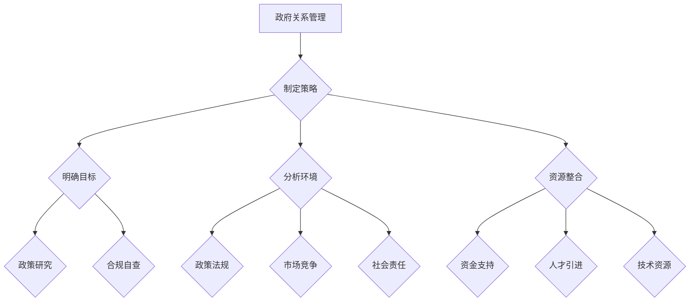

                 

### 第一部分: AI创业公司的政府关系管理概述

#### 第1章: AI创业公司的政府关系管理概述

##### 1.1 AI创业公司的政府关系管理重要性

###### 1.1.1 AI创业公司的背景与挑战

人工智能（AI）作为新一轮科技革命和产业变革的重要驱动力量，正在深刻改变全球的经济格局和社会结构。AI创业公司作为推动技术创新和产业升级的主力军，面临着前所未有的机遇和挑战。首先，AI技术的快速发展使得创业公司能够在短时间内取得技术突破，但同时也面临着技术迭代速度加快、竞争激烈等挑战。其次，AI创业公司的商业模式、运营模式和产业链位置与传统的创业公司有所不同，这为政府关系管理带来了新的要求。

###### 1.1.2 政府在AI创业公司发展中的作用

政府在AI创业公司的发展中发挥着至关重要的作用。首先，政府通过制定和实施相关政策和法规，为AI创业公司提供稳定的政策环境和法律保障。例如，一些国家和地区已经出台了关于人工智能的法律法规，旨在促进技术创新和保护企业权益。其次，政府通过资金支持、技术创新平台建设等方式，为AI创业公司提供实质性的支持和资源。此外，政府还通过国际合作、人才引进等手段，为AI创业公司拓展市场空间和提升国际竞争力。

###### 1.1.3 政府关系管理的核心目标

政府关系管理的核心目标是为AI创业公司创造一个有利于发展的外部环境，同时确保公司的合法合规运营。具体来说，政府关系管理应包括以下几个方面：

1. **政策支持**：了解并利用政府提供的政策支持和优惠措施，如税收减免、研发补贴等，降低创业成本，提高市场竞争力。
2. **合规经营**：确保公司遵循相关法律法规，避免因违规操作而遭受处罚。
3. **资源获取**：通过政府关系，获取研发资金、技术资源、市场信息等，为公司的持续发展提供支持。
4. **品牌形象**：通过良好的政府关系，提升公司在公众和政府眼中的形象，增加品牌影响力。

##### 1.2 政府关系管理的主要领域

###### 1.2.1 政策与法规环境

政策与法规环境是AI创业公司政府关系管理的重要内容。政府通过制定和调整相关政策法规，对AI创业公司的发展方向、运营模式、市场行为等方面产生深远影响。因此，AI创业公司需要密切关注政策法规的变化，确保公司运营符合法律规定。具体措施包括：

1. **政策研究**：建立政策研究团队，定期收集和分析政府发布的政策法规，及时了解政策动态。
2. **合规自查**：定期进行合规自查，确保公司运营符合相关政策法规的要求。
3. **政策建议**：根据公司发展需要，向政府提出政策建议，推动政策环境的优化。

###### 1.2.2 政府支持与资助

政府支持与资助是AI创业公司获取外部资源的重要途径。政府提供的资金支持、技术创新平台、人才引进计划等，对AI创业公司的研发能力、市场拓展、团队建设等方面产生重要影响。因此，AI创业公司需要积极争取政府支持，充分利用各种资源。具体措施包括：

1. **项目申报**：密切关注政府发布的资金支持项目，根据公司实际情况进行项目申报，争取资金支持。
2. **资源对接**：通过政府关系，与政府相关部门、科研机构、高校等建立合作关系，共享资源。
3. **成果转化**：将政府支持的项目成果进行市场化应用，提升公司竞争力。

###### 1.2.3 公共关系与形象塑造

公共关系与形象塑造是AI创业公司政府关系管理的重要组成部分。良好的政府关系有助于提升公司在公众和政府眼中的形象，增加品牌影响力。因此，AI创业公司需要通过多种渠道和手段，建立和维护良好的政府关系。具体措施包括：

1. **品牌宣传**：通过政府渠道、媒体等平台，积极宣传公司发展成果和社会责任，提升品牌形象。
2. **公众沟通**：定期举办公众开放日、技术交流会等活动，加强与公众的沟通与互动。
3. **危机管理**：建立健全危机管理体系，及时应对和化解危机事件，维护公司声誉。

##### 1.3 政府关系管理的挑战与机遇

###### 1.3.1 挑战分析

AI创业公司在政府关系管理中面临诸多挑战。首先，政策法规的不确定性使得公司难以把握政策动向，可能面临合规风险。其次，政府支持的资源有限，竞争激烈，AI创业公司需要具备较强的竞争力和独特优势，才能获得政府支持。此外，政府关系管理需要耗费大量人力、物力和时间，对公司的管理和运营提出较高要求。

###### 1.3.2 机遇探索

尽管面临诸多挑战，AI创业公司在政府关系管理中仍有机会。首先，随着人工智能技术的快速发展，政府对AI创业公司的关注度和支持力度逐渐加大，为公司提供了更多的发展机遇。其次，良好的政府关系有助于AI创业公司在市场中获得竞争优势，提升品牌影响力。此外，政府提供的政策和资金支持，有助于公司加快技术研发和产品市场化进程。

###### 1.3.3 风险管理策略

在政府关系管理中，AI创业公司需要建立健全的风险管理机制，应对潜在的风险和挑战。具体策略包括：

1. **合规风险防范**：建立完善的合规管理体系，确保公司运营符合相关政策法规的要求。
2. **资源竞争应对**：加强与政府、科研机构、高校等合作，提高公司的竞争力和资源获取能力。
3. **政府关系维护**：通过定期沟通、信息共享等方式，加强与政府的互动，维护良好的政府关系。
4. **危机管理准备**：建立健全的危机管理体系，制定应急预案，提高应对危机事件的能力。

综上所述，AI创业公司的政府关系管理具有重要意义。通过明确政府关系管理的重要性、主要领域、挑战与机遇，以及制定相应的风险管理策略，AI创业公司可以更好地应对外部环境的变化，实现持续发展和创新。

### 第一部分总结

本部分对AI创业公司的政府关系管理进行了概述，包括背景与挑战、政府关系管理的重要性、主要领域、挑战与机遇以及风险管理策略。通过分析AI创业公司的发展现状和政策环境，我们明确了政府关系管理在推动公司发展中的关键作用。在接下来的部分中，我们将深入探讨政府关系管理策略的具体制定和实施方法，帮助AI创业公司更好地应对外部挑战，实现可持续发展。

### 第二部分: AI创业公司的政府关系管理策略

#### 第2章: 政府关系管理策略的制定

##### 2.1 明确政府关系管理目标

###### 2.1.1 公司战略目标与政府关系目标的对齐

在制定政府关系管理策略之前，首先需要明确公司的战略目标和政府关系管理目标。公司的战略目标是公司长期发展方向的指导，包括市场定位、业务拓展、技术创新等方面。政府关系管理目标则是在此基础上，通过建立和维护与政府的良好关系，为公司的战略目标提供支持和保障。两者之间的对齐至关重要，有助于确保政府关系管理的策略与公司的整体发展目标相一致。

具体来说，对齐的过程包括以下几个步骤：

1. **分析公司战略目标**：明确公司的长期发展目标，包括市场扩张、技术创新、品牌建设等方面。
2. **识别政府关系目标**：基于公司战略目标，确定与政府关系相关的具体目标，如政策支持、资金获取、资源对接等。
3. **目标一致性评估**：评估公司战略目标和政府关系目标的一致性，确保两者之间不存在冲突或脱节。

通过上述步骤，公司可以确保政府关系管理策略的制定与公司的战略目标相一致，从而提高策略的有效性和执行力。

###### 2.1.2 政府关系管理目标的制定过程

制定政府关系管理目标是一个系统性的过程，需要综合考虑公司战略、外部环境、资源状况等因素。以下是制定政府关系管理目标的详细步骤：

1. **需求分析**：通过对公司内外部环境进行深入分析，了解公司当前面临的挑战和需求。这包括对政策法规、市场趋势、竞争对手等方面的研究。
2. **目标设定**：基于需求分析结果，明确政府关系管理的具体目标。这些目标应具备可衡量性、可实现性和相关性，如政策支持、资源获取、市场拓展等。
3. **优先级排序**：根据目标的紧迫性和重要性，对政府关系管理目标进行优先级排序。这将有助于公司集中资源和精力，优先解决关键问题。
4. **目标明确化**：将设定的目标具体化，明确目标的具体指标和衡量标准。例如，如果目标是获得政策支持，可以明确政策支持的类型、数量、时间等。
5. **目标评审**：对制定的目标进行评审，确保目标合理、可行，并符合公司的战略目标。评审过程可以邀请公司内部相关部门和外部专家参与。

通过上述步骤，公司可以科学、系统地制定政府关系管理目标，为后续策略的制定和实施提供明确的方向和依据。

###### 2.1.3 目标设定的关键因素

在制定政府关系管理目标时，需要考虑多个关键因素，以确保目标的科学性和可行性。以下是几个关键因素：

1. **公司战略目标**：政府关系管理目标必须与公司的战略目标相一致，确保两者之间不存在冲突或脱节。因此，在制定政府关系管理目标时，首先要明确公司的战略目标。
2. **外部环境**：政府关系管理目标需要考虑外部环境的变化，如政策法规、市场趋势、竞争对手等。外部环境的变化可能会对公司的政府关系管理目标产生影响，需要及时调整。
3. **资源状况**：公司需要根据自身的资源状况设定政府关系管理目标。资源包括人力、财力、技术等，资源状况将直接影响目标的可实现性。
4. **时间框架**：政府关系管理目标应具备明确的时间框架，以便公司能够根据时间进度进行规划和实施。例如，目标可以是短期内获得政策支持，长期内建立稳定的政府关系。
5. **可衡量性**：政府关系管理目标应具备可衡量性，以便公司能够对目标的实现情况进行评估和调整。例如，政策支持的类型和数量可以作为衡量目标实现的具体指标。

通过考虑上述关键因素，公司可以制定出科学、合理、可行的政府关系管理目标，为后续策略的制定和实施奠定基础。

##### 2.2 政府关系管理策略框架

###### 2.2.1 政府关系管理的原则

政府关系管理需要遵循一系列原则，以确保策略的科学性、合理性和有效性。以下是几个关键原则：

1. **合法性原则**：政府关系管理必须遵守相关法律法规，确保公司运营的合法性。这是政府关系管理的基本前提，也是公司建立和维护良好政府关系的重要保障。
2. **诚信原则**：诚信是政府关系管理的关键，公司应秉持诚实守信的原则，与政府建立互信关系。诚信原则有助于提升公司在政府心目中的形象，为未来的合作奠定基础。
3. **合作原则**：政府关系管理应建立在合作的基础上，公司应积极与政府相关部门、科研机构、高校等建立合作关系，共同推动技术创新和产业发展。
4. **主动性原则**：公司应主动了解政府政策动态，主动沟通和反馈，积极参与政府项目申报和合作。主动性原则有助于公司更好地把握政府资源，提高政府关系管理的有效性。
5. **可持续性原则**：政府关系管理应具有可持续性，公司应注重长期关系维护，而非短期利益。通过建立稳定的政府关系，公司可以在长期发展中获得持续的支持和资源。

通过遵循上述原则，公司可以制定出科学、合理、有效的政府关系管理策略，提高政府关系管理的水平。

###### 2.2.2 政府关系管理的关键要素

政府关系管理涉及多个关键要素，包括政府识别、政府沟通、政府支持等。以下是几个关键要素：

1. **政府识别**：公司需要明确目标政府，包括政府部门、地方政府、政府机构等。政府识别是政府关系管理的基础，有助于公司有针对性地开展政府关系工作。
2. **政府沟通**：政府沟通是政府关系管理的重要环节，公司应建立有效的沟通渠道，与政府保持定期沟通。通过政府沟通，公司可以了解政府政策动态，反馈公司发展情况，争取政府支持。
3. **政府支持**：公司应积极争取政府支持，包括政策支持、资金支持、技术创新支持等。政府支持是公司发展的重要资源，有助于公司提升研发能力、拓展市场空间。
4. **政府关系维护**：政府关系维护是政府关系管理的重要任务，公司应通过多种渠道和手段，建立和维护与政府的长期稳定关系。政府关系维护包括定期沟通、信息共享、合作项目推进等。

通过掌握上述关键要素，公司可以系统地开展政府关系管理工作，提高政府关系管理的整体水平。

###### 2.2.3 政府关系管理策略的制定方法

制定政府关系管理策略需要采用科学的方法，以确保策略的合理性和可行性。以下是几种常用的制定方法：

1. **SWOT分析法**：SWOT分析法是一种常用的战略规划工具，通过分析公司的优势、劣势、机会和威胁，制定相应的政府关系管理策略。例如，公司可以利用优势争取政府支持，针对劣势进行改进，抓住机会扩大政府合作，应对威胁降低风险。
2. **战略目标树**：战略目标树是将公司战略目标分解为具体子目标的工具，有助于公司明确政府关系管理目标。通过战略目标树，公司可以逐步实现战略目标，确保政府关系管理策略的有效实施。
3. **关键绩效指标（KPI）**：关键绩效指标是衡量政府关系管理效果的重要指标，公司应根据政府关系管理目标设定具体的KPI，如政策支持数量、资金获取额度、合作项目进度等。通过KPI的监控和评估，公司可以及时调整策略，确保目标实现。
4. **情景分析法**：情景分析法是一种基于未来可能情景的分析方法，通过分析不同情景下政府关系管理的策略和应对措施，为公司提供备选方案。情景分析法有助于公司提前预测和应对外部环境的变化，提高政府关系管理的适应能力。

通过采用上述方法，公司可以科学、系统地制定政府关系管理策略，提高策略的合理性和可行性。

##### 2.3 政府关系管理计划的制定

###### 2.3.1 政府关系管理计划的构成

政府关系管理计划是实施政府关系管理策略的具体行动指南，其构成包括以下几个方面：

1. **目标**：政府关系管理计划的目标应与公司战略目标和政府关系管理目标相一致，明确计划的具体目标和预期成果。
2. **任务**：根据目标，明确政府关系管理计划的具体任务，如政策研究、项目申报、沟通协调等。任务应具体、明确，具有可操作性。
3. **责任分配**：明确政府关系管理计划中的责任分配，包括任务负责人、参与人员等。责任分配有助于确保计划的顺利实施和执行。
4. **时间表**：制定详细的时间表，明确各个任务的开始和结束时间，以及关键节点和里程碑。时间表有助于公司对计划实施过程进行有效监控和调整。
5. **资源需求**：根据任务需求，列出政府关系管理计划所需的资源，包括人力、财力、物力等。资源需求有助于公司提前规划资源，确保计划顺利实施。
6. **风险评估**：对计划实施过程中可能出现的风险进行评估，制定相应的应对措施。风险评估有助于公司提前识别和应对潜在风险，降低风险影响。
7. **监控与评估**：制定监控与评估机制，对计划实施过程进行监控和评估，确保计划目标的实现。监控与评估机制包括定期报告、绩效评估、调整方案等。

通过上述构成要素，政府关系管理计划可以为公司提供明确的行动指南，确保政府关系管理策略的有效实施。

###### 2.3.2 政府关系管理计划的实施步骤

政府关系管理计划的实施是一个系统性的过程，需要按照一定的步骤进行。以下是政府关系管理计划实施的详细步骤：

1. **计划启动**：在计划启动阶段，公司需要召开启动会议，明确计划的目标、任务、责任分配和时间表等。启动会议有助于确保所有参与人员对计划有清晰的认识和理解，为计划顺利实施奠定基础。
2. **任务分解**：根据计划的任务，将其分解为具体的子任务，并分配给相应的责任人员。任务分解有助于明确任务的具体要求和完成标准，提高任务完成的效率和质量。
3. **资源准备**：在计划实施过程中，公司需要提前准备所需的资源，包括人力、财力、物力等。资源准备有助于确保计划顺利实施，避免因资源不足而影响计划的进度和质量。
4. **任务执行**：在任务执行阶段，责任人员按照任务要求开展具体工作，确保任务按计划完成。任务执行过程中，公司需要加强对任务的监控和指导，确保任务顺利进行。
5. **沟通协调**：政府关系管理计划涉及多个部门和人员的协作，需要建立有效的沟通协调机制。通过定期召开会议、发送邮件、使用即时通讯工具等方式，确保各方能够及时沟通和协调，解决工作中遇到的问题和困难。
6. **监控与调整**：在计划实施过程中，公司需要定期对计划进行监控和评估，及时发现和解决问题。监控与调整机制包括定期报告、绩效评估、调整方案等。通过监控与调整，公司可以确保计划目标的实现，提高政府关系管理的效果。
7. **计划总结**：在计划实施结束后，公司需要对计划进行总结和评估，分析计划目标的实现情况、任务完成的效率和质量、资源利用情况等。总结和评估有助于公司积累经验，改进政府关系管理策略，为未来的计划实施提供参考。

通过上述实施步骤，公司可以系统、有序地实施政府关系管理计划，提高政府关系管理的效率和效果。

###### 2.3.3 政府关系管理计划的评估与调整

政府关系管理计划的评估与调整是确保计划实施效果的重要环节。以下是政府关系管理计划评估与调整的详细步骤：

1. **目标评估**：对计划实施过程中实现的目标进行评估，分析目标实现的程度和效果。目标评估可以帮助公司了解计划的实际成果，发现目标和策略之间的差距。
2. **绩效评估**：对计划实施过程中各项任务的完成情况进行绩效评估，分析任务完成的效率和质量。绩效评估有助于公司识别存在的问题和不足，制定改进措施。
3. **反馈机制**：建立反馈机制，收集各级部门和人员的意见和建议，了解他们在计划实施过程中的实际感受和遇到的问题。反馈机制有助于公司全面了解计划实施情况，为调整和改进提供依据。
4. **调整方案**：根据目标评估、绩效评估和反馈机制的结果，制定调整方案，对计划进行必要的修改和优化。调整方案应包括改进措施、时间表、责任分配等，确保计划能够更好地适应实际情况。
5. **方案实施**：在调整方案制定完成后，公司需要组织相关部门和人员按照调整方案进行实施，确保计划的改进措施能够得到有效落实。
6. **持续监控**：在调整方案实施过程中，公司需要持续监控和评估调整方案的效果，确保调整措施能够达到预期目标。如果出现新的问题和挑战，公司需要及时进行调整和优化。

通过上述评估与调整步骤，公司可以确保政府关系管理计划的实施效果，不断提高政府关系管理的水平。

##### 2.2章总结

本章详细阐述了AI创业公司政府关系管理策略的制定过程，包括明确政府关系管理目标、政府关系管理的原则和关键要素、以及政府关系管理计划的制定方法。通过明确公司战略目标和政府关系管理目标的对齐，制定科学、合理的政府关系管理策略，AI创业公司可以更好地应对外部挑战，实现可持续发展。在下一章中，我们将进一步探讨政府关系管理实务，包括政府关系建立与维护、危机管理等具体方法，帮助公司更好地实施政府关系管理策略。

### 第二部分总结

在本部分中，我们详细讨论了AI创业公司政府关系管理策略的制定过程。通过明确政府关系管理目标、原则和关键要素，以及制定详细的政府关系管理计划，AI创业公司可以更好地应对外部环境的变化，实现可持续发展。在下一部分中，我们将进一步探讨政府关系管理的实务，包括政府关系的建立与维护、危机管理等具体方法，以帮助公司更好地实施政府关系管理策略，应对各种挑战和机遇。

### 第三部分: 政府关系管理实务

#### 第3章: 政府关系建立与维护

在政府关系管理策略制定之后，接下来的关键步骤是建立和维护与政府的良好关系。这一过程涉及多个方面，包括基础工作、维护策略和危机管理。通过有效的政府关系建立与维护，AI创业公司可以确保其业务持续、稳定地发展。

##### 3.1 政府关系建立的基础工作

###### 3.1.1 了解政府利益相关方

了解政府利益相关方是政府关系建立的第一步。这些利益相关方包括中央政府、地方政府、政府部门、政府官员、立法机构、公众等。每个利益相关方都有其独特的利益和需求，了解这些信息有助于AI创业公司制定针对性的政府关系策略。

具体步骤如下：

1. **调研与分析**：通过文献调研、政策分析、行业报告等方式，了解政府利益相关方的背景、职责、政策取向、利益诉求等。
2. **建立数据库**：将调研和分析结果整理成数据库，便于后续的政府关系管理工作。
3. **定期更新**：政府利益相关方的信息会随着政策变化和形势发展而变化，需要定期更新数据库，确保信息的准确性和时效性。

###### 3.1.2 建立联系渠道

建立联系渠道是政府关系建立的重要环节。联系渠道的建立有助于AI创业公司及时获取政策信息，反馈公司发展状况，争取政府支持。

具体方法如下：

1. **政府部门对接**：与相关政府部门建立直接联系，了解政策动态和需求，参与政策制定和讨论。
2. **官员沟通**：与政府官员建立良好的个人关系，通过定期拜访、参加政府活动等方式，加强互动和沟通。
3. **公众互动**：通过社交媒体、公开活动等方式，与公众建立联系，提升公司在公众中的形象，为政府关系打下基础。

###### 3.1.3 资源和信息共享

资源和信息共享是政府关系建立的重要手段。通过共享资源和信息，AI创业公司可以与政府建立互惠互利的关系。

具体措施包括：

1. **技术成果共享**：将公司的技术成果和研发进展与政府分享，争取政府的认可和支持。
2. **数据开放**：在确保数据安全和隐私的前提下，向政府开放部分数据，支持政府决策。
3. **合作项目**：与政府共同开展合作项目，实现资源共享和优势互补。

##### 3.2 政府关系维护策略

###### 3.2.1 定期沟通机制

定期沟通机制是政府关系维护的关键。通过定期沟通，AI创业公司可以及时了解政府的需求和期望，反馈公司发展状况，保持关系的稳定性。

具体措施如下：

1. **定期会议**：定期与政府部门和官员召开会议，讨论政策、项目进展和合作事项。
2. **信息公开**：通过官方网站、社交媒体等渠道，定期发布公司新闻、项目进展、技术成果等信息，增强政府对公司发展的了解。
3. **面对面交流**：定期组织面对面交流活动，与政府官员进行深入沟通，建立信任关系。

###### 3.2.2 持续的信任建设

持续的信任建设是政府关系维护的核心。通过诚信经营、合规运营，AI创业公司可以赢得政府的信任。

具体策略包括：

1. **合规经营**：严格遵守相关法律法规，确保公司运营的合法性和合规性。
2. **社会责任**：积极参与公益事业，履行社会责任，提升公司在政府和社会中的形象。
3. **诚信合作**：在合作过程中，秉持诚信原则，遵守合同，履行承诺，树立良好的商业信誉。

###### 3.2.3 主动沟通与信息反馈

主动沟通与信息反馈是政府关系维护的重要手段。通过主动沟通，AI创业公司可以及时了解政府的需求和期望，通过信息反馈，展示公司的成果和贡献。

具体措施如下：

1. **主动汇报**：定期向政府汇报公司发展状况、项目进展和成果，展示公司的实力和贡献。
2. **信息反馈**：在政府提出需求或建议时，及时反馈公司的意见和建议，积极参与政府决策。
3. **问题解决**：在发现问题时，主动沟通，寻求解决方案，避免问题扩大化。

##### 3.3 政府关系危机管理

###### 3.3.1 危机识别与评估

危机识别与评估是政府关系危机管理的前提。通过识别和评估潜在的危机，AI创业公司可以提前采取预防措施。

具体步骤如下：

1. **风险识别**：通过定期评估和内部审计，识别潜在的危机风险，如政策变化、市场竞争、法律法规等。
2. **风险评估**：对识别出的危机风险进行评估，分析其可能对公司政府关系的影响程度和发生的可能性。
3. **预警机制**：建立预警机制，对潜在的危机进行实时监控，及时发出预警信号。

###### 3.3.2 应对策略与措施

应对策略与措施是政府关系危机管理的核心。在危机发生时，AI创业公司需要迅速采取有效的应对措施，减少危机对公司的影响。

具体措施如下：

1. **紧急响应**：在危机发生时，立即启动危机应对预案，组织相关部门和人员迅速应对。
2. **信息发布**：通过官方网站、社交媒体等渠道，及时发布危机事件相关信息，保持透明度，避免谣言传播。
3. **沟通协调**：与政府部门和官员保持密切沟通，了解政府立场和需求，争取政府的支持。
4. **解决方案**：积极寻求解决方案，通过协商、谈判等方式，尽快化解危机。

###### 3.3.3 危机后的恢复策略

危机后的恢复策略是确保公司稳定发展的关键。在危机解决后，AI创业公司需要采取措施，恢复政府关系，防止危机再次发生。

具体措施如下：

1. **总结经验**：对危机处理过程进行总结和反思，分析危机发生的原因和应对措施的有效性，为未来提供参考。
2. **改进管理**：根据危机处理过程中的经验和教训，改进公司管理和运营模式，提高危机应对能力。
3. **加强沟通**：与政府部门和官员保持密切沟通，重建信任关系，确保政府关系的稳定。
4. **持续监控**：对潜在危机进行持续监控，及时识别和应对新的风险。

##### 3.3章总结

本章详细阐述了AI创业公司政府关系建立与维护的基础工作、维护策略和危机管理方法。通过了解政府利益相关方、建立联系渠道、资源和信息共享，AI创业公司可以奠定良好的政府关系基础。通过定期沟通、持续信任建设、主动沟通与信息反馈，公司可以维护与政府的良好关系。在危机管理方面，公司需要通过识别与评估危机、制定应对策略、恢复政府关系，确保业务稳定发展。在下一章中，我们将通过具体案例研究，深入分析AI创业公司在政府关系管理中的成功与挑战。

### 第三部分总结

在本部分中，我们深入探讨了AI创业公司在政府关系管理实务中的关键步骤和方法。通过了解政府利益相关方、建立联系渠道、资源和信息共享，AI创业公司可以为政府关系的建立和维护奠定坚实基础。同时，通过定期沟通、持续信任建设、主动沟通与信息反馈，公司可以维护与政府的良好关系。在危机管理方面，AI创业公司需要通过识别与评估危机、制定应对策略、恢复政府关系，确保业务稳定发展。通过这些具体的实务方法，AI创业公司可以更好地应对外部环境的变化，实现可持续发展。在下一部分中，我们将通过具体案例研究，进一步展示AI创业公司在政府关系管理中的实践经验和成果。

### 第四部分: 政府关系管理案例研究

在了解了AI创业公司的政府关系管理理论和实务之后，通过具体案例研究，我们可以更深入地了解政府关系管理的实际应用和效果。本部分将分析两个案例：一个是成功合作的案例，另一个是危机应对的案例。通过这些案例，我们将探讨政府关系管理的具体实践和取得的成果。

#### 第4章: 政府关系管理案例分析

##### 4.1 案例一：某AI创业公司与地方政府合作成功案例

###### 4.1.1 案例背景

某AI创业公司（以下简称“公司”）成立于2018年，专注于人工智能领域的研究和应用。公司致力于将AI技术应用于智能城市、智能制造和金融科技等领域。在公司成立初期，面临着技术突破、市场拓展和资金短缺等多重挑战。

在地方政府的大力支持下，公司获得了快速发展。地方政府为该公司提供了良好的政策环境、资金支持和人才引进计划。地方政府还通过建立创新平台、举办技术交流活动等方式，帮助公司拓展市场，提高品牌知名度。

###### 4.1.2 合作内容与成果

公司与地方政府的主要合作内容包括以下几个方面：

1. **政策支持**：地方政府出台了一系列支持AI创业公司的政策，如税收优惠、研发补贴、人才引进等，为公司的技术研发和市场拓展提供了有力保障。
2. **资金支持**：地方政府为该公司提供了数百万元的资金支持，帮助公司顺利度过初创期，加速技术研发和产品市场化。
3. **人才引进**：地方政府通过人才引进计划，帮助公司引进了一批高水平的研发人才和管理人才，提升了公司的技术实力和管理水平。
4. **合作项目**：公司与地方政府合作开展了多个项目，如智能交通管理系统、智能制造生产线等，取得了显著的社会和经济效益。

通过这些合作，公司取得了以下成果：

1. **技术研发**：公司在地方政府支持下，成功研发了多项AI技术，并在智能城市、智能制造等领域取得了突破。
2. **市场拓展**：公司通过地方政府提供的平台和资源，成功开拓了多个市场，业务范围不断扩大。
3. **品牌知名度**：公司在地方政府和市场的共同努力下，品牌知名度显著提升，吸引了更多的投资和合作伙伴。
4. **社会效益**：公司合作项目的社会效益显著，为当地经济发展和社会进步做出了积极贡献。

###### 4.1.3 经验与启示

该案例为AI创业公司的政府关系管理提供了以下经验与启示：

1. **政策支持**：积极争取政府的政策支持，利用税收优惠、研发补贴等政策降低创业成本，提高市场竞争力。
2. **资金支持**：充分利用政府提供的资金支持，解决资金短缺问题，加速技术研发和产品市场化。
3. **人才引进**：通过政府的人才引进计划，引进高水平的人才，提升公司的技术实力和管理水平。
4. **合作项目**：与政府合作开展项目，实现资源共享和优势互补，提高项目的成功率和社会效益。
5. **信任建设**：通过诚信经营、合规运营，建立和维护与政府的信任关系，为未来的合作奠定基础。

##### 4.2 案例二：某AI创业公司政府关系危机应对

###### 4.2.1 案例背景

某AI创业公司（以下简称“公司”）在2020年因一项技术应用的推广引发了公众的广泛关注。由于该技术应用涉及隐私保护问题，公众和部分媒体对公司进行了质疑和批评，导致公司形象受损，业务受到严重影响。

在危机爆发后，公司迅速采取了一系列应对措施，成功化解了危机，恢复了政府关系。

###### 4.2.2 危机处理过程

公司的危机处理过程可以分为以下几个阶段：

1. **危机识别**：公司通过媒体监测和内部报告，及时发现了公众对技术应用隐私保护的质疑和批评。
2. **紧急响应**：公司立即召开危机应对会议，制定危机应对方案，并成立了危机应对小组。
3. **信息发布**：公司通过官方网站、社交媒体等渠道，发布了针对隐私保护问题的详细说明，澄清了事实，回应了公众关切。
4. **沟通协调**：公司与政府部门保持密切沟通，及时汇报危机处理进展，争取政府的理解和支持。
5. **内部整改**：公司针对技术应用中存在的问题进行了全面整改，加强了隐私保护措施，提升了技术应用的安全性。
6. **恢复信任**：通过持续的沟通和整改，公司逐渐恢复了公众的信任，政府关系也得到了恢复。

###### 4.2.3 结果与影响

通过有效的危机应对，公司取得了以下结果和影响：

1. **危机化解**：公司成功化解了危机，避免了声誉的进一步受损，确保了业务的稳定运行。
2. **政府关系恢复**：公司通过与政府部门的沟通和合作，恢复了与政府的良好关系，得到了政府的认可和支持。
3. **公众信任恢复**：公司通过透明、及时的沟通和整改，恢复了公众的信任，公众对公司技术应用的态度逐渐改善。
4. **经验积累**：公司通过危机处理过程，积累了宝贵的危机管理经验，提升了危机应对能力。

###### 4.2.4 经验与启示

该案例为AI创业公司在面对政府关系危机时提供了以下经验与启示：

1. **危机预防**：在技术研发和应用推广过程中，提前识别潜在的隐私保护风险，制定预防措施，避免危机的发生。
2. **及时响应**：在危机爆发时，立即采取行动，迅速成立危机应对小组，制定应对方案。
3. **透明沟通**：通过官方网站、社交媒体等渠道，及时发布相关信息，保持透明度，回应公众关切。
4. **政府沟通**：与政府部门保持密切沟通，争取政府的理解和支持，共同应对危机。
5. **内部整改**：针对危机中的问题进行彻底整改，提升技术应用的安全性，恢复公众信任。
6. **持续监控**：在危机解决后，持续监控公众和媒体的反应，及时调整和改进，确保政府关系和公众信任的稳定。

### 第四部分总结

在本部分中，我们通过两个具体案例，详细分析了AI创业公司在政府关系管理中的实践经验和成果。成功合作的案例展示了政策支持、资金支持、人才引进和合作项目等政府关系管理策略的有效性；危机应对的案例则展示了AI创业公司在面对危机时的应对措施和经验积累。通过这些案例研究，我们可以更好地理解政府关系管理在AI创业公司发展中的重要作用，为未来的政府关系管理提供有益的参考和启示。

### 第五部分: 政府关系管理的工具与资源

#### 第5章: 政府关系管理的工具与方法

在AI创业公司的政府关系管理中，合理运用工具和方法是确保管理策略有效实施的关键。以下是几种常用的政府关系管理工具与方法。

##### 5.1 政府关系管理工具的选择

###### 5.1.1 政府关系管理工具的类型

政府关系管理工具可以分为以下几类：

1. **信息收集与分析工具**：如政府官网、政策数据库、行业报告等，用于收集和分析政策法规、市场动态等信息。
2. **沟通协作工具**：如电子邮件、即时通讯软件（如微信、WhatsApp等）、在线会议系统（如Zoom、Teams等），用于与政府官员和相关部门进行沟通。
3. **项目管理工具**：如项目管理系统（如Trello、JIRA等）、时间管理工具（如Asana、Notion等），用于跟踪和管理政府关系管理项目。
4. **数据分析工具**：如Excel、Power BI、Tableau等，用于对政府关系管理数据进行统计分析。
5. **社交媒体管理工具**：如Hootsuite、Buffer等，用于管理和分析社交媒体上的政府关系互动。

###### 5.1.2 选择工具的关键因素

选择政府关系管理工具时，应考虑以下关键因素：

1. **功能性与适用性**：工具应具备所需的功能，且适用于公司的具体需求。
2. **用户友好性**：工具应易于操作，降低使用门槛。
3. **集成性与兼容性**：工具应能与公司的现有系统兼容，实现数据共享和流程整合。
4. **成本效益**：工具的成本应在公司的预算范围内，具备良好的性价比。
5. **安全性**：工具应具备数据保护和隐私保护功能，确保信息安全。

###### 5.1.3 常用政府关系管理工具介绍

以下是几种常用的政府关系管理工具及其特点：

1. **PolicyMap**：一款专门用于政策研究的在线工具，提供全球各地区的政策法规数据库，支持搜索、分析和下载。
2. **Cision**：一款综合性的媒体关系管理工具，提供新闻监测、媒体数据库和社交媒体分析功能，有助于政府关系管理。
3. **Canva**：一款图形设计工具，可用于制作宣传资料、演示文稿等，提升政府沟通效果。
4. **Zoom**：一款视频会议软件，支持多方在线会议、远程协作，适用于政府关系中的在线沟通。
5. **Google Analytics**：一款数据分析工具，可分析网站流量、用户行为等，帮助公司了解政府关系管理的效果。

##### 5.2 政府关系管理方法的运用

###### 5.2.1 数据分析在政府关系管理中的应用

数据分析是政府关系管理的重要手段，通过数据分析，公司可以更好地了解政府政策、市场趋势和公众需求。以下是数据分析在政府关系管理中的应用：

1. **政策趋势分析**：通过收集和分析政策法规数据，识别政策趋势和变化，为公司制定政府关系策略提供依据。
2. **市场研究**：通过数据分析市场动态，了解竞争对手、市场需求和潜力客户，为政府关系管理提供参考。
3. **公众意见分析**：通过社交媒体、在线调查等方式收集公众意见，分析公众对政府政策、公司产品和服务的态度，为政府关系管理提供反馈。
4. **绩效评估**：通过数据分析评估政府关系管理策略的效果，发现问题和不足，优化管理方法。

###### 5.2.2 社交媒体在政府关系管理中的作用

社交媒体是政府关系管理的重要渠道，通过社交媒体，公司可以与政府官员、公众和媒体建立互动，提升政府关系管理的效率和效果。以下是社交媒体在政府关系管理中的作用：

1. **信息传播**：通过社交媒体发布公司新闻、政策解读、项目进展等信息，快速传播给目标受众。
2. **舆论引导**：通过社交媒体与公众互动，引导舆论方向，提升公司在公众和政府中的形象。
3. **危机管理**：在危机事件发生时，通过社交媒体及时回应公众关切，保持透明度，化解危机。
4. **合作沟通**：通过社交媒体与政府官员保持沟通，了解政府需求和期望，推动合作项目进展。

###### 5.2.3 政府关系管理中的策略工具

政府关系管理中的策略工具主要包括政策分析、项目管理和沟通策略等。以下是几种策略工具的具体应用：

1. **政策分析工具**：通过政策分析工具，对政策法规进行深入解读和分类，为公司制定政策应对策略提供支持。
2. **项目管理工具**：通过项目管理工具，跟踪和管理政府关系项目，确保项目进度和质量。
3. **沟通策略工具**：通过沟通策略工具，制定和优化政府沟通方案，提高沟通效果。

##### 5.3 政府关系管理工具与方法的选择与应用

在选择和应用政府关系管理工具与方法时，公司应遵循以下原则：

1. **系统性原则**：政府关系管理是一个系统工程，工具与方法的选择和应用应系统性考虑，确保各个环节的有效衔接和协同。
2. **针对性原则**：根据公司的具体情况和需求，选择最适合的工具与方法，确保其能够解决实际问题。
3. **灵活性原则**：政府关系管理工具与方法的选择和应用应具有灵活性，能够根据外部环境变化和内部需求调整和优化。

通过遵循上述原则，AI创业公司可以科学、有效地选择和应用政府关系管理工具与方法，提升政府关系管理的整体水平。

### 第五部分总结

在本部分中，我们详细介绍了AI创业公司在政府关系管理中常用的工具与方法。通过选择合适的工具和方法，公司可以更好地进行信息收集与分析、沟通协作、项目管理和数据分析。这些工具与方法的应用有助于公司制定科学、合理的政府关系管理策略，提升政府关系管理的效率和质量。在下一部分中，我们将探讨政府关系管理的未来趋势，分析AI技术与政府关系管理的发展方向，以及国际化视野下的政府关系管理策略。

### 第五部分总结

在本部分中，我们深入探讨了AI创业公司在政府关系管理中所需使用的工具与方法。从信息收集与分析工具、沟通协作工具到项目管理工具和数据分析工具，我们详细介绍了各类工具的特点及其应用。此外，我们还分析了社交媒体在政府关系管理中的重要作用，并探讨了政策分析、项目管理和沟通策略等策略工具的具体应用。通过科学、合理地选择和应用这些工具与方法，AI创业公司可以提升政府关系管理的效率和质量，为公司的可持续发展奠定坚实基础。在下一部分中，我们将进一步探讨政府关系管理的未来趋势，分析AI技术与政府关系管理的发展方向，以及国际化视野下的政府关系管理策略。

### 第六部分: 政府关系管理的未来趋势

#### 第6章: 政府关系管理的未来趋势与展望

随着技术的不断进步和全球化的加速发展，政府关系管理也在发生深刻变革。AI技术的崛起和全球化背景下的政府关系管理，为AI创业公司带来了新的机遇和挑战。本章节将探讨AI技术与政府关系管理的发展、国际化视野下的政府关系管理，以及未来的发展趋势和展望。

##### 6.1 AI技术与政府关系管理的发展

AI技术的迅速发展，为政府关系管理提供了新的工具和方法。以下是AI技术在政府关系管理中的应用和潜力：

###### 6.1.1 人工智能在政府关系管理中的潜力

1. **数据分析与决策支持**：AI技术可以通过大数据分析，帮助公司快速识别政策趋势、市场动态和公众需求，为政府关系管理提供科学依据。
2. **自动化沟通**：通过自然语言处理（NLP）和聊天机器人技术，AI可以帮助公司实现自动化沟通，提高沟通效率和效果。
3. **危机预测与应对**：AI可以通过对历史数据和实时信息的分析，预测潜在的政府关系危机，并制定相应的应对策略。
4. **个性化服务**：AI可以根据政府官员和公众的偏好和行为，提供个性化的服务和建议，提高政府关系管理的针对性。

###### 6.1.2 AI技术在政府关系管理中的应用前景

1. **政策预测与分析**：AI技术可以分析政府发布的数据和政策文本，预测政策动向，为公司提供政策建议。
2. **公共关系管理**：AI可以帮助公司自动化处理公共关系任务，如新闻发布、社交媒体管理、舆情监测等，提高公共关系管理的效率和效果。
3. **风险评估与预警**：AI技术可以实时监控政府关系管理中的风险因素，提供预警和应对建议，降低风险损失。
4. **客户关系管理**：AI可以帮助公司更好地了解政府官员和公众的需求，提供个性化服务，提高客户满意度。

###### 6.1.3 AI技术在政府关系管理中的挑战与应对策略

尽管AI技术在政府关系管理中具有巨大潜力，但也面临一些挑战：

1. **数据隐私与安全**：AI技术依赖于大量数据，如何在保护隐私和安全的前提下进行数据收集和使用，是面临的重大挑战。
2. **技术依赖性**：过度依赖AI技术可能导致公司失去人性和灵活性，需要平衡技术与管理的关系。
3. **伦理问题**：AI技术的应用可能引发伦理问题，如算法偏见、透明度不足等，需要制定相应的伦理规范。

应对策略包括：

1. **加强数据隐私保护**：制定严格的数据隐私政策，确保数据收集和使用过程中的合规性。
2. **平衡技术与人性**：在应用AI技术的同时，保持对人性和管理智慧的重视，确保技术与管理相结合。
3. **制定伦理规范**：建立AI技术的伦理规范，确保AI技术在政府关系管理中的应用符合伦理标准。

##### 6.2 国际化视野下的政府关系管理

全球化使得AI创业公司面临着国际市场的竞争和合作。在这种背景下，国际化视野下的政府关系管理成为关键因素。以下是国际化视野下政府关系管理的关键点：

###### 6.2.1 国际化背景下的政府关系管理

1. **跨文化沟通**：国际化政府关系管理需要考虑不同文化背景下的沟通方式，尊重差异，建立互信。
2. **国际政策法规**：了解和遵守目标市场的政策法规，确保公司运营的合法合规。
3. **国际竞争与合作**：在国际市场上，公司需要平衡竞争与合作，通过政府关系争取有利的市场环境和合作伙伴。

###### 6.2.2 跨国AI创业公司的政府关系策略

1. **本地化策略**：根据目标市场的文化、法律和市场需求，制定本地化的政府关系策略。
2. **资源整合**：通过政府关系，整合本地资源和合作伙伴，提高市场竞争力。
3. **国际合作**：积极参与国际合作项目，与全球同行建立合作关系，共享资源和经验。

###### 6.2.3 国际合作与竞争中的政府关系管理

在国际合作与竞争中，政府关系管理需要应对以下挑战：

1. **政策冲突**：不同国家的政策法规可能存在差异，需要通过政府关系解决冲突，确保公司的国际化运营。
2. **竞争环境**：在激烈的国际竞争中，需要通过政府关系争取政策支持，提升公司的竞争力。
3. **风险管理**：在国际市场上，公司需要关注政治风险、市场风险和合规风险，通过政府关系管理降低风险。

应对策略包括：

1. **政策协调**：通过政府关系，协调不同国家之间的政策差异，确保公司的国际化运营。
2. **竞争优势**：通过政府关系，争取政策支持，提升公司的国际竞争力。
3. **风险管理**：建立全面的风险管理体系，通过政府关系管理降低国际市场的风险。

##### 6.3 政府关系管理的未来趋势与展望

未来，政府关系管理将继续向智能化、国际化、合规化方向发展。以下是未来政府关系管理的主要趋势：

1. **智能化管理**：随着AI技术的进一步发展，政府关系管理将更加智能化，通过数据分析、自动化沟通等技术，提高管理效率和效果。
2. **国际化扩展**：随着全球化进程的加速，政府关系管理将更加国际化，跨国AI创业公司需要建立全球化的政府关系网络，应对国际市场的挑战。
3. **合规化管理**：在法律法规日益严格的背景下，政府关系管理将更加合规化，公司需要加强法律法规的遵守和合规管理，降低法律风险。

展望未来，AI创业公司需要：

1. **紧跟技术趋势**：积极跟进AI技术发展，探索AI技术在政府关系管理中的应用，提高管理水平和竞争力。
2. **深化国际合作**：积极参与国际合作项目，与全球同行建立合作关系，共同应对全球化挑战。
3. **强化合规意识**：加强法律法规的学习和遵守，建立全面的合规管理体系，确保公司在国际市场上的合法合规运营。

通过上述努力，AI创业公司可以更好地应对未来政府关系管理的挑战，实现可持续发展。

### 第六部分总结

在本部分中，我们探讨了AI创业公司政府关系管理的未来趋势。通过分析AI技术在政府关系管理中的应用和潜力、国际化视野下的政府关系管理策略，以及未来的发展趋势和展望，我们明确了AI创业公司在政府关系管理中的发展方向。在下一部分中，我们将提供政府关系管理的实践指南，帮助AI创业公司在实际操作中更好地实施政府关系管理策略。

### 第六部分总结

在本部分中，我们深入探讨了AI创业公司政府关系管理的未来趋势。通过分析AI技术在政府关系管理中的应用、国际化视野下的策略以及未来的发展，我们明确了AI创业公司在政府关系管理中的方向和挑战。AI技术的智能化、国际化扩展和合规化管理将成为未来政府关系管理的关键趋势。AI创业公司需要紧跟技术发展，深化国际合作，强化合规意识，以应对未来的挑战。在下一部分中，我们将提供具体的实践指南，帮助AI创业公司在实际操作中更好地实施政府关系管理策略。

### 第七部分: 政府关系管理的实践指南

#### 第7章: 政府关系管理的实践指南

为了帮助AI创业公司在实际操作中更好地实施政府关系管理策略，本章节将提供具体的实践指南。这些指南包括基本原则、关键步骤、常见问题及解决方案，以及实践中的案例分析。

##### 7.1 政府关系管理实践的基本原则

政府关系管理实践应遵循以下基本原则：

###### 7.1.1 诚信原则

诚信是政府关系管理的基础。公司应秉持诚实守信的原则，与政府建立互信关系。诚信经营有助于提升公司在政府心目中的形象，为未来的合作奠定基础。

###### 7.1.2 合规原则

合规经营是政府关系管理的重要原则。公司应严格遵守相关法律法规，确保公司运营的合法性。合规经营有助于降低法律风险，确保公司的稳定发展。

###### 7.1.3 创新原则

创新原则要求公司在政府关系管理中不断探索新的方法和技术，提高管理效率和质量。创新有助于公司在竞争激烈的市场中脱颖而出，赢得政府的支持和认可。

##### 7.2 政府关系管理实践的关键步骤

实施政府关系管理策略需要按照以下关键步骤进行：

###### 7.2.1 策略制定

策略制定是政府关系管理实践的第一步。公司应根据自身战略目标和外部环境，制定明确的政府关系管理策略。策略应包括目标、关键领域、行动步骤和评估标准。

###### 7.2.2 资源配置

资源配置是政府关系管理实践的重要环节。公司应根据策略制定的结果，合理配置人力、财力、物力等资源，确保政府关系管理策略的有效实施。

###### 7.2.3 实施与监控

实施与监控是政府关系管理实践的核心。公司应按照策略和资源配置计划，开展具体的政府关系管理活动，并对实施过程进行监控。监控过程应包括定期评估、反馈和调整。

###### 7.2.4 评估与反馈

评估与反馈是政府关系管理实践的关键环节。公司应定期对政府关系管理策略的实施效果进行评估，收集各级部门和人员的意见和建议，进行反馈和调整。评估结果应作为后续策略制定和实施的重要依据。

##### 7.3 政府关系管理实践中的常见问题及解决方案

在政府关系管理实践中，公司可能会遇到以下问题：

###### 7.3.1 政策法规不熟悉

公司对相关政策法规不熟悉，可能导致合规风险。

解决方案：建立政策法规研究团队，定期收集和分析相关政策法规，确保公司运营的合法性。

###### 7.3.2 资源不足

资源不足可能导致政府关系管理策略无法有效实施。

解决方案：合理配置资源，通过政府关系获取外部资源，如资金、技术、人才等。

###### 7.3.3 沟通不畅

沟通不畅可能导致政府关系管理效率低下。

解决方案：建立有效的沟通渠道和机制，如定期会议、即时通讯工具等，确保信息的及时传递和反馈。

##### 7.4 政府关系管理实践中的案例分析

以下是一个成功的政府关系管理实践案例：

**案例背景**：某AI创业公司（以下简称“公司”）在成立初期，面临着技术研发和市场拓展的挑战。为了获得政府的支持，公司决定实施政府关系管理策略。

**策略制定**：公司制定了以下政府关系管理策略：

1. **政策研究**：建立政策研究团队，定期收集和分析政策法规，确保公司运营的合法性。
2. **资源获取**：通过与政府部门建立联系，获取资金支持和研发资源。
3. **品牌建设**：通过举办技术交流活动，提升公司在公众和政府中的形象。

**实施与监控**：公司按照策略制定的具体行动方案，开展以下工作：

1. **政策研究**：政策研究团队定期发布政策解读和分析报告，确保公司运营的合法性。
2. **资源获取**：通过政府关系，成功获得了数百万元的研发资金支持。
3. **品牌建设**：公司积极参与技术交流活动，提升了品牌知名度和影响力。

**评估与反馈**：公司定期对政府关系管理策略的实施效果进行评估，收集各级部门和人员的意见和建议。评估结果显示，公司政府关系管理策略取得了显著成效。

**经验与启示**：

1. **政策研究**：政策研究是政府关系管理的重要环节，有助于公司了解政策动态，确保合规运营。
2. **资源获取**：通过政府关系获取外部资源，有助于公司提升研发能力和市场竞争力。
3. **品牌建设**：通过技术交流活动，提升公司在公众和政府中的形象，增强品牌影响力。

##### 7.5 政府关系管理实践中的常见问题及解决方案

在政府关系管理实践中，公司可能会遇到以下常见问题及解决方案：

###### 7.5.1 问题：政策法规不熟悉

解决方案：建立政策法规研究团队，定期收集和分析相关政策法规，确保公司运营的合法性。

###### 7.5.2 问题：资源不足

解决方案：合理配置资源，通过政府关系获取外部资源，如资金、技术、人才等。

###### 7.5.3 问题：沟通不畅

解决方案：建立有效的沟通渠道和机制，如定期会议、即时通讯工具等，确保信息的及时传递和反馈。

通过上述实践指南，AI创业公司可以更好地实施政府关系管理策略，提升政府关系管理的效率和质量。

### 第七部分总结

在本部分中，我们提供了政府关系管理的实践指南，包括基本原则、关键步骤、常见问题及解决方案，以及实际案例的分析。通过遵循诚信、合规和创新原则，AI创业公司可以确保政府关系管理策略的有效实施。在策略制定、资源配置、实施与监控、评估与反馈等关键步骤中，公司可以系统地推进政府关系管理工作。通过解决常见问题，公司可以避免潜在风险，提升政府关系管理的整体水平。本部分的实践指南为AI创业公司提供了具体的操作方法和参考，有助于其在政府关系管理实践中取得成功。

### 全文总结

在本博客文章中，我们深入探讨了AI创业公司的政府关系管理策略与实践。通过分析政府关系管理的重要性、主要领域、挑战与机遇，以及制定和管理策略的方法，我们为AI创业公司提供了系统、科学的政府关系管理框架。以下是文章的核心要点和结论：

1. **政府关系管理的重要性**：政府关系管理对于AI创业公司的发展至关重要，它不仅影响公司的政策合规性，还关系到公司的资源获取、市场拓展和品牌形象。

2. **政府关系管理的主要领域**：主要包括政策与法规环境、政府支持与资助、公共关系与形象塑造等，这些领域构成了政府关系管理的核心内容。

3. **政府关系管理策略的制定**：通过明确公司战略目标与政府关系目标的对齐、制定合理的目标、建立策略框架和计划，AI创业公司可以确保政府关系管理策略的科学性和有效性。

4. **政府关系管理实务**：包括建立与维护政府关系、危机管理、以及运用工具与方法提升管理效率。这些实务方法帮助公司建立和维护与政府的良好关系，应对潜在的危机。

5. **案例研究**：通过两个具体案例的分析，我们展示了AI创业公司在政府关系管理中的成功经验和挑战应对策略。

6. **未来趋势**：AI技术与国际化视野下的政府关系管理将继续发展，AI创业公司需要紧跟技术趋势，深化国际合作，强化合规意识。

7. **实践指南**：我们提供了详细的实践指南，包括基本原则、关键步骤、常见问题及解决方案，帮助AI创业公司在实际操作中更好地实施政府关系管理策略。

**结论**：

AI创业公司的政府关系管理是一个复杂而系统的工作，需要公司高度重视并持续投入。通过科学制定和实施政府关系管理策略，AI创业公司可以更好地应对外部环境的变化，抓住机遇，实现可持续发展。我们希望本文能为AI创业公司在政府关系管理方面提供有益的参考和指导。

### 附录

#### 附录 A: 政府关系管理资源与参考文献

##### A.1 政府关系管理相关书籍

1. **《政府关系管理》**：本书详细介绍了政府关系管理的理论基础和实践方法，包括政府关系建立、维护、危机管理等各个方面。
2. **《公关危机管理》**：该书专注于公关危机管理的理论和实践，为AI创业公司在面对危机时提供了全面的应对策略。
3. **《公共关系学》**：本书系统地阐述了公共关系的基本原理和方法，有助于AI创业公司提升品牌形象和公众沟通能力。

##### A.2 政府关系管理工具与平台

1. **政府关系管理软件**：如PolicyMap、Cision等，提供政策法规分析、媒体关系管理等功能。
2. **政府关系管理平台**：如Canva、Zoom等，用于设计宣传资料、视频会议等。
3. **数据分析工具**：如Excel、Power BI、Tableau等，用于数据收集、分析和可视化。

##### A.3 政府关系管理在线资源

1. **专业网站与论坛**：如政府关系管理协会网站、行业论坛等，提供政府关系管理的最新资讯和专业知识。
2. **在线课程与讲座**：如Coursera、edX等平台上的相关课程，涵盖政府关系管理的各个方面。
3. **行业报告与资讯**：如市场调研公司发布的行业报告，提供关于政策法规、市场趋势的深度分析。
4. **社交媒体与网络平台**：如LinkedIn、Twitter等，用于建立与政府官员和专业人士的联系。

#### 附录 B: Mermaid 流程图示例

通过上述流程图示例，我们可以清晰地了解政府关系管理的制定策略流程，从明确目标、分析环境、资源整合到具体执行步骤，为AI创业公司提供了系统化的管理思路。希望这个示例能帮助读者更好地理解政府关系管理的核心内容和实施步骤。

### 附录总结

附录部分为读者提供了丰富的政府关系管理资源与参考文献，以及一个详细的Mermaid流程图示例。这些资源涵盖了政府关系管理的理论知识、实用工具和方法，以及行业报告和在线课程，为AI创业公司提供了全面的学习和实践指导。Mermaid流程图示例则帮助读者直观地理解政府关系管理的核心步骤和实施路径，为公司的政府关系管理工作提供了有益的参考。通过这些附录，我们希望能够进一步丰富文章内容，为读者提供更加全面和实用的知识体系。

