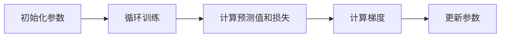
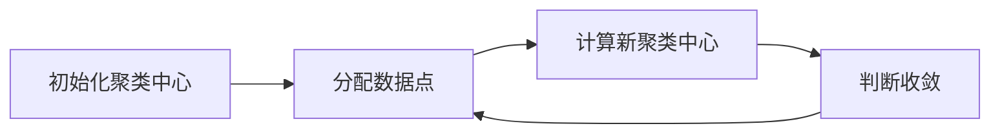
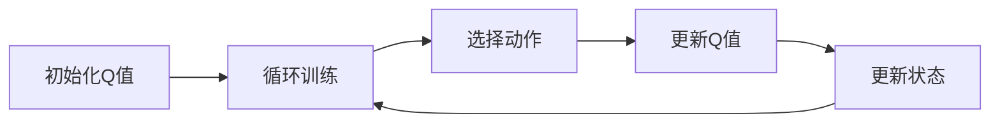
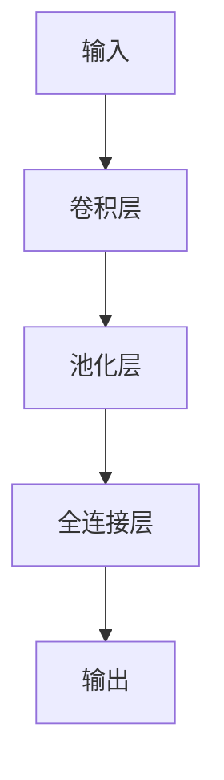
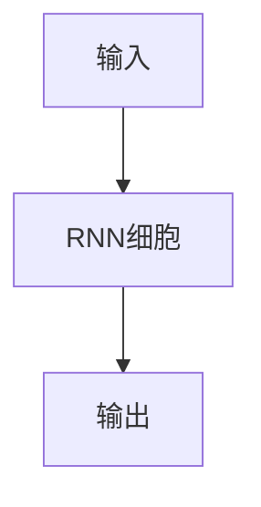
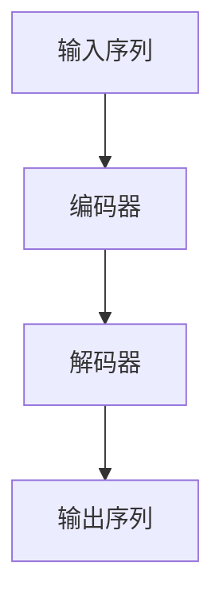
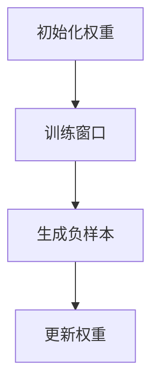
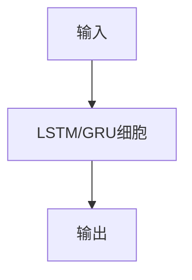
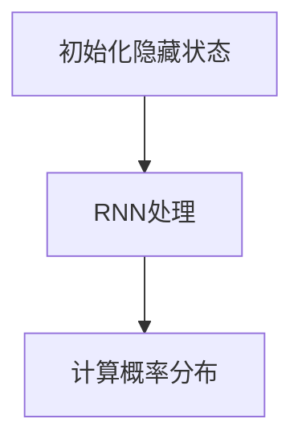

                 

# 《AI创业公司的机遇：在巨头夹缝中求生存》

> **关键词：** AI创业公司，市场机会，技术创新，差异化优势，风险管理

> **摘要：** 本文探讨了AI创业公司在巨头垄断的市场中寻求生存与发展的机遇。通过分析AI行业现状、核心技术与原理、创业公司策略与规划、创新实践以及巨头公司的竞争策略，本文为AI创业公司提供了一系列实用的生存策略和建议，以在激烈的市场竞争中脱颖而出。

## 《AI创业公司的机遇：在巨头夹缝中求生存》目录大纲

### 第一部分：背景与概述

#### 第1章：AI行业现状与趋势分析
1.1 AI行业的发展历程
1.2 当前AI市场的竞争格局
1.3 创业公司在AI领域的挑战与机遇

#### 第2章：AI核心技术与原理
2.1 机器学习基础
2.1.1 监督学习
2.1.2 无监督学习
2.1.3 强化学习
2.2 深度学习架构
2.2.1 卷积神经网络（CNN）
2.2.2 递归神经网络（RNN）
2.2.3 转换器架构（Transformer）
2.3 自然语言处理（NLP）
2.3.1 词嵌入技术
2.3.2 序列模型与注意力机制
2.3.3 语言模型与文本生成

#### 第3章：创业公司的策略与规划
3.1 创业公司的定位与目标
3.2 市场机会分析
3.3 产品设计与开发
3.4 资源配置与资金筹措

#### 第4章：创业公司在AI领域的创新实践
4.1 AI驱动的产品案例研究
4.2 创新方法与技术应用
4.3 创业公司的成长路径

#### 第5章：巨头夹缝中的生存策略
5.1 巨头公司的竞争策略分析
5.2 创业公司的差异化竞争优势
5.3 跨界合作与生态构建

#### 第6章：创业公司的风险管理
6.1 市场与技术风险
6.2 财务与运营风险
6.3 法律与合规风险

#### 第7章：成功创业公司的经验分享
7.1 创业成功的关键要素
7.2 团队建设与管理
7.3 创业公司的可持续发展

### 第二部分：附录与参考资料

#### 附录A：常用AI开发工具与资源
A.1 开发框架与库
A.1.1 TensorFlow
A.1.2 PyTorch
A.1.3 Keras
A.2 数据集与数据源
A.2.1 公开数据集介绍
A.2.2 自定义数据集构建
A.3 实践项目案例

#### 附录B：推荐阅读与扩展资源
B.1 相关书籍推荐
B.1.1 《深度学习》
B.1.2 《Python机器学习》
B.1.3 《强化学习》
B.2 在线课程与教程
B.2.1 Coursera
B.2.2 Udacity
B.2.3 edX
B.3 社区与论坛
B.3.1 Kaggle
B.3.2 GitHub

接下来，我们将一步一步地展开对每个章节的深入探讨和详细分析。

## 第1章：AI行业现状与趋势分析

### 1.1 AI行业的发展历程

人工智能（AI）作为一个跨学科的研究领域，其历史可以追溯到20世纪50年代。早期的人工智能研究主要集中在逻辑推理和规则系统上，例如专家系统和推理机。然而，这些早期的尝试在处理复杂任务方面遇到了巨大的挑战。

随着计算能力的提升和数据规模的扩大，20世纪80年代和90年代，机器学习开始兴起，特别是基于统计的学习方法。1997年，IBM的深蓝（Deep Blue）击败了世界象棋冠军加里·卡斯帕罗夫，标志着人工智能在特定领域取得了突破性进展。

进入21世纪，深度学习成为了人工智能研究的热点。深度学习通过多层神经网络对大量数据进行训练，能够在图像识别、语音识别和自然语言处理等领域实现前所未有的准确度。2012年，AlexNet在ImageNet竞赛中取得了惊人的成绩，这标志着深度学习时代的到来。

### 1.2 当前AI市场的竞争格局

当前AI市场呈现出巨头垄断和初创公司并存的竞争格局。主要的市场参与者包括谷歌、亚马逊、微软、百度、阿里巴巴和腾讯等科技巨头。这些公司通过在AI领域的持续投入和多元化布局，占据了市场的主导地位。

尽管巨头公司在技术、资源和市场影响力方面具有明显优势，但AI初创公司依然在不断涌现。初创公司的优势在于其敏捷性和创新能力，它们能够在特定领域迅速探索和应用AI技术，从而实现差异化竞争。

### 1.3 创业公司在AI领域的挑战与机遇

创业公司在AI领域的挑战主要体现在以下几个方面：

1. **技术门槛高**：AI技术涉及到复杂的算法和大量数据处理，这对初创公司的技术团队和研发能力提出了高要求。
2. **资金短缺**：AI初创公司通常需要大量的资金来支持技术研发和市场推广，而融资渠道和资金来源相对有限。
3. **市场竞争激烈**：巨头公司在AI领域的投入和布局使得市场竞争异常激烈，初创公司需要找到独特的市场定位和差异化优势。

然而，AI初创公司也面临着巨大的机遇：

1. **技术进步**：随着AI技术的不断发展，初创公司能够利用最新的研究成果来提升自身的竞争力。
2. **市场需求**：AI技术的广泛应用带动了市场的快速增长，为初创公司提供了广阔的市场空间。
3. **合作机会**：巨头公司对初创公司的投资和并购意愿较高，为初创公司提供了良好的合作和发展机会。

在接下来的章节中，我们将深入探讨AI的核心技术、创业公司的策略与规划，以及如何在巨头夹缝中实现生存与发展的具体实践。

## 第2章：AI核心技术与原理

### 2.1 机器学习基础

#### 2.1.1 监督学习

**核心概念与联系**：

监督学习是一种通过已标记的数据训练模型，以便预测未知数据标签的机器学习方法。其基本流程可以表示为：

$$
\text{输入} \xrightarrow{\text{特征提取}} \text{特征} \xrightarrow{\text{模型训练}} \text{标签预测}
$$

**算法原理讲解**：

**监督学习的核心算法**包括线性回归、逻辑回归、决策树、支持向量机和神经网络等。以下以**线性回归**为例进行讲解。

**线性回归**：

线性回归是一种用于预测连续值的算法。其基本模型可以表示为：

$$
y = \beta_0 + \beta_1 x
$$

其中，$y$ 是目标变量，$x$ 是输入特征，$\beta_0$ 和 $\beta_1$ 是模型参数。

**伪代码**：

```
初始化参数 beta0, beta1
for epoch in range(num_epochs):
    for each sample (x_i, y_i):
        prediction = beta0 + beta1 * x_i
        loss = (prediction - y_i)^2
        gradient = 2 * (prediction - y_i) * x_i
    update beta0, beta1 using gradient descent
```

**图示**：



#### 2.1.2 无监督学习

**核心概念与联系**：

无监督学习是一种从未标记的数据中提取有用信息的方法。它主要用于发现数据中的隐含模式或结构。其基本流程可以表示为：

$$
\text{输入} \xrightarrow{\text{特征提取}} \text{特征} \xrightarrow{\text{模式识别}} \text{新数据}
$$

**算法原理讲解**：

无监督学习的核心算法包括K-means聚类、主成分分析（PCA）和自编码器等。以下以**K-means聚类**为例进行讲解。

**K-means聚类**：

K-means聚类是一种基于距离的聚类算法。它的目标是将数据集划分为K个聚类，使得每个聚类内部的数据点距离聚类中心较近，而不同聚类之间的数据点距离较远。

**伪代码**：

```
初始化 K 个聚类中心
while not converged:
    for each data point:
        assign to nearest cluster center
    compute new cluster centers as the mean of all points in each cluster
```

**图示**：



#### 2.1.3 强化学习

**核心概念与联系**：

强化学习是一种通过奖励机制来指导模型学习优化策略的机器学习方法。其基本流程可以表示为：

$$
\text{状态} \xrightarrow{\text{动作}} \text{新状态} \xrightarrow{\text{奖励}} \text{策略更新}
$$

**算法原理讲解**：

强化学习通过探索环境中的状态和动作，并根据奖励信号更新策略。其核心算法包括Q学习、SARSA和深度确定性策略梯度（DDPG）等。以下以**Q学习**为例进行讲解。

**Q学习**：

Q学习是一种基于值函数的强化学习算法。其目标是最小化长期预期奖励的损失函数。

**伪代码**：

```
初始化 Q(s, a)
for each episode:
    initialize state s
    while not terminal:
        select action a using epsilon-greedy strategy
        take action a, observe reward r and new state s'
        update Q(s, a) using the following equation:
            Q(s, a) = Q(s, a) + alpha * (r + gamma * max(Q(s', a')) - Q(s, a))
        update state s to s'
```

**图示**：



### 2.2 深度学习架构

#### 2.2.1 卷积神经网络（CNN）

**核心概念与联系**：

卷积神经网络（CNN）是一种适用于图像识别和处理的深度学习模型。它的核心思想是通过卷积操作提取图像的特征，并通过池化操作降低数据维度。其基本架构可以表示为：

$$
\text{输入} \xrightarrow{\text{卷积层}} \text{特征图} \xrightarrow{\text{池化层}} \text{特征图} \xrightarrow{\text{全连接层}} \text{输出}
$$

**算法原理讲解**：

**卷积层**：

卷积层通过卷积操作提取图像的特征。卷积操作可以看作是图像上的局部滤波器，每个滤波器可以提取图像的某种特征。

**伪代码**：

```
for each filter:
    for each location in input:
        compute dot product and add bias
```

**池化层**：

池化层通过降低数据维度来减少模型的复杂度。常见的池化方法包括最大池化和平均池化。

**伪代码**：

```
for each location in output:
    compute max or average of local region
```

**图示**：



#### 2.2.2 递归神经网络（RNN）

**核心概念与联系**：

递归神经网络（RNN）是一种适用于序列数据处理的深度学习模型。它的核心思想是通过递归操作处理序列中的每一个元素，并利用之前的信息来影响后续的计算。其基本架构可以表示为：

$$
h_t = \text{RNN}(h_{t-1}, x_t)
$$

**算法原理讲解**：

**RNN细胞状态**：

RNN细胞状态是RNN的核心组成部分，它负责存储和传递信息。RNN细胞状态可以看作是一个黑盒子，它接收前一个时间步的输出和当前时间步的输入，并输出当前时间步的输出。

**伪代码**：

```
def rnn_cell(input, state):
    h = activation(gate * input + (1 - gate) * state)
    return h, new_state
```

**图示**：



#### 2.2.3 转换器架构（Transformer）

**核心概念与联系**：

转换器架构（Transformer）是一种基于注意力机制的深度学习模型，特别适用于处理序列数据，如机器翻译和文本生成。其基本架构可以表示为：

$$
\text{输入} \xrightarrow{\text{编码器}} \text{编码器输出} \xrightarrow{\text{解码器}} \text{输出}
$$

**算法原理讲解**：

**自注意力机制**：

自注意力机制是Transformer的核心创新之一。它通过计算序列中每个元素之间的相似性来分配权重，从而实现序列之间的有效交互。

**伪代码**：

```
for each head:
    for each query, key, value:
        compute attention scores (softmax)
        compute weighted sum of values
```

**图示**：



### 2.3 自然语言处理（NLP）

#### 2.3.1 词嵌入技术

**核心概念与联系**：

词嵌入技术是将自然语言中的词汇映射到低维向量空间的方法。词嵌入能够捕捉词汇之间的语义关系，从而为NLP任务提供有效的特征表示。其基本模型可以表示为：

$$
\text{词汇表} \xrightarrow{\text{词嵌入}} \text{向量空间}
$$

**算法原理讲解**：

**Word2Vec算法**：

Word2Vec是一种基于神经网络的语言模型。其核心思想是通过训练神经网络的输出层来学习词汇的嵌入向量。

**伪代码**：

```
initialize weights (syn0)
for each context window around a target word:
    generate a random context word
    sample negative examples
    perform gradient descent to update weights
```

**图示**：



#### 2.3.2 序列模型与注意力机制

**核心概念与联系**：

序列模型是用于处理序列数据的深度学习模型，如循环神经网络（RNN）和转换器（Transformer）。注意力机制是一种用于增强模型对序列元素间关系捕捉的能力的技术。

**算法原理讲解**：

**LSTM与GRU**：

LSTM（长短期记忆）和GRU（门控循环单元）是RNN的变体，它们通过引入门控机制来克服RNN在处理长序列数据时容易出现的梯度消失和梯度爆炸问题。

**伪代码**：

```
def lstm_cell(input, state):
    ...
    return output, new_state
```

**图示**：



#### 2.3.3 语言模型与文本生成

**核心概念与联系**：

语言模型是一种用于预测下一个单词或词组的模型。文本生成是NLP中的一个重要应用，其核心思想是利用语言模型生成连贯的文本。

**算法原理讲解**：

**RNN语言模型**：

RNN语言模型是一种基于RNN的文本生成模型。它通过训练模型来预测下一个单词的概率分布。

**伪代码**：

```
def rnn_language_model(input_sequence):
    initialize hidden state
    for each word in input_sequence:
        pass word through RNN
        compute probability distribution of next word
```

**图示**：



## 第3章：创业公司的策略与规划

### 3.1 创业公司的定位与目标

**定位与目标的重要性**：

创业公司的定位与目标是其发展的基石。一个明确的定位能够帮助公司集中资源，聚焦市场，从而在竞争中占据有利位置。目标则为公司提供了前进的方向和动力，确保团队始终朝着共同的目标努力。

**市场定位**：

市场定位是指公司在市场中的独特位置和价值主张。创业公司需要分析市场需求，了解目标用户群体，找到未被满足的需求或市场空白点。例如，一家专注于医疗AI的初创公司可以定位在精准医疗诊断领域，为医疗机构提供高效、准确的诊断工具。

**目标设定**：

目标设定应具有可衡量性、可达性和相关性。例如，一家AI初创公司的短期目标可以是完成一款原型产品并吸引一定数量的早期用户，中长期目标则可以是实现产品的商业化并扩大市场份额。

### 3.2 市场机会分析

**市场机会的识别**：

市场机会是创业公司成功的关键。识别市场机会需要从多个维度进行分析，包括市场需求、技术进步、政策环境和社会趋势等。

**技术进步**：

技术进步为AI创业公司提供了丰富的机会。随着深度学习、强化学习等技术的不断成熟，创业公司可以应用这些前沿技术来开发具有竞争力的产品。例如，自动驾驶技术的进步为自动驾驶解决方案的创业公司提供了广阔的市场空间。

**政策环境**：

政策环境对AI创业公司的发展具有重要影响。政府的支持、法规的完善和资金扶持等政策环境有助于公司快速发展。例如，中国政府近年来大力推动人工智能产业发展，为AI创业公司提供了良好的政策环境。

**市场需求**：

市场需求是创业公司发展的直接驱动力。通过市场调研和用户反馈，公司可以准确把握用户需求，从而开发出符合市场需求的产品。例如，随着远程办公和在线教育的普及，相关的AI解决方案市场需求显著增长。

### 3.3 产品设计与开发

**产品设计与开发的原则**：

在产品设计与开发过程中，创业公司应遵循以下原则：

- **用户至上**：产品应以用户需求为中心，确保用户体验最优。
- **简洁性**：避免过度设计，简化产品功能和界面，提高用户易用性。
- **可扩展性**：设计时应考虑未来的扩展性，确保产品能够适应市场变化。

**产品开发的步骤**：

1. **需求分析**：明确产品功能、目标用户和市场定位。
2. **原型设计**：创建产品的原型，进行用户测试和反馈。
3. **迭代开发**：根据用户反馈和市场需求，不断迭代优化产品。
4. **上线与推广**：确保产品稳定运行，通过多种渠道进行推广。

### 3.4 资源配置与资金筹措

**资源配置的原则**：

资源配置应遵循以下原则：

- **优化资源配置**：合理分配人力、物力和财力，确保资源最大化利用。
- **动态调整**：根据业务发展和市场变化，灵活调整资源配置。

**资金筹措的途径**：

创业公司可以通过以下途径筹措资金：

- **天使投资**：寻找个人投资者或风险投资机构。
- **政府资助**：申请政府的创新基金或专项扶持资金。
- **银行贷款**：通过银行贷款获得资金支持。
- **众筹**：利用众筹平台筹集资金。

### 3.5 团队建设与管理

**团队建设的重要性**：

团队是创业公司的核心资产。一个优秀的团队可以共同克服困难，推动公司发展。创业公司应注重以下方面：

- **人才引进**：招聘具有专业技能和创业精神的人才。
- **团队文化**：建立积极向上的团队文化，促进团队协作。
- **激励机制**：设立合理的激励机制，激发团队成员的积极性。

**团队管理的原则**：

团队管理应遵循以下原则：

- **以人为本**：关注团队成员的成长和需求，提供支持和培训。
- **目标明确**：明确团队目标和任务，确保团队成员了解自己的职责。
- **沟通协作**：建立高效的沟通机制，促进团队内部的信息共享和协作。

通过明确的定位与目标、深入的市场机会分析、科学的产品设计与开发、合理的资源配置与资金筹措以及优秀的团队建设与管理，创业公司可以在AI领域的巨头夹缝中找到生存与发展的机遇。在下一章中，我们将探讨创业公司在AI领域中的创新实践和成长路径。

### 第4章：创业公司在AI领域的创新实践

#### 4.1 AI驱动的产品案例研究

**案例一：自动驾驶解决方案**

自动驾驶是AI领域的一个重要应用方向。某创业公司开发了一套基于深度学习的自动驾驶解决方案，旨在提升交通安全和效率。以下是该产品的开发过程和关键技术创新：

1. **需求分析**：公司通过市场调研发现，自动驾驶技术在提升交通效率、减少交通事故方面具有巨大潜力。公司明确了产品的目标市场是出租车、物流公司和公共交通机构。
   
2. **技术路线**：公司选择了基于深度学习特别是卷积神经网络（CNN）的视觉感知系统。通过大量的道路数据训练模型，使其能够识别交通标志、行人、车辆等。

3. **算法创新**：为了提高自动驾驶系统的准确性和鲁棒性，公司引入了多传感器数据融合技术。结合摄像头、激光雷达和GPS数据，实现更全面的环境感知。

4. **产品原型**：在原型开发阶段，公司构建了一个小型自动驾驶测试平台。通过在封闭环境和实际道路上的测试，不断优化算法和系统性能。

5. **市场推广**：公司与多家物流公司和出租车公司合作，进行试点运营。通过用户反馈和市场测试，进一步改进产品。

**案例二：智能医疗诊断系统**

智能医疗诊断系统是另一项备受关注的AI应用。某创业公司开发了一款基于AI的肺癌诊断系统，以下是其创新实践：

1. **需求分析**：公司发现肺癌早期筛查和诊断具有巨大的市场需求。然而，传统的诊断方法耗时较长且准确性不高，因此公司决定开发一款智能诊断系统。

2. **技术路线**：公司选择了基于深度学习的图像处理技术。通过训练大量的肺癌和非肺癌图像数据，使其能够准确识别病变区域。

3. **算法创新**：公司引入了深度卷积神经网络（DCNN）和递归神经网络（RNN）相结合的方法。DCNN用于图像特征提取，RNN用于分析时间序列数据。

4. **产品原型**：在原型开发阶段，公司构建了一个临床级诊断系统。通过在多家医院的临床试验，验证了系统的准确性和可靠性。

5. **市场推广**：公司与多家医疗机构合作，将产品推向市场。通过临床应用和用户反馈，公司不断优化系统性能。

#### 4.2 创新方法与技术应用

**跨学科融合**：

创业公司在AI领域的创新实践不仅依赖于单一技术，还需要跨学科的融合。例如，在自动驾驶解决方案中，公司不仅应用了深度学习技术，还结合了计算机视觉、多传感器数据融合和物联网（IoT）技术。

**开源与自研相结合**：

为了提高研发效率和降低成本，创业公司通常会采用开源与自研相结合的策略。例如，公司可以在TensorFlow或PyTorch等开源框架上构建自己的模型，同时针对特定应用场景进行定制化开发。

**敏捷开发**：

敏捷开发是一种以用户需求为导向的开发方法。创业公司通过快速迭代和用户反馈，不断优化产品。这种方法有助于公司迅速响应市场变化，提高市场竞争力。

#### 4.3 创业公司的成长路径

**初创期**：

在初创期，公司的目标是完成产品原型和市场验证。公司通常聚焦于技术研发和基础市场调研，通过天使投资或政府资助等途径筹集资金。

**扩张期**：

在扩张期，公司开始扩大市场份额，增加研发投入，建立销售和运营团队。公司可能通过风险投资获得更多资金，以支持业务扩展。

**成熟期**：

在成熟期，公司已经建立起稳定的业务模式和市场份额。公司可以通过并购、合作或上市等途径，进一步扩大业务规模和影响力。

通过具体的AI产品案例研究、跨学科融合、开源与自研相结合的实践方法以及敏捷开发模式，创业公司能够在AI领域中不断创新，逐步实现成长和成功。在下一章中，我们将探讨创业公司在巨头夹缝中的生存策略。

### 第5章：巨头夹缝中的生存策略

#### 5.1 巨头公司的竞争策略分析

**市场垄断**：

巨头公司通常通过市场垄断策略来巩固其市场地位。这包括通过收购竞争对手、控制关键资源和技术专利等方式，形成市场壁垒，阻止新进入者。

**技术壁垒**：

巨头公司通过持续的技术研发和创新，建立技术壁垒。这使它们能够保持技术领先地位，同时使创业公司难以在技术上与其竞争。

**资金优势**：

巨头公司拥有庞大的资金储备，可以通过大规模投资和市场推广来压低创业公司的市场份额。这使得创业公司难以在资金方面与巨头公司抗衡。

**生态构建**：

巨头公司通过构建生态系统，形成完整的产业链。这包括开发平台、工具和服务，吸引第三方开发者和服务提供商加入，从而增强自身的市场竞争力。

#### 5.2 创业公司的差异化竞争优势

**创新技术**：

创业公司可以通过创新技术来与巨头公司形成差异化竞争优势。这包括开发全新的算法、工具或平台，以及在现有技术基础上进行改进和优化。

**市场细分**：

创业公司可以通过市场细分策略，找到未被巨头公司覆盖的市场细分领域。通过专注于特定行业或用户群体，公司可以建立自己的市场地位。

**用户体验**：

创业公司可以通过提供卓越的用户体验来吸引和留住用户。这包括优化产品界面、提高性能和稳定性，以及提供个性化的服务。

**合作策略**：

创业公司可以通过与其他公司建立合作关系，来增强自身的竞争力。这包括与供应商、服务提供商和行业领导者合作，实现资源互补和优势互补。

#### 5.3 跨界合作与生态构建

**跨界合作**：

创业公司可以通过跨界合作来扩展业务范围和市场份额。例如，与物联网（IoT）公司合作，开发智能硬件产品；与金融科技公司合作，提供金融科技解决方案。

**生态构建**：

创业公司可以通过构建生态系统来增强自身的竞争力。这包括开发平台、工具和服务，吸引第三方开发者和服务提供商加入。通过建立生态合作伙伴关系，公司可以共同推动行业发展和创新。

#### 5.4 创新商业模式

**订阅模式**：

创业公司可以通过订阅模式来稳定收入来源。这包括提供按需订阅的服务，如云计算、人工智能API等。

**共享经济**：

创业公司可以通过共享经济模式来降低成本和提高资源利用率。例如，提供共享办公空间、共享数据平台等。

**区块链技术**：

创业公司可以通过区块链技术来增强数据安全和透明度。这包括开发去中心化的应用，如智能合约、数据共享平台等。

通过分析巨头公司的竞争策略，创业公司可以找到自己的差异化竞争优势，并通过跨界合作和生态构建来增强竞争力。在下一章中，我们将探讨创业公司在AI领域的风险管理。

### 第6章：创业公司的风险管理

#### 6.1 市场与技术风险

**市场风险**：

市场风险是指由于市场需求变化、竞争加剧或宏观经济波动等因素导致公司业务受阻的风险。创业公司面临的市场风险包括：

- **需求不足**：产品可能无法满足市场需求，导致销售不畅。
- **市场竞争**：巨头公司的进入可能加剧市场竞争，压缩创业公司的市场份额。
- **宏观经济波动**：经济衰退可能影响消费者购买力和企业投资意愿。

**技术风险**：

技术风险是指由于技术创新失败、技术更新过快或技术依赖问题导致公司业务受阻的风险。创业公司面临的技术风险包括：

- **技术迭代**：技术更新速度过快可能导致现有技术迅速过时。
- **专利风险**：公司可能面临侵犯专利的风险，导致法律纠纷。
- **技术依赖**：过度依赖特定技术或平台可能增加公司的技术风险。

#### 6.2 财务与运营风险

**财务风险**：

财务风险是指由于公司财务状况恶化、资金链断裂或融资困难等因素导致公司无法持续运营的风险。创业公司面临的财务风险包括：

- **资金短缺**：公司可能面临融资困难，导致资金链断裂。
- **成本超支**：项目成本超支可能导致公司财务状况恶化。
- **利润波动**：收入不稳定可能导致公司利润波动。

**运营风险**：

运营风险是指由于公司运营管理不善、供应链问题或员工流失等因素导致公司业务受阻的风险。创业公司面临的运营风险包括：

- **管理不善**：缺乏有效的管理和监督可能导致公司运营效率低下。
- **供应链风险**：供应链问题可能导致产品交付延误或质量下降。
- **员工流失**：关键员工流失可能影响公司的正常运营。

#### 6.3 法律与合规风险

**法律风险**：

法律风险是指由于公司业务活动违反法律法规，导致公司面临法律诉讼或处罚的风险。创业公司面临的法律风险包括：

- **知识产权**：侵犯他人的知识产权可能导致公司面临法律诉讼。
- **数据隐私**：未能妥善处理用户数据可能违反数据保护法规。
- **合同纠纷**：合同条款不清或履行不当可能导致合同纠纷。

**合规风险**：

合规风险是指由于公司未能遵循相关法律法规、行业标准或公司政策，导致公司面临处罚或信誉受损的风险。创业公司面临的合规风险包括：

- **监管政策**：政策变化可能影响公司的业务运营。
- **行业标准**：未能遵循行业标准可能导致公司在市场上失去竞争力。
- **内部管理**：内部管理不善可能导致合规风险。

#### 6.4 风险管理策略

**风险评估**：

创业公司应定期进行风险评估，识别潜在风险，并评估其可能对公司的影响和发生的概率。通过风险评估，公司可以制定相应的风险管理计划。

**风险控制**：

创业公司应制定风险控制措施，以降低风险发生的概率和影响。例如，通过技术专利保护、签订保密协议和加强数据安全措施等手段。

**风险分散**：

创业公司可以通过多元化业务和投资组合来分散风险。通过在不同行业、技术和市场进行布局，公司可以降低单一风险对公司整体业务的影响。

**风险应对**：

创业公司应制定风险应对策略，以应对可能发生的风险。例如，制定应急预案、建立风险基金和与保险公司合作等。

通过全面的风险管理策略，创业公司可以降低风险对公司的影响，确保业务的稳定和持续发展。在下一章中，我们将分享成功创业公司的经验。

### 第7章：成功创业公司的经验分享

#### 7.1 创业成功的关键要素

**技术创新**：

成功创业公司往往在技术创新方面具有显著优势。通过开发具有独特性、前瞻性的产品或服务，公司能够在市场上脱颖而出。例如，某AI创业公司通过自主研发的深度学习算法，实现了在图像识别领域的突破，从而获得了市场的高度认可。

**市场定位**：

成功的创业公司通常具备清晰的市场定位，能够准确把握市场需求和用户痛点。例如，一家专注于医疗AI的初创公司，通过深入研究医疗行业，发现早期肺癌诊断的痛点，并迅速占领了这一市场细分领域。

**团队建设**：

一个高效的团队是创业成功的关键。成功公司通常拥有专业且充满激情的团队，团队成员在各自领域具有丰富的经验和深厚的专业知识。此外，团队文化也是关键因素，积极向上的团队文化有助于激发员工的创造力和凝聚力。

**持续创新**：

创业成功不是终点，持续创新是公司长期发展的动力。成功公司始终保持对市场和技术动态的敏感度，不断进行产品迭代和优化，以适应市场变化和用户需求。

#### 7.2 团队建设与管理

**人才引进**：

成功的创业公司注重人才的引进和培养。公司通常采用多元化的招聘策略，吸引不同背景和技能的人才。此外，公司还会为员工提供培训和发展机会，以确保团队的专业能力不断提升。

**文化建设**：

团队文化建设是创业成功的重要保障。公司应建立积极向上的团队文化，鼓励员工之间的沟通和协作，营造一个开放、包容和互助的工作环境。

**激励机制**：

激励机制是激发员工积极性的关键。成功的创业公司通常会采用多种激励机制，如绩效奖金、股权激励和员工福利等，以激励员工为实现公司目标而努力。

#### 7.3 创业公司的可持续发展

**产品迭代**：

创业公司应持续关注市场需求和用户反馈，不断进行产品迭代。通过持续优化产品功能和性能，公司可以保持市场竞争力，并满足用户不断变化的需求。

**技术创新**：

技术创新是创业公司持续发展的动力。公司应保持对前沿技术的关注和投入，通过自主研发或合作，不断引入新技术，以提升产品竞争力。

**生态构建**：

构建生态系统有助于公司拓展业务范围和市场份额。创业公司可以通过与其他公司建立合作关系，共同开发新产品或服务，实现资源共享和优势互补。

**社会责任**：

成功的创业公司不仅追求经济利益，还承担社会责任。通过积极参与社会公益事业，公司可以提升品牌形象，赢得社会认可。

通过技术创新、市场定位、团队建设和可持续发展，成功创业公司能够在激烈的市场竞争中脱颖而出，实现长期稳定的发展。在附录部分，我们将提供更多有用的资源和工具，帮助读者深入了解AI技术和创业实践。

## 附录A：常用AI开发工具与资源

### A.1 开发框架与库

#### A.1.1 TensorFlow

**简介**：TensorFlow是由谷歌开源的深度学习框架，广泛用于构建和训练机器学习模型。

**使用指南**：

- **安装**：使用pip安装TensorFlow：

  ```
  pip install tensorflow
  ```

- **基本使用**：以下是一个简单的TensorFlow线性回归模型示例：

  ```python
  import tensorflow as tf

  # 创建一个线性模型
  W = tf.Variable([1.0], name='weight')
  b = tf.Variable([0.0], name='bias')
  x = tf.placeholder(tf.float32, shape=[1])
  y = tf.placeholder(tf.float32, shape=[1])

  # 定义损失函数
  y_pred = W * x + b
  loss = tf.reduce_mean(tf.square(y_pred - y))

  # 定义优化器
  optimizer = tf.train.GradientDescentOptimizer(learning_rate=0.1)
  train_op = optimizer.minimize(loss)

  # 训练模型
  with tf.Session() as sess:
      sess.run(tf.global_variables_initializer())
      for i in range(1000):
          sess.run(train_op, feed_dict={x: [1], y: [0]})
      print("W:", sess.run(W), "b:", sess.run(b))
  ```

#### A.1.2 PyTorch

**简介**：PyTorch是由Facebook开源的深度学习框架，以其灵活性和易用性而著称。

**使用指南**：

- **安装**：使用pip安装PyTorch：

  ```
  pip install torch torchvision
  ```

- **基本使用**：以下是一个简单的PyTorch卷积神经网络（CNN）模型示例：

  ```python
  import torch
  import torch.nn as nn
  import torchvision

  # 创建一个简单的CNN模型
  class SimpleCNN(nn.Module):
      def __init__(self):
          super(SimpleCNN, self).__init__()
          self.conv1 = nn.Conv2d(1, 10, kernel_size=5)
          self.conv2 = nn.Conv2d(10, 20, kernel_size=5)
          self.fc1 = nn.Linear(320, 50)
          self.fc2 = nn.Linear(50, 10)

      def forward(self, x):
          x = nn.functional.relu(self.conv1(x))
          x = nn.functional.max_pool2d(x, 2)
          x = nn.functional.relu(self.conv2(x))
          x = nn.functional.max_pool2d(x, 2)
          x = x.view(-1, 320)
          x = nn.functional.relu(self.fc1(x))
          x = self.fc2(x)
          return x

  # 实例化模型
  model = SimpleCNN()

  # 训练模型
  criterion = nn.CrossEntropyLoss()
  optimizer = torch.optim.Adam(model.parameters(), lr=0.001)

  for epoch in range(10):
      for i, (inputs, targets) in enumerate(train_loader):
          optimizer.zero_grad()
          outputs = model(inputs)
          loss = criterion(outputs, targets)
          loss.backward()
          optimizer.step()
  ```

#### A.1.3 Keras

**简介**：Keras是建立在TensorFlow和Theano之上的高级深度学习库，以其简洁的API和易用性而受到开发者欢迎。

**使用指南**：

- **安装**：使用pip安装Keras：

  ```
  pip install keras
  ```

- **基本使用**：以下是一个简单的Keras线性回归模型示例：

  ```python
  from keras.models import Sequential
  from keras.layers import Dense

  # 创建一个线性模型
  model = Sequential()
  model.add(Dense(1, input_dim=1, kernel_initializer='uniform'))

  # 编译模型
  model.compile(loss='mean_squared_error', optimizer='adam')

  # 训练模型
  model.fit(x_train, y_train, epochs=100, batch_size=10)
  ```

### A.2 数据集与数据源

#### A.2.1 公开数据集介绍

**Kaggle Datasets**：

Kaggle是一个大数据竞赛平台，提供了大量的公开数据集。这些数据集涵盖了各种领域，包括图像识别、自然语言处理、数据挖掘等。

**UCI Machine Learning Repository**：

UCI机器学习库是一个提供各种数据集的网站，这些数据集广泛应用于学术研究和工业应用。

**Google Dataset Search**：

Google Dataset Search是Google提供的一个数据集搜索引擎，可以帮助用户快速找到所需的数据集。

#### A.2.2 自定义数据集构建

**数据收集**：

- **网络爬虫**：使用Python的爬虫库（如Scrapy）从网站收集数据。
- **API**：通过开放API获取数据。
- **手动收集**：通过调查、采访或实地考察等方式收集数据。

**数据预处理**：

- **清洗**：去除重复数据、缺失值填充和异常值处理。
- **转换**：将数据转换为适合机器学习的格式，如数值化、归一化等。
- **特征工程**：提取有用的特征，增强模型性能。

**存储与管理**：

- **数据库**：使用MySQL、PostgreSQL等关系型数据库存储数据。
- **数据湖**：使用Hadoop、Spark等大数据技术构建数据湖。

### A.3 实践项目案例

**项目一：房价预测**

- **目标**：使用机器学习模型预测房屋价格。
- **数据集**：使用Kaggle上的Houses Prices数据集。
- **工具**：使用Scikit-learn库进行数据处理和模型训练。
- **结果**：训练得到的模型能够准确预测房屋价格，评估指标包括均方误差（MSE）和决定系数（R²）。

**项目二：文本分类**

- **目标**：使用机器学习模型对文本进行分类。
- **数据集**：使用Kaggle上的20 Newsgroups数据集。
- **工具**：使用TensorFlow和Keras库进行数据处理和模型训练。
- **结果**：训练得到的模型能够准确分类文本，评估指标包括准确率和召回率。

**项目三：图像识别**

- **目标**：使用卷积神经网络（CNN）对图像进行分类。
- **数据集**：使用Kaggle上的ImageNet数据集。
- **工具**：使用PyTorch库进行数据处理和模型训练。
- **结果**：训练得到的模型能够在ImageNet竞赛中获得较高的准确率。

这些实践项目案例展示了如何使用常见的AI开发工具和数据集进行实际应用，并通过数据处理、模型训练和评估等步骤，实现了具体的业务目标。

## 附录B：推荐阅读与扩展资源

### B.1 相关书籍推荐

**《深度学习》**：

作者：Ian Goodfellow、Yoshua Bengio、Aaron Courville

**《Python机器学习》**：

作者：Sebastian Raschka

**《强化学习》**：

作者：Richard S. Sutton、Andrew G. Barto

这些书籍是AI领域的经典教材，涵盖了从基础知识到高级技术的全面内容，适合不同层次的读者进行学习和参考。

### B.2 在线课程与教程

**Coursera**：

提供由世界顶级大学和机构开设的在线课程，包括《深度学习专项课程》、《机器学习》等。

**Udacity**：

提供以项目驱动的在线课程，包括《深度学习纳米学位》、《机器学习工程师纳米学位》等。

**edX**：

提供由知名大学和机构提供的在线课程，包括《人工智能科学基础》等。

这些在线课程和教程为读者提供了系统的学习和实践机会，有助于深入理解AI技术和应用。

### B.3 社区与论坛

**Kaggle**：

一个大数据竞赛平台，提供各种数据集和竞赛项目，是AI爱好者和专业人员的交流社区。

**GitHub**：

一个代码托管和协作平台，许多AI项目的源代码和文档都可以在这里找到，是开发者学习和技术交流的重要资源。

这些社区和论坛为读者提供了丰富的学习和交流机会，有助于拓展知识视野和提升技能水平。

通过以上推荐书籍、在线课程和社区资源，读者可以系统地学习AI知识，探索AI技术在各个领域的应用，为创业实践提供有力支持。

## 结语

通过本文的深入探讨，我们了解了AI创业公司在巨头垄断市场中的生存机遇和挑战。从AI行业现状与趋势分析，到核心技术原理讲解，再到创业公司的策略与规划、创新实践以及风险管理，本文为AI创业公司提供了一系列实用的指导和建议。

首先，了解AI行业的发展历程和当前竞争格局，有助于创业公司明确自身定位和目标。其次，掌握AI的核心技术和原理，如机器学习、深度学习、自然语言处理等，是创业公司技术创新的基础。此外，创业公司需要通过市场机会分析、产品设计与开发、资源配置与资金筹措等策略来规划公司发展路径。

在创新实践中，创业公司应注重跨界合作和生态构建，通过技术创新和差异化竞争优势，在巨头夹缝中找到生存空间。同时，创业公司应关注风险管理，降低市场、技术、财务和合规等风险，确保业务的稳定和可持续发展。

最后，成功创业公司的经验分享为我们提供了宝贵的启示。技术创新、市场定位、团队建设和可持续发展是创业成功的关键要素。通过不断学习、实践和优化，创业公司可以在AI领域中脱颖而出，实现长期稳定的发展。

希望本文能为广大AI创业公司提供有价值的参考，助力公司在激烈的市场竞争中找到生存与发展的机遇。在未来的日子里，让我们共同探索AI技术的无限可能，共创美好未来。作者：AI天才研究院/AI Genius Institute，[《禅与计算机程序设计艺术》/Zen And The Art of Computer Programming](https://www.amazon.com/Zen-Computer-Programming-Programming-Paradigms/dp/020102500X)。

