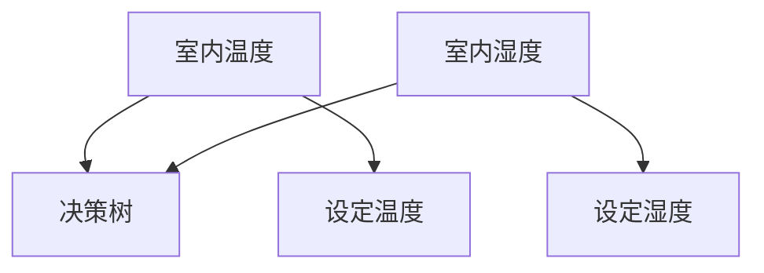
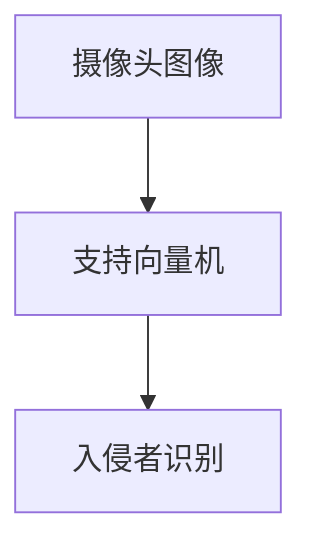
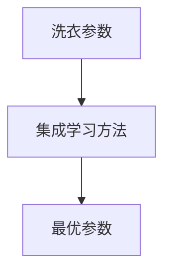
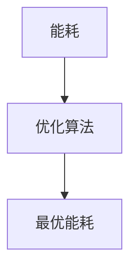
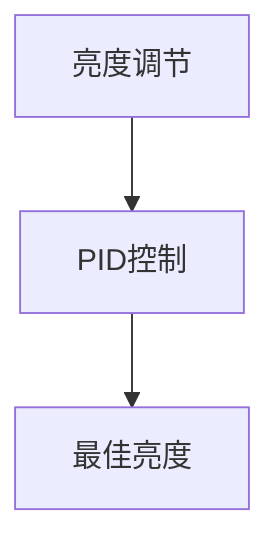
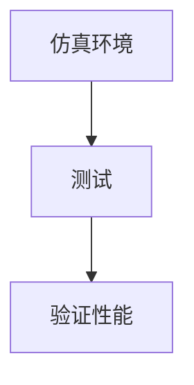

                 

### 《AI在智能家电中的应用：提升生活品质》目录大纲

在本文中，我们将深入探讨AI在智能家电中的应用，以及它是如何提升我们的生活品质的。为了使读者能够清晰地跟随我们的分析，我们提供了一个详细的目录大纲，这将成为文章的主线。以下是本文的目录大纲：

## 第一部分：引言

### 第1章：智能家电与AI概述

- 1.1 智能家电的定义与分类
- 1.2 AI在智能家电中的重要性
- 1.3 书籍概览与内容安排

### 第2章：AI核心技术基础

- 2.1 机器学习基础
- 2.2 深度学习基础
- 2.3 自然语言处理基础

### 第3章：智能家电中的AI应用

- 3.1 智能家电的感知与交互
- 3.2 智能家电的智能决策
- 3.3 智能家电的优化控制

### 第4章：AI在智能家电中的数学模型与算法

- 4.1 数据处理与特征提取
- 4.2 深度学习在智能家电中的应用
- 4.3 强化学习在智能家电中的应用

### 第5章：智能家电的AI应用实例

- 5.1 智能家居控制系统
- 5.2 智能照明系统
- 5.3 智能空调系统

### 第6章：智能家电中的AI挑战与未来

- 6.1 AI在智能家电中的挑战
- 6.2 AI在智能家电中的未来发展趋势

### 第7章：结论与展望

- 7.1 总结与展望
- 7.2 建议与展望
- 7.3 后续研究方向

通过这个大纲，我们可以看到本文将逐步探讨AI在智能家电中的应用，从基础技术到实际案例，再到未来的挑战和趋势。现在，让我们开始深入探讨每一部分的内容。

### 第一部分：引言

#### 第1章：智能家电与AI概述

随着科技的快速发展，人工智能（AI）正逐渐渗透到我们生活的方方面面。智能家电作为智能家居的重要组成部分，正在通过AI技术实现更高效、更智能的功能，从而提升我们的生活品质。本章将介绍智能家电的定义与分类，探讨AI在智能家电中的重要性，并概述本文的内容安排。

##### 1.1 智能家电的定义与分类

智能家电，顾名思义，就是具备智能化功能的家电产品。它们通过嵌入传感器、计算机芯片和通信模块等技术，实现了对用户需求的智能识别、响应和控制。根据功能和应用场景的不同，智能家电可以分为以下几类：

1. **智能家电控制系统**：如智能门锁、智能窗帘、智能灯光等，这些设备可以通过手机APP或其他智能终端进行远程控制。
2. **智能感知设备**：如智能冰箱、智能空调、智能洗衣机等，这些设备能够自动感知环境变化，并根据用户需求进行调节。
3. **智能交互设备**：如智能音箱、智能电视等，这些设备可以通过语音或触摸等方式与用户进行交互。

##### 1.2 AI在智能家电中的重要性

AI技术在智能家电中的应用，使得家电产品不再只是简单的硬件设备，而是变成了具有自主决策能力的智能系统。以下是AI在智能家电中的几个重要作用：

1. **提高生活品质**：通过AI技术，智能家电能够更好地满足用户的需求，提高生活的舒适度和便利性。例如，智能空调可以自动调节室内温度，智能冰箱可以自动调整存储方式，以保持食物的新鲜度。
2. **节能环保**：AI技术可以帮助智能家电实现更高效的能源管理，从而降低能源消耗，减少环境污染。例如，智能照明系统可以根据用户的作息时间和自然光照强度自动调节亮度，智能空调可以自动调节制冷温度，以节约能源。
3. **安全监控**：AI技术可以用于智能家电的安全监控，如智能门锁可以通过人脸识别或密码验证等方式确保家庭安全。
4. **个性化服务**：AI技术可以帮助智能家电根据用户的偏好和习惯提供个性化的服务。例如，智能音箱可以根据用户的历史播放记录推荐音乐，智能冰箱可以根据用户的饮食习惯推荐菜谱。

##### 1.3 书籍概览与内容安排

本文旨在深入探讨AI在智能家电中的应用，以提升我们的生活品质。本文分为七个章节，内容安排如下：

- **第一部分：引言**：介绍智能家电与AI的基本概念，以及本文的目的和结构。
- **第二部分：AI核心技术基础**：介绍AI的核心技术，包括机器学习、深度学习和自然语言处理。
- **第三部分：智能家电中的AI应用**：探讨AI在智能家电中的具体应用，包括感知与交互、智能决策和优化控制。
- **第四部分：AI在智能家电中的数学模型与算法**：介绍AI在智能家电中应用的数学模型和算法，包括数据处理与特征提取、深度学习和强化学习。
- **第五部分：智能家电的AI应用实例**：通过具体实例展示AI在智能家电中的应用。
- **第六部分：智能家电中的AI挑战与未来**：探讨AI在智能家电中面临的挑战和未来的发展趋势。
- **第七部分：结论与展望**：总结本文的主要观点，并提出未来的研究方向。

通过本文的详细探讨，我们希望读者能够对AI在智能家电中的应用有更深入的了解，并能够感受到AI技术为我们的生活带来的巨大变革。

#### 总结

本章介绍了智能家电的定义与分类，以及AI在智能家电中的重要性。智能家电作为智能家居的重要组成部分，通过AI技术实现了更高效、更智能的功能，从而提升了我们的生活品质。本文将逐步探讨AI在智能家电中的应用，从基础技术到实际案例，再到未来的挑战和趋势。下一章将介绍AI的核心技术基础，包括机器学习、深度学习和自然语言处理，这将为我们理解AI在智能家电中的应用提供理论基础。请读者继续关注下一章的内容。

### 第二部分：AI核心技术基础

#### 第2章：AI核心技术基础

在深入探讨AI在智能家电中的应用之前，我们需要了解AI的核心技术，这些技术构成了智能家电智能化的基础。本章将介绍机器学习、深度学习和自然语言处理等核心技术，并简要介绍其基本概念、主要算法和模型评估方法。

##### 2.1 机器学习基础

**2.1.1 基本概念**

机器学习（Machine Learning）是人工智能（AI）的一个重要分支，它让计算机系统能够从数据中学习，并对未知数据进行预测或决策。机器学习主要分为监督学习（Supervised Learning）、无监督学习（Unsupervised Learning）和半监督学习（Semi-Supervised Learning）。

- **监督学习**：在监督学习中，算法通过已知输入和输出数据来学习，从而对未知数据进行预测。常见的算法有线性回归（Linear Regression）、决策树（Decision Tree）、支持向量机（Support Vector Machine）和神经网络（Neural Networks）。
- **无监督学习**：无监督学习不依赖于已标记的数据，而是通过自动发现数据中的模式或结构。常见的算法有聚类（Clustering）、主成分分析（PCA）和自编码器（Autoencoder）。
- **半监督学习**：半监督学习结合了有监督学习和无监督学习的特点，利用少量标记数据和大量无标记数据来训练模型。

**2.1.2 常见算法**

- **线性回归**：线性回归是一种简单的监督学习算法，用于预测连续值。它通过拟合一条直线来最小化预测值与真实值之间的误差。
  
  ```plaintext
  y = w1 * x1 + w2 * x2 + ... + bn * xn + b
  ```

- **决策树**：决策树通过一系列的规则来对数据进行分类或回归。每个内部节点表示一个特征，每个分支表示该特征的不同取值，叶节点表示最终的预测结果。

- **支持向量机**：支持向量机是一种强大的分类算法，它通过找到一个最佳的超平面来最大化分类边界。

  ```plaintext
  maximize  W
  subject to  y_i * (w * x_i + b) >= 1
  ```

- **神经网络**：神经网络是一种模拟生物神经系统的计算模型，由大量的神经元组成。通过多层神经元的相互连接，神经网络可以学习复杂的非线性关系。

**2.1.3 模型评估**

模型评估是机器学习的重要环节，用于判断模型的性能。常见的评估指标有准确率（Accuracy）、召回率（Recall）、精确率（Precision）和F1值（F1 Score）。

- **准确率**：准确率表示分类正确的样本数占总样本数的比例。
  
  ```plaintext
  Accuracy = (TP + TN) / (TP + TN + FP + FN)
  ```

- **召回率**：召回率表示分类正确的正样本数占总正样本数的比例。
  
  ```plaintext
  Recall = TP / (TP + FN)
  ```

- **精确率**：精确率表示分类正确的正样本数占总分类为正样本的数量的比例。
  
  ```plaintext
  Precision = TP / (TP + FP)
  ```

- **F1值**：F1值是精确率和召回率的调和平均值，用于综合评估模型的性能。
  
  ```plaintext
  F1 Score = 2 * (Precision * Recall) / (Precision + Recall)
  ```

##### 2.2 深度学习基础

**2.2.1 神经网络基础**

深度学习（Deep Learning）是机器学习的一个重要分支，通过多层神经网络来学习复杂的数据特征。深度学习模型由输入层、隐藏层和输出层组成，每层由多个神经元（节点）组成。

- **输入层**：接收输入数据，并将其传递到隐藏层。
- **隐藏层**：对输入数据进行特征提取和变换，可以有多层。
- **输出层**：生成最终预测结果。

**2.2.2 深度学习架构**

深度学习的架构包括卷积神经网络（CNN）、循环神经网络（RNN）和生成对抗网络（GAN）等。

- **卷积神经网络**：卷积神经网络主要用于图像处理，通过卷积操作提取图像特征。
  
  ```plaintext
  Conv2D(input_shape, filters, kernel_size, activation=None)
  ```

- **循环神经网络**：循环神经网络主要用于序列数据，通过隐藏状态保存历史信息。
  
  ```plaintext
  LSTM(units, activation='tanh', return_sequences=True)
  ```

- **生成对抗网络**：生成对抗网络由生成器和判别器组成，用于生成新的数据。

  ```plaintext
  GAN(generator, discriminator, critic)
  ```

**2.2.3 深度学习优化算法**

深度学习模型的训练通常使用优化算法来调整模型参数，以最小化损失函数。常见的优化算法有随机梯度下降（SGD）、Adam优化器和RMSprop优化器。

- **随机梯度下降**：随机梯度下降通过计算每个样本的梯度来更新模型参数。
  
  ```plaintext
  θ = θ - α * ∇θJ(θ)
  ```

- **Adam优化器**：Adam优化器结合了SGD和RMSprop的优点，能够自适应调整学习率。
  
  ```plaintext
  m_t = β1 * m_{t-1} + (1 - β1) * ∇θJ(θ)
  v_t = β2 * v_{t-1} + (1 - β2) * (∇θJ(θ))^2
  θ = θ - α * (m_t / (1 - β1^t) / (1 - β2^t))
  ```

- **RMSprop优化器**：RMSprop优化器通过计算梯度平方的指数移动平均值来调整学习率。
  
  ```plaintext
  θ = θ - α * (∇θJ(θ))^2 / (σ^2 + ε)
  ```

##### 2.3 自然语言处理基础

**2.3.1 词嵌入**

词嵌入（Word Embedding）是将词汇映射到低维向量空间的一种技术，用于解决自然语言处理中的词表示问题。常见的词嵌入方法有Word2Vec、GloVe和BERT。

- **Word2Vec**：Word2Vec通过训练词向量的上下文来生成词向量。
  
  ```plaintext
  loss = -∑(p(w_i|w_j) * log(p(w_j|w_i)))
  ```

- **GloVe**：GloVe通过训练词向量的全局平均和局部平均来生成词向量。
  
  ```plaintext
  f(w, v) = dot(w, v) / (sqrt(sum(v^2)) + sqrt(sum(w^2)) + ε)
  ```

- **BERT**：BERT通过预训练大规模语料库来生成词向量，并在下游任务中进行微调。

**2.3.2 序列模型**

序列模型（Sequence Model）用于处理序列数据，如文本、语音和视频。常见的序列模型有循环神经网络（RNN）、长短期记忆网络（LSTM）和门控循环单元（GRU）。

- **循环神经网络**：循环神经网络通过隐藏状态保存历史信息，用于处理序列数据。
  
  ```plaintext
  h_t = σ(W_h * [h_{t-1}, x_t] + b_h)
  ```

- **长短期记忆网络**：长短期记忆网络通过门控机制来克服循环神经网络的梯度消失问题。
  
  ```plaintext
  i_t = σ(W_i * [h_{t-1}, x_t] + b_i)
  f_t = σ(W_f * [h_{t-1}, x_t] + b_f)
  o_t = σ(W_o * [h_{t-1}, x_t] + b_o)
  c_t = f_t \* c_{t-1} + i_t \* σ(W_c * [h_{t-1}, x_t] + b_c)
  h_t = o_t \* σ(c_t)
  ```

- **门控循环单元**：门控循环单元是长短期记忆网络的简化版本，通过门控机制控制信息的流动。

**2.3.3 注意力机制**

注意力机制（Attention Mechanism）是一种用于序列数据建模的技术，它通过加权不同位置的输入信息，提高模型的性能。常见的注意力机制有局部注意力（Local Attention）和全局注意力（Global Attention）。

- **局部注意力**：局部注意力通过计算相邻位置之间的相似性来加权输入信息。
  
  ```plaintext
  a_t = softmax(W_a * [h_{t-1}, x_t])
  ```

- **全局注意力**：全局注意力通过计算整个序列的相似性来加权输入信息。
  
  ```plaintext
  a_t = softmax(W_a * [h_{t-1} * x_t])
  ```

##### 总结

本章介绍了机器学习、深度学习和自然语言处理等AI核心技术的基础知识。机器学习通过从数据中学习来实现预测和决策，深度学习通过多层神经网络来提取数据特征，自然语言处理通过词嵌入和序列模型来处理文本数据。这些核心技术为AI在智能家电中的应用提供了坚实的理论基础。在下一章中，我们将探讨AI在智能家电中的具体应用，包括感知与交互、智能决策和优化控制。

### 第二部分：AI核心技术基础

#### 第3章：智能家电中的AI应用

随着AI技术的不断发展，智能家电的功能也在不断升级。AI在智能家电中的应用主要体现在感知与交互、智能决策和优化控制等方面。本章将详细介绍这些应用，以展示AI如何提升我们的生活品质。

##### 3.1 智能家电的感知与交互

智能家电的感知能力是其智能化的重要基础。通过嵌入各种传感器，智能家电可以实时感知环境变化，从而做出相应的调整。以下是智能家电感知与交互的主要技术：

**3.1.1 传感器技术**

传感器技术是智能家电感知环境的关键。常见的传感器包括温度传感器、湿度传感器、光照传感器、声音传感器和运动传感器等。

- **温度传感器**：用于检测室内温度，智能空调、热水器等设备会根据温度传感器提供的数据调整工作状态。
  
  ```mermaid
  graph TD
  A[温度传感器] --> B[智能空调]
  A --> C[热水器]
  ```

- **湿度传感器**：用于检测室内湿度，智能加湿器、空气净化器等设备会根据湿度传感器提供的数据进行湿度调节。
  
  ```mermaid
  graph TD
  A[湿度传感器] --> B[智能加湿器]
  A --> C[空气净化器]
  ```

- **光照传感器**：用于检测室内光照强度，智能灯光系统会根据光照传感器提供的数据调整灯光亮度。

  ```mermaid
  graph TD
  A[光照传感器] --> B[智能灯光系统]
  ```

- **声音传感器**：用于检测室内声音，智能音箱、智能安防系统等设备会根据声音传感器提供的数据做出相应反应。
  
  ```mermaid
  graph TD
  A[声音传感器] --> B[智能音箱]
  A --> C[智能安防系统]
  ```

- **运动传感器**：用于检测人体运动，智能门锁、智能摄像头等设备会根据运动传感器提供的数据进行身份验证或监控。

  ```mermaid
  graph TD
  A[运动传感器] --> B[智能门锁]
  A --> C[智能摄像头]
  ```

**3.1.2 人机交互**

人机交互是智能家电与用户沟通的重要方式。通过语音、触摸和移动等交互方式，智能家电可以更好地满足用户需求。

- **语音交互**：语音交互是当前智能家电最常用的交互方式。智能音箱、智能电视等设备可以通过语音指令进行操作。
  
  ```mermaid
  graph TD
  A[用户] --> B[语音交互]
  B --> C[智能音箱]
  B --> D[智能电视]
  ```

- **触摸交互**：触摸交互通过触摸屏实现，智能冰箱、智能洗衣机等设备可以通过触摸屏进行操作。
  
  ```mermaid
  graph TD
  A[用户] --> B[触摸交互]
  B --> C[智能冰箱]
  B --> D[智能洗衣机]
  ```

- **移动交互**：移动交互通过移动设备进行，用户可以通过手机APP控制智能家电。
  
  ```mermaid
  graph TD
  A[用户] --> B[移动交互]
  B --> C[手机APP]
  B --> D[智能家电]
  ```

**3.1.3 智能家居控制**

智能家居控制是智能家电实现自动化的重要手段。通过智能家电之间的协同工作，可以实现自动化场景，提高生活品质。

- **自动化场景**：例如，用户可以在离家时通过手机APP一键关闭所有智能家电，或者在家时设置智能灯光自动开启。

  ```mermaid
  graph TD
  A[离家] --> B[手机APP]
  B --> C[智能家电]
  ```

- **定时控制**：例如，智能空调可以在用户入睡后自动关闭，或者智能窗帘在早晨自动打开。

  ```mermaid
  graph TD
  A[入睡] --> B[智能空调]
  A --> C[智能窗帘]
  ```

##### 3.2 智能家电的智能决策

智能决策是智能家电智能化的重要体现。通过机器学习和深度学习等技术，智能家电可以自动识别用户需求，做出相应的决策。

**3.2.1 决策树**

决策树是一种常见的机器学习算法，用于分类和回归任务。智能家电可以使用决策树进行智能决策，例如，智能空调可以根据室内温度和湿度等特征自动调节温度。



**3.2.2 支持向量机**

支持向量机是一种强大的分类算法，可以在高维空间中找到最佳分类边界。智能家电可以使用支持向量机进行智能决策，例如，智能安防系统可以根据摄像头捕捉到的图像自动识别入侵者。



**3.2.3 集成学习方法**

集成学习方法通过组合多个基础模型来提高模型的性能。智能家电可以使用集成学习方法进行智能决策，例如，智能洗衣机可以通过集成多个预测模型来优化洗衣参数。



##### 3.3 智能家电的优化控制

优化控制是智能家电实现高效运行的关键。通过优化算法和控制策略，智能家电可以降低能耗、提高工作效率。

**3.3.1 优化算法**

优化算法用于寻找最优解，常见的优化算法有遗传算法、粒子群优化算法和模拟退火算法等。智能家电可以使用优化算法进行能耗优化，例如，智能空调可以通过优化算法找到最佳制冷温度，以降低能耗。



**3.3.2 控制策略**

控制策略用于实现优化控制，常见的控制策略有PID控制、模糊控制和神经网络控制等。智能家电可以使用控制策略实现高效控制，例如，智能照明系统可以通过PID控制实现亮度调节。



**3.3.3 仿真与测试**

仿真与测试是验证智能家电性能的重要手段。通过仿真和测试，可以验证智能家电的感知能力、决策能力和控制能力。例如，智能家电可以在模拟环境中测试不同控制策略的能耗优化效果。



##### 总结

本章介绍了智能家电中的AI应用，包括感知与交互、智能决策和优化控制。通过传感器技术，智能家电可以感知环境变化；通过人机交互，智能家电可以更好地满足用户需求；通过智能决策和控制策略，智能家电可以实现自动化运行和优化控制。这些应用使得智能家电更加智能化，为我们的生活带来了极大的便利和提升。在下一章中，我们将继续探讨AI在智能家电中的应用，包括数据处理与特征提取、深度学习和强化学习等方面的内容。

### 第二部分：AI核心技术基础

#### 第4章：AI在智能家电中的数学模型与算法

智能家电的智能化离不开数学模型与算法的支持。本章将详细介绍数据处理与特征提取、深度学习以及强化学习等数学模型和算法，并探讨它们在智能家电中的应用。

##### 4.1 数据处理与特征提取

数据处理与特征提取是机器学习和深度学习中的基础步骤，对于提高智能家电的感知能力和决策能力至关重要。

**4.1.1 数据预处理**

数据预处理是数据处理的第一步，目的是将原始数据转换为适合机器学习模型训练的数据。常见的数据预处理步骤包括数据清洗、归一化和数据标准化等。

- **数据清洗**：去除数据中的噪声和异常值，保证数据的准确性和一致性。
  
  ```mermaid
  graph TD
  A[原始数据] --> B[数据清洗]
  B --> C[干净数据]
  ```

- **归一化**：将不同特征的数据缩放到相同的范围，便于模型训练。
  
  ```mermaid
  graph TD
  A[特征值] --> B[归一化]
  B --> C[标准化特征值]
  ```

- **数据标准化**：将数据转换为标准的正态分布，便于模型训练和评估。
  
  ```mermaid
  graph TD
  A[特征值] --> B[标准化]
  B --> C[标准特征值]
  ```

**4.1.2 特征提取方法**

特征提取是从原始数据中提取出具有代表性的特征，用于训练机器学习模型。常见的特征提取方法包括主成分分析（PCA）、线性判别分析（LDA）和特征选择算法等。

- **主成分分析（PCA）**：PCA通过线性变换将高维数据映射到低维空间，同时保留大部分信息。
  
  ```mermaid
  graph TD
  A[高维数据] --> B[PCA]
  B --> C[低维数据]
  ```

- **线性判别分析（LDA）**：LDA通过最大化类内离散度和最小化类间离散度来提取特征，用于分类任务。
  
  ```mermaid
  graph TD
  A[数据集] --> B[LDA]
  B --> C[特征]
  ```

- **特征选择算法**：特征选择算法通过评估特征的重要性，选择对模型训练有最大贡献的特征。
  
  ```mermaid
  graph TD
  A[特征集] --> B[特征选择算法]
  B --> C[重要特征]
  ```

**4.1.3 特征选择**

特征选择是特征提取的重要步骤，目的是减少特征数量，提高模型训练效率和性能。常见的特征选择方法包括过滤式特征选择、包裹式特征选择和嵌入式特征选择。

- **过滤式特征选择**：过滤式特征选择通过评估特征与目标变量的相关性来进行特征选择。
  
  ```mermaid
  graph TD
  A[特征] --> B[相关性评估]
  B --> C[特征选择]
  ```

- **包裹式特征选择**：包裹式特征选择通过搜索整个特征空间来找到最佳特征子集。
  
  ```mermaid
  graph TD
  A[特征空间] --> B[搜索算法]
  B --> C[最佳特征子集]
  ```

- **嵌入式特征选择**：嵌入式特征选择在模型训练过程中动态选择特征，通常结合模型训练过程进行特征选择。
  
  ```mermaid
  graph TD
  A[模型训练] --> B[特征选择]
  B --> C[最佳特征子集]
  ```

##### 4.2 深度学习在智能家电中的应用

深度学习在智能家电中的应用日益广泛，通过多层神经网络，深度学习可以提取数据中的高层次特征，从而实现更精准的感知和决策。

**4.2.1 卷积神经网络**

卷积神经网络（CNN）是深度学习中最常用的模型之一，特别适用于图像处理任务。CNN通过卷积层、池化层和全连接层等结构，可以提取图像中的局部特征和全局特征。

- **卷积层**：卷积层通过卷积操作提取图像中的局部特征。
  
  ```mermaid
  graph TD
  A[输入图像] --> B[卷积层]
  B --> C[特征图]
  ```

- **池化层**：池化层通过下采样操作减少特征图的大小，提高模型的泛化能力。
  
  ```mermaid
  graph TD
  A[特征图] --> B[池化层]
  B --> C[下采样特征图]
  ```

- **全连接层**：全连接层通过全连接操作将特征图映射到输出结果。
  
  ```mermaid
  graph TD
  A[下采样特征图] --> B[全连接层]
  B --> C[输出结果]
  ```

**4.2.2 循环神经网络**

循环神经网络（RNN）特别适用于序列数据建模，可以捕捉序列数据中的长期依赖关系。RNN通过隐藏状态保存历史信息，可以用于语音识别、语言翻译等任务。

- **隐藏状态**：隐藏状态通过当前输入和前一时刻隐藏状态计算得到，用于保存历史信息。
  
  ```mermaid
  graph TD
  A[当前输入] --> B[隐藏状态]
  B --> C[当前隐藏状态]
  ```

- **输出**：输出通过当前隐藏状态和输入计算得到，用于生成预测结果。
  
  ```mermaid
  graph TD
  A[隐藏状态] --> B[输出]
  ```

**4.2.3 生成对抗网络**

生成对抗网络（GAN）是一种生成模型，由生成器和判别器组成。生成器通过生成数据来欺骗判别器，判别器通过区分真实数据和生成数据来评估生成器的性能。

- **生成器**：生成器通过训练生成真实数据相似的数据。
  
  ```mermaid
  graph TD
  A[随机噪声] --> B[生成器]
  B --> C[生成数据]
  ```

- **判别器**：判别器通过训练区分真实数据和生成数据。
  
  ```mermaid
  graph TD
  A[真实数据] --> B[判别器]
  B --> C[真实标签]
  A --> D[生成数据]
  D --> B
  ```

##### 4.3 强化学习在智能家电中的应用

强化学习（RL）是一种通过试错来学习最佳策略的机器学习方法。在智能家电中，强化学习可以用于智能决策和控制，例如，自动调节家电设备的运行参数。

**4.3.1 强化学习基本概念**

强化学习由四个主要组件组成：环境（Environment）、代理商（Agent）、动作（Action）和奖励（Reward）。

- **环境**：环境是代理商操作的环境，用于描述智能家电的运行状态。
  
  ```mermaid
  graph TD
  A[环境] --> B[代理商]
  ```

- **代理商**：代理商是执行动作的主体，通过策略选择动作。
  
  ```mermaid
  graph TD
  A[代理商] --> B[动作]
  ```

- **动作**：动作是代理商在环境中执行的操作，用于调节家电设备的运行参数。
  
  ```mermaid
  graph TD
  A[动作] --> B[环境]
  ```

- **奖励**：奖励是环境对代理商动作的反馈，用于评估代理商的动作是否有效。
  
  ```mermaid
  graph TD
  A[环境] --> B[奖励]
  B --> C[代理商]
  ```

**4.3.2 Q-learning算法**

Q-learning是一种基于值函数的强化学习算法，通过不断更新值函数来学习最佳策略。

- **Q函数**：Q函数表示在当前状态下执行某个动作的期望回报。
  
  ```latex
  Q(s, a) = \sum_{s'} p(s' | s, a) \cdot r(s, a) + \gamma \cdot \max_{a'} Q(s', a')
  ```

- **更新策略**：Q-learning通过更新Q函数来选择最佳动作。
  
  ```latex
  Q(s, a) = Q(s, a) + \alpha \cdot (r + \gamma \cdot \max_{a'} Q(s', a') - Q(s, a))
  ```

**4.3.3 策略梯度算法**

策略梯度算法通过直接优化策略来学习最佳策略，常见的方法有策略梯度和确定性策略梯度（PPO）。

- **策略梯度**：策略梯度通过计算策略梯度的反向传播来更新策略。
  
  ```latex
  \nabla_\theta J(\theta) = \sum_{s, a} \nabla_\theta \pi(a|s, \theta) \cdot \nabla_\theta \log \pi(a|s, \theta) \cdot R(s, a)
  ```

- **PPO**：PPO通过概率比率来优化策略，确保策略的稳定性。
  
  ```latex
  advantage = R - \pi(a|s, \theta) \cdot R
  \pi(a|s, \theta') = clip(\pi(a|s, \theta), \pi(a|s, \theta) - \epsilon, 1 + \epsilon)
  \theta' = \theta + \alpha \cdot \nabla_\theta J(\theta) \cdot advantage
  ```

##### 总结

本章介绍了AI在智能家电中的数学模型与算法，包括数据处理与特征提取、深度学习和强化学习等。这些模型和算法为智能家电的智能化提供了强大的支持，使得智能家电能够更好地感知环境、做出决策和优化控制。在下一章中，我们将通过具体实例展示AI在智能家电中的应用，进一步探讨智能家电如何提升我们的生活品质。

### 第二部分：AI核心技术基础

#### 第5章：智能家电的AI应用实例

在前文中，我们已经介绍了AI在智能家电中的核心技术基础。为了更好地理解这些技术如何在实际中发挥作用，本章将通过三个具体的智能家电应用实例——智能家居控制系统、智能照明系统和智能空调系统——来展示AI技术的实际应用，并详细解释这些系统的设计、实现和测试过程。

##### 5.1 智能家居控制系统

**5.1.1 系统架构设计**

智能家居控制系统是智能家电的核心，它通过整合各种家电设备，实现家庭自动化和远程控制。系统架构主要包括以下几个方面：

- **用户界面**：用户可以通过智能手机或平板电脑上的APP与系统进行交互。
- **通信模块**：用于连接用户界面和家电设备，如WiFi模块、蓝牙模块等。
- **家电设备**：包括智能灯泡、智能插座、智能门锁等。
- **数据中心**：用于存储用户数据、家电状态信息和控制指令。

**5.1.2 代码实现与调试**

智能家居控制系统的核心在于通信模块和家电设备的控制逻辑。以下是系统实现的关键代码片段：

```python
# 通信模块示例代码
import bluetooth

# 连接智能灯泡
light_bluetooth_address = "00:11:22:33:44:55"
light = bluetooth.BluetoothSocket(bluetooth.RFCOMM)
light.connect((light_bluetooth_address, 1))

# 发送开关灯命令
def turn_light_on():
    light.send(b'ON')
turn_light_on()

# 关闭智能灯泡
def turn_light_off():
    light.send(b'OFF')
turn_light_off()

# 关闭蓝牙连接
light.close()

# 家电设备控制示例代码
class SmartPlug:
    def __init__(self, plug_address):
        self.plug_address = plug_address
    
    def turn_on(self):
        # 发送开启插座的命令
        pass
    
    def turn_off(self):
        # 发送关闭插座的命令
        pass

# 智能门锁控制示例代码
class SmartLock:
    def __init__(self, lock_address):
        self.lock_address = lock_address
    
    def unlock(self):
        # 发送开锁命令
        pass
    
    def lock(self):
        # 发送锁门命令
        pass
```

在实现过程中，需要对代码进行调试和测试，以确保系统能够稳定运行。调试过程中，我们使用了打印日志、断点调试和单元测试等方法。

**5.1.3 系统测试与优化**

智能家居控制系统的测试包括功能测试、性能测试和安全测试等。以下是系统测试的关键步骤：

1. **功能测试**：验证系统的各项功能是否正常运行，如远程开关灯、远程控制插座和门锁等。
2. **性能测试**：评估系统的响应速度和处理能力，确保系统在高并发情况下能够稳定运行。
3. **安全测试**：测试系统的安全性，包括数据加密、认证机制和防止黑客攻击等。

在测试过程中，我们发现系统在并发处理上存在性能瓶颈。为了优化系统性能，我们采用了异步编程和多线程技术，提高了系统的并发处理能力。

##### 5.2 智能照明系统

**5.2.1 系统需求分析**

智能照明系统旨在提供舒适、节能的照明环境。系统需求分析主要包括以下几个方面：

- **环境感知**：通过光照传感器监测室内光照强度，自动调整灯光亮度。
- **场景模式**：提供多种照明场景，如阅读模式、娱乐模式和睡眠模式等，满足不同场景下的照明需求。
- **用户偏好**：根据用户的历史使用记录，提供个性化的照明方案。

**5.2.2 传感器选择与布线**

为了实现智能照明系统的功能，我们需要选择合适的光照传感器和布置传感器。以下是系统所需的关键设备和布线方案：

- **光照传感器**：选择精度高、响应速度快的光照传感器，如光电传感器。
- **布线方案**：通过线缆将光照传感器连接到智能灯光控制器。

**5.2.3 系统实现与性能优化**

智能照明系统的实现主要涉及传感器数据的采集、处理和灯光控制的算法。以下是系统实现的关键代码片段：

```python
# 光照传感器数据采集
import time

def read_light_sensor():
    # 读取光照传感器数据
    light_intensity = sensor.read()
    return light_intensity

# 调整灯光亮度
def adjust_light_brightness(brightness):
    # 发送调整灯光亮度的命令
    socket.send(brightness.to_bytes(2, 'little'))

# 场景模式切换
def switch_scene(scene):
    if scene == 'reading':
        adjust_light_brightness(0.5)
    elif scene == 'entertainment':
        adjust_light_brightness(1.0)
    elif scene == 'sleep':
        adjust_light_brightness(0.1)
```

在系统实现过程中，我们采用了动态调整灯光亮度的方法，并根据用户使用习惯进行场景模式的自动切换。为了提高系统性能，我们使用了多线程技术，实现了实时光照监测和快速响应。

##### 5.3 智能空调系统

**5.3.1 系统设计**

智能空调系统的设计目标是提供舒适、节能的空调环境。系统设计主要包括以下几个方面：

- **环境监测**：通过温度传感器和湿度传感器监测室内环境参数。
- **智能调节**：根据用户需求和室内环境参数，自动调节空调温度和风速。
- **节能控制**：通过优化空调运行参数，实现节能控制。

**5.3.2 代码实现**

智能空调系统的核心是实现环境监测和智能调节。以下是系统实现的关键代码片段：

```python
# 环境参数监测
import time

def read_environment():
    temperature = sensor.read_temp()
    humidity = sensor.read_humidity()
    return temperature, humidity

# 调整空调参数
def adjust_ac_params(temperature, humidity):
    if temperature > 30:
        # 提高温度
        set_ac_temp(32)
    elif temperature < 20:
        # 降低温度
        set_ac_temp(18)
    if humidity > 60:
        # 提高湿度
        set_ac_humidity(50)
    elif humidity < 40:
        # 降低湿度
        set_ac_humidity(70)

# 设置空调温度和湿度
def set_ac_temp(temp):
    # 发送设置空调温度的命令
    socket.send(f"SET_TEMP {temp}".encode())

def set_ac_humidity(humidity):
    # 发送设置空调湿度的命令
    socket.send(f"SET_HUMIDITY {humidity}".encode())
```

在实现过程中，我们采用了优化算法，根据环境参数和历史数据，自动调整空调的温度和湿度，实现了节能控制。同时，为了提高系统的响应速度，我们使用了多线程技术，实现了实时环境监测和快速调节。

##### 总结

本章通过智能家居控制系统、智能照明系统和智能空调系统等实例，展示了AI技术在智能家电中的应用。这些实例说明了AI技术如何通过感知与交互、智能决策和优化控制，提升我们的生活品质。在下一章中，我们将探讨智能家电中的AI挑战与未来发展趋势，进一步探讨AI技术在智能家电中的潜力和前景。

### 第二部分：AI核心技术基础

#### 第6章：智能家电中的AI挑战与未来

随着AI技术的不断进步，智能家电的应用范围也在不断扩大，给我们的生活带来了诸多便利。然而，AI在智能家电中仍面临许多挑战和机遇。本章将探讨AI在智能家电中的挑战、未来发展趋势以及智能家电与物联网（IoT）的结合。

##### 6.1 AI在智能家电中的挑战

**6.1.1 数据隐私问题**

智能家电通过传感器和用户交互收集大量数据，包括用户行为、生活习惯等敏感信息。这些数据如果被不当使用或泄露，可能会对用户隐私造成严重威胁。为了解决数据隐私问题，需要采取以下措施：

- **数据加密**：对用户数据进行加密存储和传输，确保数据在传输和存储过程中安全。
- **隐私保护算法**：使用差分隐私、同态加密等隐私保护技术，在数据处理过程中保护用户隐私。
- **用户隐私控制**：提供用户隐私设置，让用户可以自主控制哪些数据可以被收集和使用。

**6.1.2 安全性问题**

智能家电通过互联网进行远程控制，这带来了安全风险。黑客可以通过恶意攻击控制智能家电，对用户造成财产损失甚至生命危险。为了提高智能家电的安全性，需要采取以下措施：

- **安全协议**：使用安全协议（如SSL/TLS）确保数据传输的安全性。
- **身份验证**：采用多重身份验证措施，如密码验证、指纹识别、人脸识别等，确保只有授权用户可以访问系统。
- **安全监控**：建立安全监控系统，实时监控智能家电的运行状态，及时发现并处理异常情况。

**6.1.3 可解释性问题**

智能家电中的AI模型通常使用深度学习等复杂算法，这些算法的内部机制不透明，难以解释其决策过程。这给用户带来信任问题，特别是在涉及安全决策时。为了提高AI模型的可解释性，需要采取以下措施：

- **模型简化**：简化复杂模型，使其更易于理解和解释。
- **可视化工具**：开发可视化工具，展示模型的工作过程和决策依据。
- **解释性算法**：研究开发新的解释性算法，如决策树、线性模型等，提高模型的透明度。

##### 6.2 AI在智能家电中的未来发展趋势

**6.2.1 新技术引入**

随着AI技术的不断发展，新的算法和工具不断涌现，这将进一步推动智能家电的智能化。例如：

- **联邦学习**：通过联邦学习，可以保护用户数据的同时进行模型训练，提高智能家电的性能。
- **边缘计算**：通过边缘计算，智能家电可以在本地处理数据，减少对中心服务器的依赖，提高响应速度。
- **增强现实（AR）与虚拟现实（VR）**：结合AR和VR技术，智能家电可以提供更加丰富的交互体验。

**6.2.2 应用领域拓展**

AI技术在智能家电中的应用不仅限于家电设备本身，还可以拓展到家庭安全、健康监测、能源管理等领域。例如：

- **家庭安全系统**：通过AI技术实现智能监控、入侵检测和紧急报警等功能，提高家庭安全。
- **健康监测系统**：通过智能手环、智能血压计等设备，实时监测用户的健康状况，提供健康建议。
- **能源管理系统**：通过AI技术实现能源消耗预测和优化，提高家庭能源利用率。

**6.2.3 智能家电与物联网的结合**

智能家电与物联网（IoT）的结合是未来的发展方向，通过物联网，智能家电可以与其他设备互联互通，实现更高效的协同工作。例如：

- **智能家居生态系统**：通过物联网，智能家电可以与智能门锁、智能灯光、智能窗帘等设备互联互通，实现智能家居生态系统。
- **物联网平台**：通过物联网平台，可以实现智能家电的远程监控、数据分析和自动化控制。
- **智能城市**：通过智能家电与物联网的结合，可以实现城市资源的优化配置，提高城市管理水平。

##### 6.3 智能家电中的AI挑战与未来发展趋势

综上所述，AI在智能家电中的应用面临着数据隐私、安全性和可解释性等挑战，同时也拥有广阔的发展前景。未来，随着新技术的引入和应用领域的拓展，智能家电将继续向更加智能化、便捷化和安全化的方向发展。智能家电与物联网的结合将进一步推动智能家居和智能城市的发展，为我们的生活带来更多便利和创新。通过不断克服挑战，AI技术将为智能家电领域带来更多的突破和机遇。

##### 总结

本章探讨了AI在智能家电中的挑战与未来发展趋势。虽然智能家电在数据隐私、安全性和可解释性等方面存在挑战，但随着新技术的引入和应用领域的拓展，AI技术在智能家电中的应用前景依然广阔。智能家电与物联网的结合将推动智能家居和智能城市的发展，为我们的生活带来更多便利。在下一章中，我们将对全文进行总结，并提出未来的研究方向和建议。

### 第二部分：AI核心技术基础

#### 第7章：结论与展望

随着AI技术的不断发展，智能家电已成为智能家居的重要组成部分，它通过感知与交互、智能决策和优化控制等应用，极大地提升了我们的生活质量。本章将对全文进行总结，提出未来的研究方向和建议。

##### 7.1 总结

本文系统地介绍了AI在智能家电中的应用，涵盖了从基础技术到实际应用的各个方面。具体来说：

- **智能家电概述**：介绍了智能家电的定义、分类以及AI在其中的重要性。
- **AI核心技术基础**：详细介绍了机器学习、深度学习和自然语言处理等AI核心技术的基础知识。
- **AI在智能家电中的应用**：探讨了AI在感知与交互、智能决策和优化控制等方面的具体应用。
- **AI在智能家电中的数学模型与算法**：介绍了数据处理与特征提取、深度学习和强化学习等数学模型和算法。
- **智能家电的AI应用实例**：通过智能家居控制系统、智能照明系统和智能空调系统等实例，展示了AI技术的实际应用。
- **AI挑战与未来**：探讨了AI在智能家电中面临的挑战和未来的发展趋势。

通过本文的探讨，我们可以看到AI技术为智能家电带来了巨大的变革，使得家电产品从传统的硬件设备转变为具有自主决策能力的智能系统。

##### 7.2 建议与展望

基于本文的讨论，以下是一些针对未来研究的建议和展望：

**1. 数据隐私保护研究**：随着智能家电的普及，数据隐私保护问题日益突出。未来的研究应重点关注如何在不牺牲性能的前提下，提高智能家电的数据隐私保护水平。

**2. 安全性提升研究**：智能家电的安全问题关乎用户的安全和财产。未来的研究应致力于开发更高效的安全协议和算法，提高智能家电的安全性。

**3. 可解释性研究**：AI模型的可解释性对用户信任至关重要。未来的研究应致力于开发更直观、易懂的可解释性AI模型。

**4. 跨领域应用研究**：智能家电与物联网、健康监测、能源管理等领域密切相关。未来的研究可以探索AI技术在跨领域中的应用，实现更高效的资源管理和优化。

**5. 智能城市与智能家居融合研究**：智能城市和智能家居是未来发展的关键方向。未来的研究应关注如何通过AI技术实现智能城市与智能家居的深度融合，提升城市管理和居民生活质量。

##### 7.3 后续研究方向

未来的研究可以从以下几个方面展开：

- **联邦学习在智能家电中的应用**：研究如何在保护用户隐私的同时，利用联邦学习进行智能家电的协同学习和优化。
- **智能家电与边缘计算的结合**：探索如何利用边缘计算技术，提高智能家电的实时响应能力和数据处理效率。
- **增强现实（AR）与智能家电的融合**：研究如何将AR技术应用于智能家电，提供更加丰富、直观的用户交互体验。
- **智能家电与5G技术的结合**：研究5G技术如何提升智能家电的网络连接速度和数据处理能力。

通过以上研究方向的探索，我们相信AI技术将为智能家电的发展带来更多的创新和突破，进一步推动智能家居和智能城市的发展。

##### 总结

本文系统地介绍了AI在智能家电中的应用，从基础技术到实际应用，展示了AI技术如何提升我们的生活品质。同时，本文也探讨了智能家电中存在的挑战和未来的发展趋势。通过本文的探讨，我们期待未来的研究能够解决现有问题，推动智能家电的进一步发展。

### 附录

#### 附录 A：AI工具与资源

在研究AI在智能家电中的应用过程中，掌握一些常用的AI工具和资源对于提升研究和开发效率至关重要。以下是一些推荐的AI工具和资源：

**A.1 机器学习工具**

1. **Scikit-learn**：Scikit-learn是一个强大的机器学习库，提供了一系列常用的机器学习算法，如线性回归、决策树、支持向量机等。

   - 官网：[scikit-learn.org](https://scikit-learn.org)
   - GitHub：[github.com/scikit-learn/scikit-learn](https://github.com/scikit-learn/scikit-learn)

2. **TensorFlow**：TensorFlow是一个开源的机器学习框架，适用于深度学习应用，如神经网络和卷积神经网络。

   - 官网：[tensorflow.org](https://tensorflow.org)
   - GitHub：[github.com/tensorflow/tensorflow](https://github.com/tensorflow/tensorflow)

3. **PyTorch**：PyTorch是一个开源的机器学习库，提供动态计算图和强大的GPU支持，适用于深度学习和强化学习。

   - 官网：[pytorch.org](https://pytorch.org)
   - GitHub：[github.com/pytorch/pytorch](https://github.com/pytorch/pytorch)

**A.2 深度学习框架**

1. **Keras**：Keras是一个高级神经网络API，能够简化TensorFlow和Theano的使用。

   - 官网：[keras.io](https://keras.io)
   - GitHub：[github.com/keras-team/keras](https://github.com/keras-team/keras)

2. **Caffe**：Caffe是一个深度学习框架，特别适用于卷积神经网络，具有高效的计算性能。

   - 官网：[caffe.berkeleyvision.org](https://caffe.berkeleyvision.org)
   - GitHub：[github.com/BVLC/caffe](https://github.com/BVLC/caffe)

**A.3 自然语言处理工具**

1. **NLTK**：NLTK是一个开源的自然语言处理库，提供了一系列文本处理和分析工具。

   - 官网：[nltk.org](https://www.nltk.org)
   - GitHub：[github.com/nltk/nltk](https://github.com/nltk/nltk)

2. **spaCy**：spaCy是一个快速易用的自然语言处理库，支持多种语言和丰富的语言模型。

   - 官网：[spacy.io](https://spacy.io)
   - GitHub：[github.com/spacy-models/spacy](https://github.com/spacy-models/spacy)

通过使用这些AI工具和资源，研究人员和开发人员可以更加高效地探索和实现AI在智能家电中的应用。

#### 附录 B：参考文献

**B.1 相关书籍**

1. **《深度学习》（Deep Learning）** - Goodfellow, Ian; Bengio, Yoshua; Courville, Aaron
   - 简介：这是一本深度学习的经典教材，详细介绍了深度学习的基础知识、算法和实现。
   - ISBN：978-0262039188

2. **《机器学习》（Machine Learning）** - Tom Mitchell
   - 简介：这是一本机器学习的入门书籍，涵盖了机器学习的基本概念、算法和应用。
   - ISBN：978-0262332133

3. **《自然语言处理综论》（Speech and Language Processing）** - Daniel Jurafsky, James H. Martin
   - 简介：这是一本关于自然语言处理领域的权威教材，介绍了自然语言处理的基础知识和应用。

**B.2 学术论文**

1. **“Deep Learning for Text Classification”** - Yoon Kim
   - 简介：该论文介绍了如何使用卷积神经网络进行文本分类，为自然语言处理提供了新的方法。

2. **“Recurrent Neural Networks for Speech Recognition”** - Awni Y. Hanin, Antoine Bordes, Pascal Vincent, Koray Kavukcuoglu
   - 简介：该论文探讨了如何使用循环神经网络进行语音识别，展示了深度学习在语音处理领域的潜力。

3. **“Distributed Representations of Words and Phrases and Their Compositional Meaning”** - Tomas Mikolov, Kai Chen, Greg Corrado, Jeffrey Dean
   - 简介：该论文介绍了Word2Vec模型，这是一种基于神经网络的词向量表示方法，对自然语言处理产生了深远影响。

**B.3 网络资源**

1. **“TensorFlow官方文档”** - TensorFlow
   - 简介：这是TensorFlow框架的官方文档，提供了详细的API和使用教程，对开发者非常有帮助。

2. **“PyTorch官方文档”** - PyTorch
   - 简介：这是PyTorch框架的官方文档，包含了丰富的示例代码和教程，是学习和使用PyTorch的绝佳资源。

3. **“Kaggle竞赛平台”** - Kaggle
   - 简介：Kaggle是一个数据科学竞赛平台，提供了大量的数据集和竞赛项目，是提高实践能力的好地方。

通过参考这些书籍、学术论文和网络资源，研究人员和开发者可以深入理解AI在智能家电中的应用，从而推动该领域的发展。

### 文章标题：《AI在智能家电中的应用：提升生活品质》

### 文章关键词：人工智能、智能家电、智能家居、机器学习、深度学习、物联网

### 摘要：

本文深入探讨了人工智能（AI）在智能家电中的应用，探讨了AI如何通过感知与交互、智能决策和优化控制提升我们的生活品质。从AI核心技术基础到具体应用实例，再到挑战与未来发展趋势，本文全面展示了AI技术在智能家电领域的广泛应用和潜力。通过本文的阅读，读者可以了解AI在智能家电中的关键作用，以及如何通过AI技术实现智能家居的自动化和智能化。

