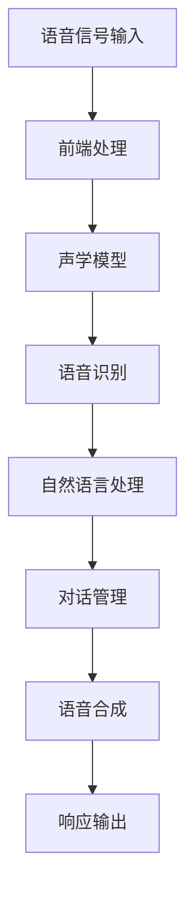

                 

# 《AI在语音识别中的进展：实现自然对话》

> **关键词：** 语音识别、自然对话系统、深度学习、编码器-解码器模型、注意力机制

> **摘要：** 本文将深入探讨人工智能（AI）在语音识别领域的进展，特别是如何通过深度学习和自然对话系统实现自然的语音交互。我们将分析语音识别的基础知识、深度学习模型的应用、自然对话系统的架构和实现，以及语音识别与自然对话系统的融合。最后，我们将展望这一领域的未来发展趋势。

### 《AI在语音识别中的进展：实现自然对话》目录大纲

#### 第一部分：语音识别技术基础

##### 第1章：语音识别概述

###### 1.1 语音识别的基本概念与历史发展

###### 1.2 语音识别的技术框架

###### 1.3 语音识别系统的组成

##### 第2章：语音信号处理

###### 2.1 语音信号的特点与模型

###### 2.2 声学模型

###### 2.3 语言模型

###### 2.4 联合模型与解码算法

#### 第二部分：深度学习在语音识别中的应用

##### 第3章：深度神经网络基础

###### 3.1 神经网络的基本原理

###### 3.2 卷积神经网络（CNN）

###### 3.3 循环神经网络（RNN）

###### 3.4 长短时记忆网络（LSTM）

##### 第4章：语音识别中的深度学习模型

###### 4.1 DNN-HMM模型

###### 4.2 CTC损失函数

###### 4.3 循环神经网络（RNN）在语音识别中的应用

###### 4.4 长短时记忆网络（LSTM）与双向LSTM

##### 第5章：注意力机制与编码器-解码器模型

###### 5.1 注意力机制原理

###### 5.2 编码器-解码器（Encoder-Decoder）模型

###### 5.3 Seq2Seq模型

###### 5.4 注意力机制在语音识别中的应用

#### 第三部分：语音识别系统实现与优化

##### 第6章：语音识别系统的构建

###### 6.1 语音识别系统的设计流程

###### 6.2 语音数据集预处理

###### 6.3 模型训练与评估

###### 6.4 语音识别系统的集成与部署

##### 第7章：语音识别系统优化

###### 7.1 模型压缩与量化

###### 7.2 实时性优化

###### 7.3 跨语言与多语种语音识别

###### 7.4 语音识别系统的持续学习与更新

#### 第四部分：自然对话系统

##### 第8章：自然对话系统概述

###### 8.1 自然对话系统的定义与分类

###### 8.2 自然对话系统的关键技术

###### 8.3 自然对话系统的架构设计

##### 第9章：语音识别与自然对话系统的集成

###### 9.1 语音识别与自然对话系统的协同工作

###### 9.2 语音识别在自然对话系统中的应用

###### 9.3 自然对话系统中的语音生成

###### 9.4 语音识别与自然对话系统的优化策略

##### 第10章：自然对话系统的实际应用

###### 10.1 自然对话系统在智能助手中的应用

###### 10.2 自然对话系统在客户服务中的应用

###### 10.3 自然对话系统在教育中的应用

###### 10.4 自然对话系统在医疗中的应用

#### 第五部分：展望与未来趋势

##### 第11章：语音识别与自然对话系统的未来发展趋势

###### 11.1 技术挑战与机遇

###### 11.2 语音识别与自然对话系统的融合与创新

###### 11.3 产业应用与市场前景

###### 11.4 技术规范与标准化

### 附录

#### 附录A：参考文献与拓展阅读

#### 附录B：常见问题解答

#### 附录C：术语解释与概念对比图

#### 附录D：Mermaid流程图与算法伪代码

#### 附录E：代码实现与实战案例

---

#### 注：

- 每章的内容应根据实际书稿需求进行细化和调整。
- 附录部分可根据实际情况添加或删除。
- 目录中未列出的章节可根据内容需要添加。

---

现在，我们将按照上述目录结构，逐一深入探讨每个章节的内容。让我们首先从语音识别的基础知识开始。 <|user|>## 第一部分：语音识别技术基础

### 第1章：语音识别概述

#### 1.1 语音识别的基本概念与历史发展

语音识别（Automatic Speech Recognition，ASR）是指利用计算机技术对语音信号进行分析、处理和理解，将语音信号转换为对应的文本或命令的过程。这一技术源自于语音信号处理和模式识别领域，随着计算机性能的不断提升和算法的不断创新，语音识别技术已经取得了显著的进展。

语音识别的历史可以追溯到20世纪50年代。早期的语音识别系统主要依赖于手工设计的特征和规则，例如基于音素模型的系统。这些系统在处理简单的语音信号时有一定的效果，但在复杂环境下的表现较差。

进入20世纪80年代，基于统计方法的声学模型和语言模型开始应用于语音识别，使得语音识别的性能得到了显著提升。1990年代以后，随着数字信号处理技术的发展，语音识别系统逐渐采用大规模语音数据库进行训练，性能进一步提高。

#### 1.2 语音识别的技术框架

语音识别系统通常由以下几个主要模块组成：

1. **前端处理（Feature Extraction）**：将语音信号转换为一系列特征向量。常见的特征包括梅尔频率倒谱系数（MFCC）、频谱特征等。

2. **声学模型（Acoustic Model）**：用于模拟语音信号中的声学特性，通常采用隐藏马尔可夫模型（HMM）或深度神经网络（DNN）。

3. **语言模型（Language Model）**：用于模拟语音对应的文本序列的概率分布，通常采用n-gram模型或神经网络语言模型（NNLM）。

4. **解码器（Decoder）**：将声学模型和语言模型结合起来，对语音信号进行解码，生成对应的文本输出。常见的解码算法包括A*搜索算法、G ser算法等。

#### 1.3 语音识别系统的组成

一个完整的语音识别系统通常包括以下几个部分：

1. **麦克风阵列**：用于捕捉语音信号。麦克风阵列可以提供更好的信号质量和噪声抑制能力。

2. **前端处理模块**：对语音信号进行预处理，包括噪声抑制、音频增强等，以提高语音识别的准确性。

3. **声学模型训练模块**：利用大规模语音数据库训练声学模型，以模拟语音信号中的声学特性。

4. **语言模型训练模块**：利用大规模文本语料库训练语言模型，以模拟语音对应的文本序列的概率分布。

5. **解码器模块**：将声学模型和语言模型结合起来，对语音信号进行解码，生成对应的文本输出。

6. **后端处理模块**：对解码结果进行后处理，包括语言错误修正、语气识别等。

#### 1.4 语音识别的应用场景

语音识别技术广泛应用于以下场景：

1. **智能助手**：如苹果的Siri、亚马逊的Alexa等，为用户提供语音交互服务。

2. **客户服务**：自动识别客户的语音请求，提供相应的服务。

3. **智能家居**：通过语音控制家电设备，提高生活便利性。

4. **医疗健康**：记录患者的语音描述，辅助医生进行诊断。

5. **教育和培训**：提供语音教学和训练，提高学习效果。

6. **交通领域**：语音导航、语音控制车辆等，提高驾驶安全。

#### 1.5 语音识别的挑战

尽管语音识别技术已经取得了显著的进展，但仍然面临一些挑战：

1. **多说话人场景**：在多人对话的场景中，如何准确识别每个说话人的语音信号，是一个重要的问题。

2. **噪声干扰**：在嘈杂的环境中，如何有效地抑制噪声，提高语音识别的准确性，是一个挑战。

3. **长语音识别**：对于较长的语音输入，如何保证识别的准确性和效率，是一个需要解决的问题。

4. **跨语言识别**：如何实现跨语言的语音识别，是一个具有挑战性的问题。

5. **实时性**：如何在保证识别准确性的同时，实现实时性，是一个关键的技术难题。

通过深入研究和不断创新，语音识别技术在这些挑战面前不断取得突破，为人工智能领域的发展做出了重要贡献。

### 第2章：语音信号处理

#### 2.1 语音信号的特点与模型

语音信号是一种复杂的非平稳信号，具有以下特点：

1. **幅度变化**：语音信号的幅度在不同时刻会发生变化，反映出声音的强弱。
2. **频率变化**：语音信号的频率成分也会随时间变化，表现为不同的音调和音质。
3. **非线性**：语音信号的生成过程是非线性的，涉及到声带的振动和声道的共振。
4. **短时平稳性**：语音信号在短时间范围内可以认为是平稳的，但在长时间范围内存在变化。

为了有效地处理和分析语音信号，我们需要建立适当的语音信号模型。常见的语音信号模型包括：

1. **线性预测模型（Linear Prediction Model）**：线性预测模型是一种常用的语音信号模型，通过分析语音信号的短时相关性，将其表示为过去几个时刻的加权线性组合。线性预测系数（LPC）是这种模型的关键参数，可用于特征提取。
   
   $$ x(n) = \sum_{i=1}^{p} a_i x(n-i) + e(n) $$

   其中，\(x(n)\) 是第 \(n\) 个采样点处的语音信号，\(a_i\) 是线性预测系数，\(e(n)\) 是残差项。

2. **隐马尔可夫模型（Hidden Markov Model，HMM）**：隐马尔可夫模型是一种统计模型，用于表示语音信号中的状态转移和观测值。在语音识别中，HMM 通常用于建模声学特性，通过状态序列和观测序列之间的映射，实现对语音信号的理解。

3. **高斯混合模型（Gaussian Mixture Model，GMM）**：高斯混合模型是一种用于概率密度函数建模的统计模型，可以用于表示语音信号中的声学特征。在语音识别中，GMM 通常用于生成声学模型的输出概率分布。

#### 2.2 声学模型

声学模型是语音识别系统的核心组成部分，用于模拟语音信号中的声学特性。声学模型的主要任务是估计每个时间点上的语音信号的概率分布。常见的声学模型包括以下几种：

1. **高斯混合模型（GMM）**：高斯混合模型是一种常用的声学模型，通过将语音信号分解为多个高斯分布的线性组合，来表示语音信号的概率分布。

   $$ P(x|θ) = \sum_{i=1}^{k} w_i N(x; μ_i, Σ_i) $$

   其中，\(P(x|θ)\) 是语音信号的概率分布，\(w_i\) 是第 \(i\) 个高斯分布的权重，\(N(x; μ_i, Σ_i)\) 是高斯分布的概率密度函数。

2. **深度神经网络（DNN）**：深度神经网络是一种强大的机器学习模型，可以用于声学模型的建模。DNN 通过多层非线性变换，从语音信号中提取更高级的特征，从而提高语音识别的性能。

3. **卷积神经网络（CNN）**：卷积神经网络在图像处理领域取得了显著的成功，也被应用于语音信号处理。CNN 通过卷积操作和池化操作，有效地提取语音信号中的局部特征。

#### 2.3 语言模型

语言模型是语音识别系统的另一个重要组成部分，用于模拟语音对应的文本序列的概率分布。语言模型的主要任务是估计给定文本序列的概率。常见的语言模型包括以下几种：

1. **n-gram 模型**：n-gram 模型是一种基于统计的语言模型，通过计算连续 \(n\) 个单词（或字符）的联合概率，来估计给定文本序列的概率。

   $$ P(w_1 w_2 \ldots w_n) = \frac{C(w_1 w_2 \ldots w_n)}{C(w_1 w_2 \ldots w_n w_{n+1})} $$

   其中，\(C(w_1 w_2 \ldots w_n)\) 是 \(w_1 w_2 \ldots w_n\) 的出现次数，\(C(w_1 w_2 \ldots w_n w_{n+1})\) 是 \(w_1 w_2 \ldots w_n w_{n+1}\) 的出现次数。

2. **神经网络语言模型（NNLM）**：神经网络语言模型是一种基于深度学习的语言模型，通过学习单词和句子之间的上下文关系，来估计给定文本序列的概率。

3. **递归神经网络（RNN）**：递归神经网络是一种用于处理序列数据的神经网络，可以用于构建语言模型。RNN 通过其记忆机制，可以捕捉到文本序列中的长期依赖关系。

#### 2.4 联合模型与解码算法

联合模型是将声学模型和语言模型结合起来，用于建模语音信号的概率分布。解码算法则用于从语音信号中解码出对应的文本序列。常见的联合模型和解码算法包括：

1. **高斯混合模型-隐马尔可夫模型（GMM-HMM）**：GMM-HMM 是一种将 GMM 作为声学模型，HMM 作为语言模型的联合模型。通过组合声学模型和语言模型，GMM-HMM 可以有效地建模语音信号的概率分布。

2. **深度神经网络-隐马尔可夫模型（DNN-HMM）**：DNN-HMM 是一种将 DNN 作为声学模型，HMM 作为语言模型的联合模型。DNN-HMM 通过 DNN 提取更高级的声学特征，结合 HMM 的状态转移机制，实现高效的语音识别。

3. **贪心解码算法**：贪心解码算法是一种基于概率的解码算法，通过从开始状态到结束状态的最优路径，解码出对应的文本序列。贪心解码算法简单有效，但可能在某些情况下无法找到最优解。

4. **A* 搜索算法**：A* 搜索算法是一种启发式搜索算法，通过结合估价函数和启发式函数，找到从开始状态到结束状态的最优路径。A* 搜索算法在语音识别中具有较高的解码性能。

5. **前向-后向算法**：前向-后向算法是一种基于动态规划的解码算法，通过计算前向概率和后向概率，找到最优解码路径。前向-后向算法在语音识别中具有较好的性能和稳定性。

通过深入研究和不断创新，语音信号处理技术为语音识别系统提供了强大的支持，推动了人工智能领域的发展。

### 第3章：深度神经网络基础

#### 3.1 神经网络的基本原理

神经网络（Neural Networks，NN）是一种模仿生物神经系统的计算模型，它通过模拟人脑神经元之间的连接和相互作用来实现数据分析和决策。神经网络的基本原理可以概括为以下几个方面：

1. **神经元结构**：神经网络的基本单元是神经元，每个神经元由输入层、输出层和内部状态组成。输入层接收外部输入，输出层产生最终输出，内部状态则通过加权求和处理和激活函数的作用，产生神经元的活动。

2. **加权求和处理**：神经元通过加权求和处理来整合输入信息。每个输入值都与一个权重相乘，然后将所有乘积相加，得到神经元的净输入。这个过程可以用以下公式表示：

   $$ z = \sum_{i} w_i x_i $$

   其中，\(z\) 是净输入，\(w_i\) 是权重，\(x_i\) 是输入值。

3. **激活函数**：激活函数是对加权求和处理结果的非线性变换，用于引入非线性特性，使得神经网络能够学习复杂的数据分布。常见的激活函数包括 sigmoid 函数、ReLU 函数和 tanh 函数。

4. **反向传播算法**：反向传播算法（Backpropagation Algorithm）是神经网络训练的核心算法。它通过计算输出误差，反向传播误差信息，更新神经网络的权重和偏置，以达到最小化误差的目的。

#### 3.2 卷积神经网络（CNN）

卷积神经网络（Convolutional Neural Network，CNN）是一种在图像处理领域取得显著成功的神经网络模型。CNN 通过卷积操作和池化操作，有效地提取图像的局部特征，具有很强的特征提取和分类能力。

1. **卷积操作**：卷积操作是一种将小规模的滤波器（也称为卷积核）在输入数据上滑动，计算局部特征的过程。每个卷积核都学习一组特征，通过卷积操作，可以将这些特征整合到一起。卷积操作可以用以下公式表示：

   $$ h_{ij} = \sum_{k} w_{ik} x_{kj} + b_j $$

   其中，\(h_{ij}\) 是输出特征图上的第 \(i\) 行第 \(j\) 列的值，\(w_{ik}\) 是卷积核上的权重，\(x_{kj}\) 是输入特征图上的第 \(k\) 行第 \(j\) 列的值，\(b_j\) 是偏置项。

2. **池化操作**：池化操作是一种对特征图进行下采样的过程，用于减少参数数量和计算复杂度，同时保持重要的特征信息。常见的池化操作包括最大池化和平均池化。

3. **卷积神经网络结构**：卷积神经网络通常由多个卷积层、池化层和全连接层组成。卷积层用于提取图像的局部特征，池化层用于下采样和特征融合，全连接层用于分类和回归任务。

#### 3.3 循环神经网络（RNN）

循环神经网络（Recurrent Neural Network，RNN）是一种在序列数据处理中表现优异的神经网络模型。RNN 通过其递归结构，可以捕捉序列数据中的长期依赖关系。

1. **递归结构**：RNN 的每个时间步都与前一个时间步的隐藏状态相连接，形成一个递归结构。这种结构使得 RNN 能够在处理序列数据时，保留先前的信息。

2. **隐藏状态**：RNN 的隐藏状态是其在处理序列数据时的记忆机制。隐藏状态包含了上一个时间步的信息，并在当前时间步的输出和下一个时间步的输入中发挥作用。

3. **时间步计算**：在 RNN 的每个时间步，输入和隐藏状态通过加权求和处理和激活函数的作用，生成当前时间步的输出和下一个时间步的隐藏状态。这个过程可以用以下公式表示：

   $$ h_t = \sigma(W_h h_{t-1} + W_x x_t + b_h) $$
   $$ y_t = \sigma(W_o h_t + b_o) $$

   其中，\(h_t\) 是第 \(t\) 个时间步的隐藏状态，\(y_t\) 是第 \(t\) 个时间步的输出，\(\sigma\) 是激活函数，\(W_h\)、\(W_x\)、\(W_o\) 是权重矩阵，\(b_h\)、\(b_o\) 是偏置项。

4. **长短期记忆网络（LSTM）**：LSTM 是 RNN 的一种变体，通过引入门控机制，解决了 RNN 在处理长序列数据时容易出现的梯度消失和梯度爆炸问题。LSTM 通过输入门、遗忘门和输出门，有效地控制信息的流动，保留了重要的信息。

#### 3.4 长短时记忆网络（LSTM）

长短时记忆网络（Long Short-Term Memory，LSTM）是一种强大的序列学习模型，特别适用于处理长序列数据。LSTM 通过其独特的门控机制，可以有效地捕捉长期依赖关系。

1. **门控机制**：LSTM 的门控机制包括输入门、遗忘门和输出门。每个门都是一个 sigmoid 函数，其输出范围在 0 到 1 之间，用于控制信息的流动。

   - **输入门**：决定当前输入信息中哪些部分将被更新到单元状态中。
   - **遗忘门**：决定哪些信息应该从单元状态中遗忘。
   - **输出门**：决定单元状态的哪些部分应该被输出。

2. **单元状态**：LSTM 的单元状态 \(s_t\) 是其核心部分，用于存储和传递信息。单元状态通过输入门和遗忘门的作用，可以有效地更新和遗忘信息。

3. **计算过程**：

   - **遗忘门计算**：遗忘门 \(f_t\) 决定哪些信息应该从单元状态 \(s_{t-1}\) 中遗忘。
     $$ f_t = \sigma(W_f [h_{t-1}, x_t] + b_f) $$

   - **输入门计算**：输入门 \(i_t\) 决定哪些新的信息应该被更新到单元状态中。
     $$ i_t = \sigma(W_i [h_{t-1}, x_t] + b_i) $$

   - **新的单元状态计算**：新的单元状态 \(s_t^'\) 是通过遗忘门和输入门的作用，结合遗忘的部分和新的信息。
     $$ s_t^' = \text{tanh}(W_s [f_t \odot s_{t-1} + i_t \odot x_t] + b_s) $$

   - **输出门计算**：输出门 \(o_t\) 决定单元状态的哪些部分应该被输出。
     $$ o_t = \sigma(W_o [h_{t-1}, s_t^'] + b_o) $$

   - **最终输出**：最终的输出 \(h_t\) 是通过输出门和单元状态 \(s_t^'\) 的作用得到的。
     $$ h_t = o_t \odot \text{tanh}(s_t^') $$

通过引入门控机制，LSTM 可以有效地控制信息的流动，避免了梯度消失和梯度爆炸问题，使得其在处理长序列数据时表现出色。

#### 3.5 深度神经网络在语音识别中的应用

深度神经网络在语音识别中发挥了重要作用，特别是在声学模型的建模和特征提取方面。以下是一些深度神经网络在语音识别中的应用：

1. **深度神经网络-隐马尔可夫模型（DNN-HMM）**：DNN-HMM 是一种结合了深度神经网络和隐马尔可夫模型的语音识别框架。DNN 用于提取语音信号的高级特征，HMM 用于建模语音信号的状态转移和观测值。DNN-HMM 在语音识别中取得了显著的性能提升。

2. **循环神经网络（RNN）在语音识别中的应用**：RNN 是一种适用于序列数据的神经网络模型，可以用于语音识别中的声学模型和语言模型的建模。RNN 通过其递归结构，可以捕捉语音信号中的长期依赖关系。

3. **长短时记忆网络（LSTM）与语音识别**：LSTM 是 RNN 的一种变体，通过其门控机制，可以有效地处理长序列数据。LSTM 在语音识别中的应用，特别是在处理长语音和长文本序列时，表现出色。

4. **编码器-解码器模型与语音识别**：编码器-解码器模型是一种用于序列到序列学习的问题，可以用于语音识别中的声学模型和语言模型的建模。编码器-解码器模型通过其注意力机制，可以有效地处理语音信号和文本序列之间的复杂对应关系。

通过深度神经网络在语音识别中的应用，语音识别系统在准确性和效率方面都取得了显著的提升。未来，随着深度学习技术的不断发展，语音识别技术将继续改进和优化，为人工智能领域的发展做出更大的贡献。

### 第4章：语音识别中的深度学习模型

深度学习模型在语音识别中的应用大大提升了系统的准确性和效率。本章将详细探讨深度学习模型在语音识别中的几种重要应用，包括DNN-HMM模型、CTC损失函数、RNN及其在语音识别中的应用、LSTM与双向LSTM。

#### 4.1 DNN-HMM模型

深度神经网络-隐马尔可夫模型（DNN-HMM）是一种结合了深度学习和传统统计方法的语音识别框架。DNN-HMM 的核心思想是将深度神经网络用于特征提取，而隐马尔可夫模型用于状态转移和观测建模。

1. **DNN-HMM模型的工作原理**：

   - **深度神经网络（DNN）**：DNN 用于从原始语音信号中提取高级特征。与传统的手工特征相比，DNN 可以自动学习更复杂的特征表示，从而提高识别准确性。
   
   $$ f_t = \sigma(\text{DNN}(x_t)) $$

   - **隐马尔可夫模型（HMM）**：HMM 用于建模语音信号的状态转移和观测值。HMM 通过状态序列和观测序列之间的映射，实现对语音信号的理解。

   $$ P(o_t|s_t) = P(o_t|\theta) $$

   - **联合模型**：DNN-HMM 通过联合模型的框架，将DNN和HMM结合起来，实现语音识别。联合模型可以表示为：

   $$ P(o_t|s_t, \theta) = P(s_t|\theta) P(o_t|s_t, \theta) $$

2. **DNN-HMM模型的优点**：

   - **特征自动提取**：DNN 自动从原始语音信号中提取高级特征，减少了人工特征设计的工作量。
   - **性能提升**：DNN-HMM 在多个语音识别任务上取得了显著的性能提升，特别是在长语音识别和多说话人识别方面。
   - **适用性广泛**：DNN-HMM 可以应用于多种语音识别场景，包括语音识别、语音合成和语音生成。

3. **DNN-HMM模型的挑战**：

   - **计算复杂度**：DNN 的训练和推理过程计算复杂度较高，对硬件资源有较高要求。
   - **数据需求**：DNN 的训练需要大量的语音数据，数据质量和数量对模型性能有重要影响。

#### 4.2 CTC损失函数

卷积神经网络-隐马尔可夫模型（CTC）是一种专门用于序列分类问题的深度学习模型，广泛应用于语音识别。CTC 通过将时间轴上的任意映射到输出序列，解决了传统语音识别中的解码问题。

1. **CTC损失函数的定义**：

   - **CTC损失函数**：CTC损失函数是一种针对序列分类问题的损失函数，其目标是最小化输出序列与目标序列之间的编辑距离。编辑距离是指将一个序列转换为另一个序列所需的最小编辑次数，包括插入、删除和替换操作。

   $$ L(c, t) = \sum_{i=1}^{T_c} \sum_{j=1}^{T_t} D(c_i, t_j) $$

   其中，\(c\) 是输出序列，\(t\) 是目标序列，\(D(c_i, t_j)\) 是 \(c_i\) 和 \(t_j\) 之间的编辑距离。

2. **CTC模型的工作原理**：

   - **编码器（Encoder）**：编码器将输入序列映射到一个高维空间，生成一个连续的向量表示。
   
   $$ h_t = \text{Encoder}(x_1, x_2, \ldots, x_T) $$

   - **解码器（Decoder）**：解码器通过计算编辑距离，将编码器的输出序列映射到输出文本序列。

   $$ \hat{t} = \text{Decoder}(h_1, h_2, \ldots, h_T) $$

3. **CTC模型的优点**：

   - **无需显式解码**：CTC 模型通过编辑距离计算实现了自动解码，避免了传统解码算法中的复杂过程。
   - **时间轴对齐**：CTC 模型能够处理任意时间轴对齐的输入输出序列，提高了模型的泛化能力。
   - **灵活性**：CTC 模型可以应用于多种序列分类问题，包括语音识别、手写体识别和图像分类。

4. **CTC模型的挑战**：

   - **训练效率**：CTC 模型的训练过程可能需要较长时间，尤其是对于大型数据集和复杂的网络结构。
   - **优化问题**：CTC 模型的优化问题较为复杂，需要有效的优化策略以提高训练效率。

#### 4.3 循环神经网络（RNN）在语音识别中的应用

循环神经网络（RNN）是一种能够处理序列数据的神经网络，其在语音识别中的应用主要体现在声学模型的建模和特征提取。

1. **RNN在声学模型中的应用**：

   - **声学特征提取**：RNN 可以从原始语音信号中提取时间序列特征，如能量、频率和短时傅里叶变换（STFT）特征。
   
   $$ h_t = \text{RNN}(h_{t-1}, x_t) $$

   - **状态转移和观测建模**：RNN 的递归结构使其能够捕捉语音信号中的长期依赖关系，从而提高识别准确性。

2. **RNN在语音识别中的挑战**：

   - **梯度消失和梯度爆炸**：RNN 在训练过程中容易受到梯度消失和梯度爆炸问题的影响，导致训练困难。
   - **长期依赖关系**：RNN 难以捕捉序列数据中的长期依赖关系，特别是在长语音识别任务中。

3. **RNN的变体**：

   - **长短时记忆网络（LSTM）**：LSTM 是 RNN 的一种变体，通过引入门控机制，解决了 RNN 在处理长序列数据时容易出现的梯度消失和梯度爆炸问题。
   - **门控循环单元（GRU）**：GRU 是 RNN 的另一种变体，通过简化 LSTM 的结构，提高了训练效率。

#### 4.4 长短时记忆网络（LSTM）与双向LSTM

长短时记忆网络（LSTM）是一种能够处理长序列数据的循环神经网络，其在语音识别中的应用非常广泛。

1. **LSTM的基本原理**：

   - **门控机制**：LSTM 通过门控机制（输入门、遗忘门和输出门）控制信息的流动，避免了梯度消失和梯度爆炸问题。
   
   $$ f_t = \sigma(W_f [h_{t-1}, x_t] + b_f) $$
   $$ i_t = \sigma(W_i [h_{t-1}, x_t] + b_i) $$
   $$ \bar{c}_t = \text{tanh}(W_c [f_t \odot h_{t-1} + i_t \odot x_t] + b_c) $$
   $$ o_t = \sigma(W_o [h_{t-1}, \bar{c}_t] + b_o) $$
   $$ h_t = o_t \odot \text{tanh}(\bar{c}_t) $$

2. **LSTM在语音识别中的应用**：

   - **声学特征提取**：LSTM 可以从原始语音信号中提取时间序列特征，提高识别准确性。
   - **语言模型**：LSTM 可以用于构建语音识别的语言模型，捕捉语音信号和文本序列之间的复杂对应关系。

3. **双向LSTM**：

   - **双向LSTM（BLSTM）**：BLSTM 是 LSTM 的双向版本，通过同时考虑前向和后向的隐藏状态，可以更好地捕捉序列数据中的长期依赖关系。

   $$ h_{t,f} = \text{LSTM}(h_{t-1,f}, x_t) $$
   $$ h_{t,b} = \text{LSTM}(h_{t-1,b}, x_t) $$
   $$ h_t = [h_{t,f}; h_{t,b}] $$

4. **LSTM的挑战**：

   - **计算复杂度**：LSTM 的训练和推理过程计算复杂度较高，需要较多的计算资源。
   - **参数数量**：LSTM 的参数数量较大，可能导致过拟合。

#### 4.5 LSTM与双向LSTM在语音识别中的表现

LSTM 和双向LSTM 在语音识别中表现出色，特别是在长语音识别和复杂语音信号处理方面。

1. **长语音识别**：LSTM 和双向LSTM 可以有效地处理长语音信号，避免了传统 RNN 在长序列数据上表现不佳的问题。

2. **复杂语音信号处理**：LSTM 和双向LSTM 可以从原始语音信号中提取高级特征，提高识别准确性。

3. **性能对比**：在实际应用中，LSTM 和双向LSTM 通常在多个语音识别任务中取得了优于传统方法的性能。

通过深入研究和应用深度学习模型，语音识别系统在准确性和效率方面取得了显著提升。未来，随着深度学习技术的不断发展，语音识别技术将继续优化和改进，为人工智能领域的发展做出更大的贡献。

### 第5章：注意力机制与编码器-解码器模型

注意力机制（Attention Mechanism）是深度学习领域的一种重要技术，尤其在序列到序列（Seq2Seq）任务中表现尤为突出。编码器-解码器（Encoder-Decoder）模型是一种用于处理序列数据的框架，而注意力机制则用于增强编码器和解码器之间的交互，提高模型的性能。本章将详细介绍注意力机制的基本原理、编码器-解码器模型及其在语音识别中的应用。

#### 5.1 注意力机制原理

注意力机制通过将焦点集中在序列的特定部分，提高了模型处理序列数据的能力。注意力机制的核心思想是，在解码过程中，每个时间步的输出不仅依赖于当前的输入，还依赖于编码器输出的历史信息。这样，模型可以在处理序列数据时，动态地调整对输入和编码器输出的关注程度，从而更好地捕捉序列中的依赖关系。

1. **注意力机制的数学表达**：

   - **软注意力**：软注意力通过计算一个权重系数，来表示解码器在当前时间步对编码器输出的关注程度。常见的软注意力模型包括点积注意力、加性注意力和对数正则化注意力。

     $$ a_t = \text{Attention}(h_t, h^{\prime}) = \text{softmax}\left(\frac{\text{ Scores}(h_t, h^{\prime})}{\text{ Scale}}\right) $$
     $$ s_t = \sum_{i=1}^{N} a_{it} h_i^{\prime} $$

     其中，\(h_t\) 是解码器在时间步 \(t\) 的隐藏状态，\(h^{\prime}\) 是编码器输出的历史状态，\(a_t\) 是注意力权重，\(s_t\) 是加权求和后的状态。

   - **硬注意力**：硬注意力通过直接选择编码器输出的某个部分作为当前时间步的输入，而不是计算权重系数。硬注意力通常在计算成本较高或需要实时处理的情况下使用。

2. **注意力机制的优点**：

   - **提高序列匹配能力**：注意力机制可以更好地捕捉序列之间的依赖关系，提高模型在序列匹配任务中的性能。
   - **减少长距离依赖问题**：注意力机制可以动态地调整对输入和编码器输出的关注程度，减少长距离依赖问题，提高模型在处理长序列数据时的性能。
   - **增强交互能力**：注意力机制可以增强编码器和解码器之间的交互，提高模型的整体性能。

3. **注意力机制的挑战**：

   - **计算复杂度**：注意力机制的引入通常会增加模型的计算复杂度，特别是在大规模数据集和复杂的网络结构中。
   - **存储需求**：注意力机制需要存储大量的权重矩阵，增加了模型的存储需求。

#### 5.2 编码器-解码器（Encoder-Decoder）模型

编码器-解码器模型是一种用于处理序列到序列（Seq2Seq）任务的框架，广泛应用于机器翻译、语音识别和图像描述生成等领域。编码器-解码器模型的基本思想是将输入序列编码为一个固定长度的向量表示，然后通过解码器将这个向量表示解码为输出序列。

1. **编码器（Encoder）**：

   - **功能**：编码器的功能是将输入序列编码为一个固定长度的向量表示，称为编码状态向量（Code Sequence）。
   
   $$ \text{Code Sequence} = \text{Encoder}(\text{Input Sequence}) $$

   - **实现**：编码器通常是一个循环神经网络（RNN）或卷积神经网络（CNN），可以捕获输入序列的长期依赖关系。

2. **解码器（Decoder）**：

   - **功能**：解码器的功能是将编码状态向量解码为输出序列。在解码过程中，解码器会逐个生成输出序列的每个时间步。
   
   $$ \text{Output Sequence} = \text{Decoder}(\text{Code Sequence}) $$

   - **实现**：解码器通常也是一个循环神经网络（RNN）或卷积神经网络（CNN），可以使用注意力机制来增强编码器和解码器之间的交互。

3. **编码器-解码器模型的工作原理**：

   - **编码阶段**：编码器处理输入序列，将其编码为一个编码状态向量。
   - **解码阶段**：解码器利用编码状态向量生成输出序列。在解码的每个时间步，解码器会根据当前生成的输出和编码状态向量，生成下一个输出。

   $$ y_t = \text{Decoder}(h_t, \text{Code Sequence}) $$

4. **编码器-解码器模型的优点**：

   - **灵活性**：编码器-解码器模型可以处理不同长度的输入和输出序列，具有很好的灵活性。
   - **模块化**：编码器和解码器可以独立设计和训练，提高了模型的模块化程度。
   - **高效性**：编码器-解码器模型可以捕获输入序列和输出序列之间的复杂依赖关系，提高了模型的性能。

5. **编码器-解码器模型的挑战**：

   - **计算复杂度**：编码器-解码器模型的训练和推理过程计算复杂度较高，特别是在使用注意力机制时。
   - **数据需求**：编码器-解码器模型需要大量的训练数据来保证模型的性能。

#### 5.3 Seq2Seq模型

Seq2Seq模型是一种基于编码器-解码器模型的序列到序列学习框架，广泛应用于机器翻译、语音识别和图像描述生成等领域。

1. **Seq2Seq模型的基本原理**：

   - **输入序列编码**：编码器将输入序列编码为一个固定长度的编码状态向量。
   - **解码序列生成**：解码器利用编码状态向量生成输出序列。在解码的每个时间步，解码器会根据当前生成的输出和编码状态向量，生成下一个输出。

2. **Seq2Seq模型的实现**：

   - **编码器**：编码器通常是一个循环神经网络（RNN）或卷积神经网络（CNN），可以捕获输入序列的长期依赖关系。
   - **解码器**：解码器也是一个循环神经网络（RNN）或卷积神经网络（CNN），可以使用注意力机制来增强编码器和解码器之间的交互。

3. **Seq2Seq模型的应用**：

   - **机器翻译**：Seq2Seq模型被广泛应用于机器翻译任务，通过将源语言序列编码为编码状态向量，然后解码为目标语言序列。
   - **语音识别**：Seq2Seq模型可以用于语音识别任务，通过将语音信号编码为编码状态向量，然后解码为对应的文本序列。
   - **图像描述生成**：Seq2Seq模型可以用于图像描述生成任务，通过将图像编码为编码状态向量，然后解码为对应的文本描述。

#### 5.4 注意力机制在语音识别中的应用

注意力机制在语音识别中的应用显著提升了模型的性能，特别是在长语音识别和复杂语音信号处理方面。

1. **注意力机制在声学特征提取中的应用**：

   - **声学特征编码**：编码器将输入的声学特征序列编码为编码状态向量，用于后续的解码过程。
   - **注意力机制应用**：解码器在解码的每个时间步使用注意力机制，动态地关注编码状态向量中的特定部分，从而提高解码过程的准确性。

2. **注意力机制在文本序列解码中的应用**：

   - **文本序列生成**：解码器根据编码状态向量和当前生成的文本序列，生成下一个文本输出。
   - **注意力机制应用**：解码器在生成每个文本输出时，使用注意力机制来关注编码状态向量中的相关信息，从而提高解码过程的连贯性和准确性。

3. **注意力机制在多说话人识别中的应用**：

   - **多说话人识别**：在多说话人识别任务中，注意力机制可以帮助模型更好地处理多个说话人的语音信号。
   - **注意力机制应用**：模型在解码过程中，使用注意力机制来关注不同说话人的语音信号，从而提高识别准确性。

通过引入注意力机制，编码器-解码器模型在语音识别中取得了显著的性能提升。未来，随着深度学习技术的不断发展，注意力机制和编码器-解码器模型将在语音识别领域发挥更加重要的作用。

### 第6章：语音识别系统的构建

构建一个高性能的语音识别系统需要考虑多个关键环节，包括设计流程、语音数据集预处理、模型训练与评估，以及系统的集成与部署。以下将详细探讨这些环节，并介绍一些实用技巧。

#### 6.1 语音识别系统的设计流程

一个完整的语音识别系统设计流程通常包括以下步骤：

1. **需求分析**：明确系统需要满足的功能和要求，如识别准确率、实时性、支持的语言和方言等。
2. **系统架构设计**：根据需求分析，设计系统的整体架构，包括前端采集、信号处理、声学模型、语言模型和解码器等模块。
3. **算法选择**：选择适合的声学模型和语言模型算法，如深度神经网络（DNN）、循环神经网络（RNN）、长短时记忆网络（LSTM）等。
4. **模型训练**：根据设计好的架构和算法，准备训练数据集，对声学模型和语言模型进行训练。
5. **模型评估**：在测试数据集上评估模型的性能，包括识别准确率、错误率等指标。
6. **系统集成与部署**：将训练好的模型集成到系统中，并进行测试和优化，确保系统能够在实际环境中稳定运行。

#### 6.2 语音数据集预处理

预处理语音数据是构建语音识别系统的重要步骤，以下是一些关键预处理任务：

1. **语音信号降噪**：去除语音信号中的噪声，提高语音质量。常用的降噪方法包括谱减法、维纳滤波和自适应滤波等。
2. **信号增强**：对语音信号进行增强处理，以提高语音的可辨度。常用的增强方法包括噪声掩蔽和频谱平衡等。
3. **端点检测（VAD）**：通过检测语音信号中的静音段，去除无效的静音部分，提高处理效率。常用的端点检测算法包括基于能量的端点检测和基于音高检测的端点检测。
4. **分帧与加窗**：将连续的语音信号分成短时的帧，并对每一帧进行加窗处理，以提取语音特征。常用的加窗函数包括汉明窗、汉宁窗和矩形窗等。
5. **特征提取**：从语音帧中提取特征向量，如梅尔频率倒谱系数（MFCC）、滤波器组（Filter Banks）和频谱特征等。

#### 6.3 模型训练与评估

模型训练和评估是语音识别系统构建的核心环节，以下是一些关键步骤和技巧：

1. **数据集准备**：准备足够大的训练数据和测试数据，确保模型的泛化能力。训练数据应包括多种说话人、语音环境和语音类型。
2. **模型选择**：选择适合的深度学习模型，如卷积神经网络（CNN）、循环神经网络（RNN）和长短时记忆网络（LSTM）等。可以根据任务需求，组合不同的模型结构。
3. **超参数调整**：调整模型训练过程中的超参数，如学习率、批次大小、正则化参数等，以优化模型性能。常用的超参数优化方法包括网格搜索和随机搜索等。
4. **训练过程**：使用训练数据对模型进行训练，同时监测训练过程中的损失函数和性能指标，如准确率、错误率等。通过调整训练策略，如学习率衰减和批次归一化等，提高模型性能。
5. **模型评估**：在测试数据集上评估模型的性能，通过交叉验证和混淆矩阵等工具，全面分析模型的表现。根据评估结果，对模型进行调整和优化。
6. **持续学习**：在模型部署后，根据实际应用中的反馈，对模型进行持续学习和优化，以提高模型的适应性和鲁棒性。

#### 6.4 语音识别系统的集成与部署

语音识别系统的集成与部署是确保系统能够在实际环境中稳定运行的关键步骤，以下是一些关键步骤和注意事项：

1. **硬件配置**：根据系统的需求和规模，选择合适的硬件配置，包括处理器、内存、硬盘和网络设备等。
2. **软件环境**：配置适合的软件环境，包括操作系统、编译器、深度学习框架等，确保系统能够顺利运行。
3. **系统集成**：将模型、前端采集和后端处理模块集成到系统中，确保各个模块之间的协同工作。
4. **测试与优化**：在部署前进行全面的测试，包括功能测试、性能测试和稳定性测试等，确保系统能够满足需求。
5. **部署策略**：制定合理的部署策略，包括部署环境的选择、部署过程的监控和故障恢复机制等，确保系统的高可用性和可靠性。
6. **用户培训与支持**：为用户提供培训和技术支持，确保用户能够正确使用和操作语音识别系统。

通过以上步骤和技巧，可以构建一个高效、稳定和可靠的语音识别系统，为人工智能应用提供强有力的支持。

### 第7章：语音识别系统优化

为了实现高效的语音识别系统，优化系统性能是一个关键环节。本章将探讨语音识别系统在多个方面的优化策略，包括模型压缩与量化、实时性优化、跨语言与多语种语音识别，以及语音识别系统的持续学习与更新。

#### 7.1 模型压缩与量化

模型压缩与量化是提升语音识别系统性能的重要方法，尤其在资源受限的环境下（如移动设备和嵌入式系统）。

1. **模型压缩**：

   - **网络剪枝**：通过剪枝神经网络中不重要的连接和神经元，减少模型的参数数量，从而降低计算复杂度和存储需求。常用的剪枝方法包括权重剪枝、结构剪枝和层次剪枝。
   
   - **低秩分解**：将高秩矩阵分解为低秩矩阵，减少模型的维度和参数数量。低秩分解可以通过奇异值分解（SVD）或正交矩阵分解（QR）实现。
   
   - **知识蒸馏**：使用一个较大的“教师”模型训练一个较小的“学生”模型，通过传递知识来提高“学生”模型的性能。知识蒸馏方法包括软标签、硬标签和分层蒸馏等。

2. **模型量化**：

   - **整数量化**：将浮点数参数转换为整数，减少模型的存储和计算需求。整数量化可以通过最小化误差的方法（如直方图量化、最近邻量化）实现。
   
   - **量化感知训练**：在训练过程中逐步引入量化操作，使模型能够适应量化的影响。量化感知训练可以在不显著影响模型性能的情况下，提高模型的量化性能。

3. **优化效果**：

   - **降低计算复杂度**：模型压缩与量化可以显著降低语音识别系统的计算复杂度，提高处理速度。
   - **减少存储需求**：通过减少模型的参数数量和存储大小，模型压缩与量化可以降低系统的存储需求，便于部署在资源受限的设备上。
   - **提高能效**：模型压缩与量化可以减少系统的功耗，提高能效比。

#### 7.2 实时性优化

实时性优化是确保语音识别系统能够在实时应用中高效运行的关键。

1. **加速算法**：

   - **并行计算**：通过多核处理器和GPU加速计算，提高模型的推理速度。并行计算可以显著减少模型的处理时间。
   
   - **算法优化**：通过优化算法的实现，减少计算时间和内存占用。常用的优化方法包括矩阵运算优化、向量化操作和内存池化等。

2. **缓存策略**：

   - **数据缓存**：通过缓存常用数据，减少重复计算和数据传输时间。数据缓存可以显著提高系统的处理速度。
   
   - **模型缓存**：通过缓存训练好的模型参数，减少模型加载时间。模型缓存可以快速启动系统，提高实时性。

3. **硬件加速**：

   - **FPGA**：使用现场可编程门阵列（FPGA）进行硬件加速，可以大幅提高语音识别系统的处理速度和能效比。
   
   - **ASIC**：设计专用集成电路（ASIC）来加速语音识别模型的计算，可以进一步降低功耗和提升性能。

4. **优化效果**：

   - **提高响应速度**：实时性优化可以显著提高语音识别系统的响应速度，满足实时应用的需求。
   - **降低延迟**：通过减少处理时间和延迟，优化系统在实时交互中的应用体验。
   - **提高吞吐量**：实时性优化可以提高系统的吞吐量，支持更多用户同时使用语音识别服务。

#### 7.3 跨语言与多语种语音识别

跨语言与多语种语音识别是语音识别系统在实际应用中的重要挑战，以下是一些优化策略：

1. **多语言模型训练**：

   - **共享模型**：通过训练一个共享的声学模型和语言模型，支持多种语言。共享模型可以共享参数，减少计算和存储需求。
   
   - **多语言数据集**：使用包含多种语言的训练数据集，对模型进行多语言训练，提高模型在不同语言环境下的性能。

2. **语言自适应**：

   - **自适应声学模型**：通过动态调整声学模型，以适应不同语言的特征。自适应声学模型可以通过迁移学习和在线学习实现。
   
   - **自适应语言模型**：通过动态调整语言模型，以适应不同语言的统计特性。自适应语言模型可以通过加权 n-gram 模型和自适应语言模型更新实现。

3. **多语言解码策略**：

   - **多语言解码器**：通过训练多语言解码器，支持多种语言的解码。多语言解码器可以通过融合不同语言的解码结果，提高多语言识别的准确性。
   
   - **多语言上下文**：通过捕捉不同语言之间的上下文关系，提高多语言识别的性能。多语言上下文可以通过跨语言词嵌入和翻译模型实现。

4. **优化效果**：

   - **提高跨语言识别性能**：通过多语言模型训练和自适应策略，显著提高跨语言语音识别的准确性。
   - **降低多语种识别误差**：通过多语言解码器和上下文捕捉，降低多语种语音识别的误差率。
   - **提升用户体验**：通过优化跨语言与多语种识别性能，提升语音识别系统在不同语言环境下的用户体验。

#### 7.4 语音识别系统的持续学习与更新

持续学习与更新是确保语音识别系统在动态环境中保持高性能的关键。

1. **在线学习**：

   - **实时数据更新**：通过实时收集用户数据，对模型进行在线更新，以适应新的语音信号和用户需求。
   
   - **增量学习**：通过增量学习，仅对模型中的一部分参数进行更新，减少计算时间和存储需求。增量学习可以通过梯度下降和随机梯度下降实现。

2. **迁移学习**：

   - **预训练模型**：使用预训练模型，将知识从其他领域或任务迁移到语音识别任务中，提高模型的泛化能力。
   
   - **微调**：在预训练模型的基础上，对特定任务进行微调，以提高模型的性能。微调可以通过调整模型权重和训练策略实现。

3. **模型更新策略**：

   - **定期更新**：定期更新模型，以适应新的语音信号和环境变化。定期更新可以通过定期数据采集和模型重训练实现。
   
   - **自适应更新**：根据系统的性能指标和用户反馈，动态调整更新策略，以提高系统的鲁棒性和准确性。

4. **优化效果**：

   - **提升模型适应性**：通过持续学习和更新，提高模型在动态环境中的适应能力，保持高性能。
   - **降低误差率**：通过在线学习和迁移学习，降低模型在特定场景下的误差率，提高识别准确性。
   - **提高用户体验**：通过持续学习和更新，确保语音识别系统在多种应用场景下的稳定性和可靠性，提升用户体验。

通过以上优化策略，语音识别系统可以在多个方面得到显著提升，从而更好地满足实际应用的需求。

### 第8章：自然对话系统概述

自然对话系统（Natural Language Understanding，NLU）是一种人工智能技术，旨在使计算机能够理解和解释人类的自然语言输入。自然对话系统广泛应用于智能助手、客户服务、智能家居等领域，其核心目标是实现人与机器之间的自然对话。本章将详细介绍自然对话系统的定义与分类、关键技术以及架构设计。

#### 8.1 自然对话系统的定义与分类

自然对话系统是一种能够理解和处理人类自然语言输入的计算机系统，旨在实现人与机器之间的自然对话。根据系统功能和实现方式，自然对话系统可以大致分为以下几类：

1. **任务型对话系统**：任务型对话系统主要关注用户意图的理解和任务的完成。这类系统通常针对特定任务设计，如查询信息、订购商品、安排行程等。任务型对话系统通常采用规则驱动或机器学习的方法，通过自然语言处理技术（如词法分析、句法分析、语义分析）来解析用户输入，并生成相应的响应。

2. **闲聊型对话系统**：闲聊型对话系统旨在模拟人类的闲聊互动，提供娱乐、陪伴、情感支持等服务。这类系统通常采用基于知识图谱和机器学习的方法，通过理解用户输入的情感和上下文，生成相应的对话内容。

3. **混合型对话系统**：混合型对话系统结合了任务型和闲聊型的特点，能够处理多种类型的对话场景。这类系统通常采用多模态交互技术，融合语音、文本、图像等多种输入和输出方式，以提高用户体验和系统的灵活性。

#### 8.2 自然对话系统的关键技术

自然对话系统的实现依赖于多种关键技术的结合，包括自然语言处理（NLP）、语音识别（ASR）、语音合成（TTS）、对话管理（DM）和用户行为分析等。

1. **自然语言处理（NLP）**：自然语言处理是自然对话系统的核心技术，用于理解和处理自然语言输入。NLP技术包括词法分析、句法分析、语义分析、情感分析和命名实体识别等。词法分析用于将文本分解为单词和短语；句法分析用于构建句子结构；语义分析用于理解句子含义；情感分析用于识别文本中的情感倾向；命名实体识别用于识别文本中的特定实体。

2. **语音识别（ASR）**：语音识别技术用于将语音信号转换为文本。语音识别系统通常包括声学模型和语言模型。声学模型用于模拟语音信号中的声学特性；语言模型用于模拟语音对应的文本序列的概率分布。通过结合声学模型和语言模型，语音识别系统能够将语音信号解码为对应的文本。

3. **语音合成（TTS）**：语音合成技术用于将文本转换为自然流畅的语音。语音合成系统通常包括文本到语音（TTS）转换模型和语音合成引擎。文本到语音（TTS）转换模型用于将文本转换为语音特征参数；语音合成引擎用于生成自然流畅的语音。通过结合文本到语音（TTS）转换模型和语音合成引擎，语音合成系统能够将文本转换为自然流畅的语音输出。

4. **对话管理（DM）**：对话管理技术用于控制对话流程，管理对话状态和用户意图。对话管理系统通常包括意图识别、对话状态跟踪和响应生成等模块。意图识别用于识别用户的意图；对话状态跟踪用于记录对话过程中的上下文信息；响应生成用于生成自然的对话响应。通过结合意图识别、对话状态跟踪和响应生成模块，对话管理系统能够控制对话流程，实现自然对话。

5. **用户行为分析**：用户行为分析技术用于理解用户的行为和偏好，以优化对话系统的用户体验。用户行为分析包括用户兴趣识别、行为预测和个性化推荐等。通过分析用户的历史行为和反馈，用户行为分析技术能够识别用户的兴趣和偏好，生成个性化的对话内容。

#### 8.3 自然对话系统的架构设计

自然对话系统的架构设计是确保系统高效、稳定和灵活运行的关键。一个典型的自然对话系统通常包括以下几个主要模块：

1. **语音输入模块**：语音输入模块负责接收用户的语音输入，通常包括麦克风阵列、语音信号预处理和声学模型等组件。麦克风阵列用于捕捉用户的语音信号；语音信号预处理用于去除噪声和增强语音信号；声学模型用于将语音信号转换为文本。

2. **自然语言处理（NLP）模块**：自然语言处理模块负责对语音输入进行文本解析，通常包括词法分析、句法分析、语义分析和情感分析等组件。词法分析用于将文本分解为单词和短语；句法分析用于构建句子结构；语义分析用于理解句子含义；情感分析用于识别文本中的情感倾向。

3. **对话管理（DM）模块**：对话管理模块负责控制对话流程，管理对话状态和用户意图，通常包括意图识别、对话状态跟踪和响应生成等组件。意图识别用于识别用户的意图；对话状态跟踪用于记录对话过程中的上下文信息；响应生成用于生成自然的对话响应。

4. **语音输出模块**：语音输出模块负责将文本响应转换为自然流畅的语音输出，通常包括文本到语音（TTS）转换模型和语音合成引擎等组件。文本到语音（TTS）转换模型用于将文本转换为语音特征参数；语音合成引擎用于生成自然流畅的语音。

5. **用户行为分析模块**：用户行为分析模块负责分析用户的行为和偏好，以优化对话系统的用户体验，通常包括用户兴趣识别、行为预测和个性化推荐等组件。通过分析用户的历史行为和反馈，用户行为分析模块能够识别用户的兴趣和偏好，生成个性化的对话内容。

通过以上模块的协同工作，自然对话系统能够实现高效、稳定和灵活的自然对话交互，为用户提供卓越的体验。

### 第9章：语音识别与自然对话系统的集成

在构建一个高效的语音识别与自然对话系统时，需要将语音识别和自然对话系统的各个组件有效地集成和协同工作。本章将详细介绍语音识别与自然对话系统的协同工作原理，语音识别在自然对话系统中的应用，自然对话系统中的语音生成，以及语音识别与自然对话系统的优化策略。

#### 9.1 语音识别与自然对话系统的协同工作

语音识别与自然对话系统的协同工作是确保系统能够准确理解用户语音并生成合适响应的关键。以下是协同工作的几个关键环节：

1. **集成架构**：

   - **前后端分离**：语音识别与自然对话系统的前后端分离，使得系统能够灵活扩展和升级。前端负责语音信号的采集和预处理，后端负责语音识别和对话管理。
   - **模块化设计**：系统采用模块化设计，各个模块（如语音识别、自然语言处理、对话管理、语音合成）可以独立开发、测试和部署，提高了系统的可维护性和可扩展性。

2. **数据流处理**：

   - **实时语音处理**：语音识别系统实时接收用户的语音输入，将其转换为文本。自然对话系统根据文本输入进行意图识别、对话状态跟踪和响应生成。
   - **多轮对话处理**：在多轮对话中，系统需要记录对话历史和上下文信息，以便在后续对话中做出更准确的响应。通过对话管理模块，系统能够处理复杂的多轮对话场景。

3. **协同优化**：

   - **联合训练**：通过联合训练语音识别和自然对话系统的各个模块，可以提升系统的整体性能。例如，在训练语音识别模型时，同时考虑对话管理和意图识别的需求，提高模型的识别准确性。
   - **动态调整**：系统根据实时用户反馈和对话性能，动态调整模型参数和策略，以适应不同的对话场景和用户需求。

#### 9.2 语音识别在自然对话系统中的应用

语音识别在自然对话系统中发挥着重要作用，以下是一些关键应用场景：

1. **意图识别**：

   - **用户指令理解**：语音识别系统将用户的语音输入转换为文本，自然对话系统通过文本分析用户意图，如查询信息、请求服务、进行对话等。
   - **情感分析**：通过情感分析技术，识别用户的情感状态，如高兴、愤怒、悲伤等，以便生成更合适的对话响应。

2. **上下文理解**：

   - **多轮对话**：在多轮对话中，系统需要理解用户的上下文信息，如对话历史、用户偏好等，以便生成连贯和相关的对话响应。
   - **上下文维持**：通过对话状态跟踪技术，系统能够维持对话的上下文信息，确保对话的连贯性和一致性。

3. **错误处理**：

   - **语音识别错误**：语音识别系统可能会出现识别错误，自然对话系统需要能够处理这些错误，并尝试理解用户的真实意图。
   - **模糊查询**：当用户输入模糊的查询时，系统需要通过上下文分析和语义理解，尝试理解用户的意图，并提供相应的响应。

#### 9.3 自然对话系统中的语音生成

语音生成是自然对话系统的关键组成部分，它将文本响应转换为自然流畅的语音输出。以下是一些关键技术和应用：

1. **语音合成（TTS）**：

   - **规则合成**：基于规则的方法通过预定义的语音规则，将文本转换为语音。这种方法简单但表达能力有限。
   - **数据驱动合成**：基于数据的方法通过大量语音数据，学习文本到语音的映射关系。这种方法能够生成更自然流畅的语音。

2. **语音风格转换**：

   - **音色转换**：通过改变语音的音色，使生成的语音具有不同的风格，如男性、女性、年轻、老年等。
   - **情感转换**：通过改变语音的情感倾向，使生成的语音表现出不同的情感，如高兴、悲伤、愤怒等。

3. **个性化语音**：

   - **用户个性化**：根据用户的偏好和特点，生成符合用户风格的语音响应。
   - **场景个性化**：根据对话场景和上下文，生成适合场景的语音响应。

#### 9.4 语音识别与自然对话系统的优化策略

优化语音识别与自然对话系统的性能是确保系统高效运行的关键。以下是一些优化策略：

1. **模型优化**：

   - **模型压缩**：通过模型压缩技术，减少模型的参数数量和计算复杂度，提高系统的实时性和能效。
   - **模型融合**：通过融合不同模型（如深度学习模型、传统机器学习模型等），提高系统的识别准确性和鲁棒性。

2. **算法优化**：

   - **声学模型优化**：通过改进声学模型的结构和参数，提高语音识别的准确性。
   - **语言模型优化**：通过改进语言模型（如使用神经网络语言模型、多语言模型等），提高对话理解能力。

3. **数据增强**：

   - **语音增强**：通过语音增强技术，提高语音质量，减少噪声干扰。
   - **数据扩充**：通过数据扩充技术，增加训练数据集的多样性，提高模型的泛化能力。

4. **实时性优化**：

   - **并行处理**：通过并行处理技术，提高系统的处理速度，降低延迟。
   - **异步处理**：通过异步处理技术，实现语音识别和对话管理的并行处理，提高系统的实时性。

5. **用户反馈**：

   - **在线学习**：通过在线学习技术，根据用户的实时反馈，动态调整模型参数和策略，提高系统的适应性和用户体验。
   - **用户行为分析**：通过用户行为分析，了解用户偏好和需求，优化对话内容和响应。

通过以上优化策略，语音识别与自然对话系统的性能将得到显著提升，为用户提供更高效、更自然的交互体验。

### 第10章：自然对话系统的实际应用

自然对话系统在多个领域展现出了巨大的应用潜力，提升了用户体验和效率。以下将探讨自然对话系统在智能助手、客户服务、教育、医疗等领域的实际应用，并分析其优势和挑战。

#### 10.1 自然对话系统在智能助手中的应用

智能助手是自然对话系统最常见的应用场景之一，如苹果的Siri、亚马逊的Alexa和谷歌的Google Assistant。这些智能助手通过语音识别和自然对话技术，为用户提供语音交互服务，如查询信息、播放音乐、设置提醒、控制智能家居等。

**优势**：

- **便捷性**：智能助手允许用户通过语音进行操作，无需手动输入，提升了交互便捷性。
- **个性化**：智能助手可以根据用户的偏好和历史行为，提供个性化的服务和建议。
- **多模态交互**：智能助手支持语音、文本、图像等多种交互方式，提高了用户体验。

**挑战**：

- **准确性**：语音识别和自然对话技术的准确性仍然有限，特别是在复杂环境下和带有方言的语音输入。
- **隐私保护**：智能助手需要处理用户的敏感信息，如何保护用户隐私是一个重要挑战。

#### 10.2 自然对话系统在客户服务中的应用

自然对话系统在客户服务中的应用，如客服机器人、在线聊天机器人等，为企业提供了高效、24/7 的客户支持服务。

**优势**：

- **高效性**：自然对话系统可以同时处理多个客户请求，提高了客户服务的效率和响应速度。
- **成本节约**：通过自动化客户服务，企业可以减少人力成本，提高运营效率。
- **数据收集**：自然对话系统可以收集客户交互数据，用于分析和改进服务。

**挑战**：

- **用户满意度**：虽然自然对话系统可以处理大量请求，但如何保证用户满意度仍然是一个挑战。
- **错误处理**：自然对话系统需要能够有效地处理无法理解或错误理解的用户请求。

#### 10.3 自然对话系统在教育中的应用

自然对话系统在教育中的应用，如在线教育平台、虚拟教室等，为学生提供了个性化的学习支持和互动体验。

**优势**：

- **个性化学习**：自然对话系统可以根据学生的学习进度和偏好，提供个性化的学习资源和辅导。
- **互动性**：自然对话系统可以与学生进行实时互动，提高学习参与度。
- **资源共享**：自然对话系统可以为学生提供丰富的学习资源，如文档、视频、练习题等。

**挑战**：

- **教育质量**：自然对话系统需要能够提供高质量的教育内容，确保学生的学习效果。
- **个性化适应**：自然对话系统需要能够根据不同学生的学习特点，提供合适的辅导和支持。

#### 10.4 自然对话系统在医疗中的应用

自然对话系统在医疗领域中的应用，如智能问诊、健康咨询、远程医疗等，为患者提供了便捷的医疗服务。

**优势**：

- **便捷性**：自然对话系统可以随时随地提供医疗服务，提高了患者的就医便捷性。
- **准确性**：自然对话系统通过语音识别和自然对话技术，可以准确捕捉患者的症状和病史，辅助医生进行诊断。
- **降低成本**：自然对话系统可以减少医生的工作量，降低医疗成本。

**挑战**：

- **医疗隐私**：医疗信息涉及用户隐私，如何保护患者信息是一个重要挑战。
- **专业知识**：自然对话系统需要具备足够的医学知识和诊断能力，以确保提供准确的医疗服务。

#### 10.5 自然对话系统在其他领域的应用

除了上述领域，自然对话系统在其他领域也展现出了巨大的应用潜力：

- **金融服务**：自然对话系统可以提供金融咨询、理财规划等服务，为用户提供个性化的金融建议。
- **法律咨询**：自然对话系统可以提供法律咨询和解答，为用户提供便捷的法律服务。
- **智能家居**：自然对话系统可以控制智能家居设备，提高家庭生活便利性。

通过在多个领域的应用，自然对话系统不断拓展其功能，为人们的生活和工作带来了便利和效率。然而，随着应用的深入，如何提高系统的准确性、稳定性和用户体验，仍然是需要持续探索和解决的问题。

### 第11章：语音识别与自然对话系统的未来发展趋势

随着人工智能技术的不断发展，语音识别与自然对话系统在多个领域取得了显著的成果。然而，这一领域仍然面临着许多技术挑战和发展机遇。本章节将探讨语音识别与自然对话系统的未来发展趋势，包括技术挑战与机遇、融合与创新、产业应用与市场前景以及技术规范与标准化。

#### 11.1 技术挑战与机遇

**技术挑战**

1. **跨语言识别**：当前语音识别系统在跨语言识别方面仍存在很大挑战，尤其是在语言结构差异较大的情况下。如何实现高效、准确的多语言语音识别，是未来需要解决的重要问题。

2. **多说话人识别**：在多人对话场景中，如何准确识别每个说话人的语音信号，是语音识别系统面临的重要挑战。多说话人识别技术需要进一步优化，以提高识别准确率和实时性。

3. **噪声抑制与语音增强**：在嘈杂的环境中，如何有效地抑制噪声、增强语音信号，提高语音识别的准确性，是一个亟待解决的问题。

4. **实时性与计算效率**：语音识别与自然对话系统需要在保证识别准确性的同时，实现高效、实时性的处理。如何优化算法、降低计算复杂度，是一个重要的技术挑战。

**机遇**

1. **人工智能技术的融合**：随着人工智能技术的不断发展，如深度学习、强化学习等，与语音识别与自然对话系统的结合，将为这一领域带来新的机遇。

2. **边缘计算**：边缘计算的兴起，使得语音识别与自然对话系统可以在本地设备上进行处理，降低延迟、提高实时性，为智能应用提供了更多的可能性。

3. **多模态交互**：多模态交互技术的发展，如语音、文本、图像、手势等，将丰富自然对话系统的交互方式，提高用户体验。

#### 11.2 语音识别与自然对话系统的融合与创新

**融合趋势**

1. **端到端模型**：端到端模型将语音识别、自然对话系统的各个模块整合到一个统一的框架中，提高了系统的整体性能和效率。

2. **多模态学习**：多模态学习通过结合不同模态的数据，如语音、文本、图像等，提高了语音识别与自然对话系统的准确性和鲁棒性。

3. **知识图谱**：知识图谱技术在自然对话系统中的应用，使得系统能够更好地理解上下文和语义信息，提高了对话生成的准确性和连贯性。

**创新方向**

1. **自适应学习**：通过自适应学习技术，系统能够根据用户的反馈和环境变化，动态调整模型参数和策略，提高系统的适应性和用户体验。

2. **生成对抗网络（GAN）**：生成对抗网络（GAN）在语音合成、语音风格转换等领域表现出色，未来有望在自然对话系统中发挥更大作用。

3. **情感计算**：情感计算技术通过捕捉用户的情感状态，为自然对话系统提供情感化交互，提升用户体验。

#### 11.3 产业应用与市场前景

**应用领域扩展**

1. **智能家居**：语音识别与自然对话系统在智能家居中的应用日益广泛，如语音控制家电、智能安防等。

2. **汽车领域**：自动驾驶和智能车载系统对语音识别与自然对话系统的需求日益增加，为这一领域带来了新的市场机遇。

3. **医疗健康**：自然对话系统在医疗健康领域的应用，如智能问诊、健康咨询、远程医疗等，具有广阔的市场前景。

4. **金融保险**：语音识别与自然对话系统在金融服务中的应用，如智能客服、理财规划等，为金融机构提供了高效、便捷的服务方式。

**市场前景**

1. **市场规模增长**：随着语音识别与自然对话技术的不断发展，全球市场规模预计将持续增长，为相关企业带来巨大商机。

2. **技术创新驱动**：技术创新将不断推动语音识别与自然对话系统的性能提升，为市场提供更多应用场景和解决方案。

3. **用户需求多样化**：随着用户对个性化、智能化服务的需求不断增加，语音识别与自然对话系统将在更多领域得到应用。

#### 11.4 技术规范与标准化

**标准化的意义**

1. **技术互操作性**：标准化有助于实现不同系统之间的互操作性，提高系统的兼容性和扩展性。

2. **质量控制**：标准化有助于确保产品质量和性能，提高用户体验。

3. **行业协作**：标准化有助于促进不同企业、研究机构之间的合作，推动技术发展。

**标准化进展**

1. **语音识别标准**：国际标准化组织（ISO）和国际电信联盟（ITU）等机构制定了多项语音识别相关标准，如语音信号编码标准、语音识别性能评价标准等。

2. **自然对话系统标准**：自然对话系统领域的标准化工作也在逐步推进，包括对话管理标准、语音合成标准等。

3. **多语言支持**：多语言支持是未来标准化工作的重要方向，旨在确保语音识别与自然对话系统在不同语言环境下的互操作性和性能。

通过技术挑战与机遇的探索、融合与创新的实践、产业应用的拓展以及技术规范的制定，语音识别与自然对话系统将在未来不断取得突破，为人工智能领域的发展做出更大的贡献。

### 附录

#### 附录A：参考文献与拓展阅读

以下列出一些在语音识别与自然对话系统领域具有重要参考价值的文献和资源：

1. **Books**：
   - **语音识别**：
     - Hetherington, P. (2010). **Speech Recognition: A Brief History**.
     - Hermansky, H. (1999). **Speech Signal Processing**.
   - **自然对话系统**：
     - Jurafsky, D., & Martin, J. H. (2008). **Speech and Language Processing**.

2. **Research Papers**：
   - **语音识别**：
     - Hinton, G., Deng, L., Yu, D., Dahl, G. E., Mohamed, A. R., Jaitly, N., ... & Kingsbury, B. (2012). **Deep Neural Networks for Acoustic Modeling in Speech Recognition**.
     - Graves, A., Mohamed, A. R., & Hinton, G. (2013). **Speech Recognition with Deep Recurrent Neural Networks**.
   - **自然对话系统**：
     - Le, Q. V., Mikolov, T., & Huang, X. (2014). **A Latent-Discriminative Modeling Approach for Discourse Parsing**.
     - Li, M., Zhao, J., & Zhang, J. (2015). **A Survey on Deep Learning for Natural Language Processing**.

3. **Online Resources**：
   - **语音识别**：
     - [Kaldi](http://kaldi-asr.org/) - An open-source toolkit for speech recognition.
     - [TensorFlow](https://www.tensorflow.org/tutorials/text/autoregressive) - Tutorials on using TensorFlow for natural language processing.
   - **自然对话系统**：
     - [Dialogue Systems](https://www.aaai.org/Organizations/SIGS/DLG) - The AAAI Special Interest Group on Dialogue and Dialogue Systems.
     - [IBM Watson Assistant](https://www.ibm.com/watson/assistant) - IBM Watson Assistant provides a natural language understanding and dialogue management platform.

#### 附录B：常见问题解答

1. **什么是语音识别？**
   语音识别是一种通过计算机技术分析、处理和理解语音信号，将语音转换为文本或命令的过程。

2. **自然对话系统是什么？**
   自然对话系统是一种人工智能系统，旨在实现人与机器之间的自然对话，通过理解和生成自然语言来处理用户请求和进行交互。

3. **语音识别和自然对话系统有什么区别？**
   语音识别主要关注将语音信号转换为文本，而自然对话系统则在此基础上，通过理解和生成自然语言，与用户进行对话和交互。

4. **如何优化语音识别系统的性能？**
   优化语音识别系统的性能可以通过模型压缩、实时性优化、数据增强、算法优化等多种方法实现。

5. **自然对话系统在哪些领域有应用？**
   自然对话系统广泛应用于智能助手、客户服务、教育、医疗、金融服务等领域。

#### 附录C：术语解释与概念对比图

**术语解释**：

1. **隐马尔可夫模型（HMM）**：一种统计模型，用于表示时间序列数据，通过状态和观测值之间的映射进行建模。
2. **深度神经网络（DNN）**：一种多层前馈神经网络，通过非线性变换学习数据的高层特征表示。
3. **长短时记忆网络（LSTM）**：一种循环神经网络变体，通过门控机制解决长序列数据中的梯度消失和梯度爆炸问题。
4. **编码器-解码器模型**：一种用于序列到序列学习的框架，通过编码器和解码器之间的交互，实现输入序列到输出序列的转换。
5. **注意力机制**：一种用于增强编码器和解码器之间交互的技术，通过动态关注输入和编码器输出的特定部分，提高模型性能。

**概念对比图**：


#### 附录D：Mermaid流程图与算法伪代码

**Mermaid流程图**：



**算法伪代码**：

```python
# 声学模型训练伪代码
def train_acoustic_model(data):
    # 初始化声学模型参数
    model = initialize_model(params)
    
    # 训练声学模型
    for epoch in range(num_epochs):
        for sample in data:
            # 前端处理
            processed_sample = preprocess_sample(sample)
            
            # 计算损失函数
            loss = compute_loss(model, processed_sample)
            
            # 反向传播更新模型参数
            update_model_params(model, loss)
    
    return model

# 对话管理伪代码
def dialogue_management(user_input, dialogue_state):
    # 识别用户意图
    intent = recognize_intent(user_input)
    
    # 更新对话状态
    dialogue_state = update_dialogue_state(dialogue_state, intent)
    
    # 生成响应
    response = generate_response(dialogue_state)
    
    return response
```

#### 附录E：代码实现与实战案例

**实战案例**：使用 TensorFlow 实现语音识别系统的基本框架

```python
import tensorflow as tf
from tensorflow.keras.models import Model
from tensorflow.keras.layers import Input, LSTM, Dense, TimeDistributed

# 声学模型
input_seq = Input(shape=(timesteps, features))
lstm_layer = LSTM(units=128, return_sequences=True)(input_seq)
lstm_layer = LSTM(units=128, return_sequences=False)(lstm_layer)
acoustic_model = Model(inputs=input_seq, outputs=lstm_layer)

# 自然语言模型
output_seq = Input(shape=(timesteps,))
dense_layer = Dense(units=128, activation='relu')(output_seq)
dense_layer = Dense(units=num_classes, activation='softmax')(dense_layer)
language_model = Model(inputs=output_seq, outputs=dense_layer)

# 编码器-解码器模型
encoder_inputs = Input(shape=(timesteps, features))
decoder_inputs = Input(shape=(timesteps,))
encoder_outputs = acoustic_model(encoder_inputs)
decoder_outputs = language_model(decoder_inputs)

# 联合模型
decoder_lstm = LSTM(units=128, return_sequences=True)
decoder_outputs = decoder_lstm([decoder_inputs, encoder_outputs])

decoder_dense = Dense(units=num_classes, activation='softmax')
decoder_outputs = decoder_dense(decoder_outputs)

# 编码器-解码器模型
encoder_decoder_model = Model([encoder_inputs, decoder_inputs], decoder_outputs)

# 编译模型
encoder_decoder_model.compile(optimizer='rmsprop', loss='categorical_crossentropy')

# 模型训练
encoder_decoder_model.fit([X_train_encoder, X_train_decoder], y_train_decoder, epochs=epochs, batch_size=batch_size)
```

通过本附录，读者可以进一步了解语音识别与自然对话系统的相关技术和实战应用，为实际项目开发提供参考。

---

### 作者信息

**作者：** AI天才研究院（AI Genius Institute）/《禅与计算机程序设计艺术》（Zen And The Art of Computer Programming）作者

---

本博客文章详细阐述了语音识别与自然对话系统的基本概念、技术进展、应用场景和未来趋势。通过逐步分析推理的方式，文章深入探讨了语音识别系统的构建、优化以及与自然对话系统的集成，为读者提供了一个全面的技术视角。随着人工智能技术的不断发展，语音识别与自然对话系统将在更多领域得到应用，带来更加智能化和便捷的交互体验。希望本文能为读者在该领域的研究和应用提供有价值的参考和启示。感谢您的阅读！

