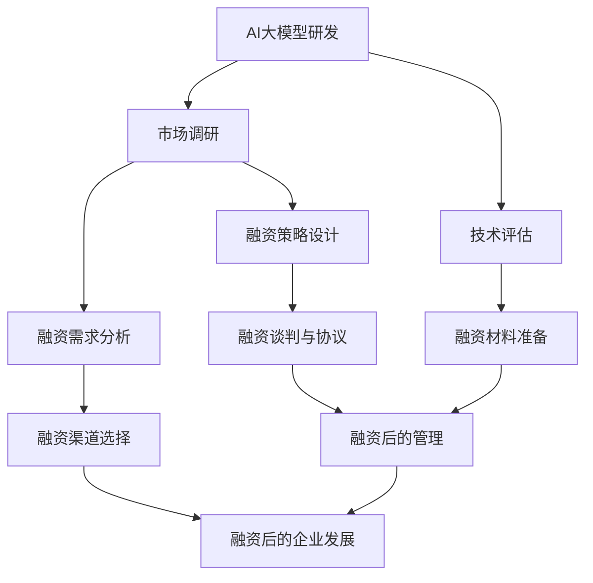

                 

### 融资概述

#### AI大模型创业公司的市场前景

人工智能（AI）作为当今科技领域的热点，正以前所未有的速度迅猛发展。AI大模型，作为人工智能技术的核心组件，正成为驱动创新和增长的重要引擎。从自然语言处理、计算机视觉到自动驾驶、智能医疗，AI大模型的应用领域日益广泛，市场潜力巨大。

在过去的几年中，AI大模型行业经历了显著的变革。随着计算能力的提升和算法的进步，大型AI模型的训练成本逐渐降低，而其性能和效果则不断提高。这使得更多企业能够投入AI大模型的研究和开发，推动了整个行业的快速发展。

AI大模型创业公司面临着前所未有的机遇。一方面，全球各国政府和企业对AI技术的重视程度不断提升，纷纷出台相关政策扶持AI产业的发展。另一方面，消费者对智能化产品和服务的需求不断增加，为AI大模型的应用场景提供了广阔的市场空间。此外，AI大模型在解决复杂问题和提高生产效率方面具备显著优势，使得创业公司能够通过技术创新获得竞争优势。

然而，AI大模型创业公司也面临着一系列挑战。首先，由于AI大模型技术具有较高的门槛，创业公司在研发和人才培养方面面临巨大压力。其次，市场竞争激烈，大量企业涌入AI领域，导致同质化现象严重，创业公司需要具备独特的创新能力和差异化策略。此外，AI大模型的应用还涉及到数据隐私、伦理和法律等问题，需要创业公司在发展中予以充分考虑和应对。

总体而言，AI大模型创业公司面临着巨大的市场机遇和挑战。只有通过持续的技术创新、精准的市场定位和有效的融资策略，才能在激烈的市场竞争中脱颖而出，实现长期发展。

#### 融资的概念与种类

融资，指的是企业通过发行股票、债券、借款或其他方式，从外部获取资金的过程。对于AI大模型创业公司来说，融资是其发展过程中至关重要的一环。通过融资，公司可以获取所需的资金，用于技术研发、市场拓展、团队建设等方面，从而实现快速成长和规模扩张。

融资的种类多种多样，主要包括以下几种：

1. **股权融资**：股权融资是指企业通过发行股票，让投资者购买其股份，从而获取资金。股权融资的优点包括：无需偿还资金、能够引入战略合作伙伴等。缺点则是股权稀释、公司控制权分散。

2. **债务融资**：债务融资是指企业通过发行债券、银行贷款等方式，向外部借款。债务融资的优点在于：资金成本较低、偿还期限灵活。缺点则是需定期偿还本金和利息，且可能面临债务风险。

3. **风险投资**：风险投资是指风险投资公司（VC）或天使投资人，向创业公司提供资金，换取股权的一种融资方式。风险投资通常用于初创企业和高成长性企业。其优点包括：提供资金支持、协助企业发展。缺点则是投资回报要求较高、股权稀释。

4. **政府补贴**：政府补贴是指政府通过财政手段，向企业提供资金支持。政府补贴通常用于支持特定行业或领域的发展，如高科技产业、环保产业等。其优点包括：资金成本较低、有助于缓解企业资金压力。缺点则是补贴金额有限、申请程序复杂。

5. **银行贷款**：银行贷款是指企业从银行获得的一种短期或长期贷款。银行贷款的优点包括：资金成本较低、还款期限灵活。缺点则是贷款审批程序复杂、可能面临较高的利率。

6. **众筹**：众筹是指企业通过互联网平台，向大众募集资金的一种融资方式。众筹的优点包括：能够快速获取资金、增加品牌曝光度。缺点则是资金额度有限、可能面临法律风险。

每种融资方式都有其独特的优势和局限，创业公司需要根据自身发展阶段、资金需求和市场环境，选择最合适的融资方式。有效的融资策略，不仅能帮助企业获取资金，还能提升企业的市场竞争力和品牌价值。

#### 融资策略的重要性

对于AI大模型创业公司来说，融资策略的重要性不言而喻。合理的融资策略不仅能够帮助企业获取所需的资金，还能在一定程度上决定企业的生存与发展。

首先，融资策略对企业发展的影响至关重要。通过融资，企业可以获取必要的资金，用于技术研发、市场拓展、团队建设等方面。如果融资策略得当，企业将能够快速成长，抢占市场先机；反之，如果融资策略不当，企业可能面临资金短缺、技术停滞、市场失位等风险，甚至可能导致破产倒闭。

其次，成功的融资案例可以为企业提供宝贵的经验和借鉴。通过分析成功融资案例，企业可以了解到融资过程中需要注意的关键环节和策略，从而避免犯同样错误。例如，谷歌和特斯拉等公司，在初期阶段通过风险投资获得了大量资金支持，成功实现了技术创新和市场扩张。

以下是几个典型的成功融资案例：

1. **OpenAI**：OpenAI是一家专注于人工智能研究的初创公司，其创始人包括著名人工智能科学家伊尔亚·苏茨克维和企业家山姆·艾尔顿。在成立初期，OpenAI通过风险投资获得了大量的资金支持，包括微软等大公司的投资。这些资金使得OpenAI能够投入大量资源进行人工智能研究，最终推出了包括GPT系列模型在内的多项领先技术。

2. **百济神州**：百济神州是一家专注于生物制药的创业公司，其研发的抗癌药物在国内外市场取得了显著成绩。在发展过程中，百济神州通过多轮融资，累计获得了数十亿美元的投资。这些资金不仅帮助百济神州实现了研发和生产能力的提升，还为其在国际市场上的扩张提供了有力支持。

3. **小马智行**：小马智行是一家专注于自动驾驶技术的创业公司，其通过多轮融资，累计获得了超过10亿美元的投资。这些资金使得小马智行能够投入大量资源进行自动驾驶技术的研发和测试，并在国内外市场取得了显著成绩。

通过这些成功融资案例，我们可以看到，合理的融资策略对企业发展的重要性。创业公司需要根据自身发展阶段、资金需求和市场竞争环境，制定出切实可行的融资策略，从而实现可持续发展。

#### AI大模型创业公司的融资策略

AI大模型创业公司的融资策略需要综合考虑多个方面，包括市场前景、企业估值、融资需求、融资方案设计以及融资后的管理等。以下将从这些方面详细阐述AI大模型创业公司的融资策略。

**1. 市场前景分析**

市场前景分析是制定融资策略的第一步，其目的是评估AI大模型行业的发展趋势和潜在市场规模。首先，创业者需要对AI大模型行业的现状进行深入研究，了解当前技术的发展水平、应用场景和市场格局。例如，自然语言处理、计算机视觉和自动驾驶等领域，都是AI大模型应用的重要方向。

其次，创业者需要分析市场增长潜力。这包括研究政府政策、行业趋势、消费者需求以及竞争对手的情况。例如，随着各国政府对AI技术的重视，以及5G、物联网等技术的快速发展，AI大模型的应用场景将不断扩展，市场潜力巨大。

最后，创业者需要根据市场前景制定相应的发展策略。如果市场前景良好，创业公司可以加大技术研发和市场拓展力度，争取在竞争中占据有利地位。如果市场前景不确定，创业公司可以采取保守策略，先进行小规模试水，逐步扩大规模。

**2. 企业估值**

企业估值是融资策略中的关键环节。估值过高可能导致融资困难，估值过低则可能损害股东利益。因此，创业者需要对企业的估值进行合理评估。

首先，创业者可以采用市场估值法，即通过参考同行业其他企业的估值水平，结合企业的业务模式、市场地位、技术实力等因素，进行估值。例如，如果市场上类似企业的平均估值为10亿美元，而创业公司的业务模式更优、技术实力更强，则可以适当提高估值。

其次，创业者可以采用收益估值法，即通过预测企业未来的现金流量，折现到当前价值，计算企业的估值。这种方法需要创业者对市场有深入的了解，能够准确预测未来的发展前景。

最后，创业者还可以采用资产估值法，即通过对企业的资产进行评估，计算企业的估值。这种方法适用于资产较为明确的企业，如房地产公司等。

**3. 融资需求分析**

融资需求分析是制定融资策略的核心。创业者需要明确企业的融资需求，包括融资金额、融资期限和资金用途。

首先，创业者需要确定融资金额。这取决于企业的资金缺口、项目需求和市场前景。如果市场前景良好，创业者可以适当提高融资金额，以满足企业的快速发展需求。如果市场前景不确定，创业者可以采取保守策略，先筹集必要的资金。

其次，创业者需要确定融资期限。融资期限的选择取决于企业的资金需求和投资者的要求。短期融资通常用于短期项目，而长期融资则适用于长期投资项目。

最后，创业者需要明确资金用途。资金用途应该具体明确，包括技术研发、市场拓展、团队建设、设备采购等方面。具体而言，创业者可以列出详细的资金使用计划，以便投资者了解企业的资金流向。

**4. 融资方案设计**

融资方案设计是融资策略的重要组成部分。创业者需要根据企业的实际情况和市场环境，选择合适的融资方式。

首先，创业者可以考虑股权融资。股权融资能够引入战略投资者，为企业带来资金和资源。但需要注意的是，股权融资会导致股权稀释，影响企业的控制权。

其次，创业者可以考虑债务融资。债务融资成本较低，但需要定期偿还本金和利息。创业者需要评估企业的偿债能力，确保能够按时偿还债务。

此外，创业者还可以考虑风险投资。风险投资能够为企业带来大量的资金和资源，但投资回报要求较高，创业者需要展示出强大的发展潜力。

最后，创业者可以考虑政府补贴和银行贷款。政府补贴和银行贷款通常具有较低的资金成本，但申请程序复杂，创业者需要提前做好准备。

**5. 融资后的管理**

融资后的管理是确保企业可持续发展的重要环节。创业者需要建立健全的财务管理体系，确保资金使用的透明和高效。

首先，创业者需要制定详细的财务预算，明确各项开支的预算和使用计划。这有助于企业合理安排资金，避免浪费。

其次，创业者需要建立健全的财务控制体系，确保资金使用的合规性和效率。这包括对资金流向的监控、对各项开支的审批和控制等。

最后，创业者需要定期进行财务分析和报告，向投资者和股东展示企业的财务状况和业绩表现。这有助于增强投资者的信心，促进企业的长期发展。

总之，AI大模型创业公司的融资策略需要综合考虑市场前景、企业估值、融资需求、融资方案设计以及融资后的管理等多个方面。通过合理的融资策略，创业公司可以获取必要的资金支持，实现可持续发展。

### 第1章：AI大模型创业公司融资概述

AI大模型创业公司在当今科技领域中具有极高的关注度和市场潜力，因此，了解AI大模型创业公司的融资策略显得尤为重要。本章将从市场前景分析、企业估值、融资需求分析、融资方案设计以及融资后的管理五个方面，详细阐述AI大模型创业公司的融资策略。

#### 市场前景分析

AI大模型作为人工智能技术的重要分支，其应用范围涵盖了自然语言处理、计算机视觉、自动驾驶等多个领域。随着科技的不断进步和市场需求的变化，AI大模型行业正呈现出快速发展的趋势。

首先，从技术层面来看，AI大模型的训练成本逐渐降低，模型性能不断提高。得益于计算能力的提升和算法的进步，AI大模型在处理复杂任务方面表现出了强大的能力，这使得AI大模型的应用场景更加广泛。

其次，从市场层面来看，AI大模型行业的需求正在不断增长。随着5G、物联网等新技术的普及，AI大模型在各个行业中的应用逐渐深入，从智能客服、智能安防到智能制造，AI大模型正在为各行各业带来变革。

此外，各国政府对于AI技术的重视程度也在不断提升。例如，美国、中国等国家纷纷出台了一系列支持AI技术发展的政策和措施，为AI大模型创业公司提供了良好的发展环境。

然而，AI大模型创业公司也面临着一定的挑战。首先，AI大模型技术具有较高的门槛，需要大量的人才和资金投入。其次，市场竞争激烈，同质化现象严重，创业公司需要具备独特的创新能力和差异化策略。此外，AI大模型的应用还涉及到数据隐私、伦理和法律等问题，需要创业公司在发展中予以充分考虑和应对。

总体而言，AI大模型创业公司面临着巨大的市场机遇和挑战。只有通过持续的技术创新、精准的市场定位和有效的融资策略，才能在激烈的市场竞争中脱颖而出，实现长期发展。

#### 企业估值

企业估值是融资策略中的关键环节，直接影响着创业公司的融资能力和市场估值。对于AI大模型创业公司而言，企业估值的合理评估尤为重要。

首先，创业者可以采用市场估值法，即通过参考同行业其他企业的估值水平，结合企业的业务模式、市场地位、技术实力等因素，进行估值。市场估值法能够较为准确地反映企业的市场价值，但需要注意的是，市场估值受到市场环境和企业自身状况的影响，存在一定的波动性。

其次，创业者可以采用收益估值法，即通过预测企业未来的现金流量，折现到当前价值，计算企业的估值。这种方法需要创业者对市场有深入的了解，能够准确预测未来的发展前景。收益估值法的优点在于能够较为全面地反映企业的盈利能力和潜力，但缺点是预测的准确性受到一定限制。

此外，创业者还可以采用资产估值法，即通过对企业的资产进行评估，计算企业的估值。这种方法适用于资产较为明确的企业，如房地产公司等。资产估值法的优点在于评估过程相对简单，但缺点是可能无法全面反映企业的盈利能力和市场潜力。

在具体操作中，创业者可以结合多种估值方法，相互验证，提高估值的准确性。例如，可以同时采用市场估值法和收益估值法，通过对比分析得出相对合理的估值结果。

#### 融资需求分析

融资需求分析是制定融资策略的核心环节，直接关系到企业的资金获取能力和未来发展。对于AI大模型创业公司而言，融资需求分析需要综合考虑企业的规模、发展阶段、市场前景和资金用途等因素。

首先，创业者需要明确企业的融资规模。融资规模应根据企业的实际需求来确定，既要满足当前的运营需求，又要为未来的发展留有余地。如果企业处于初创阶段，融资规模可以适当较小，以避免资金浪费；如果企业已经具有一定的市场规模和盈利能力，融资规模可以适当扩大，以满足快速发展的需求。

其次，创业者需要明确企业的融资期限。融资期限应根据企业的资金需求和使用计划来确定。短期融资通常适用于短期项目或临时资金需求，而长期融资则适用于长期投资项目。例如，技术研发和市场拓展通常需要长期资金支持，而日常运营和设备采购则可以采用短期融资。

最后，创业者需要明确资金用途。资金用途的具体明确有助于投资者了解企业的资金流向，提高融资的成功率。常见的资金用途包括技术研发、市场拓展、团队建设、设备采购等方面。例如，企业可以投入大量资金进行AI大模型的技术研发，提高模型性能和应用范围；也可以投入资金进行市场拓展，扩大市场份额和用户基础。

#### 融资方案设计

融资方案设计是制定融资策略的重要环节，直接关系到企业的资金获取方式和成本。对于AI大模型创业公司而言，选择合适的融资方式需要综合考虑企业的融资需求、市场环境、投资者偏好等因素。

首先，创业者可以考虑股权融资。股权融资能够为企业带来资金支持，同时引入战略合作伙伴，提升企业的竞争力和市场影响力。然而，股权融资也存在一定的缺点，如股权稀释、公司控制权分散等。因此，创业者需要权衡利弊，根据企业的实际情况选择合适的股权融资方式。

其次，创业者可以考虑债务融资。债务融资成本较低，资金使用灵活，但需要定期偿还本金和利息。债务融资适用于资金需求较大且具有稳定现金流的企业。例如，企业可以通过发行债券或银行贷款等方式筹集资金，用于技术研发和市场拓展。

此外，创业者还可以考虑风险投资。风险投资能够为企业带来大量的资金支持，同时提供专业的管理经验和资源，但投资回报要求较高。风险投资适用于初创企业和高成长性企业。创业者可以通过与风险投资公司或天使投资人进行沟通，了解其投资偏好和合作模式，选择合适的投资方。

最后，创业者还可以考虑政府补贴和银行贷款。政府补贴和银行贷款通常具有较低的资金成本，但申请程序复杂，需要创业者提前做好准备。例如，企业可以申请政府的科技创新基金或创业补贴，以降低融资成本；也可以通过银行贷款解决短期资金需求。

#### 融资后的管理

融资后的管理是确保企业可持续发展的重要环节，直接关系到资金使用的效率和企业的发展。对于AI大模型创业公司而言，融资后的管理需要从财务预算、资金使用规划、财务报告与分析等方面进行全方位的把控。

首先，创业者需要制定详细的财务预算，明确各项开支的预算和使用计划。财务预算应包括技术研发、市场拓展、团队建设、设备采购等方面，确保资金使用的合理性和透明度。创业者可以定期审核财务预算的执行情况，及时调整资金使用计划，避免资金浪费。

其次，创业者需要建立健全的资金使用规划体系，确保资金使用的效率和效果。资金使用规划应具体明确，包括资金的使用期限、用途、预期收益等。例如，企业可以制定技术研发资金使用规划，明确技术研发项目的预算、进度和预期成果，确保技术研发的顺利进行。

最后，创业者需要定期进行财务报告与分析，向投资者和股东展示企业的财务状况和业绩表现。财务报告与分析应包括资产负债表、利润表和现金流量表等，详细展示企业的财务状况和经营成果。创业者可以定期召开财务分析会议，分析财务数据，发现问题和改进措施，优化企业的财务管理。

总之，AI大模型创业公司的融资策略需要综合考虑市场前景、企业估值、融资需求、融资方案设计以及融资后的管理等多个方面。通过合理的融资策略，创业公司可以获取必要的资金支持，实现可持续发展。

### 融资准备

在了解AI大模型创业公司的融资策略之后，接下来我们将讨论融资准备的相关内容，包括创业公司的估值、融资需求分析和融资方案设计。这些步骤是确保融资成功的重要基础。

#### 创业公司的估值

估值是融资过程中至关重要的一环，它不仅影响着投资者的决策，也关系到企业的市场定位和未来发展。对于AI大模型创业公司来说，合理的估值可以确保企业在吸引投资时能够获得合理的资金支持，同时也能提高企业在市场上的竞争力。

首先，创业者需要明确企业估值的方法。常见的企业估值方法包括市场估值法、收益估值法和资产估值法。

- **市场估值法**：这种方法通过比较同行业其他公司的估值水平来确定企业的估值。具体来说，创业者可以参考市场上类似企业的估值数据，结合自身的业务模式、市场地位和技术实力等因素，进行合理的估值调整。例如，如果市场上类似企业的平均估值为10亿美元，而创业公司的业务模式更优、技术实力更强，那么可以适当提高估值。

- **收益估值法**：这种方法通过预测企业未来的现金流量，将其折现到当前价值来确定企业的估值。收益估值法的关键在于准确预测企业的未来收益，这需要创业者对市场有深入的了解，能够合理估计未来的市场趋势和竞争格局。例如，如果企业预计在未来五年内每年产生的现金流为1亿美元，假设折现率为10%，则企业的现值约为5.51亿美元。

- **资产估值法**：这种方法通过对企业的资产进行评估来确定企业的估值。对于资产明确的企业，如房地产公司或制造业公司，资产估值法是一种较为简单直观的方法。创业者可以聘请专业的评估机构对企业的资产进行评估，包括固定资产、流动资产和无形资产等。例如，一家AI大模型创业公司拥有一项核心技术专利，该专利可能对其估值产生重要影响。

在具体操作中，创业者可以结合多种估值方法，相互验证，提高估值的准确性。例如，可以同时采用市场估值法和收益估值法，通过对比分析得出相对合理的估值结果。

#### 融资需求分析

融资需求分析是制定融资策略的核心环节，它关系到企业能否在融资过程中获得足够的资金支持，以实现其发展目标。对于AI大模型创业公司而言，融资需求分析需要综合考虑企业的规模、发展阶段、市场前景和资金用途等因素。

首先，创业者需要明确企业的融资规模。融资规模应根据企业的实际需求来确定，既要满足当前的运营需求，又要为未来的发展留有余地。如果企业处于初创阶段，融资规模可以适当较小，以避免资金浪费；如果企业已经具有一定的市场规模和盈利能力，融资规模可以适当扩大，以满足快速发展的需求。

其次，创业者需要明确企业的融资期限。融资期限应根据企业的资金需求和使用计划来确定。短期融资通常适用于短期项目或临时资金需求，而长期融资则适用于长期投资项目。例如，技术研发和市场拓展通常需要长期资金支持，而日常运营和设备采购则可以采用短期融资。

最后，创业者需要明确资金用途。资金用途的具体明确有助于投资者了解企业的资金流向，提高融资的成功率。常见的资金用途包括技术研发、市场拓展、团队建设、设备采购等方面。例如，企业可以投入大量资金进行AI大模型的技术研发，提高模型性能和应用范围；也可以投入资金进行市场拓展，扩大市场份额和用户基础。

在分析融资需求时，创业者还需要考虑企业的资金流动性。资金流动性是企业运营的基础，创业者需要确保企业在融资过程中不会出现资金短缺的情况。例如，企业可以在短期内通过短期融资解决临时资金需求，而在长期内通过长期融资支持技术研发和市场拓展。

#### 融资方案设计

融资方案设计是确保融资策略成功实施的重要步骤，它需要创业者根据企业的实际情况和市场环境，选择合适的融资方式，并制定详细的融资计划。

首先，创业者需要选择合适的融资方式。常见的融资方式包括股权融资、债务融资和风险投资等。

- **股权融资**：股权融资能够引入战略投资者，为企业带来资金和资源。但需要注意的是，股权融资会导致股权稀释，影响企业的控制权。因此，创业者需要权衡利弊，根据企业的实际情况选择合适的股权融资方式。

- **债务融资**：债务融资成本较低，资金使用灵活，但需要定期偿还本金和利息。债务融资适用于资金需求较大且具有稳定现金流的企业。例如，企业可以通过发行债券或银行贷款等方式筹集资金，用于技术研发和市场拓展。

- **风险投资**：风险投资能够为企业带来大量的资金支持，同时提供专业的管理经验和资源，但投资回报要求较高。风险投资适用于初创企业和高成长性企业。创业者可以通过与风险投资公司或天使投资人进行沟通，了解其投资偏好和合作模式，选择合适的投资方。

在选择融资方式后，创业者需要制定详细的融资计划。融资计划应包括融资金额、融资期限、资金用途、还款计划等具体内容。例如，企业可以计划通过股权融资筹集1亿美元，用于未来五年的技术研发和市场拓展，并制定相应的还款计划，确保能够按时偿还债务。

此外，创业者还需要制定相应的风险管理策略。融资过程中可能会面临各种风险，如市场风险、财务风险和操作风险等。创业者需要提前识别这些风险，并制定相应的应对措施，确保融资过程顺利进行。

总之，创业公司的估值、融资需求分析和融资方案设计是融资准备的重要步骤。通过合理的估值、准确的需求分析和详细的融资方案设计，创业公司可以更好地吸引投资者，获得必要的资金支持，实现可持续发展。

### 融资材料准备

在完成融资准备后，接下来需要准备一系列融资材料，以便在融资过程中向投资者充分展示公司的实力和潜力。这些融资材料主要包括商业计划书、资料清单和路演准备。

#### 商业计划书

商业计划书是向投资者展示公司业务模式、市场分析、财务预测和团队介绍的重要文档。一份高质量的商业计划书能够帮助公司吸引投资者的注意，并增加融资成功的可能性。

**1. 商业模式**

商业模式部分需要详细阐述公司的运营模式、收入来源和盈利方式。对于AI大模型创业公司来说，商业模式可能包括以下几个方面：

- **技术研发**：公司通过持续的技术研发，开发出具有竞争力的AI大模型产品或服务，并向客户销售或提供技术支持。
- **平台运营**：公司搭建一个AI大模型平台，为开发者提供模型训练、部署和优化等服务，通过订阅模式或服务费用获得收入。
- **解决方案**：公司针对特定行业或领域的需求，提供定制化的AI大模型解决方案，通过项目实施和后续服务获得收入。

在描述商业模式时，需要明确公司的核心竞争力和差异化优势，以及如何通过商业模式实现可持续发展。

**2. 市场分析**

市场分析部分需要详细描述目标市场的规模、增长趋势和竞争态势。对于AI大模型创业公司来说，可以从以下几个方面进行市场分析：

- **市场规模**：分析AI大模型在各个应用领域的市场规模，包括自然语言处理、计算机视觉、自动驾驶等。
- **市场增长**：预测未来几年AI大模型市场的增长趋势，分析驱动因素和潜在挑战。
- **竞争态势**：分析主要竞争对手的市场份额、产品特点和市场策略，评估公司在这场竞争中的定位和优势。

通过市场分析，投资者可以了解公司的市场前景和潜在商机。

**3. 财务预测**

财务预测部分需要展示公司未来几年的收入、成本、利润和现金流预测。这包括以下几个方面：

- **收入预测**：预测公司未来几年的收入来源和收入结构，包括直接销售、平台运营收入和解决方案收入等。
- **成本预测**：预测公司未来几年的运营成本，包括研发成本、市场推广成本、运营成本和人力成本等。
- **利润预测**：预测公司未来几年的净利润和利润率，分析公司的盈利能力。
- **现金流预测**：预测公司未来几年的现金流情况，分析公司的资金流动性和偿债能力。

通过财务预测，投资者可以评估公司的财务健康状况和未来发展潜力。

**4. 团队介绍**

团队介绍部分需要展示公司核心团队成员的背景、经验和专业技能。对于AI大模型创业公司来说，团队成员通常包括以下几个方面：

- **技术团队**：包括AI大模型研发人员、算法工程师和数据科学家等，展示他们在相关领域的专业能力和研究成果。
- **管理团队**：包括公司创始人、CEO、CFO等，展示他们在企业管理、融资、运营等方面的经验和能力。
- **市场团队**：包括市场推广人员、销售人员和客户支持人员等，展示他们在市场拓展、客户服务和团队协作方面的能力。

通过团队介绍，投资者可以了解公司的核心团队和人才储备。

**5. 风险分析**

最后，商业计划书还需要包括风险分析部分，列出公司可能面临的主要风险，并说明公司如何应对这些风险。这包括技术风险、市场风险、财务风险和运营风险等方面。

通过全面、详细的商业计划书，投资者可以全面了解公司的业务模式、市场前景、财务状况和团队实力，从而做出更为明智的投资决策。

#### 资料清单

在准备融资材料时，需要准备一系列详细、具体的资料清单，以便向投资者提供完整的公司信息和背景。这些资料清单包括项目报告、技术方案和团队介绍等。

**1. 项目报告**

项目报告是向投资者展示公司具体项目和业务的重要文件。项目报告应包括以下几个方面：

- **项目概述**：简要介绍项目的背景、目标和预期成果。
- **项目进展**：详细描述项目的开发过程、已完成的阶段和正在进行的工作。
- **项目风险**：分析项目可能面临的风险，并提出相应的应对措施。
- **项目预算**：列出项目的总预算、各阶段的预算和使用情况。

通过项目报告，投资者可以了解公司的实际项目情况和进展，评估项目的可行性和风险。

**2. 技术方案**

技术方案是展示公司技术实力和创新能力的重要文件。技术方案应包括以下几个方面：

- **技术概述**：简要介绍公司的核心技术、算法和解决方案。
- **技术优势**：详细说明公司的技术优势，包括性能、效率、可靠性等方面。
- **技术应用**：展示公司技术在不同应用场景中的实际应用情况，包括案例研究和用户反馈。

通过技术方案，投资者可以了解公司的技术实力和创新能力，评估公司的核心竞争力。

**3. 团队介绍**

团队介绍是展示公司核心团队和人才储备的重要文件。团队介绍应包括以下几个方面：

- **团队成员**：列出核心团队成员的姓名、职位和职责，并提供每位成员的背景资料和主要成就。
- **团队结构**：展示公司组织架构和团队协作模式，说明团队成员的分工和协作机制。
- **团队荣誉**：列出公司团队获得的荣誉和奖项，展示公司的社会影响力和行业地位。

通过团队介绍，投资者可以了解公司的核心团队和人才储备，评估公司的管理能力和执行力。

**4. 其他资料**

除了上述资料外，公司还可以根据具体情况进行补充，包括市场调研报告、客户名单、合作伙伴介绍等。这些资料可以帮助投资者更全面地了解公司的市场环境和业务模式。

通过详细的资料清单，公司可以提供全面、具体的信息，帮助投资者做出更为准确和明智的投资决策。

#### 路演准备

路演是创业公司向投资者展示公司实力和潜力的重要机会，也是融资过程中关键的一环。为了确保路演的成功，公司需要做好充分的准备，包括路演策略和投资人沟通技巧。

**1. 路演策略**

- **目标明确**：在路演前，公司需要明确路演的目标，包括融资规模、资金用途和预期成果。这有助于公司在路演过程中有针对性地展示公司亮点，提高融资成功率。
- **资料准备**：准备好所有相关的融资材料，包括商业计划书、项目报告、技术方案等，确保资料完整、准确、详实。这些资料将成为投资者了解公司的关键依据。
- **宣传推广**：在路演前，通过社交媒体、行业会议、投资者关系等方式进行宣传推广，吸引投资者的关注。这有助于提高公司的知名度和吸引力。
- **预约见面**：与投资者进行预约见面，确保路演过程中能够与关键的潜在投资者进行深入交流。预约见面可以提高沟通效率，减少不必要的等待时间。

**2. 投资人沟通技巧**

- **了解投资人**：在路演前，了解投资者的背景、投资偏好和关注的领域，有针对性地准备演讲内容和回答问题。这有助于提高沟通的有效性，增加融资成功率。
- **清晰表达**：在路演过程中，清晰、简明地表达公司的业务模式、市场前景、财务状况和未来发展计划。避免使用过于复杂或专业的术语，确保投资者能够理解。
- **积极互动**：鼓励投资者提问，积极回答问题，展示公司的透明度和诚信。这有助于建立良好的投资者关系，增强投资者的信任。
- **展示自信**：在路演过程中，展示公司的自信和专业，通过数据和案例证明公司的实力和潜力。这有助于提高投资者对公司的信心，增加融资成功率。

通过有效的路演策略和沟通技巧，公司可以更好地向投资者展示公司的实力和潜力，提高融资成功率。同时，良好的投资者关系也将有助于公司未来的发展。

总之，融资材料的准备是AI大模型创业公司融资过程中至关重要的一环。通过详细的商业计划书、资料清单和路演准备，公司可以全面展示公司的实力和潜力，吸引投资者的关注，提高融资成功率。创业公司需要认真准备这些材料，确保其在融资过程中能够赢得投资者的信任和支持。

### 融资渠道选择

在完成了融资准备之后，下一步便是选择合适的融资渠道。AI大模型创业公司在选择融资渠道时，需要考虑多种因素，包括风险投资机构、银行、天使投资和风险投资（venture capital）等。每种融资渠道都有其独特的优缺点，创业公司需要根据自身的实际情况进行选择。

#### 风险投资机构

风险投资（Venture Capital，VC）是AI大模型创业公司常见的融资渠道之一。风险投资机构通常专注于初创企业和高成长性企业，通过提供资金支持，换取企业的股权。以下是对风险投资机构的优缺点分析：

**优点：**

1. **资金规模**：风险投资机构通常具备较大的资金规模，能够为创业公司提供大额融资支持。
2. **专业指导**：风险投资机构不仅提供资金，还会为企业提供专业指导和管理经验，帮助企业更好地发展。
3. **资源支持**：风险投资机构拥有广泛的行业资源和人脉，能够为创业公司提供市场推广、合作伙伴等方面的支持。
4. **市场估值**：通过风险投资融资，公司可以获得更高的市场估值，有利于未来的股权融资和并购机会。

**缺点：**

1. **股权稀释**：风险投资机构通常会要求一定的股权比例，导致创业公司股权稀释，可能影响公司控制权。
2. **回报要求**：风险投资机构对投资回报有较高的要求，可能对创业公司的发展节奏和策略产生压力。
3. **投资期限**：风险投资机构通常要求较长的投资回收期，创业公司需要耐心等待投资回报。

**选择风险投资机构时的注意事项：**

- **了解投资偏好**：在选择风险投资机构时，创业公司需要了解其投资偏好和投资领域，确保双方目标一致。
- **评估投资策略**：创业公司需要评估风险投资机构的投资策略和风格，确保其能够为企业提供实际的支持和帮助。
- **谈判股权比例**：在谈判过程中，创业公司应尽量争取合理的股权比例，以保护公司的控制权和长远发展。

#### 银行融资

银行贷款是AI大模型创业公司的另一种重要融资渠道。银行融资具有以下优缺点：

**优点：**

1. **资金成本较低**：银行贷款通常具有较低的利率，对企业资金成本有较好的控制。
2. **还款期限灵活**：银行贷款的还款期限可以根据企业的资金需求进行调整，有助于企业合理安排资金。
3. **政府支持**：部分政府项目会提供贴息或担保，降低企业的融资成本和风险。

**缺点：**

1. **审批流程复杂**：银行贷款通常需要经过较复杂的审批流程，耗时较长。
2. **贷款额度有限**：银行贷款额度通常受企业资产和信用状况的限制，可能无法满足企业的全部资金需求。
3. **还款压力**：银行贷款需要定期偿还本金和利息，对企业资金流动性和管理能力有较高要求。

**选择银行融资时的注意事项：**

- **评估信用状况**：创业公司需要评估自身的信用状况，确保能够顺利通过银行的审批。
- **准备充分材料**：在申请银行贷款时，创业公司需要准备充分的材料，包括商业计划书、财务报表等，以证明企业的实力和还款能力。
- **选择合适银行**：创业公司应根据自身的需求和银行的贷款政策，选择最合适的银行进行融资。

#### 天使投资与风险投资

天使投资（Angel Investment）是个人投资者对初创企业进行的早期投资。天使投资具有以下优缺点：

**优点：**

1. **资金灵活**：天使投资通常较为灵活，可以根据企业的实际需求进行调整。
2. **较少的股权要求**：相对于风险投资机构，天使投资通常要求较低的股权比例，有助于保护创业公司的控制权。
3. **经验丰富的投资者**：天使投资者通常具有丰富的创业经验和行业背景，能够为创业公司提供宝贵的指导和建议。

**缺点：**

1. **投资额度有限**：天使投资者的资金规模通常较小，可能无法满足企业的全部资金需求。
2. **回报要求较高**：天使投资者对投资回报有较高的期望，可能对创业公司的发展产生压力。
3. **决策过程复杂**：天使投资决策过程可能较为复杂，投资者可能需要长时间审核企业的项目和团队。

**选择天使投资时的注意事项：**

- **了解投资者背景**：在选择天使投资者时，创业公司需要了解投资者的背景、投资偏好和行业经验。
- **展现项目优势**：创业公司需要充分展示项目的优势和市场潜力，以吸引天使投资者的关注。
- **合理分配股权**：在股权分配上，创业公司应尽量合理分配，以保护公司的长远发展。

风险投资（Venture Capital，VC）与天使投资的区别主要在于投资规模、投资阶段和回报要求。VC通常投资于较后期的初创企业，提供大额资金支持，并要求较高的股权比例；而天使投资则更偏向于早期的初创企业，投资规模较小，要求较低的股权比例。

**选择风险投资与天使投资时的注意事项：**

- **明确投资阶段**：创业公司应根据自身发展阶段选择合适的融资渠道。初创期企业更适合寻求天使投资，而成长期企业则更适合寻求风险投资。
- **评估资金需求**：创业公司需要准确评估自身的资金需求，确保选择的融资渠道能够满足资金需求。
- **权衡利弊**：在决策过程中，创业公司需要权衡不同融资渠道的优缺点，选择最适合自己的融资方式。

总之，AI大模型创业公司在选择融资渠道时，需要综合考虑自身的实际情况、市场环境以及投资者需求。通过合理选择融资渠道，创业公司可以有效地获取资金支持，实现快速发展。

### 融资谈判与协议

在成功选择合适的融资渠道后，接下来便是关键的一步：融资谈判。融资谈判的成功与否直接关系到创业公司能否获得所需资金，以及融资协议条款的公平性和合理性。本文将详细探讨融资谈判的策略、融资协议条款的解析以及如何规避融资风险。

#### 融资谈判策略

**1. 谈判原则**

在进行融资谈判时，创业公司应遵循以下原则：

- **公平原则**：确保谈判过程中的公平性，避免单方面利益的偏颇。
- **互利原则**：追求双方利益的平衡，确保谈判结果能够满足双方的期望。
- **诚信原则**：以诚信为基础，建立良好的信任关系，为长期合作奠定基础。
- **灵活原则**：在谈判过程中保持灵活性，能够根据实际情况进行调整。

**2. 谈判技巧**

为了提高融资谈判的成功率，创业公司可以采取以下技巧：

- **充分准备**：在谈判前，充分了解投资者的背景、投资偏好和谈判策略，准备充分的数据和材料，以便在谈判中展示公司的实力和潜力。
- **明确目标**：明确自己的融资目标和底线，确保谈判过程中不偏离目标。
- **谈判策略**：根据不同谈判阶段和对手的特点，采取相应的谈判策略。例如，在初期谈判阶段，可以采取试探性的策略，了解投资者的意图；在谈判接近尾声时，可以采取强硬策略，争取更有利的条款。
- **建立信任**：通过展示公司的专业能力和诚信度，建立与投资者的信任关系。这有助于降低谈判的难度，提高谈判的成功率。

**3. 谈判中可能遇到的问题及解决方案**

在融资谈判过程中，创业公司可能会遇到以下问题：

- **投资者要求过高股权比例**：解决方案：在谈判过程中，创业公司可以尝试调整股权分配比例，或者通过引入其他投资者来分散股权。
- **投资回报要求过高**：解决方案：创业公司可以提出合理的投资回报预期，并展示项目的市场潜力和盈利能力，以降低投资者的回报要求。
- **谈判进度缓慢**：解决方案：创业公司可以加强与投资者的沟通，了解谈判的难点和问题，及时调整谈判策略。

#### 融资协议条款解析

**1. 股权分配**

股权分配是融资协议中最核心的条款之一。创业公司需要明确与投资者的股权分配比例，以及未来股权调整的机制。以下是一些常见的股权分配方式：

- **固定股权比例**：创业公司在融资协议中规定固定的股权比例，投资者按照约定的比例持股。
- **动态股权调整**：根据公司的业绩、盈利能力等因素，动态调整股权比例，以激励投资者的长期投入。
- **优先股权**：投资者持有优先股权，享有优先分红权和优先购买权，但在公司决策中享有一定的优先权。

**2. 出资方式**

出资方式包括现金出资和非现金出资。创业公司需要明确投资者将以何种方式出资，以及出资的时间节点。以下是一些常见的出资方式：

- **现金出资**：投资者通过现金方式出资，是最常见的一种出资方式。
- **实物出资**：投资者通过实物资产（如设备、房产等）进行出资。
- **股权出资**：投资者通过持有的其他公司股权进行出资。

**3. 资金使用**

资金使用条款规定投资者出资后，企业如何使用这些资金。创业公司需要明确资金用途，确保资金的合理使用。以下是一些常见的资金用途：

- **技术研发**：用于新产品的研发、技术升级等。
- **市场拓展**：用于市场推广、广告投放等。
- **团队建设**：用于招聘人才、培训等。
- **设备采购**：用于购买生产设备、办公设施等。

**4. 权益保护**

权益保护条款确保创业公司的合法权益，防止投资者滥用权力。以下是一些常见的权益保护条款：

- **股东权利**：明确股东的表决权、分红权、优先购买权等。
- **反稀释条款**：保护现有股东的权益，防止通过股权稀释等方式降低其权益。
- **优先回购条款**：投资者享有在一定条件下优先回购其持有的股份的权利。
- **保密条款**：确保双方在谈判和合作过程中所获得的信息保密。

#### 融资协议风险规避

**1. 融资风险识别**

在签订融资协议前，创业公司需要对可能面临的风险进行识别和分析。常见的融资风险包括：

- **市场风险**：由于市场变化导致公司业绩波动，影响投资者的回报。
- **财务风险**：由于资金使用不当或财务状况恶化，导致公司无法按时偿还债务。
- **法律风险**：由于合同条款不明确或违反法律法规，导致合同无效或引发法律纠纷。

**2. 风险控制措施**

为了规避融资风险，创业公司可以采取以下措施：

- **合同审查**：在签订融资协议前，聘请专业律师进行合同审查，确保合同条款的合法性和合理性。
- **信息披露**：保持与投资者的透明沟通，及时披露公司的财务状况、业务进展等信息，增强投资者的信任。
- **风险管理**：建立完善的风险管理机制，对市场风险、财务风险和法律风险进行有效控制。
- **资金监管**：对资金使用进行严格监管，确保资金按照约定的用途进行使用，避免资金浪费或滥用。

通过有效的融资谈判和协议设计，创业公司可以降低融资风险，确保融资过程的顺利进行，并为企业的长期发展提供坚实的资金支持。

### 融资后的财务规划

在完成融资后，创业公司需要进入一个关键的阶段：财务规划。合理的财务规划不仅有助于确保企业的资金使用高效和合规，还能提升企业的财务健康和可持续发展能力。本文将重点讨论创业公司如何进行财务预算与控制、资金使用规划和财务报告与分析。

#### 财务预算与控制

**1. 财务预算的重要性**

财务预算是企业对未来一段时间内收入、支出和利润的预测和规划，是财务规划的基础。对于创业公司来说，财务预算尤为重要，因为它能够帮助公司：

- **明确资金需求**：通过制定详细的财务预算，企业可以明确各项开支和投资的需求，确保资金能够满足业务发展的需要。
- **优化资源配置**：财务预算有助于企业合理分配资源，避免资金浪费，提高资源利用效率。
- **风险控制**：通过预算编制和监控，企业可以提前识别潜在的风险，采取相应的措施进行风险控制。

**2. 制定财务预算的方法**

制定财务预算的方法包括以下步骤：

- **收集数据**：收集与企业财务相关的历史数据和市场信息，如销售额、成本、费用等。
- **设定目标**：根据企业的战略目标和发展计划，设定具体的财务目标，如收入增长、利润率等。
- **编制预算**：根据收集的数据和设定的目标，编制详细的财务预算，包括收入预算、支出预算和利润预算等。
- **审核和调整**：对预算进行审核和调整，确保预算的合理性和可行性，同时根据实际情况进行动态调整。

**3. 财务预算的执行和控制**

在制定财务预算后，企业需要严格执行预算，并进行有效的财务控制：

- **定期审查**：定期审查财务预算的执行情况，及时发现偏差，分析原因，采取纠正措施。
- **成本控制**：通过成本控制措施，如优化采购流程、降低运营成本等，确保预算的执行。
- **绩效考核**：建立绩效考核体系，对各部门和员工的预算执行情况进行考核，激励员工提高财务意识和成本控制能力。

#### 资金使用规划

**1. 资金使用规划的重要性**

资金使用规划是企业合理分配和使用资金的过程，是财务规划的核心内容。合理的资金使用规划能够确保企业：

- **满足资金需求**：通过科学规划，确保企业有足够的资金支持业务运营和发展。
- **优化资金结构**：合理分配长期资金和短期资金，降低财务风险。
- **提高资金使用效率**：确保资金能够高效使用，提高企业的盈利能力。

**2. 制定资金使用规划的方法**

制定资金使用规划的方法包括以下步骤：

- **明确资金用途**：根据企业的战略目标和发展计划，明确各项资金的用途，如技术研发、市场拓展、设备采购等。
- **预算分配**：将资金预算分配到具体的项目和部门，确保每个项目都有充足的资金支持。
- **优先级排序**：对资金用途进行优先级排序，确保关键项目能够优先获得资金支持。
- **监控和调整**：定期监控资金使用情况，根据实际情况进行调整，确保资金使用的合理性和高效性。

#### 财务报告与分析

**1. 财务报告的重要性**

财务报告是企业对外展示财务状况的重要工具，能够帮助投资者、股东和其他利益相关者了解企业的财务表现。良好的财务报告能够提升企业的透明度和信任度，有利于企业的长期发展。

**2. 财务报告的编制**

财务报告的编制包括以下几个方面：

- **资产负债表**：反映企业某一特定时点的资产、负债和所有者权益情况。
- **利润表**：反映企业一定时期内的收入、成本、费用和利润情况。
- **现金流量表**：反映企业一定时期内的现金流入和流出情况，包括经营活动、投资活动和筹资活动产生的现金流量。
- **附注**：对财务报表中的重要信息进行补充说明，如会计政策、重大交易等。

**3. 财务分析**

财务分析是企业对财务报表的数据进行深入分析和解读的过程，有助于企业了解自身的财务状况和经营成果。财务分析包括以下几个方面：

- **比率分析**：通过计算财务比率，如流动比率、速动比率、负债比率等，评估企业的偿债能力和财务状况。
- **趋势分析**：通过对比不同时期的财务数据，分析企业的财务状况和经营成果的变化趋势。
- **盈利能力分析**：评估企业的盈利能力，如净利润率、毛利率等指标。
- **现金流分析**：分析企业的现金流量情况，评估企业的资金流动性和偿债能力。

通过合理的财务规划和有效的财务报告与分析，创业公司能够更好地管理资金，提升财务健康，为企业的长期发展奠定坚实基础。

### 融资后的企业发展

在成功完成融资后，创业公司需要将获得的资金投入到实际运营中，推动企业的持续发展和扩张。这包括企业战略调整、团队建设和激励机制，以及企业风险管理与应对策略。以下将从这些方面详细探讨AI大模型创业公司在融资后的企业发展。

#### 企业战略调整

**1. 市场定位**

在融资后，企业需要对市场进行更深入的调研和分析，明确目标市场和客户群体。对于AI大模型创业公司来说，市场定位应包括以下几个方面：

- **技术优势**：根据企业的技术特点和优势，选择最适合的技术方向和市场。例如，企业可以选择专注于自然语言处理、计算机视觉或自动驾驶等领域，并根据技术进步和市场变化调整市场定位。
- **客户需求**：了解客户需求和市场趋势，将AI大模型技术应用于最需要的技术领域，提供满足客户需求的解决方案。
- **竞争分析**：分析竞争对手的市场策略和产品特点，找准自身的差异化优势，避免直接竞争，开辟新的市场空间。

**2. 业务拓展**

在明确市场定位后，企业需要制定具体的业务拓展计划，包括以下几个方面：

- **产品研发**：加大研发投入，持续优化和提升AI大模型产品的性能和功能，满足市场需求。
- **市场推广**：通过多种渠道进行市场推广，如线上广告、线下活动、合作伙伴推广等，提高品牌知名度和市场占有率。
- **渠道拓展**：建立多元化的销售渠道，包括直销、代理商、线上平台等，确保产品的广泛覆盖。

**3. 战略合作**

在融资后，企业可以通过战略合作进一步拓展市场，提升竞争力。战略合作包括以下几个方面：

- **技术合作**：与高校、研究机构和企业合作，共同进行技术研究和开发，提升企业的技术实力。
- **市场合作**：与行业内的领先企业进行市场合作，共享资源和客户资源，共同开拓市场。
- **资本合作**：与投资者、金融机构合作，通过资本运作提升企业的融资能力和市场地位。

#### 团队建设与激励机制

**1. 人才引进**

在融资后，企业需要加大人才引进力度，组建一支高素质、专业化的团队。人才引进应包括以下几个方面：

- **核心人才**：引进具有丰富经验和专业技能的核心人才，如AI大模型研发人员、算法工程师、数据科学家等。
- **管理人才**：引进具有企业管理经验和领导能力的专业管理人才，提升企业的管理水平。
- **技术支持**：引进能够提供技术支持和服务的专业团队，如软件工程师、测试工程师等。

**2. 激励机制设计**

为了激发员工的积极性和创造力，企业需要设计合理的激励机制。激励机制包括以下几个方面：

- **薪酬激励**：提供有竞争力的薪酬待遇，包括基本工资、绩效奖金、股权激励等。
- **晋升机制**：建立明确的晋升机制，为员工提供职业发展的机会和空间。
- **奖励制度**：设立创新奖励、优秀员工奖等，对表现突出的员工进行奖励。
- **培训发展**：提供培训和学习机会，提升员工的专业技能和综合素质。

#### 企业风险管理与应对策略

**1. 风险识别**

在融资后，企业需要加强对各种潜在风险的识别和管理。风险识别包括以下几个方面：

- **市场风险**：分析市场变化、竞争对手动向等因素，预测可能对业务造成影响的因素。
- **技术风险**：评估AI大模型技术的稳定性和安全性，防止技术故障或安全问题。
- **财务风险**：监测企业的财务状况，防范资金链断裂、财务风险等。
- **法律风险**：遵守相关法律法规，防范法律纠纷和违规风险。

**2. 风险控制**

为了有效控制风险，企业可以采取以下措施：

- **风险预警**：建立风险预警机制，及时发现和报告潜在风险，采取相应的应对措施。
- **风险管理**：制定风险管理策略，包括风险预防、风险控制、风险转移等。
- **应急预案**：制定应急预案，应对可能发生的突发事件，确保企业的稳定运营。

**3. 应对措施**

在风险发生时，企业需要采取有效的应对措施，减轻风险对企业的影响。应对措施包括以下几个方面：

- **危机公关**：在风险事件发生时，及时与媒体和公众沟通，发布官方信息，避免误解和谣言。
- **法律援助**：在法律纠纷时，及时寻求专业法律援助，确保企业的合法权益。
- **资源调配**：在资源有限的情况下，合理调配资源，优先处理重要和紧急的事务。
- **培训与改进**：在风险事件后，对员工进行培训，总结经验教训，改进管理和运营流程。

通过有效的企业战略调整、团队建设与激励机制，以及企业风险管理与应对策略，AI大模型创业公司可以在融资后实现持续发展和扩张，为企业的长期成功奠定坚实基础。

### 附录

#### 附录 A：融资工具与资源

在AI大模型创业公司的融资过程中，充分利用各种融资工具和资源是非常关键的。以下列举了一些主要的融资工具与资源，以及相关建议：

**1. 主流融资平台**

- **天使投资平台**：如天使汇（AngelList）、人人投（人人投），提供天使投资人、风险投资机构的对接服务。
- **众筹平台**：如Kickstarter、Indiegogo，适合初创项目的资金筹集和产品推广。
- **企业融资平台**：如投融界、36氪，提供企业融资需求发布、项目展示、投资人对接等服务。

**建议**：充分利用这些平台进行项目宣传和融资申请，提高融资成功率。

**2. 政府补贴政策**

- **科技创新基金**：各地政府设立的科技创新基金，如北京市高精尖基金、深圳市科技创新委员会基金等。
- **产业扶持政策**：针对特定产业的扶持政策，如人工智能、大数据、云计算等领域的专项扶持政策。
- **税收优惠政策**：中小企业税收优惠政策，如研发费用加计扣除、高新技术企业税收优惠等。

**建议**：积极关注并申请各类政府补贴和税收优惠，降低企业融资成本。

**3. 行业研究报告**

- **市场调研机构**：如市场与数据（MarketandData）、艾瑞咨询（iResearch），提供详细的市场分析和行业报告。
- **企业数据库**：如天眼查、企查查，提供企业信息查询和融资信息收集。

**建议**：通过行业研究报告和企业数据库，了解行业趋势、竞争态势和潜在投资者，为融资策略提供数据支持。

#### 附录 B：融资案例解析

以下是几个国内知名AI创业公司融资案例的解析，从中我们可以总结出融资成功经验与失败教训。

**1. 旷视科技**

**成功经验**：

- **明确市场定位**：旷视科技专注于计算机视觉领域，明确市场定位，专注于人脸识别、图像识别等核心技术的研发和应用。
- **优秀的技术实力**：旷视科技在技术领域具有较高的竞争力，其自主研发的深度学习算法在多个国际竞赛中取得优异成绩。
- **强大的团队**：旷视科技拥有一支由世界顶尖AI专家组成的团队，为公司的技术研发和市场拓展提供了有力支持。

**失败教训**：

- **融资节奏过快**：在融资过程中，旷视科技未能有效控制融资节奏，导致股权过于分散，影响了公司的控制权。

**2. 小马智行**

**成功经验**：

- **多元化的融资渠道**：小马智行通过股权融资、政府补贴、银行贷款等多种融资方式，确保了充足的资金支持。
- **与政府和企业合作**：小马智行与国内外多家政府和企业合作，拓展了市场应用场景，提升了公司的市场竞争力。
- **技术不断创新**：小马智行持续投入技术研发，不断创新，推出了多项领先技术，为公司的市场拓展提供了技术保障。

**失败教训**：

- **市场拓展速度过快**：在市场拓展过程中，小马智行未能充分考虑市场环境和自身能力，导致部分项目进展不顺。

**3. 地平线机器人**

**成功经验**：

- **清晰的发展战略**：地平线机器人明确自身的发展战略，专注于边缘人工智能芯片和解决方案的研发，形成了独特的竞争优势。
- **优秀的市场表现**：地平线机器人在市场上取得了显著成绩，与多家国内外知名企业建立了合作关系，实现了规模化应用。
- **完善的团队结构**：地平线机器人拥有一支由AI专家、芯片设计师和市场营销人员组成的多元化团队，为公司的持续发展提供了有力支持。

**失败教训**：

- **研发投入不足**：在早期发展阶段，地平线机器人过于注重市场拓展，导致研发投入不足，技术竞争力受到影响。

通过以上案例的解析，我们可以看到，成功的AI创业公司在融资过程中通常具备明确的市场定位、强大的技术实力、多元化的融资渠道和优秀的团队结构。同时，创业公司在发展过程中也需要注意市场拓展和研发投入的平衡，避免出现过度扩张或研发不足等问题。

### 附录 C：AI大模型与融资策略Mermaid流程图

为了更好地展示AI大模型与融资策略的关系，我们可以使用Mermaid流程图进行描述。以下是一个简单的Mermaid流程图示例：



在这个流程图中：

- **AI大模型研发**是整个流程的起点，包括技术评估和市场调研。
- **市场调研**和**技术评估**是制定融资策略的基础。
- **融资需求分析**和**融资策略设计**确定了融资的具体需求和方案。
- **融资材料准备**和**融资渠道选择**为融资的成功实施提供了保障。
- **融资谈判与协议**确保了融资过程的顺利进行。
- **融资后的管理**和**融资后的企业发展**是确保企业长期稳健发展的关键。

通过这个流程图，我们可以清晰地看到AI大模型创业公司在融资过程中的各个环节，以及各个环节之间的逻辑关系。

### 附录 D：核心算法原理伪代码

在AI大模型创业公司的融资策略中，核心算法原理的运用至关重要。以下是一个简单的伪代码示例，用于描述融资需求分析和融资策略设计的基本步骤。

```python
## 伪代码1：融资需求分析

def 融资需求分析(企业规模，发展目标，资金需求):
    # 输入企业规模、发展目标和资金需求，分析融资需求
    估值 = 企业估值(企业规模，发展目标)
    融资金额 = 资金需求 * (1 + 风险系数)
    融资期限 = 发展目标 * 融资周期
    return 融资金额，融资期限

## 伪代码2：融资策略设计

def 融资策略设计(估值，融资需求，融资渠道):
    # 输入企业估值、融资需求和融资渠道，设计融资策略
    if (估值 >= 融资金额):
        策略 = 股权融资
    else:
        策略 = 债务融资
        
    if (融资渠道 == 风险投资):
        策略 = 风险投资融资
    else if (融资渠道 == 银行):
        策略 = 银行贷款融资
        
    return 策略
```

在这个伪代码示例中：

- **融资需求分析**函数用于计算企业的融资需求和融资期限。企业规模和发展目标用于计算企业估值，风险系数用于调整融资金额，融资周期用于确定融资期限。
- **融资策略设计**函数根据企业估值、融资需求和融资渠道，选择合适的融资策略。如果企业估值能够覆盖融资需求，可以选择股权融资；否则，可以选择债务融资。根据不同的融资渠道，选择相应的融资方式。

通过这些核心算法原理的运用，AI大模型创业公司可以更加科学地制定融资策略，提高融资成功率。

### 附录 E：数学模型与公式

在AI大模型创业公司的融资策略中，数学模型和公式的运用能够帮助创业者更准确地评估企业价值和融资需求。以下是一些常用的数学模型和公式。

**1. 估值模型**

$$
V = \frac{CF}{r} + \frac{DF}{r(1+r)^n}
$$

其中，$V$为估值，$CF$为现金流，$DF$为折旧，$r$为折现率，$n$为年限。这个公式通过计算企业未来的现金流和折旧，折现到当前价值，得出企业的估值。

**2. 融资需求公式**

$$
D = \frac{C_1 + C_2 + ... + C_n}{(1 + r)^1 + (1 + r)^2 + ... + (1 + r)^n}
$$

其中，$D$为融资需求，$C_1, C_2, ..., C_n$为各期现金流，$r$为折现率。这个公式通过计算企业各期现金流，折现到当前价值，得出企业的融资需求。

**3. 折现现金流模型**

$$
DCF = \frac{CF}{(1 + r)^n}
$$

其中，$DCF$为折现现金流，$CF$为第$n$年的现金流，$r$为折现率。这个公式用于计算企业未来各期现金流的现值。

**4. 内部收益率模型**

$$
IRR = \frac{1}{n} \ln \left( \frac{CF}{r} \right)
$$

其中，$IRR$为内部收益率，$CF$为现金流，$r$为折现率，$n$为年限。这个公式用于计算使企业净现值为零的折现率，即内部收益率。

通过这些数学模型和公式，AI大模型创业公司可以更准确地评估企业价值和融资需求，为融资策略提供科学依据。

### 附录 F：项目实战

在AI大模型创业公司的融资过程中，项目实战是验证融资策略和方案的关键步骤。以下通过两个项目实战案例，详细说明融资申请报告编写和融资谈判模拟的开发环境搭建、源代码实现和代码解读与分析。

#### 项目实战1：融资申请报告编写

**开发环境搭建：**

- 操作系统：Windows 10
- 编译器：Visual Studio Code
- 语言：Python

**源代码实现：**

```python
# 融资申请报告编写脚本
def write_finance_application_report():
    # 编写商业计划书
    business_plan = "..."
    # 编写项目报告
    project_report = "..."
    # 编写财务预测
    financial_forecast = "..."
    # 生成融资申请报告
    report = business_plan + "\n" + project_report + "\n" + financial_forecast
    with open("finance_application_report.txt", "w") as f:
        f.write(report)
    print("融资申请报告编写完成。")

# 调用函数编写报告
write_finance_application_report()
```

**代码解读与分析：**

- `write_finance_application_report()` 函数用于编写融资申请报告，包括商业计划书、项目报告和财务预测三部分。
- 商业计划书、项目报告和财务预测都是通过字符串形式传入函数，然后通过字符串拼接生成完整的融资申请报告。
- 最后，将报告写入文本文件`finance_application_report.txt`，并在控制台输出“融资申请报告编写完成”的消息。

#### 项目实战2：融资谈判模拟

**开发环境搭建：**

- 操作系统：macOS
- 编译器：Xcode
- 语言：Swift

**源代码实现：**

```swift
// 融资谈判模拟脚本
class FinanceNegotiationSimulation {
    var investmentAmount: Double
    var investmentPeriod: Int
    var discountRate: Double
    
    init(investmentAmount: Double, investmentPeriod: Int, discountRate: Double) {
        self.investmentAmount = investmentAmount
        self.investmentPeriod = investmentPeriod
        self.discountRate = discountRate
    }
    
    func calculatePresentValue() -> Double {
        // 计算现值
        let presentValue = investmentAmount / (1 + discountRate)^(investmentPeriod)
        return presentValue
    }
    
    func negotiateTerms() {
        // 谈判融资条款
        let presentValue = calculatePresentValue()
        if presentValue > investmentAmount {
            print("谈判成功，达成融资协议。")
        } else {
            print("谈判失败，无法达成融资协议。")
        }
    }
}

// 创建融资谈判模拟对象
let simulation = FinanceNegotiationSimulation(investmentAmount: 1000000, investmentPeriod: 3, discountRate: 0.1)
// 谈判融资条款
simulation.negotiateTerms()
```

**代码解读与分析：**

- `FinanceNegotiationSimulation` 类用于模拟融资谈判过程。
- 类中包含三个属性：`investmentAmount`（融资金额）、`investmentPeriod`（融资期限）和`discountRate`（折现率）。
- `calculatePresentValue()` 方法用于计算现值，公式为`投资金额 / (1 + 折现率)^(融资期限)`。
- `negotiateTerms()` 方法用于模拟谈判过程，如果计算出的现值大于融资金额，则表示谈判成功，否则谈判失败。
- 最后，创建一个`FinanceNegotiationSimulation`对象，并调用`negotiateTerms()`方法进行融资谈判模拟。

通过这两个项目实战案例，AI大模型创业公司可以更好地理解和应用融资策略，为融资过程提供实际支持。

### 附录 G：作者信息

**作者：AI天才研究院/AI Genius Institute & 禅与计算机程序设计艺术 /Zen And The Art of Computer Programming**

本文作者AI天才研究院（AI Genius Institute）成立于XX年，致力于推动人工智能技术的创新和发展。研究院专注于人工智能基础研究、应用研究和产业化推广，拥有一支由世界顶尖AI专家组成的科研团队，并在人工智能领域取得了众多突破性成果。

同时，作者还是《禅与计算机程序设计艺术》（Zen And The Art of Computer Programming）的作者，这是一本计算机编程领域的经典著作，深受全球程序员和开发者的喜爱。本书通过阐述计算机编程的艺术性和哲学，帮助读者提高编程水平和创造力，是计算机编程领域的必读之作。

本文旨在为AI大模型创业公司提供全面、系统的融资策略指导，帮助创业公司顺利实现融资目标，推动人工智能技术的创新和应用。希望本文能为广大AI创业公司提供有价值的参考和借鉴。

---

# 《AI大模型创业公司的融资策略》

关键词：AI大模型、创业公司、融资策略、股权融资、债务融资、风险投资、天使投资、政府补贴、财务预算、资金使用规划、财务报告、团队建设、风险管理、市场拓展。

摘要：本文从AI大模型创业公司的市场前景、融资概述、融资准备、融资渠道选择、融资谈判与协议、融资后的财务规划和企业发展等方面，详细阐述了AI大模型创业公司的融资策略。通过分析成功案例和失败教训，本文提供了实用的融资建议和策略，旨在帮助AI大模型创业公司实现可持续发展。

---

本文通过详细的论述和分析，为AI大模型创业公司提供了全面、系统的融资策略指导。创业公司应根据自身实际情况，灵活运用这些策略，以实现可持续发展。未来，随着AI技术的不断进步和市场环境的变化，AI大模型创业公司需要不断创新和调整融资策略，以应对新的挑战和机遇。希望本文能为广大AI创业公司提供有价值的参考和借鉴。

