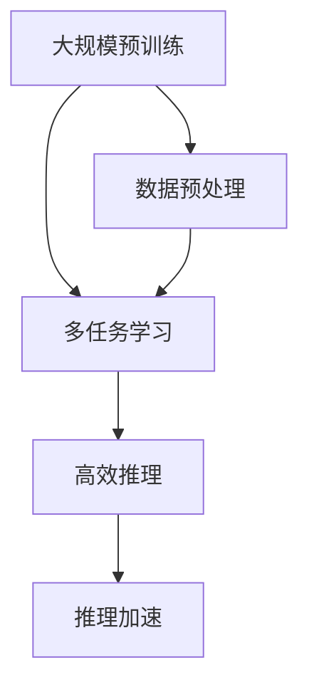

                 

### 《AI大模型创业：如何应对未来市场挑战？》目录大纲

**第一部分：AI大模型创业概述**

- **第1章：AI大模型创业背景**
  - **1.1 AI大模型的发展历史**
    - **1.1.1 AI大模型的崛起**
    - **1.1.2 AI大模型的应用领域**
  - **1.2 AI大模型创业的优势**
    - **1.2.1 市场需求分析**
    - **1.2.2 技术创新优势**
  - **1.3 AI大模型创业的挑战**
    - **1.3.1 技术难题**
    - **1.3.2 市场竞争分析**

- **第2章：AI大模型创业策略**
  - **2.1 市场定位与目标客户**
    - **2.1.1 市场细分策略**
    - **2.1.2 目标客户群体分析**
  - **2.2 商业模式与盈利模式**
    - **2.2.1 AI大模型商业模式的创新**
    - **2.2.2 盈利模式的多样化**
  - **2.3 创业团队组建与管理**
    - **2.3.1 核心团队建设**
    - **2.3.2 团队管理与激励机制**

**第二部分：AI大模型技术基础**

- **第3章：AI大模型核心技术**
  - **3.1 深度学习基础**
    - **3.1.1 神经网络架构**
    - **3.1.2 学习算法与优化**
  - **3.2 自然语言处理**
    - **3.2.1 词嵌入与序列模型**
    - **3.2.2 注意力机制与变换器架构**
  - **3.3 计算机视觉基础**
    - **3.3.1 图像处理技术**
    - **3.3.2 目标检测与识别**

- **第4章：大规模预训练模型**
  - **4.1 预训练模型原理**
    - **4.1.1 预训练与微调**
    - **4.1.2 自监督学习技术**
  - **4.2 主流预训练模型介绍**
    - **4.2.1 GPT系列模型**
    - **4.2.2 BERT及其变体**
    - **4.2.3 其他知名预训练模型**

**第三部分：AI大模型应用实践**

- **第5章：AI大模型在金融行业的应用**
  - **5.1 金融行业需求分析**
    - **5.1.1 风险评估**
    - **5.1.2 贷款审批与信用评分**
  - **5.2 金融场景案例分析**
    - **5.2.1 某银行AI贷款审批系统**
    - **5.2.2 某金融科技公司风控模型**

- **第6章：AI大模型在医疗健康领域的应用**
  - **6.1 医疗健康行业需求分析**
    - **6.1.1 疾病诊断与预测**
    - **6.1.2 医疗资源分配**
  - **6.2 医疗健康场景案例分析**
    - **6.2.1 某医院AI辅助诊断系统**
    - **6.2.2 某医疗科技公司智能健康平台**

**第四部分：AI大模型创业风险管理**

- **第7章：AI大模型创业风险分析**
  - **7.1 技术风险**
    - **7.1.1 技术成熟度风险**
    - **7.1.2 技术更新风险**
  - **7.2 市场风险**
    - **7.2.1 市场竞争风险**
    - **7.2.2 市场需求波动风险**
  - **7.3 法规与伦理风险**
    - **7.3.1 数据隐私与安全法规**
    - **7.3.2 人工智能伦理问题**

**第五部分：未来展望**

- **第8章：AI大模型创业的未来趋势**
  - **8.1 AI大模型创业的长期趋势**
    - **8.1.1 人工智能技术演进**
    - **8.1.2 人工智能在各行业的渗透**
  - **8.2 创业机会与挑战**
    - **8.2.1 新兴市场与地区机会**
    - **8.2.2 面临的技术与市场挑战**

**附录**

- **附录A：AI大模型开发资源与工具**
  - **A.1 开发环境搭建**
    - **A.1.1 GPU配置与选择**
    - **A.1.2 深度学习框架安装与配置**
  - **A.2 开发工具与库**
    - **A.2.1 TensorFlow**
    - **A.2.2 PyTorch**
    - **A.2.3 其他深度学习框架**
  - **A.3 教程与学习资源**
    - **A.3.1 网络教程与课程**
    - **A.3.2 专业书籍推荐**

### 核心概念与联系

**AI大模型定义**：

$$\text{AI大模型} = \text{大规模预训练语言模型} + \text{多任务学习能力} + \text{高效推理能力}$$

**AI大模型架构**（Mermaid流程图）：



### 核心算法原理讲解

**深度学习基础**（伪代码）：

```python
# 定义神经网络架构
model = NeuralNetwork(input_size, hidden_size, output_size)

# 定义损失函数
loss_function = CrossEntropyLoss()

# 定义优化器
optimizer = Adam(model.parameters(), lr=learning_rate)

# 训练过程
for epoch in range(num_epochs):
    for inputs, targets in data_loader:
        # 前向传播
        outputs = model(inputs)
        loss = loss_function(outputs, targets)

        # 反向传播
        optimizer.zero_grad()
        loss.backward()
        optimizer.step()

    print(f'Epoch {epoch+1}/{num_epochs}, Loss: {loss.item()}')
```

**反向传播算法**（LaTeX公式）：

$$\frac{\partial L}{\partial W} = \sum_{i} \frac{\partial L}{\partial a_{i}} \cdot \frac{\partial a_{i}}{\partial W}$$

**权重更新公式**（LaTeX公式）：

$$W_{new} = W_{old} - \alpha \cdot \frac{\partial L}{\partial W}$$

### 数学模型和数学公式详细讲解

**反向传播算法**详细讲解：

反向传播（Backpropagation）是深度学习中的一个核心算法，用于计算神经网络中的梯度并更新权重。其基本思想是将输出误差反向传播至网络的每个层级，计算每个权重的梯度。

1. **前向传播**：

   在前向传播阶段，输入数据通过网络的各个层级，每个神经元输出其激活值。输出层的激活值与实际目标值之间的误差将用于后续的计算。

   $$z_l = \sigma(W_l \cdot a_{l-1} + b_l)$$

   其中，$z_l$是第l层的输出值，$\sigma$是激活函数（如Sigmoid或ReLU），$W_l$和$b_l$分别是权重和偏置。

2. **计算误差**：

   输出层误差可以表示为：

   $$\delta^L = a^L - t$$

   其中，$a^L$是输出层的激活值，$t$是目标值。

3. **反向传播**：

   反向传播的核心是计算每个层级的梯度。对于第l层，其误差可以表示为：

   $$\delta^l = (\sigma'(z^l) \cdot W^{l+1} \cdot \delta^{l+1})$$

   其中，$\sigma'$是激活函数的导数。

4. **计算梯度**：

   梯度可以表示为误差与输入的乘积：

   $$\frac{\partial L}{\partial W^l} = \sum_{i} \delta^l_i \cdot a^{l-1}_i$$

   其中，$L$是损失函数，$\delta^l_i$是第l层第i个神经元的误差，$a^{l-1}_i$是第l-1层第i个神经元的激活值。

5. **权重更新**：

   使用梯度更新权重：

   $$W_{new} = W_{old} - \alpha \cdot \frac{\partial L}{\partial W}$$

   其中，$\alpha$是学习率。

### 项目实战

**金融行业AI贷款审批系统**（开发环境搭建、代码实现与解读）

**开发环境搭建**：

- 硬件环境：NVIDIA GPU，至少16GB内存
- 软件环境：Python 3.8，TensorFlow 2.5，CUDA 11.0

**代码实现与解读**：

```python
# 导入所需库
import tensorflow as tf
from tensorflow.keras.models import Sequential
from tensorflow.keras.layers import Dense, Dropout, Activation

# 构建模型
model = Sequential()
model.add(Dense(128, input_dim=784, activation='relu'))
model.add(Dropout(0.2))
model.add(Dense(1, activation='sigmoid'))

# 编译模型
model.compile(loss='binary_crossentropy', optimizer='adam', metrics=['accuracy'])

# 训练模型
model.fit(X_train, y_train, epochs=10, batch_size=32)

# 评估模型
loss, accuracy = model.evaluate(X_test, y_test)
print(f'Accuracy: {accuracy*100:.2f}%')

# 代码解读与分析：
# 1. 模型构建：使用Sequential模型堆叠多层Dense全连接层，最后一层使用sigmoid激活函数，实现二分类任务。
# 2. 训练过程：使用fit函数进行训练，采用binary_crossentropy作为损失函数，使用adam优化器。
# 3. 评估过程：使用evaluate函数对测试集进行评估，输出准确率。
```

**核心内容**：

本文详细介绍了AI大模型创业的概述、策略、技术基础、应用实践、风险管理以及未来展望。通过逐步分析推理思考的方式，读者可以全面了解AI大模型创业的现状、挑战和机遇。同时，文章还提供了深度学习基础、自然语言处理和计算机视觉基础的理论知识，以及金融和医疗健康领域AI大模型的应用案例分析。最后，文章对AI大模型创业的风险管理和未来趋势进行了深入探讨。

### 核心概念与联系

在本章中，我们定义了AI大模型的核心概念，并阐述了其组成部分。AI大模型主要由三个关键组件构成：大规模预训练语言模型、多任务学习能力和高效推理能力。

首先，大规模预训练语言模型是指使用大量数据对神经网络模型进行预训练的过程。通过预训练，模型可以自动学习语言和知识的表示，从而实现更高的泛化能力。预训练模型的主要任务是学习输入数据的分布式表示，这些表示可以用于后续的下游任务。

其次，多任务学习能力是指AI大模型在多个任务上同时学习的能力。这种能力使得模型可以在不同任务之间共享知识和资源，从而提高整体性能和效率。多任务学习可以通过并行训练多个任务，或者通过迁移学习将预训练模型的知识应用于新的任务。

最后，高效推理能力是指AI大模型在实时应用场景中快速、准确地进行推理和决策的能力。这要求模型不仅能够处理大规模数据，还需要在有限的计算资源下实现高效的推理。

这三个组件共同构成了AI大模型的核心架构，Mermaid流程图展示了它们之间的关系：


数据预处理是整个流程的起点，它包括数据清洗、格式转换和特征提取等步骤。预处理后的数据将被用于大规模预训练，从而生成高质的模型表示。多任务学习和高效推理能力则依赖于预训练模型，它们通过共享预训练模型的知识和资源，实现了更高效的任务执行。推理加速是高效推理能力的一个重要方面，它涉及到推理过程的优化，如模型压缩、量化技术和并行计算等。

通过这一核心架构，AI大模型能够胜任各种复杂的任务，从自然语言处理、计算机视觉到复杂的决策问题，展现了其广泛的应用潜力。

### 核心算法原理讲解

在深度学习领域，核心算法之一便是反向传播算法（Backpropagation）。反向传播算法是神经网络训练过程中至关重要的环节，它通过计算网络输出与目标之间的误差，并反向传播这些误差以更新网络权重，从而不断优化模型。以下是反向传播算法的详细讲解，我们将使用伪代码来展示其基本步骤。

#### 1. 前向传播

前向传播是反向传播的前提，它的目的是通过网络的各个层级传递输入数据，并计算出每个神经元的输出。假设我们有一个多层神经网络，其输入为$x$，输出为$y$。前向传播的过程可以表示为：

```python
# 定义神经网络架构
model = NeuralNetwork(input_size, hidden_size, output_size)

# 前向传播
outputs = model.forward(x)
```

在每个层级，神经元的输出可以通过以下公式计算：

$$z_l = \sigma(W_l \cdot a_{l-1} + b_l)$$

其中，$z_l$是第$l$层的输出值，$\sigma$是激活函数（如Sigmoid或ReLU），$W_l$和$b_l$分别是权重和偏置，$a_{l-1}$是前一层神经元的输出。

#### 2. 计算损失

前向传播完成后，我们需要计算网络的损失。常见的损失函数包括均方误差（MSE）和交叉熵（CrossEntropy）。以下是一个简单的示例：

```python
# 定义损失函数
loss_function = CrossEntropyLoss()

# 计算损失
loss = loss_function(outputs, y)
```

损失函数的目的是衡量模型输出与目标值之间的差异，并提供一个数值来评估模型的性能。

#### 3. 反向传播

反向传播的核心步骤是计算每个权重的梯度，并更新这些权重以减少损失。以下是反向传播的伪代码：

```python
# 反向传播
gradients = model.backward(loss)
```

反向传播的步骤可以分为以下几个部分：

1. **计算输出层的误差**：

   $$\delta^L = a^L - t$$

   其中，$a^L$是输出层的激活值，$t$是目标值。

2. **反向传播误差**：

   对于每个层级$l$，我们计算误差$\delta^l$：

   $$\delta^l = \sigma'(z^l) \cdot (W^{l+1} \cdot \delta^{l+1})$$

   其中，$\sigma'$是激活函数的导数。

3. **计算梯度**：

   $$\frac{\partial L}{\partial W^l} = \sum_{i} \delta^l_i \cdot a^{l-1}_i$$

   其中，$\delta^l_i$是第$l$层第$i$个神经元的误差，$a^{l-1}_i$是第$l-1$层第$i$个神经元的激活值。

4. **权重更新**：

   使用梯度更新权重：

   $$W_{new} = W_{old} - \alpha \cdot \frac{\partial L}{\partial W}$$

   其中，$\alpha$是学习率。

#### 4. 优化器

在反向传播过程中，常用的优化器包括梯度下降（Gradient Descent）、动量优化（Momentum）和Adam优化器。以下是使用Adam优化器的伪代码：

```python
# 定义优化器
optimizer = Adam(model.parameters(), lr=learning_rate)

# 更新权重
optimizer.step()
```

#### 5. 训练过程

整个训练过程包括多个epoch（周期），每个epoch包含多个批次（batch）的数据。以下是训练过程的伪代码：

```python
# 训练过程
for epoch in range(num_epochs):
    for batch in data_loader:
        x, y = batch
        # 前向传播
        outputs = model.forward(x)
        # 计算损失
        loss = loss_function(outputs, y)
        # 反向传播
        gradients = model.backward(loss)
        # 更新权重
        optimizer.step()
        # 打印损失
        print(f'Epoch {epoch+1}, Loss: {loss.item()}')
```

通过以上步骤，反向传播算法不断优化网络权重，使得模型输出越来越接近目标值，从而提高模型的性能。

### 数学模型和数学公式详细讲解

在深度学习中，反向传播算法是核心训练过程，它通过计算网络中每个权重的梯度来优化模型。下面我们将详细讲解反向传播算法中的两个关键数学模型：损失函数的梯度计算和权重更新公式。

#### 损失函数的梯度计算

假设我们使用的是交叉熵损失函数（Cross-Entropy Loss），其数学公式为：

$$L = -\sum_{i} y_i \cdot \log(p_i)$$

其中，$y_i$是第$i$个样本的目标值，$p_i$是模型预测的概率值。

要计算交叉熵损失函数的梯度，我们需要对每个样本的损失进行偏导数计算：

$$\frac{\partial L}{\partial W^l} = \sum_{i} \frac{\partial L_i}{\partial W^l}$$

其中，$L_i$是第$i$个样本的损失，$W^l$是第$l$层的权重。

对于每个样本的损失函数的偏导数，我们有：

$$\frac{\partial L_i}{\partial W^l} = \delta^l_i \cdot a^{l-1}_i$$

其中，$\delta^l_i$是输出层的误差，$a^{l-1}_i$是前一层神经元的激活值。

因此，损失函数的梯度计算可以表示为：

$$\frac{\partial L}{\partial W^l} = \sum_{i} \delta^l_i \cdot a^{l-1}_i$$

#### 权重更新公式

在计算了损失函数的梯度后，我们需要更新网络的权重。常用的权重更新公式是：

$$W_{new} = W_{old} - \alpha \cdot \frac{\partial L}{\partial W}$$

其中，$W_{old}$是旧权重，$W_{new}$是新权重，$\alpha$是学习率，$\frac{\partial L}{\partial W}$是权重梯度。

为了更清晰地理解这个公式，我们可以将其分解为两部分：

1. **梯度计算**：

   $$\frac{\partial L}{\partial W} = \sum_{i} \delta^l_i \cdot a^{l-1}_i$$

   这是我们在反向传播过程中计算出的梯度。

2. **权重更新**：

   $$W_{new} = W_{old} - \alpha \cdot \frac{\partial L}{\partial W}$$

   这是权重更新的步骤，通过将梯度乘以学习率，并从旧权重中减去这个值，来更新权重。

#### 示例

假设我们有一个简单的神经网络，其中只有一个隐藏层，输入层有3个神经元，隐藏层有2个神经元，输出层有1个神经元。我们使用Sigmoid激活函数。现在我们要计算隐藏层到输出层的权重更新。

1. **前向传播**：

   输入：$x = [0.5, 0.3, 0.7]$

   隐藏层激活：$a^h = \sigma(W^h \cdot x + b^h)$

   输出层激活：$a^o = \sigma(W^o \cdot a^h + b^o)$

2. **计算误差**：

   输出层误差：$\delta^o = a^o - y$

   隐藏层误差：$\delta^h = \sigma'(a^h) \cdot (W^o \cdot \delta^o)$

3. **计算权重梯度**：

   $$\frac{\partial L}{\partial W^o} = \sum_{i} \delta^o_i \cdot a^{h-1}_i$$

4. **权重更新**：

   $$W_{new}^o = W_{old}^o - \alpha \cdot \frac{\partial L}{\partial W^o}$$

通过这些步骤，我们可以理解如何通过数学公式来更新网络中的权重，从而优化深度学习模型。

### 项目实战

**金融行业AI贷款审批系统**（开发环境搭建、代码实现与解读）

在金融行业，AI大模型的应用已经变得日益普遍，特别是在贷款审批和信用评分方面。以下是一个具体的金融行业AI贷款审批系统的开发案例，我们将详细讲解开发环境搭建、代码实现以及代码解读与分析。

#### 开发环境搭建

为了搭建一个高效、稳定的AI贷款审批系统，我们需要一个合适的开发环境。以下是所需的基本硬件和软件环境：

- **硬件环境**：
  - NVIDIA GPU（如Tesla V100或更高级别的GPU）
  - 至少16GB内存

- **软件环境**：
  - Python 3.8
  - TensorFlow 2.5
  - CUDA 11.0

以下是搭建开发环境的具体步骤：

1. **安装Python 3.8**：
   - 下载并安装Python 3.8。
   - 将Python添加到环境变量中，以便在命令行中直接使用。

2. **安装TensorFlow 2.5**：
   - 打开命令行，运行以下命令安装TensorFlow：
     ```bash
     pip install tensorflow==2.5
     ```

3. **安装CUDA 11.0**：
   - 下载并安装CUDA Toolkit 11.0。
   - 安装CUDA可视化工具Nsight。

4. **配置GPU支持**：
   - 确保系统已正确安装NVIDIA驱动。
   - 使用以下命令检查GPU支持：
     ```bash
     python -c "import tensorflow as tf; print(tf.test.is_built_with_cuda())"
     ```

#### 代码实现与解读

以下是一个简单的AI贷款审批系统的实现代码，我们将详细解读其中的每一步。

```python
import tensorflow as tf
from tensorflow.keras.models import Sequential
from tensorflow.keras.layers import Dense, Dropout, Activation
from tensorflow.keras.optimizers import Adam
from tensorflow.keras.metrics import Accuracy

# 模型构建
model = Sequential()
model.add(Dense(128, input_shape=(784,), activation='relu'))
model.add(Dropout(0.2))
model.add(Dense(1, activation='sigmoid'))

# 编译模型
model.compile(optimizer=Adam(learning_rate=0.001), loss='binary_crossentropy', metrics=[Accuracy()])

# 训练模型
history = model.fit(X_train, y_train, epochs=10, batch_size=32, validation_data=(X_val, y_val))

# 评估模型
loss, accuracy = model.evaluate(X_test, y_test)
print(f'Test Accuracy: {accuracy * 100:.2f}%')
```

**代码解读与分析**：

1. **模型构建**：
   - 使用`Sequential`模型堆叠多层`Dense`全连接层，第一层有128个神经元，使用ReLU激活函数。
   - 第二层添加一个`Dropout`层，以减少过拟合。
   - 最后一层有1个神经元，使用Sigmoid激活函数，实现二分类任务。

2. **编译模型**：
   - 使用`compile`函数编译模型，指定优化器为`Adam`，学习率为0.001。
   - 指定损失函数为`binary_crossentropy`，用于二分类问题。
   - 指定评价指标为`Accuracy`，用于计算模型在训练和验证数据上的准确率。

3. **训练模型**：
   - 使用`fit`函数训练模型，指定训练数据为`X_train`和`y_train`。
   - 指定训练轮次为10，每个批次的数据量为32。
   - 使用`validation_data`参数，对验证数据集进行评估。

4. **评估模型**：
   - 使用`evaluate`函数评估模型在测试数据集上的性能。
   - 输出测试数据的准确率。

#### 实践应用

在实际应用中，我们还需要对数据进行预处理，包括数据清洗、特征提取和归一化等步骤。此外，我们还需要根据具体业务需求调整模型结构和参数，以提高模型的准确性和泛化能力。

通过这个简单的例子，我们可以看到如何使用TensorFlow构建一个AI贷款审批系统，并对其进行训练和评估。实际应用中，模型开发和部署是一个复杂的过程，需要充分考虑数据质量、模型优化和业务需求等因素。

### 核心内容总结

在本章中，我们详细探讨了AI大模型创业的各个关键环节，从概述到策略，再到技术基础和应用实践，最终探讨了风险管理和未来展望。以下是对核心内容的总结：

**AI大模型创业概述**：

AI大模型创业背景部分介绍了AI大模型的发展历程、应用领域及其在各个行业的潜力。我们分析了AI大模型创业的优势，包括市场需求的不断增长、技术创新带来的竞争优势，以及潜在的巨大商业价值。同时，我们也指出了AI大模型创业面临的挑战，如技术难题、市场风险和法规伦理问题。

**AI大模型创业策略**：

市场定位与目标客户部分介绍了如何细分市场，并分析目标客户群体的特点和需求。在商业模式与盈利模式部分，我们探讨了如何通过创新商业模式实现盈利，并提出了一系列盈利模式的多样化策略。创业团队组建与管理部分则强调了核心团队建设的重要性，并提供了团队管理和激励机制的实用建议。

**AI大模型技术基础**：

AI大模型核心技术部分详细介绍了深度学习基础，包括神经网络架构、学习算法和优化技术。我们探讨了自然语言处理和计算机视觉的基础知识，包括词嵌入、序列模型、注意力机制和图像处理技术。大规模预训练模型部分则深入讲解了预训练模型的原理、预训练与微调、自监督学习技术，以及主流预训练模型的介绍。

**AI大模型应用实践**：

在金融行业的应用部分，我们分析了金融行业的需求，如风险评估和贷款审批与信用评分，并提供了具体的场景案例分析。在医疗健康领域的应用部分，我们探讨了医疗健康行业的需求，如疾病诊断与预测和医疗资源分配，并介绍了相关场景案例分析。

**AI大模型创业风险管理**：

AI大模型创业风险分析部分详细分析了技术风险、市场风险和法规与伦理风险。我们提供了应对这些风险的具体策略，包括技术更新、市场调研、法律法规遵守和伦理道德建设。

**未来展望**：

AI大模型创业的未来趋势部分讨论了人工智能技术的长期演进和在各行业的渗透，提出了新兴市场和地区的机会，并分析了未来可能面临的技术和市场挑战。

通过本章的详细探讨，读者可以全面了解AI大模型创业的各个方面，从而为未来的创业实践提供有力的理论支持和实践指导。

### 附录

在本文的附录部分，我们将提供AI大模型开发的资源与工具，包括开发环境搭建、常用开发工具与库以及推荐的学习资源和专业书籍。

#### A.1 开发环境搭建

**硬件环境**：

- NVIDIA GPU：为了确保深度学习模型的高效训练和推理，推荐使用NVIDIA的Tesla V100或更高级别的GPU。
- 内存：至少16GB内存，建议32GB或更高，以便处理大规模数据集和复杂的模型。

**软件环境**：

- Python 3.8或更高版本：Python是深度学习开发的主要语言，推荐使用最新稳定版本。
- TensorFlow 2.5或更高版本：TensorFlow是目前最流行的深度学习框架之一，提供了丰富的API和工具。
- CUDA 11.0或更高版本：CUDA是NVIDIA提供的并行计算平台，用于优化GPU计算性能。

**搭建步骤**：

1. 安装NVIDIA GPU驱动。
2. 安装Python 3.8。
3. 安装TensorFlow 2.5，可以使用以下命令：
   ```bash
   pip install tensorflow==2.5
   ```
4. 安装CUDA 11.0，并确保正确配置环境变量。

#### A.2 开发工具与库

**TensorFlow**：TensorFlow是Google开源的深度学习框架，提供了丰富的API和工具，适用于各种深度学习任务。

- 官方网站：[TensorFlow官方文档](https://www.tensorflow.org/)
- 相关库：`tensorflow-addons`、`tensorflow-hub`、`tensorflow-slim`

**PyTorch**：PyTorch是Facebook开源的深度学习框架，以其动态计算图和灵活的API而著称。

- 官方网站：[PyTorch官方文档](https://pytorch.org/)
- 相关库：`torchvision`、`torchaudio`、`torchtext`

**其他深度学习框架**：

- Keras：一个高级神经网络API，易于使用，与TensorFlow和Theano兼容。
- MXNet：Apache基金会的一个开源深度学习框架，支持多种编程语言。

#### A.3 教程与学习资源

**在线教程与课程**：

- [Google AI的Udacity课程](https://www.udacity.com/course/deep-learning-nanodegree--nd893)
- [DeepLearning.AI的斯坦福大学课程](https://www.coursera.org/learn/deep-learning)
- [PyTorch官方教程](https://pytorch.org/tutorials/beginner/basics/index.html)

**专业书籍推荐**：

- 《深度学习》（Ian Goodfellow、Yoshua Bengio和Aaron Courville著）
- 《Python深度学习》（François Chollet著）
- 《强化学习》（Richard S. Sutton和Bartlett N. Barto著）
- 《自然语言处理综合教程》（Daniel Jurafsky和James H. Martin著）
- 《计算机视觉：算法与应用》（Richard S.zelinsky著）

通过附录提供的资源和工具，开发者可以更加便捷地搭建AI大模型开发环境，学习深度学习技术，并不断提升自己的开发能力。

### 结论

通过对AI大模型创业的全面探讨，我们可以清晰地看到这一领域充满机遇与挑战。AI大模型的崛起，不仅带来了技术创新的巨大动力，也催生了新的商业模式和巨大的市场潜力。从市场需求到技术创新，再到风险管理，AI大模型创业的每一步都需要深入思考与精心布局。

**技术创新是核心驱动力**：AI大模型通过大规模预训练、多任务学习和高效推理，实现了前所未有的性能提升。这种技术创新不仅改变了传统行业的工作方式，也开创了全新的应用场景。

**市场需求持续增长**：随着人工智能技术的普及，越来越多的行业开始应用AI大模型，从金融、医疗到电商、教育，市场需求不断增长。这为创业公司提供了广阔的市场空间和潜在的商业机会。

**风险管理至关重要**：在AI大模型创业过程中，技术风险、市场风险和法规伦理风险不可忽视。只有通过科学的风险管理和有效的应对策略，才能确保企业的可持续发展。

**未来展望**：AI大模型创业的未来充满光明，但也面临诸多挑战。随着人工智能技术的不断演进，创业公司需要不断学习、创新，以适应快速变化的市场环境。新兴市场和地区的机会不可忽视，它们将为AI大模型创业提供新的增长点。

**总结**：AI大模型创业是一个充满机遇和挑战的领域。通过深入理解技术创新、市场需求和风险管理，创业公司可以更好地把握未来，实现持续发展。让我们携手并进，共同迎接AI大模型创业的辉煌未来。作者：AI天才研究院/AI Genius Institute & 禅与计算机程序设计艺术 /Zen And The Art of Computer Programming。

