                 

## AI大模型创业：如何应对未来技术挑战？

### 关键词：
- AI大模型
- 创业
- 技术挑战
- 数据隐私
- 模型可解释性
- 商业机遇

### 摘要：
本文旨在探讨AI大模型在创业中的重要性及其面临的未来技术挑战。我们将首先介绍AI大模型的基本概念、架构和应用场景，然后深入分析其在工业、服务和医疗领域的应用。接下来，我们将探讨创业中的AI技术挑战，如数据隐私、模型可解释性和可扩展性。此外，我们还将讨论AI大模型在创业中的商业机遇，并通过实际案例进行分析。最后，我们将提供AI大模型开发实践的建议，包括开发环境搭建、数据处理和模型训练优化等。

## 第一部分: AI大模型基础

### 第1章: AI大模型概述

#### 1.1 AI大模型的基本概念

##### 1.1.1 什么是AI大模型

AI大模型是指那些参数规模非常大、能够处理海量数据、并在多个任务中表现出色的深度学习模型。这些模型通过在大量数据上进行训练，可以自动提取特征，并在新的数据上做出准确的预测或决策。

##### 1.1.2 AI大模型的特点

- **大规模参数**：AI大模型的参数数量通常在数十亿到千亿级别，远超传统深度学习模型。
- **高计算需求**：由于参数数量巨大，AI大模型在训练过程中需要大量的计算资源。
- **强大的学习能力**：AI大模型通过大规模预训练，能够从海量数据中提取有用的信息，具有很强的泛化能力。
- **多任务能力**：AI大模型可以同时处理多种任务，具有很高的灵活性。

##### 1.1.3 AI大模型的发展历程

- **早期阶段**：早期的AI大模型如AlexNet、VGG等，主要应用于计算机视觉领域。
- **2018年**：GPT系列模型的出现标志着自然语言处理领域进入大模型时代。
- **2020年**：BERT模型的推出，使得自然语言处理模型的性能大幅提升。
- **2022年**：GPT-3的发布，参数规模达到1750亿，再次刷新了AI大模型的标准。

#### 1.2 AI大模型的架构

##### 1.2.1 计算机视觉模型

计算机视觉模型主要通过卷积神经网络（CNN）来处理图像数据。常见的架构包括VGG、ResNet、Inception等。

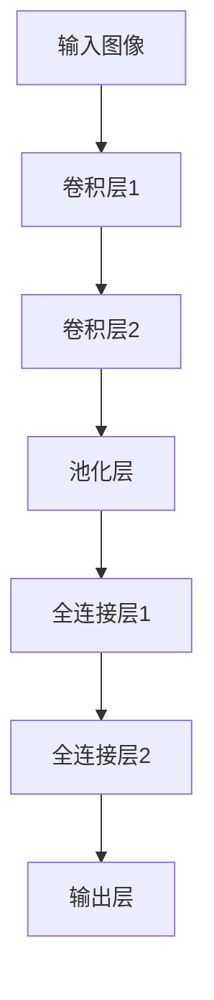

##### 1.2.2 自然语言处理模型

自然语言处理模型主要通过循环神经网络（RNN）或变换器模型（Transformer）来处理文本数据。BERT和GPT系列模型是其中的代表。

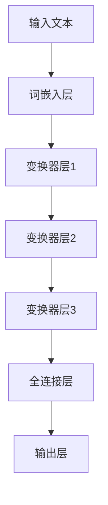

##### 1.2.3 语音识别模型

语音识别模型主要通过长短时记忆网络（LSTM）或变换器模型（Transformer）来处理音频数据。常见的架构包括DeepSpeech、WaveNet等。

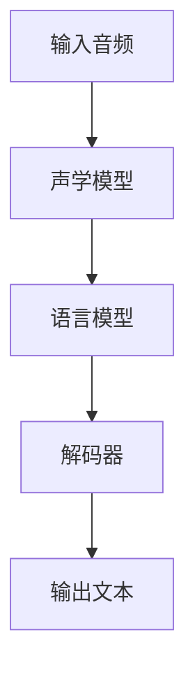

#### 1.3 主流AI大模型介绍

##### 1.3.1 GPT系列模型

GPT系列模型是自然语言处理领域的代表，具有强大的文本生成和理解能力。GPT-3更是达到了1750亿的参数规模。


##### 1.3.2 BERT模型

BERT模型通过预训练和微调，在多种自然语言处理任务中取得了优异的性能。BERT模型具有双向编码的 Transformer 架构。


##### 1.3.3 Transformer模型

Transformer模型是自然语言处理领域的里程碑，通过自注意力机制，能够捕捉长距离的依赖关系。

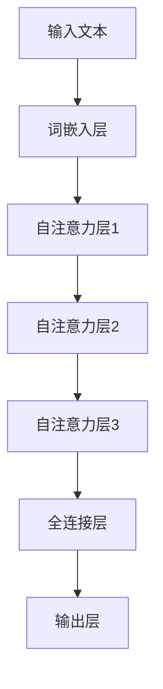

#### 1.4 AI大模型的应用场景

##### 1.4.1 人工智能助手

人工智能助手是AI大模型的一个典型应用场景，可以通过语音或文本与用户进行交互，提供信息查询、任务提醒、智能推荐等服务。

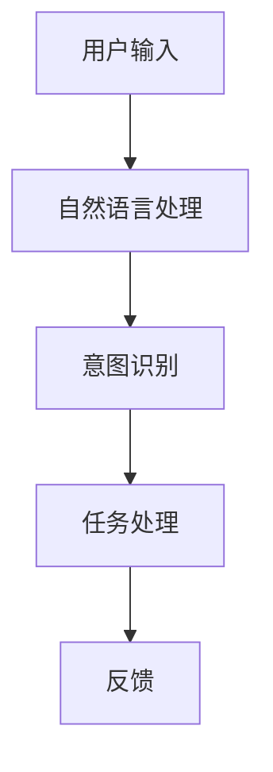

##### 1.4.2 语音识别与合成

语音识别与合成是AI大模型在语音领域的典型应用。通过语音识别，可以将语音转换为文本；通过语音合成，可以将文本转换为语音。


##### 1.4.3 计算机视觉应用

计算机视觉应用是AI大模型在图像处理领域的典型应用，包括图像分类、目标检测、图像生成等。

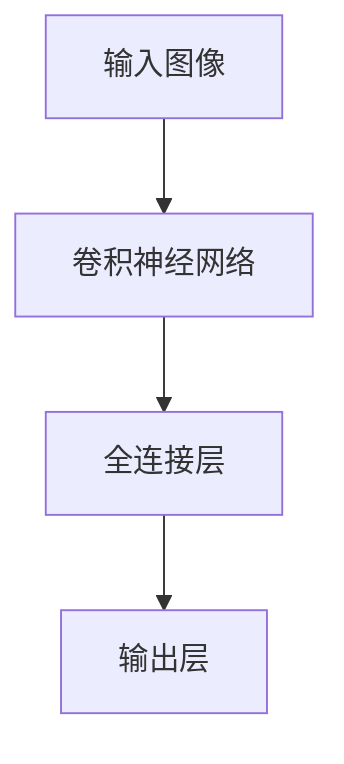

### 第2章: AI大模型技术基础

#### 2.1 深度学习基础

##### 2.1.1 神经网络概述

神经网络是深度学习的基础，通过模拟人脑神经元的工作方式，实现数据的处理和预测。

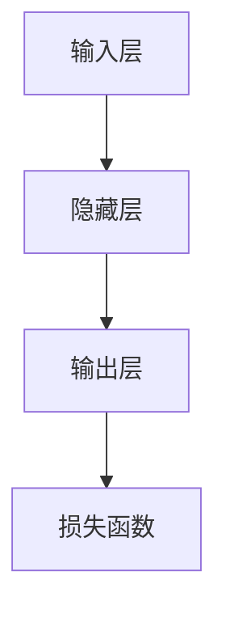

##### 2.1.2 前向传播与反向传播

前向传播和反向传播是神经网络训练的核心算法。前向传播计算输出，反向传播计算梯度。

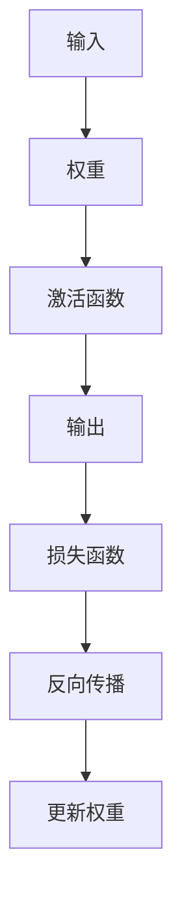

##### 2.1.3 神经网络训练技巧

神经网络训练需要优化策略，如学习率调整、批量大小选择、正则化等。

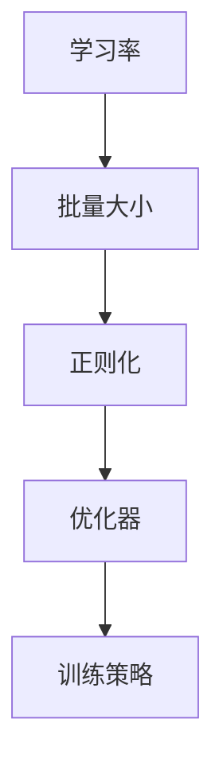

#### 2.2 自然语言处理基础

##### 2.2.1 词嵌入技术

词嵌入技术将词汇映射为高维向量，实现文本数据的数值化。

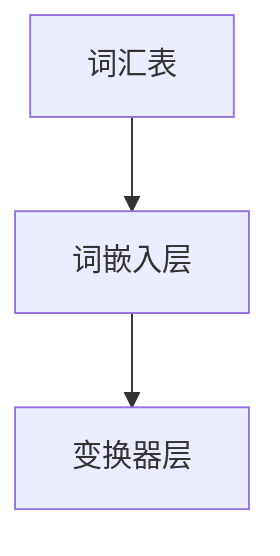

##### 2.2.2 递归神经网络

递归神经网络（RNN）是处理序列数据的有效方法，通过循环结构保存历史信息。

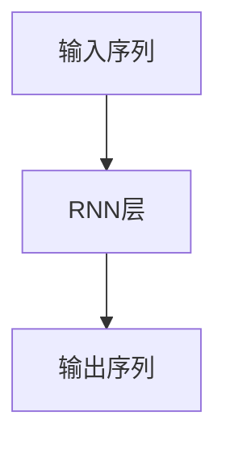

##### 2.2.3 卷积神经网络

卷积神经网络（CNN）在图像处理领域表现出色，通过卷积和池化操作提取特征。

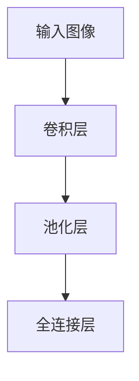

#### 2.3 人工智能算法

##### 2.3.1 监督学习算法

监督学习算法通过有标签的数据进行训练，如线性回归、决策树、支持向量机等。

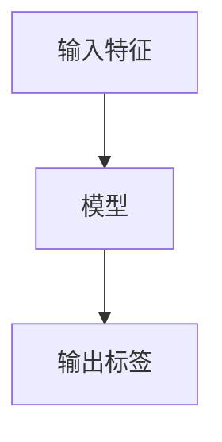

##### 2.3.2 无监督学习算法

无监督学习算法通过无标签的数据进行训练，如聚类、降维、生成对抗网络等。

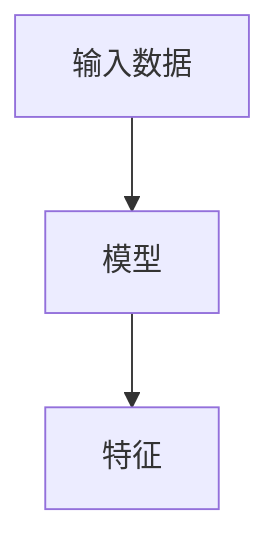

##### 2.3.3 强化学习算法

强化学习算法通过奖励信号进行训练，如Q学习、深度Q网络（DQN）、策略梯度等。

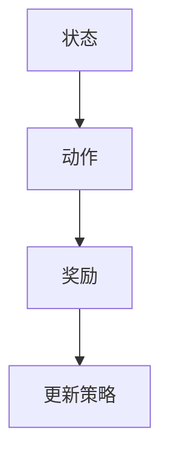

#### 2.4 大规模预训练模型

##### 2.4.1 预训练模型的概念

预训练模型在大规模数据集上进行预训练，然后通过微调应用于特定任务。

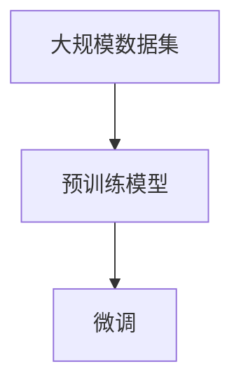

##### 2.4.2 自监督学习

自监督学习利用未标记的数据进行训练，通过预测任务提取特征。

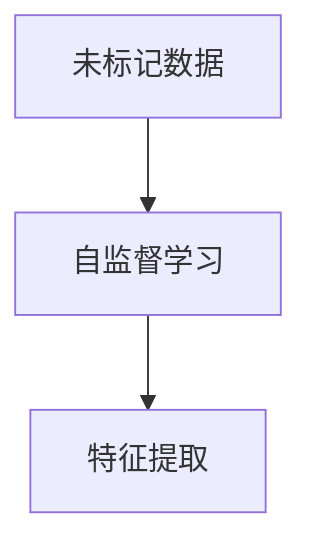

##### 2.4.3 迁移学习与微调

迁移学习利用预训练模型的知识迁移到新任务，微调模型使其适应特定任务。

```mermaid
graph TD
    A[预训练模型] --> B[新任务]
    B --> C[微调]
```

## 第二部分: AI大模型应用

### 第3章: AI大模型在工业中的应用

#### 3.1 人工智能在制造业的应用

##### 3.1.1 智能工厂的概念

智能工厂是利用人工智能技术，实现制造过程的智能化和自动化。通过数据采集、分析和决策，提高生产效率和质量。

##### 3.1.2 机器视觉在制造业中的应用

机器视觉在制造业中用于质量控制、缺陷检测、机器故障诊断等。通过图像处理和分析，实现对生产过程的实时监控和反馈。

```mermaid
graph TD
    A[输入图像] --> B[卷积神经网络]
    B --> C[特征提取]
    C --> D[缺陷检测]
```

##### 3.1.3 机器学习在质量控制中的应用

机器学习在质量控制中用于预测产品质量、优化生产工艺等。通过数据分析和模型训练，提高产品质量和降低生产成本。

```mermaid
graph TD
    A[输入数据] --> B[机器学习模型]
    B --> C[质量预测]
    C --> D[生产工艺优化]
```

#### 3.2 人工智能在服务业的应用

##### 3.2.1 智能客服系统

智能客服系统通过语音识别和自然语言处理技术，实现与用户的实时交互，提供信息查询、问题解答等服务。

```mermaid
graph TD
    A[用户输入] --> B[自然语言处理]
    B --> C[意图识别]
    C --> D[任务处理]
    D --> E[反馈]
```

##### 3.2.2 智能金融分析

智能金融分析通过大数据分析和机器学习算法，实现对金融市场、投资组合和风险管理等领域的智能分析。

```mermaid
graph TD
    A[金融数据] --> B[大数据分析]
    B --> C[机器学习模型]
    C --> D[投资组合优化]
```

##### 3.2.3 智能物流系统

智能物流系统通过物联网和人工智能技术，实现物流信息的实时跟踪、预测和优化，提高物流效率和降低成本。

```mermaid
graph TD
    A[物流信息] --> B[物联网]
    B --> C[人工智能]
    C --> D[物流优化]
```

#### 3.3 人工智能在医疗领域的应用

##### 3.3.1 医疗影像分析

医疗影像分析通过深度学习算法，实现对医学图像的自动分析、诊断和辅助决策。

```mermaid
graph TD
    A[医学图像] --> B[卷积神经网络]
    B --> C[特征提取]
    C --> D[疾病诊断]
```

##### 3.3.2 个性化医疗

个性化医疗通过大数据分析和机器学习算法，实现对个体健康数据的深度挖掘和分析，提供个性化的诊疗方案。

```mermaid
graph TD
    A[健康数据] --> B[大数据分析]
    B --> C[机器学习模型]
    C --> D[个性化诊疗]
```

##### 3.3.3 智能药物研发

智能药物研发通过深度学习和生物信息学技术，实现新药的研发和筛选，提高药物研发的效率和成功率。

```mermaid
graph TD
    A[生物数据] --> B[深度学习模型]
    B --> C[药物筛选]
    C --> D[新药研发]
```

### 第4章: AI大模型在创业中的挑战与机遇

#### 4.1 创业中的AI技术挑战

##### 4.1.1 数据隐私与安全

数据隐私与安全是创业中面临的重大挑战。在AI大模型的应用过程中，大量的数据需要进行处理和存储，如何确保数据的安全性和隐私性成为关键问题。

```mermaid
graph TD
    A[数据采集] --> B[数据存储]
    B --> C[数据加密]
    C --> D[数据监控]
```

##### 4.1.2 模型解释性与可解释性

模型解释性与可解释性是AI大模型在创业中面临的另一个挑战。由于AI大模型的复杂性，其决策过程往往难以解释，这给模型的信任度和可接受性带来了挑战。

```mermaid
graph TD
    A[模型输出] --> B[解释机制]
    B --> C[可解释性]
```

##### 4.1.3 模型可扩展性与可维护性

模型可扩展性与可维护性是AI大模型在创业中面临的第三个挑战。随着业务的发展，模型需要不断更新和优化，如何确保模型的扩展性和可维护性是一个重要问题。

```mermaid
graph TD
    A[模型更新] --> B[模型优化]
    B --> C[模型部署]
```

#### 4.2 创业中的AI商业机遇

##### 4.2.1 新型业务模式

AI大模型为创业提供了新型业务模式，如基于AI的智能咨询、智能服务、智能交易等。

```mermaid
graph TD
    A[AI技术] --> B[业务模式]
    B --> C[商业模式创新]
```

##### 4.2.2 创新产品与服务

AI大模型为创业提供了创新的工具和服务，如智能问答系统、智能语音助手、智能图像识别系统等。

```mermaid
graph TD
    A[AI技术] --> B[产品与服务]
    B --> C[产品创新]
```

##### 4.2.3 AI驱动的企业战略转型

AI大模型为企业提供了战略转型的机会，如通过AI技术优化生产流程、提升客户体验、实现精细化运营等。

```mermaid
graph TD
    A[AI技术] --> B[企业战略]
    B --> C[战略转型]
```

#### 4.3 创业案例分析

##### 4.3.1 案例一：智能客服平台

智能客服平台利用AI大模型，实现与用户的实时交互，提供高效、准确的客服服务。

```mermaid
graph TD
    A[用户输入] --> B[自然语言处理]
    B --> C[意图识别]
    C --> D[任务处理]
    D --> E[反馈]
```

##### 4.3.2 案例二：智能医疗诊断系统

智能医疗诊断系统利用AI大模型，实现对医学图像的自动分析，辅助医生进行疾病诊断。

```mermaid
graph TD
    A[医学图像] --> B[卷积神经网络]
    B --> C[特征提取]
    C --> D[疾病诊断]
```

##### 4.3.3 案例三：智能家居控制系统

智能家居控制系统利用AI大模型，实现家庭设备的智能控制，提升生活品质。

```mermaid
graph TD
    A[家庭设备] --> B[物联网]
    B --> C[人工智能]
    C --> D[家居优化]
```

## 第三部分: AI大模型开发实践

### 第5章: AI大模型开发环境搭建

#### 5.1 开发环境配置

##### 5.1.1 操作系统选择

在AI大模型开发中，常用的操作系统包括Linux和Windows。Linux由于其开源性和高性能，更适合大规模数据处理和分布式计算，而Windows则因其易用性和兼容性，更适合初学者和商业应用。

```mermaid
graph TD
    A[Linux] --> B[开源性]
    B --> C[高性能]
    C --> D[分布式计算]
    A --> E[Windows] --> F[易用性]
    F --> G[兼容性]
```

##### 5.1.2 编程语言选择

在AI大模型开发中，常用的编程语言包括Python、C++和Java。Python因其简洁性和丰富的库支持，是首选语言；C++因其高效性和性能，适用于高性能计算；Java因其稳定性和跨平台性，适用于企业级应用。

```mermaid
graph TD
    A[Python] --> B[简洁性]
    B --> C[库支持]
    A --> D[C++] --> E[高性能]
    A --> F[Java] --> G[稳定性]
```

##### 5.1.3 开发工具与库的选择

在AI大模型开发中，常用的开发工具和库包括TensorFlow、PyTorch和Keras。TensorFlow因其灵活性和广泛的应用，是首选框架；PyTorch因其动态图模型和良好的研究支持，适用于学术研究；Keras因其简洁性和易用性，适合快速原型开发。

```mermaid
graph TD
    A[TensorFlow] --> B[灵活性]
    A --> C[PyTorch] --> D[动态图模型]
    A --> E[Keras] --> F[简洁性]
```

#### 5.2 数据处理与预处理

##### 5.2.1 数据清洗与预处理

数据清洗与预处理是AI大模型开发的重要环节，包括去除无效数据、填补缺失值、归一化处理等。

```mermaid
graph TD
    A[原始数据] --> B[数据清洗]
    B --> C[缺失值填补]
    C --> D[归一化处理]
```

##### 5.2.2 数据增强

数据增强是通过变换原始数据，增加模型的泛化能力。

```mermaid
graph TD
    A[原始数据] --> B[数据增强]
    B --> C[旋转]
    B --> D[缩放]
    B --> E[裁剪]
```

##### 5.2.3 数据存储与管理

数据存储与管理涉及选择合适的数据存储方案和数据管理工具。

```mermaid
graph TD
    A[数据存储] --> B[HDFS]
    A --> C[数据库] --> D[MongoDB]
    C --> E[MySQL]
```

#### 5.3 模型训练与优化

##### 5.3.1 训练策略

训练策略包括选择合适的损失函数、优化器和学习率调整。

```mermaid
graph TD
    A[损失函数] --> B[交叉熵]
    A --> C[均方误差]
    B --> D[优化器] --> E[Adam]
    D --> F[RMSprop]
```

##### 5.3.2 模型优化技巧

模型优化技巧包括批量大小调整、正则化、dropout等。

```mermaid
graph TD
    A[批量大小] --> B[小批量]
    A --> C[正则化] --> D[L1]
    C --> E[dropout]
```

##### 5.3.3 模型评估与调优

模型评估与调优包括选择合适的评估指标、进行交叉验证等。

```mermaid
graph TD
    A[评估指标] --> B[准确率]
    A --> C[召回率]
    A --> D[F1分数]
    D --> E[交叉验证]
```

### 第6章: AI大模型项目实战

#### 6.1 项目一：智能问答系统

##### 6.1.1 项目需求与目标

智能问答系统的目标是提供一个高效、准确的问答平台，能够快速回答用户的问题。

```mermaid
graph TD
    A[用户问题] --> B[自然语言处理]
    B --> C[意图识别]
    C --> D[答案生成]
    D --> E[用户反馈]
```

##### 6.1.2 数据集准备与预处理

数据集准备与预处理包括数据采集、清洗、标注和分割。

```mermaid
graph TD
    A[数据采集] --> B[数据清洗]
    B --> C[数据标注]
    C --> D[数据分割]
```

##### 6.1.3 模型设计与实现

模型设计包括选择合适的神经网络架构，如BERT或GPT。

```mermaid
graph TD
    A[输入文本] --> B[BERT模型]
    B --> C[编码器]
    C --> D[解码器]
```

##### 6.1.4 模型训练与评估

模型训练与评估包括训练过程、验证过程和测试过程。

```mermaid
graph TD
    A[训练数据] --> B[模型训练]
    B --> C[验证数据]
    C --> D[测试数据]
```

#### 6.2 项目二：智能语音助手

##### 6.2.1 项目需求与目标

智能语音助手的目标是提供一个便捷、智能的语音交互平台，能够理解用户的语音指令并执行相应的任务。

```mermaid
graph TD
    A[用户语音指令] --> B[语音识别]
    B --> C[意图识别]
    C --> D[任务执行]
    D --> E[用户反馈]
```

##### 6.2.2 数据集准备与预处理

数据集准备与预处理包括数据采集、清洗、标注和分割。

```mermaid
graph TD
    A[数据采集] --> B[数据清洗]
    B --> C[数据标注]
    C --> D[数据分割]
```

##### 6.2.3 模型设计与实现

模型设计包括选择合适的语音识别模型和自然语言处理模型。

```mermaid
graph TD
    A[输入音频] --> B[声学模型]
    B --> C[语言模型]
    C --> D[解码器]
```

##### 6.2.4 模型训练与评估

模型训练与评估包括训练过程、验证过程和测试过程。

```mermaid
graph TD
    A[训练数据] --> B[模型训练]
    B --> C[验证数据]
    C --> D[测试数据]
```

#### 6.3 项目三：智能图像识别系统

##### 6.3.1 项目需求与目标

智能图像识别系统的目标是提供一个高效、准确的图像识别平台，能够对图像中的物体进行分类和识别。

```mermaid
graph TD
    A[输入图像] --> B[卷积神经网络]
    B --> C[特征提取]
    C --> D[分类与识别]
```

##### 6.3.2 数据集准备与预处理

数据集准备与预处理包括数据采集、清洗、标注和分割。

```mermaid
graph TD
    A[数据采集] --> B[数据清洗]
    B --> C[数据标注]
    C --> D[数据分割]
```

##### 6.3.3 模型设计与实现

模型设计包括选择合适的卷积神经网络架构，如ResNet或Inception。

```mermaid
graph TD
    A[输入图像] --> B[卷积层]
    B --> C[池化层]
    C --> D[全连接层]
    D --> E[输出层]
```

##### 6.3.4 模型训练与评估

模型训练与评估包括训练过程、验证过程和测试过程。

```mermaid
graph TD
    A[训练数据] --> B[模型训练]
    B --> C[验证数据]
    C --> D[测试数据]
```

### 第7章: AI大模型部署与维护

#### 7.1 模型部署

##### 7.1.1 部署流程与策略

模型部署流程包括模型选择、部署环境配置、模型加载和部署等。

```mermaid
graph TD
    A[模型选择] --> B[部署环境配置]
    B --> C[模型加载]
    C --> D[模型部署]
```

##### 7.1.2 部署环境配置

部署环境配置包括选择合适的硬件和软件环境，如GPU服务器、Docker容器等。

```mermaid
graph TD
    A[硬件选择] --> B[GPU服务器]
    A --> C[软件选择] --> D[Docker容器]
```

##### 7.1.3 部署方案与优化

部署方案与优化包括选择合适的部署架构，如服务器部署、边缘计算、云计算等。

```mermaid
graph TD
    A[服务器部署] --> B[边缘计算]
    A --> C[云计算] --> D[部署优化]
```

#### 7.2 模型维护

##### 7.2.1 模型监控与调试

模型监控与调试包括监控模型性能、调试模型问题等。

```mermaid
graph TD
    A[模型性能监控] --> B[调试模型问题]
```

##### 7.2.2 模型更新与升级

模型更新与升级包括更新模型版本、升级模型功能等。

```mermaid
graph TD
    A[模型更新] --> B[模型升级]
```

##### 7.2.3 模型性能评估与优化

模型性能评估与优化包括评估模型性能、优化模型参数等。

```mermaid
graph TD
    A[模型性能评估] --> B[优化模型参数]
```

#### 7.3 模型安全与隐私保护

##### 7.3.1 模型安全威胁分析

模型安全威胁分析包括分析模型面临的攻击类型和潜在威胁。

```mermaid
graph TD
    A[攻击类型分析] --> B[潜在威胁分析]
```

##### 7.3.2 模型安全防护措施

模型安全防护措施包括加密模型参数、防止模型泄漏等。

```mermaid
graph TD
    A[加密模型参数] --> B[防止模型泄漏]
```

##### 7.3.3 模型隐私保护策略

模型隐私保护策略包括数据隐私保护、用户隐私保护等。

```mermaid
graph TD
    A[数据隐私保护] --> B[用户隐私保护]
```

### 附录

#### 附录A: AI大模型常用工具与资源

##### A.1 常用深度学习框架

- TensorFlow：由谷歌开源的深度学习框架，适用于各种深度学习任务。
- PyTorch：由Facebook开源的深度学习框架，具有动态图模型的优势。
- Keras：基于TensorFlow和Theano的深度学习高级API，简化了深度学习模型的构建和训练。

##### A.2 数据处理工具

- Pandas：Python的数据分析库，用于数据清洗、数据处理和分析。
- NumPy：Python的科学计算库，用于数组计算和数据处理。
- SciPy：Python的科学计算库，用于科学和工程计算。

##### A.3 机器学习库

- Scikit-learn：Python的机器学习库，提供各种监督学习和无监督学习算法。
- XGBoost：基于梯度提升决策树的机器学习库，具有高效的性能。
- LightGBM：基于决策树的机器学习库，具有高效的单机处理能力和强的并行性能。

#### 附录B: 模型训练与优化参考

##### B.1 训练策略与技巧

- 梯度下降法：用于训练神经网络的基本优化方法。
- 随机梯度下降法（SGD）：在梯度下降法的基础上，随机选择样本进行优化。
- 动量法：在梯度下降法的基础上，引入动量项，加速收敛。

##### B.2 优化器介绍

- Adam优化器：结合了SGD和RMSprop优化的优点，适用于快速收敛。
- RMSprop优化器：基于均方误差的优化方法，适用于小批量训练。
- AdaGrad优化器：基于梯度平方和的优化方法，适用于不同规模的数据。

##### B.3 调参技巧

- 网络结构调参：调整网络层数、神经元数量等。
- 学习率调参：调整学习率的初始值和衰减策略。
- 激活函数与损失函数选择：选择合适的激活函数和损失函数，提高模型性能。

#### 附录C: AI大模型应用案例分析

##### C.1 案例一：自动驾驶技术

- 案例背景与目标：自动驾驶技术的目标是实现车辆的自主驾驶，提高交通效率和安全性。
- 模型设计与实现：采用卷积神经网络和循环神经网络结合的模型，处理图像和语音数据。
- 模型训练与评估：在大量模拟数据和真实数据上进行训练和评估，优化模型性能。

##### C.2 案例二：智能语音助手

- 案例背景与目标：智能语音助手的目的是提供便捷、智能的语音交互服务。
- 模型设计与实现：采用声学模型和语言模型结合的模型，处理语音数据。
- 模型训练与评估：在大量语音数据和文本数据上进行训练和评估，优化模型性能。

##### C.3 案例三：智能医疗诊断

- 案例背景与目标：智能医疗诊断的目的是辅助医生进行疾病诊断，提高诊断准确率。
- 模型设计与实现：采用卷积神经网络和循环神经网络结合的模型，处理医学图像和文本数据。
- 模型训练与评估：在大量医学数据和文本数据上进行训练和评估，优化模型性能。

