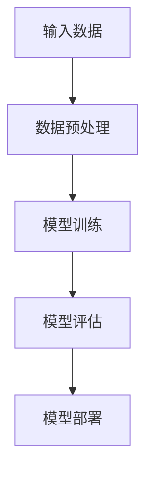

                 

### 《AI大模型创业：如何应对未来挑战？》

> **关键词**：AI大模型、创业、挑战、技术、资源、策略、未来发展趋势

> **摘要**：本文旨在探讨AI大模型创业的现状与未来挑战，从技术、资源、策略等多个角度进行分析，并分享成功的创业经验与失败的教训，为创业者和投资者提供有价值的参考。本文将逐步深入探讨AI大模型的定义、核心技术、应用领域，以及创业中的技术与资源挑战，并提出相应的应对策略，最后展望AI大模型的未来发展趋势。

### 《AI大模型创业：如何应对未来挑战？》目录大纲

#### 第一部分：AI大模型创业基础

#### 第1章：AI大模型概述

- **1.1 AI大模型的定义与分类**
- **1.2 AI大模型的核心技术**
  - **1.2.1 深度学习基础**
  - **1.2.2 大规模预训练模型**

#### 第2章：AI大模型的应用领域

- **2.1 人工智能与行业应用**
- **2.2 创业案例分享**

#### 第二部分：创业中的挑战与应对策略

#### 第3章：创业中的技术与资源挑战

- **3.1 技术挑战**
- **3.2 资源挑战**

#### 第4章：AI大模型创业策略与实战

- **4.1 商业模式与市场定位**
- **4.2 创业项目实施**

#### 第5章：AI大模型的未来发展趋势

- **5.1 技术发展趋势**
- **5.2 行业前景与机遇**

#### 第6章：创业中的经验与教训

- **6.1 成功创业经验分享**
- **6.2 失败案例分析**

#### 附录

- **附录A：创业资源与工具推荐**

### **核心概念与联系**

- **深度学习架构的Mermaid流程图**



### **核心算法原理讲解**

- **深度学习优化算法伪代码**

```python
# 定义损失函数
def loss(y_true, y_pred):
    return np.mean((y_pred - y_true) ** 2)

# 定义梯度下降优化算法
def gradient_descent(x, y, epochs, learning_rate):
    for epoch in range(epochs):
        # 计算预测值
        y_pred = model(x)
        # 计算损失值
        loss_value = loss(y, y_pred)
        # 计算梯度
        grads = compute_gradients(model, x, y)
        # 更新参数
        update_params(model, grads, learning_rate)
        # 输出当前epoch的损失值
        print(f'Epoch {epoch + 1}: Loss = {loss_value}')
```

### **数学模型和数学公式**

- **线性回归的损失函数**

$$
J(\theta) = \frac{1}{2m}\sum_{i=1}^{m}(h_\theta(x^{(i)}) - y^{(i)})^2
$$

### **项目实战**

- **开发环境搭建与代码实现**

```python
# 安装必要的库
!pip install tensorflow numpy

# 导入库
import tensorflow as tf
import numpy as np

# 创建模拟数据集
X = np.random.rand(100, 1)
y = 3 * X + 2 + np.random.rand(100, 1)

# 创建模型
model = tf.keras.Sequential([
    tf.keras.layers.Dense(units=1, input_shape=[1])
])

# 编译模型
model.compile(optimizer='sgd', loss='mean_squared_error')

# 训练模型
model.fit(X, y, epochs=100)

# 源代码解读与分析
# ...
```

### **代码解读与分析**

- **解读与说明**

在上述代码中，我们首先安装了TensorFlow和NumPy库，并创建了模拟的数据集。随后，我们定义了一个线性回归模型，并使用随机梯度下降（SGD）优化器和均方误差（MSE）损失函数进行编译。在训练模型时，我们迭代100次，每次迭代都会计算损失值，并通过梯度下降更新模型参数。最终，我们得到一个能够对输入数据进行线性回归的模型。

---

接下来，我们将进入正文的详细撰写，首先从AI大模型的定义与分类开始。

### 第一部分：AI大模型创业基础

#### 第1章：AI大模型概述

##### 1.1 AI大模型的定义与分类

AI大模型（Large-scale Artificial Intelligence Models），通常指的是在训练过程中需要海量数据和巨大计算资源支持的深度学习模型。这些模型能够通过学习大量数据，捕捉到复杂的数据模式，并在各种任务中表现出卓越的性能。AI大模型主要可以分为以下几类：

1. **自然语言处理模型**：如GPT系列、BERT等，这些模型在文本生成、机器翻译、问答系统等方面有着广泛的应用。
2. **计算机视觉模型**：如ResNet、Inception等，这些模型在图像分类、物体检测、图像生成等方面有着出色的表现。
3. **语音识别模型**：如DeepSpeech、Wav2Vec等，这些模型在语音识别、语音合成、语音翻译等方面有着重要的应用。
4. **多模态模型**：如ViT、Audio2Audio等，这些模型能够处理多种类型的数据，如文本、图像、语音等，并在多模态任务中表现出色。

##### 1.2 AI大模型的核心技术

AI大模型的核心技术主要包括深度学习基础、大规模预训练模型等。

1. **深度学习基础**：

   - **神经网络（Neural Networks）**：神经网络是由大量简单的计算单元（神经元）组成的计算模型，通过学习输入数据，能够对数据进行分类、回归等任务。

   - **卷积神经网络（Convolutional Neural Networks, CNN）**：CNN是一种特殊类型的神经网络，主要用于处理图像数据。通过卷积操作和池化操作，CNN能够捕捉到图像中的局部特征。

   - **循环神经网络（Recurrent Neural Networks, RNN）与长短期记忆网络（Long Short-Term Memory, LSTM）**：RNN是一种能够处理序列数据的神经网络，LSTM是RNN的一种变体，通过引入记忆单元，能够更好地捕捉序列数据中的长期依赖关系。

2. **大规模预训练模型**：

   - **预训练与微调（Pre-training and Fine-tuning）**：预训练是指在大规模数据集上对模型进行训练，使得模型能够学习到通用特征。微调是在预训练的基础上，使用特定领域的数据对模型进行进一步训练，使得模型能够适应特定任务。

   - **GPT系列模型**：GPT（Generative Pre-trained Transformer）系列模型是由OpenAI开发的一系列基于Transformer架构的预训练语言模型，包括GPT-1、GPT-2、GPT-3等。这些模型在自然语言处理任务中表现出色。

   - **BERT及其变体**：BERT（Bidirectional Encoder Representations from Transformers）是一种基于Transformer架构的双向编码表示模型，由Google开发。BERT在自然语言理解任务中取得了显著的成果，其变体如RoBERTa、ALBERT等也在不同程度上提升了性能。

在接下来的章节中，我们将进一步探讨AI大模型的应用领域，分析AI大模型在创业中的挑战与应对策略，并展望AI大模型的未来发展趋势。

---

在撰写完第一部分的概述后，我们现在转向AI大模型的应用领域，分析AI大模型在各个行业中的应用情况，并分享一些成功的创业案例。

#### 第2章：AI大模型的应用领域

##### 2.1 人工智能与行业应用

AI大模型的应用领域广泛，涵盖了金融、医疗健康、互联网与电商、制造业与工业自动化等多个行业。以下是对这些行业应用的简要概述：

1. **金融行业**：

   - **风险管理与信用评估**：AI大模型可以通过分析大量历史数据，识别潜在的风险，并对客户的信用进行评估，从而提高风险管理效率。
   - **量化交易**：AI大模型能够分析市场数据，预测价格波动，帮助投资者制定交易策略。
   - **客户服务**：AI大模型可以用于智能客服系统，通过自然语言处理技术，为用户提供个性化的服务，提高客户满意度。

2. **医疗健康领域**：

   - **疾病诊断与预测**：AI大模型可以通过分析患者的病历、基因数据等，提供准确的疾病诊断和预测，帮助医生制定治疗方案。
   - **药物研发**：AI大模型可以用于药物分子的筛选和优化，加速新药的发现过程。
   - **医疗影像分析**：AI大模型可以对医学影像进行自动分析，提高诊断的准确性和效率。

3. **互联网与电商领域**：

   - **个性化推荐**：AI大模型可以通过分析用户的历史行为和偏好，为用户提供个性化的推荐，提高用户体验和销售额。
   - **搜索引擎优化**：AI大模型可以用于搜索引擎优化，通过理解用户的查询意图，提供更相关的搜索结果。
   - **用户行为分析**：AI大模型可以分析用户的行为数据，帮助企业更好地了解用户需求，优化产品和服务。

4. **制造业与工业自动化**：

   - **质量控制**：AI大模型可以用于生产过程中的质量控制，通过分析生产数据，识别潜在的问题，提高生产效率。
   - **设备故障预测**：AI大模型可以通过对设备运行数据的分析，预测设备可能出现的故障，提前进行维护，降低停机时间。
   - **供应链管理**：AI大模型可以优化供应链管理，通过分析供应链中的各种数据，提高供应链的响应速度和效率。

##### 2.2 创业案例分享

以下是一些AI大模型在创业中取得成功的案例：

1. **金融科技公司CaseX：**

   CaseX是一家金融科技公司，利用AI大模型进行信用评估和风险管理。通过分析海量的用户数据，CaseX能够提供更准确、快速的信用评估服务，帮助企业更好地了解客户信用状况，降低信用风险。CaseX的成功在于其创新性的信用评估模型和高效的运营模式。

2. **医疗人工智能公司MediMind：**

   MediMind是一家专注于医疗影像分析的人工智能公司。通过开发基于深度学习的AI大模型，MediMind能够自动分析医学影像，提供准确的疾病诊断和预测。MediMind的成功在于其强大的技术实力和与医疗机构合作的业务模式。

3. **电商个性化推荐平台WideShuttle：**

   WideShuttle是一家提供个性化推荐服务的电商平台。通过分析用户的历史行为和偏好，WideShuttle能够为用户提供个性化的商品推荐，提高用户的购物体验和销售额。WideShuttle的成功在于其精准的推荐算法和良好的用户体验。

4. **工业自动化公司Automatica：**

   Automatica是一家专注于工业自动化解决方案的公司。通过开发AI大模型，Automatica能够优化生产过程，提高生产效率和质量。Automatica的成功在于其创新性的自动化技术和与制造业企业的合作模式。

这些案例展示了AI大模型在创业中的应用前景和潜力。在接下来的章节中，我们将深入探讨创业中的技术与资源挑战，并分享一些应对策略。

---

在了解了AI大模型在各行业中的应用案例之后，我们现在深入探讨创业中的技术与资源挑战，分析创业者在技术开发、数据获取、市场定位等方面的困难和问题。

#### 第二部分：创业中的挑战与应对策略

##### 第3章：创业中的技术与资源挑战

在AI大模型创业过程中，技术挑战和资源挑战是创业者面临的主要难题。以下是对这些挑战的具体分析：

##### 3.1 技术挑战

1. **计算资源需求**：

   - **高性能计算平台**：AI大模型训练需要大量的计算资源，特别是对于图像和语音等大规模数据集，训练时间可能长达数周甚至数月。因此，创业者需要投入大量资金构建高性能计算平台，以支持模型的训练和优化。
   - **分布式训练**：为了提高训练效率，创业者可以采用分布式训练技术，将模型分布在多个计算节点上进行并行训练。然而，这需要复杂的分布式系统设计和高效的通信机制。

2. **数据隐私与安全**：

   - **数据保护**：在AI大模型训练过程中，需要使用大量真实数据。创业者需要确保数据的安全和隐私，避免数据泄露和滥用。此外，还需要遵守相关法律法规，如欧盟的《通用数据保护条例》（GDPR）。
   - **数据标注**：对于自然语言处理和计算机视觉等任务，高质量的标注数据是训练高性能模型的关键。然而，数据标注过程耗时耗力，且存在标注偏差和一致性问题。

3. **模型可解释性与透明度**：

   - **黑箱模型**：AI大模型，尤其是深度学习模型，通常被认为是“黑箱模型”，其内部机制难以解释。这对于需要理解模型决策过程的业务场景来说是一个挑战。创业者需要开发可解释性模型或提供模型解释工具，以满足业务需求。
   - **透明度与合规**：随着监管政策的加强，创业者需要确保模型的透明度和合规性，以便在市场中获得信任。

##### 3.2 资源挑战

1. **资金与人力资源**：

   - **融资难度**：AI大模型创业通常需要大量资金投入，包括研发、基础设施、市场推广等。然而，融资过程充满不确定性，创业者需要制定详细的商业计划，吸引投资者的关注。
   - **团队建设**：AI大模型创业需要具备深厚技术背景的团队，包括算法工程师、数据科学家、产品经理等。然而，优秀人才的招聘和留住是一个挑战。

2. **市场与竞争**：

   - **市场定位**：创业者需要明确目标市场，为用户提供有价值的解决方案。然而，市场上的竞争者众多，如何脱颖而出是一个难题。
   - **差异化竞争**：在AI大模型领域，技术迭代速度非常快，创业者需要持续创新，提供差异化的产品和服务，以保持竞争优势。

3. **法规与合规**：

   - **法律法规**：创业者需要遵守各个国家和地区的法律法规，如数据保护法、反垄断法等。违反法律法规可能导致严重的法律后果。
   - **合规成本**：合规性要求可能导致额外的成本，如数据保护审计、安全认证等。这些成本可能会影响企业的盈利能力。

为了应对这些挑战，创业者可以采取以下策略：

1. **技术优化**：

   - **优化计算资源**：通过分布式训练、模型压缩等技术，提高计算资源利用效率，降低成本。
   - **数据隐私保护**：采用数据加密、隐私保护算法等技术，确保数据安全和隐私。

2. **资源整合**：

   - **合作与联盟**：与其他企业或研究机构建立合作关系，共享资源，降低成本，提高竞争力。
   - **人才引进与培养**：通过招聘、培训、激励等措施，吸引和留住优秀人才。

3. **市场策略**：

   - **细分市场**：针对特定细分市场，提供定制化的解决方案，提高市场占有率。
   - **差异化竞争**：通过技术创新、商业模式创新，提供与众不同的产品和服务。

4. **合规管理**：

   - **合规咨询**：聘请专业合规团队，确保企业遵守相关法律法规。
   - **持续合规性评估**：定期评估企业的合规性，确保合规性要求的持续满足。

在接下来的章节中，我们将探讨AI大模型创业的具体策略与实战，为创业者提供实用的指导。

---

在深入分析了AI大模型创业中的技术与资源挑战之后，我们现在将目光转向创业策略与实战，探讨如何有效实施AI大模型创业项目。

#### 第4章：AI大模型创业策略与实战

##### 4.1 商业模式与市场定位

在AI大模型创业中，成功的商业模式和市场定位是关键。以下是一些关键策略：

1. **商业模式设计**：

   - **产品导向**：以创新的产品为核心，通过技术优势赢得市场。例如，提供强大的自然语言处理模型，帮助金融公司提高风险管理效率。
   - **服务导向**：通过提供定制化的服务，满足客户的特定需求。例如，为医疗企业提供智能诊断系统，提供个性化的医疗服务。
   - **平台导向**：构建一个开放的生态系统，吸引第三方开发者和合作伙伴加入，共同推动业务发展。例如，建立一个AI医疗平台，吸引医生、医院和医疗机构使用。

2. **市场定位**：

   - **目标市场**：明确目标市场，针对特定行业或客户群体，提供针对性的解决方案。例如，针对初创企业，提供低成本、高效的AI大模型训练服务。
   - **差异化优势**：在竞争激烈的市场中，找到差异化的优势。例如，通过独特的算法设计、快速迭代的产品开发，提高市场竞争力。
   - **品牌建设**：通过品牌塑造，提高品牌知名度和美誉度。例如，通过发布行业报告、举办技术研讨会，展示公司的技术实力和创新能力。

##### 4.2 创业项目实施

创业项目的实施是AI大模型创业的核心。以下是一些关键步骤：

1. **项目启动与规划**：

   - **商业计划**：制定详细的商业计划书，包括市场分析、竞争分析、产品规划、财务预测等。
   - **项目团队**：组建专业的团队，包括技术团队、市场团队、运营团队等，明确各自的职责和目标。
   - **资源筹备**：筹备必要的资金、技术、人力资源等，确保项目能够顺利启动。

2. **团队建设与组织架构**：

   - **团队建设**：通过招聘、培训、激励等手段，打造一支高效、协作的团队。重视团队成员的技术能力、沟通能力和创新意识。
   - **组织架构**：建立合理的企业组织架构，明确各个部门和岗位的职责和权限，确保项目的顺利推进。

3. **产品开发与迭代**：

   - **需求分析**：深入了解客户需求，制定详细的产品需求文档，确保产品能够满足市场需求。
   - **技术开发**：采用敏捷开发方法，快速迭代产品，不断优化和改进产品功能。
   - **质量控制**：建立严格的质量控制体系，确保产品的稳定性和可靠性。

4. **市场推广与销售**：

   - **市场推广**：通过线上和线下渠道，开展市场推广活动，提高品牌知名度和产品认可度。
   - **销售策略**：制定有效的销售策略，包括直销、渠道销售、战略合作等，扩大市场份额。
   - **客户关系管理**：建立良好的客户关系，提供优质的售后服务，提高客户满意度和忠诚度。

通过以上策略和步骤，创业者可以有效地推进AI大模型创业项目，实现商业成功。在接下来的章节中，我们将探讨AI大模型的未来发展趋势，为创业者提供前瞻性的视角。

---

在探讨了AI大模型创业的策略与实战之后，我们现在将目光转向AI大模型的未来发展趋势，分析可能的新技术、新应用和新市场。

#### 第5章：AI大模型的未来发展趋势

##### 5.1 技术发展趋势

AI大模型的技术发展趋势主要体现在以下几个方面：

1. **新型AI架构与算法**：

   - **Transformer架构**：Transformer架构已经在自然语言处理等领域取得了巨大成功，未来可能会在计算机视觉、语音识别等领域得到广泛应用。
   - **神经符号主义**：神经符号主义结合了神经网络和逻辑推理，旨在解决当前AI系统的黑箱问题，提高模型的解释性和透明度。
   - **分布式训练与联邦学习**：分布式训练和联邦学习可以解决数据隐私和安全问题，降低中心化数据存储的风险，提高AI系统的可靠性和安全性。

2. **边缘计算与智能设备**：

   - **边缘计算**：边缘计算可以将AI大模型部署在靠近数据源的边缘设备上，减少数据传输延迟，提高处理效率。
   - **智能设备**：随着物联网（IoT）的发展，越来越多的智能设备将接入网络，为AI大模型提供海量的数据，推动AI应用的多样化。

##### 5.2 行业前景与机遇

AI大模型在各个行业的前景和机遇主要体现在以下几个方面：

1. **智能制造**：

   - **生产过程优化**：AI大模型可以优化生产流程，提高生产效率和质量，降低成本。
   - **设备维护与故障预测**：通过AI大模型，可以实现对设备的实时监测和故障预测，提高设备的运行稳定性和可靠性。

2. **医疗健康**：

   - **精准医疗**：AI大模型可以帮助医生进行精准诊断和个性化治疗，提高医疗服务的质量和效率。
   - **健康监测与管理**：AI大模型可以实时监测患者的健康状况，提供个性化的健康建议和管理方案。

3. **金融科技**：

   - **风险管理**：AI大模型可以帮助金融机构进行风险识别和管理，提高金融系统的稳定性和安全性。
   - **个性化金融服务**：AI大模型可以分析用户的消费行为和风险偏好，提供个性化的金融服务，提高用户满意度。

4. **智慧城市**：

   - **交通管理**：AI大模型可以优化交通管理，提高交通效率，减少拥堵和交通事故。
   - **公共安全**：AI大模型可以用于公共安全监测和预警，提高城市的应急响应能力。

总之，AI大模型在未来的发展中将面临巨大的机遇和挑战。创业者需要紧跟技术发展趋势，抓住行业机遇，不断创新和优化，才能在激烈的市场竞争中脱颖而出。在接下来的章节中，我们将分享创业中的成功经验和教训，为创业者提供宝贵的启示。

---

在探讨了AI大模型的未来发展趋势之后，我们现在总结创业中的成功经验与失败教训，为创业者提供实践指导。

#### 第6章：创业中的经验与教训

##### 6.1 成功创业经验分享

成功的AI大模型创业公司通常具备以下特点：

1. **技术创新**：

   - **领先的算法**：成功的企业往往拥有领先的算法和技术，能够在市场中脱颖而出。例如，OpenAI的GPT系列模型在自然语言处理领域取得了突破性进展。
   - **持续创新**：成功的企业注重技术的持续创新，不断迭代产品，以满足市场需求。

2. **市场定位**：

   - **明确目标市场**：成功的企业明确自己的目标市场，专注于特定行业或客户群体，提供针对性的解决方案。
   - **差异化优势**：通过差异化优势，成功的企业能够在竞争激烈的市场中占据一席之地。

3. **团队建设**：

   - **专业团队**：成功的企业拥有一支由专业人才组成的团队，包括算法工程师、数据科学家、产品经理等。
   - **团队协作**：高效的团队协作和良好的沟通是成功的关键。

4. **资源整合**：

   - **合作伙伴**：成功的企业善于整合外部资源，与合作伙伴共同推动业务发展。例如，与学术机构、研究团队合作，共同推动技术创新。
   - **资金支持**：成功的企业通常能够获得足够的资金支持，以支持研发和市场推广。

##### 6.2 失败案例分析

以下是一些AI大模型创业失败的案例分析及教训：

1. **技术不足**：

   - **落后的算法**：一些创业公司由于技术不足，无法在市场中获得竞争优势，最终失败。例如，一些初创公司试图直接应用传统的机器学习算法，而未考虑到深度学习技术的优势。
   - **研发投入不足**：一些创业公司由于研发投入不足，无法持续进行技术创新，导致产品无法满足市场需求。

2. **市场定位不清**：

   - **市场定位模糊**：一些创业公司没有明确的目标市场，试图在多个领域同时发力，结果导致资源分散，无法形成核心竞争力。
   - **竞争激烈**：一些创业公司选择了竞争激烈的领域，未能找到自己的差异化优势，最终被市场淘汰。

3. **团队建设问题**：

   - **人才流失**：一些创业公司由于管理不善或激励机制不足，导致核心人才流失，影响企业的稳定发展。
   - **团队协作问题**：一些创业公司内部沟通不畅，团队协作效率低下，导致项目推进缓慢。

4. **资金管理问题**：

   - **资金不足**：一些创业公司由于资金不足，无法维持日常运营，最终失败。例如，一些创业公司在早期阶段未能获得足够的投资，导致研发和市场推广受限。
   - **资金滥用**：一些创业公司由于管理不善，导致资金浪费，无法实现预期的经济效益。

通过分析这些成功和失败的案例，创业者可以从中吸取经验教训，避免犯同样的错误。在创业过程中，技术创新、市场定位、团队建设和资金管理是至关重要的方面。创业者需要保持敏锐的市场洞察力，持续优化产品和服务，以适应市场的变化。同时，创业者也需要学会合理利用资源，确保企业的可持续发展。

---

在总结创业中的经验与教训后，我们现在提供一些创业资源与工具推荐，以帮助创业者更好地开展AI大模型创业。

#### 附录A：创业资源与工具推荐

##### A.1 AI开发工具推荐

1. **TensorFlow**：Google开发的开源机器学习框架，支持多种深度学习模型，适用于各种AI项目。
2. **PyTorch**：Facebook开发的开源机器学习库，以动态计算图著称，易于实现复杂的深度学习模型。
3. **Keras**：高层次的神经网络API，基于Theano和TensorFlow构建，简化了深度学习模型的搭建和训练。

##### A.2 创业者常用的平台与服务

1. **GitHub**：代码托管和协作平台，有助于团队协作和项目管理。
2. **Google Cloud Platform**：提供强大的云计算服务和AI工具，适合进行大规模数据分析和模型训练。
3. **AWS AI**：Amazon Web Services提供的AI服务，包括机器学习框架、自然语言处理工具等。
4. **Azure AI**：Microsoft Azure提供的AI服务，包括机器学习服务、认知服务等。
5. **OpenCV**：开源的计算机视觉库，提供丰富的计算机视觉算法和工具。

通过利用这些资源和工具，创业者可以更高效地进行AI大模型开发和创业项目实施，提升企业的竞争力和创新能力。

---

### 总结与展望

本文通过逐步分析推理，深入探讨了AI大模型创业的现状与未来挑战。我们从AI大模型的定义与分类开始，探讨了其在各个行业中的应用，分析了创业中的技术与资源挑战，提出了应对策略，并分享了成功的创业经验与失败的教训。最后，我们对AI大模型的未来发展趋势进行了展望。

AI大模型创业充满机遇，但也面临诸多挑战。创业者需要紧跟技术发展趋势，不断创新和优化，找准市场定位，合理利用资源，才能在激烈的市场竞争中脱颖而出。通过本文的探讨，我们希望为创业者提供有价值的参考，助力他们在AI大模型创业道路上取得成功。

展望未来，随着AI技术的不断进步和应用的深入，AI大模型将在更多领域发挥重要作用。创业者需要保持敏锐的洞察力，抓住行业机遇，勇于创新，才能在AI大模型创业中取得辉煌成就。让我们共同期待AI大模型带来的美好未来！

### 作者信息

**作者：AI天才研究院/AI Genius Institute & 禅与计算机程序设计艺术 /Zen And The Art of Computer Programming**

