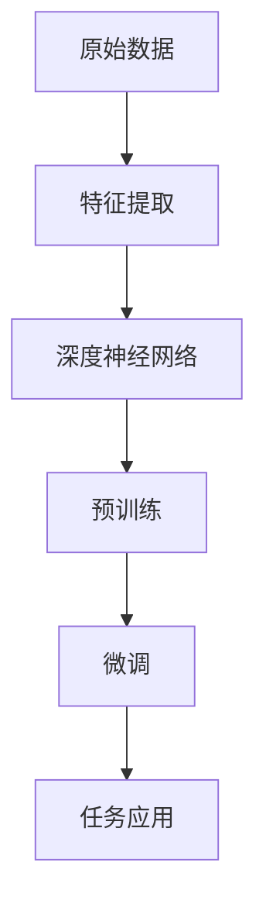
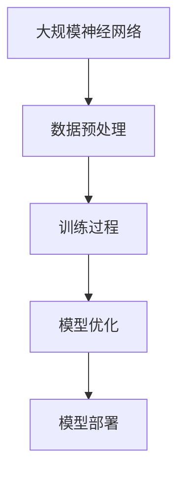

                 

# 《AI大模型创业：泡沫还是金矿？分析、思考与探讨》

> 关键词：人工智能大模型、创业、技术挑战、市场前景、案例分析

> 摘要：本文将深入探讨人工智能大模型创业的潜在机遇与挑战。我们将分析AI大模型的基础知识，探讨其在不同行业中的应用与挑战，分析成功与失败的创业案例，并提出有效的创业策略与风险管理措施。

----------------------------------------------------------------

## 引言

人工智能（AI）作为当今科技领域的明星，正迅速改变着我们的生活和工作方式。特别是人工智能大模型（如GPT-3、BERT等），凭借其强大的计算能力和数据处理能力，已经在多个领域取得了显著的成果。然而，随着越来越多的企业和个人投身于AI大模型创业热潮，市场开始涌现出大量的项目，随之而来的是关于AI大模型创业是泡沫还是金矿的争议。本文旨在通过全面的分析与思考，帮助读者了解AI大模型创业的现状，探讨其潜在的机遇与风险。

本文的结构如下：

1. **AI大模型基础**：介绍AI大模型的概念、技术原理和应用场景。
2. **AI大模型创业案例分析**：分析成功与失败的AI大模型创业案例。
3. **AI大模型创业策略**：探讨如何准备和实施AI大模型创业，包括市场调研、商业模式设计和技术路线选择。
4. **AI大模型创业风险管理**：分析创业过程中可能面临的风险以及如何管理这些风险。
5. **AI大模型创业实战指南**：提供具体的创业实战案例，包括需求分析、技术实现和代码解读。
6. **附录**：列出AI大模型开发的相关工具与资源，以及参考文献。

接下来，我们将逐步深入探讨AI大模型的基础知识，为后续的分析和讨论奠定基础。

----------------------------------------------------------------

## 第一部分：AI大模型基础

### 第1章：AI大模型概述

#### 1.1 AI大模型的概念与演进

AI大模型，顾名思义，是指那些规模巨大、参数数量庞大的神经网络模型。这些模型通过学习大量数据，能够模拟和实现复杂的决策和预测任务。AI大模型的演进可以追溯到深度学习的兴起。深度学习是一种基于人工神经网络的机器学习方法，它通过模仿人脑神经网络的结构和功能，实现了在语音识别、图像识别、自然语言处理等领域的突破。

**核心概念联系：**

AI大模型的核心概念包括：

- **深度神经网络（DNN）**：由多层神经元组成的神经网络，通过前向传播和反向传播算法训练模型。
- **预训练与微调**：预训练模型在大规模语料库上进行训练，然后通过微调适应特定任务。
- **大规模参数**：大模型拥有数亿甚至数十亿的参数，这使得它们能够捕捉到复杂的数据模式。

下面是一个简单的AI大模型概念演进图：



**AI大模型架构原理：**

AI大模型的架构通常包括以下几个部分：

- **数据预处理**：对原始数据进行清洗、编码和处理，使其适合模型的训练。
- **训练过程**：使用大量数据进行模型训练，通过优化算法（如梯度下降）调整模型参数。
- **模型优化**：通过测试集验证模型性能，调整模型结构和参数，提高模型的准确性。
- **模型部署**：将训练好的模型部署到实际应用中，如服务器、移动设备或边缘计算设备。

下面是AI大模型架构原理的Mermaid图：



**数学模型与公式：**

AI大模型的训练过程通常涉及到以下数学模型和公式：

- **损失函数（Loss Function）**：衡量模型预测结果与真实值之间的差距，常用的损失函数包括均方误差（MSE）和交叉熵（Cross-Entropy）。
- **梯度下降（Gradient Descent）**：一种优化算法，用于调整模型参数以最小化损失函数。

以下是相关的数学模型和公式：

$$ 
\begin{aligned}
L &= \frac{1}{N} \sum_{i=1}^{N} (-y_i \log(p(x_i | \theta))) \\
\theta &= \arg\min_{\theta} L
\end{aligned}
$$

其中，\(L\) 是损失函数，\(N\) 是样本数量，\(y_i\) 是真实标签，\(p(x_i | \theta)\) 是模型预测的概率分布。

通过以上对AI大模型的概念、架构和数学模型的基本介绍，我们为后续的内容打下了坚实的基础。接下来，我们将深入探讨AI大模型的技术原理和应用场景。

### 第2章：AI大模型的技术原理

#### 2.1 深度学习与神经网络基础

深度学习是构建AI大模型的核心技术，而神经网络则是深度学习的基石。下面，我们将从神经元的结构、激活函数、前向传播与反向传播三个方面详细介绍深度学习与神经网络的基础。

**神经元结构：**

神经网络中的每个基本单元称为神经元，它模拟人脑神经元的工作方式。一个简单的神经元包含以下部分：

- **输入层**：接收外部输入信号。
- **权重（Weights）**：表示输入信号与神经元之间的关联程度。
- **激活函数**：用于引入非线性，常见的激活函数有Sigmoid、ReLU、Tanh等。
- **输出层**：产生最终的输出信号。

神经元的工作原理如下：每个输入乘以对应的权重，然后求和，最后通过激活函数得到输出。

**激活函数：**

激活函数用于引入非线性，使得神经网络能够学习到复杂的非线性关系。以下是几种常见的激活函数：

- **Sigmoid函数**：
  $$ 
  f(x) = \frac{1}{1 + e^{-x}} 
  $$
- **ReLU函数**：
  $$ 
  f(x) = \max(0, x) 
  $$
- **Tanh函数**：
  $$ 
  f(x) = \frac{e^x - e^{-x}}{e^x + e^{-x}} 
  $$

**前向传播与反向传播：**

前向传播和反向传播是神经网络训练的核心过程。

- **前向传播**：输入数据通过神经网络，逐层计算每个神经元的输出，直到最后一层得到模型预测结果。
- **反向传播**：计算模型预测结果与真实值的差异，通过反向传播算法更新网络中的权重和偏置，从而优化模型参数。

以下是前向传播和反向传播的伪代码：

**前向传播：**

```python
for each layer from input to output:
    for each neuron in the layer:
        activation = (weighted_input + bias)
        if activation_function is defined:
            output = activation_function(activation)
        else:
            output = activation
```

**反向传播：**

```python
for each layer from output to input:
    for each neuron in the layer:
        error = (predicted_output - actual_output)
        delta = error * activation_derivative(output)
        gradient = (delta * input)
        weight_gradient += gradient
        bias_gradient += delta
```

通过上述对深度学习与神经网络基础部分的介绍，我们为理解AI大模型的工作原理奠定了基础。在下一节中，我们将进一步探讨预训练与微调技术，这是AI大模型在实际应用中取得成功的关键。

#### 2.2 预训练与微调技术

预训练与微调是AI大模型的核心技术，它们在模型性能提升和泛化能力增强方面发挥了重要作用。在这一节中，我们将详细探讨预训练与微调的基本概念、常见方法以及应用策略。

**预训练（Pre-training）：**

预训练是指在大规模语料库上对神经网络模型进行初步训练，使其具备一定的语言理解和表示能力。预训练的目标是让模型学会捕捉语言中的通用特征，例如词汇的含义、句子的结构等。

预训练通常分为以下几个步骤：

1. **数据集选择**：选择适合预训练的数据集，常用的数据集包括Common Crawl、Wikipedia、书籍文本等。
2. **模型初始化**：使用预训练框架（如GPT、BERT）初始化模型，这些框架通常具有大规模的参数和深度结构。
3. **训练过程**：在选定数据集上训练模型，通过调整学习率和优化算法（如Adam）来优化模型参数。
4. **模型评估**：使用验证集评估模型性能，根据评估结果调整模型结构和训练参数。

**微调（Fine-tuning）：**

微调是在预训练模型的基础上，针对特定任务进行进一步的训练。微调的目标是让模型适应特定领域的任务，例如文本分类、命名实体识别等。

微调通常包括以下几个步骤：

1. **任务定义**：明确微调任务的目标，例如分类、预测等。
2. **模型调整**：冻结预训练模型的底层层，只训练顶层层或部分层，以避免模型过大导致的计算成本过高。
3. **数据准备**：准备用于微调的任务数据集，通常需要进行数据预处理，如文本清洗、标签标注等。
4. **训练过程**：在准备好的数据集上训练模型，通过调整学习率和优化算法来优化模型参数。
5. **模型评估**：使用验证集评估模型性能，并根据评估结果进行调整。

**预训练模型选择：**

在选择预训练模型时，需要考虑以下几个因素：

- **模型大小**：根据计算资源和任务需求选择合适的模型大小，小模型适用于资源有限的情况，大模型适用于需要更高精度的任务。
- **预训练数据集**：选择与任务相关的预训练数据集，例如针对文本分类任务选择预训练在文本数据上的模型。
- **模型结构**：根据任务特点选择合适的模型结构，例如BERT适用于文本分类，GPT适用于生成任务。

**微调策略：**

在微调过程中，以下策略有助于提高模型性能：

- **分层微调**：只训练模型的顶部几层，以避免过多的参数调整。
- **学习率调整**：逐步减小学习率，以避免模型过拟合。
- **数据增强**：使用数据增强技术（如文本随机裁剪、词汇替换等）增加数据多样性，提高模型泛化能力。
- **正则化**：使用正则化方法（如Dropout、L2正则化等）减少模型过拟合。

**案例分析：**

以BERT模型为例，其预训练和微调过程如下：

1. **预训练**：BERT在大量的文本数据上进行预训练，学习到丰富的语言特征。
2. **微调**：在特定任务的语料库上对BERT进行微调，例如在英语维基百科上进行微调，以提高文本分类任务的性能。

通过预训练与微调技术，AI大模型能够在大规模数据上获得良好的性能，并在特定任务中实现出色的表现。下一节，我们将进一步探讨AI大模型在不同行业中的应用场景和挑战。

### 第3章：AI大模型的应用场景与挑战

#### 2.1 应用场景分析

AI大模型在多个行业和应用领域中展示了其强大的潜力和广泛的适用性。以下是AI大模型在几个关键行业中的应用场景：

**金融行业：**

在金融领域，AI大模型被广泛应用于风险管理、欺诈检测、投资策略和客户服务等方面。例如，通过GPT-3模型，金融机构可以开发智能客服系统，提供24/7的在线客户支持。此外，深度学习模型还可以用于信用评分和风险评估，通过分析客户的交易历史和行为模式，预测其信用风险。

**医疗行业：**

AI大模型在医疗领域具有巨大的应用潜力，包括疾病诊断、药物发现和个性化治疗等方面。通过分析大量的医学数据，AI大模型可以帮助医生进行更准确的疾病诊断。例如，利用深度学习模型，可以对医学影像进行分析，识别早期癌症或其他疾病。此外，AI大模型还可以用于药物发现，通过模拟大量的分子结构，预测哪些分子可能具有治疗某种疾病的效果。

**教育行业：**

AI大模型在教育领域有着广泛的应用，包括智能教育辅导、在线学习和个性化教学等方面。通过自然语言处理技术，AI大模型可以帮助学生进行智能问答和作业批改，提供个性化的学习建议。此外，AI大模型还可以用于分析学生的学习行为和成绩，预测其学习效果，并提供相应的改进建议。

**制造业：**

在制造业中，AI大模型被用于质量控制、设备故障预测和生产优化等方面。通过分析生产数据，AI大模型可以检测产品质量问题，预测设备故障，并提供预防性维护建议。此外，AI大模型还可以用于生产流程的优化，通过模拟不同的生产参数，找到最优的生产方案，提高生产效率和产品质量。

**案例分析：**

**图灵机器人的对话系统**：图灵机器人是一款基于AI大模型的对话系统，它能够理解用户的问题并进行智能回答。在金融行业的应用中，图灵机器人可以用于智能客服，提供24/7的在线客户支持，提高客户满意度。

**亚马逊的个性化推荐**：亚马逊使用基于AI大模型的推荐系统，为用户提供个性化的购物建议。该系统通过分析用户的购物历史和浏览行为，预测用户可能感兴趣的商品，从而提高销售转化率。

**优必选的AI机器人研发**：优必选是一家专注于AI机器人的公司，其AI机器人产品广泛应用于教育、医疗和商业等领域。例如，在医疗领域，优必选的AI机器人可以协助医生进行患者护理，提供个性化的健康建议。

通过以上案例分析，我们可以看到AI大模型在各个行业中的应用场景和实际效果。然而，随着AI大模型的应用日益广泛，也带来了一系列的技术挑战，这些将在下一节中详细探讨。

#### 2.2 技术挑战探讨

尽管AI大模型在多个领域展示了其强大的潜力，但其应用过程中也面临一系列技术挑战。以下是一些主要的技术挑战及其解决方案：

**数据质量与数据安全：**

- **数据质量**：AI大模型的性能高度依赖于训练数据的质量。数据噪声、缺失值和不一致性等问题都会影响模型的训练效果和泛化能力。解决方案包括数据清洗、数据增强和数据预处理技术，以提高数据质量。

- **数据安全**：在AI大模型的应用过程中，数据隐私和安全问题尤为重要。数据泄露和滥用可能导致严重后果。解决方案包括数据加密、匿名化处理和隐私保护技术，以保障数据安全。

**计算资源与能耗：**

- **计算资源**：AI大模型通常需要大量的计算资源，尤其是在训练阶段。对于一些复杂的模型，可能需要使用高性能计算平台或云计算资源。解决方案包括模型压缩、量化技术和分布式训练，以优化计算资源的使用。

- **能耗**：AI大模型的训练和部署过程会消耗大量电能。为了降低能耗，可以采用节能算法、绿色能源解决方案和能效优化技术。

**算法优化与可解释性：**

- **算法优化**：随着模型的规模增加，训练时间和计算资源需求也会显著增加。为了提高算法效率，可以采用并行计算、优化算法和数据流优化等技术。

- **可解释性**：AI大模型通常被称为“黑箱”，其内部决策过程难以解释。提高模型的可解释性对于增强用户信任和监管合规至关重要。解决方案包括可视化技术、决策树嵌入和模型解释算法。

**数据隐私保护与伦理问题：**

- **数据隐私保护**：在处理敏感数据时，需要采取严格的隐私保护措施，如差分隐私和同态加密，以防止数据泄露和隐私侵犯。

- **伦理问题**：AI大模型的应用可能会引发伦理问题，如歧视、偏见和隐私侵犯。制定相应的伦理规范和监管政策，以确保AI技术的合理和公平应用。

**跨领域应用与集成：**

- **跨领域应用**：AI大模型在不同领域之间可能存在一定的差异，如何实现跨领域的应用和集成是一个挑战。解决方案包括领域自适应技术和跨领域模型共享。

- **集成与协同**：在多个AI大模型协同工作的场景中，如何协调不同模型之间的交互和协作是一个重要问题。解决方案包括模型融合技术和协同优化算法。

通过上述技术挑战的探讨，我们可以看到AI大模型在实际应用中面临的复杂性和挑战。解决这些挑战需要技术创新和多学科合作，以推动AI大模型在更广泛领域中的应用和发展。

### 第4章：AI大模型创业案例分析

#### 3.1 成功案例

在AI大模型创业领域，一些公司凭借出色的技术、创新的商业模式和市场策略取得了巨大的成功。以下是几个典型的成功案例：

**案例一：OpenAI与GPT-3**

OpenAI是一家知名的人工智能研究公司，其开发的GPT-3（Generative Pre-trained Transformer 3）模型在自然语言处理领域引起了广泛关注。GPT-3拥有1750亿个参数，能够进行文本生成、翻译、问答等多种任务。OpenAI通过开放API向开发者提供GPT-3服务，吸引了大量用户和应用场景，例如智能客服、内容创作和自动化编程等。GPT-3的成功不仅体现了AI大模型的技术实力，也为OpenAI带来了丰厚的商业回报。

**案例二：智谱AI与ChatGLM**

智谱AI是中国一家专注于人工智能技术的研究公司，其开发的ChatGLM是一个基于预训练语言模型的智能对话系统。ChatGLM采用了智谱AI自主研发的GLM模型，具有强大的自然语言理解和生成能力。ChatGLM在金融、教育、电商等多个行业得到了广泛应用，如金融公司的智能客服系统、教育平台的智能问答系统等。智谱AI通过不断优化模型和拓展应用场景，成功地将ChatGLM打造成为一个具有市场竞争力的AI产品。

**案例三：优必选与AI机器人研发**

优必选是一家专注于人工智能和机器人技术的公司，其AI机器人产品在多个领域取得了显著成绩。优必选的AI机器人可以应用于家庭服务、医疗护理、教育娱乐等多个场景，如家庭机器人、智能护理机器人、教育机器人等。优必选通过技术创新和产品创新，不断拓展AI机器人的应用领域，提升了用户体验和市场竞争力。

#### 3.2 失败案例

尽管AI大模型创业领域存在巨大的机遇，但也有一些公司在市场竞争和技术挑战中遭遇失败。以下是一些典型的失败案例：

**案例一：深鉴科技破产**

深鉴科技是一家专注于AI芯片研发的公司，其产品定位于高性能AI计算。然而，由于市场竞争激烈、研发成本高昂以及融资困难等原因，深鉴科技在发展过程中遇到了严重问题。最终，深鉴科技宣布破产，标志着其AI大模型创业的失败。深鉴科技破产的原因主要包括以下几个方面：

- **研发成本高**：深鉴科技在AI芯片的研发过程中投入了大量资源，但难以在短期内实现盈利。
- **市场竞争激烈**：AI芯片市场存在多家强大的竞争对手，深鉴科技难以在短时间内占据市场主导地位。
- **融资困难**：在市场竞争加剧和资金压力下，深鉴科技难以获得足够的融资支持。

**案例二：地平线机器人融资困境**

地平线机器人是一家专注于AI机器人技术的公司，其产品应用于智能家居、医疗护理、物流配送等领域。然而，地平线机器人在发展过程中遇到了融资困境，导致公司运营困难。地平线机器人融资困境的原因主要包括以下几个方面：

- **市场接受度低**：地平线机器人的产品在市场上的接受度较低，销售业绩不佳。
- **研发投入大**：地平线机器人需要持续投入大量资源进行产品研发和优化，但资金压力较大。
- **融资环境严峻**：在整体经济环境不景气的大背景下，融资环境变得严峻，地平线机器人难以获得足够的融资支持。

**案例三：AI音箱市场的泡沫破灭**

AI音箱是AI大模型在消费电子领域的一个典型应用。然而，随着市场饱和和竞争加剧，AI音箱市场开始出现泡沫。一些初创公司进入市场，希望通过推出低价AI音箱迅速占领市场，但最终由于产品质量和用户体验不佳，导致市场泡沫破灭。AI音箱市场泡沫破灭的原因主要包括以下几个方面：

- **低价竞争**：一些初创公司为了抢占市场份额，推出低价AI音箱，导致市场价格战。
- **产品同质化**：AI音箱的功能和设计日益同质化，难以吸引消费者。
- **用户体验差**：一些AI音箱在语音识别、智能回答等方面的性能不佳，用户体验较差。

通过以上成功与失败案例的分析，我们可以看到AI大模型创业领域的机遇与挑战。成功的关键在于技术创新、市场定位和商业模式创新，而失败则通常是由于市场竞争激烈、研发成本高昂、融资困难等因素所致。在下一章中，我们将进一步探讨AI大模型创业的策略和风险管理措施。

### 第4章：AI大模型创业准备

#### 4.1 市场调研

市场调研是AI大模型创业准备过程中至关重要的一环。通过系统性的市场调研，创业公司可以更好地了解目标市场、识别潜在客户和竞争对手，为后续的商业模式设计和产品开发提供有力支持。

**目标市场分析：**

目标市场分析旨在明确AI大模型创业公司将服务于哪些行业和客户群体。以下是一些关键步骤：

- **行业分析**：研究相关行业的市场规模、增长趋势、竞争态势等，选择具有广阔市场前景和较高盈利潜力的行业。
- **客户群体定位**：根据行业特点，确定目标客户群体的特征，包括客户需求、行为习惯、购买意愿等。
- **市场细分**：根据客户群体的特征，进行市场细分，为不同细分市场提供定制化的解决方案。

**竞争对手研究：**

竞争对手研究旨在了解市场上的主要竞争对手，包括他们的产品特点、市场份额、竞争优势等。以下是一些关键步骤：

- **竞争对手识别**：通过市场调研和行业报告，识别市场上主要的竞争对手。
- **产品分析**：分析竞争对手的产品特点、功能、性能、价格等，了解其优势和劣势。
- **竞争优势分析**：评估竞争对手在技术、市场、品牌等方面的竞争优势，为自身定位和差异化策略提供依据。

**市场调研方法：**

- **问卷调查**：通过设计问卷，收集目标客户和竞争对手的相关信息。
- **访谈调研**：通过面对面访谈或电话访谈，深入了解客户需求和竞争对手情况。
- **数据分析**：利用大数据分析和市场调研工具，分析行业数据和客户行为数据。

通过市场调研，AI大模型创业公司可以更好地了解市场需求和竞争态势，为后续的商业决策提供科学依据。接下来，我们将探讨商业模式设计和技术路线选择。

#### 4.2 商业模式设计

商业模式设计是AI大模型创业成功的关键之一。一个有效的商业模式能够为公司带来持续的盈利能力，并确保其在市场竞争中占据有利地位。以下是商业模式设计的关键要素：

**收入模型：**

收入模型是商业模式的核心，决定了公司如何通过其产品或服务获取收益。以下是一些常见的收入模型：

- **产品销售**：通过销售软件产品或硬件设备获取收益，如软件许可、硬件销售。
- **订阅服务**：提供按需订阅的服务，如SaaS（软件即服务）、云计算服务。
- **广告收入**：通过在平台上投放广告获取收益，如内容平台、搜索引擎。
- **交易费**：在交易过程中收取手续费，如在线交易平台、支付服务。
- **授权许可**：将技术和知识产权授权给其他公司使用，获取许可费。

**成本控制：**

成本控制是确保商业模式可持续发展的关键。以下是一些有效的成本控制策略：

- **规模化生产**：通过规模化生产降低单位成本，提高产品竞争力。
- **自动化与智能化**：利用自动化和智能化技术提高生产效率，降低人力成本。
- **供应商管理**：优化供应链管理，降低原材料和零部件成本。
- **运营优化**：通过流程优化、资源配置等手段降低运营成本。

**成本结构：**

AI大模型创业公司的成本结构通常包括以下几个方面：

- **研发成本**：包括算法研发、模型训练、测试等。
- **生产成本**：包括硬件采购、制造、包装等。
- **运营成本**：包括人力、办公场所、设备维护等。
- **营销成本**：包括广告投放、市场推广、品牌建设等。

**利润预测：**

在商业模式设计过程中，进行利润预测是评估商业模式可行性的关键。以下是一些利润预测的方法：

- **历史数据分析**：通过分析历史财务数据，预测未来盈利能力。
- **行业基准分析**：参考同行业公司的盈利水平，设定合理的利润率。
- **敏感性分析**：评估不同市场情况下，公司的盈利能力变化。

通过商业模式设计，AI大模型创业公司可以明确其盈利模式，优化成本结构，确保商业模式的可持续性。接下来，我们将探讨技术路线选择和团队建设。

#### 4.3 技术路线选择

技术路线选择是AI大模型创业成功的关键因素之一。正确的技术路线能够帮助公司在激烈的市场竞争中脱颖而出，提高产品的竞争力。以下是技术路线选择的关键要素：

**开源框架与定制开发：**

在AI大模型领域，开源框架已经成为主流开发工具。开源框架提供了丰富的功能、良好的社区支持和广泛的适用性，有助于加快开发进程和降低开发成本。以下是一些常见的开源框架：

- **TensorFlow**：由谷歌开发，支持多种深度学习应用。
- **PyTorch**：由Facebook开发，具有灵活的动态计算图。
- **MXNet**：由亚马逊开发，支持多种编程语言。
- **Keras**：作为高层次的深度学习API，简化了模型构建和训练过程。

在选择开源框架时，需要考虑以下因素：

- **功能需求**：根据项目需求选择具有相应功能的框架。
- **社区支持**：选择社区活跃、文档丰富的框架，以降低开发难度。
- **兼容性**：确保框架与现有技术和平台兼容，避免技术壁垒。

除了开源框架，定制开发也是AI大模型创业的重要选择。定制开发可以根据具体需求进行深度优化和定制化，提高产品的独特性和竞争力。以下是定制开发的优点：

- **高度定制化**：能够满足特定业务场景的需求，提高产品差异化。
- **性能优化**：针对特定任务进行性能优化，提高模型效率和准确性。
- **自主可控**：掌握核心技术和知识产权，降低外部依赖。

**团队建设与技能培训：**

技术路线选择不仅取决于技术和框架，还依赖于团队的技能和经验。以下是一些团队建设和技能培训的关键要素：

- **核心团队**：组建由资深AI专家、程序员和产品经理组成的团队，确保技术实力和业务理解。
- **技术培训**：定期组织技术培训和知识分享，提升团队的技术水平和创新能力。
- **人才引进**：积极引进外部优秀人才，引进新的技术和思路。
- **团队协作**：建立高效的团队协作机制，提高开发效率和团队凝聚力。

通过开源框架与定制开发的结合，AI大模型创业公司可以在快速开发和市场响应方面取得优势。同时，通过团队建设和技能培训，确保团队具备持续创新和快速迭代的能力。接下来，我们将探讨AI大模型创业过程中的风险管理。

### 第5章：AI大模型创业风险管理

#### 5.1 技术风险

AI大模型创业过程中，技术风险是不可避免的挑战。技术风险包括模型错误率、算法稳定性和模型适应性等方面。以下是对这些风险的详细分析及其管理策略：

**模型错误率：**

AI大模型的错误率是衡量其性能的重要指标。模型错误率过高可能导致业务失败或严重的经济损失。以下是一些常见的模型错误率管理策略：

- **优化算法**：选择适合的优化算法，如梯度下降、Adam等，以提高模型的收敛速度和准确性。
- **模型调参**：通过调整模型参数，如学习率、批次大小等，优化模型性能。
- **数据增强**：使用数据增强技术，如随机裁剪、旋转、缩放等，增加训练数据的多样性，提高模型泛化能力。
- **交叉验证**：采用交叉验证方法，如K折交叉验证，评估模型在不同数据集上的表现，避免过拟合。

**算法稳定性：**

算法稳定性是指模型在不同数据和输入条件下的表现一致性。算法不稳定可能导致模型在特定情况下失效或产生错误结果。以下是一些算法稳定性管理策略：

- **鲁棒性设计**：在设计算法时，考虑鲁棒性，如使用正则化方法、dropout等，提高模型对异常数据和噪声的抵抗能力。
- **误差分析**：通过分析模型产生的误差，识别潜在的稳定性问题，并采取相应的措施进行优化。
- **多模型集成**：采用多模型集成方法，如Bagging、Boosting等，降低单一模型的错误率，提高整体算法稳定性。

**模型适应性：**

模型适应性是指模型在不同应用场景和任务中的表现。模型适应性差可能导致模型在实际应用中失效。以下是一些模型适应性管理策略：

- **迁移学习**：通过迁移学习，将预训练模型应用于新的任务，提高模型在新场景中的适应性。
- **在线学习**：采用在线学习方法，实时更新模型参数，适应新的数据和任务需求。
- **多任务学习**：通过多任务学习，同时训练多个相关任务，提高模型在多场景下的泛化能力。

**技术风险的管理策略：**

- **风险管理计划**：制定详细的风险管理计划，包括风险评估、风险识别、风险应对等。
- **风险管理团队**：组建专业的风险管理团队，负责技术风险的管理和监控。
- **定期评估**：定期对模型性能和算法稳定性进行评估，识别潜在的技术风险，并采取相应的措施进行优化。

通过上述技术风险的管理策略，AI大模型创业公司可以有效降低技术风险，提高模型的性能和稳定性，确保业务顺利开展。

#### 5.2 市场风险

在AI大模型创业过程中，市场风险是不可避免的挑战。市场风险包括市场需求变化、竞争加剧、技术更新等。以下是对这些风险的详细分析及其管理策略：

**市场需求变化：**

市场需求变化是指目标市场的需求规模、偏好和趋势发生的变化。市场需求变化可能导致业务萎缩或市场需求减少。以下是一些市场需求变化的管理策略：

- **市场调研**：通过持续的市场调研，了解目标市场的需求变化，及时调整产品策略和市场营销策略。
- **产品迭代**：定期进行产品迭代，根据市场需求变化，优化产品功能和服务，提高用户满意度。
- **多元化策略**：通过开发多样化的产品和服务，降低对单一市场的依赖，提高市场稳定性。

**竞争加剧：**

竞争加剧是指市场上竞争对手数量增加，竞争激烈程度上升。竞争加剧可能导致市场份额减少或业务萎缩。以下是一些竞争加剧的管理策略：

- **差异化策略**：通过产品差异化、技术创新和服务差异化，提高产品的独特性和竞争力，避免与竞争对手直接竞争。
- **品牌建设**：通过品牌建设和营销推广，提升品牌知名度和用户忠诚度，增强市场竞争力。
- **合作策略**：与其他企业建立合作关系，共同开发市场和客户资源，实现互利共赢。

**技术更新：**

技术更新是指人工智能技术的快速发展和迭代。技术更新可能导致现有技术和产品迅速过时。以下是一些技术更新的管理策略：

- **技术跟踪**：密切关注人工智能领域的技术发展和趋势，及时了解新技术和新产品。
- **技术储备**：提前进行技术储备，开发新技术和产品，保持技术领先地位。
- **研发投入**：加大研发投入，保持技术团队的创新能力和竞争力。

**市场风险管理策略：**

- **风险管理计划**：制定详细的市场风险管理计划，包括市场风险识别、风险评估、风险应对等。
- **风险监控**：建立市场风险监控机制，定期评估市场风险，及时调整业务策略。
- **应急计划**：制定应急计划，应对市场风险事件，确保业务的连续性和稳定性。

通过上述市场风险的管理策略，AI大模型创业公司可以有效应对市场需求变化、竞争加剧和技术更新等市场风险，确保业务的持续发展和市场竞争力。

#### 5.3 财务风险

财务风险是AI大模型创业过程中必须重视的风险类型，它涉及资金流动、成本控制和融资能力等方面。以下是财务风险的具体分析及其管理策略：

**资金流动风险：**

资金流动风险指的是公司在日常运营过程中可能出现的现金不足或现金流断裂等问题。以下是一些管理策略：

- **现金流管理**：制定详细的现金流管理计划，监控资金流入和流出，确保现金流的平衡。
- **储备资金**：建立储备资金，以应对突发事件和资金需求波动。
- **短期融资**：在必要时，通过短期融资（如银行贷款、信用额度等）来解决资金流动问题。

**成本控制风险：**

成本控制风险涉及公司在研发、生产和运营过程中的成本超支问题。以下是一些管理策略：

- **成本预算**：制定详细的成本预算，并根据实际情况进行实时调整。
- **成本分析**：定期进行成本分析，识别成本控制的关键环节，优化成本结构。
- **外包合作**：通过外包部分非核心业务，降低运营成本。

**融资能力风险：**

融资能力风险指的是公司在获得外部资金支持方面的困难。以下是一些管理策略：

- **多元化融资渠道**：通过股权融资、债务融资、政府资助等多种途径，提高融资能力。
- **投资关系维护**：与潜在投资者保持良好的沟通和关系，提高公司的融资成功率。
- **风险投资策略**：在融资过程中，合理安排股权比例和资金用途，降低融资风险。

**财务风险管理策略：**

- **风险管理计划**：制定详细的财务风险管理计划，包括风险识别、风险评估、风险应对等。
- **财务监控**：建立财务监控机制，定期评估财务风险，及时采取相应的措施。
- **应急计划**：制定应急计划，应对突发的财务危机，确保公司的财务稳定。

通过上述财务风险的管理策略，AI大模型创业公司可以有效降低财务风险，确保公司财务的稳健运行和持续发展。

### 第6章：AI大模型创业策略实施

#### 6.1 运营策略

在AI大模型创业过程中，制定和实施有效的运营策略至关重要。这些策略将有助于优化资源利用、提升客户满意度、增强市场竞争力。以下是运营策略的几个关键方面：

**产品迭代：**

产品迭代是持续优化和改进产品的过程。通过定期收集用户反馈和市场动态，创业公司可以及时调整产品功能和性能，满足不断变化的需求。

- **用户调研**：定期进行用户调研，了解用户的需求、痛点和期望。
- **数据分析**：利用大数据分析工具，分析用户行为和产品性能数据，识别改进点。
- **快速迭代**：采用敏捷开发方法，快速开发、测试和发布新功能，持续优化产品。

**客户关系管理：**

客户关系管理（CRM）是维护客户关系、提高客户满意度和忠诚度的关键。以下是一些CRM策略：

- **客户细分**：根据客户特征和需求，对客户进行细分，提供个性化服务和解决方案。
- **客户沟通**：建立多渠道的客户沟通机制，如电话、邮件、社交媒体等，及时响应客户问题和需求。
- **客户维护**：定期与客户保持联系，提供专业的技术支持和咨询服务，增强客户关系。

**团队协作与沟通：**

高效的团队协作和沟通是成功实施运营策略的基础。以下是一些团队协作和沟通策略：

- **明确目标**：确保团队成员对项目目标和期望有清晰的理解，提高工作效率。
- **定期会议**：定期举行团队会议，分享项目进展、问题和解决方案。
- **信息共享**：建立内部信息共享平台，促进团队成员之间的信息交流。
- **培训与发展**：提供定期的培训和发展机会，提升团队成员的技能和知识。

通过上述运营策略的实施，AI大模型创业公司可以更好地应对市场变化、提升客户满意度和增强市场竞争力。

#### 6.2 营销策略

在AI大模型创业过程中，营销策略的制定和实施至关重要。有效的营销策略能够帮助公司提高品牌知名度、吸引潜在客户并促进产品销售。以下是几个关键方面的营销策略：

**品牌建设：**

品牌建设是营销策略的核心。通过塑造独特、鲜明的品牌形象，公司可以在竞争激烈的市场中脱颖而出。

- **品牌定位**：明确品牌定位，包括目标客户群体、核心价值和独特卖点。
- **品牌传播**：利用各种渠道（如社交媒体、内容营销、广告等）进行品牌传播，提高品牌知名度。
- **品牌体验**：通过优质的产品和服务，提供卓越的品牌体验，增强客户忠诚度。

**市场推广：**

市场推广是吸引潜在客户、提高市场份额的关键。以下是一些市场推广策略：

- **线上推广**：利用搜索引擎优化（SEO）、社交媒体营销、电子邮件营销等线上渠道，提高品牌在线曝光率。
- **线下推广**：通过参加行业展会、举办线下活动、合作推广等线下渠道，扩大品牌影响力。
- **内容营销**：创作高质量的内容，如博客文章、视频、白皮书等，提供有价值的信息，吸引潜在客户。

**营销渠道优化：**

优化营销渠道是提高营销效果和投资回报率的关键。以下是一些渠道优化策略：

- **渠道评估**：定期评估各个营销渠道的表现，识别高价值渠道并进行重点投入。
- **渠道整合**：整合线上线下渠道，实现渠道协同效应，提高营销效果。
- **数据驱动**：利用数据分析工具，跟踪和分析营销渠道的表现，优化营销策略。

通过上述营销策略的实施，AI大模型创业公司可以有效地提高品牌知名度、吸引潜在客户并促进产品销售。

#### 6.3 持续改进

在AI大模型创业过程中，持续改进是保持竞争力和创新能力的关键。通过不断优化产品、提升客户体验和改进业务流程，公司可以在市场中立于不败之地。以下是持续改进的几个关键方面：

**反馈机制：**

建立有效的反馈机制是持续改进的基础。以下是一些反馈机制的策略：

- **用户反馈**：定期收集用户反馈，了解他们对产品功能和服务的满意度和改进建议。
- **市场反馈**：关注市场动态，了解竞争对手的产品和市场表现，识别自身的改进机会。
- **内部反馈**：鼓励员工提出改进意见和建议，通过内部沟通和协作，促进知识的共享和优化。

**敏捷开发：**

敏捷开发是一种以客户需求为导向的软件开发方法，强调快速迭代和持续改进。以下是一些敏捷开发的策略：

- **迭代开发**：将产品开发过程划分为多个迭代周期，每个迭代周期结束后进行评估和调整。
- **用户故事**：通过用户故事（User Story）明确每个迭代的目标和优先级，确保开发过程紧密围绕用户需求。
- **持续集成**：采用持续集成和持续交付（CI/CD）流程，实现快速开发和部署，提高开发效率和质量。

**过程优化：**

优化业务流程是提高运营效率和降低成本的关键。以下是一些过程优化的策略：

- **流程分析**：定期分析业务流程，识别瓶颈和低效环节，制定优化方案。
- **自动化**：通过引入自动化工具和系统，减少人工干预，提高工作效率。
- **数据驱动**：利用数据分析和监控工具，实时跟踪业务流程的表现，发现改进点。

通过实施上述持续改进策略，AI大模型创业公司可以不断优化产品、提升客户体验和改进业务流程，保持市场竞争力。

### 第7章：AI大模型创业实战指南

#### 7.1 实战案例一：基于GPT-3的智能客服系统

在AI大模型创业过程中，开发一款基于GPT-3的智能客服系统是一个具有实际应用价值的案例。以下是该案例的需求分析、技术实现和代码解读。

**需求分析：**

智能客服系统的核心需求包括：

- **多语言支持**：能够处理多种语言的客户咨询，提高客户满意度。
- **实时响应**：能够在短时间内提供准确的回复，提升用户体验。
- **个性化服务**：根据客户的历史咨询记录，提供个性化的服务和建议。
- **智能推荐**：根据客户的问题和需求，推荐相关的产品或服务。

**技术实现：**

技术实现方面，基于GPT-3的智能客服系统包括以下几个关键模块：

- **GPT-3模型训练**：在大量语料库上训练GPT-3模型，使其具备语言理解和生成能力。
- **请求处理**：接收客户的咨询请求，进行处理和解析。
- **回复生成**：使用GPT-3模型生成合适的回复，并将其格式化为可读的文本。
- **个性化服务**：根据客户的历史数据，为每个客户提供个性化的服务。

以下是该案例的核心代码实现：

```python
from transformers import pipeline

# 初始化GPT-3模型
gpt3_pipeline = pipeline("text-generation", model="gpt3")

def generate_response(input_text):
    # 处理请求并生成回复
    response = gpt3_pipeline(input_text, max_length=100, num_return_sequences=1)
    return response[0]["generated_text"]

# 示例：处理客户咨询请求
input_text = "你好，我想了解你们的最新产品有什么优惠？"
response = generate_response(input_text)
print("客服回复：", response)
```

**代码解读：**

该代码使用Hugging Face的Transformers库初始化GPT-3模型，并定义了一个`generate_response`函数，用于处理客户咨询请求并生成回复。`generate_response`函数调用GPT-3模型的`text-generation`接口，输入客户的咨询文本，生成相应的回复。

#### 7.2 实战案例二：利用BERT进行文本分类

文本分类是AI大模型在自然语言处理领域的重要应用之一。以下是一个基于BERT的文本分类案例，包括数据集准备、模型训练和效果评估。

**数据集准备：**

准备一个包含多个类别的文本数据集，用于训练和评估BERT模型。数据集可以包括新闻文章、社交媒体帖子、邮件等，每个文本样本都包含一个标签，用于指示其类别。

以下是一个简单的数据集准备代码示例：

```python
import pandas as pd

# 读取数据集
data = pd.read_csv("text_data.csv")
# 分离文本和标签
texts = data["text"]
labels = data["label"]
```

**模型训练：**

使用BERT模型对准备好的数据集进行训练。以下是使用Transformers库训练BERT模型的核心代码：

```python
from transformers import BertTokenizer, BertForSequenceClassification
from transformers import Trainer, TrainingArguments

# 初始化BERT分词器和模型
tokenizer = BertTokenizer.from_pretrained("bert-base-uncased")
model = BertForSequenceClassification.from_pretrained("bert-base-uncased", num_labels=2)

# 预处理文本数据
def preprocess_text(texts):
    inputs = tokenizer(texts, padding=True, truncation=True, return_tensors="pt")
    return inputs

# 训练BERT模型
training_args = TrainingArguments(
    output_dir="model_output",
    num_train_epochs=3,
    per_device_train_batch_size=16,
    save_steps=200,
)

trainer = Trainer(
    model=model,
    args=training_args,
    train_dataset=preprocess_text(texts),
    eval_dataset=preprocess_text(test_texts),
)

trainer.train()
```

**效果评估：**

训练完成后，对模型进行效果评估，以下是一个简单的评估代码示例：

```python
from sklearn.metrics import accuracy_score, classification_report

# 加载训练好的BERT模型
model.eval()

# 预测测试集标签
with torch.no_grad():
    predictions = model(preprocess_text(test_texts)).logits.argmax(-1)

# 计算准确率
accuracy = accuracy_score(test_labels, predictions)
print("准确率：", accuracy)

# 打印分类报告
print(classification_report(test_labels, predictions))
```

通过上述实战案例，我们展示了如何利用GPT-3和BERT模型开发AI大模型应用，包括需求分析、技术实现和效果评估。这些案例为AI大模型创业提供了宝贵的经验和参考。

### 附录

#### 附录A：AI大模型开发工具与资源

在AI大模型开发过程中，选择合适的工具和资源是关键。以下是一些常用的深度学习框架、开源库和数据集：

**深度学习框架：**

- **TensorFlow**：由谷歌开发，支持多种深度学习应用。
- **PyTorch**：由Facebook开发，具有灵活的动态计算图。
- **MXNet**：由亚马逊开发，支持多种编程语言。
- **Keras**：作为高层次的深度学习API，简化了模型构建和训练过程。

**开源库与数据集：**

- **Hugging Face Transformers**：提供预训练模型和分词器，方便快速搭建和训练模型。
- **Common Crawl**：提供大量的网络文本数据，适合预训练语言模型。
- **Kaggle**：提供丰富的数据集，用于模型训练和评估。

通过利用这些工具和资源，开发者可以更高效地进行AI大模型的研究和应用开发。

#### 附录B：参考文献

- **《深度学习》**（Ian Goodfellow, Yann LeCun, Aaron Courville）
- **《自然语言处理综论》**（Daniel Jurafsky, James H. Martin）
- **“Attention Is All You Need”**（Vaswani et al., 2017）
- **“BERT: Pre-training of Deep Bidirectional Transformers for Language Understanding”**（Devlin et al., 2019）
- **“Generative Pre-trained Transformers”**（Wolf et al., 2020）

这些文献为本文提供了理论基础和实践指导，是AI大模型研究的重要参考资源。

### 总结与展望

通过本文的深入分析和探讨，我们系统地介绍了AI大模型的基础知识、技术原理、应用场景以及创业策略。从AI大模型的概念与演进，到深度学习与神经网络的原理，再到预训练与微调技术的详细讨论，我们为理解AI大模型的工作机制奠定了基础。此外，通过分析AI大模型在金融、医疗、教育等行业的应用案例，我们展示了其在实际业务中的巨大潜力和广泛适用性。在创业准备和实战指南部分，我们提出了有效的市场调研、商业模式设计、技术路线选择和风险管理策略，为AI大模型创业提供了实用的指导。

尽管AI大模型在技术和商业上具有巨大优势，但同时也面临着诸多挑战，如数据质量、计算资源、能耗、算法优化、数据隐私保护等。未来的研究和应用需要不断突破这些技术瓶颈，同时关注伦理和社会问题，确保AI技术的可持续发展。

展望未来，AI大模型将继续推动人工智能领域的发展，带来更多创新应用和商业机会。随着技术的进步和市场的成熟，AI大模型有望在更多领域发挥关键作用，如智能医疗、智能制造、智慧城市等。同时，多学科交叉合作、全球技术共享也将成为推动AI大模型创新的重要动力。

总之，AI大模型创业既是机遇也是挑战。通过深入理解和灵活应用AI大模型技术，创业公司可以在激烈的市场竞争中脱颖而出，开创出一片新的天地。我们期待看到更多成功的AI大模型创业案例，共同推动人工智能技术的进步和应用。

### 致谢

在撰写本文的过程中，我得到了许多同事、朋友和导师的指导和支持。特别感谢AI天才研究院（AI Genius Institute）的全体成员，他们为本文的撰写提供了宝贵的意见和建议。同时，感谢我的导师们，他们的深刻见解和丰富经验对本文的完成起到了重要的推动作用。此外，感谢所有参考文献的作者，他们的工作为本文章的理论基础和实践指导提供了坚实的支撑。最后，感谢我的家人和朋友，他们的鼓励和支持让我能够坚持完成这项工作。在此，向所有帮助和支持我的人表示最诚挚的感谢。

