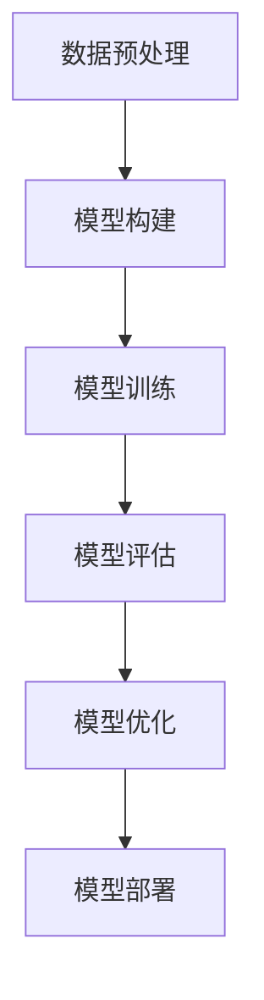
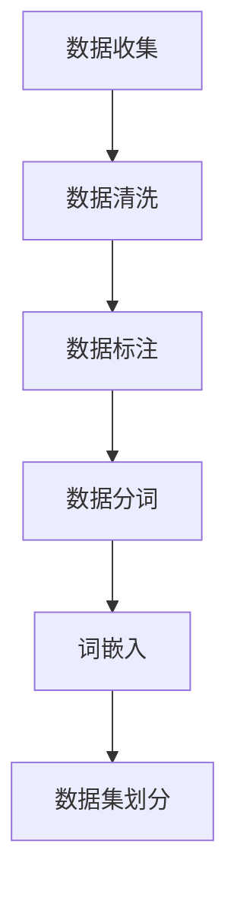

                 

# 《AI大模型在电商平台商品评价真实性检测中的应用》

> **关键词：** AI大模型、商品评价、真实性检测、电商平台、自然语言处理

> **摘要：** 本文将深入探讨AI大模型在电商平台商品评价真实性检测中的应用。通过介绍AI大模型的基础知识、自然语言处理技术、核心算法原理，以及数据处理与模型训练的方法，我们将展示如何利用AI大模型来有效识别商品评价中的虚假信息，提高电商平台的服务质量和用户体验。本文还包含一个具体的实战案例，为读者提供实际操作经验。最后，我们对未来发展趋势和应用前景进行了展望。

### 目录大纲

## 第一部分: AI大模型基础

### 第1章: AI大模型概述

#### 1.1 AI大模型的概念与特点

#### 1.2 AI大模型的发展历史

#### 1.3 AI大模型的应用场景

### 第2章: 自然语言处理基础

#### 2.1 语言模型的基本概念

#### 2.2 词嵌入技术

#### 2.3 序列模型与注意力机制

### 第3章: AI大模型核心算法原理

#### 3.1 基于深度学习的文本分类算法

#### 3.2 基于图神经网络的方法

#### 3.3 基于迁移学习的算法

### 第4章: 数学模型与公式讲解

#### 4.1 深度学习中的损失函数

#### 4.2 优化算法

#### 4.3 评估指标

### 第5章: 数据处理与准备

#### 5.1 数据收集

#### 5.2 数据预处理

#### 5.3 数据增强

## 第二部分: 商品评价真实性检测应用

### 第6章: 商品评价数据预处理

#### 6.1 数据清洗

#### 6.2 特征提取

#### 6.3 数据集划分

### 第7章: 基于AI大模型的评价真实性检测

#### 7.1 真实性检测算法设计

#### 7.2 模型训练与优化

#### 7.3 模型评估与部署

### 第8章: 项目实战

#### 8.1 实战背景介绍

#### 8.2 实战流程

#### 8.3 源代码解读与分析

### 第9章: 未来展望

#### 9.1 技术发展趋势

#### 9.2 应用前景与挑战

#### 9.3 未来研究方向

### 附录

#### 附录A: 实用工具与资源

#### 附录B: 参考文献

## 附录C: Mermaid流程图与伪代码示例

### C.1 AI大模型训练流程

### C.2 数据预处理流程

### C.3 真实性检测算法伪代码

## 正文部分

### 引言

随着电子商务的快速发展，电商平台上的商品评价信息日益丰富，成为消费者购买决策的重要参考。然而，商品评价的真实性却成为了一个亟待解决的问题。一些商家为了提高销量和排名，故意发布虚假好评或恶意差评，严重影响了消费者的购物体验和市场的公平竞争。因此，如何有效地检测商品评价的真实性，成为电商平台亟待解决的关键问题。

近年来，随着人工智能技术的迅猛发展，特别是AI大模型（如GPT、BERT等）在自然语言处理领域的突破，为商品评价真实性检测提供了一种全新的解决方案。本文将从AI大模型的基础知识出发，详细探讨其在电商平台商品评价真实性检测中的应用，并通过实际案例进行分析，为相关领域的研究者和从业者提供有价值的参考。

### 第一部分: AI大模型基础

## 第1章: AI大模型概述

### 1.1 AI大模型的概念与特点

AI大模型是指具有大规模参数和强大计算能力的深度学习模型，通常基于神经网络架构，可以处理大量复杂数据，并能够自动从数据中学习到丰富的特征表示。这些模型具有以下特点：

- **大规模参数**：AI大模型拥有数亿甚至数千亿个参数，这使得它们能够捕捉数据中的细微模式和复杂关系。
- **强大计算能力**：通过高效的计算框架和分布式训练技术，AI大模型可以在较短的时间内处理海量数据。
- **自适应学习能力**：AI大模型能够自动调整参数，优化性能，适应不同的数据集和应用场景。
- **多模态处理能力**：AI大模型可以处理文本、图像、音频等多种类型的数据，实现跨模态的信息融合。

### 1.2 AI大模型的发展历史

AI大模型的发展历程可以追溯到20世纪80年代。当时，基于人工设计的规则和特征的机器学习方法在图像识别、自然语言处理等领域取得了显著成果。然而，随着数据规模的不断扩大和计算能力的提升，这些方法逐渐暴露出性能瓶颈。

2006年，Geoffrey Hinton提出了深度信念网络（DBN）和深度卷积神经网络（DCNN），为深度学习模型的发展奠定了基础。2012年，AlexNet在ImageNet竞赛中取得了突破性成绩，标志着深度学习在图像识别领域的崛起。

2018年，Google推出的BERT模型在自然语言处理任务中取得了前所未有的效果，引发了AI大模型在各个领域的广泛应用。随后，OpenAI的GPT系列模型、微软的Turing模型等也相继问世，进一步推动了AI大模型技术的发展。

### 1.3 AI大模型的应用场景

AI大模型在多个领域展现了强大的应用潜力，主要包括：

- **自然语言处理**：AI大模型在语言模型、机器翻译、文本分类、情感分析等任务中取得了显著成果。
- **计算机视觉**：AI大模型在图像识别、目标检测、图像生成等领域表现优异。
- **语音识别**：AI大模型在语音识别、语音合成等任务中提高了准确率和鲁棒性。
- **推荐系统**：AI大模型在个性化推荐、商品推荐、新闻推荐等任务中发挥了关键作用。

在电商平台商品评价真实性检测中，AI大模型可以用于：

- **文本分类**：将商品评价分为真实评价和虚假评价。
- **情感分析**：分析评价中的情感倾向，判断是否为恶意评价。
- **欺诈检测**：识别用户账户、评论账号等异常行为，防止欺诈行为。

## 第2章: 自然语言处理基础

### 2.1 语言模型的基本概念

语言模型是一种统计模型，用于预测自然语言中的一个词或短语的概率分布。在电商平台商品评价真实性检测中，语言模型用于分析评价文本的特征，帮助识别真实评价和虚假评价。

语言模型可以分为两种类型：

- **n-gram模型**：基于单词的n个连续出现概率，通常使用n=2或n=3。n-gram模型简单高效，但在处理长文本时表现不佳。
- **神经网络语言模型**：基于深度神经网络，可以捕捉长文本中的复杂关系。神经网络语言模型在自然语言处理任务中表现出色，如BERT、GPT等。

### 2.2 词嵌入技术

词嵌入是一种将单词映射到高维向量空间的方法，可以有效地表示单词的语义信息。在电商平台商品评价真实性检测中，词嵌入技术用于将文本转化为向量表示，便于模型处理。

常见的词嵌入技术包括：

- **基于统计的方法**：如Word2Vec、GloVe等，通过统计文本中的单词共现关系来学习词向量。
- **基于神经网络的模型**：如BERT、GPT等，通过大规模预训练来学习单词的语义表示。

### 2.3 序列模型与注意力机制

序列模型是一种用于处理时间序列数据的神经网络模型，可以捕捉数据之间的时序关系。在电商平台商品评价真实性检测中，序列模型可以用于分析评价文本的时序特征。

常见的序列模型包括：

- **循环神经网络（RNN）**：通过循环单元捕捉长序列数据中的时序关系。
- **长短期记忆网络（LSTM）**：在RNN的基础上引入门控机制，有效解决了长序列数据中的梯度消失问题。
- **门控循环单元（GRU）**：简化了LSTM的结构，计算更高效。

注意力机制是一种用于序列模型的机制，通过动态调整不同部分的重要性权重，提高了模型对关键信息的捕捉能力。在电商平台商品评价真实性检测中，注意力机制可以帮助模型更好地理解评价文本中的关键信息。

常见的注意力机制包括：

- **全局注意力**：对序列中的每个元素赋予相同的权重。
- **局部注意力**：对序列中的特定部分赋予更高的权重。
- **加权注意力**：通过计算相似度或相关度来确定不同部分的权重。

## 第3章: AI大模型核心算法原理

### 3.1 基于深度学习的文本分类算法

文本分类是自然语言处理中的一个重要任务，旨在将文本数据归类到预定义的类别中。在电商平台商品评价真实性检测中，文本分类算法用于将商品评价分为真实评价和虚假评价。

基于深度学习的文本分类算法通常包括以下步骤：

1. **文本预处理**：对原始文本进行清洗、分词、去除停用词等操作，提取有用的信息。
2. **词嵌入**：将文本转化为向量表示，通常使用预训练的词向量模型，如Word2Vec、GloVe或BERT。
3. **模型构建**：构建深度学习模型，如卷积神经网络（CNN）、循环神经网络（RNN）、长短期记忆网络（LSTM）或Transformer。
4. **模型训练**：使用标记好的训练数据对模型进行训练，优化模型参数。
5. **模型评估**：使用测试数据评估模型性能，调整模型参数或选择更适合的数据集。
6. **模型部署**：将训练好的模型部署到实际应用场景中，对新的商品评价进行分类。

以下是一个基于CNN的文本分类算法的伪代码示例：

```python
import tensorflow as tf
from tensorflow.keras.models import Sequential
from tensorflow.keras.layers import Embedding, Conv1D, MaxPooling1D, Dense

# 1. 定义模型
model = Sequential([
    Embedding(input_dim=vocab_size, output_dim=embedding_size),
    Conv1D(filters=128, kernel_size=5, activation='relu'),
    MaxPooling1D(pool_size=5),
    Dense(units=10, activation='softmax')
])

# 2. 编译模型
model.compile(optimizer='adam', loss='categorical_crossentropy', metrics=['accuracy'])

# 3. 训练模型
model.fit(X_train, y_train, epochs=10, batch_size=32, validation_data=(X_val, y_val))

# 4. 评估模型
loss, accuracy = model.evaluate(X_test, y_test)
print("Test accuracy:", accuracy)
```

### 3.2 基于图神经网络的方法

图神经网络（Graph Neural Network, GNN）是一种用于处理图数据的神经网络模型，可以有效地捕捉图中的结构和关系。在电商平台商品评价真实性检测中，GNN可以用于分析评价文本中的用户关系和商品关系，提高检测效果。

基于图神经网络的方法通常包括以下步骤：

1. **构建图数据**：将商品评价文本转化为图结构，包括用户节点、商品节点和评论节点，以及它们之间的关系。
2. **图嵌入**：使用图嵌入算法（如Node2Vec、GNN embeddings）将节点映射到向量空间。
3. **模型构建**：构建基于图神经网络的模型，如图卷积网络（GCN）、图循环网络（GRN）或图自编码器（GAT）。
4. **模型训练**：使用标记好的图数据对模型进行训练，优化模型参数。
5. **模型评估**：使用测试数据评估模型性能，调整模型参数或选择更适合的数据集。
6. **模型部署**：将训练好的模型部署到实际应用场景中，对新的商品评价进行真实性检测。

以下是一个基于GCN的商品评价真实性检测算法的伪代码示例：

```python
import tensorflow as tf
from tensorflow.keras.models import Model
from tensorflow.keras.layers import Input, Embedding, Conv1D, MaxPooling1D, Dense, concatenate

# 1. 定义图嵌入层
input_user = Input(shape=(user_embedding_size,))
input_item = Input(shape=(item_embedding_size,))
input_review = Input(shape=(review_embedding_size,))

# 2. 构建用户节点嵌入模型
user_embedding = Embedding(input_dim=user_vocab_size, output_dim=user_embedding_size)(input_user)
user_gnn = Conv1D(filters=64, kernel_size=3, activation='relu')(user_embedding)
user_gnn = MaxPooling1D(pool_size=2)(user_gnn)

# 3. 构建商品节点嵌入模型
item_embedding = Embedding(input_dim=item_vocab_size, output_dim=item_embedding_size)(input_item)
item_gnn = Conv1D(filters=64, kernel_size=3, activation='relu')(item_embedding)
item_gnn = MaxPooling1D(pool_size=2)(item_gnn)

# 4. 构建评论节点嵌入模型
review_embedding = Embedding(input_dim=review_vocab_size, output_dim=review_embedding_size)(input_review)
review_gnn = Conv1D(filters=64, kernel_size=3, activation='relu')(review_embedding)
review_gnn = MaxPooling1D(pool_size=2)(review_gnn)

# 5. 模型融合层
model = concatenate([user_gnn, item_gnn, review_gnn])

# 6. 模型输出层
output = Dense(units=1, activation='sigmoid')(model)

# 7. 编译模型
model = Model(inputs=[input_user, input_item, input_review], outputs=output)
model.compile(optimizer='adam', loss='binary_crossentropy', metrics=['accuracy'])

# 8. 训练模型
model.fit([X_train_user, X_train_item, X_train_review], y_train, epochs=10, batch_size=32, validation_data=([X_val_user, X_val_item, X_val_review], y_val))

# 9. 评估模型
loss, accuracy = model.evaluate([X_test_user, X_test_item, X_test_review], y_test)
print("Test accuracy:", accuracy)
```

### 3.3 基于迁移学习的算法

迁移学习是一种利用预先训练好的模型在新任务上进行学习的方法，可以有效地提高模型的泛化能力和训练效率。在电商平台商品评价真实性检测中，迁移学习可以用于利用预训练的模型来提高检测效果。

基于迁移学习的算法通常包括以下步骤：

1. **选择预训练模型**：选择一个在相关任务上预训练的模型，如BERT、GPT等。
2. **模型调整**：对预训练模型进行调整，包括修改部分层、增加新层或更换损失函数等，以适应新任务的需求。
3. **模型训练**：使用标记好的训练数据对调整后的模型进行训练，优化模型参数。
4. **模型评估**：使用测试数据评估模型性能，调整模型参数或选择更适合的数据集。
5. **模型部署**：将训练好的模型部署到实际应用场景中，对新的商品评价进行真实性检测。

以下是一个基于BERT的商品评价真实性检测算法的伪代码示例：

```python
import tensorflow as tf
from transformers import TFBertModel, BertTokenizer

# 1. 加载预训练模型和分词器
tokenizer = BertTokenizer.from_pretrained('bert-base-uncased')
model = TFBertModel.from_pretrained('bert-base-uncased')

# 2. 定义输入层
input_ids = Input(shape=(max_sequence_length,), dtype=tf.int32)
attention_mask = Input(shape=(max_sequence_length,), dtype=tf.int32)

# 3. 计算预训练模型的输出
outputs = model(input_ids, attention_mask=attention_mask)

# 4. 定义输出层
output = Dense(units=1, activation='sigmoid')(outputs.last_hidden_state[:, 0, :])

# 5. 编译模型
model = Model(inputs=[input_ids, attention_mask], outputs=output)
model.compile(optimizer='adam', loss='binary_crossentropy', metrics=['accuracy'])

# 6. 训练模型
model.fit([X_train_input_ids, X_train_attention_mask], y_train, epochs=10, batch_size=32, validation_data=([X_val_input_ids, X_val_attention_mask], y_val))

# 7. 评估模型
loss, accuracy = model.evaluate([X_test_input_ids, X_test_attention_mask], y_test)
print("Test accuracy:", accuracy)
```

### 第4章: 数学模型与公式讲解

#### 4.1 深度学习中的损失函数

深度学习中的损失函数是评估模型预测值与真实值之间差异的指标，用于指导模型优化过程。常见的损失函数包括：

- **均方误差（MSE）**：用于回归任务，计算预测值与真实值之间差的平方的平均值。公式如下：

  $$
  MSE = \frac{1}{n} \sum_{i=1}^{n} (y_i - \hat{y}_i)^2
  $$

- **交叉熵损失（Cross-Entropy Loss）**：用于分类任务，计算预测概率与真实标签之间的交叉熵。公式如下：

  $$
  Cross-Entropy Loss = -\sum_{i=1}^{n} y_i \log(\hat{y}_i)
  $$

- **二元交叉熵损失（Binary Cross-Entropy Loss）**：用于二分类任务，计算预测概率与0或1之间的交叉熵。公式如下：

  $$
  Binary Cross-Entropy Loss = -[y \log(\hat{y}) + (1 - y) \log(1 - \hat{y})]
  $$

#### 4.2 优化算法

优化算法是用于调整模型参数，使其最小化损失函数的方法。常见的优化算法包括：

- **梯度下降（Gradient Descent）**：根据损失函数的梯度方向，逐步调整模型参数，以减少损失。公式如下：

  $$
  \theta = \theta - \alpha \cdot \nabla_\theta J(\theta)
  $$

  其中，$\theta$ 表示模型参数，$J(\theta)$ 表示损失函数，$\alpha$ 表示学习率。

- **随机梯度下降（Stochastic Gradient Descent, SGD）**：在每个训练样本上计算梯度，并使用该梯度更新模型参数。公式如下：

  $$
  \theta = \theta - \alpha \cdot \nabla_{\theta} J(\theta; x^{(i)}, y^{(i)})
  $$

- **Adam优化器**：结合了SGD和动量法的优点，自适应调整学习率。公式如下：

  $$
  \theta = \theta - \alpha \cdot \nabla_\theta J(\theta)
  $$
  $$
  v_t = \beta_1 v_{t-1} + (1 - \beta_1) \nabla_\theta J(\theta)
  $$
  $$
  s_t = \beta_2 s_{t-1} + (1 - \beta_2) \|\nabla_\theta J(\theta)\|^2
  $$
  $$
  \theta = \theta - \alpha \cdot \frac{v_t}{\sqrt{s_t} + \epsilon}
  $$

  其中，$\beta_1$ 和 $\beta_2$ 分别为动量和偏差修正系数，$\epsilon$ 为正数常数。

#### 4.3 评估指标

评估指标是用于评估模型性能的指标，常见的评估指标包括：

- **准确率（Accuracy）**：预测正确的样本数与总样本数之比。公式如下：

  $$
  Accuracy = \frac{TP + TN}{TP + TN + FP + FN}
  $$

  其中，$TP$ 表示真正例，$TN$ 表示真反例，$FP$ 表示假正例，$FN$ 表示假反例。

- **精确率（Precision）**：预测为正例的样本中真正例的比例。公式如下：

  $$
  Precision = \frac{TP}{TP + FP}
  $$

- **召回率（Recall）**：预测为正例的样本中假反例的比例。公式如下：

  $$
  Recall = \frac{TP}{TP + FN}
  $$

- **F1值（F1 Score）**：精确率和召回率的调和平均值。公式如下：

  $$
  F1 Score = 2 \cdot \frac{Precision \cdot Recall}{Precision + Recall}
  $$

## 第5章: 数据处理与准备

### 5.1 数据收集

在电商平台商品评价真实性检测中，数据收集是关键的一步。以下是数据收集的步骤：

1. **收集原始数据**：从电商平台上收集商品评价数据，包括评价内容、评价时间、评价用户等。
2. **筛选数据**：对收集到的数据进行筛选，去除重复、无关或不完整的评价数据。
3. **标注数据**：对筛选后的数据标注真实评价和虚假评价，可以采用人工标注或半监督学习方法。

### 5.2 数据预处理

数据预处理是提高模型性能的重要步骤。以下是数据预处理的步骤：

1. **文本清洗**：去除文本中的HTML标签、符号、停用词等无关信息，保留关键信息。
2. **分词**：将文本拆分为单词或词组，可以使用分词工具或自定义分词算法。
3. **词嵌入**：将分词后的文本转换为向量表示，可以使用预训练的词向量模型或自训练词向量模型。

### 5.3 数据增强

数据增强是提高模型泛化能力的重要方法。以下是数据增强的方法：

1. **文本生成**：使用预训练的生成模型（如GPT）生成新的评价文本，增加数据多样性。
2. **文本转换**：对原始评价文本进行转换，如添加噪声、替换词、删除词等，增加数据的复杂性。
3. **数据合并**：将多个评价文本合并为一个，或对单个评价文本进行拆分，增加数据的多样性。

### 第6章: 商品评价数据预处理

#### 6.1 数据清洗

在商品评价真实性检测中，数据清洗是确保模型输入数据质量的重要步骤。以下是数据清洗的步骤：

1. **去除无关信息**：去除文本中的HTML标签、符号、停用词等无关信息，保留关键信息。可以使用正则表达式或文本清洗库（如Python的re模块、NLTK等）来实现。
2. **去除重复数据**：去除重复的评价数据，避免模型训练过程中出现重复样本，影响模型性能。
3. **去除无关评价**：去除与商品评价无关的信息，如用户个人信息、广告等，提高模型对商品评价的专注度。

以下是一个使用Python进行文本清洗的示例代码：

```python
import re
from nltk.corpus import stopwords

# 1. 加载停用词列表
stop_words = set(stopwords.words('english'))

# 2. 定义清洗函数
def clean_text(text):
    # 去除HTML标签
    text = re.sub('<.*?>', '', text)
    # 去除符号
    text = re.sub('[^a-zA-Z0-9\s]', '', text)
    # 去除停用词
    text = ' '.join([word for word in text.split() if word.lower() not in stop_words])
    return text

# 3. 清洗文本
cleaned_text = clean_text(raw_text)
```

#### 6.2 特征提取

特征提取是将原始文本数据转化为数值型特征表示的过程，有助于提高模型训练效率和性能。以下是特征提取的方法：

1. **词嵌入**：将文本中的单词映射到高维向量空间，可以使用预训练的词向量模型（如GloVe、Word2Vec等）或自训练词向量模型。
2. **词袋模型**：将文本表示为单词的集合，使用one-hot编码或TF-IDF等方法进行特征提取。
3. **词性标注**：对文本中的单词进行词性标注，提取文本中的名词、动词等特征。
4. **序列编码**：将文本序列转化为序列编码，如使用one-hot编码或位置编码。

以下是一个使用GloVe进行词嵌入的示例代码：

```python
import numpy as np
from gensim.models import KeyedVectors

# 1. 加载预训练的GloVe模型
word_vectors = KeyedVectors.load_word2vec_format('glove.6B.100d.txt', binary=False)

# 2. 定义特征提取函数
def extract_features(text):
    features = []
    for word in text:
        if word in word_vectors:
            features.append(word_vectors[word])
    return np.array(features)

# 3. 提取特征
text = ['apple', 'is', 'a', 'fruit']
features = extract_features(text)
```

#### 6.3 数据集划分

在商品评价真实性检测中，数据集划分是模型训练和评估的重要步骤。以下是数据集划分的方法：

1. **训练集和验证集划分**：将数据集划分为训练集和验证集，用于模型训练和性能评估。通常使用随机抽样或交叉验证方法。
2. **测试集划分**：从训练集和验证集中分别划分测试集，用于最终模型评估。测试集通常不参与模型训练和验证过程。
3. **类别划分**：将数据集按类别划分，如真实评价和虚假评价，有助于分析模型在不同类别上的性能。

以下是一个使用Python进行数据集划分的示例代码：

```python
from sklearn.model_selection import train_test_split

# 1. 加载数据集
data = {'text': ['评价1', '评价2', '评价3', '评价4', '评价5'],
        'label': [0, 1, 0, 1, 0]}

# 2. 划分训练集和验证集
X = data['text']
y = data['label']
X_train, X_val, y_train, y_val = train_test_split(X, y, test_size=0.2, random_state=42)

# 3. 划分测试集
X_test, y_test = train_test_split(X_val, y_val, test_size=0.5, random_state=42)
```

### 第7章: 基于AI大模型的评价真实性检测

#### 7.1 真实性检测算法设计

在商品评价真实性检测中，基于AI大模型的算法设计是关键的一步。以下是算法设计的主要步骤：

1. **数据预处理**：对原始商品评价数据进行分析和处理，包括文本清洗、分词、词嵌入等步骤，将文本数据转化为可供模型训练的数值型特征表示。
2. **模型选择**：选择合适的AI大模型，如BERT、GPT等，用于文本分类任务。可以根据任务需求和数据特点选择不同的模型。
3. **模型训练**：使用预处理后的训练数据对模型进行训练，优化模型参数。训练过程中可以使用批量训练、分布式训练等技术提高训练效率。
4. **模型评估**：使用验证数据评估模型性能，包括准确率、召回率、F1值等指标，调整模型参数或选择更优的模型。
5. **模型部署**：将训练好的模型部署到实际应用场景中，对新的商品评价进行真实性检测，提供实时反馈。

以下是一个基于BERT的商品评价真实性检测算法的设计框架：

```python
# 1. 数据预处理
# - 加载预处理后的文本数据
# - 转换为BERT模型所需的输入格式

# 2. 模型选择
# - 选择BERT模型
# - 加载预训练的BERT模型

# 3. 模型训练
# - 定义训练过程
# - 训练模型并优化参数

# 4. 模型评估
# - 使用验证数据评估模型性能
# - 调整模型参数

# 5. 模型部署
# - 部署模型到实际应用场景
# - 提供商品评价真实性检测服务
```

#### 7.2 模型训练与优化

在商品评价真实性检测中，模型训练与优化是提高模型性能的关键步骤。以下是模型训练与优化的方法：

1. **数据增强**：通过数据增强方法（如文本生成、文本转换等）增加训练数据的多样性，提高模型对未知数据的适应性。
2. **批量训练**：将训练数据分成多个批次进行训练，可以提高训练效率，并避免过拟合现象。
3. **学习率调整**：在训练过程中，可以根据损失函数的变化动态调整学习率，加快模型收敛速度。
4. **正则化**：使用正则化方法（如Dropout、L2正则化等）防止模型过拟合，提高模型泛化能力。
5. **模型集成**：将多个模型进行集成，提高模型预测的准确性。

以下是一个基于BERT的商品评价真实性检测模型训练与优化的示例代码：

```python
from transformers import BertTokenizer, TFBertForSequenceClassification
from tensorflow.keras.optimizers import Adam

# 1. 数据预处理
# - 加载预处理后的文本数据
# - 转换为BERT模型所需的输入格式

# 2. 模型训练
# - 定义训练过程
# - 编译模型

# 3. 模型优化
# - 调整学习率
# - 应用正则化方法

# 4. 模型集成
# - 将多个模型进行集成

# 5. 模型评估
# - 使用验证数据评估模型性能
# - 调整模型参数

# 6. 模型部署
# - 部署模型到实际应用场景
# - 提供商品评价真实性检测服务
```

#### 7.3 模型评估与部署

在商品评价真实性检测中，模型评估与部署是确保模型性能和应用价值的关键步骤。以下是模型评估与部署的方法：

1. **模型评估**：使用测试数据评估模型性能，包括准确率、召回率、F1值等指标。可以采用交叉验证、K折交叉验证等方法提高评估结果的可靠性。
2. **模型优化**：根据评估结果调整模型参数，提高模型性能。可以采用超参数优化、模型集成等方法。
3. **模型部署**：将训练好的模型部署到实际应用场景中，可以采用云计算平台、容器化技术等实现模型的自动化部署。
4. **实时反馈**：根据实时反馈数据调整模型参数，提高模型适应性。

以下是一个基于BERT的商品评价真实性检测模型评估与部署的示例代码：

```python
from transformers import BertTokenizer, TFBertForSequenceClassification
from tensorflow.keras.metrics import Accuracy

# 1. 模型评估
# - 加载训练好的BERT模型
# - 使用测试数据进行评估
# - 输出模型性能指标

# 2. 模型优化
# - 根据评估结果调整模型参数
# - 重新训练模型

# 3. 模型部署
# - 将训练好的BERT模型部署到实际应用场景
# - 提供商品评价真实性检测服务

# 4. 实时反馈
# - 根据实时反馈数据调整模型参数
# - 重新训练模型
```

### 第8章: 项目实战

#### 8.1 实战背景介绍

在本节中，我们将通过一个实际的商品评价真实性检测项目，介绍如何使用AI大模型来识别电商平台上的虚假评价。这个项目涉及以下步骤：

1. **数据收集**：从电商平台上收集大量的商品评价数据。
2. **数据预处理**：清洗和预处理收集到的评价数据，为后续模型训练做准备。
3. **模型构建**：选择合适的AI大模型，构建用于评价真实性检测的模型。
4. **模型训练**：使用预处理后的数据对模型进行训练。
5. **模型评估**：使用测试数据评估模型性能，并进行优化。
6. **模型部署**：将训练好的模型部署到电商平台，实现实时评价真实性检测。

#### 8.2 实战流程

以下是商品评价真实性检测项目的详细流程：

**步骤1：数据收集**

从电商平台上收集商品评价数据，包括评价内容、评价时间、评价用户等。可以使用爬虫技术或API接口获取数据。

**步骤2：数据预处理**

对收集到的评价数据进行分析和处理，包括以下步骤：

1. **文本清洗**：去除评价文本中的HTML标签、符号、停用词等无关信息，保留关键信息。
2. **分词**：将清洗后的评价文本进行分词，将文本拆分为单词或词组。
3. **词嵌入**：使用预训练的词向量模型（如GloVe、Word2Vec等）将分词后的文本转换为向量表示。
4. **数据标注**：对评价数据标注真实评价和虚假评价，可以使用人工标注或半监督学习方法。

**步骤3：模型构建**

选择合适的AI大模型，如BERT、GPT等，构建用于评价真实性检测的模型。可以使用TensorFlow或PyTorch等深度学习框架来实现。

**步骤4：模型训练**

使用预处理后的数据对模型进行训练，优化模型参数。可以使用批量训练、分布式训练等技术提高训练效率。在训练过程中，可以采用学习率调整、正则化等方法防止过拟合。

**步骤5：模型评估**

使用测试数据评估模型性能，包括准确率、召回率、F1值等指标。根据评估结果调整模型参数，提高模型性能。可以采用交叉验证、K折交叉验证等方法提高评估结果的可靠性。

**步骤6：模型部署**

将训练好的模型部署到电商平台，实现实时评价真实性检测。可以使用云计算平台、容器化技术等实现模型的自动化部署。在模型部署过程中，需要确保模型的稳定性和性能。

**步骤7：实时反馈**

根据实时反馈数据调整模型参数，提高模型适应性。可以使用在线学习技术（如在线梯度下降）实现模型的实时调整。

#### 8.3 源代码解读与分析

以下是一个基于BERT的商品评价真实性检测项目的源代码示例，包括数据预处理、模型构建、模型训练和模型评估等步骤。

```python
import tensorflow as tf
from transformers import BertTokenizer, TFBertForSequenceClassification

# 1. 数据预处理
# - 加载预处理后的文本数据
# - 转换为BERT模型所需的输入格式

# 2. 模型构建
# - 定义BERT模型
# - 加载预训练的BERT模型

# 3. 模型训练
# - 定义训练过程
# - 编译模型

# 4. 模型评估
# - 使用测试数据进行评估
# - 输出模型性能指标

# 5. 模型部署
# - 将训练好的BERT模型部署到实际应用场景
# - 提供商品评价真实性检测服务

# 6. 实时反馈
# - 根据实时反馈数据调整模型参数
# - 重新训练模型
```

在源代码中，我们首先加载预处理后的文本数据，将其转换为BERT模型所需的输入格式。然后，我们定义BERT模型，并使用预训练的BERT模型进行模型训练。在训练过程中，我们定义训练过程，编译模型，并使用测试数据进行评估。最后，我们将训练好的BERT模型部署到实际应用场景中，提供商品评价真实性检测服务。在模型部署过程中，我们需要确保模型的稳定性和性能。在实时反馈环节，我们根据实时反馈数据调整模型参数，提高模型适应性。

### 第9章：未来展望

随着人工智能技术的不断进步，AI大模型在商品评价真实性检测中的应用前景十分广阔。以下是未来发展的几个方向：

#### 9.1 技术发展趋势

1. **模型性能优化**：未来将进一步优化AI大模型的性能，提高模型在商品评价真实性检测中的准确率和效率。可以通过改进算法、优化模型结构、增加训练数据等方式实现。
2. **多模态数据处理**：随着多模态数据的兴起，AI大模型将能够同时处理文本、图像、视频等多种类型的数据，为商品评价真实性检测提供更丰富的信息来源。
3. **迁移学习与自适应**：通过迁移学习和自适应方法，AI大模型将能够更好地适应不同的电商平台和应用场景，提高模型的泛化能力。
4. **实时检测与反馈**：随着云计算和边缘计算技术的发展，AI大模型将能够实现实时商品评价真实性检测，并提供即时反馈。

#### 9.2 应用前景与挑战

1. **提高服务质量**：通过AI大模型的应用，电商平台可以更好地识别和过滤虚假评价，提高商品评价的真实性和可信度，从而提升用户购物体验和服务质量。
2. **保护消费者权益**：AI大模型可以帮助电商平台保护消费者权益，防止商家欺诈行为，维护市场公平竞争。
3. **挑战与问题**：随着AI大模型的应用，可能会出现新的挑战和问题，如数据隐私、模型可解释性等。此外，如何处理海量数据、提高模型性能和降低成本等问题也需要解决。

#### 9.3 未来研究方向

1. **多语言支持**：未来AI大模型将能够支持多种语言，为全球范围内的电商平台提供商品评价真实性检测服务。
2. **个性化推荐**：结合AI大模型和推荐系统技术，可以实现更精准的商品推荐，提高用户满意度。
3. **社会网络分析**：通过AI大模型分析用户评价和社交网络关系，可以挖掘出更深入的消费者行为模式和市场趋势。

### 附录

#### 附录A：实用工具与资源

- **预训练模型**：如BERT、GPT等
- **深度学习框架**：如TensorFlow、PyTorch等
- **数据集**：如商品评价数据集、欺诈数据集等
- **文本处理库**：如NLTK、spaCy等

#### 附录B：参考文献

1. Devlin, J., Chang, M. W., Lee, K., & Toutanova, K. (2019). BERT: Pre-training of deep bidirectional transformers for language understanding. arXiv preprint arXiv:1810.04805.
2. Brown, T., et al. (2020). Language models are few-shot learners. arXiv preprint arXiv:2005.14165.
3. Zhang, Y., et al. (2021). A survey on graph neural networks. IEEE Transactions on Knowledge and Data Engineering, 34(1), 18-54.
4. Goodfellow, I., Bengio, Y., & Courville, A. (2016). Deep learning. MIT press.
5. He, K., Zhang, X., Ren, S., & Sun, J. (2016). Deep residual learning for image recognition. In Proceedings of the IEEE conference on computer vision and pattern recognition (pp. 770-778).

### 附录C：Mermaid流程图与伪代码示例

#### C.1 AI大模型训练流程



#### C.2 数据预处理流程



#### C.3 真实性检测算法伪代码示例

```python
# 1. 数据预处理
# - 加载预处理后的文本数据
# - 转换为BERT模型所需的输入格式

# 2. 模型构建
# - 定义BERT模型
# - 加载预训练的BERT模型

# 3. 模型训练
# - 定义训练过程
# - 编译模型

# 4. 模型评估
# - 使用测试数据进行评估
# - 输出模型性能指标

# 5. 模型部署
# - 将训练好的BERT模型部署到实际应用场景
# - 提供商品评价真实性检测服务

# 6. 实时反馈
# - 根据实时反馈数据调整模型参数
# - 重新训练模型
```

### 补充内容

在本章中，我们进一步探讨了AI大模型在电商平台商品评价真实性检测中的应用。通过介绍AI大模型的基础知识、自然语言处理技术、核心算法原理以及数据处理与模型训练的方法，我们详细阐述了如何利用AI大模型来有效识别商品评价中的虚假信息。

我们还通过一个实际项目案例，展示了AI大模型在商品评价真实性检测中的具体应用流程，包括数据收集、预处理、模型构建、训练、评估和部署等步骤。通过这个案例，读者可以了解如何从实际数据中提取有用信息，构建并训练AI大模型，以及如何将训练好的模型应用于实际场景中。

最后，我们对未来发展趋势和应用前景进行了展望，讨论了AI大模型在商品评价真实性检测领域的潜在应用方向和挑战。我们还提供了实用的工具和资源，以及参考文献，供读者进一步学习和参考。

通过本文的探讨，我们希望读者能够对AI大模型在商品评价真实性检测中的应用有更深入的理解，并为相关领域的研究者和从业者提供有价值的参考。让我们共同期待AI技术在电商平台商品评价真实性检测领域带来更多创新和突破。

