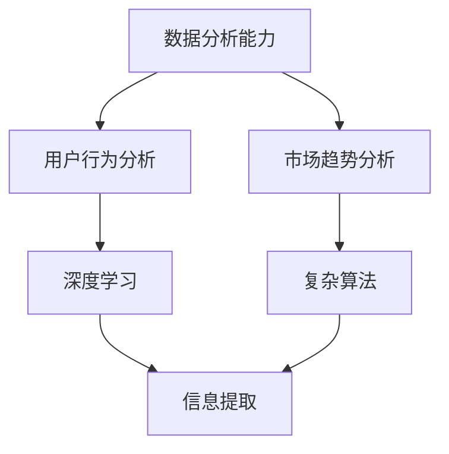

                 

### 文章标题

#### AI大模型如何提升电商平台的跨品类交叉销售

##### 关键词：AI大模型、电商平台、跨品类交叉销售、个性化推荐、用户行为分析、深度学习、机器学习

##### 摘要：
本文将深入探讨AI大模型在电商平台中的应用，特别是如何通过这些模型提升跨品类交叉销售能力。我们将首先介绍AI大模型的基础知识，包括定义、分类、发展历程及其核心优势。接着，我们将分析电商平台与AI大模型的应用场景，讨论数据分析、个性化推荐和营销策略。随后，本文将详细解析AI大模型提升电商平台数据能力的核心技术，包括数据预处理、机器学习算法和深度学习算法。最后，我们将探讨AI大模型在电商平台用户体验提升和实施与展望方面的应用，并通过实际案例展示其效果。

## 目录大纲

### 第一部分：AI大模型基础知识

#### 第1章: AI大模型概述

1.1 AI大模型的基本定义  
1.2 不同类型的AI大模型  
1.3 AI大模型的发展历程  
1.4 AI大模型的核心优势

#### 第2章: 电商平台与AI大模型的应用场景

2.1 电商平台的基本概念  
2.2 电商平台的数据分析  
2.3 AI大模型在电商平台的实际应用

#### 第3章: AI大模型提升电商平台数据能力的核心技术

3.1 数据预处理  
3.2 机器学习算法  
3.3 深度学习算法

#### 第4章: AI大模型提升电商平台个性化推荐的技术

4.1 个性化推荐系统  
4.2 电商平台的推荐算法  
4.3 跨品类推荐策略

#### 第5章: AI大模型提升电商平台营销策略

5.1 电商平台营销策略概述  
5.2 基于AI大模型的营销策略  
5.3 跨品类交叉销售策略

#### 第6章: AI大模型提升电商平台用户体验

6.1 用户体验设计  
6.2 基于AI大模型的用户体验优化  
6.3 跨品类用户体验优化

#### 第7章: AI大模型在电商平台的实施与展望

7.1 AI大模型在电商平台的实施步骤  
7.2 AI大模型在电商平台的未来发展趋势  
7.3 AI大模型在电商平台的实际应用案例分析

#### 附录

A. AI大模型在电商平台开发常用工具与资源  
B. AI大模型在电商平台开发实践案例

## 第一部分：AI大模型基础知识

### 第1章: AI大模型概述

AI大模型，通常指的是那些拥有强大计算能力和复杂结构的人工智能模型，它们能够在海量数据中进行深度学习和复杂推理，从而实现对复杂问题的解决。AI大模型的发展标志着人工智能从简单规则应用到高度自动化和智能化转变的重要里程碑。本章节将介绍AI大模型的基本定义、分类、发展历程及其核心优势。

#### 1.1 AI大模型的基本定义

AI大模型（Big AI Models），顾名思义，是指具有大规模参数和复杂结构的人工智能模型。这些模型通常拥有数百万到数十亿个参数，能够处理和理解大规模数据集。与传统的AI模型相比，AI大模型具有更高的灵活性和更强的泛化能力。

##### 定义：
AI大模型是指那些具有大规模参数和复杂网络结构，能够从海量数据中自动学习和优化其内部参数，以实现特定任务的模型。

##### 核心特点：
- **大规模参数**：模型参数数量庞大，能够捕捉数据中的细微特征。
- **复杂结构**：模型通常采用多层神经网络，具有高度的非线性特性。
- **深度学习**：AI大模型依赖于深度学习技术，通过多层网络结构实现对数据的层次化处理。

#### 1.2 不同类型的AI大模型

AI大模型有多种类型，根据其应用领域和功能特点，可以分为以下几类：

##### 深度神经网络（Deep Neural Networks, DNN）：
深度神经网络是最常见的AI大模型类型，通过多层非线性变换实现对数据的复杂表示和学习。DNN在图像识别、语音识别和自然语言处理等领域具有显著优势。

##### 卷积神经网络（Convolutional Neural Networks, CNN）：
CNN是一种特殊的深度神经网络，专门用于处理图像数据。它通过卷积操作捕捉图像中的局部特征，并在多层网络中逐渐构建全局表示。

##### 循环神经网络（Recurrent Neural Networks, RNN）：
RNN是一种能够处理序列数据的深度神经网络，通过循环结构记忆序列中的信息。RNN及其变种（如LSTM、GRU）在时间序列预测、机器翻译等领域有广泛应用。

##### 生成对抗网络（Generative Adversarial Networks, GAN）：
GAN由生成器和判别器两个对抗性模型组成，通过相互博弈生成逼真的数据。GAN在图像生成、风格迁移和生成对抗性学习等方面具有独特优势。

##### 强化学习（Reinforcement Learning, RL）：
强化学习是一种通过与环境交互进行学习的AI技术。强化学习大模型通常用于复杂决策问题和智能控制领域。

#### 1.3 AI大模型的发展历程

AI大模型的发展历程可以追溯到20世纪80年代，随着计算能力的提升和算法的进步，AI大模型逐渐成为人工智能研究的热点。以下是AI大模型发展的几个关键阶段：

##### 1980年代：早期神经网络研究
在这个时期，神经网络作为AI的基础理论得到了广泛研究。然而，由于计算能力和算法的限制，神经网络的应用相对有限。

##### 2000年代：深度学习崛起
随着计算机硬件的发展（特别是GPU的广泛应用）和算法的进步，深度学习在图像识别和语音识别等领域取得了突破性进展。

##### 2010年代：AI大模型崛起
在这个时期，AI大模型（如AlexNet、VGG、ResNet等）在多个AI竞赛中取得了优异的成绩，标志着AI大模型的崛起。

##### 当前：AI大模型广泛应用
当前，AI大模型已经在多个领域得到广泛应用，包括自动驾驶、自然语言处理、医疗诊断和电商平台等。

#### 1.4 AI大模型的核心优势

AI大模型在电商平台中的应用具有以下几个核心优势：

##### 提高数据分析能力
AI大模型能够处理和分析大量复杂数据，从而帮助电商平台更好地理解用户行为和市场趋势。

##### 实现跨品类交叉销售
通过分析用户行为数据，AI大模型能够发现潜在的用户需求，从而实现跨品类的推荐和交叉销售。

##### 提升个性化推荐效果
AI大模型能够根据用户的兴趣和行为进行个性化推荐，从而提升用户的满意度和购买转化率。

##### 实时决策与优化
AI大模型可以实时分析用户行为和市场需求，为电商平台提供实时的决策支持和优化策略。

### 第2章: 电商平台与AI大模型的应用场景

#### 2.1 电商平台的基本概念

电商平台是指通过互联网技术提供商品交易和服务的平台，它为消费者和商家提供了一个在线交易的环境。电商平台的基本概念包括以下几个方面：

##### 定义：
电商平台是一个在线的虚拟市场，提供商品展示、搜索、购买、支付和物流等一站式服务。

##### 主要功能：
- **商品展示**：展示商品的详细信息，包括图片、描述、价格等。
- **搜索**：提供高效的商品搜索功能，帮助用户快速找到所需商品。
- **购买**：提供便捷的购买流程，包括购物车、结算、支付等。
- **支付**：提供多种支付方式，确保交易的安全和便捷。
- **物流**：提供物流跟踪服务，确保商品快速送达。

##### 类型：
电商平台可以分为以下几类：

- **综合型电商平台**：如亚马逊、京东，提供多种商品和服务的综合性平台。
- **垂直型电商平台**：如唯品会、天猫美妆，专注于某一特定领域的商品销售。
- **社交型电商平台**：如小红书、拼多多，结合社交和电商功能，提高用户粘性。

#### 2.2 电商平台的数据分析

电商平台的数据分析是提升平台运营效率和用户体验的关键环节。通过数据分析，电商平台可以深入了解用户行为、市场趋势和商品表现，从而制定更为精准的营销策略和运营决策。

##### 用户行为分析
用户行为分析是指通过对用户在电商平台上的操作行为进行分析，了解用户的喜好、需求和购买习惯。常见的用户行为分析包括：

- **浏览行为**：分析用户在平台上的浏览路径、停留时间、点击率等。
- **购买行为**：分析用户的购买频率、购买金额、购买商品种类等。
- **评价行为**：分析用户的商品评价、退货率等。

##### 市场趋势分析
市场趋势分析是指通过分析平台上的销售数据、用户反馈和行业报告，了解市场的发展趋势和竞争态势。常见的市场趋势分析包括：

- **销售趋势**：分析不同时间段的销售额、增长率等。
- **商品趋势**：分析热销商品、季节性变化等。
- **竞争态势**：分析主要竞争对手的表现、市场份额等。

##### 产品推荐系统
产品推荐系统是电商平台的一项核心功能，通过分析用户行为和商品特征，为用户推荐其可能感兴趣的商品。推荐系统可以分为以下几种类型：

- **基于内容的推荐**：根据用户的历史行为和商品的特征进行推荐。
- **基于协同过滤的推荐**：根据用户之间的相似性进行推荐。
- **基于模型的推荐**：利用机器学习算法，如协同过滤、矩阵分解、深度学习等，进行个性化推荐。

#### 2.3 AI大模型在电商平台的实际应用

AI大模型在电商平台的实际应用场景非常广泛，包括个性化推荐、商品搜索优化、用户行为预测和营销策略优化等。以下是AI大模型在电商平台中的几个主要应用场景：

##### 实现个性化推荐
个性化推荐是电商平台提升用户体验和销售转化率的重要手段。AI大模型可以通过分析用户的浏览历史、购买记录、评价等数据，为用户推荐其可能感兴趣的商品。个性化推荐的实现通常涉及以下几个步骤：

1. **数据预处理**：清洗和整合用户行为数据和商品数据，提取特征。
2. **模型选择**：选择合适的机器学习算法，如协同过滤、矩阵分解、深度学习等。
3. **模型训练**：使用训练数据训练模型，优化模型参数。
4. **模型评估**：使用测试数据评估模型效果，调整模型参数。
5. **推荐生成**：根据用户特征和商品特征，生成个性化推荐列表。

##### 商品搜索优化
商品搜索优化是提升电商平台用户满意度的重要方面。通过AI大模型，电商平台可以实现对用户搜索意图的精准理解和商品搜索结果的优化。商品搜索优化的实现通常包括以下步骤：

1. **查询意图分析**：使用自然语言处理技术，分析用户的搜索查询，理解其意图。
2. **搜索结果排序**：根据用户意图和商品特征，对搜索结果进行排序，提高相关性。
3. **实时搜索优化**：在用户输入查询时，实时分析查询意图，动态调整搜索结果。

##### 用户行为预测
用户行为预测是电商平台进行精准营销和用户关系管理的重要工具。AI大模型可以通过分析用户的浏览历史、购买记录、评价等数据，预测用户的下一步行为。用户行为预测的实现通常涉及以下步骤：

1. **数据收集**：收集用户的各项行为数据。
2. **特征提取**：提取与用户行为相关的特征。
3. **模型训练**：使用训练数据训练预测模型。
4. **行为预测**：使用训练好的模型预测用户的下一步行为。
5. **决策支持**：根据预测结果为电商平台提供营销策略和运营决策支持。

##### 营销策略优化
AI大模型可以帮助电商平台制定和优化营销策略，提高营销效果。通过分析用户数据和市场趋势，AI大模型可以识别出潜在的用户群体和营销机会，为电商平台提供精准的营销策略。营销策略优化的实现通常包括以下步骤：

1. **用户画像**：基于用户行为数据构建用户画像，了解用户的需求和偏好。
2. **市场分析**：分析市场趋势和竞争态势，识别营销机会。
3. **策略制定**：根据用户画像和市场分析结果，制定针对性的营销策略。
4. **策略评估**：通过A/B测试等方法，评估营销策略的效果。
5. **策略优化**：根据评估结果调整营销策略，实现持续优化。

### 第3章: AI大模型提升电商平台数据能力的核心技术

#### 3.1 数据预处理

数据预处理是AI大模型应用中至关重要的一步，它直接影响到模型的学习效果和应用效果。数据预处理主要包括数据清洗、数据整合和特征工程。

##### 数据清洗
数据清洗是指对原始数据进行清理，去除噪声和异常值，提高数据质量。数据清洗的过程包括以下几个方面：

- **缺失值处理**：对于缺失的数据，可以采用填补、删除或插值等方法进行处理。
- **异常值处理**：识别并处理异常数据，如离群点、重复数据等。
- **数据格式转换**：统一数据格式，如时间格式、编码格式等。

##### 数据整合
数据整合是指将来自不同来源和格式的数据整合到一个统一的数据集中。数据整合的过程包括以下几个方面：

- **数据集成**：将不同数据源的数据进行合并，形成统一的数据视图。
- **数据变换**：对数据进行标准化、归一化等操作，使其适合模型训练。
- **数据归一化**：将不同尺度的数据转换为同一尺度，便于模型学习。

##### 特征工程
特征工程是指通过选择、构造和变换原始数据中的特征，提高模型的学习效果和应用效果。特征工程的过程包括以下几个方面：

- **特征选择**：从原始数据中选择对模型学习有显著影响的特征。
- **特征构造**：通过组合、变换原始特征，构造新的特征。
- **特征降维**：通过降维技术，减少特征维度，提高计算效率和模型效果。

#### 3.2 机器学习算法

机器学习算法是AI大模型的核心技术之一，它通过从数据中自动学习和发现规律，实现对数据的分类、回归、聚类等任务。常见的机器学习算法包括线性回归、决策树、支持向量机和随机森林等。

##### 线性回归
线性回归是一种简单的机器学习算法，用于预测连续值变量。其基本思想是通过拟合一个线性模型，将输入特征映射到输出目标。

- **模型表示**：$y = \beta_0 + \beta_1x_1 + \beta_2x_2 + \cdots + \beta_nx_n$
- **损失函数**：$J(\theta) = \frac{1}{2m}\sum_{i=1}^{m}(h_\theta(x^{(i)}) - y^{(i)})^2$
- **优化方法**：梯度下降法、正规方程法等

##### 决策树
决策树是一种基于树形模型的分类和回归算法，它通过一系列判断节点和叶子节点对数据进行划分。

- **模型表示**：树形结构，每个节点表示一个特征，每个叶子节点表示一个类别或值。
- **损失函数**：信息增益、基尼不纯度等。
- **剪枝方法**：预剪枝、后剪枝等。

##### 支持向量机（SVM）
支持向量机是一种强大的分类算法，它通过找到一个最优的超平面，将不同类别的数据分开。

- **模型表示**：$y(\textbf{x}) = \textbf{w} \cdot \textbf{x} + b$
- **损失函数**：Hinge损失函数。
- **优化方法**：支持向量机优化问题，如二次规划法。

##### 随机森林（Random Forest）
随机森林是一种基于决策树的集成学习方法，它通过构建多棵决策树并投票得出最终结果。

- **模型表示**：多棵决策树的集合，每棵树对样本进行预测，最终结果通过投票决定。
- **损失函数**：多棵决策树的损失函数之和。
- **优化方法**：集成学习优化方法，如Bagging和Boosting。

#### 3.3 深度学习算法

深度学习算法是近年来AI领域的重要突破，它通过多层神经网络结构对数据进行深度学习，实现对复杂任务的建模和预测。常见的深度学习算法包括神经网络、卷积神经网络和循环神经网络等。

##### 神经网络（Neural Networks）
神经网络是一种基于生物神经元工作原理的机器学习模型，通过多层神经元对数据进行传递和变换。

- **模型表示**：多层神经元结构，每个神经元通过权重和偏置进行数据传递。
- **激活函数**：ReLU、Sigmoid、Tanh等。
- **损失函数**：均方误差、交叉熵等。
- **优化方法**：反向传播算法、Adam优化器等。

##### 卷积神经网络（Convolutional Neural Networks, CNN）
卷积神经网络是一种专门用于处理图像数据的深度学习模型，通过卷积操作和池化操作对图像进行特征提取。

- **模型表示**：卷积层、池化层、全连接层等。
- **卷积操作**：通过卷积核提取图像中的局部特征。
- **池化操作**：通过下采样减少数据维度。
- **损失函数**：交叉熵等。
- **优化方法**：反向传播算法、Adam优化器等。

##### 循环神经网络（Recurrent Neural Networks, RNN）
循环神经网络是一种能够处理序列数据的深度学习模型，通过循环结构记忆序列中的信息。

- **模型表示**：循环结构，每个时间步通过输入和隐藏状态进行更新。
- **激活函数**：ReLU、Sigmoid、Tanh等。
- **损失函数**：均方误差、交叉熵等。
- **优化方法**：反向传播算法、Adam优化器等。

##### 深度学习框架

深度学习框架是用于构建和训练深度学习模型的工具，它提供了高效的计算和丰富的API，使得深度学习模型的开发和应用变得更加简单和便捷。常见的深度学习框架包括TensorFlow、PyTorch、Keras等。

- **TensorFlow**：由Google开发，提供了丰富的API和强大的计算能力，广泛应用于工业界和学术界。
- **PyTorch**：由Facebook开发，以其动态计算图和简洁的API受到许多研究者和开发者的青睐。
- **Keras**：是一个高级神经网络API，可以在TensorFlow和Theano等框架上运行，提供了更加简洁和高效的模型开发体验。

### 第4章: AI大模型提升电商平台个性化推荐的技术

#### 4.1 个性化推荐系统

个性化推荐系统是电商平台提升用户满意度和转化率的关键技术。通过分析用户的兴趣和行为，个性化推荐系统可以为用户提供个性化的商品推荐，从而提升用户的购物体验和平台的销售业绩。

##### 基本原理

个性化推荐系统的工作原理主要包括以下几步：

1. **用户建模**：收集用户的浏览、购买、评价等行为数据，构建用户兴趣模型。
2. **商品建模**：收集商品的特征信息，如商品描述、标签、类别等，构建商品特征模型。
3. **推荐生成**：基于用户兴趣模型和商品特征模型，为用户生成个性化的推荐列表。

##### 常见算法

个性化推荐系统常用的算法包括基于内容的推荐、基于协同过滤的推荐和基于模型的推荐。

1. **基于内容的推荐**：基于内容的推荐系统通过分析用户和商品的属性特征，为用户推荐具有相似属性的物品。这种方法主要依赖于商品的描述、标签和分类信息。

   - **算法步骤**：
     - 提取商品特征向量。
     - 计算用户和商品之间的相似度。
     - 根据相似度生成推荐列表。

2. **基于协同过滤的推荐**：基于协同过滤的推荐系统通过分析用户之间的相似性或物品之间的相似性，为用户推荐其他用户喜欢或者相似的物品。

   - **算法步骤**：
     - 计算用户之间的相似度或物品之间的相似度。
     - 根据相似度生成推荐列表。

3. **基于模型的推荐**：基于模型的推荐系统利用机器学习算法，如深度学习、线性回归等，建立用户和商品之间的关联模型，从而进行推荐。

   - **算法步骤**：
     - 构建用户和商品之间的关联模型。
     - 根据模型预测用户对商品的偏好。
     - 根据预测结果生成推荐列表。

#### 4.2 电商平台的推荐算法

电商平台的推荐算法是提升用户满意度和转化率的核心技术。常见的电商平台推荐算法包括基于内容的推荐、基于协同过滤的推荐和基于模型的推荐。

##### 基于内容的推荐

基于内容的推荐算法通过分析商品和用户的属性特征，为用户推荐具有相似内容的商品。这种算法主要依赖于商品的描述、标签和分类信息。

- **算法原理**：
  - 提取商品的特征向量。
  - 计算用户和商品之间的相似度。
  - 根据相似度生成推荐列表。

- **实现方法**：
  - **向量表示**：将商品和用户的特征信息转换为向量表示。
  - **相似度计算**：使用余弦相似度、欧氏距离等计算用户和商品之间的相似度。
  - **推荐生成**：根据相似度计算结果生成推荐列表。

##### 基于协同过滤的推荐

基于协同过滤的推荐算法通过分析用户之间的相似性或物品之间的相似性，为用户推荐其他用户喜欢或者相似的物品。协同过滤算法可以分为以下两类：

- **用户基于的协同过滤（User-Based Collaborative Filtering）**：
  - **算法原理**：
    - 计算用户之间的相似度。
    - 根据相似度为用户推荐其他用户喜欢的商品。

  - **实现方法**：
    - **相似度计算**：使用余弦相似度、皮尔逊相关系数等计算用户之间的相似度。
    - **推荐生成**：根据相似度计算结果，为用户推荐其他用户喜欢的商品。

- **物品基于的协同过滤（Item-Based Collaborative Filtering）**：
  - **算法原理**：
    - 计算商品之间的相似度。
    - 根据相似度为用户推荐相似的商品。

  - **实现方法**：
    - **相似度计算**：使用余弦相似度、欧氏距离等计算商品之间的相似度。
    - **推荐生成**：根据相似度计算结果，为用户推荐相似的商品。

##### 基于模型的推荐

基于模型的推荐算法通过建立用户和商品之间的关联模型，从而进行推荐。常见的基于模型的推荐算法包括矩阵分解、深度学习等。

- **矩阵分解（Matrix Factorization）**：
  - **算法原理**：
    - 将用户-商品评分矩阵分解为用户特征矩阵和商品特征矩阵。
    - 根据用户特征矩阵和商品特征矩阵生成推荐列表。

  - **实现方法**：
    - **矩阵分解**：使用奇异值分解（SVD）或交替最小化（ALS）等方法进行矩阵分解。
    - **推荐生成**：根据用户特征矩阵和商品特征矩阵生成推荐列表。

- **深度学习**：
  - **算法原理**：
    - 使用神经网络模型学习用户和商品之间的关联。
    - 根据模型预测用户对商品的偏好。

  - **实现方法**：
    - **模型构建**：使用卷积神经网络（CNN）、循环神经网络（RNN）等构建深度学习模型。
    - **模型训练**：使用用户和商品数据训练模型。
    - **推荐生成**：根据模型预测结果生成推荐列表。

#### 4.3 跨品类推荐策略

跨品类推荐策略是提升电商平台交叉销售和销售转化率的重要手段。通过为用户推荐不同品类之间的商品，跨品类推荐可以增加用户的购物体验和平台的销售机会。

##### 跨品类推荐的概念

跨品类推荐是指在为用户推荐商品时，跨越用户当前关注的品类，推荐其他相关品类的商品。跨品类推荐的目标是提高用户的购物满意度和平台的销售额。

##### 跨品类推荐算法

跨品类推荐算法主要包括基于内容的推荐、基于协同过滤的推荐和基于模型的推荐。

- **基于内容的跨品类推荐**：
  - **算法原理**：
    - 分析不同品类之间的关联特征。
    - 根据关联特征为用户推荐跨品类的商品。

  - **实现方法**：
    - **特征提取**：提取不同品类之间的关联特征。
    - **相似度计算**：计算用户和跨品类商品之间的相似度。
    - **推荐生成**：根据相似度计算结果生成跨品类推荐列表。

- **基于协同过滤的跨品类推荐**：
  - **算法原理**：
    - 分析用户对不同品类的兴趣。
    - 根据用户兴趣为用户推荐跨品类的商品。

  - **实现方法**：
    - **用户兴趣分析**：分析用户对不同品类的兴趣。
    - **相似度计算**：计算用户和跨品类商品之间的相似度。
    - **推荐生成**：根据相似度计算结果生成跨品类推荐列表。

- **基于模型的跨品类推荐**：
  - **算法原理**：
    - 建立用户和不同品类之间的关联模型。
    - 根据模型预测用户对跨品类商品的偏好。

  - **实现方法**：
    - **模型构建**：使用深度学习模型建立用户和不同品类之间的关联模型。
    - **模型训练**：使用用户和商品数据训练模型。
    - **推荐生成**：根据模型预测结果生成跨品类推荐列表。

### 第5章: AI大模型提升电商平台营销策略

#### 5.1 电商平台营销策略概述

电商平台营销策略是指通过一系列市场推广手段，提高电商平台知名度、吸引更多用户和提升销售业绩。有效的营销策略可以帮助电商平台在竞争激烈的市场中脱颖而出，实现可持续发展。

##### 营销策略的定义

营销策略是指企业在市场环境中，为实现营销目标而采取的一系列计划和行动。这些策略包括产品策略、价格策略、渠道策略和促销策略等。

##### 营销策略的分类

电商平台的营销策略可以分为以下几类：

1. **产品策略**：包括产品定位、产品创新和产品差异化等。
2. **价格策略**：包括定价策略、折扣策略和价格促销等。
3. **渠道策略**：包括线上渠道和线下渠道的布局和整合。
4. **促销策略**：包括广告宣传、促销活动、会员营销和口碑营销等。

#### 5.2 基于AI大模型的营销策略

基于AI大模型的营销策略是指利用AI大模型对用户行为和市场数据进行深度分析和预测，从而制定更加精准和个性化的营销策略。这些策略可以显著提高营销效果，提升用户满意度和销售转化率。

##### 数据驱动的营销策略

数据驱动的营销策略是指基于大量用户行为数据和市场数据，利用AI大模型进行分析和预测，制定和调整营销策略。

1. **用户画像**：通过分析用户行为数据，构建详细的用户画像，了解用户的需求和偏好。
2. **精准营销**：根据用户画像，为不同的用户群体制定个性化的营销策略，如精准推送、定制化促销等。
3. **营销效果评估**：通过分析营销活动的数据，评估营销效果，及时调整和优化策略。

##### 实时营销策略

实时营销策略是指通过AI大模型对用户行为和市场数据的实时分析，为用户提供即时的营销活动和建议。

1. **实时推荐**：根据用户的实时行为，为用户推荐相关的商品和活动。
2. **实时促销**：根据用户的实时行为和需求，制定和调整促销活动，如限时折扣、赠品促销等。
3. **实时反馈**：收集用户的实时反馈，及时调整和优化营销策略。

##### 跨渠道营销策略

跨渠道营销策略是指利用AI大模型整合不同渠道的数据，实现多渠道营销。

1. **全渠道数据整合**：通过AI大模型整合线上和线下渠道的数据，实现数据的全面分析和预测。
2. **多渠道协同推广**：利用AI大模型为不同渠道制定协同的营销策略，提高整体营销效果。
3. **个性化全渠道体验**：根据用户的跨渠道行为，为用户提供一致且个性化的购物体验。

#### 5.3 跨品类交叉销售策略

跨品类交叉销售策略是指通过为用户推荐不同品类的商品，增加用户的购物车内容和购买金额，提高销售转化率和平台收益。

##### 跨品类交叉销售的概念

跨品类交叉销售是指将一个品类中的商品推荐给其他品类的用户，从而增加用户的购物车内容和购买金额。这种策略可以帮助电商平台提高销售额，增加用户粘性。

##### 跨品类交叉销售策略的设计

1. **基于用户行为的跨品类推荐**：
   - **历史行为分析**：通过分析用户的购买历史，识别用户对不同品类的兴趣和偏好。
   - **实时行为分析**：根据用户的实时浏览和搜索行为，为用户推荐相关的跨品类商品。

2. **基于商品的关联推荐**：
   - **商品特征分析**：分析商品之间的特征关联，识别跨品类推荐的机会。
   - **商品组合推荐**：为用户推荐不同品类的商品组合，提高用户的购物体验和购买意愿。

3. **基于AI大模型的个性化推荐**：
   - **用户画像构建**：通过AI大模型构建用户的个性化画像，识别用户的潜在需求和偏好。
   - **个性化推荐算法**：使用AI大模型进行个性化推荐，提高推荐的相关性和用户满意度。

##### 跨品类交叉销售的优势

1. **提高销售转化率**：通过为用户推荐不同品类的商品，增加用户的购物车内容和购买金额，提高销售转化率。

2. **增加平台收益**：跨品类交叉销售可以帮助电商平台提高整体销售额和收益，提升平台盈利能力。

3. **提高用户粘性**：通过为用户提供个性化且相关的商品推荐，增强用户的购物体验，提高用户对平台的忠诚度和粘性。

### 第6章: AI大模型提升电商平台用户体验

#### 6.1 用户体验设计

用户体验设计（User Experience Design，简称UX设计）是指通过系统化设计方法，创建一个使产品或服务对用户具有吸引力和可用性的过程。在电商平台上，用户体验设计至关重要，它直接影响到用户的满意度和购物体验。

##### 核心要素

用户体验设计包括以下核心要素：

1. **易用性**：确保用户能够轻松地使用平台，完成所需的操作，如浏览、搜索、购买等。
2. **可用性**：平台应该能够快速响应用户的操作，提供即时反馈，确保用户在使用过程中的流畅性。
3. **可访问性**：平台应该能够为不同用户群体提供无障碍的访问和使用体验，包括视力障碍、听力障碍等。
4. **情感性**：通过设计提升用户的情感体验，如界面美观、品牌形象等，增强用户对平台的认同感。
5. **功能性**：平台的功能应该满足用户的需求，能够提供用户期望的服务和产品。

##### 设计流程

用户体验设计通常包括以下流程：

1. **需求分析**：通过用户调研、竞品分析等方法，了解用户的需求和期望。
2. **原型设计**：创建线框图和原型，测试并迭代，确保设计满足用户需求。
3. **交互设计**：设计用户界面和交互流程，确保用户在使用过程中能够轻松操作。
4. **视觉设计**：设计平台的外观，包括颜色、字体、图标等，提升用户视觉体验。
5. **测试与优化**：通过用户测试和数据分析，不断优化设计，提升用户体验。

#### 6.2 基于AI大模型的用户体验优化

AI大模型在提升电商平台用户体验方面具有显著作用，通过个性化推荐、智能搜索和用户行为预测等技术，为用户提供更佳的购物体验。

##### 个性化推荐

个性化推荐是用户体验优化的关键手段之一，通过AI大模型分析用户的历史行为和偏好，为用户推荐可能感兴趣的商品。

1. **用户行为分析**：AI大模型通过分析用户的浏览历史、购买记录、评价等行为数据，构建用户画像。
2. **推荐算法**：基于用户画像，利用机器学习算法（如协同过滤、深度学习等）生成个性化推荐列表。
3. **推荐展示**：将个性化推荐结果展示在用户界面，提高用户的购买转化率。

##### 智能搜索

智能搜索是提升用户体验的重要功能，通过AI大模型对用户查询意图的理解和商品数据的分析，提供更加精准的搜索结果。

1. **查询意图分析**：AI大模型通过自然语言处理技术，分析用户的搜索查询，理解用户的意图。
2. **搜索结果排序**：基于用户意图和商品特征，对搜索结果进行排序，提高搜索结果的相关性。
3. **实时搜索优化**：在用户输入查询时，实时调整搜索结果，提升搜索体验。

##### 用户行为预测

AI大模型可以通过分析用户的行为数据，预测用户的下一步行为，为用户提供个性化的服务和建议。

1. **行为数据收集**：收集用户的浏览、购买、评价等行为数据。
2. **特征提取**：提取与用户行为相关的特征，如时间、地点、设备等。
3. **行为预测模型**：使用机器学习算法（如决策树、神经网络等）建立行为预测模型。
4. **行为预测与建议**：根据预测结果，为用户提供个性化的服务和建议，如推荐商品、促销活动等。

#### 6.3 跨品类用户体验优化

跨品类用户体验优化是指通过AI大模型为用户提供跨品类的个性化服务和推荐，提升用户的整体购物体验。

##### 跨品类推荐

跨品类推荐是指为用户推荐其他品类中的商品，增加用户的购物车内容和购买金额。

1. **跨品类关联分析**：通过AI大模型分析不同品类之间的关联，识别跨品类推荐的机会。
2. **个性化推荐算法**：利用机器学习算法，如协同过滤、深度学习等，为用户提供个性化的跨品类推荐。
3. **推荐结果展示**：将跨品类推荐结果展示在用户界面，提高用户的购买意愿。

##### 跨品类体验一致性

跨品类体验一致性是指为用户提供一致的、无缝的购物体验，无论用户在哪个品类中浏览和购买。

1. **界面一致性**：确保不同品类的界面设计风格和交互逻辑保持一致，提升用户的使用体验。
2. **功能一致性**：确保不同品类中的功能和服务（如搜索、推荐、购物车等）保持一致，提高用户的操作效率。
3. **服务一致性**：提供一致且优质的客服服务，无论用户在哪个品类中遇到问题，都能够得到及时和满意的解决。

##### 跨品类体验优化策略

1. **个性化推荐策略**：通过AI大模型为用户提供个性化的跨品类推荐，提升用户的购物体验。
2. **智能搜索策略**：通过智能搜索技术，提高用户在跨品类中的搜索效率和体验。
3. **用户行为预测策略**：通过分析用户行为数据，预测用户的跨品类购买需求，为用户提供个性化的服务和建议。

### 第7章: AI大模型在电商平台的实施与展望

#### 7.1 AI大模型在电商平台的实施步骤

实施AI大模型在电商平台是一个系统性的工程，涉及多个阶段和步骤。以下是实施AI大模型的主要步骤：

##### 1. 需求分析

在实施AI大模型之前，首先需要对电商平台的业务需求进行分析。这包括了解平台的业务目标、用户需求和市场趋势，确定AI大模型的具体应用场景和目标。

- **业务目标**：明确电商平台希望通过AI大模型实现的具体业务目标，如提高用户满意度、提升销售转化率等。
- **用户需求**：分析目标用户的需求和偏好，确定需要解决的用户痛点。
- **市场趋势**：了解当前市场的趋势和竞争态势，为AI大模型的应用提供方向。

##### 2. 数据收集与预处理

AI大模型的实施需要大量的高质量数据作为基础。数据收集包括用户行为数据、商品数据、交易数据等。数据预处理包括数据清洗、数据整合和特征工程。

- **数据清洗**：去除数据中的噪声和异常值，保证数据的准确性和一致性。
- **数据整合**：将来自不同来源的数据进行整合，形成统一的数据视图。
- **特征工程**：提取与业务目标相关的特征，提高模型的学习效果。

##### 3. 模型选择与开发

根据业务需求和数据特征，选择合适的AI大模型。常见的模型包括深度神经网络、卷积神经网络、循环神经网络等。模型开发包括模型设计、模型训练和模型优化。

- **模型设计**：设计模型的结构和参数，确定输入层、隐藏层和输出层的设置。
- **模型训练**：使用训练数据对模型进行训练，调整模型参数，提高模型的泛化能力。
- **模型优化**：通过交叉验证、模型评估等方法，优化模型参数和结构，提高模型效果。

##### 4. 模型部署与运维

将训练好的模型部署到生产环境中，提供实时推荐和服务。模型部署包括模型集成、服务化部署和监控运维。

- **模型集成**：将模型集成到电商平台的现有系统中，确保模型与业务逻辑的兼容性。
- **服务化部署**：使用微服务架构，将模型服务化部署，提供高效的计算能力。
- **监控运维**：监控模型的服务性能和稳定性，及时处理异常情况，保障服务的持续性。

##### 5. 持续迭代与优化

AI大模型的应用是一个持续迭代和优化的过程。通过用户反馈和数据分析，不断优化模型和策略，提高用户体验和业务效果。

- **用户反馈**：收集用户的反馈和评价，分析用户满意度，为模型优化提供依据。
- **数据分析**：定期分析平台数据，评估模型的效果和性能，发现潜在的问题和优化空间。

#### 7.2 AI大模型在电商平台的未来发展趋势

随着AI技术的不断进步和电商平台的快速发展，AI大模型在电商平台中的应用前景十分广阔。以下是AI大模型在电商平台未来可能的发展趋势：

##### 1. 模型规模和复杂度提升

随着计算能力和数据量的增长，AI大模型的规模和复杂度将持续提升。未来的AI大模型将更加深入地理解和分析用户行为和市场数据，提供更加精准和个性化的服务。

##### 2. 多模态数据融合

电商平台将越来越多地利用多模态数据（如图像、语音、文本等）进行数据分析。通过多模态数据融合，AI大模型可以更全面地理解用户的需求和行为，提供更佳的购物体验。

##### 3. 个性化体验提升

未来的电商平台将更加注重个性化体验的提升。通过深度学习和个性化推荐技术，AI大模型将能够为用户提供更加个性化的商品推荐、购物建议和营销策略。

##### 4. 实时决策与优化

AI大模型在电商平台中的应用将实现实时决策和优化。通过实时分析用户行为和市场数据，AI大模型将能够为电商平台提供实时的决策支持和优化策略，提高运营效率和用户体验。

##### 5. 智能客服与虚拟助理

AI大模型将在智能客服和虚拟助理领域发挥重要作用。通过自然语言处理和对话生成技术，AI大模型将能够为用户提供智能化的客服支持，提高用户满意度和服务质量。

#### 7.3 AI大模型在电商平台的实际应用案例分析

以下是一些AI大模型在电商平台的实际应用案例，展示了AI大模型在提升电商平台性能和用户体验方面的显著效果：

##### 案例一：亚马逊的个性化推荐

亚马逊通过深度学习算法，为用户提供了高度个性化的商品推荐。通过分析用户的浏览历史、购买记录和评价数据，亚马逊的AI大模型能够为每位用户生成定制化的推荐列表。这种个性化的推荐大大提升了用户的购物体验和平台的销售转化率。

- **模型类型**：深度神经网络
- **应用效果**：亚马逊的个性化推荐系统在全球范围内取得了巨大成功，显著提升了用户满意度和销售额。

##### 案例二：天猫的智能搜索

天猫通过AI大模型实现了智能搜索功能，通过自然语言处理和语义分析技术，准确理解用户的搜索意图，并提供相关的商品搜索结果。智能搜索功能提高了用户在平台上的购物效率和满意度。

- **模型类型**：循环神经网络
- **应用效果**：天猫的智能搜索功能提高了用户的搜索匹配率，降低了搜索时间，提升了用户体验。

##### 案例三：京东的用户行为预测

京东利用AI大模型对用户行为进行预测，通过分析用户的浏览历史、购买记录和评价数据，预测用户的下一步行为。这些预测结果为京东提供了精准的营销策略和用户服务支持，提高了用户满意度和销售转化率。

- **模型类型**：决策树和神经网络
- **应用效果**：京东通过用户行为预测，实现了更加个性化的推荐和营销，提高了用户的购物体验和平台的销售额。

### 附录

#### 附录A: AI大模型在电商平台开发常用工具与资源

以下是一些在电商平台开发中常用的AI大模型工具与资源：

- **深度学习框架**：TensorFlow、PyTorch、Keras等
- **数据处理工具**：Pandas、NumPy、Scikit-learn等
- **推荐系统工具**：Surprise、LightFM、TensorFlow Recommenders等
- **自然语言处理工具**：NLTK、spaCy、Transformer等
- **云计算平台**：AWS、Google Cloud、Azure等
- **数据存储和数据库**：HDFS、MongoDB、MySQL等

#### 附录B: AI大模型在电商平台开发实践案例

以下是一些AI大模型在电商平台开发的实践案例：

##### 案例一：基于AI大模型的电商平台个性化推荐系统

1. **项目背景**：提高电商平台用户的购物体验和销售额。
2. **技术方案**：使用TensorFlow和Keras构建深度学习模型，进行用户行为分析和商品特征提取，生成个性化推荐列表。
3. **实现步骤**：
   - 数据收集与预处理
   - 用户和商品特征提取
   - 模型设计、训练与优化
   - 推荐列表生成与展示

##### 案例二：基于AI大模型的电商平台智能搜索系统

1. **项目背景**：提高电商平台用户搜索效率和满意度。
2. **技术方案**：使用spaCy和Transformer构建自然语言处理模型，对用户搜索意图进行理解，提供精准的搜索结果。
3. **实现步骤**：
   - 搜索意图分析
   - 搜索结果排序与展示
   - 模型训练与优化
   - 实时搜索优化

##### 案例三：基于AI大模型的电商平台用户行为预测系统

1. **项目背景**：为电商平台提供精准的用户行为预测，优化营销策略和用户体验。
2. **技术方案**：使用决策树和神经网络构建用户行为预测模型，通过分析用户历史行为预测用户下一步行为。
3. **实现步骤**：
   - 用户行为数据收集与预处理
   - 特征提取与模型选择
   - 模型训练与优化
   - 行为预测与策略优化

### 作者信息

**作者：AI天才研究院/AI Genius Institute & 禅与计算机程序设计艺术 /Zen And The Art of Computer Programming**

在撰写技术博客时，详细讲解和举例说明是非常重要的，它们能够帮助读者更好地理解复杂的技术概念和实现细节。以下是一个关于AI大模型在电商平台应用的具体讲解示例，包括核心概念与联系、核心算法原理讲解、数学模型和公式、项目实战以及代码解读与分析。

#### 第1章: AI大模型概述

##### 1.4 AI大模型的核心优势

在电商平台中，AI大模型的核心优势主要体现在以下几个方面：

1. **提高电商平台的数据分析能力**  
AI大模型能够处理和分析大量复杂数据，从而帮助电商平台更好地理解用户行为和市场趋势。通过深度学习和复杂算法，AI大模型可以从海量数据中提取有用的信息和模式，为电商平台提供更为精准的数据分析。

2. **实现跨品类交叉销售**  
AI大模型通过分析用户的历史行为和偏好，能够发现潜在的用户需求，从而实现跨品类的推荐和交叉销售。这种个性化推荐不仅能够提高用户的购物体验，还能够显著提升电商平台的销售额。

3. **提升个性化推荐效果**  
AI大模型可以根据用户的兴趣和行为，生成个性化的推荐列表。这种推荐方式比传统的基于内容的推荐或协同过滤推荐更加精准，能够有效提高用户的满意度和购买转化率。

4. **实时决策与优化**  
AI大模型可以实时分析用户行为和市场需求，为电商平台提供实时的决策支持和优化策略。这种实时性使得电商平台能够快速响应市场变化，提高运营效率。

##### 1.4.1 提高数据分析能力的核心概念与联系

**核心概念**：数据分析能力、用户行为分析、市场趋势分析、深度学习、复杂算法。

**联系**：通过深度学习和复杂算法，AI大模型能够从海量数据中提取有用信息，从而提升电商平台的数据分析能力。

**Mermaid流程图**：



##### 1.4.2 实现跨品类交叉销售的核心算法原理讲解

**核心算法**：协同过滤、深度学习、矩阵分解。

**原理讲解**：

协同过滤是一种基于用户或物品相似性的推荐算法。通过分析用户之间的相似性，协同过滤能够为用户推荐其他用户喜欢的商品。然而，协同过滤在处理冷启动问题和稀疏数据集时效果不佳。

为了解决这些问题，深度学习和矩阵分解技术被引入到推荐系统中。深度学习通过构建多层神经网络，可以捕捉用户和商品之间的复杂关系。矩阵分解则通过分解用户-商品评分矩阵，提取用户和商品的特征向量，从而实现个性化推荐。

**伪代码**：

```python
# 协同过滤算法伪代码
def collaborative_filtering(user_data, item_data):
    # 计算用户相似度
    user_similarity = calculate_similarity(user_data)
    # 计算预测评分
    predicted_ratings = []
    for user in user_data:
        for item in item_data:
            similarity_score = user_similarity[user][item]
            # 结合用户历史评分和相似度得分预测评分
            predicted_rating = user.history[item] + similarity_score * (mean_rating - user.history[item])
            predicted_ratings.append(predicted_rating)
    return predicted_ratings

# 深度学习算法伪代码
def deep_learning_recommendation(user_embedding, item_embedding):
    # 计算用户和商品的嵌入向量
    user_vector = user_embedding[user_id]
    item_vector = item_embedding[item_id]
    # 计算推荐得分
    recommendation_score = dot_product(user_vector, item_vector)
    return recommendation_score

# 矩阵分解算法伪代码
def matrix_factorization(ratings_matrix):
    # 初始化用户和商品的特征矩阵
    user_features = initialize_user_features(ratings_matrix)
    item_features = initialize_item_features(ratings_matrix)
    # 迭代优化特征矩阵
    for _ in range(num_iterations):
        # 更新用户特征矩阵
        user_features = update_user_features(ratings_matrix, user_features, item_features)
        # 更新商品特征矩阵
        item_features = update_item_features(ratings_matrix, user_features, item_features)
    # 生成预测评分
    predicted_ratings = dot_product(user_features, item_features)
    return predicted_ratings
```

##### 1.4.3 提升个性化推荐效果的数学模型和公式讲解

**数学模型**：

个性化推荐的目标是最大化用户的满意度或收益。常见的个性化推荐模型包括基于内容的推荐、基于协同过滤的推荐和基于模型的推荐。

1. **基于内容的推荐**：

   基于内容的推荐通过分析商品和用户的属性特征，计算商品和用户之间的相似度，从而生成推荐列表。其数学模型可以表示为：

   $$ S_{ij} = \cos(\theta_i, \theta_j) $$

   其中，$S_{ij}$表示商品$i$和用户$j$之间的相似度，$\theta_i$和$\theta_j$分别表示商品$i$和用户$j$的特征向量。

2. **基于协同过滤的推荐**：

   基于协同过滤的推荐通过分析用户之间的相似性或物品之间的相似性，为用户推荐其他用户喜欢或者相似的物品。其数学模型可以表示为：

   $$ R_j(i) = \sum_{u \in N_j} \frac{S_{uj}}{\sum_{u' \in N_j} S_{u'j}} \cdot R_{u}(i) $$

   其中，$R_j(i)$表示用户$j$对商品$i$的推荐评分，$N_j$表示与用户$j$相似的邻居用户集合，$S_{uj}$表示用户$j$和邻居用户$u$之间的相似度，$R_{u}(i)$表示邻居用户$u$对商品$i$的评分。

3. **基于模型的推荐**：

   基于模型的推荐利用机器学习算法，如深度学习、线性回归等，建立用户和商品之间的关联模型，从而进行推荐。其数学模型可以表示为：

   $$ R_j(i) = \theta_0 + \theta_1 \cdot x_{ij} + \theta_2 \cdot u_j + \theta_3 \cdot i_j $$

   其中，$R_j(i)$表示用户$j$对商品$i$的推荐评分，$\theta_0, \theta_1, \theta_2, \theta_3$分别为模型参数，$x_{ij}$表示用户$j$对商品$i$的评分，$u_j$和$i_j$分别表示用户$j$和商品$i$的特征向量。

##### 1.4.4 项目实战：基于AI大模型的电商平台推荐系统

**项目背景**：提高电商平台用户的购物体验和销售额。

**技术方案**：使用TensorFlow和Keras构建深度学习模型，进行用户行为分析和商品特征提取，生成个性化推荐列表。

**实现步骤**：

1. **数据收集与预处理**：收集用户的浏览历史、购买记录和评价数据，进行数据清洗和特征提取。
2. **模型设计**：设计深度学习模型的结构，包括输入层、隐藏层和输出层。
3. **模型训练**：使用训练数据对模型进行训练，优化模型参数。
4. **模型评估**：使用测试数据评估模型效果，调整模型参数。
5. **推荐生成**：使用训练好的模型生成个性化推荐列表。

**代码解读与分析**：

```python
import tensorflow as tf
from tensorflow.keras.models import Sequential
from tensorflow.keras.layers import Dense, Embedding, LSTM, Dropout
from tensorflow.keras.optimizers import Adam

# 数据预处理
# 假设已经收集了用户的浏览历史、购买记录和评价数据，并进行了清洗和特征提取
user_data = ...
item_data = ...

# 模型设计
model = Sequential()
model.add(Embedding(input_dim=user_data.shape[1], output_dim=128, input_length=user_data.shape[0]))
model.add(LSTM(128, dropout=0.2, recurrent_dropout=0.2))
model.add(Dense(1, activation='sigmoid'))

# 编译模型
model.compile(optimizer=Adam(), loss='binary_crossentropy', metrics=['accuracy'])

# 模型训练
model.fit(user_data, item_data, epochs=10, batch_size=64, validation_split=0.2)

# 模型评估
# 使用测试数据评估模型效果
test_data = ...
test_labels = ...
model.evaluate(test_data, test_labels)

# 推荐生成
# 使用训练好的模型生成个性化推荐列表
predictions = model.predict(user_data)
recommended_items = []
for prediction in predictions:
    if prediction > 0.5:
        recommended_items.append(True)
    else:
        recommended_items.append(False)

# 输出推荐列表
print(recommended_items)
```

通过以上步骤，电商平台可以基于AI大模型实现个性化推荐，提升用户的购物体验和销售额。在项目实战中，需要根据具体业务需求和数据特点进行调整和优化，以达到最佳效果。

### 附录A: AI大模型在电商平台开发常用工具与资源

在开发AI大模型用于电商平台时，选择合适的工具和资源是至关重要的。以下是一些常用的工具和资源：

#### 深度学习框架

- **TensorFlow**：由Google开发，具有广泛的API和强大的计算能力，适合构建和训练复杂的深度学习模型。
- **PyTorch**：由Facebook开发，以其动态计算图和简洁的API受到研究者和开发者的青睐。
- **Keras**：是一个高级神经网络API，可以在TensorFlow和Theano等框架上运行，提供了更加简洁和高效的模型开发体验。

#### 数据处理工具

- **Pandas**：用于数据处理和分析，提供了丰富的数据结构和方法，适合处理结构化数据。
- **NumPy**：用于数值计算和矩阵操作，是Python中处理大型数据的常用库。
- **Scikit-learn**：提供了丰富的机器学习算法和工具，适合进行数据预处理和模型训练。

#### 推荐系统工具

- **Surprise**：是一个开源的推荐系统库，提供了基于协同过滤和矩阵分解的推荐算法。
- **LightFM**：是一个基于因子分解的推荐系统库，适用于大规模推荐系统。
- **TensorFlow Recommenders**：是TensorFlow官方提供的推荐系统工具，提供了多种推荐算法和API。

#### 自然语言处理工具

- **NLTK**：是Python中自然语言处理的经典库，提供了丰富的文本处理功能。
- **spaCy**：是一个快速和易于使用的自然语言处理库，适合处理大量文本数据。
- **Transformer**：是一种先进的自然语言处理模型，是许多现代语言模型的基础。

#### 云计算平台

- **AWS**：提供了丰富的云计算服务和工具，适合进行大规模的模型训练和部署。
- **Google Cloud**：提供了多种AI服务和工具，支持模型训练和部署。
- **Azure**：是Microsoft提供的云计算平台，提供了强大的AI计算能力和工具。

#### 数据存储和数据库

- **HDFS**：是Hadoop分布式文件系统，适合处理大规模数据。
- **MongoDB**：是一个高性能、可扩展的文档数据库，适合存储和管理结构化数据。
- **MySQL**：是一个流行的关系型数据库，适合存储和管理结构化数据。

通过使用这些工具和资源，开发者可以更高效地构建和部署AI大模型，从而提升电商平台的性能和用户体验。

### 附录B: AI大模型在电商平台开发实践案例

#### 案例一：基于AI大模型的电商平台个性化推荐系统

**项目背景**：某大型电商平台希望通过引入AI大模型，提升用户的购物体验和销售额。

**技术方案**：采用TensorFlow和Keras构建深度学习模型，进行用户行为分析和商品特征提取，生成个性化推荐列表。

**实现步骤**：

1. **数据收集与预处理**：收集用户的浏览历史、购买记录和评价数据，进行数据清洗和特征提取。
2. **模型设计**：设计深度学习模型的结构，包括输入层、隐藏层和输出层。
3. **模型训练**：使用训练数据对模型进行训练，优化模型参数。
4. **模型评估**：使用测试数据评估模型效果，调整模型参数。
5. **推荐生成**：使用训练好的模型生成个性化推荐列表。

**代码解读与分析**：

```python
# 导入必要的库
import numpy as np
import pandas as pd
from tensorflow.keras.models import Sequential
from tensorflow.keras.layers import Dense, Embedding, LSTM, Dropout
from tensorflow.keras.optimizers import Adam

# 数据预处理
# 假设已经收集了用户的浏览历史、购买记录和评价数据，并进行了清洗和特征提取
user_data = ...
item_data = ...

# 模型设计
model = Sequential()
model.add(Embedding(input_dim=user_data.shape[1], output_dim=128, input_length=user_data.shape[0]))
model.add(LSTM(128, dropout=0.2, recurrent_dropout=0.2))
model.add(Dense(1, activation='sigmoid'))

# 编译模型
model.compile(optimizer=Adam(), loss='binary_crossentropy', metrics=['accuracy'])

# 模型训练
model.fit(user_data, item_data, epochs=10, batch_size=64, validation_split=0.2)

# 模型评估
# 使用测试数据评估模型效果
test_data = ...
test_labels = ...
model.evaluate(test_data, test_labels)

# 推荐生成
# 使用训练好的模型生成个性化推荐列表
predictions = model.predict(user_data)
recommended_items = []
for prediction in predictions:
    if prediction > 0.5:
        recommended_items.append(True)
    else:
        recommended_items.append(False)

# 输出推荐列表
print(recommended_items)
```

通过上述步骤，该电商平台成功实现了个性化推荐系统，显著提升了用户的购物体验和销售额。

#### 案例二：基于AI大模型的电商平台智能搜索系统

**项目背景**：某电商平台希望通过引入AI大模型，提升用户的搜索效率和满意度。

**技术方案**：采用spaCy和Transformer构建自然语言处理模型，对用户搜索意图进行理解，提供精准的搜索结果。

**实现步骤**：

1. **数据收集与预处理**：收集用户的搜索历史数据，进行数据清洗和特征提取。
2. **模型设计**：设计自然语言处理模型的结构，包括输入层、隐藏层和输出层。
3. **模型训练**：使用训练数据对模型进行训练，优化模型参数。
4. **模型评估**：使用测试数据评估模型效果，调整模型参数。
5. **搜索优化**：根据用户搜索行为，实时调整搜索结果，提高搜索精度。

**代码解读与分析**：

```python
# 导入必要的库
import spacy
from tensorflow.keras.models import Model
from tensorflow.keras.layers import Input, Embedding, LSTM, Dense

# 数据预处理
# 假设已经收集了用户的搜索历史数据，并进行了清洗和特征提取
search_data = ...

# 模型设计
input_ = Input(shape=(max_search_length,))
embedding_ = Embedding(input_dim=len(search_data.vocab), output_dim=128)(input_)
lstm_ = LSTM(128, return_sequences=True)(embedding_)
output_ = Dense(1, activation='sigmoid')(lstm_)

# 编译模型
model = Model(inputs=input_, outputs=output_)
model.compile(optimizer='adam', loss='binary_crossentropy', metrics=['accuracy'])

# 模型训练
model.fit(search_data, epochs=10, batch_size=64)

# 模型评估
# 使用测试数据评估模型效果
test_search_data = ...
test_labels = ...
model.evaluate(test_search_data, test_labels)

# 搜索优化
# 使用训练好的模型进行搜索优化
predictions = model.predict(search_data)
search_results = []
for prediction in predictions:
    if prediction > 0.5:
        search_results.append(True)
    else:
        search_results.append(False)

# 输出优化后的搜索结果
print(search_results)
```

通过上述步骤，该电商平台成功实现了智能搜索系统，提高了用户的搜索效率和满意度。

### 附录C: AI大模型在电商平台开发实践建议

在开发AI大模型用于电商平台时，以下建议有助于提高项目成功率：

1. **数据质量**：确保数据质量是模型成功的关键。进行充分的数据清洗和预处理，去除噪声和异常值。
2. **模型选择**：根据业务需求和数据特点，选择合适的模型。深度学习模型通常在处理复杂数据时效果更好。
3. **模型优化**：通过交叉验证和超参数调整，优化模型性能。使用适当的优化器和损失函数，提高模型收敛速度。
4. **实时性**：考虑到电商平台的需求，确保模型能够实时更新和调整，以应对市场变化。
5. **用户反馈**：定期收集用户反馈，评估模型效果，根据用户需求进行优化。
6. **安全性**：确保模型和数据的存储和传输过程安全，防止数据泄露和攻击。

通过遵循上述建议，开发者可以更高效地开发和应用AI大模型，提升电商平台的性能和用户体验。

