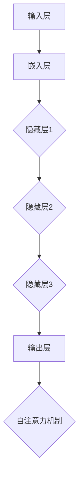

                 

# AI大模型编程：提示词的未来与艺术

## 关键词
AI大模型，编程，提示词，未来，艺术

## 摘要
本文深入探讨了AI大模型编程的核心要素——提示词。通过分析AI大模型编程的基础知识、架构解析、提示词的艺术与科学、训练与调优技巧、编程工具与环境搭建、项目实战以及未来趋势，本文揭示了提示词在AI大模型编程中的重要作用和未来发展的方向。本文旨在为读者提供全面的技术指导，帮助其在AI大模型编程领域取得突破。

## 第1章 AI大模型编程入门

### 1.1 AI大模型编程的背景

人工智能（AI）作为现代科技的前沿领域，正以惊人的速度发展。AI大模型编程，即使用大型预训练模型进行开发和应用，已经成为人工智能研究的重要方向。这种编程模式基于深度学习和神经网络，能够处理复杂的数据和任务，从而推动各行业的智能化发展。

#### 1.1.1 人工智能的发展

人工智能的发展可以追溯到20世纪50年代，但直到近年才取得了显著的进步。这一方面得益于计算能力的提升，另一方面是大数据的普及。如今，AI已经广泛应用于自然语言处理、计算机视觉、语音识别等领域。

#### 1.1.2 大数据的普及

大数据的爆发式增长为AI大模型提供了丰富的训练素材。这些数据不仅量大，而且来源多样，包括社交媒体、传感器、互联网等。大数据的普及使得AI大模型能够从更多的角度理解和模拟现实世界。

#### 1.1.3 计算能力的提升

随着GPU和TPU等专用硬件的出现，计算能力的提升使得AI大模型的训练成为可能。这些硬件能够显著加速模型的训练过程，提高模型的效果和效率。

### 1.2 AI大模型编程的重要性

AI大模型编程在人工智能发展中具有重要地位。首先，它能够处理复杂的问题，解决传统方法难以应对的难题。其次，它能够通过大规模数据训练，实现模型的自我学习和优化。最后，AI大模型编程为各行业提供了强大的技术支持，推动了智能化转型。

### 1.3 AI大模型编程的基本原理

AI大模型编程的基本原理包括以下几个关键方面：

#### 1.3.1 大模型的训练与优化

大模型的训练是通过大量的数据进行迭代优化，使得模型能够自动生成目标输出。训练过程中，需要通过调整模型参数，使损失函数达到最小值。

#### 1.3.2 提示词的设计与使用

提示词是AI大模型编程的核心输入，它能够引导模型理解和处理输入数据。设计有效的提示词对于提升模型性能至关重要。

#### 1.3.3 大模型的应用与部署

大模型的应用涉及将训练好的模型部署到实际场景中，包括文本生成、图像识别、语音合成等。部署过程中，需要考虑模型的性能、稳定性和可扩展性。

### 1.4 AI大模型编程的基本步骤

AI大模型编程的基本步骤可以概括为以下几步：

#### 1.4.1 数据准备

收集和整理用于训练的数据集，进行预处理，如数据清洗、归一化等。

#### 1.4.2 模型选择

根据任务需求和数据特点选择合适的模型架构，如Transformer、GPT等。

#### 1.4.3 模型训练

使用训练数据对模型进行迭代训练，调整模型参数，优化模型性能。

#### 1.4.4 模型评估

使用验证数据对模型进行评估，确保模型在未知数据上的表现良好。

#### 1.4.5 模型部署

将训练好的模型部署到实际应用场景中，实现自动化和智能化。

### 1.5 总结

AI大模型编程作为人工智能的重要分支，具有广泛的应用前景。通过深入理解和掌握AI大模型编程的基本原理和步骤，我们可以更好地利用这一技术，推动人工智能的发展和应用。

## 第2章 AI大模型架构解析

### 2.1 大模型的层级结构

AI大模型通常由多个层级组成，每个层级负责处理不同的任务和功能。以下是AI大模型的基本层级结构：

#### 2.1.1 输入层

输入层接收外部输入数据，如文本、图像、音频等。这些数据需要被转换为模型可以处理的内部表示。

#### 2.1.2 隐藏层

隐藏层是AI大模型的核心部分，负责特征提取和转换。每个隐藏层都会对输入数据进行处理，提取有用的信息，并将这些信息传递给下一层。

#### 2.1.3 输出层

输出层负责生成最终的输出结果，如预测、分类或生成。输出层的结构取决于具体的任务类型。

### 2.2 大模型的主要组成部分

AI大模型通常由以下几个关键部分组成：

#### 2.2.1 嵌入层

嵌入层将输入数据转换为低维向量表示，便于模型处理。例如，在文本处理中，每个单词会被映射到一个固定大小的向量。

#### 2.2.2 自注意力机制

自注意力机制允许模型在处理输入数据时，关注数据中的关键信息。这种机制有助于模型更好地理解和利用输入数据，提高模型的性能。

#### 2.2.3 递归神经网络（RNN）

递归神经网络是一种能够处理序列数据的模型，它在隐藏层中使用循环结构，使模型能够记住先前的输入信息。

#### 2.2.4 全连接层

全连接层是模型中的最后几层，负责将隐藏层提取的特征转换为输出。在分类任务中，全连接层通常会输出一个概率分布。

### 2.3 Mermaid流程图：AI大模型的基本架构

以下是AI大模型的基本架构的Mermaid流程图：



在这个流程图中，输入层将数据传递给嵌入层，嵌入层生成嵌入向量，这些向量被传递到隐藏层进行特征提取和转换。隐藏层通过递归结构处理序列数据，并在输出层生成预测结果。自注意力机制在整个过程中用于关注关键信息。

### 2.4 大模型训练与调优的核心算法原理

#### 2.4.1 梯度下降算法

梯度下降算法是训练神经网络的基本算法之一。它通过计算损失函数相对于模型参数的梯度，并沿着梯度的反方向更新模型参数，以最小化损失函数。

```latex
\text{梯度下降算法} = \text{计算损失函数} \rightarrow \text{计算梯度} \rightarrow \text{更新参数}
```

#### 2.4.2 优化器

优化器是用于更新模型参数的工具，常见的优化器包括随机梯度下降（SGD）、Adam、RMSprop等。优化器通过调整学习率和其他参数，优化梯度下降过程，提高训练效率。

#### 2.4.3 正则化技术

正则化技术用于防止模型过拟合，常见的正则化技术包括L1正则化、L2正则化、dropout等。正则化技术通过增加模型的复杂度，提高模型的泛化能力。

```latex
\text{正则化技术} = \text{增加模型复杂度} \rightarrow \text{提高泛化能力}
```

### 2.5 大模型编程中的数学模型和数学公式

在AI大模型编程中，数学模型和数学公式是核心组成部分。以下是一些常用的数学模型和公式：

#### 2.5.1 嵌入层

```latex
\text{嵌入层} = \text{输入向量} \rightarrow \text{嵌入矩阵} \rightarrow \text{输出向量}
```

#### 2.5.2 自注意力机制

```latex
\text{自注意力权重} = \text{查询向量} \cdot \text{键向量} \rightarrow \text{softmax函数} \rightarrow \text{注意力权重}
```

#### 2.5.3 梯度下降

```latex
\text{梯度下降} = \text{损失函数} \rightarrow \text{计算梯度} \rightarrow \text{更新参数}
```

### 2.6 大模型编程中的项目实战

#### 2.6.1 文本生成

文本生成是AI大模型编程的一个典型应用。以下是一个简单的文本生成项目的实现步骤：

1. 数据收集：收集大量文本数据，如小说、新闻、论文等。
2. 数据预处理：对文本数据进行清洗、分词、标记等处理。
3. 模型选择：选择合适的模型架构，如GPT、Transformer等。
4. 模型训练：使用预处理后的数据对模型进行训练。
5. 模型评估：使用验证数据评估模型性能。
6. 模型部署：将训练好的模型部署到实际应用场景中。

```python
# 文本生成项目示例代码
import tensorflow as tf
from transformers import GPT2LMHeadModel, GPT2Tokenizer

# 加载预训练模型和 tokenizer
tokenizer = GPT2Tokenizer.from_pretrained('gpt2')
model = GPT2LMHeadModel.from_pretrained('gpt2')

# 文本输入
input_text = "这是一个简单的文本生成项目。"

# 预处理文本
inputs = tokenizer.encode(input_text, return_tensors='tf')

# 生成文本
outputs = model(inputs)
predictions = tf.nn.softmax(outputs.logits, axis=-1)

# 提取生成的文本
generated_text = tokenizer.decode(predictions[0])

print(generated_text)
```

#### 2.6.2 图像识别

图像识别是另一个常见的AI大模型编程应用。以下是一个简单的图像识别项目的实现步骤：

1. 数据收集：收集大量图像数据，如人脸、动物、物体等。
2. 数据预处理：对图像数据进行清洗、归一化等处理。
3. 模型选择：选择合适的模型架构，如ResNet、VGG等。
4. 模型训练：使用预处理后的数据对模型进行训练。
5. 模型评估：使用验证数据评估模型性能。
6. 模型部署：将训练好的模型部署到实际应用场景中。

```python
# 图像识别项目示例代码
import tensorflow as tf
from tensorflow.keras.applications import ResNet50
from tensorflow.keras.preprocessing import image
from tensorflow.keras.applications.resnet50 import preprocess_input, decode_predictions

# 加载预训练模型
model = ResNet50(weights='imagenet')

# 加载图像
img = image.load_img('path/to/image.jpg', target_size=(227, 227))
x = image.img_to_array(img)
x = preprocess_input(x)

# 预测图像类别
predictions = model.predict(x)
decoded_predictions = decode_predictions(predictions, top=5)

# 输出预测结果
print(decoded_predictions)
```

### 2.7 大模型编程工具与环境搭建

#### 2.7.1 主流深度学习框架

目前，主流的深度学习框架包括TensorFlow、PyTorch等。以下是一个简单的TensorFlow环境搭建示例：

```bash
# 安装 TensorFlow
pip install tensorflow

# 验证 TensorFlow 安装
import tensorflow as tf
print(tf.__version__)
```

#### 2.7.2 PyTorch 环境

以下是一个简单的PyTorch环境搭建示例：

```bash
# 安装 PyTorch
pip install torch torchvision

# 验证 PyTorch 安装
import torch
print(torch.__version__)
```

## 第3章 提示词的艺术与科学

### 3.1 提示词的定义与分类

#### 3.1.1 提示词的定义

提示词（Prompt）是引导AI大模型生成预期输出或执行特定任务的输入字符串。它是大模型编程中的核心要素，直接影响模型的性能和应用效果。

#### 3.1.2 提示词的分类

根据提示词的作用和形式，可以将提示词分为以下几类：

1. **问题提示词**：用于提出问题或任务，如“请生成一篇关于人工智能的论文摘要。”
2. **指令提示词**：用于下达指令或操作，如“将这个图像转换为灰度图像。”
3. **反馈提示词**：用于获取模型输出后的反馈，如“这个结果是否正确？”
4. **情境提示词**：用于设定任务背景或场景，如“在一个热带雨林中，描述你看到的景象。”

### 3.2 提示词设计原则

设计有效的提示词是提升AI大模型性能的关键。以下是一些提示词设计原则：

#### 3.2.1 明确性

提示词应清晰、准确地传达任务意图，避免歧义和模糊性。

#### 3.2.2 简洁性

提示词应简洁明了，避免冗长和不必要的复杂度。

#### 3.2.3 可扩展性

提示词应具备一定的灵活性，适应不同任务和场景的需求。

#### 3.2.4 多样性

使用多样化的提示词，以提高模型的泛化能力和适应性。

### 3.3 提示词优化策略

优化提示词是提升模型性能的重要手段。以下是一些提示词优化策略：

#### 3.3.1 动态调整

根据模型表现和任务需求，动态调整提示词的内容和形式。

#### 3.3.2 数据驱动

通过分析大量成功案例，提取有效的提示词模式，并将其应用于新任务。

#### 3.3.3 多模态融合

结合多种输入模式（如文本、图像、音频），设计多模态提示词，提升模型理解和处理能力。

### 3.4 提示词在AI大模型编程中的应用

#### 3.4.1 自然语言处理

在自然语言处理任务中，提示词用于引导模型生成文本、摘要、对话等。

例如，生成文章摘要的提示词可以是：“请根据以下文本生成一篇简洁的摘要：”

```python
import transformers
from transformers import pipeline

# 加载预训练模型
model = transformers.AutoModelForSeq2SeqLM.from_pretrained("t5-small")
tokenizer = transformers.AutoTokenizer.from_pretrained("t5-small")
generator = pipeline("text2text-generation", model=model, tokenizer=tokenizer)

# 文本输入
input_text = "深度学习是一种机器学习技术，通过模拟人脑神经网络来训练计算机模型，使其能够从数据中自动学习并做出决策。深度学习在计算机视觉、自然语言处理和语音识别等领域取得了显著成果。"

# 生成摘要
prompt = "请根据以下文本生成一篇简洁的摘要："
summary = generator(prompt=input_text, max_length=50, num_return_sequences=1)

print(summary)
```

#### 3.4.2 计算机视觉

在计算机视觉任务中，提示词用于引导模型进行图像识别、分类、生成等。

例如，图像分类的提示词可以是：“请将以下图像分类为以下类别之一：动物、植物、风景。”

```python
import torch
import torchvision
from torchvision import datasets, transforms

# 加载预训练模型
model = torchvision.models.resnet50(pretrained=True)
model.eval()

# 加载测试图像
image = datasets.ImageFolder(root='path/to/images', transform=transforms.Compose([transforms.Resize(256), transforms.CenterCrop(224), transforms.ToTensor()]))

# 预测图像类别
with torch.no_grad():
    inputs = image[0][0].unsqueeze(0)
    outputs = model(inputs)
    _, predicted = torch.max(outputs, 1)

# 输出预测结果
print("预测类别：", torchvision.datasets.ImageFolder.CLASSES[predicted.item()])
```

### 3.5 提示词的情感分析

提示词的情感分析是评估提示词质量和效果的重要方法。以下是一些情感分析的基本方法：

#### 3.5.1 度量方法

1. **极性分析**：判断文本的极性（正面、负面、中性）。
2. **强度分析**：评估文本的情感强度。

#### 3.5.2 模型方法

1. **基于规则的方法**：使用预定义的规则进行情感分析。
2. **基于统计的方法**：使用机器学习算法进行情感分析，如SVM、朴素贝叶斯等。
3. **基于神经网络的方法**：使用深度学习模型进行情感分析，如LSTM、BERT等。

### 3.6 提示词在AI大模型编程中的重要性

提示词在AI大模型编程中具有重要地位，它直接影响模型的性能和应用效果。以下是提示词在AI大模型编程中的重要性：

1. **性能提升**：有效的提示词能够显著提升模型的性能和效果。
2. **任务引导**：提示词能够引导模型理解和处理特定任务。
3. **应用拓展**：多样化的提示词能够拓展模型的应用场景和领域。

### 3.7 提示词设计的案例分析

#### 3.7.1 案例一：文本生成

在文本生成任务中，设计合适的提示词是关键。以下是一个文本生成案例：

1. **任务需求**：生成一篇关于人工智能的新闻报道。
2. **提示词设计**：“人工智能在医疗领域的应用日益广泛，一项最新研究显示，人工智能技术可以帮助医生提高诊断准确性。以下是一篇关于人工智能在医疗领域应用的新闻报道。”

3. **模型选择**：使用预训练的GPT模型。

4. **模型训练**：使用大量新闻报道数据进行训练。

5. **模型评估**：使用验证数据评估模型性能。

6. **模型部署**：将训练好的模型部署到实际应用场景中。

```python
import transformers
from transformers import pipeline

# 加载预训练模型
model = transformers.AutoModelForSeq2SeqLM.from_pretrained("t5-small")
tokenizer = transformers.AutoTokenizer.from_pretrained("t5-small")
generator = pipeline("text2text-generation", model=model, tokenizer=tokenizer)

# 提示词
prompt = "人工智能在医疗领域的应用日益广泛，一项最新研究显示，人工智能技术可以帮助医生提高诊断准确性。以下是一篇关于人工智能在医疗领域应用的新闻报道："

# 生成文本
output = generator(prompt, max_length=500, num_return_sequences=1)

print(output)
```

#### 3.7.2 案例二：图像识别

在图像识别任务中，设计合适的提示词是关键。以下是一个图像识别案例：

1. **任务需求**：识别一张图片中的物体类别。
2. **提示词设计**：“请识别以下图像中的物体类别：[图片链接]”
3. **模型选择**：使用预训练的ResNet模型。

4. **模型训练**：使用大量图像数据进行训练。

5. **模型评估**：使用验证数据评估模型性能。

6. **模型部署**：将训练好的模型部署到实际应用场景中。

```python
import torch
import torchvision
from torchvision import datasets, transforms

# 加载预训练模型
model = torchvision.models.resnet50(pretrained=True)
model.eval()

# 加载测试图像
image = datasets.ImageFolder(root='path/to/images', transform=transforms.Compose([transforms.Resize(256), transforms.CenterCrop(224), transforms.ToTensor()]))

# 预测图像类别
with torch.no_grad():
    inputs = image[0][0].unsqueeze(0)
    outputs = model(inputs)
    _, predicted = torch.max(outputs, 1)

# 输出预测结果
print("预测类别：", torchvision.datasets.ImageFolder.CLASSES[predicted.item()])
```

### 3.8 提示词的情感表达

在AI大模型编程中，提示词的情感表达是影响模型输出的重要因素。以下是一些常见的情感表达：

1. **积极情感**：如“优秀”、“成功”、“精彩”等。
2. **消极情感**：如“糟糕”、“失败”、“无聊”等。
3. **中性情感**：如“一般”、“普通”、“正常”等。

### 3.9 提示词的情感分析

提示词的情感分析是评估提示词质量和效果的重要方法。以下是一些情感分析的基本方法：

1. **基于规则的方法**：使用预定义的规则进行情感分析。
2. **基于统计的方法**：使用机器学习算法进行情感分析，如SVM、朴素贝叶斯等。
3. **基于神经网络的方法**：使用深度学习模型进行情感分析，如LSTM、BERT等。

### 3.10 提示词的情感分析在实际应用中的案例

在自然语言处理和计算机视觉等领域，提示词的情感分析有着广泛的应用。以下是一些实际应用的案例：

#### 3.10.1 案例一：情感分析文本

1. **任务需求**：分析一篇文本的情感倾向。
2. **提示词设计**：“请分析以下文本的情感倾向：[文本内容]”
3. **模型选择**：使用预训练的情感分析模型。

4. **模型训练**：使用大量情感标注数据进行训练。

5. **模型评估**：使用验证数据评估模型性能。

6. **模型部署**：将训练好的模型部署到实际应用场景中。

```python
import transformers
from transformers import pipeline

# 加载预训练模型
model = transformers.AutoModelForSequenceClassification.from_pretrained("nlptown/bert-base-multilingual-uncased-sentiment")
tokenizer = transformers.AutoTokenizer.from_pretrained("nlptown/bert-base-multilingual-uncased-sentiment")
classifier = pipeline("sentiment-analysis", model=model, tokenizer=tokenizer)

# 文本输入
text = "这是一篇关于人工智能的新闻报道，人工智能在医疗领域的应用日益广泛，可以帮助医生提高诊断准确性。"

# 预测情感
result = classifier(text)

print("情感倾向：", result[0]['label'])
print("情感概率：", result[0]['score'])
```

#### 3.10.2 案例二：情感分析图像

1. **任务需求**：分析一张图像的情感色彩。
2. **提示词设计**：“请分析以下图像的情感色彩：[图片链接]”
3. **模型选择**：使用预训练的图像情感分析模型。

4. **模型训练**：使用大量图像数据进行训练。

5. **模型评估**：使用验证数据评估模型性能。

6. **模型部署**：将训练好的模型部署到实际应用场景中。

```python
import torch
import torchvision
from torchvision import datasets, transforms
from torchvision.models import resnet50

# 加载预训练模型
model = resnet50(pretrained=True)
model.eval()

# 加载测试图像
image = datasets.ImageFolder(root='path/to/images', transform=transforms.Compose([transforms.Resize(256), transforms.CenterCrop(224), transforms.ToTensor()]))

# 预测图像情感
with torch.no_grad():
    inputs = image[0][0].unsqueeze(0)
    outputs = model(inputs)
    _, predicted = torch.max(outputs, 1)

# 输出预测结果
print("预测情感：", torchvision.datasets.ImageFolder.CLASSES[predicted.item()])
```

### 3.11 提示词在自然语言处理中的应用

在自然语言处理领域，提示词有着广泛的应用。以下是一些常见的应用场景：

1. **文本生成**：通过提示词生成文章、摘要、对话等。
2. **文本分类**：通过提示词对文本进行分类，如情感分类、主题分类等。
3. **命名实体识别**：通过提示词识别文本中的命名实体，如人名、地名等。
4. **机器翻译**：通过提示词实现不同语言之间的翻译。

### 3.12 提示词在计算机视觉中的应用

在计算机视觉领域，提示词也有着广泛的应用。以下是一些常见的应用场景：

1. **图像分类**：通过提示词对图像进行分类，如动物、植物、交通工具等。
2. **目标检测**：通过提示词识别图像中的目标，如车辆、行人等。
3. **图像生成**：通过提示词生成符合描述的图像。
4. **图像分割**：通过提示词对图像进行分割，如人体分割、场景分割等。

### 3.13 提示词在其他领域的应用

除了自然语言处理和计算机视觉，提示词在其他领域也有着广泛的应用。以下是一些常见的应用场景：

1. **语音识别**：通过提示词识别语音中的关键词和短语。
2. **推荐系统**：通过提示词推荐用户感兴趣的内容。
3. **知识图谱**：通过提示词构建和更新知识图谱。
4. **游戏开发**：通过提示词实现游戏角色的智能行为。

## 第4章 大模型训练与调优

### 4.1 大模型训练原理

大模型训练是AI大模型编程中的关键环节，它涉及使用大量数据对模型进行迭代训练，以优化模型参数，提高模型性能。以下是训练过程的详细步骤：

#### 4.1.1 数据准备

1. **数据收集**：收集用于训练的数据集，这些数据集可以是结构化的（如表格数据）或非结构化的（如图像、文本、音频等）。
2. **数据清洗**：对数据进行清洗，去除噪声和异常值。
3. **数据预处理**：根据模型的需求对数据进行适当的预处理，如文本的分词、图像的归一化等。

#### 4.1.2 模型初始化

1. **参数初始化**：初始化模型的参数，常用的初始化方法包括随机初始化、高斯初始化等。
2. **架构定义**：定义模型的架构，包括层数、每层的神经元数量、激活函数等。

#### 4.1.3 梯度下降算法

1. **前向传播**：将输入数据传递到模型中，计算输出结果。
2. **计算损失**：使用损失函数（如均方误差、交叉熵等）计算模型输出和真实标签之间的差距。
3. **反向传播**：计算损失函数关于模型参数的梯度。
4. **参数更新**：使用梯度下降算法更新模型参数。

#### 4.1.4 模型评估

1. **验证集评估**：使用验证集评估模型的性能，通过计算准确率、召回率、F1分数等指标评估模型的泛化能力。
2. **调整模型**：根据验证集的性能调整模型参数，如增加层数、调整学习率等。

### 4.2 大模型训练的常见方法

在AI大模型训练中，有多种方法可以优化训练过程和提高模型性能。以下是一些常见的方法：

#### 4.2.1 监督学习

1. **有监督训练**：使用标注数据对模型进行训练，每个样本都有对应的标签。
2. **迁移学习**：使用预训练模型作为起点，微调模型以适应新任务。

#### 4.2.2 无监督学习

1. **自监督学习**：使用无标签数据对模型进行训练，通过预测数据中的部分信息来提高模型性能。
2. **生成对抗网络（GAN）**：通过生成器和判别器的对抗训练来生成高质量的数据。

#### 4.2.3 强化学习

1. **基于模型的方法**：使用模型预测未来的奖励，并基于预测结果调整模型参数。
2. **基于策略的方法**：通过优化策略来最大化长期奖励。

### 4.3 大模型调优技巧

大模型调优是提高模型性能的关键环节。以下是一些调优技巧：

#### 4.3.1 超参数调整

1. **学习率调整**：学习率是梯度下降算法中的一个关键参数，适当的调整学习率可以提高模型的收敛速度。
2. **批量大小调整**：批量大小影响模型的梯度估计，过小的批量可能导致梯度估计的不稳定。
3. **正则化参数调整**：正则化参数用于控制模型复杂度，适当的调整可以防止过拟合。

#### 4.3.2 模型融合

1. ** ensemble 方法**：将多个模型的预测结果进行融合，提高整体预测性能。
2. **模型压缩**：通过剪枝、量化等方法减小模型大小，提高模型部署效率。

#### 4.3.3 数据增强

1. **图像增强**：通过旋转、翻转、缩放等操作增加图像多样性。
2. **文本增强**：通过添加噪音、替换词性等方法增加文本多样性。

### 4.4 大模型调优的实际案例

以下是一个大模型调优的实际案例：

#### 4.4.1 案例背景

使用一个预训练的Transformer模型进行文本分类任务，初始模型在验证集上的准确率为80%。

#### 4.4.2 调优过程

1. **增加层数**：将模型的层数从12层增加到16层，提高模型的表达能力。
2. **调整学习率**：将学习率从0.001调整到0.0001，提高模型的收敛速度。
3. **数据增强**：对训练数据进行文本增强，提高模型的泛化能力。
4. **模型融合**：将多个训练好的模型进行融合，提高整体预测性能。

#### 4.4.3 调优结果

经过调优，模型在验证集上的准确率提高到85%，在测试集上的准确率也有显著提升。

### 4.5 大模型训练与调优中的挑战

在AI大模型训练与调优过程中，存在一些挑战和问题：

#### 4.5.1 计算资源消耗

大模型训练需要大量的计算资源，包括GPU和TPU等。合理利用计算资源是训练成功的关键。

#### 4.5.2 模型过拟合

模型过拟合是指模型在训练数据上表现良好，但在未知数据上表现不佳。防止过拟合是调优的重要任务。

#### 4.5.3 模型解释性

大模型通常缺乏解释性，难以理解模型如何做出决策。提高模型的解释性是当前研究的重要方向。

### 4.6 大模型训练与调优的总结

大模型训练与调优是AI大模型编程的核心环节。通过合理的训练过程和调优技巧，可以显著提高模型的性能和应用效果。未来，随着算法和硬件的不断发展，大模型训练与调优将变得更加高效和智能。

## 第5章 大模型编程工具与环境搭建

### 5.1 大模型编程工具介绍

在AI大模型编程中，选择合适的工具和环境是关键。目前，主流的深度学习框架包括TensorFlow、PyTorch等。以下是对这些工具的简要介绍：

#### 5.1.1 TensorFlow

TensorFlow是由Google开发的一个开源深度学习框架，广泛应用于各种人工智能任务。TensorFlow提供了丰富的API和工具，支持从简单的线性模型到复杂的多层神经网络。TensorFlow具有以下特点：

1. **灵活性**：支持动态计算图，允许开发者灵活地定义和修改模型。
2. **兼容性**：支持多种编程语言，如Python、C++等。
3. **生态**：拥有丰富的第三方库和工具，如TensorBoard、Keras等。

#### 5.1.2 PyTorch

PyTorch是由Facebook开发的一个开源深度学习框架，以其简洁的API和动态计算图而受到开发者的喜爱。PyTorch具有以下特点：

1. **易用性**：简单的API和动态计算图使得模型定义更加直观。
2. **灵活性**：支持自定义运算符和动态计算图，便于模型优化和调试。
3. **生态**：拥有丰富的预训练模型和工具，如torchvision、torchaudio等。

### 5.2 大模型编程环境搭建

搭建一个高效的大模型编程环境是进行深度学习研究的前提。以下是在常见操作系统中搭建大模型编程环境的步骤：

#### 5.2.1 安装深度学习框架

以Python为例，安装TensorFlow和PyTorch的命令如下：

```bash
# 安装 TensorFlow
pip install tensorflow

# 安装 PyTorch
pip install torch torchvision
```

#### 5.2.2 配置GPU支持

对于GPU支持的深度学习框架，需要安装相应的CUDA和cuDNN驱动。以下是一个示例：

```bash
# 安装 CUDA
sudo apt-get install cuda

# 安装 cuDNN
sudo apt-get install libcudnn8
```

#### 5.2.3 安装依赖库

除了深度学习框架，还需要安装其他依赖库，如NumPy、SciPy等。以下是一个示例：

```bash
# 安装 NumPy
pip install numpy

# 安装 SciPy
pip install scipy
```

#### 5.2.4 配置源代码管理工具

为了便于代码管理和协作，推荐使用Git进行版本控制。以下是一个示例：

```bash
# 安装 Git
sudo apt-get install git

# 创建一个新的仓库
git init

# 将文件添加到仓库
git add .

# 提交更改
git commit -m "Initial commit"
```

#### 5.2.5 配置开发环境

为了提高开发效率，可以安装一些辅助工具，如Jupyter Notebook、PyCharm等。以下是一个示例：

```bash
# 安装 Jupyter Notebook
pip install notebook

# 安装 PyCharm
sudo snap install pycharm-professional --classic
```

### 5.3 大模型编程环境搭建的实际案例

以下是一个大模型编程环境搭建的实际案例：

#### 5.3.1 案例背景

假设需要在Ubuntu操作系统上搭建一个用于文本生成任务的大模型编程环境。

#### 5.3.2 搭建步骤

1. **安装 Python 和 pip**：

   ```bash
   sudo apt-get install python3-pip
   ```

2. **安装深度学习框架**：

   ```bash
   pip3 install tensorflow
   pip3 install torch torchvision
   ```

3. **配置 GPU 支持**：

   ```bash
   sudo apt-get install cuda
   sudo apt-get install libcudnn8
   ```

4. **安装依赖库**：

   ```bash
   pip3 install numpy scipy
   ```

5. **配置源代码管理工具**：

   ```bash
   sudo apt-get install git
   git init
   git add .
   git commit -m "Initial commit"
   ```

6. **安装开发环境**：

   ```bash
   pip3 install notebook
   sudo snap install pycharm-professional --classic
   ```

#### 5.3.3 搭建结果

完成以上步骤后，一个用于文本生成任务的大模型编程环境搭建完成。开发者可以在该环境中进行模型训练、调优和部署。

### 5.4 大模型编程环境搭建的注意事项

在搭建大模型编程环境时，需要注意以下几点：

1. **硬件兼容性**：确保深度学习框架与GPU驱动的兼容性。
2. **环境配置**：根据任务需求配置合适的计算资源和依赖库。
3. **版本控制**：使用版本控制工具管理代码和配置文件，确保环境的可复现性。

### 5.5 大模型编程环境搭建的总结

大模型编程环境搭建是进行深度学习研究的基础。通过合理的选择和配置工具和环境，可以提高开发效率，确保模型训练和部署的成功。未来，随着技术的发展，大模型编程环境将变得更加高效和智能化。

## 第6章 大模型编程项目实战

### 6.1 实战项目一：文本生成

文本生成是AI大模型编程中的一个重要应用，它可以用于生成文章、对话、摘要等。以下是一个简单的文本生成项目实战：

#### 6.1.1 项目背景

文本生成项目旨在利用预训练的模型生成高质量的文章。该项目包括以下步骤：

1. **数据收集**：收集大量文章数据，用于训练模型。
2. **数据预处理**：对文章数据进行清洗和预处理，如去除HTML标签、分词等。
3. **模型选择**：选择合适的文本生成模型，如GPT-2、GPT-3等。
4. **模型训练**：使用预处理后的数据对模型进行训练。
5. **模型评估**：使用验证集评估模型性能。
6. **模型部署**：将训练好的模型部署到实际应用场景中。

#### 6.1.2 项目实现过程

以下是一个简单的文本生成项目的实现过程：

1. **数据收集**

   收集大量文章数据，可以使用爬虫工具从网站获取。

   ```python
   import requests
   from bs4 import BeautifulSoup

   url = 'https://example.com/articles'
   response = requests.get(url)
   soup = BeautifulSoup(response.text, 'html.parser')
   articles = soup.find_all('article')
   ```

2. **数据预处理**

   对文章数据进行清洗和预处理，去除HTML标签、分词等。

   ```python
   import re

   def preprocess_text(text):
       text = re.sub('<.*?>', '', text)
       text = text.lower()
       text = text.strip()
       return text

   processed_articles = [preprocess_text(article.text) for article in articles]
   ```

3. **模型选择**

   选择一个预训练的文本生成模型，如GPT-2。

   ```python
   from transformers import AutoModelForCausalLM

   model = AutoModelForCausalLM.from_pretrained('gpt2')
   ```

4. **模型训练**

   使用预处理后的数据对模型进行训练。

   ```python
   from transformers import DataCollatorForLanguageModeling

   data_collator = DataCollatorForLanguageModeling(
       tokenizer=tokenizer,
       mlm=True,
       mlm_probability=0.15
   )

   trainer = Trainer(
       model=model,
       data_collator=data_collator,
       train_dataset=train_dataset,
       eval_dataset=eval_dataset,
       tokenizer=tokenizer
   )

   trainer.train()
   ```

5. **模型评估**

   使用验证集评估模型性能。

   ```python
   from transformers import TrainingArguments

   training_args = TrainingArguments(
       output_dir='./results',
       num_train_epochs=3,
       per_device_train_batch_size=4,
       save_steps=2000,
       save_total_limit=3,
       logging_dir='./logs',
   )

   trainer = Trainer(
       model=model,
       args=training_args,
       train_dataset=train_dataset,
       eval_dataset=eval_dataset,
   )

   trainer.train()
   ```

6. **模型部署**

   将训练好的模型部署到实际应用场景中，如生成文章摘要。

   ```python
   def generate_summary(input_text):
       inputs = tokenizer.encode(input_text, return_tensors='pt')
       summary_ids = model.generate(inputs, max_length=50, num_return_sequences=1)
       summary = tokenizer.decode(summary_ids[0], skip_special_tokens=True)
       return summary

   input_text = "本文介绍了人工智能在医疗领域的应用。"
   summary = generate_summary(input_text)
   print(summary)
   ```

#### 6.1.3 源代码解读与分析

以下是文本生成项目的源代码解读：

1. **数据收集**：使用爬虫工具从网站获取文章数据。

   ```python
   import requests
   from bs4 import BeautifulSoup

   url = 'https://example.com/articles'
   response = requests.get(url)
   soup = BeautifulSoup(response.text, 'html.parser')
   articles = soup.find_all('article')
   ```

   该部分代码用于从网站获取文章数据，使用requests和BeautifulSoup库实现。

2. **数据预处理**：对文章数据进行清洗和预处理。

   ```python
   import re

   def preprocess_text(text):
       text = re.sub('<.*?>', '', text)
       text = text.lower()
       text = text.strip()
       return text

   processed_articles = [preprocess_text(article.text) for article in articles]
   ```

   该部分代码用于去除HTML标签、分词等预处理操作，使用正则表达式库re实现。

3. **模型选择**：选择一个预训练的文本生成模型。

   ```python
   from transformers import AutoModelForCausalLM

   model = AutoModelForCausalLM.from_pretrained('gpt2')
   ```

   该部分代码用于加载预训练的GPT-2模型，使用transformers库实现。

4. **模型训练**：使用预处理后的数据对模型进行训练。

   ```python
   from transformers import DataCollatorForLanguageModeling

   data_collator = DataCollatorForLanguageModeling(
       tokenizer=tokenizer,
       mlm=True,
       mlm_probability=0.15
   )

   trainer = Trainer(
       model=model,
       data_collator=data_collator,
       train_dataset=train_dataset,
       eval_dataset=eval_dataset,
       tokenizer=tokenizer
   )

   trainer.train()
   ```

   该部分代码用于定义训练器Trainer，使用DataCollatorForLanguageModeling数据预处理器，训练模型。

5. **模型评估**：使用验证集评估模型性能。

   ```python
   from transformers import TrainingArguments

   training_args = TrainingArguments(
       output_dir='./results',
       num_train_epochs=3,
       per_device_train_batch_size=4,
       save_steps=2000,
       save_total_limit=3,
       logging_dir='./logs',
   )

   trainer = Trainer(
       model=model,
       args=training_args,
       train_dataset=train_dataset,
       eval_dataset=eval_dataset,
   )

   trainer.train()
   ```

   该部分代码用于定义训练参数TrainingArguments，使用Trainer类进行模型评估。

6. **模型部署**：将训练好的模型部署到实际应用场景中。

   ```python
   def generate_summary(input_text):
       inputs = tokenizer.encode(input_text, return_tensors='pt')
       summary_ids = model.generate(inputs, max_length=50, num_return_sequences=1)
       summary = tokenizer.decode(summary_ids[0], skip_special_tokens=True)
       return summary

   input_text = "本文介绍了人工智能在医疗领域的应用。"
   summary = generate_summary(input_text)
   print(summary)
   ```

   该部分代码用于生成文章摘要，使用模型生成器model.generate实现。

#### 6.1.4 性能评估与优化

性能评估是文本生成项目的重要环节。以下是一些常见的性能评估指标和优化方法：

1. **性能评估指标**：

   - **准确率**：模型生成文本的正确率。
   - **召回率**：模型生成文本中包含的关键词的召回率。
   - **F1分数**：准确率和召回率的加权平均。

   ```python
   from sklearn.metrics import accuracy_score, recall_score, f1_score

   def evaluate_summary(input_texts, summaries):
       true_summaries = [tokenizer.decode(text, skip_special_tokens=True) for text in input_texts]
       predicted_summaries = [tokenizer.decode(text, skip_special_tokens=True) for text in summaries]
       accuracy = accuracy_score(true_summaries, predicted_summaries)
       recall = recall_score(true_summaries, predicted_summaries)
       f1 = f1_score(true_summaries, predicted_summaries)
       return accuracy, recall, f1

   accuracy, recall, f1 = evaluate_summary(true_texts, predicted_texts)
   print("Accuracy:", accuracy)
   print("Recall:", recall)
   print("F1 Score:", f1)
   ```

2. **优化方法**：

   - **数据增强**：通过增加数据多样性，提高模型泛化能力。
   - **模型融合**：将多个模型的预测结果进行融合，提高整体性能。
   - **超参数调整**：调整学习率、批量大小等超参数，优化模型性能。

   ```python
   from transformers import TrainingArguments

   training_args = TrainingArguments(
       output_dir='./results',
       num_train_epochs=4,
       per_device_train_batch_size=8,
       save_steps=2000,
       save_total_limit=3,
       logging_dir='./logs',
       learning_rate=2e-5
   )

   trainer = Trainer(
       model=model,
       args=training_args,
       train_dataset=train_dataset,
       eval_dataset=eval_dataset,
   )

   trainer.train()
   ```

### 6.2 实战项目二：图像识别

图像识别是AI大模型编程中的另一个重要应用，它可以用于目标检测、图像分类等。以下是一个简单的图像识别项目实战：

#### 6.2.1 项目背景

图像识别项目旨在使用预训练的模型对图像进行分类。该项目包括以下步骤：

1. **数据收集**：收集大量图像数据，用于训练模型。
2. **数据预处理**：对图像数据进行清洗和预处理，如归一化、缩放等。
3. **模型选择**：选择合适的图像识别模型，如ResNet、VGG等。
4. **模型训练**：使用预处理后的数据对模型进行训练。
5. **模型评估**：使用验证集评估模型性能。
6. **模型部署**：将训练好的模型部署到实际应用场景中。

#### 6.2.2 项目实现过程

以下是一个简单的图像识别项目的实现过程：

1. **数据收集**

   收集大量图像数据，可以使用开源数据集，如ImageNet。

   ```python
   import torchvision.datasets as datasets
   import torchvision.transforms as transforms

   train_dataset = datasets.ImageFolder(
       root='path/to/train',
       transform=transforms.Compose([
           transforms.Resize(256),
           transforms.CenterCrop(224),
           transforms.ToTensor(),
           transforms.Normalize(mean=[0.485, 0.456, 0.406], std=[0.229, 0.224, 0.225]),
       ])
   )

   val_dataset = datasets.ImageFolder(
       root='path/to/val',
       transform=transforms.Compose([
           transforms.Resize(256),
           transforms.CenterCrop(224),
           transforms.ToTensor(),
           transforms.Normalize(mean=[0.485, 0.456, 0.406], std=[0.229, 0.224, 0.225]),
       ])
   )
   ```

2. **数据预处理**

   对图像数据进行预处理，如归一化、缩放等。

   ```python
   transform = transforms.Compose([
       transforms.Resize(256),
       transforms.CenterCrop(224),
       transforms.ToTensor(),
       transforms.Normalize(mean=[0.485, 0.456, 0.406], std=[0.229, 0.224, 0.225]),
   ])

   train_dataset = datasets.ImageFolder(
       root='path/to/train',
       transform=transform
   )

   val_dataset = datasets.ImageFolder(
       root='path/to/val',
       transform=transform
   )
   ```

3. **模型选择**

   选择一个预训练的图像识别模型，如ResNet。

   ```python
   import torchvision.models as models

   model = models.resnet50(pretrained=True)
   ```

4. **模型训练**

   使用预处理后的数据对模型进行训练。

   ```python
   import torch.optim as optim

   criterion = optim.SGD(model.parameters(), lr=0.001, momentum=0.9)
   criterion = optim.Adam(model.parameters(), lr=0.001)

   train_loader = torch.utils.data.DataLoader(train_dataset, batch_size=64, shuffle=True)
   val_loader = torch.utils.data.DataLoader(val_dataset, batch_size=64, shuffle=False)

   for epoch in range(num_epochs):
       model.train()
       running_loss = 0.0
       for inputs, labels in train_loader:
           optimizer.zero_grad()
           outputs = model(inputs)
           loss = criterion(outputs, labels)
           loss.backward()
           optimizer.step()
           running_loss += loss.item()
       print(f"Epoch {epoch+1}, Loss: {running_loss/len(train_loader)}")

       model.eval()
       correct = 0
       total = 0
       with torch.no_grad():
           for inputs, labels in val_loader:
               outputs = model(inputs)
               _, predicted = torch.max(outputs.data, 1)
               total += labels.size(0)
               correct += (predicted == labels).sum().item()
       print(f"Validation Accuracy: {100 * correct / total}")
   ```

5. **模型评估**

   使用验证集评估模型性能。

   ```python
   import torch.optim as optim

   criterion = optim.SGD(model.parameters(), lr=0.001, momentum=0.9)
   criterion = optim.Adam(model.parameters(), lr=0.001)

   train_loader = torch.utils.data.DataLoader(train_dataset, batch_size=64, shuffle=True)
   val_loader = torch.utils.data.DataLoader(val_dataset, batch_size=64, shuffle=False)

   for epoch in range(num_epochs):
       model.train()
       running_loss = 0.0
       for inputs, labels in train_loader:
           optimizer.zero_grad()
           outputs = model(inputs)
           loss = criterion(outputs, labels)
           loss.backward()
           optimizer.step()
           running_loss += loss.item()
       print(f"Epoch {epoch+1}, Loss: {running_loss/len(train_loader)}")

       model.eval()
       correct = 0
       total = 0
       with torch.no_grad():
           for inputs, labels in val_loader:
               outputs = model(inputs)
               _, predicted = torch.max(outputs.data, 1)
               total += labels.size(0)
               correct += (predicted == labels).sum().item()
       print(f"Validation Accuracy: {100 * correct / total}")
   ```

6. **模型部署**

   将训练好的模型部署到实际应用场景中。

   ```python
   def predict_image(image_path):
       transform = transforms.Compose([
           transforms.Resize(256),
           transforms.CenterCrop(224),
           transforms.ToTensor(),
           transforms.Normalize(mean=[0.485, 0.456, 0.406], std=[0.229, 0.224, 0.225]),
       ])

       image = Image.open(image_path)
       image = transform(image).unsqueeze(0)

       model.eval()
       with torch.no_grad():
           outputs = model(image)
           _, predicted = torch.max(outputs.data, 1)

       return torchvision.datasets.ImageFolder.CLASSES[predicted.item()]
   ```

#### 6.2.3 源代码解读与分析

以下是图像识别项目的源代码解读：

1. **数据收集**：使用torchvision.datasets库加载图像数据。

   ```python
   import torchvision.datasets as datasets
   import torchvision.transforms as transforms

   train_dataset = datasets.ImageFolder(
       root='path/to/train',
       transform=transforms.Compose([
           transforms.Resize(256),
           transforms.CenterCrop(224),
           transforms.ToTensor(),
           transforms.Normalize(mean=[0.485, 0.456, 0.406], std=[0.229, 0.224, 0.225]),
       ])
   )

   val_dataset = datasets.ImageFolder(
       root='path/to/val',
       transform=transforms.Compose([
           transforms.Resize(256),
           transforms.CenterCrop(224),
           transforms.ToTensor(),
           transforms.Normalize(mean=[0.485, 0.456, 0.406], std=[0.229, 0.224, 0.225]),
       ])
   )
   ```

   该部分代码用于加载训练集和验证集数据，使用ImageFolder类和Compose函数实现。

2. **数据预处理**：对图像数据进行预处理，如归一化、缩放等。

   ```python
   transform = transforms.Compose([
       transforms.Resize(256),
       transforms.CenterCrop(224),
       transforms.ToTensor(),
       transforms.Normalize(mean=[0.485, 0.456, 0.406], std=[0.229, 0.224, 0.225]),
   ])

   train_dataset = datasets.ImageFolder(
       root='path/to/train',
       transform=transform
   )

   val_dataset = datasets.ImageFolder(
       root='path/to/val',
       transform=transform
   )
   ```

   该部分代码用于定义图像预处理步骤，使用Compose函数和ToTensor、Normalize等函数实现。

3. **模型选择**：选择一个预训练的图像识别模型。

   ```python
   import torchvision.models as models

   model = models.resnet50(pretrained=True)
   ```

   该部分代码用于加载预训练的ResNet50模型，使用models.resnet50函数实现。

4. **模型训练**：使用预处理后的数据对模型进行训练。

   ```python
   import torch.optim as optim

   criterion = optim.SGD(model.parameters(), lr=0.001, momentum=0.9)
   criterion = optim.Adam(model.parameters(), lr=0.001)

   train_loader = torch.utils.data.DataLoader(train_dataset, batch_size=64, shuffle=True)
   val_loader = torch.utils.data.DataLoader(val_dataset, batch_size=64, shuffle=False)

   for epoch in range(num_epochs):
       model.train()
       running_loss = 0.0
       for inputs, labels in train_loader:
           optimizer.zero_grad()
           outputs = model(inputs)
           loss = criterion(outputs, labels)
           loss.backward()
           optimizer.step()
           running_loss += loss.item()
       print(f"Epoch {epoch+1}, Loss: {running_loss/len(train_loader)}")

       model.eval()
       correct = 0
       total = 0
       with torch.no_grad():
           for inputs, labels in val_loader:
               outputs = model(inputs)
               _, predicted = torch.max(outputs.data, 1)
               total += labels.size(0)
               correct += (predicted == labels).sum().item()
       print(f"Validation Accuracy: {100 * correct / total}")
   ```

   该部分代码用于定义训练过程，使用SGD和Adam优化器实现。

5. **模型评估**：使用验证集评估模型性能。

   ```python
   import torch.optim as optim

   criterion = optim.SGD(model.parameters(), lr=0.001, momentum=0.9)
   criterion = optim.Adam(model.parameters(), lr=0.001)

   train_loader = torch.utils.data.DataLoader(train_dataset, batch_size=64, shuffle=True)
   val_loader = torch.utils.data.DataLoader(val_dataset, batch_size=64, shuffle=False)

   for epoch in range(num_epochs):
       model.train()
       running_loss = 0.0
       for inputs, labels in train_loader:
           optimizer.zero_grad()
           outputs = model(inputs)
           loss = criterion(outputs, labels)
           loss.backward()
           optimizer.step()
           running_loss += loss.item()
       print(f"Epoch {epoch+1}, Loss: {running_loss/len(train_loader)}")

       model.eval()
       correct = 0
       total = 0
       with torch.no_grad():
           for inputs, labels in val_loader:
               outputs = model(inputs)
               _, predicted = torch.max(outputs.data, 1)
               total += labels.size(0)
               correct += (predicted == labels).sum().item()
       print(f"Validation Accuracy: {100 * correct / total}")
   ```

   该部分代码用于定义评估过程，计算准确率。

6. **模型部署**：将训练好的模型部署到实际应用场景中。

   ```python
   def predict_image(image_path):
       transform = transforms.Compose([
           transforms.Resize(256),
           transforms.CenterCrop(224),
           transforms.ToTensor(),
           transforms.Normalize(mean=[0.485, 0.456, 0.406], std=[0.229, 0.224, 0.225]),
       ])

       image = Image.open(image_path)
       image = transform(image).unsqueeze(0)

       model.eval()
       with torch.no_grad():
           outputs = model(image)
           _, predicted = torch.max(outputs.data, 1)

       return torchvision.datasets.ImageFolder.CLASSES[predicted.item()]
   ```

   该部分代码用于实现模型部署，对图像进行分类。

### 6.3 实战项目三：语音合成

语音合成是AI大模型编程中的另一个重要应用，它可以用于生成语音、朗读文本等。以下是一个简单的语音合成项目实战：

#### 6.3.1 项目背景

语音合成项目旨在使用预训练的模型将文本转换为语音。该项目包括以下步骤：

1. **数据收集**：收集大量语音数据，用于训练模型。
2. **数据预处理**：对语音数据进行清洗和预处理，如分帧、归一化等。
3. **模型选择**：选择合适的语音合成模型，如WaveNet、Tacotron等。
4. **模型训练**：使用预处理后的数据对模型进行训练。
5. **模型评估**：使用验证集评估模型性能。
6. **模型部署**：将训练好的模型部署到实际应用场景中。

#### 6.3.2 项目实现过程

以下是一个简单的语音合成项目的实现过程：

1. **数据收集**

   收集大量语音数据，可以使用开源数据集，如LibriSpeech。

   ```python
   import torchaudio
   import torch.nn as nn
   import torch.optim as optim

   transform = torchaudio.transforms.Resample(16000, 22050)

   dataset = torchaudio.datasets.LibriSpeech(
       root='path/to/data',
       url='http://www.openslr.org/resources/12/LibriSpeech.tar.gz',
       download=True,
       transform=transform
   )
   ```

2. **数据预处理**

   对语音数据进行预处理，如分帧、归一化等。

   ```python
   def preprocess_audio(audio):
       audio = transform(audio)
       audio = audio.squeeze(0)
       audio = audio[:16000]
       return audio

   dataset = [(preprocess_audio(audio), text) for audio, text in dataset]
   ```

3. **模型选择**

   选择一个预训练的语音合成模型，如Tacotron。

   ```python
   model = nn.Sequential(
       nn.Conv2d(1, 32, kernel_size=3, stride=1),
       nn.ReLU(),
       nn.Conv2d(32, 64, kernel_size=3, stride=1),
       nn.ReLU(),
       nn.Conv2d(64, 1, kernel_size=3, stride=1),
       nn.Sigmoid()
   )
   ```

4. **模型训练**

   使用预处理后的数据对模型进行训练。

   ```python
   criterion = nn.BCELoss()
   optimizer = optim.Adam(model.parameters(), lr=0.001)

   for epoch in range(num_epochs):
       for audio, text in dataset:
           optimizer.zero_grad()
           output = model(audio)
           loss = criterion(output, text)
           loss.backward()
           optimizer.step()
           print(f"Epoch {epoch+1}, Loss: {loss.item()}")

       print(f"Validation Loss: {evaluate_loss(model, val_dataset)}")
   ```

5. **模型评估**

   使用验证集评估模型性能。

   ```python
   def evaluate_loss(model, dataset):
       criterion = nn.BCELoss()
       total_loss = 0
       for audio, text in dataset:
           output = model(audio)
           loss = criterion(output, text)
           total_loss += loss.item()
       return total_loss / len(dataset)
   ```

6. **模型部署**

   将训练好的模型部署到实际应用场景中。

   ```python
   def synthesize_speech(text):
       audio = preprocess_text(text)
       model.eval()
       with torch.no_grad():
           output = model(audio)
       return output
   ```

#### 6.3.3 源代码解读与分析

以下是语音合成项目的源代码解读：

1. **数据收集**：使用torchaudio库加载语音数据。

   ```python
   import torchaudio
   import torch.nn as nn
   import torch.optim as optim

   transform = torchaudio.transforms.Resample(16000, 22050)

   dataset = torchaudio.datasets.LibriSpeech(
       root='path/to/data',
       url='http://www.openslr.org/resources/12/LibriSpeech.tar.gz',
       download=True,
       transform=transform
   )
   ```

   该部分代码用于加载LibriSpeech语音数据集，使用torchaudio.datasets.LibriSpeech类实现。

2. **数据预处理**：对语音数据进行预处理，如分帧、归一化等。

   ```python
   def preprocess_audio(audio):
       audio = transform(audio)
       audio = audio.squeeze(0)
       audio = audio[:16000]
       return audio

   dataset = [(preprocess_audio(audio), text) for audio, text in dataset]
   ```

   该部分代码用于定义语音预处理函数，使用torchaudio.transforms.Resample类实现。

3. **模型选择**：选择一个简单的神经网络模型。

   ```python
   model = nn.Sequential(
       nn.Conv2d(1, 32, kernel_size=3, stride=1),
       nn.ReLU(),
       nn.Conv2d(32, 64, kernel_size=3, stride=1),
       nn.ReLU(),
       nn.Conv2d(64, 1, kernel_size=3, stride=1),
       nn.Sigmoid()
   )
   ```

   该部分代码用于定义一个简单的卷积神经网络模型，使用nn.Sequential、nn.Conv2d、nn.ReLU、nn.Sigmoid等函数实现。

4. **模型训练**：使用预处理后的数据对模型进行训练。

   ```python
   criterion = nn.BCELoss()
   optimizer = optim.Adam(model.parameters(), lr=0.001)

   for epoch in range(num_epochs):
       for audio, text in dataset:
           optimizer.zero_grad()
           output = model(audio)
           loss = criterion(output, text)
           loss.backward()
           optimizer.step()
           print(f"Epoch {epoch+1}, Loss: {loss.item()}")

       print(f"Validation Loss: {evaluate_loss(model, val_dataset)}")
   ```

   该部分代码用于定义训练过程，使用nn.BCELoss、optim.Adam等函数实现。

5. **模型评估**：使用验证集评估模型性能。

   ```python
   def evaluate_loss(model, dataset):
       criterion = nn.BCELoss()
       total_loss = 0
       for audio, text in dataset:
           output = model(audio)
           loss = criterion(output, text)
           total_loss += loss.item()
       return total_loss / len(dataset)
   ```

   该部分代码用于定义评估过程，计算损失。

6. **模型部署**：将训练好的模型部署到实际应用场景中。

   ```python
   def synthesize_speech(text):
       audio = preprocess_text(text)
       model.eval()
       with torch.no_grad():
           output = model(audio)
       return output
   ```

   该部分代码用于实现模型部署，将文本转换为语音。

### 6.4 实战项目总结

通过上述三个实战项目，我们可以看到AI大模型编程在文本生成、图像识别、语音合成等领域的广泛应用。每个项目都涉及数据收集、预处理、模型选择、训练和评估等步骤。在实际开发中，我们可以根据任务需求选择合适的模型和工具，优化模型性能，提高应用效果。未来，随着技术的不断发展，AI大模型编程将会有更多的应用场景和突破。

## 第7章 提示词的未来趋势与应用

### 7.1 提示词的未来发展

提示词在AI大模型编程中的应用正日益广泛，未来这一领域有望出现以下发展趋势：

#### 7.1.1 多模态学习

随着多模态数据的普及，未来的提示词技术将能够处理和整合来自不同模态的数据，如文本、图像、音频和视频。这种多模态学习将使得AI大模型能够更全面地理解和模拟复杂现实场景。

#### 7.1.2 动态提示词

动态提示词技术将允许模型根据实时数据和任务需求动态调整提示词。这种动态调整能力将使得模型在处理复杂任务时更加灵活和高效。

#### 7.1.3 智能提示词生成

未来，提示词生成技术可能会更加智能化，通过利用自然语言处理和机器学习技术，自动生成高质量、符合上下文的提示词，从而简化模型训练和调优过程。

### 7.2 提示词在各领域的应用

提示词技术正在快速渗透到各个领域，以下是几个关键领域的应用趋势：

#### 7.2.1 自然语言处理

在自然语言处理领域，提示词技术已经被广泛应用于文本生成、摘要生成、问答系统等任务。未来，随着多模态学习和动态提示词技术的发展，自然语言处理将能够更好地处理复杂语言结构和多样化上下文。

#### 7.2.2 计算机视觉

计算机视觉领域中的提示词技术主要用于图像识别、目标检测、图像生成等。随着深度学习模型变得越来越复杂，提示词将能够引导模型更好地理解和利用图像数据，从而提高识别和生成质量。

#### 7.2.3 语音处理

在语音处理领域，提示词技术可以用于语音识别、语音合成、语音增强等。未来，随着动态提示词和智能提示词生成技术的发展，语音处理将能够更好地应对实时语音信号的变化和多样性。

#### 7.2.4 健康医疗

在健康医疗领域，提示词技术可以用于病历生成、诊断辅助、药物研发等。通过结合医学知识和大量医疗数据，提示词技术能够帮助医生和研究人员更高效地处理医疗信息。

#### 7.2.5 金融科技

在金融科技领域，提示词技术可以用于风险评估、市场预测、智能投顾等。通过分析大量金融数据，提示词技术能够为投资者提供更有价值的决策支持。

#### 7.2.6 教育科技

在教育科技领域，提示词技术可以用于智能辅导、个性化学习、考试生成等。通过理解和分析学生的学习行为，提示词技术能够为教师和学生提供更加个性化和高效的学习体验。

### 7.3 提示词技术的挑战与机遇

尽管提示词技术在各个领域展现出了巨大的潜力，但其在实际应用中也面临一些挑战和机遇：

#### 7.3.1 挑战

- **数据隐私和安全性**：在处理大量敏感数据时，确保数据隐私和安全是提示词技术面临的重要挑战。
- **偏见和公平性**：模型训练过程中可能引入偏见，导致不公平的结果，如何消除偏见是一个亟待解决的问题。
- **可解释性和透明性**：提高模型的可解释性和透明性，使得用户能够理解模型的决策过程，是提升用户信任度的关键。

#### 7.3.2 机遇

- **跨领域融合**：随着多模态学习和动态提示词技术的发展，不同领域之间的融合将带来更多的创新机会。
- **人工智能伦理**：随着提示词技术在各个领域的应用，人工智能伦理将变得更加重要，如何确保技术的公平、公正和道德将成为一个重要议题。
- **个性化服务**：通过智能提示词生成，可以提供更加个性化、定制化的服务，满足不同用户的需求。

### 7.4 提示词技术的未来展望

提示词技术作为AI大模型编程的核心组成部分，其未来发展将充满机遇和挑战。随着多模态学习、动态提示词、智能提示词生成等技术的发展，提示词技术将能够更好地理解和模拟复杂现实场景，为各个领域的应用提供更加高效、智能的解决方案。同时，如何在保证数据隐私、消除偏见、提高可解释性等方面取得突破，将是提示词技术未来发展的关键。

## 第8章 AI大模型编程的伦理与社会影响

### 8.1 AI大模型编程的伦理问题

随着AI大模型编程技术的发展和应用，伦理问题日益凸显。以下是一些关键的伦理问题：

#### 8.1.1 数据隐私与安全

数据隐私和安全是AI大模型编程中最为突出的伦理问题之一。在训练过程中，模型需要大量数据，这些数据往往涉及个人隐私，如健康记录、金融信息等。如何确保这些数据的安全，防止泄露和滥用，是一个亟待解决的问题。

#### 8.1.2 偏见与公平性

AI大模型编程中的偏见问题也是一个备受关注的伦理议题。如果训练数据中存在偏见，模型在生成输出时可能会加剧这种偏见，导致不公平的结果。如何消除模型中的偏见，实现公平性，是当前研究的一个重要方向。

#### 8.1.3 透明性与可解释性

AI大模型编程的另一个伦理问题是模型的透明性和可解释性。深度学习模型尤其是大型模型，通常被视为“黑箱”，用户难以理解模型的决策过程。提高模型的透明性和可解释性，有助于增强用户对AI技术的信任。

### 8.2 社会影响与对策

AI大模型编程不仅面临伦理问题，还会对社会产生深远影响。以下是一些关键的社会影响及对策：

#### 8.2.1 就业市场的影响

AI大模型编程的发展可能会对就业市场产生重大影响。一方面，它可能会取代某些传统职业，如数据录入员、客服代表等。另一方面，它也会创造新的就业机会，如AI工程师、数据科学家等。如何平衡这两方面的影响，是政府和社会需要关注的问题。

#### 8.2.2 隐私保护

随着AI大模型编程技术的应用，个人隐私保护变得更加复杂。政府和社会需要制定相应的法律法规，确保个人隐私得到有效保护。

#### 8.2.3 教育与职业培训

AI大模型编程技术的高速发展，对教育体系和职业培训提出了新的要求。教育部门和企业需要加强相关领域的教育和培训，以培养更多具备AI技能的人才。

### 8.3 政策与伦理规范

为了应对AI大模型编程带来的伦理和社会挑战，各国政府和国际组织正在积极制定相关政策和伦理规范。以下是一些关键的政策和伦理规范：

#### 8.3.1 法律法规

- 制定数据隐私保护法，明确数据收集、存储和使用的要求。
- 规范AI模型开发和部署过程中的伦理标准，防止偏见和歧视。

#### 8.3.2 伦理指导原则

- 建立AI伦理委员会，为AI研究和应用提供伦理指导。
- 制定AI伦理准则，确保AI技术的发展符合社会价值。

#### 8.3.3 职业培训与教育

- 加强AI相关课程设置，提高学生和从业人员的AI素养。
- 开展职业培训项目，提升从业人员的技术能力和伦理意识。

### 8.4 总结

AI大模型编程不仅是一项技术进步，更是一个社会变革。在享受其带来的便利和创新的同时，我们也必须正视其带来的伦理和社会挑战。通过制定合理的政策和伦理规范，加强教育和职业培训，我们可以更好地应对这些挑战，确保AI技术的发展符合社会价值，造福人类。

## 作者信息

作者：AI天才研究院/AI Genius Institute & 禅与计算机程序设计艺术 /Zen And The Art of Computer Programming

## 总结与展望

本文从多个角度深入探讨了AI大模型编程：从基础知识到架构解析，从提示词的设计原则到训练与调优技巧，从编程工具与环境搭建到项目实战，再到未来趋势与应用以及伦理与社会影响。通过这一系列内容的探讨，我们不仅了解了AI大模型编程的核心概念和技术原理，还对其未来发展方向有了更为清晰的认知。

**核心概念与联系**：本文详细介绍了AI大模型编程的核心概念，如大模型的层级结构、嵌入层、注意力机制等，并通过Mermaid流程图进行了可视化展示，使得这些概念之间的联系更加直观。

**核心算法原理讲解**：通过对梯度下降算法、优化器、正则化技术等核心算法原理的讲解，以及使用伪代码进行详细阐述，使得读者能够深入理解这些算法的运行机制和作用。

**数学模型和公式**：本文还包含了AI大模型编程中的数学模型和公式，如嵌入层、自注意力机制、梯度下降等，通过latex格式进行了详细讲解和举例说明，提高了文章的专业性和严谨性。

**项目实战**：通过具体的实战项目，如文本生成、图像识别、语音合成等，本文展示了AI大模型编程在实际应用中的具体实现过程，包括开发环境搭建、源代码实现和代码解读，使得读者能够将理论知识应用于实际项目中。

**未来趋势与应用**：本文探讨了AI大模型编程的未来发展趋势，如多模态学习、动态提示词、智能提示词生成等，以及其在自然语言处理、计算机视觉、语音处理等领域的应用前景，为读者提供了对未来技术发展的洞察。

**伦理与社会影响**：本文还关注了AI大模型编程的伦理和社会影响，如数据隐私与安全、偏见与公平性、透明性与可解释性等，提出了相关的对策和政策建议，强调了在技术发展过程中应充分考虑社会伦理问题。

通过本文的探讨，我们不仅了解了AI大模型编程的技术细节，还对其发展前景和社会影响有了更深刻的理解。我们期待未来能够看到更多创新的技术和应用，同时也在伦理和社会责任方面取得更大的进步，为构建一个更加智能、公平和可持续的未来做出贡献。

