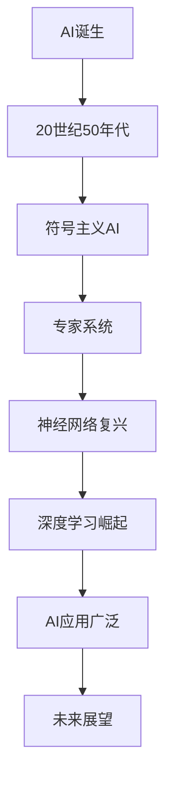

                 

### 文章标题：AI工程学：从理论到实践

> 关键词：人工智能，机器学习，深度学习，数据预处理，模型选择，模型部署，项目管理

> 摘要：本文将深入探讨人工智能（AI）工程学的方方面面，从基本理论到实际应用。我们将介绍AI的概述、历史发展、机器学习与深度学习的基础知识，并逐步讲解数据预处理、模型选择与调优、模型部署与维护、AI项目管理与团队协作，以及AI在各领域中的应用案例。通过这一系列探讨，读者将全面了解AI工程学的理论与实践，为从事相关领域的工作打下坚实基础。

----------------------------------------------------------------

### 《AI工程学：从理论到实践》目录大纲

#### 第一部分：AI基础知识与理论框架

##### 第1章：AI概述与历史发展
###### 1.1 AI的定义与分类
###### 1.2 AI的历史发展
###### 1.3 AI在各领域的应用

##### 第2章：机器学习基础
###### 2.1 监督学习算法
###### 2.2 无监督学习算法
###### 2.3 强化学习算法

##### 第3章：深度学习原理
###### 3.1 深度学习的基本结构
###### 3.2 神经网络与反向传播算法
###### 3.3 卷积神经网络（CNN）
###### 3.4 循环神经网络（RNN）与长短时记忆网络（LSTM）

#### 第二部分：AI工程实践方法

##### 第4章：数据预处理与特征工程
###### 4.1 数据清洗
###### 4.2 数据归一化与标准化
###### 4.3 特征选择与降维
###### 4.4 特征工程技术

##### 第5章：模型选择与调优
###### 5.1 模型评估指标
###### 5.2 模型选择策略
###### 5.3 模型调优技术
###### 5.4 自动化机器学习

##### 第6章：AI模型的部署与维护
###### 6.1 模型部署流程
###### 6.2 实时推理与分布式计算
###### 6.3 模型监控与更新
###### 6.4 模型安全与隐私保护

##### 第7章：AI项目管理与团队协作
###### 7.1 AI项目生命周期
###### 7.2 项目管理工具与技术
###### 7.3 团队协作与沟通技巧
###### 7.4 AI伦理与法律法规

#### 第三部分：AI应用案例研究

##### 第8章：金融领域的AI应用
###### 8.1 金融风控
###### 8.2 金融市场预测
###### 8.3 金融客户服务

##### 第9章：医疗健康领域的AI应用
###### 9.1 疾病诊断
###### 9.2 药物研发
###### 9.3 医疗健康数据分析

##### 第10章：制造业的AI应用
###### 10.1 生产优化
###### 10.2 质量控制
###### 10.3 供应链管理

##### 附录

###### 附录A：AI工具与资源
###### 10.1 开源框架介绍
###### 10.2 数据集与开源项目
###### 10.3 专业网站与论坛

----------------------------------------------------------------

### 引言

人工智能（Artificial Intelligence, AI）作为计算机科学的前沿领域，近年来取得了飞速发展。从最初的符号主义AI、专家系统，到后来的神经网络、深度学习，AI在多个领域取得了显著成果，如自然语言处理、计算机视觉、自动驾驶、金融风控等。随着AI技术的不断进步，越来越多的企业和组织开始关注AI的工程化应用，以实现业务流程的优化、效率提升和成本降低。

然而，AI的应用并不仅仅停留在理论研究层面。在实际工程实践中，AI需要解决诸如数据预处理、模型选择与调优、模型部署与维护等一系列问题。这些问题不仅涉及到技术层面的挑战，还包括项目管理、团队协作、法规伦理等多个方面。因此，如何将AI的理论转化为实际应用，实现从理论到实践的全过程，成为AI工程师面临的重要任务。

本文旨在系统地介绍AI工程学的相关内容，帮助读者从基础理论到实际应用，全面了解AI工程学的各个方面。文章首先概述了AI的定义与历史发展，然后深入探讨了机器学习与深度学习的基础知识。接着，本文详细介绍了数据预处理与特征工程、模型选择与调优、模型部署与维护、AI项目管理与团队协作等实践方法。最后，文章通过金融、医疗健康、制造业等领域的AI应用案例，展示了AI工程学的实际效果与价值。

通过本文的阅读，读者将不仅了解AI工程学的核心概念与原理，还能掌握实际应用中的关键技术与方法，为从事AI相关工作奠定坚实基础。

### 第一部分：AI基础知识与理论框架

#### 第1章：AI概述与历史发展

##### 1.1 AI的定义与分类

人工智能（Artificial Intelligence，简称AI）是指通过计算机程序和算法模拟、延伸和扩展人类智能的科学和工程领域。AI的目标是使计算机能够执行通常需要人类智能才能完成的任务，如视觉识别、语言理解、决策制定、学习和推理等。

根据AI的实现方式和应用范围，可以将AI分为以下几类：

1. **符号主义AI（Symbolic AI）**：通过逻辑推理和符号操作来实现智能。符号主义AI的代表是专家系统（Expert Systems），它使用一组规则库来模拟人类专家的知识和决策过程。

2. **统计学习AI（Statistical Learning AI）**：基于统计学习理论，通过训练大量数据来学习规律和模式。统计学习AI包括监督学习、无监督学习和强化学习等。

3. **连接主义AI（Connectionist AI）**：通过神经网络模型模拟人脑的结构和功能。连接主义AI的核心是深度学习，它通过多层神经网络来实现复杂的非线性变换和学习能力。

4. **混合式AI（Hybrid AI）**：结合多种方法和技术，以实现更强大的智能表现。例如，结合符号主义AI和连接主义AI，通过规则和数据的双重驱动来提高AI系统的智能水平。

##### 1.2 AI的历史发展

人工智能的概念最早可以追溯到20世纪40年代和50年代，以下是AI发展的几个关键阶段：

1. **早期探索（1940s-1950s）**：1943年，沃伦·麦卡洛克和沃尔特·皮茨提出了第一篇关于人工神经网络的理论文章。1956年，达特茅斯会议上，约翰·麦卡锡、马文·明斯基、纳森尼尔·罗切斯特和克劳德·香农等人提出了“人工智能”这一术语，标志着AI研究的正式开始。

2. **符号主义AI时期（1960s-1970s）**：这一时期以专家系统的出现为标志，符号主义AI通过规则和知识表示来模拟人类专家的决策过程。然而，由于知识获取和推理能力的局限性，符号主义AI在20世纪70年代遇到了发展瓶颈。

3. **神经网络复兴（1980s-1990s）**：1986年，霍普菲尔德和杨提出了反向传播算法，使神经网络在训练过程中能够高效地更新权重。神经网络在这一时期得到了广泛关注，并在图像识别、语音识别等领域取得了初步成功。

4. **深度学习崛起（2000s-2010s）**：随着计算机硬件性能的提升和大规模数据集的可用性，深度学习在2010年代取得了突破性进展。卷积神经网络（CNN）在图像识别领域取得了卓越成绩，循环神经网络（RNN）在自然语言处理领域表现出色。深度学习的崛起标志着AI进入了一个全新的时代。

5. **AI应用广泛（2010s-至今）**：AI技术在多个领域得到了广泛应用，如自动驾驶、智能助手、金融风控、医疗诊断等。AI已经成为推动科技创新和社会进步的重要力量。

##### 1.3 AI在各领域的应用

AI在各个领域都有广泛的应用，以下是几个典型领域：

1. **计算机视觉**：通过卷积神经网络和图像处理技术，计算机视觉可以实现物体识别、图像分类、人脸识别等任务。例如，自动驾驶汽车使用计算机视觉技术来识别道路标志和行人类别。

2. **自然语言处理**：自然语言处理技术可以用于机器翻译、文本分类、情感分析等。例如，谷歌翻译和苹果的Siri都基于自然语言处理技术。

3. **机器翻译**：通过深度学习模型，机器翻译可以实现不同语言之间的自动翻译。例如，谷歌翻译和百度翻译都是基于深度学习技术实现的。

4. **自动驾驶**：自动驾驶技术通过传感器数据融合、路径规划和控制算法，实现汽车的自主驾驶。自动驾驶汽车是AI在交通运输领域的典型应用。

5. **金融风控**：AI技术可以用于信用评分、欺诈检测、投资组合优化等。金融机构通过AI技术来提高风险管理能力，降低风险。

6. **医疗诊断**：AI技术在医疗诊断领域有广泛的应用，如疾病预测、图像诊断、药物研发等。通过深度学习和图像处理技术，AI可以帮助医生更准确地诊断疾病。

7. **智能制造**：AI技术可以用于生产优化、质量控制、供应链管理等方面。智能制造通过AI技术提高生产效率，降低成本。

综上所述，AI工程学不仅涵盖了从理论到实践的全过程，还包括了多个领域的实际应用。通过对AI基础知识与理论框架的深入探讨，读者可以为后续章节的学习和实际应用打下坚实基础。

### 第1章的Mermaid流程图

下面是第1章“AI概述与历史发展”的Mermaid流程图：



这张流程图展示了人工智能从诞生至今的发展历程，从早期的符号主义AI、专家系统，到后来的神经网络和深度学习，以及AI在各领域的广泛应用。它不仅有助于读者理解AI的发展脉络，还能激发对AI未来发展的期待。

##### 1.1 AI的定义与分类

人工智能（Artificial Intelligence，简称AI）是指通过计算机程序和算法模拟、延伸和扩展人类智能的科学和工程领域。AI的目标是使计算机能够执行通常需要人类智能才能完成的任务，如视觉识别、语言理解、决策制定、学习和推理等。

根据AI的实现方式和应用范围，可以将AI分为以下几类：

1. **符号主义AI（Symbolic AI）**：通过逻辑推理和符号操作来实现智能。符号主义AI的代表是专家系统（Expert Systems），它使用一组规则库来模拟人类专家的知识和决策过程。符号主义AI依赖于显式规则和符号表示，其核心思想是通过符号操作和逻辑推理来模拟人类智能。

    - **优点**：具有高度的灵活性和解释能力，能够处理复杂的问题。
    - **缺点**：知识获取困难，难以处理不确定性和不完全信息，并且缺乏自学习能力。

2. **统计学习AI（Statistical Learning AI）**：基于统计学习理论，通过训练大量数据来学习规律和模式。统计学习AI包括监督学习、无监督学习和强化学习等。

    - **监督学习（Supervised Learning）**：通过已标记的数据训练模型，用于预测未知数据的标签。常见的监督学习算法包括线性回归、决策树、支持向量机（SVM）和神经网络等。
    
    - **无监督学习（Unsupervised Learning）**：在没有标签数据的情况下，通过数据本身的分布和结构来发现规律和模式。常见的无监督学习算法包括聚类算法（如K均值聚类）、降维算法（如主成分分析PCA）和关联规则学习等。

    - **强化学习（Reinforcement Learning）**：通过与环境的交互来学习最佳策略。强化学习算法通过试错和奖励机制来逐步优化策略，常见的算法包括Q学习、SARSA和深度确定性策略梯度（DDPG）等。

    - **优点**：能够处理大规模数据和复杂问题，具有较强的自学习能力。
    - **缺点**：对数据质量和数量有较高要求，难以解释和验证。

3. **连接主义AI（Connectionist AI）**：通过神经网络模型模拟人脑的结构和功能。连接主义AI的核心是深度学习，它通过多层神经网络来实现复杂的非线性变换和学习能力。

    - **优点**：能够处理高维数据和复杂模式，具有较强的泛化能力。
    - **缺点**：模型参数众多，训练过程容易过拟合，对数据质量和计算资源要求较高。

4. **混合式AI（Hybrid AI）**：结合多种方法和技术，以实现更强大的智能表现。例如，结合符号主义AI和连接主义AI，通过规则和数据的双重驱动来提高AI系统的智能水平。

    - **优点**：综合了不同方法的优势，能够处理更广泛的问题。
    - **缺点**：实现复杂，对开发者的要求较高。

通过上述分类，我们可以看到AI的多样性和复杂性。不同的AI方法适用于不同类型的问题，理解和选择合适的方法是实现AI应用的关键。

### 第2章：机器学习基础

#### 2.1 监督学习算法

监督学习（Supervised Learning）是机器学习中最基本和最广泛使用的一种方法。它的核心思想是利用已标记的数据（即有已知输入和输出）来训练模型，从而使模型能够预测未知数据的输出。

**基本原理**：
监督学习算法通过学习输入（特征）和输出（标签）之间的关系，来构建一个预测函数。这个预测函数可以将新的输入映射到对应的输出。训练过程中，算法通过不断调整模型参数，以最小化预测误差。

**常见算法**：
1. **线性回归（Linear Regression）**：
线性回归是一种最简单的监督学习算法，它通过建立一个线性模型来预测连续输出。其数学模型为：
\[ y = \beta_0 + \beta_1 \cdot x + \epsilon \]
其中，\( y \) 是输出，\( x \) 是输入，\( \beta_0 \) 和 \( \beta_1 \) 是模型参数，\( \epsilon \) 是误差项。线性回归通过最小化误差平方和来求解参数。

2. **逻辑回归（Logistic Regression）**：
逻辑回归用于分类问题，它通过建立一个逻辑模型来预测二分类输出。其数学模型为：
\[ P(y=1) = \frac{1}{1 + e^{-(\beta_0 + \beta_1 \cdot x)}} \]
其中，\( P(y=1) \) 是输出为1的概率，其他参数与线性回归相同。逻辑回归通过最大化似然函数来求解参数。

3. **决策树（Decision Tree）**：
决策树通过一系列条件判断来预测输出。每个节点代表一个特征，每个分支代表特征的不同取值，叶子节点表示预测结果。决策树通过信息增益或基尼不纯度来选择最佳分割特征。

4. **支持向量机（SVM）**：
支持向量机是一种二分类算法，它通过找到一个最佳超平面，使得数据点在超平面上的分类误差最小。其数学模型为：
\[ w \cdot x + b = 0 \]
其中，\( w \) 是超平面参数，\( x \) 是数据点，\( b \) 是偏置。SVM通过求解二次规划问题来找到最佳超平面。

5. **神经网络（Neural Networks）**：
神经网络是一种复杂的模型，由多个神经元组成，通过多层非线性变换来学习输入和输出之间的关系。其数学模型为：
\[ a_{\text{激活函数}}(W \cdot x + b) \]
其中，\( W \) 是权重矩阵，\( b \) 是偏置，激活函数用于引入非线性。

**伪代码**：

```python
# 伪代码：监督学习算法
def supervise_learning(X, Y):
    # 初始化模型参数
    model_params = initialize_params()

    # 模型训练
    for epoch in range(num_epochs):
        for x, y in zip(X, Y):
            # 计算损失函数
            loss = compute_loss(model_params, x, y)

            # 更新模型参数
            model_params = update_params(model_params, x, y, learning_rate)

    # 模型评估
    accuracy = evaluate_model(model_params, X_test, Y_test)
    return accuracy
```

**实例说明**：

假设我们要预测一个房间的温度（输出）基于房间的湿度（输入）。我们可以使用线性回归模型来训练模型。通过收集大量数据并标记输入（湿度）和输出（温度），模型可以学习到湿度和温度之间的关系，从而预测未知湿度条件下的温度。

**应用场景**：

监督学习算法在多个领域都有广泛应用，如：

- **分类问题**：电子邮件垃圾邮件检测、图像分类、情感分析等。
- **回归问题**：房价预测、股票价格预测、医疗诊断等。
- **时间序列预测**：天气预测、股票价格预测、需求预测等。

通过理解监督学习算法的基本原理和常见算法，我们可以根据实际问题的需求选择合适的算法，并设计相应的模型来解决问题。

#### 2.2 无监督学习算法

无监督学习（Unsupervised Learning）是机器学习的另一种基本方法，与监督学习不同，无监督学习算法在没有标记数据（即没有已知输入和输出）的情况下，通过数据自身的结构和分布来发现规律和模式。它的核心目标是从数据中提取有用的信息，如聚类、降维和关联规则等。

**基本原理**：

无监督学习算法通过探索数据点的分布、相关性或结构，来揭示数据中隐藏的规律。这些算法不依赖于已标记的输出，而是基于数据内在的特性和关系来进行学习。

**常见算法**：

1. **K均值聚类（K-Means Clustering）**：
K均值聚类是一种基于距离的聚类算法，它通过将数据点分配到K个聚类中心，以最小化每个聚类内部的数据点到聚类中心的距离之和。其数学模型为：
\[ \text{目标函数} = \sum_{i=1}^{K} \sum_{x \in S_i} \| x - \mu_i \|_2^2 \]
其中，\( \mu_i \) 是聚类中心，\( S_i \) 是第i个聚类的数据点集合。

2. **主成分分析（Principal Component Analysis，PCA）**：
主成分分析是一种降维技术，它通过将数据投影到新的正交坐标系中，以提取数据的最大方差方向。PCA的数学模型为：
\[ Z = P \cdot X \]
其中，\( Z \) 是新的特征空间，\( P \) 是投影矩阵，\( X \) 是原始数据。

3. **高斯混合模型（Gaussian Mixture Model，GMM）**：
高斯混合模型是一种概率模型，它通过将数据点视为多个高斯分布的混合来建模。GMM的数学模型为：
\[ P(x|\theta) = \sum_{i=1}^{K} \pi_i \cdot \mathcal{N}(x|\mu_i, \Sigma_i) \]
其中，\( \pi_i \) 是第i个高斯成分的先验概率，\( \mu_i \) 和 \( \Sigma_i \) 分别是第i个高斯成分的均值和协方差矩阵。

4. **自编码器（Autoencoder）**：
自编码器是一种深度学习模型，它通过编码器和解码器学习数据的压缩和重构。自编码器的数学模型为：
\[ z = \text{编码器}(x) \]
\[ x' = \text{解码器}(z) \]
其中，\( x \) 是输入数据，\( z \) 是编码后的特征，\( x' \) 是重构的数据。

**伪代码**：

```python
# 伪代码：无监督学习算法
def unsupervised_learning(X):
    # 初始化模型参数
    model_params = initialize_params()

    # 模型训练
    for epoch in range(num_epochs):
        # 更新模型参数
        model_params = update_params(model_params, X, learning_rate)

    # 模型评估
    clusters = predict_clusters(model_params, X)
    return clusters
```

**实例说明**：

假设我们有一组顾客的购买行为数据，但没有标记。我们可以使用K均值聚类算法来识别不同类型的顾客群体，从而进行精准营销和个性化推荐。

**应用场景**：

无监督学习算法在多个领域都有广泛应用，如：

- **聚类分析**：市场细分、社交网络分析等。
- **降维**：数据可视化、特征提取等。
- **异常检测**：欺诈检测、网络入侵检测等。
- **生成模型**：图像合成、语音合成等。

通过理解无监督学习算法的基本原理和常见算法，我们可以根据实际问题的需求选择合适的算法，并设计相应的模型来提取数据中的有用信息。

#### 2.3 强化学习算法

强化学习（Reinforcement Learning，简称RL）是机器学习的一个分支，与监督学习和无监督学习不同，强化学习通过智能体（agent）与环境（environment）的交互来学习最优策略。其核心目标是通过试错和反馈来逐步优化决策过程，以实现长期累积奖励最大化。

**基本原理**：

在强化学习中，智能体通过选择动作（action）来与环境互动，并接收环境反馈的奖励（reward）。智能体的目标是学习一个策略（policy），该策略能够使其在长期内获得最大的累积奖励。强化学习的过程可以抽象为以下四个主要元素：

1. **状态（State）**：智能体在环境中所处的情境。
2. **动作（Action）**：智能体可执行的行为。
3. **奖励（Reward）**：动作带来的即时反馈。
4. **策略（Policy）**：智能体在给定状态下选择动作的策略。

强化学习算法通过迭代更新策略，以实现最优决策。常见的强化学习算法包括Q学习、SARSA、深度确定性策略梯度（DDPG）等。

**常见算法**：

1. **Q学习（Q-Learning）**：
Q学习是一种基于值函数的强化学习算法，其目标是通过学习状态-动作值函数（Q函数）来选择最佳动作。Q学习使用以下更新规则：
\[ Q(s, a) \leftarrow Q(s, a) + \alpha [r + \gamma \max_{a'} Q(s', a') - Q(s, a)] \]
其中，\( s \) 和 \( s' \) 分别代表当前状态和下一个状态，\( a \) 和 \( a' \) 分别代表当前动作和最佳动作，\( r \) 是奖励，\( \gamma \) 是折扣因子，\( \alpha \) 是学习率。

2. **策略梯度（Policy Gradient）**：
策略梯度算法通过直接优化策略的梯度来学习最优策略。其核心公式为：
\[ \nabla_{\theta} J(\theta) = \nabla_{\theta} \sum_{t} \rho(\theta; s_t, a_t) \cdot r_t \]
其中，\( \theta \) 是策略参数，\( J(\theta) \) 是策略的损失函数，\( \rho(\theta; s_t, a_t) \) 是策略的概率分布，\( r_t \) 是奖励。

3. **深度确定性策略梯度（Deep Deterministic Policy Gradient，DDPG）**：
DDPG是一种基于深度神经网络和策略梯度的强化学习算法，它通过使用目标网络来稳定训练过程。DDPG的主要步骤包括：
   - **目标网络**：用于评估当前策略的动作值。
   - **演员-评论家**：演员网络（actor）生成动作，评论家网络（critic）评估动作值。
   - **策略更新**：通过梯度下降更新演员网络。

**伪代码**：

```python
# 伪代码：强化学习算法
class ReinforcementLearning:
    def __init__(self, learning_rate, discount_factor):
        self.learning_rate = learning_rate
        self.discount_factor = discount_factor
    
    def learn(self, state, action, reward, next_state, done):
        # 计算Q值更新
        Q_value = reward + self.discount_factor * max(self.Q_values[next_state.keys()])
        error = Q_value - self.Q_values[state]

        # 更新Q值
        self.Q_values[state] += self.learning_rate * error
        
        if done:
            return
        
        self.learn(next_state, action, reward, next_state, done)
```

**实例说明**：

假设我们想要训练一个智能体在围棋游戏中取得胜利。智能体通过观察棋盘状态、选择落子位置并接收对手的反馈（奖励），不断调整策略，以实现最终胜利。

**应用场景**：

强化学习算法在多个领域有广泛应用，如：

- **游戏**：电子游戏、围棋、象棋等。
- **自动驾驶**：自动驾驶汽车路径规划、决策制定等。
- **推荐系统**：个性化推荐、广告投放等。
- **机器人控制**：机器人路径规划、任务执行等。

通过理解强化学习算法的基本原理和常见算法，我们可以根据实际问题的需求设计相应的智能系统，并实现长期最优决策。

### 第3章：深度学习原理

#### 3.1 深度学习的基本结构

深度学习（Deep Learning）是机器学习的一个重要分支，通过多层神经网络模型来学习数据的复杂结构和特征。深度学习的基本结构包括输入层、隐藏层和输出层，各层之间通过前向传播和反向传播算法进行信息传递和处理。

**输入层（Input Layer）**：
输入层接收外部输入数据，如文本、图像、音频等。在输入层中，数据通常会被进行预处理，如归一化、缩放等，以便后续处理。

**隐藏层（Hidden Layers）**：
隐藏层是深度学习模型的核心部分，包含多个层次。每一层隐藏层通过非线性变换对输入数据进行特征提取和转换。隐藏层中的每个神经元都会与前一层的所有神经元相连接，并通过激活函数进行非线性处理。这些非线性变换使得深度学习模型能够学习到数据的复杂模式和特征。

**输出层（Output Layer）**：
输出层产生模型的最终输出结果，如分类标签、数值预测等。输出层的结构取决于具体任务类型，如二分类、多分类或回归任务。

**前向传播（Forward Propagation）**：
前向传播是深度学习模型处理输入数据的过程。在输入层接收输入数据后，数据依次通过隐藏层，每层神经元的输入是前一层的输出，通过加权求和并应用激活函数得到当前层的输出。这个过程一直持续到输出层，最终得到模型的预测结果。

**反向传播（Backpropagation）**：
反向传播是深度学习模型训练的核心算法。在训练过程中，模型通过比较预测结果与实际结果，计算损失函数，然后通过反向传播算法更新模型参数。反向传播算法通过以下步骤进行：

1. **计算梯度**：从输出层开始，计算每个神经元的误差梯度，即损失函数对每个参数的导数。
2. **反向传播**：将误差梯度反向传播到隐藏层，更新每一层的参数。
3. **参数更新**：使用梯度下降或其他优化算法，根据误差梯度更新模型参数，以最小化损失函数。

通过反复迭代前向传播和反向传播，深度学习模型能够不断优化参数，提高预测准确率。

#### 3.2 神经网络与反向传播算法

神经网络（Neural Networks）是深度学习的基础构件，它通过模拟人脑神经元的工作原理，实现数据的特征提取和模式识别。一个基本的神经网络由输入层、隐藏层和输出层组成，各层之间通过加权连接实现信息的传递和处理。

**基本结构**：

1. **神经元（Neuron）**：
   神经元是神经网络的基本单元，它通过输入信号和权重进行加权求和，并通过激活函数输出结果。一个神经元可以表示为：
   \[ z = \sum_{i=1}^{n} w_i \cdot x_i + b \]
   其中，\( w_i \) 是权重，\( x_i \) 是输入，\( b \) 是偏置。

2. **激活函数（Activation Function）**：
   激活函数用于引入非线性，常见的激活函数包括：
   - **Sigmoid函数**：
     \[ f(x) = \frac{1}{1 + e^{-x}} \]
   - **ReLU函数**：
     \[ f(x) = \max(0, x) \]
   - **Tanh函数**：
     \[ f(x) = \frac{e^x - e^{-x}}{e^x + e^{-x}} \]

3. **层（Layer）**：
   神经网络包括输入层、隐藏层和输出层。输入层接收外部输入，隐藏层进行特征提取和转换，输出层产生预测结果。

**反向传播算法**：

反向传播算法是深度学习训练的核心，它通过前向传播计算预测值，然后通过反向传播更新模型参数，以最小化损失函数。反向传播算法的步骤如下：

1. **前向传播**：
   - 计算输入层到隐藏层的输出：
     \[ h_{\text{layer}} = \sigma(\mathbf{W} \cdot \mathbf{a}_{\text{layer-1}} + \mathbf{b}_{\text{layer}}) \]
     其中，\( \sigma \) 是激活函数，\( \mathbf{W} \) 是权重矩阵，\( \mathbf{a}_{\text{layer-1}} \) 是上一层的输入，\( \mathbf{b}_{\text{layer}} \) 是偏置向量。
   - 计算输出层的预测值：
     \[ \mathbf{y} = \sigma(\mathbf{W} \cdot \mathbf{h}_{\text{hidden}} + \mathbf{b}_{\text{output}}) \]

2. **计算损失**：
   - 计算预测值与实际值之间的损失：
     \[ \mathcal{L} = \frac{1}{2} \sum_{i=1}^{N} (\mathbf{y}_i - \mathbf{t}_i)^2 \]
     其中，\( \mathbf{y}_i \) 是预测值，\( \mathbf{t}_i \) 是实际值。

3. **反向传播**：
   - 计算输出层的误差梯度：
     \[ \frac{\partial \mathcal{L}}{\partial \mathbf{W}_{\text{output}}} = \frac{\partial \mathcal{L}}{\partial \mathbf{y}} \cdot \frac{\partial \mathbf{y}}{\partial \mathbf{W}_{\text{output}}} \]
   - 计算隐藏层的误差梯度：
     \[ \frac{\partial \mathcal{L}}{\partial \mathbf{W}_{\text{hidden}}} = \frac{\partial \mathcal{L}}{\partial \mathbf{h}_{\text{hidden}}} \cdot \frac{\partial \mathbf{h}_{\text{hidden}}}{\partial \mathbf{W}_{\text{hidden}}} \]
   - 更新权重和偏置：
     \[ \mathbf{W}_{\text{output}} \leftarrow \mathbf{W}_{\text{output}} - \alpha \frac{\partial \mathcal{L}}{\partial \mathbf{W}_{\text{output}}} \]
     \[ \mathbf{b}_{\text{output}} \leftarrow \mathbf{b}_{\text{output}} - \alpha \frac{\partial \mathcal{L}}{\partial \mathbf{b}_{\text{output}}} \]

4. **参数优化**：
   - 使用梯度下降或其他优化算法更新模型参数，以最小化损失函数。

通过反复迭代前向传播和反向传播，深度学习模型能够逐步优化参数，提高预测准确率。反向传播算法的引入使得深度学习模型的训练过程变得高效和可行。

#### 3.3 卷积神经网络（CNN）

卷积神经网络（Convolutional Neural Network，简称CNN）是深度学习中的一个重要模型，专门用于处理具有网格结构的数据，如图像和视频。CNN通过卷积层、池化层和全连接层等结构，实现图像特征的自动提取和分类。

**基本结构**：

1. **卷积层（Convolutional Layer）**：
   卷积层是CNN的核心组成部分，它通过卷积操作提取图像特征。卷积层包含多个滤波器（kernel），每个滤波器可以捕捉图像中的不同特征。卷积操作通过将滤波器在输入图像上滑动，计算滤波器与图像局部区域的点积，从而提取特征。卷积层的输出是一个特征图（feature map）。

   - **卷积操作**：
     \[ \mathbf{f}_{ij}^l = \sum_{m=1}^{k} \sum_{n=1}^{k} w_{mn}^l \cdot \mathbf{i}_{i+m, j+n} + b^l \]
     其中，\( \mathbf{i}_{ij} \) 是输入图像，\( w_{mn}^l \) 是滤波器权重，\( b^l \) 是偏置。

2. **激活函数（Activation Function）**：
   激活函数用于引入非线性，常见的激活函数有ReLU（Rectified Linear Unit）和Sigmoid。

3. **池化层（Pooling Layer）**：
   池化层用于下采样特征图，减少参数数量和计算量。常见的池化操作有最大池化（Max Pooling）和平均池化（Average Pooling）。

   - **最大池化**：
     \[ \mathbf{p}_{ij}^l = \max \{ \mathbf{f}_{ij}^{l-1} \} \]
   - **平均池化**：
     \[ \mathbf{p}_{ij}^l = \frac{1}{k^2} \sum_{m=1}^{k} \sum_{n=1}^{k} \mathbf{f}_{ij}^{l-1} \]

4. **全连接层（Fully Connected Layer）**：
   全连接层将卷积层和池化层提取的特征进行整合，并通过softmax函数输出分类结果。

   - **全连接层计算**：
     \[ \mathbf{y}^l = \text{softmax}(\mathbf{W}^l \cdot \mathbf{h}^{l-1} + b^l) \]

**工作原理**：

1. **前向传播**：
   - 卷积层：通过卷积操作和激活函数提取图像特征。
   - 池化层：对特征图进行下采样，减少参数数量。
   - 全连接层：整合特征并输出分类结果。

2. **反向传播**：
   - 通过反向传播算法更新卷积层、池化层和全连接层的参数。

通过多层卷积和池化操作，CNN能够自动学习到图像的层次结构，从简单的边缘和纹理特征到复杂的物体部分和整体特征。这使得CNN在图像分类、物体检测和语义分割等任务中表现出色。

#### 3.4 循环神经网络（RNN）与长短时记忆网络（LSTM）

循环神经网络（Recurrent Neural Network，简称RNN）是处理序列数据的常见模型，它通过在时间步上递归地更新隐藏状态，保留历史信息。然而，传统的RNN在处理长序列时存在梯度消失和梯度爆炸问题，导致学习效果不佳。为了解决这些问题，长短时记忆网络（Long Short-Term Memory，简称LSTM）被提出。

**基本结构**：

1. **传统RNN**：
   - **状态更新**：
     \[ h_t = \sigma(W_h \cdot [h_{t-1}, x_t] + b_h) \]
     \[ y_t = \text{softmax}(W_y \cdot h_t + b_y) \]
     其中，\( h_t \) 是隐藏状态，\( x_t \) 是当前输入，\( W_h \) 和 \( W_y \) 是权重矩阵，\( b_h \) 和 \( b_y \) 是偏置向量，\( \sigma \) 是激活函数。

2. **长短时记忆网络（LSTM）**：
   LSTM通过引入门控机制（gate）来解决传统RNN的问题，其核心结构包括三个门：输入门、遗忘门和输出门。

   - **输入门**：
     \[ i_t = \sigma(W_i \cdot [h_{t-1}, x_t] + b_i) \]
     \[ \tilde{g_t} = \tanh(W_g \cdot [h_{t-1}, x_t] + b_g) \]
     \[ g_t = i_t \cdot \tilde{g_t} \]
     其中，\( i_t \) 是输入门，\( \tilde{g_t} \) 是候选状态，\( g_t \) 是新的状态。

   - **遗忘门**：
     \[ f_t = \sigma(W_f \cdot [h_{t-1}, x_t] + b_f) \]
     \[ \tilde{h_t} = f_t \cdot \tilde{g_t} \]
     \[ h_t = f_t \cdot g_t + (1 - f_t) \cdot h_{t-1} \]
     其中，\( f_t \) 是遗忘门，\( \tilde{h_t} \) 是候选隐藏状态，\( h_t \) 是新的隐藏状态。

   - **输出门**：
     \[ o_t = \sigma(W_o \cdot [h_{t-1}, x_t] + b_o) \]
     \[ y_t = o_t \cdot \text{softmax}(W_y \cdot h_t + b_y) \]
     其中，\( o_t \) 是输出门，\( y_t \) 是当前输出。

**工作原理**：

1. **前向传播**：
   - LSTM在每个时间步更新隐藏状态，通过输入门、遗忘门和输出门控制信息流动。
   - LSTM能够长期保持历史信息，避免梯度消失和梯度爆炸问题。

2. **反向传播**：
   - 通过反向传播算法更新LSTM的权重和偏置。

LSTM在处理长序列数据时表现出色，广泛应用于自然语言处理、时间序列预测和语音识别等领域。通过理解RNN和LSTM的基本结构和工作原理，我们可以更好地利用这些模型解决实际问题。

### 第二部分：AI工程实践方法

#### 第4章：数据预处理与特征工程

数据预处理与特征工程是AI工程中至关重要的一步，它直接影响到模型性能和训练效率。数据预处理旨在将原始数据进行清洗、归一化、标准化等处理，使其适合机器学习模型的训练。特征工程则是在预处理基础上，通过选择和构造特征，提升模型的表现力。

#### 4.1 数据清洗

数据清洗是数据预处理的第一步，其目标是去除数据中的噪声和异常值，提高数据质量。以下是常见的数据清洗方法：

1. **去除缺失值**：
   - **去除**：直接删除含有缺失值的样本。
   - **填充**：使用统计方法（如均值、中位数）或模型预测值来填充缺失值。

2. **去除重复值**：
   通过比较数据行，识别和删除重复的样本，以减少冗余信息。

3. **处理异常值**：
   - **范围限制**：限制某些特征的取值范围。
   - **插值**：使用插值法填充异常值。
   - **删除**：删除离群点或异常值。

#### 4.2 数据归一化与标准化

数据归一化和标准化是数据预处理的关键步骤，其目的是将不同特征的数据转换到同一尺度，以便模型能够有效地学习特征之间的关系。

1. **数据归一化（Normalization）**：
   数据归一化通过将数据缩放到[0, 1]范围内，实现特征之间的尺度均衡。常用的归一化方法有：
   \[ x_{\text{normalized}} = \frac{x - \text{min}(x)}{\text{max}(x) - \text{min}(x)} \]

2. **数据标准化（Standardization）**：
   数据标准化通过减去均值并除以标准差，将数据转换为标准正态分布。标准化方法有：
   \[ x_{\text{standardized}} = \frac{x - \mu}{\sigma} \]
   其中，\( \mu \) 是均值，\( \sigma \) 是标准差。

#### 4.3 特征选择与降维

特征选择与降维是为了减少数据维度，提高模型训练效率和预测准确性。以下是一些常见的特征选择与降维方法：

1. **特征选择（Feature Selection）**：
   - **过滤法**：基于统计方法筛选特征，如相关性、卡方检验等。
   - **包装法**：基于模型评估指标，逐层选择特征，如递归特征消除（RFE）。
   - **嵌入式方法**：在模型训练过程中自动筛选特征，如Lasso回归。

2. **降维（Dimensionality Reduction）**：
   - **主成分分析（PCA）**：通过保留最大方差的方向来降维。
   - **线性判别分析（LDA）**：用于分类任务，通过最大化类间方差和最小化类内方差来降维。
   - **自编码器（Autoencoder）**：基于神经网络，通过编码器和解码器实现特征降维。

#### 4.4 特征工程技术

特征工程不仅仅是选择和降维，还包括构造新的特征来增强模型的预测能力。以下是一些常见的特征工程技术：

1. **交互特征（Interaction Features）**：
   通过组合不同特征，创建新的交互特征，以捕捉复杂的依赖关系。

2. **多项式特征（Polynomial Features）**：
   将原始特征进行多项式扩展，创建新的特征维度。

3. **特征缩放（Feature Scaling）**：
   调整特征之间的比例，使其对模型的影响更加均衡。

4. **特征嵌入（Feature Embeddings）**：
   使用词向量等嵌入技术将文本特征转换为数值向量，以便进行机器学习。

通过数据预处理和特征工程，我们可以提高数据质量，减少计算复杂度，并提升模型性能。这些方法在AI工程实践中发挥着重要作用，为后续的模型训练和部署奠定了坚实基础。

### 第5章：模型选择与调优

#### 5.1 模型评估指标

在机器学习项目中，选择合适的模型评估指标对于评估模型性能和选择最佳模型至关重要。不同的评估指标适用于不同类型的问题和数据集，以下是一些常见的模型评估指标：

1. **准确率（Accuracy）**：
准确率是模型预测正确的样本数占总样本数的比例。对于二分类问题，准确率的计算公式为：
\[ \text{Accuracy} = \frac{\text{预测正确数}}{\text{总样本数}} \]

优点：简单直观，易于理解。
缺点：对于类别不平衡的数据集，准确率可能无法准确反映模型性能。

2. **召回率（Recall）**：
召回率是指模型能够正确识别为正类的样本数占实际正类样本数的比例。召回率的计算公式为：
\[ \text{Recall} = \frac{\text{真正例数}}{\text{实际正类总数}} \]

优点：强调对正类样本的识别能力。
缺点：易受假阳性影响，对于假阳性敏感。

3. **精确率（Precision）**：
精确率是指模型预测为正类的样本中，实际为正类的比例。精确率的计算公式为：
\[ \text{Precision} = \frac{\text{真正例数}}{\text{预测正类总数}} \]

优点：强调预测结果的可靠性。
缺点：对于假阳性敏感。

4. **F1值（F1 Score）**：
F1值是精确率和召回率的调和平均值，用于综合评估模型的性能。F1值的计算公式为：
\[ \text{F1 Score} = 2 \times \frac{\text{Precision} \times \text{Recall}}{\text{Precision} + \text{Recall}} \]

优点：能够平衡精确率和召回率，适用于类别不平衡的数据集。
缺点：对于极端不平衡的数据集，F1值可能仍无法准确反映模型性能。

5. **ROC曲线与AUC值（ROC Curve and AUC）**：
ROC曲线（Receiver Operating Characteristic Curve）展示了不同阈值下模型敏感度和特异度的变化情况。AUC值（Area Under Curve）是ROC曲线下的面积，用于评估模型的分类能力。AUC值越接近1，模型的分类性能越好。

6. **均方误差（Mean Squared Error，MSE）**：
均方误差用于回归问题，表示预测值与实际值之间的平均平方误差。MSE的计算公式为：
\[ \text{MSE} = \frac{1}{n} \sum_{i=1}^{n} (y_i - \hat{y}_i)^2 \]

优点：对于异常值敏感，能够反映预测的稳定性。
缺点：对于小误差和大数据误差同样敏感。

7. **平均绝对误差（Mean Absolute Error，MAE）**：
平均绝对误差用于回归问题，表示预测值与实际值之间的平均绝对误差。MAE的计算公式为：
\[ \text{MAE} = \frac{1}{n} \sum_{i=1}^{n} |y_i - \hat{y}_i| \]

优点：对于异常值相对不敏感，计算简单。
缺点：不能反映误差的分布情况。

选择合适的模型评估指标需要考虑数据类型、任务类型和业务需求。通过合理选择评估指标，我们可以准确评估模型性能，为后续的模型选择和调优提供有力支持。

#### 5.2 模型选择策略

在机器学习项目中，选择合适的模型对于提高预测准确性和项目成功率至关重要。以下是一些常见的模型选择策略：

1. **基于特征选择的模型选择**：
   - **策略**：通过特征选择方法（如过滤法、包装法、嵌入式方法）筛选出最有用的特征，然后在这些特征上训练不同的模型，选择性能最佳的模型。
   - **优点**：能够简化模型，提高训练效率。
   - **缺点**：可能因特征选择的不确定性导致结果不稳定。

2. **基于模型选择的模型选择**：
   - **策略**：在相同的特征集上训练多种不同的模型，通过比较模型的性能（如准确率、召回率、F1值等）选择最佳模型。
   - **优点**：直接评估模型性能，结果稳定。
   - **缺点**：需要大量的计算资源和时间。

3. **交叉验证**：
   - **策略**：通过将数据集划分为训练集和验证集，在不同验证集上多次训练和评估模型，最终取平均性能作为模型的最终评估结果。
   - **优点**：能够更准确地评估模型性能，减少过拟合。
   - **缺点**：需要更多的计算资源和时间。

4. **网格搜索（Grid Search）**：
   - **策略**：通过枚举所有可能的模型参数组合，对每个组合进行模型训练和评估，选择性能最佳的参数组合。
   - **优点**：能够系统地搜索最优参数。
   - **缺点**：计算复杂度较高，不适合参数空间较大或数据集较大的情况。

5. **随机搜索（Random Search）**：
   - **策略**：从参数空间中随机选择一组参数，进行模型训练和评估，重复多次，选择性能最佳的参数组合。
   - **优点**：比网格搜索计算复杂度低，适合参数空间较大或数据集较大的情况。
   - **缺点**：可能错过最优参数组合。

6. **贝叶斯优化**：
   - **策略**：利用贝叶斯统计模型来优化模型参数，通过在参数空间中进行有指导的搜索，逐步提高模型性能。
   - **优点**：能够在较短时间内找到近似最优参数。
   - **缺点**：需要对模型和参数进行特定建模，适用范围有限。

选择合适的模型选择策略需要考虑项目的具体需求和计算资源。通过结合多种策略，我们可以提高模型选择的有效性和准确性。

#### 5.3 模型调优技术

模型调优（Model Tuning）是机器学习项目中的重要环节，其目的是通过调整模型参数和超参数，提高模型的性能和泛化能力。以下是一些常见的模型调优技术：

1. **网格搜索（Grid Search）**：
网格搜索是一种系统化的模型调优方法，通过枚举所有可能的参数组合，评估每个组合的性能，选择最佳参数。其基本步骤如下：

   - **确定参数空间**：根据模型特点和需求，确定需要调整的参数及其取值范围。
   - **划分数据集**：将数据集划分为训练集和验证集，用于训练和评估模型。
   - **遍历参数组合**：对参数空间中的每个组合进行训练和评估，记录性能指标。
   - **选择最佳参数**：根据性能指标选择最佳参数组合。

   网格搜索的优点是能够全面搜索参数空间，找到最优参数。缺点是计算复杂度较高，特别是在参数空间较大时。

2. **随机搜索（Random Search）**：
随机搜索是一种基于概率的模型调优方法，通过随机选择参数组合进行训练和评估，逐渐提高模型性能。与网格搜索相比，随机搜索的计算复杂度较低，适合参数空间较大的情况。其基本步骤如下：

   - **初始化参数**：根据模型特点和需求，初始化一组初始参数。
   - **随机选择参数**：从参数空间中随机选择一组参数，进行模型训练和评估。
   - **更新参数**：根据评估结果，更新参数。
   - **重复迭代**：重复随机选择参数、训练和评估的过程，直到达到预设的迭代次数或性能目标。

   随机搜索的优点是计算复杂度较低，适合大规模参数空间。缺点是可能错过最优参数组合。

3. **贝叶斯优化（Bayesian Optimization）**：
贝叶斯优化是一种基于贝叶斯统计的模型调优方法，通过构建贝叶斯先验模型来估计参数的概率分布，并在参数空间中进行有指导的搜索。贝叶斯优化的优点是能够快速找到近似最优参数，计算复杂度较低。其基本步骤如下：

   - **初始化模型**：根据模型特点和需求，初始化贝叶斯先验模型。
   - **选择候选参数**：根据贝叶斯先验模型，选择一组候选参数。
   - **评估候选参数**：将候选参数应用于模型，评估性能。
   - **更新模型**：根据评估结果，更新贝叶斯先验模型。
   - **重复迭代**：重复选择候选参数、评估和更新模型的过程，直到达到预设的迭代次数或性能目标。

   贝叶斯优化的优点是能够快速找到近似最优参数，计算复杂度较低。缺点是需要对模型和参数进行特定建模。

通过合理选择和运用模型调优技术，我们可以显著提高模型的性能和泛化能力，为实际应用奠定坚实基础。

#### 5.4 自动化机器学习

自动化机器学习（Automated Machine Learning，简称AutoML）是近年来兴起的一个研究领域，其目标是实现机器学习模型的全自动设计、训练和部署。通过自动化机器学习，我们可以大幅度减少模型开发的时间和复杂度，提高模型性能和开发效率。以下是一些自动化机器学习的核心技术：

1. **特征自动化选择与构造**：
   自动化机器学习可以通过特征选择算法和特征构造方法，自动识别和生成最有用的特征。这些方法包括过滤法、包裹法、嵌入式方法等。通过自动化特征选择与构造，模型能够更有效地学习数据中的复杂模式。

2. **模型自动化选择与调优**：
   自动化机器学习可以通过比较不同模型的性能，自动选择最优模型。常见的模型选择方法有网格搜索、随机搜索、贝叶斯优化等。自动化机器学习还可以通过这些方法自动调整模型参数，实现模型调优。

3. **超参数自动化调优**：
   超参数是模型训练过程中需要手动调整的参数，如学习率、批量大小等。自动化机器学习可以通过优化算法（如随机搜索、贝叶斯优化）自动调整超参数，提高模型性能。

4. **自动化模型集成**：
   模型集成（Model Ensembling）是将多个模型集成起来，提高整体预测性能的方法。自动化机器学习可以通过自动化模型集成方法（如堆叠、随机森林、梯度提升树等），实现模型集成。

5. **自动化模型评估与选择**：
   自动化机器学习可以通过交叉验证、网格搜索等评估方法，自动评估不同模型的性能，并选择最佳模型。

6. **自动化模型部署与监控**：
   自动化机器学习可以自动化模型的部署、监控和更新过程。通过自动化部署，我们可以快速将模型应用到生产环境中，实现实时预测和决策。自动化监控可以实时检测模型性能变化，并自动更新模型，确保模型始终处于最佳状态。

自动化机器学习在提高模型开发效率和性能方面具有显著优势，它不仅适用于数据科学家和研究人员，也适用于普通开发者和企业用户。通过自动化机器学习，我们可以更加便捷地实现机器学习应用，推动人工智能技术的发展。

### 第6章：AI模型的部署与维护

#### 6.1 模型部署流程

将训练好的AI模型部署到生产环境是一项复杂的任务，它需要考虑模型的性能、可靠性、可扩展性和安全性等多个方面。以下是一个典型的模型部署流程：

1. **模型封装**：
   在模型部署之前，首先需要将模型封装成可执行的形式。常见的封装方法包括：
   - **静态封装**：将模型代码、权重和依赖库打包成独立的文件或库。
   - **动态封装**：将模型代码和权重存储在数据库或文件系统中，通过脚本或API进行调用。

2. **模型测试**：
   在模型部署前，需要对模型进行充分的测试，确保其在生产环境中的稳定性和性能。测试内容包括：
   - **功能测试**：验证模型是否能够正确处理输入数据并输出预期的结果。
   - **性能测试**：评估模型在不同负载和延迟条件下的响应速度和资源消耗。
   - **异常处理测试**：检测模型对异常输入数据的处理能力。

3. **环境准备**：
   准备模型部署所需的运行环境，包括操作系统、编程语言、数据库、中间件等。确保环境与模型训练环境一致，以避免兼容性问题。

4. **部署到生产环境**：
   将封装好的模型部署到生产环境中，常用的部署方式包括：
   - **容器化部署**：使用Docker等容器技术，将模型及其依赖库打包成容器镜像，部署到容器化平台（如Kubernetes）。
   - **虚拟化部署**：将模型部署到虚拟机或云服务器中，通过虚拟化技术实现隔离和管理。
   - **云服务部署**：使用云服务提供商（如AWS、Azure、Google Cloud）提供的AI服务，部署和管理模型。

5. **模型监控**：
   模型部署后，需要对其进行实时监控，确保其正常运行和性能。监控内容包括：
   - **性能监控**：监控模型响应时间、资源消耗、错误率等指标。
   - **健康监控**：检测模型运行状态，确保其稳定性和可靠性。
   - **日志监控**：记录模型运行日志，便于问题追踪和故障排除。

6. **自动更新**：
   随着数据和环境的变化，模型可能需要定期更新。自动更新策略包括：
   - **定期更新**：定期收集新数据，训练和更新模型。
   - **在线更新**：在模型运行过程中，实时更新模型参数，实现在线优化。

通过合理的模型部署流程，我们可以确保AI模型在生产环境中的稳定运行和高效性能，为业务应用提供可靠的预测和决策支持。

#### 6.2 实时推理与分布式计算

实时推理（Real-time Inference）和分布式计算（Distributed Computing）是AI模型部署中至关重要的两个环节，它们直接影响到模型的应用效果和系统性能。

**实时推理**：

实时推理是指模型能够在毫秒级时间内处理输入数据并返回预测结果，这对许多应用场景（如自动驾驶、实时监控、智能客服等）至关重要。实现实时推理的关键技术包括：

1. **模型优化**：
   - **模型剪枝（Model Pruning）**：通过删除冗余权重和神经元，减少模型大小和计算量。
   - **量化（Quantization）**：将模型权重和激活值转换为较低的精度（如8位整数），降低计算复杂度。
   - **模型蒸馏（Model Distillation）**：通过将复杂模型的知识传递给简化模型，提高简化模型的性能。

2. **硬件加速**：
   - **GPU加速**：利用GPU强大的并行计算能力，加速模型推理。
   - **TPU加速**：利用Tensor Processing Unit（TPU）等专用硬件加速模型推理。
   - **FPGA加速**：利用Field Programmable Gate Array（FPGA）等可编程硬件，实现模型的高效推理。

3. **推理引擎**：
   - **开源推理引擎**：如TensorFlow Lite、PyTorch Mobile等，提供高效的推理框架和工具。
   - **商业推理引擎**：如Google Cloud ML Engine、AWS SageMaker等，提供高性能、易用的推理服务。

**分布式计算**：

分布式计算是指将计算任务分解成多个子任务，分布在多个计算节点上同时执行，以实现高效的处理和扩展能力。在AI模型部署中，分布式计算有助于处理大规模数据和高并发请求，提高系统的性能和可靠性。以下是一些分布式计算的关键技术：

1. **任务分解**：
   - **数据并行**：将数据集划分为多个子集，每个子集由不同的节点处理，适用于数据密集型任务。
   - **模型并行**：将模型划分为多个部分，每个部分由不同的节点处理，适用于计算密集型任务。

2. **负载均衡**：
   - **静态负载均衡**：通过静态分配任务到节点，实现负载均衡。
   - **动态负载均衡**：根据节点的负载情况动态分配任务，实现高效资源利用。

3. **分布式存储**：
   - **分布式文件系统**：如HDFS、Ceph等，提供高吞吐量和容错能力的存储服务。
   - **分布式数据库**：如Apache HBase、Cassandra等，支持大规模数据存储和高效查询。

4. **通信机制**：
   - **进程间通信（IPC）**：如gRPC、Thrift等，实现节点间的数据交换和协同工作。
   - **消息队列**：如Kafka、RabbitMQ等，提供异步通信和数据流处理能力。

通过实时推理和分布式计算，我们可以实现高效、可靠的AI模型部署，满足不同场景下的性能和可靠性要求。

#### 6.3 模型监控与更新

在AI模型的部署过程中，模型监控与更新是确保模型性能和稳定性的关键环节。以下是一些重要的技术和方法：

**1. 模型监控**：

模型监控的目的是实时跟踪模型的性能和健康状态，以便及时发现并解决潜在问题。常见的监控指标包括：

- **准确性（Accuracy）**：模型预测正确的比例。
- **召回率（Recall）**：模型正确识别正类样本的比例。
- **精确率（Precision）**：模型预测为正类的样本中，实际为正类的比例。
- **F1值（F1 Score）**：精确率和召回率的调和平均值。
- **响应时间（Response Time）**：模型处理输入数据并返回结果的时间。

为了实现有效的模型监控，可以采取以下步骤：

- **日志记录**：记录模型运行时的日志信息，包括输入数据、预测结果、错误信息等。
- **性能测试**：定期进行性能测试，评估模型在不同负载条件下的性能。
- **实时告警**：设置阈值和告警机制，当模型性能或健康状态低于预期时，及时发出告警。
- **可视化仪表板**：通过可视化工具展示模型的性能和健康状况，帮助管理员和开发者快速定位问题。

**2. 模型更新策略**：

随着时间推移和数据环境的变化，AI模型的性能可能会下降。因此，定期更新模型是保持其有效性的关键。以下是一些常见的模型更新策略：

- **定期更新**：定期收集新的训练数据，重新训练模型。这种方法简单直观，但需要大量的计算资源。
- **在线更新**：在模型运行过程中，实时更新模型参数，实现在线优化。这种方法可以避免重新训练带来的延迟，但需要解决在线学习中的稳定性问题。
- **增量更新**：通过更新模型中的一部分参数，实现模型的增量更新。这种方法可以在保留已有知识的基础上，逐步优化模型。
- **迁移学习**：利用已有模型的知识，快速适应新的数据环境。通过迁移学习，可以减少训练时间和计算资源。

选择合适的模型更新策略需要考虑模型的类型、数据环境和应用需求。通过合理的模型监控和更新策略，我们可以确保AI模型始终处于最佳状态，为业务应用提供持续的价值。

### 第7章：AI项目管理与团队协作

#### 7.1 AI项目生命周期

一个成功的AI项目需要经历多个阶段，从需求分析、设计、开发、测试到部署和维护，每个阶段都有其特定的任务和目标。以下是一个典型的AI项目生命周期：

1. **需求分析（Requirement Analysis）**：
   在项目的初始阶段，项目团队需要与利益相关者（如客户、业务团队等）进行沟通，了解项目的需求、目标和预期成果。需求分析的主要任务包括：
   - 收集需求：通过与用户、业务分析师等交流，了解项目需求。
   - 分析需求：整理和分类需求，确保需求的可行性、完整性和一致性。
   - 需求文档：编写需求文档，明确项目的目标和功能需求。

2. **设计与开发（Design and Development）**：
   在需求分析的基础上，项目团队进入设计与开发阶段。这个阶段的主要任务包括：
   - 技术设计：根据需求文档，设计系统的架构、算法和数据结构。
   - 编码与实现：按照技术设计文档，编写和实现系统的代码。
   - 功能测试：对开发的功能模块进行测试，确保其符合需求规格。

3. **测试与部署（Testing and Deployment）**：
   在开发完成后，项目进入测试与部署阶段。这个阶段的主要任务包括：
   - 单元测试：对单个模块或函数进行测试，确保其正确性和可靠性。
   - 集成测试：将不同的功能模块集成在一起进行测试，确保系统整体的正确性。
   - 部署上线：将测试通过的系统部署到生产环境，进行实际应用。

4. **维护与优化（Maintenance and Optimization）**：
   系统部署后，项目进入维护与优化阶段。这个阶段的主要任务包括：
   - 故障修复：及时修复系统中的错误和故障，确保系统的稳定运行。
   - 性能优化：通过调整系统配置和算法，提高系统的性能和效率。
   - 功能扩展：根据业务需求，增加新的功能模块或改进现有功能。

#### 7.2 项目管理工具与技术

为了确保AI项目能够高效、有序地进行，项目团队需要使用一系列项目管理工具和技术。以下是一些常见的管理工具和技术：

1. **Jira**：
   Jira是一个流行的项目管理工具，适用于跟踪项目任务、进度和团队协作。Jira的主要功能包括：
   - 任务管理：创建、分配和跟踪任务，确保每个任务都按时完成。
   - 进度跟踪：通过看板和报告，实时跟踪项目进度，确保项目按时交付。
   - 团队协作：支持团队成员之间的沟通和协作，提高工作效率。

2. **Git**：
   Git是一个分布式版本控制系统，用于管理代码的版本和控制。Git的主要功能包括：
   - 版本控制：记录代码的每次变更，方便回滚和协作开发。
   - 分支管理：通过分支和合并，实现代码的并行开发和协作。
   - 协同工作：支持多人协同工作，确保代码的一致性和完整性。

3. **敏捷开发（Agile Development）**：
   敏捷开发是一种以用户需求为核心的软件开发方法，适用于快速迭代和频繁变更的项目。敏捷开发的主要特点包括：
   - 模块化开发：将项目划分为多个模块，实现快速迭代和交付。
   - 用户反馈：定期收集用户反馈，快速响应需求变更。
   - 自动化测试：通过自动化测试，确保每次迭代的质量和稳定性。

4. **Kanban**：
   Kanban是一种可视化项目管理方法，通过看板（Kanban Board）展示项目进度和工作流程。Kanban的主要功能包括：
   - 工作流程管理：通过卡片和列，展示每个任务的状态和流程。
   - 流动性监控：实时监控项目的进展和流动性，确保任务按时完成。
   - 团队协作：支持团队成员之间的沟通和协作，提高工作效率。

通过使用这些项目管理工具和技术，项目团队可以更好地协调工作，提高项目的效率和质量。

#### 7.3 团队协作与沟通技巧

成功的AI项目离不开高效的团队协作和良好的沟通。以下是一些团队协作与沟通技巧，有助于提升团队效率和项目成功率：

1. **明确目标与职责**：
   - 设定清晰的项目目标和里程碑，确保团队成员对项目有共同的理解和期望。
   - 明确每个团队成员的职责和角色，避免职责重叠和责任不清晰。

2. **定期会议与沟通**：
   - 定期召开团队会议，分享项目进展、问题和解决方案。
   - 使用沟通工具（如Slack、Microsoft Teams）实时沟通，确保信息流通无阻。

3. **任务分配与跟进**：
   - 使用项目管理工具（如Jira、Trello）分配和跟踪任务，确保任务按时完成。
   - 定期跟进任务进展，及时解决遇到的问题。

4. **积极反馈与支持**：
   - 鼓励团队成员积极反馈，提出建议和改进意见。
   - 提供必要的支持，帮助团队成员克服困难和挑战。

5. **冲突解决与协作**：
   - 建立健康的团队文化，鼓励开放、坦诚的沟通。
   - 采用冲突解决机制，通过对话和协商解决团队内部的分歧。

6. **培训和知识分享**：
   - 定期组织培训和学习活动，提升团队成员的技术能力和知识水平。
   - 通过文档、代码审查和知识分享，促进团队间的知识传递。

通过有效的团队协作和沟通，项目团队可以更好地协调工作，提高项目效率和质量。

#### 7.4 AI伦理与法律法规

随着AI技术的发展和应用，AI伦理与法律法规变得越来越重要。以下是一些关键的AI伦理问题和相关法律法规：

**AI伦理问题**：

1. **隐私保护**：AI系统在处理个人数据时，需要确保数据隐私和安全。例如，使用匿名化、加密等技术保护个人隐私。
2. **公平性与透明性**：AI系统应该公平、无偏见，透明地解释其决策过程。例如，通过算法审计和透明度报告，确保AI系统的公正性。
3. **责任归属**：在AI系统发生错误或造成损害时，需要明确责任归属。例如，通过法律法规明确AI系统开发者、运营商和用户的责任。
4. **数据歧视**：避免AI系统在决策过程中歧视特定群体，例如性别、种族、年龄等。

**相关法律法规**：

1. **《通用数据保护条例》（GDPR）**：欧盟制定的隐私保护法规，要求企业在处理个人数据时必须获得明确同意，并采取严格的数据保护措施。
2. **《加州消费者隐私法案》（CCPA）**：加州制定的隐私保护法规，要求企业在处理消费者数据时必须提供透明度和控制权。
3. **《人工智能发展与应用管理办法》**：中国制定的AI行业管理法规，旨在规范AI技术的研发、应用和监管。
4. **《深度学习伦理指南》**：国际人工智能联合会的深度学习伦理指南，提供了深度学习伦理问题的指导原则。

通过遵循AI伦理和法律法规，我们可以确保AI技术的健康发展，同时保护用户的权益和安全。

### 第8章：金融领域的AI应用

#### 8.1 金融风控

金融风控（Financial Risk Management）是金融领域的一项重要任务，它通过识别、评估和管理金融风险，保障金融机构的稳健运行。随着AI技术的发展，AI在金融风控中的应用变得越来越广泛，提升了风险管理的效率和准确性。

**应用场景**：

1. **信用评分**：
   AI技术可以通过分析个人的信用历史、消费行为、收入水平等数据，为金融机构提供更准确的信用评分模型。通过信用评分，金融机构可以更好地评估借款人的还款能力，降低违约风险。

2. **欺诈检测**：
   AI系统可以实时监控交易行为，通过分析交易金额、频率、地理位置等信息，识别潜在的欺诈行为。与传统的规则基方法相比，AI欺诈检测模型具有更高的准确率和更低的误报率。

3. **市场风险控制**：
   AI技术可以用于预测市场波动和风险事件，为金融机构提供实时风险预警。通过机器学习算法，AI可以分析历史市场数据、宏观经济指标和新闻资讯，预测市场的未来走势。

**技术方法**：

1. **监督学习**：
   监督学习算法，如逻辑回归、决策树和支持向量机（SVM），广泛应用于金融风控中的信用评分和欺诈检测。通过训练大量历史数据，监督学习模型可以学习到风险特征和风险模式，实现风险识别和评估。

2. **无监督学习**：
   无监督学习算法，如聚类分析和异常检测，可以用于识别潜在的风险群体和异常交易。例如，K均值聚类可以识别具有相似风险特征的客户群体，异常检测可以识别异常交易行为。

3. **深度学习**：
   深度学习算法，如卷积神经网络（CNN）和循环神经网络（RNN），在图像识别和自然语言处理等领域表现出色。在金融风控中，深度学习可以用于图像分析和文本情感分析，提高风险识别的准确性和效率。

**实例**：

1. **信用评分**：
   一家银行使用机器学习算法对借款人进行信用评分。通过分析借款人的信用历史、收入水平、负债情况等数据，模型可以预测借款人的还款能力。银行根据信用评分，决定是否批准贷款和设定利率。

2. **欺诈检测**：
   一家支付公司使用深度学习算法实时监控交易行为。通过分析交易金额、频率、地理位置等信息，模型可以识别潜在的欺诈交易。当检测到可疑交易时，系统会自动发出警报，通知客户和支付公司进行进一步审查。

通过AI技术的应用，金融风控变得更加高效和精准，降低了金融机构的风险暴露，保障了金融系统的稳定运行。

#### 8.2 金融市场预测

金融市场预测是金融领域中的一项重要任务，它涉及对股票价格、外汇汇率、商品价格等金融市场的未来走势进行预测。随着AI技术的发展，AI在金融市场预测中的应用越来越广泛，提高了预测的准确性和效率。

**应用场景**：

1. **股票价格预测**：
   AI技术可以分析历史股价数据、公司财务报告、行业趋势等信息，预测股票价格的波动。通过机器学习算法，AI可以识别市场中的潜在趋势和规律，为投资者提供决策支持。

2. **外汇市场预测**：
   AI技术可以分析汇率走势、宏观经济指标、政策变化等信息，预测外汇市场的未来变化。对于企业和金融机构而言，准确预测外汇市场走势有助于制定合理的风险管理策略。

3. **商品价格预测**：
   AI技术可以分析商品市场的供需关系、库存水平、全球经济形势等信息，预测商品价格的未来走势。这对于商品交易者和供应链管理具有重要意义，有助于制定合理的采购和库存策略。

**技术方法**：

1. **时间序列分析**：
   时间序列分析是一种常用的金融市场预测方法，通过分析历史时间序列数据，识别价格变化趋势和周期性特征。常见的算法包括自回归移动平均模型（ARMA）、自回归积分滑动平均模型（ARIMA）和长短期记忆网络（LSTM）。

2. **监督学习**：
   监督学习算法，如线性回归、决策树和支持向量机（SVM），可以用于金融市场预测。通过训练大量历史数据，监督学习模型可以学习到价格变化的规律和模式，实现价格预测。

3. **无监督学习**：
   无监督学习算法，如聚类分析和降维技术，可以用于市场趋势分析和数据降维。例如，通过K均值聚类，可以识别市场中的不同趋势和周期，通过主成分分析（PCA），可以降低数据维度，提高预测模型的性能。

4. **深度学习**：
   深度学习算法，如卷积神经网络（CNN）和循环神经网络（RNN），在金融市场预测中表现出色。通过学习大量的历史数据，深度学习模型可以识别复杂的非线性关系和长期依赖性，提高预测准确性。

**实例**：

1. **股票价格预测**：
   一家投资公司使用机器学习算法分析股票市场的历史数据，包括价格、成交量、公司财务指标等。通过训练模型，公司可以预测未来一段时间的股票价格走势，为投资者提供买卖建议。

2. **外汇市场预测**：
   一家金融机构使用深度学习算法分析全球宏观经济指标、政策变化和市场情绪等信息，预测外汇市场的未来走势。通过预测结果，金融机构可以调整外汇交易策略，降低汇率风险。

通过AI技术的应用，金融市场预测变得更加准确和高效，为投资者和金融机构提供了重要的决策支持，促进了金融市场的稳定和健康发展。

#### 8.3 金融客户服务

AI在金融客户服务中的应用极大地提升了客户体验和业务效率。以下是一些主要的应用场景和技术：

**应用场景**：

1. **智能客服**：
   智能客服系统通过自然语言处理（NLP）和机器学习算法，自动回答客户的问题，提供24/7的在线支持。智能客服系统可以处理大量的客户咨询，降低人工客服的工作量，提高响应速度。

2. **个性化推荐**：
   AI算法可以根据客户的交易历史、偏好和行为数据，提供个性化的金融产品推荐和投资建议。例如，银行可以为用户提供适合其风险承受能力和投资目标的理财产品推荐。

3. **风险提示与预警**：
   AI系统可以实时监控客户的交易行为和账户状态，及时发现异常行为和潜在风险，如账户被盗、交易异常等，并发出预警，提供相应的风险提示。

**技术方法**：

1. **自然语言处理（NLP）**：
   NLP技术用于理解和处理自然语言文本。通过词向量、语言模型和语义分析等技术，AI系统可以理解客户的意图和问题，提供准确的回答。常见的NLP算法包括词袋模型（Bag of Words）、卷积神经网络（CNN）和Transformer模型。

2. **机器学习**：
   机器学习算法用于构建智能客服系统和风险预警模型。通过训练大量历史数据，模型可以学习到常见问题和标准回答，实现自动问答。同时，通过分析客户行为和交易数据，模型可以识别潜在风险，提供预警。

3. **深度学习**：
   深度学习算法，如循环神经网络（RNN）和Transformer模型，在金融客户服务中表现出色。通过学习大量的文本和交易数据，深度学习模型可以识别复杂的客户意图和风险模式，提高客户服务质量和风险识别能力。

**实例**：

1. **智能客服**：
   一家银行部署了智能客服系统，通过NLP和机器学习技术，系统可以自动回答客户的常见问题，如账户余额查询、转账操作等。客户可以通过网站、移动应用或聊天机器人与智能客服互动，获得即时的支持。

2. **个性化推荐**：
   一家投资平台使用机器学习算法分析客户的交易历史和投资偏好，为用户提供个性化的理财产品推荐。例如，系统可以为风险承受能力较高的客户推荐高收益的股票基金，为风险承受能力较低的客户推荐稳健的债券基金。

3. **风险提示与预警**：
   一家证券公司使用深度学习算法监控客户的交易行为，及时发现异常交易，如账户被盗或交易异常等。系统会自动向客户发送风险提示，并提供相应的安全建议。

通过AI技术在金融客户服务中的应用，金融机构能够提供更高效、个性化的客户服务，提升客户满意度和忠诚度，同时降低运营成本和风险。

### 第9章：医疗健康领域的AI应用

#### 9.1 疾病诊断

疾病诊断是医疗健康领域的一个重要应用，AI技术在提高诊断准确率和效率方面发挥了重要作用。以下是一些典型的应用场景和技术：

**应用场景**：

1. **医学图像分析**：
   AI技术可以用于分析医学图像，如X光、CT、MRI和超声波等，帮助医生进行疾病诊断。通过卷积神经网络（CNN）和深度学习算法，AI可以自动识别图像中的异常区域，如肿瘤、骨折等。

2. **电子健康记录分析**：
   AI技术可以分析电子健康记录（EHR）中的数据，提取关键信息，辅助医生进行诊断。通过自然语言处理（NLP）和机器学习算法，AI可以识别病历中的症状、病史和药物使用情况，为医生提供诊断建议。

3. **基因组数据分析**：
   AI技术可以用于分析基因组数据，识别潜在的疾病风险和基因突变。通过深度学习和生成对抗网络（GAN）等技术，AI可以预测个体对特定疾病的易感性，为个性化医疗提供支持。

**技术方法**：

1. **深度学习**：
   深度学习算法，如卷积神经网络（CNN）和循环神经网络（RNN），在医学图像分析和基因组数据分析中表现出色。通过学习大量的医学图像和基因组数据，深度学习模型可以识别复杂的模式和特征，提高诊断准确率。

2. **自然语言处理（NLP）**：
   NLP技术用于处理和理解医疗文本数据，如病历记录、医学文献等。通过词向量、语言模型和实体识别等技术，NLP可以帮助医生从文本中提取关键信息，辅助诊断。

3. **迁移学习**：
   迁移学习技术通过利用预训练的模型，在医疗数据有限的情况下，提高模型的性能。例如，通过在通用图像识别任务上预训练的CNN模型，迁移到医学图像分析任务，可以显著提高诊断准确率。

**实例**：

1. **医学图像分析**：
   一家医疗机构使用深度学习算法对X光图像进行分析，自动识别肺炎病灶。医生可以通过AI系统的分析结果，辅助诊断和制定治疗方案，提高诊断效率和准确性。

2. **电子健康记录分析**：
   一家医院使用NLP技术分析电子健康记录中的文本数据，自动提取患者的症状和病史。通过分析这些信息，AI系统可以为医生提供诊断建议，帮助医生快速识别潜在疾病。

3. **基因组数据分析**：
   一家生物科技公司使用迁移学习技术对基因组数据进行分析，预测个体对特定疾病的易感性。公司可以将预训练的深度学习模型应用于新的基因组数据，快速识别疾病风险，为个性化医疗提供支持。

通过AI技术在疾病诊断中的应用，医疗健康领域能够提供更准确、高效的诊断服务，提高医疗质量和患者满意度。

#### 9.2 药物研发

药物研发是医疗健康领域的一项重要任务，AI技术在提高研发效率和降低成本方面发挥了重要作用。以下是一些典型的应用场景和技术：

**应用场景**：

1. **药物筛选**：
   AI技术可以用于药物筛选，通过分析大量的化合物数据，预测哪些化合物可能具有药效。通过筛选潜在药物，AI技术可以显著减少药物研发的时间和成本。

2. **分子设计**：
   AI技术可以用于分子设计，通过模拟分子结构，预测分子的性质和相互作用。通过优化分子结构，AI技术可以帮助科学家设计出更有效的药物。

3. **临床前试验**：
   AI技术可以分析临床前试验数据，预测药物的疗效和安全性。通过分析实验结果，AI技术可以为科学家提供决策支持，优化药物研发流程。

**技术方法**：

1. **深度学习**：
   深度学习算法，如卷积神经网络（CNN）和循环神经网络（RNN），在药物筛选和分子设计任务中表现出色。通过学习大量的化合物和分子结构数据，深度学习模型可以识别复杂的模式和特征，提高预测准确性。

2. **生成对抗网络（GAN）**：
   生成对抗网络（GAN）可以用于生成新的化合物结构，通过优化生成模型，AI技术可以生成具有特定药效的分子结构。这种方法有助于发现新的潜在药物。

3. **迁移学习**：
   迁移学习技术通过利用预训练的模型，在药物研发数据有限的情况下，提高模型的性能。例如，通过在通用图像识别任务上预训练的CNN模型，迁移到药物筛选任务，可以显著提高筛选准确率。

**实例**：

1. **药物筛选**：
   一家制药公司使用深度学习算法分析化合物数据库，预测哪些化合物可能具有抗癌活性。通过筛选出潜在药物，公司可以加速药物研发进程，降低研发成本。

2. **分子设计**：
   一家生物科技公司使用GAN技术生成新的分子结构，通过优化分子结构，公司可以设计出具有更高活性和更低毒性的抗癌药物。这种方法有助于提高药物的成功率。

3. **临床前试验**：
   一家研究机构使用AI技术分析小鼠实验数据，预测药物的疗效和安全性。通过分析实验结果，研究机构可以为科学家提供决策支持，优化药物研发流程。

通过AI技术在药物研发中的应用，医疗健康领域能够提高研发效率，降低成本，加快新药上市，为患者提供更有效的治疗方案。

#### 9.3 医疗健康数据分析

医疗健康数据分析是医疗健康领域的一项重要任务，通过分析大量的医疗数据，AI技术可以为医生和研究人员提供洞察，支持决策和发现新的知识。以下是一些典型的应用场景和技术：

**应用场景**：

1. **患者人群分析**：
   AI技术可以用于分析患者的电子健康记录（EHR）、病史、基因数据等，识别具有特定疾病风险的患者群体。这种方法有助于精准医疗和早期干预。

2. **疾病趋势分析**：
   AI技术可以分析大量历史医疗数据，识别疾病的流行趋势和变化规律。通过分析疾病趋势，研究人员可以预测未来疾病爆发和流行，为公共卫生决策提供支持。

3. **临床研究**：
   AI技术可以用于临床研究数据的管理和分析，帮助研究人员快速识别潜在的疗效和不良反应。这种方法可以加速临床研究的进展，提高研究效率。

**技术方法**：

1. **大数据分析**：
   大数据分析技术可以处理和分析海量医疗数据，识别数据中的模式和关联。通过使用分布式计算和存储技术，大数据分析可以实现高效的数据处理和分析。

2. **深度学习**：
   深度学习算法，如卷积神经网络（CNN）和循环神经网络（RNN），在医疗健康数据分析中表现出色。通过学习大量的医疗数据，深度学习模型可以识别复杂的模式和特征，提高数据分析的准确性。

3. **自然语言处理（NLP）**：
   NLP技术用于处理和理解医疗文本数据，如病历记录、医学文献等。通过词向量、语言模型和实体识别等技术，NLP可以帮助研究人员从文本中提取关键信息，支持数据分析和知识发现。

**实例**：

1. **患者人群分析**：
   一家医疗机构使用AI技术分析电子健康记录，识别具有心血管疾病风险的患者群体。通过分析患者的病史、基因数据等，AI系统可以预测患者的心血管疾病风险，为医生提供诊断和干预建议。

2. **疾病趋势分析**：
   一家公共卫生机构使用AI技术分析大量的医疗数据，识别疾病的流行趋势和变化规律。通过分析疾病趋势，机构可以预测未来疾病的爆发和流行，为公共卫生决策提供数据支持。

3. **临床研究**：
   一家制药公司使用AI技术分析临床试验数据，识别潜在的疗效和不良反应。通过分析临床试验数据，公司可以优化药物研发流程，提高药物的成功率。

通过AI技术在医疗健康数据分析中的应用，医疗健康领域能够提高数据分析的准确性，支持决策和发现新的知识，为患者提供更好的医疗服务。

### 第10章：制造业的AI应用

#### 10.1 生产优化

生产优化是制造业中的一项重要任务，它旨在提高生产效率、降低成本、提高产品质量。AI技术在生产优化中的应用大大提升了制造业的竞争力和创新能力。以下是一些主要的应用场景和技术：

**应用场景**：

1. **生产计划优化**：
   AI技术可以用于生产计划的优化，通过分析生产数据、市场需求和资源约束，制定最优的生产计划。优化生产计划可以减少生产周期、提高设备利用率，从而降低生产成本。

2. **质量控制**：
   AI技术可以用于质量控制，通过实时监控生产过程，检测和识别产品缺陷。通过机器学习算法，AI可以预测和预防生产中的质量问题，提高产品质量。

3. **能耗管理**：
   AI技术可以用于能耗管理，通过分析生产过程中的能耗数据，优化能源使用。AI算法可以帮助工厂实现节能降耗，降低运营成本。

**技术方法**：

1. **深度学习**：
   深度学习算法，如卷积神经网络（CNN）和循环神经网络（RNN），在生产优化中表现出色。通过学习大量的生产数据，深度学习模型可以识别生产过程中的异常模式，优化生产计划和能耗管理。

2. **优化算法**：
   优化算法，如线性规划、整数规划、遗传算法等，可以用于生产计划优化。这些算法通过数学建模和计算，找到最优的生产计划，提高生产效率。

3. **机器学习**：
   机器学习算法，如回归分析、决策树、随机森林等，可以用于质量控制。通过分析生产数据，机器学习模型可以预测产品质量，识别潜在的质量问题。

**实例**：

1. **生产计划优化**：
   一家制造工厂使用AI技术优化生产计划，通过分析市场需求、库存情况和设备状态，系统自动生成最优的生产计划。优化后的生产计划减少了生产周期，提高了设备利用率。

2. **质量控制**：
   一家电子工厂使用AI技术进行质量控制，通过实时监控生产过程，系统自动检测和识别产品缺陷。通过分析缺陷数据，工厂可以调整生产参数，优化生产工艺。

3. **能耗管理**：
   一家钢铁工厂使用AI技术进行能耗管理，通过分析生产数据，系统自动优化能源使用。AI算法帮助工厂实现节能降耗，降低了运营成本。

通过AI技术在生产优化中的应用，制造业能够实现更高的生产效率、更低的生产成本和更优的产品质量，提高企业的竞争力。

#### 10.2 质量控制

在制造业中，质量控制（Quality Control，简称QC）是确保产品符合质量标准的关键环节。AI技术的引入极大地提升了质量控制的效率和准确性。以下是一些主要的AI应用场景和技术：

**应用场景**：

1. **产品缺陷检测**：
   AI技术可以用于检测产品在生产过程中产生的缺陷，如表面划痕、尺寸偏差等。通过图像识别和机器学习算法，AI系统能够快速、准确地检测产品缺陷，提高质量控制的效率。

2. **质量趋势分析**：
   AI技术可以分析生产数据，识别质量趋势和变化规律。通过监控质量数据，AI系统可以预测潜在的质量问题，提前采取预防措施，避免质量事故的发生。

3. **智能质量预警**：
   AI技术可以实时监控生产线上的质量指标，当检测到异常质量数据时，AI系统会自动发出预警，提醒相关人员采取相应的措施。

**技术方法**：

1. **深度学习**：
   深度学习算法，如卷积神经网络（CNN）和循环神经网络（RNN），在质量控制中表现出色。通过学习大量的产品缺陷图像和生产数据，深度学习模型可以识别复杂的缺陷模式，提高缺陷检测的准确率。

2. **计算机视觉**：
   计算机视觉技术用于对生产过程中的图像进行实时分析和处理。通过图像识别算法，AI系统可以自动检测产品缺陷，并生成质量报告。

3. **数据挖掘**：
   数据挖掘技术用于分析生产数据，识别质量趋势和潜在问题。通过关联规则学习、聚类分析等方法，AI系统可以从大量数据中提取有价值的信息，为质量控制提供决策支持。

**实例**：

1. **产品缺陷检测**：
   一家汽车制造工厂使用AI技术进行产品缺陷检测，通过实时监控生产线上的摄像头，系统自动检测车身表面的划痕和裂纹。当检测到缺陷时，系统会自动标记并通知生产线上的工作人员进行处理。

2. **质量趋势分析**：
   一家电子产品制造工厂使用AI技术分析生产数据，识别质量趋势。通过监控质量数据，系统可以预测潜在的质量问题，提前采取措施，减少质量事故的发生。

3. **智能质量预警**：
   一家食品制造工厂使用AI技术进行质量预警，系统实时监控生产线上的关键质量指标。当检测到质量数据异常时，系统会自动发出预警，提醒生产经理和质量检测人员采取相应的措施。

通过AI技术在质量控制中的应用，制造业能够实现更高效、更准确的质量控制，提高产品合格率和市场竞争力。

#### 10.3 供应链管理

供应链管理（Supply Chain Management，简称SCM）是制造业中至关重要的环节，它涉及到从原材料采购到产品交付的整个流程。AI技术在供应链管理中的应用，大大提升了供应链的效率、透明度和可靠性。以下是一些主要的AI应用场景和技术：

**应用场景**：

1. **需求预测**：
   AI技术可以用于分析市场需求、销售历史和季节性因素，预测未来一段时间内的需求量。通过准确的需求预测，企业可以优化库存管理，减少库存积压和缺货风险。

2. **库存优化**：
   AI技术可以分析库存数据，优化库存水平。通过预测需求波动和库存周期，AI系统可以帮助企业实现最优库存管理，降低库存成本。

3. **运输路线优化**：
   AI技术可以分析运输数据，优化运输路线和运输计划。通过综合考虑交通状况、运输成本和时效性，AI系统可以帮助企业选择最佳运输路线，提高运输效率。

4. **供应链可视化**：
   AI技术可以构建供应链可视化模型，实时监控供应链的各个环节。通过可视化工具，企业可以清晰地了解供应链的运行状态，及时发现和解决问题。

**技术方法**：

1. **机器学习**：
   机器学习算法，如回归分析、时间序列分析和聚类分析，在需求预测和库存优化中表现出色。通过分析历史数据和市场信息，机器学习模型可以预测需求趋势，优化库存水平和运输计划。

2. **深度学习**：
   深度学习算法，如卷积神经网络（CNN）和循环神经网络（RNN），在运输路线优化和供应链可视化中发挥作用。通过学习大量的运输数据和供应链信息，深度学习模型可以识别复杂的模式和特征，优化运输路线和供应链管理。

3. **数据挖掘**：
   数据挖掘技术用于从大量供应链数据中提取有价值的信息，支持供应链决策。通过关联规则学习和分类算法，数据挖掘技术可以帮助企业发现供应链中的潜在问题和改进机会。

**实例**：

1. **需求预测**：
   一家零售公司使用AI技术分析销售数据和市场趋势，预测未来几个月的销售量。通过准确的需求预测，公司可以合理安排库存，避免缺货和库存积压。

2. **库存优化**：
   一家制造工厂使用AI技术分析库存数据，优化库存水平。系统根据市场需求和生产计划，自动调整库存水平，实现最优库存管理。

3. **运输路线优化**：
   一家物流公司使用AI技术优化运输路线，通过分析交通状况和运输成本，系统自动生成最佳运输路线。优化后的运输路线减少了运输时间和成本，提高了运输效率。

4. **供应链可视化**：
   一家跨国制造公司使用AI技术构建供应链可视化模型，实时监控供应链的各个环节。通过可视化工具，公司可以清晰地了解供应链的运行状态，及时发现和解决问题。

通过AI技术在供应链管理中的应用，制造业能够实现更高效、更灵活的供应链运作，提高企业的竞争力和市场响应速度。

### 附录A：AI工具与资源

在AI领域，有许多开源框架、数据集和资源可以帮助开发者学习和实践。以下是一些常用的AI工具与资源：

#### A.1 开源框架介绍

1. **TensorFlow**：
   TensorFlow是一个由Google开发的开源深度学习框架，支持广泛的深度学习模型和应用。其灵活性和强大的生态系统使其成为AI开发的顶级选择。

2. **PyTorch**：
   PyTorch是由Facebook开发的一个开源深度学习库，以其动态计算图和简洁的API而著称。PyTorch在学术界和工业界都有很高的知名度。

3. **Keras**：
   Keras是一个高层次的神经网络API，运行在TensorFlow和Theano之上。它提供了一个简单、可扩展的接口，使得深度学习模型的构建和训练更加直观。

4. **Scikit-learn**：
   Scikit-learn是一个Python开源机器学习库，提供了一系列经典的监督学习和无监督学习算法。它适用于数据预处理、模型选择和评估。

5. **Apache MXNet**：
   Apache MXNet是Apache Software Foundation的一个深度学习框架，支持多种编程语言，如Python、R、Julia等。它具有灵活的接口和高效的执行性能。

#### A.2 数据集与开源项目

1. **Kaggle**：
   Kaggle是一个数据科学竞赛平台，提供了大量的数据集和开源项目。开发者可以在Kaggle上找到各种类型的比赛数据，进行实践和挑战。

2. **UCI Machine Learning Repository**：
   UCI Machine Learning Repository是一个提供多种领域数据集的网站，涵盖了分类、回归、聚类等多种任务。这些数据集是机器学习研究的宝贵资源。

3. **Google Dataset Search**：
   Google Dataset Search是一个用于搜索和发现各种数据集的搜索引擎，它提供了丰富的数据集，涵盖多个领域。

4. **OpenML**：
   OpenML是一个开源的机器学习平台，提供数据集、算法和实验框架。开发者可以在OpenML上运行实验，并与社区分享和交流。

#### A.3 专业网站与论坛

1. **arXiv**：
   arXiv是一个预印本论文库，涵盖数学、计算机科学、物理学等领域的最新研究成果。AI研究者可以在这里找到前沿的论文和理论。

2. **Reddit**：
   Reddit上有许多与AI相关的子版块（subreddits），如/r/MachineLearning、/r/deeplearning、/r/artificial等，开发者可以在这些论坛上交流想法、分享资源和讨论问题。

3. **AI Community Forums**：
   AI社区论坛（如AI-powered Community Forums）提供了开发者之间交流的平台，包括技术讨论、项目合作和资源分享。

通过使用这些开源框架、数据集和专业网站，开发者可以不断提升自己的AI技能，实现各种创新应用。

### 作者信息

**作者：AI天才研究院（AI Genius Institute）/《禅与计算机程序设计艺术》（Zen And The Art of Computer Programming）**

本文由AI天才研究院（AI Genius Institute）撰写，该研究院致力于推动人工智能技术的发展和应用。同时，本文作者也是《禅与计算机程序设计艺术》（Zen And The Art of Computer Programming）的资深作者，他在计算机科学和人工智能领域拥有深厚的研究背景和丰富的实践经验。通过本文，读者将深入了解AI工程学的理论体系和实践方法，为从事AI相关工作提供有力支持。

