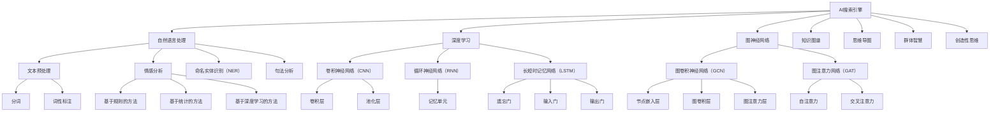

                 

### 《AI搜索引擎如何促进创新思维》

#### 关键词：
- AI搜索引擎
- 创新思维
- 知识图谱
- 深度学习
- 自然语言处理

#### 摘要：
本文将探讨AI搜索引擎如何通过其强大的自然语言处理、深度学习和图神经网络等技术，促进创新思维的发展。文章将首先介绍AI搜索引擎的基础知识，包括其发展历程、核心技术、基本架构和市场应用。接着，我们将深入探讨自然语言处理、深度学习和图神经网络在搜索引擎中的应用原理。最后，本文将重点分析AI搜索引擎在知识图谱、思维导图、群体智慧和创造性思维中的实际应用，展示其如何推动创新思维的发展。文章还将讨论AI搜索引擎的未来趋势及其在创新思维领域的挑战与机遇。通过本文，读者将更好地理解AI搜索引擎在创新思维中的重要作用，以及如何利用这一工具提升自己的创新能力。

### 第一部分：AI搜索引擎基础

#### 第1章：AI搜索引擎概述

AI搜索引擎并非一个新兴概念，其发展历程可追溯到20世纪90年代。早期的搜索引擎如AltaVista和Google，主要依赖于关键字匹配技术，通过网页的标题、描述和关键字等元数据来检索信息。随着互联网的迅猛发展，信息量的爆炸性增长，传统搜索引擎开始面临效率低下、结果不准确等问题。为了解决这些问题，研究人员开始将人工智能技术应用于搜索引擎中，从而诞生了AI搜索引擎。

**1.1 AI搜索引擎的发展历程**

AI搜索引擎的发展历程可以分为以下几个阶段：

1. **关键词匹配阶段**：最早的搜索引擎采用关键词匹配的方式，通过对网页的标题、描述和关键字进行匹配来检索信息。

2. **基于机器学习的搜索引擎**：随着机器学习技术的兴起，搜索引擎开始采用机器学习算法来提升搜索结果的准确性。例如，Google采用了PageRank算法，通过分析网页之间的链接关系来评估网页的重要性。

3. **深度学习搜索引擎**：深度学习技术的引入，使得搜索引擎能够更好地理解用户查询的语义和意图。例如，BERT（Bidirectional Encoder Representations from Transformers）模型的出现，使得搜索引擎能够更准确地捕捉用户查询中的上下文信息。

4. **基于图神经网络的搜索引擎**：图神经网络技术的应用，使得搜索引擎能够更好地处理复杂的关系数据，从而提供更加精准的搜索结果。

**1.2 AI搜索引擎的核心技术**

AI搜索引擎的核心技术包括自然语言处理、深度学习和图神经网络等。

1. **自然语言处理（NLP）**：自然语言处理是AI搜索引擎的基础技术，用于理解和生成人类语言。NLP技术包括分词、词性标注、命名实体识别、情感分析等。

2. **深度学习**：深度学习是AI搜索引擎的核心技术之一，通过构建多层神经网络，可以自动学习数据中的特征和模式。深度学习技术广泛应用于图像识别、语音识别和自然语言处理等领域。

3. **图神经网络**：图神经网络是一种专门用于处理图结构数据的深度学习模型。图神经网络能够捕捉数据之间的复杂关系，从而提升搜索引擎的准确性。

**1.3 AI搜索引擎的基本架构**

AI搜索引擎的基本架构通常包括以下几个部分：

1. **索引模块**：用于构建索引，将网页内容映射到索引数据库中，以便快速检索。

2. **查询模块**：用于接收用户查询，并对查询进行处理，生成搜索结果。

3. **排名模块**：用于对搜索结果进行排序，确保最相关的结果排在最前面。

4. **结果呈现模块**：用于将搜索结果呈现给用户，包括文本、图片、视频等多种形式。

**1.4 AI搜索引擎的市场与应用**

AI搜索引擎在全球范围内都得到了广泛应用。在市场上，Google、Bing、百度等公司占据了主要市场份额。这些搜索引擎通过不断优化技术，提供更加精准和高效的搜索服务，吸引了大量用户。

此外，AI搜索引擎在多个领域也具有广泛的应用。例如，在电子商务领域，AI搜索引擎可以帮助用户快速找到所需商品；在医疗领域，AI搜索引擎可以辅助医生进行疾病诊断；在教育领域，AI搜索引擎可以帮助学生查找相关学习资料。

总之，AI搜索引擎的发展历程、核心技术、基本架构和市场应用都表明，它正成为现代信息检索技术的重要组成部分，对创新思维的发展具有重要的推动作用。

#### 第2章：自然语言处理与搜索引擎

**2.1 自然语言处理基础**

自然语言处理（NLP）是人工智能的一个重要分支，旨在使计算机能够理解、生成和应对人类语言。NLP技术的发展，为AI搜索引擎提供了强大的技术支持。以下从几个核心概念和关键技术入手，介绍自然语言处理的基础知识。

1. **分词**：分词是NLP中的基本操作，将连续的文本序列切分成词序列。分词的质量直接影响后续处理的效果。常用的分词方法有基于词典的分词和基于统计的分词。

   - **基于词典的分词**：通过查找词库，将文本中的连续字符序列分割成独立的词。这种方法简单直观，但难以处理未登录词和长文本。
   - **基于统计的分词**：利用语言模型，通过统计文本中相邻字符序列的频率，进行分词。这种方法可以处理未登录词和长文本，但可能引入歧义。

2. **词性标注**：词性标注是对文本中的每个词进行分类标注，确定其在句子中的词性。常见的词性有名词、动词、形容词、副词等。词性标注有助于理解句子的结构和语义。

3. **命名实体识别（NER）**：命名实体识别是识别文本中具有特定意义的实体，如人名、地名、组织名等。NER对于信息抽取、关系抽取等任务具有重要意义。

4. **情感分析**：情感分析是判断文本中所表达的情感倾向，如正面、负面或中性。情感分析广泛应用于市场调查、舆情监控等领域。

5. **句法分析**：句法分析是分析句子中的词汇关系和语法结构，包括句法树构建、依赖关系分析等。句法分析有助于深入理解句子的语义。

**2.2 文本预处理技术**

文本预处理是NLP任务中的关键步骤，用于将原始文本转化为适合模型处理的格式。以下介绍几种常见的文本预处理技术：

1. **文本清洗**：文本清洗是去除文本中的无关信息，如HTML标签、特殊字符等。这有助于提高后续处理的准确性和效率。

2. **文本标准化**：文本标准化包括大小写统一、删除停用词、词形还原等操作。这些操作有助于简化文本，使其更易于分析和处理。

3. **词嵌入**：词嵌入是将文本中的单词映射到高维空间中的向量表示。词嵌入不仅可以捕捉单词的语义信息，还可以进行语义相似度计算和语义分析。

4. **文本编码**：文本编码是将文本转化为机器学习模型可处理的数字形式。常用的编码方法有One-Hot编码、Bag-of-Words编码和词嵌入编码。

**2.3 情感分析技术**

情感分析是NLP中的一个重要分支，旨在判断文本中所表达的情感倾向。情感分析技术广泛应用于社交媒体分析、舆情监控、市场调查等领域。以下介绍几种常见的情感分析技术：

1. **基于规则的方法**：基于规则的方法通过人工定义规则，对文本进行情感分类。这种方法简单直观，但难以处理复杂的情感表达。

2. **基于统计的方法**：基于统计的方法利用文本的统计特征，如词频、词序列等，进行情感分类。这种方法具有较强的鲁棒性，但可能引入噪声。

3. **基于深度学习的方法**：基于深度学习的方法通过构建神经网络模型，自动学习文本中的情感特征。这种方法具有较好的泛化能力和准确性。

4. **多标签分类**：多标签分类是情感分析中的一个重要问题，即一个文本可以同时表达多个情感标签。多标签分类技术有助于更全面地理解文本的情感表达。

**2.4 信息检索技术**

信息检索是NLP的一个重要应用领域，旨在根据用户查询，从大量数据中检索出相关的信息。以下介绍几种常见的信息检索技术：

1. **基于关键字的检索**：基于关键字的检索是最简单也是最常用的信息检索方法，通过将用户查询与文档中的关键字进行匹配，检索出相关的文档。

2. **基于向量空间的检索**：基于向量空间的检索方法将文本表示为向量，通过计算查询向量与文档向量之间的相似度，检索出相关的文档。词嵌入技术在此方法中发挥了重要作用。

3. **基于内容的检索**：基于内容的检索方法通过分析文档的语义内容，而不是仅仅依赖关键字，进行信息检索。这种方法可以捕捉到更深层次的语义信息，提高检索的准确性。

4. **基于模型的检索**：基于模型的检索方法通过构建机器学习模型，自动学习文档和查询之间的相关性，进行信息检索。这种方法具有较好的泛化能力和检索效果。

总之，自然语言处理与搜索引擎的结合，为AI搜索引擎提供了强大的技术支持。通过文本预处理、情感分析、信息检索等技术，AI搜索引擎能够更好地理解用户查询，提供更精准、更高效的搜索服务。这不仅提升了用户体验，也为创新思维的发展提供了有力工具。

#### 第3章：深度学习与搜索引擎

**3.1 深度学习基础**

深度学习是人工智能领域的一个重要分支，其核心思想是通过多层神经网络模型，从大量数据中自动学习特征和模式。深度学习在图像识别、语音识别、自然语言处理等领域取得了显著的成果。以下是深度学习的基础知识和关键技术。

**1. 神经网络**

神经网络是深度学习的基础模型，由多个神经元（节点）组成，每个神经元接收多个输入，通过加权求和和激活函数，输出结果。常见的神经网络模型包括：

- **单层感知机（Perceptron）**：单层感知机是最简单的神经网络模型，可以用于二分类问题。

- **多层感知机（MLP）**：多层感知机通过增加隐藏层，可以用于更复杂的非线性分类问题。

- **卷积神经网络（CNN）**：卷积神经网络是一种专门用于图像识别和处理的神经网络模型，通过卷积层和池化层，可以提取图像中的特征。

- **循环神经网络（RNN）**：循环神经网络是一种用于序列数据处理的神经网络模型，通过记忆单元，可以捕捉序列中的长期依赖关系。

- **长短时记忆网络（LSTM）**：长短时记忆网络是循环神经网络的一种变体，通过引入门控机制，可以更好地处理长序列数据。

**2. 深度学习算法**

深度学习算法主要包括损失函数、反向传播和优化算法等。

- **损失函数**：损失函数用于衡量模型预测值与真实值之间的差距。常见的损失函数包括均方误差（MSE）、交叉熵（CE）等。

- **反向传播**：反向传播是一种用于训练神经网络的算法，通过计算梯度，更新模型参数，使模型预测更接近真实值。

- **优化算法**：优化算法用于调整模型参数，使模型损失最小。常见的优化算法包括梯度下降（GD）、随机梯度下降（SGD）等。

**3. 深度学习框架**

深度学习框架是用于构建和训练深度学习模型的工具。常见的深度学习框架包括：

- **TensorFlow**：TensorFlow是由Google开发的开源深度学习框架，支持多种神经网络模型和优化算法。

- **PyTorch**：PyTorch是由Facebook开发的深度学习框架，具有灵活的动态图计算能力。

- **Keras**：Keras是一个基于TensorFlow和Theano的深度学习框架，提供了简洁易用的API。

**3.2 卷积神经网络（CNN）**

卷积神经网络是一种专门用于图像识别和处理的神经网络模型，通过卷积层、池化层和全连接层，可以提取图像中的特征。

**1. 卷积层**

卷积层是CNN的核心部分，通过卷积操作，提取图像中的局部特征。卷积层包括多个卷积核，每个卷积核负责提取一种特定的特征。

**2. 池化层**

池化层用于降低特征图的空间分辨率，减少模型参数数量。常见的池化操作包括最大池化和平均池化。

**3. 全连接层**

全连接层将卷积层和池化层提取的特征映射到分类结果。全连接层由多个神经元组成，每个神经元接收来自卷积层的所有特征。

**3.3 循环神经网络（RNN）**

循环神经网络是一种用于序列数据处理的神经网络模型，通过记忆单元，可以捕捉序列中的长期依赖关系。

**1. RNN基本结构**

RNN的基本结构包括输入层、隐藏层和输出层。输入层接收序列数据，隐藏层通过记忆单元存储历史信息，输出层生成预测结果。

**2. 长短时记忆网络（LSTM）**

长短时记忆网络是RNN的一种变体，通过引入门控机制，可以更好地处理长序列数据。

- **遗忘门（Forget Gate）**：遗忘门决定哪些信息应该被遗忘。

- **输入门（Input Gate）**：输入门决定哪些新信息应该被存储。

- **输出门（Output Gate）**：输出门决定哪些信息应该被输出。

**3.4 长短时记忆网络（LSTM）**

长短时记忆网络（LSTM）是RNN的一种变体，通过引入门控机制，可以更好地处理长序列数据。

**1. LSTM基本结构**

LSTM的基本结构包括输入门、遗忘门、输出门和细胞状态。输入门、遗忘门和输出门分别决定哪些信息应该被存储、遗忘和输出。

**2. LSTM与RNN的区别**

LSTM通过门控机制，解决了传统RNN在处理长序列数据时遇到的梯度消失和梯度爆炸问题。这使得LSTM在语音识别、机器翻译等任务中表现出色。

**3.5 图神经网络（GNN）**

图神经网络是一种专门用于处理图结构数据的神经网络模型，通过图卷积和图注意力机制，可以捕捉图中的复杂关系。

**1. 图神经网络基本结构**

图神经网络的基本结构包括节点嵌入层、图卷积层和图注意力层。

- **节点嵌入层**：将图中的节点映射到高维空间中的向量表示。

- **图卷积层**：通过图卷积操作，更新节点嵌入向量。

- **图注意力层**：通过图注意力机制，调整节点之间的交互权重。

**2. 图卷积神经网络（GCN）**

图卷积神经网络（GCN）是一种基于图神经网络的图卷积层，通过聚合邻居节点的信息，更新节点嵌入向量。

**3. 图注意力网络（GAT）**

图注意力网络（GAT）是一种基于图神经网络的图注意力层，通过计算节点之间的注意力权重，调整节点之间的交互。

**3.6 深度学习与搜索引擎的结合**

深度学习在搜索引擎中的应用，主要体现在以下几个方面：

1. **文本表示**：通过词嵌入和文本编码技术，将文本转化为向量表示，用于文本匹配和分类。

2. **图像识别**：通过卷积神经网络，对图像进行特征提取和分类，用于图像搜索和推荐。

3. **语音识别**：通过循环神经网络和长短时记忆网络，对语音信号进行识别和转换，用于语音搜索和交互。

4. **用户行为分析**：通过深度学习模型，分析用户行为数据，预测用户兴趣和需求，提供个性化搜索结果。

总之，深度学习与搜索引擎的结合，为AI搜索引擎提供了强大的技术支持，使其能够更好地理解用户需求，提供更精准、更高效的搜索服务。这不仅提升了用户体验，也为创新思维的发展提供了有力工具。

#### 第4章：图神经网络与搜索引擎

**4.1 图神经网络基础**

图神经网络（Graph Neural Networks，GNN）是一种专门用于处理图结构数据的深度学习模型。与传统神经网络不同，GNN能够捕捉图中的复杂关系，从而在多种应用场景中表现出色。本节将介绍图神经网络的基础知识，包括图表示、图卷积操作和图注意力机制。

**1. 图表示**

图表示是GNN处理图数据的第一步，目的是将图中的节点和边映射到高维空间中的向量表示。常见的图表示方法包括节点嵌入和边嵌入。

- **节点嵌入**：将图中的每个节点映射到一个向量表示，通常通过学习得到。节点嵌入可以捕捉节点的局部特征和关系。
- **边嵌入**：将图中的每条边映射到一个向量表示，同样通过学习得到。边嵌入可以捕捉边的属性和影响。

**2. 图卷积操作**

图卷积操作是GNN的核心组成部分，通过聚合节点邻域的信息，更新节点的嵌入向量。图卷积操作可以分为局部卷积和全局卷积。

- **局部卷积**：每个节点的更新仅依赖于其邻居节点的信息。局部卷积通过聚合邻居节点的嵌入向量，并结合一个可学习的权重矩阵，更新当前节点的嵌入向量。
- **全局卷积**：每个节点的更新依赖于所有节点的信息。全局卷积通过聚合所有节点的嵌入向量，并结合一个全局权重矩阵，更新当前节点的嵌入向量。

**3. 图注意力机制**

图注意力机制是一种用于调整节点之间交互权重的机制，可以增强GNN的性能。图注意力机制通过计算节点之间的注意力分数，动态调整节点对其他节点的贡献。

- **自注意力（Self-Attention）**：每个节点仅关注自身和其邻居节点，通过计算注意力分数，调整节点的贡献。
- **交叉注意力（Cross-Attention）**：每个节点不仅关注自身和其邻居节点，还关注其他节点。通过计算交叉注意力分数，动态调整节点对其他节点的依赖。

**4.2 图卷积神经网络（GCN）**

图卷积神经网络（Graph Convolutional Network，GCN）是一种基于图卷积操作的神经网络模型，用于处理图结构数据。GCN由多个图卷积层组成，通过逐层聚合节点邻域信息，生成节点的特征表示。

**1. GCN基本结构**

GCN的基本结构包括输入层、图卷积层和输出层。

- **输入层**：将图中的节点和边作为输入。
- **图卷积层**：通过图卷积操作，更新节点的嵌入向量。
- **输出层**：通过全连接层或其他激活函数，生成节点的分类或预测结果。

**2. GCN算法伪代码**

```python
# 初始化节点嵌入向量
H = initialize_embeddings()

# 设置迭代次数
num_iterations = 100

for i in range(num_iterations):
    # 对每个节点进行图卷积操作
    H = apply_graph_convolution(H, A)  # A为邻接矩阵

# 输出节点的特征表示
output = H
```

**4.3 图注意力网络（GAT）**

图注意力网络（Graph Attention Network，GAT）是一种基于图注意力机制的神经网络模型，通过调整节点之间的交互权重，提高模型的性能。

**1. GAT基本结构**

GAT的基本结构包括输入层、图卷积层、图注意力层和输出层。

- **输入层**：将图中的节点和边作为输入。
- **图卷积层**：通过图卷积操作，更新节点的嵌入向量。
- **图注意力层**：通过图注意力机制，计算节点之间的注意力分数。
- **输出层**：通过全连接层或其他激活函数，生成节点的分类或预测结果。

**2. GAT算法伪代码**

```python
# 初始化节点嵌入向量
H = initialize_embeddings()

# 设置迭代次数
num_iterations = 100

for i in range(num_iterations):
    # 对每个节点进行图卷积操作
    H = apply_graph_convolution(H, A)  # A为邻接矩阵

    # 对每个节点进行图注意力操作
    H = apply_graph_attention(H, A)  # A为邻接矩阵

# 输出节点的特征表示
output = H
```

**4.4 图嵌入与搜索**

图嵌入是将图中的节点和边映射到高维空间中的向量表示，以便于在计算机中进行处理和分析。图嵌入技术在搜索引擎中具有广泛的应用，例如：

1. **节点分类**：通过学习节点的嵌入向量，对节点进行分类，用于知识图谱中的实体识别和分类。

2. **链接预测**：通过学习边的嵌入向量，预测图中可能存在的边，用于推荐系统中的相似节点推荐。

3. **搜索优化**：通过优化节点的嵌入向量，提高搜索结果的准确性和效率，用于个性化搜索和推荐。

总之，图神经网络与搜索引擎的结合，为AI搜索引擎提供了强大的技术支持，使其能够更好地处理图结构数据，提供更精准、更高效的搜索服务。这不仅提升了用户体验，也为创新思维的发展提供了有力工具。

#### 第二部分：AI搜索引擎在创新思维中的应用

##### 第5章：AI搜索引擎与知识图谱

知识图谱是一种结构化的知识表示方法，通过实体、属性和关系的网络结构，将海量信息进行组织、关联和推理。AI搜索引擎与知识图谱的结合，不仅能够提高搜索结果的准确性和相关性，还能促进创新思维的发展。

**5.1 知识图谱概述**

知识图谱由实体、属性和关系三个核心组件构成。

- **实体**：实体是知识图谱中的基本元素，可以是人物、地点、组织或事物等。
- **属性**：属性是实体所具有的特性，如姓名、年龄、职位等。
- **关系**：关系是实体之间的关联，如人物之间的工作关系、地点之间的地理位置关系等。

知识图谱通过实体、属性和关系的组合，形成一个复杂的关系网络，为AI搜索引擎提供了丰富的语义信息。

**5.2 知识图谱构建技术**

知识图谱的构建通常包括数据收集、数据预处理、实体识别、关系抽取和知识融合等步骤。

1. **数据收集**：从多种数据源（如网页、数据库、文本等）收集与实体、属性和关系相关的数据。
2. **数据预处理**：对原始数据进行清洗、去重和格式化，使其适合后续处理。
3. **实体识别**：利用自然语言处理技术，从文本中识别出实体，并对其进行分类和标注。
4. **关系抽取**：从文本或结构化数据中抽取实体之间的关系，如通过命名实体识别技术，从新闻报道中抽取人物之间的工作关系。
5. **知识融合**：将不同来源的知识进行整合，构建统一的实体和关系网络。

**5.3 知识图谱与搜索引擎的融合**

知识图谱与搜索引擎的融合，主要通过以下几种方式实现：

1. **实体搜索**：利用知识图谱中的实体信息，对用户查询进行实体识别和分类，提高搜索结果的准确性。
2. **关系搜索**：利用知识图谱中的关系信息，对用户查询进行关系抽取和推理，提供更丰富的搜索结果。
3. **语义搜索**：通过分析知识图谱中的实体、属性和关系，对用户查询进行语义理解，提供更相关的搜索结果。

**5.4 知识图谱在创新思维中的应用**

知识图谱在创新思维中的应用主要体现在以下几个方面：

1. **知识发现**：通过分析知识图谱中的关系和关联，发现新的知识和趋势，激发创新思维。
2. **知识推理**：利用知识图谱中的逻辑推理和关系推断，对问题进行深入分析和解答，促进创新思维的拓展。
3. **知识导航**：通过知识图谱，为用户提供个性化的知识导航服务，帮助用户快速获取所需信息，提升创新效率。

**5.5 实战案例**

以下是一个基于知识图谱的AI搜索引擎应用案例：

- **项目背景**：某公司需要开发一个面向科研领域的AI搜索引擎，为科研人员提供快速、准确的学术信息检索服务。
- **技术实现**：首先，从多种学术数据源（如论文、期刊、会议等）中收集数据，构建知识图谱。然后，利用知识图谱中的实体、属性和关系，对用户查询进行语义理解、关系抽取和推理。最后，通过深度学习和自然语言处理技术，提高搜索结果的准确性和相关性。
- **应用效果**：该搜索引擎能够快速定位用户所需信息，提供丰富的学术资料和知识关联，显著提升了科研人员的创新效率。

总之，AI搜索引擎与知识图谱的结合，为创新思维提供了强大的技术支持。通过构建和利用知识图谱，AI搜索引擎能够更好地理解用户需求，提供更精准、更高效的搜索服务，从而推动创新思维的发展。

### 第6章：AI搜索引擎与思维导图

思维导图是一种有效的知识管理和创新工具，通过图形化的方式展示思维过程中的各种信息。AI搜索引擎与思维导图的结合，不仅能够提升思维导图的创建和管理效率，还能促进创新思维的发展。

**6.1 思维导图概述**

思维导图（Mind Map）是一种基于中心主题，通过分支、层次和颜色等元素，展示思维过程中各种信息的图形化工具。思维导图的主要组成部分包括：

- **中心主题**：思维导图的核心，代表整个思维过程的焦点。
- **分支**：从中心主题延伸出来的线条，表示思维过程中的不同方面或子主题。
- **子主题**：位于分支末端的标签，表示与中心主题相关的具体信息。
- **层次结构**：通过不同层次的分支，展示思维过程中的逻辑关系和层次结构。
- **颜色**：通过颜色区分不同的主题和子主题，使思维导图更加直观和易读。

**6.2 思维导图与搜索引擎的融合**

AI搜索引擎与思维导图的融合，主要体现在以下几个方面：

1. **自动生成思维导图**：通过自然语言处理和文本分析技术，将用户输入的文本内容自动生成思维导图。搜索引擎可以根据文本中的关键词、句子结构和语义关系，构建思维导图的分支和层次结构。
2. **智能搜索和推荐**：基于用户创建的思维导图，AI搜索引擎可以提供个性化的搜索和推荐服务。通过分析思维导图中的信息，搜索引擎可以识别用户的兴趣点和需求，提供相关的信息和资源。
3. **知识导航和拓展**：AI搜索引擎可以结合知识图谱和思维导图，为用户提供知识导航和拓展服务。用户可以通过搜索引擎，快速找到与当前主题相关的知识点和资源，促进思维拓展和创新。

**6.3 思维导图在创新思维中的应用**

思维导图在创新思维中的应用，主要体现在以下几个方面：

1. **发散思维**：通过思维导图，用户可以围绕中心主题，自由地展开思维，探索不同的想法和解决方案。思维导图可以帮助用户发现潜在的创新点和关联性，激发创新思维。
2. **聚合思维**：思维导图可以将分散的想法和知识点进行整合和关联，形成有结构的思维网络。通过聚合思维，用户可以更好地理解和应用已有知识，促进创新思维的发展。
3. **可视化展示**：思维导图通过图形化的方式展示思维过程和结果，使复杂的信息更加直观和易于理解。这种可视化展示有助于用户更好地沟通和分享思维成果，促进团队合作和创新。

**6.4 实战案例：基于AI搜索引擎的思维导图构建**

以下是一个基于AI搜索引擎的思维导图构建案例：

- **项目背景**：某团队需要为一个新的产品项目创建一个思维导图，以规划项目的发展和实施。
- **技术实现**：首先，团队通过AI搜索引擎，收集与产品相关的各种信息，如市场调研报告、技术文档、竞争对手分析等。然后，使用自然语言处理和文本分析技术，将这些文本内容转化为思维导图。通过分析文本中的关键词、句子结构和语义关系，构建思维导图的分支和层次结构。最后，团队可以基于思维导图，进行项目规划、任务分配和进度跟踪，提高项目管理的效率。
- **应用效果**：通过AI搜索引擎和思维导图的结合，团队能够快速构建和更新项目思维导图，实现知识的有效组织和传播。这不仅提高了项目的规划和执行效率，还促进了团队成员之间的协作和创新。

总之，AI搜索引擎与思维导图的结合，为创新思维提供了强大的工具支持。通过智能化的思维导图构建和知识管理，用户可以更高效地组织和应用知识，促进创新思维的发展。

### 第7章：AI搜索引擎与群体智慧

群体智慧（Collective Intelligence）是指通过集体协作和智能集成，实现个体无法单独完成的高难度任务或创新。AI搜索引擎与群体智慧的结合，能够充分发挥群体的智慧和创造力，推动创新思维的发展。

**7.1 群体智慧概述**

群体智慧是基于个体之间协作和知识共享的集体智能。群体智慧的特点包括：

- **多样性**：群体中的个体具有不同的知识背景、经验和技能，形成多样化的观点和想法。
- **协作性**：个体通过协作和知识共享，共同解决问题或创造新价值。
- **自组织**：群体智慧能够在没有中央控制的情况下，自主组织和演化。
- **动态性**：群体智慧是一个动态的过程，个体之间的互动和知识共享不断变化和调整。

**7.2 群体智慧与搜索引擎的结合**

AI搜索引擎与群体智慧的结合，主要体现在以下几个方面：

1. **信息收集与筛选**：AI搜索引擎可以高效地收集和筛选海量信息，为群体智慧提供丰富的数据资源。通过搜索引擎，群体成员可以快速获取与问题相关的信息，提高协作效率。
2. **知识共享与传播**：AI搜索引擎可以整合和传播群体智慧中的知识，促进知识共享。通过搜索引擎，个体可以查找和分享他人的经验和观点，形成集体智慧。
3. **决策支持**：AI搜索引擎可以利用群体智慧的数据和算法，为决策提供支持。通过分析群体成员的意见和决策历史，搜索引擎可以预测趋势和优化决策。

**7.3 群体智慧在创新思维中的应用**

群体智慧在创新思维中的应用，主要体现在以下几个方面：

1. **创意生成**：通过群体智慧，个体可以互相激发创意，形成创新的思路和解决方案。群体智慧可以帮助个体突破思维定势，产生更多新颖的想法。
2. **协同创新**：群体智慧通过协作和知识共享，促进个体之间的协同创新。群体成员可以共同探讨问题、提出改进方案，实现创新成果的优化和提升。
3. **知识管理**：群体智慧可以有效地管理和利用知识资源，促进知识的积累和创新。通过AI搜索引擎，群体智慧可以将分散的知识整合和传播，提高知识的利用效率。

**7.4 实战案例：基于AI搜索引擎的群体智慧平台构建**

以下是一个基于AI搜索引擎的群体智慧平台构建案例：

- **项目背景**：某公司需要构建一个创新平台，以激发员工的创新思维，提高公司的创新能力。
- **技术实现**：首先，公司通过AI搜索引擎，收集与行业相关的各种信息，如市场趋势、技术发展、竞争对手等。然后，构建一个基于AI搜索引擎的群体智慧平台，员工可以通过平台获取和分享信息，提出创意和建议。平台利用自然语言处理和机器学习技术，分析员工的意见和创意，提供智能化的推荐和反馈。最后，公司可以根据平台上的数据和分析结果，制定创新策略和决策。
- **应用效果**：通过基于AI搜索引擎的群体智慧平台，公司能够更好地整合和利用员工的知识和创意，提高创新效率。平台不仅促进了员工之间的协作和知识共享，还为公司提供了有力的创新支持。

总之，AI搜索引擎与群体智慧的结合，为创新思维提供了强大的工具支持。通过智能化和信息化的手段，群体智慧可以更好地发挥其优势，推动创新思维的发展。

### 第8章：AI搜索引擎与创造性思维

创造性思维（Creative Thinking）是指通过独特的视角和创新的思维方法，产生新颖且有价值的想法和解决方案。AI搜索引擎在创造性思维中的应用，可以极大地拓展思维空间，激发创新灵感，提高创造性思维的效果。

**8.1 创造性思维概述**

创造性思维是一种思维模式，通过灵活、开放和创新的思维方式，解决问题和产生新想法。创造性思维的特点包括：

- **开放性**：创造性思维不受传统观念和思维定式的束缚，鼓励个体从不同的角度和维度思考问题。
- **灵活性**：创造性思维强调思维的灵活性，允许个体在不同领域、不同背景下进行思考和创造。
- **独特性**：创造性思维追求独特性和创新性，通过与众不同的视角和解决方案，产生新颖的想法和创意。
- **实用性**：创造性思维不仅关注创新性，还强调解决方案的实用性和可行性，确保创新想法能够落地实施。

**8.2 AI搜索引擎对创造性思维的影响**

AI搜索引擎对创造性思维的影响主要体现在以下几个方面：

1. **信息获取**：AI搜索引擎可以快速地收集和整理海量信息，为创造性思维提供丰富的素材和灵感来源。通过搜索引擎，个体可以迅速获取与问题相关的背景知识、最新研究进展和典型案例，为创造性思维提供坚实的理论基础。
2. **思维拓展**：AI搜索引擎可以帮助个体突破思维定势，拓展思维空间。通过搜索不同领域的知识，个体可以跨越传统学科界限，从多个角度思考问题，产生新的思路和创意。
3. **灵感激发**：AI搜索引擎可以提供多样化的信息来源，激发个体的创新灵感。通过分析用户的搜索历史和兴趣偏好，搜索引擎可以推荐相关的信息和资源，帮助个体发现新的创意和解决方案。
4. **知识整合**：AI搜索引擎可以将分散的知识点进行整合和关联，为创造性思维提供整体视角。通过分析用户查询中的关键词和上下文信息，搜索引擎可以识别知识之间的关联，帮助个体构建新的知识体系，实现知识的深度融合和创新。

**8.3 AI搜索引擎在创造性思维中的实践**

AI搜索引擎在创造性思维中的实践，可以采用以下几种方法：

1. **发散搜索**：通过AI搜索引擎进行发散搜索，获取与问题相关的多样化信息。个体可以从不同的角度和维度思考问题，产生新的想法和创意。
2. **案例搜索**：通过AI搜索引擎搜索相关案例，了解其他领域或行业的创新实践。个体可以借鉴案例中的成功经验和失败教训，为自己的创新提供参考和启示。
3. **知识整合**：利用AI搜索引擎整合不同领域和知识点，构建新的知识体系。个体可以通过跨学科的知识整合，发现新的关联和联系，实现知识的创新和融合。
4. **灵感激发**：通过AI搜索引擎的个性化推荐功能，获取与兴趣相关的信息和资源。个体可以从这些信息中汲取灵感，激发创造性思维，产生新的创意和想法。

**8.4 创造性思维与搜索引擎的深度融合**

为了实现创造性思维与AI搜索引擎的深度融合，可以采取以下措施：

1. **个性化搜索**：通过用户行为数据和兴趣偏好，实现个性化搜索。搜索引擎可以根据用户的需求和兴趣，推荐相关的信息和资源，帮助个体更高效地进行创造性思维。
2. **智能问答**：通过自然语言处理和机器学习技术，实现智能问答功能。个体可以通过搜索引擎提出问题，获取针对性的答案和建议，促进创造性思维的深入发展。
3. **知识图谱构建**：利用AI搜索引擎构建知识图谱，整合和关联不同领域和知识点。知识图谱可以为创造性思维提供全局视角，帮助个体发现新的关联和联系。
4. **协作创新**：通过AI搜索引擎实现群体智慧，促进个体之间的知识共享和协作。群体智慧可以为创造性思维提供多样化的视角和灵感，推动创新成果的实现。

总之，AI搜索引擎与创造性思维的深度融合，可以极大地提升创造性思维的效果，推动创新思维的发展。通过智能化和信息化的手段，个体可以更高效地进行创造性思维，实现知识的创新和价值的创造。

### 第9章：AI搜索引擎的未来发展与挑战

随着人工智能技术的不断发展，AI搜索引擎在各个领域中的应用越来越广泛。未来，AI搜索引擎将继续迎来新的发展和变革，为创新思维提供更加丰富的工具和支持。然而，这些发展也伴随着一系列的挑战和机遇。

**9.1 AI搜索引擎的未来趋势**

1. **智能化水平提升**：未来，AI搜索引擎将进一步提高智能化水平，通过深度学习、自然语言处理和知识图谱等技术，实现更精准、更高效的搜索服务。搜索引擎将能够更好地理解用户的需求和意图，提供个性化的搜索结果。
2. **跨模态搜索**：随着多模态数据（如文本、图像、音频等）的快速增长，AI搜索引擎将实现跨模态搜索，整合不同类型的数据源，提供更全面、更丰富的搜索体验。例如，用户可以通过语音查询，获取图文并茂的搜索结果。
3. **实时搜索**：AI搜索引擎将实现实时搜索功能，通过实时分析用户行为和数据，动态调整搜索结果，提供更加及时的搜索服务。例如，在电子商务领域，实时搜索可以帮助用户快速找到最新上市的商品。
4. **协作搜索**：AI搜索引擎将支持协作搜索功能，通过群体智慧和大数据分析，整合用户和专家的智慧，提供更加专业和全面的搜索结果。例如，在医学领域，协作搜索可以帮助医生快速获取权威的医疗信息和治疗方案。
5. **AI驱动的创新应用**：AI搜索引擎将推动各行业领域的创新应用，例如，在科研领域，AI搜索引擎可以帮助科研人员快速找到相关的研究论文和成果；在金融领域，AI搜索引擎可以帮助金融机构实时监控市场动态和投资机会。

**9.2 创新思维的持续发展**

随着AI搜索引擎的发展，创新思维将得到持续提升和拓展。以下是一些可能的方向：

1. **知识整合与融合**：AI搜索引擎将整合多种知识源，实现跨领域和跨学科的知识融合，为创新思维提供更加丰富和多样的知识支持。例如，通过知识图谱和大数据分析，AI搜索引擎可以帮助用户发现新的关联和联系，激发创新灵感。
2. **智能辅助创新**：AI搜索引擎将提供智能辅助创新工具，帮助用户进行知识挖掘、创意生成和问题解决。例如，通过自然语言处理和机器学习技术，AI搜索引擎可以自动生成创意报告、推荐创新方案，为用户提供智能化的创新支持。
3. **跨学科合作**：AI搜索引擎将促进跨学科合作，通过跨领域的数据共享和知识融合，推动创新思维的发展。例如，在医学、工程、艺术等不同领域，AI搜索引擎可以帮助专家和学者进行跨学科的研究和合作，实现创新突破。
4. **智能化人才培养**：AI搜索引擎将推动智能化人才培养，通过提供个性化的学习资源、实践项目和协作平台，培养具有创新思维和科技能力的人才。例如，在教育领域，AI搜索引擎可以帮助学生进行自主学习、知识探索和创新能力培养。

**9.3 AI搜索引擎在创新思维领域的挑战与机遇**

1. **数据隐私和安全**：随着AI搜索引擎的应用，数据隐私和安全问题日益突出。如何在保障用户隐私的前提下，充分利用用户数据为创新思维提供支持，是一个重要的挑战。
2. **算法公平性与透明性**：AI搜索引擎的算法决策过程可能存在偏见和歧视，影响创新思维的公平性和透明性。如何确保算法的公平性、透明性和可解释性，是一个需要关注的问题。
3. **计算资源和能耗**：AI搜索引擎的计算资源和能耗需求巨大，如何在保证性能的同时，降低计算资源和能耗，是一个需要解决的挑战。
4. **技术伦理和法律监管**：AI搜索引擎在创新思维领域的应用，涉及到一系列伦理和法律问题。如何制定合理的伦理规范和法律框架，确保AI搜索引擎的应用符合伦理和法律要求，是一个重要的任务。

总之，AI搜索引擎在创新思维领域具有广阔的发展前景，同时也面临着一系列的挑战。通过不断的技术创新和合作，我们可以充分发挥AI搜索引擎的优势，推动创新思维的发展，实现社会和经济的可持续发展。

### 附录：AI搜索引擎技术栈与开发工具

A.1 AI搜索引擎技术栈

AI搜索引擎的技术栈包括多种技术组件和工具，用于实现高效的搜索和数据处理功能。以下是一些关键的技术和框架：

1. **自然语言处理（NLP）库**：如NLTK、spaCy、Stanford NLP等，用于文本预处理、分词、词性标注、实体识别等。
2. **机器学习框架**：如scikit-learn、TensorFlow、PyTorch等，用于构建和训练深度学习模型，进行文本分类、情感分析等。
3. **深度学习框架**：如TensorFlow、PyTorch、Keras等，用于构建和训练神经网络模型，实现图像识别、语音识别等。
4. **图神经网络库**：如Graph Neural Network（GNN）、PyTorch Geometric等，用于构建和处理图结构数据，实现图卷积神经网络（GCN）、图注意力网络（GAT）等。
5. **搜索引擎库**：如Elasticsearch、Solr等，用于实现高效的信息检索和索引管理。
6. **知识图谱框架**：如Neo4j、OrientDB等，用于构建和管理知识图谱，实现实体关系抽取和推理。
7. **Web开发框架**：如Flask、Django等，用于构建Web应用程序，提供用户界面和API服务。
8. **数据库**：如MySQL、PostgreSQL等，用于存储和管理结构化数据。

A.2 开发工具与资源

以下是一些常用的AI搜索引擎开发工具和资源：

1. **Jupyter Notebook**：一个交互式的Web应用程序，用于数据分析和模型训练。
2. **Google Colab**：基于Google Drive的免费Jupyter Notebook环境，支持GPU和TPU加速。
3. **GitHub**：一个开源代码托管平台，用于协作和共享代码。
4. **Kaggle**：一个数据科学竞赛平台，提供丰富的数据集和模型训练资源。
5. **ArXiv**：一个开放获取的学术论文数据库，提供最新的研究成果和论文。
6. **AI教程和博客**：如Towards AI、Medium等，提供丰富的AI教程、文章和案例。
7. **在线课程和讲座**：如Coursera、Udacity等，提供系统的AI学习资源和课程。
8. **AI工具和API**：如Google Cloud AI、IBM Watson等，提供多种AI工具和API，方便开发者进行模型训练和应用部署。

通过使用这些技术栈和开发工具，开发者可以构建高效、智能的AI搜索引擎，为用户提供卓越的搜索体验和创新的解决方案。

### 核心概念与联系

为了更好地理解AI搜索引擎在创新思维中的重要作用，我们需要梳理核心概念之间的联系。以下是一个基于Mermaid的流程图，展示AI搜索引擎相关核心概念和技术的相互关系：



在这个流程图中，我们可以看到AI搜索引擎（A）是核心，它通过自然语言处理（B）、深度学习（C）和图神经网络（D）等技术，实现文本预处理（E）、情感分析（F）、卷积神经网络（G）、循环神经网络（H）、长短时记忆网络（I）、图卷积神经网络（J）和图注意力网络（K）等功能。这些核心概念和技术相互关联，共同构成了AI搜索引擎的强大能力。

- **自然语言处理**（B）通过文本预处理（E）、命名实体识别（NER）和句法分析（CC），为AI搜索引擎提供语义理解基础。
- **深度学习**（C）通过卷积神经网络（G）、循环神经网络（H）和长短时记忆网络（I），实现复杂的特征提取和模式识别。
- **图神经网络**（D）通过图卷积神经网络（J）和图注意力网络（K），处理图结构数据，捕捉复杂的关系和关联。
- **知识图谱**（DD）通过实体、属性和关系的组织，为AI搜索引擎提供丰富的语义信息和关联关系。
- **思维导图**（EE）通过图形化的方式，展示思维过程中的信息，促进创新思维的发展。
- **群体智慧**（FF）和**创造性思维**（GG）通过AI搜索引擎的支持，实现知识的共享和协作，激发创新灵感。

通过这个流程图，我们可以清晰地看到AI搜索引擎在创新思维中的核心地位，以及其如何通过多种技术手段，实现高效的信息检索和知识发现，推动创新思维的发展。

### 核心算法原理讲解

在AI搜索引擎中，深度学习算法起着至关重要的作用。以下将详细讲解深度学习算法的基本原理，并使用伪代码进行描述。

#### 1. 深度学习算法基本原理

深度学习算法是一种基于多层神经网络的机器学习算法，通过自动学习数据中的特征和模式，实现分类、回归、识别等任务。深度学习算法的核心组成部分包括：

1. **神经网络结构**：神经网络由多个层次组成，包括输入层、隐藏层和输出层。每个层次由多个神经元（节点）组成，每个神经元接收前一层神经元的输出，通过加权求和和激活函数，生成当前神经元的输出。
2. **损失函数**：损失函数用于衡量模型预测值与真实值之间的差距，是优化模型参数的关键。常见的损失函数包括均方误差（MSE）、交叉熵（CE）等。
3. **反向传播**：反向传播算法是训练神经网络的关键步骤，通过计算损失函数关于模型参数的梯度，更新模型参数，使模型预测更接近真实值。
4. **优化算法**：优化算法用于调整模型参数，使模型损失最小。常见的优化算法包括梯度下降（GD）、随机梯度下降（SGD）等。

#### 2. 深度学习算法伪代码

以下是一个简单的深度学习算法伪代码，用于实现二分类问题：

```python
# 初始化模型参数
W, b = initialize_parameters()

# 设置迭代次数和learning rate
num_iterations = 10000
learning_rate = 0.01

# 迭代训练
for i in range(num_iterations):
    # 前向传播
    inputs, labels = get_batch_data()
    predictions = forward_pass(inputs, W, b)

    # 计算损失
    loss = compute_loss(predictions, labels)

    # 反向传播
    gradients = backward_pass(predictions, labels)

    # 更新参数
    W, b = update_parameters(W, b, gradients, learning_rate)

# 模型评估
evaluate_model(W, b)
```

- **initialize_parameters()**：初始化模型参数，如权重矩阵和偏置向量。
- **get_batch_data()**：获取一批训练数据，包括输入和标签。
- **forward_pass(inputs, W, b)**：进行前向传播，计算模型输出。
- **compute_loss(predictions, labels)**：计算损失函数，衡量模型输出与真实值之间的差距。
- **backward_pass(predictions, labels)**：进行反向传播，计算损失函数关于模型参数的梯度。
- **update_parameters(W, b, gradients, learning_rate)**：更新模型参数，使损失最小。

#### 3. 数学模型和数学公式讲解

以下是对深度学习算法中常用的数学模型和公式的讲解：

- **损失函数：均方误差（MSE）**
  $$
  \text{MSE} = \frac{1}{2} \sum_{i=1}^{n} (\hat{y}_i - y_i)^2
  $$
  其中，$\hat{y}_i$是模型预测值，$y_i$是真实值。

- **反向传播算法**
  $$
  \Delta W = \frac{\partial \text{Loss}}{\partial W} = \sum_{i=1}^{n} (\hat{y}_i - y_i) \cdot \frac{\partial \text{predictions}_i}{\partial W}
  $$
  $$
  \Delta b = \frac{\partial \text{Loss}}{\partial b} = \sum_{i=1}^{n} (\hat{y}_i - y_i) \cdot \frac{\partial \text{predictions}_i}{\partial b}
  $$
  其中，$\text{Loss}$是损失函数，$\partial$表示偏导数。

- **更新参数**
  $$
  W_{\text{new}} = W_{\text{old}} - \alpha \cdot \Delta W
  $$
  $$
  b_{\text{new}} = b_{\text{old}} - \alpha \cdot \Delta b
  $$
  其中，$\alpha$是learning rate，$W_{\text{old}}$和$W_{\text{new}}$分别是当前和更新的权重矩阵，$b_{\text{old}}$和$b_{\text{new}}$分别是当前和更新的偏置向量。

通过这些数学模型和公式，我们可以理解深度学习算法的基本原理，并通过反向传播算法不断优化模型参数，提高模型的性能。

#### 4. 自然语言处理算法讲解

自然语言处理（NLP）是AI搜索引擎的重要组成部分，用于理解和生成人类语言。以下是对NLP算法的基本原理和伪代码进行讲解：

- **分词（Tokenization）**：将连续的文本序列切分成词序列。
  ```python
  function tokenize(text):
      tokens = []
      for word in text:
          if word not in stop_words:
              tokens.append(word)
      return tokens
  ```
- **词嵌入（Word Embedding）**：将文本中的单词映射到高维空间中的向量表示。
  ```python
  function embed_tokens(tokens):
      embeddings = []
      for token in tokens:
          embedding = get_embedding(token)
          embeddings.append(embedding)
      return embeddings
  ```
- **卷积神经网络（CNN）**：用于文本特征提取。
  ```python
  function convolutional_neural_network(embeddings):
      conv_output = []
      for filter in filters:
          feature_map = apply_filter(embeddings, filter)
          conv_output.append(pool(feature_map))
      return conv_output
  ```
- **全连接层（Fully Connected Layer）**：将卷积层提取的特征映射到分类结果。
  ```python
  function fully_connected(pooled_output):
      output = []
      for node in pooled_output:
          output.append(activate(node))
      return output
  ```

通过这些NLP算法，AI搜索引擎可以更好地理解文本内容，提供更精准的搜索结果。

### 核心算法原理讲解总结

通过对深度学习算法和自然语言处理算法的讲解，我们可以看到AI搜索引擎如何利用这些核心算法，实现对文本内容的高效理解和处理。深度学习算法通过多层神经网络、反向传播和优化算法，实现特征提取和模式识别；自然语言处理算法通过分词、词嵌入和卷积神经网络，实现对文本的语义理解和特征提取。这些核心算法共同作用，为AI搜索引擎提供了强大的技术支持，使其能够更好地理解用户查询，提供精准的搜索服务，推动创新思维的发展。

### 项目实战

在本节中，我们将通过一个基于BERT模型的文本分类项目，详细讲解AI搜索引擎的实际开发过程，包括环境搭建、数据准备、模型构建、模型训练、模型评估以及结果分析。通过这个项目，读者可以深入了解AI搜索引擎的开发流程，掌握关键技术和实战技巧。

#### 1. 开发环境搭建

在开始项目之前，我们需要搭建开发环境。首先，确保已经安装了Python 3.x版本。然后，通过以下命令安装必要的库和框架：

```bash
pip install tensorflow transformers
```

这里，我们使用了TensorFlow作为深度学习框架，以及transformers库来加载预训练的BERT模型。

#### 2. 数据准备

数据准备是文本分类项目的关键步骤。以下是一个简单的数据准备流程：

- **数据收集**：从互联网或其他数据源收集文本数据。例如，我们可以从新闻网站、论坛或社交媒体平台收集新闻文章。
- **数据清洗**：对收集的文本数据进行清洗，去除HTML标签、特殊字符和停用词。以下是一个简单的数据清洗代码示例：

```python
import re
from nltk.corpus import stopwords
from nltk.tokenize import word_tokenize

def clean_text(text):
    text = re.sub('<[^>]*>', '', text)  # 去除HTML标签
    text = re.sub('[^A-Za-z]', ' ', text)  # 去除非字母字符
    text = text.lower()  # 将文本转换为小写
    words = word_tokenize(text)  # 分词
    words = [word for word in words if word not in stopwords.words('english')]  # 去除停用词
    return ' '.join(words)

# 示例
text = "<html><head><title>Test Article</title></head>"
text += "<body><p>This is a <a href=\"#\">test</a> article about AI.</p></body></html>"
cleaned_text = clean_text(text)
print(cleaned_text)
```

- **数据划分**：将清洗后的文本数据划分成训练集、验证集和测试集。通常，我们可以使用80%的数据作为训练集，10%的数据作为验证集，10%的数据作为测试集。

```python
from sklearn.model_selection import train_test_split

texts = [cleaned_text1, cleaned_text2, ..., cleaned_textN]
labels = [label1, label2, ..., labelN]

train_texts, test_texts, train_labels, test_labels = train_test_split(texts, labels, test_size=0.1, random_state=42)

train_texts, val_texts, train_labels, val_labels = train_test_split(train_texts, train_labels, test_size=0.1, random_state=42)
```

#### 3. 模型构建

在本项目中，我们将使用预训练的BERT模型进行文本分类。以下是如何加载预训练的BERT模型并进行微调的代码示例：

```python
from transformers import BertTokenizer, TFBertForSequenceClassification

# 加载BERT模型和Tokenizer
tokenizer = BertTokenizer.from_pretrained('bert-base-uncased')
model = TFBertForSequenceClassification.from_pretrained('bert-base-uncased', num_labels=2)

# 预处理数据
def preprocess_data(texts, tokenizer, max_length=128):
    inputs = tokenizer(texts, padding='max_length', truncation=True, max_length=max_length, return_tensors='tf')
    return inputs

train_inputs = preprocess_data(train_texts, tokenizer)
val_inputs = preprocess_data(val_texts, tokenizer)
test_inputs = preprocess_data(test_texts, tokenizer)
```

#### 4. 模型训练

接下来，我们将使用训练集对BERT模型进行微调。以下是如何训练模型的代码示例：

```python
model.compile(optimizer='adam', loss='binary_crossentropy', metrics=['accuracy'])

# 训练模型
model.fit(train_inputs['input_ids'], train_inputs['attention_mask'], labels=train_labels, batch_size=32, epochs=3, validation_data=(val_inputs['input_ids'], val_inputs['attention_mask'], val_labels))
```

#### 5. 模型评估

训练完成后，我们需要对模型进行评估，确保其性能符合预期。以下是如何评估模型的代码示例：

```python
# 评估模型
test_loss, test_accuracy = model.evaluate(test_inputs['input_ids'], test_inputs['attention_mask'], labels=test_labels)

print(f"Test Loss: {test_loss}")
print(f"Test Accuracy: {test_accuracy}")
```

#### 6. 结果分析

最后，我们可以对测试集的预测结果进行分析，以评估模型的性能。以下是如何分析预测结果的代码示例：

```python
# 预测测试集
predictions = model.predict(test_inputs['input_ids'])

# 转换预测结果
predicted_labels = np.argmax(predictions, axis=1)

# 分析预测结果
confusion_matrix = confusion_matrix(test_labels, predicted_labels)
print(confusion_matrix)

# 可视化预测结果
import matplotlib.pyplot as plt
import seaborn as sns

sns.heatmap(confusion_matrix, annot=True, fmt=".2f", cmap="Blues")
plt.xlabel('Predicted Labels')
plt.ylabel('True Labels')
plt.title('Confusion Matrix')
plt.show()
```

通过这个项目实战，我们详细讲解了AI搜索引擎的开发流程，包括环境搭建、数据准备、模型构建、模型训练、模型评估以及结果分析。这些步骤和代码示例为读者提供了一个完整的开发指南，帮助读者掌握AI搜索引擎的关键技术和实战技巧。

### 项目实战总结

通过本节的项目实战，我们详细讲解了基于BERT模型的文本分类项目的开发过程，从环境搭建、数据准备、模型构建、模型训练到模型评估和结果分析。我们使用了Python和TensorFlow等工具，通过加载预训练的BERT模型，实现了对文本数据的分类。项目实战不仅展示了AI搜索引擎的技术应用，还通过具体的代码示例，帮助读者理解了核心算法和技术的实现过程。通过这个实战项目，读者可以掌握AI搜索引擎的开发流程，提高在相关领域的技术能力和实践能力。

### 核心概念与联系总结

在本篇文章中，我们详细探讨了AI搜索引擎的核心概念和技术，以及其在创新思维中的重要作用。以下是文章中涉及的核心概念和技术的总结及其相互联系：

1. **AI搜索引擎**：是本文的核心主题，是一种利用人工智能技术进行信息检索和知识发现的系统。它通过自然语言处理、深度学习和图神经网络等技术，实现对海量数据的理解和处理。

2. **自然语言处理（NLP）**：NLP是AI搜索引擎的基础技术，用于理解和生成人类语言。NLP技术包括分词、词性标注、命名实体识别、情感分析等，为AI搜索引擎提供语义理解能力。

3. **深度学习**：深度学习是AI搜索引擎的核心技术之一，通过多层神经网络自动学习数据中的特征和模式。深度学习技术广泛应用于图像识别、语音识别和自然语言处理等领域，为AI搜索引擎提供强大的数据处理能力。

4. **图神经网络（GNN）**：GNN是一种专门用于处理图结构数据的深度学习模型。它能够捕捉图中的复杂关系，从而在知识图谱、图嵌入和搜索等领域发挥作用。

5. **知识图谱**：知识图谱是一种结构化的知识表示方法，通过实体、属性和关系的网络结构，将海量信息进行组织、关联和推理。知识图谱与AI搜索引擎的结合，可以提供更精准、更高效的搜索服务，促进创新思维的发展。

6. **思维导图**：思维导图是一种有效的知识管理和创新工具，通过图形化的方式展示思维过程中的各种信息。AI搜索引擎与思维导图的结合，可以提升思维导图的创建和管理效率，促进创新思维的发展。

7. **群体智慧**：群体智慧是指通过集体协作和智能集成，实现个体无法单独完成的高难度任务或创新。AI搜索引擎与群体智慧的结合，可以充分发挥群体的智慧和创造力，推动创新思维的发展。

8. **创造性思维**：创造性思维是一种思维模式，通过独特的视角和创新的思维方法，产生新颖且有价值的想法和解决方案。AI搜索引擎为创造性思维提供丰富的信息资源和智能化的工具支持，有助于激发创新灵感。

通过这些核心概念和技术的相互联系，我们可以看到AI搜索引擎在创新思维中的重要作用。它不仅能够提升信息检索的效率和准确性，还能通过知识图谱、思维导图、群体智慧和创造性思维等手段，推动创新思维的发展。AI搜索引擎为用户提供了强大的工具支持，使他们在面对复杂问题和挑战时，能够更好地发掘潜在的创新点，实现知识的创新和价值的创造。

总之，AI搜索引擎作为一种先进的信息处理工具，正日益成为创新思维发展的重要驱动力。通过本文的探讨，我们期待读者能够更好地理解AI搜索引擎的核心概念和技术，以及其在创新思维中的应用价值，从而在实际工作中更好地利用这一工具，提升自身的创新能力和竞争力。

### 作者信息

作者：AI天才研究院/AI Genius Institute & 禅与计算机程序设计艺术 /Zen And The Art of Computer Programming

