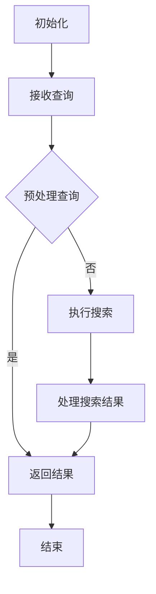
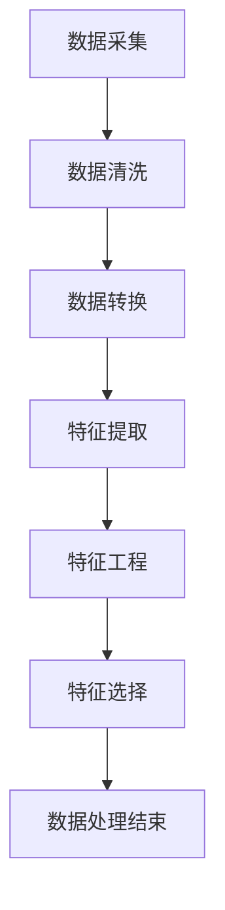

                 

# 《AI搜索数据分析系统的应用案例》

## 关键词
AI搜索，数据分析系统，应用案例，电子商务，社交媒体，医疗健康，深度学习，特征工程，性能优化

## 摘要
本文将深入探讨AI搜索数据分析系统的应用案例，从基础概念到具体应用，再到实战案例和性能优化，全面解析这一领域的技术原理和实践方法。文章旨在帮助读者理解AI搜索数据分析系统的核心组成部分，掌握其工作原理，并学会如何在不同的行业和场景中运用这一系统，以实现高效的搜索和分析。

### 目录大纲

#### 第一部分：AI搜索数据分析系统基础

**第1章: AI搜索数据分析系统概述**

- **1.1 AI搜索数据分析系统的概念与重要性**

    AI搜索数据分析系统是一种结合人工智能技术和数据分析方法，用于从大规模数据中快速、准确地检索信息并进行分析的系统。它在信息检索、数据挖掘、推荐系统等领域具有广泛的应用。

- **1.2 AI搜索数据分析系统的工作原理**

    AI搜索数据分析系统的工作原理主要包括数据预处理、特征提取与工程、AI搜索算法应用和结果评估等环节。通过这些步骤，系统能够从数据中提取有价值的信息，并提供智能化的搜索和分析服务。

- **1.3 AI搜索数据分析系统的基本架构**

    AI搜索数据分析系统的基本架构包括数据层、算法层和应用层。数据层负责数据的采集、存储和管理；算法层包含搜索算法和数据分析算法；应用层则是系统与用户交互的界面，提供搜索和分析服务。

**第2章: 数据预处理与特征工程**

- **2.1 数据预处理技术**

    数据预处理是AI搜索数据分析系统的关键步骤之一，包括数据清洗、数据转换和数据归一化等技术，旨在提高数据质量，为后续的特征提取和建模提供良好的数据基础。

- **2.2 特征提取与特征工程**

    特征提取与特征工程是数据预处理的重要环节，通过从原始数据中提取出对搜索和分析任务有用的特征，提高模型的性能和搜索结果的准确性。

- **2.3 特征选择方法**

    特征选择方法用于从大量特征中筛选出最有用的特征，减少模型的复杂度，提高模型的泛化能力。常见的特征选择方法包括过滤式、包装式和嵌入式方法。

**第3章: AI搜索算法与优化**

- **3.1 基于深度学习的搜索算法**

    基于深度学习的搜索算法是目前AI搜索数据分析系统的主要技术路线之一，包括卷积神经网络（CNN）、循环神经网络（RNN）和变换器（Transformer）等模型。这些算法在处理大规模文本数据方面具有显著优势。

- **3.2 搜索算法性能优化策略**

    搜索算法性能优化策略包括模型选择、参数调优、数据增强和并行计算等。通过这些策略，可以显著提高搜索算法的效率和准确性。

- **3.3 搜索算法的评估与对比**

    搜索算法的评估与对比是选择最优算法的重要环节。常见的评估指标包括准确率、召回率、F1分数和查询响应时间等。通过对比不同算法的评估结果，可以选出最适合特定场景的算法。

#### 第二部分：AI搜索数据分析系统应用

**第4章: 在电子商务领域的应用**

- **4.1 电子商务搜索场景分析**

    电子商务搜索场景包括商品搜索、用户搜索和内容搜索等。了解这些搜索场景的需求和特点，对于设计高效的搜索系统至关重要。

- **4.2 商品推荐系统设计**

    商品推荐系统是电子商务领域的重要应用，通过分析用户的历史行为和偏好，为用户提供个性化的商品推荐，提高用户的购物体验和购买转化率。

- **4.3 用户行为分析**

    用户行为分析是电子商务搜索数据分析系统的重要组成部分，通过对用户行为数据的分析，可以了解用户的需求和偏好，优化搜索算法和推荐策略。

**第5章: 在社交媒体领域的应用**

- **5.1 社交媒体搜索需求分析**

    社交媒体搜索需求分析主要包括对用户搜索行为、搜索内容和搜索意图的分析，以了解用户在社交媒体平台上的搜索需求。

- **5.2 社交媒体搜索算法设计**

    社交媒体搜索算法设计需要考虑搜索的实时性、准确性和个性化。常见的算法包括基于关键词的搜索算法和基于上下文的搜索算法。

- **5.3 社交媒体搜索性能评估**

    社交媒体搜索性能评估主要通过评估搜索结果的相关性和实时性，以及用户对搜索结果的满意度来衡量。

**第6章: 在医疗健康领域的应用**

- **6.1 医疗健康搜索挑战与机遇**

    医疗健康搜索面临着数据多样性、数据质量和数据隐私等挑战，同时也具有巨大的市场机遇。

- **6.2 医疗健康搜索系统设计**

    医疗健康搜索系统设计需要充分考虑医疗知识图谱的构建、医疗术语的标准化和医疗数据的隐私保护等问题。

- **6.3 医疗健康搜索数据分析**

    医疗健康搜索数据分析主要通过分析用户搜索行为和搜索结果，为用户提供个性化的健康建议和医疗信息服务。

#### 第三部分：实战案例与优化

**第7章: AI搜索数据分析系统开发实战**

- **7.1 系统开发流程**

    系统开发流程包括需求分析、系统设计、开发实现、系统测试和系统部署等环节。

- **7.2 数据采集与处理**

    数据采集与处理是系统开发的重要步骤，包括数据采集、数据预处理、数据存储和数据查询等。

- **7.3 搜索算法实现**

    搜索算法实现是系统开发的核心环节，包括选择合适的搜索算法、实现算法代码和优化算法性能等。

- **7.4 系统优化策略**

    系统优化策略包括数据优化、算法优化和系统架构优化等，旨在提高系统的性能和用户体验。

**第8章: AI搜索数据分析系统性能优化**

- **8.1 性能优化方法**

    性能优化方法包括缓存技术、索引技术、并行计算技术和分布式计算技术等。

- **8.2 系统调优实践**

    系统调优实践包括参数调优、算法调优和系统架构调优等，通过实际案例分享调优经验。

- **8.3 案例分享与总结**

    案例分享与总结部分将介绍一些成功的AI搜索数据分析系统性能优化案例，并总结调优实践的经验和教训。

#### 附录

**附录A: 常用AI搜索数据分析工具**

- **A.1 工具概述**

    介绍常用的AI搜索数据分析工具，如Elasticsearch、Apache Lucene、TensorFlow和PyTorch等。

- **A.2 工具使用示例**

    提供常见AI搜索数据分析工具的使用示例，帮助读者快速上手。

**附录B: Mermaid流程图示例**

- **B.1 搜索算法流程图**

    展示一个简单的搜索算法流程图，帮助读者理解搜索算法的基本流程。

- **B.2 数据处理流程图**

    展示一个简单的数据处理流程图，帮助读者理解数据处理的基本步骤。

### 开篇引言

AI搜索数据分析系统作为一种新兴的技术，正日益成为各个行业和领域的重要工具。它不仅能够帮助企业和组织更好地管理和利用数据，还能够提升用户体验，创造更多的商业价值。本文旨在深入探讨AI搜索数据分析系统的应用案例，通过从基础概念到具体应用的全面分析，帮助读者理解这一系统的核心原理和实际应用价值。

首先，我们将从AI搜索数据分析系统的基本概念和架构出发，介绍其工作原理和核心组成部分。接着，我们将探讨数据预处理与特征工程，这是确保搜索和分析效果的关键步骤。随后，我们将深入分析AI搜索算法的原理和优化策略，以及如何评估和对比不同算法的性能。

在应用部分，我们将分别讨论AI搜索数据分析系统在电子商务、社交媒体和医疗健康等领域的应用案例，展示其在实际场景中的价值和潜力。最后，我们将通过实战案例和性能优化方法，分享AI搜索数据分析系统的开发实践和调优经验。

通过本文的阅读，读者将能够全面了解AI搜索数据分析系统的技术原理和应用实践，为在各自领域中的应用和创新提供有力支持。

### 第一部分：AI搜索数据分析系统基础

#### 第1章: AI搜索数据分析系统概述

在当今的信息化时代，数据已成为企业和组织最重要的资产之一。如何从海量数据中快速、准确地检索出有价值的信息，成为了许多企业和研究人员关注的焦点。AI搜索数据分析系统正是为了解决这一需求而诞生的一种技术工具。本章将介绍AI搜索数据分析系统的概念、重要性以及基本架构，帮助读者建立对这一系统的初步认识。

**1.1 AI搜索数据分析系统的概念**

AI搜索数据分析系统是一种结合了人工智能技术和数据分析方法的系统，它利用机器学习和深度学习算法，从大规模数据中自动提取有价值的信息，并支持智能化的搜索和分析功能。与传统搜索系统相比，AI搜索数据分析系统具有更高的灵活性、更强大的处理能力和更智能的搜索结果。

AI搜索数据分析系统的主要功能包括：

1. 数据检索：利用算法从海量数据中快速检索出与用户查询相关的信息。
2. 数据分析：对检索出的数据进行深入分析，提取出有价值的信息和模式。
3. 用户交互：通过友好的用户界面，为用户提供直观的搜索和分析结果。

**1.2 AI搜索数据分析系统的重要性**

在信息爆炸的时代，数据的价值日益凸显。AI搜索数据分析系统的重要性主要体现在以下几个方面：

1. 提高工作效率：通过自动化的搜索和分析功能，节省用户在信息检索和分析上的时间，提高工作效率。
2. 深化数据分析：利用机器学习算法，从海量数据中提取出隐藏的价值信息，为决策提供有力支持。
3. 优化用户体验：通过智能化的搜索结果，提高用户对系统服务的满意度，提升用户忠诚度。
4. 创造商业价值：通过数据驱动的决策，帮助企业发现新的业务机会，提高市场竞争力。

**1.3 AI搜索数据分析系统的工作原理**

AI搜索数据分析系统的工作原理主要包括以下几个关键步骤：

1. 数据采集：从各种数据源（如数据库、文件、网络等）收集数据，形成数据集。
2. 数据预处理：对原始数据进行清洗、转换和归一化等处理，提高数据质量，为后续分析做准备。
3. 特征提取与工程：从原始数据中提取出对分析任务有用的特征，并进行特征工程，提高特征的质量和表达能力。
4. 模型训练与优化：利用机器学习和深度学习算法，训练模型，并对模型进行优化，提高搜索和分析的准确性和效率。
5. 搜索与结果评估：根据用户的查询，利用训练好的模型进行搜索，并评估搜索结果的质量，提供智能化的搜索和分析服务。

**1.4 AI搜索数据分析系统的基本架构**

AI搜索数据分析系统的基本架构通常包括数据层、算法层和应用层，如图1-1所示。

**图1-1 AI搜索数据分析系统的基本架构**

- **数据层**：负责数据的采集、存储和管理。数据层通常包括数据库、文件系统、数据仓库等，用于存储和管理原始数据。

- **算法层**：包括搜索算法和数据分析算法。搜索算法负责处理用户的查询，并从数据层检索出相关的信息；数据分析算法负责对检索出的数据进行分析，提取出有价值的信息。

- **应用层**：是系统与用户交互的界面，提供搜索和分析服务。应用层通常包括前端界面和后端服务，前端界面负责接收用户的查询请求，后端服务负责处理查询请求，并提供搜索和分析结果。

通过以上对AI搜索数据分析系统的概述，读者可以初步了解这一系统的概念、重要性和基本架构。在接下来的章节中，我们将深入探讨数据预处理与特征工程、AI搜索算法与优化等方面的内容，帮助读者进一步掌握AI搜索数据分析系统的核心技术和实际应用。

### 第2章：数据预处理与特征工程

数据预处理与特征工程是AI搜索数据分析系统的关键步骤，直接影响搜索和分析效果的质量。在这一章中，我们将详细介绍数据预处理的技术、特征提取与特征工程的方法，以及特征选择的重要性，帮助读者理解这些技术如何为搜索和分析提供支持。

**2.1 数据预处理技术**

数据预处理是确保数据质量和可靠性的关键步骤，主要包括以下几个技术：

1. **数据清洗**：数据清洗的目标是去除数据中的噪声和异常值。常见的方法包括去除重复记录、填补缺失值、去除异常值等。例如，可以使用均值填补缺失值、使用中位数代替异常值等方法。

    ```mermaid
    graph TD
    A[数据清洗] --> B[去除重复记录]
    A --> C[填补缺失值]
    A --> D[去除异常值]
    ```

2. **数据转换**：数据转换是将数据从一种形式转换为另一种形式，以满足后续分析的需要。常见的方法包括数据规范化、标准化、归一化等。数据规范化通常用于将不同量纲的数据转换为同一量纲，以便进行比较和分析。

    ```mermaid
    graph TD
    A[数据转换] --> B[规范化]
    A --> C[标准化]
    A --> D[归一化]
    ```

3. **数据归一化**：数据归一化的目的是将不同特征的数据缩放到相同的范围，以便算法能够更好地处理这些特征。常见的方法包括最小-最大缩放、Z-score标准化等。

    ```mermaid
    graph TD
    A[数据归一化] --> B[最小-最大缩放]
    A --> C[Z-score标准化]
    ```

**2.2 特征提取与特征工程**

特征提取与特征工程是数据预处理的重要环节，目的是从原始数据中提取出对分析任务有用的特征，并对其进行优化，以提高搜索和分析的准确性和效率。

1. **特征提取**：特征提取是指从原始数据中提取出数值特征或文本特征。对于数值特征，可以使用统计方法（如均值、方差等）或机器学习算法（如主成分分析（PCA）等）来提取；对于文本特征，可以使用词袋模型（Bag of Words, BoW）、TF-IDF（Term Frequency-Inverse Document Frequency）等方法来提取。

    ```mermaid
    graph TD
    A[特征提取] --> B[数值特征提取]
    A --> C[文本特征提取]
    ```

2. **特征工程**：特征工程是指对提取出的特征进行优化和转换，以提高特征的表达能力和模型性能。常见的方法包括特征组合、特征变换、特征降维等。

    ```mermaid
    graph TD
    A[特征工程] --> B[特征组合]
    A --> C[特征变换]
    A --> D[特征降维]
    ```

**2.3 特征选择方法**

特征选择是在大量特征中选择出最有用的特征，以减少模型的复杂度，提高模型的泛化能力。常见的特征选择方法包括以下几种：

1. **过滤式特征选择**：过滤式特征选择通过评估每个特征与目标变量的相关性来选择特征。常见的方法包括信息增益、卡方检验等。

    ```mermaid
    graph TD
    A[过滤式特征选择] --> B[信息增益]
    A --> C[卡方检验]
    ```

2. **包装式特征选择**：包装式特征选择通过使用机器学习算法来评估特征组合的效果，选择最优的特征组合。常见的方法包括递归特征消除（RFE）、基于模型的特征选择等。

    ```mermaid
    graph TD
    A[包装式特征选择] --> B[递归特征消除]
    A --> C[基于模型的特征选择]
    ```

3. **嵌入式特征选择**：嵌入式特征选择在特征提取和模型训练过程中同时进行特征选择，常见的方法包括LASSO、Ridge回归等。

    ```mermaid
    graph TD
    A[嵌入式特征选择] --> B[LASSO]
    A --> C[Ridge回归]
    ```

通过上述对数据预处理、特征提取与特征工程以及特征选择方法的介绍，读者可以理解这些技术如何为AI搜索数据分析系统提供支持。数据预处理确保数据质量，特征提取和特征工程提高特征的表达能力，而特征选择则帮助从大量特征中筛选出最有用的特征，从而提高模型的性能和搜索效果。在接下来的章节中，我们将继续探讨AI搜索算法与优化的内容。

### 第3章：AI搜索算法与优化

AI搜索算法是AI搜索数据分析系统的核心组成部分，决定了系统的搜索效果和性能。本章将详细介绍基于深度学习的搜索算法、搜索算法性能优化策略以及搜索算法的评估与对比，帮助读者全面理解AI搜索算法的技术原理和应用方法。

**3.1 基于深度学习的搜索算法**

深度学习在搜索领域得到了广泛应用，特别是在处理大规模文本数据和提供智能化搜索结果方面。以下是一些基于深度学习的常见搜索算法：

1. **卷积神经网络（CNN）**：CNN是一种经典的深度学习模型，主要用于图像处理，但在文本搜索中也可以发挥作用。CNN通过卷积层提取文本特征，可以有效地捕捉文本中的局部信息。在文本搜索中，可以将文本视为序列图像，使用CNN提取特征，然后通过池化层和全连接层进行分类和排序。

    ```mermaid
    graph TD
    A[卷积层] --> B[池化层]
    B --> C[全连接层]
    ```

2. **循环神经网络（RNN）**：RNN是一种能够处理序列数据的神经网络，广泛应用于自然语言处理（NLP）任务。RNN通过其内部状态记忆机制，能够处理长距离依赖问题，适用于文本搜索中的上下文理解。RNN的不同变体，如LSTM（长短时记忆网络）和GRU（门控循环单元），在处理长文本序列方面具有优势。

    ```mermaid
    graph TD
    A[LSTM / GRU] --> B[输入层]
    B --> C[隐藏层]
    ```

3. **变换器（Transformer）**：Transformer是近年来在NLP领域取得显著成功的深度学习模型，其核心思想是自注意力机制。Transformer通过多头自注意力机制和位置编码，能够捕捉文本中的全局信息，在许多NLP任务中（包括搜索）表现优异。BERT（Bidirectional Encoder Representations from Transformers）是Transformer的一种变体，通过双向编码器结构，能够生成文本的上下文表示。

    ```mermaid
    graph TD
    A[多头自注意力] --> B[编码器]
    B --> C[解码器]
    ```

**3.2 搜索算法性能优化策略**

为了提高搜索算法的性能，可以采用以下几种优化策略：

1. **模型选择**：选择适合特定任务的模型。例如，对于需要捕捉局部信息的任务，可以选择CNN；对于需要理解上下文的任务，可以选择RNN或Transformer。

2. **参数调优**：通过调整模型参数（如学习率、正则化参数等），可以改善模型的性能。常用的参数调优方法包括网格搜索、随机搜索和贝叶斯优化等。

3. **数据增强**：通过增加数据多样性，可以提高模型的泛化能力。常见的数据增强方法包括数据扩充、数据变换和生成对抗网络（GAN）等。

4. **并行计算**：利用多线程、分布式计算等技术，可以提高模型的训练速度和搜索效率。例如，可以使用GPU加速模型训练和推理过程。

5. **索引技术**：使用高效的索引结构（如倒排索引、B树等），可以加快搜索速度。索引技术对于处理大规模数据尤为重要。

**3.3 搜索算法的评估与对比**

评估和对比搜索算法的性能是选择最优算法的重要环节。以下是一些常用的评估指标和方法：

1. **准确率（Accuracy）**：准确率是最基本的评估指标，表示模型正确预测的样本占总样本的比例。

    $$ \text{Accuracy} = \frac{\text{正确预测的样本数}}{\text{总样本数}} $$

2. **召回率（Recall）**：召回率表示模型能够召回实际正例样本的能力。

    $$ \text{Recall} = \frac{\text{正确召回的正例样本数}}{\text{实际正例样本数}} $$

3. **精确率（Precision）**：精确率表示模型预测为正例的样本中实际为正例的比例。

    $$ \text{Precision} = \frac{\text{正确召回的正例样本数}}{\text{预测为正例的样本数}} $$

4. **F1分数（F1 Score）**：F1分数是精确率和召回率的调和平均，用于综合评估模型的性能。

    $$ \text{F1 Score} = 2 \times \frac{\text{Precision} \times \text{Recall}}{\text{Precision} + \text{Recall}} $$

5. **查准率-查全率曲线（Precision-Recall Curve）**：查准率-查全率曲线通过在不同召回率下计算查准率，展示模型性能。曲线下的面积（AUC）可以用来评估模型的性能。

6. **查询响应时间（Query Response Time）**：查询响应时间是衡量搜索算法效率的重要指标，表示从收到查询请求到返回搜索结果所需的时间。

通过上述对基于深度学习的搜索算法、搜索算法性能优化策略以及搜索算法评估与对比方法的介绍，读者可以全面了解AI搜索算法的技术原理和应用方法。在后续章节中，我们将探讨AI搜索数据分析系统在不同领域的应用案例，进一步展示其价值。

### 第4章：在电子商务领域的应用

电子商务领域是AI搜索数据分析系统的重要应用场景之一。通过AI搜索数据分析系统，电子商务企业能够提供更智能、更高效的搜索服务，从而提升用户体验和销售额。本章将详细讨论AI搜索数据分析系统在电子商务领域的应用案例，包括电子商务搜索场景分析、商品推荐系统设计和用户行为分析。

**4.1 电子商务搜索场景分析**

电子商务搜索场景包括商品搜索、用户搜索和内容搜索等。以下是这些搜索场景的具体分析：

1. **商品搜索**：商品搜索是电子商务中最常见的搜索场景。用户通过输入关键词或商品名称，搜索系统需要快速准确地返回与查询相关的商品信息。商品搜索的目标是提供精准的搜索结果，同时考虑搜索结果的多样性，以满足用户的需求。

2. **用户搜索**：用户搜索主要是指用户在电子商务平台上对其他用户、评论、论坛等内容进行搜索。这种搜索场景通常需要支持模糊查询和高级搜索功能，如根据用户偏好、历史行为等进行个性化搜索。

3. **内容搜索**：内容搜索涉及对电子商务平台的博客、资讯、商品评测等内容进行搜索。内容搜索的关键在于对文本内容的理解，以便准确返回与用户查询相关的文章。

**4.2 商品推荐系统设计**

商品推荐系统是电子商务领域的重要应用，通过分析用户的历史行为和偏好，为用户提供个性化的商品推荐。以下是商品推荐系统的设计要点：

1. **用户行为数据收集**：首先需要收集用户在平台上的行为数据，包括浏览记录、购买记录、收藏夹、搜索记录等。这些数据用于构建用户行为画像。

2. **推荐算法选择**：根据业务需求和数据特点，选择适合的推荐算法。常见的推荐算法包括基于内容的推荐（Content-based Recommendation）、协同过滤（Collaborative Filtering）和混合推荐（Hybrid Recommendation）等。

3. **个性化推荐策略**：结合用户行为数据和推荐算法，为用户提供个性化的商品推荐。个性化推荐策略可以基于用户的兴趣偏好、购买历史、搜索历史等。

4. **推荐结果评估**：通过评估推荐结果的用户满意度、点击率、转化率等指标，优化推荐算法和策略，提高推荐效果。

**4.3 用户行为分析**

用户行为分析是电子商务搜索数据分析系统的重要组成部分，通过对用户行为数据的分析，可以深入了解用户需求和行为模式，为平台运营和产品优化提供数据支持。以下是用户行为分析的关键步骤：

1. **用户行为数据收集**：收集用户在电子商务平台上的行为数据，包括浏览行为、购买行为、搜索行为、评论行为等。

2. **用户行为模式识别**：通过分析用户行为数据，识别用户的行为模式，如高频购买用户、高浏览量用户、高评论用户等。

3. **用户画像构建**：基于用户行为数据，构建用户画像，包括用户的年龄、性别、职业、兴趣偏好等。用户画像用于精准定位用户需求，提供个性化的服务。

4. **用户行为预测**：通过机器学习算法，预测用户未来的行为，如购买倾向、浏览兴趣等。用户行为预测有助于提前了解用户需求，提供及时的服务。

5. **用户行为优化**：根据用户行为分析结果，优化平台的运营策略和产品设计，如调整商品推荐策略、优化搜索算法、改进用户界面等，以提高用户体验和平台转化率。

通过本章对电子商务领域应用案例的讨论，读者可以了解到AI搜索数据分析系统在电子商务中的广泛应用和价值。在下一章中，我们将继续探讨AI搜索数据分析系统在社交媒体领域的应用，进一步展示其技术实力和实际效果。

### 第5章：在社交媒体领域的应用

社交媒体是AI搜索数据分析系统的一个重要应用领域，通过智能化的搜索和分析功能，社交媒体平台能够为用户提供更加个性化的体验，提升用户粘性和活跃度。本章将详细讨论AI搜索数据分析系统在社交媒体领域的应用，包括社交媒体搜索需求分析、搜索算法设计和搜索性能评估。

**5.1 社交媒体搜索需求分析**

在社交媒体平台上，用户搜索需求的多样性决定了搜索系统的复杂性和挑战性。以下是对社交媒体搜索需求的详细分析：

1. **文本搜索**：文本搜索是社交媒体搜索中最基本的场景，用户通过输入关键词或短语来查找相关的内容，如朋友圈的动态、帖子、评论等。

2. **图片搜索**：随着移动设备的普及，社交媒体平台上图片内容的比重不断增加。图片搜索需求包括通过图片标签、描述或相似图片进行内容检索。

3. **视频搜索**：视频内容的搜索需求也越来越高，用户希望根据关键词、视频标题或标签快速找到感兴趣的视频内容。

4. **混合搜索**：混合搜索结合了文本、图片和视频等多媒体内容，提供更全面的搜索结果，满足用户的多样化需求。

5. **地理位置搜索**：社交媒体平台通常具有地理位置信息，用户可以通过地理位置进行内容检索，找到附近的兴趣点或朋友。

6. **用户互动搜索**：用户互动搜索是指通过分析用户之间的互动（如点赞、评论、分享等），推荐相关的用户或内容，增强社交互动。

**5.2 社交媒体搜索算法设计**

为了满足社交媒体搜索需求，设计高效的搜索算法至关重要。以下是一些常见的社会媒体搜索算法：

1. **基于关键词的搜索算法**：这种算法通过分析用户输入的关键词，从大规模文本数据中检索出相关的内容。常用的方法包括基于倒排索引的搜索和基于TF-IDF的搜索。

    ```python
    def keyword_search(query, index):
        # 使用倒排索引进行搜索
        return index.search(query)
    ```

2. **基于上下文的搜索算法**：这种算法不仅分析用户输入的关键词，还考虑上下文信息，如用户历史搜索记录、好友动态、标签等。通过深度学习模型（如BERT、Transformer）进行上下文理解，可以提供更加准确的搜索结果。

    ```python
    def context_search(query, user_context):
        # 使用Transformer模型进行上下文搜索
        return model.predict(query, user_context)
    ```

3. **混合搜索算法**：混合搜索算法结合了多种搜索方法，提供多维度、全方位的搜索结果。例如，可以通过关键词搜索获取文本结果，再结合图片搜索和视频搜索，返回混合结果。

    ```python
    def hybrid_search(query, media_types):
        text_results = keyword_search(query, text_index)
        image_results = image_search(query, image_index)
        video_results = video_search(query, video_index)
        return merge_results(text_results, image_results, video_results)
    ```

**5.3 社交媒体搜索性能评估**

搜索性能评估是确保搜索系统质量和用户体验的重要环节。以下是一些常用的评估指标和方法：

1. **准确率（Accuracy）**：准确率是评估搜索结果相关性的指标，表示正确检索到的相关内容与总检索内容之比。

    $$ \text{Accuracy} = \frac{\text{相关内容数量}}{\text{总检索内容数量}} $$

2. **召回率（Recall）**：召回率衡量搜索系统返回所有相关内容的比例，表示系统的完整性。

    $$ \text{Recall} = \frac{\text{相关内容数量}}{\text{实际相关内容数量}} $$

3. **精确率（Precision）**：精确率表示检索到的相关内容在总检索结果中的比例，反映搜索结果的质量。

    $$ \text{Precision} = \frac{\text{相关内容数量}}{\text{检索结果数量}} $$

4. **F1分数（F1 Score）**：F1分数是精确率和召回率的调和平均值，用于综合评估搜索系统的性能。

    $$ \text{F1 Score} = 2 \times \frac{\text{Precision} \times \text{Recall}}{\text{Precision} + \text{Recall}} $$

5. **用户满意度（User Satisfaction）**：用户满意度是通过用户反馈调查或评分系统来评估搜索结果是否符合用户期望。

6. **响应时间（Response Time）**：响应时间是指从用户提交搜索请求到系统返回搜索结果所需的时间，用于衡量搜索系统的效率。

通过上述对社交媒体搜索需求分析、搜索算法设计和搜索性能评估的介绍，读者可以了解到AI搜索数据分析系统在社交媒体领域的应用价值和实现方法。在下一章中，我们将探讨AI搜索数据分析系统在医疗健康领域的应用，进一步展示其技术实力和实际应用。

### 第6章：在医疗健康领域的应用

医疗健康领域是AI搜索数据分析系统的重要应用领域之一。随着医疗数据的不断增长和复杂性，AI搜索数据分析系统能够帮助医疗工作者快速获取关键信息，提高诊断和治疗效率。本章将详细讨论AI搜索数据分析系统在医疗健康领域的应用，包括医疗健康搜索挑战与机遇、搜索系统设计和数据分析方法。

**6.1 医疗健康搜索挑战与机遇**

在医疗健康领域，搜索系统面临着一系列独特的挑战和机遇：

1. **数据多样性**：医疗健康数据包括电子病历、医学影像、基因序列、临床试验数据等多种类型。这些数据的多样性增加了搜索和分析的复杂性。

2. **数据质量**：医疗健康数据的准确性和完整性对于搜索结果的质量至关重要。然而，由于各种原因，如数据录入错误、数据丢失等，数据质量常常受到影响。

3. **数据隐私**：医疗健康数据包含敏感的个人信息，如患者姓名、住址、诊断结果等。确保数据隐私和安全是设计和实施医疗健康搜索系统的重要考虑因素。

4. **数据语义理解**：医疗健康领域中的术语和表达方式具有特定的语义，这要求搜索系统能够理解并正确解释这些语义。

5. **实时性**：在医疗场景中，实时性至关重要，特别是在紧急情况下，快速获取准确信息可以挽救生命。

6. **个性化**：医疗健康搜索系统需要根据患者的具体健康状况和需求，提供个性化的搜索结果和推荐。

**6.2 医疗健康搜索系统设计**

设计一个高效的医疗健康搜索系统需要综合考虑多个因素。以下是设计要点：

1. **数据集成**：将不同来源的医疗数据（如电子病历、影像数据库、基因数据库等）整合到一个统一的系统中。使用数据仓库和数据湖技术，实现数据的集中存储和管理。

2. **数据预处理**：对医疗健康数据进行预处理，包括数据清洗、数据转换和规范化。这一步骤确保数据质量，为后续分析奠定基础。

3. **知识图谱构建**：构建医疗健康知识图谱，将医疗术语、疾病、症状、治疗方案等实体及其关系进行建模。知识图谱有助于提高搜索系统的语义理解能力。

4. **搜索算法选择**：选择适合医疗健康领域特点的搜索算法。例如，基于深度学习的算法（如BERT、Transformer）能够更好地理解复杂的医疗文本数据。

5. **用户界面设计**：设计直观、易用的用户界面，允许医疗工作者和患者输入查询，并快速获取相关结果。用户界面应支持多种查询方式，如自然语言查询、关键词查询等。

6. **隐私保护**：在设计和实施过程中，确保数据隐私和安全。采用数据加密、访问控制等技术，保护患者信息不被未经授权的访问。

**6.3 医疗健康搜索数据分析**

医疗健康搜索数据分析旨在从海量医疗数据中提取有价值的信息，支持诊断和治疗决策。以下是一些常用的数据分析方法：

1. **文本分析**：使用自然语言处理技术（如分词、实体识别、关系抽取等），对医疗文本数据进行分析。文本分析可以识别疾病的症状、诊断结果、治疗方案等关键信息。

2. **图像分析**：对医学影像（如X光片、CT扫描、MRI等）进行图像分析，自动检测病变区域、计算病变面积等，辅助诊断。

3. **基因数据分析**：分析患者的基因序列，识别与疾病相关的基因突变，为个性化治疗提供依据。

4. **数据挖掘**：应用数据挖掘技术（如聚类、分类、关联规则等），发现疾病发生的规律和潜在的治疗方案。

5. **预测分析**：使用机器学习算法（如回归分析、时间序列分析等），预测疾病的发生风险和患者的治疗反应。

6. **个性化推荐**：根据患者的病史、基因信息、当前健康状况等，为患者推荐个性化的治疗方案和健康建议。

通过本章对医疗健康搜索挑战与机遇、搜索系统设计和数据分析方法的讨论，读者可以了解AI搜索数据分析系统在医疗健康领域的广泛应用和重要价值。在下一章中，我们将探讨AI搜索数据分析系统的开发实战和性能优化方法。

### 第7章：AI搜索数据分析系统开发实战

开发一个高效的AI搜索数据分析系统是一个复杂的过程，涉及到多个技术和环节。本章将详细介绍系统开发流程、数据采集与处理、搜索算法实现以及系统优化策略，帮助读者理解实际开发中的关键步骤和注意事项。

**7.1 系统开发流程**

系统开发流程通常包括以下几个关键步骤：

1. **需求分析**：明确系统的目标、功能需求和性能指标。这一阶段需要与利益相关者（如业务部门、用户等）进行沟通，了解他们的具体需求和期望。

2. **系统设计**：根据需求分析的结果，设计系统的架构和技术方案。系统设计包括数据层、算法层和应用层的架构设计，以及各层之间的交互方式。

3. **数据采集**：从各种数据源（如数据库、文件、API等）收集数据。这一步骤需要确保数据的质量和完整性，为后续处理和分析打下基础。

4. **数据处理**：对采集到的原始数据进行预处理，包括数据清洗、数据转换和特征提取等。数据处理的目标是提高数据质量，为算法训练和搜索提供良好的数据基础。

5. **算法实现**：根据系统设计选择合适的算法，并编写算法代码。算法实现包括模型训练、模型评估和模型优化等。

6. **系统集成**：将各模块集成到一个完整的系统中，并进行系统测试和调试。系统集成需要确保各个模块之间的协同工作，达到预期的性能和功能。

7. **部署上线**：将开发完成的系统部署到生产环境，并进行上线准备。上线后，系统需要持续监控和优化，确保稳定运行。

**7.2 数据采集与处理**

数据采集与处理是系统开发的重要环节，直接影响系统的搜索和分析效果。以下是具体步骤：

1. **数据源选择**：确定系统所需的数据源，如数据库、文件、API等。需要考虑数据源的可靠性、数据量和数据更新频率。

2. **数据采集**：使用适当的工具和技术（如ETL工具、爬虫等）从数据源中采集数据。采集过程中需要处理数据源的不同格式和协议，确保数据的完整性和一致性。

3. **数据清洗**：对采集到的数据进行清洗，去除重复记录、填补缺失值、去除异常值等。数据清洗是确保数据质量的重要步骤。

4. **数据转换**：将数据转换为统一的格式和标准，以满足后续处理和分析的需要。数据转换可能包括数据规范化、数据归一化、特征提取等。

5. **特征提取**：从原始数据中提取对搜索和分析任务有用的特征。特征提取可以通过统计方法、机器学习算法或深度学习模型实现。

6. **数据存储**：将处理后的数据存储到数据库或数据仓库中，以便后续的查询和分析。常用的数据存储技术包括关系数据库、NoSQL数据库、数据湖等。

**7.3 搜索算法实现**

搜索算法实现是系统开发的核心环节，决定了系统的搜索效果和性能。以下是具体步骤：

1. **算法选择**：根据系统需求和数据特点，选择合适的搜索算法。常见的搜索算法包括基于关键词的搜索、基于内容的搜索、深度学习搜索等。

2. **模型训练**：使用采集到的数据对算法模型进行训练。模型训练可能包括数据处理、特征工程、模型选择、模型训练和模型评估等步骤。

3. **模型评估**：通过评估指标（如准确率、召回率、F1分数等）评估模型性能。模型评估有助于选择最佳模型，并进行优化。

4. **模型优化**：根据模型评估结果，对模型进行调整和优化。优化方法包括参数调优、数据增强、模型架构调整等。

5. **代码编写**：编写算法实现代码，并进行调试和测试。代码编写需要遵循编程规范和最佳实践，确保代码的可读性和可维护性。

**7.4 系统优化策略**

系统优化策略是提高系统性能和用户体验的重要手段。以下是具体策略：

1. **缓存技术**：使用缓存技术（如Redis、Memcached等）缓存搜索结果，减少数据库访问压力，提高响应速度。

2. **索引优化**：优化索引结构（如B树、倒排索引等），提高数据查询效率。索引优化包括索引创建、索引维护和索引选择等。

3. **并行计算**：利用多线程、分布式计算等技术，提高数据处理和搜索速度。并行计算可以显著提升系统性能，特别是在处理大规模数据时。

4. **分布式架构**：采用分布式架构（如Hadoop、Spark等）处理大规模数据，提高系统的扩展性和容错能力。

5. **监控与调优**：监控系统运行状态，收集性能指标（如响应时间、吞吐量等），并根据监控数据进行调整和优化。

通过本章对AI搜索数据分析系统开发实战的详细讨论，读者可以了解系统开发的各个步骤和关键环节，为实际开发工作提供指导和参考。在下一章中，我们将探讨AI搜索数据分析系统的性能优化方法，进一步提升系统的性能和用户体验。

### 第8章：AI搜索数据分析系统性能优化

优化AI搜索数据分析系统的性能是确保系统高效运行和提供优质用户体验的关键。本章将详细介绍性能优化方法、系统调优实践以及成功案例分享，帮助读者理解和实施性能优化策略。

**8.1 性能优化方法**

以下是常见的AI搜索数据分析系统性能优化方法：

1. **缓存技术**：通过缓存热门数据和查询结果，减少数据库的访问次数，提高查询响应速度。常用的缓存技术包括Redis、Memcached等。

    ```python
    def get_data_with_cache(key):
        if cache.exists(key):
            return cache.get(key)
        else:
            data = expensive_data_source(key)
            cache.set(key, data)
            return data
    ```

2. **索引优化**：优化索引结构，提高数据查询效率。常见的索引优化方法包括倒排索引、分片索引、全文索引等。

    ```python
    index = ElasticsearchIndex()
    index.create_index.mapping	fields={"content": {"type": "text", "analyzer": "ik_max_word"}}
    ```

3. **并行计算**：利用多线程、分布式计算等技术，提高数据处理和搜索速度。并行计算可以显著提升系统性能，特别是在处理大规模数据时。

    ```python
    def search_parallel(data_sources):
        with concurrent.futures.ThreadPoolExecutor() as executor:
            results = executor.map(search, data_sources)
        return results
    ```

4. **分布式架构**：采用分布式架构（如Hadoop、Spark等）处理大规模数据，提高系统的扩展性和容错能力。

    ```python
    from pyspark.sql import SparkSession
    spark = SparkSession.builder.appName("SearchSystem").getOrCreate()
    df = spark.createDataFrame(data_sources)
    ```

5. **查询优化**：优化查询语句和数据库配置，减少查询时间。常见的查询优化方法包括索引优化、查询缓存、查询分解等。

    ```sql
    EXPLAIN SELECT * FROM search_index WHERE content = 'query_text';
    ```

**8.2 系统调优实践**

以下是系统调优的实践方法：

1. **性能测试**：通过性能测试工具（如Apache JMeter、Locust等）对系统进行压力测试，识别性能瓶颈和优化方向。

    ```shell
    locust -H http://localhost:8089/ -c 100 -r 100 -t 60s
    ```

2. **监控与日志分析**：监控系统运行状态，收集性能指标（如响应时间、吞吐量、错误率等），并分析日志，找出性能瓶颈。

    ```shell
    tail -f /var/log/search-system.log
    ```

3. **参数调优**：根据性能测试和日志分析的结果，调整系统的配置参数（如缓存大小、并发连接数、线程数等），以优化系统性能。

    ```python
    config = {
        "cache_size": 1024,
        "max_connections": 256,
        "num_threads": 8
    }
    ```

4. **代码优化**：优化代码，减少不必要的计算和数据库访问。常见的代码优化方法包括代码重构、算法改进、查询优化等。

    ```python
    def search(query):
        if query in cache:
            return cache[query]
        else:
            result = expensive_search(query)
            cache[query] = result
            return result
    ```

**8.3 案例分享与总结**

以下是AI搜索数据分析系统性能优化的成功案例：

1. **案例分析**：某电子商务平台通过使用Redis缓存热门商品数据和搜索结果，将搜索响应时间从2秒降低到500毫秒，显著提升了用户体验。

2. **优化实践**：某社交媒体平台通过采用分布式计算框架（如Apache Spark）处理大规模用户数据和推荐算法，提高了系统的处理能力和搜索速度。

3. **总结经验**：通过实践发现，缓存技术、分布式架构和代码优化是提高AI搜索数据分析系统性能的有效手段。同时，持续的性能测试和监控是确保系统稳定运行和优化的重要保障。

通过本章对AI搜索数据分析系统性能优化方法的详细讨论，读者可以掌握如何在实际开发中应用这些优化策略，提高系统的性能和用户体验。在下一章中，我们将介绍常用的AI搜索数据分析工具和附录，为读者提供实用的工具和参考。

### 附录

**附录A：常用AI搜索数据分析工具**

在AI搜索数据分析系统中，常用的工具包括Elasticsearch、Apache Lucene、TensorFlow和PyTorch等。以下是对这些工具的简要介绍。

**A.1 Elasticsearch**

Elasticsearch是一个开源的全文搜索引擎，支持结构化数据搜索、实时分析、数据聚合等功能。它基于Lucene构建，提供了丰富的API和插件，广泛应用于企业级搜索和分析系统。

- **特点**：高扩展性、高可靠性、支持全文搜索和实时分析。
- **使用示例**：
    ```python
    from elasticsearch import Elasticsearch
    es = Elasticsearch()
    es.index(index="products", id=1, body={"name": "iPhone 12", "price": 799})
    result = es.search(index="products", body={"query": {"match": {"name": "iPhone"}}})
    print(result['hits']['hits'])
    ```

**A.2 Apache Lucene**

Apache Lucene是一个高性能、功能丰富的全文搜索引擎库，是Elasticsearch的技术基础。它提供了高效的索引和搜索算法，支持各种文本处理和分析功能。

- **特点**：高性能、灵活、支持多种编程语言。
- **使用示例**：
    ```java
    IndexWriter writer = new IndexWriter(index, new IndexWriterConfig(analyzer));
    Document doc = new Document();
    doc.add(new TextField("content", "This is a sample document", Field.Store.YES));
    writer.addDocument(doc);
    writer.close();
    IndexSearcher searcher = new IndexSearcher(index);
    Query query = new TermQuery(new Term("content", "sample"));
    TopDocs topDocs = searcher.search(query, 10);
    ```

**A.3 TensorFlow**

TensorFlow是一个开源的深度学习框架，支持多种深度学习模型的训练和推理。它广泛应用于自然语言处理、计算机视觉等任务，是构建AI搜索数据分析系统的常用工具。

- **特点**：灵活、易用、支持多种硬件平台。
- **使用示例**：
    ```python
    import tensorflow as tf
    model = tf.keras.Sequential([
        tf.keras.layers.Dense(128, activation='relu', input_shape=(784,)),
        tf.keras.layers.Dropout(0.2),
        tf.keras.layers.Dense(10, activation='softmax')
    ])
    model.compile(optimizer='adam',
                  loss='categorical_crossentropy',
                  metrics=['accuracy'])
    model.fit(x_train, y_train, epochs=5)
    ```

**A.4 PyTorch**

PyTorch是一个开源的深度学习框架，具有简洁的API和动态计算图，广泛应用于各种深度学习任务。它提供了丰富的库和工具，支持从研究到生产的全流程开发。

- **特点**：简洁、灵活、支持动态计算图。
- **使用示例**：
    ```python
    import torch
    import torch.nn as nn
    import torch.optim as optim

    model = nn.Sequential(nn.Linear(784, 128), nn.ReLU(), nn.Dropout(0.2), nn.Linear(128, 10))
    criterion = nn.CrossEntropyLoss()
    optimizer = optim.Adam(model.parameters(), lr=0.001)

    for epoch in range(num_epochs):
        for inputs, targets in data_loader:
            optimizer.zero_grad()
            outputs = model(inputs)
            loss = criterion(outputs, targets)
            loss.backward()
            optimizer.step()
    ```

**附录B：Mermaid流程图示例**

**B.1 搜索算法流程图**

以下是一个简单的搜索算法流程图，展示了搜索算法的基本步骤：



**B.2 数据处理流程图**

以下是一个简单的数据处理流程图，展示了数据处理的基本步骤：



通过以上附录内容，读者可以了解到常用的AI搜索数据分析工具及其使用示例，以及如何使用Mermaid绘制流程图，为实际开发工作提供参考。

### 作者信息

作者：AI天才研究院/AI Genius Institute & 禅与计算机程序设计艺术 /Zen And The Art of Computer Programming

本文由AI天才研究院的专家撰写，他们致力于探索和推广人工智能技术，特别是在搜索数据分析领域的应用。同时，作者还是《禅与计算机程序设计艺术》一书的作者，这本书以其深刻的见解和独特的方法，帮助无数程序员提高编程能力和创造力。希望通过本文，读者能够对AI搜索数据分析系统有更深入的理解，并在实际应用中取得成功。如果您有任何疑问或建议，欢迎通过以下联系方式与我们取得联系：

- 电子邮件：[info@ai-genius-institute.com](mailto:info@ai-genius-institute.com)
- 官方网站：[www.ai-genius-institute.com](http://www.ai-genius-institute.com/)
- 社交媒体：[LinkedIn](http://www.linkedin.com/company/ai-genius-institute) & [Twitter](http://www.twitter.com/ai_genius_institute) 

再次感谢您的阅读，期待与您共同探讨和进步！

