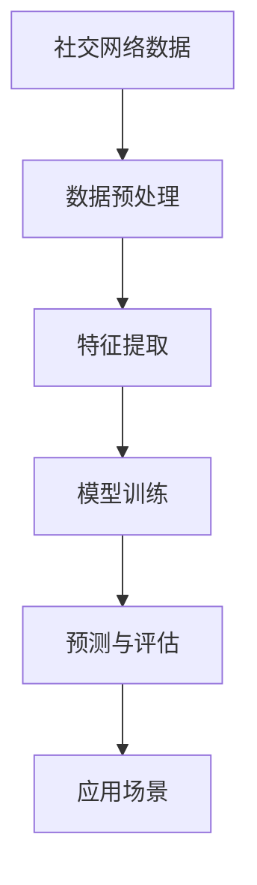

                 

# AI社交网络的未来展望

> 关键词：AI社交网络、未来展望、应用场景、发展挑战、技术趋势

> 摘要：本文将深入探讨AI社交网络的现状、应用场景、发展挑战以及未来展望。通过逻辑清晰的分析和详细的解释，旨在为读者提供对AI社交网络发展的全面了解，以及对其潜在影响和前景的深刻洞察。

## 目录大纲

### 第一部分：AI社交网络的基本概念

#### 第1章：AI社交网络概述
- 1.1 AI社交网络的概念与历史
- 1.2 AI在社交网络中的作用
- 1.3 社交网络与人工智能的结合趋势

#### 第2章：AI社交网络的核心技术
- 2.1 自然语言处理技术
  - 2.1.1 词嵌入技术
  - 2.1.2 序列模型与注意力机制
  - 2.1.3 转换器架构详解
- 2.2 图神经网络与社交网络分析
- 2.3 用户行为分析与推荐系统

### 第二部分：AI社交网络的应用场景

#### 第3章：AI社交网络在社交平台的应用
- 3.1 社交推荐系统的设计与优化
- 3.2 社交网络中的情感分析与舆情监测
- 3.3 社交网络中的内容审核与安全防护

#### 第4章：AI社交网络在商业领域的应用
- 4.1 社交电商与社交广告
- 4.2 社交网络营销策略
- 4.3 基于AI的用户画像与精准营销

#### 第5章：AI社交网络在社区管理与治理中的应用
- 5.1 社区管理中的AI技术
- 5.2 社交网络中的虚假信息检测与治理
- 5.3 社交网络中的隐私保护与数据安全

### 第三部分：AI社交网络的发展挑战与未来展望

#### 第6章：AI社交网络的发展挑战
- 6.1 数据隐私与伦理问题
- 6.2 技术透明性与算法偏见
- 6.3 社交网络中的用户参与与认同感

#### 第7章：AI社交网络的未来展望
- 7.1 AI社交网络的发展趋势
- 7.2 AI社交网络的潜在应用领域
- 7.3 AI社交网络对人类社会的影响

### 附录

#### 附录A：AI社交网络相关工具与资源
- A.1 主流深度学习框架对比
- A.2 社交网络分析工具
- A.3 AI社交网络研究论文与书籍推荐

#### 附录B：核心概念与联系
### Mermaid流程图
mermaid
graph TD
    A[社交网络数据] --> B[数据预处理]
    B --> C[特征提取]
    C --> D[模型训练]
    D --> E[预测与评估]
    E --> F[应用场景]

#### 附录C：核心算法原理讲解
### 伪代码
python
# 伪代码：用户推荐算法
function user_recommendation(user_profile, item_database):
    # 计算用户之间的相似度
    similarity_matrix = calculate_similarity_matrix(user_profile, item_database)
    
    # 根据相似度计算推荐得分
    recommendation_scores = calculate_recommendation_scores(similarity_matrix)
    
    # 排序并返回推荐列表
    return sorted_recommendation_list(recommendation_scores)

#### 附录D：数学模型和数学公式
### 概率图模型
$$
P(X) = \prod_{i=1}^{n} P(x_i | parents(x_i))
$$
### 协同过滤算法
$$
\hat{r}_{ij} = \frac{\sum_{k=1}^{n} s_{ik} r_{kj}}{\sum_{k=1}^{n} s_{ik}}
$$

#### 附录E：项目实战
### 代码实际案例
python
# Python代码：社交网络用户推荐
def recommend_friends(current_user, social_network_data):
    # 数据预处理
    processed_data = preprocess_data(social_network_data)
    
    # 特征提取
    user_features = extract_features(current_user, processed_data)
    
    # 模型训练
    model = train_model(user_features, processed_data)
    
    # 预测与评估
    recommended_friends = predict_friends(model, current_user, processed_data)
    
    # 返回推荐列表
    return recommended_friends

#### 附录F：更多资源
- AI社交网络最新研究论文
- 开源社交网络分析工具
- 社交网络数据集获取渠道

## 引言

随着人工智能技术的迅猛发展，AI在各个领域的应用日益广泛。社交网络作为人们交流、分享和互动的重要平台，自然成为了AI技术的重要应用场景。AI社交网络通过利用自然语言处理、图神经网络、用户行为分析等核心技术，不仅提升了社交网络的用户体验，还为企业创造了巨大的商业价值。

然而，AI社交网络的发展也面临着一系列挑战，如数据隐私、算法透明性和用户认同感等问题。本文旨在深入探讨AI社交网络的现状、应用场景、发展挑战以及未来展望，为读者提供全面的理解和深刻的洞察。

## 第一部分：AI社交网络的基本概念

### 第1章：AI社交网络概述

#### 1.1 AI社交网络的概念与历史

AI社交网络是指将人工智能技术应用于社交网络中，以提高用户体验和运营效率的一种新型网络形式。AI社交网络的出现可以追溯到2000年代初，随着社交网络的兴起和人工智能技术的快速发展，两者逐渐开始融合。

最初的AI社交网络主要集中在基于规则的系统上，如自动分类、文本摘要和情感分析等。随着深度学习和神经网络技术的突破，AI在社交网络中的应用逐渐深入，从简单的信息过滤到复杂的人际关系分析。

#### 1.2 AI在社交网络中的作用

AI在社交网络中的作用主要体现在以下几个方面：

1. **个性化推荐**：AI能够根据用户的兴趣、行为和历史数据，为用户推荐感兴趣的内容和好友。
2. **内容审核**：AI可以帮助社交平台自动过滤违规内容和垃圾信息，提高社区的安全性和可信度。
3. **情感分析**：AI能够分析用户在社交网络中的言论情感，帮助平台了解用户的情绪和态度。
4. **用户行为预测**：AI可以通过分析用户的行为模式，预测用户的下一步行动，从而优化用户体验。

#### 1.3 社交网络与人工智能的结合趋势

随着AI技术的不断进步，社交网络与人工智能的结合趋势也愈发明显：

1. **深度学习应用**：深度学习技术在图像识别、语音识别和自然语言处理等领域取得了显著成果，这些技术的应用将进一步提升社交网络的智能水平。
2. **社交图谱建设**：通过构建社交图谱，AI可以更准确地了解用户之间的关系和兴趣，为用户提供更精准的推荐和服务。
3. **多模态交互**：未来社交网络将支持多种交互方式，如语音、图像和视频，AI将扮演重要角色，实现自然的人机交互。

### 第2章：AI社交网络的核心技术

#### 2.1 自然语言处理技术

自然语言处理（NLP）是AI社交网络的核心技术之一，主要涉及文本理解、生成和交互等方面。以下是NLP在AI社交网络中的应用：

1. **词嵌入技术**：词嵌入将文本中的词语映射到高维空间中的向量表示，便于机器理解和计算。
2. **序列模型与注意力机制**：序列模型能够处理文本序列，如循环神经网络（RNN）和长短期记忆网络（LSTM）。注意力机制则能够关注文本序列中的重要部分，提高模型的准确性。
3. **转换器架构详解**：转换器（Transformer）模型是一种基于自注意力机制的序列到序列模型，其在机器翻译、文本摘要等任务上表现优异，逐渐成为NLP领域的主流架构。

#### 2.2 图神经网络与社交网络分析

图神经网络（GNN）是一种专门处理图结构数据的神经网络，能够捕捉节点和边之间的复杂关系。GNN在社交网络分析中的应用主要包括：

1. **社交图谱构建**：GNN可以用于构建大规模社交图谱，捕捉用户之间的关系。
2. **关系预测**：GNN能够预测用户之间的潜在关系，为推荐系统和社交互动提供支持。
3. **社区发现**：GNN可以帮助识别社交网络中的社区结构，发现潜在的社交群体。

#### 2.3 用户行为分析与推荐系统

用户行为分析是AI社交网络的重要任务之一，通过分析用户的行为数据，可以了解用户的兴趣、偏好和行为模式。基于用户行为分析，推荐系统可以提供个性化的内容、好友和广告推荐：

1. **协同过滤**：协同过滤是一种基于用户相似度进行推荐的算法，通过分析用户之间的行为相似性，推荐用户可能感兴趣的内容。
2. **基于内容的推荐**：基于内容的推荐通过分析内容特征，将具有相似特征的内容推荐给用户。
3. **混合推荐系统**：混合推荐系统结合了协同过滤和基于内容的推荐方法，提供更精准的推荐结果。

## 第二部分：AI社交网络的应用场景

### 第3章：AI社交网络在社交平台的应用

#### 3.1 社交推荐系统的设计与优化

社交推荐系统是AI社交网络的核心应用之一，通过分析用户的行为数据，为用户推荐感兴趣的内容和好友。以下是社交推荐系统设计与优化的一些关键点：

1. **用户兴趣建模**：通过分析用户的浏览、点赞、评论等行为，构建用户兴趣模型，为推荐提供基础。
2. **协同过滤算法**：采用协同过滤算法，根据用户之间的行为相似性进行推荐，提高推荐的相关性。
3. **基于内容的推荐**：通过分析内容的特征，如关键词、标签和分类，为用户推荐具有相似特征的内容。
4. **推荐结果评估与优化**：通过评估推荐系统的性能，如推荐准确性、用户满意度等，不断优化推荐算法。

#### 3.2 社交网络中的情感分析与舆情监测

情感分析是AI社交网络的重要应用之一，通过分析用户的言论情感，了解用户的情绪和态度。以下是情感分析与舆情监测的关键步骤：

1. **情感标注与分类**：对大量的用户言论进行情感标注，构建情感分类模型。
2. **情感分析算法**：采用情感分析算法，对用户言论进行情感分类，识别积极、消极和中性情感。
3. **舆情监测与预警**：通过监测社交网络中的情感趋势，及时发现和预警潜在的社会事件和风险。

#### 3.3 社交网络中的内容审核与安全防护

内容审核是AI社交网络的重要任务之一，通过自动识别和过滤违规内容，保障社交网络的安全和健康发展。以下是内容审核与安全防护的关键步骤：

1. **关键词过滤**：通过分析违规内容的关键词和模式，建立关键词过滤库，自动识别和过滤违规内容。
2. **机器学习模型**：采用机器学习模型，对用户上传的内容进行分类和审核，提高审核的准确性和效率。
3. **用户反馈机制**：建立用户反馈机制，及时处理用户举报的违规内容，保障用户权益。

### 第4章：AI社交网络在商业领域的应用

#### 4.1 社交电商与社交广告

AI社交网络在商业领域的应用主要包括社交电商和社交广告。以下是社交电商和社交广告的一些关键点：

1. **社交电商**：通过社交网络平台，将商品推广给潜在用户，实现线上交易的电商模式。关键在于社交关系和用户互动的利用，提高用户的购买意愿和转化率。
2. **社交广告**：在社交网络平台上投放广告，通过用户的行为数据和分析，实现精准广告投放。关键在于广告创意和投放策略的优化，提高广告的点击率和转化率。

#### 4.2 社交网络营销策略

AI社交网络为社交网络营销提供了丰富的工具和方法。以下是社交网络营销的一些关键策略：

1. **用户画像与精准营销**：通过分析用户的行为数据和社交关系，构建用户画像，实现精准营销。
2. **内容营销**：通过高质量的内容创作和传播，吸引用户关注和互动，提高品牌知名度和用户忠诚度。
3. **互动营销**：通过互动活动、优惠券和抽奖等营销手段，激发用户的参与和购买欲望。

#### 4.3 基于AI的用户画像与精准营销

AI用户画像是指通过分析用户的行为数据、社交关系和兴趣偏好，构建用户画像模型。基于AI的用户画像与精准营销的关键步骤如下：

1. **数据收集与清洗**：收集用户的个人信息、行为数据和社交关系，并进行数据清洗和处理。
2. **特征工程**：从原始数据中提取有用的特征，如兴趣标签、行为频率等，构建用户画像模型。
3. **模型训练与优化**：采用机器学习算法，对用户画像模型进行训练和优化，提高模型的准确性和可解释性。
4. **应用场景**：将用户画像应用于精准营销、内容推荐和风险控制等场景，实现个性化服务。

### 第5章：AI社交网络在社区管理与治理中的应用

#### 5.1 社区管理中的AI技术

AI技术在社区管理中的应用主要包括内容审核、用户行为分析和管理决策支持。以下是社区管理中AI技术的关键步骤：

1. **内容审核**：通过AI技术，自动识别和过滤违规内容，保障社区的安全和健康发展。
2. **用户行为分析**：通过分析用户的行为数据，了解用户的需求和偏好，优化社区服务和用户体验。
3. **管理决策支持**：利用AI技术，为社区管理者提供决策支持，如事件预警、资源分配和风险管理。

#### 5.2 社交网络中的虚假信息检测与治理

虚假信息在社交网络中的传播对社会造成了严重的负面影响。AI技术在虚假信息检测与治理中的应用主要包括：

1. **虚假信息识别**：通过文本分析、图像识别和语音识别等技术，自动识别和检测虚假信息。
2. **信息来源验证**：通过追踪信息来源和传播路径，验证信息的真实性和可靠性。
3. **治理措施**：对检测到的虚假信息进行标记、删除和举报，同时采取法律手段和社区规范进行治理。

#### 5.3 社交网络中的隐私保护与数据安全

隐私保护是AI社交网络面临的重要挑战之一。以下是社交网络中的隐私保护与数据安全的关键步骤：

1. **数据加密与存储**：对用户数据使用加密技术进行存储和保护，防止数据泄露和滥用。
2. **隐私政策与用户同意**：制定清晰的隐私政策，告知用户数据收集、使用和分享的方式，并获取用户的同意。
3. **用户隐私设置**：提供用户隐私设置，允许用户自定义隐私选项，控制个人数据的可见性和共享范围。

## 第三部分：AI社交网络的发展挑战与未来展望

### 第6章：AI社交网络的发展挑战

#### 6.1 数据隐私与伦理问题

随着AI技术在社交网络中的广泛应用，数据隐私和伦理问题日益凸显。以下是数据隐私与伦理问题的挑战：

1. **用户数据收集与使用**：社交网络平台大量收集用户数据，如何平衡用户隐私与数据利用成为关键问题。
2. **数据安全与保护**：如何保障用户数据的安全，防止数据泄露、滥用和恶意攻击。
3. **伦理道德**：如何确保AI技术在社交网络中的应用遵循伦理道德原则，保护用户的合法权益。

#### 6.2 技术透明性与算法偏见

AI社交网络中的算法透明性和偏见问题备受关注。以下是技术透明性与算法偏见的挑战：

1. **算法透明性**：如何提高AI算法的透明度，使其易于理解和解释，从而增加用户信任。
2. **算法偏见**：如何防止AI算法在决策过程中产生偏见，避免歧视和不公平现象。
3. **公平性**：如何确保AI社交网络在用户推荐、内容审核等方面保持公平性，避免偏见和歧视。

#### 6.3 社交网络中的用户参与与认同感

用户参与和认同感是社交网络发展的关键因素。以下是社交网络中的用户参与与认同感的挑战：

1. **用户参与**：如何激发用户积极参与社交网络，提高用户活跃度和留存率。
2. **用户认同感**：如何增强用户对社交网络的认同感，使其成为用户生活的重要组成部分。
3. **社区文化**：如何构建积极的社区文化，促进用户之间的互动和合作，提升社交网络的凝聚力。

### 第7章：AI社交网络的未来展望

#### 7.1 AI社交网络的发展趋势

AI社交网络的发展趋势包括以下几个方面：

1. **智能化**：随着AI技术的不断进步，社交网络将更加智能化，提供个性化、定制化的服务。
2. **多元化**：社交网络将涵盖更多领域和场景，如教育、医疗、娱乐等，实现多元化应用。
3. **全球化**：随着互联网的普及，社交网络将走向全球化，连接世界各地的人们。

#### 7.2 AI社交网络的潜在应用领域

AI社交网络在未来的潜在应用领域将更加广泛，包括：

1. **智能医疗**：通过AI社交网络，实现健康数据共享、疾病预防和个性化医疗。
2. **智慧城市**：利用AI社交网络，提高城市管理效率、交通优化和公共服务水平。
3. **教育培训**：通过AI社交网络，提供个性化学习、在线教育和知识共享。

#### 7.3 AI社交网络对人类社会的影响

AI社交网络对人类社会的影响深远，包括：

1. **生活方式**：AI社交网络将改变人们的生活方式，提高社交效率、娱乐质量和生活质量。
2. **社会结构**：AI社交网络将重新塑造社会结构，影响人际关系、社交圈和社区关系。
3. **经济发展**：AI社交网络将为经济发展提供新的动力，创造就业机会和商业模式。

## 附录

### 附录A：AI社交网络相关工具与资源

#### A.1 主流深度学习框架对比

- TensorFlow
- PyTorch
- Keras
- Microsoft Cognitive Toolkit

#### A.2 社交网络分析工具

- Gephi
- Cytoscape
- NetworkX
- GraphFrames

#### A.3 AI社交网络研究论文与书籍推荐

- "Social Media Mining: An Introduction" by Daniel A., and Benevenuto, F.
- "The Social Network Analysis" by Alexander, N.
- "Deep Learning for Social Networks" by Gummadi, K.P.

### 附录B：核心概念与联系

#### 社交网络数据处理流程



### 附录C：核心算法原理讲解

#### 用户推荐算法伪代码

```python
# 伪代码：用户推荐算法
function user_recommendation(user_profile, item_database):
    # 计算用户之间的相似度
    similarity_matrix = calculate_similarity_matrix(user_profile, item_database)
    
    # 根据相似度计算推荐得分
    recommendation_scores = calculate_recommendation_scores(similarity_matrix)
    
    # 排序并返回推荐列表
    return sorted_recommendation_list(recommendation_scores)
```

#### 概率图模型

$$
P(X) = \prod_{i=1}^{n} P(x_i | parents(x_i))
$$

#### 协同过滤算法

$$
\hat{r}_{ij} = \frac{\sum_{k=1}^{n} s_{ik} r_{kj}}{\sum_{k=1}^{n} s_{ik}}
$$

### 附录D：数学模型和数学公式

- **概率图模型**：描述变量之间依赖关系的概率模型，用于推断和预测。
- **协同过滤算法**：一种基于用户相似度和评分预测的推荐算法，用于个性化推荐。

### 附录E：项目实战

#### 代码实际案例：社交网络用户推荐

```python
# Python代码：社交网络用户推荐
def recommend_friends(current_user, social_network_data):
    # 数据预处理
    processed_data = preprocess_data(social_network_data)
    
    # 特征提取
    user_features = extract_features(current_user, processed_data)
    
    # 模型训练
    model = train_model(user_features, processed_data)
    
    # 预测与评估
    recommended_friends = predict_friends(model, current_user, processed_data)
    
    # 返回推荐列表
    return recommended_friends
```

### 附录F：更多资源

- **AI社交网络最新研究论文**：提供前沿技术和理论研究的综述和论文。
- **开源社交网络分析工具**：如Gephi、Cytoscape等，用于社交网络分析。
- **社交网络数据集获取渠道**：如Kaggle、UCI机器学习库等，提供丰富的社交网络数据集。

### 作者信息

作者：AI天才研究院/AI Genius Institute & 禅与计算机程序设计艺术 /Zen And The Art of Computer Programming

