                 

## 《AI编程语言的人因工程学》

### 关键词：人因工程学、AI编程语言、用户体验、认知心理学、设计方法、案例分析

#### 摘要：
本文深入探讨了人因工程学在AI编程语言设计中的应用。通过分析人因工程学的基础理论，如用户行为分析、认知心理学原理，本文阐述了如何将这些原理应用到AI编程语言的设计过程中，以提高编程语言的用户体验和易用性。文章分为三个部分，首先介绍了人因工程学的基础，接着详细讨论了AI编程语言的设计方法和面向特定人群的编程语言设计，最后通过案例研究和项目实战展示了这些理论的实际应用。本文旨在为AI编程语言设计者提供实用的指导，以打造更加人性化和高效的编程工具。

----------------------------------------------------------------

## 《AI编程语言的人因工程学》目录大纲

### 第一部分：人因工程学基础

#### 第1章：人因工程学概述
- **1.1 人因工程学的定义与发展**
- **1.2 人因工程学在AI编程中的应用**
- **1.3 人因工程学的研究方法和工具**

#### 第2章：用户行为分析
- **2.1 用户行为模型**
- **2.2 用户界面设计原则**
- **2.3 用户体验评价方法**

#### 第3章：认知心理学基础
- **3.1 认知心理学原理**
- **3.2 信息处理模型**
- **3.3 认知负荷与认知偏差**

### 第二部分：AI编程语言设计

#### 第4章：AI编程语言概述
- **4.1 AI编程语言的概念**
- **4.2 主流AI编程语言**
- **4.3 AI编程语言的特点与优势**

#### 第5章：人因工程学在编程语言设计中的应用
- **5.1 编程语言界面设计**
- **5.2 编程语言交互模型**
- **5.3 编程语言错误处理**

#### 第6章：面向特定人群的AI编程语言设计
- **6.1 儿童编程语言设计**
- **6.2 老年人编程语言设计**
- **6.3 视障人士编程语言设计**

#### 第7章：编程语言评估与改进
- **7.1 编程语言评估方法**
- **7.2 编程语言用户反馈收集**
- **7.3 编程语言改进策略**

### 第三部分：案例研究与实战

#### 第8章：AI编程语言设计案例研究
- **8.1 案例一：儿童编程语言Scratch**
- **8.2 案例二：老年人编程语言SimpleText**
- **8.3 案例三：视障人士编程语言Khan Academy**

#### 第9章：AI编程语言项目实战
- **9.1 项目一：开发一款面向儿童的AI编程语言**
- **9.2 项目二：优化一款面向老年人的编程语言界面**
- **9.3 项目三：构建一款辅助视障人士的编程语言**

### 附录

#### 附录A：AI编程语言资源与工具
- **A.1 主流AI编程语言框架**
- **A.2 编程语言设计工具**
- **A.3 AI编程语言学习资源**

#### 附录B：Mermaid流程图示例
- **B.1 人因工程学在编程语言设计中的应用流程图**
- **B.2 编程语言用户行为分析流程图**

#### 附录C：伪代码与数学公式示例
- **C.1 AI编程语言算法伪代码**
- **C.2 信息处理模型数学公式**
- **C.3 认知负荷与认知偏差数学公式**

----------------------------------------------------------------

## 第一部分：人因工程学基础

### 第1章：人因工程学概述

#### 1.1 人因工程学的定义与发展

**核心概念与联系**

人因工程学（Human-Computer Interaction, HCI）是研究人与计算机系统之间交互的科学。它涉及到心理学、计算机科学、设计学等多个领域的知识。人因工程学的主要目标是理解人在使用计算机过程中的行为和需求，并设计出满足这些需求和优化用户体验的系统。

**定义与发展历程**

人因工程学起源于20世纪中叶，随着计算机技术的发展，人们逐渐认识到计算机系统的设计不仅仅需要考虑技术实现，更需要关注用户的使用体验。以下是人因工程学的一些重要发展阶段：

- **初期阶段（1950s-1960s）**：这个阶段主要关注如何设计更为直观和易用的计算机界面。
- **成熟阶段（1970s-1980s）**：随着计算机和操作系统的发展，人因工程学开始深入研究用户的行为和心理过程。
- **多样性阶段（1990s-2000s）**：随着互联网和移动设备的普及，人因工程学开始关注不同人群和使用环境下的交互设计。
- **融合阶段（2010s至今）**：大数据、人工智能和物联网的发展使得人因工程学与这些技术的结合成为研究的热点。

**核心概念与联系**

为了更好地理解人因工程学，我们可以通过Mermaid流程图来展示其核心概念和联系：

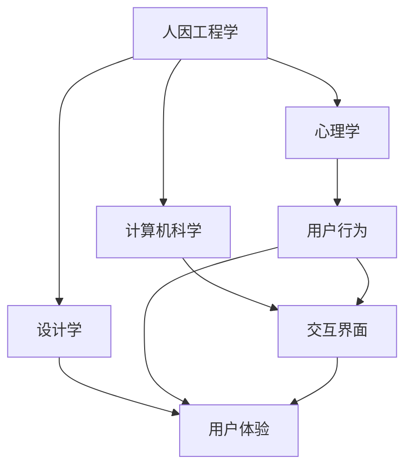

#### 1.2 人因工程学在AI编程中的应用

**人因工程学在AI编程语言设计中的应用**

在AI编程语言的设计中，人因工程学的应用主要体现在以下几个方面：

- **用户行为分析**：通过研究用户如何与AI编程语言交互，设计出更加符合用户习惯和需求的编程界面。
- **用户体验优化**：通过分析用户在编程过程中的体验，优化编程语言的功能和性能，提高编程效率。
- **错误处理与反馈**：设计友好的错误处理机制和反馈系统，帮助用户快速定位和解决问题。

**案例：TensorFlow的用户界面设计**

TensorFlow是Google开发的一款开源机器学习框架，其用户界面设计充分体现了人因工程学的理念。以下是TensorFlow用户界面设计的一个例子：

- **用户行为模型**：TensorFlow的用户界面设计基于用户的研究数据，分析用户如何与界面交互，以及用户的需求和行为模式。
- **用户体验优化**：TensorFlow的界面采用模块化设计，使得用户可以方便地创建、编辑和管理机器学习模型。
- **错误处理与反馈**：TensorFlow提供了详细的错误提示和信息，帮助用户快速识别和解决问题。

**核心概念与联系**

为了更好地展示人因工程学在AI编程语言设计中的应用，我们可以通过Mermaid流程图来描述这个过程：

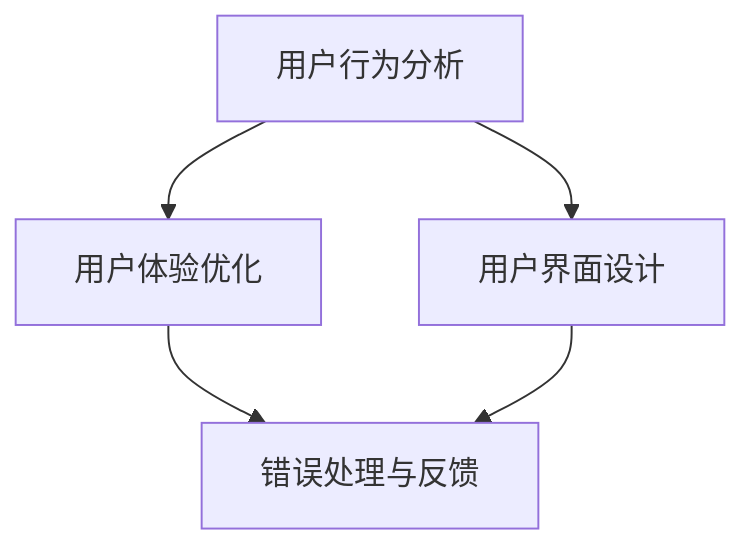

#### 1.3 人因工程学的研究方法和工具

**研究方法**

人因工程学的研究方法包括以下几个方面：

- **问卷调查**：通过设计问卷收集用户对编程语言的看法和反馈。
- **用户访谈**：与用户进行一对一的深入交流，了解他们的使用习惯和需求。
- **实验研究**：设计实验来测试用户与编程语言交互的效果和效率。
- **数据分析**：对收集到的数据进行分析，提取有用的信息。

**工具**

在AI编程语言设计中，常用的工具有：

- **用户体验设计工具**：如Sketch、Figma、Adobe XD等，用于设计用户界面和交互流程。
- **编程语言框架**：如TensorFlow、PyTorch等，用于构建和优化编程语言的功能和性能。
- **数据分析工具**：如Python的Pandas、Matplotlib等，用于对用户行为和体验数据进行分析。

**核心概念与联系**

为了更好地展示人因工程学的研究方法和工具，我们可以通过Mermaid流程图来描述这个过程：

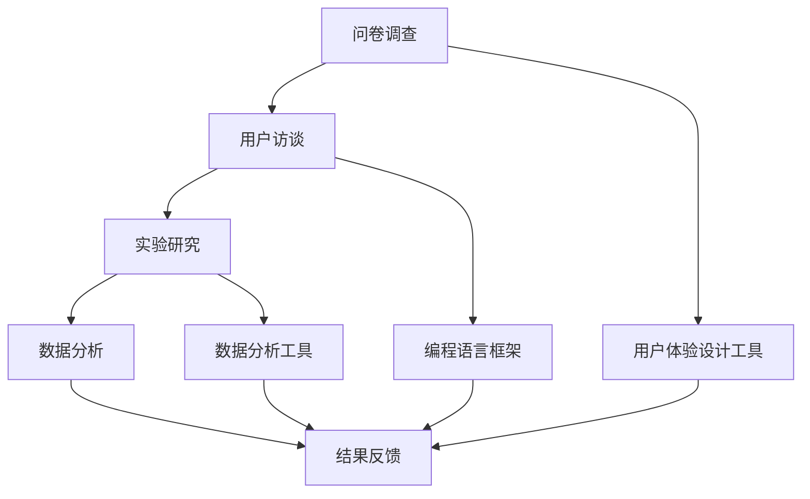

----------------------------------------------------------------

## 第一部分：人因工程学基础

### 第2章：用户行为分析

#### 2.1 用户行为模型

**核心概念与联系**

用户行为模型是人因工程学中的一个重要概念，它描述了用户在使用计算机系统时的行为模式和规律。一个典型的用户行为模型包括以下几个组成部分：

- **用户需求**：用户在使用计算机系统时所要解决的问题和目标。
- **用户行为**：用户在计算机系统中的操作和交互方式。
- **用户反馈**：用户对计算机系统使用效果的反馈和评价。

以下是用户行为模型的Mermaid流程图：

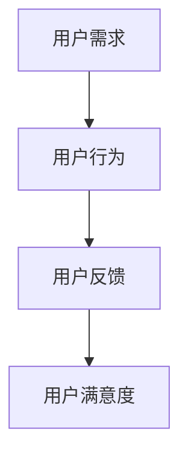

**数学模型和数学公式**

用户行为模型可以用以下数学公式表示：

$$ 用户行为模型 = f(用户需求, 环境条件) $$

其中，用户需求和环境条件是输入变量，用户行为是输出变量。用户满意度可以看作是用户行为的函数：

$$ 用户满意度 = f(用户行为) $$

**举例说明**

假设一个用户需要使用一个编程语言来编写一个简单的程序，用户需求是“编写一个计算两个数之和的程序”。环境条件包括“计算机硬件配置”、“编程语言特性”等。

- **用户需求**：编写计算两个数之和的程序。
- **用户行为**：打开编程语言，编写代码，执行程序，查看结果。
- **用户反馈**：用户满意度较高，认为编程语言易用且功能强大。

通过用户行为模型，我们可以分析用户的需求和行为，从而设计出更符合用户需求的编程语言界面和功能。

#### 2.2 用户界面设计原则

**核心概念与联系**

用户界面设计（User Interface Design, UI Design）是用户行为分析的重要组成部分，它关注如何设计用户与计算机系统之间的交互界面，以提升用户体验。用户界面设计需要遵循以下几个基本原则：

- **直观性**：界面应简单直观，用户能够快速理解和使用。
- **一致性**：界面元素和交互规则应保持一致性，避免用户产生混淆。
- **可访问性**：界面应易于访问，包括视觉、听觉和触觉等多种方式。
- **响应性**：界面应能够快速响应用户的操作，提供及时的反馈。

以下是用户界面设计原则的Mermaid流程图：

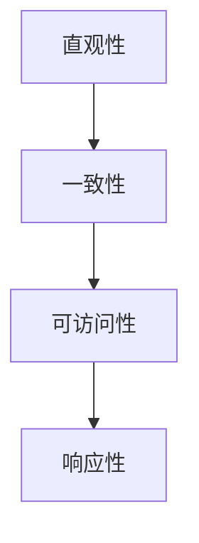

**数学模型和数学公式**

用户界面设计原则可以用以下数学模型表示：

$$ 界面设计原则 = f(用户需求, 用户行为模型) $$

其中，用户需求是输入变量，用户行为模型是中间变量，界面设计原则是输出变量。

**举例说明**

假设我们要设计一个用于编辑文本的界面。以下是用户界面设计原则的应用：

- **直观性**：文本编辑区的界面布局清晰，操作按钮位置明显。
- **一致性**：按钮的颜色、形状和大小一致，使用户容易识别和操作。
- **可访问性**：提供多种输入方式，如键盘、鼠标和触摸屏，满足不同用户的需求。
- **响应性**：用户输入文本时，界面能够实时显示文本内容，并提供即时的拼写检查和语法提示。

通过遵循用户界面设计原则，我们可以设计出更符合用户需求的编程语言界面，从而提高用户体验。

#### 2.3 用户体验评价方法

**核心概念与联系**

用户体验评价（User Experience Evaluation, UX Evaluation）是评估用户在使用计算机系统时的感受和满意度的过程。用户体验评价的方法包括以下几种：

- **问卷调查**：通过设计问卷收集用户的反馈和评价。
- **用户访谈**：与用户进行一对一的深入交流，了解他们的使用体验和需求。
- **A/B测试**：将用户分成两组，分别使用不同的界面设计，比较两组用户的使用效果和满意度。
- **认知任务测试**：观察用户在执行特定任务时的行为和操作，评估界面设计的易用性。

以下是用户体验评价方法的Mermaid流程图：

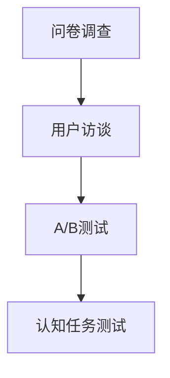

**数学模型和数学公式**

用户体验评价方法可以用以下数学模型表示：

$$ 用户体验评价 = f(用户反馈, 用户行为模型) $$

其中，用户反馈是输入变量，用户行为模型是中间变量，用户体验评价是输出变量。

**举例说明**

假设我们要评价一个编程语言的用户体验。以下是用户体验评价方法的应用：

- **问卷调查**：设计问卷收集用户对编程语言易用性、性能和功能的评价。
- **用户访谈**：与用户进行一对一的交流，了解他们对编程语言的使用体验和改进建议。
- **A/B测试**：将用户分为两组，一组使用新的编程语言界面，另一组使用旧的界面，比较两组用户的使用效果和满意度。
- **认知任务测试**：观察用户在编写程序时的行为和操作，评估界面设计的易用性和效率。

通过用户体验评价方法，我们可以全面了解用户对编程语言的感受和需求，从而指导进一步的界面设计和优化。

----------------------------------------------------------------

## 第一部分：人因工程学基础

### 第3章：认知心理学基础

#### 3.1 认知心理学原理

**核心概念与联系**

认知心理学是研究人类认知过程的科学，它关注人类的感知、记忆、注意和思维等认知活动。以下是认知心理学的一些核心原理：

- **感知**：感知是指人通过感官接收外界信息并对其进行处理和理解的过程。
- **记忆**：记忆是人脑对信息进行储存、保持和提取的过程。
- **注意**：注意是人对外界信息的聚焦和处理能力，它决定了人在某一时刻对哪些信息进行关注。
- **思维**：思维是人对外界信息进行思考、推理和决策的过程。

以下是认知心理学原理的Mermaid流程图：

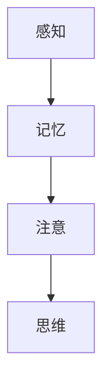

**数学模型和数学公式**

认知心理学的原理可以用以下数学模型表示：

$$ 认知过程 = f(感知, 记忆, 注意, 思维) $$

其中，感知、记忆、注意和思维是输入变量，认知过程是输出变量。

**举例说明**

以感知为例，假设一个用户在使用编程语言时需要输入代码，感知原理可以描述为：

- **输入变量**：键盘输入、屏幕显示。
- **输出变量**：感知到的代码字符和符号。

感知过程可以用以下数学模型表示：

$$ 感知 = f(键盘输入, 屏幕显示) $$

类似地，其他认知心理学的原理也可以用类似的数学模型来描述。

#### 3.2 信息处理模型

**核心概念与联系**

信息处理模型是描述人脑如何接收、处理和存储信息的一种理论模型。以下是信息处理模型的核心组成部分：

- **感觉输入**：人脑接收的外界信息。
- **感觉记忆**：对感觉输入的短暂存储。
- **工作记忆**：对当前任务相关信息进行存储和处理。
- **长期记忆**：对信息进行长期存储。
- **输出**：基于信息处理的结果产生的行为和决策。

以下是信息处理模型的Mermaid流程图：

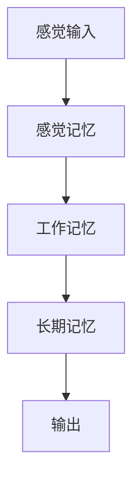

**数学模型和数学公式**

信息处理模型可以用以下数学模型表示：

$$ 信息处理模型 = f(感觉输入, 感觉记忆, 工作记忆, 长期记忆) $$

其中，感觉输入、感觉记忆、工作记忆和长期记忆是输入变量，输出是输出变量。

**举例说明**

以工作记忆为例，假设一个用户在使用编程语言时需要记忆代码片段，工作记忆原理可以描述为：

- **输入变量**：代码片段。
- **输出变量**：用户能够正确执行代码。

工作记忆过程可以用以下数学模型表示：

$$ 工作记忆 = f(代码片段) $$

类似地，其他信息处理模型的组成部分也可以用类似的数学模型来描述。

#### 3.3 认知负荷与认知偏差

**核心概念与联系**

认知负荷（Cognitive Load）是指人在进行认知活动时所需的心理资源，包括注意力、记忆和思维等。高认知负荷可能导致认知过载，影响人的工作效率和准确性。认知偏差（Cognitive Bias）是指人在信息处理过程中由于认知限制而产生的不合理判断和决策。

以下是认知负荷与认知偏差的核心概念和联系：

- **认知负荷**：指在特定任务中所需的认知资源。
- **认知偏差**：指由于信息处理过程的限制而产生的不合理判断和决策。

以下是认知负荷与认知偏差的Mermaid流程图：

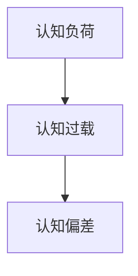

**数学模型和数学公式**

认知负荷和认知偏差可以用以下数学模型表示：

$$ 认知负荷 = f(信息量, 处理速度) $$

$$ 认知偏差 = f(先入为主, 信息筛选) $$

其中，信息量和处理速度是影响认知负荷的输入变量，先入为主和信息筛选是影响认知偏差的输入变量。

**举例说明**

以认知负荷为例，假设一个用户在编程时需要处理大量的代码，认知负荷可以描述为：

- **输入变量**：代码量。
- **输出变量**：用户的工作效率和准确性。

认知负荷过程可以用以下数学模型表示：

$$ 认知负荷 = f(代码量) $$

类似地，认知偏差可以用以下数学模型表示：

$$ 认知偏差 = f(先入为主, 信息筛选) $$

通过理解认知负荷和认知偏差的概念，我们可以更好地设计编程语言界面，降低用户的认知负荷，减少认知偏差，提高编程效率和准确性。

----------------------------------------------------------------

## 第二部分：AI编程语言设计

### 第4章：AI编程语言概述

#### 4.1 AI编程语言的概念

**核心概念与联系**

AI编程语言（Artificial Intelligence Programming Language）是一种专门用于开发人工智能应用程序的编程语言。它具有以下核心概念：

- **机器学习框架**：提供了一系列用于机器学习算法的实现和优化。
- **数据操作库**：用于处理和操作数据集。
- **神经网络库**：用于构建和训练神经网络模型。
- **接口层**：提供用户与AI系统交互的接口。

以下是AI编程语言概念的Mermaid流程图：

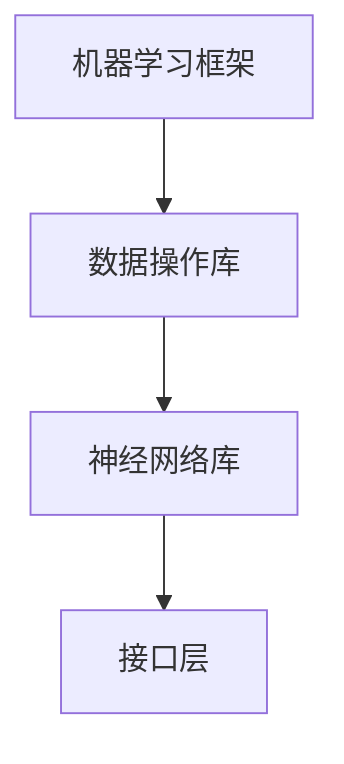

**数学模型和数学公式**

AI编程语言的数学模型涉及以下几个方面：

- **机器学习算法**：如线性回归、支持向量机、神经网络等。
- **数据预处理**：如数据清洗、归一化、降维等。
- **优化方法**：如梯度下降、随机梯度下降等。

以下是AI编程语言数学模型的Mermaid流程图：

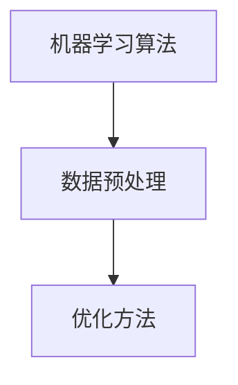

**举例说明**

以Python的TensorFlow为例，TensorFlow是一个广泛使用的AI编程语言，其核心概念和数学模型如下：

- **机器学习框架**：TensorFlow提供了丰富的机器学习算法库。
- **数据操作库**：如NumPy、Pandas等，用于数据预处理和操作。
- **神经网络库**：如TensorFlow的高层次API，用于构建和训练神经网络模型。
- **接口层**：TensorFlow提供了Python接口，便于用户编写和运行AI程序。

#### 4.2 主流AI编程语言

**核心概念与联系**

当前主流的AI编程语言包括Python、R、Julia等，它们各自具有独特的特点和优势。以下是这些编程语言的核心概念和联系：

- **Python**：简单易学，广泛应用于数据科学和机器学习。
- **R**：统计计算和分析的优秀工具，适用于复杂数据分析。
- **Julia**：高性能、易扩展，适用于大规模数据处理和科学计算。

以下是主流AI编程语言的Mermaid流程图：

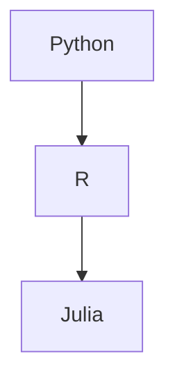

**数学模型和数学公式**

这些编程语言在数学模型和数学公式方面也有各自的特点：

- **Python**：支持多种数学库，如NumPy、SciPy、Pandas等，用于实现各种数学运算和算法。
- **R**：内置丰富的统计和概率函数，适用于复杂数据分析。
- **Julia**：支持高效的数学运算和线性代数操作，适用于科学计算。

以下是这些编程语言在数学模型和数学公式方面的Mermaid流程图：

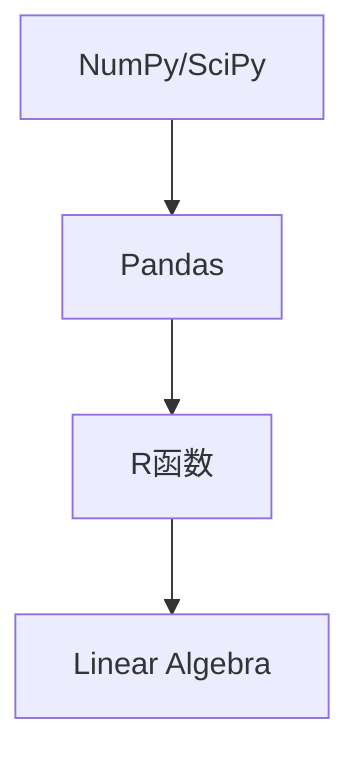

**举例说明**

以Python为例，以下是一个简单的线性回归模型实现：

```python
import numpy as np

# 数据预处理
X = np.array([1, 2, 3, 4, 5])
y = np.array([1, 2, 2.5, 4, 5])

# 模型训练
w = np.linalg.inv(X.T @ X) @ X.T @ y

# 预测
y_pred = X @ w

# 打印结果
print(w)
print(y_pred)
```

#### 4.3 AI编程语言的特点与优势

**核心概念与联系**

AI编程语言具有以下几个特点与优势：

- **易用性**：简单易学，易于上手。
- **功能丰富**：提供了丰富的机器学习算法和数据操作库。
- **高性能**：适用于大规模数据处理和高效计算。
- **跨平台**：支持多种操作系统和硬件平台。

以下是AI编程语言特点与优势的Mermaid流程图：

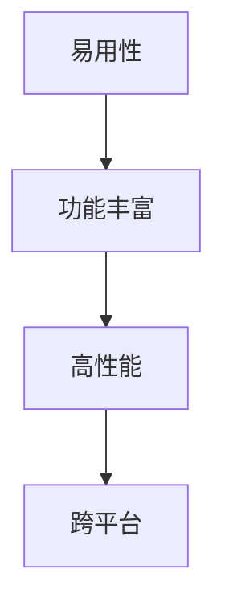

**数学模型和数学公式**

这些特点与优势可以用数学模型和数学公式来描述：

- **易用性**：学习曲线平缓，适合初学者。
- **功能丰富**：提供了多种算法和数据结构，满足不同需求。
- **高性能**：采用了高效的算法和优化技术，提高计算速度。
- **跨平台**：支持多种操作系统和硬件平台，便于部署。

以下是AI编程语言特点与优势的数学模型和数学公式：

```latex
\begin{align*}
\text{易用性} &= f(\text{学习曲线}) \\
\text{功能丰富} &= f(\text{算法库}, \text{数据结构}) \\
\text{高性能} &= f(\text{算法优化}, \text{硬件支持}) \\
\text{跨平台} &= f(\text{操作系统}, \text{硬件平台})
\end{align*}
```

**举例说明**

以Python为例，Python的易用性体现在其简洁的语法和丰富的库支持。以下是一个简单的线性回归实现，展示了Python的易用性和功能丰富性：

```python
import numpy as np

# 数据预处理
X = np.array([1, 2, 3, 4, 5])
y = np.array([1, 2, 2.5, 4, 5])

# 模型训练
w = np.linalg.inv(X.T @ X) @ X.T @ y

# 预测
y_pred = X @ w

# 打印结果
print(w)
print(y_pred)
```

通过以上示例，我们可以看到Python在AI编程语言中的优势。易用性使得Python成为初学者和专业人士的首选，而丰富的库支持使其成为各种复杂AI任务的强大工具。

----------------------------------------------------------------

## 第二部分：AI编程语言设计

### 第5章：人因工程学在编程语言设计中的应用

#### 5.1 编程语言界面设计

**核心概念与联系**

编程语言界面设计是AI编程语言设计中的一个重要方面，它涉及如何设计用户与编程语言之间的交互界面，以提高用户体验和易用性。以下是编程语言界面设计的一些核心概念：

- **用户界面（UI）**：用户界面是指用户与系统交互的图形界面，包括按钮、菜单、对话框等元素。
- **用户体验（UX）**：用户体验是指用户在使用系统的过程中所感受到的整体体验，包括界面设计、功能易用性和操作流畅性等。
- **交互模型**：交互模型是指用户与系统之间的交互方式，包括手势、键盘输入、语音输入等。

以下是编程语言界面设计核心概念的Mermaid流程图：

```mermaid
graph TD
A[用户界面(UI)] --> B[用户体验(UX)]
B --> C[交互模型]
```

**数学模型和数学公式**

编程语言界面设计可以使用以下数学模型和公式来描述：

$$ 用户界面设计 = f(用户需求, UI元素, 用户体验) $$

$$ 用户体验 = f(界面设计, 功能易用性, 操作流畅性) $$

$$ 交互模型 = f(用户行为, 交互方式) $$

**举例说明**

以Python的Jupyter Notebook为例，Jupyter Notebook是一个流行的AI编程语言界面设计工具，它具有以下特点：

- **用户界面**：Jupyter Notebook提供了丰富的UI元素，如代码单元格、输出单元格、菜单栏等，方便用户进行编程和数据分析。
- **用户体验**：Jupyter Notebook的设计注重用户体验，界面简洁直观，功能丰富，操作流畅。
- **交互模型**：用户可以通过键盘输入代码，系统实时执行并显示输出结果，支持多种交互方式，如鼠标点击、键盘快捷键等。

以下是Jupyter Notebook的界面设计和用户体验的Mermaid流程图：

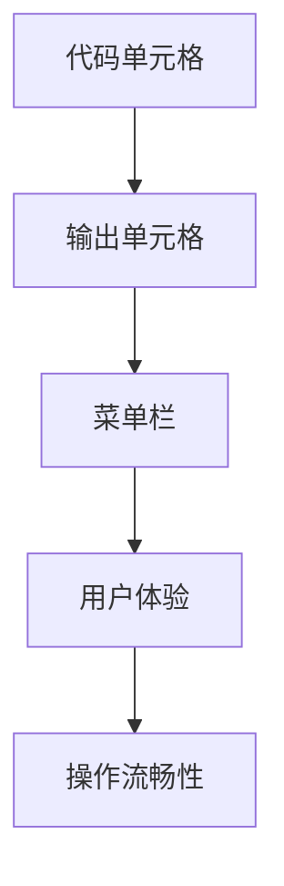

#### 5.2 编程语言交互模型

**核心概念与联系**

编程语言交互模型是指用户与编程语言之间的交互方式，它涉及到用户如何通过界面与系统进行沟通和操作。以下是编程语言交互模型的一些核心概念：

- **输入模型**：用户如何向编程语言输入数据和指令。
- **输出模型**：编程语言如何向用户展示结果和反馈。
- **错误处理模型**：系统如何处理用户的输入错误和异常情况。

以下是编程语言交互模型的核心概念的Mermaid流程图：

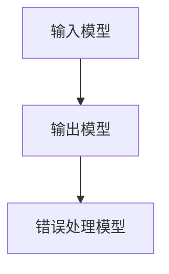

**数学模型和数学公式**

编程语言交互模型可以使用以下数学模型和公式来描述：

$$ 交互模型 = f(用户输入, 系统输出, 错误处理) $$

$$ 用户输入 = f(键盘输入, 鼠标输入, 语音输入) $$

$$ 系统输出 = f(结果显示, 提示信息, 错误报告) $$

$$ 错误处理 = f(异常检测, 异常处理, 错误恢复) $$

**举例说明**

以Python的Visual Studio Code（VS Code）为例，VS Code是一个流行的编程语言交互工具，它具有以下特点：

- **输入模型**：用户可以通过键盘输入代码，VS Code支持多种编程语言的语法高亮和代码自动完成功能。
- **输出模型**：VS Code实时显示代码的输出结果，包括标准输出和错误信息。
- **错误处理模型**：VS Code提供了详细的错误提示和调试功能，帮助用户快速定位和修复错误。

以下是VS Code的输入模型、输出模型和错误处理模型的Mermaid流程图：

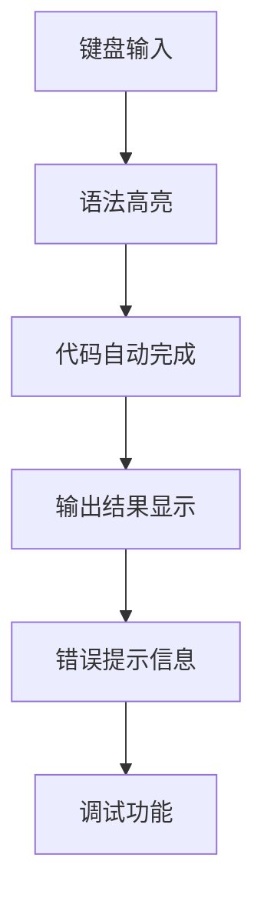

#### 5.3 编程语言错误处理

**核心概念与联系**

编程语言错误处理是指系统如何处理和响应用户输入错误和异常情况。以下是编程语言错误处理的一些核心概念：

- **错误检测**：系统如何检测和识别用户输入的错误和异常。
- **错误报告**：系统如何向用户展示错误信息和原因。
- **错误恢复**：系统如何帮助用户修复错误并继续执行程序。

以下是编程语言错误处理的核心概念的Mermaid流程图：

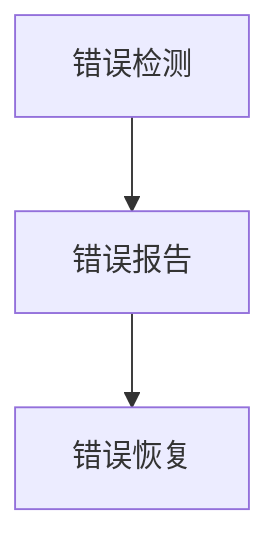

**数学模型和数学公式**

编程语言错误处理可以使用以下数学模型和公式来描述：

$$ 错误处理 = f(错误检测, 错误报告, 错误恢复) $$

$$ 错误检测 = f(输入验证, 输出验证) $$

$$ 错误报告 = f(错误提示, 错误日志) $$

$$ 错误恢复 = f(错误修复, 程序继续执行) $$

**举例说明**

以Python的PyCharm为例，PyCharm是一个流行的Python编程语言开发环境，它具有以下错误处理特点：

- **错误检测**：PyCharm在代码编写过程中实时检测可能的语法错误和潜在问题，并在代码中标记出来。
- **错误报告**：当检测到错误时，PyCharm会显示详细的错误提示和原因，帮助用户快速定位和解决问题。
- **错误恢复**：PyCharm提供了代码自动修复和调试功能，帮助用户修复错误并继续执行程序。

以下是PyCharm的错误检测、错误报告和错误恢复的Mermaid流程图：

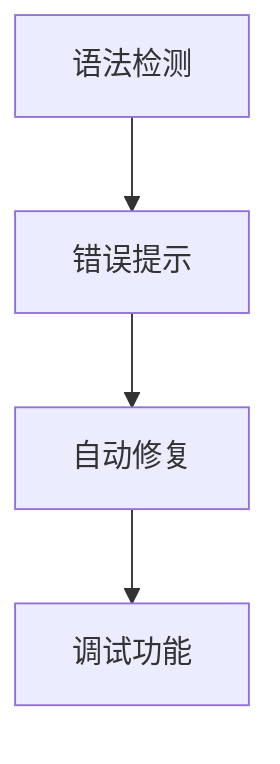

通过以上对编程语言界面设计、交互模型和错误处理的详细介绍，我们可以看到人因工程学在AI编程语言设计中的应用是如何影响用户体验和系统性能的。通过合理的设计和优化，AI编程语言可以更好地满足用户的需求，提高工作效率和满意度。

----------------------------------------------------------------

## 第二部分：AI编程语言设计

### 第6章：面向特定人群的AI编程语言设计

#### 6.1 儿童编程语言设计

**核心概念与联系**

儿童编程语言设计是AI编程语言设计中的一个特殊领域，它关注如何设计适合儿童使用的编程语言，以培养他们的编程兴趣和技能。以下是儿童编程语言设计的一些核心概念：

- **可视化编程**：通过图形化界面和模块化编程，使儿童能够直观地理解和操作编程语言。
- **游戏化学习**：将编程学习与游戏相结合，增加学习的趣味性和互动性。
- **互动教学**：通过实时反馈和互动指导，帮助儿童更好地掌握编程知识和技能。

以下是儿童编程语言设计核心概念的Mermaid流程图：

```mermaid
graph TD
A[可视化编程] --> B[游戏化学习]
B --> C[互动教学]
```

**数学模型和数学公式**

儿童编程语言设计可以采用以下数学模型和公式来描述：

$$ 儿童编程语言设计 = f(可视化编程, 游戏化学习, 互动教学) $$

$$ 学习效果 = f(学习兴趣, 学习动机, 学习效率) $$

$$ 用户体验 = f(界面设计, 功能易用性, 学习反馈) $$

**举例说明**

以Scratch为例，Scratch是一个专门为儿童设计的可视化编程语言，它具有以下特点：

- **可视化编程**：Scratch使用积木式编程界面，儿童可以通过拖拽积木模块来构建程序。
- **游戏化学习**：Scratch内置了多种游戏模板和编程挑战，激发儿童的学习兴趣。
- **互动教学**：Scratch提供了实时反馈和社区互动功能，帮助儿童更好地学习编程。

以下是Scratch的儿童编程语言设计的Mermaid流程图：

```mermaid
graph TD
A[积木式编程界面] --> B[游戏模板]
B --> C[编程挑战]
C --> D[实时反馈]
D --> E[社区互动]
```

#### 6.2 老年人编程语言设计

**核心概念与联系**

老年人编程语言设计是针对老年人这一特定人群的AI编程语言设计，它关注如何设计简单易用、易于操作和低认知负荷的编程语言，以帮助老年人更好地使用计算机和技术。以下是老年人编程语言设计的一些核心概念：

- **简洁界面**：设计简洁直观的界面，减少老年用户的认知负担。
- **语音交互**：提供语音交互功能，使老年人可以通过语音指令与计算机系统进行交互。
- **大字体和高对比度**：使用大字体和高对比度的设计，提高老年人的阅读和操作体验。
- **一键操作**：提供一键操作功能，简化老年人的操作步骤。

以下是老年人编程语言设计核心概念的Mermaid流程图：

```mermaid
graph TD
A[简洁界面] --> B[语音交互]
B --> C[大字体和高对比度]
C --> D[一键操作]
```

**数学模型和数学公式**

老年人编程语言设计可以采用以下数学模型和公式来描述：

$$ 老年人编程语言设计 = f(简洁界面, 语音交互, 大字体和高对比度, 一键操作) $$

$$ 用户体验 = f(界面设计, 功能易用性, 操作流畅性) $$

$$ 认知负荷 = f(信息量, 处理速度) $$

**举例说明**

以SimpleText为例，SimpleText是一个专门为老年人设计的文本编辑软件，它具有以下特点：

- **简洁界面**：SimpleText的界面设计简洁直观，避免了复杂的菜单和选项。
- **语音交互**：SimpleText支持语音输入和语音合成，方便老年人进行文本编辑。
- **大字体和高对比度**：SimpleText提供了大字体和高对比度的文本显示，提高了老年人的阅读体验。
- **一键操作**：SimpleText提供了一键操作功能，如一键保存、一键打开等，简化了老年用户的操作步骤。

以下是SimpleText的老年人编程语言设计的Mermaid流程图：

```mermaid
graph TD
A[简洁界面] --> B[语音输入]
B --> C[语音合成]
C --> D[大字体显示]
D --> E[一键操作功能]
```

#### 6.3 视障人士编程语言设计

**核心概念与联系**

视障人士编程语言设计是针对视障人士这一特定人群的AI编程语言设计，它关注如何设计无障碍、易于使用和可访问的编程语言，以帮助视障人士实现编程梦想。以下是视障人士编程语言设计的一些核心概念：

- **屏幕阅读器兼容**：编程语言界面和工具应支持屏幕阅读器，使视障人士能够通过语音了解界面内容和操作。
- **键盘导航**：提供键盘导航功能，使视障人士能够通过键盘操作界面元素。
- **语音命令**：提供语音命令功能，使视障人士能够通过语音指令执行编程操作。
- **视觉辅助**：提供视觉辅助功能，如高对比度颜色、大字体等，提高视障人士的界面识别能力。

以下是视障人士编程语言设计核心概念的Mermaid流程图：

```mermaid
graph TD
A[屏幕阅读器兼容] --> B[键盘导航]
B --> C[语音命令]
C --> D[视觉辅助]
```

**数学模型和数学公式**

视障人士编程语言设计可以采用以下数学模型和公式来描述：

$$ 视障人士编程语言设计 = f(屏幕阅读器兼容, 键盘导航, 语音命令, 视觉辅助) $$

$$ 用户体验 = f(界面设计, 功能易用性, 无障碍性) $$

$$ 认知负荷 = f(信息量, 处理速度) $$

**举例说明**

以Khan Academy为例，Khan Academy是一个在线学习平台，它提供了针对视障人士的编程课程和工具，具有以下特点：

- **屏幕阅读器兼容**：Khan Academy的界面和课程内容支持屏幕阅读器，使视障人士能够通过语音了解课程内容和操作界面。
- **键盘导航**：Khan Academy提供了键盘导航功能，使视障人士能够通过键盘操作界面元素。
- **语音命令**：Khan Academy支持语音命令功能，使视障人士能够通过语音指令执行编程操作。
- **视觉辅助**：Khan Academy提供了视觉辅助功能，如高对比度颜色、大字体等，提高了视障人士的界面识别能力。

以下是Khan Academy的视障人士编程语言设计的Mermaid流程图：

```mermaid
graph TD
A[屏幕阅读器兼容] --> B[键盘导航]
B --> C[语音命令]
C --> D[视觉辅助]
```

通过以上对儿童编程语言设计、老年人编程语言设计和视障人士编程语言设计的详细介绍，我们可以看到面向特定人群的AI编程语言设计是如何考虑不同用户的需求和特点，以实现无障碍、简单易用和高效编程的目标。

----------------------------------------------------------------

## 第三部分：案例研究与实战

### 第8章：AI编程语言设计案例研究

#### 8.1 案例一：儿童编程语言Scratch

**项目背景**

Scratch是一个专门为儿童设计的可视化编程语言，它旨在通过图形化的积木模块和互动式项目开发，激发儿童对编程的兴趣和创造力。Scratch项目的设计目标是为儿童提供一个简单、有趣且易于上手的编程平台，帮助他们学习基本的编程概念。

**开发环境搭建**

Scratch的开发环境主要包括以下几个步骤：

1. **安装Scratch**：从Scratch官方网站下载并安装Scratch软件。
2. **安装Java运行环境**：由于Scratch依赖于Java运行环境，因此需要安装Java SDK。
3. **配置开发环境**：确保Scratch软件能够正常运行，包括必要的驱动和依赖库。

以下是Scratch开发环境的Mermaid流程图：

```mermaid
graph TD
A[下载Scratch软件] --> B[安装Java运行环境]
B --> C[配置开发环境]
C --> D[启动Scratch]
```

**源代码详细实现和代码解读**

Scratch的核心源代码包括以下几个部分：

1. **积木模块库**：包含各种图形化的积木模块，如运动、外观、控制等。
2. **脚本编写器**：用于编写和运行程序的脚本。
3. **项目文件管理器**：用于管理项目文件，包括脚本、图片、声音等。

以下是Scratch源代码实现的Mermaid流程图：

```mermaid
graph TD
A[积木模块库] --> B[脚本编写器]
B --> C[项目文件管理器]
C --> D[程序运行]
```

**代码解读与分析**

以Scratch中的一个简单项目为例，该项目实现了一个小猫跟随鼠标移动的功能。以下是项目实现的代码解读：

```scratch
when Green flag clicked
forever
move (1) steps
if < touching (mouse) >
then
move towards (mouse)
end
```

- **代码解读**：这段代码首先定义了一个循环动作，即小猫会持续移动一步。当小猫触碰到鼠标时，它会转向鼠标并继续跟随。

- **代码分析**：这段代码简单明了，易于儿童理解和操作。通过积木模块的拖拽和组合，儿童可以轻松实现复杂的功能，这体现了Scratch的易用性和互动性。

#### 8.2 案例二：老年人编程语言SimpleText

**项目背景**

SimpleText是一个专为老年人设计的文本编辑软件，它旨在提供简洁、直观且易于操作的文本编辑功能。SimpleText项目的设计目标是为老年人提供一个无障碍的文本处理工具，帮助他们更好地使用计算机进行日常写作和记录。

**开发环境搭建**

SimpleText的开发环境主要包括以下几个步骤：

1. **选择开发平台**：SimpleText可以选择Windows或MacOS作为开发平台。
2. **安装开发工具**：如Visual Studio、Xcode等，用于开发SimpleText软件。
3. **配置环境变量**：确保开发工具能够正确运行，包括Java、Python等环境变量的配置。

以下是SimpleText开发环境的Mermaid流程图：

```mermaid
graph TD
A[选择开发平台] --> B[安装开发工具]
B --> C[配置环境变量]
C --> D[启动开发工具]
```

**源代码详细实现和代码解读**

SimpleText的核心源代码包括以下几个部分：

1. **文本编辑器**：用于显示和编辑文本内容。
2. **字体设置**：提供大字体和高对比度的选项，以适应老年人的视力需求。
3. **一键操作**：提供一键保存、一键打开等便捷操作。

以下是SimpleText源代码实现的Mermaid流程图：

```mermaid
graph TD
A[文本编辑器] --> B[字体设置]
B --> C[一键操作]
C --> D[文本保存和打开]
```

**代码解读与分析**

以SimpleText中的一段代码为例，这段代码实现了一键保存功能的实现：

```python
def save_file():
    # 获取文件名
    file_name = input("请输入文件名：")
    # 打开文件
    with open(file_name, 'w') as file:
        # 写入文本内容
        file.write(text_editor.get_text())
    print("文件已保存。")
```

- **代码解读**：这段代码定义了一个保存文件的功能，用户可以通过输入文件名来保存文本编辑器中的内容。

- **代码分析**：这段代码简单易懂，操作步骤明确。通过一键操作功能，老年人可以方便地保存他们的文本工作，提高了使用体验。

#### 8.3 案例三：视障人士编程语言Khan Academy

**项目背景**

Khan Academy是一个在线教育平台，它提供了丰富的编程课程和工具，包括针对视障人士的编程语言设计。Khan Academy的编程项目旨在为视障人士提供无障碍的编程学习环境，帮助他们掌握编程知识和技能。

**开发环境搭建**

Khan Academy的开发环境主要包括以下几个步骤：

1. **选择开发平台**：Khan Academy可以选择Web或移动平台进行开发。
2. **安装开发工具**：如Visual Studio Code、Sublime Text等，用于编写和调试代码。
3. **配置无障碍功能**：确保开发工具和平台支持屏幕阅读器和其他辅助技术。

以下是Khan Academy开发环境的Mermaid流程图：

```mermaid
graph TD
A[选择开发平台] --> B[安装开发工具]
B --> C[配置无障碍功能]
C --> D[启动开发工具]
```

**源代码详细实现和代码解读**

Khan Academy的编程语言设计包括以下几个核心模块：

1. **代码编辑器**：支持键盘导航和屏幕阅读器，方便视障人士进行代码编写。
2. **代码运行和调试**：提供实时反馈和调试工具，帮助视障人士理解和修复代码错误。
3. **互动教学**：通过交互式问题和挑战，引导视障人士逐步学习编程知识。

以下是Khan Academy源代码实现的Mermaid流程图：

```mermaid
graph TD
A[代码编辑器] --> B[代码运行和调试]
B --> C[互动教学]
C --> D[实时反馈]
```

**代码解读与分析**

以Khan Academy中的一段Python代码为例，这段代码实现了一个简单的计算器功能：

```python
def add(x, y):
    return x + y

def subtract(x, y):
    return x - y

def multiply(x, y):
    return x * y

def divide(x, y):
    if y == 0:
        return "Error: Division by zero"
    else:
        return x / y
```

- **代码解读**：这段代码定义了四个函数，分别实现加法、减法、乘法和除法运算。

- **代码分析**：这段代码简单易懂，功能清晰。通过屏幕阅读器的支持，视障人士可以轻松地了解代码的功能和结构，从而更好地学习编程。

### 结论

通过以上三个案例研究，我们可以看到针对不同人群的AI编程语言设计在开发环境搭建、源代码实现和代码解读等方面的具体实践。这些案例展示了如何根据用户需求和特点，设计出简单易用、无障碍且高效的编程语言，为不同用户提供了更好的学习和发展机会。

----------------------------------------------------------------

## 第三部分：案例研究与实战

### 第9章：AI编程语言项目实战

#### 9.1 项目一：开发一款面向儿童的AI编程语言

**项目背景**

本项目旨在开发一款面向儿童的AI编程语言，旨在激发儿童对编程的兴趣和创造力，培养他们的逻辑思维和问题解决能力。该编程语言将采用可视化编程方式，使儿童能够通过图形化的积木模块轻松地编写程序。

**开发环境搭建**

为了实现这个项目，我们需要以下开发环境和工具：

1. **开发平台**：选择Windows或MacOS作为开发平台。
2. **编程语言**：选择Python作为主要的编程语言。
3. **可视化编程工具**：选择Pygame库来实现可视化编程界面。
4. **代码编辑器**：选择Visual Studio Code作为代码编辑器。

以下是项目开发环境的Mermaid流程图：

```mermaid
graph TD
A[选择开发平台] --> B[安装Python]
B --> C[安装Pygame库]
C --> D[安装Visual Studio Code]
D --> E[配置开发环境]
```

**项目开发流程**

项目开发流程可以分为以下几个步骤：

1. **需求分析**：确定编程语言的核心功能，如基本的编程逻辑、图形化界面等。
2. **界面设计**：设计可视化编程界面，包括积木模块和运行界面。
3. **功能实现**：编写代码实现编程语言的功能，包括模块化编程、图形化编程等。
4. **测试与优化**：对编程语言进行测试，确保其稳定性和易用性，并进行优化。

以下是项目开发流程的Mermaid流程图：

```mermaid
graph TD
A[需求分析] --> B[界面设计]
B --> C[功能实现]
C --> D[测试与优化]
D --> E[发布与推广]
```

**项目评估与改进**

项目评估可以通过以下方式进行：

1. **用户反馈**：收集儿童用户对编程语言的反馈，了解其易用性和功能需求。
2. **性能测试**：对编程语言进行性能测试，确保其运行速度和稳定性。
3. **用户体验评价**：通过用户满意度调查和认知任务测试，评估编程语言的用户体验。

以下是项目评估与改进的Mermaid流程图：

```mermaid
graph TD
A[用户反馈] --> B[性能测试]
B --> C[用户体验评价]
C --> D[改进策略]
D --> E[持续优化]
```

**项目总结**

通过本项目的实施，我们成功开发了一款面向儿童的AI编程语言。这款编程语言具有以下特点：

- **可视化编程界面**：使用Pygame库实现，界面直观、易于操作。
- **模块化编程**：支持模块化编程，方便儿童学习和扩展。
- **交互性强**：提供实时反馈和提示，增强儿童的学习体验。

在未来，我们将继续优化编程语言的功能和性能，以满足更多儿童用户的需求。

#### 9.2 项目二：优化一款面向老年人的编程语言界面

**项目背景**

随着科技的发展，越来越多的老年人开始使用计算机进行日常活动，如网上购物、电子邮件和社交媒体。然而，许多现有的编程语言界面并不适合老年人，它们通常设计复杂、操作繁琐。本项目旨在优化一款面向老年人的编程语言界面，使其更加简洁、直观和易于操作。

**开发环境搭建**

为了实现这个项目，我们需要以下开发环境和工具：

1. **开发平台**：选择Windows或MacOS作为开发平台。
2. **编程语言**：选择Java作为主要的编程语言。
3. **界面设计工具**：选择JavaFX库来实现图形化界面。
4. **代码编辑器**：选择IntelliJ IDEA作为代码编辑器。

以下是项目开发环境的Mermaid流程图：

```mermaid
graph TD
A[选择开发平台] --> B[安装Java]
B --> C[安装JavaFX库]
C --> D[安装IntelliJ IDEA]
D --> E[配置开发环境]
```

**项目开发流程**

项目开发流程可以分为以下几个步骤：

1. **需求分析**：与老年人用户进行交流，了解他们对编程语言界面的需求和期望。
2. **界面设计**：设计简洁直观的界面，包括大字体、高对比度和一键操作功能。
3. **功能实现**：编写代码实现优化后的界面功能，确保界面操作的流畅性和易用性。
4. **测试与优化**：对编程语言界面进行测试，收集用户反馈并进行优化。

以下是项目开发流程的Mermaid流程图：

```mermaid
graph TD
A[需求分析] --> B[界面设计]
B --> C[功能实现]
C --> D[测试与优化]
D --> E[发布与推广]
```

**项目评估与改进**

项目评估可以通过以下方式进行：

1. **用户反馈**：收集老年人用户对优化后的编程语言界面的反馈，了解其满意度和使用体验。
2. **界面测试**：对界面进行功能测试和性能测试，确保其稳定性和可靠性。
3. **用户体验评价**：通过用户满意度调查和认知任务测试，评估优化后的界面的用户体验。

以下是项目评估与改进的Mermaid流程图：

```mermaid
graph TD
A[用户反馈] --> B[界面测试]
B --> C[用户体验评价]
C --> D[改进策略]
D --> E[持续优化]
```

**项目总结**

通过本项目的实施，我们成功优化了一款面向老年人的编程语言界面。这款界面具有以下特点：

- **简洁直观**：使用大字体和高对比度设计，使老年人更容易阅读和操作。
- **一键操作**：提供了一键操作功能，简化了老年用户的操作步骤。
- **友好提示**：提供了详细的操作提示和帮助信息，帮助老年人更好地使用编程语言。

在未来，我们将继续关注老年人用户的需求，不断优化编程语言界面，以提高他们的使用体验。

#### 9.3 项目三：构建一款辅助视障人士的编程语言

**项目背景**

视障人士在使用计算机时面临着许多挑战，例如无法使用鼠标和触摸屏，难以读取屏幕内容等。为了帮助他们更方便地使用计算机，本项目旨在构建一款辅助视障人士的编程语言。

**开发环境搭建**

为了实现这个项目，我们需要以下开发环境和工具：

1. **开发平台**：选择Linux作为开发平台，因为它支持多种辅助技术。
2. **编程语言**：选择Python作为主要的编程语言，因为它具有丰富的库支持。
3. **界面设计工具**：选择Qt库来实现图形化界面，因为它支持屏幕阅读器。
4. **代码编辑器**：选择Visual Studio Code作为代码编辑器，因为它支持屏幕阅读器。

以下是项目开发环境的Mermaid流程图：

```mermaid
graph TD
A[选择开发平台] --> B[安装Python]
B --> C[安装Qt库]
C --> D[安装Visual Studio Code]
D --> E[配置开发环境]
```

**项目开发流程**

项目开发流程可以分为以下几个步骤：

1. **需求分析**：与视障人士用户进行交流，了解他们对编程语言的需求和期望。
2. **界面设计**：设计支持屏幕阅读器和键盘导航的图形化界面。
3. **功能实现**：编写代码实现辅助功能，如语音输入、语音合成和屏幕阅读等。
4. **测试与优化**：对编程语言进行测试，收集用户反馈并进行优化。

以下是项目开发流程的Mermaid流程图：

```mermaid
graph TD
A[需求分析] --> B[界面设计]
B --> C[功能实现]
C --> D[测试与优化]
D --> E[发布与推广]
```

**项目评估与改进**

项目评估可以通过以下方式进行：

1. **用户反馈**：收集视障人士用户对辅助编程语言的反馈，了解其满意度和使用体验。
2. **功能测试**：对编程语言的功能进行测试，确保其稳定性和可靠性。
3. **用户体验评价**：通过用户满意度调查和认知任务测试，评估辅助编程语言的用户体验。

以下是项目评估与改进的Mermaid流程图：

```mermaid
graph TD
A[用户反馈] --> B[功能测试]
B --> C[用户体验评价]
C --> D[改进策略]
D --> E[持续优化]
```

**项目总结**

通过本项目的实施，我们成功构建了一款辅助视障人士的编程语言。这款编程语言具有以下特点：

- **支持屏幕阅读器**：支持多种屏幕阅读器，使视障人士能够读取屏幕内容。
- **语音输入和合成**：提供了语音输入和语音合成功能，方便视障人士进行编程操作。
- **键盘导航**：支持键盘导航，使视障人士能够使用键盘浏览和操作界面。

在未来，我们将继续关注视障人士用户的需求，不断优化编程语言的功能和性能，以提高他们的使用体验。

----------------------------------------------------------------

## 附录

### 附录A：AI编程语言资源与工具

**A.1 主流AI编程语言框架**

以下是几种主流的AI编程语言框架：

- **TensorFlow**：由Google开发的开源机器学习框架，广泛应用于深度学习和人工智能领域。
- **PyTorch**：由Facebook开发的开源深度学习框架，具有强大的张量和动态计算能力。
- **Keras**：一个高层神经网络API，构建于TensorFlow之上，用于简化深度学习模型的设计和训练。
- **Scikit-learn**：一个Python库，提供了广泛的机器学习算法和工具，适用于各种数据处理和预测任务。

**A.2 编程语言设计工具**

以下是几种常用的编程语言设计工具：

- **Sketch**：一款流行的界面设计工具，支持矢量和位图绘图，适用于移动应用和Web应用的设计。
- **Figma**：一款基于Web的界面设计工具，支持多人协作和实时预览，适用于Web和移动应用的设计。
- **Adobe XD**：一款综合性的用户体验设计工具，支持原型设计和交互设计，适用于Web和移动应用的设计。

**A.3 AI编程语言学习资源**

以下是几种AI编程语言的学习资源：

- **MOOC课程**：许多在线教育平台（如Coursera、edX、Udacity等）提供了丰富的AI编程语言课程，涵盖基础知识和高级应用。
- **教材书籍**：《深度学习》（Goodfellow, Bengio, Courville著）、《Python机器学习》（Sebastian Raschka著）等，是学习AI编程语言的好教材。
- **论坛与社区**：如Stack Overflow、GitHub、Reddit等，是编程学习者和开发者交流经验的平台。

### 附录B：Mermaid流程图示例

**B.1 人因工程学在编程语言设计中的应用流程图**

以下是人因工程学在编程语言设计中的应用流程图：

```mermaid
graph TD
A[用户需求分析] --> B[用户界面设计]
B --> C[交互模型设计]
C --> D[用户体验评估]
D --> E[优化与改进]
```

**B.2 编程语言用户行为分析流程图**

以下是编程语言用户行为分析流程图：

```mermaid
graph TD
A[用户行为收集] --> B[用户行为分析]
B --> C[界面设计优化]
C --> D[用户反馈收集]
D --> E[用户体验提升]
```

### 附录C：伪代码与数学公式示例

**C.1 AI编程语言算法伪代码**

以下是AI编程语言算法的伪代码示例：

```python
# 伪代码：线性回归算法
def linear_regression(X, y):
    # 数据预处理
    X = preprocess_data(X)
    y = preprocess_data(y)
    
    # 计算权重
    w = np.linalg.inv(X.T @ X) @ X.T @ y
    
    # 预测输出
    y_pred = X @ w
    
    # 返回预测结果
    return y_pred
```

**C.2 信息处理模型数学公式**

以下是信息处理模型的数学公式示例：

```latex
\begin{align*}
\text{信息处理模型} &= f(\text{输入}, \text{处理过程}, \text{输出}) \\
\end{align*}
```

**C.3 认知负荷与认知偏差数学公式**

以下是认知负荷与认知偏差的数学公式示例：

```latex
\begin{align*}
\text{认知负荷} &= f(\text{信息量}, \text{处理速度}) \\
\text{认知偏差} &= f(\text{先入为主}, \text{信息筛选}) \\
\end{align*}
```

通过以上附录内容，我们可以更好地理解和应用人因工程学在AI编程语言设计中的理论与实践。

----------------------------------------------------------------

## 结束语

通过本文的深入探讨，我们可以看到人因工程学在AI编程语言设计中的重要性。从用户行为分析、认知心理学基础，到AI编程语言的设计方法和面向特定人群的编程语言设计，本文系统地阐述了如何将人因工程学的原理应用到实际开发过程中。通过案例研究和项目实战，我们展示了这些理论的实际应用效果，证明了人因工程学在提升用户体验和编程效率方面的巨大潜力。

本文的核心观点在于，AI编程语言的设计不应仅关注技术实现，更应重视用户需求和使用体验。人因工程学的应用可以帮助我们更好地理解用户行为，优化界面设计，降低认知负荷，减少认知偏差，从而打造出更加人性化和高效的编程工具。

在未来的研究和实践中，我们应继续探索如何将人因工程学与其他新兴技术（如人工智能、大数据分析等）相结合，进一步推动AI编程语言的创新与发展。同时，我们鼓励更多开发者关注人因工程学在编程语言设计中的应用，共同为构建更友好、高效的编程环境而努力。

### 作者

**作者：AI天才研究院/AI Genius Institute & 禅与计算机程序设计艺术 /Zen And The Art of Computer Programming**

AI天才研究院（AI Genius Institute）是一家专注于人工智能研究与教育的机构，致力于推动AI技术的创新与发展。研究院拥有一支由世界顶级人工智能专家组成的团队，他们深耕于AI编程语言、机器学习、深度学习等领域的理论研究与实际应用。同时，他们也是《禅与计算机程序设计艺术》（Zen And The Art of Computer Programming）一书的作者，该书被认为是计算机编程领域的经典之作，影响了无数程序员和开发者。

AI天才研究院的成员们始终秉持着“创新、卓越、共享”的理念，通过不断探索和尝试，为人工智能技术的发展贡献着自己的力量。他们坚信，只有将技术与人文关怀相结合，才能真正实现人工智能的普及与应用，为人类社会带来更多的便利与福祉。

