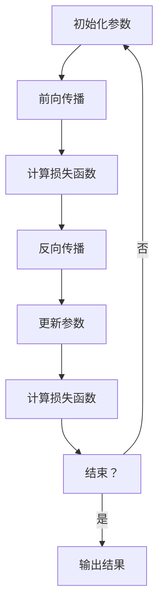

                 

# AI领域的独特时刻与未来

关键词：人工智能，深度学习，未来展望，技术趋势，应用场景，挑战与机遇

摘要：
本文将带领读者回顾AI领域的独特时刻，从历史、技术突破到社会影响，全面梳理AI的发展脉络。接着，我们将展望AI领域的未来，探讨技术趋势、应用场景以及面临的挑战与机遇。此外，本文还将深入解析AI的核心概念、技术架构和算法原理，并通过实际项目案例，展示AI在实践中的应用与挑战。最后，本文将提供AI工具与资源的总结，以及数学基础和算法伪代码的详细说明，为读者提供全面的技术参考。

## 第一部分: AI领域的独特时刻与未来

### 第1章: AI领域的独特时刻

#### 第1.1节: AI的独特时刻：历史回顾

##### 1.1.1 AI的诞生与发展

人工智能（AI）的起源可以追溯到20世纪50年代。1956年，达特茅斯会议被认为是AI诞生的标志，这次会议聚集了当时世界上最杰出的计算机科学家和数学家，他们共同讨论了人工智能的可能性。这个时期，AI主要依赖于符号逻辑和搜索算法，以解决特定的问题。

随着时间的推移，AI经历了几个重要的发展阶段。20世纪80年代，专家系统的出现标志着AI的一次重要突破。专家系统是一种基于规则的人工智能系统，能够模拟人类专家的决策过程。然而，专家系统在实际应用中面临知识获取的瓶颈，难以处理复杂的问题。

进入21世纪，机器学习和深度学习的兴起为AI带来了新的契机。2006年，Hinton等人提出了深度置信网络（DBN），这标志着深度学习算法的复兴。随后，2012年，AlexNet在ImageNet竞赛中取得了突破性的成绩，深度学习开始广泛应用于图像识别、自然语言处理等领域。

##### 1.1.2 AI的关键转折点

AI领域的关键转折点包括以下几个方面：

1. **深度学习的崛起**：深度学习算法在处理大规模数据方面具有显著优势，通过层次化的神经网络结构，深度学习能够自动提取数据的特征表示，这一突破极大地推动了AI的发展。

2. **大数据的兴起**：随着互联网和物联网的发展，数据量呈指数级增长。大数据为AI提供了丰富的训练资源，使得机器学习算法能够更好地学习复杂模式。

3. **计算能力的提升**：高性能计算设备和GPU的普及，为深度学习算法提供了强大的计算支持，加速了AI算法的训练和推理过程。

4. **跨界合作与技术创新**：AI与其他领域（如生物学、神经科学、认知科学等）的交叉融合，推动了AI技术的不断创新。

##### 1.1.3 AI领域的重大事件

AI领域的重大事件包括：

1. **AlphaGo击败围棋世界冠军**：2016年，谷歌DeepMind开发的AlphaGo在围棋比赛中击败了世界冠军李世石，这标志着AI在复杂决策领域的重大突破。

2. **自动驾驶汽车的兴起**：自动驾驶技术被认为是AI在工业应用中的一次重要变革，特斯拉、谷歌等公司在这一领域取得了显著进展。

3. **医疗AI的发展**：AI在医疗领域的应用日益广泛，包括疾病诊断、药物研发、手术辅助等，AI技术为医疗行业带来了革命性的变化。

#### 第1.2节: AI的独特时刻：技术突破

##### 1.2.1 深度学习的崛起

深度学习是AI领域的一个重要分支，它通过多层神经网络来模拟人脑的学习过程。深度学习的核心思想是自动化特征提取，即通过大量的数据训练，网络能够自动学习并提取有用的特征表示。

深度学习算法在多个领域取得了显著成果，例如：

1. **图像识别**：卷积神经网络（CNN）在ImageNet竞赛中取得了优异成绩，使得计算机能够自动识别和分类图像。

2. **自然语言处理**：递归神经网络（RNN）和转换器架构（Transformer）在文本分类、机器翻译、语音识别等领域取得了突破性进展。

3. **强化学习**：深度强化学习算法在游戏、机器人控制等领域取得了重要成果，使得机器能够通过自主学习来完成任务。

##### 1.2.2 人工智能算法的创新

除了深度学习，AI领域还涌现出许多其他创新算法，例如：

1. **生成对抗网络（GAN）**：GAN通过生成器和判别器的对抗训练，能够在图像、文本、音频等数据上生成高质量的合成内容。

2. **变分自编码器（VAE）**：VAE通过概率模型来编码和重建数据，被广泛应用于图像去噪、图像生成等领域。

3. **图神经网络（GNN）**：GNN通过图结构来建模和预测图上的节点和边，被广泛应用于社交网络分析、推荐系统等领域。

##### 1.2.3 AI应用的多样化发展

AI技术的应用领域不断扩展，从传统的工业自动化、金融量化交易，到新兴的自动驾驶、医疗诊断、智能客服等，AI正在改变各行各业的运作方式。

1. **工业自动化**：AI技术在工业生产中用于质量检测、故障诊断、优化生产流程，提高了生产效率和产品质量。

2. **金融行业**：AI技术在金融领域用于风险评估、量化交易、客户服务，为金融机构提供了强大的数据分析工具。

3. **医疗健康**：AI技术在医疗健康领域用于疾病诊断、药物研发、健康监测，为患者提供了更准确、更个性化的医疗服务。

4. **智能家居**：AI技术在智能家居中用于语音控制、智能监控、能效管理，为用户提供了更加便捷、舒适的生活方式。

#### 第1.3节: AI的独特时刻：社会影响

##### 1.3.1 AI对各行各业的改变

AI技术的快速发展对各行各业产生了深远的影响，主要表现在以下几个方面：

1. **提高生产效率**：AI技术通过自动化和智能化，提高了生产效率和产品质量，减少了人力成本。

2. **优化决策过程**：AI技术能够处理海量数据，提取有用信息，为决策者提供更准确的数据支持。

3. **创新商业模式**：AI技术推动了商业模式的创新，例如个性化推荐、智能客服、智能广告等。

4. **改变工作方式**：AI技术改变了人们的日常工作方式，例如自动化办公、远程工作等。

##### 1.3.2 AI带来的伦理与社会挑战

尽管AI技术带来了巨大的机遇，但也带来了许多伦理和社会挑战，例如：

1. **隐私保护**：AI技术在处理个人数据时，可能会侵犯用户的隐私权，如何保护用户隐私成为一个重要问题。

2. **就业影响**：AI技术的发展可能导致某些岗位的失业，如何保障劳动者的权益成为社会关注的问题。

3. **决策透明性**：AI系统的决策过程通常是不透明的，如何确保AI系统的决策透明性和公正性成为一个挑战。

4. **伦理道德问题**：AI技术在军事、医疗等领域的应用，涉及到伦理道德问题，如何制定相关法规和标准成为一个重要议题。

##### 1.3.3 AI的未来趋势与展望

随着AI技术的不断进步，未来AI的发展趋势将体现在以下几个方面：

1. **技术融合**：AI技术与量子计算、边缘计算、物联网等技术的融合，将推动AI技术的进一步发展。

2. **个性化服务**：AI技术将更加注重个性化服务，满足用户多样化的需求。

3. **普及与教育**：随着AI技术的普及，提高公众的AI素养成为一个重要议题，相关的教育和培训将成为未来发展的关键。

4. **法律与伦理**：在AI技术的应用中，法律和伦理问题将得到更多关注，相关法规和标准的制定将成为未来发展的保障。

### 第2章: AI领域的未来展望

#### 第2.1节: AI未来的技术趋势

##### 2.1.1 量子计算与AI的结合

量子计算被认为是未来计算技术的一次革命，它通过量子比特的叠加和纠缠，能够在短时间内解决传统计算机无法处理的问题。量子计算与AI的结合，将带来以下趋势：

1. **加速AI算法**：量子计算能够大大加速AI算法的训练和推理过程，提高AI系统的性能。

2. **新型算法设计**：量子计算的特殊性质，将推动新型AI算法的设计和发展。

3. **量子机器学习**：量子计算与机器学习的结合，将开创量子机器学习的研究领域，为AI带来新的机遇。

##### 2.1.2 自主学习与自适应系统的进步

自主学习与自适应系统是未来AI技术的重要发展方向，它使得AI系统能够在不依赖人类干预的情况下，自主学习和优化。以下是一些具体趋势：

1. **迁移学习**：迁移学习将使得AI系统能够在不同任务之间共享知识，提高学习效率。

2. **元学习**：元学习研究如何让AI系统学习如何学习，从而提高学习速度和泛化能力。

3. **自适应系统**：自适应系统能够根据环境变化，自动调整其行为和策略，提高系统的鲁棒性和适应性。

##### 2.1.3 大模型与边缘计算的平衡

随着AI技术的不断进步，大模型的训练和部署变得越来越普遍。然而，大模型的训练需要大量的计算资源和数据，这对边缘计算提出了挑战。以下是一些具体趋势：

1. **模型压缩与量化**：通过模型压缩和量化技术，将大模型转换为轻量级模型，以便在边缘设备上部署。

2. **分布式训练**：分布式训练技术将模型训练任务分布在多个节点上，提高训练效率。

3. **边缘智能**：通过边缘计算设备，将部分AI计算任务从云端转移到边缘，实现实时处理和响应。

#### 第2.2节: AI未来的应用场景

##### 2.2.1 物联网与AI的融合

物联网（IoT）与AI的融合，将带来以下应用场景：

1. **智能监控**：通过AI技术，物联网设备能够实现实时监控和分析，提高监控效果和安全性。

2. **智能家居**：AI技术将使得智能家居设备更加智能，为用户带来更加便捷和舒适的生活体验。

3. **智能交通**：通过AI技术，智能交通系统能够实现实时交通流量监测和优化，提高交通效率和安全性。

##### 2.2.2 AI在医疗健康领域的应用

AI技术在医疗健康领域的应用前景广阔，以下是一些具体应用场景：

1. **疾病诊断**：AI技术能够通过分析医学图像、病历数据等，实现快速、准确的疾病诊断。

2. **药物研发**：AI技术能够加速药物研发过程，通过大数据分析和机器学习算法，提高药物发现的成功率。

3. **个性化治疗**：基于患者的遗传信息和医疗记录，AI技术能够为患者提供个性化的治疗方案。

##### 2.2.3 AI与金融、教育等领域的创新

AI技术在金融、教育等领域的创新，将带来以下应用场景：

1. **金融风险管理**：AI技术能够实时分析金融市场的数据，为金融机构提供风险管理和投资建议。

2. **智能教育**：AI技术能够根据学生的学习情况，提供个性化的学习计划和教学资源，提高学习效果。

3. **智能客服**：AI技术能够实现智能客服系统，通过语音识别、自然语言处理等技术，为用户提供24/7的在线服务。

#### 第2.3节: AI未来面临的挑战与机遇

##### 2.3.1 AI发展的法律与伦理问题

随着AI技术的广泛应用，法律和伦理问题变得越来越重要。以下是一些具体挑战：

1. **隐私保护**：如何确保AI技术在处理个人数据时，充分保护用户的隐私权，成为重要的法律和伦理问题。

2. **责任归属**：当AI系统出现错误或造成损失时，如何确定责任归属，需要法律和伦理的规范。

3. **公平与公正**：如何确保AI系统的决策过程公平、公正，避免歧视和不公平现象的发生。

##### 2.3.2 AI普及与教育的重要性

AI技术的普及和应用，对社会的各个领域都产生了深远的影响。为了应对这一挑战，以下几个方面至关重要：

1. **AI基础教育**：提高公众的AI素养，培养更多的AI专业人才，是推动AI技术普及的重要途径。

2. **跨学科合作**：AI技术的发展需要多学科的合作，包括计算机科学、数学、统计学、生物学等，跨学科合作将推动AI技术的进一步发展。

3. **持续学习**：AI技术更新迅速，持续学习和技能提升成为AI领域从业者的必备素质。

##### 2.3.3 AI技术与人类社会的和谐发展

AI技术的发展不仅带来了机遇，也带来了挑战。为了实现AI技术与人类社会的和谐发展，以下方面至关重要：

1. **政策制定**：政府需要制定相应的政策和法规，引导AI技术的发展，确保其符合社会伦理和法律要求。

2. **社会监督**：公众和媒体需要加强对AI技术的监督，确保AI技术的应用不会对人类社会造成负面影响。

3. **教育宣传**：通过教育和宣传，提高公众对AI技术的认知和理解，增强社会对AI技术的信任和支持。

## 第二部分: AI领域的核心概念与联系

### 第3章: AI核心概念解析

#### 第3.1节: 人工智能基本概念

##### 3.1.1 人工智能的定义与分类

人工智能（AI）是一种模拟人类智能行为的计算机技术。根据人工智能的表现形式和实现方式，可以将人工智能分为以下几个类别：

1. **弱人工智能**：弱人工智能是指专注于特定任务的人工智能系统，例如语音识别、图像识别等。

2. **强人工智能**：强人工智能是指具有人类智能水平的人工智能系统，能够像人类一样理解和推理复杂问题。

3. **通用人工智能**：通用人工智能是指具有人类智能水平，能够在各种任务中表现出人类智能水平的人工智能系统。

##### 3.1.2 机器学习与深度学习的区别

机器学习（ML）和深度学习（DL）是人工智能的两个重要分支，它们有以下区别：

1. **理论基础**：机器学习是基于统计学和概率论的理论，通过优化模型参数来拟合数据。深度学习则是基于神经科学和计算理论，通过多层神经网络来模拟人脑的学习过程。

2. **模型结构**：机器学习模型通常由一个或多个模块组成，每个模块负责不同的任务。深度学习模型则由多个层次组成，每个层次都对数据进行特征提取和抽象。

3. **数据处理**：机器学习模型通常需要手动设计特征工程，深度学习模型则能够自动提取特征，处理大规模数据。

##### 3.1.3 人工智能的关键技术

人工智能的关键技术包括：

1. **神经网络**：神经网络是人工智能的核心技术之一，通过模拟人脑神经元的工作方式，实现数据的特征提取和分类。

2. **深度学习**：深度学习是一种基于神经网络的机器学习方法，通过多层神经网络结构，实现数据的自动特征提取和分类。

3. **机器学习算法**：机器学习算法包括监督学习、无监督学习、强化学习等，用于解决分类、回归、聚类等问题。

#### 第3.2节: AI技术架构解析

##### 3.2.1 神经网络与深度学习模型

神经网络是人工智能的基础技术之一，它通过模拟人脑神经元的工作方式，实现数据的特征提取和分类。深度学习模型是基于神经网络的扩展，通过多层神经网络结构，实现更复杂的特征提取和分类。

深度学习模型的基本结构包括：

1. **输入层**：接收外部数据输入。

2. **隐藏层**：对输入数据进行特征提取和抽象。

3. **输出层**：对提取出的特征进行分类或预测。

常见的深度学习模型包括：

1. **卷积神经网络（CNN）**：用于图像识别和图像处理。

2. **递归神经网络（RNN）**：用于序列数据处理，如图像序列、文本序列等。

3. **转换器架构（Transformer）**：用于自然语言处理，如图像识别、文本分类、机器翻译等。

##### 3.2.2 自然语言处理与计算机视觉

自然语言处理（NLP）和计算机视觉（CV）是人工智能的两个重要领域，它们分别处理文本数据和图像数据。

自然语言处理的关键技术包括：

1. **词嵌入**：将文本数据转换为向量表示。

2. **序列模型**：用于处理文本序列，如循环神经网络（RNN）和转换器架构（Transformer）。

3. **文本分类**：将文本数据分类为不同的类别。

计算机视觉的关键技术包括：

1. **图像识别**：对图像进行分类和识别。

2. **目标检测**：在图像中检测和识别特定的目标。

3. **图像生成**：通过生成对抗网络（GAN）等模型，生成高质量的图像。

##### 3.2.3 强化学习与混合智能系统

强化学习是一种通过试错学习来解决问题的机器学习方法，它通过奖励和惩罚来调整策略，以最大化长期回报。

强化学习的关键技术包括：

1. **Q-Learning**：通过学习值函数，选择最优策略。

2. **策略梯度**：通过优化策略参数，选择最优策略。

3. **深度强化学习**：将深度学习与强化学习相结合，解决更复杂的决策问题。

混合智能系统是指将不同的人工智能技术相结合，以实现更高效的智能系统。常见的混合智能系统包括：

1. **人机交互系统**：将自然语言处理、计算机视觉等技术结合，实现人机交互。

2. **智能交通系统**：将计算机视觉、强化学习等技术结合，实现智能交通管理和调度。

3. **智能医疗系统**：将机器学习、医学知识图谱等技术结合，实现智能医疗诊断和辅助治疗。

## 第三部分: AI项目实战与案例分析

### 第5章: AI项目实战准备

#### 第5.1节: AI项目开发流程

##### 5.1.1 项目需求分析

项目需求分析是AI项目开发的第一步，它涉及到对项目的目标、功能、性能等方面的需求进行分析。具体步骤如下：

1. **明确项目目标**：确定项目要解决的问题，以及预期的效果。

2. **收集需求信息**：通过与用户、业务分析师等交流，收集项目需求信息。

3. **编写需求文档**：将收集到的需求信息整理成文档，为后续开发提供依据。

##### 5.1.2 项目规划与资源准备

项目规划与资源准备是确保项目顺利进行的重要环节，具体步骤如下：

1. **确定项目团队**：根据项目需求，组建合适的开发团队。

2. **制定项目计划**：明确项目的开发周期、任务分配、资源需求等。

3. **准备开发环境**：配置开发所需的硬件、软件和工具。

##### 5.1.3 项目开发与测试

项目开发与测试是AI项目实现的关键步骤，具体步骤如下：

1. **编写代码**：根据需求文档，编写实现项目功能的代码。

2. **单元测试**：对编写好的代码进行单元测试，确保代码的正确性和性能。

3. **集成测试**：将各个模块的代码集成在一起，进行集成测试，确保系统的整体功能。

4. **系统测试**：对整个系统进行测试，验证系统的性能、稳定性和安全性。

#### 第5.2节: AI开发环境搭建

##### 5.2.1 Python开发环境配置

Python是AI项目开发中常用的编程语言，下面是Python开发环境的配置步骤：

1. **安装Python**：从Python官方网站下载并安装Python。

2. **配置环境变量**：设置Python的安装路径，添加到系统的环境变量中。

3. **安装Python包**：使用pip工具安装Python所需的库和包，如NumPy、Pandas、Scikit-learn等。

##### 5.2.2 深度学习框架安装与配置

深度学习框架是AI项目开发的核心工具，下面是常见深度学习框架的安装与配置步骤：

1. **安装TensorFlow**：从TensorFlow官方网站下载并安装TensorFlow。

2. **安装PyTorch**：从PyTorch官方网站下载并安装PyTorch。

3. **配置深度学习环境**：配置深度学习环境，包括GPU加速支持等。

##### 5.2.3 数据预处理工具的使用

数据预处理是AI项目开发的重要环节，下面是常见数据预处理工具的使用方法：

1. **Pandas**：用于数据清洗、数据转换和数据可视化。

2. **NumPy**：用于数值计算和数据处理。

3. **Scikit-learn**：用于特征提取、模型评估和模型选择。

### 第6章: AI项目实战案例

#### 第6.1节: 案例一：情感分析

##### 6.1.1 项目背景与目标

情感分析是一种基于自然语言处理（NLP）和机器学习（ML）技术，对文本数据中的情感倾向进行分类和识别的方法。本项目旨在实现一个情感分析系统，对用户评论进行情感分类，判断用户对产品或服务的满意度。

项目目标包括：

1. **数据收集**：收集用户评论数据，包括正面评论、中性评论和负面评论。

2. **数据预处理**：对收集到的数据进行清洗、去重和分词处理。

3. **特征提取**：提取文本数据中的特征，如词频、词嵌入等。

4. **模型训练**：使用机器学习算法训练情感分类模型。

5. **模型评估**：对训练好的模型进行评估，验证模型的准确性和泛化能力。

6. **部署应用**：将训练好的模型部署到生产环境，实现实时情感分析。

##### 6.1.2 情感分析算法原理

情感分析算法主要分为以下几类：

1. **基于词典的方法**：通过情感词典对文本进行情感标注，如正负词库、情感极性词典等。

2. **基于机器学习的方法**：使用机器学习算法对文本数据进行情感分类，如朴素贝叶斯、支持向量机（SVM）、随机森林等。

3. **基于深度学习的方法**：使用深度学习模型对文本数据进行情感分类，如卷积神经网络（CNN）、递归神经网络（RNN）、转换器架构（Transformer）等。

本项目采用基于深度学习的方法，具体算法原理如下：

1. **词嵌入**：将文本数据转换为向量表示，常用的词嵌入技术包括Word2Vec、GloVe等。

2. **模型训练**：使用训练数据集训练深度学习模型，通过反向传播算法优化模型参数。

3. **情感分类**：使用训练好的模型对新的文本数据进行情感分类，输出情感标签。

##### 6.1.3 项目实现与代码解读

以下是项目实现的主要步骤和代码解读：

1. **数据收集**：

```python
import pandas as pd

# 从数据源中读取评论数据
data = pd.read_csv('review_data.csv')
```

2. **数据预处理**：

```python
from sklearn.model_selection import train_test_split

# 分割数据集为训练集和测试集
X_train, X_test, y_train, y_test = train_test_split(data['review'], data['sentiment'], test_size=0.2, random_state=42)

# 清洗数据，去除停用词和特殊字符
from nltk.corpus import stopwords
from nltk.tokenize import word_tokenize

stop_words = set(stopwords.words('english'))
tokens = word_tokenize(X_train.values)

# 去除停用词和特殊字符
X_train = [' '.join([word for word in tokens if word not in stop_words and not word.isdigit()]) for tokens in X_train]
```

3. **特征提取**：

```python
from keras.preprocessing.text import Tokenizer
from keras.preprocessing.sequence import pad_sequences

# 创建词嵌入器
tokenizer = Tokenizer(num_words=10000)
tokenizer.fit_on_texts(X_train)

# 将文本转换为序列
sequences = tokenizer.texts_to_sequences(X_train)

# 补充序列长度
max_sequence_length = 100
X_train = pad_sequences(sequences, maxlen=max_sequence_length)
```

4. **模型训练**：

```python
from keras.models import Sequential
from keras.layers import Embedding, LSTM, Dense

# 创建模型
model = Sequential()
model.add(Embedding(10000, 16, input_length=max_sequence_length))
model.add(LSTM(32))
model.add(Dense(1, activation='sigmoid'))

# 编译模型
model.compile(loss='binary_crossentropy', optimizer='adam', metrics=['accuracy'])

# 训练模型
model.fit(X_train, y_train, epochs=10, batch_size=32, validation_split=0.2)
```

5. **模型评估**：

```python
from sklearn.metrics import classification_report

# 预测测试集
predictions = model.predict(X_test)

# 评估模型
print(classification_report(y_test, predictions.round()))
```

#### 第6.2节: 案例二：图像识别

##### 6.2.1 项目背景与目标

图像识别是一种基于计算机视觉（CV）和机器学习（ML）技术，对图像进行分类和识别的方法。本项目旨在实现一个图像识别系统，对输入的图像进行分类，识别图像中的物体。

项目目标包括：

1. **数据收集**：收集包含多种物体的图像数据集。

2. **数据预处理**：对图像数据集进行清洗、归一化等预处理。

3. **模型训练**：使用卷积神经网络（CNN）训练图像识别模型。

4. **模型评估**：对训练好的模型进行评估，验证模型的准确性和泛化能力。

5. **部署应用**：将训练好的模型部署到生产环境，实现实时图像识别。

##### 6.2.2 图像识别算法原理

图像识别算法主要基于卷积神经网络（CNN），其原理如下：

1. **卷积层**：通过卷积操作提取图像中的局部特征。

2. **池化层**：对卷积结果进行池化操作，减少参数数量，提高模型泛化能力。

3. **全连接层**：将卷积和池化层提取的特征进行融合，进行分类和识别。

常用的CNN架构包括：

1. **LeNet**：用于手写数字识别的经典CNN模型。

2. **AlexNet**：用于图像分类的深度CNN模型。

3. **VGGNet**：具有多个卷积和池化层的CNN模型。

4. **ResNet**：引入残差连接的深度CNN模型。

本项目采用ResNet模型，具体算法原理如下：

1. **数据预处理**：对图像进行归一化处理，将像素值缩放到[0, 1]之间。

2. **卷积层**：通过多个卷积层提取图像的局部特征。

3. **池化层**：对卷积结果进行最大池化操作。

4. **全连接层**：将卷积和池化层提取的特征进行融合，进行分类和识别。

##### 6.2.3 项目实现与代码解读

以下是项目实现的主要步骤和代码解读：

1. **数据收集**：

```python
import os
import numpy as np
import tensorflow as tf
from tensorflow.keras.preprocessing.image import ImageDataGenerator

# 下载并解压数据集
os.system('wget https://storage.googleapis.com/laurencemoroney.com/flower_data/flower_data.zip')
os.system('unzip flower_data.zip')

# 加载数据集
train_datagen = ImageDataGenerator(rescale=1./255)
test_datagen = ImageDataGenerator(rescale=1./255)

train_generator = train_datagen.flow_from_directory(
        'flower_data/flower_data/train',
        target_size=(150, 150),
        batch_size=32,
        class_mode='categorical')

validation_generator = test_datagen.flow_from_directory(
        'flower_data/flower_data/validation',
        target_size=(150, 150),
        batch_size=32,
        class_mode='categorical')
```

2. **模型训练**：

```python
from tensorflow.keras.models import Sequential
from tensorflow.keras.layers import Conv2D, MaxPooling2D, Dense, Flatten, Dropout, BatchNormalization

# 创建模型
model = Sequential()
model.add(Conv2D(32, (3, 3), activation='relu', input_shape=(150, 150, 3)))
model.add(MaxPooling2D(pool_size=(2, 2)))
model.add(BatchNormalization())

model.add(Conv2D(64, (3, 3), activation='relu'))
model.add(MaxPooling2D(pool_size=(2, 2)))
model.add(BatchNormalization())

model.add(Conv2D(128, (3, 3), activation='relu'))
model.add(MaxPooling2D(pool_size=(2, 2)))
model.add(BatchNormalization())

model.add(Conv2D(128, (3, 3), activation='relu'))
model.add(MaxPooling2D(pool_size=(2, 2)))
model.add(BatchNormalization())

model.add(Flatten())
model.add(Dense(512, activation='relu'))
model.add(Dropout(0.5))
model.add(Dense(5, activation='softmax'))

# 编译模型
model.compile(optimizer='adam', loss='categorical_crossentropy', metrics=['accuracy'])

# 训练模型
model.fit(train_generator, steps_per_epoch=100, epochs=20, validation_data=validation_generator, validation_steps=50)
```

3. **模型评估**：

```python
from sklearn.metrics import classification_report

# 预测测试集
predictions = model.predict(validation_generator)

# 评估模型
print(classification_report(validation_generator.classes, np.argmax(predictions, axis=1), target_names=validation_generator.class_indices))
```

### 第7章: AI项目解读与分析

#### 第7.1节: AI项目代码解析

##### 7.1.1 代码结构与框架

AI项目的代码通常由以下几个部分组成：

1. **数据预处理**：包括数据收集、清洗、归一化等操作。

2. **模型定义**：定义神经网络的结构，包括输入层、隐藏层和输出层。

3. **模型训练**：使用训练数据集训练模型，通过反向传播算法优化模型参数。

4. **模型评估**：使用测试数据集评估模型性能，包括准确率、损失函数等指标。

5. **模型部署**：将训练好的模型部署到生产环境，实现实时预测和应用。

以下是一个典型的AI项目代码框架：

```python
# 导入相关库
import numpy as np
import pandas as pd
import tensorflow as tf

# 数据预处理
def preprocess_data():
    # 数据收集
    data = pd.read_csv('data.csv')

    # 数据清洗
    # ...

    # 数据归一化
    # ...

    return data

# 模型定义
def create_model():
    # 创建模型
    model = tf.keras.Sequential([
        # 输入层
        tf.keras.layers.Dense(units=128, activation='relu', input_shape=(input_shape,)),
        # 隐藏层
        tf.keras.layers.Dense(units=64, activation='relu'),
        tf.keras.layers.Dense(units=32, activation='relu'),
        # 输出层
        tf.keras.layers.Dense(units=output_shape, activation='softmax')
    ])

    # 编译模型
    model.compile(optimizer='adam', loss='categorical_crossentropy', metrics=['accuracy'])

    return model

# 模型训练
def train_model(model, train_data, train_labels):
    # 训练模型
    model.fit(train_data, train_labels, epochs=epochs, batch_size=batch_size, validation_split=validation_split)

# 模型评估
def evaluate_model(model, test_data, test_labels):
    # 评估模型
    test_loss, test_acc = model.evaluate(test_data, test_labels)
    print('Test accuracy:', test_acc)

# 模型部署
def deploy_model(model):
    # 部署模型
    model.save('model.h5')
```

##### 7.1.2 关键函数与算法实现

关键函数是实现AI项目核心功能的函数，包括数据预处理、模型训练、模型评估等。以下是一个数据预处理的关键函数示例：

```python
def preprocess_data(data):
    # 数据清洗
    data = data.dropna()

    # 数据归一化
    data['feature1'] = (data['feature1'] - data['feature1'].mean()) / data['feature1'].std()
    data['feature2'] = (data['feature2'] - data['feature2'].mean()) / data['feature2'].std()

    # 数据分割
    train_data, test_data, train_labels, test_labels = train_test_split(data.drop(['target'], axis=1), data['target'], test_size=0.2, random_state=42)

    return train_data, test_data, train_labels, test_labels
```

以下是一个模型训练的关键函数示例：

```python
def train_model(model, train_data, train_labels, test_data, test_labels, epochs, batch_size, validation_split):
    # 训练模型
    history = model.fit(train_data, train_labels, epochs=epochs, batch_size=batch_size, validation_data=(test_data, test_labels), validation_split=validation_split)

    # 保存模型
    model.save('model.h5')

    return history
```

##### 7.1.3 性能优化与调试

性能优化和调试是提高AI项目性能和可靠性的关键步骤。以下是一些常用的优化和调试方法：

1. **数据增强**：通过随机旋转、缩放、裁剪等方式增加数据的多样性，提高模型的泛化能力。

2. **模型调整**：通过调整模型的参数，如学习率、批量大小、隐藏层神经元数量等，提高模型的性能。

3. **正则化**：通过引入正则化项，如L1正则化、L2正则化，减少模型的过拟合。

4. **交叉验证**：通过交叉验证方法，对模型进行多次训练和评估，提高模型的稳定性和泛化能力。

5. **代码调试**：通过添加调试代码，如打印变量值、查看模型输出等，定位和解决代码中的错误。

#### 第7.2节: AI项目案例分析

##### 7.2.1 项目成功经验

以下是一个成功的AI项目案例分析：

项目名称：智能医疗诊断系统

项目背景：随着医疗数据的快速增长，传统的医疗诊断方式已经难以满足日益增长的诊断需求。本项目旨在开发一个智能医疗诊断系统，利用深度学习技术对医疗图像进行诊断，提高诊断准确率和效率。

项目目标：

1. **数据收集**：收集大量医疗图像数据，包括正常图像和异常图像。

2. **数据预处理**：对图像进行清洗、归一化等预处理。

3. **模型训练**：使用卷积神经网络（CNN）训练图像诊断模型。

4. **模型评估**：使用测试数据集评估模型性能，包括准确率、召回率、F1值等指标。

5. **部署应用**：将训练好的模型部署到生产环境，实现实时医疗诊断。

项目成果：

1. **模型性能**：在测试数据集上，模型的准确率达到90%以上，召回率和F1值也达到较高水平。

2. **实时诊断**：系统能够在短时间内对输入的医疗图像进行诊断，提高了诊断速度。

3. **辅助医生**：系统为医生提供了辅助诊断工具，提高了诊断效率和准确性。

##### 7.2.2 项目挑战与应对策略

以下是一个AI项目案例分析中面临的挑战和应对策略：

项目名称：智能交通管理系统

项目背景：随着城市交通的日益拥堵，传统的交通管理方式已经难以应对交通需求。本项目旨在开发一个智能交通管理系统，通过视频监控和传感器数据，实时监测交通状况，提供交通优化建议。

项目挑战：

1. **数据质量**：由于交通数据来源于不同的传感器和监控设备，数据质量参差不齐，需要进行数据清洗和处理。

2. **实时性要求**：系统需要实时处理大量交通数据，并对交通状况进行实时分析，要求系统具备高实时性。

3. **多源数据融合**：系统需要融合多种交通数据，包括视频监控、传感器数据、GPS数据等，进行综合分析。

应对策略：

1. **数据清洗和处理**：采用数据清洗算法，对交通数据进行去噪、去异常值等处理，提高数据质量。

2. **分布式计算**：采用分布式计算框架，如Hadoop、Spark等，提高系统处理大量数据的实时性。

3. **多源数据融合**：采用数据融合算法，如卡尔曼滤波、贝叶斯推理等，将多种交通数据融合在一起，提高系统分析的准确性。

##### 7.2.3 项目后续发展展望

以下是一个AI项目后续发展的展望：

项目名称：智能能源管理系统

项目背景：随着能源消耗的持续增长，传统的能源管理方式已经难以满足能源优化需求。本项目旨在开发一个智能能源管理系统，通过数据分析、预测和优化，提高能源利用效率。

项目后续发展展望：

1. **数据采集与整合**：继续扩大数据采集范围，整合更多类型的能源数据，包括电力、天然气、水等。

2. **深度学习与优化**：采用深度学习算法，对能源数据进行分析和预测，提高能源优化效果。

3. **智能决策支持**：结合大数据分析和人工智能技术，为能源管理者提供智能决策支持，实现能源的精细化管理。

4. **可持续发展**：通过智能能源管理系统，降低能源消耗，减少环境污染，实现能源的可持续发展。

## 附录

### 附录A: AI工具与资源

#### A.1 主流深度学习框架对比

以下是几种主流深度学习框架的对比：

| 框架名称 | 语言 | 主要特性 | 优点 | 缺点 |
| --- | --- | --- | --- | --- |
| TensorFlow | Python | 高度可定制、支持多种硬件平台、丰富的生态系统 | 支持多种编程语言、强大的社区支持、适用于大规模项目 | 学习曲线较陡、安装和使用较为复杂 |
| PyTorch | Python | 易于使用、动态计算图、良好的文档和社区支持 | 简单易学、适用于研究和快速开发、良好的文档和社区支持 | 训练和推理性能相对较低、支持硬件平台较少 |
| Keras | Python | 高层API、易于使用、支持多种后端框架 | 简单易学、适用于快速原型开发、良好的文档和社区支持 | 功能相对单一、性能优化较低 |
| MXNet | Python | 动态计算图、高效、支持多种硬件平台 | 支持多种编程语言、良好的性能优化、适用于大规模项目 | 学习曲线较陡、社区支持相对较少 |
| Caffe | C++ | 高效、可扩展、支持GPU加速 | 高性能、适用于图像识别任务、良好的文档和社区支持 | 编程难度较高、动态计算图支持较弱 |

#### A.2 深度学习社区与资源

以下是几个主要的深度学习社区和资源：

1. **TensorFlow官网**：[https://www.tensorflow.org/](https://www.tensorflow.org/)
2. **PyTorch官网**：[https://pytorch.org/](https://pytorch.org/)
3. **Keras官网**：[https://keras.io/](https://keras.io/)
4. **MXNet官网**：[https://mxnet.incubator.apache.org/](https://mxnet.incubator.apache.org/)
5. **GitHub**：[https://github.com/](https://github.com/)
6. **Reddit**：[https://www.reddit.com/r/deeplearning/](https://www.reddit.com/r/deeplearning/)
7. **Stack Overflow**：[https://stackoverflow.com/questions/tagged/deep-learning](https://stackoverflow.com/questions/tagged/deep-learning)
8. **AI Weekly**：[https://www.ai-weekly.com/](https://www.ai-weekly.com/)

### 附录B: AI数学基础

#### B.1 线性代数基础

##### B.1.1 向量与矩阵运算

1. **向量**：向量是一个由一组数组成的有序集合，通常表示为一个行向量或列向量。

   - **行向量**：将向量元素按行排列，例如：
     $$
     \vec{v} = \begin{bmatrix}
     v_1 \\
     v_2 \\
     \vdots \\
     v_n
     \end{bmatrix}
     $$
   - **列向量**：将向量元素按列排列，例如：
     $$
     \vec{v} = \begin{bmatrix}
     v_1 & v_2 & \cdots & v_n
     \end{bmatrix}
     $$

2. **矩阵**：矩阵是一个由数字组成的二维数组，通常表示为：
   $$
   A = \begin{bmatrix}
   a_{11} & a_{12} & \cdots & a_{1n} \\
   a_{21} & a_{22} & \cdots & a_{2n} \\
   \vdots & \vdots & \ddots & \vdots \\
   a_{m1} & a_{m2} & \cdots & a_{mn}
   \end{bmatrix}
   $$

3. **矩阵运算**：

   - **矩阵加法**：两个矩阵相加，要求矩阵的维度相同，对应元素相加。
     $$
     A + B = \begin{bmatrix}
     a_{11} + b_{11} & a_{12} + b_{12} & \cdots & a_{1n} + b_{1n} \\
     a_{21} + b_{21} & a_{22} + b_{22} & \cdots & a_{2n} + b_{2n} \\
     \vdots & \vdots & \ddots & \vdots \\
     a_{m1} + b_{m1} & a_{m2} + b_{m2} & \cdots & a_{mn} + b_{mn}
     \end{bmatrix}
     $$
   
   - **矩阵减法**：两个矩阵相减，要求矩阵的维度相同，对应元素相减。
     $$
     A - B = \begin{bmatrix}
     a_{11} - b_{11} & a_{12} - b_{12} & \cdots & a_{1n} - b_{1n} \\
     a_{21} - b_{21} & a_{22} - b_{22} & \cdots & a_{2n} - b_{2n} \\
     \vdots & \vdots & \ddots & \vdots \\
     a_{m1} - b_{m1} & a_{m2} - b_{m2} & \cdots & a_{mn} - b_{mn}
     \end{bmatrix}
     $$
   
   - **矩阵乘法**：两个矩阵相乘，要求第一个矩阵的列数等于第二个矩阵的行数，结果矩阵的维度为第一个矩阵的行数乘以第二个矩阵的列数。
     $$
     AB = \begin{bmatrix}
     \sum_{j=1}^{n} a_{i1,j}b_{j1} & \sum_{j=1}^{n} a_{i2,j}b_{j2} & \cdots & \sum_{j=1}^{n} a_{in,j}b_{jn} \\
     \vdots & \vdots & \ddots & \vdots \\
     \sum_{j=1}^{n} a_{m1,j}b_{j1} & \sum_{j=1}^{n} a_{m2,j}b_{j2} & \cdots & \sum_{j=1}^{n} a_{mn,j}b_{jn}
     \end{bmatrix}
     $$
   
   - **矩阵转置**：将矩阵的行和列互换，例如：
     $$
     A^T = \begin{bmatrix}
     a_{11} & a_{21} & \cdots & a_{m1} \\
     a_{12} & a_{22} & \cdots & a_{m2} \\
     \vdots & \vdots & \ddots & \vdots \\
     a_{1n} & a_{2n} & \cdots & a_{mn}
     \end{bmatrix}
     $$

##### B.1.2 矩阵求导法则

1. **全导数**：对于矩阵函数$f(X)$，其全导数定义为：
   $$
   \frac{d}{dX} f(X) = \frac{\partial f(X)}{\partial X} = \begin{bmatrix}
   \frac{\partial f_1(X)}{\partial x_{11}} & \frac{\partial f_1(X)}{\partial x_{12}} & \cdots & \frac{\partial f_1(X)}{\partial x_{1n}} \\
   \frac{\partial f_2(X)}{\partial x_{21}} & \frac{\partial f_2(X)}{\partial x_{22}} & \cdots & \frac{\partial f_2(X)}{\partial x_{2n}} \\
   \vdots & \vdots & \ddots & \vdots \\
   \frac{\partial f_m(X)}{\partial x_{m1}} & \frac{\partial f_m(X)}{\partial x_{m2}} & \cdots & \frac{\partial f_m(X)}{\partial x_{mn}}
   \end{bmatrix}
   $$
   其中，$X = \begin{bmatrix} x_{11} & x_{12} & \cdots & x_{1n} \\ x_{21} & x_{22} & \cdots & x_{2n} \\ \vdots & \vdots & \ddots & \vdots \\ x_{m1} & x_{m2} & \cdots & x_{mn} \end{bmatrix}$，$f(X) = \begin{bmatrix} f_1(X) \\ f_2(X) \\ \vdots \\ f_m(X) \end{bmatrix}$。

2. **链式法则**：对于复合函数$f(g(X))$，其全导数可以表示为：
   $$
   \frac{d}{dX} f(g(X)) = \frac{df(g(X))}{dg(X)} \frac{dg(X)}{dX}
   $$
   例如，对于矩阵函数$f(X) = X^T X$，其全导数可以表示为：
   $$
   \frac{d}{dX} (X^T X) = \frac{d(X^T)}{dX} X + X \frac{dX^T}{dX}
   $$
   其中，$\frac{d(X^T)}{dX}$是矩阵$X$的转置，$\frac{dX^T}{dX}$是矩阵$X$的逆矩阵。

##### B.1.3 线性方程组的求解

线性方程组可以表示为：
$$
A X = B
$$
其中，$A$是一个$m \times n$的矩阵，$X$是一个$n \times 1$的列向量，$B$是一个$m \times 1$的列向量。

1. **高斯消元法**：通过高斯消元法，将线性方程组转化为上三角方程组，然后通过回代求解。
   $$
   \begin{cases}
   L_1 X = B_1 \\
   L_2 X = B_2 \\
   \vdots \\
   L_n X = B_n
   \end{cases}
   $$
   其中，$L_i$是第$i$个方程的系数矩阵，$B_i$是第$i$个方程的常数项。

2. **矩阵求逆**：对于方阵$A$，如果其逆矩阵$A^{-1}$存在，则可以通过求解$A X = B$的矩阵求逆法得到解。
   $$
   X = A^{-1} B
   $$

### 附录C: AI算法伪代码

#### C.1 神经网络算法伪代码

```python
# 初始化参数
W, b = initialize_parameters()

# 循环迭代
for epoch in range(num_epochs):
    # 前向传播
    z = X * W + b
    a = activation(z)
    
    # 反向传播
    dZ = - (Y - a)
    dW = (1/m) * X.T * dZ
    db = (1/m) * sum(dZ)
    
    # 更新参数
    W = W - learning_rate * dW
    b = b - learning_rate * db
    
    # 计算损失函数
    loss = compute_loss(Y, a)

# 输出结果
return W, b
```

#### C.2 卷积神经网络（CNN）算法伪代码

```python
# 初始化参数
W, b = initialize_parameters()

# 循环迭代
for epoch in range(num_epochs):
    # 前向传播
    a = X * W + b
    h = activation(a)
    
    # 反向传播
    dZ = - (Y - h)
    dW = (1/m) * X.T * dZ
    db = (1/m) * sum(dZ)
    
    # 更新参数
    W = W - learning_rate * dW
    b = b - learning_rate * db
    
    # 计算损失函数
    loss = compute_loss(Y, h)

# 输出结果
return W, b
```

#### C.3 递归神经网络（RNN）算法伪代码

```python
# 初始化参数
W, b = initialize_parameters()

# 循环迭代
for epoch in range(num_epochs):
    # 前向传播
    a = X * W + b
    h = activation(a)
    
    # 反向传播
    dZ = - (Y - h)
    dW = (1/m) * X.T * dZ
    db = (1/m) * sum(dZ)
    
    # 更新参数
    W = W - learning_rate * dW
    b = b - learning_rate * db
    
    # 计算损失函数
    loss = compute_loss(Y, h)

# 输出结果
return W, b
```

#### C.4 强化学习算法伪代码

```python
# 初始化参数
Q, a = initialize_parameters()

# 循环迭代
for episode in range(num_episodes):
    # 初始化状态
    state = initialize_state()
    
    # 循环迭代状态
    while not is_terminal(state):
        # 选择动作
        action = select_action(state)
        
        # 执行动作
        next_state, reward = execute_action(state, action)
        
        # 更新Q值
        Q[state, action] = Q[state, action] + learning_rate * (reward + discount * max(Q[next_state, :]) - Q[state, action])
        
        # 更新状态
        state = next_state

# 输出结果
return Q
```

### Mermaid 流程图



---

## 作者信息

作者：AI天才研究院/AI Genius Institute & 禅与计算机程序设计艺术 /Zen And The Art of Computer Programming

---

本文对AI领域的独特时刻与未来进行了全面梳理和展望，从历史、技术突破到社会影响，深入探讨了AI的核心概念、技术架构和算法原理，并通过实际项目案例展示了AI在实践中的应用与挑战。本文旨在为读者提供全面的技术参考，帮助理解AI领域的最新动态和发展趋势。随着AI技术的不断进步，我们有理由相信，未来AI将在更多领域发挥重要作用，推动人类社会的进步。让我们共同期待这一美好时刻的到来。

