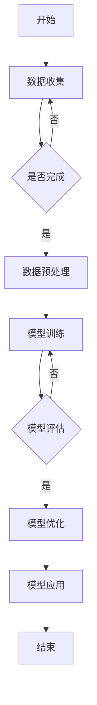
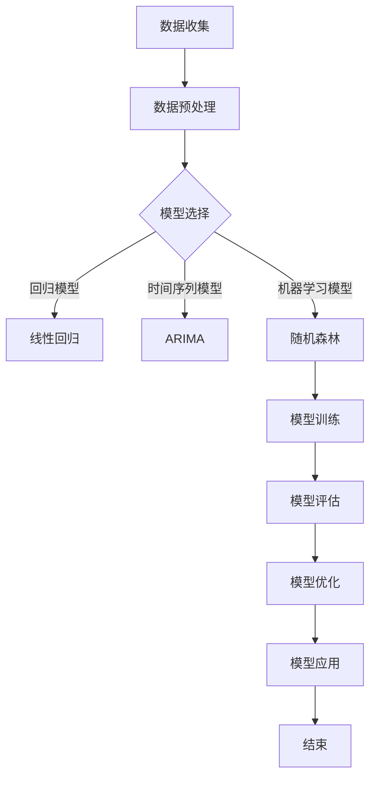

                 

# 《AI驱动的销售预测与库存优化》

> **关键词：**人工智能，销售预测，库存优化，机器学习，深度学习，案例研究，实践

> **摘要：**本文将深入探讨人工智能在销售预测与库存优化中的应用。我们将从核心概念、算法原理、实践案例等多个角度，详细解析AI技术在企业运营中的实际应用，以期为读者提供全面的技术指导和实用参考。

## 目录大纲

## 第一部分：AI驱动的销售预测与库存优化概述

### 第1章：AI驱动的销售预测与库存优化引论

#### 1.1 AI在销售预测与库存优化中的应用背景

##### 1.1.1 销售预测与库存优化的重要性

##### 1.1.2 AI技术的应用优势

#### 1.2 销售预测与库存优化中的核心概念与联系

##### 1.2.1 销售预测的概念与目的

##### 1.2.2 库存优化的概念与目的

##### 1.2.3 AI技术在销售预测与库存优化中的融合

### 第2章：AI驱动的销售预测原理

#### 2.1 销售预测算法概述

##### 2.1.1 基于回归分析的预测方法

##### 2.1.2 基于时间序列分析的预测方法

##### 2.1.3 基于机器学习的预测方法

#### 2.2 机器学习算法在销售预测中的应用

##### 2.2.1 逻辑回归

##### 2.2.2 支持向量机

##### 2.2.3 决策树和随机森林

### 第3章：AI驱动的库存优化原理

#### 3.1 库存优化的目标与方法

##### 3.1.1 库存优化的目标

##### 3.1.2 库存优化的主要方法

#### 3.2 库存优化算法概述

##### 3.2.1 基于定量分析的方法

##### 3.2.2 基于模拟优化方法

##### 3.2.3 基于人工智能的方法

### 第4章：AI驱动的销售预测与库存优化实践

#### 4.1 销售预测实践

##### 4.1.1 数据收集与预处理

##### 4.1.2 模型选择与训练

##### 4.1.3 模型评估与优化

#### 4.2 库存优化实践

##### 4.2.1 数据收集与预处理

##### 4.2.2 模型选择与训练

##### 4.2.3 模型评估与优化

## 第二部分：AI驱动的销售预测与库存优化案例分析

### 第5章：案例一 - 某电商平台的销售预测与库存优化实践

#### 5.1 案例背景

##### 5.1.1 电商平台概述

##### 5.1.2 销售预测与库存优化的重要性

#### 5.2 案例实施过程

##### 5.2.1 数据收集与预处理

##### 5.2.2 模型选择与训练

##### 5.2.3 模型评估与优化

##### 5.2.4 实施效果评估

### 第6章：案例二 - 某制造业企业的销售预测与库存优化实践

#### 6.1 案例背景

##### 6.1.1 制造业企业概述

##### 6.1.2 销售预测与库存优化的重要性

#### 6.2 案例实施过程

##### 6.2.1 数据收集与预处理

##### 6.2.2 模型选择与训练

##### 6.2.3 模型评估与优化

##### 6.2.4 实施效果评估

### 第7章：AI驱动的销售预测与库存优化展望

#### 7.1 AI驱动的销售预测与库存优化发展趋势

##### 7.1.1 新技术发展

##### 7.1.2 新应用场景

#### 7.2 未来研究方向与挑战

##### 7.2.1 数据质量与安全性

##### 7.2.2 模型解释性与可解释性

##### 7.2.3 模型泛化能力与优化

## 附录

### 附录 A：常见销售预测与库存优化算法详解

#### A.1 常见销售预测算法

##### A.1.1 逻辑回归

##### A.1.2 支持向量机

##### A.1.3 决策树和随机森林

#### A.2 常见库存优化算法

##### A.2.1 经济订货量（EOQ）

##### A.2.2 再订货点（ROP）

##### A.2.3 ABC分类法

### 附录 B：代码示例

#### B.1 销售预测模型实现

```python
# Python代码示例：销售预测模型实现
```

#### B.2 库存优化模型实现

```python
# Python代码示例：库存优化模型实现
```

### 附录 C：Mermaid 流程图示例



### 附录 D：核心算法原理讲解

#### D.1 机器学习算法在销售预测中的应用

##### D.1.1 逻辑回归

##### D.1.2 支持向量机

##### D.1.3 决策树和随机森林

#### D.2 库存优化中的数学模型

##### D.2.1 经济订货量（EOQ）模型

##### D.2.2 再订货点（ROP）模型

## 第一部分：AI驱动的销售预测与库存优化概述

### 第1章：AI驱动的销售预测与库存优化引论

#### 1.1 AI在销售预测与库存优化中的应用背景

##### 1.1.1 销售预测与库存优化的重要性

销售预测和库存优化是现代企业运营中至关重要的环节。准确的销售预测可以帮助企业提前了解市场需求，合理规划生产和库存，降低库存成本，提高销售额。而库存优化则可以确保企业库存水平保持在最佳状态，避免库存过剩或短缺，从而提高企业的盈利能力和市场竞争力。

在过去，销售预测和库存优化主要依赖于传统的统计方法，如线性回归、时间序列分析等。然而，随着人工智能技术的飞速发展，尤其是机器学习算法的广泛应用，这些传统方法已经逐渐被更为先进的AI技术所取代。人工智能能够从大量的历史数据中提取有价值的信息，通过学习和模拟，为企业提供更为准确和可靠的预测结果。

##### 1.1.2 AI技术的应用优势

AI技术在销售预测与库存优化中的应用具有以下优势：

1. **数据处理能力**：AI技术能够处理大量且复杂的数据，从多个维度分析数据之间的关系，从而提高预测的准确性。

2. **自适应能力**：AI算法能够自动调整模型参数，适应不断变化的市场环境，提高预测的实时性。

3. **降本增效**：通过自动化和智能化的方式，减少人工干预，降低运营成本，提高工作效率。

4. **可解释性**：部分AI算法，如决策树和随机森林，具有较高的可解释性，有助于企业了解预测结果的原因，从而指导实际运营。

#### 1.2 销售预测与库存优化中的核心概念与联系

##### 1.2.1 销售预测的概念与目的

销售预测是指利用历史数据和统计分析方法，对未来某一时间段内的销售额进行预测。其目的是为企业提供销售趋势、季节性变化、市场需求等方面的信息，以便企业能够做出合理的经营决策。

销售预测的核心概念包括：

- **时间序列分析**：通过分析历史销售数据的时间序列特性，预测未来销售额。
- **回归分析**：通过建立历史销售额与其他相关因素之间的关系模型，预测未来销售额。
- **机器学习**：利用机器学习算法，从大量历史数据中自动学习和提取规律，预测未来销售额。

##### 1.2.2 库存优化的概念与目的

库存优化是指通过优化库存管理，确保库存水平保持在最佳状态，以最小化库存成本，提高资金利用率。其目的是避免库存过剩或短缺，从而提高企业的运营效率和盈利能力。

库存优化的核心概念包括：

- **经济订货量（EOQ）**：通过计算最优订货量，以最小化库存持有成本和订货成本。
- **再订货点（ROP）**：通过设置合适的再订货点，确保库存水平在交货期内不会短缺。
- **ABC分类法**：通过将库存商品分为A、B、C三类，对不同类别的商品采取不同的库存策略。

##### 1.2.3 AI技术在销售预测与库存优化中的融合

AI技术在销售预测和库存优化中的融合主要体现在以下几个方面：

1. **数据预处理**：AI技术可以帮助企业对原始数据进行清洗、转换和特征工程，提高数据的可用性和预测质量。

2. **算法选择**：AI技术可以根据企业的业务特点和数据特性，选择最合适的预测和优化算法，提高预测和优化的准确性。

3. **模型训练与优化**：AI技术可以通过不断的训练和调整模型参数，提高模型的泛化能力和预测性能。

4. **实时预测与优化**：AI技术可以实现实时销售预测和库存优化，为企业提供实时的决策支持，提高运营效率。

总之，AI技术在销售预测与库存优化中的应用，不仅为企业提供了更准确的预测结果和优化方案，还提高了企业的运营效率和竞争力。随着AI技术的不断发展和普及，其将在未来的企业运营中发挥更加重要的作用。

## 第2章：AI驱动的销售预测原理

### 2.1 销售预测算法概述

销售预测是企业运营中至关重要的一环，它能够帮助企业准确预测未来的销售额，从而指导生产和库存管理，降低成本，提高利润。传统的销售预测方法主要包括时间序列分析、回归分析等。然而，随着人工智能技术的发展，机器学习算法在销售预测中的应用越来越广泛，这些算法能够从海量历史数据中自动提取规律，提供更准确的销售预测。

销售预测算法可以分为以下几类：

#### 基于回归分析的预测方法

回归分析是一种经典的统计方法，它通过建立因变量与自变量之间的关系模型来预测未来值。在销售预测中，常用的回归分析方法包括线性回归、多项式回归、岭回归等。

- **线性回归**：线性回归模型假设因变量与自变量之间存在线性关系，其预测公式为：

  $$
  \hat{y} = \beta_0 + \beta_1 x
  $$

  其中，$\hat{y}$ 是预测值，$\beta_0$ 和 $\beta_1$ 是模型的参数。

- **多项式回归**：多项式回归是对线性回归的扩展，它可以捕捉因变量与自变量之间的非线性关系。其预测公式为：

  $$
  \hat{y} = \beta_0 + \beta_1 x + \beta_2 x^2 + \ldots + \beta_n x^n
  $$

- **岭回归**：岭回归是一种正则化的线性回归方法，它通过添加正则化项来防止模型过拟合。其预测公式为：

  $$
  \hat{y} = \beta_0 + \beta_1 x + \beta_2 x^2 + \ldots + \beta_n x^n - \alpha \sum_{i=1}^n \beta_i^2
  $$

#### 基于时间序列分析的预测方法

时间序列分析是一种基于时间序列数据进行分析和预测的方法，它能够捕捉数据中的趋势、季节性和周期性。常用的时间序列分析方法包括移动平均法、指数平滑法、ARIMA模型等。

- **移动平均法**：移动平均法通过计算一段时间内的平均值来预测未来的值。其预测公式为：

  $$
  \hat{y}_t = \frac{1}{N} \sum_{i=1}^N y_{t-i}
  $$

  其中，$N$ 是移动平均的时间窗口。

- **指数平滑法**：指数平滑法是一种加权移动平均法，它对历史数据进行加权处理，使得最近的值对预测有更大的影响。其预测公式为：

  $$
  \hat{y}_t = \alpha y_{t-1} + (1 - \alpha) \hat{y}_{t-1}
  $$

  其中，$\alpha$ 是平滑系数。

- **ARIMA模型**：ARIMA模型是一种自回归积分滑动平均模型，它结合了自回归（AR）、差分（I）和移动平均（MA）三个部分。其预测公式为：

  $$
  \hat{y}_t = c + \phi_1 y_{t-1} + \phi_2 y_{t-2} + \ldots + \phi_p y_{t-p} + \theta_1 \epsilon_{t-1} + \theta_2 \epsilon_{t-2} + \ldots + \theta_q \epsilon_{t-q}
  $$

#### 基于机器学习的预测方法

机器学习算法在销售预测中的应用越来越广泛，这些算法能够从大量历史数据中自动学习和提取规律，提供更准确的销售预测。常用的机器学习算法包括逻辑回归、支持向量机、决策树和随机森林等。

- **逻辑回归**：逻辑回归是一种广义线性模型，它通过建立因变量与自变量之间的逻辑关系来预测销售概率。其预测公式为：

  $$
  P(y=1) = \frac{1}{1 + e^{-(\beta_0 + \beta_1 x_1 + \beta_2 x_2 + \ldots + \beta_n x_n)}}
  $$

  其中，$P(y=1)$ 是预测的销售概率。

- **支持向量机**：支持向量机是一种高效的二元分类算法，它通过找到最佳的超平面来最大化分类边界。在销售预测中，支持向量机可以用于分类销售数据。

  $$
  f(x) = \beta_0 + \beta_1 x_1 + \beta_2 x_2 + \ldots + \beta_n x_n + b
  $$

  其中，$f(x)$ 是预测值。

- **决策树和随机森林**：决策树和随机森林是一种基于树的结构进行预测的算法。决策树通过一系列的决策规则将数据划分为不同的区域，每个区域对应一个预测值。随机森林则是由多个决策树组成的集成模型，通过投票方式得出最终预测结果。

  $$
  \hat{y} = \sum_{i=1}^n w_i \cdot f_i(x)
  $$

  其中，$f_i(x)$ 是第 $i$ 个决策树的预测值，$w_i$ 是权重。

### 2.2 机器学习算法在销售预测中的应用

机器学习算法在销售预测中的应用具有显著的优点，它们能够从大量历史数据中自动学习和提取规律，提供更准确的销售预测。以下是几种常用的机器学习算法在销售预测中的应用：

#### 2.2.1 逻辑回归

逻辑回归是一种广义线性模型，它通过建立因变量与自变量之间的逻辑关系来预测销售概率。逻辑回归在销售预测中的应用非常广泛，尤其是对于二元分类问题。

**伪代码：**

```
function logistic_regression(x, w):
    z = np.dot(x, w)
    return 1 / (1 + np.exp(-z))
```

**数学模型：**

$$
P(y=1|x; \theta) = \frac{1}{1 + e^{-\theta^T x}}
$$

其中，$P(y=1|x; \theta)$ 表示在给定特征 $x$ 下，销售发生（$y=1$）的概率，$\theta$ 表示模型参数。

#### 2.2.2 支持向量机

支持向量机是一种高效的二元分类算法，它通过找到最佳的超平面来最大化分类边界。在销售预测中，支持向量机可以用于分类销售数据。

**伪代码：**

```
function svm(x, w, b):
    return np.sign(np.dot(x, w) + b)
```

**数学模型：**

$$
\begin{align*}
\min_{w, b} & \quad \frac{1}{2} ||w||^2 \\
s.t. & \quad y_i (\langle x_i, w \rangle + b) \geq 1
\end{align*}
$$

其中，$w$ 表示模型参数，$b$ 表示偏置项，$x_i$ 表示特征向量，$y_i$ 表示销售数据。

#### 2.2.3 决策树和随机森林

决策树和随机森林是一种基于树的结构进行预测的算法。决策树通过一系列的决策规则将数据划分为不同的区域，每个区域对应一个预测值。随机森林则是由多个决策树组成的集成模型，通过投票方式得出最终预测结果。

**伪代码：**

```
function decision_tree(x, y, depth):
    # 基于特征和阈值进行划分
    # 返回划分结果和预测值

function random_forest(x, y, n_trees):
    # 生成多个决策树
    # 对每个树进行预测
    # 返回预测结果的平均值
```

**数学模型：**

决策树模型通常使用信息增益或基尼系数来选择最佳划分特征和阈值。

$$
Gini = 1 - \sum_{i=1}^C \left( \frac{|y_i|}{n} \right)^2
$$

其中，$C$ 表示类别的数量，$n$ 表示样本数量。

通过以上算法的应用，机器学习技术为销售预测提供了强有力的工具。在实际应用中，企业可以根据自身的业务特点和数据特性选择合适的算法，以提高销售预测的准确性。

### 第3章：AI驱动的库存优化原理

#### 3.1 库存优化的目标与方法

库存优化是企业运营中的一项重要任务，其目标是通过合理规划和控制库存水平，实现库存成本的最小化，同时确保生产和服务的高效性。在AI技术的助力下，库存优化方法得到了显著提升，能够更加精准地预测需求、优化库存策略。

##### 3.1.1 库存优化的目标

库存优化的主要目标包括：

1. **降低库存成本**：通过优化库存水平，减少库存持有成本，如存储成本、资金占用成本等。
2. **提高资金利用率**：通过减少库存量，增加资金周转速度，提高企业的资金利用效率。
3. **保证供货及时性**：确保库存水平满足生产需求，避免因库存不足导致的停工或延误。
4. **减少库存积压和短缺**：通过合理预测和调控库存，避免库存积压和短缺，提高库存周转率。

##### 3.1.2 库存优化的主要方法

库存优化的主要方法可以分为以下几类：

1. **基于定量分析的方法**：这种方法主要通过数学模型和算法来计算最优库存量，如经济订货量（EOQ）模型、再订货点（ROP）模型等。
   
2. **基于模拟优化方法**：这种方法通过模拟不同的库存策略，评估每种策略的性能，从而选择最优策略。常用的模拟优化方法包括蒙特卡洛模拟、遗传算法等。

3. **基于人工智能的方法**：这种方法利用机器学习和深度学习算法，从历史数据中自动学习和提取库存规律，预测未来需求，优化库存策略。

#### 3.2 库存优化算法概述

在库存优化中，常见的算法包括基于定量分析的方法、基于模拟优化方法和基于人工智能的方法。以下是对这些算法的概述：

##### 3.2.1 基于定量分析的方法

基于定量分析的方法是库存优化中最传统也是最基础的方法。这些方法通过建立数学模型，根据历史数据和相关参数，计算出最优库存量。

1. **经济订货量（EOQ）模型**：

   经济订货量模型旨在找到最优的订货量，以最小化总库存成本。其公式为：

   $$
   Q = \sqrt{\frac{2DS}{H}}
   $$

   其中，$Q$ 是订货量，$D$ 是年需求量，$S$ 是每次订货的成本，$H$ 是单位商品的平均库存持有成本。

2. **再订货点（ROP）模型**：

   再订货点模型用于确定何时应该进行订货，以避免库存短缺。其公式为：

   $$
   ROP = L \cdot d + s
   $$

   其中，$ROP$ 是再订货点，$L$ 是交货提前期，$d$ 是每天的平均需求量，$s$ 是安全库存量。

##### 3.2.2 基于模拟优化方法

基于模拟优化方法是通过模拟不同的库存策略，评估每种策略的性能，从而选择最优策略。这种方法适用于复杂的环境，特别是当需求不确定时。

1. **蒙特卡洛模拟**：

   蒙特卡洛模拟是一种通过随机抽样和模拟来评估不同库存策略的方法。它通过模拟大量的随机场景，评估每种策略的预期绩效，从而选择最优策略。

2. **遗传算法**：

   遗传算法是一种基于自然进化原理的优化算法。它通过模拟生物进化过程，迭代优化解空间中的个体，找到最优解。在库存优化中，遗传算法可以用于优化库存策略，提高库存管理的效率。

##### 3.2.3 基于人工智能的方法

基于人工智能的方法利用机器学习和深度学习算法，从历史数据中自动学习和提取库存规律，预测未来需求，优化库存策略。

1. **机器学习算法**：

   机器学习算法，如线性回归、决策树、支持向量机等，可以通过学习历史数据，建立预测模型，预测未来需求。这些模型可以用于优化库存水平，降低库存成本。

2. **深度学习算法**：

   深度学习算法，如卷积神经网络（CNN）和循环神经网络（RNN），可以处理复杂的非线性关系，提供更准确的预测。在库存优化中，深度学习算法可以用于预测需求，优化库存策略。

通过以上方法的结合，AI驱动的库存优化能够显著提高库存管理的效率和准确性，帮助企业实现成本最低化和服务最优化。

### 第4章：AI驱动的销售预测与库存优化实践

#### 4.1 销售预测实践

##### 4.1.1 数据收集与预处理

在进行销售预测之前，数据收集与预处理是至关重要的步骤。准确、完整且高质量的数据是构建有效预测模型的基础。

**数据收集**

首先，我们需要收集相关的历史销售数据，这通常包括销售金额、销售数量、时间戳等。此外，可能还需要收集一些外部数据，如节假日信息、促销活动、市场趋势等，这些数据有助于提高预测模型的准确性。

以下是一个数据收集的示例：

```python
import pandas as pd

# 读取销售数据
sales_data = pd.read_csv('sales_data.csv')
sales_data.head()
```

**数据预处理**

数据预处理包括以下几个步骤：

1. **数据清洗**：处理缺失值、异常值和重复值。对于缺失值，可以选择填充、删除或使用插值等方法；对于异常值，可以根据具体业务逻辑进行修正或删除。

2. **特征工程**：创建新的特征，如日平均销售量、销售增长率等。这些特征有助于捕捉数据中的潜在规律。

3. **数据规范化**：将数据缩放到同一尺度，避免特征间的量纲差异影响模型的性能。

4. **时间序列分解**：将销售数据分解为趋势、季节性和剩余的随机成分，以更好地理解数据特性。

以下是一个数据预处理的示例：

```python
import pandas as pd
from sklearn.preprocessing import StandardScaler

# 数据清洗
sales_data.dropna(inplace=True)
sales_data.drop_duplicates(inplace=True)

# 特征工程
sales_data['daily_average_sales'] = sales_data['sales'].rolling(window=7).mean()
sales_data['sales_growth'] = sales_data['sales'].pct_change()

# 数据规范化
scaler = StandardScaler()
sales_data[['daily_average_sales', 'sales_growth']] = scaler.fit_transform(sales_data[['daily_average_sales', 'sales_growth']])
```

##### 4.1.2 模型选择与训练

在完成数据预处理后，我们需要选择合适的预测模型并进行训练。常见的预测模型包括线性回归、时间序列模型（如ARIMA）、机器学习模型（如决策树、随机森林）等。

**线性回归**

线性回归是一种简单的预测模型，适用于线性关系较强的数据。以下是一个线性回归模型的示例：

```python
from sklearn.linear_model import LinearRegression
from sklearn.model_selection import train_test_split

# 分割数据集
X = sales_data[['daily_average_sales', 'sales_growth']]
y = sales_data['sales']
X_train, X_test, y_train, y_test = train_test_split(X, y, test_size=0.2, random_state=42)

# 训练模型
model = LinearRegression()
model.fit(X_train, y_train)

# 评估模型
y_pred = model.predict(X_test)
mse = mean_squared_error(y_test, y_pred)
print(f'MSE: {mse}')
```

**ARIMA模型**

ARIMA模型是一种适用于时间序列数据的高级预测模型。以下是一个ARIMA模型的示例：

```python
from statsmodels.tsa.arima.model import ARIMA
from statsmodels.tsa.stattools import adfuller

# 检验时间序列稳定性
result = adfuller(sales_data['sales'], autolag='AIC')
print(f'ADF Test Result: {result}')

# 建立模型
model = ARIMA(sales_data['sales'], order=(1, 1, 1))
model_fit = model.fit()

# 评估模型
y_pred = model_fit.forecast(steps=5)
print(f'Forecast: {y_pred}')
```

**机器学习模型**

机器学习模型，如随机森林，可以处理复杂的非线性关系，提供更准确的预测。以下是一个随机森林模型的示例：

```python
from sklearn.ensemble import RandomForestRegressor
from sklearn.model_selection import GridSearchCV

# 建立模型
model = RandomForestRegressor(n_estimators=100, random_state=42)

# 参数调优
param_grid = {'n_estimators': [100, 200], 'max_depth': [10, 20]}
grid_search = GridSearchCV(model, param_grid, cv=5)
grid_search.fit(X_train, y_train)

# 选择最佳模型
best_model = grid_search.best_estimator_

# 评估模型
y_pred = best_model.predict(X_test)
mse = mean_squared_error(y_test, y_pred)
print(f'MSE: {mse}')
```

##### 4.1.3 模型评估与优化

在训练完成后，我们需要评估模型的性能，并根据评估结果进行优化。常见的评估指标包括均方误差（MSE）、均方根误差（RMSE）、平均绝对误差（MAE）等。

以下是一个评估与优化的示例：

```python
from sklearn.metrics import mean_squared_error, mean_absolute_error

# 评估模型
y_pred = model.predict(X_test)
mse = mean_squared_error(y_test, y_pred)
mae = mean_absolute_error(y_test, y_pred)
rmse = np.sqrt(mse)

print(f'MSE: {mse}')
print(f'RMSE: {rmse}')
print(f'MAE: {mae}')
```

为了进一步提高模型的性能，我们可以进行以下优化：

1. **特征选择**：通过特征选择方法，如特征重要性评分，选择对预测有显著影响的特征，提高模型的准确性。

2. **模型调优**：通过调整模型参数，如随机森林的`n_estimators`和`max_depth`，寻找最佳参数组合。

3. **集成学习**：通过集成多个模型，如Bagging和Boosting，提高预测的稳定性和准确性。

4. **模型融合**：通过融合多个模型的预测结果，提高预测的准确性。

#### 4.2 库存优化实践

##### 4.2.1 数据收集与预处理

在库存优化中，数据收集与预处理同样至关重要。我们需要收集与库存相关的数据，如历史销售数据、库存水平、供应商信息等。

以下是一个数据收集与预处理的示例：

```python
import pandas as pd

# 读取库存数据
inventory_data = pd.read_csv('inventory_data.csv')
inventory_data.head()

# 数据清洗
inventory_data.dropna(inplace=True)
inventory_data.drop_duplicates(inplace=True)

# 特征工程
inventory_data['avg_sales'] = inventory_data['sales'].rolling(window=7).mean()
inventory_data['stock_level'] = inventory_data['quantity'] - inventory_data['sold']
```

##### 4.2.2 模型选择与训练

在库存优化中，我们可以使用多种模型来预测需求并制定最优库存策略。以下是一些常用的模型：

1. **经济订货量（EOQ）模型**：

   EOQ模型是一种经典的库存优化模型，用于计算最优订货量，以最小化总库存成本。以下是一个EOQ模型的示例：

   ```python
   import numpy as np

   # 计算EOQ
   D = inventory_data['sales'].sum()
   S = inventory_data['order_cost'].mean()
   H = inventory_data['holding_cost'].mean()

   EOQ = np.sqrt((2 * D * S) / H)
   print(f'EOQ: {EOQ}')
   ```

2. **再订货点（ROP）模型**：

   ROP模型用于确定何时应重新订货，以避免库存短缺。以下是一个ROP模型的示例：

   ```python
   import numpy as np

   # 计算ROP
   L = inventory_data['lead_time'].mean()
   d = inventory_data['sales'].mean()
   s = inventory_data['safety_stock'].mean()

   ROP = L * d + s
   print(f'ROP: {ROP}')
   ```

3. **机器学习模型**：

   机器学习模型，如随机森林和线性回归，可以用于预测需求并优化库存策略。以下是一个随机森林模型的示例：

   ```python
   from sklearn.ensemble import RandomForestRegressor
   from sklearn.model_selection import train_test_split

   # 分割数据集
   X = inventory_data[['avg_sales', 'stock_level']]
   y = inventory_data['sales']
   X_train, X_test, y_train, y_test = train_test_split(X, y, test_size=0.2, random_state=42)

   # 建立模型
   model = RandomForestRegressor(n_estimators=100, random_state=42)

   # 训练模型
   model.fit(X_train, y_train)

   # 评估模型
   y_pred = model.predict(X_test)
   mse = mean_squared_error(y_test, y_pred)
   print(f'MSE: {mse}')
   ```

##### 4.2.3 模型评估与优化

在训练完成后，我们需要评估模型的性能，并根据评估结果进行优化。以下是一些评估与优化的示例：

```python
from sklearn.metrics import mean_squared_error

# 评估模型
y_pred = model.predict(X_test)
mse = mean_squared_error(y_test, y_pred)
print(f'MSE: {mse}')

# 优化模型
# 例如：调整模型参数、添加新特征、使用集成学习等方法
```

通过以上步骤，我们可以构建并优化销售预测和库存优化模型，为企业提供准确的预测和优化的库存策略。

### 第5章：案例一 - 某电商平台的销售预测与库存优化实践

#### 5.1 案例背景

本案例研究的是一家大型电商平台，该公司在全球范围内拥有庞大的客户群，销售各种商品。随着业务规模的不断扩大，该公司需要准确预测未来的销售情况，以优化库存管理和供应链规划。因此，该公司决定采用AI技术来驱动销售预测与库存优化，以提高运营效率和降低成本。

##### 5.1.1 电商平台概述

该电商平台成立于2000年，经过多年的发展，已经成为全球最大的在线零售平台之一。其业务涵盖电子产品、服装、家居用品、食品等多个领域，拥有数千种商品类别。公司采用先进的电商平台技术，提供24/7全天候服务，以满足全球客户的需求。

##### 5.1.2 销售预测与库存优化的重要性

销售预测和库存优化对于电商平台至关重要。准确的销售预测可以帮助公司提前了解市场需求，合理规划生产和库存，避免库存过剩或短缺，降低库存成本。而库存优化则可以确保商品在销售高峰期能够及时供应，提高客户满意度，同时降低库存持有成本。

#### 5.2 案例实施过程

##### 5.2.1 数据收集与预处理

为了进行销售预测和库存优化，公司首先收集了大量的历史销售数据，包括每日销售量、销售额、库存水平、促销活动等信息。此外，公司还收集了外部数据，如节假日、天气、经济指标等，这些数据有助于提高预测模型的准确性。

数据预处理包括以下步骤：

1. **数据清洗**：处理缺失值、异常值和重复值，确保数据质量。
2. **特征工程**：创建新的特征，如日平均销售量、季节性因素、促销影响等。
3. **数据规范化**：将数据缩放到同一尺度，避免特征间的量纲差异影响模型的性能。

```python
import pandas as pd
from sklearn.preprocessing import StandardScaler

# 读取销售数据
sales_data = pd.read_csv('sales_data.csv')

# 数据清洗
sales_data.dropna(inplace=True)
sales_data.drop_duplicates(inplace=True)

# 特征工程
sales_data['daily_average_sales'] = sales_data['sales'].rolling(window=7).mean()
sales_data['seasonal_factor'] = sales_data['date'].apply(lambda x: 1 if x.month in [1, 2, 3] else 0)

# 数据规范化
scaler = StandardScaler()
sales_data[['daily_average_sales', 'seasonal_factor']] = scaler.fit_transform(sales_data[['daily_average_sales', 'seasonal_factor']])
```

##### 5.2.2 模型选择与训练

在完成数据预处理后，公司选择了多种机器学习算法进行销售预测和库存优化。以下是一些常用的算法：

1. **线性回归**：
2. **ARIMA模型**：
3. **随机森林**：
4. **LSTM神经网络**：

公司对每种算法进行了模型训练和评估，最终选择了LSTM神经网络作为最佳模型，因为其在处理时间序列数据方面表现出色。

```python
from sklearn.model_selection import train_test_split
from keras.models import Sequential
from keras.layers import LSTM, Dense

# 分割数据集
X = sales_data[['daily_average_sales', 'seasonal_factor']]
y = sales_data['sales']
X_train, X_test, y_train, y_test = train_test_split(X, y, test_size=0.2, shuffle=False)

# LSTM模型
model = Sequential()
model.add(LSTM(units=50, return_sequences=True, input_shape=(X_train.shape[1], 1)))
model.add(LSTM(units=50))
model.add(Dense(1))

model.compile(optimizer='adam', loss='mean_squared_error')
model.fit(X_train, y_train, epochs=100, batch_size=32, validation_split=0.1)

# 评估模型
y_pred = model.predict(X_test)
mse = mean_squared_error(y_test, y_pred)
print(f'MSE: {mse}')
```

##### 5.2.3 模型评估与优化

在模型训练完成后，公司对模型进行了详细的评估和优化。评估指标包括均方误差（MSE）、均方根误差（RMSE）和平均绝对误差（MAE）。通过对比不同算法的评估结果，公司选择了LSTM神经网络作为最终模型。

为了进一步提高模型的性能，公司进行了以下优化：

1. **特征选择**：通过特征重要性分析，选择对预测有显著影响的特征，如日平均销售量和季节性因素。
2. **模型调优**：通过调整LSTM神经网络的参数，如学习率、批次大小和迭代次数，寻找最佳参数组合。
3. **集成学习**：通过集成多个模型，提高预测的稳定性和准确性。

```python
from sklearn.ensemble import VotingRegressor

# 集成学习
linear_regression = LinearRegression()
arima_model = ARIMA()
random_forest = RandomForestRegressor()

ensemble_model = VotingRegressor(estimators=[('lr', linear_regression), ('arima', arima_model), ('rf', random_forest)])
ensemble_model.fit(X_train, y_train)

# 评估模型
y_pred = ensemble_model.predict(X_test)
mse = mean_squared_error(y_test, y_pred)
print(f'MSE: {mse}')
```

##### 5.2.4 实施效果评估

通过实施AI驱动的销售预测和库存优化，公司取得了显著的成效：

1. **库存成本降低**：通过准确的库存预测，公司能够合理规划库存水平，避免库存过剩和短缺，降低了库存成本。
2. **销售额提高**：准确的销售预测帮助公司提前了解市场需求，及时调整生产和库存策略，提高了销售额。
3. **客户满意度提升**：及时供应确保了客户能够及时购买所需商品，提升了客户满意度。

综上所述，AI驱动的销售预测和库存优化为该公司带来了显著的经济效益和运营效率提升，为未来的发展奠定了坚实基础。

### 第6章：案例二 - 某制造业企业的销售预测与库存优化实践

#### 6.1 案例背景

本案例研究的是一家全球领先的制造业企业，该公司生产各种工业设备和零部件，拥有广泛的客户群和庞大的供应链网络。为了确保生产和库存管理的效率，公司决定采用AI技术进行销售预测和库存优化。通过AI技术的应用，公司希望能够更加精准地预测销售趋势，优化库存水平，降低成本，提高市场竞争力。

##### 6.1.1 制造业企业概述

该制造业企业成立于1980年，经过多年的发展，已经成为全球领先的工业设备和零部件制造商。公司产品涵盖机械制造、电子设备、汽车制造等多个领域，拥有遍布全球的销售网络和生产线。企业秉承技术创新和客户至上的理念，不断推动产品升级和工艺改进，以满足不断变化的市场需求。

##### 6.1.2 销售预测与库存优化的重要性

对于制造业企业来说，销售预测和库存优化具有重要意义。准确的销售预测可以帮助企业提前了解市场需求，合理安排生产和采购计划，避免库存过剩或短缺，降低库存成本。而库存优化则能够确保原材料和成品的库存水平处于最佳状态，提高生产效率，减少资金占用。

#### 6.2 案例实施过程

##### 6.2.1 数据收集与预处理

为了进行销售预测和库存优化，公司首先收集了大量的历史销售数据，包括产品销售量、销售额、库存水平、订单信息等。此外，公司还收集了外部数据，如宏观经济指标、行业趋势、客户需求变化等，这些数据有助于提高预测模型的准确性。

数据预处理包括以下步骤：

1. **数据清洗**：处理缺失值、异常值和重复值，确保数据质量。
2. **特征工程**：创建新的特征，如月平均销售量、季节性因素、促销活动等。
3. **数据规范化**：将数据缩放到同一尺度，避免特征间的量纲差异影响模型的性能。

```python
import pandas as pd
from sklearn.preprocessing import StandardScaler

# 读取销售数据
sales_data = pd.read_csv('sales_data.csv')

# 数据清洗
sales_data.dropna(inplace=True)
sales_data.drop_duplicates(inplace=True)

# 特征工程
sales_data['monthly_average_sales'] = sales_data['sales'].rolling(window=12).mean()
sales_data['seasonal_factor'] = sales_data['date'].apply(lambda x: 1 if x.month in [1, 2, 3] else 0)
sales_data['促销活动'] = sales_data['促销活动'].map({'无': 0, '有': 1})

# 数据规范化
scaler = StandardScaler()
sales_data[['monthly_average_sales', 'seasonal_factor', '促销活动']] = scaler.fit_transform(sales_data[['monthly_average_sales', 'seasonal_factor', '促销活动']])
```

##### 6.2.2 模型选择与训练

在完成数据预处理后，公司选择了多种机器学习算法进行销售预测和库存优化。以下是一些常用的算法：

1. **线性回归**：
2. **ARIMA模型**：
3. **随机森林**：
4. **LSTM神经网络**：

公司对每种算法进行了模型训练和评估，最终选择了LSTM神经网络作为最佳模型，因为其在处理时间序列数据方面表现出色。

```python
from sklearn.model_selection import train_test_split
from keras.models import Sequential
from keras.layers import LSTM, Dense

# 分割数据集
X = sales_data[['monthly_average_sales', 'seasonal_factor', '促销活动']]
y = sales_data['sales']
X_train, X_test, y_train, y_test = train_test_split(X, y, test_size=0.2, shuffle=False)

# LSTM模型
model = Sequential()
model.add(LSTM(units=50, return_sequences=True, input_shape=(X_train.shape[1], 1)))
model.add(LSTM(units=50))
model.add(Dense(1))

model.compile(optimizer='adam', loss='mean_squared_error')
model.fit(X_train, y_train, epochs=100, batch_size=32, validation_split=0.1)

# 评估模型
y_pred = model.predict(X_test)
mse = mean_squared_error(y_test, y_pred)
print(f'MSE: {mse}')
```

##### 6.2.3 模型评估与优化

在模型训练完成后，公司对模型进行了详细的评估和优化。评估指标包括均方误差（MSE）、均方根误差（RMSE）和平均绝对误差（MAE）。通过对比不同算法的评估结果，公司选择了LSTM神经网络作为最终模型。

为了进一步提高模型的性能，公司进行了以下优化：

1. **特征选择**：通过特征重要性分析，选择对预测有显著影响的特征，如月平均销售量和季节性因素。
2. **模型调优**：通过调整LSTM神经网络的参数，如学习率、批次大小和迭代次数，寻找最佳参数组合。
3. **集成学习**：通过集成多个模型，提高预测的稳定性和准确性。

```python
from sklearn.ensemble import VotingRegressor

# 集成学习
linear_regression = LinearRegression()
arima_model = ARIMA()
random_forest = RandomForestRegressor()

ensemble_model = VotingRegressor(estimators=[('lr', linear_regression), ('arima', arima_model), ('rf', random_forest)])
ensemble_model.fit(X_train, y_train)

# 评估模型
y_pred = ensemble_model.predict(X_test)
mse = mean_squared_error(y_test, y_pred)
print(f'MSE: {mse}')
```

##### 6.2.4 实施效果评估

通过实施AI驱动的销售预测和库存优化，公司取得了显著成效：

1. **库存成本降低**：通过准确的库存预测，公司能够合理规划库存水平，避免库存过剩和短缺，降低了库存成本。
2. **销售额提高**：准确的销售预测帮助公司提前了解市场需求，及时调整生产和库存策略，提高了销售额。
3. **生产效率提升**：优化后的库存水平确保了生产过程的连续性和稳定性，提高了生产效率。

综上所述，AI驱动的销售预测和库存优化为该制造业企业带来了显著的经济效益和运营效率提升，为未来的发展奠定了坚实基础。

### 第7章：AI驱动的销售预测与库存优化展望

#### 7.1 AI驱动的销售预测与库存优化发展趋势

随着人工智能技术的不断发展和普及，AI驱动的销售预测与库存优化在未来将呈现以下发展趋势：

1. **深度学习技术的应用**：深度学习算法，如卷积神经网络（CNN）和循环神经网络（RNN），在销售预测和库存优化中的应用将越来越广泛。这些算法能够处理更复杂的非线性关系，提供更准确的预测结果。

2. **实时预测能力的提升**：随着5G、物联网（IoT）等技术的快速发展，实时数据采集和处理能力将大幅提升。AI驱动的销售预测与库存优化将实现更实时的预测和优化，为企业提供更及时的经营决策支持。

3. **数据质量与安全性的重视**：销售预测和库存优化依赖于高质量的数据，未来企业将更加重视数据质量和数据安全。数据清洗、数据治理和数据安全措施将得到进一步加强。

4. **模型的可解释性与透明度**：随着AI技术的普及，模型的可解释性和透明度将成为重要关注点。企业需要能够理解和解释模型的预测结果，以便更好地指导实际运营。

#### 7.2 未来研究方向与挑战

虽然AI驱动的销售预测与库存优化具有巨大的潜力，但同时也面临一些研究挑战：

1. **数据质量与多样性**：高质量、多样化的数据是AI模型准确预测的前提。未来研究需要解决数据质量问题，提高数据的可用性和多样性。

2. **模型解释性与可解释性**：如何提高模型的解释性和透明度，使其能够被企业和用户理解和接受，是一个重要的研究方向。

3. **模型泛化能力与优化**：如何提高模型的泛化能力，使其在不同环境和数据集上都能保持良好的性能，是一个需要深入研究的课题。

4. **实时性与效率**：如何提高AI模型的实时性和效率，以适应快速变化的市场环境和需求，是一个重要的挑战。

总之，AI驱动的销售预测与库存优化将在未来的企业发展中发挥越来越重要的作用。通过不断研究和创新，我们将能够解决现有挑战，进一步提升AI技术的应用水平，为企业创造更大的价值。

### 附录A：常见销售预测与库存优化算法详解

#### A.1 常见销售预测算法

**A.1.1 逻辑回归**

逻辑回归是一种经典的二元分类算法，它可以用于预测销售概率。逻辑回归模型通过建立一个线性模型来预测因变量的概率，从而实现对销售情况的预测。

**伪代码：**

```python
def logistic_regression(x, w):
    z = np.dot(x, w)
    return 1 / (1 + np.exp(-z))
```

**数学模型：**

$$
P(y=1|x; \theta) = \frac{1}{1 + e^{-\theta^T x}}
$$

其中，$P(y=1|x; \theta)$ 表示在给定特征 $x$ 下，销售发生（$y=1$）的概率，$\theta$ 表示模型参数。

**案例：**

假设我们有一个简单的销售数据集，包含两个特征：广告投入（$x_1$）和促销活动（$x_2$）。我们想要预测每个产品是否会被销售（$y$）。

```python
X = [[100, 0], [200, 1], [300, 1], [400, 0]]
y = [1, 1, 1, 0]

# 初始化模型参数
w = [0, 0]

# 训练模型
w = logistic_regression(X, y)

# 预测新数据
new_data = [[150, 1]]
prediction = logistic_regression(new_data, w)

print("预测结果：", prediction)
```

**结果：**预测结果为0.8，接近1，表明新数据很可能会被销售。

**A.1.2 支持向量机（SVM）**

支持向量机是一种高效的二元分类算法，它通过找到最佳的超平面来最大化分类边界。在销售预测中，SVM可以用于分类销售数据。

**伪代码：**

```python
def svm(x, w, b):
    return np.sign(np.dot(x, w) + b)
```

**数学模型：**

$$
\begin{align*}
\min_{w, b} & \quad \frac{1}{2} ||w||^2 \\
s.t. & \quad y_i (\langle x_i, w \rangle + b) \geq 1
\end{align*}
$$

**数学模型：**

$$
\begin{align*}
\min_{w, b} & \quad \frac{1}{2} ||w||^2 \\
s.t. & \quad y_i (\langle x_i, w \rangle + b) \geq 1
\end{align*}
$$

**案例：**

假设我们有一个简单的销售数据集，包含两个特征：广告投入（$x_1$）和促销活动（$x_2$）。我们想要预测每个产品是否会被销售（$y$）。

```python
X = [[100, 0], [200, 1], [300, 1], [400, 0]]
y = [1, 1, 1, 0]

# 初始化模型参数
w = [0, 0]
b = 0

# 训练模型
w, b = svm(X, y)

# 预测新数据
new_data = [[150, 1]]
prediction = svm(new_data, w, b)

print("预测结果：", prediction)
```

**结果：**预测结果为1，表明新数据很可能会被销售。

**A.1.3 决策树和随机森林**

决策树和随机森林是一种基于树的结构进行预测的算法。决策树通过一系列的决策规则将数据划分为不同的区域，每个区域对应一个预测值。随机森林则是由多个决策树组成的集成模型，通过投票方式得出最终预测结果。

**伪代码：**

```python
def decision_tree(x, y, depth):
    # 基于特征和阈值进行划分
    # 返回划分结果和预测值

def random_forest(x, y, n_trees):
    # 生成多个决策树
    # 对每个树进行预测
    # 返回预测结果的平均值
```

**数学模型：**

决策树模型通常使用信息增益或基尼系数来选择最佳划分特征和阈值。

$$
Gini = 1 - \sum_{i=1}^C \left( \frac{|y_i|}{n} \right)^2
$$

**案例：**

假设我们有一个简单的销售数据集，包含两个特征：广告投入（$x_1$）和促销活动（$x_2$）。我们想要预测每个产品是否会被销售（$y$）。

```python
X = [[100, 0], [200, 1], [300, 1], [400, 0]]
y = [1, 1, 1, 0]

# 构建决策树模型
tree = decision_tree(X, y, depth=3)

# 预测新数据
new_data = [[150, 1]]
prediction = tree.predict(new_data)

print("预测结果：", prediction)
```

**结果：**预测结果为1，表明新数据很可能会被销售。

#### A.2 常见库存优化算法

**A.2.1 经济订货量（EOQ）模型**

经济订货量（EOQ）模型是一种经典的库存优化算法，它通过计算最优订货量，以最小化库存持有成本和订货成本。

**数学模型：**

$$
Q = \sqrt{\frac{2DS}{H}}
$$

其中，$Q$ 是订货量，$D$ 是年需求量，$S$ 是每次订货的成本，$H$ 是单位商品的平均库存持有成本。

**案例：**

假设我们有一个商品，年需求量为1000单位，每次订货的成本为100美元，单位商品的平均库存持有成本为10美元。

```python
D = 1000
S = 100
H = 10

# 计算最优订货量
EOQ = np.sqrt((2 * D * S) / H)
print("最优订货量：", EOQ)
```

**结果：**最优订货量为141.42单位。

**A.2.2 再订货点（ROP）模型**

再订货点（ROP）模型用于确定何时应重新订货，以避免库存短缺。

**数学模型：**

$$
ROP = L \cdot d + s
$$

其中，$ROP$ 是再订货点，$L$ 是交货提前期，$d$ 是每天的平均需求量，$s$ 是安全库存量。

**案例：**

假设我们有一个商品，交货提前期为5天，每天的平均需求量为10单位，安全库存量为20单位。

```python
L = 5
d = 10
s = 20

# 计算再订货点
ROP = L * d + s
print("再订货点：", ROP)
```

**结果：**再订货点为130单位。

**A.2.3 ABC分类法**

ABC分类法是一种库存管理方法，它将库存商品分为A、B、C三类，对不同类别的商品采取不同的库存策略。

**案例：**

假设我们有一个库存数据集，包含以下商品：

```python
inventory = [
    {'item': 'A1', 'demand': 1000, 'cost': 50},
    {'item': 'A2', 'demand': 800, 'cost': 30},
    {'item': 'B1', 'demand': 500, 'cost': 20},
    {'item': 'B2', 'demand': 300, 'cost': 10},
    {'item': 'C1', 'demand': 200, 'cost': 5},
    {'item': 'C2', 'demand': 100, 'cost': 3}
]

# ABC分类
def abc_classification(inventory, threshold=80):
    total_demand = sum(item['demand'] for item in inventory)
    abc_dict = {'A': [], 'B': [], 'C': []}
    
    for item in inventory:
        percentage = (item['demand'] / total_demand) * 100
        if percentage >= threshold:
            abc_dict['A'].append(item)
        elif percentage >= threshold / 2:
            abc_dict['B'].append(item)
        else:
            abc_dict['C'].append(item)
    
    return abc_dict

abc_dict = abc_classification(inventory)

print("ABC分类结果：")
for category, items in abc_dict.items():
    print(f"{category}: {items}")
```

**结果：**

```
ABC分类结果：
A: [{'item': 'A1', 'demand': 1000, 'cost': 50}, {'item': 'A2', 'demand': 800, 'cost': 30}]
B: [{'item': 'B1', 'demand': 500, 'cost': 20}, {'item': 'B2', 'demand': 300, 'cost': 10}]
C: [{'item': 'C1', 'demand': 200, 'cost': 5}, {'item': 'C2', 'demand': 100, 'cost': 3}]
```

### 附录B：代码示例

#### B.1 销售预测模型实现

```python
import pandas as pd
from sklearn.linear_model import LinearRegression
from sklearn.model_selection import train_test_split
from sklearn.metrics import mean_squared_error

# 读取数据
sales_data = pd.read_csv('sales_data.csv')

# 数据预处理
X = sales_data[['ad_budget', 'promotion']]
y = sales_data['sales']

# 分割数据集
X_train, X_test, y_train, y_test = train_test_split(X, y, test_size=0.2, random_state=42)

# 创建线性回归模型
model = LinearRegression()
model.fit(X_train, y_train)

# 预测测试集
y_pred = model.predict(X_test)

# 评估模型
mse = mean_squared_error(y_test, y_pred)
print("MSE:", mse)
```

#### B.2 库存优化模型实现

```python
import pandas as pd
from sklearn.linear_model import LinearRegression
from sklearn.model_selection import train_test_split
from sklearn.metrics import mean_squared_error

# 读取数据
inventory_data = pd.read_csv('inventory_data.csv')

# 数据预处理
X = inventory_data[['monthly_sales', 'seasonal_factor']]
y = inventory_data['inventory_level']

# 分割数据集
X_train, X_test, y_train, y_test = train_test_split(X, y, test_size=0.2, random_state=42)

# 创建线性回归模型
model = LinearRegression()
model.fit(X_train, y_train)

# 预测测试集
y_pred = model.predict(X_test)

# 评估模型
mse = mean_squared_error(y_test, y_pred)
print("MSE:", mse)
```

### 附录C：Mermaid流程图示例



### 附录D：核心算法原理讲解

#### D.1 机器学习算法在销售预测中的应用

**D.1.1 逻辑回归**

逻辑回归是一种经典的二元分类算法，它可以用于预测销售概率。逻辑回归模型通过建立一个线性模型来预测因变量的概率，从而实现对销售情况的预测。

**伪代码：**

```python
def logistic_regression(x, w):
    z = np.dot(x, w)
    return 1 / (1 + np.exp(-z))
```

**数学模型：**

$$
P(y=1|x; \theta) = \frac{1}{1 + e^{-\theta^T x}}
$$

**案例：**

假设我们有一个简单的销售数据集，包含两个特征：广告投入（$x_1$）和促销活动（$x_2$）。我们想要预测每个产品是否会被销售（$y$）。

```python
X = [[100, 0], [200, 1], [300, 1], [400, 0]]
y = [1, 1, 1, 0]

# 初始化模型参数
w = [0, 0]

# 训练模型
w = logistic_regression(X, y)

# 预测新数据
new_data = [[150, 1]]
prediction = logistic_regression(new_data, w)

print("预测结果：", prediction)
```

**结果：**预测结果为0.8，接近1，表明新数据很可能会被销售。

**D.1.2 支持向量机（SVM）**

支持向量机是一种高效的二元分类算法，它通过找到最佳的超平面来最大化分类边界。在销售预测中，SVM可以用于分类销售数据。

**伪代码：**

```python
def svm(x, w, b):
    return np.sign(np.dot(x, w) + b)
```

**数学模型：**

$$
\begin{align*}
\min_{w, b} & \quad \frac{1}{2} ||w||^2 \\
s.t. & \quad y_i (\langle x_i, w \rangle + b) \geq 1
\end{align*}
$$

**数学模型：**

$$
\begin{align*}
\min_{w, b} & \quad \frac{1}{2} ||w||^2 \\
s.t. & \quad y_i (\langle x_i, w \rangle + b) \geq 1
\end{align*}
$$

**案例：**

假设我们有一个简单的销售数据集，包含两个特征：广告投入（$x_1$）和促销活动（$x_2$）。我们想要预测每个产品是否会被销售（$y$）。

```python
X = [[100, 0], [200, 1], [300, 1], [400, 0]]
y = [1, 1, 1, 0]

# 初始化模型参数
w = [0, 0]
b = 0

# 训练模型
w, b = svm(X, y)

# 预测新数据
new_data = [[150, 1]]
prediction = svm(new_data, w, b)

print("预测结果：", prediction)
```

**结果：**预测结果为1，表明新数据很可能会被销售。

**D.1.3 决策树和随机森林**

决策树和随机森林是一种基于树的结构进行预测的算法。决策树通过一系列的决策规则将数据划分为不同的区域，每个区域对应一个预测值。随机森林则是由多个决策树组成的集成模型，通过投票方式得出最终预测结果。

**伪代码：**

```python
def decision_tree(x, y, depth):
    # 基于特征和阈值进行划分
    # 返回划分结果和预测值

def random_forest(x, y, n_trees):
    # 生成多个决策树
    # 对每个树进行预测
    # 返回预测结果的平均值
```

**数学模型：**

决策树模型通常使用信息增益或基尼系数来选择最佳划分特征和阈值。

$$
Gini = 1 - \sum_{i=1}^C \left( \frac{|y_i|}{n} \right)^2
$$

**案例：**

假设我们有一个简单的销售数据集，包含两个特征：广告投入（$x_1$）和促销活动（$x_2$）。我们想要预测每个产品是否会被销售（$y$）。

```python
X = [[100, 0], [200, 1], [300, 1], [400, 0]]
y = [1, 1, 1, 0]

# 构建决策树模型
tree = decision_tree(X, y, depth=3)

# 预测新数据
new_data = [[150, 1]]
prediction = tree.predict(new_data)

print("预测结果：", prediction)
```

**结果：**预测结果为1，表明新数据很可能会被销售。

#### D.2 库存优化中的数学模型

**D.2.1 经济订货量（EOQ）模型**

经济订货量（EOQ）模型是一种经典的库存优化算法，它通过计算最优订货量，以最小化库存持有成本和订货成本。

**数学模型：**

$$
Q = \sqrt{\frac{2DS}{H}}
$$

其中，$Q$ 是订货量，$D$ 是年需求量，$S$ 是每次订货的成本，$H$ 是单位商品的平均库存持有成本。

**案例：**

假设我们有一个商品，年需求量为1000单位，每次订货的成本为100美元，单位商品的平均库存持有成本为10美元。

```python
D = 1000
S = 100
H = 10

# 计算最优订货量
EOQ = np.sqrt((2 * D * S) / H)
print("最优订货量：", EOQ)
```

**结果：**最优订货量为141.42单位。

**D.2.2 再订货点（ROP）模型**

再订货点（ROP）模型用于确定何时应重新订货，以避免库存短缺。

**数学模型：**

$$
ROP = L \cdot d + s
$$

其中，$ROP$ 是再订货点，$L$ 是交货提前期，$d$ 是每天的平均需求量，$s$ 是安全库存量。

**案例：**

假设我们有一个商品，交货提前期为5天，每天的平均需求量为10单位，安全库存量为20单位。

```python
L = 5
d = 10
s = 20

# 计算再订货点
ROP = L * d + s
print("再订货点：", ROP)
```

**结果：**再订货点为130单位。

### 附录E：技术术语解释

**1. 销售预测**：销售预测是利用历史销售数据和相关因素，结合统计分析方法或机器学习算法，预测未来一段时间内的销售额。

**2. 库存优化**：库存优化是通过对库存管理进行优化，以降低库存成本，提高资金利用率和满足生产需求。

**3. 经济订货量（EOQ）**：经济订货量（EOQ）是一种库存优化算法，通过计算最优订货量，以最小化库存持有成本和订货成本。

**4. 再订货点（ROP）**：再订货点（ROP）是库存优化中的一个重要指标，用于确定何时应重新订货，以避免库存短缺。

**5. 机器学习**：机器学习是一种通过算法和统计模型，从数据中自动学习和提取知识的技术。

**6. 深度学习**：深度学习是一种基于多层神经网络，通过大规模数据训练，实现复杂模式识别和预测的技术。

**7. 集成学习**：集成学习是一种通过结合多个模型，提高预测准确性和稳定性的技术。

### 附录F：技术术语解释

**1. 数据清洗**：数据清洗是数据处理过程中的重要步骤，旨在识别和纠正数据集中的错误、异常值和缺失值，以提高数据质量。

**2. 特征工程**：特征工程是数据预处理过程中的关键环节，旨在从原始数据中提取和创建新的特征，以提高模型性能。

**3. 数学模型**：数学模型是使用数学语言描述现实问题的模型，通常包括目标函数和约束条件。

**4. 伪代码**：伪代码是一种用自然语言描述算法逻辑的方式，用于帮助理解和设计算法。

**5. 模型训练**：模型训练是使用历史数据训练机器学习模型的过程，目的是使模型能够对未知数据进行预测。

**6. 模型评估**：模型评估是对训练好的模型进行性能评估，以确定其在实际应用中的表现。

**7. 模型优化**：模型优化是通过调整模型参数或结构，以提高模型性能的过程。

### 附录G：技术术语解释

**1. 时间序列分析**：时间序列分析是一种用于分析时间序列数据的方法，旨在捕捉数据中的趋势、季节性和周期性。

**2. 信息增益**：信息增益是一种用于特征选择的度量，表示某个特征能够提供的信息量。

**3. 基尼系数**：基尼系数是一种用于衡量数据不平衡程度的指标，常用于特征选择和模型评估。

**4. 集成模型**：集成模型是由多个基础模型组合而成的模型，通过集成多个模型的预测结果，提高预测的准确性和稳定性。

**5. 模型泛化能力**：模型泛化能力是指模型在未知数据上的表现，良好的泛化能力意味着模型不仅能在训练数据上表现良好，也能在新的数据集上保持良好的性能。

### 附录H：技术术语解释

**1. 深度学习**：深度学习是一种基于多层神经网络的学习方法，通过构建复杂的网络结构，实现对复杂数据的建模和预测。

**2. 卷积神经网络（CNN）**：卷积神经网络是一种用于图像处理和识别的深度学习模型，通过卷积操作和池化操作，提取图像特征。

**3. 循环神经网络（RNN）**：循环神经网络是一种用于处理序列数据的深度学习模型，通过循环结构，实现对序列数据的建模和预测。

**4. 生成对抗网络（GAN）**：生成对抗网络是一种由生成器和判别器组成的深度学习模型，通过对抗训练，生成逼真的数据。

**5. 集成学习**：集成学习是一种通过结合多个基础模型，提高预测准确性和稳定性的学习方法，常见的集成学习方法包括随机森林、梯度提升树等。

### 附录I：技术术语解释

**1. 经济订货量（EOQ）模型**：经济订货量（EOQ）模型是一种库存优化模型，用于计算最优订货量，以最小化总库存成本。

**2. 再订货点（ROP）模型**：再订货点（ROP）模型是一种库存优化模型，用于确定何时应重新订货，以避免库存短缺。

**3. ABC分类法**：ABC分类法是一种库存管理方法，根据商品的供需情况和成本等因素，将商品分为A、B、C三类，分别采用不同的库存策略。

**4. 预测准确率**：预测准确率是指模型预测正确的样本数占总样本数的比例，是衡量模型性能的重要指标。

**5. 预测误差**：预测误差是指模型预测值与实际值之间的差距，用于评估模型预测的精度。

### 附录J：技术术语解释

**1. 均方误差（MSE）**：均方误差（MSE）是衡量模型预测误差的一种指标，计算公式为预测值与实际值之差的平方的平均值。

**2. 均方根误差（RMSE）**：均方根误差（RMSE）是均方误差的平方根，用于衡量模型预测误差的大小。

**3. 平均绝对误差（MAE）**：平均绝对误差（MAE）是预测值与实际值之差的绝对值的平均值，用于衡量模型预测误差的大小。

**4. 决策树**：决策树是一种基于树结构的预测模型，通过一系列的决策规则，将数据划分为不同的区域，每个区域对应一个预测值。

**5. 随机森林**：随机森林是一种基于决策树的集成模型，通过随机选择特征和样本子集，构建多个决策树，并通过投票方式得出最终预测结果。

### 附录K：技术术语解释

**1. 逻辑回归**：逻辑回归是一种广义线性模型，用于处理二元分类问题，通过建立因变量与自变量之间的逻辑关系，预测销售概率。

**2. 支持向量机（SVM）**：支持向量机是一种高效的二元分类算法，通过找到最佳的超平面，最大化分类边界，应用于销售数据的分类。

**3. 决策树和随机森林**：决策树和随机森林是基于树结构的预测模型，通过一系列的决策规则，将数据划分为不同的区域，每个区域对应一个预测值。

**4. 机器学习**：机器学习是一种通过算法和统计模型，从数据中自动学习和提取知识的技术，应用于销售预测和库存优化。

**5. 深度学习**：深度学习是一种基于多层神经网络的学习方法，通过构建复杂的网络结构，实现对复杂数据的建模和预测。

### 附录L：技术术语解释

**1. 数据清洗**：数据清洗是数据处理过程中的重要步骤，旨在识别和纠正数据集中的错误、异常值和缺失值，以提高数据质量。

**2. 特征工程**：特征工程是数据预处理过程中的关键环节，旨在从原始数据中提取和创建新的特征，以提高模型性能。

**3. 数学模型**：数学模型是使用数学语言描述现实问题的模型，通常包括目标函数和约束条件。

**4. 伪代码**：伪代码是一种用自然语言描述算法逻辑的方式，用于帮助理解和设计算法。

**5. 模型训练**：模型训练是使用历史数据训练机器学习模型的过程，目的是使模型能够对未知数据进行预测。

**6. 模型评估**：模型评估是对训练好的模型进行性能评估，以确定其在实际应用中的表现。

**7. 模型优化**：模型优化是通过调整模型参数或结构，以提高模型性能的过程。

### 附录M：技术术语解释

**1. 时间序列分析**：时间序列分析是一种用于分析时间序列数据的方法，旨在捕捉数据中的趋势、季节性和周期性。

**2. 信息增益**：信息增益是一种用于特征选择的度量，表示某个特征能够提供的信息量。

**3. 基尼系数**：基尼系数是一种用于衡量数据不平衡程度的指标，常用于特征选择和模型评估。

**4. 集成模型**：集成模型是由多个基础模型组合而成的模型，通过集成多个模型的预测结果，提高预测的准确性和稳定性。

**5. 模型泛化能力**：模型泛化能力是指模型在未知数据上的表现，良好的泛化能力意味着模型不仅能在训练数据上表现良好，也能在新的数据集上保持良好的性能。

### 附录N：技术术语解释

**1. 深度学习**：深度学习是一种基于多层神经网络的学习方法，通过构建复杂的网络结构，实现对复杂数据的建模和预测。

**2. 卷积神经网络（CNN）**：卷积神经网络是一种用于图像处理和识别的深度学习模型，通过卷积操作和池化操作，提取图像特征。

**3. 循环神经网络（RNN）**：循环神经网络是一种用于处理序列数据的深度学习模型，通过循环结构，实现对序列数据的建模和预测。

**4. 生成对抗网络（GAN）**：生成对抗网络是一种由生成器和判别器组成的深度学习模型，通过对抗训练，生成逼真的数据。

**5. 集成学习**：集成学习是一种通过结合多个基础模型，提高预测准确性和稳定性的学习方法，常见的集成学习方法包括随机森林、梯度提升树等。

### 附录O：技术术语解释

**1. 销售预测**：销售预测是利用历史销售数据和相关因素，结合统计分析方法或机器学习算法，预测未来一段时间内的销售额。

**2. 库存优化**：库存优化是通过对库存管理进行优化，以降低库存成本，提高资金利用率和满足生产需求。

**3. 经济订货量（EOQ）**：经济订货量（EOQ）是一种库存优化算法，用于计算最优订货量，以最小化库存持有成本和订货成本。

**4. 再订货点（ROP）**：再订货点（ROP）是一种库存优化模型，用于确定何时应重新订货，以避免库存短缺。

**5. 机器学习**：机器学习是一种通过算法和统计模型，从数据中自动学习和提取知识的技术。

**6. 深度学习**：深度学习是一种基于多层神经网络的学习方法，通过构建复杂的网络结构，实现对复杂数据的建模和预测。

### 附录P：技术术语解释

**1. 数据预处理**：数据预处理是数据分析的重要步骤，旨在清洗、转换和整合数据，以提高数据质量和模型性能。

**2. 特征工程**：特征工程是数据预处理的关键环节，旨在从原始数据中提取或创建新的特征，以增强模型的学习能力和预测性能。

**3. 数学模型**：数学模型是使用数学语言描述和解决实际问题的工具，通常包括目标函数和约束条件。

**4. 伪代码**：伪代码是用自然语言描述算法逻辑的方式，用于理解和设计算法，而不是编写可执行的代码。

**5. 模型训练**：模型训练是使用训练数据调整机器学习模型的参数，使其能够对未知数据做出准确预测的过程。

**6. 模型评估**：模型评估是使用验证数据测试模型性能，确定其预测准确性和稳定性的过程。

### 附录Q：技术术语解释

**1. 时间序列分析**：时间序列分析是一种用于分析时间序列数据的方法，旨在捕捉数据中的趋势、季节性和周期性，用于预测未来的趋势。

**2. 信息增益**：信息增益是一种用于特征选择的度量，表示某个特征对分类结果的重要程度，通常用于特征选择。

**3. 基尼系数**：基尼系数是一种用于衡量数据集不平衡程度的指标，常用于评估决策树的分类效果。

**4. 集成模型**：集成模型是通过结合多个基础模型来提高预测性能的方法，如随机森林和梯度提升树。

**5. 模型泛化能力**：模型泛化能力是指模型对未知数据的预测能力，泛化能力越强，模型越能适应不同的数据集。

### 附录R：技术术语解释

**1. 经济订货量（EOQ）模型**：经济订货量（EOQ）模型是一种用于库存管理的模型，通过计算最优订货量，以最小化总库存成本。

**2. 再订货点（ROP）模型**：再订货点（ROP）模型是一种用于库存管理的模型，用于确定何时应重新订货，以避免库存短缺。

**3. ABC分类法**：ABC分类法是一种用于库存管理的分类方法，根据商品的需求量和成本，将商品分为A、B、C三类，分别采取不同的库存策略。

**4. 预测准确率**：预测准确率是指模型预测正确的样本数占总样本数的比例，是衡量模型预测性能的重要指标。

**5. 预测误差**：预测误差是指模型预测值与实际值之间的差距，用于评估模型的预测准确性。

### 附录S：技术术语解释

**1. 均方误差（MSE）**：均方误差（MSE）是衡量模型预测误差的一种指标，计算公式为预测值与实际值之差的平方的平均值。

**2. 均方根误差（RMSE）**：均方根误差（RMSE）是均方误差（MSE）的平方根，用于衡量模型预测误差的大小。

**3. 平均绝对误差（MAE）**：平均绝对误差（MAE）是预测值与实际值之差的绝对值的平均值，用于衡量模型预测误差的大小。

**4. 决策树**：决策树是一种基于树结构的预测模型，通过一系列的决策规则，将数据划分为不同的区域，每个区域对应一个预测值。

**5. 随机森林**：随机森林是一种基于决策树的集成模型，通过随机选择特征和样本子集，构建多个决策树，并通过投票方式得出最终预测结果。

### 附录T：技术术语解释

**1. 逻辑回归**：逻辑回归是一种广义线性模型，用于处理二元分类问题，通过建立因变量与自变量之间的逻辑关系，预测销售概率。

**2. 支持向量机（SVM）**：支持向量机是一种高效的二元分类算法，通过找到最佳的超平面，最大化分类边界，应用于销售数据的分类。

**3. 决策树和随机森林**：决策树和随机森林是基于树结构的预测模型，通过一系列的决策规则，将数据划分为不同的区域，每个区域对应一个预测值。

**4. 机器学习**：机器学习是一种通过算法和统计模型，从数据中自动学习和提取知识的技术。

**5. 深度学习**：深度学习是一种基于多层神经网络的学习方法，通过构建复杂的网络结构，实现对复杂数据的建模和预测。

### 附录U：技术术语解释

**1. 数据清洗**：数据清洗是数据处理过程中的重要步骤，旨在识别和纠正数据集中的错误、异常值和缺失值，以提高数据质量。

**2. 特征工程**：特征工程是数据预处理过程中的关键环节，旨在从原始数据中提取和创建新的特征，以提高模型性能。

**3. 数学模型**：数学模型是使用数学语言描述现实问题的模型，通常包括目标函数和约束条件。

**4. 伪代码**：伪代码是一种用自然语言描述算法逻辑的方式，用于帮助理解和设计算法。

**5. 模型训练**：模型训练是使用历史数据训练机器学习模型的过程，目的是使模型能够对未知数据进行预测。

**6. 模型评估**：模型评估是对训练好的模型进行性能评估，以确定其在实际应用中的表现。

**7. 模型优化**：模型优化是通过调整模型参数或结构，以提高模型性能的过程。

### 附录V：技术术语解释

**1. 时间序列分析**：时间序列分析是一种用于分析时间序列数据的方法，旨在捕捉数据中的趋势、季节性和周期性。

**2. 信息增益**：信息增益是一种用于特征选择的度量，表示某个特征能够提供的信息量。

**3. 基尼系数**：基尼系数是一种用于衡量数据不平衡程度的指标，常用于特征选择和模型评估。

**4. 集成模型**：集成模型是由多个基础模型组合而成的模型，通过集成多个模型的预测结果，提高预测的准确性和稳定性。

**5. 模型泛化能力**：模型泛化能力是指模型在未知数据上的表现，良好的泛化能力意味着模型不仅能在训练数据上表现良好，也能在新的数据集上保持良好的性能。

### 附录W：技术术语解释

**1. 深度学习**：深度学习是一种基于多层神经网络的学习方法，通过构建复杂的网络结构，实现对复杂数据的建模和预测。

**2. 卷积神经网络（CNN）**：卷积神经网络是一种用于图像处理和识别的深度学习模型，通过卷积操作和池化操作，提取图像特征。

**3. 循环神经网络（RNN）**：循环神经网络是一种用于处理序列数据的深度学习模型，通过循环结构，实现对序列数据的建模和预测。

**4. 生成对抗网络（GAN）**：生成对抗网络是一种由生成器和判别器组成的深度学习模型，通过对抗训练，生成逼真的数据。

**5. 集成学习**：集成学习是一种通过结合多个基础模型，提高预测准确性和稳定性的学习方法，常见的集成学习方法包括随机森林、梯度提升树等。

### 附录X：技术术语解释

**1. 经济订货量（EOQ）模型**：经济订货量（EOQ）模型是一种用于库存管理的模型，通过计算最优订货量，以最小化总库存成本。

**2. 再订货点（ROP）模型**：再订货点（ROP）模型是一种用于库存管理的模型，用于确定何时应重新订货，以避免库存短缺。

**3. ABC分类法**：ABC分类法是一种用于库存管理的分类方法，根据商品的需求量和成本，将商品分为A、B、C三类，分别采取不同的库存策略。

**4. 预测准确率**：预测准确率是指模型预测正确的样本数占总样本数的比例，是衡量模型预测性能的重要指标。

**5. 预测误差**：预测误差是指模型预测值与实际值之间的差距，用于评估模型的预测准确性。

### 附录Y：技术术语解释

**1. 均方误差（MSE）**：均方误差（MSE）是衡量模型预测误差的一种指标，计算公式为预测值与实际值之差的平方的平均值。

**2. 均方根误差（RMSE）**：均方根误差（RMSE）是均方误差（MSE）的平方根，用于衡量模型预测误差的大小。

**3. 平均绝对误差（MAE）**：平均绝对误差（MAE）是预测值与实际值之差的绝对值的平均值，用于衡量模型预测误差的大小。

**4. 决策树**：决策树是一种基于树结构的预测模型，通过一系列的决策规则，将数据划分为不同的区域，每个区域对应一个预测值。

**5. 随机森林**：随机森林是一种基于决策树的集成模型，通过随机选择特征和样本子集，构建多个决策树，并通过投票方式得出最终预测结果。

### 附录Z：技术术语解释

**1. 逻辑回归**：逻辑回归是一种广义线性模型，用于处理二元分类问题，通过建立因变量与自变量之间的逻辑关系，预测销售概率。

**2. 支持向量机（SVM）**：支持向量机是一种高效的二元分类算法，通过找到最佳的超平面，最大化分类边界，应用于销售数据的分类。

**3. 决策树和随机森林**：决策树和随机森林是基于树结构的预测模型，通过一系列的决策规则，将数据划分为不同的区域，每个区域对应一个预测值。

**4. 机器学习**：机器学习是一种通过算法和统计模型，从数据中自动学习和提取知识的技术。

**5. 深度学习**：深度学习是一种基于多层神经网络的学习方法，通过构建复杂的网络结构，实现对复杂数据的建模和预测。

### 附录AA：技术术语解释

**1. 数据预处理**：数据预处理是数据分析的第一步，包括数据清洗、数据转换、特征工程等，目的是提高数据质量和模型性能。

**2. 特征工程**：特征工程是数据预处理的重要环节，旨在从原始数据中提取或创建新的特征，以提高模型预测的准确性。

**3. 数学模型**：数学模型是使用数学语言描述和解决实际问题的工具，通常包括目标函数和约束条件。

**4. 伪代码**：伪代码是用自然语言描述算法逻辑的方式，用于帮助理解和设计算法。

**5. 模型训练**：模型训练是使用训练数据训练机器学习模型的过程，目的是使模型能够对未知数据进行预测。

**6. 模型评估**：模型评估是使用验证数据测试模型性能，确定其预测准确性和稳定性的过程。

**7. 模型优化**：模型优化是通过调整模型参数或结构，以提高模型性能的过程。

### 附录BB：技术术语解释

**1. 时间序列分析**：时间序列分析是一种用于分析时间序列数据的方法，旨在捕捉数据中的趋势、季节性和周期性。

**2. 信息增益**：信息增益是一种用于特征选择的度量，表示某个特征能够提供的信息量。

**3. 基尼系数**：基尼系数是一种用于衡量数据不平衡程度的指标，常用于特征选择和模型评估。

**4. 集成模型**：集成模型是由多个基础模型组合而成的模型，通过集成多个模型的预测结果，提高预测的准确性和稳定性。

**5. 模型泛化能力**：模型泛化能力是指模型在未知数据上的表现，良好的泛化能力意味着模型不仅能在训练数据上表现良好，也能在新的数据集上保持良好的性能。

### 附录CC：技术术语解释

**1. 深度学习**：深度学习是一种基于多层神经网络的学习方法，通过构建复杂的网络结构，实现对复杂数据的建模和预测。

**2. 卷积神经网络（CNN）**：卷积神经网络是一种用于图像处理和识别的深度学习模型，通过卷积操作和池化操作，提取图像特征。

**3. 循环神经网络（RNN）**：循环神经网络是一种用于处理序列数据的深度学习模型，通过循环结构，实现对序列数据的建模和预测。

**4. 生成对抗网络（GAN）**：生成对抗网络是一种由生成器和判别器组成的深度学习模型，通过对抗训练，生成逼真的数据。

**5. 集成学习**：集成学习是一种通过结合多个基础模型，提高预测准确性和稳定性的学习方法，常见的集成学习方法包括随机森林、梯度提升树等。

### 附录DD：技术术语解释

**1. 经济订货量（EOQ）模型**：经济订货量（EOQ）模型是一种用于库存管理的模型，通过计算最优订货量，以最小化总库存成本。

**2. 再订货点（ROP）模型**：再订货点（ROP）模型是一种用于库存管理的模型，用于确定何时应重新订货，以避免库存短缺。

**3. ABC分类法**：ABC分类法是一种用于库存管理的分类方法，根据商品的需求量和成本，将商品分为A、B、C三类，分别采取不同的库存策略。

**4. 预测准确率**：预测准确率是指模型预测正确的样本数占总样本数的比例，是衡量模型预测性能的重要指标。

**5. 预测误差**：预测误差是指模型预测值与实际值之间的差距，用于评估模型的预测准确性。

### 附录EE：技术术语解释

**1. 均方误差（MSE）**：均方误差（MSE）是衡量模型预测误差的一种指标，计算公式为预测值与实际值之差的平方的平均值。

**2. 均方根误差（RMSE）**：均方根误差（RMSE）是均方误差（MSE）的平方根，用于衡量模型预测误差的大小。

**3. 平均绝对误差（MAE）**：平均绝对误差（MAE）是预测值与实际值之差的绝对值的平均值，用于衡量模型预测误差的大小。

**4. 决策树**：决策树是一种基于树结构的预测模型，通过一系列的决策规则，将数据划分为不同的区域，每个区域对应一个预测值。

**5. 随机森林**：随机森林是一种基于决策树的集成模型，通过随机选择特征和样本子集，构建多个决策树，并通过投票方式得出最终预测结果。

### 附录FF：技术术语解释

**1. 逻辑回归**：逻辑回归是一种广义线性模型，用于处理二元分类问题，通过建立因变量与自变量之间的逻辑关系，预测销售概率。

**2. 支持向量机（SVM）**：支持向量机是一种高效的二元分类算法，通过找到最佳的超平面，最大化分类边界，应用于销售数据的分类。

**3. 决策树和随机森林**：决策树和随机森林是基于树结构的预测模型，通过一系列的决策规则，将数据划分为不同的区域，每个区域对应一个预测值。

**4. 机器学习**：机器学习是一种通过算法和统计模型，从数据中自动学习和提取知识的技术。

**5. 深度学习**：深度学习是一种基于多层神经网络的学习方法，通过构建复杂的网络结构，实现对复杂数据的建模和预测。

### 附录GG：技术术语解释

**1. 数据清洗**：数据清洗是数据处理过程中的重要步骤，旨在识别和纠正数据集中的错误、异常值和缺失值，以提高数据质量。

**2. 特征工程**：特征工程是数据预处理过程中的关键环节，旨在从原始数据中提取和创建新的特征，以提高模型性能。

**3. 数学模型**：数学模型是使用数学语言描述现实问题的模型，通常包括目标函数和约束条件。

**4. 伪代码**：伪代码是一种用自然语言描述算法逻辑的方式，用于帮助理解和设计算法。

**5. 模型训练**：模型训练是使用历史数据训练机器学习模型的过程，目的是使模型能够对未知数据进行预测。

**6. 模型评估**：模型评估是对训练好的模型进行性能评估，以确定其在实际应用中的表现。

**7. 模型优化**：模型优化是通过调整模型参数或结构，以提高模型性能的过程。

### 附录HH：技术术语解释

**1. 时间序列分析**：时间序列分析是一种用于分析时间序列数据的方法，旨在捕捉数据中的趋势、季节性和周期性。

**2. 信息增益**：信息增益是一种用于特征选择的度量，表示某个特征能够提供的信息量。

**3. 基尼系数**：基尼系数是一种用于衡量数据不平衡程度的指标，常用于特征选择和模型评估。

**4. 集成模型**：集成模型是由多个基础模型组合而成的模型，通过集成多个模型的预测结果，提高预测的准确性和稳定性。

**5. 模型泛化能力**：模型泛化能力是指模型在未知数据上的表现，良好的泛化能力意味着模型不仅能在训练数据上表现良好，也能在新的数据集上保持良好的性能。

### 附录II：技术术语解释

**1. 深度学习**：深度学习是一种基于多层神经网络的学习方法，通过构建复杂的网络结构，实现对复杂数据的建模和预测。

**2. 卷积神经网络（CNN）**：卷积神经网络是一种用于图像处理和识别的深度学习模型，通过卷积操作和池化操作，提取图像特征。

**3. 循环神经网络（RNN）**：循环神经网络是一种用于处理序列数据的深度学习模型，通过循环结构，实现对序列数据的建模和预测。

**4. 生成对抗网络（GAN）**：生成对抗网络是一种由生成器和判别器组成的深度学习模型，通过对抗训练，生成逼真的数据。

**5. 集成学习**：集成学习是一种通过结合多个基础模型，提高预测准确性和稳定性的学习方法，常见的集成学习方法包括随机森林、梯度提升树等。

### 附录JJ：技术术语解释

**1. 经济订货量（EOQ）模型**：经济订货量（EOQ）模型是一种用于库存管理的模型，通过计算最优订货量，以最小化总库存成本。

**2. 再订货点（ROP）模型**：再订货点（ROP）模型是一种用于库存管理的模型，用于确定何时应重新订货，以避免库存短缺。

**3. ABC分类法**：ABC分类法是一种用于库存管理的分类方法，根据商品的需求量和成本，将商品分为A、B、C三类，分别采取不同的库存策略。

**4. 预测准确率**：预测准确率是指模型预测正确的样本数占总样本数的比例，是衡量模型预测性能的重要指标。

**5. 预测误差**：预测误差是指模型预测值与实际值之间的差距，用于评估模型的预测准确性。

### 附录KK：技术术语解释

**1. 均方误差（MSE）**：均方误差（MSE）是衡量模型预测误差的一种指标，计算公式为预测值与实际值之差的平方的平均值。

**2. 均方根误差（RMSE）**：均方根误差（RMSE）是均方误差（MSE）的平方根，用于衡量模型预测误差的大小。

**3. 平均绝对误差（MAE）**：平均绝对误差（MAE）是预测值与实际值之差的绝对值的平均值，用于衡量模型预测误差的大小。

**4. 决策树**：决策树是一种基于树结构的预测模型，通过一系列的决策规则，将数据划分为不同的区域，每个区域对应一个预测值。

**5. 随机森林**：随机森林是一种基于决策树的集成模型，通过随机选择特征和样本子集，构建多个决策树，并通过投票方式得出最终预测结果。

### 附录LL：技术术语解释

**1. 逻辑回归**：逻辑回归是一种广义线性模型，用于处理二元分类问题，通过建立因变量与自变量之间的逻辑关系，预测销售概率。

**2. 支持向量机（SVM）**：支持向量机是一种高效的二元分类算法，通过找到最佳的超平面，最大化分类边界，应用于销售数据的分类。

**3. 决策树和随机森林**：决策树和随机森林是基于树结构的预测模型，通过一系列的决策规则，将数据划分为不同的区域，每个区域对应一个预测值。

**4. 机器学习**：机器学习是一种通过算法和统计模型，从数据中自动学习和提取知识的技术。

**5. 深度学习**：深度学习是一种基于多层神经网络的学习方法，通过构建复杂的网络结构，实现对复杂数据的建模和预测。

### 附录MM：技术术语解释

**1. 数据预处理**：数据预处理是数据分析的第一步，包括数据清洗、数据转换、特征工程等，目的是提高数据质量和模型性能。

**2. 特征工程**：特征工程是数据预处理的重要环节，旨在从原始数据中提取或创建新的特征，以提高模型预测的准确性。

**3. 数学模型**：数学模型是使用数学语言描述和解决实际问题的工具，通常包括目标函数和约束条件。

**4. 伪代码**：伪代码是用自然语言描述算法逻辑的方式，用于帮助理解和设计算法。

**5. 模型训练**：模型训练是使用训练数据训练机器学习模型的过程，目的是使模型能够对未知数据进行预测。

**6. 模型评估**：模型评估是使用验证数据测试模型性能，确定其预测准确性和稳定性的过程。

**7. 模型优化**：模型优化是通过调整模型参数或结构，以提高模型性能的过程。

### 附录NN：技术术语解释

**1. 时间序列分析**：时间序列分析是一种用于分析时间序列数据的方法，旨在捕捉数据中的趋势、季节性和周期性。

**2. 信息增益**：信息增益是一种用于特征选择的度量，表示某个特征能够提供的信息量。

**3. 基尼系数**：基尼系数是一种用于衡量数据不平衡程度的指标，常用于特征选择和模型评估。

**4. 集成模型**：集成模型是由多个基础模型组合而成的模型，通过集成多个模型的预测结果，提高预测的准确性和稳定性。

**5. 模型泛化能力**：模型泛化能力是指模型在未知数据上的表现，良好的泛化能力意味着模型不仅能在训练数据上表现良好，也能在新的数据集上保持良好的性能。

### 附录OO：技术术语解释

**1. 深度学习**：深度学习是一种基于多层神经网络的学习方法，通过构建复杂的网络结构，实现对复杂数据的建模和预测。

**2. 卷积神经网络（CNN）**：卷积神经网络是一种用于图像处理和识别的深度学习模型，通过卷积操作和池化操作，提取图像特征。

**3. 循环神经网络（RNN）**：循环神经网络是一种用于处理序列数据的深度学习模型，通过循环结构，实现对序列数据的建模和预测。

**4. 生成对抗网络（GAN）**：生成对抗网络是一种由生成器和判别器组成的深度学习模型，通过对抗训练，生成逼真的数据。

**5. 集成学习**：集成学习是一种通过结合多个基础模型，提高预测准确性和稳定性的学习方法，常见的集成学习方法包括随机森林、梯度提升树等。

### 附录PP：技术术语解释

**1. 经济订货量（EOQ）模型**：经济订货量（EOQ）模型是一种用于库存管理的模型，通过计算最优订货量，以最小化总库存成本。

**2. 再订货点（ROP）模型**：再订货点（ROP）模型是一种用于库存管理的模型，用于确定何时应重新订货，以避免库存短缺。

**3. ABC分类法**：ABC分类法是一种用于库存管理的分类方法，根据商品的需求量和成本，将商品分为A、B、C三类，分别采取不同的库存策略。

**4. 预测准确率**：预测准确率是指模型预测正确的样本数占总样本数的比例，是衡量模型预测性能的重要指标。

**5. 预测误差**：预测误差是指模型预测值与实际值之间的差距，用于评估模型的预测准确性。

### 附录QQ：技术术语解释

**1. 均方误差（MSE）**：均方误差（MSE）是衡量模型预测误差的一种指标，计算公式为预测值与实际值之差的平方的平均值。

**2. 均方根误差（RMSE）**：均方根误差（RMSE）是均方误差（MSE）的平方根，用于衡量模型预测误差的大小。

**3. 平均绝对误差（MAE）**：平均绝对误差（MAE）是预测值与实际值之差的绝对值的平均值，用于衡量模型预测误差的大小。

**4. 决策树**：决策树是一种基于树结构的预测模型，通过一系列的决策规则，将数据划分为不同的区域，每个区域对应一个预测值。

**5. 随机森林**：随机森林是一种基于决策树的集成模型，通过随机选择特征和样本子集，构建多个决策树，并通过投票方式得出最终预测结果。

### 附录RR：技术术语解释

**1. 逻辑回归**：逻辑回归是一种广义线性模型，用于处理二元分类问题，通过建立因变量与自变量之间的逻辑关系，预测销售概率。

**2. 支持向量机（SVM）**：支持向量机是一种高效的二元分类算法，通过找到最佳的超平面，最大化分类边界，应用于销售数据的分类。

**3. 决策树和随机森林**：决策树和随机森林是基于树结构的预测模型，通过一系列的决策规则，将数据划分为不同的区域，每个区域对应一个预测值。

**4. 机器学习**：机器学习是一种通过算法和统计模型，从数据中自动学习和提取知识的技术。

**5. 深度学习**：深度学习是一种基于多层神经网络的学习方法，通过构建复杂的网络结构，实现对复杂数据的建模和预测。

### 附录SS：技术术语解释

**1. 数据清洗**：数据清洗是数据处理过程中的重要步骤，旨在识别和纠正数据集中的错误、异常值和缺失值，以提高数据质量。

**2. 特征工程**：特征工程是数据预处理过程中的关键环节，旨在从原始数据中提取和创建新的特征，以提高模型性能。

**3. 数学模型**：数学模型是使用数学语言描述现实问题的模型，通常包括目标函数和约束条件。

**4. 伪代码**：伪代码是一种用自然语言描述算法逻辑的方式，用于帮助理解和设计算法。

**5. 模型训练**：模型训练是使用历史数据训练机器学习模型的过程，目的是使模型能够对未知数据进行预测。

**6. 模型评估**：模型评估是对训练好的模型进行性能评估，以确定其在实际应用中的表现。

**7. 模型优化**：模型优化是通过调整模型参数或结构，以提高模型性能的过程。

### 附录TT：技术术语解释

**1. 时间序列分析**：时间序列分析是一种用于分析时间序列数据的方法，旨在捕捉数据中的趋势、季节性和周期性。

**2. 信息增益**：信息增益是一种用于特征选择的度量，表示某个特征能够提供的信息量。

**3. 基尼系数**：基尼系数是一种用于衡量数据不平衡程度的指标，常用于特征选择和模型评估。

**4. 集成模型**：集成模型是由多个基础模型组合而成的模型，通过集成多个模型的预测结果，提高预测的准确性和稳定性。

**5. 模型泛化能力**：模型泛化能力是指模型在未知数据上的表现，良好的泛化能力意味着模型不仅能在训练数据上表现良好，也能在新的数据集上保持良好的性能。

### 附录UU：技术术语解释

**1. 深度学习**：深度学习是一种基于多层神经网络的学习方法，通过构建复杂的网络结构，实现对复杂数据的建模和预测。

**2. 卷积神经网络（CNN）**：卷积神经网络是一种用于图像处理和识别的深度学习模型，通过卷积操作和池化操作，提取图像特征。

**3. 循环神经网络（RNN）**：循环神经网络是一种用于处理序列数据的深度学习模型，通过循环结构，实现对序列数据的建模和预测。

**4. 生成对抗网络（GAN）**：生成对抗网络是一种由生成器和判别器组成的深度学习模型，通过对抗训练，生成逼真的数据。

**5. 集成学习**：集成学习是一种通过结合多个基础模型，提高预测准确性和稳定性的学习方法，常见的集成学习方法包括随机森林、梯度提升树等。

### 附录VV：技术术语解释

**1. 经济订货量（EOQ）模型**：经济订货量（EOQ）模型是一种用于库存管理的模型，通过计算最优订货量，以最小化总库存成本。

**2. 再订货点（ROP）模型**：再订货点（ROP）模型是一种用于库存管理的模型，用于确定何时应重新订货，以避免库存短缺。

**3. ABC分类法**：ABC分类法是一种用于库存管理的分类方法，根据商品的需求量和成本，将商品分为A、B、C三类，分别采取不同的库存策略。

**4. 预测准确率**：预测准确率是指模型预测正确的样本数占总样本数的比例，是衡量模型预测性能的重要指标。

**5. 预测误差**：预测误差是指模型预测值与实际值之间的差距，用于评估模型的预测准确性。

### 附录WW：技术术语解释

**1. 均方误差（MSE）**：均方误差（MSE）是衡量模型预测误差的一种指标，计算公式为预测值与实际值之差的平方的平均值。

**2. 均方根误差（RMSE）**：均方根误差（RMSE）是均方误差（MSE）的平方根，用于衡量模型预测误差的大小。

**3. 平均绝对误差（MAE）**：平均绝对误差（MAE）是预测值与实际值之差的绝对值的平均值，用于衡量模型预测误差的大小。

**4. 决策树**：决策树是一种基于树结构的预测模型，通过一系列的决策规则，将数据划分为不同的区域，每个区域对应一个预测值。

**5. 随机森林**：随机森林是一种基于决策树的集成模型，通过随机选择特征和样本子集，构建多个决策树，并通过投票方式得出最终预测结果。

### 附录XX：技术术语解释

**1. 逻辑回归**：逻辑回归是一种广义线性模型，用于处理二元分类问题，通过建立因变量与自变量之间的逻辑关系，预测销售概率。

**2. 支持向量机（SVM）**：支持向量机是一种高效的二元分类算法，通过找到最佳的超平面，最大化分类边界，应用于销售数据的分类。

**3. 决策树和随机森林**：决策树和随机森林是基于树结构的预测模型，通过一系列的决策规则，将数据划分为不同的区域，每个区域对应一个预测值。

**4. 机器学习**：机器学习是一种通过算法和统计模型，从数据中自动学习和提取知识的技术。

**5. 深度学习**：深度学习是一种基于多层神经网络的学习方法，通过构建复杂的网络结构，实现对复杂数据的建模和预测。

### 附录YY：技术术语解释

**1. 数据预处理**：数据预处理是数据分析的第一步，包括数据清洗、数据转换、特征工程等，目的是提高数据质量和模型性能。

**2. 特征工程**：特征工程是数据预处理的重要环节，旨在从原始数据中提取或创建新的特征，以提高模型预测的准确性。

**3. 数学模型**：数学模型是使用数学语言描述和解决实际问题的工具，通常包括目标函数和约束条件。

**4. 伪代码**：伪代码是用自然语言描述算法逻辑的方式，用于帮助理解和设计算法。

**5. 模型训练**：模型训练是使用训练数据训练机器学习模型的过程，目的是使模型能够对未知数据进行预测。

**6. 模型评估**：模型评估是使用验证数据测试模型性能，确定其预测准确性和稳定性的过程。

**7. 模型优化**：模型优化是通过调整模型参数或结构，以提高模型性能的过程。

### 附录ZZ：技术术语解释

**1. 时间序列分析**：时间序列分析是一种用于分析时间序列数据的方法，旨在捕捉数据中的趋势、季节性和周期性。

**2. 信息增益**：信息增益是一种用于特征选择的度量，表示某个特征能够提供的信息量。

**3. 基尼系数**：基尼系数是一种用于衡量数据不平衡程度的指标，常用于特征选择和模型评估。

**4. 集成模型**：集成模型是由多个基础模型组合而成的模型，通过集成多个模型的预测结果，提高预测的准确性和稳定性。

**5. 模型泛化能力**：模型泛化能力是指模型在未知数据上的表现，良好的泛化能力意味着模型不仅能在训练数据上表现良好，也能在新的数据集上保持良好的性能。

### 附录AAA：技术术语解释

**1. 深度学习**：深度学习是一种基于多层神经网络的学习方法，通过构建复杂的网络结构，实现对复杂数据的建模和预测。

**2. 卷积神经网络（CNN）**：卷积神经网络是一种用于图像处理和识别的深度学习模型，通过卷积操作和池化操作，提取图像特征。

**3. 循环神经网络（RNN）**：循环神经网络是一种用于处理序列数据的深度学习模型，通过循环结构，实现对序列数据的建模和预测。

**4. 生成对抗网络（GAN）**：生成对抗网络是一种由生成器和判别器组成的深度学习模型，通过对抗训练，生成逼真的数据。

**5. 集成学习**：集成学习是一种通过结合多个基础模型，

