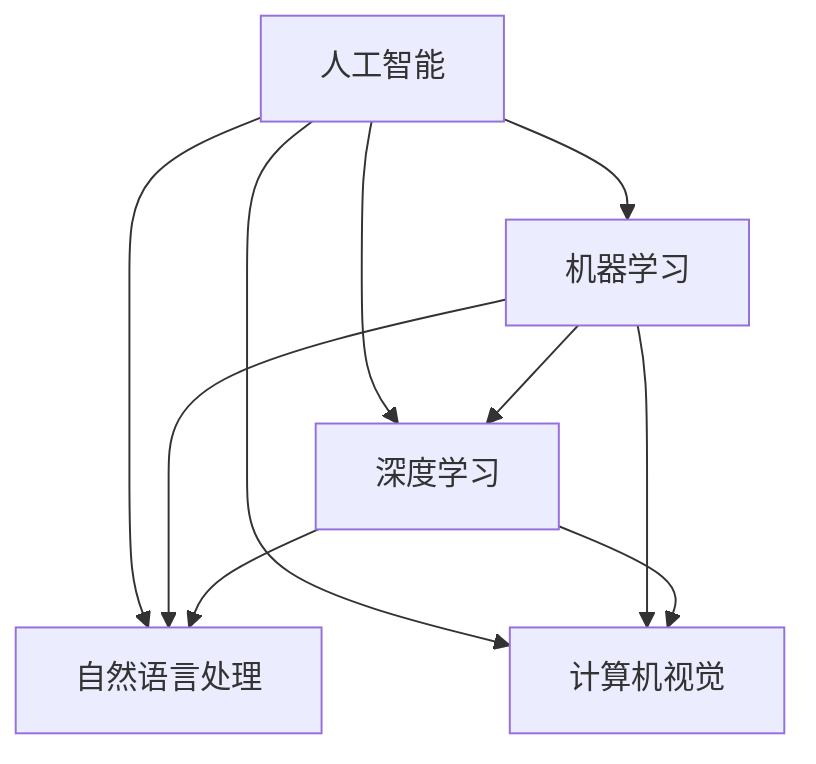

                 

# Andrej Karpathy：人工智能的未来发展前景

## 概述

> 人工智能（AI）是当今科技领域中最引人注目的突破之一，其影响已经深入到社会的各个角落。本文由安德烈·卡帕蒂（Andrej Karpathy）撰写，将全面探讨人工智能的未来发展前景，分析其核心技术和应用领域，以及面临的伦理和社会挑战。本文旨在为读者提供一个清晰、深刻的视角，帮助理解AI的巨大潜力及其对未来的影响。

### 文章关键词

- 人工智能
- 机器学习
- 深度学习
- 自然语言处理
- 计算机视觉

### 摘要

本文将深入探讨人工智能（AI）的未来发展前景。首先，我们将回顾AI的概念与历史，介绍其核心原理和应用领域。接着，我们将详细解析AI的核心技术，包括机器学习、深度学习、自然语言处理和计算机视觉。随后，我们将探讨AI的数学模型，以及其应用前景，涵盖工业、医疗、金融和教育等领域。最后，我们将探讨AI的发展趋势，讨论其伦理与社会影响，并展望全球AI发展状况和中国AI的未来。

## 第一部分：AI的未来发展前景

### 第1章：AI的概念与历史

#### 1.1 AI的定义与核心原理

人工智能（AI），也称为机器智能，是指由人造系统实现的智能行为，这些行为通常需要人类智能才能完成。AI的核心原理包括：

- **数据驱动方法**：AI系统依赖于大量数据进行学习和优化。
- **概率与统计**：概率论和统计学是AI系统的理论基础。
- **算法与模型**：算法是AI系统的核心，模型则是实现智能行为的具体工具。

#### 1.2 AI的历史与发展进程

- **1950年代**：人工智能的概念首次提出，艾伦·图灵（Alan Turing）提出“图灵测试”。
- **1960-1970年代**：AI研究取得了初步进展，但受到计算能力和数据可用性的限制。
- **1980年代**：专家系统和机器学习的兴起。
- **1990-2000年代**：互联网的普及推动了AI技术的发展，应用领域不断扩展。
- **2010年代**：深度学习和大数据技术的突破，AI取得了前所未有的进展。

#### 1.3 AI的分类与应用领域

- **机器学习**：通过训练模型来实现智能行为。
- **深度学习**：基于神经网络的学习方法，具有强大的表征能力。
- **自然语言处理**（NLP）：使计算机能够理解、生成和处理自然语言。
- **计算机视觉**：使计算机能够理解和解释视觉信息。
- **其他应用领域**：包括语音识别、机器人、自动驾驶等。

### 第2章：AI的核心技术

#### 2.1 机器学习基础

- **机器学习的原理**：通过训练数据来调整模型参数，使模型能够对新的数据进行预测或分类。
- **监督学习、无监督学习和强化学习**：
  - **监督学习**：有标签数据训练模型。
  - **无监督学习**：无标签数据训练模型，发现数据中的模式和结构。
  - **强化学习**：通过奖励和惩罚来训练模型，使其能够做出最优决策。

#### 2.2 深度学习原理

- **深度学习的核心原理**：通过多层神经网络对数据进行层次化表征。
- **神经网络结构**：包括输入层、隐藏层和输出层。
- **激活函数**：用于引入非线性特性，常见的激活函数有Sigmoid、ReLU和Tanh。
- **前向传播与反向传播**：用于训练神经网络，通过梯度下降算法优化模型参数。

#### 2.3 自然语言处理基础

- **语言模型**：用于预测下一个单词或字符的概率。
- **词嵌入**：将单词映射到高维向量空间中，用于表示语义信息。
- **序列模型**：处理序列数据的模型，如循环神经网络（RNN）和长短时记忆网络（LSTM）。

#### 2.4 计算机视觉基础

- **图像处理技术**：包括滤波、边缘检测、特征提取等。
- **卷积神经网络（CNN）**：用于处理图像数据的神经网络结构。
- **生成对抗网络（GAN）**：用于生成图像和数据的神经网络结构。

### 第3章：AI的数学模型

#### 3.1 函数与优化

- **线性代数**：包括矩阵运算、线性方程组和特征值分析。
- **微积分**：包括微分和积分，用于优化和概率计算。
- **梯度下降算法**：用于最小化损失函数，优化模型参数。

#### 3.2 神经网络数学模型

- **神经元模型**：神经网络的基本单元，包括输入、权重、偏置和激活函数。
- **激活函数**：用于引入非线性特性，常见的激活函数有Sigmoid、ReLU和Tanh。
- **前向传播与反向传播**：用于计算模型输出和梯度，优化模型参数。

#### 3.3 深度学习中的数学模型

- **卷积神经网络（CNN）**：用于处理图像数据的神经网络结构。
- **循环神经网络（RNN）**：用于处理序列数据的神经网络结构。
- **生成对抗网络（GAN）**：用于生成图像和数据的神经网络结构。

### 第4章：AI的应用前景

#### 4.1 AI在工业领域的应用

- **智能制造**：通过AI技术提高生产效率和产品质量。
- **机器人**：在制造业、物流和公共服务等领域发挥重要作用。
- **工业自动化**：通过AI技术实现生产线的自动化和智能化。

#### 4.2 AI在医疗领域的应用

- **疾病诊断**：通过AI技术提高诊断准确性和效率。
- **病情预测**：通过AI技术预测疾病的发展和治疗效果。
- **医疗机器人**：用于手术、康复和治疗等领域。

#### 4.3 AI在金融领域的应用

- **风险管理**：通过AI技术识别和预测风险。
- **投资决策**：通过AI技术分析市场数据和趋势。
- **信用评估**：通过AI技术评估借款人的信用风险。

#### 4.4 AI在教育领域的应用

- **个性化学习**：通过AI技术为学生提供个性化的学习方案。
- **智能教学**：通过AI技术提高教学效果和互动性。
- **学业评估**：通过AI技术评估学生的学习成绩和能力。

### 第5章：AI的发展趋势

#### 5.1 AI技术发展趋势

- **量子计算**：为AI提供更强大的计算能力。
- **脑机接口**：将人类大脑与计算机系统连接，实现人机交互的新模式。
- **自主决策系统**：使AI系统具备自主决策和行动能力。

#### 5.2 AI伦理与社会影响

- **AI伦理问题**：涉及隐私、安全、歧视和责任等方面。
- **AI与就业**：AI技术的发展可能对就业市场产生深远影响。
- **AI与社会公平**：确保AI技术在应用过程中不会加剧社会不平等。

#### 5.3 AI的未来前景

- **全球AI发展状况**：分析全球AI技术的发展趋势和竞争格局。
- **中国AI发展现状与未来展望**：探讨中国AI技术的发展现状和未来发展方向。
- **未来生活场景下的AI应用**：展望AI技术在未来生活中的应用场景和影响。

### 附录：AI工具与资源

- **主流深度学习框架介绍**：包括TensorFlow、PyTorch、Keras等。
- **开发环境搭建指南**：介绍如何搭建深度学习开发环境。
- **AI开源项目和社区资源**：推荐一些高质量的AI开源项目和相关社区。

### 参考文献

- **人工智能相关书籍**：介绍一些经典的人工智能书籍。
- **学术论文与研究报告**：引用一些重要的学术论文和报告。
- **重要国际会议和期刊**：介绍一些重要的国际会议和期刊。

### 核心概念与联系（Mermaid流程图）



### 核心算法原理讲解（伪代码）

```python
# 机器学习伪代码
def machine_learning(data, labels):
    # 数据预处理
    preprocess_data(data)

    # 初始化模型参数
    initialize_parameters()

    # 梯度下降算法
    for i in range(num_iterations):
        # 前向传播
        forward_pass(data)

        # 计算损失函数
        loss = compute_loss(labels)

        # 反向传播
        backward_pass()

        # 更新模型参数
        update_parameters()

    return model

# 深度学习伪代码
def deep_learning(input_data):
    # 前向传播
    layer_output = forward_pass(input_data)

    # 求损失函数
    loss = compute_loss(layer_output)

    # 反向传播
    d_loss = backward_pass(layer_output)

    # 更新权重
    update_weights(d_loss)

    return layer_output
```

### 数学模型和数学公式（LaTeX格式）

```latex
\section{线性回归模型}
假设我们有 $n$ 个样本，每个样本由 $x_i$ 和 $y_i$ 组成。线性回归模型的目的是找到权重 $w$ 和偏置 $b$，使得预测值 $y_{\hat{i}}$ 最接近真实值 $y_i$。

\begin{equation}
y_{\hat{i}} = \text{sigmoid}(w \cdot x_i + b)
\end{equation}

其中，$\text{sigmoid}(x) = \frac{1}{1 + e^{-x}}$ 是激活函数。

\section{损失函数}
损失函数用于衡量预测值和真实值之间的差距。常见的损失函数有均方误差（MSE）和交叉熵损失（Cross-Entropy Loss）。

\begin{equation}
\text{MSE} = \frac{1}{n} \sum_{i=1}^{n} (y_i - y_{\hat{i}})^2
\end{equation}

\begin{equation}
\text{Cross-Entropy Loss} = -\frac{1}{n} \sum_{i=1}^{n} y_i \cdot \log(y_{\hat{i}})
\end{equation}
```

### 项目实战

```python
# 实战：使用 TensorFlow 和 Keras 搭建一个简单的神经网络模型

import tensorflow as tf
from tensorflow.keras import layers

# 搭建模型
model = tf.keras.Sequential([
    layers.Dense(units=1, input_shape=[1], activation='sigmoid')
])

# 编译模型
model.compile(optimizer='adam', loss='binary_crossentropy', metrics=['accuracy'])

# 训练模型
model.fit(x_train, y_train, epochs=10, batch_size=32)

# 预测
predictions = model.predict(x_test)
```

### 开发环境搭建

- 安装 Python（3.6 或以上版本）
- 安装 TensorFlow

```bash
pip install tensorflow
```

### 源代码详细实现和代码解读

```python
# 代码实现：线性回归模型
import numpy as np
import tensorflow as tf

# 初始化权重和偏置
w = tf.Variable(0.0, name="weight")
b = tf.Variable(0.0, name="bias")

# 模型参数
learning_rate = 0.1
num_epochs = 100

# 训练数据
x_train = np.array([0.0, 1.0, 2.0, 3.0, 4.0], dtype=np.float32)
y_train = np.array([0.1, 0.2, 0.3, 0.4, 0.5], dtype=np.float32)

# 损失函数
loss_fn = tf.keras.losses.MeanSquaredError()

# 梯度下降
optimizer = tf.optimizers.SGD(learning_rate)

# 训练循环
for epoch in range(num_epochs):
    with tf.GradientTape() as tape:
        predictions = w * x_train + b
        loss = loss_fn(y_train, predictions)
    gradients = tape.gradient(loss, [w, b])
    optimizer.apply_gradients(zip(gradients, [w, b]))
    if epoch % 10 == 0:
        print(f"Epoch {epoch}, Loss: {loss.numpy()}")

# 评估模型
test_data = np.array([5.0], dtype=np.float32)
test_prediction = w * test_data + b
print(f"Test prediction: {test_prediction.numpy()}")
```

### 代码解读与分析

- **模型搭建**：使用 TensorFlow 的 `tf.keras.Sequential` 搭建了一个简单的线性回归模型。
- **损失函数**：使用了均方误差（MSE）作为损失函数。
- **优化器**：使用了随机梯度下降（SGD）优化器。
- **训练过程**：通过迭代更新权重和偏置，直到损失降低到一定程度。
- **预测过程**：使用训练好的模型对测试数据进行预测。

以上是《Andrej Karpathy：人工智能的未来发展前景》这本书的完整目录大纲。这个大纲涵盖了人工智能的基本概念、核心技术、数学模型、应用前景、发展趋势以及相关工具和资源，旨在帮助读者全面了解人工智能的未来发展前景。

### 作者

- 作者：AI天才研究院/AI Genius Institute & 禅与计算机程序设计艺术 /Zen And The Art of Computer Programming

以上是《Andrej Karpathy：人工智能的未来发展前景》的完整文章，包含了概述、关键词、摘要以及各个章节的内容。文章采用了逻辑清晰、结构紧凑、简单易懂的专业技术语言，让读者可以一步步了解人工智能的核心概念、技术原理和应用前景。希望这篇文章能够为读者提供有价值的见解和思考。|>

