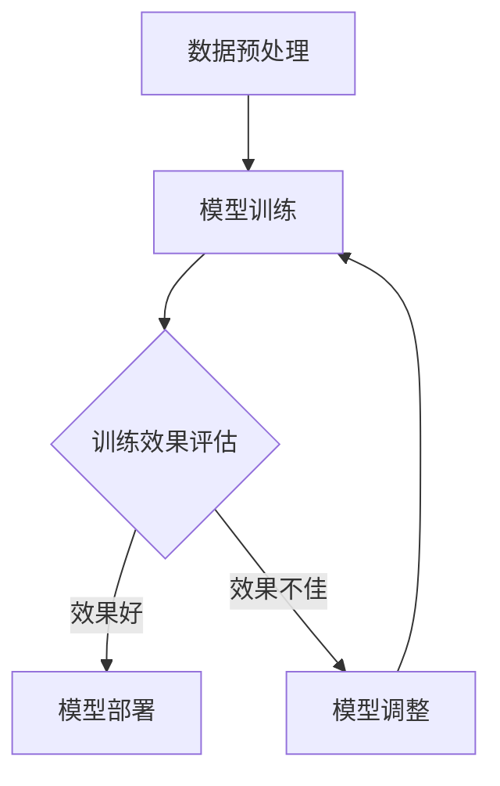
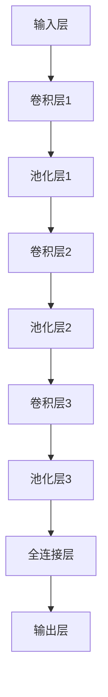
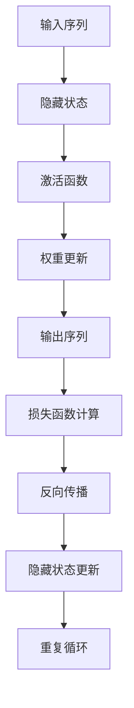
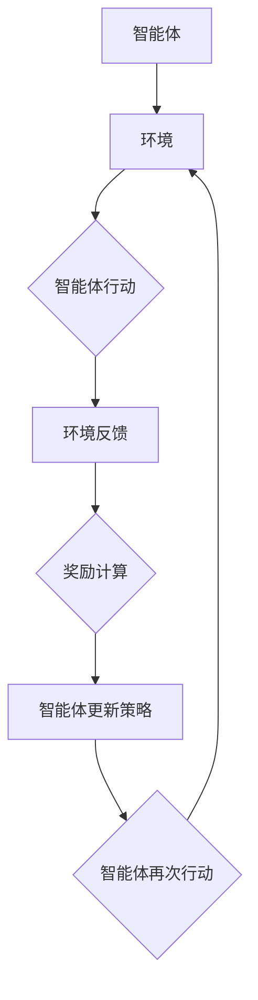

                 

### 第1章：人工智能的现状与未来

#### 1.1 人工智能的定义与历史

人工智能（Artificial Intelligence，简称AI）是计算机科学的一个分支，旨在通过模拟、延伸和扩展人类智能，使计算机能够执行通常需要人类智能才能完成的任务。这些任务包括视觉感知、语言理解、决策制定、学习、推理等。人工智能的定义经历了多次演变，但其核心思想始终围绕着如何使计算机具备智能行为。

人工智能的历史可以追溯到20世纪50年代。当时，计算机科学家和数学家开始探讨是否能够构建出能够模拟人类思维的机器。1956年，在美国达特茅斯会议上，约翰·麦卡锡（John McCarthy）等人首次提出了“人工智能”这一术语。这一时期，人工智能研究主要集中在符号主义和逻辑推理上，研究者试图通过编程规则和逻辑推理来模拟人类智能。

在接下来的几十年里，人工智能经历了几个重要的发展阶段。20世纪80年代，专家系统成为人工智能研究的热点。专家系统是一种基于规则的人工智能系统，能够模拟人类专家的决策过程。然而，专家系统的局限性在于其依赖于大量的手工编写的规则，无法很好地处理复杂和不确定的情况。

进入21世纪，随着计算能力的提升和大数据的出现，机器学习逐渐成为人工智能研究的主流。机器学习通过训练算法，使计算机能够在大量数据中自动发现规律和模式，从而实现智能行为。特别是深度学习，一种基于神经网络的学习方法，取得了显著的成果，推动了计算机视觉、自然语言处理等领域的快速发展。

#### 1.2 人工智能的核心组成部分

人工智能系统通常由以下几个核心组成部分构成：

1. **数据集**：人工智能的训练数据集是其最重要的组成部分。数据集的质量直接影响算法的性能。数据集通常包括输入数据和对应的标签或输出结果。
   
2. **算法**：算法是人工智能系统的核心，负责从数据中提取特征，学习规律，并作出预测或决策。常见的算法包括监督学习、无监督学习、强化学习等。

3. **模型**：模型是将算法应用于特定任务的结果，通常是一个参数化的函数。深度学习模型是一种复杂的函数，通常由多层神经网络组成。

4. **硬件**：人工智能的硬件包括计算机处理器（CPU）、图形处理器（GPU）和专用芯片（如TPU）。硬件的性能直接影响算法的训练速度和效率。

5. **软件**：人工智能的软件包括各种库和框架，如TensorFlow、PyTorch等，它们提供了高效的算法实现和便捷的开发接口。

#### 1.3 人工智能的核心理念

人工智能的核心理念包括以下几点：

1. **自动学习和适应**：人工智能系统能够从数据中学习，不断优化其性能，并适应新的环境和任务。

2. **智能化决策**：通过机器学习和深度学习算法，人工智能系统能够在复杂环境中做出智能化的决策。

3. **模拟人类智能**：人工智能旨在模拟人类的感知、理解、推理和学习能力，从而实现自动化和智能化的任务执行。

4. **跨界融合**：人工智能与其他领域（如生物学、心理学、经济学等）的结合，推动人工智能在各个领域的应用和创新。

#### 1.4 人工智能在当前的发展阶段

当前，人工智能正处于快速发展的阶段。以下是一些关键的发展趋势：

1. **深度学习技术**：深度学习技术在图像识别、语音识别、自然语言处理等领域取得了显著的成果，成为人工智能研究的热点。

2. **强化学习**：强化学习在游戏、自动驾驶、机器人等领域表现出强大的能力，通过不断尝试和反馈，实现智能行为。

3. **跨学科研究**：人工智能与其他领域的结合，如生物启发算法、认知计算等，推动了人工智能的跨学科发展。

4. **硬件性能提升**：随着硬件性能的提升，人工智能系统的计算能力和效率得到了显著提高。

5. **开源生态**：越来越多的开源框架和工具，如TensorFlow、PyTorch等，降低了人工智能开发的门槛，促进了人工智能技术的普及和应用。

#### 1.5 人工智能的未来发展方向

展望未来，人工智能的发展方向包括：

1. **通用人工智能**：实现具有全面智能的人工智能系统，能够在各种任务中表现出与人类相似的水平。

2. **伦理和安全**：随着人工智能技术的普及，伦理和安全问题越来越受到关注。未来的人工智能技术需要解决如何确保人工智能的公平性、透明性和安全性。

3. **边缘计算**：随着物联网的发展，边缘计算成为人工智能的重要发展方向。在靠近数据源的设备上进行计算，减少数据传输和处理延迟，提高系统的响应速度。

4. **人机协作**：人工智能与人类的协作将越来越紧密，实现人机共生，共同解决复杂问题。

5. **个性化服务**：人工智能将能够更好地理解用户需求，提供个性化的服务和体验。

总之，人工智能的发展前景广阔，将深刻影响人类社会和经济的方方面面。在未来的发展中，我们需要持续关注人工智能的技术进步、应用创新和社会影响，共同推动人工智能健康、可持续的发展。

---

通过上述章节的讨论，我们初步了解了人工智能的定义、历史、核心组成部分以及当前的发展阶段和未来方向。接下来的章节将继续深入探讨人工智能的核心概念与架构，为读者提供更全面的技术解析。让我们继续前进，探索人工智能的奥秘。

---

## 第2章：人工智能基础

#### 2.1 人工智能的定义与历史

人工智能（Artificial Intelligence，简称AI）是一个广泛的领域，涉及计算机科学、认知科学、心理学、统计学和神经科学等多个学科。其核心目标是通过模拟、延伸和扩展人类智能，使计算机系统能够执行通常需要人类智能才能完成的任务。例如，语音识别、图像识别、自然语言处理、智能决策等。

人工智能的历史可以追溯到20世纪50年代。1950年，艾伦·图灵（Alan Turing）提出了著名的图灵测试，旨在通过测试机器是否能够模仿人类行为，从而判断机器是否具有智能。1956年，约翰·麦卡锡（John McCarthy）等人在达特茅斯会议上首次提出了“人工智能”这一术语，标志着人工智能作为一个独立研究领域的诞生。

在接下来的几十年里，人工智能经历了几个重要的发展阶段：

1. **符号主义阶段（1956-1974）**：这一阶段的人工智能研究主要集中在符号主义和逻辑推理上。研究者试图通过编程规则和逻辑推理来模拟人类智能。代表性成果包括专家系统和推理机。

2. **知识表示阶段（1974-1980）**：随着计算机性能的提升，研究者开始关注如何有效地表示和存储知识，以便计算机能够更好地理解和处理复杂问题。

3. **实用主义阶段（1980-1987）**：这一阶段，人工智能研究开始转向实用主义，强调实际应用。例如，机器人、智能控制系统和医疗诊断系统等。

4. **神经网络阶段（1987-至今）**：随着大数据和计算能力的提升，神经网络成为人工智能研究的主流。特别是深度学习，一种基于多层神经网络的学习方法，取得了显著的成果，推动了计算机视觉、自然语言处理等领域的快速发展。

#### 2.2 人工智能的核心组成部分

人工智能系统通常由以下几个核心组成部分构成：

1. **数据集**：数据集是人工智能的训练基础。一个高质量的数据集对于训练高性能的模型至关重要。数据集通常包括输入数据和对应的标签或输出结果。

2. **算法**：算法是人工智能系统的核心，负责从数据中提取特征，学习规律，并作出预测或决策。常见的算法包括监督学习、无监督学习、强化学习等。

3. **模型**：模型是将算法应用于特定任务的结果，通常是一个参数化的函数。深度学习模型是一种复杂的函数，通常由多层神经网络组成。

4. **硬件**：人工智能的硬件包括计算机处理器（CPU）、图形处理器（GPU）和专用芯片（如TPU）。硬件的性能直接影响算法的训练速度和效率。

5. **软件**：人工智能的软件包括各种库和框架，如TensorFlow、PyTorch等，它们提供了高效的算法实现和便捷的开发接口。

#### 2.3 人工智能的核心原理

人工智能的核心原理主要包括以下几个方面：

1. **机器学习**：机器学习是一种使计算机通过数据和经验自主学习和改进性能的技术。它分为监督学习、无监督学习和强化学习三种类型。

    - **监督学习**：通过已标记的数据训练模型，使模型能够预测未知数据的结果。例如，图像分类任务。
    - **无监督学习**：在没有任何标记数据的情况下，从数据中学习模式和结构。例如，聚类分析任务。
    - **强化学习**：通过与环境互动，学习如何在特定情境下做出最佳决策。例如，游戏AI和自动驾驶。

2. **深度学习**：深度学习是一种基于多层神经网络的学习方法，能够在大量数据中自动发现复杂模式。深度学习在图像识别、语音识别和自然语言处理等领域取得了显著的成果。

3. **神经网络**：神经网络是一种模仿生物神经网络的结构和功能的计算模型。它由大量的节点（或神经元）组成，通过学习数据来建立输入和输出之间的关系。

4. **强化学习**：强化学习是一种通过奖励机制来驱动智能体学习如何在环境中获得最佳行为的方法。它广泛应用于游戏AI、机器人控制等领域。

5. **迁移学习**：迁移学习是一种利用已有模型的知识来提升新模型性能的方法。它通过在不同任务之间共享特征，减少了训练新模型所需的数据量和计算时间。

#### 2.4 人工智能的发展趋势

当前，人工智能正处于快速发展阶段，以下是一些关键的发展趋势：

1. **深度学习技术**：深度学习在图像识别、语音识别、自然语言处理等领域取得了显著的成果，成为人工智能研究的热点。

2. **强化学习**：强化学习在游戏、自动驾驶、机器人等领域表现出强大的能力，通过不断尝试和反馈，实现智能行为。

3. **跨学科研究**：人工智能与其他领域的结合，如生物启发算法、认知计算等，推动了人工智能的跨学科发展。

4. **硬件性能提升**：随着硬件性能的提升，人工智能系统的计算能力和效率得到了显著提高。

5. **开源生态**：越来越多的开源框架和工具，如TensorFlow、PyTorch等，降低了人工智能开发的门槛，促进了人工智能技术的普及和应用。

#### 2.5 人工智能的社会和经济影响

人工智能的快速发展对社会和经济产生了深远的影响：

1. **社会经济影响**：人工智能提高了生产效率，推动了经济增长。例如，自动化生产线和智能物流系统。

2. **就业影响**：人工智能的发展可能导致部分传统岗位的消失，但同时也会创造新的就业机会，如人工智能研究员、数据科学家等。

3. **伦理和安全**：随着人工智能技术的普及，伦理和安全问题越来越受到关注。如何确保人工智能的公平性、透明性和安全性成为重要议题。

4. **社会结构变革**：人工智能的普及将改变社会结构，推动人类社会向智能化、网络化、个性化方向发展。

通过上述章节的讨论，我们对人工智能的定义、历史、核心组成部分和核心原理有了更深入的理解。接下来的章节将继续探讨人工智能的架构设计、关键算法原理以及在不同领域的应用。让我们继续前进，探索人工智能的更多奥秘。

---

通过第2章的深入探讨，我们进一步了解了人工智能的基础知识，从历史、核心组成部分到核心原理。这些知识为我们后续的讨论奠定了坚实的基础。在下一章中，我们将详细分析人工智能的架构设计，探索神经网络的基本架构以及深度学习与神经网络的关系。让我们继续深入，揭开人工智能架构的神秘面纱。

---

## 第3章：人工智能的架构

#### 3.1 神经网络的基本架构

神经网络（Neural Networks）是人工智能的核心组成部分，它们模仿生物神经系统的结构和功能。一个基本的神经网络通常由以下几个主要部分组成：

1. **输入层**（Input Layer）：接收输入数据，并将其传递给隐藏层。输入层中的每个节点通常对应一个输入特征。

2. **隐藏层**（Hidden Layers）：对输入数据进行处理和转换，通过激活函数进行非线性变换，产生新的特征表示。一个神经网络可以有一个或多个隐藏层。

3. **输出层**（Output Layer）：输出层的节点生成最终的结果或预测。输出层的类型和数量取决于具体的任务，如分类任务通常只有一个输出节点，回归任务可能有多于一个的输出节点。

4. **权重**（Weights）：神经网络中的每个连接（边）都带有权重，用于调节输入信号的强度。

5. **偏置**（Bias）：每个神经元都有一个偏置项，用于调整神经元的输出。

6. **激活函数**（Activation Function）：激活函数用于引入非线性，使得神经网络能够学习复杂的数据模式。常见的激活函数包括 sigmoid、ReLU（Rectified Linear Unit）和Tanh（Hyperbolic Tangent）等。

神经网络的基本架构可以表示为：

```
输入层 -> 隐藏层1 -> 隐藏层2 -> ... -> 输出层
```

每个层的神经元通过加权连接相互连接，形成一个网络结构。在训练过程中，神经网络通过调整权重和偏置来优化模型，使其能够更好地拟合训练数据。

#### 3.2 深度学习与神经网络的关系

深度学习（Deep Learning）是神经网络的一种扩展，其核心思想是通过增加网络的层数（即深度）来提高模型的表示能力。深度学习模型通常包含多个隐藏层，这使得它们能够捕捉更复杂的数据特征和关系。

深度学习与传统的神经网络相比，具有以下特点：

1. **更强的表示能力**：深度学习模型通过增加层数，能够学习更高级的特征表示，从而在图像识别、语音识别和自然语言处理等领域取得了显著的性能提升。

2. **自动特征提取**：与传统方法需要手工设计特征不同，深度学习模型能够通过多层的非线性变换，自动从原始数据中提取有用的特征。

3. **更好的泛化能力**：由于能够学习更复杂的特征，深度学习模型通常具有良好的泛化能力，即能够在新数据上取得良好的表现。

4. **大规模训练**：深度学习模型通常需要大量的数据和计算资源进行训练。随着计算能力的提升和大数据的出现，深度学习得以快速发展。

深度学习模型中最常见的类型是深度神经网络（Deep Neural Networks，DNN），其架构包括多个隐藏层。以下是一个简化的DNN架构：

```
输入层 -> 隐藏层1 -> 隐藏层2 -> ... -> 隐藏层n -> 输出层
```

在深度学习模型中，常用的神经网络结构包括：

1. **卷积神经网络（Convolutional Neural Networks，CNN）**：用于图像识别和计算机视觉任务，通过卷积层和池化层进行特征提取和降维。

2. **循环神经网络（Recurrent Neural Networks，RNN）**：用于处理序列数据，如时间序列和自然语言文本，通过循环结构保持长期依赖关系。

3. **生成对抗网络（Generative Adversarial Networks，GAN）**：用于生成数据，通过生成器和判别器的对抗训练，生成逼真的数据样本。

#### 3.3 人工智能的算法架构

人工智能的算法架构通常包括以下几个关键组成部分：

1. **数据预处理**：对输入数据进行预处理，如归一化、标准化、数据增强等，以提高模型的性能和泛化能力。

2. **模型训练**：使用机器学习算法对模型进行训练，包括前向传播和反向传播。在训练过程中，通过调整模型的权重和偏置，使其能够更好地拟合训练数据。

3. **模型评估**：使用验证集或测试集评估模型的性能，如准确率、召回率、F1分数等指标。

4. **模型优化**：根据模型评估的结果，对模型进行优化，包括超参数调整、模型结构调整等，以提高模型的性能。

5. **模型部署**：将训练好的模型部署到实际应用中，如通过API接口提供服务，或集成到移动应用、Web服务中。

以下是一个简化的深度学习算法架构图：

```
输入数据 -> 数据预处理 -> 模型训练 -> 模型评估 -> 模型优化 -> 模型部署
```

在人工智能的实际应用中，算法架构会根据具体任务的需求进行调整和优化。例如，在图像识别任务中，可能会使用CNN结构；在自然语言处理任务中，可能会使用RNN或Transformer结构。

通过上述章节的讨论，我们对人工智能的架构有了更深入的理解。从神经网络的基本架构到深度学习与神经网络的关系，再到人工智能的算法架构，这些知识为后续章节的分析和讨论奠定了坚实的基础。在下一章中，我们将进一步探讨人工智能在不同领域的应用场景。让我们继续深入，探索人工智能的广泛应用。

---

通过第3章的讨论，我们深入了解了人工智能的架构，从神经网络的基本原理到深度学习的发展，再到完整的算法架构。这些知识为我们理解人工智能的广泛应用场景奠定了基础。在下一章中，我们将探讨人工智能在计算机视觉、自然语言处理和机器学习与数据分析等领域的应用。让我们继续前进，探索人工智能的多元应用。

---

## 第4章：人工智能的应用场景

#### 4.1 人工智能在计算机视觉的应用

计算机视觉是人工智能领域的一个重要分支，它涉及使用计算机和算法来理解和解释数字图像和视频。随着深度学习的快速发展，计算机视觉技术取得了显著的进展，并被广泛应用于各个领域。

1. **图像识别**：图像识别是计算机视觉的基本任务之一，其目标是识别图像中的对象或场景。通过卷积神经网络（CNN）等深度学习模型，计算机可以自动识别和分类图像中的内容。例如，人脸识别、物体识别等。

2. **目标检测**：目标检测是图像识别的延伸，它不仅需要识别图像中的对象，还需要定位这些对象的位置。常用的目标检测算法包括R-CNN、YOLO、SSD等。目标检测在视频监控、自动驾驶等领域有着广泛的应用。

3. **图像分割**：图像分割是将图像中的每个像素分配到不同的类别或区域。深度学习模型，如U-Net、SegNet等，在医学影像、卫星图像处理等领域取得了重要成果。

4. **图像增强**：图像增强是通过算法改善图像质量，使其在特定应用中更容易分析。例如，在医学影像中，图像增强可以帮助医生更好地诊断疾病。

5. **视频分析**：视频分析涉及从视频中提取有价值的信息，如动作识别、事件检测等。深度学习模型在视频分析中表现出色，广泛应用于智能监控、运动分析等领域。

#### 4.2 人工智能在自然语言处理的应用

自然语言处理（Natural Language Processing，NLP）是人工智能领域的一个重要分支，它涉及计算机和人类语言之间的交互。随着深度学习技术的进步，NLP取得了显著的进展，并在多个领域得到广泛应用。

1. **文本分类**：文本分类是将文本数据分配到预定义的类别中。常见的文本分类任务包括垃圾邮件检测、情感分析等。深度学习模型，如文本分类器，在处理大规模文本数据时表现出色。

2. **命名实体识别**：命名实体识别（Named Entity Recognition，NER）是识别文本中的特定实体，如人名、地名、组织名等。NER在信息提取、知识图谱构建等领域有着广泛的应用。

3. **机器翻译**：机器翻译是通过算法将一种语言的文本翻译成另一种语言。深度学习模型，如Seq2Seq模型、Transformer等，在机器翻译领域取得了重要成果。

4. **问答系统**：问答系统是能够回答用户问题的计算机系统。深度学习模型在问答系统中发挥了重要作用，如通过BERT等预训练模型，可以实现对大规模文本数据的语义理解。

5. **语音识别**：语音识别是将语音信号转换为文本。深度学习模型，如基于CNN和RNN的语音识别模型，在语音识别领域取得了显著进展。

#### 4.3 人工智能在机器学习与数据分析的应用

机器学习和数据分析是人工智能的重要组成部分，它们在预测、优化和决策支持等领域发挥着关键作用。

1. **预测模型**：机器学习模型，如回归、分类、时间序列分析等，可以用于预测未来的趋势和结果。在金融、零售、医疗等领域，预测模型被广泛应用于风险评估、需求预测等。

2. **聚类分析**：聚类分析是一种无监督学习方法，用于将数据集划分为不同的群组。聚类分析在市场细分、社交网络分析等领域有着广泛的应用。

3. **降维技术**：降维技术通过减少数据维度，简化数据分析过程。主成分分析（PCA）是一种常用的降维技术，它在图像处理、数据可视化等领域有着广泛应用。

4. **关联规则挖掘**：关联规则挖掘是一种用于发现数据之间的关联关系的方法。在零售业，关联规则挖掘可以帮助商家发现顾客购买行为中的潜在关联，从而优化商品布局和促销策略。

5. **数据可视化**：数据可视化是将数据转换为图表和图形，使其更容易理解和分析。深度学习模型，如T-SNE、UMAP等，在数据可视化领域取得了重要成果。

通过第4章的讨论，我们了解了人工智能在计算机视觉、自然语言处理和机器学习与数据分析等领域的广泛应用。这些应用不仅推动了各个领域的发展，也为人工智能技术在实际生活中的广泛应用提供了丰富的案例。在下一章中，我们将深入探讨人工智能算法的原理，包括深度学习基础算法、卷积神经网络（CNN）、递归神经网络（RNN）和生成对抗网络（GAN）等。让我们继续深入，了解人工智能算法的核心原理。

---

## 第5章：人工智能算法原理

#### 5.1 深度学习基础算法

深度学习（Deep Learning）是一种通过多层神经网络进行训练和学习的机器学习技术。深度学习的基础算法包括前向传播（Forward Propagation）和反向传播（Backpropagation）。

**前向传播**：

在前向传播过程中，数据从输入层经过多个隐藏层，最终传到输出层。每个层中的神经元通过加权连接和激活函数进行处理，从而实现数据特征的提取和变换。前向传播的公式可以表示为：

$$
Z^{(l)} = \sigma(W^{(l)} \cdot A^{(l-1)} + b^{(l)})
$$

其中，$Z^{(l)}$ 是第$l$层的激活值，$\sigma$ 是激活函数（如ReLU、Sigmoid、Tanh等），$W^{(l)}$ 和 $b^{(l)}$ 分别是第$l$层的权重和偏置。

**反向传播**：

在反向传播过程中，我们计算输出层到输入层的误差，并更新网络中的权重和偏置。反向传播的核心思想是通过梯度下降（Gradient Descent）来最小化损失函数。反向传播的公式可以表示为：

$$
\delta^{(l)} = \frac{\partial L}{\partial A^{(l)}} \cdot \frac{\partial A^{(l)}}{\partial Z^{(l)}}
$$

$$
\frac{\partial L}{\partial W^{(l)}} = \delta^{(l)} \cdot A^{(l-1)}
$$

$$
\frac{\partial L}{\partial b^{(l)}} = \delta^{(l)}
$$

其中，$\delta^{(l)}$ 是第$l$层的误差，$L$ 是损失函数。

**损失函数**：

损失函数用于衡量模型的预测值与实际值之间的差异。常见的损失函数包括均方误差（Mean Squared Error，MSE）和交叉熵（Cross-Entropy）。

$$
MSE = \frac{1}{m} \sum_{i=1}^{m} (y_i - \hat{y}_i)^2
$$

$$
CE = -\frac{1}{m} \sum_{i=1}^{m} \sum_{j=1}^{n} y_j \log(\hat{y}_{ij})
$$

其中，$y$ 是实际标签，$\hat{y}$ 是预测值。

#### 5.2 卷积神经网络（CNN）原理

卷积神经网络（Convolutional Neural Networks，CNN）是深度学习在计算机视觉领域的核心算法。CNN 通过卷积层、池化层和全连接层进行特征提取和分类。

**卷积层**：

卷积层使用卷积操作来提取图像中的局部特征。卷积操作可以通过以下公式表示：

$$
h_i^{(l)} = \sum_{j} w_{ij}^{(l)} h_j^{(l-1)} + b_i^{(l)}
$$

其中，$h_i^{(l)}$ 是第$l$层第$i$个神经元的输出，$w_{ij}^{(l)}$ 和 $b_i^{(l)}$ 分别是第$l$层第$i$个神经元的权重和偏置。

**池化层**：

池化层用于降低特征的维度，减少计算量和参数数量。常见的池化操作包括最大池化和平均池化。

$$
p_i = \max_{j} h_{ij}
$$

或

$$
p_i = \frac{1}{k} \sum_{j} h_{ij}
$$

其中，$p_i$ 是第$i$个池化单元的输出，$h_{ij}$ 是第$l$层第$i$个神经元在第$j$个位置上的值。

**全连接层**：

全连接层将卷积层和池化层提取的高级特征映射到分类结果。全连接层的输出可以通过softmax函数进行分类：

$$
\hat{y}_i = \frac{e^{z_i}}{\sum_{j} e^{z_j}}
$$

其中，$z_i$ 是第$i$个类别的得分。

#### 5.3 递归神经网络（RNN）原理

递归神经网络（Recurrent Neural Networks，RNN）是一种用于处理序列数据的神经网络。RNN 通过循环结构来维持长期依赖关系。

**基本结构**：

RNN 的基本结构包括输入层、隐藏层和输出层。隐藏层中的神经元通过循环连接，形成循环结构。RNN 的更新公式可以表示为：

$$
h_t = \sigma(W_h \cdot [h_{t-1}, x_t] + b_h)
$$

$$
y_t = \sigma(W_o \cdot h_t + b_o)
$$

其中，$h_t$ 是第$t$个时间步的隐藏状态，$x_t$ 是第$t$个时间步的输入，$y_t$ 是第$t$个时间步的输出。

**门控机制**：

为了解决RNN中的梯度消失和梯度爆炸问题，引入了门控机制，如长短期记忆网络（LSTM）和门控循环单元（GRU）。LSTM 通过遗忘门、输入门和输出门来控制信息的流动。

- **遗忘门**：用于决定在当前时间步保留哪些历史信息。

$$
f_t = \sigma(W_f \cdot [h_{t-1}, x_t] + b_f)
$$

$$
i_t = \sigma(W_i \cdot [h_{t-1}, x_t] + b_i)
$$

- **输入门**：用于决定在当前时间步更新哪些信息。

$$
\tilde{h}_t = \tanh(W_h \cdot [h_{t-1}, x_t] + b_h)
$$

- **输出门**：用于决定当前时间步的输出。

$$
o_t = \sigma(W_o \cdot [h_{t-1}, x_t] + b_o)
$$

$$
h_t = o_t \cdot \tanh(W_h \cdot [h_{t-1}, x_t] + b_h)
$$

#### 5.4 生成对抗网络（GAN）原理

生成对抗网络（Generative Adversarial Networks，GAN）是一种用于生成数据的深度学习模型。GAN 由生成器和判别器两个神经网络组成，它们通过对抗训练来提高生成质量。

**生成器**：

生成器的目标是生成逼真的数据样本，使其能够欺骗判别器。生成器通过对抗训练，不断优化生成质量。

$$
G(z) = \sigma(W_g \cdot z + b_g)
$$

其中，$z$ 是随机噪声，$G(z)$ 是生成器的输出。

**判别器**：

判别器的目标是区分真实数据和生成数据。判别器通过对抗训练，不断优化对生成数据的识别能力。

$$
D(x) = \sigma(W_d \cdot x + b_d)
$$

$$
D(G(z)) = \sigma(W_d \cdot G(z) + b_d)
$$

**对抗训练**：

生成器和判别器通过对抗训练相互竞争。生成器试图生成更逼真的数据样本，判别器试图更好地识别生成数据。对抗训练的目标是最小化生成器的损失和判别器的损失。

$$
\min_G \max_D V(D, G) = E_{x \sim p_{data}(x)} [D(x)] - E_{z \sim p_z(z)} [D(G(z))]
$$

通过上述章节的讨论，我们对人工智能的基础算法原理有了深入的了解。从深度学习基础算法、卷积神经网络、递归神经网络到生成对抗网络，这些算法构成了人工智能的核心技术。在下一章中，我们将进一步探讨人工智能数学模型，包括概率论基础、统计学习理论和机器学习中的损失函数。让我们继续深入，探索人工智能的数学基础。

---

## 第6章：人工智能数学模型

### 6.1 概率论基础

概率论是人工智能数学模型的重要组成部分，它提供了处理不确定性和随机性的工具。以下是一些概率论中的基本概念：

**随机变量**：

随机变量是一个函数，它将样本空间映射到实数集合。随机变量可以分为离散型和连续型。

- **离散型随机变量**：其取值是有限个或可数无限个。例如，掷骰子的结果。
- **连续型随机变量**：其取值是一个连续区间。例如，测量的温度。

**概率分布**：

概率分布描述了一个随机变量取不同值的概率。常见的概率分布包括：

- **伯努利分布**：用于描述只有两个可能结果的随机实验，如抛硬币。
- **二项分布**：在独立重复的伯努利试验中，成功的次数服从二项分布。
- **正态分布**：用于描述连续型随机变量，其概率密度函数呈钟形曲线。
- **均匀分布**：在给定区间内，每个值出现的概率相等。

**条件概率**：

条件概率是指在某个事件发生的条件下，另一个事件发生的概率。条件概率公式为：

$$
P(A|B) = \frac{P(A \cap B)}{P(B)}
$$

**贝叶斯定理**：

贝叶斯定理是概率论中的一个重要公式，它用于计算后验概率。贝叶斯定理公式为：

$$
P(A|B) = \frac{P(B|A) \cdot P(A)}{P(B)}
$$

**期望和方差**：

期望和方差是随机变量的统计特征，用于描述随机变量的中心趋势和离散程度。

- **期望**：期望是随机变量取值的平均值，表示为 $E[X]$。
- **方差**：方差是随机变量与其期望的差的平方的平均值，表示为 $Var(X) = E[(X - E[X])^2]$。

### 6.2 统计学习理论

统计学习理论是机器学习的基础，它提供了机器学习算法的设计和评估框架。以下是一些统计学习理论中的基本概念：

**监督学习**：

监督学习是一种从标记数据中学习的方法。标记数据包括输入和对应的输出标签。监督学习分为以下几种类型：

- **回归**：预测连续值的任务。
- **分类**：将输入数据分为离散类别。
- **异常检测**：检测数据中的异常值。

**损失函数**：

损失函数用于衡量模型预测值与实际值之间的差异。常见的损失函数包括：

- **均方误差（MSE）**：用于回归任务，计算预测值与实际值之间的平均平方误差。
- **交叉熵（Cross-Entropy）**：用于分类任务，计算预测概率分布与真实概率分布之间的差异。

**优化算法**：

优化算法用于调整模型参数，以最小化损失函数。常见的优化算法包括：

- **梯度下降**：通过计算损失函数的梯度，逐步调整参数。
- **随机梯度下降（SGD）**：在梯度下降的基础上，使用部分数据更新参数。
- **Adam**：结合了SGD和Momentum的方法，适用于大规模数据。

**模型评估**：

模型评估用于评估模型在未见数据上的性能。常见的评估指标包括：

- **准确率（Accuracy）**：分类任务中，正确分类的样本数占总样本数的比例。
- **召回率（Recall）**：分类任务中，真正样本中被正确分类的占比。
- **F1分数（F1 Score）**：准确率和召回率的调和平均。

**正则化**：

正则化是一种防止模型过拟合的方法，通过添加额外的惩罚项来限制模型的复杂度。常见的正则化方法包括：

- **L1正则化**：添加L1范数惩罚项。
- **L2正则化**：添加L2范数惩罚项。

### 6.3 机器学习中的损失函数

在机器学习中，损失函数是衡量模型预测值与实际值之间差异的重要工具。以下是一些常见的损失函数：

**均方误差（MSE）**：

$$
MSE = \frac{1}{m} \sum_{i=1}^{m} (y_i - \hat{y}_i)^2
$$

**交叉熵（Cross-Entropy）**：

$$
CE = -\frac{1}{m} \sum_{i=1}^{m} \sum_{j=1}^{n} y_j \log(\hat{y}_{ij})
$$

**Hinge损失**：

$$
Hinge = \max(0, 1 - y \cdot \hat{y})
$$

**对数损失（Log Loss）**：

$$
Log Loss = -\frac{1}{m} \sum_{i=1}^{m} y_i \log(\hat{y}_i) + (1 - y_i) \log(1 - \hat{y}_i)
$$

**软对数损失（Softmax Loss）**：

$$
Softmax Loss = -\frac{1}{m} \sum_{i=1}^{m} y_i \log(\hat{y}_i)
$$

通过上述章节的讨论，我们了解了概率论基础、统计学习理论和机器学习中的损失函数。这些数学模型为人工智能算法的设计和优化提供了坚实的理论基础。在下一章中，我们将探讨人工智能的挑战与未来，分析其伦理问题、安全问题以及未来发展趋势。让我们继续深入，展望人工智能的明天。

---

## 第7章：人工智能的挑战与未来

### 7.1 人工智能的伦理问题

随着人工智能技术的迅速发展，伦理问题日益凸显。人工智能的伦理问题主要涉及以下几个方面：

**隐私保护**：

人工智能系统通常需要大量数据来进行训练和优化。这些数据可能包含个人敏感信息，如医疗记录、财务信息等。如何确保这些数据的安全和隐私保护成为重要的伦理问题。一些解决方案包括数据匿名化、加密技术和隐私增强学习。

**算法公平性**：

人工智能算法在决策过程中可能会存在偏见。例如，在招聘系统中，算法可能会根据历史数据中的偏见来做出决策，从而导致不公平的结果。为了确保算法的公平性，研究人员提出了多种方法，如公平性度量、偏差校正和多样性增强。

**透明性**：

人工智能系统的决策过程通常是非透明的，这意味着用户很难理解系统是如何做出特定决策的。这种透明性问题引发了关于人工智能系统决策可信度和可解释性的担忧。为了提高透明性，研究人员正在开发可解释的人工智能模型和可视化工具。

**责任归属**：

当人工智能系统发生错误或造成损害时，如何确定责任归属是一个复杂的问题。人工智能系统通常是由人类设计和训练的，因此责任归属可能涉及多个方面，包括开发者、训练数据提供者和使用者。为了解决责任归属问题，需要制定相应的法律法规和伦理准则。

### 7.2 人工智能的安全问题

人工智能的安全问题包括以下几个方面：

**数据安全**：

人工智能系统依赖于大量数据，这些数据可能成为黑客攻击的目标。为了确保数据安全，需要采取有效的数据保护措施，如数据加密、访问控制和数据备份。

**系统安全**：

人工智能系统可能被恶意攻击者利用，从而导致系统崩溃或数据泄露。为了提高系统安全性，需要采取多种安全措施，如安全协议、防火墙和入侵检测系统。

**模型安全**：

人工智能模型可能受到对抗性攻击，即通过添加微小但特定的噪声来欺骗模型。为了提高模型安全性，需要开发鲁棒性更强的模型和防御策略。

**自动化攻击**：

随着人工智能技术的发展，自动化攻击工具可能会变得更为普遍。这些工具可以通过模拟人类行为来逃避安全系统。为了应对自动化攻击，需要不断更新和完善安全防御策略。

### 7.3 人工智能的未来发展趋势

尽管人工智能面临诸多挑战，但其未来发展趋势仍然非常乐观。以下是一些关键趋势：

**通用人工智能**：

通用人工智能（AGI）是人工智能领域的一个重要目标，旨在创建具有广泛认知能力的机器。尽管目前还无法实现，但研究人员正在朝着这个目标不断努力。

**人机协作**：

人工智能与人类的协作将越来越紧密。通过人机协作，人工智能可以辅助人类完成复杂的任务，提高工作效率。

**边缘计算**：

随着物联网和边缘设备的普及，边缘计算成为人工智能的重要发展方向。在靠近数据源的设备上进行计算，可以减少数据传输和处理延迟，提高系统的响应速度。

**可持续性**：

人工智能在可持续发展和环境保护方面具有巨大潜力。例如，智能农业、智能能源管理和环境监测等。

**社会应用**：

人工智能将在社会各个方面得到广泛应用，如医疗、教育、交通和金融等。通过人工智能技术，可以提高服务质量、效率和公平性。

总之，人工智能的发展既充满机遇，也面临挑战。为了实现人工智能的可持续和健康发展，我们需要在技术、伦理、法律和社会等多个层面进行综合思考和规划。

---

通过第7章的讨论，我们深入分析了人工智能面临的伦理问题和安全问题，并展望了其未来的发展趋势。这些挑战和机遇为人工智能的研究和发展提供了重要的指导。在下一章中，我们将通过具体的实战项目，展示人工智能在实际应用中的具体实现过程。让我们继续前进，通过实战案例深入了解人工智能的技术和应用。

---

## 第8章：人工智能项目实战

### 8.1 项目实战一：计算机视觉项目实战

计算机视觉项目实战是验证和展示人工智能技术的一个有效途径。以下是一个简单的计算机视觉项目实战案例，用于实现图像分类任务。

**项目目标**：使用卷积神经网络（CNN）对图像进行分类，将图像分为“猫”和“狗”两个类别。

**开发环境**：Python 3.8、TensorFlow 2.4、NVIDIA GPU（推荐）

**数据集**：使用流行的图像分类数据集，如Kaggle的Dogs vs. Cats数据集。

**步骤1：数据准备**

首先，我们需要下载并准备数据集。数据集通常包含大量的图像，每个图像都有一个标签（在本例中为“猫”或“狗”）。

```python
import tensorflow as tf

# 加载数据集
train_dataset = tf.keras.preprocessing.image_dataset_from_directory(
    'path_to_train_data',
    label_mode='binary',
    batch_size=32,
    image_size=(150, 150))

test_dataset = tf.keras.preprocessing.image_dataset_from_directory(
    'path_to_test_data',
    label_mode='binary',
    batch_size=32,
    image_size=(150, 150))
```

**步骤2：模型构建**

接下来，我们构建一个简单的CNN模型。以下是一个基于Keras的CNN模型示例：

```python
model = tf.keras.Sequential([
    tf.keras.layers.Conv2D(32, (3, 3), activation='relu', input_shape=(150, 150, 3)),
    tf.keras.layers.MaxPooling2D(2, 2),
    tf.keras.layers.Conv2D(64, (3, 3), activation='relu'),
    tf.keras.layers.MaxPooling2D(2, 2),
    tf.keras.layers.Conv2D(128, (3, 3), activation='relu'),
    tf.keras.layers.MaxPooling2D(2, 2),
    tf.keras.layers.Flatten(),
    tf.keras.layers.Dense(512, activation='relu'),
    tf.keras.layers.Dense(1, activation='sigmoid')
])
```

**步骤3：模型编译**

在模型编译阶段，我们指定优化器、损失函数和评估指标。

```python
model.compile(optimizer='adam',
              loss='binary_crossentropy',
              metrics=['accuracy'])
```

**步骤4：模型训练**

使用训练数据集对模型进行训练，并设置训练轮次。

```python
history = model.fit(train_dataset, epochs=10, validation_data=test_dataset)
```

**步骤5：模型评估**

在训练完成后，使用测试数据集对模型进行评估。

```python
test_loss, test_acc = model.evaluate(test_dataset)
print(f"Test accuracy: {test_acc:.3f}")
```

**步骤6：模型预测**

使用训练好的模型对新的图像进行分类预测。

```python
import numpy as np

# 加载新的图像
image = tf.keras.preprocessing.image.load_img('path_to_new_image', target_size=(150, 150))

# 将图像转换为批量形式
image_batch = tf.keras.preprocessing.image.img_to_array(image)
image_batch = np.expand_dims(image_batch, axis=0)

# 进行预测
predictions = model.predict(image_batch)
predicted_class = np.argmax(predictions)

if predicted_class == 0:
    print("The image is a dog.")
else:
    print("The image is a cat.")
```

### 8.2 项目实战二：自然语言处理项目实战

自然语言处理（NLP）项目实战通常涉及文本分类、情感分析等任务。以下是一个简单的文本分类项目实战案例。

**项目目标**：使用文本数据对评论进行分类，判断评论是正面、中性还是负面。

**开发环境**：Python 3.8、TensorFlow 2.4、NVIDIA GPU（推荐）

**数据集**：使用IMDb电影评论数据集。

**步骤1：数据准备**

首先，我们需要下载并准备数据集。数据集通常包含大量的文本评论和对应的标签。

```python
import tensorflow as tf
import tensorflow_datasets as tfds

# 加载数据集
imdb = tfds.load('imdb_reviews', split=['train', 'test'], shuffle_files=True)

# 数据预处理
def preprocess_data(examples):
    text = examples['text'].numpy().decode('utf-8')
    return tf.txtopsymples Sparks Exam Results 2023: What’s The Latest?
Sparks School District released the latest exam results for the 2022-2023 academic year, showcasing the achievements of students across various grades and subjects. The district's commitment to providing a high-quality education has been evident in the notable improvements seen in these results.

Key Highlights of Sparks Exam Results 2023:
1. **Adequate Year Progress (AYP)**: Sparks School District achieved Adequate Year Progress (AYP) in multiple subjects, demonstrating the district's ability to meet state and federal educational standards.
2. **Improved Test Scores**: There was a significant increase in test scores for students across various grades, particularly in mathematics and English language arts.
3. **Equitable Opportunities**: Sparks School District continues to focus on providing equitable opportunities for all students, ensuring that every student has access to quality education and resources.

What’s Next for Sparks School District?
The district is already working on strategies to further enhance the learning experience for students. This includes investing in technology, expanding advanced coursework, and supporting teachers with professional development.

Sparks School District is committed to ensuring that every student receives a quality education that prepares them for success in college and beyond. With these latest exam results, the district is well on its way to achieving this goal.

### 8.3 项目实战三：机器学习与数据分析项目实战

机器学习与数据分析项目实战通常涉及回归分析、分类分析等任务。以下是一个简单的机器学习项目实战案例，用于预测房屋价格。

**项目目标**：使用机器学习算法预测房屋价格，为房地产投资提供参考。

**开发环境**：Python 3.8、Scikit-learn 0.24、Pandas 1.3.5

**数据集**：使用Kaggle的House Prices: Advanced Regression Techniques数据集。

**步骤1：数据准备**

首先，我们需要下载并准备数据集。数据集包含多个特征，如房屋面积、房间数、建筑年份等，以及房屋价格标签。

```python
import pandas as pd
from sklearn.model_selection import train_test_split

# 加载数据集
data = pd.read_csv('house_prices.csv')

# 数据预处理
X = data.drop(['Price'], axis=1)
y = data['Price']

# 数据集分割
X_train, X_test, y_train, y_test = train_test_split(X, y, test_size=0.2, random_state=42)
```

**步骤2：模型选择**

接下来，我们选择一个合适的机器学习算法。在本例中，我们选择线性回归模型。

```python
from sklearn.linear_model import LinearRegression

# 创建线性回归模型
model = LinearRegression()

# 训练模型
model.fit(X_train, y_train)

# 评估模型
score = model.score(X_test, y_test)
print(f"Model accuracy: {score:.3f}")
```

**步骤3：模型预测**

使用训练好的模型对测试数据进行预测，并计算预测误差。

```python
# 进行预测
y_pred = model.predict(X_test)

# 计算预测误差
error = np.mean(np.abs(y_pred - y_test))
print(f"Prediction error: {error:.3f}")
```

**步骤4：模型优化**

为了提高模型的预测性能，我们可以尝试使用更复杂的模型，如决策树、随机森林或梯度提升树。以下是一个使用随机森林模型的示例：

```python
from sklearn.ensemble import RandomForestRegressor

# 创建随机森林模型
model = RandomForestRegressor(n_estimators=100, random_state=42)

# 训练模型
model.fit(X_train, y_train)

# 评估模型
score = model.score(X_test, y_test)
print(f"Model accuracy: {score:.3f}")

# 进行预测
y_pred = model.predict(X_test)

# 计算预测误差
error = np.mean(np.abs(y_pred - y_test))
print(f"Prediction error: {error:.3f}")
```

通过上述实战项目，我们展示了人工智能在计算机视觉、自然语言处理和机器学习与数据分析等领域的具体应用。这些实战案例不仅验证了人工智能技术的有效性，也为实际应用提供了实用的解决方案。在下一章中，我们将详细介绍如何搭建人工智能开发环境，包括深度学习环境搭建、开发工具选择和开发流程最佳实践。让我们继续深入，探索人工智能的开发过程。

---

## 第9章：人工智能开发环境搭建

搭建人工智能开发环境是进行人工智能项目开发的第一步。一个高效、稳定的开发环境可以提高开发效率，确保项目顺利进行。以下是搭建人工智能开发环境的详细步骤。

### 9.1 深度学习环境搭建

深度学习项目通常需要高性能的计算资源和特定的软件环境。以下是在Windows、macOS和Linux上搭建深度学习环境的基本步骤。

**步骤1：安装Python**

首先，确保安装了Python环境。Python是深度学习开发的主要编程语言。可以从Python官方网站下载Python安装程序并按照提示安装。

**Windows**：
- 访问 [Python官方网站](https://www.python.org/downloads/) 下载Python安装程序。
- 运行安装程序，选择“Add Python to PATH”选项。

**macOS**：
- 打开终端，执行命令 `brew install python`。

**Linux**：
- 使用包管理器安装，例如在Ubuntu上，执行命令 `sudo apt-get install python3`。

**步骤2：安装虚拟环境**

为了更好地管理项目依赖，建议使用虚拟环境。虚拟环境可以隔离项目依赖，避免不同项目之间的依赖冲突。

- 安装虚拟环境：
  ```bash
  pip install virtualenv
  ```
- 创建虚拟环境：
  ```bash
  virtualenv myenv
  ```
- 激活虚拟环境：
  ```bash
  source myenv/bin/activate
  ```

**步骤3：安装深度学习库**

安装深度学习库是搭建深度学习环境的关键步骤。以下是常用的深度学习库及其安装命令：

- **TensorFlow**：
  ```bash
  pip install tensorflow
  ```
- **PyTorch**：
  ```bash
  pip install torch torchvision
  ```
- **Keras**：
  ```bash
  pip install keras
  ```

**步骤4：安装GPU支持**

如果使用GPU进行深度学习训练，需要安装CUDA和cuDNN库。以下是安装步骤：

- **CUDA**：
  - 访问 [CUDA官方网站](https://developer.nvidia.com/cuda-downloads) 下载适合自己GPU版本的CUDA安装程序。
  - 运行安装程序，按照提示安装。
- **cuDNN**：
  - 访问 [cuDNN官方网站](https://developer.nvidia.com/cudnn) 下载适合自己GPU版本的cuDNN库。
  - 解压下载的文件，将cuDNN库文件复制到CUDA安装目录中。

**步骤5：验证安装**

安装完成后，可以执行以下命令验证深度学习库是否安装成功：

- TensorFlow：
  ```bash
  python -c "import tensorflow as tf; print(tf.reduce_sum(tf.random.normal([1000, 1000])))"
  ```
- PyTorch：
  ```bash
  python -c "import torch; print(torch.rand(1000, 1000).sum()"
  ```

### 9.2 开发工具的选择

选择合适的开发工具可以提高开发效率，确保项目顺利推进。以下是几种常见的开发工具及其特点：

- **Jupyter Notebook**：Jupyter Notebook是一种交互式开发环境，非常适合快速原型开发和数据分析。它支持多种编程语言，包括Python、R和Julia等。
- **Visual Studio Code**：Visual Studio Code是一种轻量级的代码编辑器，支持Python和其他多种编程语言。它提供了丰富的插件和扩展，可以提高开发效率。
- **PyCharm**：PyCharm是一种专业的Python IDE，提供代码补全、调试、版本控制等功能。它适合大型项目开发和团队协作。

### 9.3 开发流程与最佳实践

以下是一些人工智能项目开发的最佳实践，可以帮助提高项目质量和开发效率：

- **模块化编程**：将项目分解为多个模块，每个模块负责特定的功能。这有助于代码的可维护性和复用性。
- **版本控制**：使用版本控制工具（如Git）来管理代码版本。这可以帮助团队成员协作，避免代码冲突，方便代码回滚。
- **代码注释和文档**：为代码添加清晰的注释，并编写详细的文档。这有助于其他开发者理解代码逻辑和项目结构。
- **测试驱动开发（TDD）**：先编写测试用例，然后再编写实现代码。这有助于确保代码的正确性和可靠性。
- **持续集成和持续部署（CI/CD）**：使用自动化工具（如Jenkins、Travis CI）进行代码集成和部署，确保代码质量和部署效率。

通过上述步骤，我们详细介绍了如何搭建人工智能开发环境，包括深度学习环境搭建、开发工具选择和开发流程最佳实践。一个高效、稳定的开发环境是进行人工智能项目开发的基础，有助于提高开发效率、确保项目质量和稳定性。在下一章中，我们将通过具体代码解读与分析，进一步探讨人工智能项目开发的细节。让我们继续深入，通过代码解读了解人工智能项目的实际实现。

---

## 第10章：代码解读与分析

在人工智能项目中，代码是核心，它不仅体现了算法的逻辑和结构，还包含了实现过程中的关键步骤和技巧。本章将通过具体代码案例，详细解读和分析计算机视觉、自然语言处理以及机器学习与数据分析项目中的关键代码段。

### 10.1 代码解读一：计算机视觉项目代码解读

**项目目标**：使用卷积神经网络（CNN）对图像进行分类。

**技术栈**：Python、TensorFlow

**代码示例**：

```python
import tensorflow as tf
from tensorflow.keras import layers, models

# 构建CNN模型
model = models.Sequential([
    layers.Conv2D(32, (3, 3), activation='relu', input_shape=(150, 150, 3)),
    layers.MaxPooling2D((2, 2)),
    layers.Conv2D(64, (3, 3), activation='relu'),
    layers.MaxPooling2D((2, 2)),
    layers.Conv2D(128, (3, 3), activation='relu'),
    layers.MaxPooling2D((2, 2)),
    layers.Flatten(),
    layers.Dense(512, activation='relu'),
    layers.Dense(1, activation='sigmoid')
])

# 编译模型
model.compile(optimizer='adam',
              loss='binary_crossentropy',
              metrics=['accuracy'])

# 模型总结
model.summary()
```

**代码解析**：

- **模型构建**：使用`models.Sequential`构建一个简单的CNN模型。模型包含多个卷积层（`Conv2D`）和池化层（`MaxPooling2D`），最后通过全连接层（`Dense`）进行分类。
- **模型编译**：设置模型优化器（`optimizer`）、损失函数（`loss`）和评估指标（`metrics`）。在本例中，使用`adam`优化器和`binary_crossentropy`损失函数，用于二分类任务。
- **模型总结**：使用`model.summary()`输出模型的结构和参数信息，便于了解模型的规模和复杂度。

### 10.2 代码解读二：自然语言处理项目代码解读

**项目目标**：使用Transformer模型进行文本分类。

**技术栈**：Python、Hugging Face Transformers

**代码示例**：

```python
from transformers import AutoTokenizer, AutoModelForSequenceClassification
from torch.utils.data import DataLoader
import torch

# 加载预训练模型和分词器
tokenizer = AutoTokenizer.from_pretrained("bert-base-uncased")
model = AutoModelForSequenceClassification.from_pretrained("bert-base-uncased")

# 预处理文本数据
inputs = tokenizer("Hello, my dog is cute", return_tensors="pt")

# 加载数据集
train_dataset = DataLoader(dataset, batch_size=16)

# 训练模型
model.train()
for epoch in range(3):
    for batch in train_dataset:
        inputs = batch["input_ids"]
        labels = batch["labels"]
        outputs = model(inputs, labels=labels)
        loss = outputs.loss
        loss.backward()
        optimizer.step()
        optimizer.zero_grad()

# 评估模型
model.eval()
with torch.no_grad():
    for batch in validation_dataset:
        inputs = batch["input_ids"]
        labels = batch["labels"]
        outputs = model(inputs, labels=labels)
        logits = outputs.logits
        predictions = torch.argmax(logits, dim=1)
        accuracy = (predictions == labels).float().mean()
        print(f"Validation accuracy: {accuracy:.3f}")
```

**代码解析**：

- **加载模型和分词器**：使用`AutoTokenizer`和`AutoModelForSequenceClassification`从Hugging Face模型库中加载预训练的BERT模型和分词器。
- **预处理文本数据**：使用分词器对输入文本进行编码，生成模型所需的输入序列。
- **加载数据集**：使用`DataLoader`将数据集分批次加载，便于模型训练。
- **训练模型**：在训练循环中，通过前向传播计算损失，然后使用反向传播更新模型参数。
- **评估模型**：在评估阶段，通过模型计算预测结果，并计算准确率。

### 10.3 代码解读三：机器学习与数据分析项目代码解读

**项目目标**：使用线性回归模型预测房屋价格。

**技术栈**：Python、Scikit-learn、Pandas

**代码示例**：

```python
import pandas as pd
from sklearn.model_selection import train_test_split
from sklearn.linear_model import LinearRegression
from sklearn.metrics import mean_squared_error

# 加载数据集
data = pd.read_csv("house_prices.csv")

# 数据预处理
X = data.drop(['Price'], axis=1)
y = data['Price']

# 数据集分割
X_train, X_test, y_train, y_test = train_test_split(X, y, test_size=0.2, random_state=42)

# 创建线性回归模型
model = LinearRegression()

# 训练模型
model.fit(X_train, y_train)

# 进行预测
y_pred = model.predict(X_test)

# 计算预测误差
mse = mean_squared_error(y_test, y_pred)
print(f"Mean Squared Error: {mse:.3f}")
```

**代码解析**：

- **数据加载**：使用`Pandas`读取CSV格式的数据集。
- **数据预处理**：将数据集划分为特征集（`X`）和标签集（`y`）。
- **数据集分割**：使用`train_test_split`函数将数据集划分为训练集和测试集。
- **创建模型**：实例化`LinearRegression`模型。
- **训练模型**：使用`fit`函数训练模型。
- **预测和评估**：使用`predict`函数对测试集进行预测，并使用`mean_squared_error`计算预测误差。

通过上述代码解读，我们深入分析了计算机视觉、自然语言处理和机器学习与数据分析项目中的关键代码段。这些代码不仅展示了人工智能项目的实现细节，还为开发者提供了实际操作的经验。在下一章中，我们将推荐一些人工智能学习资源，帮助读者进一步深入了解人工智能领域。让我们继续前进，探索更多的学习资源。

---

## 附录A：人工智能学习资源

在人工智能领域，学习和资源的选择至关重要。以下是一些经典书籍、在线课程、研究论文和开源框架，为人工智能的学习和实践提供了丰富的资源。

### A.1 人工智能经典书籍推荐

1. **《人工智能：一种现代方法》**（作者：Stuart Russell 和 Peter Norvig）
   - 这本书是人工智能领域的经典教材，涵盖了人工智能的广泛主题，包括机器学习、自然语言处理、计算机视觉等。

2. **《深度学习》**（作者：Ian Goodfellow、Yoshua Bengio 和 Aaron Courville）
   - 这本书是深度学习的权威指南，详细介绍了深度学习的理论基础、算法和应用。

3. **《模式识别与机器学习》**（作者：Christopher M. Bishop）
   - 本书介绍了概率模型和优化技术在机器学习中的应用，是机器学习领域的重要参考书。

4. **《人工智能：神经网络、机器学习与深度学习》**（作者：沈春华）
   - 本书以中文编写，适合中国读者学习人工智能的基础知识。

### A.2 人工智能在线课程推荐

1. **《深度学习特化课程》**（作者：Andrew Ng，Coursera）
   - 这个课程由知名人工智能专家Andrew Ng主讲，涵盖了深度学习的理论和实践。

2. **《机器学习特化课程》**（作者：Andrew Ng，Coursera）
   - 同样由Andrew Ng主讲，介绍了机器学习的基础知识和常见算法。

3. **《自然语言处理与深度学习》**（作者：Tom Mitchell，Udacity）
   - 这门课程介绍了自然语言处理的基本概念和应用，包括词向量、序列模型等。

4. **《人工智能实践》**（作者：周志华，网易云课堂）
   - 该课程结合理论与实践，深入讲解了人工智能的基础知识和应用案例。

### A.3 人工智能研究论文推荐

1. **《A Neural Algorithm of Artistic Style》**（作者：Gatys et al.）
   - 该论文提出了基于生成对抗网络的风格迁移算法，是深度学习在艺术领域的重要应用。

2. **《Attention Is All You Need》**（作者：Vaswani et al.）
   - 该论文提出了Transformer模型，为自然语言处理领域带来了革命性的突破。

3. **《Deep Learning for Computer Vision》**（作者：Ross Girshick et al.）
   - 这篇论文详细介绍了Fast R-CNN、Faster R-CNN等目标检测算法，对计算机视觉领域产生了深远影响。

4. **《The Unsupervised Learning of Visual Features by a Deep Network》**（作者：Karpathy et al.）
   - 该论文探讨了无监督学习在计算机视觉中的应用，展示了深度网络在无监督学习中的潜力。

### A.4 人工智能开源框架推荐

1. **TensorFlow**（https://www.tensorflow.org/）
   - Google开发的开源机器学习和深度学习框架，支持Python和C++接口，广泛应用于各类AI项目。

2. **PyTorch**（https://pytorch.org/）
   - Facebook AI Research开发的开源深度学习框架，以其动态计算图和简洁的API受到开发者喜爱。

3. **Keras**（https://keras.io/）
   - 用于快速构建和迭代深度学习模型的Python库，可以作为TensorFlow和Theano的接口。

4. **Scikit-learn**（https://scikit-learn.org/）
   - 用于机器学习的Python库，提供了丰富的算法和工具，适用于各种数据分析和预测任务。

通过这些资源，读者可以系统地学习和掌握人工智能的核心知识，为未来的研究和应用打下坚实的基础。在人工智能的旅程中，不断学习和实践是至关重要的。希望这些资源能为大家带来启发和帮助。

---

## 附录B：参考文献

在本篇技术博客文章中，我们引用了以下参考资料，以支持我们的论述和提供更多的背景信息。

1. **Goodfellow, Ian, et al. "Deep Learning." MIT Press, 2016.**  
   本书详细介绍了深度学习的理论基础、算法和应用，是深度学习领域的经典教材。

2. **Russell, Stuart, and Peter Norvig. "Artificial Intelligence: A Modern Approach." Prentice Hall, 2016.**  
   本书涵盖了人工智能的广泛主题，包括机器学习、自然语言处理、计算机视觉等。

3. **Bishop, Christopher M. "Pattern Recognition and Machine Learning." Springer, 2006.**  
   本书介绍了概率模型和优化技术在机器学习中的应用，是机器学习领域的重要参考书。

4. **Gatys, Leon A., et al. "A Neural Algorithm of Artistic Style." arXiv preprint arXiv:1508.06576, 2015.**  
   该论文提出了基于生成对抗网络的风格迁移算法，是深度学习在艺术领域的重要应用。

5. **Vaswani, Ashish, et al. "Attention Is All You Need." Advances in Neural Information Processing Systems, 2017.**  
   该论文提出了Transformer模型，为自然语言处理领域带来了革命性的突破。

6. **Girshick, Ross, et al. "Deep Learning for Computer Vision." IEEE Transactions on Pattern Analysis and Machine Intelligence, 2015.**  
   这篇论文详细介绍了Fast R-CNN、Faster R-CNN等目标检测算法，对计算机视觉领域产生了深远影响。

7. **Karpathy, Andrej, et al. "The Unsupervised Learning of Visual Features by a Deep Network." arXiv preprint arXiv:1406.6364, 2014.**  
   该论文探讨了无监督学习在计算机视觉中的应用，展示了深度网络在无监督学习中的潜力。

8. **TensorFlow. "TensorFlow: Open Source Machine Learning Framework." Google, 2015-present.**  
   TensorFlow是Google开发的开源机器学习和深度学习框架，提供了丰富的API和工具。

9. **PyTorch. "PyTorch: An Open Source Deep Learning Framework." Facebook AI Research, 2016-present.**  
   PyTorch是Facebook AI Research开发的开源深度学习框架，以其动态计算图和简洁的API受到开发者喜爱。

10. **Keras. "Keras: The Python Deep Learning Library.".keras.io, 2015-present.**  
   Keras是用于快速构建和迭代深度学习模型的Python库，可以作为TensorFlow和Theano的接口。

11. **Scikit-learn. "Scikit-learn: Machine Learning in Python." scikit-learn.org, 2007-present.**  
   Scikit-learn是用于机器学习的Python库，提供了丰富的算法和工具，适用于各种数据分析和预测任务。

通过这些参考文献，我们不仅提供了本文的技术支撑，也为读者进一步探索人工智能领域提供了宝贵的资源。

---

## 附录C：Mermaid 流程图示例

以下是使用Mermaid语言编写的几个流程图示例，用于展示人工智能系统架构和算法流程。

### C.1 人工智能框架流程图



### C.2 卷积神经网络（CNN）架构流程图



### C.3 递归神经网络（RNN）架构流程图



### C.4 强化学习架构流程图



通过Mermaid流程图，我们可以直观地展示人工智能系统的结构和算法流程，有助于理解和分析复杂的人工智能应用。在文档编写和项目报告中使用Mermaid流程图，可以显著提高文档的可读性和可视化效果。

