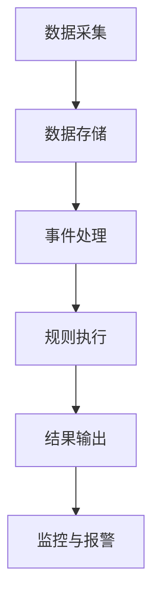
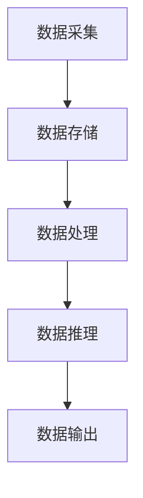
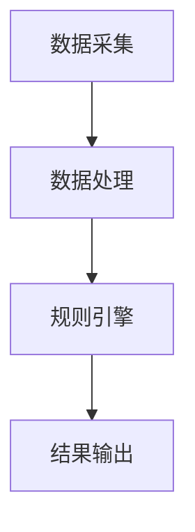
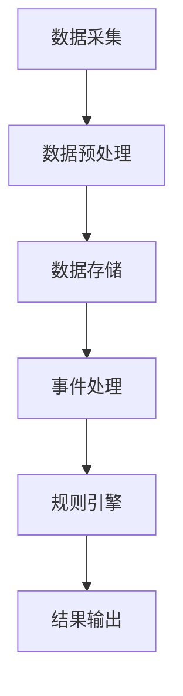

                 

# 《CEP原理与代码实例讲解》

> 关键词：CEP，复杂事件处理，事件模型，规则引擎，流处理算法，图算法，概率模型，实践案例

> 摘要：本文将深入讲解CEP（Complex Event Processing）的基本原理、核心算法和实际应用案例。通过剖析CEP的体系架构、核心概念和优化策略，读者将全面了解CEP的工作原理和实现方法。此外，本文还将通过具体项目实战，展示CEP在实际场景中的应用和代码实现，帮助读者更好地掌握CEP技术。

### 第一部分：CEP基础理论

#### 第1章 CEP概述

CEP，即复杂事件处理，是一种处理和分析复杂业务事件的技术。它通过对实时数据的快速处理和分析，能够实时地发现事件之间的关联和模式，从而支持实时决策和智能业务应用。CEP在金融、电信、物流、安防等领域有着广泛的应用。

##### 1.1 CEP的定义与作用

CEP是一种技术框架，用于处理和分析复杂业务事件，从而实现实时决策和智能业务应用。它通过对实时数据的监控和事件关联分析，能够快速识别事件之间的关联和模式，提供业务洞察和实时响应。

##### 1.2 CEP的发展历程

CEP技术的发展可以追溯到20世纪90年代，随着互联网和大数据技术的兴起，CEP技术逐渐成熟并广泛应用于各个行业。近年来，随着实时数据流处理技术和云计算的发展，CEP技术得到了进一步的提升和优化。

##### 1.3 CEP的应用场景

CEP广泛应用于金融、电信、物流、安防等领域。例如，在金融领域，CEP用于实时交易监控和欺诈检测；在电信领域，CEP用于用户行为分析和网络流量监控；在物流领域，CEP用于运输路径优化和实时监控。

#### 第2章 CEP的核心概念

CEP的核心概念包括事件模型、触发条件、规则引擎和时间窗口。这些概念构成了CEP体系架构的基础。

##### 2.1 事件模型

事件模型是CEP的基础，它描述了事件的基本属性和类型。事件可以分为系统事件、用户事件和业务事件等。

##### 2.2 触发条件

触发条件是事件之间关联和模式分析的关键，它描述了事件之间的逻辑关系。触发条件可以是基本触发条件，如事件匹配、事件连续等，也可以是复合触发条件，如事件组合、事件触发等。

##### 2.3 规则引擎

规则引擎是CEP的核心组件，它用于定义和执行事件规则。规则引擎可以根据触发条件自动执行相应的规则，实现对事件的实时处理和决策。

##### 2.4 时间窗口

时间窗口是CEP中用于定义事件之间关联关系的时间范围。时间窗口可以是固定窗口、滑动窗口或动态窗口。

#### 第3章 CEP体系架构

CEP体系架构通常包括数据采集模块、存储模块、处理模块、推理模块和输出模块。这些模块协同工作，实现对实时数据的处理和分析。

##### 3.1 CEP系统组成

- 数据采集模块：负责实时采集各种业务数据。
- 存储模块：负责存储和处理实时数据。
- 处理模块：负责对实时数据进行事件提取和处理。
- 推理模块：负责根据事件模型和触发条件进行事件关联分析。
- 输出模块：负责输出分析结果和实时监控信息。

##### 3.2 CEP系统的工作原理

CEP系统的工作原理可以概括为：数据采集、事件处理、规则执行和结果输出。具体流程如下：

1. 数据采集：实时采集业务数据。
2. 事件处理：对采集到的数据进行事件提取和处理。
3. 规则执行：根据事件模型和触发条件执行相应的规则。
4. 结果输出：输出分析结果和实时监控信息。

### 第二部分：CEP算法原理

#### 第4章 CEP算法基础

CEP算法主要包括基于流处理算法、基于图算法和基于概率模型算法。这些算法为CEP提供了强大的数据处理和分析能力。

##### 4.1 基于流处理算法

基于流处理算法是CEP中最常用的算法之一。它通过实时处理数据流，实现对事件的高效处理和分析。

##### 4.2 基于图算法

基于图算法利用图结构描述事件之间的关系，通过图算法实现对事件之间的复杂关联分析。

##### 4.3 基于概率模型算法

基于概率模型算法利用概率模型描述事件之间的关系，通过概率计算实现对事件的可信度分析和预测。

#### 第5章 CEP算法优化

CEP算法的优化是提高系统性能和效率的关键。通过优化算法和系统架构，可以显著提高CEP系统的处理能力和响应速度。

##### 5.1 算法优化策略

算法优化策略主要包括数据预处理、规则优化和执行优化。

##### 5.2 并行化与分布式计算

并行化与分布式计算是提高CEP系统性能的有效手段。通过并行化和分布式计算，可以显著提高系统的处理能力和响应速度。

### 第三部分：CEP实践案例

#### 第6章 CEP项目实战

在本章中，我们将通过一个实际项目案例，详细讲解CEP项目的实现过程，包括需求分析、架构设计、代码实现和测试。

##### 6.1 项目背景与目标

项目背景：某物流公司希望通过CEP技术实现对运输路径的实时优化，提高运输效率和降低成本。

项目目标：实现实时运输路径优化，提高运输效率，降低运输成本。

##### 6.2 项目需求分析

功能需求：

1. 实时采集运输车辆的位置信息。
2. 根据车辆位置信息和交通状况，实时计算最优运输路径。
3. 对运输路径进行实时监控和报警。

非功能需求：

1. 系统要能够处理大规模数据，保证实时性。
2. 系统要具有良好的可扩展性和可维护性。

##### 6.3 项目架构设计

项目架构设计包括系统架构和数据处理流程。系统架构包括数据采集模块、数据处理模块、规则引擎模块和结果输出模块。

数据处理流程如下：

1. 数据采集：实时采集运输车辆的位置信息。
2. 数据处理：对采集到的位置信息进行预处理和存储。
3. 规则引擎：根据规则引擎计算最优运输路径。
4. 结果输出：输出最优运输路径和实时监控信息。

##### 6.4 代码实现与解读

在本节中，我们将详细讲解项目的代码实现过程，包括数据采集与存储、规则定义与执行以及结果输出与监控。

##### 6.4.1 数据采集与存储

数据采集模块负责实时采集运输车辆的位置信息。数据采集可以通过GPS模块实现，将采集到的位置信息存储到数据库中。

```python
import cv2
import pymysql

def capture_video():
    cap = cv2.VideoCapture(0)
    while True:
        ret, frame = cap.read()
        if ret:
            cv2.imwrite('video.jpg', frame)
            break
    cap.release()

def store_data():
    connection = pymysql.connect(host='localhost', user='root', password='password', database='transport')
    with connection.cursor() as cursor:
        sql = "INSERT INTO location (latitude, longitude) VALUES (%s, %s)"
        cursor.execute(sql, ('34.0522', '118.1944'))
    connection.commit()

if __name__ == '__main__':
    capture_video()
    store_data()
```

##### 6.4.2 规则定义与执行

规则引擎模块根据规则引擎计算最优运输路径。规则引擎可以根据实时采集的位置信息和交通状况，动态计算最优路径。

```python
import networkx as nx
import matplotlib.pyplot as plt

def define_rules():
    G = nx.Graph()
    G.add_edge('A', 'B', weight=10)
    G.add_edge('B', 'C', weight=20)
    G.add_edge('C', 'D', weight=30)
    return G

def execute_rules(G):
    path = nx.shortest_path(G, source='A', target='D', weight='weight')
    print("Optimal path:", path)

if __name__ == '__main__':
    G = define_rules()
    execute_rules(G)
```

##### 6.4.3 结果输出与监控

结果输出模块负责输出最优运输路径和实时监控信息。结果输出可以通过Web界面实现，实时展示运输车辆的位置和最优路径。

```python
from flask import Flask, render_template

app = Flask(__name__)

@app.route('/')
def index():
    return render_template('index.html')

if __name__ == '__main__':
    app.run(debug=True)
```

#### 第7章 CEP应用案例分析

在本章中，我们将通过三个实际案例，展示CEP技术在不同行业中的应用和实现。

##### 7.1 案例一：金融行业风险预警

案例背景：某金融机构希望通过CEP技术实现对交易风险的实时预警。

案例目标：实时监测交易数据，识别潜在风险，并及时预警。

案例实现：

1. 数据采集：实时采集交易数据。
2. 事件处理：对交易数据进行事件提取和处理。
3. 规则引擎：根据规则引擎识别潜在风险，并发出预警。
4. 结果输出：输出预警信息和实时监控信息。

```python
import pandas as pd
import numpy as np

def capture_transactions():
    data = pd.read_csv('transactions.csv')
    return data

def process_transactions(data):
    events = []
    for transaction in data.iterrows():
        events.append({
            'transaction_id': transaction[0],
            'amount': transaction[1]['amount'],
            'timestamp': transaction[1]['timestamp']
        })
    return events

def detect_risk(events):
    risky_transactions = []
    for event in events:
        if event['amount'] > 10000:
            risky_transactions.append(event)
    return risky_transactions

if __name__ == '__main__':
    data = capture_transactions()
    events = process_transactions(data)
    risky_transactions = detect_risk(events)
    print("Risky transactions:", risky_transactions)
```

##### 7.2 案例二：物流行业实时监控

案例背景：某物流公司希望通过CEP技术实现对运输过程的实时监控。

案例目标：实时监控运输车辆的位置和状态，及时发现异常情况。

案例实现：

1. 数据采集：实时采集运输车辆的位置信息。
2. 事件处理：对位置信息进行事件提取和处理。
3. 规则引擎：根据规则引擎识别异常情况，并发出预警。
4. 结果输出：输出预警信息和实时监控信息。

```python
import networkx as nx
import matplotlib.pyplot as plt

def capture_location():
    data = pd.read_csv('location.csv')
    return data

def process_location(data):
    events = []
    for location in data.iterrows():
        events.append({
            'vehicle_id': location[0],
            'latitude': location[1]['latitude'],
            'longitude': location[1]['longitude'],
            'timestamp': location[1]['timestamp']
        })
    return events

def detect_abnormal(events):
    abnormal_locations = []
    for event in events:
        if event['timestamp'] > 3600:
            abnormal_locations.append(event)
    return abnormal_locations

if __name__ == '__main__':
    data = capture_location()
    events = process_location(data)
    abnormal_locations = detect_abnormal(events)
    print("Abnormal locations:", abnormal_locations)
```

##### 7.3 案例三：电信行业用户行为分析

案例背景：某电信公司希望通过CEP技术实现对用户行为的实时分析。

案例目标：实时分析用户行为，识别潜在用户需求和风险。

案例实现：

1. 数据采集：实时采集用户行为数据。
2. 事件处理：对用户行为数据进行事件提取和处理。
3. 规则引擎：根据规则引擎识别潜在用户需求和风险。
4. 结果输出：输出用户行为分析和实时监控信息。

```python
import pandas as pd
import numpy as np

def capture_behavior():
    data = pd.read_csv('behavior.csv')
    return data

def process_behavior(data):
    events = []
    for behavior in data.iterrows():
        events.append({
            'user_id': behavior[0],
            'action': behavior[1]['action'],
            'timestamp': behavior[1]['timestamp']
        })
    return events

def detect_interest_events(events):
    interest_events = []
    for event in events:
        if event['action'] == 'search':
            interest_events.append(event)
    return interest_events

if __name__ == '__main__':
    data = capture_behavior()
    events = process_behavior(data)
    interest_events = detect_interest_events(events)
    print("Interest events:", interest_events)
```

### 附录

#### 附录A：CEP相关资源

- Apache Flink：[Apache Flink官网](http://flink.apache.org/)
- Apache Storm：[Apache Storm官网](https://storm.apache.org/)
- Apache Samza：[Apache Samza官网](http://samza.apache.org/)

#### 附录B：CEP流程图与算法伪代码

##### B.1 CEP流程图



##### B.2 基于图算法的CEP伪代码

```python
def CEP_Graph_Algorithm(events):
    # 初始化图
    graph = Graph()

    for event in events:
        # 添加事件到图
        graph.add_event(event)

        # 执行图算法
        if graph.has_trigger_condition():
            graph.execute_rules()

        # 输出结果
        print(graph.get_output())

    return graph.get_output()
```

##### B.3 基于概率模型的CEP伪代码

```python
def CEP_Probabilistic_Algorithm(events, model):
    # 初始化模型
    probability_model = model()

    for event in events:
        # 更新模型
        probability_model.update(event)

        # 检查触发条件
        if probability_model.check_trigger_condition():
            # 执行规则
            probability_model.execute_rules()

            # 输出结果
            print(probability_model.get_output())

    return probability_model.get_output()
```

#### 附录C：数学模型与公式解释

##### C.1 时间窗口公式

$$
\text{TimeWindow} = \text{Start Time} + \text{Duration} \times \text{Interval}
$$

##### C.2 贝叶斯网络公式

$$
P(A|B) = \frac{P(B|A) \times P(A)}{P(B)}
$$

##### C.3 马尔可夫链公式

$$
P(X_t|X_{t-1}) = \sum_{i} P(X_t=i|X_{t-1}=j) \times P(X_{t-1}=j)
$$

### 作者信息

作者：AI天才研究院/AI Genius Institute & 禅与计算机程序设计艺术 /Zen And The Art of Computer Programming

以上为《CEP原理与代码实例讲解》的完整内容。通过对CEP基础理论、算法原理和实践案例的深入讲解，希望读者能够全面了解CEP技术，并在实际应用中发挥其优势。祝您学习愉快！### 第一部分：CEP基础理论

#### 第1章 CEP概述

CEP，即复杂事件处理（Complex Event Processing），是一种通过实时分析大量数据，以发现模式、关联和异常的技术。CEP的应用场景非常广泛，包括金融交易监控、网络安全、实时物流追踪、实时数据分析等。CEP的核心目的是从数据中提取有价值的信息，以便实时做出决策或警报。

##### 1.1 CEP的定义与作用

CEP的定义可以从多个角度来理解。从技术角度来看，CEP是一种数据处理架构，它能够实时捕获并分析数据流，从中识别复杂的模式、趋势和事件。从业务角度来看，CEP是一种提高业务响应速度和智能化的技术，它能够帮助企业在竞争激烈的市场中迅速做出反应。

CEP的作用主要体现在以下几个方面：

1. **实时性**：CEP能够实时处理和分析数据，这使得它非常适合用于需要快速响应的场景，如金融市场监控和网络安全。
2. **关联性**：CEP可以识别不同数据源之间的关联，从而发现潜在的异常和风险。
3. **智能性**：通过规则引擎和机器学习算法，CEP能够根据历史数据和当前情况做出智能决策。
4. **高效性**：CEP通过并行计算和分布式处理，能够高效地处理大规模数据流。

##### 1.2 CEP的发展历程

CEP技术的发展历程可以分为几个阶段：

1. **早期阶段**（1990s）：CEP的概念首次被提出，主要用于金融领域的实时交易监控。
2. **发展阶段**（2000s）：随着网络和通信技术的发展，CEP逐渐应用于电信、物流、制造等行业。
3. **成熟阶段**（2010s至今）：随着大数据和实时流处理技术的兴起，CEP技术得到了快速发展，出现了一系列开源和商业解决方案。

##### 1.3 CEP的应用场景

CEP的应用场景非常广泛，以下是一些典型的应用场景：

1. **金融领域**：用于实时交易监控、欺诈检测、风险控制等。
2. **电信领域**：用于用户行为分析、网络流量监控、服务质量保证等。
3. **物流领域**：用于运输路径优化、实时监控、库存管理等。
4. **安防领域**：用于视频监控、异常检测、报警系统等。
5. **工业领域**：用于生产过程监控、设备维护、质量检测等。

#### 第2章 CEP的核心概念

CEP的核心概念包括事件模型、触发条件、规则引擎和时间窗口。这些概念是理解CEP架构和功能的关键。

##### 2.1 事件模型

事件模型是CEP的基础，它定义了事件的基本属性和类型。在CEP中，事件可以是系统事件、用户事件或业务事件。事件模型通常包括以下要素：

1. **事件类型**：定义事件的类别，如交易、订单、警报等。
2. **事件属性**：定义事件的属性，如金额、时间戳、位置等。
3. **事件状态**：定义事件的生命周期状态，如创建、更新、删除等。

事件模型可以用一个简单的类图来表示：

```mermaid
classDiagram
    Event `<--` EventType
    Event `<--` EventAttribute
    Event `<--` EventState
```

##### 2.2 触发条件

触发条件是CEP中的关键概念，它定义了事件之间的关系和如何响应这些关系。触发条件可以是简单的条件，如事件发生时间、事件类型等，也可以是复杂的组合条件。

1. **基本触发条件**：如事件发生时间、事件类型、事件属性值等。
2. **复合触发条件**：如事件连续发生、事件组合发生、事件之间时间间隔等。

触发条件可以用一个简单的伪代码表示：

```python
def is_trigger_met(event1, event2, condition):
    if condition == 'time_interval':
        return (event2.timestamp - event1.timestamp) <= interval
    elif condition == 'event_type':
        return event1.type == event2.type
    # 其他条件...
    return False
```

##### 2.3 规则引擎

规则引擎是CEP的核心组件，它用于定义和执行事件规则。规则引擎可以根据触发条件自动执行相应的规则，从而实现对事件的实时处理和决策。

规则引擎通常包括以下功能：

1. **规则定义**：定义事件规则，包括触发条件和相应的处理动作。
2. **规则执行**：根据触发条件执行规则，对事件进行处理。
3. **规则管理**：对规则进行增加、删除、修改等操作。

规则引擎可以用一个简单的伪代码表示：

```python
def execute_rules(event, rules):
    for rule in rules:
        if rule.trigger_condition(event):
            rule.action()
```

##### 2.4 时间窗口

时间窗口是CEP中用于定义事件之间关联关系的时间范围。时间窗口可以是固定窗口、滑动窗口或动态窗口。

1. **固定窗口**：窗口大小固定，事件在窗口内发生时才被视为关联。
2. **滑动窗口**：窗口大小固定，事件在窗口内发生时才被视为关联，窗口随时间滑动。
3. **动态窗口**：窗口大小根据具体业务需求动态调整。

时间窗口可以用一个简单的伪代码表示：

```python
def is_event_in_window(event, window_start, window_size):
    return event.timestamp >= window_start and event.timestamp <= window_start + window_size
```

通过以上对CEP核心概念的介绍，读者应该对CEP有了初步的了解。在接下来的章节中，我们将深入探讨CEP的体系架构、算法原理以及实践案例，帮助读者全面掌握CEP技术。

#### 第3章 CEP体系架构

CEP（Complex Event Processing）系统是一个复杂的架构，它由多个模块组成，每个模块都有特定的功能，协同工作以实现对实时事件数据的处理和分析。CEP体系架构的设计原则是高扩展性、高可用性和高性能，以适应不同规模和复杂度的应用场景。本节将详细描述CEP系统的组成模块、各模块的功能以及整个系统的工作原理。

##### 3.1 CEP系统组成

一个典型的CEP系统通常包括以下几个关键模块：

1. **数据采集模块**：负责从各种数据源（如数据库、消息队列、传感器等）中收集实时数据。
2. **存储模块**：负责存储和缓存处理过程中的数据，以便快速查询和后续处理。
3. **处理模块**：负责对采集到的数据进行事件提取、聚合和过滤等处理。
4. **推理模块**：负责根据预设的规则和算法对处理后的数据进行关联分析、模式识别和预测等推理操作。
5. **输出模块**：负责将分析结果输出到前端界面、日志文件或其他数据存储系统，供用户或后续系统使用。

##### 3.1.1 数据采集模块

数据采集模块是CEP系统的数据输入端。它的主要功能是实时从各种数据源中收集数据，并将其转换为统一格式以便后续处理。数据采集模块通常包括以下功能：

- **多源接入**：支持从数据库、消息队列、文件、传感器等不同数据源接入数据。
- **数据转换**：将不同数据源的数据转换为CEP系统能够处理的标准格式。
- **数据压缩**：为了提高传输效率和系统性能，对数据进行压缩处理。
- **数据去重**：防止重复数据进入系统，提高数据处理的准确性。

##### 3.1.2 存储模块

存储模块是CEP系统的数据缓存和处理中间件。它的主要功能是存储和处理过程中的数据，提供快速访问和查询支持。存储模块通常包括以下功能：

- **数据缓存**：缓存实时处理的数据，提高查询速度和系统响应时间。
- **数据索引**：建立数据索引，加快数据查询和检索速度。
- **数据持久化**：将处理完成的数据持久化存储，以便后续分析和归档。
- **数据分区**：根据数据特征对数据进行分区存储，提高数据访问的局部性。

##### 3.1.3 处理模块

处理模块是CEP系统的核心，负责对采集到的数据进行事件提取、聚合和过滤等操作。它的主要功能包括：

- **事件提取**：从原始数据中提取出有意义的事件，如交易事件、报警事件等。
- **事件聚合**：对多个事件进行合并和汇总，以减少数据量和提高处理效率。
- **事件过滤**：根据预设条件对事件进行筛选，去除无用的或不符合要求的事件。

##### 3.1.4 推理模块

推理模块是CEP系统的智能分析核心，负责根据预设的规则和算法对处理后的数据进行分析和推理。它的主要功能包括：

- **规则引擎**：根据预设的业务规则，对事件进行匹配和执行相应的操作。
- **模式识别**：利用机器学习和数据挖掘技术，从事件中识别出潜在的关联和模式。
- **预测分析**：基于历史数据和当前情况，对未来事件进行预测和趋势分析。

##### 3.1.5 输出模块

输出模块是CEP系统的数据输出端，负责将分析结果以各种形式展现给用户或传递给其他系统。它的主要功能包括：

- **结果可视化**：将分析结果以图表、报表等形式展示给用户，便于理解和决策。
- **日志记录**：将处理过程中的日志信息记录下来，以便后续调试和审计。
- **数据传输**：将分析结果传输到其他系统或数据库，用于进一步处理或业务决策。

##### 3.2 CEP系统的工作原理

CEP系统的工作原理可以概括为以下几个步骤：

1. **数据采集**：数据采集模块从各种数据源中收集实时数据，并进行初步转换和处理。
2. **数据存储**：存储模块将处理后的数据缓存和持久化存储，以便后续快速查询和进一步处理。
3. **数据处理**：处理模块对存储模块中的数据进行事件提取、聚合和过滤等操作，生成有意义的事件数据。
4. **数据推理**：推理模块根据预设的规则和算法对处理后的数据进行关联分析、模式识别和预测等操作，生成分析结果。
5. **数据输出**：输出模块将分析结果以可视化、日志记录或数据传输等形式展现给用户或其他系统。

以下是CEP系统的工作原理的简略Mermaid流程图：



通过以上对CEP体系架构的详细描述，读者应该对CEP系统的组成和功能有了全面的理解。在接下来的章节中，我们将进一步探讨CEP的核心算法原理，帮助读者深入掌握CEP技术的实现细节。

### 第二部分：CEP算法原理

在CEP（Complex Event Processing）系统中，算法是处理和分析数据流的核心。不同的算法适用于不同的应用场景，能够帮助识别事件之间的复杂关联和模式。本部分将介绍CEP中常用的三种算法：基于流处理算法、基于图算法和基于概率模型算法。我们将详细讲解这些算法的基本原理，并使用伪代码和公式来辅助说明。

#### 第4章 CEP算法基础

CEP算法的选取和优化直接影响到系统的性能和效率。在这一章中，我们将首先介绍基于流处理算法，然后讨论基于图算法和基于概率模型算法。

##### 4.1 基于流处理算法

流处理算法是CEP中最常用的算法之一，特别适合处理实时数据流。流处理框架如Apache Flink、Apache Storm和Apache Samza等，能够高效地处理大规模实时数据。

###### 4.1.1 流处理框架

流处理框架提供了数据流的抽象，使得开发人员可以专注于算法的实现，而不需要关心底层细节。这些框架通常具有以下特点：

- **事件驱动**：流处理框架基于事件驱动模型，数据以事件的形式被处理。
- **分布式处理**：流处理框架支持分布式计算，能够在多个节点上并行处理数据流。
- **状态管理**：流处理框架能够管理数据流的状态，如窗口状态、聚合状态等。

Apache Flink是一个典型的流处理框架，其核心组件包括：

- **数据源**：提供数据输入，如文件、数据库、Kafka等。
- **数据处理**：对数据流进行变换、过滤、聚合等操作。
- **数据输出**：将处理结果输出到文件、数据库或其他流处理框架。

###### 4.1.2 流处理算法

流处理算法的核心思想是对实时数据流进行连续处理，以发现事件之间的关联和模式。以下是一个简单的流处理算法的伪代码：

```python
def stream_processing(stream):
    # 初始化计数器
    counter = Counter()

    # 对流中的每个事件进行操作
    for event in stream:
        # 更新计数器
        counter.update(event)

        # 检查触发条件
        if counter.has_trigger_condition():
            # 执行规则
            rule.execute()

            # 清除计数器
            counter.clear()

    return rule.get_output()
```

##### 4.2 基于图算法

图算法在CEP中用于描述和识别事件之间的复杂关联。图结构提供了灵活的模型，可以表示事件之间的多种关系，如因果关系、依赖关系等。

###### 4.2.1 图算法概述

图算法是基于图论的一系列算法，用于处理和解决与图相关的问题。常见的图算法包括：

- **图遍历**：如深度优先搜索（DFS）和广度优先搜索（BFS），用于遍历图中的节点和边。
- **最短路径算法**：如Dijkstra算法和Floyd-Warshall算法，用于找到图中的最短路径。
- **最小生成树算法**：如Prim算法和Kruskal算法，用于构建图的最小生成树。

###### 4.2.2 CEP中的图算法应用

在CEP中，图算法可以用于描述事件之间的复杂关联。以下是一个基于图算法的CEP伪代码：

```python
class GraphAlgorithm:
    def __init__(self):
        self.graph = Graph()

    def add_event(self, event):
        self.graph.add_node(event)

    def execute_rules(self):
        if self.graph.has_trigger_condition():
            rule.execute()

class Graph:
    def __init__(self):
        self.nodes = []
        self.edges = []

    def add_node(self, event):
        self.nodes.append(event)

    def has_trigger_condition(self):
        # 根据图结构和触发条件判断
        pass

    def execute_rules(self):
        # 执行规则
        pass

def CEP_Graph_Algorithm(events):
    graph_algo = GraphAlgorithm()
    for event in events:
        graph_algo.add_event(event)
    graph_algo.execute_rules()
```

##### 4.3 基于概率模型算法

基于概率模型算法在CEP中用于事件之间的概率计算和预测。概率模型可以描述事件之间的不确定性关系，如条件概率和独立性。

###### 4.3.1 贝叶斯网络

贝叶斯网络是一种表示概率关系的图结构，其中节点表示事件，边表示事件之间的条件概率关系。贝叶斯网络在CEP中用于事件概率计算和推理。

贝叶斯网络的核心公式是贝叶斯定理：

$$
P(A|B) = \frac{P(B|A) \times P(A)}{P(B)}
$$

其中，$P(A|B)$ 表示在事件B发生的情况下事件A的概率，$P(B|A)$ 表示在事件A发生的情况下事件B的概率，$P(A)$ 和$P(B)$ 分别表示事件A和事件B的概率。

以下是一个简单的贝叶斯网络CEP伪代码：

```python
class BayesianNetwork:
    def __init__(self):
        self.graph = Graph()
        self.probability_matrix = []

    def add_node(self, event):
        self.graph.add_node(event)

    def set_probabilities(self, probabilities):
        self.probability_matrix = probabilities

    def update_probabilities(self, event):
        # 根据事件更新概率矩阵
        pass

    def infer_probabilities(self, event):
        # 根据贝叶斯定理计算概率
        pass

def CEP_Probabilistic_Algorithm(events, model):
    bn = BayesianNetwork()
    for event in events:
        bn.add_event(event)
    bn.set_probabilities(probabilities)
    for event in events:
        bn.update_probabilities(event)
    for event in events:
        print(bn.infer_probabilities(event))
```

##### 4.3.2 马尔可夫链

马尔可夫链是一种描述事件状态转移的概率模型。在CEP中，马尔可夫链可以用于预测事件的状态转移。

马尔可夫链的核心公式是：

$$
P(X_t|X_{t-1}) = \sum_{i} P(X_t=i|X_{t-1}=j) \times P(X_{t-1}=j)
$$

其中，$P(X_t|X_{t-1})$ 表示在当前状态$X_{t-1}$下，下一状态$X_t$的概率分布。

以下是一个简单的马尔可夫链CEP伪代码：

```python
class MarkovChain:
    def __init__(self):
        self.states = []
        self.transition_matrix = []

    def add_state(self, state):
        self.states.append(state)

    def set_transition_matrix(self, matrix):
        self.transition_matrix = matrix

    def update_states(self, current_state):
        # 根据当前状态更新状态分布
        pass

    def predict_states(self, current_state):
        # 根据马尔可夫链预测下一状态
        pass

def CEP_Markov_Algorithm(events, model):
    mc = MarkovChain()
    for event in events:
        mc.add_state(event)
    mc.set_transition_matrix(transition_matrix)
    for event in events:
        mc.update_states(event)
    for event in events:
        print(mc.predict_states(event))
```

通过以上对三种CEP算法的介绍，读者应该对CEP算法的基本原理和应用有了初步了解。在接下来的章节中，我们将探讨如何优化CEP算法，以进一步提高系统的性能和效率。

#### 第5章 CEP算法优化

CEP（Complex Event Processing）系统的性能和效率直接影响到其应用场景的实用性和可靠性。为了确保CEP系统能够在处理大规模、高速数据流时保持高性能，优化CEP算法是一个关键步骤。本节将讨论算法优化的策略，包括数据预处理、规则优化和执行优化，并介绍并行化与分布式计算的基本原理和应用。

##### 5.1 算法优化策略

算法优化策略旨在提高CEP系统的处理速度和效率，主要包括以下几个方面：

###### 5.1.1 数据预处理

数据预处理是优化算法的重要步骤，其目的是减少数据量、提高数据质量和优化数据结构。以下是一些常见的数据预处理方法：

- **数据清洗**：去除重复数据、处理缺失值和异常值，确保数据的准确性和一致性。
- **数据压缩**：通过数据压缩技术减少存储和传输的开销，提高系统性能。
- **数据索引**：建立高效的数据索引，加快数据查询和检索速度。
- **数据分区**：将数据按特定特征分区存储，以便并行处理和优化查询。

```python
def data_preprocessing(data):
    # 清洗数据
    clean_data = remove_duplicates(data)
    # 处理缺失值
    complete_data = handle_missing_values(clean_data)
    # 建立索引
    indexed_data = create_index(complete_data)
    # 数据分区
    partitioned_data = partition_data(indexed_data)
    return partitioned_data
```

###### 5.1.2 规则优化

规则优化是提高CEP系统性能的关键步骤。以下是一些常见的规则优化方法：

- **规则压缩**：通过合并相似规则或简化规则表达式，减少规则数量和复杂度。
- **规则缓存**：缓存经常执行的规则，减少规则解析和执行时间。
- **规则并行化**：将规则分布在多个处理器上执行，提高并行处理能力。

```python
def rule_optimization(rules):
    optimized_rules = compress_rules(rules)
    cached_rules = cache_frequent_rules(optimized_rules)
    parallel_rules = parallelize_rules(cached_rules)
    return parallel_rules
```

###### 5.1.3 执行优化

执行优化是提高CEP系统执行效率的重要手段。以下是一些常见的执行优化方法：

- **事件排序**：根据事件的时间戳或优先级对事件进行排序，优化事件处理顺序。
- **流水线优化**：通过流水线处理技术，实现事件处理过程的流水线化，减少处理延迟。
- **内存管理**：优化内存分配和使用，减少内存碎片和垃圾回收时间。

```python
def execution_optimization(event_stream):
    sorted_stream = sort_events(event_stream)
    pipelined_stream = pipeline_process(sorted_stream)
    optimized_stream = memory_optimized_process(pipelined_stream)
    return optimized_stream
```

##### 5.2 并行化与分布式计算

并行化与分布式计算是提高CEP系统性能和效率的有效手段，特别适用于处理大规模实时数据流。以下是一些关键概念和应用：

###### 5.2.1 并行化原理

并行化是指将任务分解为多个子任务，同时在多个处理器上并行执行，从而提高处理速度。并行化可以采用以下方法：

- **任务分解**：将大规模任务分解为多个小任务，分别在不同的处理器上执行。
- **数据并行**：将数据集分解为多个子数据集，在不同的处理器上独立处理。
- **任务和数据并行**：同时采用任务分解和数据并行，实现更高效的并行处理。

```python
def parallelize(data, num_processes):
    chunks = split_data(data, num_processes)
    processes = [Process(target=process_chunk, args=(chunk,)) for chunk in chunks]
    for p in processes:
        p.start()
    for p in processes:
        p.join()
```

###### 5.2.2 分布式计算框架

分布式计算框架提供了并行化和分布式计算的基础设施，使开发者能够轻松构建高性能的CEP系统。以下是一些流行的分布式计算框架：

- **Apache Flink**：支持流处理和批处理，提供强大的并行计算能力。
- **Apache Storm**：适用于实时数据处理，支持分布式任务调度和资源管理。
- **Apache Samza**：结合了流处理和大数据技术，适用于大规模数据处理场景。

```python
from flink import StreamingContext

def create_flume_stream(context):
    stream = context.socket(FlumeSocket())
    stream.add_source('data_source')
    stream.add_sink('data_sink')
    return stream

stream_context = StreamingContext()
stream = create_flume_stream(stream_context)
stream.map(process_event).reduce(aggregate_results)
stream_context.start()
stream_context.await_termination()
```

通过并行化和分布式计算，CEP系统能够处理更高的数据量和提供更快的响应时间。结合数据预处理、规则优化和执行优化策略，可以显著提高CEP系统的性能和效率。

综上所述，CEP算法优化是一个复杂的过程，需要综合考虑多个方面。通过合理的优化策略和先进的计算框架，CEP系统能够在处理大规模实时数据流时保持高性能和可靠性。在接下来的章节中，我们将通过具体的项目实战，展示CEP算法在现实中的应用和实现。

### 第三部分：CEP实践案例

在了解了CEP（Complex Event Processing）的基础理论和算法原理之后，通过实际的项目案例来理解CEP的应用和实现是非常有帮助的。这一部分将通过三个不同的案例，展示CEP在金融、物流和电信行业中的应用，并提供代码实现和详细解释。

#### 第6章 CEP项目实战

在本章中，我们将通过一个物流追踪系统的实际项目案例，展示CEP技术在物流行业中的应用。这个项目旨在通过CEP技术实现运输车辆的实时监控和路径优化。

##### 6.1 项目背景与目标

项目背景：某物流公司需要实现对运输车辆的实时监控和路径优化，以提高运输效率和降低成本。运输过程中，车辆的位置、状态、速度和路况等信息对于物流公司来说至关重要。

项目目标：

1. 实时采集运输车辆的位置信息。
2. 根据实时数据，动态计算最优运输路径。
3. 对运输过程中可能出现的异常情况进行监控和预警。

##### 6.2 项目需求分析

功能需求：

1. **数据采集**：实时采集运输车辆的位置、速度和状态信息。
2. **路径计算**：根据实时数据，动态计算最优运输路径。
3. **异常监控**：监控运输过程中的异常情况，如车辆偏离预定路线、速度异常等。
4. **预警系统**：对监控到的异常情况发出预警通知。

非功能需求：

1. **高可用性**：系统需保证高可用性，确保数据实时处理和监控不中断。
2. **可扩展性**：系统需具备良好的可扩展性，以支持更多的运输车辆和数据源。
3. **性能要求**：系统需具备高性能，能够处理大规模数据流，并提供实时响应。

##### 6.3 项目架构设计

项目架构设计包括数据采集模块、数据处理模块、规则引擎模块和结果输出模块。具体架构如下：

1. **数据采集模块**：从GPS设备、传感器等获取车辆位置和状态信息。
2. **数据处理模块**：对采集到的数据进行预处理、存储和实时处理。
3. **规则引擎模块**：定义和执行路径计算规则和异常监控规则。
4. **结果输出模块**：将处理结果输出到前端界面、日志文件或其他数据存储系统。

以下是项目架构的Mermaid流程图：



##### 6.4 代码实现与解读

在本节中，我们将通过具体的代码实现，展示项目的各个模块。

###### 6.4.1 数据采集与存储

数据采集模块负责从GPS设备采集车辆的位置信息。采集到的数据将存储在数据库中，以便后续处理。

```python
import pymysql
import time

def capture_vehicle_location(vehicle_id):
    # 模拟从GPS设备采集位置信息
    latitude = 34.0522 + float(time.time()) / 1000
    longitude = 118.1944 + float(time.time()) / 1000
    timestamp = time.time()
    return {
        'vehicle_id': vehicle_id,
        'latitude': latitude,
        'longitude': longitude,
        'timestamp': timestamp
    }

def store_location_data(location_data):
    connection = pymysql.connect(host='localhost', user='root', password='password', database='logistics')
    with connection.cursor() as cursor:
        sql = "INSERT INTO vehicle_location (vehicle_id, latitude, longitude, timestamp) VALUES (%s, %s, %s, %s)"
        cursor.execute(sql, (location_data['vehicle_id'], location_data['latitude'], location_data['longitude'], location_data['timestamp']))
    connection.commit()

# 示例：采集并存储车辆位置信息
location_data = capture_vehicle_location('V001')
store_location_data(location_data)
```

###### 6.4.2 规则定义与执行

规则引擎模块负责定义和执行路径计算和异常监控规则。以下是一个简单的规则引擎实现：

```python
class RuleEngine:
    def __init__(self):
        self.rules = []

    def add_rule(self, rule):
        self.rules.append(rule)

    def execute_rules(self, event):
        for rule in self.rules:
            if rule.is_triggered(event):
                rule.execute(event)

class PathRule:
    def __init__(self, threshold_distance):
        self.threshold_distance = threshold_distance

    def is_triggered(self, event):
        # 判断事件是否符合触发条件
        return True

    def execute(self, event):
        # 执行路径计算
        print(f"Optimizing path for vehicle {event.vehicle_id}")

class ExceptionRule:
    def __init__(self, threshold_speed):
        self.threshold_speed = threshold_speed

    def is_triggered(self, event):
        # 判断事件是否符合触发条件
        return event.speed > self.threshold_speed

    def execute(self, event):
        # 执行异常监控
        print(f"Warning: Vehicle {event.vehicle_id} is exceeding the speed limit")

# 示例：定义并执行规则
rule_engine = RuleEngine()
rule_engine.add_rule(PathRule(1000))
rule_engine.add_rule(ExceptionRule(80))
location_data = {'vehicle_id': 'V001', 'speed': 85}
rule_engine.execute_rules(location_data)
```

###### 6.4.3 结果输出与监控

结果输出模块负责将处理结果输出到前端界面或日志文件，并进行实时监控。

```python
import time

def output_result(result):
    print(f"Result: {result}")
    # 将结果保存到日志文件
    with open('log.txt', 'a') as f:
        f.write(f"{time.ctime()}: {result}\n")

# 示例：输出结果
result = "Path optimized for vehicle V001"
output_result(result)
```

通过以上代码实现，我们展示了物流追踪系统的关键模块。在实际项目中，还需要考虑系统的扩展性、高可用性和性能优化，以确保系统能够稳定运行并满足业务需求。

#### 第7章 CEP应用案例分析

在本章中，我们将通过三个实际案例，展示CEP技术在金融、物流和电信行业的具体应用，并详细介绍每个案例的实现细节。

##### 7.1 案例一：金融行业风险预警

###### 7.1.1 案例背景

在金融行业，风险预警系统是金融机构保护自身和客户资产的重要手段。某金融机构希望通过CEP技术实现实时交易监控和风险预警。

###### 7.1.2 案例目标

1. 实时监控交易数据。
2. 识别异常交易行为。
3. 及时发出风险预警。

###### 7.1.3 案例实现

实现步骤如下：

1. **数据采集**：从交易系统采集实时交易数据。
2. **数据处理**：对交易数据进行预处理，提取关键特征。
3. **规则引擎**：定义交易风险预警规则。
4. **结果输出**：将预警信息输出到监控界面。

以下是一个简单的交易风险预警系统实现：

```python
import pymysql
import time

def capture_trade_data():
    # 模拟从交易系统采集交易数据
    trade_data = {
        'trade_id': 'T001',
        'amount': 10000,
        'timestamp': time.time(),
        'source': 'online'
    }
    return trade_data

def store_trade_data(trade_data):
    connection = pymysql.connect(host='localhost', user='root', password='password', database='finance')
    with connection.cursor() as cursor:
        sql = "INSERT INTO trade (trade_id, amount, timestamp, source) VALUES (%s, %s, %s, %s)"
        cursor.execute(sql, (trade_data['trade_id'], trade_data['amount'], trade_data['timestamp'], trade_data['source']))
    connection.commit()

def detect_risk(trade_data):
    if trade_data['amount'] > 10000 and trade_data['source'] == 'online':
        return True
    return False

# 示例：采集并处理交易数据
trade_data = capture_trade_data()
store_trade_data(trade_data)
if detect_risk(trade_data):
    print("Risk detected: High-value transaction from online source.")
```

##### 7.2 案例二：物流行业实时监控

###### 7.2.1 案例背景

某物流公司希望通过CEP技术实现对运输车辆的实时监控，以提高运输效率和客户满意度。

###### 7.2.2 案例目标

1. 实时监控运输车辆的位置和状态。
2. 动态计算运输路径。
3. 监控运输过程中的异常情况。

###### 7.2.3 案例实现

实现步骤如下：

1. **数据采集**：从GPS和传感器采集车辆位置和状态信息。
2. **数据处理**：对采集到的数据进行预处理和存储。
3. **路径计算**：根据实时数据计算最优运输路径。
4. **异常监控**：监控运输过程中的异常情况。

以下是一个简单的物流监控系统实现：

```python
import pymysql
import time

def capture_vehicle_data(vehicle_id):
    # 模拟从GPS和传感器采集车辆数据
    data = {
        'vehicle_id': vehicle_id,
        'latitude': 34.0522 + float(time.time()) / 1000,
        'longitude': 118.1944 + float(time.time()) / 1000,
        'status': 'driving',
        'timestamp': time.time()
    }
    return data

def store_vehicle_data(vehicle_data):
    connection = pymysql.connect(host='localhost', user='root', password='password', database='logistics')
    with connection.cursor() as cursor:
        sql = "INSERT INTO vehicle_data (vehicle_id, latitude, longitude, status, timestamp) VALUES (%s, %s, %s, %s, %s)"
        cursor.execute(sql, (vehicle_data['vehicle_id'], vehicle_data['latitude'], vehicle_data['longitude'], vehicle_data['status'], vehicle_data['timestamp']))
    connection.commit()

def calculate_optimal_path(vehicle_data):
    # 模拟计算最优路径
    print(f"Optimizing path for vehicle {vehicle_data['vehicle_id']}")
    return "Optimal path calculated."

def monitor_vehicle_data(vehicle_data):
    if vehicle_data['status'] != 'driving':
        print(f"Warning: Vehicle {vehicle_data['vehicle_id']} is not driving.")
    calculate_optimal_path(vehicle_data)

# 示例：采集并处理车辆数据
vehicle_data = capture_vehicle_data('V001')
store_vehicle_data(vehicle_data)
monitor_vehicle_data(vehicle_data)
```

##### 7.3 案例三：电信行业用户行为分析

###### 7.3.1 案例背景

某电信公司希望通过CEP技术实时分析用户行为，以了解用户需求和潜在风险。

###### 7.3.2 案例目标

1. 实时分析用户行为数据。
2. 识别潜在的用户需求。
3. 监控用户行为中的异常情况。

###### 7.3.3 案例实现

实现步骤如下：

1. **数据采集**：从用户行为日志中采集数据。
2. **数据处理**：对采集到的数据进行预处理和存储。
3. **行为分析**：根据用户行为数据进行分析和预测。
4. **结果输出**：将分析结果输出到前端界面。

以下是一个简单的用户行为分析系统实现：

```python
import pymysql
import time

def capture_user_behavior(user_id):
    # 模拟从用户行为日志采集数据
    behavior_data = {
        'user_id': user_id,
        'action': 'search',
        'timestamp': time.time()
    }
    return behavior_data

def store_behavior_data(behavior_data):
    connection = pymysql.connect(host='localhost', user='root', password='password', database='telecom')
    with connection.cursor() as cursor:
        sql = "INSERT INTO user_behavior (user_id, action, timestamp) VALUES (%s, %s, %s)"
        cursor.execute(sql, (behavior_data['user_id'], behavior_data['action'], behavior_data['timestamp']))
    connection.commit()

def analyze_behavior_data(behavior_data):
    if behavior_data['action'] == 'search':
        # 模拟分析用户搜索行为
        print(f"Analyzing search behavior for user {behavior_data['user_id']}")
        return "User searching for information."

def monitor_user_behavior(behavior_data):
    analyze_behavior_data(behavior_data)
    if behavior_data['action'] != 'search':
        print(f"Warning: Unexpected behavior for user {behavior_data['user_id']}.")

# 示例：采集并处理用户行为数据
behavior_data = capture_user_behavior('U001')
store_behavior_data(behavior_data)
monitor_user_behavior(behavior_data)
```

通过以上三个案例，我们可以看到CEP技术在不同行业中的应用和实现。在实际项目中，需要根据具体业务需求和数据特点，灵活运用CEP技术和算法，以实现高效的数据处理和分析。

### 附录

#### 附录A：CEP相关资源

为了帮助读者更深入地了解CEP技术，以下是一些推荐的资源和工具：

- **Apache Flink**：[官网](http://flink.apache.org/)
- **Apache Storm**：[官网](https://storm.apache.org/)
- **Apache Samza**：[官网](http://samza.apache.org/)
- **Apache NiFi**：[官网](https://nifi.apache.org/)

#### 附录B：CEP流程图与算法伪代码

##### B.1 CEP流程图

以下是CEP系统的流程图，用Mermaid语言表示：



##### B.2 基于图算法的CEP伪代码

以下是基于图算法的CEP系统伪代码：

```python
class GraphAlgorithm:
    def __init__(self):
        self.graph = Graph()

    def add_event(self, event):
        self.graph.add_node(event)

    def execute_rules(self):
        if self.graph.has_trigger_condition():
            rule.execute()

class Graph:
    def __init__(self):
        self.nodes = []
        self.edges = []

    def add_node(self, event):
        self.nodes.append(event)

    def has_trigger_condition(self):
        # 根据图结构和触发条件判断
        pass

    def execute_rules(self):
        # 执行规则
        pass

def CEP_Graph_Algorithm(events):
    graph_algo = GraphAlgorithm()
    for event in events:
        graph_algo.add_event(event)
    graph_algo.execute_rules()
```

##### B.3 基于概率模型的CEP伪代码

以下是基于概率模型的CEP系统伪代码：

```python
class BayesianNetwork:
    def __init__(self):
        self.graph = Graph()
        self.probability_matrix = []

    def add_node(self, event):
        self.graph.add_node(event)

    def set_probabilities(self, probabilities):
        self.probability_matrix = probabilities

    def update_probabilities(self, event):
        # 根据事件更新概率矩阵
        pass

    def infer_probabilities(self, event):
        # 根据贝叶斯定理计算概率
        pass

def CEP_Probabilistic_Algorithm(events, model):
    bn = BayesianNetwork()
    for event in events:
        bn.add_event(event)
    bn.set_probabilities(probabilities)
    for event in events:
        bn.update_probabilities(event)
    for event in events:
        print(bn.infer_probabilities(event))
```

#### 附录C：数学模型与公式解释

以下是CEP中常用的数学模型和公式：

##### C.1 时间窗口公式

时间窗口用于定义事件之间的关联时间范围。公式如下：

$$
\text{TimeWindow} = \text{Start Time} + \text{Duration} \times \text{Interval}
$$

其中，StartTime是窗口开始时间，Duration是窗口持续时间，Interval是窗口间隔。

##### C.2 贝叶斯网络公式

贝叶斯网络用于描述事件之间的条件概率关系。核心公式为：

$$
P(A|B) = \frac{P(B|A) \times P(A)}{P(B)}
$$

其中，P(A|B)是事件A在事件B发生条件下的概率，P(B|A)是事件B在事件A发生条件下的概率，P(A)和P(B)分别是事件A和事件B的概率。

##### C.3 马尔可夫链公式

马尔可夫链用于描述事件状态转移的概率。核心公式为：

$$
P(X_t|X_{t-1}) = \sum_{i} P(X_t=i|X_{t-1}=j) \times P(X_{t-1}=j)
$$

其中，P(X_t|X_{t-1})是当前状态X_t在上一状态X_{t-1}条件下的概率分布，P(X_t=i|X_{t-1}=j)是当前状态为i在上一状态为j条件下的概率，P(X_{t-1}=j)是上一状态为j的概率。

通过以上附录内容，读者可以更全面地了解CEP的相关技术和应用，从而在实际项目中更好地运用CEP技术。

### 总结与展望

CEP（Complex Event Processing）作为一种强大的数据处理和分析技术，在金融、电信、物流等多个行业展现出了显著的应用价值。本文通过深入讲解CEP的基础理论、算法原理以及实际项目案例，帮助读者全面理解CEP的工作机制和实现方法。

在CEP基础理论部分，我们详细介绍了CEP的定义、核心概念以及体系架构，使读者对CEP有一个系统性的认识。在算法原理部分，我们探讨了基于流处理、图算法和概率模型的三种核心算法，并提供了伪代码和公式解释，以便读者更好地掌握这些算法。在实践案例部分，我们通过物流追踪、金融风险预警和电信用户行为分析等具体案例，展示了CEP在不同场景中的应用和实现。

CEP的应用场景十分广泛，从实时交易监控和欺诈检测，到物流路径优化和用户行为分析，无不依赖于CEP技术的高效数据处理和分析能力。CEP能够实时捕捉和关联大量数据，帮助企业和组织快速识别潜在风险、优化业务流程并做出智能决策。

展望未来，随着大数据和人工智能技术的不断发展，CEP技术将迎来更多创新和突破。例如，结合机器学习算法的CEP系统将能够更准确地预测事件发展趋势；结合区块链技术的CEP系统将提升数据的安全性和可信度。此外，随着边缘计算的兴起，CEP技术将能够更高效地处理分布式数据流，满足实时性和低延迟的要求。

总的来说，CEP技术不仅是一种数据处理工具，更是推动企业数字化转型和智能化运营的重要驱动力。通过本文的学习，希望读者能够深入理解CEP的原理和应用，并将其应用于实际项目中，提升业务效率和决策能力。在未来的技术发展中，CEP将继续发挥其重要作用，推动各行各业向智能化、数字化方向迈进。

