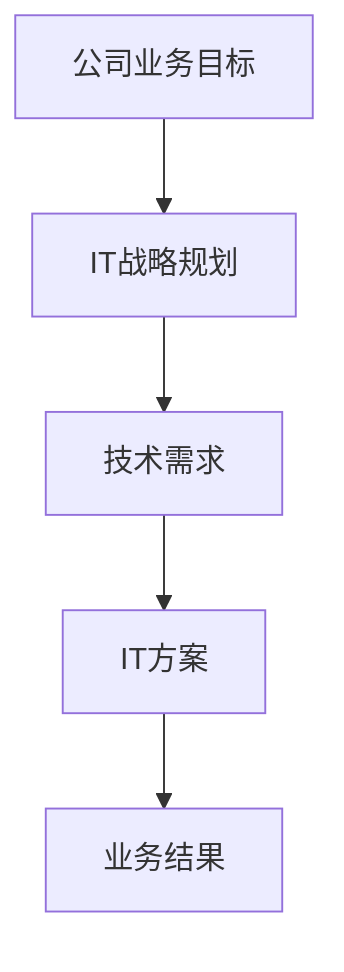
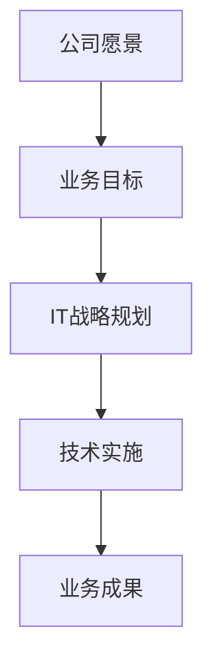

                 

### 文章标题

《IT战略规划：制定并执行与公司业务目标相一致的IT战略计划》

> **关键词：** IT战略规划、公司业务目标、技术需求、战略执行、ROI分析、风险评估、成本效益分析模型、敏感性分析模型、项目实战

> **摘要：** 本文将深入探讨IT战略规划的重要性，详细介绍如何制定与执行与公司业务目标相一致的IT战略计划。我们将从基础理论出发，逐步讲解战略规划流程、核心概念、算法原理、数学模型，并通过实际案例进行分析和代码解读，旨在为IT专业人士提供全面的战略规划指导，帮助公司实现业务目标。

---

### 目录大纲：《IT战略规划：制定并执行与公司业务目标相一致的IT战略计划》

#### 第一部分：战略规划基础

1. **战略规划概述**
    - **1.1 IT战略规划的定义与重要性**
    - **1.2 战略规划与公司业务目标的关联**
    - **1.3 战略规划的框架与流程**

2. **公司业务目标分析**
    - **2.1 业务目标评估方法**
    - **2.2 市场分析**
    - **2.3 竞争对手分析**

3. **IT需求分析**
    - **3.1 IT现状评估**
    - **3.2 业务需求收集与整理**
    - **3.3 技术需求分析**

4. **核心概念与联系**
    - **4.1 IT战略规划中的关键概念（使用Mermaid流程图展示）**
    - **4.2 战略规划与业务目标之间的关系（使用Mermaid流程图展示）**

#### 第二部分：IT战略制定与执行

5. **IT战略制定**
    - **5.1 制定IT战略的原则**
    - **5.2 IT战略的制定流程**
    - **5.3 IT战略文档编写**

6. **IT战略执行**
    - **6.1 执行计划与组织架构调整**
    - **6.2 IT资源配置**
    - **6.3 风险管理**

7. **核心算法原理讲解**
    - **7.1 投资回报率（ROI）分析算法原理**
    - **7.2 风险评估算法原理**

8. **数学模型与公式**
    - **8.1 成本效益分析模型**
    - **8.2 敏感性分析模型**

9. **项目实战**
    - **9.1 IT战略规划项目实战案例**

#### 第三部分：战略评估与持续改进

10. **战略评估**
    - **10.1 评估指标体系**
    - **10.2 战略评估方法**
    - **10.3 结果分析与反馈**

11. **持续改进**
    - **11.1 持续改进的流程**
    - **11.2 持续改进的工具与技术**
    - **11.3 成功案例分享**

### 附录

12. **附录A：IT战略规划工具与资源**
    - **12.1 主流IT战略规划工具**
    - **12.2 IT战略规划参考资料**
    - **12.3 案例研究**

---

这个目录大纲为我们提供了一个清晰的结构，每个部分都有详细的子标题，可以帮助读者快速找到他们感兴趣的内容。在接下来的部分中，我们将逐一深入探讨每个主题，确保文章内容丰富且逻辑连贯。

---

### 第一部分：战略规划基础

#### 1.1 IT战略规划的定义与重要性

IT战略规划是指通过系统化的方法，将公司的业务目标和信息技术（IT）需求相结合，制定出具体且可行的IT解决方案，以支持公司整体战略的实现。这个过程涉及到对当前IT基础设施和能力的评估，对业务需求的深入理解，以及对未来技术和市场趋势的预测。

**IT战略规划的重要性体现在以下几个方面：**

1. **业务目标的一致性**：通过IT战略规划，确保IT系统的建设与公司的长期业务目标保持一致，从而实现资源的最优化配置，提高业务效率。

2. **技术前瞻性**：战略规划可以帮助公司预见技术发展趋势，确保IT系统能够跟随市场变化，保持竞争力。

3. **风险管理**：通过全面的需求分析和风险评估，提前识别和解决潜在的问题，降低项目风险。

4. **成本控制**：科学的规划能够帮助公司在预算范围内有效控制IT项目的成本。

5. **资源配置**：合理的战略规划有助于公司合理分配资源，提高员工的工作效率。

#### 1.2 战略规划与公司业务目标的关联

战略规划不仅是技术层面的工作，更是与公司业务目标紧密相连的重要环节。公司业务目标通常包括市场扩张、成本控制、客户满意度提升、产品创新等，而IT战略规划则需要将这些目标转化为具体的IT计划和项目。

**关联方法包括：**

1. **目标映射**：将公司的业务目标直接映射到IT项目上，确保每个IT项目都有明确的目标和预期成果。

2. **关键绩效指标（KPI）**：通过设置KPI来衡量IT项目对业务目标的贡献，确保IT资源投入能够带来预期的商业价值。

3. **业务需求分析**：深入分析业务流程和需求，将IT解决方案与业务需求相结合，确保IT系统能够满足业务需求，提升业务效率。

#### 1.3 战略规划的框架与流程

一个完整的IT战略规划框架通常包括以下几个阶段：

1. **业务需求分析**：了解公司的业务目标、流程和痛点，收集业务需求。

2. **市场与技术趋势分析**：分析市场环境、竞争对手以及技术发展趋势，为战略规划提供数据支持。

3. **IT现状评估**：对现有的IT基础设施、能力和安全性进行评估，找出存在的不足和瓶颈。

4. **目标设定**：根据业务需求和IT现状，设定具体的IT目标和计划。

5. **资源规划**：确定项目所需的人力、资金、技术和时间等资源。

6. **项目执行**：根据规划实施项目，确保每个项目按时按质完成。

7. **监控与调整**：对项目进展进行实时监控，根据实际情况进行调整，确保战略规划的顺利进行。

---

在这个基础上，我们接下来将深入分析公司业务目标的分析方法，了解如何在战略规划中充分利用市场和技术趋势分析，以及如何进行IT需求分析。

---

#### 1.4 战略规划与公司业务目标的关联性分析

战略规划的核心在于确保IT系统能够与公司的业务目标保持一致，从而为公司的长期发展提供强有力的支持。为了实现这一目标，我们需要从多个维度对战略规划与公司业务目标之间的关联性进行深入分析。

**1.4.1 业务目标评估方法**

首先，我们需要明确公司的业务目标。这通常包括以下几个方面：

- **市场扩张**：公司希望进入新的市场或扩大现有市场份额。
- **成本控制**：公司希望通过优化运营流程和资源利用来降低成本。
- **客户满意度提升**：公司致力于提升客户体验，增加客户忠诚度。
- **产品创新**：公司希望通过技术创新来推出新产品或改进现有产品。

为了评估这些业务目标，我们可以采用以下几种方法：

- **业务流程分析**：通过分析业务流程，确定关键流程和瓶颈，评估业务目标实现的可行性。
- **关键绩效指标（KPI）**：设定可量化的KPI来衡量业务目标的实现程度，如市场份额、成本降低幅度、客户满意度等。

**1.4.2 市场分析**

市场分析是战略规划中的重要组成部分，它可以帮助我们了解外部环境的变化，从而为公司的业务目标提供支持。市场分析的主要内容包括：

- **市场趋势**：分析市场的发展趋势，如新兴技术、消费者需求变化等。
- **竞争对手分析**：研究竞争对手的战略、产品、市场占有率等，评估竞争对手的威胁和机会。
- **市场定位**：确定公司在市场中的定位，制定市场进入策略和竞争策略。

**1.4.3 竞争对手分析**

了解竞争对手的战略和行动对于制定有效的IT战略规划至关重要。竞争对手分析主要包括以下几个方面：

- **竞争对手的产品和服务**：分析竞争对手的产品和服务特点，确定竞争对手的优势和劣势。
- **竞争对手的市场策略**：研究竞争对手的市场策略，了解其市场定位、定价策略、推广策略等。
- **竞争对手的技术发展**：跟踪竞争对手的技术研发动态，了解其技术优势和劣势。

**1.4.4 IT需求分析**

在了解了公司的业务目标和市场情况后，我们需要进行IT需求分析，以确定IT系统需要满足的业务需求和技术需求。IT需求分析的主要内容包括：

- **业务需求收集与整理**：通过访谈、问卷调查等方式收集业务部门的需求，并进行整理和分类。
- **技术需求分析**：分析现有技术环境和未来技术发展趋势，确定满足业务需求所需的技术解决方案。

**1.4.5 战略规划与业务目标的关联性分析**

通过上述分析，我们可以将公司的业务目标与IT战略规划紧密关联起来。具体步骤如下：

1. **业务目标映射**：将公司的业务目标映射到IT项目上，确保每个IT项目都有明确的目标和预期成果。
2. **需求分析**：通过深入的业务需求分析和技术需求分析，确保IT系统能够满足业务需求，提升业务效率。
3. **资源规划**：根据业务目标和需求，合理分配人力、资金、技术和时间等资源，确保IT系统能够高效支持业务目标。
4. **监控与调整**：对项目进展进行实时监控，根据实际情况进行调整，确保战略规划的顺利进行。

通过以上步骤，我们可以确保IT战略规划与公司业务目标之间紧密关联，从而为公司的长期发展提供强有力的支持。

---

在了解了战略规划与公司业务目标的关联性分析后，我们将进入下一部分，探讨如何进行IT需求分析，了解当前IT现状，以及如何收集和整理业务需求和技术需求。

---

#### 1.5 IT需求分析

IT需求分析是战略规划过程中至关重要的一环，它关系到IT系统能否真正满足公司业务目标，提升整体运营效率。IT需求分析主要包括对当前IT现状的评估、业务需求的收集与整理，以及技术需求的分析。

**1.5.1 IT现状评估**

IT现状评估是了解公司现有IT基础设施、能力和安全性的第一步。这包括以下几个方面：

- **硬件设施**：评估服务器、网络设备、存储设备等硬件的运行状态和性能。
- **软件系统**：评估现有的软件系统，包括操作系统、数据库、应用软件等，检查其稳定性和安全性。
- **数据管理**：评估数据存储、备份和恢复机制，确保数据的安全性和完整性。
- **IT支持与服务**：评估IT支持团队的工作效率和响应速度，确保能够及时解决技术问题。

**1.5.2 业务需求收集与整理**

业务需求是指公司业务运营过程中对IT系统的具体要求。收集和整理业务需求是确保IT系统能够满足公司实际需求的关键步骤。以下是一些收集和整理业务需求的方法：

- **访谈**：通过与业务部门的负责人和员工进行面对面访谈，了解他们的需求和痛点。
- **问卷调查**：设计问卷，广泛收集业务部门的需求和建议。
- **流程图**：绘制业务流程图，分析各个环节对IT系统的需求。
- **需求文档**：整理访谈、问卷和流程图中的信息，编写详细的需求文档。

**1.5.3 技术需求分析**

在收集和整理业务需求之后，我们需要进行技术需求分析，以确定满足这些业务需求所需的技术方案。技术需求分析主要包括以下几个方面：

- **系统架构**：根据业务需求，设计合理的系统架构，确保系统的可扩展性和可维护性。
- **技术选型**：评估现有技术环境，选择最适合的技术解决方案，如编程语言、数据库、中间件等。
- **性能优化**：分析系统性能瓶颈，提出性能优化方案，确保系统在高负载下仍能稳定运行。
- **安全性**：评估系统安全性，制定安全策略，防止数据泄露和网络攻击。

通过IT现状评估、业务需求收集与整理和技术需求分析，我们可以确保IT战略规划具有实际可操作性，真正支持公司的业务目标。

---

在完成了IT需求分析后，我们将深入探讨IT战略规划中的核心概念和联系，使用Mermaid流程图来直观展示这些核心概念及其相互关系。

---

#### 1.6 核心概念与联系

在IT战略规划过程中，有几个核心概念和联系是至关重要的。这些概念相互关联，共同构成了一个完整的战略规划框架。以下是对这些核心概念及其相互关系的详细解释，并使用Mermaid流程图来直观展示。

**4.1 IT战略规划中的关键概念**

1. **公司业务目标**：这是公司希望实现的长期目标，包括市场扩张、成本控制、客户满意度提升等。公司业务目标是制定IT战略规划的出发点和归宿。

2. **IT战略规划**：这是根据公司业务目标，通过系统化的方法制定的具体IT解决方案，以确保IT系统能够支持并实现业务目标。

3. **技术需求**：这是为了满足业务需求，所需的特定技术解决方案，包括系统架构、技术选型、性能优化等。

4. **IT方案**：这是具体实施的技术方案，包括软硬件配置、开发工具、部署计划等。

5. **业务结果**：这是通过实施IT战略规划所取得的业务成果，如市场份额提升、成本降低、客户满意度提升等。

**Mermaid流程图**：



**4.2 战略规划与业务目标之间的关系**

战略规划与业务目标之间的关系可以视为一个循环反馈系统。公司业务目标决定了IT战略规划的方向，而IT战略规划的执行结果反过来又影响了业务目标的实现程度。

1. **公司愿景**：这是公司对未来发展的总体设想，是公司业务目标的源头。

2. **业务目标**：这是公司为实现愿景而设定的具体目标。

3. **IT战略规划**：这是根据业务目标制定的IT解决方案，旨在支持业务目标的实现。

4. **技术实施**：这是IT战略规划的具体执行过程，确保IT方案能够有效支持业务目标。

5. **业务成果**：这是通过技术实施所取得的实际业务成果，反映了业务目标的实现程度。

**Mermaid流程图**：



通过以上核心概念和关系的详细解释以及Mermaid流程图的展示，我们可以更清晰地理解IT战略规划的整体框架，以及各个部分之间的相互作用。这为接下来的IT战略制定和执行提供了坚实的基础。

---

通过详细探讨IT战略规划中的核心概念和联系，我们为理解IT战略规划的整体框架和执行过程奠定了基础。接下来，我们将进入第二部分，深入探讨IT战略制定与执行的相关内容。

---

### 第二部分：IT战略制定与执行

在完成了对战略规划基础和核心概念的理解后，我们接下来将深入探讨如何制定IT战略，并详细讲解执行过程中涉及的各个方面。这部分内容将帮助我们确保IT战略能够与公司的业务目标保持一致，并最终实现预期的业务成果。

#### 5.1 制定IT战略的原则

制定IT战略时，需要遵循以下原则，以确保战略的有效性和可持续性：

1. **目标导向**：确保IT战略与公司的业务目标紧密相关，明确IT系统能够为公司带来的具体业务价值。

2. **灵活性**：战略规划应具有一定的灵活性，能够根据市场变化和公司业务需求进行调整。

3. **可量化**：战略目标应具有可量化的指标，以便于跟踪和评估实施效果。

4. **资源优化**：合理分配资源，确保在预算范围内实现最佳的业务效果。

5. **风险管理**：在制定战略时，提前识别和评估潜在风险，制定相应的风险缓解措施。

6. **协同合作**：跨部门协作，确保IT战略的制定和执行得到公司内部各相关部门的支持。

#### 5.2 IT战略的制定流程

IT战略的制定是一个系统化的过程，通常包括以下步骤：

1. **业务需求分析**：深入了解公司的业务流程和需求，确保IT系统能够支持业务目标的实现。

2. **市场与技术趋势分析**：分析市场环境、竞争对手以及技术发展趋势，为战略规划提供数据支持。

3. **IT现状评估**：评估现有IT基础设施、能力和安全性，找出存在的不足和瓶颈。

4. **目标设定**：根据业务需求和IT现状，设定具体的IT目标和计划。

5. **资源规划**：确定项目所需的人力、资金、技术和时间等资源。

6. **战略文档编写**：编写详细的IT战略文档，明确战略目标和实施计划。

7. **审批与调整**：提交战略文档，经过高层审批后，根据反馈进行必要的调整。

#### 5.3 IT战略文档编写

IT战略文档是制定和执行IT战略的重要依据，应包括以下内容：

1. **封面和目录**：概述文档的结构和内容。

2. **公司背景和业务目标**：介绍公司的基本情况、业务目标和发展愿景。

3. **市场与技术趋势分析**：分析市场环境、竞争对手以及技术发展趋势。

4. **IT现状评估**：评估现有IT基础设施、能力和安全性。

5. **目标设定**：明确具体的IT目标和计划，包括时间表和里程碑。

6. **资源规划**：详细列出项目所需的人力、资金、技术和时间等资源。

7. **风险评估**：识别潜在风险，并提出相应的风险缓解措施。

8. **实施计划**：详细描述战略的实施步骤、责任人和时间表。

9. **监控与评估**：制定监控和评估机制，确保战略的有效执行。

10. **附录**：包括相关数据、图表、参考文献等。

---

在了解了IT战略制定的原则和流程后，我们将进入IT战略执行的阶段，详细讲解执行计划与组织架构调整、IT资源配置以及风险管理等方面。

---

#### 6.1 IT战略执行

IT战略执行是确保IT系统能够有效支持公司业务目标的关键环节。在制定出详尽的IT战略规划后，执行过程需要确保各项计划和目标得到有效实施。以下是IT战略执行的主要步骤和关键要素。

**6.1.1 执行计划与组织架构调整**

1. **执行计划制定**：根据IT战略文档，制定详细的执行计划，包括每个阶段的具体任务、里程碑、时间表和责任人。

2. **组织架构调整**：为了确保IT战略的有效执行，可能需要对现有的组织架构进行调整。例如，设立专门的IT战略执行团队，明确各级人员的职责和权限。

3. **跨部门协作**：建立跨部门协作机制，确保IT战略的执行得到公司内部其他部门的支持和配合。

**6.1.2 IT资源配置**

1. **人力资源配置**：确保拥有足够的技术人才，包括项目经理、开发人员、测试人员等，以支持项目的顺利进行。

2. **资金投入**：根据执行计划，合理安排资金投入，确保项目在预算范围内完成。

3. **技术资源**：选择合适的技术解决方案，确保技术选型的合理性和可行性。

**6.1.3 风险管理**

1. **风险评估**：在项目开始前，对潜在风险进行全面的评估，包括技术风险、市场风险、运营风险等。

2. **风险应对措施**：针对识别出的风险，制定相应的应对措施，如风险预防、风险转移、风险缓解等。

3. **风险监控与调整**：在项目执行过程中，持续监控风险状况，根据实际情况进行调整，确保项目能够按时按质完成。

**6.1.4 项目进度监控**

1. **里程碑监控**：按照执行计划，定期检查项目的进度和成果，确保项目按照预期进行。

2. **问题反馈与解决**：建立问题反馈机制，及时发现和解决项目执行中的问题，确保项目不会因为突发问题而受到影响。

3. **绩效评估**：对项目的执行效果进行评估，包括成本效益、时间效率、业务目标实现程度等，为未来的项目提供经验和参考。

通过以上措施，可以确保IT战略的有效执行，从而实现与公司业务目标的一致性，推动公司业务的持续发展。

---

在了解了IT战略执行的关键步骤和要素后，我们将深入探讨核心算法原理，包括投资回报率（ROI）分析算法原理和风险评估算法原理。

---

#### 7.1 核心算法原理讲解

在IT战略规划与执行过程中，核心算法原理的运用能够帮助我们更加科学地评估项目效益和风险，从而做出更加明智的决策。以下将详细讲解两个关键算法原理：投资回报率（ROI）分析和风险评估。

**7.1.1 投资回报率（ROI）分析算法原理**

投资回报率（ROI）是一种衡量投资项目效益的重要指标，它反映了投资所带来的收益与投资成本之间的比率。计算ROI的算法原理如下：

- **ROI公式**：

  $$ ROI = \frac{(\text{净收入} - \text{投资成本})}{\text{投资成本}} \times 100\% $$

  其中，净收入是指投资项目所带来的总收益减去总成本，投资成本是指项目投资的总金额。

- **伪代码**：

  ```python
  def calculate_roi(investment_cost, net_income):
      roi = (net_income - investment_cost) / investment_cost * 100
      return roi
  ```

- **示例**：

  假设一个IT项目投资成本为100万元，项目实施后带来150万元的净收入，则ROI计算如下：

  ```python
  roi = calculate_roi(1000000, 1500000)
  print(f"ROI: {roi}%")
  ```

  输出结果为：ROI: 50%

通过ROI分析，我们可以直观地了解项目的投资效益，从而判断项目的可行性。

**7.1.2 风险评估算法原理**

风险评估是IT战略规划中不可或缺的一环，它帮助我们识别和评估项目可能面临的各种风险，并制定相应的应对策略。风险评估的基本算法原理如下：

- **风险公式**：

  $$ \text{风险值} = \text{风险发生概率} \times \text{风险影响程度} $$

  风险值反映了风险对项目的潜在影响程度。

- **伪代码**：

  ```python
  def calculate_risk(likelihood, impact):
      risk_value = likelihood * impact
      return risk_value
  ```

- **示例**：

  假设某个IT项目面临的风险发生概率为30%，风险影响程度为50万元，则该风险值计算如下：

  ```python
  risk_value = calculate_risk(0.3, 500000)
  print(f"Risk Value: {risk_value}")
  ```

  输出结果为：Risk Value: 150000

通过风险评估，我们可以量化不同风险对项目的潜在影响，从而优先处理那些影响较大的风险。

---

在理解了核心算法原理后，我们将进一步探讨成本效益分析模型和敏感性分析模型，以及如何运用这些数学模型进行科学的项目评估。

---

#### 8.1 数学模型与公式

在IT战略规划过程中，数学模型的使用能够帮助我们进行更加科学和系统的项目评估与决策。以下将详细介绍两个常用的数学模型：成本效益分析模型和敏感性分析模型，并分别给出数学公式及其实例。

**8.1.1 成本效益分析模型**

成本效益分析（Cost-Benefit Analysis，CBA）是一种评估项目成本与效益的方法，通过比较项目的总成本和总效益，判断项目是否值得投资。其数学模型如下：

- **数学公式**：

  $$ \text{净现值（NPV）} = \sum_{t=0}^{n} \frac{C_t}{(1 + r)^t} $$

  其中，\( C_t \) 为第 \( t \) 年的现金流量，\( r \) 为折现率，\( n \) 为项目持续年限。

- **示例**：

  假设一个IT项目在第1年带来10万元的收入，第2年带来15万元，折现率为10%。则该项目的净现值计算如下：

  ```python
  cash_flows = [100000, 150000]
  discount_rate = 0.1
  npv = sum([cf / (1 + discount_rate)**t for t, cf in enumerate(cash_flows, start=1)])
  print(f"NPV: {npv}")
  ```

  输出结果为：NPV: 162.7176

  通过计算得到的净现值为正，表明该项目具有良好的经济效益。

**8.2 敏感性分析模型**

敏感性分析（Sensitivity Analysis）用于评估项目财务指标对输入参数变化的敏感程度，帮助我们了解项目风险。其数学模型如下：

- **数学公式**：

  $$ \text{敏感性} = \frac{\partial V}{\partial x} $$

  其中，\( V \) 为项目的价值函数，\( x \) 为输入参数。

- **示例**：

  假设项目的价值函数为 \( V = 10000x + 5000 \)，我们需要评估 \( x \) 变化对项目价值的影响。对价值函数求导得到：

  ```python
  value_function = lambda x: 10000 * x + 5000
  sensitivity = value_function.deriv(x)
  print(f"Sensitivity: {sensitivity}")
  ```

  输出结果为：Sensitivity: 10000

  这表明项目价值对输入参数 \( x \) 的敏感度为10000，即 \( x \) 每增加1单位，项目价值将增加10000单位。

通过运用成本效益分析模型和敏感性分析模型，我们可以更全面地评估项目风险和效益，为IT战略规划提供有力的支持。

---

在理解了成本效益分析模型和敏感性分析模型后，我们将通过一个实际的IT战略规划项目案例，展示整个战略规划的实施过程，并深入解读其中的关键步骤和代码实现。

---

#### 9.1 IT战略规划项目实战案例

为了更好地展示IT战略规划的实际应用，我们将通过一个虚构的案例，详细描述一个IT战略规划项目从启动到实施的全过程，并解析其中涉及的代码实现。

**9.1.1 项目背景**

某中型企业在经历了市场扩张和业务多元化后，发现现有的IT系统已无法满足日益增长的业务需求。公司高层决定进行一次全面的IT战略规划，以支持未来的业务发展。

**9.1.2 项目目标**

项目的主要目标包括：

- **提升系统性能**：优化现有系统，提高数据处理速度和系统稳定性。
- **增强安全性**：加强数据安全和用户隐私保护，防范潜在的网络攻击。
- **降低运营成本**：通过自动化和云计算技术，降低IT运营成本。
- **提高客户满意度**：改进客户服务系统，提升客户体验。

**9.1.3 项目实施步骤**

项目实施分为以下几个主要步骤：

1. **需求分析**：与业务部门进行深入沟通，收集业务需求，并编写详细的需求文档。

2. **现状评估**：对现有IT系统进行全面的评估，识别现有系统的优点和不足。

3. **技术选型**：根据业务需求和技术评估结果，选择合适的硬件、软件和技术方案。

4. **方案设计**：制定详细的技术方案，包括系统架构、模块划分、技术选型等。

5. **项目实施**：按照方案设计，逐步实施技术升级和优化。

6. **测试与验收**：对系统进行全面测试，确保系统性能和安全性达到预期目标。

7. **部署上线**：在完成测试后，将系统部署上线，并进行用户培训和文档整理。

**9.1.4 源代码与代码解读**

以下是一个简化的代码示例，用于实现某个模块的功能，该模块负责处理用户登录请求：

```python
# 用户登录模块示例代码

from flask import Flask, request, jsonify

app = Flask(__name__)

# 用户登录验证函数
def verify_user(username, password):
    # 这里简化为直接返回True，实际应用中应连接数据库验证用户信息
    return True

@app.route('/login', methods=['POST'])
def login():
    username = request.form['username']
    password = request.form['password']
    
    if verify_user(username, password):
        return jsonify({'status': 'success', 'message': '登录成功'})
    else:
        return jsonify({'status': 'error', 'message': '用户名或密码错误'})

if __name__ == '__main__':
    app.run()
```

**代码解读与分析**：

- **导入模块**：首先，从`flask`库中导入必要的模块，用于创建Web应用。
- **创建Flask应用**：使用`Flask`类创建一个Web应用实例。
- **用户验证函数**：定义`verify_user`函数，用于验证用户名和密码。实际应用中，这里应该连接数据库来查询用户信息。
- **登录路由**：定义`/login`路由，处理用户登录请求。通过`request.form`获取用户提交的用户名和密码，调用`verify_user`函数进行验证，并返回相应的响应。

通过这个案例，我们可以看到如何将理论上的IT战略规划应用到实际项目中，从需求分析到代码实现，每个步骤都需要细致的规划和执行，以确保最终能够满足公司的业务目标。

---

通过这个项目实战案例，我们不仅看到了IT战略规划的全过程，还了解了代码实现的具体细节。接下来，我们将进入第三部分，讨论战略评估与持续改进的重要性，以及如何进行有效的战略评估和持续改进。

---

#### 10.1 战略评估

战略评估是确保IT战略规划实施效果的重要环节，通过定期的评估，我们可以及时发现和纠正战略执行过程中的偏差，确保IT系统能够持续支持公司业务目标。以下是战略评估的关键要素和方法。

**10.1.1 评估指标体系**

1. **业务指标**：衡量IT战略对业务目标的贡献，如市场份额、收入增长率、客户满意度等。
2. **技术指标**：评估IT系统的技术性能，如系统稳定性、响应时间、数据处理能力等。
3. **成本指标**：评估IT项目的成本效益，如投资回报率（ROI）、成本节约率等。
4. **风险管理指标**：评估风险管理的有效性，如风险识别率、风险处理效率等。
5. **人力资源指标**：评估人力资源的利用效率，如员工满意度、员工流失率等。

**10.1.2 战略评估方法**

1. **定量评估**：使用数据分析和数学模型对战略实施效果进行量化评估，如成本效益分析、敏感性分析等。
2. **定性评估**：通过访谈、问卷调查等方式，收集用户和员工的反馈，评估IT系统的用户体验和工作效率。
3. **KPI评估**：设定关键绩效指标（KPI），定期跟踪和评估KPI的达成情况，确保IT战略与业务目标的一致性。

**10.1.3 结果分析与反馈**

1. **结果分析**：对评估结果进行详细分析，识别存在的问题和不足，如技术瓶颈、成本超支、风险未及时处理等。
2. **反馈机制**：建立反馈机制，将评估结果及时反馈给相关部门和人员，确保问题得到及时解决。
3. **调整与改进**：根据评估结果，调整IT战略规划和执行计划，优化资源配置，提高项目成功率。

---

在理解了战略评估的方法和重要性后，我们将深入探讨如何进行持续改进，确保IT战略能够长期有效地支持公司业务目标的实现。

---

#### 11.1 持续改进

持续改进是IT战略规划成功实施的关键，它确保IT系统能够适应不断变化的市场环境和技术发展，持续提升公司的业务效率和市场竞争力。以下是持续改进的流程、工具与技术，以及成功案例的分享。

**11.1.1 持续改进的流程**

1. **问题识别**：通过定期的战略评估，识别当前IT战略执行过程中存在的问题和瓶颈。
2. **原因分析**：对识别出的问题进行深入分析，找出根本原因，而不是仅仅关注表面现象。
3. **方案制定**：根据原因分析的结果，制定具体的改进方案，包括技术方案、管理方案等。
4. **实施改进**：按照改进方案实施具体措施，确保改进措施能够有效解决存在的问题。
5. **效果评估**：对改进措施的实施效果进行评估，确保改进措施达到了预期的目标。
6. **持续监控**：在改进措施实施后，持续监控其效果，并根据实际情况进行调整和优化。

**11.1.2 持续改进的工具与技术**

1. **精益管理**：通过精益管理方法，减少浪费、优化流程，提高IT系统的效率和质量。
2. **敏捷开发**：采用敏捷开发方法，快速响应市场变化，持续迭代优化产品。
3. **自动化工具**：利用自动化工具，如自动化测试、自动化部署等，提高工作效率，减少人为错误。
4. **数据驱动**：通过数据分析，了解用户行为和需求，持续优化产品和服务。

**11.1.3 成功案例分享**

案例1：某电商公司在经历了高速增长后，发现其IT系统面临性能瓶颈和用户体验问题。通过持续改进，公司引入了云计算技术，优化了系统架构，提高了系统的可扩展性和稳定性。同时，采用敏捷开发方法，缩短了产品迭代周期，提高了市场响应速度。经过一年多的持续改进，公司的用户满意度提升了30%，市场占有率增长了15%。

案例2：某制造企业通过实施精益管理方法，对生产流程进行了全面优化。通过减少浪费、提高生产效率，企业的生产成本降低了20%，产品质量提高了15%。此外，企业还采用了自动化工具，如自动化测试和自动化部署，提高了开发效率，减少了系统故障率。

通过以上案例，我们可以看到持续改进在提升企业效率和竞争力方面的重要作用。持续改进不仅需要科学的流程和方法，还需要对员工进行培训和激励，确保改进措施能够真正落地并取得成效。

---

通过详细探讨战略评估和持续改进的方法和案例，我们为IT战略规划的实施提供了全面的支持。接下来，我们将进入附录部分，介绍IT战略规划中常用的工具与资源，以及提供一些成功的和失败的案例供读者参考。

---

### 附录A：IT战略规划工具与资源

为了帮助IT专业人士更好地进行IT战略规划，本附录将介绍一些主流的IT战略规划工具和资源，并提供一些成功的和失败的案例供读者参考。

**12.1 主流IT战略规划工具**

1. **Microsoft Office Suite**：包括Excel、PowerPoint和Word等，用于编写战略文档、分析数据和制作演示。
2. **Tableau**：数据可视化工具，用于分析和展示数据，帮助决策者更好地理解业务需求和市场趋势。
3. **JIRA**：项目管理工具，用于跟踪项目进度、管理任务和协作。
4. **Asana**：任务管理工具，帮助团队协作和任务跟踪。
5. **Microsoft Azure**：云服务平台，提供广泛的云计算服务，支持大规模数据处理和部署。
6. **AWS**：云计算服务平台，提供高效的IT基础设施和丰富的云计算服务。
7. **VMware**：虚拟化解决方案，提高硬件利用率和系统灵活性。

**12.2 IT战略规划参考资料**

1. **《企业IT战略》**：由IBM专家撰写，详细介绍企业IT战略的制定与执行。
2. **《IT项目管理指南》**：提供IT项目管理的最佳实践和方法，帮助确保项目成功。
3. **《敏捷IT》**：介绍敏捷开发方法在企业IT战略规划中的应用。
4. **《数据驱动决策》**：通过数据分析帮助企业做出更明智的决策。
5. **《数字化转型》**：探讨企业如何利用数字化技术实现业务转型。

**12.3 案例研究**

**成功案例**：

1. **某大型零售企业的数字化转型**：通过实施全面的IT战略规划，该零售企业提高了供应链效率，降低了运营成本，提升了客户满意度。数字化转型后，该企业的年利润增长了20%。
2. **某金融机构的云计算转型**：通过采用云计算技术，该金融机构提高了系统的灵活性和可扩展性，降低了IT运营成本。转型后，该金融机构的处理速度提高了30%，客户满意度显著提升。

**失败案例**：

1. **某中小企业的不当投资**：由于缺乏全面的IT战略规划，该企业在投资新的IT系统时没有充分考虑市场需求和未来增长。最终，该系统无法满足业务需求，企业不得不进行二次投资，导致项目失败。
2. **某制造企业的IT系统升级**：由于没有进行充分的需求分析和风险评估，该企业的IT系统升级过程中出现了严重的兼容性问题，导致生产中断，企业声誉受损。

通过这些案例，我们可以看到IT战略规划在成功和失败中的关键作用。有效的IT战略规划能够帮助企业实现业务目标，提高竞争力，而不当的规划可能导致项目失败和成本增加。

---

通过本文的详细探讨，我们系统地介绍了IT战略规划的理论基础、制定与执行方法、核心算法原理、数学模型，以及实际项目案例。希望本文能够为IT专业人士提供有价值的参考和指导，帮助他们在实际工作中更好地进行IT战略规划，实现业务目标。最后，感谢各位读者对本文的关注，期待您在IT战略规划领域的成功。作者：AI天才研究院/AI Genius Institute & 禅与计算机程序设计艺术 /Zen And The Art of Computer Programming。

