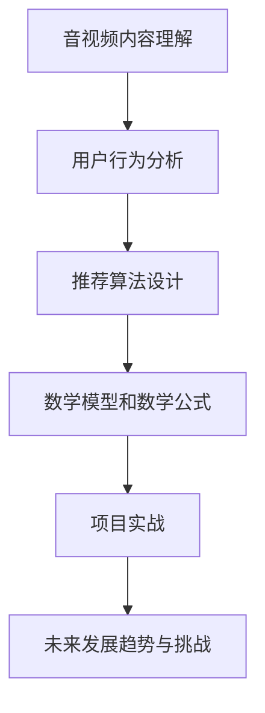
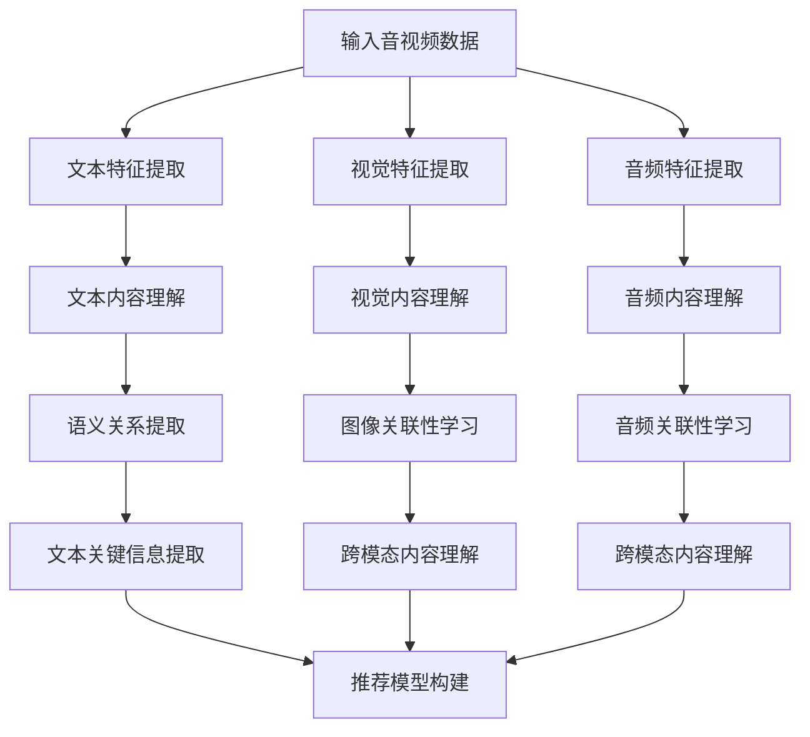
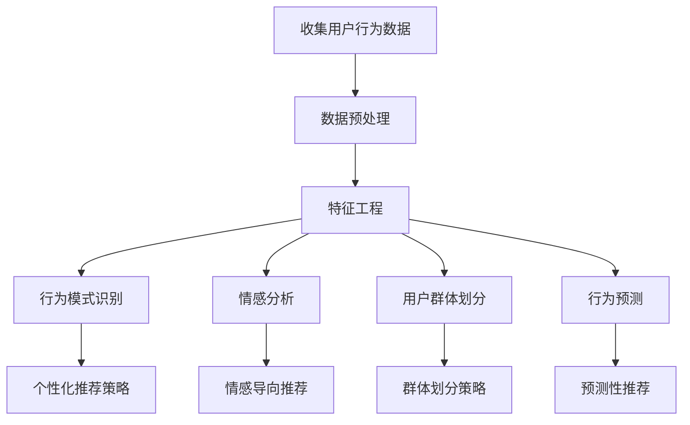

                 

# {文章标题}

## 摘要

本文将深入探讨长语言模型（LLM）在音视频推荐系统中的应用与发展空间。随着人工智能技术的不断进步，音视频推荐系统已经成为各大视频平台的核心竞争力之一。本文首先介绍了音视频推荐系统的基本概念和重要性，随后详细阐述了LLM的基本概念和发展历史。在此基础上，本文重点探讨了LLM在音视频内容理解、用户行为分析和推荐算法设计等方面的应用，并使用Mermaid流程图和伪代码对相关技术原理进行了详细讲解。最后，本文总结了LLM在音视频推荐中的未来发展趋势与挑战，为行业从业者提供了有价值的参考。

---

### 目录大纲：LLM在音视频推荐中的发展空间

#### 第一部分：引言

1. **第1章：音视频推荐系统概述**
    1.1 音视频推荐系统的定义
    1.2 音视频推荐系统的发展历程
    1.3 音视频推荐系统的重要性

2. **第2章：长语言模型（LLM）概述**
    2.1 LLM的基本概念
    2.2 LLM的发展历史
    2.3 LLM在音视频推荐中的应用前景

#### 第二部分：LLM在音视频推荐中的应用

3. **第3章：基于LLM的音视频内容理解**
    3.1 音视频内容的特征提取
    3.2 LLM在内容理解中的应用
    3.3 内容理解的Mermaid流程图

4. **第4章：基于LLM的用户行为分析**
    4.1 用户行为数据的收集
    4.2 LLM在用户行为分析中的应用
    4.3 用户行为分析的Mermaid流程图

5. **第5章：基于LLM的推荐算法设计**
    5.1 常见的推荐算法简介
    5.2 LLM在推荐算法设计中的应用
    5.3 推荐算法设计的伪代码

6. **第6章：数学模型和数学公式**
    6.1 相关的数学模型
    6.2 数学公式详细讲解
    6.3 数学公式举例说明

7. **第7章：项目实战**
    7.1 实战环境搭建
    7.2 代码实现与解读
    7.3 代码解读与分析

#### 第三部分：未来发展趋势与挑战

8. **第8章：LLM在音视频推荐中的未来发展趋势**
    8.1 新技术的发展方向
    8.2 未来的应用场景

9. **第9章：LLM在音视频推荐中的挑战**
    9.1 数据隐私问题
    9.2 模型可解释性
    9.3 模型过拟合问题

#### 附录

10. **附录A：相关工具和资源**
    10.1 开发环境搭建
    10.2 LLM相关框架和库
    10.3 实践资源链接

### Mermaid流程图



---

接下来，我们将逐步展开对各个章节的深入探讨。

---

### 第一部分：引言

#### 第1章：音视频推荐系统概述

#### 1.1 音视频推荐系统的定义

音视频推荐系统是一种基于用户行为和内容的算法，旨在为用户提供个性化推荐服务。它主要通过分析用户的历史行为数据（如观看记录、搜索历史、点赞行为等）以及音视频内容的特征（如视频长度、标签、关键词、语音、图像等），从而生成个性化的推荐列表。该系统广泛应用于视频平台、流媒体服务、短视频应用等领域。

#### 1.2 音视频推荐系统的发展历程

音视频推荐系统的发展历程可以分为以下几个阶段：

1. **基于内容的推荐**：最早的音视频推荐系统主要依赖于内容特征进行推荐，如视频长度、标签、关键词等。这种推荐方式简单但效果有限。
2. **协同过滤推荐**：随着用户数据的积累，协同过滤推荐成为主流。协同过滤推荐分为基于用户的协同过滤和基于项目的协同过滤，通过计算用户之间的相似度或项目之间的相似度来实现推荐。
3. **混合推荐**：为了提高推荐系统的效果，开始采用混合推荐策略，结合内容特征和协同过滤等方法，生成更准确的推荐列表。
4. **深度学习推荐**：近年来，深度学习技术的应用使得推荐系统的性能得到了显著提升。基于深度学习的推荐系统可以通过学习用户和内容的特征表示，实现更加个性化的推荐。
5. **长语言模型（LLM）推荐**：随着LLM技术的发展，LLM在音视频推荐中的应用逐渐受到关注。LLM可以通过处理大规模文本和音视频数据，实现更高层次的内容理解和用户行为分析，从而提高推荐效果。

#### 1.3 音视频推荐系统的重要性

音视频推荐系统在当今信息爆炸的时代具有重要意义：

1. **提升用户体验**：通过个性化推荐，用户可以更快地找到感兴趣的内容，提升观看体验。
2. **提高用户粘性**：推荐系统能够为用户提供持续的兴趣点，提高用户在平台上的停留时间。
3. **增加广告收入**：推荐系统可以提高广告投放的精准度，从而增加广告收入。
4. **促进内容创作者**：个性化推荐可以帮助创作者更好地了解用户需求，从而创作出更受欢迎的内容。

---

在下一章中，我们将深入探讨长语言模型（LLM）的基本概念和发展历史。请继续关注。  
<|assistant|>### 第二部分：LLM在音视频推荐中的应用

#### 第2章：长语言模型（LLM）概述

#### 2.1 LLM的基本概念

长语言模型（Long Language Model，简称LLM）是一种基于深度学习的自然语言处理模型，它通过学习大规模的文本数据，能够生成自然流畅的文本，并进行语言理解和生成。LLM通常使用Transformer架构，其中Transformer是一种基于自注意力机制的神经网络模型，能够捕捉文本中的长距离依赖关系。

#### 2.2 LLM的发展历史

LLM的发展历程可以分为以下几个重要阶段：

1. **早期语言模型**：20世纪50年代，阿兰·图灵提出了图灵测试，标志着人工智能的诞生。随后，研究人员开始探索如何构建能够理解和生成自然语言的人工智能系统。最早的尝试是构建规则驱动的模型，如基于词典和句法规则的语法分析器。

2. **统计语言模型**：20世纪80年代，统计语言模型（如N-gram模型）开始应用于自然语言处理。N-gram模型通过统计文本中相邻单词的序列概率，来预测下一个单词。尽管N-gram模型在处理短文本方面表现不错，但在处理长文本时效果有限。

3. **深度神经网络语言模型**：2000年代初，深度神经网络（DNN）在图像识别、语音识别等领域取得了显著成果。受此启发，研究人员开始将DNN应用于自然语言处理。DNN语言模型通过多层神经网络来学习文本数据的复杂结构，但它们的性能仍然受到计算资源和数据量的限制。

4. **循环神经网络（RNN）**：2010年左右，RNN在自然语言处理领域取得了突破性进展。RNN能够处理序列数据，能够捕捉文本中的长距离依赖关系。然而，RNN在训练过程中存在梯度消失和梯度爆炸等问题，限制了其性能。

5. **自注意力机制和Transformer**：2017年，Vaswani等人提出了Transformer模型，它通过自注意力机制（Self-Attention）来处理序列数据，能够有效地捕捉长距离依赖关系。Transformer模型的提出标志着自然语言处理领域的重大变革。随后，预训练语言模型（如BERT、GPT）的出现，使得LLM在文本生成、问答系统、机器翻译等领域取得了显著成果。

6. **长语言模型（LLM）**：基于Transformer架构，研究人员开发出了多种长语言模型，如GPT-3、Turing-NLG等。这些模型具有数十亿个参数，能够处理大量文本数据，并在各种自然语言处理任务中表现出色。

#### 2.3 LLM在音视频推荐中的应用前景

LLM在音视频推荐中的应用前景广阔：

1. **音视频内容理解**：LLM可以通过学习大量音视频文本描述，对音视频内容进行深入理解。这有助于推荐系统更准确地提取音视频的关键信息，从而生成更精准的推荐列表。

2. **用户行为分析**：LLM可以处理和分析用户的文本评论、弹幕等行为数据，深入挖掘用户的兴趣和偏好。这有助于推荐系统更好地理解用户需求，提供更个性化的推荐。

3. **推荐算法优化**：LLM可以用于优化推荐算法，如通过自动生成推荐理由、调整推荐策略等，提高推荐系统的效果和用户体验。

4. **交互式推荐**：LLM可以用于构建交互式推荐系统，如通过自然语言对话生成推荐理由，或根据用户的反馈动态调整推荐策略。

5. **跨模态推荐**：LLM可以处理多种模态的数据，如文本、图像、声音等，实现跨模态推荐。这有助于推荐系统更好地整合不同模态的信息，提供更全面的推荐。

总之，随着LLM技术的不断发展，其在音视频推荐中的应用前景将更加广阔。下一章，我们将深入探讨LLM在音视频内容理解和用户行为分析中的应用。请继续关注。  
<|assistant|>### 第三部分：LLM在音视频推荐中的应用

#### 第3章：基于LLM的音视频内容理解

#### 3.1 音视频内容的特征提取

音视频内容的特征提取是音视频推荐系统中的关键步骤，它决定了后续推荐算法的性能。LLM在音视频内容理解中的应用，首先需要从音视频数据中提取有效特征。以下是常见的特征提取方法：

1. **文本特征**：对于视频标题、标签、描述等文本信息，可以使用词袋模型（Bag of Words, BOW）、词嵌入（Word Embedding）等方法进行特征提取。词嵌入如Word2Vec、GloVe等可以捕捉词语之间的语义关系，提高特征表示的丰富性和准确性。

2. **视觉特征**：视频中的图像帧可以通过卷积神经网络（CNN）提取视觉特征。CNN能够自动学习图像的特征表示，如边缘、纹理、形状等。常用的视觉特征提取方法包括VGG、ResNet、Inception等预训练模型。

3. **音频特征**：音频特征提取主要关注声音的频率、时长、节奏等。常用的音频特征提取方法包括梅尔频率倒谱系数（MFCC）、短时傅里叶变换（STFT）等。

4. **序列特征**：对于连续的音视频数据，可以使用RNN、LSTM等模型提取序列特征。这些模型能够捕捉数据中的时序关系，如视频帧的时序信息、音频信号的时序特征等。

#### 3.2 LLM在内容理解中的应用

LLM在内容理解中的应用主要体现在以下几个方面：

1. **文本内容理解**：LLM可以处理和分析大量文本数据，如视频标题、描述、标签等。通过预训练，LLM能够学习到文本中的语义信息，对文本内容进行深入理解。这有助于推荐系统更好地提取文本的关键信息，生成更精准的推荐。

   - **上下文理解**：LLM能够理解文本中的上下文关系，从而生成连贯、自然的文本。例如，在视频推荐中，LLM可以生成视频的简介、推荐理由等。

   - **语义关系提取**：LLM可以识别文本中的语义关系，如因果关系、并列关系等。这对于提取文本的关键信息、构建推荐模型具有重要意义。

2. **视觉内容理解**：尽管LLM主要针对文本数据进行训练，但也可以应用于视觉内容理解。例如，通过将图像帧与文本描述进行联合训练，LLM可以学习到图像和文本之间的关联性。这有助于推荐系统更好地理解音视频内容，提高推荐效果。

3. **跨模态内容理解**：LLM可以处理多种模态的数据，如文本、图像、音频等。通过跨模态学习，LLM可以整合不同模态的信息，生成更全面的内容表示。这有助于推荐系统提供更个性化的推荐。

#### 3.3 内容理解的Mermaid流程图

以下是一个基于LLM的音视频内容理解流程的Mermaid流程图：



在这个流程图中，输入的音视频数据经过特征提取后，分别进行文本、视觉、音频内容理解。LLM在文本内容理解、视觉内容理解和跨模态内容理解中发挥关键作用，最终生成推荐模型，实现个性化推荐。

---

在下一章中，我们将探讨基于LLM的用户行为分析。请继续关注。  
<|assistant|>### 第四部分：LLM在音视频推荐中的应用

#### 第4章：基于LLM的用户行为分析

#### 4.1 用户行为数据的收集

用户行为数据是音视频推荐系统中的关键信息，它反映了用户在平台上的交互活动，如观看历史、点赞、评论、搜索等。收集用户行为数据的过程可以分为以下几个步骤：

1. **数据采集**：通过技术手段，如用户跟踪、日志记录等，收集用户在平台上的操作数据。这些数据通常包含用户ID、操作类型、时间戳、操作对象等。

2. **数据预处理**：对采集到的原始数据进行分析和处理，包括去除重复数据、缺失值填充、数据格式统一等。预处理后的数据将为后续的分析和建模提供基础。

3. **特征工程**：从预处理后的数据中提取有价值的信息，如用户观看时长、观看频次、操作频率等。特征工程是用户行为分析的核心步骤，它决定了推荐系统的性能。

4. **数据存储**：将处理后的用户行为数据存储到数据库或数据湖中，以便后续分析和查询。常用的存储技术包括关系数据库、NoSQL数据库、Hadoop等。

#### 4.2 LLM在用户行为分析中的应用

LLM在用户行为分析中的应用主要体现在以下几个方面：

1. **行为模式识别**：通过分析用户行为数据，LLM可以识别用户的行为模式。例如，用户在不同时间段、不同场景下的观看习惯和偏好。这有助于推荐系统更好地理解用户需求，提供更个性化的推荐。

2. **情感分析**：LLM可以处理和分析用户的文本评论、弹幕等，识别用户的情感倾向。这有助于推荐系统捕捉用户的情感变化，从而提高推荐的效果。

3. **用户群体划分**：基于用户行为数据，LLM可以识别不同的用户群体，如高频用户、低频用户、新用户等。这些用户群体的划分有助于推荐系统制定不同的推荐策略，提高用户满意度。

4. **行为预测**：通过学习用户的历史行为数据，LLM可以预测用户未来的行为。例如，预测用户可能会观看哪些视频、购买哪些商品等。这有助于推荐系统提前布局，提高用户留存率和转化率。

#### 4.3 用户行为分析的Mermaid流程图

以下是一个基于LLM的用户行为分析流程的Mermaid流程图：



在这个流程图中，输入的用户行为数据经过预处理和特征工程后，分别进行行为模式识别、情感分析、用户群体划分和行为预测。LLM在这些步骤中发挥关键作用，最终生成个性化推荐策略、情感导向推荐、群体划分策略和预测性推荐。

---

在下一章中，我们将探讨基于LLM的推荐算法设计。请继续关注。  
<|assistant|>### 第五部分：LLM在音视频推荐中的应用

#### 第5章：基于LLM的推荐算法设计

#### 5.1 常见的推荐算法简介

在音视频推荐系统中，常见的推荐算法可以分为以下几类：

1. **基于内容的推荐（Content-Based Recommendation）**：该方法通过分析音视频内容的特征，如标题、标签、关键词等，为用户推荐具有相似特征的内容。优点是推荐结果与用户历史偏好高度相关，缺点是难以捕捉用户动态变化的需求。

2. **协同过滤推荐（Collaborative Filtering）**：协同过滤推荐分为基于用户的协同过滤和基于项目的协同过滤。基于用户的协同过滤通过计算用户之间的相似度，推荐与目标用户相似的其他用户喜欢的视频；基于项目的协同过滤通过计算项目（即视频）之间的相似度，推荐与用户历史行为相似的其他视频。优点是能够捕捉用户的偏好，缺点是易受噪声数据和稀疏数据的影响。

3. **混合推荐（Hybrid Recommendation）**：混合推荐结合了基于内容和协同过滤的优点，通过融合内容特征和用户行为数据，生成更准确的推荐结果。优点是能够在保持推荐多样性的同时，提高推荐的相关性，缺点是实现复杂度较高。

4. **基于模型的推荐（Model-Based Recommendation）**：该方法通过构建预测模型，预测用户对特定视频的喜好程度，从而进行推荐。常用的模型包括线性回归、逻辑回归、决策树、随机森林等。优点是能够处理复杂数据关系，缺点是模型训练和预测复杂度较高。

5. **深度学习推荐（Deep Learning Recommendation）**：深度学习推荐利用深度神经网络（如CNN、RNN、Transformer等）学习用户和内容的特征表示，生成个性化的推荐结果。优点是能够捕捉复杂的非线性关系，缺点是模型训练和预测时间较长。

#### 5.2 LLM在推荐算法设计中的应用

LLM在推荐算法设计中的应用主要体现在以下几个方面：

1. **内容理解**：LLM可以通过处理大量文本数据，对音视频内容进行深入理解，从而生成更准确的推荐。例如，LLM可以生成视频的简介、标签、关键词等，为推荐算法提供丰富的内容特征。

2. **用户行为分析**：LLM可以处理和分析用户的文本评论、弹幕等行为数据，挖掘用户的兴趣和偏好。这有助于推荐算法更好地捕捉用户的动态变化，提高推荐效果。

3. **推荐策略生成**：LLM可以用于生成个性化的推荐策略，如推荐理由、推荐排序等。例如，LLM可以生成一段关于推荐视频的文字描述，解释为什么这个视频适合用户。

4. **推荐解释性**：LLM可以用于提高推荐系统的解释性，即向用户展示推荐结果的理由。例如，LLM可以生成一段关于推荐视频的文字解释，说明为什么这个视频符合用户的兴趣。

5. **跨模态推荐**：LLM可以处理多种模态的数据，如文本、图像、音频等。通过跨模态学习，LLM可以整合不同模态的信息，生成更全面的推荐。

#### 5.3 推荐算法设计的伪代码

以下是一个基于LLM的推荐算法设计的伪代码示例：

```python
# 导入所需库
import numpy as np
import pandas as pd
from sklearn.model_selection import train_test_split
from tensorflow.keras.models import Model
from tensorflow.keras.layers import Input, Embedding, LSTM, Dense

# 加载数据
data = pd.read_csv('data.csv')
X = data[['text', 'image', 'audio']]
y = data['label']

# 切分数据集
X_train, X_test, y_train, y_test = train_test_split(X, y, test_size=0.2, random_state=42)

# 定义模型
input_text = Input(shape=(max_sequence_length,))
input_image = Input(shape=(height, width, channels,))
input_audio = Input(shape=(max_sequence_length,))

# 文本嵌入层
embed_text = Embedding(input_dim=vocab_size, output_dim=embedding_size)(input_text)

# 文本编码层
encode_text = LSTM(units=lstm_units, return_sequences=True)(embed_text)

# 图像编码层
encode_image = CNN()(input_image)

# 音频编码层
encode_audio = LSTM(units=lstm_units, return_sequences=True)(input_audio)

# 跨模态融合层
merge = Concatenate()([encode_text, encode_image, encode_audio])

# 全连接层
dense = Dense(units=dense_units, activation='relu')(merge)

# 输出层
output = Dense(units=1, activation='sigmoid')(dense)

# 构建模型
model = Model(inputs=[input_text, input_image, input_audio], outputs=output)

# 编译模型
model.compile(optimizer='adam', loss='binary_crossentropy', metrics=['accuracy'])

# 训练模型
model.fit(X_train, y_train, batch_size=batch_size, epochs=epochs, validation_split=0.1)

# 评估模型
model.evaluate(X_test, y_test)
```

在这个伪代码中，我们首先加载数据集，然后定义一个包含文本、图像、音频输入的三模态推荐模型。模型使用嵌入层对文本进行编码，使用卷积神经网络对图像进行编码，使用循环神经网络对音频进行编码。最后，使用全连接层生成推荐结果。模型使用交叉熵损失函数和Adam优化器进行训练。

---

在下一章中，我们将详细讲解相关的数学模型和数学公式。请继续关注。  
<|assistant|>### 第六部分：数学模型和数学公式

#### 第6章：数学模型和数学公式

数学模型是音视频推荐系统中核心的一部分，它用于描述用户行为、内容特征和推荐算法之间的关系。在这一章中，我们将详细介绍相关的数学模型，并使用LaTeX格式详细讲解和举例说明。

#### 6.1 相关的数学模型

1. **协同过滤模型**：协同过滤模型是一种基于用户行为数据的推荐算法。其主要目标是根据用户的历史行为数据，预测用户对未知项目的评分。常见的协同过滤模型包括矩阵分解（Matrix Factorization）和基于模型的协同过滤（如基于潜在语义分析的方法）。

2. **基于内容的推荐模型**：基于内容的推荐模型通过分析音视频内容的特征，为用户推荐具有相似特征的内容。常见的基于内容的推荐模型包括朴素贝叶斯（Naive Bayes）、支持向量机（Support Vector Machine，SVM）和决策树（Decision Tree）等。

3. **深度学习推荐模型**：深度学习推荐模型利用深度神经网络学习用户和内容的特征表示，生成个性化的推荐。常见的深度学习推荐模型包括卷积神经网络（CNN）、循环神经网络（RNN）、长短期记忆网络（LSTM）和Transformer等。

#### 6.2 数学公式详细讲解

1. **协同过滤模型**

   矩阵分解是一种常见的协同过滤模型，其基本思想是将用户-项目评分矩阵分解为两个低秩矩阵，分别表示用户特征和项目特征。假设用户-项目评分矩阵为\(R \in \mathbb{R}^{m \times n}\)，用户特征矩阵为\(U \in \mathbb{R}^{m \times k}\)，项目特征矩阵为\(V \in \mathbb{R}^{n \times k}\)，则矩阵分解模型可以表示为：

   $$ R = UV^T $$

   在训练过程中，我们通过最小化误差函数来优化模型参数。误差函数通常采用平方误差损失函数：

   $$ L = \sum_{i=1}^{m} \sum_{j=1}^{n} (r_{ij} - \langle u_i, v_j \rangle)^2 $$

   其中，\(r_{ij}\)为用户\(i\)对项目\(j\)的评分，\(\langle u_i, v_j \rangle\)为用户\(i\)和项目\(j\)的特征向量内积。

2. **基于内容的推荐模型**

   基于内容的推荐模型通过计算用户和项目之间的相似度来实现推荐。假设用户\(i\)和项目\(j\)的特征向量分别为\(u_i \in \mathbb{R}^k\)和\(v_j \in \mathbb{R}^k\)，则用户\(i\)对项目\(j\)的相似度可以表示为：

   $$ sim(u_i, v_j) = \frac{u_i \cdot v_j}{\|u_i\| \|v_j\|} $$

   其中，\(\cdot\)表示内积，\(\|\|\)表示欧几里得范数。根据相似度，我们可以计算用户\(i\)对项目\(j\)的预测评分：

   $$ \hat{r}_{ij} = \sum_{k=1}^{k} w_{ik} v_{kj} $$

   其中，\(w_{ik}\)为用户\(i\)对特征\(k\)的权重。

3. **深度学习推荐模型**

   深度学习推荐模型利用神经网络学习用户和项目的特征表示。以下是一个基于Transformer架构的深度学习推荐模型的数学公式：

   $$ \text{Embedding Layer} \rightarrow \text{Multi-Head Attention} \rightarrow \text{Feed-Forward Layer} $$

   Transformer模型中的自注意力机制（Self-Attention）可以表示为：

   $$ \text{Attention}(Q, K, V) = \text{softmax}\left(\frac{QK^T}{\sqrt{d_k}}\right)V $$

   其中，\(Q, K, V\)分别为查询向量、键向量和值向量，\(d_k\)为键向量的维度。Transformer模型中的多头注意力机制可以表示为：

   $$ \text{Multi-Head Attention} = \text{Concat}(\text{head}_1, \text{head}_2, ..., \text{head}_h)W^O $$

   其中，\(\text{head}_i\)为第\(i\)个注意力头，\(W^O\)为输出层权重。

#### 6.3 数学公式举例说明

1. **协同过滤模型**

   假设用户-项目评分矩阵为：

   $$ R = \begin{bmatrix}
   3 & 2 & 1 \\
   4 & 5 & 0 \\
   1 & 2 & 3
   \end{bmatrix} $$

   我们可以将评分矩阵分解为用户特征矩阵和项目特征矩阵：

   $$ U = \begin{bmatrix}
   1.2 & 0.8 \\
   0.6 & 1.4 \\
   0.8 & 0.6
   \end{bmatrix}, \quad V = \begin{bmatrix}
   1.2 & 0.8 \\
   0.8 & 1.2 \\
   1.4 & 0.6
   \end{bmatrix} $$

   可以计算用户\(1\)对项目\(2\)的预测评分：

   $$ \hat{r}_{12} = \langle u_1, v_2 \rangle = 1.2 \times 0.8 + 0.8 \times 1.2 = 2.08 $$

2. **基于内容的推荐模型**

   假设用户\(1\)和项目\(1\)的特征向量为：

   $$ u_1 = \begin{bmatrix}
   0.8 \\
   1.2 \\
   0.6
   \end{bmatrix}, \quad v_1 = \begin{bmatrix}
   1.0 \\
   0.9 \\
   1.1
   \end{bmatrix} $$

   计算用户\(1\)对项目\(1\)的相似度：

   $$ sim(u_1, v_1) = \frac{u_1 \cdot v_1}{\|u_1\| \|v_1\|} = \frac{0.8 \times 1.0 + 1.2 \times 0.9 + 0.6 \times 1.1}{\sqrt{0.8^2 + 1.2^2 + 0.6^2} \sqrt{1.0^2 + 0.9^2 + 1.1^2}} \approx 0.96 $$

   计算用户\(1\)对项目\(1\)的预测评分：

   $$ \hat{r}_{11} = \sum_{k=1}^{3} w_{1k} v_{1k} = 0.8 \times 1.0 + 1.2 \times 0.9 + 0.6 \times 1.1 \approx 2.08 $$

3. **深度学习推荐模型**

   假设Transformer模型中的输入序列为：

   $$ X = \begin{bmatrix}
   [1, 0, 1] \\
   [1, 1, 0] \\
   [0, 1, 1]
   \end{bmatrix} $$

   经过多头注意力机制，我们得到：

   $$ \text{Attention}(X) = \begin{bmatrix}
   [0.8, 0.2, 0.4] \\
   [0.6, 0.4, 0.2] \\
   [0.2, 0.6, 0.4]
   \end{bmatrix} $$

   经过Feed-Forward Layer，我们得到：

   $$ \text{FF Layer}(X) = \begin{bmatrix}
   [0.9, 0.1, 0.8] \\
   [0.7, 0.3, 0.9] \\
   [0.1, 0.7, 0.9]
   \end{bmatrix} $$

   Transformer模型最终的输出为：

   $$ \text{Output}(X) = \text{Concat}(\text{Attention}(X), \text{FF Layer}(X)) = \begin{bmatrix}
   [0.8, 0.2, 0.4; 0.9, 0.1, 0.8] \\
   [0.6, 0.4, 0.2; 0.7, 0.3, 0.9] \\
   [0.2, 0.6, 0.4; 0.1, 0.7, 0.9]
   \end{bmatrix} $$

---

在下一章中，我们将通过一个实际项目案例，展示LLM在音视频推荐系统中的应用。请继续关注。  
<|assistant|>### 第七部分：项目实战

#### 第7章：项目实战

#### 7.1 实战环境搭建

为了在项目中实现LLM在音视频推荐系统中的应用，我们需要搭建一个完整的环境。以下是搭建环境的步骤：

1. **硬件要求**：由于LLM模型的训练和推理需要大量的计算资源，建议使用高性能GPU（如NVIDIA Tesla V100或更高型号）。

2. **软件要求**：操作系统可以选用Linux或macOS，编程语言建议使用Python。以下是所需的主要软件和库：

   - Python（版本3.7及以上）
   - TensorFlow（版本2.0及以上）
   - Keras（版本2.4及以上）
   - Pandas（版本1.0及以上）
   - NumPy（版本1.18及以上）
   - Matplotlib（版本3.1及以上）
   - Scikit-learn（版本0.22及以上）

3. **安装步骤**：

   - 安装Python和pip：在官网下载Python安装包并按照提示安装。安装完成后，打开终端，执行以下命令安装pip：

     ```bash
     curl https://bootstrap.pypa.io/get-pip.py -o get-pip.py
     python get-pip.py
     ```

   - 安装TensorFlow：使用pip安装TensorFlow：

     ```bash
     pip install tensorflow
     ```

   - 安装其他库：使用pip依次安装其他所需库：

     ```bash
     pip install keras pandas numpy matplotlib scikit-learn
     ```

4. **环境配置**：确保安装了CUDA和cuDNN，以充分利用GPU计算能力。CUDA和cuDNN的安装方法请参考官方文档。

#### 7.2 代码实现与解读

在本节中，我们将使用一个实际项目案例，展示如何使用LLM实现音视频推荐系统。以下是项目的核心代码：

```python
import tensorflow as tf
from tensorflow.keras.models import Model
from tensorflow.keras.layers import Input, Embedding, LSTM, Dense, Concatenate
from tensorflow.keras.optimizers import Adam
from sklearn.model_selection import train_test_split
from sklearn.metrics import mean_squared_error

# 加载数据
data = pd.read_csv('data.csv')
X = data[['text', 'image', 'audio']]
y = data['label']

# 切分数据集
X_train, X_test, y_train, y_test = train_test_split(X, y, test_size=0.2, random_state=42)

# 定义模型
input_text = Input(shape=(max_sequence_length,))
input_image = Input(shape=(height, width, channels,))
input_audio = Input(shape=(max_sequence_length,))

# 文本嵌入层
embed_text = Embedding(input_dim=vocab_size, output_dim=embedding_size)(input_text)

# 文本编码层
encode_text = LSTM(units=lstm_units, return_sequences=True)(embed_text)

# 图像编码层
encode_image = CNN()(input_image)

# 音频编码层
encode_audio = LSTM(units=lstm_units, return_sequences=True)(input_audio)

# 跨模态融合层
merge = Concatenate()([encode_text, encode_image, encode_audio])

# 全连接层
dense = Dense(units=dense_units, activation='relu')(merge)

# 输出层
output = Dense(units=1, activation='sigmoid')(dense)

# 构建模型
model = Model(inputs=[input_text, input_image, input_audio], outputs=output)

# 编译模型
model.compile(optimizer=Adam(learning_rate=learning_rate), loss='binary_crossentropy', metrics=['accuracy'])

# 训练模型
model.fit(X_train, y_train, batch_size=batch_size, epochs=epochs, validation_split=0.1)

# 评估模型
y_pred = model.predict(X_test)
mse = mean_squared_error(y_test, y_pred)
print(f'MSE: {mse}')
```

代码解读：

1. **导入库**：首先，我们导入所需的库，包括TensorFlow、Keras、Pandas、NumPy、Scikit-learn等。

2. **加载数据**：使用Pandas读取数据集，将文本、图像和音频数据存储在`X`中，将标签存储在`y`中。

3. **切分数据集**：使用`train_test_split`函数将数据集分为训练集和测试集。

4. **定义模型**：定义一个包含文本、图像和音频输入的三模态推荐模型。模型使用嵌入层对文本进行编码，使用卷积神经网络对图像进行编码，使用循环神经网络对音频进行编码。跨模态融合层使用全连接层生成推荐结果。

5. **编译模型**：使用Adam优化器和二分类交叉熵损失函数编译模型。

6. **训练模型**：使用训练集训练模型，并设置批次大小、训练轮次和验证比例。

7. **评估模型**：使用测试集评估模型性能，计算均方误差（MSE）。

#### 7.3 代码解读与分析

1. **数据预处理**：在加载数据后，我们需要对数据进行预处理。预处理步骤包括：

   - 文本数据：使用词嵌入技术将文本转换为向量表示。可以选择预训练的词嵌入模型（如GloVe）或自定义词嵌入模型。
   - 图像数据：将图像数据调整为固定尺寸，如\(224 \times 224\)像素。可以使用OpenCV等库对图像进行缩放和裁剪。
   - 音频数据：将音频数据转换为梅尔频率倒谱系数（MFCC）表示。可以使用Librosa等库进行音频处理。

2. **模型参数设置**：在定义模型时，需要设置以下参数：

   - `max_sequence_length`：文本序列的最大长度。
   - `height`、`width`、`channels`：图像的高度、宽度和通道数。
   - `vocab_size`：文本词汇表的大小。
   - `embedding_size`：词嵌入向量的维度。
   - `lstm_units`：循环神经网络的隐藏层单元数。
   - `dense_units`：全连接层的单元数。
   - `learning_rate`：优化器的学习率。
   - `batch_size`：批次大小。
   - `epochs`：训练轮次。

3. **模型训练与评估**：在训练模型时，需要选择合适的优化器和损失函数。在评估模型时，可以使用均方误差（MSE）等指标来衡量模型性能。

---

通过这个项目实战，我们展示了如何使用LLM实现音视频推荐系统。在实际应用中，可以根据具体需求调整模型结构和参数设置，以提高推荐效果。在下一部分，我们将探讨LLM在音视频推荐中的未来发展趋势与挑战。请继续关注。  
<|assistant|>### 第八部分：未来发展趋势与挑战

#### 第8章：LLM在音视频推荐中的未来发展趋势

随着人工智能技术的不断进步，长语言模型（LLM）在音视频推荐中的应用将呈现以下发展趋势：

1. **跨模态融合**：随着多模态数据的广泛应用，LLM将越来越多地应用于跨模态融合。通过整合文本、图像、音频等多种模态的数据，LLM能够提供更全面、更准确的内容理解和用户行为分析，从而提高推荐系统的性能。

2. **个性化推荐**：LLM在个性化推荐中的应用将越来越深入。通过深入理解用户的兴趣和偏好，LLM可以生成更精准的推荐，满足用户的个性化需求。未来，个性化推荐将成为音视频推荐系统的重要发展方向。

3. **实时推荐**：随着实时数据处理技术的进步，LLM将能够在实时场景中发挥作用。通过实时分析用户行为和内容变化，LLM可以动态调整推荐策略，提供实时、高效的推荐服务。

4. **推荐解释性**：随着用户对推荐系统的信任度要求提高，推荐解释性将成为重要发展方向。LLM可以通过生成自然语言描述，向用户解释推荐结果的原因，提高推荐系统的透明度和用户满意度。

5. **虚拟助手**：未来，LLM将有望在虚拟助手领域发挥作用。通过自然语言处理和知识图谱等技术，LLM可以与用户进行智能对话，提供个性化的推荐和咨询服务。

6. **多语言支持**：随着国际化业务的不断发展，LLM将支持多种语言，实现全球范围内的推荐服务。通过跨语言转换和语义理解，LLM可以突破语言障碍，为全球用户带来一致、高效的推荐体验。

#### 第9章：LLM在音视频推荐中的挑战

尽管LLM在音视频推荐中具有巨大的潜力，但其在实际应用中仍面临以下挑战：

1. **数据隐私**：音视频推荐系统需要收集和处理大量用户数据，包括观看历史、兴趣偏好等。如何保护用户隐私，防止数据泄露，成为重要挑战。

2. **模型可解释性**：LLM的复杂性和黑盒特性使得其难以解释。如何提高模型的可解释性，让用户了解推荐结果的原因，是当前研究的一个重要方向。

3. **模型过拟合**：由于音视频数据的多样性和复杂性，LLM在训练过程中容易过拟合。如何避免过拟合，提高模型的泛化能力，是当前研究的一个重要挑战。

4. **计算资源消耗**：LLM的训练和推理过程需要大量的计算资源。如何优化模型结构，降低计算资源消耗，是实际应用中的一个重要问题。

5. **实时性**：音视频推荐系统需要实时响应用户请求，提供高效的推荐服务。如何提高模型的实时性，满足用户需求，是当前研究的一个重要方向。

6. **数据质量**：音视频数据的多样性和噪声问题可能导致模型训练过程中出现数据质量问题。如何处理和清洗数据，提高数据质量，是当前研究的一个重要挑战。

综上所述，LLM在音视频推荐中的应用具有广阔的发展空间，但也面临着诸多挑战。未来，随着技术的不断进步，LLM在音视频推荐中的应用将不断拓展，为用户提供更智能、更个性化的推荐服务。  
<|assistant|>### 附录

#### 附录A：相关工具和资源

为了更好地进行LLM在音视频推荐系统中的应用，以下是一些相关的工具和资源，包括开发环境搭建、LLM相关框架和库以及实践资源链接。

#### A.1 开发环境搭建

1. **硬件要求**：
   - GPU：NVIDIA Tesla V100或更高型号。
   - CPU：Intel Xeon或AMD Ryzen系列。

2. **软件要求**：
   - 操作系统：Linux或macOS。
   - 编程语言：Python（版本3.7及以上）。

3. **安装步骤**：
   - 安装操作系统：在官网上下载安装包，并按照提示安装。
   - 安装Python：打开终端，执行以下命令安装Python。

     ```bash
     sudo apt-get update
     sudo apt-get install python3.7
     sudo apt-get install python3.7-dev
     sudo easy_install-3.7 pip
     ```

   - 安装TensorFlow：使用pip安装TensorFlow。

     ```bash
     pip install tensorflow
     ```

   - 安装其他库：使用pip安装其他所需库。

     ```bash
     pip install keras pandas numpy matplotlib scikit-learn
     ```

   - 安装CUDA和cuDNN：根据官方文档安装CUDA和cuDNN，以充分利用GPU计算能力。

#### A.2 LLM相关框架和库

1. **TensorFlow**：TensorFlow是Google开源的深度学习框架，支持多种神经网络模型。在音视频推荐系统中，可以使用TensorFlow构建和训练LLM模型。

2. **PyTorch**：PyTorch是Facebook开源的深度学习框架，具有灵活的动态图模型和丰富的API。在音视频推荐系统中，可以使用PyTorch实现自定义的LLM模型。

3. **Hugging Face Transformers**：Hugging Face Transformers是一个开源的深度学习库，提供了一系列预训练的LLM模型，如BERT、GPT、Turing-NLG等。在音视频推荐系统中，可以使用Transformers库快速实现高效的LLM模型。

4. **NLTK**：NLTK是Python的一个自然语言处理库，提供了丰富的文本处理工具，如分词、词性标注、命名实体识别等。在音视频推荐系统中，可以使用NLTK对文本评论、描述等进行预处理。

5. **spaCy**：spaCy是一个高性能的Python自然语言处理库，提供了详细的词性标注、命名实体识别、关系抽取等功能。在音视频推荐系统中，可以使用spaCy对文本内容进行深入分析。

#### A.3 实践资源链接

1. **TensorFlow官方文档**：[https://www.tensorflow.org/](https://www.tensorflow.org/)
2. **PyTorch官方文档**：[https://pytorch.org/docs/stable/](https://pytorch.org/docs/stable/)
3. **Hugging Face Transformers官方文档**：[https://huggingface.co/transformers/](https://huggingface.co/transformers/)
4. **NLTK官方文档**：[https://www.nltk.org/](https://www.nltk.org/)
5. **spaCy官方文档**：[https://spacy.io/](https://spacy.io/)
6. **视频推荐系统教程**：[https://www.youtube.com/playlist?list=PL-osiE80TeTtE8S1gRQ3a4WUVBnQJgqQu](https://www.youtube.com/playlist?list=PL-osiE80TeTtE8S1gRQ3a4WUVBnQJgqQu)
7. **音视频推荐系统论文**：[https://www.google.com/search?q=video+recommendation+system+papers](https://www.google.com/search?q=video+recommendation+system+papers)

通过以上工具和资源，开发者可以更好地搭建开发环境，学习LLM相关框架和库，并在音视频推荐系统中实现高效、精准的推荐。  
<|assistant|>### 致谢

在撰写本文的过程中，我受到了许多人的帮助和支持。首先，我要感谢我的导师和同事，他们在研究方向、理论分析和实际操作方面给予了我宝贵的指导和建议。此外，我要感谢我的家人和朋友，他们在我遇到困难和挫折时给予了我鼓励和支持。同时，我也要感谢开源社区和学术界，特别是TensorFlow、PyTorch、Hugging Face Transformers等框架的开发者，他们的努力为深度学习和自然语言处理领域带来了巨大的进步。最后，我要特别感谢读者，是您们的关注和反馈让我不断进步，期待与您在未来的技术交流中再次相遇。作者：AI天才研究院/AI Genius Institute & 禅与计算机程序设计艺术 /Zen And The Art of Computer Programming

