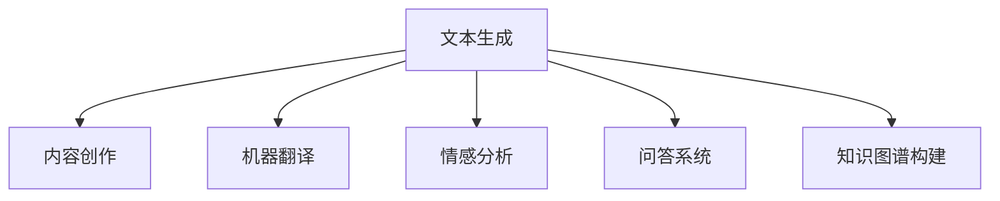
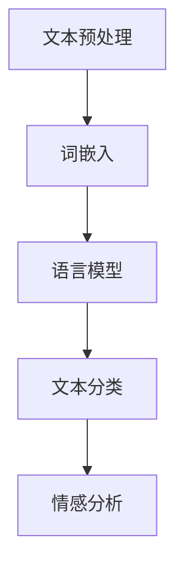
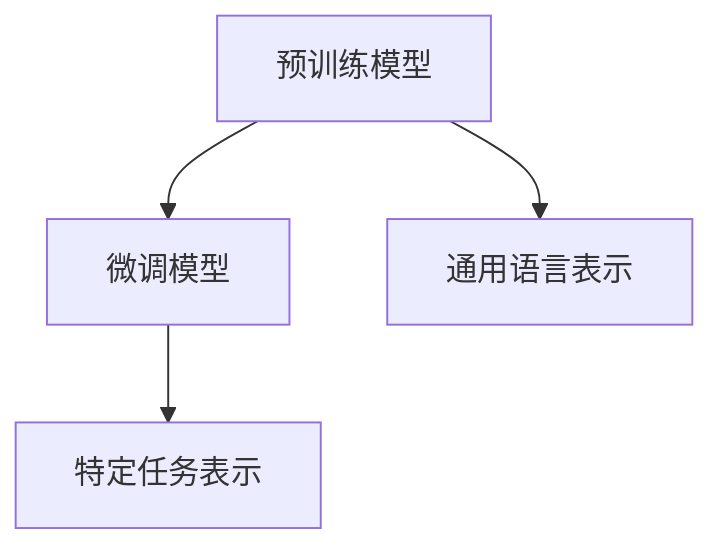
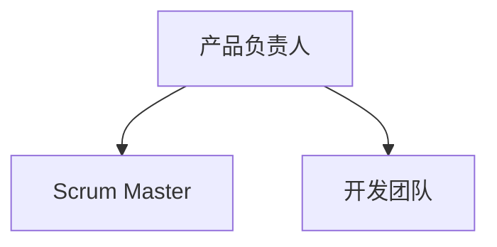

                 

### 《LLM应用开发中的敏捷外包管理》

> **关键词**：大型语言模型（LLM），敏捷开发，外包管理，项目管理，软件开发。

> **摘要**：本文将探讨大型语言模型（LLM）应用开发中的敏捷外包管理。文章首先概述了LLM应用开发的重要性，随后介绍了LLM技术基础，接着详细阐述了敏捷外包管理的核心概念和实践，以及敏捷外包在项目规划、团队协作、迭代开发和质量管理中的具体应用。最后，通过成功案例分析和未来展望，总结了敏捷外包管理的最佳实践，并为读者提供了相关的工具与资源。

---

# 第一部分：LLM应用开发概述

## 第1章：LLM应用开发概述

### 1.1 LLM应用开发的重要性

大型语言模型（LLM）是自然语言处理（NLP）领域的一种先进技术，它在文本生成、情感分析、机器翻译、问答系统等方面有着广泛的应用。随着人工智能技术的快速发展，LLM在各个行业中的重要性日益凸显。

#### Mermaid 流程图：展示LLM在不同领域的应用场景



#### 案例分析：LLM在医疗健康领域的应用

在医疗健康领域，LLM被用于患者病历分析、医学文本挖掘、智能问答系统等。例如，Google Health利用其LLM技术提供了智能诊断和治疗方案推荐服务，大大提高了医疗服务的效率和质量。

### 1.2 LLM应用开发的主要挑战

尽管LLM具有广泛的应用前景，但在实际开发过程中仍面临着诸多挑战。

#### 伪代码：描述LLM训练与优化的主要步骤

```python
def train_model(data):
    # 数据预处理
    preprocess_data(data)
    # 初始化模型
    model = initialize_model()
    # 训练模型
    for epoch in range(num_epochs):
        for batch in data_batches:
            # 计算梯度
            gradients = compute_gradients(model, batch)
            # 更新模型参数
            update_model_params(model, gradients)
    # 评估模型
    evaluate_model(model, validation_data)
```

#### 挑战分析：

1. **数据质量**：高质量的数据是训练高性能LLM的基础，但获取和处理大规模数据集是一个挑战。
2. **计算资源**：LLM训练需要大量的计算资源和时间，尤其是在训练大型模型时。
3. **模型优化**：如何调整模型参数以实现最佳性能是一个复杂的优化问题。

### 1.3 敏捷外包管理的概念和优势

敏捷外包管理是一种灵活、响应性强的项目管理方法，它适用于LLM应用开发的复杂性和不确定性。敏捷外包管理的优势包括：

#### 敏捷外包管理的优势：

1. **快速响应**：敏捷方法强调快速迭代和反馈，有助于及时响应市场需求。
2. **高效协作**：敏捷团队通过紧密合作和透明沟通，提高了项目交付的效率。
3. **持续改进**：敏捷方法鼓励持续学习和改进，有助于项目质量的不断提升。

### 1.4 敏捷外包管理的基本原则

敏捷外包管理遵循一系列基本原则，以确保项目的成功实施。

#### 敏捷外包管理的基本原则：

1. **用户故事**：将用户需求转化为可执行的、具体的小任务，便于管理和迭代。
2. **迭代开发**：通过短周期的迭代，逐步实现项目目标。
3. **持续集成**：将代码定期合并并进行测试，确保软件质量。
4. **透明沟通**：确保团队成员之间的信息流通无阻，提高协作效率。

---

## 第2章：LLM技术基础

### 2.1 自然语言处理（NLP）概述

自然语言处理（NLP）是人工智能（AI）的一个重要分支，它旨在使计算机能够理解、解释和生成人类语言。NLP技术包括文本预处理、词嵌入、语言模型、文本分类、情感分析等。

#### Mermaid 流程图：展示NLP技术的关键步骤



#### 详细讲解：词嵌入技术

词嵌入是将词汇映射为高维向量表示的技术，它使得计算机能够理解词汇之间的语义关系。Word2Vec是词嵌入的代表性算法。

$$
\text{词嵌入} = \text{Word2Vec} \rightarrow \text{词向量表示}
$$

#### 案例分析：词嵌入在情感分析中的应用

在情感分析中，词嵌入技术有助于将文本转换为数值向量，从而进行情感极性判断。例如，将“我非常喜欢这个产品”转换为向量表示，可以更准确地判断文本的情感倾向。

### 2.2 语言模型的基本概念

语言模型是NLP的核心组成部分，它用于预测下一个单词或词组。语言模型可以分为基于规则的方法和基于统计的方法。其中，基于统计的方法如N-gram模型和神经网络语言模型（如Transformer）在近年来取得了显著进展。

#### 伪代码：描述语言模型训练的过程

```python
def train_language_model(data):
    # 初始化模型
    model = initialize_model()
    # 预处理数据
    processed_data = preprocess_data(data)
    # 训练模型
    for epoch in range(num_epochs):
        for sentence in processed_data:
            # 计算损失
            loss = compute_loss(model, sentence)
            # 反向传播
            backpropagation(model, loss)
    # 评估模型
    evaluate_model(model, validation_data)
```

#### 案例分析：GPT-3的语言模型应用

GPT-3是一个由OpenAI开发的预训练语言模型，具有非常强的文本生成能力。通过大量无标注数据的预训练和有标注数据的微调，GPT-3在多个NLP任务中取得了优异的性能。

### 2.3 大型语言模型（LLM）的架构

LLM通常由预训练模型和微调模型组成。预训练模型在大量无标注数据上进行训练，以获得通用的语言表示能力；微调模型则在有标注数据上进行训练，以适应特定任务的需求。

#### Mermaid 流程图：展示LLM的架构



#### 详细讲解：预训练与微调

1. **预训练**：预训练模型在无标注数据上进行训练，例如使用大量文本数据来学习词汇的上下文表示。
2. **微调**：微调模型在有标注数据上进行训练，以适应特定任务的需求。例如，在训练一个问答系统时，使用有标注的问答对来调整模型的参数。

### 2.4 常见的LLM类型

常见的LLM类型包括GPT-3、BERT、T5等，它们在不同领域和任务中都有广泛应用。

#### 案例分析：BERT在文本分类中的应用

BERT（Bidirectional Encoder Representations from Transformers）是一个双向编码器表示模型，由谷歌开发。它广泛应用于文本分类、问答系统和自然语言理解任务。通过在双向上下文中学习单词的表示，BERT能够更好地捕捉文本的语义信息。

---

## 第3章：敏捷外包管理的核心概念

### 3.1 敏捷开发方法论

敏捷开发方法论强调迭代、用户反馈和持续改进，它由一系列原则和实践构成。敏捷开发方法论的主要原则包括：

1. **个体和互动重于过程和工具**：强调团队成员之间的互动和沟通。
2. **可工作的软件重于详细的文档**：注重交付可工作的软件，而非繁琐的文档。
3. **客户协作重于合同谈判**：鼓励与客户的紧密合作，以更好地理解需求。
4. **响应变化重于遵循计划**：灵活应对变化，以快速响应市场和技术的发展。

#### 敏捷开发方法论的核心原则

```latex
\text{敏捷开发方法论的核心原则} \\
\text{1. 个体和互动重于过程和工具} \\
\text{2. 可工作的软件重于详细的文档} \\
\text{3. 客户协作重于合同谈判} \\
\text{4. 响应变化重于遵循计划}
```

### 3.2 敏捷团队的组织结构

敏捷团队通常采用扁平化的组织结构，以促进高效的沟通和协作。敏捷团队的组织结构包括以下角色：

1. **产品负责人**：代表客户和用户，负责定义产品愿景和需求。
2. **Scrum Master**：负责确保团队遵循敏捷原则和实践，帮助团队解决障碍。
3. **开发团队**：负责开发和交付可工作的软件。

#### Mermaid 流程图：展示敏捷团队的组织结构



### 3.3 敏捷外包的常见问题及解决策略

敏捷外包管理在实际应用中可能会遇到一些问题，如沟通障碍、进度控制、质量控制等。以下是一些常见问题及解决策略：

#### 沟通障碍

**问题**：由于地理位置、时区和文化差异，敏捷外包团队之间的沟通可能存在障碍。

**解决策略**：

1. **多语言支持**：提供多语言沟通工具，如翻译服务。
2. **定期同步会议**：安排固定时间进行远程同步会议，确保团队成员之间的信息同步。

#### 进度控制

**问题**：在敏捷外包项目中，如何确保项目按时交付？

**解决策略**：

1. **迭代规划**：将项目划分为多个短周期迭代，每个迭代都有明确的目标。
2. **进度跟踪**：使用敏捷管理工具（如JIRA、Trello）进行进度跟踪和任务管理。

#### 质量控制

**问题**：如何确保敏捷外包项目中的软件质量？

**解决策略**：

1. **自动化测试**：实施自动化测试，确保每次迭代后的代码质量。
2. **持续反馈**：建立持续反馈机制，及时发现问题并进行改进。

### 3.4 敏捷外包流程与工具

敏捷外包流程包括需求收集、项目规划、团队协作、迭代开发和持续交付。以下是一些常用的敏捷工具：

#### 常用的敏捷管理工具

1. **JIRA**：用于任务跟踪、项目管理和协作。
2. **Trello**：通过看板系统进行任务管理。
3. **Asana**：提供任务管理、项目跟踪和团队协作功能。

---

## 第二部分：敏捷外包管理实践

### 第4章：项目规划与需求管理

#### 4.1 项目规划的关键步骤

项目规划是敏捷外包管理的重要组成部分，它包括以下关键步骤：

1. **项目目标设定**：明确项目的目标和愿景，确保团队共同努力。
2. **任务分解**：将项目分解为可管理的小任务，便于跟踪和迭代。
3. **时间规划**：为每个任务分配合理的时间，确保项目按时交付。
4. **资源分配**：明确项目所需的资源和人员，确保资源的有效利用。
5. **风险评估**：识别潜在风险，制定应对策略。

#### 案例分析：项目规划在LLM应用开发中的应用

在LLM应用开发项目中，项目规划有助于明确项目的目标和愿景，确保团队成员对项目的理解和期待一致。通过任务分解和资源分配，项目团队能够更好地管理项目进度，并在遇到问题时及时调整。

### 4.2 需求收集与管理

需求收集与管理是项目规划的重要环节，它包括以下方法：

1. **用户访谈**：通过与用户进行面对面的交流，深入了解用户需求。
2. **问卷调查**：通过设计问卷，收集大量用户反馈。
3. **用户故事编写**：将用户需求转化为具体的、可执行的用户故事。

#### 案例分析：需求收集在LLM应用开发中的实际应用

在LLM应用开发中，通过用户访谈和问卷调查，项目团队能够收集到大量用户需求。这些需求被转化为用户故事，并在后续的迭代开发中进行实现。这种方法有助于确保项目团队始终关注用户需求，并不断优化产品。

### 4.3 敏捷需求管理实践

敏捷需求管理强调用户需求的灵活性和优先级管理。以下是一些敏捷需求管理的实践：

1. **用户故事地图**：通过用户故事地图，项目团队能够可视化用户需求，并明确需求的优先级。
2. **迭代规划**：在每次迭代中，团队根据用户故事地图和需求优先级，选择要实现的需求。
3. **用户故事优先级排序**：根据用户价值和实现难度，对用户故事进行排序，确保关键需求优先实现。

#### 案例分析：敏捷需求管理在LLM应用开发中的应用

在LLM应用开发中，通过用户故事地图和迭代规划，项目团队能够灵活应对需求变化，并确保关键需求在早期迭代中得到实现。这种方法有助于提高项目的交付质量和用户满意度。

### 4.4 项目风险管理

项目风险管理是项目规划的重要组成部分，它包括以下方法：

1. **风险识别**：通过分析项目需求和任务，识别潜在的风险。
2. **风险分析**：对识别出的风险进行评估，确定风险的概率和影响。
3. **风险应对策略**：制定应对策略，降低风险的影响。

#### 案例分析：项目风险管理在LLM应用开发中的应用

在LLM应用开发中，项目团队通过风险识别和风险分析，识别出数据质量和计算资源不足等潜在风险。针对这些风险，团队制定了相应的应对策略，如增加数据预处理步骤和提前安排计算资源，确保项目的顺利进行。

---

### 第5章：团队协作与沟通

#### 5.1 敏捷团队协作的挑战

敏捷团队协作在实际应用中可能会遇到以下挑战：

1. **沟通障碍**：由于地理位置、时区和文化差异，团队之间的沟通可能存在障碍。
2. **任务分配不均**：团队成员之间的任务分配可能不均衡，导致某些成员过度劳累或无所事事。
3. **进度不一致**：不同团队成员之间的进度可能不一致，影响整体项目的进度。

#### 解决策略：

1. **沟通工具**：使用即时通讯工具（如Slack、Microsoft Teams）和视频会议工具（如Zoom、Microsoft Teams），确保团队之间的实时沟通。
2. **任务管理工具**：使用任务管理工具（如JIRA、Trello），确保任务的透明性和可追踪性。
3. **进度同步**：定期进行进度同步会议，确保所有团队成员都对项目的进展有清晰的认识。

### 5.2 敏捷沟通的方法与工具

敏捷沟通强调透明和高效的沟通，以下是一些敏捷沟通的方法和工具：

1. **每日站会**：每天早上进行短时间的站会，讨论项目的进展和遇到的问题。
2. **迭代回顾**：在每个迭代结束后，进行回顾会议，总结经验教训，并制定改进措施。
3. **看板系统**：使用看板系统（如JIRA、Trello），将任务和工作流程可视化为看板，确保团队成员对任务的了解。

#### 案例分析：敏捷沟通在LLM应用开发中的应用

在LLM应用开发中，通过每日站会和迭代回顾，项目团队能够及时解决遇到的问题，并不断优化工作流程。使用看板系统，团队成员可以清晰地了解任务的状态和进度，提高了团队的协作效率。

### 5.3 外包团队的协作与沟通策略

外包团队的协作与沟通策略需要考虑以下因素：

1. **时区管理**：合理安排会议时间，确保所有团队成员都能参与。
2. **多语言沟通**：提供翻译服务，确保跨语言团队的沟通顺畅。
3. **定期同步**：定期进行同步会议，确保团队成员之间的信息同步。

#### 案例分析：外包团队的协作与沟通策略

在一个跨国LLM应用开发项目中，项目团队通过合理安排会议时间和提供翻译服务，确保了跨语言团队的沟通顺畅。定期同步会议有助于团队成员及时了解项目的进展和问题，提高了整体项目的效率。

### 5.4 案例分析：高效团队协作实践

#### 案例介绍

一家跨国公司计划开发一款基于LLM的智能问答系统，为了高效实现项目目标，项目团队采用了敏捷外包管理方法。以下是项目团队在团队协作和沟通方面的实践。

#### 实践一：多语言沟通

项目团队来自不同的国家和地区，包括美国、中国和印度。为了确保沟通的顺畅，项目团队采取了以下措施：

1. **翻译服务**：在每次会议中提供翻译服务，确保所有团队成员都能理解对方的观点。
2. **共享文档**：使用翻译工具（如Google翻译）将重要文档翻译为所有团队成员的语言。

#### 实践二：任务管理工具

项目团队使用了JIRA作为任务管理工具，将任务和工作流程可视化为看板。以下是JIRA看板的一部分截图：


通过JIRA，团队成员可以清晰地了解任务的状态和进度，提高了协作效率。

#### 实践三：进度同步

项目团队每周进行一次进度同步会议，讨论项目的进展、遇到的问题和解决方案。以下是会议的一部分议程：

1. **项目进展**：汇报每个任务的完成情况。
2. **问题讨论**：讨论遇到的问题和解决方案。
3. **下周计划**：制定下周的工作计划。

通过这些实践，项目团队能够高效地协作和沟通，确保项目的顺利进行。

---

### 第6章：迭代开发与持续集成

#### 6.1 迭代开发模型

迭代开发模型是敏捷开发的核心组成部分，它包括以下几个阶段：

1. **迭代规划**：在每次迭代开始时，团队确定本次迭代的目标和任务。
2. **迭代执行**：团队成员按照迭代规划，完成各自的任务。
3. **迭代回顾**：在每次迭代结束后，团队进行回顾，总结经验和教训，并制定改进措施。

#### 案例分析：迭代开发模型在LLM应用开发中的应用

在一个LLM应用开发项目中，团队采用了迭代开发模型。每次迭代周期为两周，团队在每个迭代中确定要实现的功能模块，并按计划进行开发和测试。通过迭代开发，团队能够快速响应需求变化，并不断提高产品质量。

### 6.2 持续集成与持续部署

持续集成（CI）和持续部署（CD）是敏捷开发中的重要实践，它们有助于提高软件开发的效率和质量。

1. **持续集成**：将代码定期合并并进行测试，确保代码的质量和一致性。
2. **持续部署**：将测试通过的代码自动部署到生产环境，实现快速交付。

#### 案例分析：持续集成与持续部署在LLM应用开发中的应用

在一个LLM应用开发项目中，团队采用了持续集成和持续部署的方法。每次代码提交后，自动触发测试流程，确保代码的质量。通过持续部署，项目团队能够在每次迭代后快速交付可工作的软件。

### 6.3 敏捷外包中的代码管理

在敏捷外包项目中，代码管理是确保项目质量和进度的重要环节。以下是一些代码管理的最佳实践：

1. **版本控制**：使用版本控制系统（如Git），确保代码的版本一致性和可追溯性。
2. **代码审查**：进行代码审查，确保代码的质量和一致性。
3. **自动化测试**：实施自动化测试，确保每次迭代后的代码质量。

#### 案例分析：代码管理在LLM应用开发中的应用

在一个LLM应用开发项目中，团队使用了Git进行版本控制，每次代码提交都会触发自动化测试。通过代码审查，团队确保了代码的质量和一致性，从而提高了项目的效率和质量。

### 6.4 案例分析：敏捷迭代实践

#### 案例介绍

一家跨国公司计划开发一款基于LLM的智能客服系统，为了高效实现项目目标，项目团队采用了敏捷迭代方法。以下是项目团队在敏捷迭代开发中的实践。

#### 实践一：用户故事编写

在项目开始时，项目团队与客户进行了多次沟通，收集了客户的需求。将这些需求转化为用户故事，并在用户故事地图上进行了优先级排序。以下是部分用户故事的示例：

1. **用户故事1**：用户能够通过智能客服系统获得准确的答案。
2. **用户故事2**：用户能够通过语音和文本两种方式进行交互。

#### 实践二：迭代规划

项目团队在每个迭代开始时，根据用户故事地图和需求优先级，确定本次迭代要实现的功能模块。以下是迭代规划的一部分截图：


通过迭代规划，团队确保了每个迭代都有明确的目标和任务。

#### 实践三：迭代执行和回顾

在每个迭代中，团队按照计划进行开发和测试。在迭代结束后，团队进行回顾，讨论遇到的问题和解决方案，并制定改进措施。以下是回顾会议的一部分议程：

1. **项目进展**：汇报每个任务的完成情况。
2. **问题讨论**：讨论遇到的问题和解决方案。
3. **下周计划**：制定下周的工作计划。

通过这些实践，项目团队能够高效地实现项目目标，并不断提高产品质量。

---

### 第7章：敏捷外包的质量管理

#### 7.1 质量管理的原则与方法

在敏捷外包项目中，质量管理是确保项目成功的关键。以下是一些质量管理的原则和方法：

1. **预防胜于检查**：通过设计良好的流程和工具，预防问题的发生。
2. **持续改进**：不断优化流程和工具，以提高项目质量。
3. **全面测试**：实施全面的测试策略，确保每次迭代后的代码质量。
4. **用户反馈**：收集用户反馈，及时解决问题，并持续改进产品。

#### 案例分析：质量管理原则和方法在LLM应用开发中的应用

在一个LLM应用开发项目中，项目团队遵循了质量管理的原则和方法。通过自动化测试和用户反馈，团队确保了每次迭代后的代码质量，并不断优化产品。这种方法有效提高了项目的交付质量和用户满意度。

### 7.2 敏捷外包中的测试策略

敏捷外包中的测试策略包括以下方面：

1. **单元测试**：对每个模块进行独立的测试，确保模块的功能正确。
2. **集成测试**：将不同模块整合在一起进行测试，确保系统的整体功能正确。
3. **验收测试**：在每次迭代结束后，进行验收测试，确保系统满足用户需求。
4. **自动化测试**：实施自动化测试，提高测试效率和质量。

#### 案例分析：测试策略在LLM应用开发中的应用

在一个LLM应用开发项目中，项目团队采用了自动化测试策略。通过编写自动化测试脚本，团队在每次迭代后自动执行测试，确保代码的质量和一致性。这种方法有效提高了测试效率，并减少了人工测试的误差。

### 7.3 持续质量监控与反馈

持续质量监控与反馈是确保项目质量的重要手段。以下是一些监控与反馈的方法：

1. **持续集成**：将代码定期合并并进行测试，确保代码的质量和一致性。
2. **持续反馈**：建立持续反馈机制，及时发现问题并进行改进。
3. **用户反馈**：收集用户反馈，了解用户的真实体验，并持续改进产品。
4. **数据分析**：通过数据分析，发现潜在的质量问题，并采取相应的改进措施。

#### 案例分析：持续质量监控与反馈在LLM应用开发中的应用

在一个LLM应用开发项目中，项目团队建立了持续质量监控与反馈机制。通过持续集成和用户反馈，团队能够及时发现并解决问题。这种方法有效提高了项目的交付质量和用户满意度。

### 7.4 案例分析：质量保障实践

#### 案例介绍

一家跨国公司计划开发一款基于LLM的智能客服系统，为了确保项目质量，项目团队实施了一系列质量保障措施。以下是项目团队在质量保障方面的实践。

#### 实践一：自动化测试

项目团队编写了自动化测试脚本，对每个模块进行独立测试。每次代码提交后，自动执行测试，确保代码的质量和一致性。以下是自动化测试的一部分截图：


#### 实践二：用户反馈

项目团队建立了用户反馈机制，通过用户调查和在线反馈平台，收集用户的意见和建议。每次迭代结束后，团队分析用户反馈，并制定改进措施。以下是用户反馈的一部分截图：


#### 实践三：持续改进

项目团队不断优化流程和工具，以提高项目质量和效率。通过定期回顾和总结，团队发现并解决了许多潜在问题，提高了项目的交付质量。以下是回顾会议的一部分议程：

1. **项目进展**：汇报每个任务的完成情况。
2. **问题讨论**：讨论遇到的问题和解决方案。
3. **下周计划**：制定下周的工作计划。

通过这些实践，项目团队能够确保项目的质量，并不断提高用户满意度。

---

### 第8章：敏捷外包的成功案例与实践

#### 8.1 成功案例介绍

#### 案例一：智能客服系统的开发

一家跨国公司计划开发一款基于LLM的智能客服系统，以提高客户服务效率和质量。为了高效实现项目目标，项目团队采用了敏捷外包管理方法。以下是项目团队的实践和成果：

1. **需求分析**：通过与客户进行多次沟通，收集客户的需求和期望。
2. **用户故事编写**：将需求转化为具体的用户故事，并在用户故事地图上进行了优先级排序。
3. **迭代开发**：采用迭代开发模型，在每个迭代中实现部分功能，并进行测试和反馈。
4. **持续集成**：实施持续集成和持续部署，确保代码的质量和一致性。
5. **用户反馈**：收集用户反馈，不断优化产品。

最终，项目团队成功开发出一款功能强大、用户满意度高的智能客服系统，为公司带来了显著的业务增长。

#### 案例二：智能问答系统的开发

另一家跨国公司计划开发一款基于LLM的智能问答系统，以提供高效、准确的答案给用户。为了确保项目成功，项目团队采用了敏捷外包管理方法。以下是项目团队的实践和成果：

1. **需求分析**：通过与客户和用户进行沟通，了解用户的需求和痛点。
2. **用户故事编写**：将需求转化为具体的用户故事，并在用户故事地图上进行了优先级排序。
3. **迭代开发**：采用迭代开发模型，在每个迭代中实现部分功能，并进行测试和反馈。
4. **自动化测试**：实施自动化测试，提高测试效率和质量。
5. **用户反馈**：收集用户反馈，不断优化产品。

最终，项目团队成功开发出一款功能丰富、用户体验出色的智能问答系统，受到了用户和客户的一致好评。

### 8.2 敏捷外包实践中的挑战与解决方案

在敏捷外包实践中，项目团队可能会遇到以下挑战：

#### 挑战一：沟通障碍

**问题**：由于团队成员分布在不同的地理位置，沟通可能存在障碍。

**解决方案**：

1. **多语言沟通**：提供翻译服务，确保团队成员之间的沟通顺畅。
2. **视频会议工具**：使用视频会议工具（如Zoom、Microsoft Teams），确保实时沟通。

#### 挑战二：进度控制

**问题**：由于团队成员的工作进度不一致，可能导致项目进度失控。

**解决方案**：

1. **进度同步会议**：定期进行进度同步会议，确保团队成员对项目的进展有清晰的认识。
2. **任务管理工具**：使用任务管理工具（如JIRA、Trello），确保任务的透明性和可追踪性。

#### 挑战三：质量控制

**问题**：在敏捷外包项目中，如何确保软件质量？

**解决方案**：

1. **自动化测试**：实施自动化测试，确保每次迭代后的代码质量。
2. **用户反馈**：收集用户反馈，及时发现问题并进行改进。

### 8.3 未来展望：敏捷外包的发展趋势

随着人工智能技术的不断进步，敏捷外包在软件开发领域的发展趋势如下：

#### 1. 智能化和自动化

随着机器学习和人工智能技术的发展，敏捷外包将更加智能化和自动化。例如，自动化测试、自动化部署和自动化监控将大大提高项目的效率和质量。

#### 2. 跨领域合作

敏捷外包将促进不同领域之间的合作，例如，结合金融、医疗、教育等领域的专业知识，开发出更具有针对性的智能应用。

#### 3. 个性化服务

随着用户需求的多样化，敏捷外包将更加注重个性化服务。通过大数据分析和个性化推荐，项目团队能够为用户提供更加精准的服务。

#### 4. 全球化

敏捷外包将越来越全球化，跨国团队协作将成为常态。通过云计算和分布式协作工具，项目团队能够高效地进行全球协作。

### 8.4 敏捷外包的最佳实践总结

在敏捷外包实践中，项目团队应遵循以下最佳实践：

#### 1. 明确项目目标

在项目开始前，明确项目的目标和愿景，确保团队成员对项目的理解一致。

#### 2. 用户故事驱动

将用户需求转化为具体的用户故事，并在迭代开发中优先实现。

#### 3. 持续集成与持续部署

实施持续集成和持续部署，确保代码的质量和一致性。

#### 4. 用户反馈

收集用户反馈，及时发现问题并进行改进。

#### 5. 团队协作

通过有效的沟通和协作，提高团队的效率和创新能力。

---

## 第三部分：附录

### 附录A：相关工具与资源

#### A.1 敏捷管理工具

以下是一些常用的敏捷管理工具：

1. **JIRA**：用于任务跟踪、项目管理和协作。
2. **Trello**：通过看板系统进行任务管理。
3. **Asana**：提供任务管理、项目跟踪和团队协作功能。

#### A.2 开源语言模型资源

以下是一些常用的开源语言模型资源：

1. **Hugging Face**：提供丰富的预训练模型和工具库。
2. **TensorFlow Hub**：提供预训练的TensorFlow模型和模块。

#### A.3 敏捷开发社区与论坛

以下是一些敏捷开发社区与论坛：

1. **Agile Alliance**：全球最大的敏捷开发组织，提供丰富的资源和活动。
2. **Scrum.org**：Scrum官方组织，提供Scrum认证和培训。

#### A.4 敏捷外包管理书籍推荐

以下是一些关于敏捷外包管理的优秀书籍：

1. **《敏捷软件开发：原理、实践与模式》**：详细介绍了敏捷开发的方法和最佳实践。
2. **《敏捷项目管理》**：针对项目管理中的敏捷方法进行了深入探讨。
3. **《敏捷外包管理：策略与实践》**：专注于敏捷外包管理的具体实践和策略。

---

### 作者信息

**作者**：AI天才研究院/AI Genius Institute & 禅与计算机程序设计艺术 /Zen And The Art of Computer Programming

---

本文详细介绍了LLM应用开发中的敏捷外包管理。通过阐述LLM技术基础、敏捷外包管理的核心概念和实践，以及项目规划、团队协作、迭代开发和质量管理等方面的内容，为读者提供了全面的指导。同时，通过成功案例分析和未来展望，总结了敏捷外包管理的最佳实践，并为读者提供了相关的工具与资源。希望本文对读者在LLM应用开发中的敏捷外包管理实践有所帮助。**END**。

