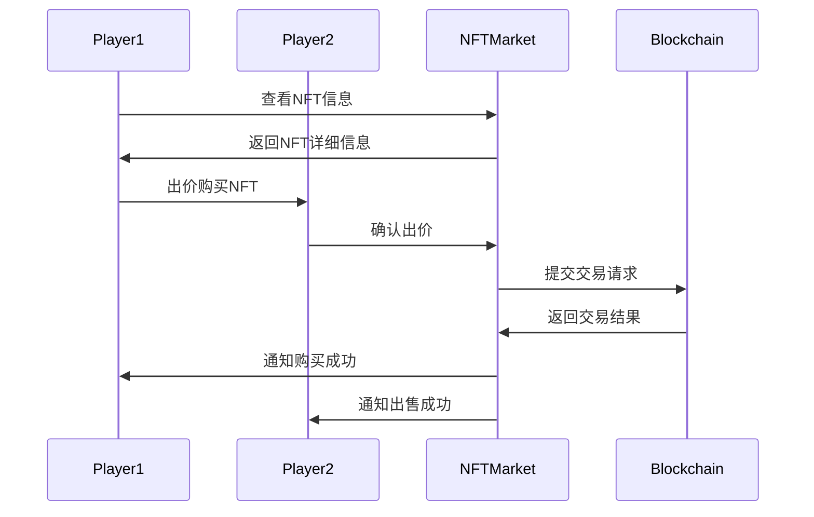
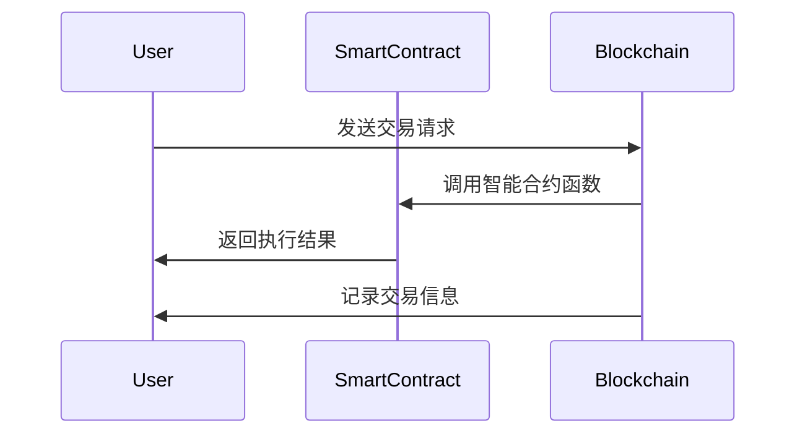

                 

# NFT游戏开发引擎：游戏产业的创新工具

> **关键词**：NFT、区块链、游戏开发、智能合约、Solidity、用户体验

> **摘要**：本文深入探讨了NFT游戏开发引擎及其对游戏产业的影响。我们首先介绍了NFT和区块链的基本概念，然后详细解释了智能合约原理和开发流程。接着，我们分析了NFT游戏的设计原则和开发框架，最后通过实际案例和挑战，展示了NFT游戏开发的现状和未来趋势。

## 第一部分：NFT游戏开发基础

### 第1章：NFT概述

#### 1.1 NFT的基本概念

NFT（Non-Fungible Token，非同质化代币）是一种基于区块链技术的独特数字资产，它代表了唯一的、不可替代的物品。与传统的同质化代币（如比特币）不同，NFT具有独特的标识符，每个NFT都是独一无二的，不可替代的。例如，一幅数字画作、一张演唱会门票、一个游戏角色等都可以被赋予NFT。

#### 1.2 NFT的分类

根据NFT的使用场景和特点，我们可以将其分为以下几类：

1. **数字艺术品**：包括数字画作、音乐、视频等，这些作品通过NFT进行数字版权保护和交易。
2. **虚拟物品**：在虚拟世界中，如游戏、虚拟现实（VR）等，NFT可以代表独特的虚拟物品，如游戏角色、装备等。
3. **数字身份**：NFT可以用于创建和验证数字身份，为用户提供个性化的数字身份标识。
4. **实物资产**：NFT也可以用于代表实物资产的数字权益，如房地产、汽车等。

#### 1.3 NFT的经济模型

NFT的经济模型通常包括以下几个关键部分：

1. **发行量**：每个NFT的发行量是有限的，通常由创作者设定。
2. **稀缺性**：NFT的独特性决定了其稀缺性，稀缺性越高，价值通常越高。
3. **所有权转移**：NFT的所有权可以通过区块链进行转移，每次转移都会在区块链上留下记录。
4. **交易**：NFT可以通过在线市场进行买卖，价格通常由市场供需决定。

### 第2章：区块链技术基础

#### 2.1 区块链原理

区块链是一种分布式数据库技术，其核心思想是通过去中心化的方式存储和验证数据，确保数据的不可篡改性和透明性。区块链由多个区块组成，每个区块包含一定数量的交易记录，并通过密码学算法链接在一起，形成一条时间序列。

#### 2.2 公共区块链与联盟链

根据区块链的参与度和治理结构，我们可以将其分为公共区块链和联盟链：

1. **公共区块链**：任何人都可以参与其中，如比特币、以太坊等，具有高度去中心化的特点。
2. **联盟链**：由一组预定的参与者组成，如企业、政府等，具有较高的安全性和可控性。

#### 2.3 区块链的共识算法

共识算法是区块链网络中的关键机制，用于确定哪些交易记录将被添加到区块链中。常见的共识算法包括：

1. **工作量证明（PoW）**：如比特币使用的算法，通过计算大量数学难题来证明工作量。
2. **权益证明（PoS）**：如以太坊2.0计划采用的算法，通过持有代币数量和持币时间来证明权益。
3. **委托权益证明（DPoS）**：通过选举产生区块生成者，提高共识效率。

### 第3章：智能合约原理与应用

#### 3.1 智能合约的基本原理

智能合约是一种自动执行合同条款的计算机程序，其执行基于区块链网络中的共识机制。智能合约的代码被存储在区块链上，一旦条件满足，智能合约会自动执行预定的操作，如转账、发放NFT等。

#### 3.2 Solidity编程语言

Solidity是开发智能合约最常用的编程语言之一，它具有面向对象的特点，类似于JavaScript和Python。Solidity代码被编译为以太坊虚拟机（EVM）的字节码，然后在区块链上执行。

#### 3.3 智能合约开发流程

智能合约开发通常包括以下步骤：

1. **需求分析**：明确智能合约的功能和业务逻辑。
2. **编写代码**：使用Solidity等编程语言编写智能合约代码。
3. **编译和部署**：将智能合约代码编译为字节码，并在区块链上进行部署。
4. **测试和调试**：在测试环境中运行智能合约，确保其正确性和安全性。
5. **上线和维护**：将智能合约上线并持续维护，确保其稳定运行。

## 第二部分：NFT游戏开发技术

### 第4章：NFT游戏设计原理

#### 4.1 NFT游戏的核心特点

NFT游戏具有以下核心特点：

1. **独特性**：每个游戏角色、装备等虚拟物品都是独一无二的，玩家可以通过购买或交换获得。
2. **所有权转移**：玩家可以在游戏中自由买卖虚拟物品，所有权的转移记录在区块链上。
3. **稀缺性**：虚拟物品的稀缺性决定了其价值，稀缺性越高的物品通常越有价值。
4. **去中心化**：NFT游戏通常基于去中心化的区块链平台，玩家之间可以直接进行交易，无需依赖第三方平台。

#### 4.2 NFT游戏的经济模型

NFT游戏的经济模型通常包括以下关键部分：

1. **代币**：游戏内代币用于购买虚拟物品、支付手续费等，通常与外部加密货币进行兑换。
2. **市场**：游戏内市场用于买卖虚拟物品，市场供需决定虚拟物品的价格。
3. **激励**：通过奖励机制激励玩家参与游戏，提高用户粘性。

#### 4.3 NFT游戏的用户体验设计

NFT游戏的用户体验设计至关重要，以下是一些关键点：

1. **简单易用**：游戏操作简单，玩家可以快速上手。
2. **丰富的游戏内容**：提供丰富的游戏角色、装备等虚拟物品，满足玩家的个性化需求。
3. **安全可靠**：确保玩家资产的安全，防止作弊和欺诈行为。
4. **良好的社区氛围**：建立良好的社区，鼓励玩家互动和交流。

### 第5章：NFT游戏开发框架

#### 5.1 游戏开发框架选择

选择合适的游戏开发框架是NFT游戏开发的关键，以下是一些常用的游戏开发框架：

1. **Unreal Engine**：一款强大的游戏开发引擎，支持3D游戏开发，具有丰富的图形渲染功能。
2. **Unity**：一款流行的游戏开发引擎，支持2D和3D游戏开发，具有丰富的插件和工具。
3. **GameMaker Studio**：一款易于上手的游戏开发工具，适合初学者和小型团队。

#### 5.2 游戏引擎与区块链集成

游戏引擎与区块链的集成是NFT游戏开发的核心技术之一，以下是一些关键技术：

1. **Web3.js**：一个JavaScript库，用于与以太坊区块链进行交互，支持智能合约的调用和事件监听。
2. **Ethereum.js**：一个与以太坊区块链交互的Node.js库，支持智能合约的部署和调用。
3. **MetaMask**：一个浏览器插件，用于管理以太坊账户和与智能合约交互。

#### 5.3 游戏后端服务开发

游戏后端服务开发负责处理游戏逻辑、用户数据存储和交易记录等任务，以下是一些关键技术：

1. **RESTful API**：用于与前端应用程序进行数据交互，支持HTTP请求。
2. **WebSocket**：用于实时通信，支持实时更新和通知。
3. **区块链浏览器**：用于查看和监控区块链上的交易记录和智能合约执行情况。

### 第6章：NFT游戏编程实战

#### 6.1 游戏世界建模

游戏世界建模是NFT游戏开发的基础，以下是一些关键技术：

1. **地形生成**：使用Perlin噪声等算法生成地形，实现多样化的游戏场景。
2. **物体建模**：使用三维建模软件创建游戏角色、装备等虚拟物品。
3. **物理引擎**：使用物理引擎实现游戏中的碰撞检测和物理效果。

#### 6.2 游戏资产与NFT发行

游戏资产与NFT发行是NFT游戏开发的核心，以下是一些关键技术：

1. **ERC-721标准**：用于创建和发行NFT，确保NFT的唯一性和不可替代性。
2. **ERC-1155标准**：用于创建和发行多个NFT，实现更高效的数据存储和交易。
3. **智能合约部署**：在区块链上部署智能合约，管理游戏资产和NFT的发行。

#### 6.3 游戏交易与用户交互

游戏交易与用户交互是NFT游戏的核心，以下是一些关键技术：

1. **市场机制**：实现游戏内市场的交易和竞价功能，支持玩家之间的自由交易。
2. **用户界面**：设计直观易用的用户界面，提高玩家的用户体验。
3. **交易流程**：实现安全的交易流程，确保交易的安全和透明。

## 第三部分：NFT游戏开发工具与资源

### 第7章：主流NFT游戏开发工具介绍

#### 7.1 React-Native开发框架

React-Native是一款流行的跨平台移动应用开发框架，支持使用JavaScript或TypeScript编写应用程序，可以与React-Native Web3库集成，实现与区块链的交互。

#### 7.2 Truffle智能合约开发框架

Truffle是一款流行的智能合约开发框架，提供智能合约的编译、部署和测试功能，支持以太坊和Ethereum Classic等区块链。

#### 7.3 OpenZeppelin库

OpenZeppelin是一个开源的智能合约库，提供一系列安全、通用的智能合约实现，如ERC-20、ERC-721和ERC-1155等，可以帮助开发者快速搭建安全可靠的智能合约。

### 第8章：NFT游戏开发资源

#### 8.1 区块链浏览器与测试网

区块链浏览器用于查看区块链上的交易记录和智能合约执行情况，常见的区块链浏览器包括Etherscan、BlockScout等。测试网用于测试智能合约和游戏功能，常见的测试网包括Ropsten、Rinkbey等。

#### 8.2 社区与论坛

NFT游戏开发社区和论坛是学习、交流和解决问题的平台，常见的社区和论坛包括以太坊社区、NFT社区、Reddit等。

#### 8.3 开发文档与教程

开发文档和教程是学习NFT游戏开发的重要资源，包括官方文档、博客文章、在线课程等，可以帮助开发者快速掌握NFT游戏开发的技巧和最佳实践。

## 第四部分：NFT游戏项目案例分析

### 第9章：成功的NFT游戏项目分析

#### 9.1 Axie Infinity

Axie Infinity是一款基于以太坊区块链的游戏，玩家可以通过购买、繁殖和战斗来收集虚拟宠物Axies，并利用Axies进行战斗和交易。Axie Infinity的成功得益于其独特的经济模型和去中心化的游戏机制。

#### 9.2 The Sandbox

The Sandbox是一款虚拟世界游戏，玩家可以在其中创建、交易和体验独特的虚拟资产。The Sandbox的成功在于其开放的平台和强大的游戏引擎，为玩家提供了丰富的创作和互动空间。

#### 9.3 Decentraland

Decentraland是一款虚拟现实游戏，玩家可以在其中创建、交易和体验虚拟资产。Decentraland的成功在于其去中心化的游戏机制和强大的虚拟现实技术，为玩家提供了沉浸式的游戏体验。

### 第10章：NFT游戏开发中的挑战与解决方案

#### 10.1 游戏性能优化

NFT游戏开发中的性能优化是一个重要挑战，以下是一些解决方案：

1. **分片技术**：通过将区块链数据分割为多个片段，提高数据处理和查询效率。
2. **Layer 2解决方案**：通过构建在现有区块链之上的第二层网络，实现更高效的交易处理。

#### 10.2 安全性问题

NFT游戏开发中的安全性问题需要特别关注，以下是一些解决方案：

1. **智能合约审计**：对智能合约代码进行安全审计，确保其没有漏洞和缺陷。
2. **多重签名**：使用多重签名机制，确保交易的安全性。

#### 10.3 法规与合规

NFT游戏开发需要遵守相关法规和合规要求，以下是一些解决方案：

1. **合规审查**：对游戏内容进行合规审查，确保其符合相关法规。
2. **用户身份验证**：对用户进行身份验证，确保其符合相关法规要求。

### 第11章：未来展望

#### 11.1 NFT游戏的发展趋势

NFT游戏作为一种新兴的游戏形式，具有巨大的发展潜力。随着区块链技术的不断进步和应用的普及，NFT游戏将在未来发挥更加重要的作用。

#### 11.2 NFT游戏与其他产业的融合

NFT游戏将与艺术、音乐、房地产等产业进行深度融合，创造出更多创新和有价值的应用场景。

#### 11.3 NFT游戏的价值与影响

NFT游戏将改变游戏产业的商业模式，为玩家和开发者带来更多的价值和机会。同时，NFT游戏也将对社会和文化产生深远的影响。

## 附录

### 附录A：NFT游戏开发资源汇总

#### A.1 主流区块链平台

1. **以太坊**：一个开源的去中心化平台，支持智能合约和去中心化应用。
2. **波卡**：一个多链互操作平台，支持构建去中心化金融（DeFi）和NFT应用。
3. **Binance Smart Chain**：一个快速、安全、可扩展的区块链平台，支持智能合约和去中心化应用。

#### A.2 开源游戏引擎

1. **Unity**：一个流行的游戏开发引擎，支持2D和3D游戏开发。
2. **Unreal Engine**：一个强大的游戏开发引擎，支持高质量的3D图形渲染。
3. **GameMaker Studio**：一个易于上手的游戏开发工具，适合初学者和小型团队。

#### A.3 开发工具与库

1. **Web3.js**：一个用于与以太坊区块链交互的JavaScript库。
2. **Ethereum.js**：一个用于与以太坊区块链交互的Node.js库。
3. **OpenZeppelin**：一个开源的智能合约库，提供一系列安全、通用的智能合约实现。

### 附录B：Mermaid流程图

#### B.1 NFT交易流程



#### B.2 智能合约执行流程



### 附录C：伪代码示例

#### C.1 游戏资产发行

```solidity
pragma solidity ^0.8.0;

contract GameAssets {
    mapping(uint256 => string) public assets;

    function issueAsset(uint256 id, string memory assetInfo) public {
        require(assets[id] == "", "Asset already issued");
        assets[id] = assetInfo;
    }
}
```

#### C.2 用户角色创建

```solidity
pragma solidity ^0.8.0;

contract UserRoles {
    mapping(address => uint256) public roles;

    function createUserRole(address userAddress, uint256 roleId) public {
        require(roles[userAddress] == 0, "User already has a role");
        roles[userAddress] = roleId;
    }
}
```

#### C.3 游戏交易处理

```solidity
pragma solidity ^0.8.0;

contract GameTransactions {
    mapping(uint256 => mapping(uint256 => uint256)) public transactions;

    function createTransaction(uint256 buyerId, uint256 sellerId, uint256 assetId) public {
        require(transactions[buyerId][sellerId] == 0, "Transaction already exists");
        transactions[buyerId][sellerId] = assetId;
    }
}
```

### 作者

**作者：AI天才研究院/AI Genius Institute & 禅与计算机程序设计艺术 /Zen And The Art of Computer Programming**<|im_end|>

