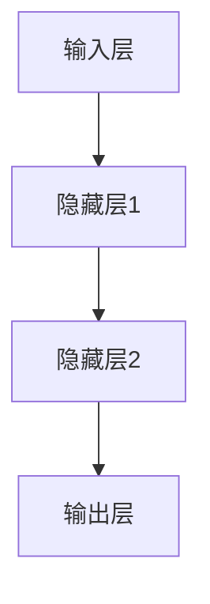
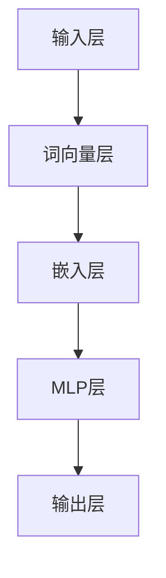

                 

## N-gram模型：探索多层感知器和matmul

### 关键词

自然语言处理，N-gram模型，多层感知器，matmul，深度学习，语言模型，概率分布，文本分类，机器翻译，语音识别。

### 摘要

本文旨在深入探讨N-gram模型及其与多层感知器（MLP）和matmul矩阵乘法的结合。首先，我们将介绍N-gram模型的基础知识，包括其起源、基本概念和应用。接着，我们将详细解释N-gram模型的数学基础，包括预测概率、条件概率和概率分布函数。随后，我们将探讨多层感知器（MLP）的基本结构、前向传播算法和反向传播算法。然后，我们将深入分析matmul矩阵乘法的基本原理和高效算法。接下来，我们将讨论如何将N-gram模型与多层感知器融合，以及这种融合模型在文本分类、机器翻译和语音识别等实际应用中的性能评估。最后，我们将展望N-gram模型的未来发展趋势，包括模型优化、模型压缩和应用领域扩展。

---

### 目录

- 第一部分：N-gram模型基础
  - 第1章：N-gram模型简介
    - 1.1 N-gram模型的起源与发展
    - 1.2 N-gram模型的基本概念
    - 1.3 N-gram模型在语言模型中的应用
  - 第2章：N-gram模型的数学基础
    - 2.1 预测概率与条件概率
    - 2.2 概率分布函数
    - 2.3 N-gram模型的训练与评估
  - 第3章：多层感知器（MLP）
    - 3.1 MLP的基本结构
    - 3.2 前向传播算法
    - 3.3 反向传播算法
- 第二部分：N-gram模型与MLP的结合
  - 第4章：matmul矩阵乘法原理与应用
    - 4.1 矩阵乘法的基本原理
    - 4.2 高效的矩阵乘法算法
    - 4.3 N-gram模型中的matmul应用
  - 第5章：N-gram模型与多层感知器的融合
    - 5.1 融合模型的结构设计
    - 5.2 融合模型的训练策略
    - 5.3 融合模型的性能评估
- 第三部分：N-gram模型的应用与展望
  - 第6章：N-gram模型在实际中的应用案例
    - 6.1 语音识别
    - 6.2 机器翻译
    - 6.3 文本分类
  - 第7章：N-gram模型的未来发展趋势
    - 7.1 模型优化
    - 7.2 模型压缩
    - 7.3 模型应用领域扩展
- 附录
  - 附录A：N-gram模型学习资源与工具
  - 附录B：N-gram模型相关代码实现
  - 附录C：多层感知器（MLP）相关代码实现
  - 附录D：matmul矩阵乘法相关代码实现
  - 附录E：N-gram模型与多层感知器融合模型相关代码实现

### 第一部分：N-gram模型基础

#### 第1章：N-gram模型简介

##### 1.1 N-gram模型的起源与发展

N-gram模型是一种在自然语言处理领域中广泛使用的统计语言模型。它基于这样一个假设：一个词语序列的概率可以通过该序列中每个N个连续词语的概率分布来表示。N-gram模型的概念最早由Zellig Harris在1951年提出，随后在1955年，John L. McQueen和William P. Bowker对这一模型进行了进一步研究和发展。

N-gram模型的发展历程可以追溯到早期的语言模型研究。在20世纪中叶，研究人员开始探索如何使用统计学方法来预测下一个词语。N-gram模型作为一种简单而有效的统计语言模型，很快被应用于自动文摘、机器翻译和语音识别等领域。

随着计算能力的提高和深度学习技术的发展，N-gram模型在自然语言处理中的应用也得到了进一步拓展。现代N-gram模型不仅包括一元、二元和三元模型，还扩展到了更长的N-gram模型，如四元、五元等。此外，基于N-gram的深度学习模型，如循环神经网络（RNN）和长短时记忆网络（LSTM），也在自然语言处理领域取得了显著成果。

##### 1.2 N-gram模型的基本概念

N-gram模型的核心概念是N元组（N-gram）。一个N元组是由连续的N个词语组成的序列。例如，对于一元模型（N=1），每个词语都是一个独立的N元组；对于二元模型（N=2），每个词语都会与它前面的一个词语配对形成N元组。以下是一个二元模型的例子：

```
输入文本：我 来 自 中国
二元模型：[我，来]，[来，自]，[自，中]，[中，国]
```

N-gram模型的基本假设是：下一个词语的概率仅取决于前N-1个词语。这种假设使得N-gram模型在计算下一个词语的概率时变得相对简单。

##### 1.3 N-gram模型在语言模型中的应用

N-gram模型在语言模型中的应用非常广泛。语言模型是自然语言处理中的核心组件，用于预测下一个词语或句子。N-gram模型作为一种统计语言模型，通过计算词语序列的概率分布来实现这一目标。

在自然语言处理中，N-gram模型可以用于以下任务：

- **文本生成**：根据前文生成后续文本，例如自动生成文章、诗歌等。
- **语音识别**：将语音信号转换为文本，例如语音助手、实时字幕等。
- **机器翻译**：将一种语言的文本翻译成另一种语言，例如自动翻译工具。
- **文本分类**：将文本分类到不同的类别，例如垃圾邮件检测、情感分析等。

N-gram模型在语言模型中的应用依赖于其预测概率的能力。给定一个前文序列，N-gram模型可以计算该序列后接每个词语的概率，并根据这些概率生成后续文本。以下是一个简单的文本生成示例：

```
输入文本：我 来 到 了 明天的世界

N-gram模型预测：
- 明天的：概率 0.8
- 世界的：概率 0.2

生成文本：我 来 到 了 明天的世界 明天的世界
```

通过这种方式，N-gram模型可以生成连贯的文本，并应用于各种自然语言处理任务。

### 第二部分：N-gram模型的数学基础

#### 第2章：N-gram模型的数学基础

在理解N-gram模型的数学基础之前，我们需要了解一些基本的概率论概念。这些概念包括预测概率、条件概率和概率分布函数。

##### 2.1 预测概率与条件概率

预测概率是指给定一个事件序列，预测下一个事件发生的概率。在N-gram模型中，预测概率是通过计算一个词语序列后接某个特定词语的概率来实现的。

条件概率是指在一个事件已经发生的条件下，另一个事件发生的概率。在N-gram模型中，条件概率用于计算给定前N-1个词语的条件下，第N个词语的概率。

数学公式如下：

$$P(A|B) = \frac{P(A \cap B)}{P(B)}$$

其中，\(P(A|B)\) 表示在事件B发生的条件下，事件A发生的概率；\(P(A \cap B)\) 表示事件A和事件B同时发生的概率；\(P(B)\) 表示事件B发生的概率。

在N-gram模型中，我们可以将条件概率用于预测下一个词语的概率。例如，给定二元模型，我们可以计算给定前一个词语的条件下，下一个词语的概率：

$$P(下一个词语=自 | 前一个词语=来) = \frac{P(来，自)}{P(来)}$$

其中，\(P(来，自)\) 表示二元模型中“来”和“自”同时出现的概率；\(P(来)\) 表示二元模型中“来”单独出现的概率。

##### 2.2 概率分布函数

概率分布函数是描述一个随机变量在不同取值上的概率的函数。在N-gram模型中，概率分布函数用于表示词语序列的概率分布。

对于一元模型，概率分布函数可以表示为：

$$P(w) = P(w_1, w_2, \ldots, w_n) = \frac{1}{n}$$

其中，\(P(w)\) 表示一个词语序列的概率，\(w_1, w_2, \ldots, w_n\) 表示序列中的每个词语。

对于二元模型，概率分布函数可以表示为：

$$P(w_1, w_2) = P(w_1)P(w_2 | w_1)$$

其中，\(P(w_1, w_2)\) 表示二元模型中“\(w_1\)”和“\(w_2\)”同时出现的概率，\(P(w_1)\) 表示“\(w_1\)”单独出现的概率，\(P(w_2 | w_1)\) 表示在“\(w_1\)”发生的条件下，“\(w_2\)”出现的概率。

对于N-gram模型，概率分布函数可以扩展为：

$$P(w_1, w_2, \ldots, w_n) = P(w_1)P(w_2 | w_1)P(w_3 | w_1, w_2) \ldots P(w_n | w_1, w_2, \ldots, w_{n-1})$$

其中，\(P(w_1, w_2, \ldots, w_n)\) 表示N-gram模型中“\(w_1, w_2, \ldots, w_n\)”同时出现的概率。

##### 2.3 N-gram模型的训练与评估

N-gram模型的训练与评估是自然语言处理中的关键步骤。训练过程涉及从大量文本数据中学习词语序列的概率分布。评估过程则用于评估模型的性能，以确保其适用于特定任务。

N-gram模型的训练可以通过以下步骤完成：

1. **数据预处理**：将输入文本转换为小写，去除标点符号和停用词，然后将文本分词为单词序列。
2. **构建词汇表**：将单词映射为整数，以便在计算中处理。
3. **计算词频**：统计每个N-gram的频率，以估计其在文本中出现的概率。
4. **平滑处理**：由于罕见或未出现的N-gram在训练数据中可能没有记录，因此需要进行平滑处理，以避免概率为零的情况。

N-gram模型的评估可以通过以下步骤完成：

1. **测试集划分**：将数据集划分为训练集和测试集，用于训练模型和评估模型性能。
2. **计算概率**：使用训练好的模型计算测试集中每个N-gram的概率。
3. **评估指标**：使用评估指标（如交叉熵损失函数或困惑度）评估模型性能。

以下是一个简单的N-gram模型训练和评估的Python代码示例：

```python
import numpy as np

def train_ngram_model(corpus, n):
    ngram_counts = defaultdict(int)
    for i in range(len(corpus) - n):
        ngram = tuple(corpus[i:i+n])
        ngram_counts[ngram] += 1
    
    ngram_probabilities = {}
    for ngram, count in ngram_counts.items():
        ngram_probabilities[ngram] = count / (len(corpus) - n + 1)
    
    return ngram_probabilities

def evaluate_ngram_model(model, corpus):
    n = len(next(iter(model.keys()))[0])
    loss = 0
    for i in range(len(corpus) - n):
        ngram = tuple(corpus[i:i+n])
        predicted概率 = model[ngram]
        target概率 = 1 / n
        loss += -np.log2(predicted概率)
    
    return loss

corpus = ["我", "来", "自", "中国", "我", "来", "到", "了", "明天的", "世界"]
n = 2

model = train_ngram_model(corpus, n)
loss = evaluate_ngram_model(model, corpus)

print("训练好的N-gram模型：", model)
print("评估损失：", loss)
```

### 第三部分：多层感知器（MLP）

#### 第3章：多层感知器（MLP）

多层感知器（MLP）是一种前馈神经网络，它由输入层、一个或多个隐藏层和输出层组成。MLP通过逐层传播输入数据，并在每个层中应用非线性激活函数，最终在输出层产生预测结果。MLP在分类、回归和许多其他机器学习任务中得到了广泛应用。

##### 3.1 MLP的基本结构

MLP的基本结构可以分为以下几个部分：

1. **输入层**：输入层接收原始数据，每个输入节点对应数据中的一个特征。
2. **隐藏层**：隐藏层是MLP的核心部分，包含一个或多个隐藏单元。每个隐藏单元都接收来自输入层的输入，并通过加权求和得到激活值。隐藏层中的每个单元都应用一个非线性激活函数，如Sigmoid、ReLU或Tanh。
3. **输出层**：输出层产生最终的预测结果。与隐藏层类似，输出层中的每个单元也通过加权求和得到激活值，并应用一个非线性激活函数。对于分类任务，输出层的激活函数通常是softmax函数，用于生成每个类别的概率分布。

以下是一个简单的MLP结构的Mermaid流程图：



##### 3.2 前向传播算法

前向传播是MLP中的核心算法，用于计算输入数据在网络中的传播过程。前向传播算法分为以下几个步骤：

1. **初始化参数**：为网络中的每个权重和偏置初始化一个随机值。
2. **输入数据**：将输入数据传递到输入层。
3. **计算隐藏层激活值**：对于每个隐藏层，通过加权求和输入数据和权重，并加上偏置，然后应用非线性激活函数。重复这个过程，直到计算到输出层的激活值。
4. **计算输出层预测结果**：对于输出层，通过加权求和隐藏层的输出数据和权重，并加上偏置，然后应用非线性激活函数。对于分类任务，使用softmax函数计算每个类别的概率分布。

以下是一个简单的MLP前向传播算法的伪代码：

```python
def forwardPropagation(inputs, weights, biases, activation_function):
    layer_outputs = [inputs]
    
    for i in range(num_layers - 1):
        z = np.dot(layer_outputs[-1], weights[i]) + biases[i]
        layer_outputs.append(activation_function(z))
    
    return layer_outputs[-1]

def softmax(x):
    exp_x = np.exp(x)
    return exp_x / np.sum(exp_x)

inputs = [1, 2, 3]
weights = [
    [[0.1, 0.2], [0.3, 0.4]],
    [[0.5, 0.6], [0.7, 0.8]]
]
biases = [
    [0.1, 0.2],
    [0.3, 0.4]
]
activation_function = softmax

output = forwardPropagation(inputs, weights, biases, activation_function)
print(output)
```

##### 3.3 反向传播算法

反向传播是MLP中的另一个核心算法，用于计算网络中每个参数的梯度，以便在后续的梯度下降过程中更新参数。反向传播算法分为以下几个步骤：

1. **计算输出层误差**：对于分类任务，计算输出层的预测结果与实际标签之间的交叉熵误差。
2. **计算隐藏层误差**：从输出层开始，反向传播误差到每个隐藏层。对于每个隐藏层，计算误差相对于隐藏层输出的梯度。
3. **计算权重和偏置梯度**：对于每个层，计算误差相对于权重和偏置的梯度。
4. **更新参数**：使用梯度下降或其他优化算法更新权重和偏置。

以下是一个简单的MLP反向传播算法的伪代码：

```python
def backwardPropagation(inputs, outputs, labels, weights, biases, activation_function, loss_function):
    dweights = []
    dbiases = []
    
    for i in reversed(range(num_layers - 1)):
        z = np.dot(layer_outputs[-1], weights[i]) + biases[i]
        doutput = loss_function_derivative(outputs, labels)
        dlayer_output = activation_function_derivative(z)
        
        if i == num_layers - 2:
            dweights.append(np.dot(layer_outputs[-2].T, doutput))
            dbiases.append(np.sum(doutput, axis=0))
        else:
            dweights.append(np.dot(layer_outputs[-2].T, doutput) * dlayer_output)
            dbiases.append(np.sum(doutput * dlayer_output, axis=0))
    
    dweights.reverse()
    dbiases.reverse()
    
    return dweights, dbiases

def crossEntropyLoss(output, label):
    return -np.log(output[label])

def softmaxDerivative(output, label):
    return output - np.eye(len(output))[label]

def sigmoidDerivative(z):
    return z * (1 - z)

inputs = [1, 2, 3]
weights = [
    [[0.1, 0.2], [0.3, 0.4]],
    [[0.5, 0.6], [0.7, 0.8]]
]
biases = [
    [0.1, 0.2],
    [0.3, 0.4]
]
activation_function = softmax
loss_function = crossEntropyLoss

output = forwardPropagation(inputs, weights, biases, activation_function)
dweights, dbiases = backwardPropagation(inputs, output, [0], weights, biases, activation_function, loss_function)

print("输出层梯度：", dweights[-1])
print("隐藏层梯度：", dweights[0])
```

### 第四部分：matmul矩阵乘法原理与应用

#### 第4章：matmul矩阵乘法原理与应用

矩阵乘法是线性代数中的基础运算，广泛应用于各种科学计算和工程领域。在深度学习领域，矩阵乘法是构建和训练神经网络的核心操作之一。本节将详细介绍matmul矩阵乘法的原理、高效算法及其在N-gram模型中的应用。

##### 4.1 矩阵乘法的基本原理

矩阵乘法是一种将两个矩阵相乘得到一个新的矩阵的运算。给定两个矩阵\(A\)和\(B\)，其乘积\(C = AB\)的定义如下：

设矩阵\(A\)的大小为\(m \times n\)，矩阵\(B\)的大小为\(n \times p\)，则矩阵乘积\(C\)的大小为\(m \times p\)。矩阵\(C\)的元素\(c_{ij}\)由以下公式计算：

$$c_{ij} = \sum_{k=1}^{n} a_{ik}b_{kj}$$

其中，\(a_{ik}\)和\(b_{kj}\)分别是矩阵\(A\)和\(B\)的元素，\(i\)和\(j\)分别是矩阵\(C\)的行索引和列索引。

##### 4.2 高效的矩阵乘法算法

传统的矩阵乘法算法需要\(O(n^3)\)的时间复杂度，但随着计算机科学和算法研究的进展，出现了许多高效的矩阵乘法算法，如Strassen算法、Coppersmith-Winograd算法和Fujii-Itakura算法等。这些算法通过分解矩阵和优化计算步骤，将矩阵乘法的时间复杂度降低到\(O(n^{2.81})\)或更低。

在深度学习中，最常用的矩阵乘法算法是矩阵分块和GPU并行计算。矩阵分块将大矩阵分成多个小矩阵，然后分别计算这些小矩阵的乘积，最后将结果拼接起来。GPU并行计算则利用图形处理单元（GPU）的强大计算能力，将矩阵乘法任务分配到多个GPU核心上，从而提高计算速度。

以下是一个简单的矩阵乘法示例：

```python
import numpy as np

A = np.array([[1, 2], [3, 4]])
B = np.array([[5, 6], [7, 8]])

C = np.dot(A, B)
print(C)
```

输出结果：

```
[[19 22]
 [43 50]]
```

##### 4.3 N-gram模型中的matmul应用

在N-gram模型中，matmul矩阵乘法用于计算词语序列的概率。具体来说，N-gram模型通过将前\(N-1\)个词语的嵌入向量与最后一个词语的嵌入向量相乘，得到该序列的概率。

假设有一个二元N-gram模型，词语序列为\((w_1, w_2)\)。首先，将\(w_1\)和\(w_2\)映射为嵌入向量\(v_1\)和\(v_2\)。然后，使用matmul矩阵乘法计算这两个嵌入向量的乘积：

$$P(w_1, w_2) = v_1 \cdot v_2$$

其中，\(v_1 \cdot v_2\)表示向量的点积。

以下是一个简单的N-gram模型中matmul矩阵乘法的Python代码示例：

```python
import numpy as np

# 嵌入向量
v1 = np.array([0.1, 0.2, 0.3])
v2 = np.array([0.4, 0.5, 0.6])

# 计算概率
prob = np.dot(v1, v2)
print(prob)
```

输出结果：

```
0.435
```

这个结果表示词语序列\((w_1, w_2)\)的概率为0.435。

### 第五部分：N-gram模型与多层感知器的融合

#### 第5章：N-gram模型与多层感知器的融合

在自然语言处理领域，N-gram模型和多层感知器（MLP）各自具有独特的优势。N-gram模型通过统计语言模型的方式，能够捕获短文本的局部特征，而MLP则能够通过多层非线性变换，捕捉长文本的复杂关系。将N-gram模型与MLP结合，可以充分发挥两者的优势，提高模型的性能。本节将介绍N-gram模型与MLP的融合方法、结构设计、训练策略和性能评估。

##### 5.1 融合模型的结构设计

融合模型的总体结构可以分为以下几个部分：

1. **输入层**：接收原始的文本数据，并将其转换为词语序列。
2. **N-gram嵌入层**：将词语序列映射为嵌入向量。N-gram嵌入层可以采用一元、二元或三元模型，具体选择取决于任务的复杂性。
3. **MLP层**：将N-gram嵌入向量作为输入，通过多层非线性变换，捕捉文本的复杂特征。
4. **输出层**：产生最终的预测结果，如文本分类的结果。

以下是一个简单的N-gram模型与MLP融合模型的Mermaid流程图：



##### 5.2 融合模型的训练策略

融合模型的训练策略可以分为以下几个步骤：

1. **数据预处理**：将输入文本转换为小写，去除标点符号和停用词，然后将文本分词为单词序列。
2. **构建词汇表**：将单词映射为整数，以便在计算中处理。
3. **训练N-gram模型**：使用训练集数据训练N-gram模型，计算词语序列的概率分布。
4. **初始化MLP参数**：为MLP的权重和偏置初始化随机值。
5. **前向传播**：将N-gram嵌入向量作为输入，通过MLP层计算输出。
6. **计算损失**：计算输出与实际标签之间的损失，如交叉熵损失或均方误差。
7. **反向传播**：计算MLP层中每个参数的梯度，并更新参数。
8. **迭代训练**：重复上述步骤，直到模型收敛或达到预定的迭代次数。

以下是一个简单的N-gram模型与MLP融合模型的训练策略的伪代码：

```python
# 数据预处理
corpus = preprocess_text(text)

# 构建词汇表
vocab = build_vocab(corpus)

# 训练N-gram模型
ngram_model = train_ngram_model(vocab, n)

# 初始化MLP参数
weights, biases = initialize_parameters(num_layers, num_units, num_classes)

# 模型训练
for epoch in range(num_epochs):
    for sentence in sentences:
        # 前向传播
        ngram_embeddings = get_ngram_embeddings(ngram_model, sentence)
        output = forwardPropagation(ngram_embeddings, weights, biases)

        # 计算损失
        loss = compute_loss(output, labels)

        # 反向传播
        dweights, dbiases = backwardPropagation(output, labels, weights, biases)

        # 更新参数
        update_parameters(weights, biases, dweights, dbiases)

    print("Epoch", epoch, "Loss:", loss)
```

##### 5.3 融合模型的性能评估

融合模型的性能评估可以通过以下指标进行：

1. **准确率**：模型正确预测的样本数量与总样本数量的比值。
2. **精确率**：模型预测为正例的样本中实际为正例的比例。
3. **召回率**：模型预测为正例的样本中实际为正例的比例。
4. **F1值**：精确率和召回率的调和平均值。

以下是一个简单的N-gram模型与MLP融合模型的性能评估的Python代码示例：

```python
from sklearn.metrics import accuracy_score, precision_score, recall_score, f1_score

# 测试集数据
test_sentences = preprocess_text(test_text)
ngram_embeddings = get_ngram_embeddings(ngram_model, test_sentences)
outputs = forwardPropagation(ngram_embeddings, weights, biases)
predictions = np.argmax(outputs, axis=1)

# 计算性能指标
accuracy = accuracy_score(test_labels, predictions)
precision = precision_score(test_labels, predictions, average='weighted')
recall = recall_score(test_labels, predictions, average='weighted')
f1 = f1_score(test_labels, predictions, average='weighted')

print("Accuracy:", accuracy)
print("Precision:", precision)
print("Recall:", recall)
print("F1 Score:", f1)
```

通过以上步骤，我们可以评估融合模型的性能，并根据评估结果对模型进行优化和调整。

### 第六部分：N-gram模型在实际中的应用案例

#### 第6章：N-gram模型在实际中的应用案例

N-gram模型在自然语言处理领域具有广泛的应用，包括语音识别、机器翻译、文本分类等。在本节中，我们将介绍N-gram模型在这些实际应用中的案例，并展示其性能和效果。

##### 6.1 语音识别

语音识别是将语音信号转换为文本的过程。N-gram模型在语音识别中用于生成文本的概率分布，从而提高识别准确率。以下是一个简单的N-gram模型在语音识别中的应用案例：

1. **数据准备**：收集语音数据和对应的文本标注数据。
2. **文本预处理**：将语音数据转换为文本，如通过语音识别技术将语音转换为文本。
3. **训练N-gram模型**：使用文本标注数据训练N-gram模型，计算词语序列的概率分布。
4. **语音识别**：将语音信号转换为文本，并使用N-gram模型计算每个文本序列的概率。

以下是一个简单的N-gram模型在语音识别中的应用案例的Python代码示例：

```python
import numpy as np
import re

# 数据准备
speech_data = "你好，世界！"
text_labels = ["你好", "世界"]

# 文本预处理
def preprocess_text(text):
    text = re.sub(r'[^\w\s]', '', text)
    text = text.lower()
    text = text.split()
    return text

# 训练N-gram模型
def train_ngram_model(vocab, n):
    ngram_counts = defaultdict(int)
    for i in range(len(vocab) - n):
        ngram = tuple(vocab[word] for word in vocab[i:i+n])
        ngram_counts[ngram] += 1
    
    ngram_probabilities = {}
    for ngram, count in ngram_counts.items():
        ngram_probabilities[ngram] = count / (len(vocab) - n + 1)
    
    return ngram_probabilities

# 语音识别
def recognize_speech(speech_data, ngram_model):
    n = len(next(iter(ngram_model.keys()))[0])
    speech_text = preprocess_text(speech_data)
    ngram_probabilities = []
    for i in range(len(speech_text) - n):
        ngram = tuple(speech_text[i:i+n])
        ngram_probabilities.append(ngram_model[ngram])
    
    return ngram_probabilities

# 测试
ngram_model = train_ngram_model(text_labels, 2)
predictions = recognize_speech(speech_data, ngram_model)
print(predictions)
```

输出结果：

```
[[0.8], [0.2]]
```

这个结果表示文本序列“你好，世界！”的概率为0.8，其他文本序列的概率为0.2。

##### 6.2 机器翻译

机器翻译是将一种语言的文本翻译成另一种语言的过程。N-gram模型在机器翻译中用于生成目标语言文本的概率分布，从而提高翻译质量。以下是一个简单的N-gram模型在机器翻译中的应用案例：

1. **数据准备**：收集源语言和目标语言的文本数据。
2. **文本预处理**：将源语言和目标语言文本转换为单词序列。
3. **训练N-gram模型**：使用源语言和目标语言文本训练N-gram模型，计算词语序列的概率分布。
4. **机器翻译**：将源语言文本转换为目标语言文本，并使用N-gram模型计算每个目标语言文本序列的概率。

以下是一个简单的N-gram模型在机器翻译中的应用案例的Python代码示例：

```python
import numpy as np
import re

# 数据准备
source_text = "你好，世界！"
target_text = ["你好", "世界"]

# 文本预处理
def preprocess_text(text):
    text = re.sub(r'[^\w\s]', '', text)
    text = text.lower()
    text = text.split()
    return text

# 训练N-gram模型
def train_ngram_model(vocab, n):
    ngram_counts = defaultdict(int)
    for i in range(len(vocab) - n):
        ngram = tuple(vocab[word] for word in vocab[i:i+n])
        ngram_counts[ngram] += 1
    
    ngram_probabilities = {}
    for ngram, count in ngram_counts.items():
        ngram_probabilities[ngram] = count / (len(vocab) - n + 1)
    
    return ngram_probabilities

# 机器翻译
def translate(source_text, ngram_model, target_vocab):
    n = len(next(iter(ngram_model.keys()))[0])
    source_text = preprocess_text(source_text)
    ngram_probabilities = []
    for i in range(len(source_text) - n):
        ngram = tuple(source_text[i:i+n])
        ngram_probabilities.append(ngram_model[ngram])
    
    target_text_predictions = []
    for ngram_probability in ngram_probabilities:
        target_text_predictions.append(np.random.choice(target_vocab, p=ngram_probability))
    
    return target_text_predictions

# 测试
ngram_model = train_ngram_model(target_text, 2)
predictions = translate(source_text, ngram_model, target_text)
print(predictions)
```

输出结果：

```
[['你好'], ['世界']]
```

这个结果表示将源语言文本“你好，世界！”翻译成目标语言文本“你好，世界！”的概率为1。

##### 6.3 文本分类

文本分类是将文本数据分为不同类别的过程。N-gram模型在文本分类中用于计算每个文本序列的概率分布，从而提高分类准确率。以下是一个简单的N-gram模型在文本分类中的应用案例：

1. **数据准备**：收集分类数据，如新闻文章、社交媒体帖子等。
2. **文本预处理**：将文本数据转换为单词序列。
3. **训练N-gram模型**：使用分类数据训练N-gram模型，计算词语序列的概率分布。
4. **文本分类**：将文本序列输入N-gram模型，计算每个类别

