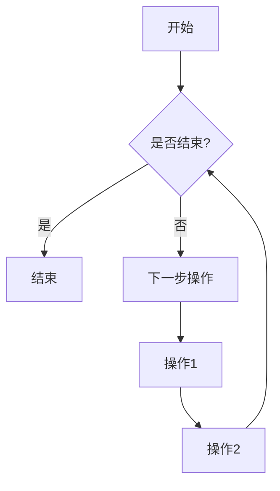

                 

### 文章标题

《Python云计算与大数据处理实战教程》

### 关键词

Python、云计算、大数据、数据处理、实战教程

### 摘要

本文旨在通过详细的实战教程，介绍Python在云计算与大数据处理领域的应用。内容涵盖了Python基础、云计算基础、Python与云存储、云数据库、云计算平台、大数据处理以及机器学习等核心知识，并通过多个实战项目，帮助读者理解和掌握Python在云计算与大数据处理中的实际应用技巧。

---

### 《Python云计算与大数据处理实战教程》目录大纲

为了帮助读者更好地了解和掌握Python在云计算与大数据处理领域的应用，本书将分为五个主要部分，每个部分包含多个章节，具体目录大纲如下：

#### 第一部分：Python基础与云计算概述

##### 第1章：Python基础
- 1.1 Python语言概述
  - Python特点与历史
  - Python应用领域
- 1.2 Python环境搭建
  - Python安装与配置
  - Python IDE选择与配置
- 1.3 Python基础语法
  - 变量与数据类型
  - 运算符与表达式
  - 控制结构
- 1.4 Python函数与模块
  - 函数定义与调用
  - 模块导入与使用

##### 第2章：云计算基础
- 2.1 云计算概念与架构
  - 云计算定义与演进
  - 云计算服务模式（IaaS、PaaS、SaaS）
- 2.2 云服务提供商简介
  - AWS、Azure、Google Cloud等
- 2.3 云计算部署模型
  - 公有云、私有云、混合云
- 2.4 云存储技术
  - 分布式存储系统
  - 数据备份与恢复

#### 第二部分：Python在云计算中的应用

##### 第3章：Python与云存储
- 3.1 云存储API介绍
  - Azure Blob存储
  - AWS S3
  - Google Cloud Storage
- 3.2 云存储操作实例
  - 文件上传与下载
  - 存储桶管理
  - 分块上传与下载

##### 第4章：Python与云数据库
- 4.1 云数据库简介
  - 关系型数据库（MySQL、PostgreSQL）
  - NoSQL数据库（MongoDB、Redis）
- 4.2 Python数据库操作
  - MySQL与Python交互
  - MongoDB与Python交互
  - Redis与Python交互
- 4.3 云数据库性能优化
  - 查询优化
  - 数据库集群与分片

##### 第5章：Python与云计算平台
- 5.1 云计算平台概述
  - 虚拟机与容器
  - Kubernetes简介
- 5.2 Python与虚拟机管理
  - 创建与配置虚拟机
  - 虚拟机监控与日志
- 5.3 Python与容器管理
  - Docker基本操作
  - Kubernetes Python客户端
  - 容器化应用部署

#### 第三部分：大数据处理与Python

##### 第6章：大数据概念与架构
- 6.1 大数据定义与特征
  - 数据量、数据速度、数据多样性和数据价值
- 6.2 大数据架构
  - 数据采集与存储
  - 数据处理与分析
  - 数据展示与可视化

##### 第7章：Python大数据处理库
- 7.1 Pandas库
  - 数据清洗与预处理
  - 数据分析与应用
- 7.2 NumPy库
  - 数值计算基础
  - 数组操作与应用
- 7.3 SciPy库
  - 科学计算库
  - 数学函数与工具

##### 第8章：Python与大数据平台
- 8.1 Hadoop生态系统
  - HDFS、MapReduce、YARN
- 8.2 Python与Hadoop
  - Hadoop分布式文件系统（HDFS）
  - MapReduce编程模型
- 8.3 Python与Spark
  - Spark架构与特点
  - Spark编程模型与API

#### 第四部分：大数据分析与Python

##### 第9章：数据挖掘与机器学习
- 9.1 数据挖掘基础
  - 数据挖掘流程
  - 常见算法简介
- 9.2 Python机器学习库
  - Scikit-learn库
  - TensorFlow与Keras
- 9.3 数据可视化
  - Matplotlib库
  - Seaborn库

##### 第10章：大数据项目实战
- 10.1 项目实战概述
  - 项目目标与需求
  - 项目技术栈
- 10.2 数据预处理与清洗
  - 数据采集与导入
  - 数据清洗与转换
- 10.3 数据分析与应用
  - 数据可视化
  - 机器学习模型构建与评估
- 10.4 项目部署与运维
  - 部署环境搭建
  - 系统监控与维护

#### 第五部分：扩展阅读与资源

##### 第11章：扩展阅读
- 11.1 云计算与大数据相关书籍推荐
- 11.2 Python云计算与大数据处理社区与资源

##### 第12章：资源汇总
- 12.1 Python云计算与大数据处理工具汇总
- 12.2 实战项目源代码与资源链接

### 附录

- 附录 A: Python云计算与大数据处理常用库与函数
  - A.1 Python云计算常用库
  - A.2 Python大数据处理常用库
  - A.3 Python数据挖掘与机器学习常用库

- 附录 B: Mermaid流程图示例



- 附录 C: 伪代码与数学公式示例

```python
# 伪代码：排序算法示例
for i in range(len(array)):
    for j in range(0, len(array) - i - 1):
        if array[j] > array[j + 1]:
            swap(array[j], array[j + 1])

# 数学公式：梯度下降算法
$$\text{loss} = \frac{1}{2}\sum_{i=1}^{n} (\hat{y_i} - y_i)^2$$
$$\text{gradient} = \frac{\partial \text{loss}}{\partial \theta}$$
$$\theta = \theta - \alpha \text{gradient}$$
```

- 附录 D: 实战项目代码解读与分析

```python
# 代码示例：使用Pandas进行数据清洗
import pandas as pd

# 读取数据
data = pd.read_csv('data.csv')

# 检查数据是否有缺失值
print(data.isnull().sum())

# 填充缺失值
data.fillna(method='ffill', inplace=True)

# 检查数据是否有重复值
print(data.duplicated().sum())

# 删除重复值
data.drop_duplicates(inplace=True)

# 保存清洗后的数据
data.to_csv('cleaned_data.csv', index=False)
```

---

通过以上详细的目录大纲，读者可以清晰地了解本书的结构和内容，逐步深入到Python云计算与大数据处理的核心领域，掌握实战技巧，提升技术应用能力。

---

在本文中，我们将逐步介绍Python云计算与大数据处理的核心知识，通过具体的实战案例和代码示例，帮助读者深入理解和掌握这些技术。以下是本文的结构安排：

1. **Python基础**：介绍Python语言的基础语法和常用库，为后续的云计算与大数据处理打下基础。
2. **云计算基础**：介绍云计算的基本概念、服务模式和部署模型，以及云存储技术的核心内容。
3. **Python在云计算中的应用**：通过Python与云存储、云数据库和云计算平台的结合，展示Python在云计算中的实际应用。
4. **大数据处理与Python**：介绍大数据的基本概念、架构以及Python在大数据处理中的常用库和平台。
5. **大数据分析与Python**：介绍数据挖掘与机器学习的基础知识，以及Python在数据可视化中的应用。
6. **大数据项目实战**：通过一个完整的实战项目，展示如何利用Python进行大数据处理与分析。
7. **扩展阅读与资源汇总**：提供进一步学习的资源和扩展阅读。

接下来，我们将详细探讨Python基础和云计算基础这两个部分，帮助读者建立扎实的基础知识。

---

### 第1章: Python基础

在云计算和大数据处理领域，Python作为一种功能强大且易于学习的编程语言，扮演着至关重要的角色。本章将介绍Python的基础知识，包括语言概述、环境搭建、基础语法、函数与模块等内容，为后续的云计算与大数据处理应用奠定基础。

#### 1.1 Python语言概述

Python是一种高级、动态、解释型编程语言，由Guido van Rossum于1989年发明。Python的特点如下：

- **简洁性**：Python的语法设计简洁明了，易于阅读和理解，降低了学习门槛。
- **通用性**：Python支持多种编程范式，包括面向对象、命令式、函数式和过程式编程，适用于各种应用场景。
- **高效性**：Python拥有丰富的标准库和第三方库，可以快速开发复杂的应用程序。
- **解释型**：Python代码在运行时由解释器逐行解释执行，不需要编译过程。

Python的历史可以追溯到1989年，当时Guido van Rossum在荷兰国家数学和计算机科学研究所（CWI）工作，目标是创建一种易于学习和使用的编程语言。Python 1.0于1991年发布，此后Python不断发展和完善，成为全球最受欢迎的编程语言之一。

#### 1.2 Python应用领域

Python在多个领域都有广泛应用，主要包括：

- **Web开发**：Python可以用于构建Web应用程序和后端服务，常用的Web框架有Django、Flask和Pyramid等。
- **数据科学**：Python是数据科学领域的首选语言，用于数据处理、分析和可视化，常用的库有Pandas、NumPy、SciPy等。
- **人工智能**：Python在人工智能领域有着广泛应用，用于机器学习、深度学习和自然语言处理等，常用的库有Scikit-learn、TensorFlow、Keras等。
- **云计算**：Python可以与云计算平台集成，用于部署和管理云资源，常用的库有Boto3（AWS）、Azure SDK（Azure）和Google Cloud SDK（Google Cloud）等。
- **自动化**：Python在自动化测试、脚本编写和系统管理中也非常有用。

#### 1.3 Python在云计算与大数据处理中的应用前景

随着云计算和大数据技术的不断发展，Python在云计算与大数据处理中的应用前景十分广阔。以下是Python在云计算与大数据处理中的几个应用方向：

- **云计算管理**：Python可以用于自动化云资源的部署、管理和监控，提高运维效率。
- **大数据处理**：Python在大数据处理领域具有强大的功能，可以用于数据采集、清洗、转换、存储和可视化等。
- **数据科学和机器学习**：Python是数据科学和机器学习的首选语言，可以用于构建和训练复杂的机器学习模型。
- **自动化和优化**：Python可以自动化执行复杂的任务，如数据迁移、批处理和资源调度，从而提高效率和降低成本。

接下来，我们将介绍如何在本地环境中搭建Python开发环境，并选择合适的集成开发环境（IDE）。

#### 1.4 Python环境搭建

在开始Python编程之前，需要搭建Python开发环境。以下是搭建Python环境的步骤：

1. **安装Python**：从Python官方网站（https://www.python.org/）下载Python安装包，根据操作系统选择对应的版本进行安装。安装过程中，确保勾选“Add Python to PATH”选项，以便在命令行中直接运行Python。
   
2. **配置Python环境**：安装完成后，打开命令行工具（如Windows的命令提示符或macOS的终端），输入以下命令，验证Python是否安装成功：

   ```shell
   python --version
   ```

   如果成功输出Python版本信息，表示Python环境已配置完成。

3. **选择IDE**：Python有多个集成开发环境（IDE）可供选择，如PyCharm、VSCode、Jupyter Notebook等。下面简要介绍几种常用的IDE：

   - **PyCharm**：PyCharm是JetBrains公司开发的一款功能强大的Python IDE，支持多种编程语言，提供了丰富的代码编辑、调试和测试功能。
   - **VSCode**：Visual Studio Code是微软开发的免费开源IDE，支持Python开发，提供了强大的代码编辑器和扩展功能。
   - **Jupyter Notebook**：Jupyter Notebook是一种交互式开发环境，特别适合数据科学和机器学习项目，可以实时显示计算结果和可视化图表。

   用户可以根据个人需求选择合适的IDE，并进行相关配置。

通过以上步骤，读者可以成功搭建Python开发环境，并选择合适的IDE，为后续的编程学习打下基础。

---

在了解了Python语言概述和应用领域后，接下来我们将深入探讨Python的基础语法，包括变量与数据类型、运算符与表达式以及控制结构等内容。

#### 1.5 Python基础语法

Python的语法简洁明了，使得编写代码变得更加高效。以下是Python基础语法的主要内容：

#### 1.5.1 变量与数据类型

在Python中，变量是一个存储数据的容器。Python是动态类型语言，变量不需要显式声明类型，其类型由所赋值的类型决定。

- **变量定义**：通过等号（=）为变量赋值，例如：

  ```python
  x = 10
  name = "Alice"
  ```

- **数据类型**：Python支持多种数据类型，包括整数（int）、浮点数（float）、字符串（str）、布尔值（bool）等。

  ```python
  age = 30          # 整数
  pi = 3.14159      # 浮点数
  message = "Hello" # 字符串
  is_true = True    # 布尔值
  ```

#### 1.5.2 运算符与表达式

Python支持各种基本的运算符，包括算术运算符、比较运算符、逻辑运算符等。

- **算术运算符**：+、-、*、/、%
  
  ```python
  result = 10 + 20  # 30
  difference = 30 - 10  # 20
  product = 3 * 4  # 12
  quotient = 10 / 2  # 5.0
  remainder = 10 % 3  # 1
  ```

- **比较运算符**：==、!=、<、<=、>、>=

  ```python
  is_equal = (x == y)  # False
  is_greater = (x > y)  # True
  ```

- **逻辑运算符**：and、or、not

  ```python
  is_both_true = (x > 0 and y > 0)  # False
  is_at_least_one_true = (x > 0 or y > 0)  # True
  is_false = not (x > 0)  # False
  ```

#### 1.5.3 控制结构

Python支持条件语句和循环语句，用于控制程序流程。

- **条件语句**：if、elif、else

  ```python
  if x > y:
      print("x is greater than y")
  elif x < y:
      print("x is less than y")
  else:
      print("x and y are equal")
  ```

- **循环语句**：for、while

  ```python
  # for循环
  for i in range(5):
      print(i)
  
  # while循环
  i = 0
  while i < 5:
      print(i)
      i += 1
  ```

通过以上内容，读者可以初步掌握Python的基础语法，为后续章节的学习打下坚实的基础。

---

在了解了Python的基础语法后，接下来我们将介绍Python的函数与模块，这是Python编程的核心内容之一。

#### 1.6 Python函数与模块

函数是Python中实现代码重用和抽象的重要工具，模块则是组织代码的方式，使得Python程序更加模块化和可维护。

#### 1.6.1 函数定义与调用

在Python中，函数是通过def关键字定义的。一个基本的函数定义如下：

```python
def greet(name):
    message = f"Hello, {name}!"
    return message
```

- **参数**：函数可以接受参数，用于传递数据和改变函数行为。

  ```python
  def add(a, b):
      return a + b
  ```

- **默认参数**：函数可以设置默认参数，当调用函数时，如果没有提供相应参数，将使用默认值。

  ```python
  def greet(name, greet="Hello"):
      message = f"{greet}, {name}!"
      return message
  ```

- **可变参数**：使用*args和**kwargs可以接受任意数量和类型的参数。

  ```python
  def info(*args, **kwargs):
      print("Args:", args)
      print("Kwargs:", kwargs)
  ```

- **返回值**：函数可以通过return语句返回一个值或多个值。

  ```python
  def get_square(x):
      return x * x
  ```

函数的调用非常简单，只需使用函数名后跟括号内的参数即可：

```python
print(greet("Alice"))
result = add(5, 3)
print(result)
info(1, 2, 3, name="Alice", age=30)
print(get_square(4))
```

#### 1.6.2 模块导入与使用

模块是Python代码的组织单元，它将代码划分为不同的文件，使得程序更加模块化和易于维护。Python标准库提供了丰富的模块，同时用户也可以创建自定义模块。

- **导入模块**：使用import语句导入模块。

  ```python
  import math
  from datetime import datetime
  ```

- **使用模块**：导入模块后，可以使用模块提供的函数和类。

  ```python
  print(math.sqrt(16))
  now = datetime.now()
  print(now)
  ```

- **别名导入**：使用as关键字可以为模块指定别名，方便使用。

  ```python
  import math as m
  from datetime import datetime as dt
  print(m.sqrt(25))
  now = dt.now()
  print(now)
  ```

- **从模块导入特定函数或类**：使用from语句可以导入模块中的特定函数或类。

  ```python
  from math import sqrt, pi
  print(sqrt(9))
  print(pi)
  ```

- **导入所有内容**：使用*操作符可以导入模块中的所有内容。

  ```python
  from math import *
  print(sqrt(16))
  print(pi)
  ```

通过函数和模块的使用，Python代码变得更加模块化和可重用，有助于提高开发效率和代码质量。

---

在了解了Python的基础语法和函数与模块后，接下来我们将介绍Python的进阶特性，这些特性将使Python编程更加灵活和强大。

#### 1.7 Python进阶特性

Python作为一种高级编程语言，拥有许多进阶特性，包括列表解析、生成器、迭代器和装饰器等。这些特性使得Python编程变得更加灵活和高效。

#### 1.7.1 列表解析

列表解析是一种创建列表的简洁方法，可以同时完成循环和映射操作。其基本语法如下：

```python
squared = [x * x for x in range(5)]
```

列表解析可以包含多个表达式，例如：

```python
squared_even = [x * x for x in range(5) if x % 2 == 0]
```

列表解析在数据处理和数学计算中非常有用，可以快速生成所需的列表。

#### 1.7.2 生成器

生成器是Python中的一种特殊类型，用于生成序列中的元素，而不是一次性创建整个序列。生成器的优点是节省内存，因为它们只在需要时生成元素。

生成器通过使用yield关键字定义，其基本语法如下：

```python
def fibonacci():
    a, b = 0, 1
    while True:
        yield a
        a, b = b, a + b
```

生成器的使用非常简单，可以通过迭代器进行遍历：

```python
for number in fibonacci():
    if number > 10:
        break
    print(number)
```

生成器是处理大量数据时的一种有效方式，可以减少内存占用。

#### 1.7.3 迭代器

迭代器是Python中用于遍历集合（如列表、字典、集合等）的对象。迭代器有两个主要方法：`__iter__()`和`__next__()`。

迭代器的基本用法如下：

```python
my_list = [1, 2, 3, 4, 5]
my_iter = iter(my_list)

while True:
    try:
        element = next(my_iter)
        print(element)
    except StopIteration:
        break
```

迭代器在Python的for循环中广泛使用，使得循环操作更加简洁。

#### 1.7.4 装饰器

装饰器是一种特殊类型的函数，用于修改其他函数的行为。装饰器的语法如下：

```python
def my_decorator(func):
    def wrapper():
        print("Before the function runs.")
        func()
        print("After the function runs.")
    return wrapper

@my_decorator
def say_hello():
    print("Hello!")

say_hello()
```

装饰器可以应用于任何函数，从而在不修改原始函数代码的情况下添加额外功能。

通过了解和掌握Python的这些进阶特性，开发者可以编写更加灵活和高效的代码，提高开发效率。

---

在了解了Python的基础语法、函数与模块以及进阶特性后，我们接下来将进入云计算的基础知识部分，这是理解Python在云计算中应用的重要前提。

#### 2.1 云计算概念与架构

云计算是一种通过互联网提供计算资源的服务模式，它使企业能够灵活、高效地使用和管理计算资源。云计算的基本概念和架构如下：

##### 2.1.1 云计算定义与演进

云计算可以定义为通过互联网提供动态可扩展的计算资源，包括计算能力、存储、网络和其他服务。云计算的发展经历了几个阶段：

- **基础设施即服务（IaaS）**：最早的云计算模式，提供虚拟化的硬件资源，如虚拟机、存储和带宽，用户可以根据需要灵活配置和管理资源。

- **平台即服务（PaaS）**：提供开发平台，包括操作系统、编程语言环境、数据库和开发工具等，用户可以在平台上开发、运行和管理应用程序。

- **软件即服务（SaaS）**：提供应用程序服务，如电子邮件、文档编辑和客户关系管理，用户通过互联网访问应用程序，无需关心底层硬件和软件的维护。

- **功能即服务（FaaS）**：提供函数级服务，用户通过上传代码定义函数，按需执行并仅支付实际使用的计算资源。

- **数据中心即服务（DCaaS）**：提供数据中心基础设施的服务，包括机房、网络、电力和冷却等，用户可以根据需要租用和管理数据中心资源。

##### 2.1.2 云计算服务模式（IaaS、PaaS、SaaS）

云计算服务模式是云计算的核心组成部分，每种模式都有其独特的特点和适用场景：

- **基础设施即服务（IaaS）**：

  - **特点**：提供虚拟化的计算资源，如虚拟机、存储和网络，用户可以灵活配置和管理资源。
  - **优势**：资源可扩展性强，成本效益高，用户可以根据需求灵活调整资源配置。
  - **应用场景**：适用于需要高度灵活性和可扩展性的场景，如Web应用、大数据处理和测试环境。

- **平台即服务（PaaS）**：

  - **特点**：提供开发平台，包括操作系统、编程语言环境、数据库和开发工具等，用户可以在平台上快速开发、部署和管理应用程序。
  - **优势**：开发效率高，平台提供了一整套开发和部署工具，降低了开发成本和难度。
  - **应用场景**：适用于需要快速开发和部署应用程序的场景，如Web应用、移动应用和数据分析。

- **软件即服务（SaaS）**：

  - **特点**：提供应用程序服务，如电子邮件、文档编辑和客户关系管理，用户通过互联网访问应用程序，无需关心底层硬件和软件的维护。
  - **优势**：使用方便，无需购买和维护软件，降低了成本和运维难度。
  - **应用场景**：适用于需要提供便捷应用程序服务的场景，如企业内部办公、客户关系管理和在线教育。

##### 2.1.3 云计算部署模型

云计算部署模型决定了云计算资源的位置和管理方式，常见的部署模型包括公有云、私有云和混合云：

- **公有云**：

  - **特点**：由第三方云服务提供商提供，资源可供多个用户共享。
  - **优势**：成本效益高，资源可扩展性强，适合中小企业和初创企业。
  - **应用场景**：适用于需要灵活扩展和降低成本的场景，如Web应用、大数据处理和移动应用。

- **私有云**：

  - **特点**：为单个组织内部提供，资源仅供内部使用。
  - **优势**：安全性高，可以更好地满足特定业务需求，适合大型企业和政府机构。
  - **应用场景**：适用于需要高度安全和定制化的场景，如企业内部办公、数据分析和安全敏感应用。

- **混合云**：

  - **特点**：结合公有云和私有云的优势，将不同的工作负载部署在适合的环境中。
  - **优势**：灵活性高，可以充分利用公有云和私有云的资源，降低成本和风险。
  - **应用场景**：适用于需要灵活调整资源和使用场景的企业和组织，如大型企业、金融机构和政府部门。

##### 2.1.4 云计算核心技术与组件

云计算技术是实现云计算服务的基础，主要包括以下几个方面：

- **虚拟化技术**：

  - **定义**：虚拟化技术通过创建虚拟资源，将物理资源抽象化，实现资源的灵活分配和管理。
  - **优势**：提高资源利用率，降低硬件成本，提高系统可靠性。

- **分布式存储**：

  - **定义**：分布式存储通过多个存储节点实现数据的分散存储和管理，提高数据存储的可靠性和性能。
  - **优势**：数据冗余度高，提高数据安全性，提高存储性能。

- **负载均衡**：

  - **定义**：负载均衡通过将工作负载分配到多个服务器，提高系统的性能和可用性。
  - **优势**：提高系统吞吐量，减少单点故障风险，提高系统的稳定性。

- **自动化管理**：

  - **定义**：自动化管理通过脚本、工具和平台实现云计算资源的自动化部署、配置和管理。
  - **优势**：提高运维效率，降低人工错误，提高系统的可扩展性和可维护性。

- **安全性**：

  - **定义**：安全性通过加密、认证、访问控制和监控等技术保护云计算资源的安全性。
  - **优势**：确保数据隐私和完整性，提高系统的可靠性和可用性。

通过了解云计算的概念、服务模式、部署模型以及核心技术，我们可以更好地理解云计算的工作原理和应用场景，为后续的Python云计算应用打下坚实的基础。

---

在了解了云计算的概念和架构后，接下来我们将详细介绍当前市场上主要的云服务提供商，包括AWS、Azure和Google Cloud等，以帮助读者对这些云平台有更深入的了解。

#### 2.2 云服务提供商简介

云计算市场上有多个主要的云服务提供商，它们分别提供了丰富的云服务和解决方案。以下是对AWS、Azure和Google Cloud这三个主要云服务提供商的简介：

##### 2.2.1 AWS（Amazon Web Services）

AWS是云计算市场的领军企业，由亚马逊公司于2006年推出。AWS提供了广泛的服务，包括计算、存储、数据库、网络、人工智能、机器学习和区块链等。以下是一些主要服务：

- **计算服务**：EC2（弹性计算云）提供虚拟机实例，适合大规模计算和应用程序部署。Lambda是无服务器计算服务，适合处理事件驱动的任务。
- **存储服务**：S3（简单存储服务）是一种对象存储服务，适用于大规模数据存储和共享。EBS（弹性块存储）提供持久性块存储，适用于需要高可靠性和高性能的场景。
- **数据库服务**：RDS（关系数据库服务）提供托管数据库服务，包括MySQL、PostgreSQL和Oracle等。DynamoDB是一种基于键值和文档的NoSQL数据库服务。
- **网络服务**：VPC（虚拟私有云）提供隔离的虚拟网络环境，支持自定义子网和路由策略。AWS Direct Connect提供直接连接到AWS云的网络服务。

AWS的优势在于其广泛的服务范围、强大的生态系统和丰富的文档资源。AWS在全球范围内拥有多个数据中心，提供了高可用性和数据安全性的保障。

##### 2.2.2 Azure（Microsoft Azure）

Azure是微软公司推出的云服务平台，自2010年推出以来，发展迅速。Azure提供了全面的服务，包括计算、存储、数据库、网络、人工智能和物联网等。以下是一些主要服务：

- **计算服务**：Azure VM（虚拟机）提供虚拟机实例，适用于各种应用程序部署。Azure Functions是一种无服务器计算服务，适用于事件驱动的任务。
- **存储服务**：Azure Blob存储是一种对象存储服务，适用于大规模数据存储和共享。Azure File Storage提供基于文件的存储服务，适用于文件共享和分布式应用程序。
- **数据库服务**：Azure SQL Database是一种托管关系数据库服务，支持MySQL、PostgreSQL和Oracle等。Azure Cosmos DB是一种全球分布式数据库服务，提供多种数据模型和API。
- **网络服务**：Azure Virtual Network提供虚拟网络环境，支持自定义子网和路由策略。Azure ExpressRoute提供直接连接到Azure云的网络服务。

Azure的优势在于其与微软生态系统的紧密集成、丰富的管理工具和强大的数据分析功能。Azure在全球范围内拥有广泛的部署区域，提供了高可用性和数据安全性的保障。

##### 2.2.3 Google Cloud

Google Cloud是谷歌公司推出的云服务平台，自2008年推出以来，不断发展壮大。Google Cloud提供了丰富的服务，包括计算、存储、数据库、人工智能、机器学习和区块链等。以下是一些主要服务：

- **计算服务**：Google Compute Engine提供虚拟机实例，适用于大规模计算和应用程序部署。Google App Engine是一种无服务器计算服务，适用于事件驱动的应用程序。
- **存储服务**：Google Cloud Storage是一种对象存储服务，适用于大规模数据存储和共享。Google Cloud Filestore提供基于文件的存储服务，适用于文件共享和分布式应用程序。
- **数据库服务**：Google Cloud SQL提供托管关系数据库服务，包括MySQL、PostgreSQL和Oracle等。Google Cloud Spanner是一种全球分布式关系数据库服务。
- **网络服务**：Google Virtual Private Cloud提供虚拟网络环境，支持自定义子网和路由策略。Google Cloud Interconnect提供直接连接到Google Cloud的网络服务。

Google Cloud的优势在于其强大的数据分析功能、高效的机器学习工具和灵活的部署选项。Google Cloud在全球范围内拥有多个数据中心，提供了高可用性和数据安全性的保障。

通过了解AWS、Azure和Google Cloud这三个主要云服务提供商，读者可以更好地选择适合自己业务需求的云平台，并利用它们提供的丰富服务构建高效的云计算解决方案。

---

在了解了主要云服务提供商后，接下来我们将讨论云计算的部署模型，包括公有云、私有云和混合云，并分析各自的优缺点。

#### 2.3 云计算部署模型

云计算的部署模型决定了云计算资源的位置和管理方式，不同的部署模型适用于不同的业务需求和场景。以下是对公有云、私有云和混合云的详细介绍及分析：

##### 2.3.1 公有云

公有云是由第三方云服务提供商运营的云计算环境，资源可供多个用户共享。公有云具有以下特点：

- **资源共享**：公有云的基础设施由服务提供商维护，用户可以共享计算资源、存储和网络资源，降低了硬件成本。
- **灵活性**：公有云提供可扩展的资源，用户可以根据需要灵活调整资源配置，满足业务变化的需求。
- **成本效益**：公有云按需付费，用户只需为实际使用的资源付费，降低了长期成本。
- **安全性**：公有云服务提供商通常具备强大的安全防护措施，包括数据加密、访问控制和监控等，确保数据安全。

**优点**：

- **高可用性**：公有云通常拥有多个数据中心，提供高可用性和容灾备份，确保业务连续性。
- **灵活性**：用户可以根据需要快速部署和扩展应用程序，降低开发和部署时间。
- **成本效益**：用户无需购买和维护硬件设备，降低了长期运营成本。

**缺点**：

- **安全性**：虽然公有云提供了一定的安全措施，但数据安全依然是一个重要问题，尤其是涉及敏感数据的场景。
- **性能限制**：公有云的资源是共享的，可能会受到其他用户的影响，导致性能波动。

**适用场景**：

- **中小企业**：公有云适用于中小企业，可以帮助企业快速搭建云基础设施，降低成本和运营风险。
- **Web应用**：公有云适用于Web应用和大数据处理等场景，可以提供高可用性和可扩展性。

##### 2.3.2 私有云

私有云是为单个组织内部提供的云计算环境，资源仅供内部使用。私有云具有以下特点：

- **资源专属**：私有云的基础设施由组织内部维护，确保数据安全和资源独占性。
- **定制化**：私有云可以根据组织的需求进行定制化配置，满足特定的业务需求。
- **安全性**：私有云提供了更高的数据安全性和隐私保护，适用于涉及敏感数据和关键业务的场景。
- **可控性**：组织可以完全控制私有云的资源和运维，降低运营风险。

**优点**：

- **安全性**：私有云提供了更高的数据安全性和隐私保护，适用于涉及敏感数据的场景。
- **定制化**：私有云可以根据组织的需求进行定制化配置，满足特定的业务需求。
- **可控性**：组织可以完全控制私有云的资源和运维，降低运营风险。

**缺点**：

- **成本较高**：私有云需要组织购买和维护硬件设备，初始成本较高。
- **灵活性较低**：私有云的资源扩展性相对较低，无法快速适应业务变化。

**适用场景**：

- **大型企业**：私有云适用于大型企业，可以帮助企业构建安全、稳定、可定制化的云计算环境。
- **关键业务**：私有云适用于涉及敏感数据和关键业务的场景，可以提供更高的数据安全性和隐私保护。

##### 2.3.3 混合云

混合云结合了公有云和私有云的优势，将不同的工作负载部署在适合的环境中。混合云具有以下特点：

- **灵活部署**：混合云可以将核心业务和关键数据部署在私有云中，将非敏感业务和扩展需求部署在公有云中，实现资源的最佳利用。
- **数据安全性**：混合云可以在私有云中保存敏感数据，同时在公有云中处理非敏感数据，确保数据安全。
- **成本优化**：混合云可以根据业务需求动态调整资源，降低运营成本。

**优点**：

- **灵活性**：混合云可以根据业务需求灵活调整资源，降低成本和风险。
- **安全性**：混合云可以在私有云中保护敏感数据，同时在公有云中处理非敏感数据，提高数据安全性。
- **扩展性**：混合云提供了强大的扩展性，可以满足业务增长的需求。

**缺点**：

- **复杂性**：混合云的部署和管理相对复杂，需要具备一定的技术能力和运维经验。
- **安全性**：混合云涉及到不同云平台的整合，可能会引入新的安全风险。

**适用场景**：

- **跨区域业务**：混合云适用于跨区域业务，可以在不同地区部署不同的工作负载，提高业务的可用性和性能。
- **数据安全要求高**：混合云适用于涉及敏感数据和高安全要求的业务场景，可以在私有云中保存敏感数据，同时在公有云中处理非敏感数据。

通过了解公有云、私有云和混合云的特点、优缺点和适用场景，读者可以根据自己的业务需求选择合适的云计算部署模型，构建高效的云计算解决方案。

---

在了解了云计算的部署模型后，接下来我们将探讨云存储技术，重点介绍分布式存储系统和数据备份与恢复的相关概念和最佳实践。

#### 2.4 云存储技术

云存储是云计算中的重要组成部分，它提供了弹性、可靠和可扩展的数据存储服务。云存储技术主要包括分布式存储系统和数据备份与恢复。以下是对这些技术的详细介绍：

##### 2.4.1 分布式存储系统

分布式存储系统是一种通过多个存储节点实现数据存储和管理的系统，具有高可用性、高可靠性和可扩展性。分布式存储系统的工作原理如下：

- **数据分片**：分布式存储系统将数据分成多个小数据块，并将其分布在不同的存储节点上。这样可以提高数据的读写速度，并确保数据的高可用性。
- **冗余存储**：分布式存储系统通过数据冗余技术（如副本和校验和）确保数据的安全性和可靠性。副本是指将数据块复制到多个存储节点上，而校验和则是通过计算数据块的校验值来检测数据完整性。
- **负载均衡**：分布式存储系统通过负载均衡机制将读写请求分配到不同的存储节点上，提高系统的性能和吞吐量。

**优点**：

- **高可用性**：分布式存储系统通过冗余存储和数据分片，确保数据的高可用性，即使某个存储节点发生故障，数据仍然可以访问。
- **高可靠性**：分布式存储系统通过数据冗余和校验和等技术，确保数据的安全性和可靠性。
- **可扩展性**：分布式存储系统可以轻松扩展存储容量，以适应不断增长的数据需求。

**应用场景**：

- **大规模数据存储**：分布式存储系统适用于需要存储大量数据的场景，如大数据处理、云计算和物联网。
- **高并发访问**：分布式存储系统可以处理高并发的读写请求，适用于需要处理大量用户并发访问的场景。

**最佳实践**：

- **数据分片策略**：合理选择数据分片策略，确保数据均匀分布，避免某个存储节点负载过高。
- **冗余存储策略**：根据业务需求选择合适的冗余存储策略，确保数据的安全性和可靠性。
- **负载均衡**：合理配置负载均衡策略，提高系统的性能和吞吐量。

##### 2.4.2 数据备份与恢复

数据备份与恢复是确保数据安全性和业务连续性的重要措施。数据备份是指在原始数据的基础上创建一个副本，以防止数据丢失或损坏。数据恢复是指在数据丢失或损坏后，从备份中恢复数据的过程。以下是一些数据备份与恢复的最佳实践：

- **定期备份**：定期对数据进行备份，以确保在数据丢失或损坏时可以快速恢复。备份频率应根据数据的重要性和变化频率来决定。
- **备份策略**：选择合适的备份策略，如全备份、增量备份和差异备份。全备份是指备份整个数据集，增量备份是指仅备份上次备份后发生变化的数据，差异备份是指备份上次全备份后发生变化的数据。
- **备份存储**：将备份存储在安全的存储设备上，如硬盘、光盘或云存储。确保备份存储设备的安全性，防止数据泄露或丢失。
- **备份验证**：定期验证备份的有效性，确保在需要恢复数据时可以成功恢复。可以通过测试备份文件或进行模拟恢复来验证备份的有效性。

**数据恢复**：

- **备份数据恢复**：在数据丢失或损坏后，从备份存储设备中恢复数据。根据备份类型和备份存储方式，选择合适的恢复方法。
- **数据修复**：在数据恢复过程中，可能会出现数据损坏或错误。可以使用数据修复工具或软件对数据进行修复。
- **备份数据迁移**：在更换存储设备或升级系统时，可能需要将备份数据迁移到新的存储设备或系统中。备份数据迁移需要确保数据的一致性和完整性。

**最佳实践**：

- **定期备份**：定期对数据进行备份，确保在数据丢失或损坏时可以快速恢复。
- **多备份策略**：结合全备份、增量备份和差异备份，提高备份效率和数据恢复速度。
- **备份存储**：选择安全的备份存储设备，确保备份数据的安全性和可靠性。
- **备份验证**：定期验证备份的有效性，确保数据在需要恢复时可以成功恢复。

通过了解分布式存储系统和数据备份与恢复的最佳实践，读者可以更好地确保数据的安全性和业务连续性，为云计算应用提供坚实保障。

---

在了解了云计算基础之后，接下来我们将深入探讨Python与云存储的集成，详细介绍如何使用Python与主要的云存储服务进行交互。

#### 3.1 云存储API介绍

云存储服务提供了丰富的API，允许开发者通过编程方式访问和管理云存储资源。以下将介绍三种主要的云存储服务API：Azure Blob存储、AWS S3和Google Cloud Storage。

##### 3.1.1 Azure Blob存储

Azure Blob存储是Azure云提供的一种对象存储服务，用于存储非关系型数据，如图片、视频、文档等。Azure Blob存储支持多种访问模式，包括块blob、页blob和文件系统。

**主要API操作**：

- **创建容器**：创建一个新的容器，用于存储blob对象。
- **创建blob**：在容器中创建一个新的blob对象。
- **上传文件**：将本地文件上传到云存储容器中。
- **下载文件**：从云存储容器中下载文件到本地。
- **列出容器和blob**：列出指定容器中的所有blob对象。
- **删除容器和blob**：删除指定的容器或blob对象。

**示例代码**：

```python
from azure.storage.blob import BlobServiceClient, BlobClient

# 创建Blob服务客户端
connection_string = "your_connection_string"
blob_service_client = BlobServiceClient.from_connection_string(connection_string)

# 创建容器
container_name = "mycontainer"
blob_service_client.create_container(container_name)

# 创建blob
blob_name = "myblob"
blob_client = blob_service_client.get_blob_client(container_name, blob_name)
with open("localfile.txt", "rb") as data:
    blob_client.upload_blob(data)

# 上传文件
file_path = "localfile.txt"
blob_client.upload_file(file_path)

# 下载文件
with open("downloadedfile.txt", "wb") as download_file:
    blob_client.download_blob_to_file(download_file)

# 列出容器和blob
for container in blob_service_client.list_containers():
    print(container.name)
    for blob in blob_service_client.list_blobs(container_name):
        print(blob.name)

# 删除容器和blob
blob_service_client.delete_container(container_name)
```

##### 3.1.2 AWS S3

AWS S3（Simple Storage Service）是AWS提供的一种对象存储服务，用于存储和检索大量数据。S3具有高可靠性、可扩展性和安全性，适用于各种应用场景。

**主要API操作**：

- **创建桶**：创建一个新的存储桶，用于存储对象。
- **上传对象**：将本地文件上传到存储桶中。
- **下载对象**：从存储桶中下载文件到本地。
- **列出对象**：列出指定存储桶中的所有对象。
- **删除对象**：删除指定的对象。

**示例代码**：

```python
import boto3

# 创建S3客户端
s3_client = boto3.client('s3')

# 创建存储桶
bucket_name = "mybucket"
s3_client.create_bucket(Bucket=bucket_name)

# 上传对象
object_key = "myobject"
file_path = "localfile.txt"
s3_client.upload_file(file_path, bucket_name, object_key)

# 下载对象
download_path = "downloadedfile.txt"
s3_client.download_file(bucket_name, object_key, download_path)

# 列出对象
for obj in s3_client.list_objects_v2(Bucket=bucket_name)['Contents']:
    print(obj['Key'])

# 删除对象
s3_client.delete_object(Bucket=bucket_name, Key=object_key)

# 删除存储桶
s3_client.delete_bucket(Bucket=bucket_name)
```

##### 3.1.3 Google Cloud Storage

Google Cloud Storage是Google Cloud提供的一种对象存储服务，用于存储和检索大量数据。GCS具有高可靠性、可扩展性和安全性，适用于各种应用场景。

**主要API操作**：

- **创建桶**：创建一个新的桶，用于存储对象。
- **上传对象**：将本地文件上传到桶中。
- **下载对象**：从桶中下载文件到本地。
- **列出对象**：列出指定桶中的所有对象。
- **删除对象**：删除指定的对象。

**示例代码**：

```python
from google.cloud import storage

# 创建存储客户端
storage_client = storage.Client()

# 创建桶
bucket_name = "mybucket"
bucket = storage_client.create_bucket(bucket_name)

# 上传对象
blob_name = "myblob"
file_path = "localfile.txt"
bucket.blob(blob_name).upload_from_filename(file_path)

# 下载对象
download_path = "downloadedfile.txt"
bucket.blob(blob_name).download_to_filename(download_path)

# 列出对象
blobs = bucket.list_blobs()
for blob in blobs:
    print(blob.name)

# 删除对象
blob = bucket.blob(blob_name)
blob.delete()

# 删除桶
bucket.delete()
```

通过以上示例，读者可以了解到如何使用Python与Azure Blob存储、AWS S3和Google Cloud Storage进行交互。在实际开发中，可以根据需求选择合适的云存储服务，并利用Python进行高效的数据存储和检索。

---

在了解了云存储API的基本操作后，接下来我们将通过具体的实例，展示如何使用Python进行云存储的文件上传和下载操作，并详细介绍这些实例的步骤和代码实现。

#### 3.2 云存储操作实例

在本节中，我们将分别使用Azure Blob存储、AWS S3和Google Cloud Storage三个云存储服务，展示如何进行文件上传和下载操作。以下是详细的操作步骤和代码实现。

##### 3.2.1 文件上传与下载

**实例1：使用Azure Blob存储上传和下载文件**

**步骤：**

1. **安装Azure SDK for Python**：确保已经安装了Azure SDK for Python。

2. **创建连接字符串**：在Azure门户中创建连接字符串，用于访问Azure Blob存储。

3. **创建容器**：使用连接字符串创建一个容器，用于存储文件。

4. **上传文件**：将本地文件上传到Azure Blob存储的容器中。

5. **下载文件**：从Azure Blob存储的容器中下载文件到本地。

**代码实现：**

```python
from azure.storage.blob import BlobServiceClient, BlobClient

# 步骤1：安装Azure SDK for Python（已安装）
# pip install azure-storage

# 步骤2：创建连接字符串（已在Azure门户中创建）
connection_string = "your_connection_string"

# 步骤3：创建Blob服务客户端
blob_service_client = BlobServiceClient.from_connection_string(connection_string)

# 步骤4：创建容器
container_name = "mycontainer"
blob_service_client.create_container(container_name)

# 步骤5：上传文件
blob_name = "myblob"
file_path = "localfile.txt"
blob_client = blob_service_client.get_blob_client(container_name, blob_name)
with open(file_path, "rb") as file:
    blob_client.upload_blob(file.read())

# 步骤6：下载文件
download_path = "downloadedfile.txt"
blob_client.download_blob_to_file(download_path)

# 步骤7：删除容器和文件（可选）
blob_service_client.delete_container(container_name)
```

**实例2：使用AWS S3上传和下载文件**

**步骤：**

1. **安装boto3库**：确保已经安装了boto3库。

2. **配置AWS凭证**：在本地环境中配置AWS凭证，如AWS_ACCESS_KEY_ID和AWS_SECRET_ACCESS_KEY。

3. **创建存储桶**：在AWS S3中创建一个新的存储桶。

4. **上传文件**：将本地文件上传到AWS S3的存储桶中。

5. **下载文件**：从AWS S3的存储桶中下载文件到本地。

**代码实现：**

```python
import boto3

# 步骤1：安装boto3库（已安装）
# pip install boto3

# 步骤2：配置AWS凭证（已在本地环境中配置）
s3_client = boto3.client('s3')

# 步骤3：创建存储桶
bucket_name = "mybucket"
s3_client.create_bucket(Bucket=bucket_name)

# 步骤4：上传文件
object_key = "myobject"
file_path = "localfile.txt"
s3_client.upload_file(file_path, bucket_name, object_key)

# 步骤5：下载文件
download_path = "downloadedfile.txt"
s3_client.download_file(bucket_name, object_key, download_path)

# 步骤6：删除存储桶（可选）
s3_client.delete_bucket(Bucket=bucket_name)
```

**实例3：使用Google Cloud Storage上传和下载文件**

**步骤：**

1. **安装google-cloud-storage库**：确保已经安装了google-cloud-storage库。

2. **配置Google Cloud SDK**：在本地环境中配置Google Cloud SDK，如创建项目和应用凭据。

3. **创建桶**：在Google Cloud Storage中创建一个新的桶。

4. **上传文件**：将本地文件上传到Google Cloud Storage的桶中。

5. **下载文件**：从Google Cloud Storage的桶中下载文件到本地。

**代码实现：**

```python
from google.cloud import storage

# 步骤1：安装google-cloud-storage库（已安装）
# pip install google-cloud-storage

# 步骤2：配置Google Cloud SDK（已在本地环境中配置）
storage_client = storage.Client()

# 步骤3：创建桶
bucket_name = "mybucket"
bucket = storage_client.create_bucket(bucket_name)

# 步骤4：上传文件
blob_name = "myblob"
file_path = "localfile.txt"
blob = bucket.blob(blob_name)
blob.upload_from_filename(file_path)

# 步骤5：下载文件
download_path = "downloadedfile.txt"
blob.download_to_filename(download_path)

# 步骤6：删除桶（可选）
bucket.delete()
```

通过以上实例，读者可以了解到如何使用Python与Azure Blob存储、AWS S3和Google Cloud Storage进行文件上传和下载操作。在实际开发中，可以根据具体需求选择合适的云存储服务，并利用Python实现高效的数据存储和检索。

---

在掌握了Python与云存储的文件上传和下载操作后，接下来我们将进一步介绍如何使用Python进行云存储中的存储桶管理，包括存储桶的创建、删除和列出操作。

#### 3.3.1 存储桶管理

存储桶是云存储服务中的一个关键概念，用于组织和存储对象（如文件和目录）。在本节中，我们将通过具体的代码实例，展示如何使用Python实现存储桶的创建、删除和列出操作。

##### 3.3.1.1 创建存储桶

创建存储桶是云存储的基本操作之一，以下是如何在Azure Blob存储、AWS S3和Google Cloud Storage中创建存储桶的示例：

**实例1：使用Azure Blob存储创建存储桶**

```python
from azure.storage.blob import BlobServiceClient

# 创建连接字符串
connection_string = "your_connection_string"
blob_service_client = BlobServiceClient.from_connection_string(connection_string)

# 创建容器（存储桶）
container_name = "mycontainer"
blob_service_client.create_container(container_name)
```

**实例2：使用AWS S3创建存储桶**

```python
import boto3

# 创建S3客户端
s3_client = boto3.client('s3')

# 创建存储桶
bucket_name = "mybucket"
s3_client.create_bucket(Bucket=bucket_name)
```

**实例3：使用Google Cloud Storage创建存储桶**

```python
from google.cloud import storage

# 创建存储客户端
storage_client = storage.Client()

# 创建桶
bucket_name = "mybucket"
bucket = storage_client.create_bucket(bucket_name)
```

##### 3.3.1.2 删除存储桶

删除存储桶也是一个常见的操作，以下是如何在三种云存储服务中删除存储桶的示例：

**实例1：使用Azure Blob存储删除存储桶**

```python
from azure.storage.blob import BlobServiceClient

# 创建连接字符串
connection_string = "your_connection_string"
blob_service_client = BlobServiceClient.from_connection_string(connection_string)

# 删除容器（存储桶）
container_name = "mycontainer"
blob_service_client.delete_container(container_name)
```

**实例2：使用AWS S3删除存储桶**

```python
import boto3

# 创建S3客户端
s3_client = boto3.client('s3')

# 删除存储桶
bucket_name = "mybucket"
s3_client.delete_bucket(Bucket=bucket_name)
```

**实例3：使用Google Cloud Storage删除存储桶**

```python
from google.cloud import storage

# 创建存储客户端
storage_client = storage.Client()

# 删除桶
bucket_name = "mybucket"
bucket = storage_client.get_bucket(bucket_name)
bucket.delete()
```

##### 3.3.1.3 列出存储桶

列出存储桶中的对象是另一个重要的操作，以下是如何在三种云存储服务中列出存储桶中的对象的示例：

**实例1：使用Azure Blob存储列出存储桶中的对象**

```python
from azure.storage.blob import BlobServiceClient

# 创建连接字符串
connection_string = "your_connection_string"
blob_service_client = BlobServiceClient.from_connection_string(connection_string)

# 列出容器中的所有blob
container_name = "mycontainer"
blobs = blob_service_client.list_blobs(container_name)
for blob in blobs:
    print(blob.name)
```

**实例2：使用AWS S3列出存储桶中的对象**

```python
import boto3

# 创建S3客户端
s3_client = boto3.client('s3')

# 列出存储桶中的所有对象
bucket_name = "mybucket"
objects = s3_client.list_objects_v2(Bucket=bucket_name)['Contents']
for obj in objects:
    print(obj['Key'])
```

**实例3：使用Google Cloud Storage列出存储桶中的对象**

```python
from google.cloud import storage

# 创建存储客户端
storage_client = storage.Client()

# 列出桶中的所有blob
bucket_name = "mybucket"
bucket = storage_client.get_bucket(bucket_name)
blobs = bucket.list_blobs()
for blob in blobs:
    print(blob.name)
```

通过以上实例，读者可以了解到如何使用Python进行云存储中的存储桶管理操作，包括创建、删除和列出存储桶。这些操作是实现高效云存储管理的基础，有助于在云计算项目中实现数据的有效管理和利用。

---

在了解了云存储的基本操作和存储桶管理后，接下来我们将深入探讨如何使用Python实现云存储中的分块上传和下载操作，这是一种提高文件传输效率和处理大文件的重要方法。

#### 3.4.1 分块上传与下载

分块上传和下载是云存储中处理大文件的关键技术，它将大文件分割成多个小块进行上传或下载，从而提高了传输效率和可靠性。以下是使用Python实现分块上传和下载的详细步骤和代码示例。

##### 3.4.1.1 分块上传

在Azure Blob存储、AWS S3和Google Cloud Storage中，分块上传的操作步骤如下：

1. **分割文件**：将大文件分割成多个固定大小的块。
2. **上传块**：将每个文件块上传到云存储。
3. **合并块**：在所有块上传完成后，将块合并成原始文件。

**实例1：使用Azure Blob存储分块上传**

```python
from azure.storage.blob import BlobServiceClient, BlockBlobClient

# 创建连接字符串
connection_string = "your_connection_string"
blob_service_client = BlobServiceClient.from_connection_string(connection_string)

# 创建容器
container_name = "mycontainer"
blob_service_client.create_container(container_name)

# 分割文件
file_path = "largefile.txt"
block_blob_client = BlobServiceClient.from_connection_string(connection_string).get_blob_client(container_name, "largefile.txt")
with open(file_path, "rb") as file:
    # 分块大小（一般设置为4MB或8MB）
    block_size = 4 * 1024 * 1024
    # 计算块数量
    block_count = int(((os.path.getsize(file_path) + block_size - 1) // block_size))
    # 上传文件块
    for i in range(0, block_count):
        data = file.read(block_size)
        block_id = f"block{str(i).zfill(2)}"
        blob_service_client.upload_blob_block(container_name, "largefile.txt", block_id, data)

# 合并块
block_ids = blob_service_client.list_blobs(args=["mycontainer", "--include=block*"])
blob_service_client.commit_block_list(container_name, "largefile.txt", block_ids)
```

**实例2：使用AWS S3分块上传**

```python
import boto3
import os

# 创建S3客户端
s3_client = boto3.client('s3')

# 创建存储桶
bucket_name = "mybucket"
s3_client.create_bucket(Bucket=bucket_name)

# 分割文件
file_path = "largefile.txt"
with open(file_path, "rb") as file:
    # 分块大小（一般设置为5MB）
    part_size = 5 * 1024 * 1024
    # 计算块数量
    file_size = os.path.getsize(file_path)
    part_count = math.ceil(file_size / part_size)
    # 上传文件块
    parts = []
    with open(file_path, "rb") as file:
        for i in range(0, part_count):
            part_start = i * part_size
            part_end = min((i + 1) * part_size - 1, file_size - 1)
            part = s3_client.upload_part(Bucket=bucket_name, Key="largefile.txt", PartNumber=i + 1, Body=file.read(part_start, part_end + 1))
            parts.append(part['ETag'])
    # 合并块
    s3_client.complete_multipart_upload(Bucket=bucket_name, Key="largefile.txt", UploadId="your_upload_id", MultipartUpload={'Parts': parts})
```

**实例3：使用Google Cloud Storage分块上传**

```python
from google.cloud import storage

# 创建存储客户端
storage_client = storage.Client()

# 创建桶
bucket_name = "mybucket"
bucket = storage_client.create_bucket(bucket_name)

# 分割文件
file_path = "largefile.txt"
with open(file_path, "rb") as file:
    # 分块大小（一般设置为4MB）
    block_size = 4 * 1024 * 1024
    # 计算块数量
    block_count = int((os.path.getsize(file_path) + block_size - 1) // block_size)
    # 上传文件块
    blobs = []
    for i in range(0, block_count):
        data = file.read(block_size)
        blob_name = f"part_{str(i).zfill(2)}"
        blob = bucket.blob(blob_name)
        blob.upload_from_string(data)
        blobs.append(blob)

# 合并块
blob_client = bucket.blob("largefile.txt")
blob_client.upload_from_file(file_path, content_type='text/plain')
```

##### 3.4.1.2 分块下载

分块下载是将大文件分割成多个块进行下载，可以减少内存占用和提高下载效率。以下是使用Python实现分块下载的步骤和代码示例：

**实例1：使用Azure Blob存储分块下载**

```python
from azure.storage.blob import BlobServiceClient, BlockBlobClient

# 创建连接字符串
connection_string = "your_connection_string"
blob_service_client = BlobServiceClient.from_connection_string(connection_string)

# 创建容器
container_name = "mycontainer"
blob_name = "largefile.txt"

# 下载文件块
block_list = blob_service_client.get_blob_client(container_name, blob_name).get_block_list()
for block in block_list['UncommittedBlocks']:
    block_id = block['Name']
    blob = blob_service_client.get_blob_client(container_name, blob_name, block_id)
    data = blob.download_blob()
    with open(f"{blob_name}_part_{block_id}", "wb") as file:
        file.write(data.read())

# 合并文件块
file_path = "largefile.txt"
with open(file_path, "wb") as file:
    for block in block_list['UncommittedBlocks']:
        block_id = block['Name']
        blob = blob_service_client.get_blob_client(container_name, blob_name, block_id)
        data = blob.download_blob()
        file.write(data.read())
```

**实例2：使用AWS S3分块下载**

```python
import boto3
import os

# 创建S3客户端
s3_client = boto3.client('s3')

# 创建存储桶
bucket_name = "mybucket"

# 下载文件块
object_key = "largefile.txt"
with open(object_key, "wb") as file:
    for part in s3_client.list_objects_v2(Bucket=bucket_name, Prefix=object_key)['Parts']:
        part_number = part['PartNumber']
        part_size = part['Size']
        part_data = s3_client.get_object(Bucket=bucket_name, Key=f"{object_key}.part{part_number}", Range=f"bytes={0}-{part_size - 1}")[b'Body'].read()
        file.write(part_data)

# 合并文件块
file_path = "largefile.txt"
with open(file_path, "wb") as file:
    for part in s3_client.list_objects_v2(Bucket=bucket_name, Prefix=object_key)['Parts']:
        part_number = part['PartNumber']
        part_data = s3_client.get_object(Bucket=bucket_name, Key=f"{object_key}.part{part_number}")[b'Body'].read()
        file.write(part_data)
```

**实例3：使用Google Cloud Storage分块下载**

```python
from google.cloud import storage

# 创建存储客户端
storage_client = storage.Client()

# 创建桶
bucket_name = "mybucket"

# 下载文件块
bucket = storage_client.get_bucket(bucket_name)
blob_name = "largefile.txt"
for blob in bucket.list_blobs(prefix=blob_name):
    blob.download_to_filename(f"{blob_name}_part_{blob.name.split('/')[-1]}")

# 合并文件块
file_path = "largefile.txt"
with open(file_path, "wb") as file:
    for blob in bucket.list_blobs(prefix=blob_name):
        with open(f"{blob_name}_part_{blob.name.split('/')[-1]}", "rb") as part_file:
            file.write(part_file.read())
```

通过以上实例，读者可以了解到如何使用Python实现云存储中的分块上传和下载操作，这些操作对于处理大文件和提高传输效率具有重要意义。在实际应用中，可以根据具体需求选择合适的云存储服务，并利用Python实现高效的数据传输和处理。

---

在了解了Python与云存储的文件上传和下载、存储桶管理以及分块上传与下载后，接下来我们将深入探讨Python与云数据库的集成，详细介绍如何使用Python与主要的云数据库服务进行交互。

#### 4.1 云数据库简介

云数据库是云计算服务的重要组成部分，它提供了弹性、可靠和可扩展的数据存储和管理能力。云数据库可以分为关系型数据库（如MySQL、PostgreSQL）和NoSQL数据库（如MongoDB、Redis）。以下将分别介绍关系型数据库和NoSQL数据库的基本概念和特点。

##### 4.1.1 关系型数据库

关系型数据库（Relational Database）是一种基于关系模型的数据库，通过表（Table）和关系（Relationship）来组织和管理数据。关系型数据库的主要特点如下：

- **结构化数据**：关系型数据库使用表格结构存储数据，每个表格由多行和多列组成，行表示数据记录，列表示数据的属性。
- **数据一致性**：关系型数据库通过事务（Transaction）和SQL（Structured Query Language）提供数据一致性和完整性保障。
- **查询效率**：关系型数据库提供了高效的查询优化器和索引机制，可以快速检索和查询数据。
- **数据安全性**：关系型数据库提供了严格的数据访问控制和权限管理机制。

常见的关系型数据库包括：

- **MySQL**：MySQL是一种开源的关系型数据库，具有高性能、可扩展性和可靠性，广泛应用于Web应用和大数据处理。
- **PostgreSQL**：PostgreSQL是一种开源的关系型数据库，具有高度灵活性和可扩展性，适用于复杂的数据分析和事务处理。

##### 4.1.2 NoSQL数据库

NoSQL数据库（Not Only SQL Database）是一种非关系型数据库，用于存储和管理非结构化或半结构化数据。NoSQL数据库的特点如下：

- **灵活性**：NoSQL数据库支持灵活的数据模型，可以存储不同类型的数据，如键值对、文档、图形和列族。
- **可扩展性**：NoSQL数据库通过水平扩展（Sharding）和分布式存储机制，提供了高可扩展性和高可用性。
- **性能**：NoSQL数据库通常具有高性能的写入和读取操作，适用于大规模数据存储和实时处理。
- **数据一致性**：NoSQL数据库通常采用最终一致性模型，牺牲了一部分一致性以换取更高的性能和扩展性。

常见的NoSQL数据库包括：

- **MongoDB**：MongoDB是一种文档型NoSQL数据库，提供了丰富的文档操作和查询功能，适用于需要高度灵活性和可扩展性的应用场景。
- **Redis**：Redis是一种基于内存的键值对存储系统，提供了高速缓存和数据存储功能，适用于实时应用和高速缓存场景。

通过了解关系型数据库和NoSQL数据库的基本概念和特点，我们可以更好地选择适合业务需求的数据库服务，并利用Python进行高效的数据库操作。

---

在了解了云数据库的基本概念和特点后，接下来我们将详细介绍如何使用Python与关系型数据库和NoSQL数据库进行交互，包括数据库连接、查询和数据操作等。

#### 4.2 Python数据库操作

在Python中，有多种方式可以与关系型数据库和NoSQL数据库进行交互。以下将分别介绍如何使用Python连接和操作MySQL、PostgreSQL、MongoDB和Redis。

##### 4.2.1 MySQL与Python交互

MySQL是一种流行的关系型数据库，Python可以通过多种库与MySQL进行交互，如`mysql-connector-python`和`pymysql`。

**安装库**：

```shell
pip install mysql-connector-python
```

**连接数据库**：

```python
import mysql.connector

# 配置数据库连接
config = {
    'host': 'localhost',
    'user': 'root',
    'password': 'password',
    'database': 'mydatabase'
}

# 建立数据库连接
connection = mysql.connector.connect(**config)
```

**查询数据库**：

```python
# 创建数据库操作对象
cursor = connection.cursor()

# 执行SQL查询
cursor.execute("SELECT * FROM users")

# 获取查询结果
results = cursor.fetchall()

for row in results:
    print(row)
```

**插入数据**：

```python
# 执行SQL插入操作
cursor.execute("INSERT INTO users (username, password) VALUES (%s, %s)", ('alice', 'alice123'))

# 提交事务
connection.commit()
```

**关闭数据库连接**：

```python
# 关闭游标和数据库连接
cursor.close()
connection.close()
```

##### 4.2.2 MongoDB与Python交互

MongoDB是一种文档型NoSQL数据库，Python可以通过`pymongo`库与MongoDB进行交互。

**安装库**：

```shell
pip install pymongo
```

**连接数据库**：

```python
from pymongo import MongoClient

# 连接到MongoDB服务器
client = MongoClient('localhost', 27017)

# 选择数据库
db = client['mydatabase']

# 选择集合
collection = db['users']
```

**查询数据库**：

```python
# 执行查询
results = collection.find({})

# 遍历查询结果
for result in results:
    print(result)
```

**插入数据**：

```python
# 插入数据
result = collection.insert_one({'username': 'alice', 'password': 'alice123'})
print("Insert ID:", result.inserted_id)
```

**更新数据**：

```python
# 更新数据
collection.update_one({'username': 'alice'}, {'$set': {'password': 'alice1234'}})
```

**删除数据**：

```python
# 删除数据
collection.delete_one({'username': 'alice'})
```

##### 4.2.3 Redis与Python交互

Redis是一种基于内存的键值对存储系统，Python可以通过`redis`库与Redis进行交互。

**安装库**：

```shell
pip install redis
```

**连接Redis**：

```python
import redis

# 连接到Redis服务器
redis_client = redis.Redis(host='localhost', port=6379, db=0)
```

**存储数据**：

```python
# 存储键值对
redis_client.set('username', 'alice')
redis_client.set('password', 'alice123')
```

**获取数据**：

```python
# 获取键值对
username = redis_client.get('username')
password = redis_client.get('password')
print(username.decode(), password.decode())
```

**删除数据**：

```python
# 删除键值对
redis_client.delete('username')
redis_client.delete('password')
```

通过以上介绍，读者可以了解到如何使用Python与MySQL、MongoDB和Redis进行交互，并执行基本的数据库操作，包括连接、查询、插入、更新和删除。在实际开发中，可以根据具体需求选择合适的数据库和库，实现高效的数据存储和操作。

---

在掌握了Python与关系型数据库和NoSQL数据库的基本操作后，接下来我们将深入探讨如何对云数据库进行性能优化，提高数据库查询效率和整体性能。

#### 4.3 云数据库性能优化

云数据库的性能优化是确保数据库系统高效运行的重要环节。以下是一些常见的云数据库性能优化方法，包括查询优化、索引管理和数据库集群与分片技术。

##### 4.3.1 查询优化

查询优化是提高数据库性能的关键步骤。以下是一些查询优化的策略：

1. **使用索引**：索引可以加快数据检索速度，但也会增加插入、更新和删除操作的开销。合理选择索引列，对常用查询进行索引，可以有效提高查询效率。

2. **避免全表扫描**：全表扫描会扫描整个表的数据，对性能影响很大。可以通过优化查询条件、使用索引或创建合适的视图来避免全表扫描。

3. **优化SQL语句**：编写高效的SQL语句，减少不必要的子查询、联合查询和临时表使用。例如，使用`JOIN`代替子查询，使用`LIMIT`和`OFFSET`实现分页查询。

4. **查询缓存**：启用查询缓存可以减少数据库的压力，加快查询响应时间。许多数据库系统如MySQL和Redis都支持查询缓存。

**示例**：

优化前：

```sql
SELECT * FROM users WHERE age > 18;
```

优化后：

```sql
SELECT id, username, age FROM users WHERE age > 18;
```

##### 4.3.2 索引管理

索引是数据库性能优化的关键工具，以下是一些索引管理的最佳实践：

1. **选择合适的索引列**：选择查询条件中常用的列作为索引列，避免在频繁更新的列上创建索引。

2. **复合索引**：对于多条件的查询，可以使用复合索引，将多个列组合在一起创建索引，以提高查询效率。

3. **监控和调整索引**：定期监控数据库的索引使用情况，根据查询需求调整索引。删除不必要的索引，避免索引过多导致性能下降。

4. **使用索引提示**：在某些情况下，数据库优化器可能无法选择最佳索引，可以使用索引提示（Index Hints）强制使用特定的索引。

**示例**：

创建复合索引：

```sql
CREATE INDEX idx_users_age_username ON users(age, username);
```

##### 4.3.3 数据库集群与分片

数据库集群和分片技术可以提升数据库的可扩展性和性能，以下是一些相关概念：

1. **数据库集群**：数据库集群通过将数据库实例分布在多个节点上，提高数据库的可用性和性能。集群中的节点可以共同处理查询和更新操作。

2. **分片**：分片是将数据分散存储在多个节点上的技术，每个节点存储数据的一部分。分片可以水平扩展数据库，提高查询和处理能力。

3. **分片策略**：选择合适的分片策略可以优化数据的分布和查询性能。常见的分片策略包括基于主键的分片、基于哈希的分片和基于范围的分片。

**示例**：

基于哈希的分片策略：

```python
shard_key = hash(user_id) % num_shards
```

通过以上性能优化方法，可以显著提高云数据库的查询效率和整体性能，确保数据库系统高效稳定地运行。在实际应用中，可以根据具体业务需求和数据库性能指标，灵活选择和调整优化策略。

---

在了解了云数据库的性能优化方法后，接下来我们将深入探讨Python与云计算平台集成的相关技术，包括虚拟机管理、容器管理和Kubernetes简介。

#### 5.1 云计算平台概述

云计算平台是云计算体系结构中的核心部分，它提供了丰富的资源和强大的管理功能，使开发者可以轻松地构建、部署和管理应用程序。以下将介绍云计算平台中的关键概念，包括虚拟机、容器和Kubernetes。

##### 5.1.1 虚拟机与容器

虚拟机和容器都是云计算平台中的重要概念，它们在资源隔离、性能和部署灵活性方面有着不同的特点。

**虚拟机（Virtual Machine）**：

虚拟机是一种通过虚拟化技术创建的独立计算机系统，具有完整的操作系统和硬件资源。虚拟机提供了以下优势：

- **资源隔离**：每个虚拟机运行独立的操作系统和应用程序，确保资源隔离，提高安全性。
- **灵活部署**：虚拟机可以轻松地在不同操作系统和硬件上部署，支持跨平台迁移。
- **高可靠性**：虚拟机提供了冗余和备份功能，提高了系统的可用性和容错性。

然而，虚拟机也有一些缺点，如资源开销较大、启动时间较长和较高的管理复杂度。

**容器（Container）**：

容器是一种轻量级的虚拟化技术，通过将应用程序及其依赖环境打包到一个独立的运行时环境中，实现应用程序的隔离和部署。容器具有以下优势：

- **轻量级**：容器共享宿主机的操作系统内核，因此资源开销较小，启动速度快。
- **高效性**：容器提供了高效的资源利用，支持高密度部署和横向扩展。
- **可移植性**：容器是平台无关的，可以在不同的操作系统和硬件上运行，提高了应用程序的可移植性。

尽管容器在性能和部署灵活性方面具有显著优势，但容器也存在一些局限性，如依赖宿主机的网络和存储资源，以及安全性和可靠性方面的挑战。

##### 5.1.2 Kubernetes简介

Kubernetes（简称K8s）是一种开源的容器编排平台，用于自动化部署、扩展和管理容器化应用程序。Kubernetes提供了一系列强大的功能，包括：

- **自动化部署**：Kubernetes可以自动化部署和管理容器化应用程序，确保应用程序的可靠性和一致性。
- **服务发现和负载均衡**：Kubernetes通过DNS名称或负载均衡器自动发现容器，确保服务的高可用性和负载均衡。
- **容器编排**：Kubernetes可以自动化容器的部署、扩展和更新，提高系统的可扩展性和容错性。
- **资源管理**：Kubernetes可以自动分配和管理计算资源，确保容器获得所需的资源。
- **监控和日志**：Kubernetes提供了内置的监控和日志功能，可以实时监控应用程序的状态和性能。

Kubernetes的核心组件包括：

- **控制平面（Control Plane）**：控制平面负责管理集群的状态，包括集群配置、节点管理和应用程序部署。主要组件包括API服务器、控制 managers和调度器。
- **工作节点（Node）**：工作节点是运行应用程序容器的宿主机，负责执行Kubernetes集群中的任务。工作节点包括容器运行时（如Docker）和Kubernetes代理。
- **Pod**：Pod是Kubernetes中的最小部署单元，用于运行一个或多个容器。Pod提供了资源共享和调度的基本单元，是应用程序部署的基本对象。

通过了解云计算平台中的虚拟机、容器和Kubernetes，读者可以更好地选择适合自身需求的技术，并利用这些技术构建高效、可扩展的云计算解决方案。

---

在了解了云计算平台的基本概念后，接下来我们将详细探讨如何使用Python进行虚拟机管理，包括虚拟机的创建、配置和监控。

#### 5.2 Python与虚拟机管理

虚拟机管理是云计算平台的重要功能之一，它允许用户创建、配置和监控虚拟机实例。Python通过多种库和API与虚拟机管理平台进行集成，使得虚拟机管理变得更加便捷和高效。以下将详细介绍如何使用Python与虚拟机进行交互。

##### 5.2.1 创建虚拟机

使用Python创建虚拟机首先需要选择一个合适的虚拟化平台，如VMware、VirtualBox或AWS EC2。以下是如何使用Python库`pyvmomi`与VMware vSphere进行虚拟机创建的示例：

**安装pyvmomi库**：

```shell
pip install pyvmomi
```

**连接到vSphere**：

```python
from pyVim.connect import SmartConnect, Disconnect
from pyVmomi import vim, vmodl
from pyVim.handler import VimConnectionHandler

# 创建vSphere连接
service_instance = SmartConnect(host='vcenter-server', user='username', pwd='password')

# 获取虚拟化管理对象
content = service_instance.RetrieveContent()

# 获取数据中心
datacenter = content.DataCenter

# 创建虚拟机
vm_name = 'my_vm'
vm_path = 'vmfolder/VM'
spec = vim.VirtualMachineSpec()
spec.guestId = '2400'
spec.memoryMB = 2048
spec.cpuCount = 2
spec.deviceChange = []

vm = datacenter.CreateVM_Task(spec, True)
```

在创建虚拟机时，需要指定虚拟机的名称、路径、内存大小、CPU数量以及虚拟硬件配置。`CreateVM_Task`方法用于实际创建虚拟机，并返回一个任务对象，可以通过任务对象获取创建状态和结果。

##### 5.2.2 配置虚拟机

创建虚拟机后，用户可以根据需要对其进行配置，包括网络设置、存储连接和虚拟硬件调整。以下是如何使用Python库`pyVmomi`进行虚拟机配置的示例：

**配置网络**：

```python
# 获取虚拟机网络设置
vm_network = vm.config.network

# 修改虚拟机网络设置
vm_network.name = 'VMNetwork'
vm.reconfigVM_Task(network=vm_network)
```

**配置存储**：

```python
# 获取虚拟机虚拟硬盘设置
disk = vm.config.hardware.device

# 添加虚拟硬盘
virtual_disk = vim.VirtualDisk()
virtual_disk.capacityInKB = 1024 * 1024 * 1024 * 10  # 10 GB
virtual_disk.controllerKey = 0x80
virtual_disk.unitNumber = 0

vm.AddDiskTask(disk, virtual_disk)
```

**调整虚拟硬件**：

```python
# 获取虚拟机配置
vm_config = vm.config

# 调整CPU数量
vm_config.hardware.numCPU = 4

# 重新配置虚拟机
vm.ReconfigureVM_Task(config=vm_config)
```

在虚拟机配置过程中，用户可以根据实际需求调整网络、存储和虚拟硬件设置，以满足应用程序的需求。

##### 5.2.3 监控虚拟机

监控虚拟机是确保虚拟机正常运行的重要环节。Python库`pyvmomi`提供了丰富的监控功能，包括虚拟机状态监控、资源使用监控和性能监控。以下是如何使用Python进行虚拟机监控的示例：

**获取虚拟机状态**：

```python
# 获取虚拟机摘要信息
vm_summary = vm.summary

# 获取虚拟机状态
vm_state = vm_summary.runtime.powerState

print(f"Virtual Machine State: {vm_state}")
```

**监控资源使用**：

```python
# 获取虚拟机内存使用情况
memory_usage = vm_summary.runtime.memoryUsage

# 获取虚拟机CPU使用情况
cpu_usage = vm_summary.runtime.cpuUsage

print(f"Memory Usage: {memory_usage.residentMemory} MB")
print(f"CPU Usage: {cpu_usage.percent} %")
```

**监控性能**：

```python
# 获取虚拟机性能统计
vm_performance = vm.summary.get_performance_stats(interval=1800, max Samples=10)

# 获取内存使用情况
memory_samples = vm_performance.memory

# 获取CPU使用情况
cpu_samples = vm_performance.cpu

print(f"Memory Samples: {memory_samples}")
print(f"CPU Samples: {cpu_samples}")
```

通过以上示例，读者可以了解到如何使用Python与虚拟机进行创建、配置和监控。在实际应用中，可以根据具体需求选择合适的虚拟机管理平台和库，实现高效、可靠的虚拟机管理。

---

在了解了如何使用Python进行虚拟机管理后，接下来我们将探讨如何使用Python进行容器管理，包括Docker基本操作和Kubernetes Python客户端的使用。

#### 5.3 Python与容器管理

容器管理是云计算中的一项重要技术，它使得应用程序的部署、扩展和管理变得更加简便。Python通过多种库和工具与容器进行交互，如Docker和Kubernetes。以下将详细介绍如何使用Python进行容器管理。

##### 5.3.1 Docker基本操作

Docker是一种开源的容器引擎，它允许开发者打包应用程序及其依赖环境到一个独立的容器中，从而实现一次编写，到处运行。Python可以通过`docker`库与Docker进行交互。以下是如何使用Python进行Docker基本操作的示例：

**安装docker库**：

```shell
pip install docker
```

**启动Docker服务**：

```python
import docker

# 连接到本地Docker服务
client = docker.from_env()

# 启动一个容器
container = client.containers.run('nginx', ports={'80/tcp': 8080}, detach=True)
```

在上面的示例中，我们使用了`docker.from_env()`方法连接到本地的Docker服务，并使用`containers.run()`方法启动了一个运行Nginx容器的实例，并将其端口映射到宿主机的8080端口。

**列出所有容器**：

```python
# 列出所有正在运行的容器
containers = client.containers.list(filters={'status': 'running'})

for container in containers:
    print(container.name)
```

**停止容器**：

```python
# 停止指定的容器
container.stop()
```

**删除容器**：

```python
# 删除指定的容器
container.remove()
```

**执行容器命令**：

```python
# 执行容器内的命令
container.exec_run('ps aux')
```

通过以上示例，读者可以了解到如何使用Python进行Docker的基本操作，如启动容器、列出容器、停止容器、删除容器和执行容器命令。

##### 5.3.2 Kubernetes Python客户端

Kubernetes是一个开源的容器编排平台，用于自动化容器化应用程序的部署、扩展和管理。Python可以通过`kubernetes`库与Kubernetes集群进行交互。以下是如何使用Kubernetes Python客户端的示例：

**安装kubernetes库**：

```shell
pip install kubernetes
```

**连接到Kubernetes集群**：

```python
from kubernetes.client import CoreV1Api
from kubernetes.config import load_kube_config

# 加载Kubernetes配置
load_kube_config()

# 创建CoreV1Api客户端
api_instance = CoreV1Api()
```

**创建部署**：

```python
# 创建一个部署对象
deployment = {
    "apiVersion": "apps/v1",
    "kind": "Deployment",
    "metadata": {
        "name": "my-deployment"
    },
    "spec": {
        " replicas": 3,
        " selector": {" matchLabels": {" app": "my-app" } },
        " template": {
            " metadata": {" labels": {" app": "my-app" } },
            " spec": {
                " containers": [
                    {
                        " name": "my-container",
                        " image": "my-image:latest",
                        " ports": [{" containerPort": 80 }]
                    }
                ]
            }
        }
    }
}

# 创建部署
api_instance.create_namespaced_deployment(namespace="default", body=deployment)
```

在上面的示例中，我们使用了`load_kube_config()`方法加载Kubernetes配置，并创建了`CoreV1Api`客户端。然后，我们创建了一个名为`my-deployment`的部署对象，并使用`create_namespaced_deployment()`方法将其部署到默认命名空间。

**列出部署**：

```python
# 列出所有部署
deployments = api_instance.list_namespaced_deployment(namespace="default")

for deployment in deployments.items:
    print(deployment.metadata.name)
```

**删除部署**：

```python
# 删除指定的部署
api_instance.delete_namespaced_deployment(name="my-deployment", namespace="default")
```

通过以上示例，读者可以了解到如何使用Python进行Kubernetes的基本操作，如连接到Kubernetes集群、创建部署、列出部署和删除部署。这些操作是实现容器化应用程序自动化部署和管理的关键步骤。

---

在了解了Python与容器管理的基本操作后，接下来我们将深入探讨如何使用Python进行容器化应用部署，包括使用Kubernetes Python客户端进行容器化应用部署的详细步骤。

#### 5.4 Python与容器化应用部署

容器化应用部署是云计算中的重要环节，它使得应用程序的部署、扩展和管理变得更加高效和便捷。使用Kubernetes Python客户端，开发者可以轻松地通过Python代码进行容器化应用部署。以下是如何使用Python与Kubernetes进行容器化应用部署的详细步骤。

##### 5.4.1 配置Kubernetes客户端

在开始部署容器化应用之前，需要配置Kubernetes Python客户端，确保能够连接到Kubernetes集群。以下是如何配置Kubernetes客户端的步骤：

1. **安装kubernetes库**：

   ```shell
   pip install kubernetes
   ```

2. **加载Kubernetes配置**：

   ```python
   from kubernetes.config import load_kube_config

   # 加载Kubernetes配置文件（如果存在）
   load_kube_config(config_file='path/to/kubeconfig.yaml')
   ```

   如果使用Kubernetes服务账户，可以通过以下命令创建并加载服务账户的配置文件：

   ```shell
   kubectl create serviceaccount my-service-account
   kubectl create clusterrole my-cluster-role --bind serviceaccount/my-service-account --verb=create,delete,get,list,update,watch --resource=pods,deployments
   kubectl create rolebinding my-role-binding --role=my-cluster-role --service-account=my-service-account
   kubectl config set-context my-context --cluster=my-cluster --namespace=my-namespace --user=my-service-account
   kubectl config use-context my-context
   ```

##### 5.4.2 创建部署对象

部署（Deployment）是Kubernetes中的一个核心对象，用于管理容器的部署和扩展。以下是一个简单的部署对象示例：

```python
from kubernetes.client import V1Deployment

# 创建部署对象
deployment = V1Deployment(
    api_version="apps/v1",
    kind="Deployment",
    metadata=dict(
        name="my-deployment",
        labels=dict(app="my-app")
    ),
    spec=dict(
        replicas=3,
        selector=dict(
            match_labels=dict(app="my-app")
        ),
        template=dict(
            metadata=dict(
                labels=dict(app="my-app")
            ),
            spec=dict(
                containers=[
                    dict(
                        name="my-container",
                        image="my-image:latest",
                        ports=[dict(container_port=80)],
                        resources=dict(
                            limits=dict(
                                cpu="500m",
                                memory="512Mi"
                            ),
                            requests=dict(
                                cpu="250m",
                                memory="256Mi"
                            )
                        )
                    ]
                ]
            )
        )
    )
)
```

在上面的示例中，我们创建了一个名为`my-deployment`的部署对象，其中指定了应用的标签（`app: my-app`），容器的镜像（`my-image:latest`）和副本数量（`replicas: 3`）。

##### 5.4.3 部署容器化应用

创建部署对象后，我们可以使用Kubernetes Python客户端将其部署到集群中。以下是如何使用Kubernetes Python客户端部署容器化应用的步骤：

```python
from kubernetes.client import CoreV1Api

# 创建CoreV1Api客户端
api_instance = CoreV1Api()

# 部署容器化应用
api_instance.create_namespaced_deployment(
    namespace="default",  # 命名空间
    body=deployment       # 部署对象
)
```

在执行上述代码后，Kubernetes将创建并部署容器化应用，并根据部署对象的配置创建和管理相应的Pod和容器。

##### 5.4.4 查看部署状态

部署容器化应用后，我们可以通过Kubernetes Python客户端查看部署的状态，确保应用正常运行。以下是如何查看部署状态的步骤：

```python
# 获取部署对象的名称
deployment_name = deployment.metadata.name

# 获取部署状态
deployment_status = api_instance.read_namespaced_deployment(deployment_name, namespace="default")

print(deployment_status.status)
```

在上面的示例中，我们通过`read_namespaced_deployment()`方法获取了部署对象的当前状态。状态信息包括部署的副本数量、容器状态、容器端口等信息。

##### 5.4.5 扩展部署

根据业务需求，我们可能需要扩展部署的容器数量。使用Kubernetes Python客户端，我们可以轻松地修改部署对象的副本数量并重新部署。以下是如何扩展部署的步骤：

```python
# 修改部署对象的副本数量
deployment.spec.replicas = 5

# 更新部署
api_instance.replace_namespaced_deployment(
    name=deployment_name,
    namespace="default",
    body=deployment
)
```

在上面的示例中，我们将部署对象的副本数量修改为5，并使用`replace_namespaced_deployment()`方法重新部署。

通过以上步骤，读者可以了解到如何使用Python与Kubernetes进行容器化应用部署。在实际开发中，可以根据具体需求编写和执行Python脚本，实现高效的容器化应用部署和管理。

---

在了解了Python与容器化应用部署的详细步骤后，接下来我们将深入探讨大数据的概念与架构，包括大数据的定义、特征以及大数据处理的流程。

#### 6.1 大数据概念与特征

大数据（Big Data）是指数据量巨大、数据类型多样且数据生成速度极快的数据集合。大数据的特点可以从以下几个方面进行概括：

##### 6.1.1 数据量（Volume）

数据量是大数据的核心特征之一。随着信息技术的迅猛发展，数据量呈现出指数级增长。传统数据库无法容纳如此庞大的数据量，因此大数据技术应运而生。大数据量通常以TB（太字节）、PB（拍字节）甚至EB（艾字节）为单位进行衡量。

##### 6.1.2 数据速度（Velocity）

数据速度指的是数据生成、处理和传输的速度。随着互联网、物联网和移动设备的普及，数据生成速度越来越快，对数据处理能力的要求也越来越高。例如，金融交易系统需要在毫秒级内处理海量交易数据，而社交媒体平台需要实时分析用户生成的内容。

##### 6.1.3 数据多样性（Variety）

数据多样性是指数据的类型和来源的多样性。大数据不仅包括结构化数据（如数据库中的数据），还包括非结构化数据（如图像、视频、音频和文本）和半结构化数据（如XML、JSON等）。这种多样性使得大数据处理变得更加复杂，需要多种技术和方法来有效处理。

##### 6.1.4 数据价值（Value）

数据价值指的是数据潜在的商业价值和信息价值。大数据中的大量数据可能隐藏着有价值的信息和知识，但这也意味着从海量数据中提取有价值信息是一项具有挑战性的任务。数据挖掘、机器学习和数据分析等技术可以帮助从大数据中提取有价值的信息。

##### 6.1.5 数据真实性（Veracity）

数据真实性是指数据的准确性和可靠性。大数据中可能包含错误、不一致、不完整甚至恶意数据，这会影响数据分析的结果。因此，确保数据的真实性是大数据处理的重要环节，需要采用数据清洗、数据验证和数据治理等技术。

##### 6.1.6 数据复杂性（Complexity）

大数据的复杂性体现在数据规模、数据类型、数据处理需求等多方面。例如，大规模数据集的处理可能需要分布式计算和存储技术，而不同类型的数据需要不同的处理方法。大数据技术的复杂性要求企业和组织具备专业的技术团队和丰富的实践经验。

##### 6.1.7 数据生命周期（Lifespan）

数据生命周期指的是数据从生成、存储、处理到销毁的全过程。大数据生命周期较长，一些数据可能需要长期保存，以便进行历史数据分析。这要求大数据存储和管理系统具备高效的数据存储、检索和备份恢复能力。

通过以上对大数据概念与特征的介绍，读者可以更好地理解大数据的定义和特性，为后续的大数据处理奠定基础。

---

在了解了大数据的概念和特征后，接下来我们将深入探讨大数据的架构，包括数据采集、存储、处理和展示与可视化等关键组件和流程。

#### 6.2 大数据架构

大数据架构是一个复杂的系统，它涉及多个组件和流程，以实现数据的采集、存储、处理和展示与可视化。以下是大数据架构的核心组件和流程：

##### 6.2.1 数据采集

数据采集是大数据处理的第一步，它涉及从各种来源（如数据库、传感器、日志文件、社交网络等）收集数据。数据采集的关键组件和流程如下：

- **数据源**：数据源可以是数据库、文件系统、实时消息队列、传感器网络等。
- **数据接入**：数据接入组件负责将数据从源系统传输到大数据平台，如Apache Kafka、Flume、Logstash等。
- **数据预处理**：在数据传输过程中，可能需要对数据进行清洗、转换和归一化等预处理操作，以确保数据的质量和一致性。

##### 6.2.2 数据存储

数据存储是大数据架构的核心部分，它负责存储和管理大规模数据集。以下是一些常见的数据存储技术和组件：

- **分布式文件系统**：分布式文件系统如Hadoop Distributed File System (HDFS)、Amazon S3等，用于存储大规模数据集，提供高吞吐量和容错性。
- **数据湖**：数据湖是一种新型数据存储架构，用于存储大量的原始数据，支持多种数据格式（如结构化、半结构化和非结构化数据）。
- **NoSQL数据库**：NoSQL数据库如MongoDB、Cassandra、HBase等，用于存储和管理非结构化或半结构化数据。
- **关系型数据库**：关系型数据库如MySQL、PostgreSQL等，用于存储和管理结构化数据。

##### 6.2.3 数据处理

数据处理是大数据架构的关键环节，它涉及数据的清洗、转换、聚合和分析。以下是一些常见的数据处理技术和组件：

- **批处理**：批处理是一种处理大量数据的方法，通过批量处理任务来提高效率。常见批处理框架如Hadoop、Spark等。
- **实时处理**：实时处理能够实时分析流数据，常见实时处理框架如Apache Flink、Apache Storm等。
- **流处理**：流处理是一种处理实时数据流的方法，可以对数据进行实时监控、报警和决策。常见流处理框架如Apache Kafka、Apache NiFi等。
- **机器学习**：机器学习技术可以用于构建预测模型、分类模型和聚类模型，以发现数据中的隐藏模式和关系。

##### 6.2.4 数据展示与可视化

数据展示与可视化是将数据分析和洞察转化为可理解的形式，帮助用户更好地理解和利用数据。以下是一些常见的数据展示与可视化技术和组件：

- **报表和仪表板**：报表和仪表板是一种常见的可视化工具，用于展示关键指标、趋势和异常。常见报表和仪表板工具如Tableau、Power BI等。
- **交互式可视化**：交互式可视化允许用户与数据直接交互，探索和发现数据中的模式和关系。常见交互式可视化工具如D3.js、Highcharts等。
- **大屏展示**：大屏展示是一种用于展示大规模数据的展示方式，常见于企业、政府等组织的会议室和指挥中心。常见大屏展示工具如Geckoboard、Dygraph等。

##### 6.2.5 数据架构设计与优化

大数据架构设计是确保大数据系统高效、稳定和可扩展的关键。以下是一些大数据架构设计与优化的策略：

- **模块化设计**：采用模块化设计，将大数据系统划分为多个独立模块，每个模块负责特定的功能，以提高系统的可维护性和可扩展性。
- **分布式架构**：采用分布式架构，将数据和处理任务分布到多个节点上，以提高系统的性能和容错性。
- **弹性扩展**：采用弹性扩展策略，根据数据量和处理需求动态调整系统的资源分配，以提高系统的可用性和性能。
- **数据治理**：建立数据治理机制，确保数据的质量、安全性和合规性。

通过以上对大数据架构的介绍，读者可以更好地理解大数据处理的核心组件和流程，为构建高效的大数据系统提供指导。

---

在了解了大数据的基本概念和架构后，接下来我们将介绍Python大数据处理库，包括Pandas、NumPy和SciPy等，这些库在大数据处理中发挥着重要作用。

#### 7.1 Python大数据处理库

Python作为一种高级编程语言，拥有丰富的库和框架，用于大数据处理和分析。以下将介绍几个常用的Python大数据处理库：Pandas、NumPy和SciPy。

##### 7.1.1 Pandas库

Pandas是一个强大的数据处理库，广泛用于数据清洗、预处理和分析。Pandas提供了灵活的数据结构——DataFrame，用于存储和操作数据。

**主要功能**：

- **数据读取与写入**：Pandas支持多种数据格式，包括CSV、Excel、JSON和数据库，方便数据的导入和导出。
- **数据清洗**：Pandas提供了丰富的数据清洗功能，如缺失值处理、重复值删除和数据转换。
- **数据操作**：Pandas支持对DataFrame进行行列操作，如切片、索引、排序和分组。
- **数据分析**：Pandas提供了丰富的数据分析功能，如统计描述、相关性分析和时间序列分析。

**示例代码**：

```python
import pandas as pd

# 读取CSV文件
df = pd.read_csv('data.csv')

# 缺失值处理
df.fillna(method='ffill', inplace=True)

# 数据转换
df['date'] = pd.to_datetime(df['date'])

# 数据分析
print(df.describe())
```

##### 7.1.2 NumPy库

NumPy是一个高性能的数学库，用于数值计算和数据处理。NumPy提供了多维数组（ndarray）数据结构，是Python科学计算的核心库。

**主要功能**：

- **数组操作**：NumPy支持多维数组（ndarray）的创建、索引、切片和运算。
- **数学函数**：NumPy提供了丰富的数学函数，包括线性代数、随机数生成和信号处理等。
- **数组存储**：NumPy数组可以高效地存储和操作大量数据，是科学计算和大数据处理的基础。

**示例代码**：

```python
import numpy as np

# 创建一维数组
arr1 = np.array([1, 2, 3, 4, 5])

# 创建二维数组
arr2 = np.array([[1, 2], [3, 4]])

# 数学函数
print(np.sin(arr1))
print(np.dot(arr2, arr2))
```

##### 7.1.3 SciPy库

SciPy是基于NumPy的科学计算库，用于科学计算和工程应用。SciPy提供了丰富的模块，包括线性代数、优化、积分和信号处理等。

**主要功能**：

- **线性代数**：SciPy提供了线性代数工具，如矩阵运算、线性方程求解和特征值计算。
- **优化**：SciPy提供了优化工具，如无约束优化、约束优化和最小二乘法。
- **积分**：SciPy提供了数值积分工具，如定积分、不定积分和多重积分。
- **信号处理**：SciPy提供了信号处理工具，如滤波、变换和信号建模。

**示例代码**：

```python
import scipy

# 线性方程求解
A = np.array([[1, 2], [3, 4]])
b = np.array([5, 6])
x = scipy.linalg.solve(A, b)
print(x)

# 最小二乘法
x, residual = scipy.optimize.leastsq(f, x0, args=(y,))
print(x)
```

通过以上介绍，读者可以了解到Python大数据处理库的功能和用法，为大数据处理和分析提供强有力的支持。

---

在了解了Python的大数据处理库后，接下来我们将深入探讨如何使用Python与Hadoop生态系统进行集成，包括HDFS、MapReduce和YARN等核心组件。

#### 8.1 Hadoop生态系统

Hadoop是一个开源的大数据生态系统，由Apache Software Foundation维护。Hadoop生态系统包括了多个关键组件，如HDFS、MapReduce和YARN，它们共同协作，提供了强大的数据处理能力。以下是对Hadoop生态系统中核心组件的详细介绍：

##### 8.1.1 HDFS

HDFS（Hadoop Distributed File System）是一个分布式文件系统，用于存储大规模数据集。HDFS具有高可靠性、高吞吐量和可扩展性，是Hadoop生态系统的基础。

**主要功能**：

- **分布式存储**：HDFS将数据分成多个小块（默认为128MB或256MB），并将其分布在集群中的不同节点上，提供数据冗余和容错性。
- **高吞吐量**：HDFS通过并行数据访问，提高了数据读写速度和吞吐量。
- **高可用性**：HDFS支持数据复制和备份，确保数据的高可用性和可靠性。

**架构**：

HDFS由两个关键组件组成：NameNode和DataNode。

- **NameNode**：NameNode是HDFS的主节点，负责维护文件系统的元数据和命名空间。它存储了文件的目录结构、数据块的位置和状态信息。
- **DataNode**：DataNode是HDFS的从节点，负责存储实际的数据块并执行读写操作。DataNode将数据块复制到其他节点，以提高数据的可靠性和可用性。

##### 8.1.2 MapReduce

MapReduce是一个编程模型，用于处理大规模数据集。MapReduce将数据处理任务分为两个阶段：Map阶段和Reduce阶段。

**主要功能**：

- **并行处理**：MapReduce通过分布式计算，将数据处理任务并行地分布在集群中的多个节点上，提高了数据处理速度。
- **容错性**：MapReduce自动处理节点故障，重新分配任务，确保数据处理任务的完整性和可靠性。
- **易于编程**：MapReduce提供了简单的编程模型，使得开发者可以轻松地处理大规模数据集。

**架构**：

MapReduce由三个关键组件组成：JobTracker、TaskTracker和Task。

- **JobTracker**：JobTracker是MapReduce的主节点，负责协调和管理整个MapReduce作业。它将作业分解为多个任务，并将任务分配给合适的TaskTracker节点。
- **TaskTracker**：TaskTracker是MapReduce的从节点，负责执行分配的任务。TaskTracker负责启动和监控Task，并将中间结果发送回JobTracker。
- **Task**：Task是MapReduce的具体执行单元，分为Map Task和Reduce Task。Map Task负责将输入数据映射为中间结果，Reduce Task负责将中间结果聚合为最终输出。

##### 8.1.3 YARN

YARN（Yet Another Resource Negotiator）是Hadoop生态系统中的资源管理框架，用于管理集群中的资源分配和调度。YARN取代了早期的MapReduce资源管理框架，提供了更高的灵活性和扩展性。

**主要功能**：

- **资源调度**：YARN根据作业的需求和集群资源情况，动态分配计算资源，确保资源的高效利用。
- **多租户支持**：YARN支持多租户，使得多个作业可以共享同一集群资源，提高了资源利用率和集群的可用性。
- **兼容性**：YARN支持多种计算框架，如MapReduce、Spark、Flink等，为开发者提供了丰富的计算选择。

**架构**：

YARN由两个关键组件组成： ResourceManager和NodeManager。

- **ResourceManager**：ResourceManager是YARN的主节点，负责整个集群的资源管理和调度。它将集群资源抽象为一个统一的资源池，并根据作业的需求动态分配资源。
- **NodeManager**：NodeManager是YARN的从节点，负责管理本节点的资源和使用情况。NodeManager接收ResourceManager的指令，启动和停止容器，并将容器执行结果报告给ResourceManager。

通过了解Hadoop生态系统中的核心组件，读者可以更好地理解Hadoop的工作原理和架构，为后续的Python与Hadoop集成打下基础。

---

在了解了Hadoop生态系统中的核心组件后，接下来我们将深入探讨如何使用Python与Hadoop进行集成，详细介绍Hadoop分布式文件系统（HDFS）的交互以及MapReduce编程模型。

#### 8.2 Python与Hadoop集成

Python与Hadoop的集成使得开发者可以利用Python语言进行大规模数据处理。以下将介绍如何使用Python与Hadoop分布式文件系统（HDFS）进行交互，以及如何实现MapReduce编程模型。

##### 8.2.1 Hadoop分布式文件系统（HDFS）的交互

HDFS是Hadoop生态系统中的核心组件，用于存储大规模数据集。Python可以通过`hdfs`库与HDFS进行交互。以下是如何使用Python与HDFS进行交互的示例：

**安装hdfs库**：

```shell
pip install hdfs
```

**连接HDFS**：

```python
from hdfs import InsecureClient

# 连接HDFS
client = InsecureClient('http://hdfs-namenode:50070', user='hdfs')

# 查看HDFS文件和目录
print(client.listdir('/'))
```

**上传文件到HDFS**：

```python
# 上传文件到HDFS
with open('localfile.txt', 'rb') as f:
    client.write('/hdfsfile.txt', f)
```

**下载文件从HDFS**：

```python
# 下载文件从HDFS
with open('localfile.txt', 'wb') as f:
    client.read('/hdfsfile.txt', f)
```

**删除文件**：

```python
# 删除文件
client.delete('/hdfsfile.txt')
```

**创建目录**：

```python
# 创建目录
client.mkdirs('/newdirectory')
```

通过以上示例，读者可以了解到如何使用Python与HDFS进行基本的文件操作，包括连接、上传、下载、删除和创建目录。

##### 8.2.2 MapReduce编程模型

MapReduce是Hadoop的核心编程模型，用于处理大规模数据集。Python可以通过`MRJob`库实现MapReduce编程模型。以下是如何使用Python编写MapReduce程序的示例：

**安装MRJob库**：

```shell
pip install mrjob
```

**编写MapReduce程序**：

```python
from mrjob.job import MRJob

class WordCount(MRJob):

    def mapper(self, _, line):
        # 输入：每行文本
        # 输出：(单词, 1)
        for word in line.split():
            yield word.lower(), 1

    def reducer(self, word, counts):
        # 输入：(单词, [1, 1, 1])
        # 输出：(单词, 总计)
        yield word, sum(counts)

if __name__ == '__main__':
    WordCount.run()
```

在上面的示例中，我们定义了一个名为`WordCount`的MapReduce作业。`mapper`函数负责将输入的每行文本拆分为单词，并输出每个单词及其计数。`reducer`函数负责将相同单词的计数汇总，并输出最终结果。

**运行MapReduce作业**：

```shell
python wordcount.py --input /input.txt --output /output.txt
```

通过以上示例，读者可以了解到如何使用Python实现MapReduce编程模型，并运行一个简单的WordCount程序。

通过Python与Hadoop的集成，开发者可以充分利用Python的优势，轻松实现大规模数据处理任务，提高数据处理效率和开发效率。

---

在了解了Python与Hadoop生态系统的集成后，接下来我们将深入探讨如何使用Python与Spark进行集成，详细介绍Spark架构与编程模型。

#### 8.3 Python与Spark

Apache Spark是一个开源的分布式计算系统，适用于大规模数据处理和分析。Spark提供了多种编程模型，包括Spark SQL、DataFrame和Dataset API等。Python作为Spark的首选编程语言之一，具有简洁易用的特点。以下将详细介绍Spark的架构与编程模型。

##### 8.3.1 Spark架构

Spark架构包括以下几个关键组件：

- **驱动程序（Driver）**：驱动程序是Spark应用程序的入口点，负责初始化SparkContext，并将计算任务分发到集群中的各个节点。
- **集群管理器（Cluster Manager）**：集群管理器负责在集群中分配资源，包括计算节点和内存。常见的集群管理器有YARN、Mesos和Standalone。
- **执行器（Executor）**：执行器是集群中的工作节点，负责运行计算任务，执行任务并返回结果。执行器还负责存储数据，以供后续任务使用。
- **存储系统（Storage System）**：Spark支持多种数据存储系统，如HDFS、Alluxio和本地文件系统。

**架构特点**：

- **弹性调度**：Spark能够自动调整资源分配，确保执行器的利用率最大化。
- **内存计算**：Spark使用内存计算技术，提高了数据处理速度和性能。
- **容错性**：Spark提供了内置的容错机制，能够自动检测和恢复节点故障。

##### 8.3.2 Spark编程模型

Spark提供了多种编程模型，使得开发者可以根据具体需求选择合适的编程方式。以下是几种常见的编程模型：

- **Spark SQL**：Spark SQL是一个基于SQL的查询引擎，支持结构化数据查询。开发者可以使用SQL或DataFrame API进行数据处理和分析。
- **DataFrame API**：DataFrame API提供了面向对象的接口，用于处理结构化数据。DataFrame API与SQL高度兼容，提供了丰富的操作函数。
- **Dataset API**：Dataset API是Spark 2.0引入的新特性，提供了强类型数据接口。Dataset API通过类型推断提高了性能，并支持结构化数据查询。
- **弹性分布式数据集（RDD）**：RDD是Spark的核心抽象，用于表示不可变的分布式数据集。RDD提供了丰富的操作函数，如转换（如map、filter）、聚合（如reduce、groupByKey）等。

**示例代码**：

```python
from pyspark.sql import SparkSession

# 创建SparkSession
spark = SparkSession.builder.appName("SparkExample").getOrCreate()

# 加载CSV文件
df = spark.read.csv("data.csv", header=True)

# 数据预处理
df = df.select([col for col in df.columns if col != "timestamp"])

# 数据分析
df.groupBy("category").agg({"value": "sum"}).show()

# 关闭SparkSession
spark.stop()
```

在上面的示例中，我们首先创建了SparkSession，然后加载了CSV文件，并进行了数据预处理。接着，我们使用DataFrame API进行了分组聚合操作，并显示了结果。

##### 8.3.3 Python与Spark集成

Python与Spark的集成主要通过`pyspark`库实现。`pyspark`库提供了一个Python接口，使得开发者可以使用Python编写Spark应用程序。以下是如何使用Python与Spark进行集成的步骤：

1. **安装pyspark库**：

   ```shell
   pip install pyspark
   ```

2. **创建SparkSession**：

   ```python
   from pyspark.sql import SparkSession

   spark = SparkSession.builder \
       .appName("SparkExample") \
       .getOrCreate()
   ```

3. **使用SparkSession进行数据处理和分析**：

   ```python
   # 加载数据
   df = spark.read.csv("data.csv", header=True)

   # 数据预处理
   df = df.select([col for col in df.columns if col != "timestamp"])

   # 数据分析
   df.groupBy("category").agg({"value": "sum"}).show()
   ```

4. **关闭SparkSession**：

   ```python
   spark.stop()
   ```

通过Python与Spark的集成，开发者可以充分利用Python的优势，实现高效的大数据处理和分析。Spark的内存计算和弹性调度特性，使得Python与Spark成为了大规模数据处理和实时分析的强大工具。

---

在了解了Python与Spark的集成后，接下来我们将详细探讨如何使用Python实现数据挖掘与机器学习，包括数据挖掘流程、常见算法以及Python机器学习库。

#### 9.1 数据挖掘基础

数据挖掘是大数据分析的重要环节，它通过一系列算法和技术从大量数据中提取有价值的信息和知识。以下将介绍数据挖掘的基础知识，包括数据挖掘流程和常见算法。

##### 9.1.1 数据挖掘流程

数据挖掘流程可以分为以下六个主要步骤：

1. **业务理解**：了解业务目标、需求和数据背景，明确数据挖掘的目标和问题。
2. **数据准备**：收集和整理数据，包括数据清洗、数据转换和数据归一化等操作，确保数据的质量和一致性。
3. **数据探索**：对数据进行探索性分析，识别数据的特征、模式和异常值，为后续算法选择提供参考。
4. **模型构建**：选择合适的数据挖掘算法，构建预测模型或描述性模型，通过训练和验证过程优化模型性能。
5. **模型评估**：评估模型的效果，包括准确性、召回率、F1分数等指标，选择最佳模型。
6. **模型部署**：将最佳模型部署到实际环境中，进行预测或分析，为业务决策提供支持。

##### 9.1.2 常见算法

数据挖掘中常用的算法包括以下几类：

- **分类算法**：分类算法用于将数据分为不同的类别。常见的分类算法包括K近邻（K-Nearest Neighbors，KNN）、支持向量机（Support Vector Machine，SVM）、决策树（Decision Tree）和随机森林（Random Forest）等。
- **回归算法**：回归算法用于预测数值型目标。常见的回归算法包括线性回归（Linear Regression）、决策树回归（Decision Tree Regression）和随机森林回归（Random Forest Regression）等。
- **聚类算法**：聚类算法用于将数据分为不同的簇。常见的聚类算法包括K-均值聚类（K-Means Clustering）、层次聚类（Hierarchical Clustering）和DBSCAN（Density-Based Spatial Clustering of Applications with Noise）等。
- **关联规则算法**：关联规则算法用于发现数据中的关联关系。常见的关联规则算法包括Apriori算法和FP-Growth算法等。
- **降维算法**：降维算法用于减少数据的维度，提高数据处理效率和模型性能。常见的降维算法包括主成分分析（Principal Component Analysis，PCA）、线性判别分析（Linear Discriminant Analysis，LDA）和局部线性嵌入（Locally Linear Embedding，LLE）等。

#### 9.2 Python机器学习库

Python在数据挖掘和机器学习领域有着广泛的应用，主要得益于其丰富的库和框架。以下将介绍几种常用的Python机器学习库：Scikit-learn、TensorFlow和Keras。

##### 9.2.1 Scikit-learn库

Scikit-learn是一个开源的机器学习库，提供了丰富的算法和工具，适用于分类、回归、聚类和降维等任务。Scikit-learn易于使用，功能强大，是Python机器学习领域的首选库之一。

**主要功能**：

- **分类算法**：包括K近邻、支持向量机、决策树和随机森林等。
- **回归算法**：包括线性回归、决策树回归和随机森林回归等。
- **聚类算法**：包括K-均值、层次聚类和DBSCAN等。
- **降维算法**：包括主成分分析、线性判别分析和局部线性嵌入等。
- **评估和优化**：包括模型评估指标、交叉验证和网格搜索等。

**示例代码**：

```python
from sklearn.datasets import load_iris
from sklearn.model_selection import train_test_split
from sklearn.neighbors import KNeighborsClassifier

# 加载鸢尾花数据集
iris = load_iris()
X, y = iris.data, iris.target

# 划分训练集和测试集
X_train, X_test, y_train, y_test = train_test_split(X, y, test_size=0.3, random_state=42)

# 创建K近邻分类器
knn = KNeighborsClassifier(n_neighbors=3)

# 训练模型
knn.fit(X_train, y_train)

# 预测测试集
y_pred = knn.predict(X_test)

# 评估模型
print("Accuracy:", knn.score(X_test, y_test))
```

##### 9.2.2 TensorFlow库

TensorFlow是Google开发的开源机器学习库，广泛应用于深度学习和大规模数据处理。TensorFlow提供了灵活的编程接口和丰富的功能，支持多种深度学习模型和算法。

**主要功能**：

- **深度学习模型**：包括神经网络、卷积神经网络、循环神经网络等。
- **数据处理**：包括数据预处理、批量处理和数据流图等。
- **工具和框架**：包括TensorBoard、TensorFlow Serving和TensorFlow Lite等。
- **硬件加速**：支持GPU和TPU等硬件加速，提高计算性能。

**示例代码**：

```python
import tensorflow as tf

# 创建一个简单的线性回归模型
model = tf.keras.Sequential([
    tf.keras.layers.Dense(units=1, input_shape=[1])
])

# 编写损失函数和优化器
model.compile(optimizer='sgd', loss='mean_squared_error')

# 准备数据
x = tf.random.normal([1000, 1])
y = 3 * x + tf.random.normal([1000, 1])

# 训练模型
model.fit(x, y, epochs=100)

# 预测
print(model.predict([[2]]))
```

##### 9.2.3 Keras库

Keras是TensorFlow的高层次API，提供了简洁易用的接口，使得深度学习模型的构建和训练变得更加简单。Keras支持多种深度学习框架，包括TensorFlow、Theano和Microsoft CNTK。

**主要功能**：

- **模型构建**：包括序列模型、卷积模型、循环模型等。
- **层定义**：包括全连接层、卷积层、池化层、循环层等。
- **模型编译**：包括损失函数、优化器和评估指标等。
- **模型训练**：包括批量训练、早期停止和回调函数等。

**示例代码**：

```python
from keras.models import Sequential
from keras.layers import Dense

# 创建一个简单的线性回归模型
model = Sequential([
    Dense(units=1, input_shape=[1])
])

# 编写损失函数和优化器
model.compile(optimizer='sgd', loss='mean_squared_error')

# 准备数据
x = np.random.random((1000, 1))
y = 3 * x + np.random.random((1000, 1))

# 训练模型
model.fit(x, y, epochs=100)

# 预测
print(model.predict([[2]]))
```

通过以上介绍，读者可以了解到Python在数据挖掘和机器学习领域的应用，以及如何使用Scikit-learn、TensorFlow和Keras等库实现数据挖掘和机器学习任务。

---

在了解了数据挖掘与机器学习的基础知识后，接下来我们将详细探讨Python的数据可视化库，包括Matplotlib和Seaborn，以及如何使用它们创建不同类型的数据可视化图表。

#### 9.3 数据可视化

数据可视化是将数据转换成图形或图表的过程，使得数据更加直观和易于理解。Python拥有多个强大的数据可视化库，如Matplotlib和Seaborn，它们可以帮助开发者创建各种类型的数据可视化图表。以下将分别介绍Matplotlib和Seaborn的使用方法，并展示如何创建不同类型的数据可视化图表。

##### 9.3.1 Matplotlib

Matplotlib是一个广泛使用的数据可视化库，它提供了丰富的绘图功能，可以创建线图、散点图、柱状图、饼图、箱线图等。

**安装Matplotlib**：

```shell
pip install matplotlib
```

**创建线图**：

```python
import matplotlib.pyplot as plt
import numpy as np

# 生成数据
x = np.linspace(0, 10, 100)
y = np.sin(x)

# 创建线图
plt.plot(x, y)
plt.xlabel('X-axis')
plt.ylabel('Y-axis')
plt.title('Sine Wave')
plt.show()
```

**创建散点图**：

```python
# 生成数据
x = np.random.rand(100)
y = np.random.rand(100)

# 创建散点图
plt.scatter(x, y)
plt.xlabel('X-axis')
plt.ylabel('Y-axis')
plt.title('Scatter Plot')
plt.show()
```

**创建柱状图**：

```python
# 生成数据
labels = ['A', 'B', 'C', 'D']
sizes = [20, 30, 40, 10]
colors = ['g', 'r', 'b', 'y']

# 创建柱状图
plt.bar(labels, sizes, colors=colors)
plt.xlabel('Categories')
plt.ylabel('Values')
plt.title('Bar Chart')
plt.show()
```

**创建饼图**：

```python
# 生成数据
sizes = [15, 30, 45, 10]
labels = ['A', 'B', 'C', 'D']

# 创建饼图
plt.pie(sizes, labels=labels, autopct='%.1f%%')
plt.axis('equal')  # 设置轴比例为1:1
plt.title('Pie Chart')
plt.show()
```

##### 9.3.2 Seaborn

Seaborn是一个基于Matplotlib的高级可视化库，它提供了丰富的可视化样式和自定义功能，特别适用于统计数据的可视化。Seaborn内置了多种统计图表，如箱线图、小提琴图、箱形图等。

**安装Seaborn**：

```shell
pip install seaborn
```

**创建箱线图**：

```python
import seaborn as

